cola Report for GDS2855
==================

**Date**: 2019-12-25 20:17:21 CET, **cola version**: 1.3.2

----------------------------------------------------------------

<style type='text/css'>

body, td, th {
   font-family: Arial,Helvetica,sans-serif;
   background-color: white;
   font-size: 13px;
  max-width: 800px;
  margin: auto;
  margin-left:210px;
  padding: 0px 10px 0px 10px;
  border-left: 1px solid #EEEEEE;
  line-height: 150%;
}

tt, code, pre {
   font-family: 'DejaVu Sans Mono', 'Droid Sans Mono', 'Lucida Console', Consolas, Monaco, 

monospace;
}

h1 {
   font-size:2.2em;
}

h2 {
   font-size:1.8em;
}

h3 {
   font-size:1.4em;
}

h4 {
   font-size:1.0em;
}

h5 {
   font-size:0.9em;
}

h6 {
   font-size:0.8em;
}

a {
  text-decoration: none;
  color: #0366d6;
}

a:hover {
  text-decoration: underline;
}

a:visited {
   color: #0366d6;
}

pre, img {
  max-width: 100%;
}
pre {
  overflow-x: auto;
}
pre code {
   display: block; padding: 0.5em;
}

code {
  font-size: 92%;
  border: 1px solid #ccc;
}

code[class] {
  background-color: #F8F8F8;
}

table, td, th {
  border: 1px solid #ccc;
}

blockquote {
   color:#666666;
   margin:0;
   padding-left: 1em;
   border-left: 0.5em #EEE solid;
}

hr {
   height: 0px;
   border-bottom: none;
   border-top-width: thin;
   border-top-style: dotted;
   border-top-color: #999999;
}

@media print {
   * {
      background: transparent !important;
      color: black !important;
      filter:none !important;
      -ms-filter: none !important;
   }

   body {
      font-size:12pt;
      max-width:100%;
   }

   a, a:visited {
      text-decoration: underline;
   }

   hr {
      visibility: hidden;
      page-break-before: always;
   }

   pre, blockquote {
      padding-right: 1em;
      page-break-inside: avoid;
   }

   tr, img {
      page-break-inside: avoid;
   }

   img {
      max-width: 100% !important;
   }

   @page :left {
      margin: 15mm 20mm 15mm 10mm;
   }

   @page :right {
      margin: 15mm 10mm 15mm 20mm;
   }

   p, h2, h3 {
      orphans: 3; widows: 3;
   }

   h2, h3 {
      page-break-after: avoid;
   }
}
</style>


## Summary


All available functions which can be applied to this `res_list` object:


```r
res_list
```

```
#> A 'ConsensusPartitionList' object with 24 methods.
#>   On a matrix with 21512 rows and 119 columns.
#>   Top rows are extracted by 'SD, CV, MAD, ATC' methods.
#>   Subgroups are detected by 'hclust, kmeans, skmeans, pam, mclust, NMF' method.
#>   Number of partitions are tried for k = 2, 3, 4, 5, 6.
#>   Performed in total 30000 partitions by row resampling.
#> 
#> Following methods can be applied to this 'ConsensusPartitionList' object:
#>  [1] "cola_report"           "collect_classes"       "collect_plots"         "collect_stats"        
#>  [5] "colnames"              "functional_enrichment" "get_anno_col"          "get_anno"             
#>  [9] "get_classes"           "get_matrix"            "get_membership"        "get_stats"            
#> [13] "is_best_k"             "is_stable_k"           "ncol"                  "nrow"                 
#> [17] "rownames"              "show"                  "suggest_best_k"        "test_to_known_factors"
#> [21] "top_rows_heatmap"      "top_rows_overlap"     
#> 
#> You can get result for a single method by, e.g. object["SD", "hclust"] or object["SD:hclust"]
#> or a subset of methods by object[c("SD", "CV")], c("hclust", "kmeans")]
```

The call of `run_all_consensus_partition_methods()` was:


```
#> run_all_consensus_partition_methods(data = mat, mc.cores = 4, anno = anno)
```

Dimension of the input matrix:


```r
mat = get_matrix(res_list)
dim(mat)
```

```
#> [1] 21512   119
```

### Density distribution

The density distribution for each sample is visualized as in one column in the
following heatmap. The clustering is based on the distance which is the
Kolmogorov-Smirnov statistic between two distributions.


```r
library(ComplexHeatmap)
densityHeatmap(mat, top_annotation = HeatmapAnnotation(df = get_anno(res_list), 
    col = get_anno_col(res_list)), ylab = "value", cluster_columns = TRUE, show_column_names = FALSE,
    mc.cores = 4)
```


### Suggest the best k


Folowing table shows the best `k` (number of partitions) for each combination
of top-value methods and partition methods. Clicking on the method name in
the table goes to the section for a single combination of methods.

[The cola vignette](http://bioconductor.org/packages/devel/bioc/vignettes/cola/inst/doc/cola.html#toc_13)
explains the definition of the metrics used for determining the best
number of partitions.


```r
suggest_best_k(res_list)
```


|                            | The best k| 1-PAC| Mean silhouette| Concordance|   |Optional k |
|:---------------------------|----------:|-----:|---------------:|-----------:|:--|:----------|
|[ATC:kmeans](#ATC-kmeans)   |          2| 1.000|           0.992|       0.997|** |           |
|[ATC:NMF](#ATC-NMF)         |          2| 0.983|           0.971|       0.987|** |           |
|[MAD:skmeans](#MAD-skmeans) |          2| 0.982|           0.975|       0.987|** |           |
|[ATC:pam](#ATC-pam)         |          3| 0.955|           0.941|       0.974|** |           |
|[ATC:skmeans](#ATC-skmeans) |          4| 0.952|           0.938|       0.972|** |2,3        |
|[MAD:NMF](#MAD-NMF)         |          2| 0.930|           0.932|       0.972|*  |           |
|[SD:NMF](#SD-NMF)           |          2| 0.914|           0.924|       0.970|*  |           |
|[MAD:mclust](#MAD-mclust)   |          3| 0.904|           0.902|       0.954|*  |           |
|[SD:skmeans](#SD-skmeans)   |          2| 0.899|           0.943|       0.975|   |           |
|[MAD:kmeans](#MAD-kmeans)   |          2| 0.896|           0.920|       0.961|   |           |
|[CV:skmeans](#CV-skmeans)   |          2| 0.865|           0.926|       0.968|   |           |
|[CV:NMF](#CV-NMF)           |          2| 0.817|           0.904|       0.959|   |           |
|[SD:kmeans](#SD-kmeans)     |          2| 0.787|           0.882|       0.950|   |           |
|[CV:kmeans](#CV-kmeans)     |          2| 0.755|           0.853|       0.940|   |           |
|[SD:mclust](#SD-mclust)     |          2| 0.736|           0.889|       0.952|   |           |
|[CV:mclust](#CV-mclust)     |          2| 0.704|           0.865|       0.934|   |           |
|[ATC:mclust](#ATC-mclust)   |          2| 0.647|           0.847|       0.925|   |           |
|[MAD:pam](#MAD-pam)         |          2| 0.556|           0.827|       0.907|   |           |
|[MAD:hclust](#MAD-hclust)   |          2| 0.554|           0.684|       0.871|   |           |
|[CV:pam](#CV-pam)           |          2| 0.539|           0.782|       0.901|   |           |
|[ATC:hclust](#ATC-hclust)   |          2| 0.513|           0.799|       0.906|   |           |
|[SD:pam](#SD-pam)           |          2| 0.465|           0.743|       0.877|   |           |
|[SD:hclust](#SD-hclust)     |          2| 0.321|           0.776|       0.861|   |           |
|[CV:hclust](#CV-hclust)     |          2| 0.144|           0.592|       0.791|   |           |

\*\*: 1-PAC > 0.95, \*: 1-PAC > 0.9


### CDF of consensus matrices

Cumulative distribution function curves of consensus matrix for all methods.


```r
collect_plots(res_list, fun = plot_ecdf)
```


### Consensus heatmap

Consensus heatmaps for all methods. ([What is a consensus heatmap?](http://bioconductor.org/packages/devel/bioc/vignettes/cola/inst/doc/cola.html#toc_9))


<style type='text/css'>


.ui-helper-hidden {
	display: none;
}
.ui-helper-hidden-accessible {
	border: 0;
	clip: rect(0 0 0 0);
	height: 1px;
	margin: -1px;
	overflow: hidden;
	padding: 0;
	position: absolute;
	width: 1px;
}
.ui-helper-reset {
	margin: 0;
	padding: 0;
	border: 0;
	outline: 0;
	line-height: 1.3;
	text-decoration: none;
	font-size: 100%;
	list-style: none;
}
.ui-helper-clearfix:before,
.ui-helper-clearfix:after {
	content: "";
	display: table;
	border-collapse: collapse;
}
.ui-helper-clearfix:after {
	clear: both;
}
.ui-helper-zfix {
	width: 100%;
	height: 100%;
	top: 0;
	left: 0;
	position: absolute;
	opacity: 0;
	filter:Alpha(Opacity=0); 
}

.ui-front {
	z-index: 100;
}


.ui-state-disabled {
	cursor: default !important;
	pointer-events: none;
}


.ui-icon {
	display: inline-block;
	vertical-align: middle;
	margin-top: -.25em;
	position: relative;
	text-indent: -99999px;
	overflow: hidden;
	background-repeat: no-repeat;
}

.ui-widget-icon-block {
	left: 50%;
	margin-left: -8px;
	display: block;
}


.ui-widget-overlay {
	position: fixed;
	top: 0;
	left: 0;
	width: 100%;
	height: 100%;
}
.ui-accordion .ui-accordion-header {
	display: block;
	cursor: pointer;
	position: relative;
	margin: 2px 0 0 0;
	padding: .5em .5em .5em .7em;
	font-size: 100%;
}
.ui-accordion .ui-accordion-content {
	padding: 1em 2.2em;
	border-top: 0;
	overflow: auto;
}
.ui-autocomplete {
	position: absolute;
	top: 0;
	left: 0;
	cursor: default;
}
.ui-menu {
	list-style: none;
	padding: 0;
	margin: 0;
	display: block;
	outline: 0;
}
.ui-menu .ui-menu {
	position: absolute;
}
.ui-menu .ui-menu-item {
	margin: 0;
	cursor: pointer;
	
	list-style-image: url("data:image/gif;base64,R0lGODlhAQABAIAAAAAAAP///yH5BAEAAAAALAAAAAABAAEAAAIBRAA7");
}
.ui-menu .ui-menu-item-wrapper {
	position: relative;
	padding: 3px 1em 3px .4em;
}
.ui-menu .ui-menu-divider {
	margin: 5px 0;
	height: 0;
	font-size: 0;
	line-height: 0;
	border-width: 1px 0 0 0;
}
.ui-menu .ui-state-focus,
.ui-menu .ui-state-active {
	margin: -1px;
}


.ui-menu-icons {
	position: relative;
}
.ui-menu-icons .ui-menu-item-wrapper {
	padding-left: 2em;
}


.ui-menu .ui-icon {
	position: absolute;
	top: 0;
	bottom: 0;
	left: .2em;
	margin: auto 0;
}


.ui-menu .ui-menu-icon {
	left: auto;
	right: 0;
}
.ui-button {
	padding: .4em 1em;
	display: inline-block;
	position: relative;
	line-height: normal;
	margin-right: .1em;
	cursor: pointer;
	vertical-align: middle;
	text-align: center;
	-webkit-user-select: none;
	-moz-user-select: none;
	-ms-user-select: none;
	user-select: none;

	
	overflow: visible;
}

.ui-button,
.ui-button:link,
.ui-button:visited,
.ui-button:hover,
.ui-button:active {
	text-decoration: none;
}


.ui-button-icon-only {
	width: 2em;
	box-sizing: border-box;
	text-indent: -9999px;
	white-space: nowrap;
}


input.ui-button.ui-button-icon-only {
	text-indent: 0;
}


.ui-button-icon-only .ui-icon {
	position: absolute;
	top: 50%;
	left: 50%;
	margin-top: -8px;
	margin-left: -8px;
}

.ui-button.ui-icon-notext .ui-icon {
	padding: 0;
	width: 2.1em;
	height: 2.1em;
	text-indent: -9999px;
	white-space: nowrap;

}

input.ui-button.ui-icon-notext .ui-icon {
	width: auto;
	height: auto;
	text-indent: 0;
	white-space: normal;
	padding: .4em 1em;
}


input.ui-button::-moz-focus-inner,
button.ui-button::-moz-focus-inner {
	border: 0;
	padding: 0;
}
.ui-controlgroup {
	vertical-align: middle;
	display: inline-block;
}
.ui-controlgroup > .ui-controlgroup-item {
	float: left;
	margin-left: 0;
	margin-right: 0;
}
.ui-controlgroup > .ui-controlgroup-item:focus,
.ui-controlgroup > .ui-controlgroup-item.ui-visual-focus {
	z-index: 9999;
}
.ui-controlgroup-vertical > .ui-controlgroup-item {
	display: block;
	float: none;
	width: 100%;
	margin-top: 0;
	margin-bottom: 0;
	text-align: left;
}
.ui-controlgroup-vertical .ui-controlgroup-item {
	box-sizing: border-box;
}
.ui-controlgroup .ui-controlgroup-label {
	padding: .4em 1em;
}
.ui-controlgroup .ui-controlgroup-label span {
	font-size: 80%;
}
.ui-controlgroup-horizontal .ui-controlgroup-label + .ui-controlgroup-item {
	border-left: none;
}
.ui-controlgroup-vertical .ui-controlgroup-label + .ui-controlgroup-item {
	border-top: none;
}
.ui-controlgroup-horizontal .ui-controlgroup-label.ui-widget-content {
	border-right: none;
}
.ui-controlgroup-vertical .ui-controlgroup-label.ui-widget-content {
	border-bottom: none;
}


.ui-controlgroup-vertical .ui-spinner-input {

	
	width: 75%;
	width: calc( 100% - 2.4em );
}
.ui-controlgroup-vertical .ui-spinner .ui-spinner-up {
	border-top-style: solid;
}

.ui-checkboxradio-label .ui-icon-background {
	box-shadow: inset 1px 1px 1px #ccc;
	border-radius: .12em;
	border: none;
}
.ui-checkboxradio-radio-label .ui-icon-background {
	width: 16px;
	height: 16px;
	border-radius: 1em;
	overflow: visible;
	border: none;
}
.ui-checkboxradio-radio-label.ui-checkboxradio-checked .ui-icon,
.ui-checkboxradio-radio-label.ui-checkboxradio-checked:hover .ui-icon {
	background-image: none;
	width: 8px;
	height: 8px;
	border-width: 4px;
	border-style: solid;
}
.ui-checkboxradio-disabled {
	pointer-events: none;
}
.ui-datepicker {
	width: 17em;
	padding: .2em .2em 0;
	display: none;
}
.ui-datepicker .ui-datepicker-header {
	position: relative;
	padding: .2em 0;
}
.ui-datepicker .ui-datepicker-prev,
.ui-datepicker .ui-datepicker-next {
	position: absolute;
	top: 2px;
	width: 1.8em;
	height: 1.8em;
}
.ui-datepicker .ui-datepicker-prev-hover,
.ui-datepicker .ui-datepicker-next-hover {
	top: 1px;
}
.ui-datepicker .ui-datepicker-prev {
	left: 2px;
}
.ui-datepicker .ui-datepicker-next {
	right: 2px;
}
.ui-datepicker .ui-datepicker-prev-hover {
	left: 1px;
}
.ui-datepicker .ui-datepicker-next-hover {
	right: 1px;
}
.ui-datepicker .ui-datepicker-prev span,
.ui-datepicker .ui-datepicker-next span {
	display: block;
	position: absolute;
	left: 50%;
	margin-left: -8px;
	top: 50%;
	margin-top: -8px;
}
.ui-datepicker .ui-datepicker-title {
	margin: 0 2.3em;
	line-height: 1.8em;
	text-align: center;
}
.ui-datepicker .ui-datepicker-title select {
	font-size: 1em;
	margin: 1px 0;
}
.ui-datepicker select.ui-datepicker-month,
.ui-datepicker select.ui-datepicker-year {
	width: 45%;
}
.ui-datepicker table {
	width: 100%;
	font-size: .9em;
	border-collapse: collapse;
	margin: 0 0 .4em;
}
.ui-datepicker th {
	padding: .7em .3em;
	text-align: center;
	font-weight: bold;
	border: 0;
}
.ui-datepicker td {
	border: 0;
	padding: 1px;
}
.ui-datepicker td span,
.ui-datepicker td a {
	display: block;
	padding: .2em;
	text-align: right;
	text-decoration: none;
}
.ui-datepicker .ui-datepicker-buttonpane {
	background-image: none;
	margin: .7em 0 0 0;
	padding: 0 .2em;
	border-left: 0;
	border-right: 0;
	border-bottom: 0;
}
.ui-datepicker .ui-datepicker-buttonpane button {
	float: right;
	margin: .5em .2em .4em;
	cursor: pointer;
	padding: .2em .6em .3em .6em;
	width: auto;
	overflow: visible;
}
.ui-datepicker .ui-datepicker-buttonpane button.ui-datepicker-current {
	float: left;
}


.ui-datepicker.ui-datepicker-multi {
	width: auto;
}
.ui-datepicker-multi .ui-datepicker-group {
	float: left;
}
.ui-datepicker-multi .ui-datepicker-group table {
	width: 95%;
	margin: 0 auto .4em;
}
.ui-datepicker-multi-2 .ui-datepicker-group {
	width: 50%;
}
.ui-datepicker-multi-3 .ui-datepicker-group {
	width: 33.3%;
}
.ui-datepicker-multi-4 .ui-datepicker-group {
	width: 25%;
}
.ui-datepicker-multi .ui-datepicker-group-last .ui-datepicker-header,
.ui-datepicker-multi .ui-datepicker-group-middle .ui-datepicker-header {
	border-left-width: 0;
}
.ui-datepicker-multi .ui-datepicker-buttonpane {
	clear: left;
}
.ui-datepicker-row-break {
	clear: both;
	width: 100%;
	font-size: 0;
}


.ui-datepicker-rtl {
	direction: rtl;
}
.ui-datepicker-rtl .ui-datepicker-prev {
	right: 2px;
	left: auto;
}
.ui-datepicker-rtl .ui-datepicker-next {
	left: 2px;
	right: auto;
}
.ui-datepicker-rtl .ui-datepicker-prev:hover {
	right: 1px;
	left: auto;
}
.ui-datepicker-rtl .ui-datepicker-next:hover {
	left: 1px;
	right: auto;
}
.ui-datepicker-rtl .ui-datepicker-buttonpane {
	clear: right;
}
.ui-datepicker-rtl .ui-datepicker-buttonpane button {
	float: left;
}
.ui-datepicker-rtl .ui-datepicker-buttonpane button.ui-datepicker-current,
.ui-datepicker-rtl .ui-datepicker-group {
	float: right;
}
.ui-datepicker-rtl .ui-datepicker-group-last .ui-datepicker-header,
.ui-datepicker-rtl .ui-datepicker-group-middle .ui-datepicker-header {
	border-right-width: 0;
	border-left-width: 1px;
}


.ui-datepicker .ui-icon {
	display: block;
	text-indent: -99999px;
	overflow: hidden;
	background-repeat: no-repeat;
	left: .5em;
	top: .3em;
}
.ui-dialog {
	position: absolute;
	top: 0;
	left: 0;
	padding: .2em;
	outline: 0;
}
.ui-dialog .ui-dialog-titlebar {
	padding: .4em 1em;
	position: relative;
}
.ui-dialog .ui-dialog-title {
	float: left;
	margin: .1em 0;
	white-space: nowrap;
	width: 90%;
	overflow: hidden;
	text-overflow: ellipsis;
}
.ui-dialog .ui-dialog-titlebar-close {
	position: absolute;
	right: .3em;
	top: 50%;
	width: 20px;
	margin: -10px 0 0 0;
	padding: 1px;
	height: 20px;
}
.ui-dialog .ui-dialog-content {
	position: relative;
	border: 0;
	padding: .5em 1em;
	background: none;
	overflow: auto;
}
.ui-dialog .ui-dialog-buttonpane {
	text-align: left;
	border-width: 1px 0 0 0;
	background-image: none;
	margin-top: .5em;
	padding: .3em 1em .5em .4em;
}
.ui-dialog .ui-dialog-buttonpane .ui-dialog-buttonset {
	float: right;
}
.ui-dialog .ui-dialog-buttonpane button {
	margin: .5em .4em .5em 0;
	cursor: pointer;
}
.ui-dialog .ui-resizable-n {
	height: 2px;
	top: 0;
}
.ui-dialog .ui-resizable-e {
	width: 2px;
	right: 0;
}
.ui-dialog .ui-resizable-s {
	height: 2px;
	bottom: 0;
}
.ui-dialog .ui-resizable-w {
	width: 2px;
	left: 0;
}
.ui-dialog .ui-resizable-se,
.ui-dialog .ui-resizable-sw,
.ui-dialog .ui-resizable-ne,
.ui-dialog .ui-resizable-nw {
	width: 7px;
	height: 7px;
}
.ui-dialog .ui-resizable-se {
	right: 0;
	bottom: 0;
}
.ui-dialog .ui-resizable-sw {
	left: 0;
	bottom: 0;
}
.ui-dialog .ui-resizable-ne {
	right: 0;
	top: 0;
}
.ui-dialog .ui-resizable-nw {
	left: 0;
	top: 0;
}
.ui-draggable .ui-dialog-titlebar {
	cursor: move;
}
.ui-draggable-handle {
	-ms-touch-action: none;
	touch-action: none;
}
.ui-resizable {
	position: relative;
}
.ui-resizable-handle {
	position: absolute;
	font-size: 0.1px;
	display: block;
	-ms-touch-action: none;
	touch-action: none;
}
.ui-resizable-disabled .ui-resizable-handle,
.ui-resizable-autohide .ui-resizable-handle {
	display: none;
}
.ui-resizable-n {
	cursor: n-resize;
	height: 7px;
	width: 100%;
	top: -5px;
	left: 0;
}
.ui-resizable-s {
	cursor: s-resize;
	height: 7px;
	width: 100%;
	bottom: -5px;
	left: 0;
}
.ui-resizable-e {
	cursor: e-resize;
	width: 7px;
	right: -5px;
	top: 0;
	height: 100%;
}
.ui-resizable-w {
	cursor: w-resize;
	width: 7px;
	left: -5px;
	top: 0;
	height: 100%;
}
.ui-resizable-se {
	cursor: se-resize;
	width: 12px;
	height: 12px;
	right: 1px;
	bottom: 1px;
}
.ui-resizable-sw {
	cursor: sw-resize;
	width: 9px;
	height: 9px;
	left: -5px;
	bottom: -5px;
}
.ui-resizable-nw {
	cursor: nw-resize;
	width: 9px;
	height: 9px;
	left: -5px;
	top: -5px;
}
.ui-resizable-ne {
	cursor: ne-resize;
	width: 9px;
	height: 9px;
	right: -5px;
	top: -5px;
}
.ui-progressbar {
	height: 2em;
	text-align: left;
	overflow: hidden;
}
.ui-progressbar .ui-progressbar-value {
	margin: -1px;
	height: 100%;
}
.ui-progressbar .ui-progressbar-overlay {
	background: url("data:image/gif;base64,R0lGODlhKAAoAIABAAAAAP///yH/C05FVFNDQVBFMi4wAwEAAAAh+QQJAQABACwAAAAAKAAoAAACkYwNqXrdC52DS06a7MFZI+4FHBCKoDeWKXqymPqGqxvJrXZbMx7Ttc+w9XgU2FB3lOyQRWET2IFGiU9m1frDVpxZZc6bfHwv4c1YXP6k1Vdy292Fb6UkuvFtXpvWSzA+HycXJHUXiGYIiMg2R6W459gnWGfHNdjIqDWVqemH2ekpObkpOlppWUqZiqr6edqqWQAAIfkECQEAAQAsAAAAACgAKAAAApSMgZnGfaqcg1E2uuzDmmHUBR8Qil95hiPKqWn3aqtLsS18y7G1SzNeowWBENtQd+T1JktP05nzPTdJZlR6vUxNWWjV+vUWhWNkWFwxl9VpZRedYcflIOLafaa28XdsH/ynlcc1uPVDZxQIR0K25+cICCmoqCe5mGhZOfeYSUh5yJcJyrkZWWpaR8doJ2o4NYq62lAAACH5BAkBAAEALAAAAAAoACgAAAKVDI4Yy22ZnINRNqosw0Bv7i1gyHUkFj7oSaWlu3ovC8GxNso5fluz3qLVhBVeT/Lz7ZTHyxL5dDalQWPVOsQWtRnuwXaFTj9jVVh8pma9JjZ4zYSj5ZOyma7uuolffh+IR5aW97cHuBUXKGKXlKjn+DiHWMcYJah4N0lYCMlJOXipGRr5qdgoSTrqWSq6WFl2ypoaUAAAIfkECQEAAQAsAAAAACgAKAAAApaEb6HLgd/iO7FNWtcFWe+ufODGjRfoiJ2akShbueb0wtI50zm02pbvwfWEMWBQ1zKGlLIhskiEPm9R6vRXxV4ZzWT2yHOGpWMyorblKlNp8HmHEb/lCXjcW7bmtXP8Xt229OVWR1fod2eWqNfHuMjXCPkIGNileOiImVmCOEmoSfn3yXlJWmoHGhqp6ilYuWYpmTqKUgAAIfkECQEAAQAsAAAAACgAKAAAApiEH6kb58biQ3FNWtMFWW3eNVcojuFGfqnZqSebuS06w5V80/X02pKe8zFwP6EFWOT1lDFk8rGERh1TTNOocQ61Hm4Xm2VexUHpzjymViHrFbiELsefVrn6XKfnt2Q9G/+Xdie499XHd2g4h7ioOGhXGJboGAnXSBnoBwKYyfioubZJ2Hn0RuRZaflZOil56Zp6iioKSXpUAAAh+QQJAQABACwAAAAAKAAoAAACkoQRqRvnxuI7kU1a1UU5bd5tnSeOZXhmn5lWK3qNTWvRdQxP8qvaC+/yaYQzXO7BMvaUEmJRd3TsiMAgswmNYrSgZdYrTX6tSHGZO73ezuAw2uxuQ+BbeZfMxsexY35+/Qe4J1inV0g4x3WHuMhIl2jXOKT2Q+VU5fgoSUI52VfZyfkJGkha6jmY+aaYdirq+lQAACH5BAkBAAEALAAAAAAoACgAAAKWBIKpYe0L3YNKToqswUlvznigd4wiR4KhZrKt9Upqip61i9E3vMvxRdHlbEFiEXfk9YARYxOZZD6VQ2pUunBmtRXo1Lf8hMVVcNl8JafV38aM2/Fu5V16Bn63r6xt97j09+MXSFi4BniGFae3hzbH9+hYBzkpuUh5aZmHuanZOZgIuvbGiNeomCnaxxap2upaCZsq+1kAACH5BAkBAAEALAAAAAAoACgAAAKXjI8By5zf4kOxTVrXNVlv1X0d8IGZGKLnNpYtm8Lr9cqVeuOSvfOW79D9aDHizNhDJidFZhNydEahOaDH6nomtJjp1tutKoNWkvA6JqfRVLHU/QUfau9l2x7G54d1fl995xcIGAdXqMfBNadoYrhH+Mg2KBlpVpbluCiXmMnZ2Sh4GBqJ+ckIOqqJ6LmKSllZmsoq6wpQAAAh+QQJAQABACwAAAAAKAAoAAAClYx/oLvoxuJDkU1a1YUZbJ59nSd2ZXhWqbRa2/gF8Gu2DY3iqs7yrq+xBYEkYvFSM8aSSObE+ZgRl1BHFZNr7pRCavZ5BW2142hY3AN/zWtsmf12p9XxxFl2lpLn1rseztfXZjdIWIf2s5dItwjYKBgo9yg5pHgzJXTEeGlZuenpyPmpGQoKOWkYmSpaSnqKileI2FAAACH5BAkBAAEALAAAAAAoACgAAAKVjB+gu+jG4kORTVrVhRlsnn2dJ3ZleFaptFrb+CXmO9OozeL5VfP99HvAWhpiUdcwkpBH3825AwYdU8xTqlLGhtCosArKMpvfa1mMRae9VvWZfeB2XfPkeLmm18lUcBj+p5dnN8jXZ3YIGEhYuOUn45aoCDkp16hl5IjYJvjWKcnoGQpqyPlpOhr3aElaqrq56Bq7VAAAOw==");
	height: 100%;
	filter: alpha(opacity=25); 
	opacity: 0.25;
}
.ui-progressbar-indeterminate .ui-progressbar-value {
	background-image: none;
}
.ui-selectable {
	-ms-touch-action: none;
	touch-action: none;
}
.ui-selectable-helper {
	position: absolute;
	z-index: 100;
	border: 1px dotted black;
}
.ui-selectmenu-menu {
	padding: 0;
	margin: 0;
	position: absolute;
	top: 0;
	left: 0;
	display: none;
}
.ui-selectmenu-menu .ui-menu {
	overflow: auto;
	overflow-x: hidden;
	padding-bottom: 1px;
}
.ui-selectmenu-menu .ui-menu .ui-selectmenu-optgroup {
	font-size: 1em;
	font-weight: bold;
	line-height: 1.5;
	padding: 2px 0.4em;
	margin: 0.5em 0 0 0;
	height: auto;
	border: 0;
}
.ui-selectmenu-open {
	display: block;
}
.ui-selectmenu-text {
	display: block;
	margin-right: 20px;
	overflow: hidden;
	text-overflow: ellipsis;
}
.ui-selectmenu-button.ui-button {
	text-align: left;
	white-space: nowrap;
	width: 14em;
}
.ui-selectmenu-icon.ui-icon {
	float: right;
	margin-top: 0;
}
.ui-slider {
	position: relative;
	text-align: left;
}
.ui-slider .ui-slider-handle {
	position: absolute;
	z-index: 2;
	width: 1.2em;
	height: 1.2em;
	cursor: default;
	-ms-touch-action: none;
	touch-action: none;
}
.ui-slider .ui-slider-range {
	position: absolute;
	z-index: 1;
	font-size: .7em;
	display: block;
	border: 0;
	background-position: 0 0;
}


.ui-slider.ui-state-disabled .ui-slider-handle,
.ui-slider.ui-state-disabled .ui-slider-range {
	filter: inherit;
}

.ui-slider-horizontal {
	height: .8em;
}
.ui-slider-horizontal .ui-slider-handle {
	top: -.3em;
	margin-left: -.6em;
}
.ui-slider-horizontal .ui-slider-range {
	top: 0;
	height: 100%;
}
.ui-slider-horizontal .ui-slider-range-min {
	left: 0;
}
.ui-slider-horizontal .ui-slider-range-max {
	right: 0;
}

.ui-slider-vertical {
	width: .8em;
	height: 100px;
}
.ui-slider-vertical .ui-slider-handle {
	left: -.3em;
	margin-left: 0;
	margin-bottom: -.6em;
}
.ui-slider-vertical .ui-slider-range {
	left: 0;
	width: 100%;
}
.ui-slider-vertical .ui-slider-range-min {
	bottom: 0;
}
.ui-slider-vertical .ui-slider-range-max {
	top: 0;
}
.ui-sortable-handle {
	-ms-touch-action: none;
	touch-action: none;
}
.ui-spinner {
	position: relative;
	display: inline-block;
	overflow: hidden;
	padding: 0;
	vertical-align: middle;
}
.ui-spinner-input {
	border: none;
	background: none;
	color: inherit;
	padding: .222em 0;
	margin: .2em 0;
	vertical-align: middle;
	margin-left: .4em;
	margin-right: 2em;
}
.ui-spinner-button {
	width: 1.6em;
	height: 50%;
	font-size: .5em;
	padding: 0;
	margin: 0;
	text-align: center;
	position: absolute;
	cursor: default;
	display: block;
	overflow: hidden;
	right: 0;
}

.ui-spinner a.ui-spinner-button {
	border-top-style: none;
	border-bottom-style: none;
	border-right-style: none;
}
.ui-spinner-up {
	top: 0;
}
.ui-spinner-down {
	bottom: 0;
}
.ui-tabs {
	position: relative;
	padding: .2em;
}
.ui-tabs .ui-tabs-nav {
	margin: 0;
	padding: .2em .2em 0;
}
.ui-tabs .ui-tabs-nav li {
	list-style: none;
	float: left;
	position: relative;
	top: 0;
	margin: 1px .2em 0 0;
	border-bottom-width: 0;
	padding: 0;
	white-space: nowrap;
}
.ui-tabs .ui-tabs-nav .ui-tabs-anchor {
	float: left;
	padding: .5em 1em;
	text-decoration: none;
}
.ui-tabs .ui-tabs-nav li.ui-tabs-active {
	margin-bottom: -1px;
	padding-bottom: 1px;
}
.ui-tabs .ui-tabs-nav li.ui-tabs-active .ui-tabs-anchor,
.ui-tabs .ui-tabs-nav li.ui-state-disabled .ui-tabs-anchor,
.ui-tabs .ui-tabs-nav li.ui-tabs-loading .ui-tabs-anchor {
	cursor: text;
}
.ui-tabs-collapsible .ui-tabs-nav li.ui-tabs-active .ui-tabs-anchor {
	cursor: pointer;
}
.ui-tabs .ui-tabs-panel {
	display: block;
	border-width: 0;
	padding: 1em 1.4em;
	background: none;
}
.ui-tooltip {
	padding: 8px;
	position: absolute;
	z-index: 9999;
	max-width: 300px;
}
body .ui-tooltip {
	border-width: 2px;
}

.ui-widget {
	font-family: Arial,Helvetica,sans-serif;
	font-size: 1em;
}
.ui-widget .ui-widget {
	font-size: 1em;
}
.ui-widget input,
.ui-widget select,
.ui-widget textarea,
.ui-widget button {
	font-family: Arial,Helvetica,sans-serif;
	font-size: 1em;
}
.ui-widget.ui-widget-content {
	border: 1px solid #c5c5c5;
}
.ui-widget-content {
	border: 1px solid #dddddd;
	background: #ffffff;
	color: #333333;
}
.ui-widget-content a {
	color: #333333;
}
.ui-widget-header {
	border: 1px solid #dddddd;
	background: #e9e9e9;
	color: #333333;
	font-weight: bold;
}
.ui-widget-header a {
	color: #333333;
}


.ui-state-default,
.ui-widget-content .ui-state-default,
.ui-widget-header .ui-state-default,
.ui-button,


html .ui-button.ui-state-disabled:hover,
html .ui-button.ui-state-disabled:active {
	border: 1px solid #c5c5c5;
	background: #f6f6f6;
	font-weight: normal;
	color: #454545;
}
.ui-state-default a,
.ui-state-default a:link,
.ui-state-default a:visited,
a.ui-button,
a:link.ui-button,
a:visited.ui-button,
.ui-button {
	color: #454545;
	text-decoration: none;
}
.ui-state-hover,
.ui-widget-content .ui-state-hover,
.ui-widget-header .ui-state-hover,
.ui-state-focus,
.ui-widget-content .ui-state-focus,
.ui-widget-header .ui-state-focus,
.ui-button:hover,
.ui-button:focus {
	border: 1px solid #cccccc;
	background: #ededed;
	font-weight: normal;
	color: #2b2b2b;
}
.ui-state-hover a,
.ui-state-hover a:hover,
.ui-state-hover a:link,
.ui-state-hover a:visited,
.ui-state-focus a,
.ui-state-focus a:hover,
.ui-state-focus a:link,
.ui-state-focus a:visited,
a.ui-button:hover,
a.ui-button:focus {
	color: #2b2b2b;
	text-decoration: none;
}

.ui-visual-focus {
	box-shadow: 0 0 3px 1px rgb(94, 158, 214);
}
.ui-state-active,
.ui-widget-content .ui-state-active,
.ui-widget-header .ui-state-active,
a.ui-button:active,
.ui-button:active,
.ui-button.ui-state-active:hover {
	border: 1px solid #003eff;
	background: #007fff;
	font-weight: normal;
	color: #ffffff;
}
.ui-icon-background,
.ui-state-active .ui-icon-background {
	border: #003eff;
	background-color: #ffffff;
}
.ui-state-active a,
.ui-state-active a:link,
.ui-state-active a:visited {
	color: #ffffff;
	text-decoration: none;
}


.ui-state-highlight,
.ui-widget-content .ui-state-highlight,
.ui-widget-header .ui-state-highlight {
	border: 1px solid #dad55e;
	background: #fffa90;
	color: #777620;
}
.ui-state-checked {
	border: 1px solid #dad55e;
	background: #fffa90;
}
.ui-state-highlight a,
.ui-widget-content .ui-state-highlight a,
.ui-widget-header .ui-state-highlight a {
	color: #777620;
}
.ui-state-error,
.ui-widget-content .ui-state-error,
.ui-widget-header .ui-state-error {
	border: 1px solid #f1a899;
	background: #fddfdf;
	color: #5f3f3f;
}
.ui-state-error a,
.ui-widget-content .ui-state-error a,
.ui-widget-header .ui-state-error a {
	color: #5f3f3f;
}
.ui-state-error-text,
.ui-widget-content .ui-state-error-text,
.ui-widget-header .ui-state-error-text {
	color: #5f3f3f;
}
.ui-priority-primary,
.ui-widget-content .ui-priority-primary,
.ui-widget-header .ui-priority-primary {
	font-weight: bold;
}
.ui-priority-secondary,
.ui-widget-content .ui-priority-secondary,
.ui-widget-header .ui-priority-secondary {
	opacity: .7;
	filter:Alpha(Opacity=70); 
	font-weight: normal;
}
.ui-state-disabled,
.ui-widget-content .ui-state-disabled,
.ui-widget-header .ui-state-disabled {
	opacity: .35;
	filter:Alpha(Opacity=35); 
	background-image: none;
}
.ui-state-disabled .ui-icon {
	filter:Alpha(Opacity=35); 
}


.ui-icon {
	width: 16px;
	height: 16px;
}
.ui-icon,
.ui-widget-content .ui-icon {
	background-image: url("images/ui-icons_444444_256x240.png");
}
.ui-widget-header .ui-icon {
	background-image: url("images/ui-icons_444444_256x240.png");
}
.ui-state-hover .ui-icon,
.ui-state-focus .ui-icon,
.ui-button:hover .ui-icon,
.ui-button:focus .ui-icon {
	background-image: url("images/ui-icons_555555_256x240.png");
}
.ui-state-active .ui-icon,
.ui-button:active .ui-icon {
	background-image: url("images/ui-icons_ffffff_256x240.png");
}
.ui-state-highlight .ui-icon,
.ui-button .ui-state-highlight.ui-icon {
	background-image: url("images/ui-icons_777620_256x240.png");
}
.ui-state-error .ui-icon,
.ui-state-error-text .ui-icon {
	background-image: url("images/ui-icons_cc0000_256x240.png");
}
.ui-button .ui-icon {
	background-image: url("images/ui-icons_777777_256x240.png");
}


.ui-icon-blank { background-position: 16px 16px; }
.ui-icon-caret-1-n { background-position: 0 0; }
.ui-icon-caret-1-ne { background-position: -16px 0; }
.ui-icon-caret-1-e { background-position: -32px 0; }
.ui-icon-caret-1-se { background-position: -48px 0; }
.ui-icon-caret-1-s { background-position: -65px 0; }
.ui-icon-caret-1-sw { background-position: -80px 0; }
.ui-icon-caret-1-w { background-position: -96px 0; }
.ui-icon-caret-1-nw { background-position: -112px 0; }
.ui-icon-caret-2-n-s { background-position: -128px 0; }
.ui-icon-caret-2-e-w { background-position: -144px 0; }
.ui-icon-triangle-1-n { background-position: 0 -16px; }
.ui-icon-triangle-1-ne { background-position: -16px -16px; }
.ui-icon-triangle-1-e { background-position: -32px -16px; }
.ui-icon-triangle-1-se { background-position: -48px -16px; }
.ui-icon-triangle-1-s { background-position: -65px -16px; }
.ui-icon-triangle-1-sw { background-position: -80px -16px; }
.ui-icon-triangle-1-w { background-position: -96px -16px; }
.ui-icon-triangle-1-nw { background-position: -112px -16px; }
.ui-icon-triangle-2-n-s { background-position: -128px -16px; }
.ui-icon-triangle-2-e-w { background-position: -144px -16px; }
.ui-icon-arrow-1-n { background-position: 0 -32px; }
.ui-icon-arrow-1-ne { background-position: -16px -32px; }
.ui-icon-arrow-1-e { background-position: -32px -32px; }
.ui-icon-arrow-1-se { background-position: -48px -32px; }
.ui-icon-arrow-1-s { background-position: -65px -32px; }
.ui-icon-arrow-1-sw { background-position: -80px -32px; }
.ui-icon-arrow-1-w { background-position: -96px -32px; }
.ui-icon-arrow-1-nw { background-position: -112px -32px; }
.ui-icon-arrow-2-n-s { background-position: -128px -32px; }
.ui-icon-arrow-2-ne-sw { background-position: -144px -32px; }
.ui-icon-arrow-2-e-w { background-position: -160px -32px; }
.ui-icon-arrow-2-se-nw { background-position: -176px -32px; }
.ui-icon-arrowstop-1-n { background-position: -192px -32px; }
.ui-icon-arrowstop-1-e { background-position: -208px -32px; }
.ui-icon-arrowstop-1-s { background-position: -224px -32px; }
.ui-icon-arrowstop-1-w { background-position: -240px -32px; }
.ui-icon-arrowthick-1-n { background-position: 1px -48px; }
.ui-icon-arrowthick-1-ne { background-position: -16px -48px; }
.ui-icon-arrowthick-1-e { background-position: -32px -48px; }
.ui-icon-arrowthick-1-se { background-position: -48px -48px; }
.ui-icon-arrowthick-1-s { background-position: -64px -48px; }
.ui-icon-arrowthick-1-sw { background-position: -80px -48px; }
.ui-icon-arrowthick-1-w { background-position: -96px -48px; }
.ui-icon-arrowthick-1-nw { background-position: -112px -48px; }
.ui-icon-arrowthick-2-n-s { background-position: -128px -48px; }
.ui-icon-arrowthick-2-ne-sw { background-position: -144px -48px; }
.ui-icon-arrowthick-2-e-w { background-position: -160px -48px; }
.ui-icon-arrowthick-2-se-nw { background-position: -176px -48px; }
.ui-icon-arrowthickstop-1-n { background-position: -192px -48px; }
.ui-icon-arrowthickstop-1-e { background-position: -208px -48px; }
.ui-icon-arrowthickstop-1-s { background-position: -224px -48px; }
.ui-icon-arrowthickstop-1-w { background-position: -240px -48px; }
.ui-icon-arrowreturnthick-1-w { background-position: 0 -64px; }
.ui-icon-arrowreturnthick-1-n { background-position: -16px -64px; }
.ui-icon-arrowreturnthick-1-e { background-position: -32px -64px; }
.ui-icon-arrowreturnthick-1-s { background-position: -48px -64px; }
.ui-icon-arrowreturn-1-w { background-position: -64px -64px; }
.ui-icon-arrowreturn-1-n { background-position: -80px -64px; }
.ui-icon-arrowreturn-1-e { background-position: -96px -64px; }
.ui-icon-arrowreturn-1-s { background-position: -112px -64px; }
.ui-icon-arrowrefresh-1-w { background-position: -128px -64px; }
.ui-icon-arrowrefresh-1-n { background-position: -144px -64px; }
.ui-icon-arrowrefresh-1-e { background-position: -160px -64px; }
.ui-icon-arrowrefresh-1-s { background-position: -176px -64px; }
.ui-icon-arrow-4 { background-position: 0 -80px; }
.ui-icon-arrow-4-diag { background-position: -16px -80px; }
.ui-icon-extlink { background-position: -32px -80px; }
.ui-icon-newwin { background-position: -48px -80px; }
.ui-icon-refresh { background-position: -64px -80px; }
.ui-icon-shuffle { background-position: -80px -80px; }
.ui-icon-transfer-e-w { background-position: -96px -80px; }
.ui-icon-transferthick-e-w { background-position: -112px -80px; }
.ui-icon-folder-collapsed { background-position: 0 -96px; }
.ui-icon-folder-open { background-position: -16px -96px; }
.ui-icon-document { background-position: -32px -96px; }
.ui-icon-document-b { background-position: -48px -96px; }
.ui-icon-note { background-position: -64px -96px; }
.ui-icon-mail-closed { background-position: -80px -96px; }
.ui-icon-mail-open { background-position: -96px -96px; }
.ui-icon-suitcase { background-position: -112px -96px; }
.ui-icon-comment { background-position: -128px -96px; }
.ui-icon-person { background-position: -144px -96px; }
.ui-icon-print { background-position: -160px -96px; }
.ui-icon-trash { background-position: -176px -96px; }
.ui-icon-locked { background-position: -192px -96px; }
.ui-icon-unlocked { background-position: -208px -96px; }
.ui-icon-bookmark { background-position: -224px -96px; }
.ui-icon-tag { background-position: -240px -96px; }
.ui-icon-home { background-position: 0 -112px; }
.ui-icon-flag { background-position: -16px -112px; }
.ui-icon-calendar { background-position: -32px -112px; }
.ui-icon-cart { background-position: -48px -112px; }
.ui-icon-pencil { background-position: -64px -112px; }
.ui-icon-clock { background-position: -80px -112px; }
.ui-icon-disk { background-position: -96px -112px; }
.ui-icon-calculator { background-position: -112px -112px; }
.ui-icon-zoomin { background-position: -128px -112px; }
.ui-icon-zoomout { background-position: -144px -112px; }
.ui-icon-search { background-position: -160px -112px; }
.ui-icon-wrench { background-position: -176px -112px; }
.ui-icon-gear { background-position: -192px -112px; }
.ui-icon-heart { background-position: -208px -112px; }
.ui-icon-star { background-position: -224px -112px; }
.ui-icon-link { background-position: -240px -112px; }
.ui-icon-cancel { background-position: 0 -128px; }
.ui-icon-plus { background-position: -16px -128px; }
.ui-icon-plusthick { background-position: -32px -128px; }
.ui-icon-minus { background-position: -48px -128px; }
.ui-icon-minusthick { background-position: -64px -128px; }
.ui-icon-close { background-position: -80px -128px; }
.ui-icon-closethick { background-position: -96px -128px; }
.ui-icon-key { background-position: -112px -128px; }
.ui-icon-lightbulb { background-position: -128px -128px; }
.ui-icon-scissors { background-position: -144px -128px; }
.ui-icon-clipboard { background-position: -160px -128px; }
.ui-icon-copy { background-position: -176px -128px; }
.ui-icon-contact { background-position: -192px -128px; }
.ui-icon-image { background-position: -208px -128px; }
.ui-icon-video { background-position: -224px -128px; }
.ui-icon-script { background-position: -240px -128px; }
.ui-icon-alert { background-position: 0 -144px; }
.ui-icon-info { background-position: -16px -144px; }
.ui-icon-notice { background-position: -32px -144px; }
.ui-icon-help { background-position: -48px -144px; }
.ui-icon-check { background-position: -64px -144px; }
.ui-icon-bullet { background-position: -80px -144px; }
.ui-icon-radio-on { background-position: -96px -144px; }
.ui-icon-radio-off { background-position: -112px -144px; }
.ui-icon-pin-w { background-position: -128px -144px; }
.ui-icon-pin-s { background-position: -144px -144px; }
.ui-icon-play { background-position: 0 -160px; }
.ui-icon-pause { background-position: -16px -160px; }
.ui-icon-seek-next { background-position: -32px -160px; }
.ui-icon-seek-prev { background-position: -48px -160px; }
.ui-icon-seek-end { background-position: -64px -160px; }
.ui-icon-seek-start { background-position: -80px -160px; }

.ui-icon-seek-first { background-position: -80px -160px; }
.ui-icon-stop { background-position: -96px -160px; }
.ui-icon-eject { background-position: -112px -160px; }
.ui-icon-volume-off { background-position: -128px -160px; }
.ui-icon-volume-on { background-position: -144px -160px; }
.ui-icon-power { background-position: 0 -176px; }
.ui-icon-signal-diag { background-position: -16px -176px; }
.ui-icon-signal { background-position: -32px -176px; }
.ui-icon-battery-0 { background-position: -48px -176px; }
.ui-icon-battery-1 { background-position: -64px -176px; }
.ui-icon-battery-2 { background-position: -80px -176px; }
.ui-icon-battery-3 { background-position: -96px -176px; }
.ui-icon-circle-plus { background-position: 0 -192px; }
.ui-icon-circle-minus { background-position: -16px -192px; }
.ui-icon-circle-close { background-position: -32px -192px; }
.ui-icon-circle-triangle-e { background-position: -48px -192px; }
.ui-icon-circle-triangle-s { background-position: -64px -192px; }
.ui-icon-circle-triangle-w { background-position: -80px -192px; }
.ui-icon-circle-triangle-n { background-position: -96px -192px; }
.ui-icon-circle-arrow-e { background-position: -112px -192px; }
.ui-icon-circle-arrow-s { background-position: -128px -192px; }
.ui-icon-circle-arrow-w { background-position: -144px -192px; }
.ui-icon-circle-arrow-n { background-position: -160px -192px; }
.ui-icon-circle-zoomin { background-position: -176px -192px; }
.ui-icon-circle-zoomout { background-position: -192px -192px; }
.ui-icon-circle-check { background-position: -208px -192px; }
.ui-icon-circlesmall-plus { background-position: 0 -208px; }
.ui-icon-circlesmall-minus { background-position: -16px -208px; }
.ui-icon-circlesmall-close { background-position: -32px -208px; }
.ui-icon-squaresmall-plus { background-position: -48px -208px; }
.ui-icon-squaresmall-minus { background-position: -64px -208px; }
.ui-icon-squaresmall-close { background-position: -80px -208px; }
.ui-icon-grip-dotted-vertical { background-position: 0 -224px; }
.ui-icon-grip-dotted-horizontal { background-position: -16px -224px; }
.ui-icon-grip-solid-vertical { background-position: -32px -224px; }
.ui-icon-grip-solid-horizontal { background-position: -48px -224px; }
.ui-icon-gripsmall-diagonal-se { background-position: -64px -224px; }
.ui-icon-grip-diagonal-se { background-position: -80px -224px; }


.ui-corner-all,
.ui-corner-top,
.ui-corner-left,
.ui-corner-tl {
	border-top-left-radius: 3px;
}
.ui-corner-all,
.ui-corner-top,
.ui-corner-right,
.ui-corner-tr {
	border-top-right-radius: 3px;
}
.ui-corner-all,
.ui-corner-bottom,
.ui-corner-left,
.ui-corner-bl {
	border-bottom-left-radius: 3px;
}
.ui-corner-all,
.ui-corner-bottom,
.ui-corner-right,
.ui-corner-br {
	border-bottom-right-radius: 3px;
}


.ui-widget-overlay {
	background: #aaaaaa;
	opacity: .3;
	filter: Alpha(Opacity=30); 
}
.ui-widget-shadow {
	-webkit-box-shadow: 0px 0px 5px #666666;
	box-shadow: 0px 0px 5px #666666;
} 
</style>
<script src='js/jquery-1.12.4.js'></script>
<script src='js/jquery-ui.js'></script>

<script>
$( function() {
	$( '#tabs-collect-consensus-heatmap' ).tabs();
} );
</script>
<div id='tabs-collect-consensus-heatmap'>
<ul>
<li><a href='#tab-collect-consensus-heatmap-1'>k = 2</a></li>
<li><a href='#tab-collect-consensus-heatmap-2'>k = 3</a></li>
<li><a href='#tab-collect-consensus-heatmap-3'>k = 4</a></li>
<li><a href='#tab-collect-consensus-heatmap-4'>k = 5</a></li>
<li><a href='#tab-collect-consensus-heatmap-5'>k = 6</a></li>
</ul>
<div id='tab-collect-consensus-heatmap-1'>
<pre><code class="r">collect_plots(res_list, k = 2, fun = consensus_heatmap, mc.cores = 4)
</code></pre>

<p></p>

</div>
<div id='tab-collect-consensus-heatmap-2'>
<pre><code class="r">collect_plots(res_list, k = 3, fun = consensus_heatmap, mc.cores = 4)
</code></pre>

<p></p>

</div>
<div id='tab-collect-consensus-heatmap-3'>
<pre><code class="r">collect_plots(res_list, k = 4, fun = consensus_heatmap, mc.cores = 4)
</code></pre>

<p></p>

</div>
<div id='tab-collect-consensus-heatmap-4'>
<pre><code class="r">collect_plots(res_list, k = 5, fun = consensus_heatmap, mc.cores = 4)
</code></pre>

<p></p>

</div>
<div id='tab-collect-consensus-heatmap-5'>
<pre><code class="r">collect_plots(res_list, k = 6, fun = consensus_heatmap, mc.cores = 4)
</code></pre>

<p></p>

</div>
</div>


### Membership heatmap

Membership heatmaps for all methods. ([What is a membership heatmap?](http://bioconductor.org/packages/devel/bioc/vignettes/cola/inst/doc/cola.html#toc_12))


<script>
$( function() {
	$( '#tabs-collect-membership-heatmap' ).tabs();
} );
</script>
<div id='tabs-collect-membership-heatmap'>
<ul>
<li><a href='#tab-collect-membership-heatmap-1'>k = 2</a></li>
<li><a href='#tab-collect-membership-heatmap-2'>k = 3</a></li>
<li><a href='#tab-collect-membership-heatmap-3'>k = 4</a></li>
<li><a href='#tab-collect-membership-heatmap-4'>k = 5</a></li>
<li><a href='#tab-collect-membership-heatmap-5'>k = 6</a></li>
</ul>
<div id='tab-collect-membership-heatmap-1'>
<pre><code class="r">collect_plots(res_list, k = 2, fun = membership_heatmap, mc.cores = 4)
</code></pre>

<p></p>

</div>
<div id='tab-collect-membership-heatmap-2'>
<pre><code class="r">collect_plots(res_list, k = 3, fun = membership_heatmap, mc.cores = 4)
</code></pre>

<p></p>

</div>
<div id='tab-collect-membership-heatmap-3'>
<pre><code class="r">collect_plots(res_list, k = 4, fun = membership_heatmap, mc.cores = 4)
</code></pre>

<p></p>

</div>
<div id='tab-collect-membership-heatmap-4'>
<pre><code class="r">collect_plots(res_list, k = 5, fun = membership_heatmap, mc.cores = 4)
</code></pre>

<p></p>

</div>
<div id='tab-collect-membership-heatmap-5'>
<pre><code class="r">collect_plots(res_list, k = 6, fun = membership_heatmap, mc.cores = 4)
</code></pre>

<p></p>

</div>
</div>


### Signature heatmap

Signature heatmaps for all methods. ([What is a signature heatmap?](http://bioconductor.org/packages/devel/bioc/vignettes/cola/inst/doc/cola.html#toc_22))


Note in following heatmaps, rows are scaled.


<script>
$( function() {
	$( '#tabs-collect-get-signatures' ).tabs();
} );
</script>
<div id='tabs-collect-get-signatures'>
<ul>
<li><a href='#tab-collect-get-signatures-1'>k = 2</a></li>
<li><a href='#tab-collect-get-signatures-2'>k = 3</a></li>
<li><a href='#tab-collect-get-signatures-3'>k = 4</a></li>
<li><a href='#tab-collect-get-signatures-4'>k = 5</a></li>
<li><a href='#tab-collect-get-signatures-5'>k = 6</a></li>
</ul>
<div id='tab-collect-get-signatures-1'>
<pre><code class="r">collect_plots(res_list, k = 2, fun = get_signatures, mc.cores = 4)
</code></pre>

<p></p>

</div>
<div id='tab-collect-get-signatures-2'>
<pre><code class="r">collect_plots(res_list, k = 3, fun = get_signatures, mc.cores = 4)
</code></pre>

<p></p>

</div>
<div id='tab-collect-get-signatures-3'>
<pre><code class="r">collect_plots(res_list, k = 4, fun = get_signatures, mc.cores = 4)
</code></pre>

<p></p>

</div>
<div id='tab-collect-get-signatures-4'>
<pre><code class="r">collect_plots(res_list, k = 5, fun = get_signatures, mc.cores = 4)
</code></pre>

<p></p>

</div>
<div id='tab-collect-get-signatures-5'>
<pre><code class="r">collect_plots(res_list, k = 6, fun = get_signatures, mc.cores = 4)
</code></pre>

<p></p>

</div>
</div>


### Statistics table

The statistics used for measuring the stability of consensus partitioning.
([How are they
defined?](http://bioconductor.org/packages/devel/bioc/vignettes/cola/inst/doc/cola.html#toc_13))


<script>
$( function() {
	$( '#tabs-get-stats-from-consensus-partition-list' ).tabs();
} );
</script>
<div id='tabs-get-stats-from-consensus-partition-list'>
<ul>
<li><a href='#tab-get-stats-from-consensus-partition-list-1'>k = 2</a></li>
<li><a href='#tab-get-stats-from-consensus-partition-list-2'>k = 3</a></li>
<li><a href='#tab-get-stats-from-consensus-partition-list-3'>k = 4</a></li>
<li><a href='#tab-get-stats-from-consensus-partition-list-4'>k = 5</a></li>
<li><a href='#tab-get-stats-from-consensus-partition-list-5'>k = 6</a></li>
</ul>
<div id='tab-get-stats-from-consensus-partition-list-1'>
<pre><code class="r">get_stats(res_list, k = 2)
</code></pre>

<pre><code>#&gt;             k 1-PAC mean_silhouette concordance area_increased  Rand Jaccard
#&gt; SD:NMF      2 0.914           0.924       0.970          0.503 0.496   0.496
#&gt; CV:NMF      2 0.817           0.904       0.959          0.497 0.499   0.499
#&gt; MAD:NMF     2 0.930           0.932       0.972          0.502 0.496   0.496
#&gt; ATC:NMF     2 0.983           0.971       0.987          0.504 0.497   0.497
#&gt; SD:skmeans  2 0.899           0.943       0.975          0.502 0.496   0.496
#&gt; CV:skmeans  2 0.865           0.926       0.968          0.501 0.497   0.497
#&gt; MAD:skmeans 2 0.982           0.975       0.987          0.503 0.496   0.496
#&gt; ATC:skmeans 2 1.000           1.000       1.000          0.504 0.496   0.496
#&gt; SD:mclust   2 0.736           0.889       0.952          0.489 0.506   0.506
#&gt; CV:mclust   2 0.704           0.865       0.934          0.475 0.545   0.545
#&gt; MAD:mclust  2 0.732           0.939       0.967          0.497 0.496   0.496
#&gt; ATC:mclust  2 0.647           0.847       0.925          0.475 0.499   0.499
#&gt; SD:kmeans   2 0.787           0.882       0.950          0.489 0.499   0.499
#&gt; CV:kmeans   2 0.755           0.853       0.940          0.485 0.500   0.500
#&gt; MAD:kmeans  2 0.896           0.920       0.961          0.494 0.496   0.496
#&gt; ATC:kmeans  2 1.000           0.992       0.997          0.504 0.497   0.497
#&gt; SD:pam      2 0.465           0.743       0.877          0.468 0.526   0.526
#&gt; CV:pam      2 0.539           0.782       0.901          0.483 0.499   0.499
#&gt; MAD:pam     2 0.556           0.827       0.907          0.486 0.500   0.500
#&gt; ATC:pam     2 0.791           0.812       0.928          0.486 0.497   0.497
#&gt; SD:hclust   2 0.321           0.776       0.861          0.444 0.504   0.504
#&gt; CV:hclust   2 0.144           0.592       0.791          0.416 0.496   0.496
#&gt; MAD:hclust  2 0.554           0.684       0.871          0.468 0.522   0.522
#&gt; ATC:hclust  2 0.513           0.799       0.906          0.479 0.498   0.498
</code></pre>

</div>
<div id='tab-get-stats-from-consensus-partition-list-2'>
<pre><code class="r">get_stats(res_list, k = 3)
</code></pre>

<pre><code>#&gt;             k 1-PAC mean_silhouette concordance area_increased  Rand Jaccard
#&gt; SD:NMF      3 0.535           0.705       0.846          0.315 0.742   0.527
#&gt; CV:NMF      3 0.502           0.650       0.821          0.316 0.741   0.529
#&gt; MAD:NMF     3 0.573           0.680       0.847          0.308 0.753   0.544
#&gt; ATC:NMF     3 0.659           0.635       0.784          0.288 0.819   0.647
#&gt; SD:skmeans  3 0.768           0.849       0.923          0.279 0.830   0.669
#&gt; CV:skmeans  3 0.827           0.872       0.935          0.281 0.841   0.688
#&gt; MAD:skmeans 3 0.895           0.905       0.955          0.265 0.845   0.695
#&gt; ATC:skmeans 3 0.997           0.949       0.977          0.210 0.902   0.802
#&gt; SD:mclust   3 0.679           0.764       0.849          0.289 0.781   0.590
#&gt; CV:mclust   3 0.674           0.871       0.878          0.323 0.778   0.599
#&gt; MAD:mclust  3 0.904           0.902       0.954          0.309 0.787   0.593
#&gt; ATC:mclust  3 0.730           0.834       0.896          0.350 0.773   0.577
#&gt; SD:kmeans   3 0.553           0.646       0.771          0.333 0.790   0.602
#&gt; CV:kmeans   3 0.584           0.737       0.840          0.340 0.770   0.571
#&gt; MAD:kmeans  3 0.739           0.899       0.925          0.319 0.799   0.615
#&gt; ATC:kmeans  3 0.795           0.886       0.940          0.296 0.816   0.642
#&gt; SD:pam      3 0.382           0.522       0.765          0.406 0.759   0.562
#&gt; CV:pam      3 0.350           0.427       0.639          0.315 0.945   0.891
#&gt; MAD:pam     3 0.658           0.789       0.848          0.374 0.714   0.487
#&gt; ATC:pam     3 0.955           0.941       0.974          0.322 0.824   0.659
#&gt; SD:hclust   3 0.381           0.676       0.797          0.336 0.909   0.819
#&gt; CV:hclust   3 0.224           0.462       0.681          0.357 0.716   0.522
#&gt; MAD:hclust  3 0.414           0.598       0.740          0.301 0.639   0.436
#&gt; ATC:hclust  3 0.645           0.678       0.860          0.347 0.774   0.573
</code></pre>

</div>
<div id='tab-get-stats-from-consensus-partition-list-3'>
<pre><code class="r">get_stats(res_list, k = 4)
</code></pre>

<pre><code>#&gt;             k 1-PAC mean_silhouette concordance area_increased  Rand Jaccard
#&gt; SD:NMF      4 0.595           0.583       0.764         0.1252 0.815   0.522
#&gt; CV:NMF      4 0.577           0.529       0.716         0.1312 0.775   0.469
#&gt; MAD:NMF     4 0.601           0.538       0.746         0.1221 0.782   0.477
#&gt; ATC:NMF     4 0.745           0.777       0.881         0.1246 0.835   0.579
#&gt; SD:skmeans  4 0.687           0.668       0.848         0.1371 0.870   0.664
#&gt; CV:skmeans  4 0.654           0.637       0.809         0.1340 0.862   0.647
#&gt; MAD:skmeans 4 0.694           0.688       0.830         0.1473 0.880   0.680
#&gt; ATC:skmeans 4 0.952           0.938       0.972         0.1378 0.905   0.764
#&gt; SD:mclust   4 0.658           0.764       0.831         0.1148 0.885   0.696
#&gt; CV:mclust   4 0.760           0.848       0.918         0.1235 0.900   0.728
#&gt; MAD:mclust  4 0.796           0.868       0.906         0.0822 0.959   0.878
#&gt; ATC:mclust  4 0.604           0.549       0.718         0.1291 0.885   0.688
#&gt; SD:kmeans   4 0.679           0.682       0.844         0.1406 0.823   0.543
#&gt; CV:kmeans   4 0.651           0.638       0.822         0.1392 0.797   0.498
#&gt; MAD:kmeans  4 0.680           0.736       0.805         0.1340 0.865   0.630
#&gt; ATC:kmeans  4 0.807           0.884       0.916         0.1419 0.837   0.569
#&gt; SD:pam      4 0.531           0.663       0.785         0.1275 0.761   0.426
#&gt; CV:pam      4 0.506           0.470       0.758         0.1598 0.704   0.410
#&gt; MAD:pam     4 0.701           0.749       0.877         0.0994 0.907   0.728
#&gt; ATC:pam     4 0.677           0.767       0.879         0.1570 0.807   0.520
#&gt; SD:hclust   4 0.417           0.633       0.746         0.0870 0.997   0.993
#&gt; CV:hclust   4 0.332           0.360       0.653         0.1140 0.661   0.412
#&gt; MAD:hclust  4 0.525           0.656       0.758         0.1034 0.833   0.598
#&gt; ATC:hclust  4 0.602           0.599       0.779         0.1002 0.805   0.513
</code></pre>

</div>
<div id='tab-get-stats-from-consensus-partition-list-4'>
<pre><code class="r">get_stats(res_list, k = 5)
</code></pre>

<pre><code>#&gt;             k 1-PAC mean_silhouette concordance area_increased  Rand Jaccard
#&gt; SD:NMF      5 0.619           0.521       0.748         0.0617 0.874   0.572
#&gt; CV:NMF      5 0.607           0.523       0.705         0.0640 0.833   0.500
#&gt; MAD:NMF     5 0.619           0.526       0.750         0.0564 0.886   0.636
#&gt; ATC:NMF     5 0.673           0.560       0.750         0.0622 0.951   0.827
#&gt; SD:skmeans  5 0.698           0.698       0.833         0.0638 0.894   0.650
#&gt; CV:skmeans  5 0.628           0.617       0.780         0.0655 0.923   0.732
#&gt; MAD:skmeans 5 0.688           0.647       0.803         0.0656 0.932   0.754
#&gt; ATC:skmeans 5 0.862           0.872       0.932         0.0415 0.964   0.886
#&gt; SD:mclust   5 0.691           0.615       0.801         0.0914 0.863   0.585
#&gt; CV:mclust   5 0.687           0.633       0.806         0.1040 0.917   0.720
#&gt; MAD:mclust  5 0.762           0.707       0.844         0.0878 0.913   0.717
#&gt; ATC:mclust  5 0.691           0.751       0.851         0.0799 0.806   0.415
#&gt; SD:kmeans   5 0.663           0.548       0.757         0.0540 0.886   0.632
#&gt; CV:kmeans   5 0.673           0.667       0.758         0.0561 0.895   0.640
#&gt; MAD:kmeans  5 0.724           0.680       0.768         0.0628 0.945   0.799
#&gt; ATC:kmeans  5 0.718           0.660       0.772         0.0597 0.912   0.676
#&gt; SD:pam      5 0.640           0.586       0.769         0.0738 0.904   0.658
#&gt; CV:pam      5 0.568           0.553       0.743         0.0739 0.839   0.479
#&gt; MAD:pam     5 0.715           0.643       0.796         0.0720 0.877   0.593
#&gt; ATC:pam     5 0.747           0.738       0.845         0.0678 0.921   0.700
#&gt; SD:hclust   5 0.450           0.535       0.685         0.0521 0.831   0.608
#&gt; CV:hclust   5 0.394           0.400       0.607         0.0633 0.727   0.433
#&gt; MAD:hclust  5 0.503           0.686       0.762         0.0569 0.937   0.783
#&gt; ATC:hclust  5 0.590           0.641       0.733         0.0401 0.901   0.671
</code></pre>

</div>
<div id='tab-get-stats-from-consensus-partition-list-5'>
<pre><code class="r">get_stats(res_list, k = 6)
</code></pre>

<pre><code>#&gt;             k 1-PAC mean_silhouette concordance area_increased  Rand Jaccard
#&gt; SD:NMF      6 0.675           0.632       0.766         0.0455 0.839   0.413
#&gt; CV:NMF      6 0.662           0.610       0.753         0.0469 0.883   0.548
#&gt; MAD:NMF     6 0.643           0.587       0.751         0.0502 0.839   0.442
#&gt; ATC:NMF     6 0.670           0.491       0.737         0.0356 0.860   0.513
#&gt; SD:skmeans  6 0.737           0.734       0.834         0.0427 0.965   0.845
#&gt; CV:skmeans  6 0.672           0.667       0.779         0.0461 0.963   0.837
#&gt; MAD:skmeans 6 0.716           0.695       0.810         0.0386 0.936   0.736
#&gt; ATC:skmeans 6 0.783           0.764       0.870         0.0421 1.000   1.000
#&gt; SD:mclust   6 0.708           0.643       0.785         0.0607 0.909   0.623
#&gt; CV:mclust   6 0.712           0.644       0.780         0.0436 0.878   0.528
#&gt; MAD:mclust  6 0.705           0.571       0.777         0.0580 0.871   0.521
#&gt; ATC:mclust  6 0.791           0.734       0.852         0.0518 0.939   0.713
#&gt; SD:kmeans   6 0.718           0.666       0.737         0.0403 0.935   0.749
#&gt; CV:kmeans   6 0.717           0.606       0.728         0.0434 0.930   0.699
#&gt; MAD:kmeans  6 0.722           0.583       0.696         0.0407 0.929   0.714
#&gt; ATC:kmeans  6 0.698           0.430       0.680         0.0393 0.864   0.486
#&gt; SD:pam      6 0.725           0.644       0.795         0.0401 0.898   0.571
#&gt; CV:pam      6 0.684           0.646       0.769         0.0425 0.916   0.623
#&gt; MAD:pam     6 0.793           0.775       0.874         0.0492 0.919   0.662
#&gt; ATC:pam     6 0.816           0.771       0.881         0.0454 0.948   0.747
#&gt; SD:hclust   6 0.482           0.522       0.680         0.0337 0.847   0.560
#&gt; CV:hclust   6 0.412           0.488       0.655         0.0343 0.823   0.505
#&gt; MAD:hclust  6 0.575           0.671       0.801         0.0507 0.996   0.983
#&gt; ATC:hclust  6 0.676           0.643       0.789         0.0568 0.923   0.712
</code></pre>

</div>
</div>

Following heatmap plots the partition for each combination of methods and the
lightness correspond to the silhouette scores for samples in each method. On
top the consensus subgroup is inferred from all methods by taking the mean
silhouette scores as weight.


<script>
$( function() {
	$( '#tabs-collect-stats-from-consensus-partition-list' ).tabs();
} );
</script>
<div id='tabs-collect-stats-from-consensus-partition-list'>
<ul>
<li><a href='#tab-collect-stats-from-consensus-partition-list-1'>k = 2</a></li>
<li><a href='#tab-collect-stats-from-consensus-partition-list-2'>k = 3</a></li>
<li><a href='#tab-collect-stats-from-consensus-partition-list-3'>k = 4</a></li>
<li><a href='#tab-collect-stats-from-consensus-partition-list-4'>k = 5</a></li>
<li><a href='#tab-collect-stats-from-consensus-partition-list-5'>k = 6</a></li>
</ul>
<div id='tab-collect-stats-from-consensus-partition-list-1'>
<pre><code class="r">collect_stats(res_list, k = 2)
</code></pre>

<p></p>

</div>
<div id='tab-collect-stats-from-consensus-partition-list-2'>
<pre><code class="r">collect_stats(res_list, k = 3)
</code></pre>

<p></p>

</div>
<div id='tab-collect-stats-from-consensus-partition-list-3'>
<pre><code class="r">collect_stats(res_list, k = 4)
</code></pre>

<p>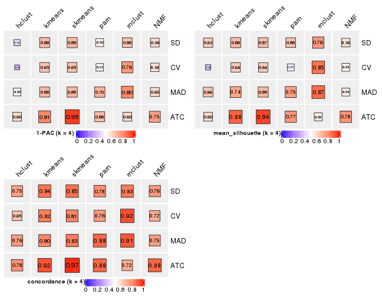</p>

</div>
<div id='tab-collect-stats-from-consensus-partition-list-4'>
<pre><code class="r">collect_stats(res_list, k = 5)
</code></pre>

<p></p>

</div>
<div id='tab-collect-stats-from-consensus-partition-list-5'>
<pre><code class="r">collect_stats(res_list, k = 6)
</code></pre>

<p></p>

</div>
</div>

### Partition from all methods


Collect partitions from all methods:


<script>
$( function() {
	$( '#tabs-collect-classes-from-consensus-partition-list' ).tabs();
} );
</script>
<div id='tabs-collect-classes-from-consensus-partition-list'>
<ul>
<li><a href='#tab-collect-classes-from-consensus-partition-list-1'>k = 2</a></li>
<li><a href='#tab-collect-classes-from-consensus-partition-list-2'>k = 3</a></li>
<li><a href='#tab-collect-classes-from-consensus-partition-list-3'>k = 4</a></li>
<li><a href='#tab-collect-classes-from-consensus-partition-list-4'>k = 5</a></li>
<li><a href='#tab-collect-classes-from-consensus-partition-list-5'>k = 6</a></li>
</ul>
<div id='tab-collect-classes-from-consensus-partition-list-1'>
<pre><code class="r">collect_classes(res_list, k = 2)
</code></pre>

<p></p>

</div>
<div id='tab-collect-classes-from-consensus-partition-list-2'>
<pre><code class="r">collect_classes(res_list, k = 3)
</code></pre>

<p></p>

</div>
<div id='tab-collect-classes-from-consensus-partition-list-3'>
<pre><code class="r">collect_classes(res_list, k = 4)
</code></pre>

<p></p>

</div>
<div id='tab-collect-classes-from-consensus-partition-list-4'>
<pre><code class="r">collect_classes(res_list, k = 5)
</code></pre>

<p></p>

</div>
<div id='tab-collect-classes-from-consensus-partition-list-5'>
<pre><code class="r">collect_classes(res_list, k = 6)
</code></pre>

<p></p>

</div>
</div>


### Top rows overlap


Overlap of top rows from different top-row methods:


<script>
$( function() {
	$( '#tabs-top-rows-overlap-by-euler' ).tabs();
} );
</script>
<div id='tabs-top-rows-overlap-by-euler'>
<ul>
<li><a href='#tab-top-rows-overlap-by-euler-1'>top_n = 1000</a></li>
<li><a href='#tab-top-rows-overlap-by-euler-2'>top_n = 2000</a></li>
<li><a href='#tab-top-rows-overlap-by-euler-3'>top_n = 3000</a></li>
<li><a href='#tab-top-rows-overlap-by-euler-4'>top_n = 4000</a></li>
<li><a href='#tab-top-rows-overlap-by-euler-5'>top_n = 5000</a></li>
</ul>
<div id='tab-top-rows-overlap-by-euler-1'>
<pre><code class="r">top_rows_overlap(res_list, top_n = 1000, method = &quot;euler&quot;)
</code></pre>

<p></p>

</div>
<div id='tab-top-rows-overlap-by-euler-2'>
<pre><code class="r">top_rows_overlap(res_list, top_n = 2000, method = &quot;euler&quot;)
</code></pre>

<p></p>

</div>
<div id='tab-top-rows-overlap-by-euler-3'>
<pre><code class="r">top_rows_overlap(res_list, top_n = 3000, method = &quot;euler&quot;)
</code></pre>

<p></p>

</div>
<div id='tab-top-rows-overlap-by-euler-4'>
<pre><code class="r">top_rows_overlap(res_list, top_n = 4000, method = &quot;euler&quot;)
</code></pre>

<p></p>

</div>
<div id='tab-top-rows-overlap-by-euler-5'>
<pre><code class="r">top_rows_overlap(res_list, top_n = 5000, method = &quot;euler&quot;)
</code></pre>

<p></p>

</div>
</div>

Also visualize the correspondance of rankings between different top-row methods:


<script>
$( function() {
	$( '#tabs-top-rows-overlap-by-correspondance' ).tabs();
} );
</script>
<div id='tabs-top-rows-overlap-by-correspondance'>
<ul>
<li><a href='#tab-top-rows-overlap-by-correspondance-1'>top_n = 1000</a></li>
<li><a href='#tab-top-rows-overlap-by-correspondance-2'>top_n = 2000</a></li>
<li><a href='#tab-top-rows-overlap-by-correspondance-3'>top_n = 3000</a></li>
<li><a href='#tab-top-rows-overlap-by-correspondance-4'>top_n = 4000</a></li>
<li><a href='#tab-top-rows-overlap-by-correspondance-5'>top_n = 5000</a></li>
</ul>
<div id='tab-top-rows-overlap-by-correspondance-1'>
<pre><code class="r">top_rows_overlap(res_list, top_n = 1000, method = &quot;correspondance&quot;)
</code></pre>

<p></p>

</div>
<div id='tab-top-rows-overlap-by-correspondance-2'>
<pre><code class="r">top_rows_overlap(res_list, top_n = 2000, method = &quot;correspondance&quot;)
</code></pre>

<p></p>

</div>
<div id='tab-top-rows-overlap-by-correspondance-3'>
<pre><code class="r">top_rows_overlap(res_list, top_n = 3000, method = &quot;correspondance&quot;)
</code></pre>

<p></p>

</div>
<div id='tab-top-rows-overlap-by-correspondance-4'>
<pre><code class="r">top_rows_overlap(res_list, top_n = 4000, method = &quot;correspondance&quot;)
</code></pre>

<p></p>

</div>
<div id='tab-top-rows-overlap-by-correspondance-5'>
<pre><code class="r">top_rows_overlap(res_list, top_n = 5000, method = &quot;correspondance&quot;)
</code></pre>

<p></p>

</div>
</div>


Heatmaps of the top rows:


<script>
$( function() {
	$( '#tabs-top-rows-heatmap' ).tabs();
} );
</script>
<div id='tabs-top-rows-heatmap'>
<ul>
<li><a href='#tab-top-rows-heatmap-1'>top_n = 1000</a></li>
<li><a href='#tab-top-rows-heatmap-2'>top_n = 2000</a></li>
<li><a href='#tab-top-rows-heatmap-3'>top_n = 3000</a></li>
<li><a href='#tab-top-rows-heatmap-4'>top_n = 4000</a></li>
<li><a href='#tab-top-rows-heatmap-5'>top_n = 5000</a></li>
</ul>
<div id='tab-top-rows-heatmap-1'>
<pre><code class="r">top_rows_heatmap(res_list, top_n = 1000)
</code></pre>

<p></p>

</div>
<div id='tab-top-rows-heatmap-2'>
<pre><code class="r">top_rows_heatmap(res_list, top_n = 2000)
</code></pre>

<p></p>

</div>
<div id='tab-top-rows-heatmap-3'>
<pre><code class="r">top_rows_heatmap(res_list, top_n = 3000)
</code></pre>

<p></p>

</div>
<div id='tab-top-rows-heatmap-4'>
<pre><code class="r">top_rows_heatmap(res_list, top_n = 4000)
</code></pre>

<p></p>

</div>
<div id='tab-top-rows-heatmap-5'>
<pre><code class="r">top_rows_heatmap(res_list, top_n = 5000)
</code></pre>

<p></p>

</div>
</div>


### Test to known annotations


Test correlation between subgroups and known annotations. If the known
annotation is numeric, one-way ANOVA test is applied, and if the known
annotation is discrete, chi-squared contingency table test is applied.


<script>
$( function() {
	$( '#tabs-test-to-known-factors-from-consensus-partition-list' ).tabs();
} );
</script>
<div id='tabs-test-to-known-factors-from-consensus-partition-list'>
<ul>
<li><a href='#tab-test-to-known-factors-from-consensus-partition-list-1'>k = 2</a></li>
<li><a href='#tab-test-to-known-factors-from-consensus-partition-list-2'>k = 3</a></li>
<li><a href='#tab-test-to-known-factors-from-consensus-partition-list-3'>k = 4</a></li>
<li><a href='#tab-test-to-known-factors-from-consensus-partition-list-4'>k = 5</a></li>
<li><a href='#tab-test-to-known-factors-from-consensus-partition-list-5'>k = 6</a></li>
</ul>
<div id='tab-test-to-known-factors-from-consensus-partition-list-1'>
<pre><code class="r">test_to_known_factors(res_list, k = 2)
</code></pre>

<pre><code>#&gt;               n disease.state(p) k
#&gt; SD:NMF      114         7.01e-09 2
#&gt; CV:NMF      114         4.29e-09 2
#&gt; MAD:NMF     114         2.75e-09 2
#&gt; ATC:NMF     117         5.52e-10 2
#&gt; SD:skmeans  117         5.29e-10 2
#&gt; CV:skmeans  117         5.29e-10 2
#&gt; MAD:skmeans 119         2.79e-10 2
#&gt; ATC:skmeans 119         5.01e-10 2
#&gt; SD:mclust   117         9.38e-12 2
#&gt; CV:mclust   119         4.04e-11 2
#&gt; MAD:mclust  118         1.49e-11 2
#&gt; ATC:mclust  104         2.27e-10 2
#&gt; SD:kmeans   111         2.81e-09 2
#&gt; CV:kmeans   109         4.67e-09 2
#&gt; MAD:kmeans  117         4.14e-10 2
#&gt; ATC:kmeans  118         7.87e-10 2
#&gt; SD:pam      109         7.45e-10 2
#&gt; CV:pam      109         2.86e-09 2
#&gt; MAD:pam     116         1.04e-12 2
#&gt; ATC:pam     102         8.89e-11 2
#&gt; SD:hclust   111         1.28e-12 2
#&gt; CV:hclust    94         9.82e-10 2
#&gt; MAD:hclust   90         1.24e-11 2
#&gt; ATC:hclust  113         2.24e-12 2
</code></pre>

</div>
<div id='tab-test-to-known-factors-from-consensus-partition-list-2'>
<pre><code class="r">test_to_known_factors(res_list, k = 3)
</code></pre>

<pre><code>#&gt;               n disease.state(p) k
#&gt; SD:NMF      105         3.24e-13 3
#&gt; CV:NMF       97         2.32e-15 3
#&gt; MAD:NMF      99         8.65e-13 3
#&gt; ATC:NMF      96         9.72e-18 3
#&gt; SD:skmeans  112         3.67e-18 3
#&gt; CV:skmeans  113         1.79e-18 3
#&gt; MAD:skmeans 116         3.26e-19 3
#&gt; ATC:skmeans 116         1.48e-14 3
#&gt; SD:mclust   113         2.34e-19 3
#&gt; CV:mclust   115         8.21e-20 3
#&gt; MAD:mclust  113         9.63e-21 3
#&gt; ATC:mclust  113         5.88e-20 3
#&gt; SD:kmeans   100         5.05e-19 3
#&gt; CV:kmeans   107         6.87e-18 3
#&gt; MAD:kmeans  117         3.92e-19 3
#&gt; ATC:kmeans  116         1.04e-17 3
#&gt; SD:pam       77         2.51e-14 3
#&gt; CV:pam       57               NA 3
#&gt; MAD:pam     114         3.11e-21 3
#&gt; ATC:pam     116         1.04e-17 3
#&gt; SD:hclust   105         2.15e-18 3
#&gt; CV:hclust    53         1.54e-08 3
#&gt; MAD:hclust   90         1.40e-16 3
#&gt; ATC:hclust   99         1.15e-09 3
</code></pre>

</div>
<div id='tab-test-to-known-factors-from-consensus-partition-list-3'>
<pre><code class="r">test_to_known_factors(res_list, k = 4)
</code></pre>

<pre><code>#&gt;               n disease.state(p) k
#&gt; SD:NMF       77         8.69e-16 4
#&gt; CV:NMF       68         1.18e-08 4
#&gt; MAD:NMF      77         2.66e-14 4
#&gt; ATC:NMF     108         5.11e-22 4
#&gt; SD:skmeans   95         4.54e-22 4
#&gt; CV:skmeans   96         1.17e-19 4
#&gt; MAD:skmeans 100         5.17e-21 4
#&gt; ATC:skmeans 116         6.80e-17 4
#&gt; SD:mclust   112         1.08e-27 4
#&gt; CV:mclust   112         9.16e-29 4
#&gt; MAD:mclust  116         9.09e-21 4
#&gt; ATC:mclust   90         6.90e-19 4
#&gt; SD:kmeans   100         1.50e-22 4
#&gt; CV:kmeans    92         4.33e-26 4
#&gt; MAD:kmeans  109         2.52e-25 4
#&gt; ATC:kmeans  116         3.14e-21 4
#&gt; SD:pam      100         8.14e-25 4
#&gt; CV:pam       53         1.39e-11 4
#&gt; MAD:pam     103         2.60e-23 4
#&gt; ATC:pam     104         2.33e-18 4
#&gt; SD:hclust   101         9.48e-19 4
#&gt; CV:hclust    54         6.64e-14 4
#&gt; MAD:hclust  103         1.13e-27 4
#&gt; ATC:hclust   78         3.98e-17 4
</code></pre>

</div>
<div id='tab-test-to-known-factors-from-consensus-partition-list-4'>
<pre><code class="r">test_to_known_factors(res_list, k = 5)
</code></pre>

<pre><code>#&gt;               n disease.state(p) k
#&gt; SD:NMF       74         2.15e-16 5
#&gt; CV:NMF       78         3.29e-24 5
#&gt; MAD:NMF      69         1.15e-15 5
#&gt; ATC:NMF      75         5.24e-18 5
#&gt; SD:skmeans   98         7.05e-30 5
#&gt; CV:skmeans   93         6.15e-26 5
#&gt; MAD:skmeans  95         1.65e-24 5
#&gt; ATC:skmeans 117         3.50e-24 5
#&gt; SD:mclust    79         1.93e-26 5
#&gt; CV:mclust    81         4.06e-20 5
#&gt; MAD:mclust   92         1.92e-27 5
#&gt; ATC:mclust  108         2.60e-28 5
#&gt; SD:kmeans    80         1.19e-20 5
#&gt; CV:kmeans    92         1.39e-25 5
#&gt; MAD:kmeans  102         1.80e-25 5
#&gt; ATC:kmeans  102         1.72e-21 5
#&gt; SD:pam       72         5.14e-29 5
#&gt; CV:pam       71         5.82e-17 5
#&gt; MAD:pam      94         9.48e-27 5
#&gt; ATC:pam     106         1.98e-23 5
#&gt; SD:hclust    80         8.86e-27 5
#&gt; CV:hclust    58         6.84e-21 5
#&gt; MAD:hclust  104         4.61e-29 5
#&gt; ATC:hclust   97         1.02e-20 5
</code></pre>

</div>
<div id='tab-test-to-known-factors-from-consensus-partition-list-5'>
<pre><code class="r">test_to_known_factors(res_list, k = 6)
</code></pre>

<pre><code>#&gt;               n disease.state(p) k
#&gt; SD:NMF       97         4.04e-31 6
#&gt; CV:NMF       91         7.84e-30 6
#&gt; MAD:NMF      88         5.75e-29 6
#&gt; ATC:NMF      65         6.63e-13 6
#&gt; SD:skmeans  103         1.04e-33 6
#&gt; CV:skmeans   98         7.70e-33 6
#&gt; MAD:skmeans 100         5.86e-33 6
#&gt; ATC:skmeans 109         9.40e-26 6
#&gt; SD:mclust    91         4.12e-33 6
#&gt; CV:mclust    91         2.14e-29 6
#&gt; MAD:mclust   82         4.30e-31 6
#&gt; ATC:mclust   98         5.69e-32 6
#&gt; SD:kmeans    94         5.79e-25 6
#&gt; CV:kmeans    83         4.51e-22 6
#&gt; MAD:kmeans   95         3.19e-42 6
#&gt; ATC:kmeans   55         5.76e-12 6
#&gt; SD:pam       90         1.24e-29 6
#&gt; CV:pam       90         1.78e-28 6
#&gt; MAD:pam     105         1.45e-34 6
#&gt; ATC:pam     110         1.58e-27 6
#&gt; SD:hclust    85         3.11e-24 6
#&gt; CV:hclust    75         2.37e-18 6
#&gt; MAD:hclust  107         3.50e-27 6
#&gt; ATC:hclust   96         2.03e-18 6
</code></pre>

</div>
</div>


 
## Results for each method


---------------------------------------------------


### SD:hclust


The object with results only for a single top-value method and a single partition method 
can be extracted as:

```r
res = res_list["SD", "hclust"]
# you can also extract it by
# res = res_list["SD:hclust"]
```

A summary of `res` and all the functions that can be applied to it:

```r
res
```

```
#> A 'ConsensusPartition' object with k = 2, 3, 4, 5, 6.
#>   On a matrix with 21512 rows and 119 columns.
#>   Top rows (1000, 2000, 3000, 4000, 5000) are extracted by 'SD' method.
#>   Subgroups are detected by 'hclust' method.
#>   Performed in total 1250 partitions by row resampling.
#>   Best k for subgroups seems to be 2.
#> 
#> Following methods can be applied to this 'ConsensusPartition' object:
#>  [1] "cola_report"             "collect_classes"         "collect_plots"          
#>  [4] "collect_stats"           "colnames"                "compare_signatures"     
#>  [7] "consensus_heatmap"       "dimension_reduction"     "functional_enrichment"  
#> [10] "get_anno_col"            "get_anno"                "get_classes"            
#> [13] "get_consensus"           "get_matrix"              "get_membership"         
#> [16] "get_param"               "get_signatures"          "get_stats"              
#> [19] "is_best_k"               "is_stable_k"             "membership_heatmap"     
#> [22] "ncol"                    "nrow"                    "plot_ecdf"              
#> [25] "rownames"                "select_partition_number" "show"                   
#> [28] "suggest_best_k"          "test_to_known_factors"
```

`collect_plots()` function collects all the plots made from `res` for all `k` (number of partitions)
into one single page to provide an easy and fast comparison between different `k`.

```r
collect_plots(res)
```


The plots are:

- The first row: a plot of the ECDF (empirical cumulative distribution
  function) curves of the consensus matrix for each `k` and the heatmap of
  predicted classes for each `k`.
- The second row: heatmaps of the consensus matrix for each `k`.
- The third row: heatmaps of the membership matrix for each `k`.
- The fouth row: heatmaps of the signatures for each `k`.

All the plots in panels can be made by individual functions and they are
plotted later in this section.

`select_partition_number()` produces several plots showing different
statistics for choosing "optimized" `k`. There are following statistics:

- ECDF curves of the consensus matrix for each `k`;
- 1-PAC. [The PAC
  score](https://en.wikipedia.org/wiki/Consensus_clustering#Over-interpretation_potential_of_consensus_clustering)
  measures the proportion of the ambiguous subgrouping.
- Mean silhouette score.
- Concordance. The mean probability of fiting the consensus class ids in all
  partitions.
- Area increased. Denote $A_k$ as the area under the ECDF curve for current
  `k`, the area increased is defined as $A_k - A_{k-1}$.
- Rand index. The percent of pairs of samples that are both in a same cluster
  or both are not in a same cluster in the partition of k and k-1.
- Jaccard index. The ratio of pairs of samples are both in a same cluster in
  the partition of k and k-1 and the pairs of samples are both in a same
  cluster in the partition k or k-1.

The detailed explanations of these statistics can be found in [the _cola_
vignette](http://bioconductor.org/packages/devel/bioc/vignettes/cola/inst/doc/cola.html#toc_13).

Generally speaking, lower PAC score, higher mean silhouette score or higher
concordance corresponds to better partition. Rand index and Jaccard index
measure how similar the current partition is compared to partition with `k-1`.
If they are too similar, we won't accept `k` is better than `k-1`.

```r
select_partition_number(res)
```


The numeric values for all these statistics can be obtained by `get_stats()`.

```r
get_stats(res)
```

```
#>   k 1-PAC mean_silhouette concordance area_increased  Rand Jaccard
#> 2 2 0.321           0.776       0.861         0.4436 0.504   0.504
#> 3 3 0.381           0.676       0.797         0.3356 0.909   0.819
#> 4 4 0.417           0.633       0.746         0.0870 0.997   0.993
#> 5 5 0.450           0.535       0.685         0.0521 0.831   0.608
#> 6 6 0.482           0.522       0.680         0.0337 0.847   0.560
```

`suggest_best_k()` suggests the best $k$ based on these statistics. The rules are as follows:

- All $k$ with Jaccard index larger than 0.95 are removed because increasing
  $k$ does not provide enough extra information. If all $k$ are removed, it is
  marked as no subgroup is detected.
- For all $k$ with 1-PAC score larger than 0.9, the maximal $k$ is taken as
  the best $k$, and other $k$ are marked as optional $k$.
- If it does not fit the second rule. The $k$ with the maximal vote of the
  highest 1-PAC score, highest mean silhouette, and highest concordance is
  taken as the best $k$.

```r
suggest_best_k(res)
```

```
#> [1] 2
```


Following shows the table of the partitions (You need to click the **show/hide
code output** link to see it). The membership matrix (columns with name `p*`)
is inferred by
[`clue::cl_consensus()`](https://www.rdocumentation.org/link/cl_consensus?package=clue)
function with the `SE` method. Basically the value in the membership matrix
represents the probability to belong to a certain group. The finall class
label for an item is determined with the group with highest probability it
belongs to.

In `get_classes()` function, the entropy is calculated from the membership
matrix and the silhouette score is calculated from the consensus matrix.


<script>
$( function() {
	$( '#tabs-SD-hclust-get-classes' ).tabs();
} );
</script>
<div id='tabs-SD-hclust-get-classes'>
<ul>
<li><a href='#tab-SD-hclust-get-classes-1'>k = 2</a></li>
<li><a href='#tab-SD-hclust-get-classes-2'>k = 3</a></li>
<li><a href='#tab-SD-hclust-get-classes-3'>k = 4</a></li>
<li><a href='#tab-SD-hclust-get-classes-4'>k = 5</a></li>
<li><a href='#tab-SD-hclust-get-classes-5'>k = 6</a></li>
</ul>

<div id='tab-SD-hclust-get-classes-1'>
<p><a id='tab-SD-hclust-get-classes-1-a' style='color:#0366d6' href='#'>show/hide code output</a></p>
<pre><code class="r">cbind(get_classes(res, k = 2), get_membership(res, k = 2))
</code></pre>

<pre><code>#&gt;           class entropy silhouette    p1    p2
#&gt; GSM120719     1  0.2603      0.821 0.956 0.044
#&gt; GSM120720     1  0.2603      0.821 0.956 0.044
#&gt; GSM120765     2  0.2778      0.864 0.048 0.952
#&gt; GSM120767     2  0.3733      0.872 0.072 0.928
#&gt; GSM120784     2  0.3274      0.868 0.060 0.940
#&gt; GSM121400     1  0.7745      0.748 0.772 0.228
#&gt; GSM121401     1  0.4161      0.813 0.916 0.084
#&gt; GSM121402     2  0.1843      0.853 0.028 0.972
#&gt; GSM121403     1  0.7745      0.748 0.772 0.228
#&gt; GSM121404     2  0.5408      0.859 0.124 0.876
#&gt; GSM121405     1  0.4161      0.813 0.916 0.084
#&gt; GSM121406     2  0.0000      0.837 0.000 1.000
#&gt; GSM121408     2  0.1414      0.850 0.020 0.980
#&gt; GSM121409     1  0.7745      0.748 0.772 0.228
#&gt; GSM121410     1  0.7745      0.748 0.772 0.228
#&gt; GSM121412     2  0.0000      0.837 0.000 1.000
#&gt; GSM121413     2  0.0000      0.837 0.000 1.000
#&gt; GSM121414     2  0.0000      0.837 0.000 1.000
#&gt; GSM121415     2  0.1414      0.850 0.020 0.980
#&gt; GSM121416     2  0.1414      0.850 0.020 0.980
#&gt; GSM120591     1  0.2603      0.821 0.956 0.044
#&gt; GSM120594     1  0.2603      0.821 0.956 0.044
#&gt; GSM120718     1  0.2603      0.821 0.956 0.044
#&gt; GSM121205     1  0.0000      0.811 1.000 0.000
#&gt; GSM121206     1  0.0000      0.811 1.000 0.000
#&gt; GSM121207     1  0.0000      0.811 1.000 0.000
#&gt; GSM121208     1  0.0000      0.811 1.000 0.000
#&gt; GSM121209     1  0.0000      0.811 1.000 0.000
#&gt; GSM121210     1  0.0000      0.811 1.000 0.000
#&gt; GSM121211     1  0.0000      0.811 1.000 0.000
#&gt; GSM121212     1  0.0000      0.811 1.000 0.000
#&gt; GSM121213     1  0.0000      0.811 1.000 0.000
#&gt; GSM121214     1  0.0000      0.811 1.000 0.000
#&gt; GSM121215     1  0.0000      0.811 1.000 0.000
#&gt; GSM121216     1  0.0000      0.811 1.000 0.000
#&gt; GSM121217     1  0.0000      0.811 1.000 0.000
#&gt; GSM121218     1  0.0000      0.811 1.000 0.000
#&gt; GSM121234     1  0.0000      0.811 1.000 0.000
#&gt; GSM121243     1  0.0000      0.811 1.000 0.000
#&gt; GSM121245     1  0.0000      0.811 1.000 0.000
#&gt; GSM121246     1  0.0672      0.814 0.992 0.008
#&gt; GSM121247     1  0.0376      0.812 0.996 0.004
#&gt; GSM121248     1  0.0000      0.811 1.000 0.000
#&gt; GSM120744     1  0.8661      0.698 0.712 0.288
#&gt; GSM120745     1  0.8661      0.698 0.712 0.288
#&gt; GSM120746     1  0.8661      0.698 0.712 0.288
#&gt; GSM120747     1  0.8661      0.698 0.712 0.288
#&gt; GSM120748     1  0.8661      0.698 0.712 0.288
#&gt; GSM120749     1  0.8661      0.698 0.712 0.288
#&gt; GSM120750     1  0.8661      0.698 0.712 0.288
#&gt; GSM120751     1  0.8661      0.698 0.712 0.288
#&gt; GSM120752     1  0.8661      0.698 0.712 0.288
#&gt; GSM121336     2  0.0000      0.837 0.000 1.000
#&gt; GSM121339     2  0.9427      0.487 0.360 0.640
#&gt; GSM121349     2  0.0000      0.837 0.000 1.000
#&gt; GSM121355     2  0.0000      0.837 0.000 1.000
#&gt; GSM120757     1  0.8909      0.665 0.692 0.308
#&gt; GSM120766     1  0.9000      0.652 0.684 0.316
#&gt; GSM120770     2  0.9608      0.321 0.384 0.616
#&gt; GSM120779     1  0.8499      0.702 0.724 0.276
#&gt; GSM120780     1  0.9000      0.652 0.684 0.316
#&gt; GSM121102     1  0.9850      0.427 0.572 0.428
#&gt; GSM121203     1  0.9732      0.487 0.596 0.404
#&gt; GSM121204     1  0.6343      0.783 0.840 0.160
#&gt; GSM121330     1  0.2236      0.821 0.964 0.036
#&gt; GSM121335     1  0.2236      0.821 0.964 0.036
#&gt; GSM121337     1  0.9896      0.368 0.560 0.440
#&gt; GSM121338     1  0.9909      0.362 0.556 0.444
#&gt; GSM121341     1  0.2236      0.821 0.964 0.036
#&gt; GSM121342     1  0.2236      0.821 0.964 0.036
#&gt; GSM121343     1  0.9909      0.362 0.556 0.444
#&gt; GSM121344     1  0.2236      0.821 0.964 0.036
#&gt; GSM121346     1  0.2236      0.821 0.964 0.036
#&gt; GSM121347     1  0.9922      0.351 0.552 0.448
#&gt; GSM121348     1  0.9044      0.645 0.680 0.320
#&gt; GSM121350     1  0.2236      0.821 0.964 0.036
#&gt; GSM121352     1  0.2236      0.821 0.964 0.036
#&gt; GSM121354     1  0.2236      0.821 0.964 0.036
#&gt; GSM120753     2  0.5408      0.874 0.124 0.876
#&gt; GSM120761     2  0.5294      0.874 0.120 0.880
#&gt; GSM120768     2  0.5629      0.872 0.132 0.868
#&gt; GSM120781     2  0.4690      0.875 0.100 0.900
#&gt; GSM120788     2  0.8267      0.765 0.260 0.740
#&gt; GSM120760     2  0.7528      0.822 0.216 0.784
#&gt; GSM120763     2  0.7219      0.836 0.200 0.800
#&gt; GSM120764     2  0.7745      0.808 0.228 0.772
#&gt; GSM120777     2  0.8861      0.681 0.304 0.696
#&gt; GSM120786     2  0.7602      0.817 0.220 0.780
#&gt; GSM121329     1  0.4939      0.806 0.892 0.108
#&gt; GSM121331     1  0.8555      0.698 0.720 0.280
#&gt; GSM121333     1  0.8555      0.698 0.720 0.280
#&gt; GSM121345     1  0.8555      0.698 0.720 0.280
#&gt; GSM121356     1  0.8555      0.698 0.720 0.280
#&gt; GSM120754     2  0.7299      0.829 0.204 0.796
#&gt; GSM120759     2  0.0000      0.837 0.000 1.000
#&gt; GSM120762     2  0.4161      0.874 0.084 0.916
#&gt; GSM120775     2  0.7299      0.832 0.204 0.796
#&gt; GSM120776     1  0.8016      0.729 0.756 0.244
#&gt; GSM120782     2  0.7056      0.840 0.192 0.808
#&gt; GSM120789     2  0.2948      0.864 0.052 0.948
#&gt; GSM120790     2  0.0000      0.837 0.000 1.000
#&gt; GSM120791     2  0.6887      0.849 0.184 0.816
#&gt; GSM120755     2  0.4161      0.874 0.084 0.916
#&gt; GSM120756     2  0.8016      0.788 0.244 0.756
#&gt; GSM120769     2  0.4022      0.873 0.080 0.920
#&gt; GSM120778     2  0.6531      0.859 0.168 0.832
#&gt; GSM120792     2  0.6712      0.854 0.176 0.824
#&gt; GSM121332     2  0.4161      0.874 0.084 0.916
#&gt; GSM121334     2  0.6048      0.867 0.148 0.852
#&gt; GSM121340     2  0.7602      0.820 0.220 0.780
#&gt; GSM121351     2  0.0000      0.837 0.000 1.000
#&gt; GSM121353     2  0.7883      0.800 0.236 0.764
#&gt; GSM120758     2  0.5629      0.872 0.132 0.868
#&gt; GSM120771     2  0.5059      0.875 0.112 0.888
#&gt; GSM120772     2  0.5737      0.871 0.136 0.864
#&gt; GSM120773     2  0.7602      0.816 0.220 0.780
#&gt; GSM120774     2  0.6623      0.857 0.172 0.828
#&gt; GSM120783     2  0.7602      0.816 0.220 0.780
#&gt; GSM120787     2  0.6438      0.862 0.164 0.836
</code></pre>

<script>
$('#tab-SD-hclust-get-classes-1-a').parent().next().next().hide();
$('#tab-SD-hclust-get-classes-1-a').click(function(){
  $('#tab-SD-hclust-get-classes-1-a').parent().next().next().toggle();
  return(false);
});
</script>
</div>

<div id='tab-SD-hclust-get-classes-2'>
<p><a id='tab-SD-hclust-get-classes-2-a' style='color:#0366d6' href='#'>show/hide code output</a></p>
<pre><code class="r">cbind(get_classes(res, k = 3), get_membership(res, k = 3))
</code></pre>

<pre><code>#&gt;           class entropy silhouette    p1    p2    p3
#&gt; GSM120719     1  0.3349     0.7760 0.888 0.108 0.004
#&gt; GSM120720     1  0.3349     0.7760 0.888 0.108 0.004
#&gt; GSM120765     3  0.5785     0.5247 0.000 0.332 0.668
#&gt; GSM120767     3  0.6302     0.0862 0.000 0.480 0.520
#&gt; GSM120784     3  0.6126     0.3572 0.000 0.400 0.600
#&gt; GSM121400     1  0.7713     0.6894 0.656 0.248 0.096
#&gt; GSM121401     1  0.4891     0.7676 0.836 0.124 0.040
#&gt; GSM121402     3  0.2878     0.7694 0.000 0.096 0.904
#&gt; GSM121403     1  0.7713     0.6894 0.656 0.248 0.096
#&gt; GSM121404     3  0.6341     0.5546 0.032 0.252 0.716
#&gt; GSM121405     1  0.4891     0.7676 0.836 0.124 0.040
#&gt; GSM121406     3  0.1289     0.7864 0.000 0.032 0.968
#&gt; GSM121408     3  0.4750     0.6987 0.000 0.216 0.784
#&gt; GSM121409     1  0.7713     0.6894 0.656 0.248 0.096
#&gt; GSM121410     1  0.7713     0.6894 0.656 0.248 0.096
#&gt; GSM121412     3  0.0747     0.7859 0.000 0.016 0.984
#&gt; GSM121413     3  0.0747     0.7859 0.000 0.016 0.984
#&gt; GSM121414     3  0.0747     0.7859 0.000 0.016 0.984
#&gt; GSM121415     3  0.4121     0.7406 0.000 0.168 0.832
#&gt; GSM121416     3  0.4399     0.7321 0.000 0.188 0.812
#&gt; GSM120591     1  0.3349     0.7760 0.888 0.108 0.004
#&gt; GSM120594     1  0.3349     0.7760 0.888 0.108 0.004
#&gt; GSM120718     1  0.3349     0.7760 0.888 0.108 0.004
#&gt; GSM121205     1  0.0000     0.7573 1.000 0.000 0.000
#&gt; GSM121206     1  0.0000     0.7573 1.000 0.000 0.000
#&gt; GSM121207     1  0.0000     0.7573 1.000 0.000 0.000
#&gt; GSM121208     1  0.0000     0.7573 1.000 0.000 0.000
#&gt; GSM121209     1  0.0000     0.7573 1.000 0.000 0.000
#&gt; GSM121210     1  0.0000     0.7573 1.000 0.000 0.000
#&gt; GSM121211     1  0.0000     0.7573 1.000 0.000 0.000
#&gt; GSM121212     1  0.0000     0.7573 1.000 0.000 0.000
#&gt; GSM121213     1  0.0000     0.7573 1.000 0.000 0.000
#&gt; GSM121214     1  0.0000     0.7573 1.000 0.000 0.000
#&gt; GSM121215     1  0.0000     0.7573 1.000 0.000 0.000
#&gt; GSM121216     1  0.0000     0.7573 1.000 0.000 0.000
#&gt; GSM121217     1  0.0000     0.7573 1.000 0.000 0.000
#&gt; GSM121218     1  0.0000     0.7573 1.000 0.000 0.000
#&gt; GSM121234     1  0.0000     0.7573 1.000 0.000 0.000
#&gt; GSM121243     1  0.0000     0.7573 1.000 0.000 0.000
#&gt; GSM121245     1  0.0000     0.7573 1.000 0.000 0.000
#&gt; GSM121246     1  0.0892     0.7626 0.980 0.020 0.000
#&gt; GSM121247     1  0.0237     0.7578 0.996 0.004 0.000
#&gt; GSM121248     1  0.0000     0.7573 1.000 0.000 0.000
#&gt; GSM120744     1  0.7787     0.6353 0.588 0.348 0.064
#&gt; GSM120745     1  0.7787     0.6353 0.588 0.348 0.064
#&gt; GSM120746     1  0.7787     0.6353 0.588 0.348 0.064
#&gt; GSM120747     1  0.7787     0.6353 0.588 0.348 0.064
#&gt; GSM120748     1  0.7787     0.6353 0.588 0.348 0.064
#&gt; GSM120749     1  0.7787     0.6353 0.588 0.348 0.064
#&gt; GSM120750     1  0.7787     0.6353 0.588 0.348 0.064
#&gt; GSM120751     1  0.7787     0.6353 0.588 0.348 0.064
#&gt; GSM120752     1  0.7787     0.6353 0.588 0.348 0.064
#&gt; GSM121336     3  0.0747     0.7859 0.000 0.016 0.984
#&gt; GSM121339     2  0.9818     0.1437 0.248 0.408 0.344
#&gt; GSM121349     3  0.0747     0.7859 0.000 0.016 0.984
#&gt; GSM121355     3  0.0747     0.7859 0.000 0.016 0.984
#&gt; GSM120757     1  0.7223     0.5803 0.548 0.424 0.028
#&gt; GSM120766     1  0.7337     0.5722 0.540 0.428 0.032
#&gt; GSM120770     2  0.9849     0.2125 0.300 0.420 0.280
#&gt; GSM120779     1  0.6675     0.6063 0.584 0.404 0.012
#&gt; GSM120780     1  0.7337     0.5722 0.540 0.428 0.032
#&gt; GSM121102     1  0.9514     0.4174 0.468 0.328 0.204
#&gt; GSM121203     1  0.9350     0.4725 0.488 0.328 0.184
#&gt; GSM121204     1  0.5763     0.7137 0.716 0.276 0.008
#&gt; GSM121330     1  0.2959     0.7758 0.900 0.100 0.000
#&gt; GSM121335     1  0.2878     0.7758 0.904 0.096 0.000
#&gt; GSM121337     1  0.9713     0.3581 0.444 0.316 0.240
#&gt; GSM121338     1  0.9722     0.3547 0.444 0.312 0.244
#&gt; GSM121341     1  0.2878     0.7758 0.904 0.096 0.000
#&gt; GSM121342     1  0.2959     0.7758 0.900 0.100 0.000
#&gt; GSM121343     1  0.9722     0.3547 0.444 0.312 0.244
#&gt; GSM121344     1  0.2878     0.7758 0.904 0.096 0.000
#&gt; GSM121346     1  0.2878     0.7758 0.904 0.096 0.000
#&gt; GSM121347     1  0.9690     0.3449 0.444 0.324 0.232
#&gt; GSM121348     1  0.7438     0.5587 0.536 0.428 0.036
#&gt; GSM121350     1  0.2878     0.7758 0.904 0.096 0.000
#&gt; GSM121352     1  0.2878     0.7758 0.904 0.096 0.000
#&gt; GSM121354     1  0.2878     0.7758 0.904 0.096 0.000
#&gt; GSM120753     2  0.4555     0.7214 0.000 0.800 0.200
#&gt; GSM120761     2  0.4062     0.7430 0.000 0.836 0.164
#&gt; GSM120768     2  0.4452     0.7268 0.000 0.808 0.192
#&gt; GSM120781     2  0.5650     0.5160 0.000 0.688 0.312
#&gt; GSM120788     2  0.2400     0.7625 0.064 0.932 0.004
#&gt; GSM120760     2  0.1453     0.7873 0.024 0.968 0.008
#&gt; GSM120763     2  0.1491     0.7904 0.016 0.968 0.016
#&gt; GSM120764     2  0.1289     0.7816 0.032 0.968 0.000
#&gt; GSM120777     2  0.3500     0.7078 0.116 0.880 0.004
#&gt; GSM120786     2  0.1585     0.7861 0.028 0.964 0.008
#&gt; GSM121329     1  0.4682     0.7576 0.804 0.192 0.004
#&gt; GSM121331     1  0.6688     0.6014 0.580 0.408 0.012
#&gt; GSM121333     1  0.6688     0.6014 0.580 0.408 0.012
#&gt; GSM121345     1  0.6701     0.5943 0.576 0.412 0.012
#&gt; GSM121356     1  0.6688     0.6014 0.580 0.408 0.012
#&gt; GSM120754     2  0.4479     0.7709 0.044 0.860 0.096
#&gt; GSM120759     3  0.2878     0.7643 0.000 0.096 0.904
#&gt; GSM120762     2  0.5882     0.4602 0.000 0.652 0.348
#&gt; GSM120775     2  0.3921     0.7812 0.036 0.884 0.080
#&gt; GSM120776     1  0.6696     0.6517 0.632 0.348 0.020
#&gt; GSM120782     2  0.5497     0.7505 0.048 0.804 0.148
#&gt; GSM120789     3  0.5902     0.5881 0.004 0.316 0.680
#&gt; GSM120790     3  0.4974     0.6704 0.000 0.236 0.764
#&gt; GSM120791     2  0.2772     0.7898 0.004 0.916 0.080
#&gt; GSM120755     2  0.6192     0.2495 0.000 0.580 0.420
#&gt; GSM120756     2  0.1753     0.7749 0.048 0.952 0.000
#&gt; GSM120769     2  0.5905     0.4329 0.000 0.648 0.352
#&gt; GSM120778     2  0.2796     0.7843 0.000 0.908 0.092
#&gt; GSM120792     2  0.4540     0.7792 0.028 0.848 0.124
#&gt; GSM121332     3  0.6683     0.0496 0.008 0.492 0.500
#&gt; GSM121334     2  0.4121     0.7445 0.000 0.832 0.168
#&gt; GSM121340     2  0.1999     0.7839 0.036 0.952 0.012
#&gt; GSM121351     3  0.0892     0.7856 0.000 0.020 0.980
#&gt; GSM121353     2  0.2663     0.7805 0.044 0.932 0.024
#&gt; GSM120758     2  0.4452     0.7268 0.000 0.808 0.192
#&gt; GSM120771     2  0.4750     0.6918 0.000 0.784 0.216
#&gt; GSM120772     2  0.4702     0.7028 0.000 0.788 0.212
#&gt; GSM120773     2  0.1711     0.7856 0.032 0.960 0.008
#&gt; GSM120774     2  0.2955     0.7888 0.008 0.912 0.080
#&gt; GSM120783     2  0.1711     0.7856 0.032 0.960 0.008
#&gt; GSM120787     2  0.2860     0.7878 0.004 0.912 0.084
</code></pre>

<script>
$('#tab-SD-hclust-get-classes-2-a').parent().next().next().hide();
$('#tab-SD-hclust-get-classes-2-a').click(function(){
  $('#tab-SD-hclust-get-classes-2-a').parent().next().next().toggle();
  return(false);
});
</script>
</div>

<div id='tab-SD-hclust-get-classes-3'>
<p><a id='tab-SD-hclust-get-classes-3-a' style='color:#0366d6' href='#'>show/hide code output</a></p>
<pre><code class="r">cbind(get_classes(res, k = 4), get_membership(res, k = 4))
</code></pre>

<pre><code>#&gt;           class entropy silhouette    p1    p2    p3    p4
#&gt; GSM120719     1  0.2222     0.7655 0.924 0.000 0.016 0.060
#&gt; GSM120720     1  0.2222     0.7655 0.924 0.000 0.016 0.060
#&gt; GSM120765     2  0.5972     0.4724 0.000 0.640 0.068 0.292
#&gt; GSM120767     2  0.6834     0.0640 0.000 0.476 0.100 0.424
#&gt; GSM120784     2  0.6482     0.3576 0.000 0.564 0.084 0.352
#&gt; GSM121400     1  0.6934     0.7073 0.680 0.060 0.124 0.136
#&gt; GSM121401     1  0.3761     0.7586 0.868 0.020 0.068 0.044
#&gt; GSM121402     2  0.4371     0.5389 0.008 0.820 0.124 0.048
#&gt; GSM121403     1  0.6934     0.7073 0.680 0.060 0.124 0.136
#&gt; GSM121404     2  0.7141     0.3853 0.056 0.660 0.140 0.144
#&gt; GSM121405     1  0.3761     0.7586 0.868 0.020 0.068 0.044
#&gt; GSM121406     2  0.1452     0.6042 0.000 0.956 0.036 0.008
#&gt; GSM121408     2  0.5021     0.5441 0.000 0.756 0.064 0.180
#&gt; GSM121409     1  0.6934     0.7073 0.680 0.060 0.124 0.136
#&gt; GSM121410     1  0.6934     0.7073 0.680 0.060 0.124 0.136
#&gt; GSM121412     2  0.0469     0.5887 0.000 0.988 0.012 0.000
#&gt; GSM121413     2  0.0469     0.5887 0.000 0.988 0.012 0.000
#&gt; GSM121414     2  0.0469     0.5887 0.000 0.988 0.012 0.000
#&gt; GSM121415     2  0.4781     0.5842 0.004 0.796 0.088 0.112
#&gt; GSM121416     2  0.5121     0.5761 0.004 0.772 0.096 0.128
#&gt; GSM120591     1  0.2222     0.7655 0.924 0.000 0.016 0.060
#&gt; GSM120594     1  0.2222     0.7655 0.924 0.000 0.016 0.060
#&gt; GSM120718     1  0.2222     0.7655 0.924 0.000 0.016 0.060
#&gt; GSM121205     1  0.2216     0.7251 0.908 0.000 0.092 0.000
#&gt; GSM121206     1  0.2216     0.7251 0.908 0.000 0.092 0.000
#&gt; GSM121207     1  0.2216     0.7251 0.908 0.000 0.092 0.000
#&gt; GSM121208     1  0.2216     0.7251 0.908 0.000 0.092 0.000
#&gt; GSM121209     1  0.2216     0.7251 0.908 0.000 0.092 0.000
#&gt; GSM121210     1  0.2216     0.7251 0.908 0.000 0.092 0.000
#&gt; GSM121211     1  0.2216     0.7251 0.908 0.000 0.092 0.000
#&gt; GSM121212     1  0.2216     0.7251 0.908 0.000 0.092 0.000
#&gt; GSM121213     1  0.2216     0.7251 0.908 0.000 0.092 0.000
#&gt; GSM121214     1  0.2216     0.7251 0.908 0.000 0.092 0.000
#&gt; GSM121215     1  0.2216     0.7251 0.908 0.000 0.092 0.000
#&gt; GSM121216     1  0.2216     0.7251 0.908 0.000 0.092 0.000
#&gt; GSM121217     1  0.2216     0.7251 0.908 0.000 0.092 0.000
#&gt; GSM121218     1  0.2216     0.7251 0.908 0.000 0.092 0.000
#&gt; GSM121234     1  0.2216     0.7251 0.908 0.000 0.092 0.000
#&gt; GSM121243     1  0.2216     0.7251 0.908 0.000 0.092 0.000
#&gt; GSM121245     1  0.2216     0.7251 0.908 0.000 0.092 0.000
#&gt; GSM121246     1  0.2125     0.7343 0.920 0.000 0.076 0.004
#&gt; GSM121247     1  0.2401     0.7256 0.904 0.000 0.092 0.004
#&gt; GSM121248     1  0.2216     0.7251 0.908 0.000 0.092 0.000
#&gt; GSM120744     1  0.7216     0.6725 0.612 0.020 0.168 0.200
#&gt; GSM120745     1  0.7216     0.6725 0.612 0.020 0.168 0.200
#&gt; GSM120746     1  0.7216     0.6725 0.612 0.020 0.168 0.200
#&gt; GSM120747     1  0.7216     0.6725 0.612 0.020 0.168 0.200
#&gt; GSM120748     1  0.7216     0.6725 0.612 0.020 0.168 0.200
#&gt; GSM120749     1  0.7216     0.6725 0.612 0.020 0.168 0.200
#&gt; GSM120750     1  0.7216     0.6725 0.612 0.020 0.168 0.200
#&gt; GSM120751     1  0.7216     0.6725 0.612 0.020 0.168 0.200
#&gt; GSM120752     1  0.7216     0.6725 0.612 0.020 0.168 0.200
#&gt; GSM121336     2  0.0921     0.5942 0.000 0.972 0.028 0.000
#&gt; GSM121339     4  0.9608    -0.0136 0.268 0.300 0.120 0.312
#&gt; GSM121349     2  0.0921     0.5942 0.000 0.972 0.028 0.000
#&gt; GSM121355     2  0.0921     0.5942 0.000 0.972 0.028 0.000
#&gt; GSM120757     1  0.6897     0.6201 0.572 0.000 0.144 0.284
#&gt; GSM120766     1  0.7146     0.6160 0.560 0.004 0.152 0.284
#&gt; GSM120770     4  0.9619     0.0596 0.308 0.240 0.128 0.324
#&gt; GSM120779     1  0.6661     0.6368 0.604 0.000 0.132 0.264
#&gt; GSM120780     1  0.7146     0.6160 0.560 0.004 0.152 0.284
#&gt; GSM121102     1  0.9102     0.5025 0.476 0.156 0.156 0.212
#&gt; GSM121203     1  0.8885     0.5465 0.504 0.136 0.160 0.200
#&gt; GSM121204     1  0.5226     0.7241 0.744 0.000 0.076 0.180
#&gt; GSM121330     1  0.2032     0.7619 0.936 0.000 0.028 0.036
#&gt; GSM121335     1  0.1936     0.7613 0.940 0.000 0.028 0.032
#&gt; GSM121337     1  0.9198     0.4547 0.464 0.200 0.148 0.188
#&gt; GSM121338     1  0.9228     0.4527 0.460 0.204 0.152 0.184
#&gt; GSM121341     1  0.1936     0.7613 0.940 0.000 0.028 0.032
#&gt; GSM121342     1  0.2032     0.7619 0.936 0.000 0.028 0.036
#&gt; GSM121343     1  0.9228     0.4527 0.460 0.204 0.152 0.184
#&gt; GSM121344     1  0.1936     0.7613 0.940 0.000 0.028 0.032
#&gt; GSM121346     1  0.1936     0.7613 0.940 0.000 0.028 0.032
#&gt; GSM121347     1  0.9239     0.4393 0.456 0.196 0.144 0.204
#&gt; GSM121348     1  0.7311     0.6029 0.556 0.008 0.160 0.276
#&gt; GSM121350     1  0.1936     0.7613 0.940 0.000 0.028 0.032
#&gt; GSM121352     1  0.1936     0.7613 0.940 0.000 0.028 0.032
#&gt; GSM121354     1  0.1936     0.7613 0.940 0.000 0.028 0.032
#&gt; GSM120753     4  0.5007     0.6801 0.000 0.172 0.068 0.760
#&gt; GSM120761     4  0.4534     0.7072 0.000 0.132 0.068 0.800
#&gt; GSM120768     4  0.5029     0.6900 0.004 0.164 0.064 0.768
#&gt; GSM120781     4  0.6293     0.4959 0.000 0.276 0.096 0.628
#&gt; GSM120788     4  0.3392     0.7078 0.072 0.000 0.056 0.872
#&gt; GSM120760     4  0.2669     0.7443 0.032 0.004 0.052 0.912
#&gt; GSM120763     4  0.2966     0.7496 0.020 0.008 0.076 0.896
#&gt; GSM120764     4  0.2319     0.7361 0.036 0.000 0.040 0.924
#&gt; GSM120777     4  0.4356     0.6348 0.124 0.000 0.064 0.812
#&gt; GSM120786     4  0.2131     0.7420 0.032 0.000 0.036 0.932
#&gt; GSM121329     1  0.4150     0.7564 0.824 0.000 0.056 0.120
#&gt; GSM121331     1  0.6685     0.6325 0.600 0.000 0.132 0.268
#&gt; GSM121333     1  0.6685     0.6325 0.600 0.000 0.132 0.268
#&gt; GSM121345     1  0.6639     0.6202 0.596 0.000 0.120 0.284
#&gt; GSM121356     1  0.6685     0.6325 0.600 0.000 0.132 0.268
#&gt; GSM120754     4  0.4623     0.7227 0.040 0.080 0.052 0.828
#&gt; GSM120759     2  0.4212     0.2329 0.000 0.772 0.216 0.012
#&gt; GSM120762     4  0.6674     0.4088 0.000 0.300 0.116 0.584
#&gt; GSM120775     4  0.3991     0.7373 0.032 0.064 0.044 0.860
#&gt; GSM120776     1  0.6297     0.6575 0.652 0.012 0.072 0.264
#&gt; GSM120782     4  0.5254     0.6994 0.040 0.128 0.048 0.784
#&gt; GSM120789     2  0.6476     0.4043 0.004 0.632 0.104 0.260
#&gt; GSM120790     3  0.5639     0.0000 0.000 0.324 0.636 0.040
#&gt; GSM120791     4  0.3974     0.7488 0.016 0.060 0.068 0.856
#&gt; GSM120755     4  0.6875     0.2349 0.000 0.368 0.112 0.520
#&gt; GSM120756     4  0.2840     0.7296 0.056 0.000 0.044 0.900
#&gt; GSM120769     4  0.6501     0.4225 0.000 0.316 0.096 0.588
#&gt; GSM120778     4  0.3873     0.7270 0.000 0.060 0.096 0.844
#&gt; GSM120792     4  0.4584     0.7398 0.024 0.096 0.056 0.824
#&gt; GSM121332     2  0.6672     0.0803 0.004 0.468 0.072 0.456
#&gt; GSM121334     4  0.4824     0.7090 0.000 0.144 0.076 0.780
#&gt; GSM121340     4  0.3160     0.7180 0.020 0.000 0.108 0.872
#&gt; GSM121351     2  0.1389     0.5612 0.000 0.952 0.048 0.000
#&gt; GSM121353     4  0.3619     0.7339 0.052 0.020 0.052 0.876
#&gt; GSM120758     4  0.5029     0.6900 0.004 0.164 0.064 0.768
#&gt; GSM120771     4  0.5406     0.6540 0.004 0.180 0.076 0.740
#&gt; GSM120772     4  0.5292     0.6597 0.000 0.168 0.088 0.744
#&gt; GSM120773     4  0.2408     0.7380 0.036 0.000 0.044 0.920
#&gt; GSM120774     4  0.3421     0.7385 0.000 0.044 0.088 0.868
#&gt; GSM120783     4  0.2408     0.7380 0.036 0.000 0.044 0.920
#&gt; GSM120787     4  0.3958     0.7291 0.000 0.052 0.112 0.836
</code></pre>

<script>
$('#tab-SD-hclust-get-classes-3-a').parent().next().next().hide();
$('#tab-SD-hclust-get-classes-3-a').click(function(){
  $('#tab-SD-hclust-get-classes-3-a').parent().next().next().toggle();
  return(false);
});
</script>
</div>

<div id='tab-SD-hclust-get-classes-4'>
<p><a id='tab-SD-hclust-get-classes-4-a' style='color:#0366d6' href='#'>show/hide code output</a></p>
<pre><code class="r">cbind(get_classes(res, k = 5), get_membership(res, k = 5))
</code></pre>

<pre><code>#&gt;           class entropy silhouette    p1    p2    p3    p4    p5
#&gt; GSM120719     3   0.395   -0.04361 0.300 0.000 0.696 0.000 0.004
#&gt; GSM120720     3   0.395   -0.04361 0.300 0.000 0.696 0.000 0.004
#&gt; GSM120765     2   0.641    0.42988 0.064 0.576 0.052 0.304 0.004
#&gt; GSM120767     4   0.665    0.03811 0.068 0.420 0.024 0.468 0.020
#&gt; GSM120784     2   0.672    0.21562 0.064 0.500 0.060 0.372 0.004
#&gt; GSM121400     3   0.325    0.52015 0.080 0.040 0.864 0.016 0.000
#&gt; GSM121401     3   0.404    0.11216 0.252 0.012 0.732 0.004 0.000
#&gt; GSM121402     2   0.590    0.62749 0.092 0.724 0.092 0.028 0.064
#&gt; GSM121403     3   0.325    0.52015 0.080 0.040 0.864 0.016 0.000
#&gt; GSM121404     2   0.713    0.45977 0.100 0.564 0.248 0.076 0.012
#&gt; GSM121405     3   0.404    0.11216 0.252 0.012 0.732 0.004 0.000
#&gt; GSM121406     2   0.242    0.70492 0.036 0.916 0.024 0.020 0.004
#&gt; GSM121408     2   0.496    0.61365 0.028 0.736 0.028 0.196 0.012
#&gt; GSM121409     3   0.325    0.52015 0.080 0.040 0.864 0.016 0.000
#&gt; GSM121410     3   0.325    0.52015 0.080 0.040 0.864 0.016 0.000
#&gt; GSM121412     2   0.096    0.69719 0.004 0.972 0.008 0.000 0.016
#&gt; GSM121413     2   0.096    0.69719 0.004 0.972 0.008 0.000 0.016
#&gt; GSM121414     2   0.096    0.69719 0.004 0.972 0.008 0.000 0.016
#&gt; GSM121415     2   0.591    0.65012 0.092 0.708 0.088 0.104 0.008
#&gt; GSM121416     2   0.615    0.64071 0.092 0.692 0.084 0.120 0.012
#&gt; GSM120591     3   0.395   -0.04361 0.300 0.000 0.696 0.000 0.004
#&gt; GSM120594     3   0.395   -0.04361 0.300 0.000 0.696 0.000 0.004
#&gt; GSM120718     3   0.395   -0.04361 0.300 0.000 0.696 0.000 0.004
#&gt; GSM121205     1   0.428    0.99477 0.544 0.000 0.456 0.000 0.000
#&gt; GSM121206     1   0.428    0.99477 0.544 0.000 0.456 0.000 0.000
#&gt; GSM121207     1   0.428    0.99477 0.544 0.000 0.456 0.000 0.000
#&gt; GSM121208     1   0.428    0.99477 0.544 0.000 0.456 0.000 0.000
#&gt; GSM121209     1   0.428    0.99477 0.544 0.000 0.456 0.000 0.000
#&gt; GSM121210     1   0.428    0.99477 0.544 0.000 0.456 0.000 0.000
#&gt; GSM121211     1   0.428    0.99477 0.544 0.000 0.456 0.000 0.000
#&gt; GSM121212     1   0.428    0.99477 0.544 0.000 0.456 0.000 0.000
#&gt; GSM121213     1   0.428    0.99477 0.544 0.000 0.456 0.000 0.000
#&gt; GSM121214     1   0.428    0.99477 0.544 0.000 0.456 0.000 0.000
#&gt; GSM121215     1   0.428    0.99477 0.544 0.000 0.456 0.000 0.000
#&gt; GSM121216     1   0.428    0.99477 0.544 0.000 0.456 0.000 0.000
#&gt; GSM121217     1   0.428    0.99477 0.544 0.000 0.456 0.000 0.000
#&gt; GSM121218     1   0.428    0.99477 0.544 0.000 0.456 0.000 0.000
#&gt; GSM121234     1   0.428    0.99477 0.544 0.000 0.456 0.000 0.000
#&gt; GSM121243     1   0.428    0.99477 0.544 0.000 0.456 0.000 0.000
#&gt; GSM121245     1   0.428    0.99477 0.544 0.000 0.456 0.000 0.000
#&gt; GSM121246     1   0.431    0.90400 0.508 0.000 0.492 0.000 0.000
#&gt; GSM121247     1   0.428    0.98606 0.548 0.000 0.452 0.000 0.000
#&gt; GSM121248     1   0.428    0.99477 0.544 0.000 0.456 0.000 0.000
#&gt; GSM120744     3   0.104    0.57873 0.004 0.000 0.964 0.032 0.000
#&gt; GSM120745     3   0.104    0.57873 0.004 0.000 0.964 0.032 0.000
#&gt; GSM120746     3   0.104    0.57873 0.004 0.000 0.964 0.032 0.000
#&gt; GSM120747     3   0.104    0.57873 0.004 0.000 0.964 0.032 0.000
#&gt; GSM120748     3   0.104    0.57873 0.004 0.000 0.964 0.032 0.000
#&gt; GSM120749     3   0.104    0.57873 0.004 0.000 0.964 0.032 0.000
#&gt; GSM120750     3   0.104    0.57873 0.004 0.000 0.964 0.032 0.000
#&gt; GSM120751     3   0.104    0.57873 0.004 0.000 0.964 0.032 0.000
#&gt; GSM120752     3   0.104    0.57873 0.004 0.000 0.964 0.032 0.000
#&gt; GSM121336     2   0.178    0.69520 0.024 0.940 0.000 0.008 0.028
#&gt; GSM121339     3   0.797   -0.14103 0.080 0.244 0.440 0.228 0.008
#&gt; GSM121349     2   0.178    0.69520 0.024 0.940 0.000 0.008 0.028
#&gt; GSM121355     2   0.187    0.69578 0.028 0.936 0.000 0.008 0.028
#&gt; GSM120757     3   0.399    0.54889 0.052 0.000 0.820 0.104 0.024
#&gt; GSM120766     3   0.382    0.55297 0.032 0.004 0.832 0.108 0.024
#&gt; GSM120770     3   0.718    0.07622 0.032 0.200 0.496 0.268 0.004
#&gt; GSM120779     3   0.486    0.51430 0.100 0.000 0.764 0.104 0.032
#&gt; GSM120780     3   0.382    0.55297 0.032 0.004 0.832 0.108 0.024
#&gt; GSM121102     3   0.443    0.49077 0.008 0.128 0.776 0.088 0.000
#&gt; GSM121203     3   0.410    0.51461 0.004 0.112 0.804 0.076 0.004
#&gt; GSM121204     3   0.447    0.41965 0.168 0.000 0.764 0.056 0.012
#&gt; GSM121330     3   0.389   -0.14649 0.320 0.000 0.680 0.000 0.000
#&gt; GSM121335     3   0.393   -0.18270 0.328 0.000 0.672 0.000 0.000
#&gt; GSM121337     3   0.624    0.44795 0.048 0.176 0.672 0.084 0.020
#&gt; GSM121338     3   0.613    0.44563 0.048 0.180 0.676 0.080 0.016
#&gt; GSM121341     3   0.393   -0.18270 0.328 0.000 0.672 0.000 0.000
#&gt; GSM121342     3   0.389   -0.14649 0.320 0.000 0.680 0.000 0.000
#&gt; GSM121343     3   0.613    0.44563 0.048 0.180 0.676 0.080 0.016
#&gt; GSM121344     3   0.393   -0.18270 0.328 0.000 0.672 0.000 0.000
#&gt; GSM121346     3   0.393   -0.18270 0.328 0.000 0.672 0.000 0.000
#&gt; GSM121347     3   0.641    0.44214 0.048 0.172 0.656 0.108 0.016
#&gt; GSM121348     3   0.438    0.54061 0.048 0.008 0.804 0.112 0.028
#&gt; GSM121350     3   0.393   -0.18270 0.328 0.000 0.672 0.000 0.000
#&gt; GSM121352     3   0.393   -0.18270 0.328 0.000 0.672 0.000 0.000
#&gt; GSM121354     3   0.393   -0.18270 0.328 0.000 0.672 0.000 0.000
#&gt; GSM120753     4   0.491    0.68865 0.032 0.152 0.048 0.760 0.008
#&gt; GSM120761     4   0.471    0.71289 0.028 0.112 0.068 0.784 0.008
#&gt; GSM120768     4   0.516    0.69993 0.036 0.144 0.072 0.744 0.004
#&gt; GSM120781     4   0.562    0.53265 0.052 0.252 0.020 0.664 0.012
#&gt; GSM120788     4   0.471    0.68006 0.048 0.000 0.188 0.744 0.020
#&gt; GSM120760     4   0.372    0.72731 0.036 0.000 0.140 0.816 0.008
#&gt; GSM120763     4   0.415    0.73339 0.044 0.012 0.120 0.812 0.012
#&gt; GSM120764     4   0.384    0.71407 0.032 0.000 0.148 0.808 0.012
#&gt; GSM120777     4   0.544    0.60273 0.064 0.000 0.240 0.672 0.024
#&gt; GSM120786     4   0.386    0.72027 0.028 0.000 0.148 0.808 0.016
#&gt; GSM121329     3   0.498    0.14477 0.256 0.000 0.684 0.052 0.008
#&gt; GSM121331     3   0.490    0.51311 0.100 0.000 0.760 0.108 0.032
#&gt; GSM121333     3   0.490    0.51311 0.100 0.000 0.760 0.108 0.032
#&gt; GSM121345     3   0.523    0.49794 0.108 0.000 0.732 0.128 0.032
#&gt; GSM121356     3   0.490    0.51311 0.100 0.000 0.760 0.108 0.032
#&gt; GSM120754     4   0.497    0.70948 0.016 0.064 0.156 0.752 0.012
#&gt; GSM120759     2   0.452    0.31544 0.016 0.680 0.008 0.000 0.296
#&gt; GSM120762     4   0.646    0.45712 0.068 0.256 0.024 0.616 0.036
#&gt; GSM120775     4   0.479    0.72574 0.020 0.048 0.128 0.780 0.024
#&gt; GSM120776     3   0.561    0.43283 0.132 0.008 0.692 0.156 0.012
#&gt; GSM120782     4   0.566    0.69023 0.016 0.112 0.152 0.704 0.016
#&gt; GSM120789     2   0.781    0.42816 0.072 0.524 0.044 0.248 0.112
#&gt; GSM120790     5   0.234    0.00000 0.000 0.100 0.004 0.004 0.892
#&gt; GSM120791     4   0.452    0.73875 0.040 0.044 0.120 0.792 0.004
#&gt; GSM120755     4   0.641    0.33489 0.056 0.336 0.024 0.560 0.024
#&gt; GSM120756     4   0.444    0.70282 0.040 0.000 0.164 0.772 0.024
#&gt; GSM120769     4   0.607    0.47846 0.060 0.280 0.016 0.620 0.024
#&gt; GSM120778     4   0.362    0.70187 0.048 0.052 0.012 0.860 0.028
#&gt; GSM120792     4   0.546    0.73293 0.032 0.088 0.112 0.744 0.024
#&gt; GSM121332     4   0.711    0.00472 0.044 0.420 0.088 0.432 0.016
#&gt; GSM121334     4   0.542    0.71040 0.044 0.128 0.084 0.736 0.008
#&gt; GSM121340     4   0.526    0.42903 0.284 0.000 0.008 0.648 0.060
#&gt; GSM121351     2   0.177    0.68112 0.008 0.936 0.008 0.000 0.048
#&gt; GSM121353     4   0.486    0.70564 0.036 0.020 0.156 0.764 0.024
#&gt; GSM120758     4   0.516    0.69993 0.036 0.144 0.072 0.744 0.004
#&gt; GSM120771     4   0.501    0.67285 0.020 0.156 0.068 0.748 0.008
#&gt; GSM120772     4   0.463    0.67738 0.024 0.152 0.036 0.776 0.012
#&gt; GSM120773     4   0.373    0.72066 0.028 0.000 0.156 0.808 0.008
#&gt; GSM120774     4   0.476    0.69294 0.080 0.040 0.040 0.800 0.040
#&gt; GSM120783     4   0.369    0.72017 0.028 0.000 0.152 0.812 0.008
#&gt; GSM120787     4   0.551    0.61987 0.144 0.032 0.032 0.736 0.056
</code></pre>

<script>
$('#tab-SD-hclust-get-classes-4-a').parent().next().next().hide();
$('#tab-SD-hclust-get-classes-4-a').click(function(){
  $('#tab-SD-hclust-get-classes-4-a').parent().next().next().toggle();
  return(false);
});
</script>
</div>

<div id='tab-SD-hclust-get-classes-5'>
<p><a id='tab-SD-hclust-get-classes-5-a' style='color:#0366d6' href='#'>show/hide code output</a></p>
<pre><code class="r">cbind(get_classes(res, k = 6), get_membership(res, k = 6))
</code></pre>

<pre><code>#&gt;           class entropy silhouette    p1    p2    p3    p4    p5    p6
#&gt; GSM120719     1  0.3314     0.5663 0.740 0.000 0.004 0.000 0.000 0.256
#&gt; GSM120720     1  0.3314     0.5663 0.740 0.000 0.004 0.000 0.000 0.256
#&gt; GSM120765     2  0.7319     0.2527 0.000 0.396 0.116 0.300 0.004 0.184
#&gt; GSM120767     4  0.7058     0.1603 0.000 0.280 0.148 0.456 0.004 0.112
#&gt; GSM120784     4  0.7151    -0.0949 0.000 0.364 0.100 0.372 0.004 0.160
#&gt; GSM121400     6  0.5252     0.4907 0.460 0.020 0.016 0.016 0.004 0.484
#&gt; GSM121401     1  0.3859     0.4842 0.692 0.008 0.008 0.000 0.000 0.292
#&gt; GSM121402     2  0.6751     0.4426 0.000 0.484 0.140 0.036 0.028 0.312
#&gt; GSM121403     6  0.5252     0.4907 0.460 0.020 0.016 0.016 0.004 0.484
#&gt; GSM121404     6  0.6572    -0.5406 0.000 0.316 0.136 0.060 0.004 0.484
#&gt; GSM121405     1  0.3859     0.4842 0.692 0.008 0.008 0.000 0.000 0.292
#&gt; GSM121406     2  0.4520     0.6329 0.000 0.752 0.080 0.028 0.004 0.136
#&gt; GSM121408     2  0.5846     0.5133 0.000 0.632 0.088 0.196 0.004 0.080
#&gt; GSM121409     6  0.5252     0.4907 0.460 0.020 0.016 0.016 0.004 0.484
#&gt; GSM121410     6  0.5252     0.4907 0.460 0.020 0.016 0.016 0.004 0.484
#&gt; GSM121412     2  0.1262     0.6542 0.000 0.956 0.016 0.000 0.008 0.020
#&gt; GSM121413     2  0.1173     0.6538 0.000 0.960 0.016 0.000 0.008 0.016
#&gt; GSM121414     2  0.1173     0.6538 0.000 0.960 0.016 0.000 0.008 0.016
#&gt; GSM121415     2  0.6770     0.5062 0.000 0.484 0.120 0.096 0.004 0.296
#&gt; GSM121416     2  0.6983     0.4942 0.000 0.460 0.132 0.112 0.004 0.292
#&gt; GSM120591     1  0.3314     0.5663 0.740 0.000 0.004 0.000 0.000 0.256
#&gt; GSM120594     1  0.3314     0.5663 0.740 0.000 0.004 0.000 0.000 0.256
#&gt; GSM120718     1  0.3314     0.5663 0.740 0.000 0.004 0.000 0.000 0.256
#&gt; GSM121205     1  0.0146     0.7554 0.996 0.000 0.000 0.000 0.004 0.000
#&gt; GSM121206     1  0.0000     0.7549 1.000 0.000 0.000 0.000 0.000 0.000
#&gt; GSM121207     1  0.0146     0.7554 0.996 0.000 0.000 0.000 0.004 0.000
#&gt; GSM121208     1  0.0000     0.7549 1.000 0.000 0.000 0.000 0.000 0.000
#&gt; GSM121209     1  0.0000     0.7549 1.000 0.000 0.000 0.000 0.000 0.000
#&gt; GSM121210     1  0.0146     0.7554 0.996 0.000 0.000 0.000 0.004 0.000
#&gt; GSM121211     1  0.0146     0.7554 0.996 0.000 0.000 0.000 0.004 0.000
#&gt; GSM121212     1  0.0146     0.7554 0.996 0.000 0.000 0.000 0.004 0.000
#&gt; GSM121213     1  0.0146     0.7554 0.996 0.000 0.000 0.000 0.004 0.000
#&gt; GSM121214     1  0.0146     0.7554 0.996 0.000 0.000 0.000 0.004 0.000
#&gt; GSM121215     1  0.0146     0.7554 0.996 0.000 0.000 0.000 0.004 0.000
#&gt; GSM121216     1  0.0146     0.7554 0.996 0.000 0.000 0.000 0.004 0.000
#&gt; GSM121217     1  0.0146     0.7554 0.996 0.000 0.000 0.000 0.004 0.000
#&gt; GSM121218     1  0.0146     0.7554 0.996 0.000 0.000 0.000 0.004 0.000
#&gt; GSM121234     1  0.0146     0.7554 0.996 0.000 0.000 0.000 0.004 0.000
#&gt; GSM121243     1  0.0146     0.7554 0.996 0.000 0.000 0.000 0.004 0.000
#&gt; GSM121245     1  0.0146     0.7554 0.996 0.000 0.000 0.000 0.004 0.000
#&gt; GSM121246     1  0.0865     0.7442 0.964 0.000 0.000 0.000 0.000 0.036
#&gt; GSM121247     1  0.0291     0.7520 0.992 0.000 0.000 0.000 0.004 0.004
#&gt; GSM121248     1  0.0146     0.7554 0.996 0.000 0.000 0.000 0.004 0.000
#&gt; GSM120744     6  0.4263     0.6525 0.376 0.000 0.000 0.024 0.000 0.600
#&gt; GSM120745     6  0.4263     0.6525 0.376 0.000 0.000 0.024 0.000 0.600
#&gt; GSM120746     6  0.4263     0.6525 0.376 0.000 0.000 0.024 0.000 0.600
#&gt; GSM120747     6  0.4263     0.6525 0.376 0.000 0.000 0.024 0.000 0.600
#&gt; GSM120748     6  0.4263     0.6525 0.376 0.000 0.000 0.024 0.000 0.600
#&gt; GSM120749     6  0.4263     0.6525 0.376 0.000 0.000 0.024 0.000 0.600
#&gt; GSM120750     6  0.4263     0.6525 0.376 0.000 0.000 0.024 0.000 0.600
#&gt; GSM120751     6  0.4263     0.6525 0.376 0.000 0.000 0.024 0.000 0.600
#&gt; GSM120752     6  0.4263     0.6525 0.376 0.000 0.000 0.024 0.000 0.600
#&gt; GSM121336     2  0.2374     0.6467 0.000 0.904 0.048 0.016 0.004 0.028
#&gt; GSM121339     6  0.7940     0.0132 0.124 0.168 0.044 0.236 0.004 0.424
#&gt; GSM121349     2  0.2374     0.6467 0.000 0.904 0.048 0.016 0.004 0.028
#&gt; GSM121355     2  0.2450     0.6471 0.000 0.900 0.048 0.016 0.004 0.032
#&gt; GSM120757     6  0.6238     0.6380 0.368 0.000 0.048 0.080 0.012 0.492
#&gt; GSM120766     6  0.6257     0.6471 0.356 0.000 0.048 0.084 0.012 0.500
#&gt; GSM120770     6  0.8252     0.2524 0.216 0.152 0.048 0.260 0.000 0.324
#&gt; GSM120779     6  0.6460     0.5760 0.404 0.000 0.060 0.076 0.016 0.444
#&gt; GSM120780     6  0.6257     0.6471 0.356 0.000 0.048 0.084 0.012 0.500
#&gt; GSM121102     6  0.6872     0.6061 0.296 0.092 0.024 0.076 0.004 0.508
#&gt; GSM121203     6  0.6724     0.6257 0.312 0.076 0.024 0.064 0.008 0.516
#&gt; GSM121204     1  0.5317    -0.3284 0.524 0.000 0.044 0.032 0.000 0.400
#&gt; GSM121330     1  0.3189     0.6251 0.760 0.000 0.004 0.000 0.000 0.236
#&gt; GSM121335     1  0.3109     0.6426 0.772 0.000 0.004 0.000 0.000 0.224
#&gt; GSM121337     6  0.7708     0.5696 0.312 0.108 0.080 0.072 0.004 0.424
#&gt; GSM121338     6  0.7662     0.5672 0.312 0.112 0.072 0.072 0.004 0.428
#&gt; GSM121341     1  0.3109     0.6426 0.772 0.000 0.004 0.000 0.000 0.224
#&gt; GSM121342     1  0.3189     0.6251 0.760 0.000 0.004 0.000 0.000 0.236
#&gt; GSM121343     6  0.7662     0.5672 0.312 0.112 0.072 0.072 0.004 0.428
#&gt; GSM121344     1  0.3109     0.6426 0.772 0.000 0.004 0.000 0.000 0.224
#&gt; GSM121346     1  0.3109     0.6426 0.772 0.000 0.004 0.000 0.000 0.224
#&gt; GSM121347     6  0.7844     0.5632 0.312 0.112 0.072 0.092 0.004 0.408
#&gt; GSM121348     6  0.6349     0.6395 0.344 0.004 0.044 0.080 0.016 0.512
#&gt; GSM121350     1  0.3109     0.6426 0.772 0.000 0.004 0.000 0.000 0.224
#&gt; GSM121352     1  0.3109     0.6426 0.772 0.000 0.004 0.000 0.000 0.224
#&gt; GSM121354     1  0.3109     0.6426 0.772 0.000 0.004 0.000 0.000 0.224
#&gt; GSM120753     4  0.5000     0.5443 0.000 0.112 0.084 0.728 0.004 0.072
#&gt; GSM120761     4  0.4335     0.5654 0.000 0.084 0.064 0.776 0.000 0.076
#&gt; GSM120768     4  0.4734     0.5622 0.000 0.100 0.080 0.744 0.000 0.076
#&gt; GSM120781     4  0.5415     0.4262 0.000 0.196 0.132 0.644 0.000 0.028
#&gt; GSM120788     4  0.4461     0.4448 0.016 0.000 0.048 0.720 0.004 0.212
#&gt; GSM120760     4  0.3527     0.5180 0.000 0.000 0.040 0.792 0.004 0.164
#&gt; GSM120763     4  0.3810     0.5213 0.000 0.004 0.056 0.784 0.004 0.152
#&gt; GSM120764     4  0.3695     0.4940 0.000 0.000 0.044 0.776 0.004 0.176
#&gt; GSM120777     4  0.5456     0.3364 0.064 0.000 0.056 0.648 0.004 0.228
#&gt; GSM120786     4  0.3695     0.5083 0.000 0.000 0.044 0.776 0.004 0.176
#&gt; GSM121329     1  0.4728     0.4398 0.672 0.000 0.036 0.032 0.000 0.260
#&gt; GSM121331     6  0.6499     0.5738 0.404 0.000 0.060 0.080 0.016 0.440
#&gt; GSM121333     6  0.6499     0.5738 0.404 0.000 0.060 0.080 0.016 0.440
#&gt; GSM121345     6  0.6674     0.5520 0.404 0.000 0.060 0.100 0.016 0.420
#&gt; GSM121356     6  0.6499     0.5738 0.404 0.000 0.060 0.080 0.016 0.440
#&gt; GSM120754     4  0.4299     0.5177 0.004 0.028 0.028 0.752 0.004 0.184
#&gt; GSM120759     2  0.4636     0.3023 0.000 0.648 0.020 0.000 0.300 0.032
#&gt; GSM120762     4  0.6223     0.3586 0.000 0.184 0.160 0.588 0.004 0.064
#&gt; GSM120775     4  0.4110     0.5245 0.004 0.020 0.044 0.780 0.004 0.148
#&gt; GSM120776     1  0.6242    -0.4096 0.476 0.004 0.024 0.152 0.000 0.344
#&gt; GSM120782     4  0.5201     0.5161 0.004 0.072 0.044 0.696 0.004 0.180
#&gt; GSM120789     2  0.7907     0.2601 0.000 0.376 0.036 0.268 0.120 0.200
#&gt; GSM120790     5  0.0748     0.0000 0.000 0.016 0.000 0.004 0.976 0.004
#&gt; GSM120791     4  0.3655     0.5448 0.000 0.012 0.044 0.796 0.000 0.148
#&gt; GSM120755     4  0.6548     0.3276 0.000 0.200 0.160 0.552 0.004 0.084
#&gt; GSM120756     4  0.4225     0.4769 0.016 0.000 0.048 0.752 0.004 0.180
#&gt; GSM120769     4  0.5785     0.3728 0.000 0.224 0.148 0.596 0.000 0.032
#&gt; GSM120778     4  0.3559     0.4386 0.000 0.016 0.180 0.788 0.004 0.012
#&gt; GSM120792     4  0.4880     0.5585 0.004 0.056 0.068 0.740 0.004 0.128
#&gt; GSM121332     4  0.7028     0.1132 0.000 0.316 0.056 0.436 0.016 0.176
#&gt; GSM121334     4  0.4656     0.5612 0.000 0.096 0.044 0.752 0.004 0.104
#&gt; GSM121340     3  0.4856     0.0000 0.000 0.000 0.592 0.348 0.008 0.052
#&gt; GSM121351     2  0.1944     0.6395 0.000 0.924 0.024 0.000 0.036 0.016
#&gt; GSM121353     4  0.4593     0.4748 0.016 0.016 0.048 0.744 0.004 0.172
#&gt; GSM120758     4  0.4734     0.5622 0.000 0.100 0.080 0.744 0.000 0.076
#&gt; GSM120771     4  0.4574     0.5456 0.000 0.120 0.056 0.752 0.000 0.072
#&gt; GSM120772     4  0.4237     0.5313 0.000 0.100 0.072 0.780 0.000 0.048
#&gt; GSM120773     4  0.3424     0.5065 0.000 0.000 0.032 0.796 0.004 0.168
#&gt; GSM120774     4  0.4948     0.2020 0.000 0.024 0.280 0.648 0.004 0.044
#&gt; GSM120783     4  0.3460     0.5053 0.000 0.000 0.036 0.796 0.004 0.164
#&gt; GSM120787     4  0.5523    -0.2192 0.000 0.012 0.392 0.516 0.008 0.072
</code></pre>

<script>
$('#tab-SD-hclust-get-classes-5-a').parent().next().next().hide();
$('#tab-SD-hclust-get-classes-5-a').click(function(){
  $('#tab-SD-hclust-get-classes-5-a').parent().next().next().toggle();
  return(false);
});
</script>
</div>
</div>

Heatmaps for the consensus matrix. It visualizes the probability of two
samples to be in a same group.


<script>
$( function() {
	$( '#tabs-SD-hclust-consensus-heatmap' ).tabs();
} );
</script>
<div id='tabs-SD-hclust-consensus-heatmap'>
<ul>
<li><a href='#tab-SD-hclust-consensus-heatmap-1'>k = 2</a></li>
<li><a href='#tab-SD-hclust-consensus-heatmap-2'>k = 3</a></li>
<li><a href='#tab-SD-hclust-consensus-heatmap-3'>k = 4</a></li>
<li><a href='#tab-SD-hclust-consensus-heatmap-4'>k = 5</a></li>
<li><a href='#tab-SD-hclust-consensus-heatmap-5'>k = 6</a></li>
</ul>
<div id='tab-SD-hclust-consensus-heatmap-1'>
<pre><code class="r">consensus_heatmap(res, k = 2)
</code></pre>

<p></p>

</div>
<div id='tab-SD-hclust-consensus-heatmap-2'>
<pre><code class="r">consensus_heatmap(res, k = 3)
</code></pre>

<p></p>

</div>
<div id='tab-SD-hclust-consensus-heatmap-3'>
<pre><code class="r">consensus_heatmap(res, k = 4)
</code></pre>

<p></p>

</div>
<div id='tab-SD-hclust-consensus-heatmap-4'>
<pre><code class="r">consensus_heatmap(res, k = 5)
</code></pre>

<p></p>

</div>
<div id='tab-SD-hclust-consensus-heatmap-5'>
<pre><code class="r">consensus_heatmap(res, k = 6)
</code></pre>

<p>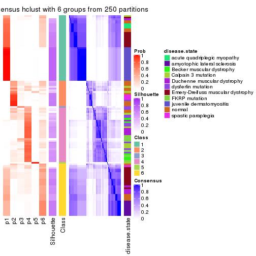</p>

</div>
</div>

Heatmaps for the membership of samples in all partitions to see how consistent they are:


<script>
$( function() {
	$( '#tabs-SD-hclust-membership-heatmap' ).tabs();
} );
</script>
<div id='tabs-SD-hclust-membership-heatmap'>
<ul>
<li><a href='#tab-SD-hclust-membership-heatmap-1'>k = 2</a></li>
<li><a href='#tab-SD-hclust-membership-heatmap-2'>k = 3</a></li>
<li><a href='#tab-SD-hclust-membership-heatmap-3'>k = 4</a></li>
<li><a href='#tab-SD-hclust-membership-heatmap-4'>k = 5</a></li>
<li><a href='#tab-SD-hclust-membership-heatmap-5'>k = 6</a></li>
</ul>
<div id='tab-SD-hclust-membership-heatmap-1'>
<pre><code class="r">membership_heatmap(res, k = 2)
</code></pre>

<p></p>

</div>
<div id='tab-SD-hclust-membership-heatmap-2'>
<pre><code class="r">membership_heatmap(res, k = 3)
</code></pre>

<p></p>

</div>
<div id='tab-SD-hclust-membership-heatmap-3'>
<pre><code class="r">membership_heatmap(res, k = 4)
</code></pre>

<p></p>

</div>
<div id='tab-SD-hclust-membership-heatmap-4'>
<pre><code class="r">membership_heatmap(res, k = 5)
</code></pre>

<p></p>

</div>
<div id='tab-SD-hclust-membership-heatmap-5'>
<pre><code class="r">membership_heatmap(res, k = 6)
</code></pre>

<p></p>

</div>
</div>

As soon as we have had the classes for columns, we can look for signatures
which are significantly different between classes which can be candidate marks
for certain classes. Following are the heatmaps for signatures.


Signature heatmaps where rows are scaled:


<script>
$( function() {
	$( '#tabs-SD-hclust-get-signatures' ).tabs();
} );
</script>
<div id='tabs-SD-hclust-get-signatures'>
<ul>
<li><a href='#tab-SD-hclust-get-signatures-1'>k = 2</a></li>
<li><a href='#tab-SD-hclust-get-signatures-2'>k = 3</a></li>
<li><a href='#tab-SD-hclust-get-signatures-3'>k = 4</a></li>
<li><a href='#tab-SD-hclust-get-signatures-4'>k = 5</a></li>
<li><a href='#tab-SD-hclust-get-signatures-5'>k = 6</a></li>
</ul>
<div id='tab-SD-hclust-get-signatures-1'>
<pre><code class="r">get_signatures(res, k = 2)
</code></pre>

<p></p>

</div>
<div id='tab-SD-hclust-get-signatures-2'>
<pre><code class="r">get_signatures(res, k = 3)
</code></pre>

<p></p>

</div>
<div id='tab-SD-hclust-get-signatures-3'>
<pre><code class="r">get_signatures(res, k = 4)
</code></pre>

<p></p>

</div>
<div id='tab-SD-hclust-get-signatures-4'>
<pre><code class="r">get_signatures(res, k = 5)
</code></pre>

<p></p>

</div>
<div id='tab-SD-hclust-get-signatures-5'>
<pre><code class="r">get_signatures(res, k = 6)
</code></pre>

<p></p>

</div>
</div>


Signature heatmaps where rows are not scaled:


<script>
$( function() {
	$( '#tabs-SD-hclust-get-signatures-no-scale' ).tabs();
} );
</script>
<div id='tabs-SD-hclust-get-signatures-no-scale'>
<ul>
<li><a href='#tab-SD-hclust-get-signatures-no-scale-1'>k = 2</a></li>
<li><a href='#tab-SD-hclust-get-signatures-no-scale-2'>k = 3</a></li>
<li><a href='#tab-SD-hclust-get-signatures-no-scale-3'>k = 4</a></li>
<li><a href='#tab-SD-hclust-get-signatures-no-scale-4'>k = 5</a></li>
<li><a href='#tab-SD-hclust-get-signatures-no-scale-5'>k = 6</a></li>
</ul>
<div id='tab-SD-hclust-get-signatures-no-scale-1'>
<pre><code class="r">get_signatures(res, k = 2, scale_rows = FALSE)
</code></pre>

<p></p>

</div>
<div id='tab-SD-hclust-get-signatures-no-scale-2'>
<pre><code class="r">get_signatures(res, k = 3, scale_rows = FALSE)
</code></pre>

<p></p>

</div>
<div id='tab-SD-hclust-get-signatures-no-scale-3'>
<pre><code class="r">get_signatures(res, k = 4, scale_rows = FALSE)
</code></pre>

<p></p>

</div>
<div id='tab-SD-hclust-get-signatures-no-scale-4'>
<pre><code class="r">get_signatures(res, k = 5, scale_rows = FALSE)
</code></pre>

<p>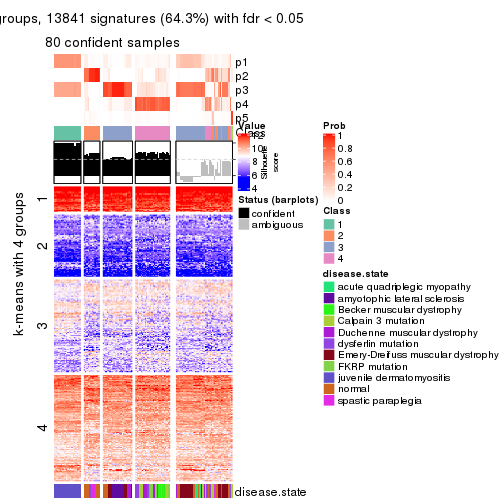</p>

</div>
<div id='tab-SD-hclust-get-signatures-no-scale-5'>
<pre><code class="r">get_signatures(res, k = 6, scale_rows = FALSE)
</code></pre>

<p></p>

</div>
</div>


Compare the overlap of signatures from different k:

```r
compare_signatures(res)
```


`get_signature()` returns a data frame invisibly. TO get the list of signatures, the function
call should be assigned to a variable explicitly. In following code, if `plot` argument is set
to `FALSE`, no heatmap is plotted while only the differential analysis is performed.

```r
# code only for demonstration
tb = get_signature(res, k = ..., plot = FALSE)
```

An example of the output of `tb` is:

```
#>   which_row         fdr    mean_1    mean_2 scaled_mean_1 scaled_mean_2 km
#> 1        38 0.042760348  8.373488  9.131774    -0.5533452     0.5164555  1
#> 2        40 0.018707592  7.106213  8.469186    -0.6173731     0.5762149  1
#> 3        55 0.019134737 10.221463 11.207825    -0.6159697     0.5749050  1
#> 4        59 0.006059896  5.921854  7.869574    -0.6899429     0.6439467  1
#> 5        60 0.018055526  8.928898 10.211722    -0.6204761     0.5791110  1
#> 6        98 0.009384629 15.714769 14.887706     0.6635654    -0.6193277  2
...
```

The columns in `tb` are:

1. `which_row`: row indices corresponding to the input matrix.
2. `fdr`: FDR for the differential test. 
3. `mean_x`: The mean value in group x.
4. `scaled_mean_x`: The mean value in group x after rows are scaled.
5. `km`: Row groups if k-means clustering is applied to rows.


UMAP plot which shows how samples are separated.


<script>
$( function() {
	$( '#tabs-SD-hclust-dimension-reduction' ).tabs();
} );
</script>
<div id='tabs-SD-hclust-dimension-reduction'>
<ul>
<li><a href='#tab-SD-hclust-dimension-reduction-1'>k = 2</a></li>
<li><a href='#tab-SD-hclust-dimension-reduction-2'>k = 3</a></li>
<li><a href='#tab-SD-hclust-dimension-reduction-3'>k = 4</a></li>
<li><a href='#tab-SD-hclust-dimension-reduction-4'>k = 5</a></li>
<li><a href='#tab-SD-hclust-dimension-reduction-5'>k = 6</a></li>
</ul>
<div id='tab-SD-hclust-dimension-reduction-1'>
<pre><code class="r">dimension_reduction(res, k = 2, method = &quot;UMAP&quot;)
</code></pre>

<p></p>

</div>
<div id='tab-SD-hclust-dimension-reduction-2'>
<pre><code class="r">dimension_reduction(res, k = 3, method = &quot;UMAP&quot;)
</code></pre>

<p>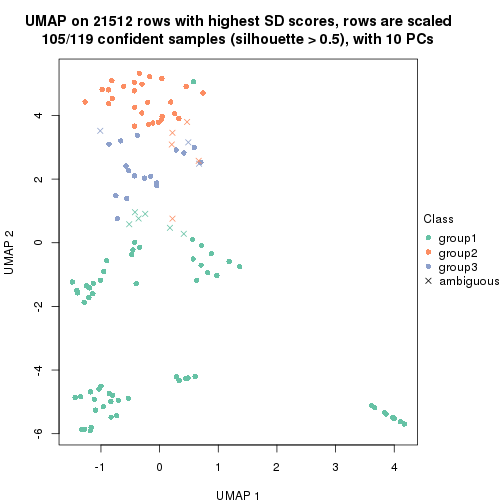</p>

</div>
<div id='tab-SD-hclust-dimension-reduction-3'>
<pre><code class="r">dimension_reduction(res, k = 4, method = &quot;UMAP&quot;)
</code></pre>

<p></p>

</div>
<div id='tab-SD-hclust-dimension-reduction-4'>
<pre><code class="r">dimension_reduction(res, k = 5, method = &quot;UMAP&quot;)
</code></pre>

<p></p>

</div>
<div id='tab-SD-hclust-dimension-reduction-5'>
<pre><code class="r">dimension_reduction(res, k = 6, method = &quot;UMAP&quot;)
</code></pre>

<p></p>

</div>
</div>


Following heatmap shows how subgroups are split when increasing `k`:

```r
collect_classes(res)
```


Test correlation between subgroups and known annotations. If the known
annotation is numeric, one-way ANOVA test is applied, and if the known
annotation is discrete, chi-squared contingency table test is applied.

```r
test_to_known_factors(res)
```

```
#>             n disease.state(p) k
#> SD:hclust 111         1.28e-12 2
#> SD:hclust 105         2.15e-18 3
#> SD:hclust 101         9.48e-19 4
#> SD:hclust  80         8.86e-27 5
#> SD:hclust  85         3.11e-24 6
```


If matrix rows can be associated to genes, consider to use `functional_enrichment(res,
...)` to perform function enrichment for the signature genes. See [this vignette](http://bioconductor.org/packages/devel/bioc/vignettes/cola/inst/doc/functional_enrichment.html) for more detailed explanations.


 

---------------------------------------------------


### SD:kmeans


The object with results only for a single top-value method and a single partition method 
can be extracted as:

```r
res = res_list["SD", "kmeans"]
# you can also extract it by
# res = res_list["SD:kmeans"]
```

A summary of `res` and all the functions that can be applied to it:

```r
res
```

```
#> A 'ConsensusPartition' object with k = 2, 3, 4, 5, 6.
#>   On a matrix with 21512 rows and 119 columns.
#>   Top rows (1000, 2000, 3000, 4000, 5000) are extracted by 'SD' method.
#>   Subgroups are detected by 'kmeans' method.
#>   Performed in total 1250 partitions by row resampling.
#>   Best k for subgroups seems to be 2.
#> 
#> Following methods can be applied to this 'ConsensusPartition' object:
#>  [1] "cola_report"             "collect_classes"         "collect_plots"          
#>  [4] "collect_stats"           "colnames"                "compare_signatures"     
#>  [7] "consensus_heatmap"       "dimension_reduction"     "functional_enrichment"  
#> [10] "get_anno_col"            "get_anno"                "get_classes"            
#> [13] "get_consensus"           "get_matrix"              "get_membership"         
#> [16] "get_param"               "get_signatures"          "get_stats"              
#> [19] "is_best_k"               "is_stable_k"             "membership_heatmap"     
#> [22] "ncol"                    "nrow"                    "plot_ecdf"              
#> [25] "rownames"                "select_partition_number" "show"                   
#> [28] "suggest_best_k"          "test_to_known_factors"
```

`collect_plots()` function collects all the plots made from `res` for all `k` (number of partitions)
into one single page to provide an easy and fast comparison between different `k`.

```r
collect_plots(res)
```

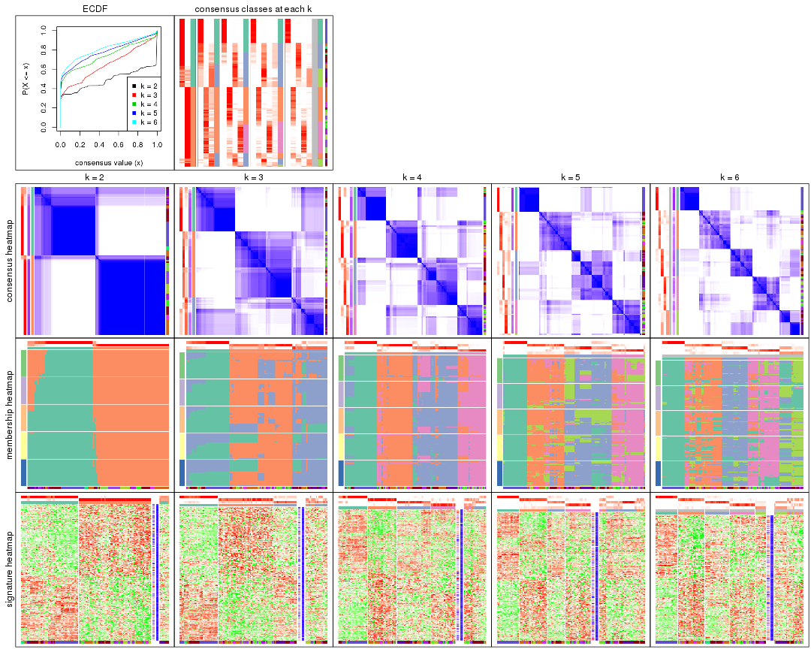

The plots are:

- The first row: a plot of the ECDF (empirical cumulative distribution
  function) curves of the consensus matrix for each `k` and the heatmap of
  predicted classes for each `k`.
- The second row: heatmaps of the consensus matrix for each `k`.
- The third row: heatmaps of the membership matrix for each `k`.
- The fouth row: heatmaps of the signatures for each `k`.

All the plots in panels can be made by individual functions and they are
plotted later in this section.

`select_partition_number()` produces several plots showing different
statistics for choosing "optimized" `k`. There are following statistics:

- ECDF curves of the consensus matrix for each `k`;
- 1-PAC. [The PAC
  score](https://en.wikipedia.org/wiki/Consensus_clustering#Over-interpretation_potential_of_consensus_clustering)
  measures the proportion of the ambiguous subgrouping.
- Mean silhouette score.
- Concordance. The mean probability of fiting the consensus class ids in all
  partitions.
- Area increased. Denote $A_k$ as the area under the ECDF curve for current
  `k`, the area increased is defined as $A_k - A_{k-1}$.
- Rand index. The percent of pairs of samples that are both in a same cluster
  or both are not in a same cluster in the partition of k and k-1.
- Jaccard index. The ratio of pairs of samples are both in a same cluster in
  the partition of k and k-1 and the pairs of samples are both in a same
  cluster in the partition k or k-1.

The detailed explanations of these statistics can be found in [the _cola_
vignette](http://bioconductor.org/packages/devel/bioc/vignettes/cola/inst/doc/cola.html#toc_13).

Generally speaking, lower PAC score, higher mean silhouette score or higher
concordance corresponds to better partition. Rand index and Jaccard index
measure how similar the current partition is compared to partition with `k-1`.
If they are too similar, we won't accept `k` is better than `k-1`.

```r
select_partition_number(res)
```


The numeric values for all these statistics can be obtained by `get_stats()`.

```r
get_stats(res)
```

```
#>   k 1-PAC mean_silhouette concordance area_increased  Rand Jaccard
#> 2 2 0.787           0.882       0.950         0.4894 0.499   0.499
#> 3 3 0.553           0.646       0.771         0.3335 0.790   0.602
#> 4 4 0.679           0.682       0.844         0.1406 0.823   0.543
#> 5 5 0.663           0.548       0.757         0.0540 0.886   0.632
#> 6 6 0.718           0.666       0.737         0.0403 0.935   0.749
```

`suggest_best_k()` suggests the best $k$ based on these statistics. The rules are as follows:

- All $k$ with Jaccard index larger than 0.95 are removed because increasing
  $k$ does not provide enough extra information. If all $k$ are removed, it is
  marked as no subgroup is detected.
- For all $k$ with 1-PAC score larger than 0.9, the maximal $k$ is taken as
  the best $k$, and other $k$ are marked as optional $k$.
- If it does not fit the second rule. The $k$ with the maximal vote of the
  highest 1-PAC score, highest mean silhouette, and highest concordance is
  taken as the best $k$.

```r
suggest_best_k(res)
```

```
#> [1] 2
```


Following shows the table of the partitions (You need to click the **show/hide
code output** link to see it). The membership matrix (columns with name `p*`)
is inferred by
[`clue::cl_consensus()`](https://www.rdocumentation.org/link/cl_consensus?package=clue)
function with the `SE` method. Basically the value in the membership matrix
represents the probability to belong to a certain group. The finall class
label for an item is determined with the group with highest probability it
belongs to.

In `get_classes()` function, the entropy is calculated from the membership
matrix and the silhouette score is calculated from the consensus matrix.


<script>
$( function() {
	$( '#tabs-SD-kmeans-get-classes' ).tabs();
} );
</script>
<div id='tabs-SD-kmeans-get-classes'>
<ul>
<li><a href='#tab-SD-kmeans-get-classes-1'>k = 2</a></li>
<li><a href='#tab-SD-kmeans-get-classes-2'>k = 3</a></li>
<li><a href='#tab-SD-kmeans-get-classes-3'>k = 4</a></li>
<li><a href='#tab-SD-kmeans-get-classes-4'>k = 5</a></li>
<li><a href='#tab-SD-kmeans-get-classes-5'>k = 6</a></li>
</ul>

<div id='tab-SD-kmeans-get-classes-1'>
<p><a id='tab-SD-kmeans-get-classes-1-a' style='color:#0366d6' href='#'>show/hide code output</a></p>
<pre><code class="r">cbind(get_classes(res, k = 2), get_membership(res, k = 2))
</code></pre>

<pre><code>#&gt;           class entropy silhouette    p1    p2
#&gt; GSM120719     1  0.0000     0.9097 1.000 0.000
#&gt; GSM120720     1  0.0000     0.9097 1.000 0.000
#&gt; GSM120765     2  0.0000     0.9762 0.000 1.000
#&gt; GSM120767     2  0.0000     0.9762 0.000 1.000
#&gt; GSM120784     2  0.0000     0.9762 0.000 1.000
#&gt; GSM121400     1  0.0000     0.9097 1.000 0.000
#&gt; GSM121401     1  0.0000     0.9097 1.000 0.000
#&gt; GSM121402     2  0.0000     0.9762 0.000 1.000
#&gt; GSM121403     2  0.8555     0.5473 0.280 0.720
#&gt; GSM121404     2  0.0000     0.9762 0.000 1.000
#&gt; GSM121405     1  0.0672     0.9055 0.992 0.008
#&gt; GSM121406     2  0.0000     0.9762 0.000 1.000
#&gt; GSM121408     2  0.0000     0.9762 0.000 1.000
#&gt; GSM121409     1  0.5737     0.8192 0.864 0.136
#&gt; GSM121410     1  0.2236     0.8892 0.964 0.036
#&gt; GSM121412     2  0.0000     0.9762 0.000 1.000
#&gt; GSM121413     2  0.0000     0.9762 0.000 1.000
#&gt; GSM121414     2  0.0000     0.9762 0.000 1.000
#&gt; GSM121415     2  0.0000     0.9762 0.000 1.000
#&gt; GSM121416     2  0.0000     0.9762 0.000 1.000
#&gt; GSM120591     1  0.0000     0.9097 1.000 0.000
#&gt; GSM120594     1  0.0000     0.9097 1.000 0.000
#&gt; GSM120718     1  0.0000     0.9097 1.000 0.000
#&gt; GSM121205     1  0.0000     0.9097 1.000 0.000
#&gt; GSM121206     1  0.0000     0.9097 1.000 0.000
#&gt; GSM121207     1  0.0000     0.9097 1.000 0.000
#&gt; GSM121208     1  0.0000     0.9097 1.000 0.000
#&gt; GSM121209     1  0.0000     0.9097 1.000 0.000
#&gt; GSM121210     1  0.0000     0.9097 1.000 0.000
#&gt; GSM121211     1  0.0000     0.9097 1.000 0.000
#&gt; GSM121212     1  0.0000     0.9097 1.000 0.000
#&gt; GSM121213     1  0.0000     0.9097 1.000 0.000
#&gt; GSM121214     1  0.0000     0.9097 1.000 0.000
#&gt; GSM121215     1  0.0000     0.9097 1.000 0.000
#&gt; GSM121216     1  0.0000     0.9097 1.000 0.000
#&gt; GSM121217     1  0.0000     0.9097 1.000 0.000
#&gt; GSM121218     1  0.0000     0.9097 1.000 0.000
#&gt; GSM121234     1  0.0000     0.9097 1.000 0.000
#&gt; GSM121243     1  0.0000     0.9097 1.000 0.000
#&gt; GSM121245     1  0.0000     0.9097 1.000 0.000
#&gt; GSM121246     1  0.0000     0.9097 1.000 0.000
#&gt; GSM121247     1  0.0000     0.9097 1.000 0.000
#&gt; GSM121248     1  0.0000     0.9097 1.000 0.000
#&gt; GSM120744     2  0.9686     0.2269 0.396 0.604
#&gt; GSM120745     1  0.6712     0.7852 0.824 0.176
#&gt; GSM120746     1  0.9933     0.3025 0.548 0.452
#&gt; GSM120747     1  0.9944     0.2913 0.544 0.456
#&gt; GSM120748     2  0.5294     0.8320 0.120 0.880
#&gt; GSM120749     1  0.8144     0.6966 0.748 0.252
#&gt; GSM120750     1  0.9944     0.2913 0.544 0.456
#&gt; GSM120751     1  0.9944     0.2913 0.544 0.456
#&gt; GSM120752     1  0.7602     0.7377 0.780 0.220
#&gt; GSM121336     2  0.0000     0.9762 0.000 1.000
#&gt; GSM121339     2  0.0000     0.9762 0.000 1.000
#&gt; GSM121349     2  0.0000     0.9762 0.000 1.000
#&gt; GSM121355     2  0.0000     0.9762 0.000 1.000
#&gt; GSM120757     1  0.9922     0.3133 0.552 0.448
#&gt; GSM120766     2  0.9988    -0.0983 0.480 0.520
#&gt; GSM120770     2  0.0000     0.9762 0.000 1.000
#&gt; GSM120779     1  0.6887     0.7776 0.816 0.184
#&gt; GSM120780     2  0.0672     0.9683 0.008 0.992
#&gt; GSM121102     2  0.0000     0.9762 0.000 1.000
#&gt; GSM121203     1  0.9970     0.2542 0.532 0.468
#&gt; GSM121204     1  0.0000     0.9097 1.000 0.000
#&gt; GSM121330     1  0.0000     0.9097 1.000 0.000
#&gt; GSM121335     1  0.0000     0.9097 1.000 0.000
#&gt; GSM121337     2  0.0000     0.9762 0.000 1.000
#&gt; GSM121338     2  0.0000     0.9762 0.000 1.000
#&gt; GSM121341     1  0.0000     0.9097 1.000 0.000
#&gt; GSM121342     1  0.0000     0.9097 1.000 0.000
#&gt; GSM121343     2  0.0000     0.9762 0.000 1.000
#&gt; GSM121344     1  0.0000     0.9097 1.000 0.000
#&gt; GSM121346     1  0.0000     0.9097 1.000 0.000
#&gt; GSM121347     2  0.0000     0.9762 0.000 1.000
#&gt; GSM121348     2  0.0000     0.9762 0.000 1.000
#&gt; GSM121350     1  0.0000     0.9097 1.000 0.000
#&gt; GSM121352     1  0.0000     0.9097 1.000 0.000
#&gt; GSM121354     1  0.0000     0.9097 1.000 0.000
#&gt; GSM120753     2  0.0000     0.9762 0.000 1.000
#&gt; GSM120761     2  0.0000     0.9762 0.000 1.000
#&gt; GSM120768     2  0.0000     0.9762 0.000 1.000
#&gt; GSM120781     2  0.0000     0.9762 0.000 1.000
#&gt; GSM120788     2  0.0000     0.9762 0.000 1.000
#&gt; GSM120760     2  0.0000     0.9762 0.000 1.000
#&gt; GSM120763     2  0.0000     0.9762 0.000 1.000
#&gt; GSM120764     2  0.0000     0.9762 0.000 1.000
#&gt; GSM120777     2  0.0000     0.9762 0.000 1.000
#&gt; GSM120786     2  0.0000     0.9762 0.000 1.000
#&gt; GSM121329     1  0.0000     0.9097 1.000 0.000
#&gt; GSM121331     1  0.8555     0.6558 0.720 0.280
#&gt; GSM121333     1  0.7219     0.7608 0.800 0.200
#&gt; GSM121345     1  0.6801     0.7815 0.820 0.180
#&gt; GSM121356     1  0.7056     0.7694 0.808 0.192
#&gt; GSM120754     2  0.0000     0.9762 0.000 1.000
#&gt; GSM120759     2  0.0000     0.9762 0.000 1.000
#&gt; GSM120762     2  0.0000     0.9762 0.000 1.000
#&gt; GSM120775     2  0.0000     0.9762 0.000 1.000
#&gt; GSM120776     2  0.1414     0.9557 0.020 0.980
#&gt; GSM120782     2  0.0000     0.9762 0.000 1.000
#&gt; GSM120789     2  0.0000     0.9762 0.000 1.000
#&gt; GSM120790     2  0.0000     0.9762 0.000 1.000
#&gt; GSM120791     2  0.0000     0.9762 0.000 1.000
#&gt; GSM120755     2  0.0000     0.9762 0.000 1.000
#&gt; GSM120756     2  0.0000     0.9762 0.000 1.000
#&gt; GSM120769     2  0.0000     0.9762 0.000 1.000
#&gt; GSM120778     2  0.0000     0.9762 0.000 1.000
#&gt; GSM120792     2  0.0000     0.9762 0.000 1.000
#&gt; GSM121332     2  0.0000     0.9762 0.000 1.000
#&gt; GSM121334     2  0.0000     0.9762 0.000 1.000
#&gt; GSM121340     2  0.0000     0.9762 0.000 1.000
#&gt; GSM121351     2  0.0000     0.9762 0.000 1.000
#&gt; GSM121353     2  0.0000     0.9762 0.000 1.000
#&gt; GSM120758     2  0.0000     0.9762 0.000 1.000
#&gt; GSM120771     2  0.0000     0.9762 0.000 1.000
#&gt; GSM120772     2  0.0000     0.9762 0.000 1.000
#&gt; GSM120773     2  0.0000     0.9762 0.000 1.000
#&gt; GSM120774     2  0.0000     0.9762 0.000 1.000
#&gt; GSM120783     2  0.0000     0.9762 0.000 1.000
#&gt; GSM120787     2  0.0000     0.9762 0.000 1.000
</code></pre>

<script>
$('#tab-SD-kmeans-get-classes-1-a').parent().next().next().hide();
$('#tab-SD-kmeans-get-classes-1-a').click(function(){
  $('#tab-SD-kmeans-get-classes-1-a').parent().next().next().toggle();
  return(false);
});
</script>
</div>

<div id='tab-SD-kmeans-get-classes-2'>
<p><a id='tab-SD-kmeans-get-classes-2-a' style='color:#0366d6' href='#'>show/hide code output</a></p>
<pre><code class="r">cbind(get_classes(res, k = 3), get_membership(res, k = 3))
</code></pre>

<pre><code>#&gt;           class entropy silhouette    p1    p2    p3
#&gt; GSM120719     1  0.3192    0.82874 0.888 0.000 0.112
#&gt; GSM120720     1  0.3551    0.81677 0.868 0.000 0.132
#&gt; GSM120765     2  0.5216    0.73915 0.000 0.740 0.260
#&gt; GSM120767     2  0.4931    0.74511 0.000 0.768 0.232
#&gt; GSM120784     2  0.5216    0.73915 0.000 0.740 0.260
#&gt; GSM121400     3  0.6680    0.11258 0.484 0.008 0.508
#&gt; GSM121401     1  0.6509   -0.00465 0.524 0.004 0.472
#&gt; GSM121402     2  0.5216    0.73915 0.000 0.740 0.260
#&gt; GSM121403     3  0.5178    0.26291 0.000 0.256 0.744
#&gt; GSM121404     2  0.5785    0.67854 0.000 0.668 0.332
#&gt; GSM121405     3  0.7178    0.18341 0.464 0.024 0.512
#&gt; GSM121406     2  0.5216    0.73915 0.000 0.740 0.260
#&gt; GSM121408     2  0.5178    0.74032 0.000 0.744 0.256
#&gt; GSM121409     3  0.6855    0.56966 0.316 0.032 0.652
#&gt; GSM121410     3  0.7278    0.20894 0.456 0.028 0.516
#&gt; GSM121412     2  0.5216    0.73915 0.000 0.740 0.260
#&gt; GSM121413     2  0.5216    0.73915 0.000 0.740 0.260
#&gt; GSM121414     2  0.5216    0.73915 0.000 0.740 0.260
#&gt; GSM121415     2  0.5216    0.73915 0.000 0.740 0.260
#&gt; GSM121416     2  0.5216    0.73915 0.000 0.740 0.260
#&gt; GSM120591     1  0.6045    0.36141 0.620 0.000 0.380
#&gt; GSM120594     1  0.3551    0.81677 0.868 0.000 0.132
#&gt; GSM120718     1  0.3192    0.82874 0.888 0.000 0.112
#&gt; GSM121205     1  0.0000    0.86278 1.000 0.000 0.000
#&gt; GSM121206     1  0.0000    0.86278 1.000 0.000 0.000
#&gt; GSM121207     1  0.0000    0.86278 1.000 0.000 0.000
#&gt; GSM121208     1  0.0000    0.86278 1.000 0.000 0.000
#&gt; GSM121209     1  0.0000    0.86278 1.000 0.000 0.000
#&gt; GSM121210     1  0.0000    0.86278 1.000 0.000 0.000
#&gt; GSM121211     1  0.0000    0.86278 1.000 0.000 0.000
#&gt; GSM121212     1  0.0000    0.86278 1.000 0.000 0.000
#&gt; GSM121213     1  0.0000    0.86278 1.000 0.000 0.000
#&gt; GSM121214     1  0.0000    0.86278 1.000 0.000 0.000
#&gt; GSM121215     1  0.0000    0.86278 1.000 0.000 0.000
#&gt; GSM121216     1  0.0000    0.86278 1.000 0.000 0.000
#&gt; GSM121217     1  0.0000    0.86278 1.000 0.000 0.000
#&gt; GSM121218     1  0.0000    0.86278 1.000 0.000 0.000
#&gt; GSM121234     1  0.0000    0.86278 1.000 0.000 0.000
#&gt; GSM121243     1  0.0000    0.86278 1.000 0.000 0.000
#&gt; GSM121245     1  0.0000    0.86278 1.000 0.000 0.000
#&gt; GSM121246     1  0.2066    0.84745 0.940 0.000 0.060
#&gt; GSM121247     1  0.0000    0.86278 1.000 0.000 0.000
#&gt; GSM121248     1  0.0000    0.86278 1.000 0.000 0.000
#&gt; GSM120744     3  0.6079    0.69421 0.216 0.036 0.748
#&gt; GSM120745     3  0.5058    0.67674 0.244 0.000 0.756
#&gt; GSM120746     3  0.6056    0.69344 0.224 0.032 0.744
#&gt; GSM120747     3  0.6056    0.69344 0.224 0.032 0.744
#&gt; GSM120748     3  0.1289    0.55987 0.000 0.032 0.968
#&gt; GSM120749     3  0.6099    0.69176 0.228 0.032 0.740
#&gt; GSM120750     3  0.6056    0.69344 0.224 0.032 0.744
#&gt; GSM120751     3  0.6056    0.69344 0.224 0.032 0.744
#&gt; GSM120752     3  0.5058    0.67674 0.244 0.000 0.756
#&gt; GSM121336     2  0.5216    0.73915 0.000 0.740 0.260
#&gt; GSM121339     2  0.6180    0.57033 0.000 0.584 0.416
#&gt; GSM121349     2  0.5216    0.73915 0.000 0.740 0.260
#&gt; GSM121355     2  0.5216    0.73915 0.000 0.740 0.260
#&gt; GSM120757     3  0.5945    0.67634 0.236 0.024 0.740
#&gt; GSM120766     3  0.6630    0.67818 0.220 0.056 0.724
#&gt; GSM120770     2  0.5926    0.65909 0.000 0.644 0.356
#&gt; GSM120779     3  0.5938    0.67069 0.248 0.020 0.732
#&gt; GSM120780     3  0.2537    0.50013 0.000 0.080 0.920
#&gt; GSM121102     3  0.5948   -0.03797 0.000 0.360 0.640
#&gt; GSM121203     3  0.6168    0.69206 0.224 0.036 0.740
#&gt; GSM121204     3  0.5443    0.65947 0.260 0.004 0.736
#&gt; GSM121330     1  0.4654    0.73289 0.792 0.000 0.208
#&gt; GSM121335     1  0.3340    0.82452 0.880 0.000 0.120
#&gt; GSM121337     2  0.6062    0.62560 0.000 0.616 0.384
#&gt; GSM121338     3  0.5621    0.13329 0.000 0.308 0.692
#&gt; GSM121341     1  0.3340    0.82452 0.880 0.000 0.120
#&gt; GSM121342     1  0.3340    0.82452 0.880 0.000 0.120
#&gt; GSM121343     3  0.5621    0.13329 0.000 0.308 0.692
#&gt; GSM121344     1  0.4121    0.78283 0.832 0.000 0.168
#&gt; GSM121346     1  0.5733    0.51850 0.676 0.000 0.324
#&gt; GSM121347     3  0.6299   -0.40362 0.000 0.476 0.524
#&gt; GSM121348     3  0.3879    0.32503 0.000 0.152 0.848
#&gt; GSM121350     1  0.5733    0.51850 0.676 0.000 0.324
#&gt; GSM121352     1  0.4750    0.72148 0.784 0.000 0.216
#&gt; GSM121354     1  0.4121    0.78283 0.832 0.000 0.168
#&gt; GSM120753     2  0.0424    0.74361 0.000 0.992 0.008
#&gt; GSM120761     2  0.0592    0.73900 0.000 0.988 0.012
#&gt; GSM120768     2  0.0747    0.73765 0.000 0.984 0.016
#&gt; GSM120781     2  0.1163    0.74666 0.000 0.972 0.028
#&gt; GSM120788     2  0.6252    0.23683 0.000 0.556 0.444
#&gt; GSM120760     2  0.3551    0.67345 0.000 0.868 0.132
#&gt; GSM120763     2  0.3482    0.67646 0.000 0.872 0.128
#&gt; GSM120764     2  0.5216    0.55188 0.000 0.740 0.260
#&gt; GSM120777     2  0.6235    0.25672 0.000 0.564 0.436
#&gt; GSM120786     2  0.5178    0.55692 0.000 0.744 0.256
#&gt; GSM121329     1  0.6244    0.13736 0.560 0.000 0.440
#&gt; GSM121331     3  0.5938    0.67069 0.248 0.020 0.732
#&gt; GSM121333     3  0.5938    0.67069 0.248 0.020 0.732
#&gt; GSM121345     3  0.5803    0.66917 0.248 0.016 0.736
#&gt; GSM121356     3  0.5723    0.67474 0.240 0.016 0.744
#&gt; GSM120754     2  0.5988    0.39677 0.000 0.632 0.368
#&gt; GSM120759     2  0.5216    0.73915 0.000 0.740 0.260
#&gt; GSM120762     2  0.1529    0.74825 0.000 0.960 0.040
#&gt; GSM120775     2  0.6180    0.30244 0.000 0.584 0.416
#&gt; GSM120776     3  0.5431    0.46255 0.000 0.284 0.716
#&gt; GSM120782     2  0.6192    0.30281 0.000 0.580 0.420
#&gt; GSM120789     2  0.4931    0.74460 0.000 0.768 0.232
#&gt; GSM120790     2  0.5138    0.74174 0.000 0.748 0.252
#&gt; GSM120791     2  0.2625    0.70566 0.000 0.916 0.084
#&gt; GSM120755     2  0.2537    0.74995 0.000 0.920 0.080
#&gt; GSM120756     2  0.6291    0.17181 0.000 0.532 0.468
#&gt; GSM120769     2  0.0424    0.74361 0.000 0.992 0.008
#&gt; GSM120778     2  0.0747    0.73765 0.000 0.984 0.016
#&gt; GSM120792     2  0.1411    0.73034 0.000 0.964 0.036
#&gt; GSM121332     2  0.4974    0.74426 0.000 0.764 0.236
#&gt; GSM121334     2  0.0424    0.74015 0.000 0.992 0.008
#&gt; GSM121340     2  0.5016    0.57491 0.000 0.760 0.240
#&gt; GSM121351     2  0.5216    0.73915 0.000 0.740 0.260
#&gt; GSM121353     2  0.5497    0.51325 0.000 0.708 0.292
#&gt; GSM120758     2  0.0747    0.74515 0.000 0.984 0.016
#&gt; GSM120771     2  0.5098    0.74192 0.000 0.752 0.248
#&gt; GSM120772     2  0.0424    0.74361 0.000 0.992 0.008
#&gt; GSM120773     2  0.5138    0.56151 0.000 0.748 0.252
#&gt; GSM120774     2  0.1163    0.73410 0.000 0.972 0.028
#&gt; GSM120783     2  0.5216    0.55188 0.000 0.740 0.260
#&gt; GSM120787     2  0.0592    0.73900 0.000 0.988 0.012
</code></pre>

<script>
$('#tab-SD-kmeans-get-classes-2-a').parent().next().next().hide();
$('#tab-SD-kmeans-get-classes-2-a').click(function(){
  $('#tab-SD-kmeans-get-classes-2-a').parent().next().next().toggle();
  return(false);
});
</script>
</div>

<div id='tab-SD-kmeans-get-classes-3'>
<p><a id='tab-SD-kmeans-get-classes-3-a' style='color:#0366d6' href='#'>show/hide code output</a></p>
<pre><code class="r">cbind(get_classes(res, k = 4), get_membership(res, k = 4))
</code></pre>

<pre><code>#&gt;           class entropy silhouette    p1    p2    p3    p4
#&gt; GSM120719     1  0.5186    0.58130 0.640 0.000 0.344 0.016
#&gt; GSM120720     1  0.5444    0.44873 0.560 0.000 0.424 0.016
#&gt; GSM120765     2  0.0336    0.86770 0.000 0.992 0.008 0.000
#&gt; GSM120767     2  0.0376    0.86696 0.004 0.992 0.004 0.000
#&gt; GSM120784     2  0.0469    0.86581 0.000 0.988 0.012 0.000
#&gt; GSM121400     3  0.1118    0.72550 0.036 0.000 0.964 0.000
#&gt; GSM121401     3  0.1975    0.71200 0.048 0.000 0.936 0.016
#&gt; GSM121402     2  0.0000    0.86851 0.000 1.000 0.000 0.000
#&gt; GSM121403     3  0.1716    0.72324 0.000 0.064 0.936 0.000
#&gt; GSM121404     2  0.2704    0.75992 0.000 0.876 0.124 0.000
#&gt; GSM121405     3  0.1706    0.71881 0.036 0.000 0.948 0.016
#&gt; GSM121406     2  0.0000    0.86851 0.000 1.000 0.000 0.000
#&gt; GSM121408     2  0.0336    0.86770 0.000 0.992 0.008 0.000
#&gt; GSM121409     3  0.0000    0.73804 0.000 0.000 1.000 0.000
#&gt; GSM121410     3  0.1109    0.72838 0.028 0.004 0.968 0.000
#&gt; GSM121412     2  0.0336    0.86595 0.000 0.992 0.008 0.000
#&gt; GSM121413     2  0.0336    0.86595 0.000 0.992 0.008 0.000
#&gt; GSM121414     2  0.0336    0.86595 0.000 0.992 0.008 0.000
#&gt; GSM121415     2  0.0336    0.86770 0.000 0.992 0.008 0.000
#&gt; GSM121416     2  0.0188    0.86802 0.000 0.996 0.004 0.000
#&gt; GSM120591     3  0.3711    0.62693 0.140 0.000 0.836 0.024
#&gt; GSM120594     1  0.5444    0.44873 0.560 0.000 0.424 0.016
#&gt; GSM120718     1  0.5253    0.56153 0.624 0.000 0.360 0.016
#&gt; GSM121205     1  0.0188    0.86884 0.996 0.000 0.004 0.000
#&gt; GSM121206     1  0.0188    0.86884 0.996 0.000 0.004 0.000
#&gt; GSM121207     1  0.0188    0.86884 0.996 0.000 0.004 0.000
#&gt; GSM121208     1  0.0469    0.86494 0.988 0.000 0.012 0.000
#&gt; GSM121209     1  0.0188    0.86884 0.996 0.000 0.004 0.000
#&gt; GSM121210     1  0.0188    0.86884 0.996 0.000 0.004 0.000
#&gt; GSM121211     1  0.0188    0.86884 0.996 0.000 0.004 0.000
#&gt; GSM121212     1  0.0188    0.86884 0.996 0.000 0.004 0.000
#&gt; GSM121213     1  0.0188    0.86884 0.996 0.000 0.004 0.000
#&gt; GSM121214     1  0.0188    0.86884 0.996 0.000 0.004 0.000
#&gt; GSM121215     1  0.0188    0.86884 0.996 0.000 0.004 0.000
#&gt; GSM121216     1  0.0188    0.86884 0.996 0.000 0.004 0.000
#&gt; GSM121217     1  0.0188    0.86884 0.996 0.000 0.004 0.000
#&gt; GSM121218     1  0.0188    0.86884 0.996 0.000 0.004 0.000
#&gt; GSM121234     1  0.0188    0.86884 0.996 0.000 0.004 0.000
#&gt; GSM121243     1  0.0188    0.86884 0.996 0.000 0.004 0.000
#&gt; GSM121245     1  0.0188    0.86884 0.996 0.000 0.004 0.000
#&gt; GSM121246     1  0.4690    0.67144 0.724 0.000 0.260 0.016
#&gt; GSM121247     1  0.0188    0.86884 0.996 0.000 0.004 0.000
#&gt; GSM121248     1  0.0188    0.86884 0.996 0.000 0.004 0.000
#&gt; GSM120744     3  0.1716    0.75337 0.000 0.000 0.936 0.064
#&gt; GSM120745     3  0.1716    0.75337 0.000 0.000 0.936 0.064
#&gt; GSM120746     3  0.1716    0.75337 0.000 0.000 0.936 0.064
#&gt; GSM120747     3  0.1637    0.75285 0.000 0.000 0.940 0.060
#&gt; GSM120748     3  0.1807    0.75213 0.000 0.008 0.940 0.052
#&gt; GSM120749     3  0.1637    0.75285 0.000 0.000 0.940 0.060
#&gt; GSM120750     3  0.1716    0.75337 0.000 0.000 0.936 0.064
#&gt; GSM120751     3  0.1716    0.75337 0.000 0.000 0.936 0.064
#&gt; GSM120752     3  0.1716    0.75337 0.000 0.000 0.936 0.064
#&gt; GSM121336     2  0.0000    0.86851 0.000 1.000 0.000 0.000
#&gt; GSM121339     2  0.3649    0.66286 0.000 0.796 0.204 0.000
#&gt; GSM121349     2  0.0000    0.86851 0.000 1.000 0.000 0.000
#&gt; GSM121355     2  0.0000    0.86851 0.000 1.000 0.000 0.000
#&gt; GSM120757     3  0.4697    0.59222 0.000 0.000 0.644 0.356
#&gt; GSM120766     3  0.4697    0.59222 0.000 0.000 0.644 0.356
#&gt; GSM120770     2  0.1211    0.84666 0.000 0.960 0.040 0.000
#&gt; GSM120779     3  0.4697    0.59222 0.000 0.000 0.644 0.356
#&gt; GSM120780     3  0.5820    0.61750 0.000 0.080 0.680 0.240
#&gt; GSM121102     3  0.5168    0.00189 0.000 0.496 0.500 0.004
#&gt; GSM121203     3  0.1389    0.75189 0.000 0.000 0.952 0.048
#&gt; GSM121204     3  0.4543    0.62381 0.000 0.000 0.676 0.324
#&gt; GSM121330     3  0.4831    0.38685 0.280 0.000 0.704 0.016
#&gt; GSM121335     1  0.5298    0.54314 0.612 0.000 0.372 0.016
#&gt; GSM121337     2  0.6976    0.35531 0.000 0.580 0.240 0.180
#&gt; GSM121338     3  0.4889    0.39618 0.000 0.360 0.636 0.004
#&gt; GSM121341     1  0.5298    0.54314 0.612 0.000 0.372 0.016
#&gt; GSM121342     1  0.5313    0.53668 0.608 0.000 0.376 0.016
#&gt; GSM121343     3  0.4855    0.41390 0.000 0.352 0.644 0.004
#&gt; GSM121344     3  0.5427   -0.04340 0.416 0.000 0.568 0.016
#&gt; GSM121346     3  0.3048    0.66629 0.108 0.000 0.876 0.016
#&gt; GSM121347     3  0.7873    0.14239 0.000 0.320 0.388 0.292
#&gt; GSM121348     3  0.6797    0.47094 0.000 0.108 0.536 0.356
#&gt; GSM121350     3  0.2861    0.67643 0.096 0.000 0.888 0.016
#&gt; GSM121352     3  0.4690    0.43145 0.260 0.000 0.724 0.016
#&gt; GSM121354     3  0.5408   -0.01658 0.408 0.000 0.576 0.016
#&gt; GSM120753     2  0.5325   -0.09181 0.004 0.524 0.004 0.468
#&gt; GSM120761     4  0.5095    0.51139 0.004 0.368 0.004 0.624
#&gt; GSM120768     4  0.4917    0.57738 0.004 0.328 0.004 0.664
#&gt; GSM120781     2  0.4786    0.45396 0.004 0.688 0.004 0.304
#&gt; GSM120788     4  0.0592    0.79980 0.000 0.016 0.000 0.984
#&gt; GSM120760     4  0.1792    0.80404 0.000 0.068 0.000 0.932
#&gt; GSM120763     4  0.2216    0.79424 0.000 0.092 0.000 0.908
#&gt; GSM120764     4  0.0921    0.80679 0.000 0.028 0.000 0.972
#&gt; GSM120777     4  0.0592    0.79980 0.000 0.016 0.000 0.984
#&gt; GSM120786     4  0.1211    0.81079 0.000 0.040 0.000 0.960
#&gt; GSM121329     3  0.5151    0.63456 0.140 0.000 0.760 0.100
#&gt; GSM121331     3  0.4697    0.59222 0.000 0.000 0.644 0.356
#&gt; GSM121333     3  0.4697    0.59222 0.000 0.000 0.644 0.356
#&gt; GSM121345     3  0.4746    0.57839 0.000 0.000 0.632 0.368
#&gt; GSM121356     3  0.4697    0.59222 0.000 0.000 0.644 0.356
#&gt; GSM120754     4  0.0817    0.80537 0.000 0.024 0.000 0.976
#&gt; GSM120759     2  0.0000    0.86851 0.000 1.000 0.000 0.000
#&gt; GSM120762     2  0.3631    0.70480 0.004 0.824 0.004 0.168
#&gt; GSM120775     4  0.0707    0.80352 0.000 0.020 0.000 0.980
#&gt; GSM120776     4  0.3486    0.53309 0.000 0.000 0.188 0.812
#&gt; GSM120782     4  0.1557    0.80691 0.000 0.056 0.000 0.944
#&gt; GSM120789     2  0.0188    0.86716 0.004 0.996 0.000 0.000
#&gt; GSM120790     2  0.0000    0.86851 0.000 1.000 0.000 0.000
#&gt; GSM120791     4  0.3649    0.71964 0.000 0.204 0.000 0.796
#&gt; GSM120755     2  0.3072    0.76049 0.004 0.868 0.004 0.124
#&gt; GSM120756     4  0.0592    0.79980 0.000 0.016 0.000 0.984
#&gt; GSM120769     2  0.5276    0.05729 0.004 0.560 0.004 0.432
#&gt; GSM120778     4  0.4995    0.55342 0.004 0.344 0.004 0.648
#&gt; GSM120792     4  0.4343    0.65934 0.000 0.264 0.004 0.732
#&gt; GSM121332     2  0.0188    0.86802 0.000 0.996 0.004 0.000
#&gt; GSM121334     4  0.5252    0.39172 0.004 0.420 0.004 0.572
#&gt; GSM121340     4  0.1211    0.81079 0.000 0.040 0.000 0.960
#&gt; GSM121351     2  0.0000    0.86851 0.000 1.000 0.000 0.000
#&gt; GSM121353     4  0.1118    0.80996 0.000 0.036 0.000 0.964
#&gt; GSM120758     2  0.5297    0.01034 0.004 0.548 0.004 0.444
#&gt; GSM120771     2  0.3257    0.73161 0.000 0.844 0.004 0.152
#&gt; GSM120772     4  0.5317    0.27182 0.004 0.460 0.004 0.532
#&gt; GSM120773     4  0.1302    0.81043 0.000 0.044 0.000 0.956
#&gt; GSM120774     4  0.5047    0.53391 0.004 0.356 0.004 0.636
#&gt; GSM120783     4  0.1211    0.81079 0.000 0.040 0.000 0.960
#&gt; GSM120787     4  0.5125    0.49351 0.004 0.376 0.004 0.616
</code></pre>

<script>
$('#tab-SD-kmeans-get-classes-3-a').parent().next().next().hide();
$('#tab-SD-kmeans-get-classes-3-a').click(function(){
  $('#tab-SD-kmeans-get-classes-3-a').parent().next().next().toggle();
  return(false);
});
</script>
</div>

<div id='tab-SD-kmeans-get-classes-4'>
<p><a id='tab-SD-kmeans-get-classes-4-a' style='color:#0366d6' href='#'>show/hide code output</a></p>
<pre><code class="r">cbind(get_classes(res, k = 5), get_membership(res, k = 5))
</code></pre>

<pre><code>#&gt;           class entropy silhouette    p1    p2    p3    p4    p5
#&gt; GSM120719     3  0.6740      0.430 0.316 0.000 0.448 0.004 0.232
#&gt; GSM120720     3  0.6511      0.516 0.252 0.000 0.516 0.004 0.228
#&gt; GSM120765     2  0.1410      0.757 0.000 0.940 0.000 0.000 0.060
#&gt; GSM120767     2  0.2873      0.735 0.000 0.860 0.000 0.020 0.120
#&gt; GSM120784     2  0.1410      0.757 0.000 0.940 0.000 0.000 0.060
#&gt; GSM121400     3  0.4026      0.548 0.020 0.000 0.736 0.000 0.244
#&gt; GSM121401     3  0.4666      0.570 0.056 0.000 0.704 0.000 0.240
#&gt; GSM121402     2  0.3280      0.755 0.004 0.808 0.000 0.004 0.184
#&gt; GSM121403     3  0.5287      0.451 0.000 0.092 0.648 0.000 0.260
#&gt; GSM121404     2  0.3821      0.673 0.000 0.800 0.148 0.000 0.052
#&gt; GSM121405     3  0.4710      0.558 0.020 0.024 0.708 0.000 0.248
#&gt; GSM121406     2  0.2516      0.756 0.000 0.860 0.000 0.000 0.140
#&gt; GSM121408     2  0.1478      0.769 0.000 0.936 0.000 0.000 0.064
#&gt; GSM121409     3  0.3807      0.542 0.012 0.000 0.748 0.000 0.240
#&gt; GSM121410     3  0.3999      0.546 0.020 0.000 0.740 0.000 0.240
#&gt; GSM121412     2  0.2561      0.756 0.000 0.856 0.000 0.000 0.144
#&gt; GSM121413     2  0.2648      0.755 0.000 0.848 0.000 0.000 0.152
#&gt; GSM121414     2  0.2561      0.756 0.000 0.856 0.000 0.000 0.144
#&gt; GSM121415     2  0.1478      0.763 0.000 0.936 0.000 0.000 0.064
#&gt; GSM121416     2  0.2046      0.756 0.000 0.916 0.000 0.016 0.068
#&gt; GSM120591     3  0.5429      0.570 0.108 0.000 0.660 0.004 0.228
#&gt; GSM120594     3  0.6511      0.516 0.252 0.000 0.516 0.004 0.228
#&gt; GSM120718     3  0.6672      0.462 0.296 0.000 0.472 0.004 0.228
#&gt; GSM121205     1  0.0162      0.960 0.996 0.000 0.004 0.000 0.000
#&gt; GSM121206     1  0.0162      0.960 0.996 0.000 0.004 0.000 0.000
#&gt; GSM121207     1  0.0162      0.960 0.996 0.000 0.004 0.000 0.000
#&gt; GSM121208     1  0.0566      0.950 0.984 0.000 0.004 0.000 0.012
#&gt; GSM121209     1  0.0162      0.960 0.996 0.000 0.004 0.000 0.000
#&gt; GSM121210     1  0.0162      0.960 0.996 0.000 0.004 0.000 0.000
#&gt; GSM121211     1  0.0162      0.960 0.996 0.000 0.004 0.000 0.000
#&gt; GSM121212     1  0.0162      0.960 0.996 0.000 0.004 0.000 0.000
#&gt; GSM121213     1  0.0162      0.960 0.996 0.000 0.004 0.000 0.000
#&gt; GSM121214     1  0.0162      0.960 0.996 0.000 0.004 0.000 0.000
#&gt; GSM121215     1  0.0566      0.955 0.984 0.000 0.004 0.000 0.012
#&gt; GSM121216     1  0.0566      0.955 0.984 0.000 0.004 0.000 0.012
#&gt; GSM121217     1  0.0162      0.960 0.996 0.000 0.004 0.000 0.000
#&gt; GSM121218     1  0.0162      0.960 0.996 0.000 0.004 0.000 0.000
#&gt; GSM121234     1  0.0566      0.955 0.984 0.000 0.004 0.000 0.012
#&gt; GSM121243     1  0.0566      0.955 0.984 0.000 0.004 0.000 0.012
#&gt; GSM121245     1  0.0162      0.960 0.996 0.000 0.004 0.000 0.000
#&gt; GSM121246     1  0.6721     -0.293 0.404 0.000 0.340 0.000 0.256
#&gt; GSM121247     1  0.0162      0.960 0.996 0.000 0.004 0.000 0.000
#&gt; GSM121248     1  0.0162      0.960 0.996 0.000 0.004 0.000 0.000
#&gt; GSM120744     3  0.0727      0.457 0.000 0.012 0.980 0.004 0.004
#&gt; GSM120745     3  0.0771      0.469 0.000 0.000 0.976 0.004 0.020
#&gt; GSM120746     3  0.0162      0.473 0.000 0.000 0.996 0.004 0.000
#&gt; GSM120747     3  0.0162      0.473 0.000 0.000 0.996 0.004 0.000
#&gt; GSM120748     3  0.0960      0.448 0.000 0.016 0.972 0.004 0.008
#&gt; GSM120749     3  0.0162      0.473 0.000 0.000 0.996 0.004 0.000
#&gt; GSM120750     3  0.0162      0.473 0.000 0.000 0.996 0.004 0.000
#&gt; GSM120751     3  0.0162      0.473 0.000 0.000 0.996 0.004 0.000
#&gt; GSM120752     3  0.0771      0.469 0.000 0.000 0.976 0.004 0.020
#&gt; GSM121336     2  0.2732      0.758 0.000 0.840 0.000 0.000 0.160
#&gt; GSM121339     2  0.3953      0.664 0.000 0.792 0.148 0.000 0.060
#&gt; GSM121349     2  0.2732      0.758 0.000 0.840 0.000 0.000 0.160
#&gt; GSM121355     2  0.2690      0.759 0.000 0.844 0.000 0.000 0.156
#&gt; GSM120757     3  0.6261     -0.551 0.000 0.000 0.488 0.156 0.356
#&gt; GSM120766     3  0.6240     -0.578 0.000 0.000 0.488 0.152 0.360
#&gt; GSM120770     2  0.2888      0.725 0.000 0.880 0.060 0.004 0.056
#&gt; GSM120779     3  0.6405     -0.552 0.004 0.000 0.484 0.156 0.356
#&gt; GSM120780     3  0.7320     -0.693 0.000 0.136 0.476 0.072 0.316
#&gt; GSM121102     2  0.5112      0.457 0.000 0.664 0.268 0.004 0.064
#&gt; GSM121203     3  0.1124      0.444 0.000 0.000 0.960 0.004 0.036
#&gt; GSM121204     3  0.5799     -0.469 0.004 0.000 0.560 0.092 0.344
#&gt; GSM121330     3  0.5941      0.556 0.168 0.000 0.588 0.000 0.244
#&gt; GSM121335     3  0.6605      0.477 0.288 0.000 0.460 0.000 0.252
#&gt; GSM121337     2  0.6446      0.490 0.000 0.644 0.136 0.128 0.092
#&gt; GSM121338     2  0.5751      0.238 0.000 0.552 0.348 0.000 0.100
#&gt; GSM121341     3  0.6593      0.484 0.284 0.000 0.464 0.000 0.252
#&gt; GSM121342     3  0.6620      0.476 0.288 0.000 0.456 0.000 0.256
#&gt; GSM121343     2  0.5851      0.237 0.000 0.548 0.340 0.000 0.112
#&gt; GSM121344     3  0.6323      0.535 0.220 0.000 0.528 0.000 0.252
#&gt; GSM121346     3  0.4873      0.571 0.068 0.000 0.688 0.000 0.244
#&gt; GSM121347     2  0.7887      0.061 0.004 0.456 0.180 0.260 0.100
#&gt; GSM121348     5  0.8070      0.000 0.004 0.128 0.304 0.152 0.412
#&gt; GSM121350     3  0.4815      0.571 0.064 0.000 0.692 0.000 0.244
#&gt; GSM121352     3  0.5844      0.560 0.156 0.000 0.600 0.000 0.244
#&gt; GSM121354     3  0.6216      0.541 0.208 0.000 0.548 0.000 0.244
#&gt; GSM120753     4  0.6047      0.382 0.000 0.376 0.000 0.500 0.124
#&gt; GSM120761     4  0.5329      0.642 0.000 0.236 0.000 0.656 0.108
#&gt; GSM120768     4  0.3767      0.732 0.000 0.120 0.000 0.812 0.068
#&gt; GSM120781     2  0.5932      0.208 0.000 0.560 0.000 0.308 0.132
#&gt; GSM120788     4  0.1571      0.715 0.000 0.004 0.000 0.936 0.060
#&gt; GSM120760     4  0.2079      0.753 0.000 0.020 0.000 0.916 0.064
#&gt; GSM120763     4  0.2260      0.753 0.000 0.028 0.000 0.908 0.064
#&gt; GSM120764     4  0.0865      0.739 0.000 0.004 0.000 0.972 0.024
#&gt; GSM120777     4  0.1704      0.707 0.000 0.004 0.000 0.928 0.068
#&gt; GSM120786     4  0.0771      0.741 0.000 0.004 0.000 0.976 0.020
#&gt; GSM121329     3  0.6127      0.539 0.096 0.000 0.572 0.020 0.312
#&gt; GSM121331     3  0.6275     -0.566 0.000 0.000 0.480 0.156 0.364
#&gt; GSM121333     3  0.6405     -0.552 0.004 0.000 0.484 0.156 0.356
#&gt; GSM121345     3  0.6626     -0.595 0.004 0.000 0.448 0.192 0.356
#&gt; GSM121356     3  0.6261     -0.551 0.000 0.000 0.488 0.156 0.356
#&gt; GSM120754     4  0.0771      0.741 0.000 0.004 0.000 0.976 0.020
#&gt; GSM120759     2  0.3585      0.734 0.004 0.772 0.000 0.004 0.220
#&gt; GSM120762     2  0.5477      0.441 0.000 0.648 0.000 0.220 0.132
#&gt; GSM120775     4  0.1282      0.726 0.000 0.004 0.000 0.952 0.044
#&gt; GSM120776     4  0.6237     -0.284 0.000 0.000 0.196 0.540 0.264
#&gt; GSM120782     4  0.2362      0.744 0.000 0.040 0.040 0.912 0.008
#&gt; GSM120789     2  0.3691      0.757 0.004 0.804 0.000 0.028 0.164
#&gt; GSM120790     2  0.3647      0.730 0.004 0.764 0.000 0.004 0.228
#&gt; GSM120791     4  0.1670      0.757 0.000 0.052 0.000 0.936 0.012
#&gt; GSM120755     2  0.4929      0.584 0.000 0.716 0.000 0.148 0.136
#&gt; GSM120756     4  0.1768      0.704 0.000 0.004 0.000 0.924 0.072
#&gt; GSM120769     4  0.6254      0.342 0.000 0.368 0.000 0.480 0.152
#&gt; GSM120778     4  0.4916      0.699 0.000 0.160 0.000 0.716 0.124
#&gt; GSM120792     4  0.3359      0.740 0.000 0.108 0.000 0.840 0.052
#&gt; GSM121332     2  0.2929      0.764 0.004 0.876 0.000 0.044 0.076
#&gt; GSM121334     4  0.5491      0.598 0.000 0.272 0.000 0.624 0.104
#&gt; GSM121340     4  0.0671      0.744 0.000 0.004 0.000 0.980 0.016
#&gt; GSM121351     2  0.3160      0.744 0.004 0.808 0.000 0.000 0.188
#&gt; GSM121353     4  0.1430      0.722 0.000 0.004 0.000 0.944 0.052
#&gt; GSM120758     4  0.6092      0.288 0.000 0.412 0.000 0.464 0.124
#&gt; GSM120771     2  0.4845      0.609 0.000 0.724 0.000 0.148 0.128
#&gt; GSM120772     4  0.5915      0.493 0.000 0.324 0.000 0.552 0.124
#&gt; GSM120773     4  0.0324      0.746 0.000 0.004 0.000 0.992 0.004
#&gt; GSM120774     4  0.5150      0.689 0.000 0.172 0.000 0.692 0.136
#&gt; GSM120783     4  0.0324      0.746 0.000 0.004 0.000 0.992 0.004
#&gt; GSM120787     4  0.5496      0.656 0.000 0.196 0.000 0.652 0.152
</code></pre>

<script>
$('#tab-SD-kmeans-get-classes-4-a').parent().next().next().hide();
$('#tab-SD-kmeans-get-classes-4-a').click(function(){
  $('#tab-SD-kmeans-get-classes-4-a').parent().next().next().toggle();
  return(false);
});
</script>
</div>

<div id='tab-SD-kmeans-get-classes-5'>
<p><a id='tab-SD-kmeans-get-classes-5-a' style='color:#0366d6' href='#'>show/hide code output</a></p>
<pre><code class="r">cbind(get_classes(res, k = 6), get_membership(res, k = 6))
</code></pre>

<pre><code>#&gt;           class entropy silhouette    p1    p2    p3    p4    p5 p6
#&gt; GSM120719     3  0.4783     0.7431 0.152 0.000 0.724 0.000 0.084 NA
#&gt; GSM120720     3  0.4385     0.7696 0.124 0.000 0.760 0.000 0.084 NA
#&gt; GSM120765     2  0.1511     0.7010 0.000 0.944 0.000 0.012 0.012 NA
#&gt; GSM120767     2  0.3627     0.6541 0.000 0.796 0.000 0.028 0.020 NA
#&gt; GSM120784     2  0.1448     0.7008 0.000 0.948 0.000 0.012 0.016 NA
#&gt; GSM121400     3  0.3001     0.6831 0.008 0.004 0.852 0.000 0.108 NA
#&gt; GSM121401     3  0.0779     0.7904 0.008 0.000 0.976 0.000 0.008 NA
#&gt; GSM121402     2  0.4249     0.6944 0.000 0.688 0.000 0.000 0.052 NA
#&gt; GSM121403     3  0.5121     0.4647 0.000 0.112 0.696 0.000 0.148 NA
#&gt; GSM121404     2  0.5020     0.6187 0.000 0.716 0.064 0.004 0.152 NA
#&gt; GSM121405     3  0.0810     0.7876 0.004 0.004 0.976 0.000 0.008 NA
#&gt; GSM121406     2  0.3565     0.6952 0.000 0.716 0.000 0.004 0.004 NA
#&gt; GSM121408     2  0.2656     0.7094 0.000 0.860 0.000 0.012 0.008 NA
#&gt; GSM121409     3  0.3266     0.6357 0.004 0.004 0.824 0.000 0.136 NA
#&gt; GSM121410     3  0.3075     0.6730 0.004 0.008 0.848 0.000 0.108 NA
#&gt; GSM121412     2  0.3555     0.6950 0.000 0.712 0.000 0.000 0.008 NA
#&gt; GSM121413     2  0.3555     0.6950 0.000 0.712 0.000 0.000 0.008 NA
#&gt; GSM121414     2  0.3555     0.6950 0.000 0.712 0.000 0.000 0.008 NA
#&gt; GSM121415     2  0.1552     0.7093 0.000 0.940 0.000 0.004 0.020 NA
#&gt; GSM121416     2  0.2383     0.6850 0.000 0.900 0.000 0.028 0.020 NA
#&gt; GSM120591     3  0.2969     0.7500 0.020 0.000 0.860 0.000 0.088 NA
#&gt; GSM120594     3  0.4385     0.7696 0.124 0.000 0.760 0.000 0.084 NA
#&gt; GSM120718     3  0.4577     0.7557 0.144 0.000 0.740 0.000 0.084 NA
#&gt; GSM121205     1  0.0146     0.9840 0.996 0.000 0.000 0.000 0.000 NA
#&gt; GSM121206     1  0.0000     0.9852 1.000 0.000 0.000 0.000 0.000 NA
#&gt; GSM121207     1  0.0146     0.9840 0.996 0.000 0.000 0.000 0.000 NA
#&gt; GSM121208     1  0.1007     0.9459 0.956 0.000 0.044 0.000 0.000 NA
#&gt; GSM121209     1  0.0000     0.9852 1.000 0.000 0.000 0.000 0.000 NA
#&gt; GSM121210     1  0.0000     0.9852 1.000 0.000 0.000 0.000 0.000 NA
#&gt; GSM121211     1  0.0000     0.9852 1.000 0.000 0.000 0.000 0.000 NA
#&gt; GSM121212     1  0.0000     0.9852 1.000 0.000 0.000 0.000 0.000 NA
#&gt; GSM121213     1  0.0000     0.9852 1.000 0.000 0.000 0.000 0.000 NA
#&gt; GSM121214     1  0.0000     0.9852 1.000 0.000 0.000 0.000 0.000 NA
#&gt; GSM121215     1  0.1524     0.9548 0.932 0.000 0.000 0.000 0.008 NA
#&gt; GSM121216     1  0.1524     0.9548 0.932 0.000 0.000 0.000 0.008 NA
#&gt; GSM121217     1  0.0000     0.9852 1.000 0.000 0.000 0.000 0.000 NA
#&gt; GSM121218     1  0.0000     0.9852 1.000 0.000 0.000 0.000 0.000 NA
#&gt; GSM121234     1  0.1524     0.9548 0.932 0.000 0.000 0.000 0.008 NA
#&gt; GSM121243     1  0.1398     0.9589 0.940 0.000 0.000 0.000 0.008 NA
#&gt; GSM121245     1  0.0000     0.9852 1.000 0.000 0.000 0.000 0.000 NA
#&gt; GSM121246     3  0.4110     0.6441 0.248 0.000 0.712 0.000 0.008 NA
#&gt; GSM121247     1  0.0146     0.9840 0.996 0.000 0.000 0.000 0.000 NA
#&gt; GSM121248     1  0.0000     0.9852 1.000 0.000 0.000 0.000 0.000 NA
#&gt; GSM120744     5  0.3991     0.3950 0.000 0.004 0.472 0.000 0.524 NA
#&gt; GSM120745     5  0.3862     0.3932 0.000 0.000 0.476 0.000 0.524 NA
#&gt; GSM120746     5  0.3862     0.3932 0.000 0.000 0.476 0.000 0.524 NA
#&gt; GSM120747     5  0.3862     0.3932 0.000 0.000 0.476 0.000 0.524 NA
#&gt; GSM120748     5  0.4080     0.3963 0.000 0.008 0.456 0.000 0.536 NA
#&gt; GSM120749     5  0.3862     0.3932 0.000 0.000 0.476 0.000 0.524 NA
#&gt; GSM120750     5  0.3862     0.3932 0.000 0.000 0.476 0.000 0.524 NA
#&gt; GSM120751     5  0.3862     0.3932 0.000 0.000 0.476 0.000 0.524 NA
#&gt; GSM120752     5  0.3862     0.3932 0.000 0.000 0.476 0.000 0.524 NA
#&gt; GSM121336     2  0.3733     0.6933 0.000 0.700 0.000 0.004 0.008 NA
#&gt; GSM121339     2  0.4545     0.6427 0.000 0.760 0.104 0.004 0.092 NA
#&gt; GSM121349     2  0.3733     0.6933 0.000 0.700 0.000 0.004 0.008 NA
#&gt; GSM121355     2  0.3733     0.6933 0.000 0.700 0.000 0.004 0.008 NA
#&gt; GSM120757     5  0.6382     0.5855 0.000 0.000 0.144 0.068 0.536 NA
#&gt; GSM120766     5  0.6304     0.5829 0.000 0.000 0.136 0.068 0.548 NA
#&gt; GSM120770     2  0.2939     0.6869 0.000 0.868 0.012 0.012 0.084 NA
#&gt; GSM120779     5  0.6411     0.5849 0.000 0.000 0.148 0.068 0.532 NA
#&gt; GSM120780     5  0.6498     0.5349 0.000 0.080 0.128 0.032 0.608 NA
#&gt; GSM121102     2  0.5306     0.5091 0.000 0.652 0.112 0.000 0.208 NA
#&gt; GSM121203     5  0.4229     0.3931 0.000 0.000 0.436 0.000 0.548 NA
#&gt; GSM121204     5  0.6183     0.5825 0.000 0.000 0.140 0.060 0.564 NA
#&gt; GSM121330     3  0.1141     0.8189 0.052 0.000 0.948 0.000 0.000 NA
#&gt; GSM121335     3  0.2320     0.8009 0.132 0.000 0.864 0.000 0.000 NA
#&gt; GSM121337     2  0.6692     0.4707 0.000 0.584 0.048 0.196 0.100 NA
#&gt; GSM121338     2  0.6517     0.3735 0.000 0.536 0.184 0.004 0.216 NA
#&gt; GSM121341     3  0.2320     0.8009 0.132 0.000 0.864 0.000 0.000 NA
#&gt; GSM121342     3  0.2320     0.8009 0.132 0.000 0.864 0.000 0.000 NA
#&gt; GSM121343     2  0.6608     0.3549 0.000 0.524 0.188 0.004 0.220 NA
#&gt; GSM121344     3  0.1908     0.8170 0.096 0.000 0.900 0.000 0.000 NA
#&gt; GSM121346     3  0.0547     0.8042 0.020 0.000 0.980 0.000 0.000 NA
#&gt; GSM121347     2  0.7467     0.2738 0.000 0.460 0.064 0.280 0.124 NA
#&gt; GSM121348     5  0.6980     0.4567 0.000 0.092 0.064 0.052 0.508 NA
#&gt; GSM121350     3  0.0458     0.8011 0.016 0.000 0.984 0.000 0.000 NA
#&gt; GSM121352     3  0.1007     0.8168 0.044 0.000 0.956 0.000 0.000 NA
#&gt; GSM121354     3  0.1610     0.8191 0.084 0.000 0.916 0.000 0.000 NA
#&gt; GSM120753     4  0.6241     0.3617 0.000 0.340 0.000 0.452 0.020 NA
#&gt; GSM120761     4  0.5808     0.5720 0.000 0.220 0.000 0.576 0.020 NA
#&gt; GSM120768     4  0.3896     0.7163 0.000 0.068 0.000 0.784 0.012 NA
#&gt; GSM120781     2  0.6239     0.0563 0.000 0.480 0.000 0.288 0.020 NA
#&gt; GSM120788     4  0.3032     0.6519 0.000 0.000 0.000 0.840 0.056 NA
#&gt; GSM120760     4  0.3195     0.7375 0.000 0.036 0.000 0.836 0.012 NA
#&gt; GSM120763     4  0.3111     0.7357 0.000 0.032 0.000 0.836 0.008 NA
#&gt; GSM120764     4  0.0622     0.7410 0.000 0.000 0.000 0.980 0.008 NA
#&gt; GSM120777     4  0.3078     0.6479 0.000 0.000 0.000 0.836 0.056 NA
#&gt; GSM120786     4  0.0436     0.7443 0.000 0.004 0.000 0.988 0.004 NA
#&gt; GSM121329     3  0.2926     0.7713 0.040 0.000 0.876 0.004 0.040 NA
#&gt; GSM121331     5  0.6411     0.5849 0.000 0.000 0.148 0.068 0.532 NA
#&gt; GSM121333     5  0.6411     0.5849 0.000 0.000 0.148 0.068 0.532 NA
#&gt; GSM121345     5  0.6673     0.5619 0.000 0.000 0.132 0.104 0.508 NA
#&gt; GSM121356     5  0.6411     0.5849 0.000 0.000 0.148 0.068 0.532 NA
#&gt; GSM120754     4  0.0520     0.7421 0.000 0.000 0.000 0.984 0.008 NA
#&gt; GSM120759     2  0.5196     0.6407 0.000 0.548 0.004 0.004 0.072 NA
#&gt; GSM120762     2  0.6070     0.2196 0.000 0.528 0.000 0.232 0.020 NA
#&gt; GSM120775     4  0.1480     0.7250 0.000 0.000 0.000 0.940 0.020 NA
#&gt; GSM120776     4  0.6200    -0.0727 0.000 0.000 0.016 0.452 0.336 NA
#&gt; GSM120782     4  0.2186     0.7439 0.000 0.056 0.000 0.908 0.024 NA
#&gt; GSM120789     2  0.5578     0.6379 0.000 0.628 0.004 0.088 0.040 NA
#&gt; GSM120790     2  0.5147     0.6256 0.000 0.528 0.004 0.000 0.076 NA
#&gt; GSM120791     4  0.2007     0.7454 0.000 0.044 0.000 0.916 0.004 NA
#&gt; GSM120755     2  0.5839     0.3268 0.000 0.580 0.000 0.188 0.024 NA
#&gt; GSM120756     4  0.3078     0.6479 0.000 0.000 0.000 0.836 0.056 NA
#&gt; GSM120769     4  0.6369     0.3522 0.000 0.308 0.000 0.440 0.020 NA
#&gt; GSM120778     4  0.4953     0.6753 0.000 0.088 0.000 0.684 0.024 NA
#&gt; GSM120792     4  0.3307     0.7334 0.000 0.064 0.000 0.832 0.008 NA
#&gt; GSM121332     2  0.3307     0.6908 0.000 0.820 0.000 0.072 0.000 NA
#&gt; GSM121334     4  0.6040     0.5275 0.000 0.248 0.000 0.540 0.024 NA
#&gt; GSM121340     4  0.1218     0.7433 0.000 0.004 0.000 0.956 0.012 NA
#&gt; GSM121351     2  0.4679     0.6731 0.000 0.628 0.004 0.004 0.044 NA
#&gt; GSM121353     4  0.1624     0.7272 0.000 0.004 0.000 0.936 0.020 NA
#&gt; GSM120758     4  0.6345     0.2764 0.000 0.376 0.000 0.412 0.024 NA
#&gt; GSM120771     2  0.5400     0.3691 0.000 0.624 0.000 0.180 0.012 NA
#&gt; GSM120772     4  0.6284     0.4629 0.000 0.284 0.000 0.492 0.028 NA
#&gt; GSM120773     4  0.0976     0.7449 0.000 0.008 0.000 0.968 0.008 NA
#&gt; GSM120774     4  0.5843     0.6356 0.000 0.148 0.004 0.612 0.036 NA
#&gt; GSM120783     4  0.0767     0.7435 0.000 0.004 0.000 0.976 0.008 NA
#&gt; GSM120787     4  0.6138     0.5989 0.000 0.176 0.004 0.568 0.036 NA
</code></pre>

<script>
$('#tab-SD-kmeans-get-classes-5-a').parent().next().next().hide();
$('#tab-SD-kmeans-get-classes-5-a').click(function(){
  $('#tab-SD-kmeans-get-classes-5-a').parent().next().next().toggle();
  return(false);
});
</script>
</div>
</div>

Heatmaps for the consensus matrix. It visualizes the probability of two
samples to be in a same group.


<script>
$( function() {
	$( '#tabs-SD-kmeans-consensus-heatmap' ).tabs();
} );
</script>
<div id='tabs-SD-kmeans-consensus-heatmap'>
<ul>
<li><a href='#tab-SD-kmeans-consensus-heatmap-1'>k = 2</a></li>
<li><a href='#tab-SD-kmeans-consensus-heatmap-2'>k = 3</a></li>
<li><a href='#tab-SD-kmeans-consensus-heatmap-3'>k = 4</a></li>
<li><a href='#tab-SD-kmeans-consensus-heatmap-4'>k = 5</a></li>
<li><a href='#tab-SD-kmeans-consensus-heatmap-5'>k = 6</a></li>
</ul>
<div id='tab-SD-kmeans-consensus-heatmap-1'>
<pre><code class="r">consensus_heatmap(res, k = 2)
</code></pre>

<p></p>

</div>
<div id='tab-SD-kmeans-consensus-heatmap-2'>
<pre><code class="r">consensus_heatmap(res, k = 3)
</code></pre>

<p>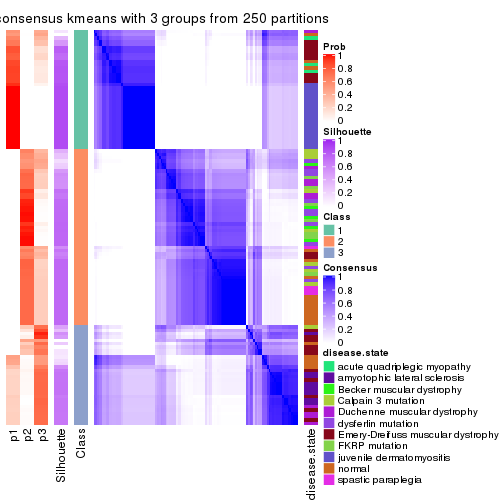</p>

</div>
<div id='tab-SD-kmeans-consensus-heatmap-3'>
<pre><code class="r">consensus_heatmap(res, k = 4)
</code></pre>

<p></p>

</div>
<div id='tab-SD-kmeans-consensus-heatmap-4'>
<pre><code class="r">consensus_heatmap(res, k = 5)
</code></pre>

<p></p>

</div>
<div id='tab-SD-kmeans-consensus-heatmap-5'>
<pre><code class="r">consensus_heatmap(res, k = 6)
</code></pre>

<p></p>

</div>
</div>

Heatmaps for the membership of samples in all partitions to see how consistent they are:


<script>
$( function() {
	$( '#tabs-SD-kmeans-membership-heatmap' ).tabs();
} );
</script>
<div id='tabs-SD-kmeans-membership-heatmap'>
<ul>
<li><a href='#tab-SD-kmeans-membership-heatmap-1'>k = 2</a></li>
<li><a href='#tab-SD-kmeans-membership-heatmap-2'>k = 3</a></li>
<li><a href='#tab-SD-kmeans-membership-heatmap-3'>k = 4</a></li>
<li><a href='#tab-SD-kmeans-membership-heatmap-4'>k = 5</a></li>
<li><a href='#tab-SD-kmeans-membership-heatmap-5'>k = 6</a></li>
</ul>
<div id='tab-SD-kmeans-membership-heatmap-1'>
<pre><code class="r">membership_heatmap(res, k = 2)
</code></pre>

<p></p>

</div>
<div id='tab-SD-kmeans-membership-heatmap-2'>
<pre><code class="r">membership_heatmap(res, k = 3)
</code></pre>

<p></p>

</div>
<div id='tab-SD-kmeans-membership-heatmap-3'>
<pre><code class="r">membership_heatmap(res, k = 4)
</code></pre>

<p></p>

</div>
<div id='tab-SD-kmeans-membership-heatmap-4'>
<pre><code class="r">membership_heatmap(res, k = 5)
</code></pre>

<p></p>

</div>
<div id='tab-SD-kmeans-membership-heatmap-5'>
<pre><code class="r">membership_heatmap(res, k = 6)
</code></pre>

<p></p>

</div>
</div>

As soon as we have had the classes for columns, we can look for signatures
which are significantly different between classes which can be candidate marks
for certain classes. Following are the heatmaps for signatures.


Signature heatmaps where rows are scaled:


<script>
$( function() {
	$( '#tabs-SD-kmeans-get-signatures' ).tabs();
} );
</script>
<div id='tabs-SD-kmeans-get-signatures'>
<ul>
<li><a href='#tab-SD-kmeans-get-signatures-1'>k = 2</a></li>
<li><a href='#tab-SD-kmeans-get-signatures-2'>k = 3</a></li>
<li><a href='#tab-SD-kmeans-get-signatures-3'>k = 4</a></li>
<li><a href='#tab-SD-kmeans-get-signatures-4'>k = 5</a></li>
<li><a href='#tab-SD-kmeans-get-signatures-5'>k = 6</a></li>
</ul>
<div id='tab-SD-kmeans-get-signatures-1'>
<pre><code class="r">get_signatures(res, k = 2)
</code></pre>

<p></p>

</div>
<div id='tab-SD-kmeans-get-signatures-2'>
<pre><code class="r">get_signatures(res, k = 3)
</code></pre>

<p></p>

</div>
<div id='tab-SD-kmeans-get-signatures-3'>
<pre><code class="r">get_signatures(res, k = 4)
</code></pre>

<p></p>

</div>
<div id='tab-SD-kmeans-get-signatures-4'>
<pre><code class="r">get_signatures(res, k = 5)
</code></pre>

<p></p>

</div>
<div id='tab-SD-kmeans-get-signatures-5'>
<pre><code class="r">get_signatures(res, k = 6)
</code></pre>

<p></p>

</div>
</div>


Signature heatmaps where rows are not scaled:


<script>
$( function() {
	$( '#tabs-SD-kmeans-get-signatures-no-scale' ).tabs();
} );
</script>
<div id='tabs-SD-kmeans-get-signatures-no-scale'>
<ul>
<li><a href='#tab-SD-kmeans-get-signatures-no-scale-1'>k = 2</a></li>
<li><a href='#tab-SD-kmeans-get-signatures-no-scale-2'>k = 3</a></li>
<li><a href='#tab-SD-kmeans-get-signatures-no-scale-3'>k = 4</a></li>
<li><a href='#tab-SD-kmeans-get-signatures-no-scale-4'>k = 5</a></li>
<li><a href='#tab-SD-kmeans-get-signatures-no-scale-5'>k = 6</a></li>
</ul>
<div id='tab-SD-kmeans-get-signatures-no-scale-1'>
<pre><code class="r">get_signatures(res, k = 2, scale_rows = FALSE)
</code></pre>

<p></p>

</div>
<div id='tab-SD-kmeans-get-signatures-no-scale-2'>
<pre><code class="r">get_signatures(res, k = 3, scale_rows = FALSE)
</code></pre>

<p></p>

</div>
<div id='tab-SD-kmeans-get-signatures-no-scale-3'>
<pre><code class="r">get_signatures(res, k = 4, scale_rows = FALSE)
</code></pre>

<p></p>

</div>
<div id='tab-SD-kmeans-get-signatures-no-scale-4'>
<pre><code class="r">get_signatures(res, k = 5, scale_rows = FALSE)
</code></pre>

<p></p>

</div>
<div id='tab-SD-kmeans-get-signatures-no-scale-5'>
<pre><code class="r">get_signatures(res, k = 6, scale_rows = FALSE)
</code></pre>

<p></p>

</div>
</div>


Compare the overlap of signatures from different k:

```r
compare_signatures(res)
```


`get_signature()` returns a data frame invisibly. TO get the list of signatures, the function
call should be assigned to a variable explicitly. In following code, if `plot` argument is set
to `FALSE`, no heatmap is plotted while only the differential analysis is performed.

```r
# code only for demonstration
tb = get_signature(res, k = ..., plot = FALSE)
```

An example of the output of `tb` is:

```
#>   which_row         fdr    mean_1    mean_2 scaled_mean_1 scaled_mean_2 km
#> 1        38 0.042760348  8.373488  9.131774    -0.5533452     0.5164555  1
#> 2        40 0.018707592  7.106213  8.469186    -0.6173731     0.5762149  1
#> 3        55 0.019134737 10.221463 11.207825    -0.6159697     0.5749050  1
#> 4        59 0.006059896  5.921854  7.869574    -0.6899429     0.6439467  1
#> 5        60 0.018055526  8.928898 10.211722    -0.6204761     0.5791110  1
#> 6        98 0.009384629 15.714769 14.887706     0.6635654    -0.6193277  2
...
```

The columns in `tb` are:

1. `which_row`: row indices corresponding to the input matrix.
2. `fdr`: FDR for the differential test. 
3. `mean_x`: The mean value in group x.
4. `scaled_mean_x`: The mean value in group x after rows are scaled.
5. `km`: Row groups if k-means clustering is applied to rows.


UMAP plot which shows how samples are separated.


<script>
$( function() {
	$( '#tabs-SD-kmeans-dimension-reduction' ).tabs();
} );
</script>
<div id='tabs-SD-kmeans-dimension-reduction'>
<ul>
<li><a href='#tab-SD-kmeans-dimension-reduction-1'>k = 2</a></li>
<li><a href='#tab-SD-kmeans-dimension-reduction-2'>k = 3</a></li>
<li><a href='#tab-SD-kmeans-dimension-reduction-3'>k = 4</a></li>
<li><a href='#tab-SD-kmeans-dimension-reduction-4'>k = 5</a></li>
<li><a href='#tab-SD-kmeans-dimension-reduction-5'>k = 6</a></li>
</ul>
<div id='tab-SD-kmeans-dimension-reduction-1'>
<pre><code class="r">dimension_reduction(res, k = 2, method = &quot;UMAP&quot;)
</code></pre>

<p></p>

</div>
<div id='tab-SD-kmeans-dimension-reduction-2'>
<pre><code class="r">dimension_reduction(res, k = 3, method = &quot;UMAP&quot;)
</code></pre>

<p></p>

</div>
<div id='tab-SD-kmeans-dimension-reduction-3'>
<pre><code class="r">dimension_reduction(res, k = 4, method = &quot;UMAP&quot;)
</code></pre>

<p></p>

</div>
<div id='tab-SD-kmeans-dimension-reduction-4'>
<pre><code class="r">dimension_reduction(res, k = 5, method = &quot;UMAP&quot;)
</code></pre>

<p></p>

</div>
<div id='tab-SD-kmeans-dimension-reduction-5'>
<pre><code class="r">dimension_reduction(res, k = 6, method = &quot;UMAP&quot;)
</code></pre>

<p></p>

</div>
</div>


Following heatmap shows how subgroups are split when increasing `k`:

```r
collect_classes(res)
```


Test correlation between subgroups and known annotations. If the known
annotation is numeric, one-way ANOVA test is applied, and if the known
annotation is discrete, chi-squared contingency table test is applied.

```r
test_to_known_factors(res)
```

```
#>             n disease.state(p) k
#> SD:kmeans 111         2.81e-09 2
#> SD:kmeans 100         5.05e-19 3
#> SD:kmeans 100         1.50e-22 4
#> SD:kmeans  80         1.19e-20 5
#> SD:kmeans  94         5.79e-25 6
```


If matrix rows can be associated to genes, consider to use `functional_enrichment(res,
...)` to perform function enrichment for the signature genes. See [this vignette](http://bioconductor.org/packages/devel/bioc/vignettes/cola/inst/doc/functional_enrichment.html) for more detailed explanations.


 

---------------------------------------------------


### SD:skmeans


The object with results only for a single top-value method and a single partition method 
can be extracted as:

```r
res = res_list["SD", "skmeans"]
# you can also extract it by
# res = res_list["SD:skmeans"]
```

A summary of `res` and all the functions that can be applied to it:

```r
res
```

```
#> A 'ConsensusPartition' object with k = 2, 3, 4, 5, 6.
#>   On a matrix with 21512 rows and 119 columns.
#>   Top rows (1000, 2000, 3000, 4000, 5000) are extracted by 'SD' method.
#>   Subgroups are detected by 'skmeans' method.
#>   Performed in total 1250 partitions by row resampling.
#>   Best k for subgroups seems to be 2.
#> 
#> Following methods can be applied to this 'ConsensusPartition' object:
#>  [1] "cola_report"             "collect_classes"         "collect_plots"          
#>  [4] "collect_stats"           "colnames"                "compare_signatures"     
#>  [7] "consensus_heatmap"       "dimension_reduction"     "functional_enrichment"  
#> [10] "get_anno_col"            "get_anno"                "get_classes"            
#> [13] "get_consensus"           "get_matrix"              "get_membership"         
#> [16] "get_param"               "get_signatures"          "get_stats"              
#> [19] "is_best_k"               "is_stable_k"             "membership_heatmap"     
#> [22] "ncol"                    "nrow"                    "plot_ecdf"              
#> [25] "rownames"                "select_partition_number" "show"                   
#> [28] "suggest_best_k"          "test_to_known_factors"
```

`collect_plots()` function collects all the plots made from `res` for all `k` (number of partitions)
into one single page to provide an easy and fast comparison between different `k`.

```r
collect_plots(res)
```


The plots are:

- The first row: a plot of the ECDF (empirical cumulative distribution
  function) curves of the consensus matrix for each `k` and the heatmap of
  predicted classes for each `k`.
- The second row: heatmaps of the consensus matrix for each `k`.
- The third row: heatmaps of the membership matrix for each `k`.
- The fouth row: heatmaps of the signatures for each `k`.

All the plots in panels can be made by individual functions and they are
plotted later in this section.

`select_partition_number()` produces several plots showing different
statistics for choosing "optimized" `k`. There are following statistics:

- ECDF curves of the consensus matrix for each `k`;
- 1-PAC. [The PAC
  score](https://en.wikipedia.org/wiki/Consensus_clustering#Over-interpretation_potential_of_consensus_clustering)
  measures the proportion of the ambiguous subgrouping.
- Mean silhouette score.
- Concordance. The mean probability of fiting the consensus class ids in all
  partitions.
- Area increased. Denote $A_k$ as the area under the ECDF curve for current
  `k`, the area increased is defined as $A_k - A_{k-1}$.
- Rand index. The percent of pairs of samples that are both in a same cluster
  or both are not in a same cluster in the partition of k and k-1.
- Jaccard index. The ratio of pairs of samples are both in a same cluster in
  the partition of k and k-1 and the pairs of samples are both in a same
  cluster in the partition k or k-1.

The detailed explanations of these statistics can be found in [the _cola_
vignette](http://bioconductor.org/packages/devel/bioc/vignettes/cola/inst/doc/cola.html#toc_13).

Generally speaking, lower PAC score, higher mean silhouette score or higher
concordance corresponds to better partition. Rand index and Jaccard index
measure how similar the current partition is compared to partition with `k-1`.
If they are too similar, we won't accept `k` is better than `k-1`.

```r
select_partition_number(res)
```


The numeric values for all these statistics can be obtained by `get_stats()`.

```r
get_stats(res)
```

```
#>   k 1-PAC mean_silhouette concordance area_increased  Rand Jaccard
#> 2 2 0.899           0.943       0.975         0.5022 0.496   0.496
#> 3 3 0.768           0.849       0.923         0.2790 0.830   0.669
#> 4 4 0.687           0.668       0.848         0.1371 0.870   0.664
#> 5 5 0.698           0.698       0.833         0.0638 0.894   0.650
#> 6 6 0.737           0.734       0.834         0.0427 0.965   0.845
```

`suggest_best_k()` suggests the best $k$ based on these statistics. The rules are as follows:

- All $k$ with Jaccard index larger than 0.95 are removed because increasing
  $k$ does not provide enough extra information. If all $k$ are removed, it is
  marked as no subgroup is detected.
- For all $k$ with 1-PAC score larger than 0.9, the maximal $k$ is taken as
  the best $k$, and other $k$ are marked as optional $k$.
- If it does not fit the second rule. The $k$ with the maximal vote of the
  highest 1-PAC score, highest mean silhouette, and highest concordance is
  taken as the best $k$.

```r
suggest_best_k(res)
```

```
#> [1] 2
```


Following shows the table of the partitions (You need to click the **show/hide
code output** link to see it). The membership matrix (columns with name `p*`)
is inferred by
[`clue::cl_consensus()`](https://www.rdocumentation.org/link/cl_consensus?package=clue)
function with the `SE` method. Basically the value in the membership matrix
represents the probability to belong to a certain group. The finall class
label for an item is determined with the group with highest probability it
belongs to.

In `get_classes()` function, the entropy is calculated from the membership
matrix and the silhouette score is calculated from the consensus matrix.


<script>
$( function() {
	$( '#tabs-SD-skmeans-get-classes' ).tabs();
} );
</script>
<div id='tabs-SD-skmeans-get-classes'>
<ul>
<li><a href='#tab-SD-skmeans-get-classes-1'>k = 2</a></li>
<li><a href='#tab-SD-skmeans-get-classes-2'>k = 3</a></li>
<li><a href='#tab-SD-skmeans-get-classes-3'>k = 4</a></li>
<li><a href='#tab-SD-skmeans-get-classes-4'>k = 5</a></li>
<li><a href='#tab-SD-skmeans-get-classes-5'>k = 6</a></li>
</ul>

<div id='tab-SD-skmeans-get-classes-1'>
<p><a id='tab-SD-skmeans-get-classes-1-a' style='color:#0366d6' href='#'>show/hide code output</a></p>
<pre><code class="r">cbind(get_classes(res, k = 2), get_membership(res, k = 2))
</code></pre>

<pre><code>#&gt;           class entropy silhouette    p1    p2
#&gt; GSM120719     1  0.0000      0.958 1.000 0.000
#&gt; GSM120720     1  0.0000      0.958 1.000 0.000
#&gt; GSM120765     2  0.0000      0.988 0.000 1.000
#&gt; GSM120767     2  0.0000      0.988 0.000 1.000
#&gt; GSM120784     2  0.0000      0.988 0.000 1.000
#&gt; GSM121400     1  0.0000      0.958 1.000 0.000
#&gt; GSM121401     1  0.0000      0.958 1.000 0.000
#&gt; GSM121402     2  0.0000      0.988 0.000 1.000
#&gt; GSM121403     1  0.8016      0.701 0.756 0.244
#&gt; GSM121404     2  0.0000      0.988 0.000 1.000
#&gt; GSM121405     1  0.0000      0.958 1.000 0.000
#&gt; GSM121406     2  0.0000      0.988 0.000 1.000
#&gt; GSM121408     2  0.0000      0.988 0.000 1.000
#&gt; GSM121409     1  0.0000      0.958 1.000 0.000
#&gt; GSM121410     1  0.0000      0.958 1.000 0.000
#&gt; GSM121412     2  0.0000      0.988 0.000 1.000
#&gt; GSM121413     2  0.0000      0.988 0.000 1.000
#&gt; GSM121414     2  0.0000      0.988 0.000 1.000
#&gt; GSM121415     2  0.0000      0.988 0.000 1.000
#&gt; GSM121416     2  0.0000      0.988 0.000 1.000
#&gt; GSM120591     1  0.0000      0.958 1.000 0.000
#&gt; GSM120594     1  0.0000      0.958 1.000 0.000
#&gt; GSM120718     1  0.0000      0.958 1.000 0.000
#&gt; GSM121205     1  0.0000      0.958 1.000 0.000
#&gt; GSM121206     1  0.0000      0.958 1.000 0.000
#&gt; GSM121207     1  0.0000      0.958 1.000 0.000
#&gt; GSM121208     1  0.0000      0.958 1.000 0.000
#&gt; GSM121209     1  0.0000      0.958 1.000 0.000
#&gt; GSM121210     1  0.0000      0.958 1.000 0.000
#&gt; GSM121211     1  0.0000      0.958 1.000 0.000
#&gt; GSM121212     1  0.0000      0.958 1.000 0.000
#&gt; GSM121213     1  0.0000      0.958 1.000 0.000
#&gt; GSM121214     1  0.0000      0.958 1.000 0.000
#&gt; GSM121215     1  0.0000      0.958 1.000 0.000
#&gt; GSM121216     1  0.0000      0.958 1.000 0.000
#&gt; GSM121217     1  0.0000      0.958 1.000 0.000
#&gt; GSM121218     1  0.0000      0.958 1.000 0.000
#&gt; GSM121234     1  0.0000      0.958 1.000 0.000
#&gt; GSM121243     1  0.0000      0.958 1.000 0.000
#&gt; GSM121245     1  0.0000      0.958 1.000 0.000
#&gt; GSM121246     1  0.0000      0.958 1.000 0.000
#&gt; GSM121247     1  0.0000      0.958 1.000 0.000
#&gt; GSM121248     1  0.0000      0.958 1.000 0.000
#&gt; GSM120744     1  0.9944      0.236 0.544 0.456
#&gt; GSM120745     1  0.0000      0.958 1.000 0.000
#&gt; GSM120746     1  0.7056      0.776 0.808 0.192
#&gt; GSM120747     1  0.7056      0.776 0.808 0.192
#&gt; GSM120748     2  0.7453      0.710 0.212 0.788
#&gt; GSM120749     1  0.0000      0.958 1.000 0.000
#&gt; GSM120750     1  0.7528      0.746 0.784 0.216
#&gt; GSM120751     1  0.6973      0.781 0.812 0.188
#&gt; GSM120752     1  0.0000      0.958 1.000 0.000
#&gt; GSM121336     2  0.0000      0.988 0.000 1.000
#&gt; GSM121339     2  0.0000      0.988 0.000 1.000
#&gt; GSM121349     2  0.0000      0.988 0.000 1.000
#&gt; GSM121355     2  0.0000      0.988 0.000 1.000
#&gt; GSM120757     1  0.7139      0.772 0.804 0.196
#&gt; GSM120766     1  0.9661      0.416 0.608 0.392
#&gt; GSM120770     2  0.0000      0.988 0.000 1.000
#&gt; GSM120779     1  0.0000      0.958 1.000 0.000
#&gt; GSM120780     2  0.0376      0.985 0.004 0.996
#&gt; GSM121102     2  0.0000      0.988 0.000 1.000
#&gt; GSM121203     1  0.8555      0.648 0.720 0.280
#&gt; GSM121204     1  0.0000      0.958 1.000 0.000
#&gt; GSM121330     1  0.0000      0.958 1.000 0.000
#&gt; GSM121335     1  0.0000      0.958 1.000 0.000
#&gt; GSM121337     2  0.0000      0.988 0.000 1.000
#&gt; GSM121338     2  0.0000      0.988 0.000 1.000
#&gt; GSM121341     1  0.0000      0.958 1.000 0.000
#&gt; GSM121342     1  0.0000      0.958 1.000 0.000
#&gt; GSM121343     2  0.0000      0.988 0.000 1.000
#&gt; GSM121344     1  0.0000      0.958 1.000 0.000
#&gt; GSM121346     1  0.0000      0.958 1.000 0.000
#&gt; GSM121347     2  0.0000      0.988 0.000 1.000
#&gt; GSM121348     2  0.0000      0.988 0.000 1.000
#&gt; GSM121350     1  0.0000      0.958 1.000 0.000
#&gt; GSM121352     1  0.0000      0.958 1.000 0.000
#&gt; GSM121354     1  0.0000      0.958 1.000 0.000
#&gt; GSM120753     2  0.0000      0.988 0.000 1.000
#&gt; GSM120761     2  0.0000      0.988 0.000 1.000
#&gt; GSM120768     2  0.0000      0.988 0.000 1.000
#&gt; GSM120781     2  0.0000      0.988 0.000 1.000
#&gt; GSM120788     2  0.0000      0.988 0.000 1.000
#&gt; GSM120760     2  0.0000      0.988 0.000 1.000
#&gt; GSM120763     2  0.0000      0.988 0.000 1.000
#&gt; GSM120764     2  0.0000      0.988 0.000 1.000
#&gt; GSM120777     2  0.0000      0.988 0.000 1.000
#&gt; GSM120786     2  0.0000      0.988 0.000 1.000
#&gt; GSM121329     1  0.0000      0.958 1.000 0.000
#&gt; GSM121331     1  0.0000      0.958 1.000 0.000
#&gt; GSM121333     1  0.0000      0.958 1.000 0.000
#&gt; GSM121345     1  0.0000      0.958 1.000 0.000
#&gt; GSM121356     1  0.0000      0.958 1.000 0.000
#&gt; GSM120754     2  0.0000      0.988 0.000 1.000
#&gt; GSM120759     2  0.0000      0.988 0.000 1.000
#&gt; GSM120762     2  0.0000      0.988 0.000 1.000
#&gt; GSM120775     2  0.0000      0.988 0.000 1.000
#&gt; GSM120776     2  0.0000      0.988 0.000 1.000
#&gt; GSM120782     2  0.0000      0.988 0.000 1.000
#&gt; GSM120789     2  0.0000      0.988 0.000 1.000
#&gt; GSM120790     2  0.0000      0.988 0.000 1.000
#&gt; GSM120791     2  0.0000      0.988 0.000 1.000
#&gt; GSM120755     2  0.0000      0.988 0.000 1.000
#&gt; GSM120756     2  0.8207      0.651 0.256 0.744
#&gt; GSM120769     2  0.0000      0.988 0.000 1.000
#&gt; GSM120778     2  0.0000      0.988 0.000 1.000
#&gt; GSM120792     2  0.0000      0.988 0.000 1.000
#&gt; GSM121332     2  0.0000      0.988 0.000 1.000
#&gt; GSM121334     2  0.0000      0.988 0.000 1.000
#&gt; GSM121340     2  0.0000      0.988 0.000 1.000
#&gt; GSM121351     2  0.0000      0.988 0.000 1.000
#&gt; GSM121353     2  0.6712      0.777 0.176 0.824
#&gt; GSM120758     2  0.0000      0.988 0.000 1.000
#&gt; GSM120771     2  0.0000      0.988 0.000 1.000
#&gt; GSM120772     2  0.0000      0.988 0.000 1.000
#&gt; GSM120773     2  0.0000      0.988 0.000 1.000
#&gt; GSM120774     2  0.0000      0.988 0.000 1.000
#&gt; GSM120783     2  0.0000      0.988 0.000 1.000
#&gt; GSM120787     2  0.0000      0.988 0.000 1.000
</code></pre>

<script>
$('#tab-SD-skmeans-get-classes-1-a').parent().next().next().hide();
$('#tab-SD-skmeans-get-classes-1-a').click(function(){
  $('#tab-SD-skmeans-get-classes-1-a').parent().next().next().toggle();
  return(false);
});
</script>
</div>

<div id='tab-SD-skmeans-get-classes-2'>
<p><a id='tab-SD-skmeans-get-classes-2-a' style='color:#0366d6' href='#'>show/hide code output</a></p>
<pre><code class="r">cbind(get_classes(res, k = 3), get_membership(res, k = 3))
</code></pre>

<pre><code>#&gt;           class entropy silhouette    p1    p2    p3
#&gt; GSM120719     1  0.0000      0.932 1.000 0.000 0.000
#&gt; GSM120720     1  0.0424      0.930 0.992 0.000 0.008
#&gt; GSM120765     2  0.0000      0.943 0.000 1.000 0.000
#&gt; GSM120767     2  0.0000      0.943 0.000 1.000 0.000
#&gt; GSM120784     2  0.0000      0.943 0.000 1.000 0.000
#&gt; GSM121400     1  0.5291      0.710 0.732 0.000 0.268
#&gt; GSM121401     1  0.4605      0.781 0.796 0.000 0.204
#&gt; GSM121402     2  0.0000      0.943 0.000 1.000 0.000
#&gt; GSM121403     1  0.9612      0.173 0.452 0.216 0.332
#&gt; GSM121404     2  0.3340      0.829 0.000 0.880 0.120
#&gt; GSM121405     1  0.4605      0.781 0.796 0.000 0.204
#&gt; GSM121406     2  0.0000      0.943 0.000 1.000 0.000
#&gt; GSM121408     2  0.0000      0.943 0.000 1.000 0.000
#&gt; GSM121409     1  0.5465      0.683 0.712 0.000 0.288
#&gt; GSM121410     1  0.5291      0.709 0.732 0.000 0.268
#&gt; GSM121412     2  0.0000      0.943 0.000 1.000 0.000
#&gt; GSM121413     2  0.0000      0.943 0.000 1.000 0.000
#&gt; GSM121414     2  0.0000      0.943 0.000 1.000 0.000
#&gt; GSM121415     2  0.0000      0.943 0.000 1.000 0.000
#&gt; GSM121416     2  0.0000      0.943 0.000 1.000 0.000
#&gt; GSM120591     1  0.0592      0.928 0.988 0.000 0.012
#&gt; GSM120594     1  0.0592      0.928 0.988 0.000 0.012
#&gt; GSM120718     1  0.0000      0.932 1.000 0.000 0.000
#&gt; GSM121205     1  0.0000      0.932 1.000 0.000 0.000
#&gt; GSM121206     1  0.0000      0.932 1.000 0.000 0.000
#&gt; GSM121207     1  0.0000      0.932 1.000 0.000 0.000
#&gt; GSM121208     1  0.0000      0.932 1.000 0.000 0.000
#&gt; GSM121209     1  0.0000      0.932 1.000 0.000 0.000
#&gt; GSM121210     1  0.0000      0.932 1.000 0.000 0.000
#&gt; GSM121211     1  0.0000      0.932 1.000 0.000 0.000
#&gt; GSM121212     1  0.0000      0.932 1.000 0.000 0.000
#&gt; GSM121213     1  0.0000      0.932 1.000 0.000 0.000
#&gt; GSM121214     1  0.0000      0.932 1.000 0.000 0.000
#&gt; GSM121215     1  0.0000      0.932 1.000 0.000 0.000
#&gt; GSM121216     1  0.0000      0.932 1.000 0.000 0.000
#&gt; GSM121217     1  0.0000      0.932 1.000 0.000 0.000
#&gt; GSM121218     1  0.0000      0.932 1.000 0.000 0.000
#&gt; GSM121234     1  0.0000      0.932 1.000 0.000 0.000
#&gt; GSM121243     1  0.0000      0.932 1.000 0.000 0.000
#&gt; GSM121245     1  0.0000      0.932 1.000 0.000 0.000
#&gt; GSM121246     1  0.0000      0.932 1.000 0.000 0.000
#&gt; GSM121247     1  0.0000      0.932 1.000 0.000 0.000
#&gt; GSM121248     1  0.0000      0.932 1.000 0.000 0.000
#&gt; GSM120744     3  0.1585      0.814 0.008 0.028 0.964
#&gt; GSM120745     3  0.1289      0.805 0.032 0.000 0.968
#&gt; GSM120746     3  0.1585      0.814 0.008 0.028 0.964
#&gt; GSM120747     3  0.1832      0.812 0.008 0.036 0.956
#&gt; GSM120748     3  0.2448      0.799 0.000 0.076 0.924
#&gt; GSM120749     3  0.1289      0.805 0.032 0.000 0.968
#&gt; GSM120750     3  0.1585      0.814 0.008 0.028 0.964
#&gt; GSM120751     3  0.1453      0.813 0.008 0.024 0.968
#&gt; GSM120752     3  0.1289      0.805 0.032 0.000 0.968
#&gt; GSM121336     2  0.0000      0.943 0.000 1.000 0.000
#&gt; GSM121339     2  0.2356      0.883 0.000 0.928 0.072
#&gt; GSM121349     2  0.0000      0.943 0.000 1.000 0.000
#&gt; GSM121355     2  0.0000      0.943 0.000 1.000 0.000
#&gt; GSM120757     3  0.3500      0.787 0.116 0.004 0.880
#&gt; GSM120766     3  0.0848      0.810 0.008 0.008 0.984
#&gt; GSM120770     2  0.0592      0.936 0.000 0.988 0.012
#&gt; GSM120779     3  0.4605      0.740 0.204 0.000 0.796
#&gt; GSM120780     3  0.3267      0.782 0.000 0.116 0.884
#&gt; GSM121102     2  0.6008      0.371 0.000 0.628 0.372
#&gt; GSM121203     3  0.3129      0.791 0.008 0.088 0.904
#&gt; GSM121204     3  0.5016      0.710 0.240 0.000 0.760
#&gt; GSM121330     1  0.3412      0.855 0.876 0.000 0.124
#&gt; GSM121335     1  0.0424      0.930 0.992 0.000 0.008
#&gt; GSM121337     2  0.0000      0.943 0.000 1.000 0.000
#&gt; GSM121338     2  0.5291      0.607 0.000 0.732 0.268
#&gt; GSM121341     1  0.0424      0.930 0.992 0.000 0.008
#&gt; GSM121342     1  0.0424      0.930 0.992 0.000 0.008
#&gt; GSM121343     2  0.4974      0.662 0.000 0.764 0.236
#&gt; GSM121344     1  0.0424      0.930 0.992 0.000 0.008
#&gt; GSM121346     1  0.4062      0.821 0.836 0.000 0.164
#&gt; GSM121347     2  0.0592      0.939 0.000 0.988 0.012
#&gt; GSM121348     3  0.5988      0.455 0.000 0.368 0.632
#&gt; GSM121350     1  0.4002      0.825 0.840 0.000 0.160
#&gt; GSM121352     1  0.3412      0.855 0.876 0.000 0.124
#&gt; GSM121354     1  0.3116      0.866 0.892 0.000 0.108
#&gt; GSM120753     2  0.0000      0.943 0.000 1.000 0.000
#&gt; GSM120761     2  0.0000      0.943 0.000 1.000 0.000
#&gt; GSM120768     2  0.0592      0.937 0.000 0.988 0.012
#&gt; GSM120781     2  0.0000      0.943 0.000 1.000 0.000
#&gt; GSM120788     3  0.6410      0.318 0.004 0.420 0.576
#&gt; GSM120760     2  0.1964      0.911 0.000 0.944 0.056
#&gt; GSM120763     2  0.1643      0.918 0.000 0.956 0.044
#&gt; GSM120764     2  0.3941      0.816 0.000 0.844 0.156
#&gt; GSM120777     3  0.6244      0.259 0.000 0.440 0.560
#&gt; GSM120786     2  0.3551      0.843 0.000 0.868 0.132
#&gt; GSM121329     1  0.0000      0.932 1.000 0.000 0.000
#&gt; GSM121331     3  0.4605      0.740 0.204 0.000 0.796
#&gt; GSM121333     3  0.4605      0.740 0.204 0.000 0.796
#&gt; GSM121345     3  0.5178      0.684 0.256 0.000 0.744
#&gt; GSM121356     3  0.4452      0.748 0.192 0.000 0.808
#&gt; GSM120754     2  0.3752      0.831 0.000 0.856 0.144
#&gt; GSM120759     2  0.0000      0.943 0.000 1.000 0.000
#&gt; GSM120762     2  0.0000      0.943 0.000 1.000 0.000
#&gt; GSM120775     2  0.6026      0.372 0.000 0.624 0.376
#&gt; GSM120776     3  0.5678      0.713 0.032 0.192 0.776
#&gt; GSM120782     2  0.4121      0.784 0.000 0.832 0.168
#&gt; GSM120789     2  0.0000      0.943 0.000 1.000 0.000
#&gt; GSM120790     2  0.0237      0.941 0.000 0.996 0.004
#&gt; GSM120791     2  0.1529      0.921 0.000 0.960 0.040
#&gt; GSM120755     2  0.0000      0.943 0.000 1.000 0.000
#&gt; GSM120756     3  0.8395      0.433 0.096 0.356 0.548
#&gt; GSM120769     2  0.0000      0.943 0.000 1.000 0.000
#&gt; GSM120778     2  0.0747      0.935 0.000 0.984 0.016
#&gt; GSM120792     2  0.0424      0.939 0.000 0.992 0.008
#&gt; GSM121332     2  0.0000      0.943 0.000 1.000 0.000
#&gt; GSM121334     2  0.0000      0.943 0.000 1.000 0.000
#&gt; GSM121340     2  0.2711      0.885 0.000 0.912 0.088
#&gt; GSM121351     2  0.0000      0.943 0.000 1.000 0.000
#&gt; GSM121353     2  0.4453      0.811 0.012 0.836 0.152
#&gt; GSM120758     2  0.0000      0.943 0.000 1.000 0.000
#&gt; GSM120771     2  0.0000      0.943 0.000 1.000 0.000
#&gt; GSM120772     2  0.0000      0.943 0.000 1.000 0.000
#&gt; GSM120773     2  0.2261      0.902 0.000 0.932 0.068
#&gt; GSM120774     2  0.0424      0.939 0.000 0.992 0.008
#&gt; GSM120783     2  0.2959      0.875 0.000 0.900 0.100
#&gt; GSM120787     2  0.0000      0.943 0.000 1.000 0.000
</code></pre>

<script>
$('#tab-SD-skmeans-get-classes-2-a').parent().next().next().hide();
$('#tab-SD-skmeans-get-classes-2-a').click(function(){
  $('#tab-SD-skmeans-get-classes-2-a').parent().next().next().toggle();
  return(false);
});
</script>
</div>

<div id='tab-SD-skmeans-get-classes-3'>
<p><a id='tab-SD-skmeans-get-classes-3-a' style='color:#0366d6' href='#'>show/hide code output</a></p>
<pre><code class="r">cbind(get_classes(res, k = 4), get_membership(res, k = 4))
</code></pre>

<pre><code>#&gt;           class entropy silhouette    p1    p2    p3    p4
#&gt; GSM120719     1  0.0000    0.90011 1.000 0.000 0.000 0.000
#&gt; GSM120720     1  0.1209    0.88810 0.964 0.000 0.032 0.004
#&gt; GSM120765     2  0.0000    0.81034 0.000 1.000 0.000 0.000
#&gt; GSM120767     2  0.1474    0.80132 0.000 0.948 0.000 0.052
#&gt; GSM120784     2  0.0000    0.81034 0.000 1.000 0.000 0.000
#&gt; GSM121400     1  0.5856    0.26308 0.504 0.000 0.464 0.032
#&gt; GSM121401     1  0.5815    0.35942 0.540 0.000 0.428 0.032
#&gt; GSM121402     2  0.0000    0.81034 0.000 1.000 0.000 0.000
#&gt; GSM121403     2  0.6461    0.00497 0.020 0.488 0.460 0.032
#&gt; GSM121404     2  0.3450    0.68844 0.000 0.836 0.156 0.008
#&gt; GSM121405     1  0.5827    0.34026 0.532 0.000 0.436 0.032
#&gt; GSM121406     2  0.0000    0.81034 0.000 1.000 0.000 0.000
#&gt; GSM121408     2  0.0000    0.81034 0.000 1.000 0.000 0.000
#&gt; GSM121409     3  0.6291    0.00190 0.404 0.016 0.548 0.032
#&gt; GSM121410     1  0.6547    0.23963 0.492 0.024 0.452 0.032
#&gt; GSM121412     2  0.0000    0.81034 0.000 1.000 0.000 0.000
#&gt; GSM121413     2  0.0000    0.81034 0.000 1.000 0.000 0.000
#&gt; GSM121414     2  0.0000    0.81034 0.000 1.000 0.000 0.000
#&gt; GSM121415     2  0.0000    0.81034 0.000 1.000 0.000 0.000
#&gt; GSM121416     2  0.0336    0.81032 0.000 0.992 0.000 0.008
#&gt; GSM120591     1  0.2125    0.86689 0.920 0.000 0.076 0.004
#&gt; GSM120594     1  0.1209    0.88810 0.964 0.000 0.032 0.004
#&gt; GSM120718     1  0.0376    0.89782 0.992 0.000 0.004 0.004
#&gt; GSM121205     1  0.0000    0.90011 1.000 0.000 0.000 0.000
#&gt; GSM121206     1  0.0000    0.90011 1.000 0.000 0.000 0.000
#&gt; GSM121207     1  0.0000    0.90011 1.000 0.000 0.000 0.000
#&gt; GSM121208     1  0.0000    0.90011 1.000 0.000 0.000 0.000
#&gt; GSM121209     1  0.0000    0.90011 1.000 0.000 0.000 0.000
#&gt; GSM121210     1  0.0000    0.90011 1.000 0.000 0.000 0.000
#&gt; GSM121211     1  0.0000    0.90011 1.000 0.000 0.000 0.000
#&gt; GSM121212     1  0.0000    0.90011 1.000 0.000 0.000 0.000
#&gt; GSM121213     1  0.0000    0.90011 1.000 0.000 0.000 0.000
#&gt; GSM121214     1  0.0000    0.90011 1.000 0.000 0.000 0.000
#&gt; GSM121215     1  0.0000    0.90011 1.000 0.000 0.000 0.000
#&gt; GSM121216     1  0.0000    0.90011 1.000 0.000 0.000 0.000
#&gt; GSM121217     1  0.0000    0.90011 1.000 0.000 0.000 0.000
#&gt; GSM121218     1  0.0000    0.90011 1.000 0.000 0.000 0.000
#&gt; GSM121234     1  0.0000    0.90011 1.000 0.000 0.000 0.000
#&gt; GSM121243     1  0.0000    0.90011 1.000 0.000 0.000 0.000
#&gt; GSM121245     1  0.0000    0.90011 1.000 0.000 0.000 0.000
#&gt; GSM121246     1  0.0000    0.90011 1.000 0.000 0.000 0.000
#&gt; GSM121247     1  0.0000    0.90011 1.000 0.000 0.000 0.000
#&gt; GSM121248     1  0.0000    0.90011 1.000 0.000 0.000 0.000
#&gt; GSM120744     3  0.0000    0.83240 0.000 0.000 1.000 0.000
#&gt; GSM120745     3  0.0000    0.83240 0.000 0.000 1.000 0.000
#&gt; GSM120746     3  0.0000    0.83240 0.000 0.000 1.000 0.000
#&gt; GSM120747     3  0.0000    0.83240 0.000 0.000 1.000 0.000
#&gt; GSM120748     3  0.0000    0.83240 0.000 0.000 1.000 0.000
#&gt; GSM120749     3  0.0000    0.83240 0.000 0.000 1.000 0.000
#&gt; GSM120750     3  0.0000    0.83240 0.000 0.000 1.000 0.000
#&gt; GSM120751     3  0.0000    0.83240 0.000 0.000 1.000 0.000
#&gt; GSM120752     3  0.0000    0.83240 0.000 0.000 1.000 0.000
#&gt; GSM121336     2  0.0000    0.81034 0.000 1.000 0.000 0.000
#&gt; GSM121339     2  0.3257    0.69590 0.000 0.844 0.152 0.004
#&gt; GSM121349     2  0.0000    0.81034 0.000 1.000 0.000 0.000
#&gt; GSM121355     2  0.0000    0.81034 0.000 1.000 0.000 0.000
#&gt; GSM120757     4  0.5780   -0.00167 0.028 0.000 0.476 0.496
#&gt; GSM120766     3  0.5461   -0.02822 0.004 0.008 0.508 0.480
#&gt; GSM120770     2  0.0188    0.80891 0.000 0.996 0.004 0.000
#&gt; GSM120779     4  0.6074    0.03005 0.044 0.000 0.456 0.500
#&gt; GSM120780     3  0.5560    0.52964 0.000 0.156 0.728 0.116
#&gt; GSM121102     2  0.4356    0.53826 0.000 0.708 0.292 0.000
#&gt; GSM121203     3  0.0000    0.83240 0.000 0.000 1.000 0.000
#&gt; GSM121204     3  0.7382    0.24415 0.208 0.000 0.516 0.276
#&gt; GSM121330     1  0.4375    0.75718 0.788 0.000 0.180 0.032
#&gt; GSM121335     1  0.2124    0.87415 0.932 0.000 0.040 0.028
#&gt; GSM121337     2  0.0817    0.80850 0.000 0.976 0.000 0.024
#&gt; GSM121338     2  0.5511    0.34846 0.000 0.620 0.352 0.028
#&gt; GSM121341     1  0.2214    0.87192 0.928 0.000 0.044 0.028
#&gt; GSM121342     1  0.1174    0.89028 0.968 0.000 0.012 0.020
#&gt; GSM121343     2  0.5105    0.50229 0.000 0.696 0.276 0.028
#&gt; GSM121344     1  0.2699    0.85691 0.904 0.000 0.068 0.028
#&gt; GSM121346     1  0.5141    0.65053 0.700 0.000 0.268 0.032
#&gt; GSM121347     2  0.3428    0.73356 0.000 0.844 0.012 0.144
#&gt; GSM121348     4  0.7139    0.26365 0.000 0.360 0.140 0.500
#&gt; GSM121350     1  0.5321    0.60936 0.672 0.000 0.296 0.032
#&gt; GSM121352     1  0.4764    0.71207 0.748 0.000 0.220 0.032
#&gt; GSM121354     1  0.3958    0.79248 0.824 0.000 0.144 0.032
#&gt; GSM120753     2  0.4040    0.67139 0.000 0.752 0.000 0.248
#&gt; GSM120761     2  0.4500    0.58250 0.000 0.684 0.000 0.316
#&gt; GSM120768     2  0.5000    0.18545 0.000 0.504 0.000 0.496
#&gt; GSM120781     2  0.3726    0.70453 0.000 0.788 0.000 0.212
#&gt; GSM120788     4  0.1182    0.63622 0.000 0.016 0.016 0.968
#&gt; GSM120760     4  0.4382    0.44189 0.000 0.296 0.000 0.704
#&gt; GSM120763     4  0.4522    0.39362 0.000 0.320 0.000 0.680
#&gt; GSM120764     4  0.2216    0.66810 0.000 0.092 0.000 0.908
#&gt; GSM120777     4  0.1151    0.64172 0.000 0.024 0.008 0.968
#&gt; GSM120786     4  0.3123    0.64415 0.000 0.156 0.000 0.844
#&gt; GSM121329     1  0.0188    0.89829 0.996 0.000 0.000 0.004
#&gt; GSM121331     4  0.6192    0.06426 0.052 0.000 0.436 0.512
#&gt; GSM121333     4  0.6261    0.05038 0.056 0.000 0.440 0.504
#&gt; GSM121345     4  0.6774    0.18866 0.120 0.000 0.312 0.568
#&gt; GSM121356     4  0.6204    0.03807 0.052 0.000 0.448 0.500
#&gt; GSM120754     4  0.2589    0.67020 0.000 0.116 0.000 0.884
#&gt; GSM120759     2  0.0188    0.81020 0.000 0.996 0.000 0.004
#&gt; GSM120762     2  0.3172    0.74374 0.000 0.840 0.000 0.160
#&gt; GSM120775     4  0.1824    0.65852 0.000 0.060 0.004 0.936
#&gt; GSM120776     4  0.4008    0.43914 0.000 0.000 0.244 0.756
#&gt; GSM120782     4  0.6497    0.34846 0.000 0.304 0.100 0.596
#&gt; GSM120789     2  0.1637    0.79997 0.000 0.940 0.000 0.060
#&gt; GSM120790     2  0.0469    0.80895 0.000 0.988 0.000 0.012
#&gt; GSM120791     4  0.4730    0.27662 0.000 0.364 0.000 0.636
#&gt; GSM120755     2  0.2647    0.76981 0.000 0.880 0.000 0.120
#&gt; GSM120756     4  0.1262    0.63098 0.016 0.008 0.008 0.968
#&gt; GSM120769     2  0.4356    0.61914 0.000 0.708 0.000 0.292
#&gt; GSM120778     2  0.4941    0.34775 0.000 0.564 0.000 0.436
#&gt; GSM120792     2  0.4985    0.26611 0.000 0.532 0.000 0.468
#&gt; GSM121332     2  0.1792    0.79733 0.000 0.932 0.000 0.068
#&gt; GSM121334     2  0.4277    0.63381 0.000 0.720 0.000 0.280
#&gt; GSM121340     4  0.2868    0.65944 0.000 0.136 0.000 0.864
#&gt; GSM121351     2  0.0000    0.81034 0.000 1.000 0.000 0.000
#&gt; GSM121353     4  0.3142    0.66099 0.008 0.132 0.000 0.860
#&gt; GSM120758     2  0.3837    0.69485 0.000 0.776 0.000 0.224
#&gt; GSM120771     2  0.1302    0.80453 0.000 0.956 0.000 0.044
#&gt; GSM120772     2  0.4304    0.62891 0.000 0.716 0.000 0.284
#&gt; GSM120773     4  0.3688    0.58620 0.000 0.208 0.000 0.792
#&gt; GSM120774     2  0.4697    0.51419 0.000 0.644 0.000 0.356
#&gt; GSM120783     4  0.3266    0.63198 0.000 0.168 0.000 0.832
#&gt; GSM120787     2  0.4356    0.61802 0.000 0.708 0.000 0.292
</code></pre>

<script>
$('#tab-SD-skmeans-get-classes-3-a').parent().next().next().hide();
$('#tab-SD-skmeans-get-classes-3-a').click(function(){
  $('#tab-SD-skmeans-get-classes-3-a').parent().next().next().toggle();
  return(false);
});
</script>
</div>

<div id='tab-SD-skmeans-get-classes-4'>
<p><a id='tab-SD-skmeans-get-classes-4-a' style='color:#0366d6' href='#'>show/hide code output</a></p>
<pre><code class="r">cbind(get_classes(res, k = 5), get_membership(res, k = 5))
</code></pre>

<pre><code>#&gt;           class entropy silhouette    p1    p2    p3    p4    p5
#&gt; GSM120719     1  0.0932     0.9113 0.972 0.000 0.004 0.004 0.020
#&gt; GSM120720     1  0.4583     0.4341 0.672 0.000 0.296 0.000 0.032
#&gt; GSM120765     2  0.0162     0.8317 0.000 0.996 0.000 0.000 0.004
#&gt; GSM120767     2  0.1043     0.8270 0.000 0.960 0.000 0.040 0.000
#&gt; GSM120784     2  0.0162     0.8317 0.000 0.996 0.000 0.000 0.004
#&gt; GSM121400     3  0.2554     0.7795 0.072 0.000 0.892 0.000 0.036
#&gt; GSM121401     3  0.3003     0.8001 0.092 0.000 0.864 0.000 0.044
#&gt; GSM121402     2  0.0324     0.8312 0.000 0.992 0.004 0.000 0.004
#&gt; GSM121403     3  0.3924     0.6258 0.004 0.120 0.808 0.000 0.068
#&gt; GSM121404     2  0.3791     0.7200 0.000 0.812 0.076 0.000 0.112
#&gt; GSM121405     3  0.3055     0.7795 0.072 0.000 0.864 0.000 0.064
#&gt; GSM121406     2  0.0324     0.8325 0.000 0.992 0.000 0.004 0.004
#&gt; GSM121408     2  0.0404     0.8322 0.000 0.988 0.000 0.012 0.000
#&gt; GSM121409     3  0.3146     0.7241 0.052 0.000 0.856 0.000 0.092
#&gt; GSM121410     3  0.2754     0.7828 0.080 0.004 0.884 0.000 0.032
#&gt; GSM121412     2  0.0162     0.8317 0.000 0.996 0.000 0.000 0.004
#&gt; GSM121413     2  0.0000     0.8321 0.000 1.000 0.000 0.000 0.000
#&gt; GSM121414     2  0.0000     0.8321 0.000 1.000 0.000 0.000 0.000
#&gt; GSM121415     2  0.0162     0.8317 0.000 0.996 0.000 0.000 0.004
#&gt; GSM121416     2  0.0771     0.8324 0.000 0.976 0.000 0.020 0.004
#&gt; GSM120591     1  0.5717     0.3479 0.608 0.000 0.260 0.000 0.132
#&gt; GSM120594     1  0.4576     0.4955 0.692 0.000 0.268 0.000 0.040
#&gt; GSM120718     1  0.3304     0.7242 0.816 0.000 0.168 0.000 0.016
#&gt; GSM121205     1  0.0000     0.9317 1.000 0.000 0.000 0.000 0.000
#&gt; GSM121206     1  0.0000     0.9317 1.000 0.000 0.000 0.000 0.000
#&gt; GSM121207     1  0.0000     0.9317 1.000 0.000 0.000 0.000 0.000
#&gt; GSM121208     1  0.0290     0.9262 0.992 0.000 0.008 0.000 0.000
#&gt; GSM121209     1  0.0000     0.9317 1.000 0.000 0.000 0.000 0.000
#&gt; GSM121210     1  0.0000     0.9317 1.000 0.000 0.000 0.000 0.000
#&gt; GSM121211     1  0.0000     0.9317 1.000 0.000 0.000 0.000 0.000
#&gt; GSM121212     1  0.0000     0.9317 1.000 0.000 0.000 0.000 0.000
#&gt; GSM121213     1  0.0000     0.9317 1.000 0.000 0.000 0.000 0.000
#&gt; GSM121214     1  0.0000     0.9317 1.000 0.000 0.000 0.000 0.000
#&gt; GSM121215     1  0.0000     0.9317 1.000 0.000 0.000 0.000 0.000
#&gt; GSM121216     1  0.0000     0.9317 1.000 0.000 0.000 0.000 0.000
#&gt; GSM121217     1  0.0000     0.9317 1.000 0.000 0.000 0.000 0.000
#&gt; GSM121218     1  0.0000     0.9317 1.000 0.000 0.000 0.000 0.000
#&gt; GSM121234     1  0.0000     0.9317 1.000 0.000 0.000 0.000 0.000
#&gt; GSM121243     1  0.0000     0.9317 1.000 0.000 0.000 0.000 0.000
#&gt; GSM121245     1  0.0000     0.9317 1.000 0.000 0.000 0.000 0.000
#&gt; GSM121246     1  0.1341     0.8834 0.944 0.000 0.056 0.000 0.000
#&gt; GSM121247     1  0.0000     0.9317 1.000 0.000 0.000 0.000 0.000
#&gt; GSM121248     1  0.0000     0.9317 1.000 0.000 0.000 0.000 0.000
#&gt; GSM120744     5  0.2439     0.6950 0.000 0.004 0.120 0.000 0.876
#&gt; GSM120745     5  0.2280     0.6959 0.000 0.000 0.120 0.000 0.880
#&gt; GSM120746     5  0.2329     0.6949 0.000 0.000 0.124 0.000 0.876
#&gt; GSM120747     5  0.2471     0.6870 0.000 0.000 0.136 0.000 0.864
#&gt; GSM120748     5  0.2488     0.6933 0.000 0.004 0.124 0.000 0.872
#&gt; GSM120749     5  0.2329     0.6949 0.000 0.000 0.124 0.000 0.876
#&gt; GSM120750     5  0.2329     0.6949 0.000 0.000 0.124 0.000 0.876
#&gt; GSM120751     5  0.2329     0.6949 0.000 0.000 0.124 0.000 0.876
#&gt; GSM120752     5  0.2179     0.6970 0.000 0.000 0.112 0.000 0.888
#&gt; GSM121336     2  0.0000     0.8321 0.000 1.000 0.000 0.000 0.000
#&gt; GSM121339     2  0.3390     0.7356 0.000 0.840 0.100 0.000 0.060
#&gt; GSM121349     2  0.0162     0.8323 0.000 0.996 0.000 0.004 0.000
#&gt; GSM121355     2  0.0162     0.8323 0.000 0.996 0.000 0.004 0.000
#&gt; GSM120757     5  0.6529     0.4672 0.024 0.000 0.124 0.324 0.528
#&gt; GSM120766     5  0.6000     0.4962 0.000 0.004 0.132 0.288 0.576
#&gt; GSM120770     2  0.0992     0.8262 0.000 0.968 0.008 0.000 0.024
#&gt; GSM120779     5  0.7662     0.4194 0.108 0.000 0.128 0.336 0.428
#&gt; GSM120780     5  0.5591     0.5951 0.000 0.072 0.144 0.072 0.712
#&gt; GSM121102     2  0.4902     0.5042 0.000 0.648 0.048 0.000 0.304
#&gt; GSM121203     5  0.2516     0.6758 0.000 0.000 0.140 0.000 0.860
#&gt; GSM121204     5  0.7270     0.3729 0.336 0.000 0.072 0.124 0.468
#&gt; GSM121330     3  0.3074     0.8392 0.196 0.000 0.804 0.000 0.000
#&gt; GSM121335     3  0.4126     0.6118 0.380 0.000 0.620 0.000 0.000
#&gt; GSM121337     2  0.2987     0.7974 0.000 0.880 0.056 0.052 0.012
#&gt; GSM121338     2  0.5678     0.4587 0.000 0.600 0.284 0.000 0.116
#&gt; GSM121341     3  0.3966     0.6930 0.336 0.000 0.664 0.000 0.000
#&gt; GSM121342     3  0.4235     0.5079 0.424 0.000 0.576 0.000 0.000
#&gt; GSM121343     2  0.5486     0.3770 0.000 0.572 0.352 0.000 0.076
#&gt; GSM121344     3  0.3586     0.7855 0.264 0.000 0.736 0.000 0.000
#&gt; GSM121346     3  0.3171     0.8397 0.176 0.000 0.816 0.000 0.008
#&gt; GSM121347     2  0.5195     0.6481 0.000 0.732 0.060 0.160 0.048
#&gt; GSM121348     4  0.8335    -0.0779 0.000 0.280 0.144 0.344 0.232
#&gt; GSM121350     3  0.3048     0.8400 0.176 0.000 0.820 0.000 0.004
#&gt; GSM121352     3  0.3266     0.8371 0.200 0.000 0.796 0.000 0.004
#&gt; GSM121354     3  0.3177     0.8328 0.208 0.000 0.792 0.000 0.000
#&gt; GSM120753     2  0.3884     0.6013 0.000 0.708 0.000 0.288 0.004
#&gt; GSM120761     2  0.4201     0.3306 0.000 0.592 0.000 0.408 0.000
#&gt; GSM120768     4  0.4114     0.3623 0.000 0.376 0.000 0.624 0.000
#&gt; GSM120781     2  0.3003     0.7344 0.000 0.812 0.000 0.188 0.000
#&gt; GSM120788     4  0.0451     0.6812 0.000 0.000 0.008 0.988 0.004
#&gt; GSM120760     4  0.3242     0.6697 0.000 0.216 0.000 0.784 0.000
#&gt; GSM120763     4  0.3143     0.6811 0.000 0.204 0.000 0.796 0.000
#&gt; GSM120764     4  0.1168     0.7100 0.000 0.032 0.000 0.960 0.008
#&gt; GSM120777     4  0.0451     0.6817 0.000 0.000 0.008 0.988 0.004
#&gt; GSM120786     4  0.1908     0.7344 0.000 0.092 0.000 0.908 0.000
#&gt; GSM121329     1  0.2170     0.8411 0.904 0.000 0.088 0.004 0.004
#&gt; GSM121331     5  0.7880     0.3959 0.132 0.000 0.132 0.340 0.396
#&gt; GSM121333     5  0.7879     0.3944 0.136 0.000 0.128 0.340 0.396
#&gt; GSM121345     4  0.8099    -0.2199 0.248 0.000 0.124 0.408 0.220
#&gt; GSM121356     5  0.7843     0.4060 0.120 0.000 0.140 0.336 0.404
#&gt; GSM120754     4  0.1410     0.7255 0.000 0.060 0.000 0.940 0.000
#&gt; GSM120759     2  0.0324     0.8325 0.000 0.992 0.000 0.004 0.004
#&gt; GSM120762     2  0.2179     0.7955 0.000 0.888 0.000 0.112 0.000
#&gt; GSM120775     4  0.0324     0.6894 0.000 0.004 0.000 0.992 0.004
#&gt; GSM120776     4  0.4735     0.2126 0.000 0.000 0.044 0.672 0.284
#&gt; GSM120782     4  0.5899     0.4903 0.000 0.160 0.000 0.592 0.248
#&gt; GSM120789     2  0.2020     0.8053 0.000 0.900 0.000 0.100 0.000
#&gt; GSM120790     2  0.1372     0.8282 0.000 0.956 0.016 0.024 0.004
#&gt; GSM120791     4  0.3586     0.6040 0.000 0.264 0.000 0.736 0.000
#&gt; GSM120755     2  0.2424     0.7807 0.000 0.868 0.000 0.132 0.000
#&gt; GSM120756     4  0.0451     0.6805 0.000 0.000 0.004 0.988 0.008
#&gt; GSM120769     2  0.3774     0.5874 0.000 0.704 0.000 0.296 0.000
#&gt; GSM120778     4  0.4297     0.0591 0.000 0.472 0.000 0.528 0.000
#&gt; GSM120792     4  0.4088     0.3842 0.000 0.368 0.000 0.632 0.000
#&gt; GSM121332     2  0.1704     0.8204 0.000 0.928 0.000 0.068 0.004
#&gt; GSM121334     2  0.3949     0.5158 0.000 0.668 0.000 0.332 0.000
#&gt; GSM121340     4  0.1792     0.7342 0.000 0.084 0.000 0.916 0.000
#&gt; GSM121351     2  0.0000     0.8321 0.000 1.000 0.000 0.000 0.000
#&gt; GSM121353     4  0.1798     0.7287 0.000 0.064 0.004 0.928 0.004
#&gt; GSM120758     2  0.3210     0.7092 0.000 0.788 0.000 0.212 0.000
#&gt; GSM120771     2  0.1792     0.8133 0.000 0.916 0.000 0.084 0.000
#&gt; GSM120772     2  0.3636     0.6303 0.000 0.728 0.000 0.272 0.000
#&gt; GSM120773     4  0.2561     0.7244 0.000 0.144 0.000 0.856 0.000
#&gt; GSM120774     2  0.4278     0.1646 0.000 0.548 0.000 0.452 0.000
#&gt; GSM120783     4  0.1851     0.7345 0.000 0.088 0.000 0.912 0.000
#&gt; GSM120787     2  0.3876     0.5444 0.000 0.684 0.000 0.316 0.000
</code></pre>

<script>
$('#tab-SD-skmeans-get-classes-4-a').parent().next().next().hide();
$('#tab-SD-skmeans-get-classes-4-a').click(function(){
  $('#tab-SD-skmeans-get-classes-4-a').parent().next().next().toggle();
  return(false);
});
</script>
</div>

<div id='tab-SD-skmeans-get-classes-5'>
<p><a id='tab-SD-skmeans-get-classes-5-a' style='color:#0366d6' href='#'>show/hide code output</a></p>
<pre><code class="r">cbind(get_classes(res, k = 6), get_membership(res, k = 6))
</code></pre>

<pre><code>#&gt;           class entropy silhouette    p1    p2    p3    p4    p5    p6
#&gt; GSM120719     1  0.2898     0.8276 0.876 0.000 0.028 0.004 0.056 0.036
#&gt; GSM120720     1  0.6107     0.3835 0.564 0.000 0.276 0.004 0.060 0.096
#&gt; GSM120765     2  0.1121     0.7984 0.000 0.964 0.008 0.016 0.004 0.008
#&gt; GSM120767     2  0.2060     0.7832 0.000 0.900 0.016 0.084 0.000 0.000
#&gt; GSM120784     2  0.1425     0.7966 0.000 0.952 0.012 0.008 0.020 0.008
#&gt; GSM121400     3  0.2893     0.8132 0.032 0.000 0.868 0.000 0.076 0.024
#&gt; GSM121401     3  0.2186     0.8478 0.048 0.000 0.908 0.000 0.008 0.036
#&gt; GSM121402     2  0.1148     0.8000 0.000 0.960 0.004 0.016 0.020 0.000
#&gt; GSM121403     3  0.4680     0.6381 0.000 0.092 0.740 0.000 0.124 0.044
#&gt; GSM121404     2  0.5512     0.6255 0.000 0.684 0.084 0.008 0.080 0.144
#&gt; GSM121405     3  0.2081     0.8403 0.036 0.000 0.916 0.000 0.012 0.036
#&gt; GSM121406     2  0.0951     0.7977 0.000 0.968 0.004 0.008 0.020 0.000
#&gt; GSM121408     2  0.0964     0.7977 0.000 0.968 0.004 0.016 0.012 0.000
#&gt; GSM121409     3  0.4562     0.7301 0.048 0.000 0.744 0.000 0.148 0.060
#&gt; GSM121410     3  0.3228     0.7932 0.028 0.000 0.844 0.000 0.096 0.032
#&gt; GSM121412     2  0.1390     0.7919 0.000 0.948 0.016 0.004 0.032 0.000
#&gt; GSM121413     2  0.0891     0.7942 0.000 0.968 0.008 0.000 0.024 0.000
#&gt; GSM121414     2  0.1194     0.7931 0.000 0.956 0.008 0.004 0.032 0.000
#&gt; GSM121415     2  0.1534     0.7931 0.000 0.944 0.016 0.004 0.032 0.004
#&gt; GSM121416     2  0.2495     0.7949 0.000 0.896 0.012 0.052 0.036 0.004
#&gt; GSM120591     1  0.6941     0.2011 0.448 0.000 0.228 0.004 0.064 0.256
#&gt; GSM120594     1  0.6187     0.4171 0.572 0.000 0.248 0.004 0.064 0.112
#&gt; GSM120718     1  0.5171     0.6074 0.688 0.000 0.192 0.004 0.056 0.060
#&gt; GSM121205     1  0.0000     0.9098 1.000 0.000 0.000 0.000 0.000 0.000
#&gt; GSM121206     1  0.0000     0.9098 1.000 0.000 0.000 0.000 0.000 0.000
#&gt; GSM121207     1  0.0000     0.9098 1.000 0.000 0.000 0.000 0.000 0.000
#&gt; GSM121208     1  0.0260     0.9047 0.992 0.000 0.008 0.000 0.000 0.000
#&gt; GSM121209     1  0.0000     0.9098 1.000 0.000 0.000 0.000 0.000 0.000
#&gt; GSM121210     1  0.0000     0.9098 1.000 0.000 0.000 0.000 0.000 0.000
#&gt; GSM121211     1  0.0000     0.9098 1.000 0.000 0.000 0.000 0.000 0.000
#&gt; GSM121212     1  0.0000     0.9098 1.000 0.000 0.000 0.000 0.000 0.000
#&gt; GSM121213     1  0.0000     0.9098 1.000 0.000 0.000 0.000 0.000 0.000
#&gt; GSM121214     1  0.0000     0.9098 1.000 0.000 0.000 0.000 0.000 0.000
#&gt; GSM121215     1  0.0000     0.9098 1.000 0.000 0.000 0.000 0.000 0.000
#&gt; GSM121216     1  0.0000     0.9098 1.000 0.000 0.000 0.000 0.000 0.000
#&gt; GSM121217     1  0.0000     0.9098 1.000 0.000 0.000 0.000 0.000 0.000
#&gt; GSM121218     1  0.0000     0.9098 1.000 0.000 0.000 0.000 0.000 0.000
#&gt; GSM121234     1  0.0000     0.9098 1.000 0.000 0.000 0.000 0.000 0.000
#&gt; GSM121243     1  0.0000     0.9098 1.000 0.000 0.000 0.000 0.000 0.000
#&gt; GSM121245     1  0.0000     0.9098 1.000 0.000 0.000 0.000 0.000 0.000
#&gt; GSM121246     1  0.1663     0.8388 0.912 0.000 0.088 0.000 0.000 0.000
#&gt; GSM121247     1  0.0547     0.8957 0.980 0.000 0.000 0.000 0.020 0.000
#&gt; GSM121248     1  0.0000     0.9098 1.000 0.000 0.000 0.000 0.000 0.000
#&gt; GSM120744     6  0.0692     0.9600 0.000 0.000 0.020 0.000 0.004 0.976
#&gt; GSM120745     6  0.1003     0.9554 0.000 0.000 0.020 0.000 0.016 0.964
#&gt; GSM120746     6  0.0820     0.9596 0.000 0.000 0.016 0.000 0.012 0.972
#&gt; GSM120747     6  0.0935     0.9525 0.000 0.000 0.032 0.000 0.004 0.964
#&gt; GSM120748     6  0.1082     0.9486 0.000 0.000 0.040 0.000 0.004 0.956
#&gt; GSM120749     6  0.1176     0.9511 0.000 0.000 0.024 0.000 0.020 0.956
#&gt; GSM120750     6  0.0909     0.9582 0.000 0.000 0.020 0.000 0.012 0.968
#&gt; GSM120751     6  0.0692     0.9598 0.000 0.000 0.020 0.000 0.004 0.976
#&gt; GSM120752     6  0.1003     0.9554 0.000 0.000 0.020 0.000 0.016 0.964
#&gt; GSM121336     2  0.0665     0.7959 0.000 0.980 0.004 0.008 0.008 0.000
#&gt; GSM121339     2  0.4150     0.7313 0.000 0.804 0.076 0.016 0.060 0.044
#&gt; GSM121349     2  0.0665     0.7959 0.000 0.980 0.004 0.008 0.008 0.000
#&gt; GSM121355     2  0.0653     0.7965 0.000 0.980 0.004 0.012 0.004 0.000
#&gt; GSM120757     5  0.4270     0.7963 0.008 0.000 0.000 0.100 0.748 0.144
#&gt; GSM120766     5  0.3993     0.7692 0.000 0.004 0.012 0.052 0.776 0.156
#&gt; GSM120770     2  0.3246     0.7742 0.000 0.856 0.024 0.012 0.076 0.032
#&gt; GSM120779     5  0.4498     0.8241 0.040 0.000 0.000 0.104 0.756 0.100
#&gt; GSM120780     5  0.5427     0.5719 0.000 0.048 0.032 0.024 0.648 0.248
#&gt; GSM121102     2  0.5575     0.4508 0.000 0.584 0.056 0.000 0.056 0.304
#&gt; GSM121203     6  0.4064     0.7576 0.000 0.012 0.084 0.000 0.132 0.772
#&gt; GSM121204     5  0.6604     0.4374 0.288 0.000 0.008 0.036 0.480 0.188
#&gt; GSM121330     3  0.2282     0.8576 0.088 0.000 0.888 0.000 0.000 0.024
#&gt; GSM121335     3  0.3831     0.7136 0.268 0.000 0.712 0.000 0.008 0.012
#&gt; GSM121337     2  0.5231     0.6491 0.000 0.684 0.064 0.076 0.176 0.000
#&gt; GSM121338     2  0.6403     0.4766 0.000 0.568 0.220 0.004 0.104 0.104
#&gt; GSM121341     3  0.3642     0.7571 0.236 0.000 0.744 0.000 0.008 0.012
#&gt; GSM121342     3  0.3878     0.6684 0.296 0.000 0.688 0.000 0.008 0.008
#&gt; GSM121343     2  0.6757     0.3100 0.000 0.468 0.292 0.008 0.184 0.048
#&gt; GSM121344     3  0.3230     0.8007 0.192 0.000 0.792 0.000 0.008 0.008
#&gt; GSM121346     3  0.2237     0.8557 0.068 0.000 0.896 0.000 0.000 0.036
#&gt; GSM121347     2  0.7564     0.3160 0.000 0.452 0.068 0.212 0.216 0.052
#&gt; GSM121348     5  0.4072     0.6990 0.000 0.116 0.020 0.052 0.796 0.016
#&gt; GSM121350     3  0.2209     0.8568 0.072 0.000 0.900 0.000 0.004 0.024
#&gt; GSM121352     3  0.2333     0.8573 0.092 0.000 0.884 0.000 0.000 0.024
#&gt; GSM121354     3  0.2312     0.8511 0.112 0.000 0.876 0.000 0.000 0.012
#&gt; GSM120753     2  0.4330     0.5343 0.000 0.660 0.004 0.308 0.020 0.008
#&gt; GSM120761     4  0.4635     0.1138 0.000 0.444 0.012 0.524 0.020 0.000
#&gt; GSM120768     4  0.3539     0.6726 0.000 0.208 0.008 0.768 0.016 0.000
#&gt; GSM120781     2  0.4173     0.6160 0.000 0.708 0.016 0.256 0.016 0.004
#&gt; GSM120788     4  0.2734     0.6631 0.000 0.000 0.008 0.840 0.148 0.004
#&gt; GSM120760     4  0.2971     0.7482 0.000 0.116 0.012 0.848 0.024 0.000
#&gt; GSM120763     4  0.3219     0.7399 0.000 0.132 0.012 0.828 0.028 0.000
#&gt; GSM120764     4  0.1462     0.7390 0.000 0.008 0.000 0.936 0.056 0.000
#&gt; GSM120777     4  0.3152     0.6044 0.000 0.000 0.008 0.792 0.196 0.004
#&gt; GSM120786     4  0.1562     0.7578 0.000 0.032 0.000 0.940 0.024 0.004
#&gt; GSM121329     1  0.3746     0.7105 0.780 0.000 0.140 0.000 0.080 0.000
#&gt; GSM121331     5  0.4185     0.8278 0.044 0.000 0.000 0.116 0.780 0.060
#&gt; GSM121333     5  0.4468     0.8258 0.060 0.000 0.000 0.120 0.760 0.060
#&gt; GSM121345     5  0.4800     0.7901 0.088 0.000 0.008 0.144 0.732 0.028
#&gt; GSM121356     5  0.4339     0.8295 0.052 0.000 0.004 0.096 0.780 0.068
#&gt; GSM120754     4  0.2763     0.7557 0.000 0.052 0.012 0.880 0.052 0.004
#&gt; GSM120759     2  0.1620     0.7984 0.000 0.940 0.012 0.024 0.024 0.000
#&gt; GSM120762     2  0.3163     0.7180 0.000 0.808 0.008 0.172 0.012 0.000
#&gt; GSM120775     4  0.2417     0.7177 0.000 0.004 0.012 0.888 0.088 0.008
#&gt; GSM120776     4  0.6045    -0.0566 0.000 0.000 0.024 0.472 0.368 0.136
#&gt; GSM120782     4  0.6178     0.5824 0.000 0.132 0.028 0.620 0.044 0.176
#&gt; GSM120789     2  0.3252     0.7599 0.000 0.828 0.012 0.128 0.032 0.000
#&gt; GSM120790     2  0.3529     0.7551 0.000 0.816 0.016 0.048 0.120 0.000
#&gt; GSM120791     4  0.3344     0.7302 0.000 0.160 0.004 0.808 0.024 0.004
#&gt; GSM120755     2  0.2900     0.7667 0.000 0.856 0.012 0.112 0.016 0.004
#&gt; GSM120756     4  0.2944     0.6592 0.000 0.000 0.012 0.832 0.148 0.008
#&gt; GSM120769     2  0.4180     0.4736 0.000 0.632 0.008 0.348 0.012 0.000
#&gt; GSM120778     4  0.4494     0.4580 0.000 0.324 0.016 0.640 0.016 0.004
#&gt; GSM120792     4  0.3990     0.6328 0.000 0.240 0.012 0.728 0.016 0.004
#&gt; GSM121332     2  0.3226     0.7687 0.000 0.836 0.020 0.116 0.028 0.000
#&gt; GSM121334     2  0.4643     0.3970 0.000 0.596 0.016 0.364 0.024 0.000
#&gt; GSM121340     4  0.1989     0.7533 0.000 0.028 0.004 0.916 0.052 0.000
#&gt; GSM121351     2  0.1059     0.7968 0.000 0.964 0.000 0.016 0.016 0.004
#&gt; GSM121353     4  0.2594     0.7314 0.000 0.012 0.020 0.888 0.072 0.008
#&gt; GSM120758     2  0.4014     0.6106 0.000 0.704 0.012 0.268 0.016 0.000
#&gt; GSM120771     2  0.2520     0.7711 0.000 0.872 0.008 0.108 0.012 0.000
#&gt; GSM120772     2  0.4701     0.3005 0.000 0.556 0.008 0.408 0.024 0.004
#&gt; GSM120773     4  0.1682     0.7596 0.000 0.052 0.000 0.928 0.020 0.000
#&gt; GSM120774     4  0.5235     0.2761 0.000 0.380 0.016 0.552 0.044 0.008
#&gt; GSM120783     4  0.1088     0.7556 0.000 0.024 0.000 0.960 0.016 0.000
#&gt; GSM120787     2  0.4943     0.1549 0.000 0.516 0.016 0.440 0.020 0.008
</code></pre>

<script>
$('#tab-SD-skmeans-get-classes-5-a').parent().next().next().hide();
$('#tab-SD-skmeans-get-classes-5-a').click(function(){
  $('#tab-SD-skmeans-get-classes-5-a').parent().next().next().toggle();
  return(false);
});
</script>
</div>
</div>

Heatmaps for the consensus matrix. It visualizes the probability of two
samples to be in a same group.


<script>
$( function() {
	$( '#tabs-SD-skmeans-consensus-heatmap' ).tabs();
} );
</script>
<div id='tabs-SD-skmeans-consensus-heatmap'>
<ul>
<li><a href='#tab-SD-skmeans-consensus-heatmap-1'>k = 2</a></li>
<li><a href='#tab-SD-skmeans-consensus-heatmap-2'>k = 3</a></li>
<li><a href='#tab-SD-skmeans-consensus-heatmap-3'>k = 4</a></li>
<li><a href='#tab-SD-skmeans-consensus-heatmap-4'>k = 5</a></li>
<li><a href='#tab-SD-skmeans-consensus-heatmap-5'>k = 6</a></li>
</ul>
<div id='tab-SD-skmeans-consensus-heatmap-1'>
<pre><code class="r">consensus_heatmap(res, k = 2)
</code></pre>

<p></p>

</div>
<div id='tab-SD-skmeans-consensus-heatmap-2'>
<pre><code class="r">consensus_heatmap(res, k = 3)
</code></pre>

<p></p>

</div>
<div id='tab-SD-skmeans-consensus-heatmap-3'>
<pre><code class="r">consensus_heatmap(res, k = 4)
</code></pre>

<p></p>

</div>
<div id='tab-SD-skmeans-consensus-heatmap-4'>
<pre><code class="r">consensus_heatmap(res, k = 5)
</code></pre>

<p></p>

</div>
<div id='tab-SD-skmeans-consensus-heatmap-5'>
<pre><code class="r">consensus_heatmap(res, k = 6)
</code></pre>

<p></p>

</div>
</div>

Heatmaps for the membership of samples in all partitions to see how consistent they are:


<script>
$( function() {
	$( '#tabs-SD-skmeans-membership-heatmap' ).tabs();
} );
</script>
<div id='tabs-SD-skmeans-membership-heatmap'>
<ul>
<li><a href='#tab-SD-skmeans-membership-heatmap-1'>k = 2</a></li>
<li><a href='#tab-SD-skmeans-membership-heatmap-2'>k = 3</a></li>
<li><a href='#tab-SD-skmeans-membership-heatmap-3'>k = 4</a></li>
<li><a href='#tab-SD-skmeans-membership-heatmap-4'>k = 5</a></li>
<li><a href='#tab-SD-skmeans-membership-heatmap-5'>k = 6</a></li>
</ul>
<div id='tab-SD-skmeans-membership-heatmap-1'>
<pre><code class="r">membership_heatmap(res, k = 2)
</code></pre>

<p></p>

</div>
<div id='tab-SD-skmeans-membership-heatmap-2'>
<pre><code class="r">membership_heatmap(res, k = 3)
</code></pre>

<p></p>

</div>
<div id='tab-SD-skmeans-membership-heatmap-3'>
<pre><code class="r">membership_heatmap(res, k = 4)
</code></pre>

<p></p>

</div>
<div id='tab-SD-skmeans-membership-heatmap-4'>
<pre><code class="r">membership_heatmap(res, k = 5)
</code></pre>

<p></p>

</div>
<div id='tab-SD-skmeans-membership-heatmap-5'>
<pre><code class="r">membership_heatmap(res, k = 6)
</code></pre>

<p></p>

</div>
</div>

As soon as we have had the classes for columns, we can look for signatures
which are significantly different between classes which can be candidate marks
for certain classes. Following are the heatmaps for signatures.


Signature heatmaps where rows are scaled:


<script>
$( function() {
	$( '#tabs-SD-skmeans-get-signatures' ).tabs();
} );
</script>
<div id='tabs-SD-skmeans-get-signatures'>
<ul>
<li><a href='#tab-SD-skmeans-get-signatures-1'>k = 2</a></li>
<li><a href='#tab-SD-skmeans-get-signatures-2'>k = 3</a></li>
<li><a href='#tab-SD-skmeans-get-signatures-3'>k = 4</a></li>
<li><a href='#tab-SD-skmeans-get-signatures-4'>k = 5</a></li>
<li><a href='#tab-SD-skmeans-get-signatures-5'>k = 6</a></li>
</ul>
<div id='tab-SD-skmeans-get-signatures-1'>
<pre><code class="r">get_signatures(res, k = 2)
</code></pre>

<p></p>

</div>
<div id='tab-SD-skmeans-get-signatures-2'>
<pre><code class="r">get_signatures(res, k = 3)
</code></pre>

<p></p>

</div>
<div id='tab-SD-skmeans-get-signatures-3'>
<pre><code class="r">get_signatures(res, k = 4)
</code></pre>

<p></p>

</div>
<div id='tab-SD-skmeans-get-signatures-4'>
<pre><code class="r">get_signatures(res, k = 5)
</code></pre>

<p></p>

</div>
<div id='tab-SD-skmeans-get-signatures-5'>
<pre><code class="r">get_signatures(res, k = 6)
</code></pre>

<p></p>

</div>
</div>


Signature heatmaps where rows are not scaled:


<script>
$( function() {
	$( '#tabs-SD-skmeans-get-signatures-no-scale' ).tabs();
} );
</script>
<div id='tabs-SD-skmeans-get-signatures-no-scale'>
<ul>
<li><a href='#tab-SD-skmeans-get-signatures-no-scale-1'>k = 2</a></li>
<li><a href='#tab-SD-skmeans-get-signatures-no-scale-2'>k = 3</a></li>
<li><a href='#tab-SD-skmeans-get-signatures-no-scale-3'>k = 4</a></li>
<li><a href='#tab-SD-skmeans-get-signatures-no-scale-4'>k = 5</a></li>
<li><a href='#tab-SD-skmeans-get-signatures-no-scale-5'>k = 6</a></li>
</ul>
<div id='tab-SD-skmeans-get-signatures-no-scale-1'>
<pre><code class="r">get_signatures(res, k = 2, scale_rows = FALSE)
</code></pre>

<p></p>

</div>
<div id='tab-SD-skmeans-get-signatures-no-scale-2'>
<pre><code class="r">get_signatures(res, k = 3, scale_rows = FALSE)
</code></pre>

<p></p>

</div>
<div id='tab-SD-skmeans-get-signatures-no-scale-3'>
<pre><code class="r">get_signatures(res, k = 4, scale_rows = FALSE)
</code></pre>

<p></p>

</div>
<div id='tab-SD-skmeans-get-signatures-no-scale-4'>
<pre><code class="r">get_signatures(res, k = 5, scale_rows = FALSE)
</code></pre>

<p></p>

</div>
<div id='tab-SD-skmeans-get-signatures-no-scale-5'>
<pre><code class="r">get_signatures(res, k = 6, scale_rows = FALSE)
</code></pre>

<p></p>

</div>
</div>


Compare the overlap of signatures from different k:

```r
compare_signatures(res)
```


`get_signature()` returns a data frame invisibly. TO get the list of signatures, the function
call should be assigned to a variable explicitly. In following code, if `plot` argument is set
to `FALSE`, no heatmap is plotted while only the differential analysis is performed.

```r
# code only for demonstration
tb = get_signature(res, k = ..., plot = FALSE)
```

An example of the output of `tb` is:

```
#>   which_row         fdr    mean_1    mean_2 scaled_mean_1 scaled_mean_2 km
#> 1        38 0.042760348  8.373488  9.131774    -0.5533452     0.5164555  1
#> 2        40 0.018707592  7.106213  8.469186    -0.6173731     0.5762149  1
#> 3        55 0.019134737 10.221463 11.207825    -0.6159697     0.5749050  1
#> 4        59 0.006059896  5.921854  7.869574    -0.6899429     0.6439467  1
#> 5        60 0.018055526  8.928898 10.211722    -0.6204761     0.5791110  1
#> 6        98 0.009384629 15.714769 14.887706     0.6635654    -0.6193277  2
...
```

The columns in `tb` are:

1. `which_row`: row indices corresponding to the input matrix.
2. `fdr`: FDR for the differential test. 
3. `mean_x`: The mean value in group x.
4. `scaled_mean_x`: The mean value in group x after rows are scaled.
5. `km`: Row groups if k-means clustering is applied to rows.


UMAP plot which shows how samples are separated.


<script>
$( function() {
	$( '#tabs-SD-skmeans-dimension-reduction' ).tabs();
} );
</script>
<div id='tabs-SD-skmeans-dimension-reduction'>
<ul>
<li><a href='#tab-SD-skmeans-dimension-reduction-1'>k = 2</a></li>
<li><a href='#tab-SD-skmeans-dimension-reduction-2'>k = 3</a></li>
<li><a href='#tab-SD-skmeans-dimension-reduction-3'>k = 4</a></li>
<li><a href='#tab-SD-skmeans-dimension-reduction-4'>k = 5</a></li>
<li><a href='#tab-SD-skmeans-dimension-reduction-5'>k = 6</a></li>
</ul>
<div id='tab-SD-skmeans-dimension-reduction-1'>
<pre><code class="r">dimension_reduction(res, k = 2, method = &quot;UMAP&quot;)
</code></pre>

<p></p>

</div>
<div id='tab-SD-skmeans-dimension-reduction-2'>
<pre><code class="r">dimension_reduction(res, k = 3, method = &quot;UMAP&quot;)
</code></pre>

<p></p>

</div>
<div id='tab-SD-skmeans-dimension-reduction-3'>
<pre><code class="r">dimension_reduction(res, k = 4, method = &quot;UMAP&quot;)
</code></pre>

<p></p>

</div>
<div id='tab-SD-skmeans-dimension-reduction-4'>
<pre><code class="r">dimension_reduction(res, k = 5, method = &quot;UMAP&quot;)
</code></pre>

<p></p>

</div>
<div id='tab-SD-skmeans-dimension-reduction-5'>
<pre><code class="r">dimension_reduction(res, k = 6, method = &quot;UMAP&quot;)
</code></pre>

<p></p>

</div>
</div>


Following heatmap shows how subgroups are split when increasing `k`:

```r
collect_classes(res)
```


Test correlation between subgroups and known annotations. If the known
annotation is numeric, one-way ANOVA test is applied, and if the known
annotation is discrete, chi-squared contingency table test is applied.

```r
test_to_known_factors(res)
```

```
#>              n disease.state(p) k
#> SD:skmeans 117         5.29e-10 2
#> SD:skmeans 112         3.67e-18 3
#> SD:skmeans  95         4.54e-22 4
#> SD:skmeans  98         7.05e-30 5
#> SD:skmeans 103         1.04e-33 6
```


If matrix rows can be associated to genes, consider to use `functional_enrichment(res,
...)` to perform function enrichment for the signature genes. See [this vignette](http://bioconductor.org/packages/devel/bioc/vignettes/cola/inst/doc/functional_enrichment.html) for more detailed explanations.


 

---------------------------------------------------


### SD:pam


The object with results only for a single top-value method and a single partition method 
can be extracted as:

```r
res = res_list["SD", "pam"]
# you can also extract it by
# res = res_list["SD:pam"]
```

A summary of `res` and all the functions that can be applied to it:

```r
res
```

```
#> A 'ConsensusPartition' object with k = 2, 3, 4, 5, 6.
#>   On a matrix with 21512 rows and 119 columns.
#>   Top rows (1000, 2000, 3000, 4000, 5000) are extracted by 'SD' method.
#>   Subgroups are detected by 'pam' method.
#>   Performed in total 1250 partitions by row resampling.
#>   Best k for subgroups seems to be 2.
#> 
#> Following methods can be applied to this 'ConsensusPartition' object:
#>  [1] "cola_report"             "collect_classes"         "collect_plots"          
#>  [4] "collect_stats"           "colnames"                "compare_signatures"     
#>  [7] "consensus_heatmap"       "dimension_reduction"     "functional_enrichment"  
#> [10] "get_anno_col"            "get_anno"                "get_classes"            
#> [13] "get_consensus"           "get_matrix"              "get_membership"         
#> [16] "get_param"               "get_signatures"          "get_stats"              
#> [19] "is_best_k"               "is_stable_k"             "membership_heatmap"     
#> [22] "ncol"                    "nrow"                    "plot_ecdf"              
#> [25] "rownames"                "select_partition_number" "show"                   
#> [28] "suggest_best_k"          "test_to_known_factors"
```

`collect_plots()` function collects all the plots made from `res` for all `k` (number of partitions)
into one single page to provide an easy and fast comparison between different `k`.

```r
collect_plots(res)
```


The plots are:

- The first row: a plot of the ECDF (empirical cumulative distribution
  function) curves of the consensus matrix for each `k` and the heatmap of
  predicted classes for each `k`.
- The second row: heatmaps of the consensus matrix for each `k`.
- The third row: heatmaps of the membership matrix for each `k`.
- The fouth row: heatmaps of the signatures for each `k`.

All the plots in panels can be made by individual functions and they are
plotted later in this section.

`select_partition_number()` produces several plots showing different
statistics for choosing "optimized" `k`. There are following statistics:

- ECDF curves of the consensus matrix for each `k`;
- 1-PAC. [The PAC
  score](https://en.wikipedia.org/wiki/Consensus_clustering#Over-interpretation_potential_of_consensus_clustering)
  measures the proportion of the ambiguous subgrouping.
- Mean silhouette score.
- Concordance. The mean probability of fiting the consensus class ids in all
  partitions.
- Area increased. Denote $A_k$ as the area under the ECDF curve for current
  `k`, the area increased is defined as $A_k - A_{k-1}$.
- Rand index. The percent of pairs of samples that are both in a same cluster
  or both are not in a same cluster in the partition of k and k-1.
- Jaccard index. The ratio of pairs of samples are both in a same cluster in
  the partition of k and k-1 and the pairs of samples are both in a same
  cluster in the partition k or k-1.

The detailed explanations of these statistics can be found in [the _cola_
vignette](http://bioconductor.org/packages/devel/bioc/vignettes/cola/inst/doc/cola.html#toc_13).

Generally speaking, lower PAC score, higher mean silhouette score or higher
concordance corresponds to better partition. Rand index and Jaccard index
measure how similar the current partition is compared to partition with `k-1`.
If they are too similar, we won't accept `k` is better than `k-1`.

```r
select_partition_number(res)
```


The numeric values for all these statistics can be obtained by `get_stats()`.

```r
get_stats(res)
```

```
#>   k 1-PAC mean_silhouette concordance area_increased  Rand Jaccard
#> 2 2 0.465           0.743       0.877         0.4676 0.526   0.526
#> 3 3 0.382           0.522       0.765         0.4062 0.759   0.562
#> 4 4 0.531           0.663       0.785         0.1275 0.761   0.426
#> 5 5 0.640           0.586       0.769         0.0738 0.904   0.658
#> 6 6 0.725           0.644       0.795         0.0401 0.898   0.571
```

`suggest_best_k()` suggests the best $k$ based on these statistics. The rules are as follows:

- All $k$ with Jaccard index larger than 0.95 are removed because increasing
  $k$ does not provide enough extra information. If all $k$ are removed, it is
  marked as no subgroup is detected.
- For all $k$ with 1-PAC score larger than 0.9, the maximal $k$ is taken as
  the best $k$, and other $k$ are marked as optional $k$.
- If it does not fit the second rule. The $k$ with the maximal vote of the
  highest 1-PAC score, highest mean silhouette, and highest concordance is
  taken as the best $k$.

```r
suggest_best_k(res)
```

```
#> [1] 2
```


Following shows the table of the partitions (You need to click the **show/hide
code output** link to see it). The membership matrix (columns with name `p*`)
is inferred by
[`clue::cl_consensus()`](https://www.rdocumentation.org/link/cl_consensus?package=clue)
function with the `SE` method. Basically the value in the membership matrix
represents the probability to belong to a certain group. The finall class
label for an item is determined with the group with highest probability it
belongs to.

In `get_classes()` function, the entropy is calculated from the membership
matrix and the silhouette score is calculated from the consensus matrix.


<script>
$( function() {
	$( '#tabs-SD-pam-get-classes' ).tabs();
} );
</script>
<div id='tabs-SD-pam-get-classes'>
<ul>
<li><a href='#tab-SD-pam-get-classes-1'>k = 2</a></li>
<li><a href='#tab-SD-pam-get-classes-2'>k = 3</a></li>
<li><a href='#tab-SD-pam-get-classes-3'>k = 4</a></li>
<li><a href='#tab-SD-pam-get-classes-4'>k = 5</a></li>
<li><a href='#tab-SD-pam-get-classes-5'>k = 6</a></li>
</ul>

<div id='tab-SD-pam-get-classes-1'>
<p><a id='tab-SD-pam-get-classes-1-a' style='color:#0366d6' href='#'>show/hide code output</a></p>
<pre><code class="r">cbind(get_classes(res, k = 2), get_membership(res, k = 2))
</code></pre>

<pre><code>#&gt;           class entropy silhouette    p1    p2
#&gt; GSM120719     1  0.0000      0.912 1.000 0.000
#&gt; GSM120720     1  0.0376      0.910 0.996 0.004
#&gt; GSM120765     2  0.0000      0.809 0.000 1.000
#&gt; GSM120767     2  0.0000      0.809 0.000 1.000
#&gt; GSM120784     2  0.0000      0.809 0.000 1.000
#&gt; GSM121400     2  0.9850      0.474 0.428 0.572
#&gt; GSM121401     1  0.9977     -0.213 0.528 0.472
#&gt; GSM121402     2  0.0000      0.809 0.000 1.000
#&gt; GSM121403     2  0.9710      0.530 0.400 0.600
#&gt; GSM121404     2  0.9522      0.574 0.372 0.628
#&gt; GSM121405     1  0.9998     -0.279 0.508 0.492
#&gt; GSM121406     2  0.0000      0.809 0.000 1.000
#&gt; GSM121408     2  0.0376      0.807 0.004 0.996
#&gt; GSM121409     2  0.9881      0.456 0.436 0.564
#&gt; GSM121410     2  0.9850      0.472 0.428 0.572
#&gt; GSM121412     2  0.3431      0.786 0.064 0.936
#&gt; GSM121413     2  0.0000      0.809 0.000 1.000
#&gt; GSM121414     2  0.0672      0.807 0.008 0.992
#&gt; GSM121415     2  0.5408      0.760 0.124 0.876
#&gt; GSM121416     2  0.0000      0.809 0.000 1.000
#&gt; GSM120591     1  0.4298      0.842 0.912 0.088
#&gt; GSM120594     1  0.0938      0.905 0.988 0.012
#&gt; GSM120718     1  0.0000      0.912 1.000 0.000
#&gt; GSM121205     1  0.0000      0.912 1.000 0.000
#&gt; GSM121206     1  0.0000      0.912 1.000 0.000
#&gt; GSM121207     1  0.0000      0.912 1.000 0.000
#&gt; GSM121208     1  0.0000      0.912 1.000 0.000
#&gt; GSM121209     1  0.0000      0.912 1.000 0.000
#&gt; GSM121210     1  0.0000      0.912 1.000 0.000
#&gt; GSM121211     1  0.0000      0.912 1.000 0.000
#&gt; GSM121212     1  0.0000      0.912 1.000 0.000
#&gt; GSM121213     1  0.0000      0.912 1.000 0.000
#&gt; GSM121214     1  0.0000      0.912 1.000 0.000
#&gt; GSM121215     1  0.0000      0.912 1.000 0.000
#&gt; GSM121216     1  0.0000      0.912 1.000 0.000
#&gt; GSM121217     1  0.0000      0.912 1.000 0.000
#&gt; GSM121218     1  0.0000      0.912 1.000 0.000
#&gt; GSM121234     1  0.0000      0.912 1.000 0.000
#&gt; GSM121243     1  0.0000      0.912 1.000 0.000
#&gt; GSM121245     1  0.0000      0.912 1.000 0.000
#&gt; GSM121246     1  0.0000      0.912 1.000 0.000
#&gt; GSM121247     1  0.0000      0.912 1.000 0.000
#&gt; GSM121248     1  0.0000      0.912 1.000 0.000
#&gt; GSM120744     2  0.9427      0.587 0.360 0.640
#&gt; GSM120745     2  0.9833      0.483 0.424 0.576
#&gt; GSM120746     2  0.9608      0.555 0.384 0.616
#&gt; GSM120747     2  0.9635      0.549 0.388 0.612
#&gt; GSM120748     2  0.9286      0.605 0.344 0.656
#&gt; GSM120749     2  0.9754      0.516 0.408 0.592
#&gt; GSM120750     2  0.9635      0.549 0.388 0.612
#&gt; GSM120751     2  0.9661      0.543 0.392 0.608
#&gt; GSM120752     2  0.9661      0.543 0.392 0.608
#&gt; GSM121336     2  0.0000      0.809 0.000 1.000
#&gt; GSM121339     2  0.9209      0.610 0.336 0.664
#&gt; GSM121349     2  0.0000      0.809 0.000 1.000
#&gt; GSM121355     2  0.0000      0.809 0.000 1.000
#&gt; GSM120757     2  0.9732      0.520 0.404 0.596
#&gt; GSM120766     2  0.9522      0.572 0.372 0.628
#&gt; GSM120770     2  0.6973      0.729 0.188 0.812
#&gt; GSM120779     1  0.6973      0.717 0.812 0.188
#&gt; GSM120780     2  0.9000      0.632 0.316 0.684
#&gt; GSM121102     2  0.7602      0.710 0.220 0.780
#&gt; GSM121203     2  0.9608      0.555 0.384 0.616
#&gt; GSM121204     1  0.4939      0.824 0.892 0.108
#&gt; GSM121330     1  0.1633      0.897 0.976 0.024
#&gt; GSM121335     1  0.0000      0.912 1.000 0.000
#&gt; GSM121337     2  0.9460      0.582 0.364 0.636
#&gt; GSM121338     2  0.9522      0.573 0.372 0.628
#&gt; GSM121341     1  0.0000      0.912 1.000 0.000
#&gt; GSM121342     1  0.0000      0.912 1.000 0.000
#&gt; GSM121343     2  0.9635      0.550 0.388 0.612
#&gt; GSM121344     1  0.0000      0.912 1.000 0.000
#&gt; GSM121346     1  0.7056      0.693 0.808 0.192
#&gt; GSM121347     2  0.9686      0.536 0.396 0.604
#&gt; GSM121348     2  0.9580      0.561 0.380 0.620
#&gt; GSM121350     1  0.8608      0.482 0.716 0.284
#&gt; GSM121352     1  0.1184      0.903 0.984 0.016
#&gt; GSM121354     1  0.0000      0.912 1.000 0.000
#&gt; GSM120753     2  0.0000      0.809 0.000 1.000
#&gt; GSM120761     2  0.0000      0.809 0.000 1.000
#&gt; GSM120768     2  0.0000      0.809 0.000 1.000
#&gt; GSM120781     2  0.0000      0.809 0.000 1.000
#&gt; GSM120788     2  0.9754      0.429 0.408 0.592
#&gt; GSM120760     2  0.0000      0.809 0.000 1.000
#&gt; GSM120763     2  0.0000      0.809 0.000 1.000
#&gt; GSM120764     2  0.0672      0.807 0.008 0.992
#&gt; GSM120777     2  0.9866      0.343 0.432 0.568
#&gt; GSM120786     2  0.0000      0.809 0.000 1.000
#&gt; GSM121329     1  0.0000      0.912 1.000 0.000
#&gt; GSM121331     1  0.6887      0.720 0.816 0.184
#&gt; GSM121333     1  0.6712      0.735 0.824 0.176
#&gt; GSM121345     1  0.6148      0.765 0.848 0.152
#&gt; GSM121356     1  0.7815      0.633 0.768 0.232
#&gt; GSM120754     2  0.0000      0.809 0.000 1.000
#&gt; GSM120759     2  0.0000      0.809 0.000 1.000
#&gt; GSM120762     2  0.0000      0.809 0.000 1.000
#&gt; GSM120775     2  0.6247      0.746 0.156 0.844
#&gt; GSM120776     2  0.8555      0.661 0.280 0.720
#&gt; GSM120782     2  0.6712      0.735 0.176 0.824
#&gt; GSM120789     2  0.0000      0.809 0.000 1.000
#&gt; GSM120790     2  0.0000      0.809 0.000 1.000
#&gt; GSM120791     2  0.0000      0.809 0.000 1.000
#&gt; GSM120755     2  0.0000      0.809 0.000 1.000
#&gt; GSM120756     1  0.6623      0.748 0.828 0.172
#&gt; GSM120769     2  0.0000      0.809 0.000 1.000
#&gt; GSM120778     2  0.0000      0.809 0.000 1.000
#&gt; GSM120792     2  0.0376      0.808 0.004 0.996
#&gt; GSM121332     2  0.0000      0.809 0.000 1.000
#&gt; GSM121334     2  0.0000      0.809 0.000 1.000
#&gt; GSM121340     2  0.9358      0.471 0.352 0.648
#&gt; GSM121351     2  0.0000      0.809 0.000 1.000
#&gt; GSM121353     1  0.5737      0.792 0.864 0.136
#&gt; GSM120758     2  0.0000      0.809 0.000 1.000
#&gt; GSM120771     2  0.0000      0.809 0.000 1.000
#&gt; GSM120772     2  0.0000      0.809 0.000 1.000
#&gt; GSM120773     2  0.0000      0.809 0.000 1.000
#&gt; GSM120774     2  0.0000      0.809 0.000 1.000
#&gt; GSM120783     2  0.0000      0.809 0.000 1.000
#&gt; GSM120787     2  0.0672      0.807 0.008 0.992
</code></pre>

<script>
$('#tab-SD-pam-get-classes-1-a').parent().next().next().hide();
$('#tab-SD-pam-get-classes-1-a').click(function(){
  $('#tab-SD-pam-get-classes-1-a').parent().next().next().toggle();
  return(false);
});
</script>
</div>

<div id='tab-SD-pam-get-classes-2'>
<p><a id='tab-SD-pam-get-classes-2-a' style='color:#0366d6' href='#'>show/hide code output</a></p>
<pre><code class="r">cbind(get_classes(res, k = 3), get_membership(res, k = 3))
</code></pre>

<pre><code>#&gt;           class entropy silhouette    p1    p2    p3
#&gt; GSM120719     1  0.0592     0.7856 0.988 0.000 0.012
#&gt; GSM120720     1  0.5016     0.6628 0.760 0.000 0.240
#&gt; GSM120765     2  0.5254     0.6255 0.000 0.736 0.264
#&gt; GSM120767     3  0.5760     0.1309 0.000 0.328 0.672
#&gt; GSM120784     2  0.6154     0.4557 0.000 0.592 0.408
#&gt; GSM121400     3  0.6187     0.5369 0.028 0.248 0.724
#&gt; GSM121401     3  0.1163     0.6147 0.028 0.000 0.972
#&gt; GSM121402     2  0.4178     0.6606 0.000 0.828 0.172
#&gt; GSM121403     3  0.4840     0.5441 0.016 0.168 0.816
#&gt; GSM121404     3  0.4963     0.5341 0.008 0.200 0.792
#&gt; GSM121405     3  0.4196     0.5796 0.024 0.112 0.864
#&gt; GSM121406     2  0.5733     0.5463 0.000 0.676 0.324
#&gt; GSM121408     3  0.6180     0.1118 0.000 0.416 0.584
#&gt; GSM121409     3  0.4563     0.6030 0.036 0.112 0.852
#&gt; GSM121410     3  0.6742     0.4811 0.028 0.316 0.656
#&gt; GSM121412     3  0.6274    -0.0223 0.000 0.456 0.544
#&gt; GSM121413     2  0.5431     0.6015 0.000 0.716 0.284
#&gt; GSM121414     2  0.6225     0.2945 0.000 0.568 0.432
#&gt; GSM121415     2  0.5443     0.5870 0.004 0.736 0.260
#&gt; GSM121416     2  0.2796     0.6675 0.000 0.908 0.092
#&gt; GSM120591     3  0.6235    -0.1176 0.436 0.000 0.564
#&gt; GSM120594     1  0.5760     0.5850 0.672 0.000 0.328
#&gt; GSM120718     1  0.0747     0.7843 0.984 0.000 0.016
#&gt; GSM121205     1  0.0000     0.7900 1.000 0.000 0.000
#&gt; GSM121206     1  0.0000     0.7900 1.000 0.000 0.000
#&gt; GSM121207     1  0.0000     0.7900 1.000 0.000 0.000
#&gt; GSM121208     1  0.0000     0.7900 1.000 0.000 0.000
#&gt; GSM121209     1  0.0000     0.7900 1.000 0.000 0.000
#&gt; GSM121210     1  0.0000     0.7900 1.000 0.000 0.000
#&gt; GSM121211     1  0.0000     0.7900 1.000 0.000 0.000
#&gt; GSM121212     1  0.0000     0.7900 1.000 0.000 0.000
#&gt; GSM121213     1  0.0000     0.7900 1.000 0.000 0.000
#&gt; GSM121214     1  0.0000     0.7900 1.000 0.000 0.000
#&gt; GSM121215     1  0.0000     0.7900 1.000 0.000 0.000
#&gt; GSM121216     1  0.0000     0.7900 1.000 0.000 0.000
#&gt; GSM121217     1  0.0000     0.7900 1.000 0.000 0.000
#&gt; GSM121218     1  0.0000     0.7900 1.000 0.000 0.000
#&gt; GSM121234     1  0.0000     0.7900 1.000 0.000 0.000
#&gt; GSM121243     1  0.0000     0.7900 1.000 0.000 0.000
#&gt; GSM121245     1  0.0000     0.7900 1.000 0.000 0.000
#&gt; GSM121246     1  0.4654     0.6810 0.792 0.000 0.208
#&gt; GSM121247     1  0.0000     0.7900 1.000 0.000 0.000
#&gt; GSM121248     1  0.0000     0.7900 1.000 0.000 0.000
#&gt; GSM120744     3  0.4399     0.5052 0.000 0.188 0.812
#&gt; GSM120745     3  0.2651     0.6261 0.012 0.060 0.928
#&gt; GSM120746     3  0.2066     0.6259 0.000 0.060 0.940
#&gt; GSM120747     3  0.1753     0.6255 0.000 0.048 0.952
#&gt; GSM120748     3  0.2066     0.6236 0.000 0.060 0.940
#&gt; GSM120749     3  0.1753     0.6255 0.000 0.048 0.952
#&gt; GSM120750     3  0.3038     0.6039 0.000 0.104 0.896
#&gt; GSM120751     3  0.2066     0.6254 0.000 0.060 0.940
#&gt; GSM120752     3  0.4206     0.6036 0.040 0.088 0.872
#&gt; GSM121336     2  0.6095     0.4141 0.000 0.608 0.392
#&gt; GSM121339     3  0.2356     0.6204 0.000 0.072 0.928
#&gt; GSM121349     2  0.5058     0.6393 0.000 0.756 0.244
#&gt; GSM121355     2  0.6062     0.4317 0.000 0.616 0.384
#&gt; GSM120757     3  0.9256     0.1001 0.156 0.400 0.444
#&gt; GSM120766     3  0.7043     0.1897 0.020 0.448 0.532
#&gt; GSM120770     3  0.6309    -0.0283 0.000 0.496 0.504
#&gt; GSM120779     1  0.9389     0.1905 0.468 0.352 0.180
#&gt; GSM120780     2  0.6804    -0.0814 0.012 0.528 0.460
#&gt; GSM121102     3  0.4605     0.5431 0.000 0.204 0.796
#&gt; GSM121203     3  0.5178     0.4902 0.000 0.256 0.744
#&gt; GSM121204     1  0.8853     0.3624 0.572 0.176 0.252
#&gt; GSM121330     1  0.6235     0.4377 0.564 0.000 0.436
#&gt; GSM121335     1  0.6079     0.5050 0.612 0.000 0.388
#&gt; GSM121337     3  0.6950     0.1245 0.016 0.476 0.508
#&gt; GSM121338     3  0.5020     0.5378 0.012 0.192 0.796
#&gt; GSM121341     1  0.6154     0.4783 0.592 0.000 0.408
#&gt; GSM121342     1  0.6215     0.4500 0.572 0.000 0.428
#&gt; GSM121343     3  0.6027     0.5118 0.016 0.272 0.712
#&gt; GSM121344     1  0.6235     0.4377 0.564 0.000 0.436
#&gt; GSM121346     3  0.5291     0.3276 0.268 0.000 0.732
#&gt; GSM121347     2  0.6937     0.0270 0.020 0.576 0.404
#&gt; GSM121348     2  0.6341     0.2771 0.016 0.672 0.312
#&gt; GSM121350     3  0.5785     0.2078 0.332 0.000 0.668
#&gt; GSM121352     1  0.6280     0.3938 0.540 0.000 0.460
#&gt; GSM121354     1  0.6235     0.4377 0.564 0.000 0.436
#&gt; GSM120753     2  0.5016     0.6591 0.000 0.760 0.240
#&gt; GSM120761     2  0.1860     0.6760 0.000 0.948 0.052
#&gt; GSM120768     2  0.3412     0.6811 0.000 0.876 0.124
#&gt; GSM120781     2  0.4178     0.6675 0.000 0.828 0.172
#&gt; GSM120788     2  0.7147     0.4292 0.076 0.696 0.228
#&gt; GSM120760     2  0.0747     0.6568 0.000 0.984 0.016
#&gt; GSM120763     2  0.0237     0.6536 0.000 0.996 0.004
#&gt; GSM120764     2  0.3686     0.6003 0.000 0.860 0.140
#&gt; GSM120777     2  0.8839     0.2133 0.256 0.572 0.172
#&gt; GSM120786     2  0.3116     0.6163 0.000 0.892 0.108
#&gt; GSM121329     1  0.6155     0.5731 0.664 0.008 0.328
#&gt; GSM121331     1  0.9520     0.1611 0.452 0.352 0.196
#&gt; GSM121333     1  0.7925     0.3948 0.584 0.344 0.072
#&gt; GSM121345     1  0.7116     0.4647 0.636 0.324 0.040
#&gt; GSM121356     3  0.9996     0.0982 0.320 0.336 0.344
#&gt; GSM120754     2  0.5621     0.4037 0.000 0.692 0.308
#&gt; GSM120759     2  0.5098     0.6324 0.000 0.752 0.248
#&gt; GSM120762     2  0.4062     0.6688 0.000 0.836 0.164
#&gt; GSM120775     2  0.5553     0.4544 0.004 0.724 0.272
#&gt; GSM120776     3  0.8891    -0.0262 0.120 0.432 0.448
#&gt; GSM120782     3  0.6154    -0.1377 0.000 0.408 0.592
#&gt; GSM120789     2  0.6302     0.1878 0.000 0.520 0.480
#&gt; GSM120790     2  0.3879     0.6184 0.000 0.848 0.152
#&gt; GSM120791     2  0.0747     0.6603 0.000 0.984 0.016
#&gt; GSM120755     2  0.5926     0.4896 0.000 0.644 0.356
#&gt; GSM120756     1  0.6402     0.5901 0.724 0.236 0.040
#&gt; GSM120769     2  0.4346     0.6609 0.000 0.816 0.184
#&gt; GSM120778     2  0.3340     0.6784 0.000 0.880 0.120
#&gt; GSM120792     2  0.5968     0.5271 0.000 0.636 0.364
#&gt; GSM121332     2  0.6126     0.3215 0.000 0.600 0.400
#&gt; GSM121334     2  0.0592     0.6580 0.000 0.988 0.012
#&gt; GSM121340     2  0.6192     0.5133 0.060 0.764 0.176
#&gt; GSM121351     2  0.4842     0.6506 0.000 0.776 0.224
#&gt; GSM121353     1  0.9153     0.3567 0.524 0.176 0.300
#&gt; GSM120758     2  0.2959     0.6834 0.000 0.900 0.100
#&gt; GSM120771     2  0.3340     0.6583 0.000 0.880 0.120
#&gt; GSM120772     2  0.3551     0.6883 0.000 0.868 0.132
#&gt; GSM120773     2  0.4062     0.5872 0.000 0.836 0.164
#&gt; GSM120774     2  0.6274     0.3950 0.000 0.544 0.456
#&gt; GSM120783     2  0.3116     0.6255 0.000 0.892 0.108
#&gt; GSM120787     2  0.5733     0.5913 0.000 0.676 0.324
</code></pre>

<script>
$('#tab-SD-pam-get-classes-2-a').parent().next().next().hide();
$('#tab-SD-pam-get-classes-2-a').click(function(){
  $('#tab-SD-pam-get-classes-2-a').parent().next().next().toggle();
  return(false);
});
</script>
</div>

<div id='tab-SD-pam-get-classes-3'>
<p><a id='tab-SD-pam-get-classes-3-a' style='color:#0366d6' href='#'>show/hide code output</a></p>
<pre><code class="r">cbind(get_classes(res, k = 4), get_membership(res, k = 4))
</code></pre>

<pre><code>#&gt;           class entropy silhouette    p1    p2    p3    p4
#&gt; GSM120719     1  0.0188      0.967 0.996 0.000 0.000 0.004
#&gt; GSM120720     4  0.6743      0.282 0.392 0.000 0.096 0.512
#&gt; GSM120765     2  0.3448      0.730 0.000 0.828 0.168 0.004
#&gt; GSM120767     2  0.4720      0.512 0.000 0.672 0.324 0.004
#&gt; GSM120784     2  0.5169      0.590 0.000 0.696 0.272 0.032
#&gt; GSM121400     4  0.0000      0.809 0.000 0.000 0.000 1.000
#&gt; GSM121401     4  0.0188      0.809 0.000 0.000 0.004 0.996
#&gt; GSM121402     2  0.4988      0.690 0.000 0.692 0.288 0.020
#&gt; GSM121403     4  0.0336      0.806 0.000 0.008 0.000 0.992
#&gt; GSM121404     4  0.6921      0.267 0.000 0.160 0.260 0.580
#&gt; GSM121405     4  0.0336      0.808 0.000 0.000 0.008 0.992
#&gt; GSM121406     2  0.3450      0.724 0.000 0.836 0.156 0.008
#&gt; GSM121408     2  0.6751      0.271 0.000 0.508 0.096 0.396
#&gt; GSM121409     4  0.2281      0.749 0.000 0.000 0.096 0.904
#&gt; GSM121410     4  0.0707      0.799 0.000 0.020 0.000 0.980
#&gt; GSM121412     2  0.5902      0.619 0.000 0.700 0.140 0.160
#&gt; GSM121413     2  0.4707      0.714 0.000 0.760 0.204 0.036
#&gt; GSM121414     2  0.5427      0.664 0.000 0.736 0.164 0.100
#&gt; GSM121415     2  0.5426      0.721 0.000 0.708 0.232 0.060
#&gt; GSM121416     2  0.4584      0.696 0.000 0.696 0.300 0.004
#&gt; GSM120591     3  0.7552      0.198 0.164 0.004 0.440 0.392
#&gt; GSM120594     4  0.6688      0.224 0.420 0.000 0.088 0.492
#&gt; GSM120718     1  0.1557      0.917 0.944 0.000 0.000 0.056
#&gt; GSM121205     1  0.0000      0.971 1.000 0.000 0.000 0.000
#&gt; GSM121206     1  0.1022      0.940 0.968 0.000 0.000 0.032
#&gt; GSM121207     1  0.0000      0.971 1.000 0.000 0.000 0.000
#&gt; GSM121208     1  0.1022      0.940 0.968 0.000 0.000 0.032
#&gt; GSM121209     1  0.0000      0.971 1.000 0.000 0.000 0.000
#&gt; GSM121210     1  0.0000      0.971 1.000 0.000 0.000 0.000
#&gt; GSM121211     1  0.0000      0.971 1.000 0.000 0.000 0.000
#&gt; GSM121212     1  0.0000      0.971 1.000 0.000 0.000 0.000
#&gt; GSM121213     1  0.0000      0.971 1.000 0.000 0.000 0.000
#&gt; GSM121214     1  0.0000      0.971 1.000 0.000 0.000 0.000
#&gt; GSM121215     1  0.0000      0.971 1.000 0.000 0.000 0.000
#&gt; GSM121216     1  0.0000      0.971 1.000 0.000 0.000 0.000
#&gt; GSM121217     1  0.0000      0.971 1.000 0.000 0.000 0.000
#&gt; GSM121218     1  0.0000      0.971 1.000 0.000 0.000 0.000
#&gt; GSM121234     1  0.0000      0.971 1.000 0.000 0.000 0.000
#&gt; GSM121243     1  0.0000      0.971 1.000 0.000 0.000 0.000
#&gt; GSM121245     1  0.0000      0.971 1.000 0.000 0.000 0.000
#&gt; GSM121246     4  0.4998      0.128 0.488 0.000 0.000 0.512
#&gt; GSM121247     1  0.0000      0.971 1.000 0.000 0.000 0.000
#&gt; GSM121248     1  0.0000      0.971 1.000 0.000 0.000 0.000
#&gt; GSM120744     3  0.4636      0.608 0.000 0.140 0.792 0.068
#&gt; GSM120745     3  0.6027      0.568 0.000 0.124 0.684 0.192
#&gt; GSM120746     3  0.6281      0.540 0.000 0.128 0.656 0.216
#&gt; GSM120747     3  0.6374      0.528 0.000 0.128 0.644 0.228
#&gt; GSM120748     3  0.6313      0.535 0.000 0.128 0.652 0.220
#&gt; GSM120749     3  0.6374      0.528 0.000 0.128 0.644 0.228
#&gt; GSM120750     3  0.5332      0.607 0.000 0.128 0.748 0.124
#&gt; GSM120751     3  0.6181      0.555 0.000 0.128 0.668 0.204
#&gt; GSM120752     3  0.5651      0.616 0.008 0.128 0.740 0.124
#&gt; GSM121336     2  0.2376      0.746 0.000 0.916 0.068 0.016
#&gt; GSM121339     3  0.7214      0.298 0.000 0.144 0.476 0.380
#&gt; GSM121349     2  0.2125      0.753 0.000 0.920 0.076 0.004
#&gt; GSM121355     2  0.2918      0.743 0.000 0.876 0.116 0.008
#&gt; GSM120757     3  0.2940      0.629 0.036 0.028 0.908 0.028
#&gt; GSM120766     3  0.2928      0.620 0.000 0.052 0.896 0.052
#&gt; GSM120770     3  0.3552      0.592 0.000 0.128 0.848 0.024
#&gt; GSM120779     3  0.5490      0.582 0.180 0.024 0.748 0.048
#&gt; GSM120780     3  0.3598      0.596 0.000 0.124 0.848 0.028
#&gt; GSM121102     3  0.6798      0.527 0.000 0.172 0.604 0.224
#&gt; GSM121203     3  0.4144      0.635 0.000 0.068 0.828 0.104
#&gt; GSM121204     3  0.5216      0.536 0.272 0.012 0.700 0.016
#&gt; GSM121330     4  0.0188      0.810 0.004 0.000 0.000 0.996
#&gt; GSM121335     4  0.1022      0.799 0.032 0.000 0.000 0.968
#&gt; GSM121337     4  0.6781      0.304 0.000 0.148 0.256 0.596
#&gt; GSM121338     4  0.6823      0.307 0.000 0.160 0.244 0.596
#&gt; GSM121341     4  0.0469      0.809 0.012 0.000 0.000 0.988
#&gt; GSM121342     4  0.0592      0.807 0.016 0.000 0.000 0.984
#&gt; GSM121343     4  0.2699      0.747 0.000 0.028 0.068 0.904
#&gt; GSM121344     4  0.0188      0.810 0.004 0.000 0.000 0.996
#&gt; GSM121346     4  0.0188      0.809 0.000 0.000 0.004 0.996
#&gt; GSM121347     3  0.5247      0.604 0.004 0.112 0.764 0.120
#&gt; GSM121348     3  0.5151      0.558 0.000 0.140 0.760 0.100
#&gt; GSM121350     4  0.0188      0.809 0.000 0.000 0.004 0.996
#&gt; GSM121352     4  0.0188      0.810 0.004 0.000 0.000 0.996
#&gt; GSM121354     4  0.0188      0.810 0.004 0.000 0.000 0.996
#&gt; GSM120753     2  0.2530      0.762 0.000 0.888 0.112 0.000
#&gt; GSM120761     2  0.3074      0.728 0.000 0.848 0.152 0.000
#&gt; GSM120768     2  0.2081      0.753 0.000 0.916 0.084 0.000
#&gt; GSM120781     2  0.0469      0.755 0.000 0.988 0.012 0.000
#&gt; GSM120788     3  0.4993      0.475 0.000 0.260 0.712 0.028
#&gt; GSM120760     2  0.4431      0.603 0.000 0.696 0.304 0.000
#&gt; GSM120763     2  0.4522      0.596 0.000 0.680 0.320 0.000
#&gt; GSM120764     2  0.4761      0.501 0.000 0.628 0.372 0.000
#&gt; GSM120777     3  0.6018      0.524 0.064 0.204 0.708 0.024
#&gt; GSM120786     2  0.4746      0.507 0.000 0.632 0.368 0.000
#&gt; GSM121329     4  0.5673      0.236 0.448 0.000 0.024 0.528
#&gt; GSM121331     3  0.5781      0.576 0.184 0.028 0.732 0.056
#&gt; GSM121333     3  0.6697      0.284 0.388 0.032 0.544 0.036
#&gt; GSM121345     3  0.7170      0.159 0.424 0.032 0.484 0.060
#&gt; GSM121356     3  0.6097      0.579 0.132 0.020 0.720 0.128
#&gt; GSM120754     3  0.4356      0.437 0.000 0.292 0.708 0.000
#&gt; GSM120759     2  0.3105      0.743 0.000 0.856 0.140 0.004
#&gt; GSM120762     2  0.1557      0.757 0.000 0.944 0.056 0.000
#&gt; GSM120775     3  0.4564      0.370 0.000 0.328 0.672 0.000
#&gt; GSM120776     3  0.2611      0.615 0.008 0.096 0.896 0.000
#&gt; GSM120782     3  0.4722      0.510 0.000 0.300 0.692 0.008
#&gt; GSM120789     2  0.5102      0.668 0.000 0.732 0.220 0.048
#&gt; GSM120790     3  0.3982      0.440 0.000 0.220 0.776 0.004
#&gt; GSM120791     2  0.3400      0.700 0.000 0.820 0.180 0.000
#&gt; GSM120755     2  0.2266      0.745 0.000 0.912 0.084 0.004
#&gt; GSM120756     1  0.7273      0.292 0.572 0.148 0.268 0.012
#&gt; GSM120769     2  0.0592      0.752 0.000 0.984 0.016 0.000
#&gt; GSM120778     2  0.2814      0.727 0.000 0.868 0.132 0.000
#&gt; GSM120792     2  0.3873      0.667 0.000 0.772 0.228 0.000
#&gt; GSM121332     2  0.6248      0.523 0.000 0.644 0.104 0.252
#&gt; GSM121334     2  0.3710      0.729 0.000 0.804 0.192 0.004
#&gt; GSM121340     3  0.5150      0.178 0.008 0.396 0.596 0.000
#&gt; GSM121351     2  0.2976      0.746 0.000 0.872 0.120 0.008
#&gt; GSM121353     3  0.9390      0.397 0.160 0.172 0.428 0.240
#&gt; GSM120758     2  0.2408      0.758 0.000 0.896 0.104 0.000
#&gt; GSM120771     2  0.4855      0.652 0.000 0.644 0.352 0.004
#&gt; GSM120772     2  0.3311      0.759 0.000 0.828 0.172 0.000
#&gt; GSM120773     2  0.4040      0.669 0.000 0.752 0.248 0.000
#&gt; GSM120774     2  0.4356      0.502 0.000 0.708 0.292 0.000
#&gt; GSM120783     2  0.4624      0.560 0.000 0.660 0.340 0.000
#&gt; GSM120787     2  0.3356      0.709 0.000 0.824 0.176 0.000
</code></pre>

<script>
$('#tab-SD-pam-get-classes-3-a').parent().next().next().hide();
$('#tab-SD-pam-get-classes-3-a').click(function(){
  $('#tab-SD-pam-get-classes-3-a').parent().next().next().toggle();
  return(false);
});
</script>
</div>

<div id='tab-SD-pam-get-classes-4'>
<p><a id='tab-SD-pam-get-classes-4-a' style='color:#0366d6' href='#'>show/hide code output</a></p>
<pre><code class="r">cbind(get_classes(res, k = 5), get_membership(res, k = 5))
</code></pre>

<pre><code>#&gt;           class entropy silhouette    p1    p2    p3    p4    p5
#&gt; GSM120719     1  0.0000     0.9700 1.000 0.000 0.000 0.000 0.000
#&gt; GSM120720     3  0.5825     0.4221 0.320 0.000 0.564 0.000 0.116
#&gt; GSM120765     2  0.2905     0.6554 0.000 0.868 0.000 0.036 0.096
#&gt; GSM120767     2  0.4803     0.2396 0.000 0.536 0.000 0.020 0.444
#&gt; GSM120784     2  0.4863     0.4512 0.000 0.656 0.000 0.048 0.296
#&gt; GSM121400     3  0.0566     0.8230 0.000 0.012 0.984 0.004 0.000
#&gt; GSM121401     3  0.0000     0.8290 0.000 0.000 1.000 0.000 0.000
#&gt; GSM121402     2  0.5377     0.5195 0.000 0.680 0.004 0.176 0.140
#&gt; GSM121403     3  0.0880     0.8146 0.000 0.032 0.968 0.000 0.000
#&gt; GSM121404     3  0.5952     0.3039 0.000 0.136 0.560 0.000 0.304
#&gt; GSM121405     3  0.0000     0.8290 0.000 0.000 1.000 0.000 0.000
#&gt; GSM121406     2  0.2873     0.6391 0.000 0.860 0.000 0.020 0.120
#&gt; GSM121408     2  0.6000     0.4539 0.000 0.620 0.248 0.020 0.112
#&gt; GSM121409     3  0.3530     0.6324 0.000 0.000 0.784 0.012 0.204
#&gt; GSM121410     3  0.2969     0.7346 0.000 0.128 0.852 0.020 0.000
#&gt; GSM121412     2  0.4266     0.6197 0.000 0.800 0.072 0.020 0.108
#&gt; GSM121413     2  0.4601     0.5962 0.000 0.768 0.012 0.100 0.120
#&gt; GSM121414     2  0.3963     0.6224 0.000 0.820 0.032 0.036 0.112
#&gt; GSM121415     2  0.4191     0.6235 0.000 0.804 0.016 0.084 0.096
#&gt; GSM121416     2  0.4073     0.5386 0.000 0.752 0.000 0.216 0.032
#&gt; GSM120591     5  0.5348     0.4906 0.112 0.000 0.232 0.000 0.656
#&gt; GSM120594     3  0.5931     0.1299 0.436 0.000 0.460 0.000 0.104
#&gt; GSM120718     1  0.1478     0.9035 0.936 0.000 0.064 0.000 0.000
#&gt; GSM121205     1  0.0000     0.9700 1.000 0.000 0.000 0.000 0.000
#&gt; GSM121206     1  0.0290     0.9627 0.992 0.000 0.008 0.000 0.000
#&gt; GSM121207     1  0.0000     0.9700 1.000 0.000 0.000 0.000 0.000
#&gt; GSM121208     1  0.0290     0.9627 0.992 0.000 0.008 0.000 0.000
#&gt; GSM121209     1  0.0000     0.9700 1.000 0.000 0.000 0.000 0.000
#&gt; GSM121210     1  0.0000     0.9700 1.000 0.000 0.000 0.000 0.000
#&gt; GSM121211     1  0.0000     0.9700 1.000 0.000 0.000 0.000 0.000
#&gt; GSM121212     1  0.0000     0.9700 1.000 0.000 0.000 0.000 0.000
#&gt; GSM121213     1  0.0000     0.9700 1.000 0.000 0.000 0.000 0.000
#&gt; GSM121214     1  0.0000     0.9700 1.000 0.000 0.000 0.000 0.000
#&gt; GSM121215     1  0.0000     0.9700 1.000 0.000 0.000 0.000 0.000
#&gt; GSM121216     1  0.0000     0.9700 1.000 0.000 0.000 0.000 0.000
#&gt; GSM121217     1  0.0000     0.9700 1.000 0.000 0.000 0.000 0.000
#&gt; GSM121218     1  0.0000     0.9700 1.000 0.000 0.000 0.000 0.000
#&gt; GSM121234     1  0.0000     0.9700 1.000 0.000 0.000 0.000 0.000
#&gt; GSM121243     1  0.0000     0.9700 1.000 0.000 0.000 0.000 0.000
#&gt; GSM121245     1  0.0000     0.9700 1.000 0.000 0.000 0.000 0.000
#&gt; GSM121246     3  0.4278     0.2124 0.452 0.000 0.548 0.000 0.000
#&gt; GSM121247     1  0.0000     0.9700 1.000 0.000 0.000 0.000 0.000
#&gt; GSM121248     1  0.0000     0.9700 1.000 0.000 0.000 0.000 0.000
#&gt; GSM120744     5  0.0000     0.7646 0.000 0.000 0.000 0.000 1.000
#&gt; GSM120745     5  0.0162     0.7622 0.000 0.000 0.000 0.004 0.996
#&gt; GSM120746     5  0.0000     0.7646 0.000 0.000 0.000 0.000 1.000
#&gt; GSM120747     5  0.0000     0.7646 0.000 0.000 0.000 0.000 1.000
#&gt; GSM120748     5  0.0404     0.7610 0.000 0.000 0.012 0.000 0.988
#&gt; GSM120749     5  0.0000     0.7646 0.000 0.000 0.000 0.000 1.000
#&gt; GSM120750     5  0.0000     0.7646 0.000 0.000 0.000 0.000 1.000
#&gt; GSM120751     5  0.0000     0.7646 0.000 0.000 0.000 0.000 1.000
#&gt; GSM120752     5  0.0000     0.7646 0.000 0.000 0.000 0.000 1.000
#&gt; GSM121336     2  0.2171     0.6614 0.000 0.912 0.000 0.024 0.064
#&gt; GSM121339     5  0.6043     0.4614 0.000 0.176 0.252 0.000 0.572
#&gt; GSM121349     2  0.1568     0.6573 0.000 0.944 0.000 0.020 0.036
#&gt; GSM121355     2  0.2011     0.6565 0.000 0.908 0.000 0.004 0.088
#&gt; GSM120757     4  0.4709     0.3366 0.004 0.024 0.004 0.676 0.292
#&gt; GSM120766     4  0.5021     0.3513 0.000 0.044 0.012 0.676 0.268
#&gt; GSM120770     5  0.5620     0.3776 0.000 0.116 0.000 0.272 0.612
#&gt; GSM120779     4  0.5596     0.3843 0.060 0.024 0.008 0.676 0.232
#&gt; GSM120780     4  0.6253     0.0987 0.000 0.124 0.008 0.516 0.352
#&gt; GSM121102     5  0.5682     0.6047 0.000 0.080 0.100 0.108 0.712
#&gt; GSM121203     5  0.3969     0.6362 0.000 0.008 0.040 0.156 0.796
#&gt; GSM121204     5  0.5737     0.0867 0.076 0.000 0.004 0.396 0.524
#&gt; GSM121330     3  0.0000     0.8290 0.000 0.000 1.000 0.000 0.000
#&gt; GSM121335     3  0.0510     0.8221 0.016 0.000 0.984 0.000 0.000
#&gt; GSM121337     3  0.7419     0.1849 0.000 0.208 0.460 0.280 0.052
#&gt; GSM121338     5  0.6642     0.1940 0.000 0.148 0.356 0.016 0.480
#&gt; GSM121341     3  0.0000     0.8290 0.000 0.000 1.000 0.000 0.000
#&gt; GSM121342     3  0.0162     0.8277 0.004 0.000 0.996 0.000 0.000
#&gt; GSM121343     3  0.4267     0.6823 0.000 0.144 0.788 0.052 0.016
#&gt; GSM121344     3  0.0000     0.8290 0.000 0.000 1.000 0.000 0.000
#&gt; GSM121346     3  0.0000     0.8290 0.000 0.000 1.000 0.000 0.000
#&gt; GSM121347     5  0.7684     0.1260 0.000 0.220 0.068 0.284 0.428
#&gt; GSM121348     4  0.5526     0.4035 0.000 0.180 0.020 0.688 0.112
#&gt; GSM121350     3  0.0000     0.8290 0.000 0.000 1.000 0.000 0.000
#&gt; GSM121352     3  0.0000     0.8290 0.000 0.000 1.000 0.000 0.000
#&gt; GSM121354     3  0.0000     0.8290 0.000 0.000 1.000 0.000 0.000
#&gt; GSM120753     2  0.4769     0.5466 0.000 0.688 0.000 0.256 0.056
#&gt; GSM120761     2  0.4537     0.3979 0.000 0.592 0.000 0.396 0.012
#&gt; GSM120768     2  0.4380     0.4300 0.000 0.616 0.000 0.376 0.008
#&gt; GSM120781     2  0.2674     0.6386 0.000 0.868 0.000 0.120 0.012
#&gt; GSM120788     4  0.4231     0.4678 0.012 0.132 0.000 0.792 0.064
#&gt; GSM120760     4  0.3990     0.2258 0.000 0.308 0.000 0.688 0.004
#&gt; GSM120763     4  0.4210     0.0484 0.000 0.412 0.000 0.588 0.000
#&gt; GSM120764     4  0.3796     0.2559 0.000 0.300 0.000 0.700 0.000
#&gt; GSM120777     4  0.1915     0.5228 0.000 0.032 0.000 0.928 0.040
#&gt; GSM120786     4  0.4182     0.1408 0.000 0.352 0.000 0.644 0.004
#&gt; GSM121329     1  0.5498    -0.0379 0.496 0.000 0.440 0.064 0.000
#&gt; GSM121331     4  0.5739     0.3825 0.068 0.024 0.008 0.664 0.236
#&gt; GSM121333     4  0.5562     0.3833 0.200 0.000 0.000 0.644 0.156
#&gt; GSM121345     4  0.5998     0.3632 0.220 0.000 0.012 0.620 0.148
#&gt; GSM121356     4  0.5699     0.3714 0.060 0.016 0.012 0.652 0.260
#&gt; GSM120754     4  0.4818     0.4433 0.000 0.080 0.000 0.708 0.212
#&gt; GSM120759     2  0.2989     0.6588 0.000 0.868 0.000 0.060 0.072
#&gt; GSM120762     2  0.2648     0.6152 0.000 0.848 0.000 0.152 0.000
#&gt; GSM120775     4  0.4884     0.4300 0.000 0.128 0.000 0.720 0.152
#&gt; GSM120776     4  0.4538     0.0561 0.000 0.008 0.000 0.540 0.452
#&gt; GSM120782     5  0.1877     0.7079 0.000 0.012 0.000 0.064 0.924
#&gt; GSM120789     2  0.6849     0.3630 0.000 0.476 0.016 0.196 0.312
#&gt; GSM120790     4  0.4251     0.3397 0.000 0.316 0.000 0.672 0.012
#&gt; GSM120791     2  0.4641     0.2881 0.000 0.532 0.000 0.456 0.012
#&gt; GSM120755     2  0.1914     0.6604 0.000 0.924 0.000 0.016 0.060
#&gt; GSM120756     4  0.5678     0.3993 0.248 0.048 0.000 0.656 0.048
#&gt; GSM120769     2  0.3752     0.5179 0.000 0.708 0.000 0.292 0.000
#&gt; GSM120778     2  0.4505     0.4089 0.000 0.604 0.000 0.384 0.012
#&gt; GSM120792     2  0.5834     0.3558 0.000 0.532 0.000 0.364 0.104
#&gt; GSM121332     2  0.6513     0.4459 0.000 0.624 0.172 0.064 0.140
#&gt; GSM121334     2  0.3282     0.6132 0.000 0.804 0.000 0.188 0.008
#&gt; GSM121340     4  0.3970     0.3584 0.000 0.236 0.000 0.744 0.020
#&gt; GSM121351     2  0.2448     0.6487 0.000 0.892 0.000 0.020 0.088
#&gt; GSM121353     4  0.8429     0.2204 0.084 0.088 0.088 0.444 0.296
#&gt; GSM120758     2  0.4161     0.6059 0.000 0.752 0.000 0.208 0.040
#&gt; GSM120771     2  0.5167     0.5071 0.000 0.684 0.000 0.200 0.116
#&gt; GSM120772     2  0.4409     0.6100 0.000 0.752 0.000 0.176 0.072
#&gt; GSM120773     2  0.5406     0.2318 0.000 0.480 0.000 0.464 0.056
#&gt; GSM120774     2  0.6783     0.2037 0.000 0.380 0.000 0.284 0.336
#&gt; GSM120783     4  0.4818    -0.1823 0.000 0.460 0.000 0.520 0.020
#&gt; GSM120787     2  0.6262     0.4256 0.000 0.504 0.000 0.332 0.164
</code></pre>

<script>
$('#tab-SD-pam-get-classes-4-a').parent().next().next().hide();
$('#tab-SD-pam-get-classes-4-a').click(function(){
  $('#tab-SD-pam-get-classes-4-a').parent().next().next().toggle();
  return(false);
});
</script>
</div>

<div id='tab-SD-pam-get-classes-5'>
<p><a id='tab-SD-pam-get-classes-5-a' style='color:#0366d6' href='#'>show/hide code output</a></p>
<pre><code class="r">cbind(get_classes(res, k = 6), get_membership(res, k = 6))
</code></pre>

<pre><code>#&gt;           class entropy silhouette    p1    p2    p3    p4    p5    p6
#&gt; GSM120719     1  0.3979     0.6864 0.712 0.256 0.000 0.004 0.028 0.000
#&gt; GSM120720     3  0.7168     0.3901 0.188 0.256 0.476 0.004 0.028 0.048
#&gt; GSM120765     2  0.4512     0.7993 0.000 0.708 0.000 0.224 0.028 0.040
#&gt; GSM120767     2  0.5420     0.6438 0.000 0.572 0.000 0.172 0.000 0.256
#&gt; GSM120784     2  0.5563     0.7174 0.000 0.608 0.000 0.196 0.016 0.180
#&gt; GSM121400     3  0.0458     0.8358 0.000 0.000 0.984 0.000 0.016 0.000
#&gt; GSM121401     3  0.0000     0.8412 0.000 0.000 1.000 0.000 0.000 0.000
#&gt; GSM121402     2  0.5999     0.6473 0.000 0.616 0.000 0.100 0.176 0.108
#&gt; GSM121403     3  0.1007     0.8215 0.000 0.044 0.956 0.000 0.000 0.000
#&gt; GSM121404     3  0.5383     0.4298 0.000 0.156 0.596 0.004 0.000 0.244
#&gt; GSM121405     3  0.0000     0.8412 0.000 0.000 1.000 0.000 0.000 0.000
#&gt; GSM121406     2  0.4105     0.8001 0.000 0.732 0.000 0.216 0.008 0.044
#&gt; GSM121408     2  0.5034     0.6373 0.000 0.688 0.200 0.056 0.000 0.056
#&gt; GSM121409     3  0.3729     0.4908 0.000 0.000 0.692 0.000 0.012 0.296
#&gt; GSM121410     3  0.2748     0.7492 0.000 0.128 0.848 0.000 0.024 0.000
#&gt; GSM121412     2  0.4506     0.7944 0.000 0.728 0.044 0.200 0.008 0.020
#&gt; GSM121413     2  0.4812     0.7819 0.000 0.728 0.000 0.140 0.080 0.052
#&gt; GSM121414     2  0.4192     0.7996 0.000 0.740 0.004 0.200 0.008 0.048
#&gt; GSM121415     2  0.4932     0.7898 0.000 0.704 0.000 0.176 0.080 0.040
#&gt; GSM121416     2  0.5601     0.5775 0.000 0.564 0.000 0.244 0.188 0.004
#&gt; GSM120591     6  0.7240     0.4107 0.092 0.256 0.124 0.004 0.028 0.496
#&gt; GSM120594     1  0.7697     0.0272 0.360 0.256 0.284 0.004 0.028 0.068
#&gt; GSM120718     1  0.4838     0.6492 0.672 0.256 0.040 0.004 0.028 0.000
#&gt; GSM121205     1  0.0000     0.9221 1.000 0.000 0.000 0.000 0.000 0.000
#&gt; GSM121206     1  0.0000     0.9221 1.000 0.000 0.000 0.000 0.000 0.000
#&gt; GSM121207     1  0.0000     0.9221 1.000 0.000 0.000 0.000 0.000 0.000
#&gt; GSM121208     1  0.0000     0.9221 1.000 0.000 0.000 0.000 0.000 0.000
#&gt; GSM121209     1  0.0000     0.9221 1.000 0.000 0.000 0.000 0.000 0.000
#&gt; GSM121210     1  0.0000     0.9221 1.000 0.000 0.000 0.000 0.000 0.000
#&gt; GSM121211     1  0.0000     0.9221 1.000 0.000 0.000 0.000 0.000 0.000
#&gt; GSM121212     1  0.0000     0.9221 1.000 0.000 0.000 0.000 0.000 0.000
#&gt; GSM121213     1  0.0000     0.9221 1.000 0.000 0.000 0.000 0.000 0.000
#&gt; GSM121214     1  0.0000     0.9221 1.000 0.000 0.000 0.000 0.000 0.000
#&gt; GSM121215     1  0.0000     0.9221 1.000 0.000 0.000 0.000 0.000 0.000
#&gt; GSM121216     1  0.0000     0.9221 1.000 0.000 0.000 0.000 0.000 0.000
#&gt; GSM121217     1  0.0000     0.9221 1.000 0.000 0.000 0.000 0.000 0.000
#&gt; GSM121218     1  0.0000     0.9221 1.000 0.000 0.000 0.000 0.000 0.000
#&gt; GSM121234     1  0.0000     0.9221 1.000 0.000 0.000 0.000 0.000 0.000
#&gt; GSM121243     1  0.0000     0.9221 1.000 0.000 0.000 0.000 0.000 0.000
#&gt; GSM121245     1  0.0000     0.9221 1.000 0.000 0.000 0.000 0.000 0.000
#&gt; GSM121246     3  0.4082     0.1966 0.432 0.004 0.560 0.004 0.000 0.000
#&gt; GSM121247     1  0.0000     0.9221 1.000 0.000 0.000 0.000 0.000 0.000
#&gt; GSM121248     1  0.0000     0.9221 1.000 0.000 0.000 0.000 0.000 0.000
#&gt; GSM120744     6  0.0000     0.7682 0.000 0.000 0.000 0.000 0.000 1.000
#&gt; GSM120745     6  0.1152     0.7476 0.000 0.044 0.000 0.000 0.004 0.952
#&gt; GSM120746     6  0.0000     0.7682 0.000 0.000 0.000 0.000 0.000 1.000
#&gt; GSM120747     6  0.0000     0.7682 0.000 0.000 0.000 0.000 0.000 1.000
#&gt; GSM120748     6  0.0363     0.7660 0.000 0.000 0.012 0.000 0.000 0.988
#&gt; GSM120749     6  0.0000     0.7682 0.000 0.000 0.000 0.000 0.000 1.000
#&gt; GSM120750     6  0.0000     0.7682 0.000 0.000 0.000 0.000 0.000 1.000
#&gt; GSM120751     6  0.0000     0.7682 0.000 0.000 0.000 0.000 0.000 1.000
#&gt; GSM120752     6  0.0713     0.7579 0.000 0.028 0.000 0.000 0.000 0.972
#&gt; GSM121336     2  0.3794     0.7877 0.000 0.724 0.000 0.248 0.000 0.028
#&gt; GSM121339     6  0.6245     0.3742 0.000 0.244 0.252 0.008 0.008 0.488
#&gt; GSM121349     2  0.3330     0.7633 0.000 0.716 0.000 0.284 0.000 0.000
#&gt; GSM121355     2  0.3894     0.7986 0.000 0.740 0.000 0.220 0.004 0.036
#&gt; GSM120757     5  0.1121     0.8788 0.004 0.008 0.000 0.016 0.964 0.008
#&gt; GSM120766     5  0.1078     0.8776 0.000 0.008 0.000 0.016 0.964 0.012
#&gt; GSM120770     6  0.5850     0.4218 0.000 0.156 0.004 0.016 0.256 0.568
#&gt; GSM120779     5  0.0820     0.8786 0.012 0.000 0.000 0.016 0.972 0.000
#&gt; GSM120780     5  0.3441     0.7610 0.000 0.048 0.000 0.016 0.824 0.112
#&gt; GSM121102     6  0.3761     0.7081 0.000 0.036 0.056 0.004 0.084 0.820
#&gt; GSM121203     6  0.3424     0.6664 0.000 0.004 0.036 0.000 0.160 0.800
#&gt; GSM121204     5  0.5355     0.5483 0.020 0.152 0.000 0.000 0.644 0.184
#&gt; GSM121330     3  0.0000     0.8412 0.000 0.000 1.000 0.000 0.000 0.000
#&gt; GSM121335     3  0.2288     0.7679 0.004 0.116 0.876 0.000 0.004 0.000
#&gt; GSM121337     3  0.7204     0.2435 0.000 0.196 0.460 0.052 0.260 0.032
#&gt; GSM121338     6  0.6367     0.3258 0.000 0.176 0.284 0.004 0.032 0.504
#&gt; GSM121341     3  0.0000     0.8412 0.000 0.000 1.000 0.000 0.000 0.000
#&gt; GSM121342     3  0.0891     0.8302 0.008 0.024 0.968 0.000 0.000 0.000
#&gt; GSM121343     3  0.3777     0.7150 0.000 0.132 0.800 0.008 0.052 0.008
#&gt; GSM121344     3  0.0000     0.8412 0.000 0.000 1.000 0.000 0.000 0.000
#&gt; GSM121346     3  0.0000     0.8412 0.000 0.000 1.000 0.000 0.000 0.000
#&gt; GSM121347     6  0.7604     0.2856 0.000 0.144 0.036 0.120 0.256 0.444
#&gt; GSM121348     5  0.1341     0.8658 0.000 0.028 0.000 0.024 0.948 0.000
#&gt; GSM121350     3  0.0000     0.8412 0.000 0.000 1.000 0.000 0.000 0.000
#&gt; GSM121352     3  0.0000     0.8412 0.000 0.000 1.000 0.000 0.000 0.000
#&gt; GSM121354     3  0.0000     0.8412 0.000 0.000 1.000 0.000 0.000 0.000
#&gt; GSM120753     4  0.5118     0.1457 0.000 0.252 0.000 0.644 0.020 0.084
#&gt; GSM120761     4  0.2282     0.5922 0.000 0.068 0.000 0.900 0.020 0.012
#&gt; GSM120768     4  0.1204     0.5845 0.000 0.056 0.000 0.944 0.000 0.000
#&gt; GSM120781     4  0.3843    -0.3436 0.000 0.452 0.000 0.548 0.000 0.000
#&gt; GSM120788     4  0.4138     0.4247 0.000 0.008 0.000 0.620 0.364 0.008
#&gt; GSM120760     4  0.3690     0.5234 0.000 0.008 0.000 0.684 0.308 0.000
#&gt; GSM120763     4  0.3885     0.5903 0.000 0.044 0.000 0.736 0.220 0.000
#&gt; GSM120764     4  0.3288     0.5432 0.000 0.000 0.000 0.724 0.276 0.000
#&gt; GSM120777     4  0.3789     0.3414 0.000 0.000 0.000 0.584 0.416 0.000
#&gt; GSM120786     4  0.2823     0.5918 0.000 0.000 0.000 0.796 0.204 0.000
#&gt; GSM121329     1  0.6041    -0.0163 0.448 0.060 0.420 0.000 0.072 0.000
#&gt; GSM121331     5  0.0964     0.8796 0.012 0.000 0.000 0.016 0.968 0.004
#&gt; GSM121333     5  0.1794     0.8715 0.024 0.000 0.000 0.016 0.932 0.028
#&gt; GSM121345     5  0.2072     0.8690 0.024 0.012 0.000 0.016 0.924 0.024
#&gt; GSM121356     5  0.1528     0.8771 0.012 0.000 0.000 0.016 0.944 0.028
#&gt; GSM120754     4  0.4799     0.4549 0.000 0.012 0.000 0.620 0.320 0.048
#&gt; GSM120759     2  0.5754     0.7195 0.000 0.576 0.000 0.292 0.048 0.084
#&gt; GSM120762     4  0.3864    -0.3893 0.000 0.480 0.000 0.520 0.000 0.000
#&gt; GSM120775     4  0.4238     0.4506 0.000 0.016 0.000 0.636 0.340 0.008
#&gt; GSM120776     5  0.4298     0.6606 0.000 0.016 0.000 0.052 0.732 0.200
#&gt; GSM120782     6  0.2964     0.6129 0.000 0.004 0.000 0.204 0.000 0.792
#&gt; GSM120789     6  0.7091     0.0365 0.000 0.152 0.016 0.380 0.068 0.384
#&gt; GSM120790     5  0.2704     0.7545 0.000 0.140 0.000 0.016 0.844 0.000
#&gt; GSM120791     4  0.1334     0.6142 0.000 0.020 0.000 0.948 0.032 0.000
#&gt; GSM120755     2  0.4150     0.6435 0.000 0.592 0.000 0.392 0.000 0.016
#&gt; GSM120756     4  0.5741     0.4129 0.012 0.196 0.000 0.588 0.200 0.004
#&gt; GSM120769     4  0.2597     0.4468 0.000 0.176 0.000 0.824 0.000 0.000
#&gt; GSM120778     4  0.0865     0.5978 0.000 0.036 0.000 0.964 0.000 0.000
#&gt; GSM120792     4  0.1340     0.6078 0.000 0.008 0.000 0.948 0.004 0.040
#&gt; GSM121332     2  0.6830     0.4029 0.000 0.472 0.148 0.280 0.000 0.100
#&gt; GSM121334     4  0.4535    -0.4739 0.000 0.484 0.000 0.484 0.032 0.000
#&gt; GSM121340     4  0.3357     0.5742 0.000 0.008 0.000 0.764 0.224 0.004
#&gt; GSM121351     2  0.3807     0.7967 0.000 0.740 0.000 0.228 0.004 0.028
#&gt; GSM121353     4  0.6289     0.4219 0.016 0.248 0.004 0.584 0.096 0.052
#&gt; GSM120758     4  0.3916     0.1275 0.000 0.300 0.000 0.680 0.020 0.000
#&gt; GSM120771     2  0.5925     0.6274 0.000 0.604 0.000 0.136 0.204 0.056
#&gt; GSM120772     4  0.5855    -0.1932 0.000 0.308 0.000 0.520 0.012 0.160
#&gt; GSM120773     4  0.1605     0.6313 0.000 0.004 0.000 0.936 0.044 0.016
#&gt; GSM120774     4  0.4029     0.4063 0.000 0.028 0.000 0.680 0.000 0.292
#&gt; GSM120783     4  0.1866     0.6387 0.000 0.000 0.000 0.908 0.084 0.008
#&gt; GSM120787     4  0.4117     0.4893 0.000 0.128 0.000 0.764 0.008 0.100
</code></pre>

<script>
$('#tab-SD-pam-get-classes-5-a').parent().next().next().hide();
$('#tab-SD-pam-get-classes-5-a').click(function(){
  $('#tab-SD-pam-get-classes-5-a').parent().next().next().toggle();
  return(false);
});
</script>
</div>
</div>

Heatmaps for the consensus matrix. It visualizes the probability of two
samples to be in a same group.


<script>
$( function() {
	$( '#tabs-SD-pam-consensus-heatmap' ).tabs();
} );
</script>
<div id='tabs-SD-pam-consensus-heatmap'>
<ul>
<li><a href='#tab-SD-pam-consensus-heatmap-1'>k = 2</a></li>
<li><a href='#tab-SD-pam-consensus-heatmap-2'>k = 3</a></li>
<li><a href='#tab-SD-pam-consensus-heatmap-3'>k = 4</a></li>
<li><a href='#tab-SD-pam-consensus-heatmap-4'>k = 5</a></li>
<li><a href='#tab-SD-pam-consensus-heatmap-5'>k = 6</a></li>
</ul>
<div id='tab-SD-pam-consensus-heatmap-1'>
<pre><code class="r">consensus_heatmap(res, k = 2)
</code></pre>

<p></p>

</div>
<div id='tab-SD-pam-consensus-heatmap-2'>
<pre><code class="r">consensus_heatmap(res, k = 3)
</code></pre>

<p></p>

</div>
<div id='tab-SD-pam-consensus-heatmap-3'>
<pre><code class="r">consensus_heatmap(res, k = 4)
</code></pre>

<p></p>

</div>
<div id='tab-SD-pam-consensus-heatmap-4'>
<pre><code class="r">consensus_heatmap(res, k = 5)
</code></pre>

<p></p>

</div>
<div id='tab-SD-pam-consensus-heatmap-5'>
<pre><code class="r">consensus_heatmap(res, k = 6)
</code></pre>

<p></p>

</div>
</div>

Heatmaps for the membership of samples in all partitions to see how consistent they are:


<script>
$( function() {
	$( '#tabs-SD-pam-membership-heatmap' ).tabs();
} );
</script>
<div id='tabs-SD-pam-membership-heatmap'>
<ul>
<li><a href='#tab-SD-pam-membership-heatmap-1'>k = 2</a></li>
<li><a href='#tab-SD-pam-membership-heatmap-2'>k = 3</a></li>
<li><a href='#tab-SD-pam-membership-heatmap-3'>k = 4</a></li>
<li><a href='#tab-SD-pam-membership-heatmap-4'>k = 5</a></li>
<li><a href='#tab-SD-pam-membership-heatmap-5'>k = 6</a></li>
</ul>
<div id='tab-SD-pam-membership-heatmap-1'>
<pre><code class="r">membership_heatmap(res, k = 2)
</code></pre>

<p></p>

</div>
<div id='tab-SD-pam-membership-heatmap-2'>
<pre><code class="r">membership_heatmap(res, k = 3)
</code></pre>

<p></p>

</div>
<div id='tab-SD-pam-membership-heatmap-3'>
<pre><code class="r">membership_heatmap(res, k = 4)
</code></pre>

<p></p>

</div>
<div id='tab-SD-pam-membership-heatmap-4'>
<pre><code class="r">membership_heatmap(res, k = 5)
</code></pre>

<p></p>

</div>
<div id='tab-SD-pam-membership-heatmap-5'>
<pre><code class="r">membership_heatmap(res, k = 6)
</code></pre>

<p></p>

</div>
</div>

As soon as we have had the classes for columns, we can look for signatures
which are significantly different between classes which can be candidate marks
for certain classes. Following are the heatmaps for signatures.


Signature heatmaps where rows are scaled:


<script>
$( function() {
	$( '#tabs-SD-pam-get-signatures' ).tabs();
} );
</script>
<div id='tabs-SD-pam-get-signatures'>
<ul>
<li><a href='#tab-SD-pam-get-signatures-1'>k = 2</a></li>
<li><a href='#tab-SD-pam-get-signatures-2'>k = 3</a></li>
<li><a href='#tab-SD-pam-get-signatures-3'>k = 4</a></li>
<li><a href='#tab-SD-pam-get-signatures-4'>k = 5</a></li>
<li><a href='#tab-SD-pam-get-signatures-5'>k = 6</a></li>
</ul>
<div id='tab-SD-pam-get-signatures-1'>
<pre><code class="r">get_signatures(res, k = 2)
</code></pre>

<p></p>

</div>
<div id='tab-SD-pam-get-signatures-2'>
<pre><code class="r">get_signatures(res, k = 3)
</code></pre>

<p></p>

</div>
<div id='tab-SD-pam-get-signatures-3'>
<pre><code class="r">get_signatures(res, k = 4)
</code></pre>

<p></p>

</div>
<div id='tab-SD-pam-get-signatures-4'>
<pre><code class="r">get_signatures(res, k = 5)
</code></pre>

<p></p>

</div>
<div id='tab-SD-pam-get-signatures-5'>
<pre><code class="r">get_signatures(res, k = 6)
</code></pre>

<p></p>

</div>
</div>


Signature heatmaps where rows are not scaled:


<script>
$( function() {
	$( '#tabs-SD-pam-get-signatures-no-scale' ).tabs();
} );
</script>
<div id='tabs-SD-pam-get-signatures-no-scale'>
<ul>
<li><a href='#tab-SD-pam-get-signatures-no-scale-1'>k = 2</a></li>
<li><a href='#tab-SD-pam-get-signatures-no-scale-2'>k = 3</a></li>
<li><a href='#tab-SD-pam-get-signatures-no-scale-3'>k = 4</a></li>
<li><a href='#tab-SD-pam-get-signatures-no-scale-4'>k = 5</a></li>
<li><a href='#tab-SD-pam-get-signatures-no-scale-5'>k = 6</a></li>
</ul>
<div id='tab-SD-pam-get-signatures-no-scale-1'>
<pre><code class="r">get_signatures(res, k = 2, scale_rows = FALSE)
</code></pre>

<p></p>

</div>
<div id='tab-SD-pam-get-signatures-no-scale-2'>
<pre><code class="r">get_signatures(res, k = 3, scale_rows = FALSE)
</code></pre>

<p></p>

</div>
<div id='tab-SD-pam-get-signatures-no-scale-3'>
<pre><code class="r">get_signatures(res, k = 4, scale_rows = FALSE)
</code></pre>

<p></p>

</div>
<div id='tab-SD-pam-get-signatures-no-scale-4'>
<pre><code class="r">get_signatures(res, k = 5, scale_rows = FALSE)
</code></pre>

<p></p>

</div>
<div id='tab-SD-pam-get-signatures-no-scale-5'>
<pre><code class="r">get_signatures(res, k = 6, scale_rows = FALSE)
</code></pre>

<p>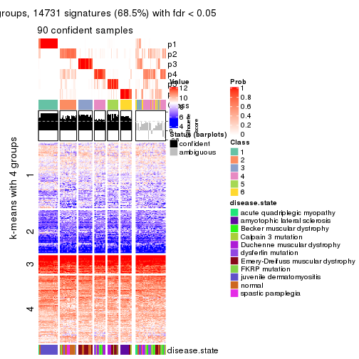</p>

</div>
</div>


Compare the overlap of signatures from different k:

```r
compare_signatures(res)
```


`get_signature()` returns a data frame invisibly. TO get the list of signatures, the function
call should be assigned to a variable explicitly. In following code, if `plot` argument is set
to `FALSE`, no heatmap is plotted while only the differential analysis is performed.

```r
# code only for demonstration
tb = get_signature(res, k = ..., plot = FALSE)
```

An example of the output of `tb` is:

```
#>   which_row         fdr    mean_1    mean_2 scaled_mean_1 scaled_mean_2 km
#> 1        38 0.042760348  8.373488  9.131774    -0.5533452     0.5164555  1
#> 2        40 0.018707592  7.106213  8.469186    -0.6173731     0.5762149  1
#> 3        55 0.019134737 10.221463 11.207825    -0.6159697     0.5749050  1
#> 4        59 0.006059896  5.921854  7.869574    -0.6899429     0.6439467  1
#> 5        60 0.018055526  8.928898 10.211722    -0.6204761     0.5791110  1
#> 6        98 0.009384629 15.714769 14.887706     0.6635654    -0.6193277  2
...
```

The columns in `tb` are:

1. `which_row`: row indices corresponding to the input matrix.
2. `fdr`: FDR for the differential test. 
3. `mean_x`: The mean value in group x.
4. `scaled_mean_x`: The mean value in group x after rows are scaled.
5. `km`: Row groups if k-means clustering is applied to rows.


UMAP plot which shows how samples are separated.


<script>
$( function() {
	$( '#tabs-SD-pam-dimension-reduction' ).tabs();
} );
</script>
<div id='tabs-SD-pam-dimension-reduction'>
<ul>
<li><a href='#tab-SD-pam-dimension-reduction-1'>k = 2</a></li>
<li><a href='#tab-SD-pam-dimension-reduction-2'>k = 3</a></li>
<li><a href='#tab-SD-pam-dimension-reduction-3'>k = 4</a></li>
<li><a href='#tab-SD-pam-dimension-reduction-4'>k = 5</a></li>
<li><a href='#tab-SD-pam-dimension-reduction-5'>k = 6</a></li>
</ul>
<div id='tab-SD-pam-dimension-reduction-1'>
<pre><code class="r">dimension_reduction(res, k = 2, method = &quot;UMAP&quot;)
</code></pre>

<p></p>

</div>
<div id='tab-SD-pam-dimension-reduction-2'>
<pre><code class="r">dimension_reduction(res, k = 3, method = &quot;UMAP&quot;)
</code></pre>

<p></p>

</div>
<div id='tab-SD-pam-dimension-reduction-3'>
<pre><code class="r">dimension_reduction(res, k = 4, method = &quot;UMAP&quot;)
</code></pre>

<p></p>

</div>
<div id='tab-SD-pam-dimension-reduction-4'>
<pre><code class="r">dimension_reduction(res, k = 5, method = &quot;UMAP&quot;)
</code></pre>

<p></p>

</div>
<div id='tab-SD-pam-dimension-reduction-5'>
<pre><code class="r">dimension_reduction(res, k = 6, method = &quot;UMAP&quot;)
</code></pre>

<p>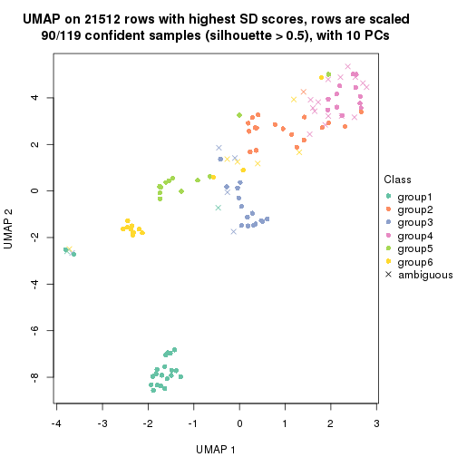</p>

</div>
</div>


Following heatmap shows how subgroups are split when increasing `k`:

```r
collect_classes(res)
```


Test correlation between subgroups and known annotations. If the known
annotation is numeric, one-way ANOVA test is applied, and if the known
annotation is discrete, chi-squared contingency table test is applied.

```r
test_to_known_factors(res)
```

```
#>          n disease.state(p) k
#> SD:pam 109         7.45e-10 2
#> SD:pam  77         2.51e-14 3
#> SD:pam 100         8.14e-25 4
#> SD:pam  72         5.14e-29 5
#> SD:pam  90         1.24e-29 6
```


If matrix rows can be associated to genes, consider to use `functional_enrichment(res,
...)` to perform function enrichment for the signature genes. See [this vignette](http://bioconductor.org/packages/devel/bioc/vignettes/cola/inst/doc/functional_enrichment.html) for more detailed explanations.


 

---------------------------------------------------


### SD:mclust


The object with results only for a single top-value method and a single partition method 
can be extracted as:

```r
res = res_list["SD", "mclust"]
# you can also extract it by
# res = res_list["SD:mclust"]
```

A summary of `res` and all the functions that can be applied to it:

```r
res
```

```
#> A 'ConsensusPartition' object with k = 2, 3, 4, 5, 6.
#>   On a matrix with 21512 rows and 119 columns.
#>   Top rows (1000, 2000, 3000, 4000, 5000) are extracted by 'SD' method.
#>   Subgroups are detected by 'mclust' method.
#>   Performed in total 1250 partitions by row resampling.
#>   Best k for subgroups seems to be 2.
#> 
#> Following methods can be applied to this 'ConsensusPartition' object:
#>  [1] "cola_report"             "collect_classes"         "collect_plots"          
#>  [4] "collect_stats"           "colnames"                "compare_signatures"     
#>  [7] "consensus_heatmap"       "dimension_reduction"     "functional_enrichment"  
#> [10] "get_anno_col"            "get_anno"                "get_classes"            
#> [13] "get_consensus"           "get_matrix"              "get_membership"         
#> [16] "get_param"               "get_signatures"          "get_stats"              
#> [19] "is_best_k"               "is_stable_k"             "membership_heatmap"     
#> [22] "ncol"                    "nrow"                    "plot_ecdf"              
#> [25] "rownames"                "select_partition_number" "show"                   
#> [28] "suggest_best_k"          "test_to_known_factors"
```

`collect_plots()` function collects all the plots made from `res` for all `k` (number of partitions)
into one single page to provide an easy and fast comparison between different `k`.

```r
collect_plots(res)
```


The plots are:

- The first row: a plot of the ECDF (empirical cumulative distribution
  function) curves of the consensus matrix for each `k` and the heatmap of
  predicted classes for each `k`.
- The second row: heatmaps of the consensus matrix for each `k`.
- The third row: heatmaps of the membership matrix for each `k`.
- The fouth row: heatmaps of the signatures for each `k`.

All the plots in panels can be made by individual functions and they are
plotted later in this section.

`select_partition_number()` produces several plots showing different
statistics for choosing "optimized" `k`. There are following statistics:

- ECDF curves of the consensus matrix for each `k`;
- 1-PAC. [The PAC
  score](https://en.wikipedia.org/wiki/Consensus_clustering#Over-interpretation_potential_of_consensus_clustering)
  measures the proportion of the ambiguous subgrouping.
- Mean silhouette score.
- Concordance. The mean probability of fiting the consensus class ids in all
  partitions.
- Area increased. Denote $A_k$ as the area under the ECDF curve for current
  `k`, the area increased is defined as $A_k - A_{k-1}$.
- Rand index. The percent of pairs of samples that are both in a same cluster
  or both are not in a same cluster in the partition of k and k-1.
- Jaccard index. The ratio of pairs of samples are both in a same cluster in
  the partition of k and k-1 and the pairs of samples are both in a same
  cluster in the partition k or k-1.

The detailed explanations of these statistics can be found in [the _cola_
vignette](http://bioconductor.org/packages/devel/bioc/vignettes/cola/inst/doc/cola.html#toc_13).

Generally speaking, lower PAC score, higher mean silhouette score or higher
concordance corresponds to better partition. Rand index and Jaccard index
measure how similar the current partition is compared to partition with `k-1`.
If they are too similar, we won't accept `k` is better than `k-1`.

```r
select_partition_number(res)
```


The numeric values for all these statistics can be obtained by `get_stats()`.

```r
get_stats(res)
```

```
#>   k 1-PAC mean_silhouette concordance area_increased  Rand Jaccard
#> 2 2 0.736           0.889       0.952         0.4890 0.506   0.506
#> 3 3 0.679           0.764       0.849         0.2885 0.781   0.590
#> 4 4 0.658           0.764       0.831         0.1148 0.885   0.696
#> 5 5 0.691           0.615       0.801         0.0914 0.863   0.585
#> 6 6 0.708           0.643       0.785         0.0607 0.909   0.623
```

`suggest_best_k()` suggests the best $k$ based on these statistics. The rules are as follows:

- All $k$ with Jaccard index larger than 0.95 are removed because increasing
  $k$ does not provide enough extra information. If all $k$ are removed, it is
  marked as no subgroup is detected.
- For all $k$ with 1-PAC score larger than 0.9, the maximal $k$ is taken as
  the best $k$, and other $k$ are marked as optional $k$.
- If it does not fit the second rule. The $k$ with the maximal vote of the
  highest 1-PAC score, highest mean silhouette, and highest concordance is
  taken as the best $k$.

```r
suggest_best_k(res)
```

```
#> [1] 2
```


Following shows the table of the partitions (You need to click the **show/hide
code output** link to see it). The membership matrix (columns with name `p*`)
is inferred by
[`clue::cl_consensus()`](https://www.rdocumentation.org/link/cl_consensus?package=clue)
function with the `SE` method. Basically the value in the membership matrix
represents the probability to belong to a certain group. The finall class
label for an item is determined with the group with highest probability it
belongs to.

In `get_classes()` function, the entropy is calculated from the membership
matrix and the silhouette score is calculated from the consensus matrix.


<script>
$( function() {
	$( '#tabs-SD-mclust-get-classes' ).tabs();
} );
</script>
<div id='tabs-SD-mclust-get-classes'>
<ul>
<li><a href='#tab-SD-mclust-get-classes-1'>k = 2</a></li>
<li><a href='#tab-SD-mclust-get-classes-2'>k = 3</a></li>
<li><a href='#tab-SD-mclust-get-classes-3'>k = 4</a></li>
<li><a href='#tab-SD-mclust-get-classes-4'>k = 5</a></li>
<li><a href='#tab-SD-mclust-get-classes-5'>k = 6</a></li>
</ul>

<div id='tab-SD-mclust-get-classes-1'>
<p><a id='tab-SD-mclust-get-classes-1-a' style='color:#0366d6' href='#'>show/hide code output</a></p>
<pre><code class="r">cbind(get_classes(res, k = 2), get_membership(res, k = 2))
</code></pre>

<pre><code>#&gt;           class entropy silhouette    p1    p2
#&gt; GSM120719     1  0.0000      0.943 1.000 0.000
#&gt; GSM120720     1  0.0000      0.943 1.000 0.000
#&gt; GSM120765     2  0.0000      0.947 0.000 1.000
#&gt; GSM120767     2  0.0000      0.947 0.000 1.000
#&gt; GSM120784     2  0.0000      0.947 0.000 1.000
#&gt; GSM121400     1  0.0000      0.943 1.000 0.000
#&gt; GSM121401     1  0.0000      0.943 1.000 0.000
#&gt; GSM121402     2  0.0000      0.947 0.000 1.000
#&gt; GSM121403     1  0.0672      0.936 0.992 0.008
#&gt; GSM121404     2  0.1633      0.928 0.024 0.976
#&gt; GSM121405     1  0.0000      0.943 1.000 0.000
#&gt; GSM121406     2  0.0000      0.947 0.000 1.000
#&gt; GSM121408     2  0.0000      0.947 0.000 1.000
#&gt; GSM121409     1  0.0000      0.943 1.000 0.000
#&gt; GSM121410     1  0.0000      0.943 1.000 0.000
#&gt; GSM121412     2  0.0000      0.947 0.000 1.000
#&gt; GSM121413     2  0.0000      0.947 0.000 1.000
#&gt; GSM121414     2  0.0000      0.947 0.000 1.000
#&gt; GSM121415     2  0.0000      0.947 0.000 1.000
#&gt; GSM121416     2  0.0000      0.947 0.000 1.000
#&gt; GSM120591     1  0.0000      0.943 1.000 0.000
#&gt; GSM120594     1  0.0000      0.943 1.000 0.000
#&gt; GSM120718     1  0.0000      0.943 1.000 0.000
#&gt; GSM121205     1  0.0000      0.943 1.000 0.000
#&gt; GSM121206     1  0.0000      0.943 1.000 0.000
#&gt; GSM121207     1  0.0000      0.943 1.000 0.000
#&gt; GSM121208     1  0.0000      0.943 1.000 0.000
#&gt; GSM121209     1  0.0000      0.943 1.000 0.000
#&gt; GSM121210     1  0.0000      0.943 1.000 0.000
#&gt; GSM121211     1  0.0000      0.943 1.000 0.000
#&gt; GSM121212     1  0.0000      0.943 1.000 0.000
#&gt; GSM121213     1  0.0000      0.943 1.000 0.000
#&gt; GSM121214     1  0.0000      0.943 1.000 0.000
#&gt; GSM121215     1  0.0000      0.943 1.000 0.000
#&gt; GSM121216     1  0.0000      0.943 1.000 0.000
#&gt; GSM121217     1  0.0000      0.943 1.000 0.000
#&gt; GSM121218     1  0.0000      0.943 1.000 0.000
#&gt; GSM121234     1  0.0000      0.943 1.000 0.000
#&gt; GSM121243     1  0.0000      0.943 1.000 0.000
#&gt; GSM121245     1  0.0000      0.943 1.000 0.000
#&gt; GSM121246     1  0.0000      0.943 1.000 0.000
#&gt; GSM121247     1  0.0000      0.943 1.000 0.000
#&gt; GSM121248     1  0.0000      0.943 1.000 0.000
#&gt; GSM120744     1  0.8144      0.694 0.748 0.252
#&gt; GSM120745     1  0.8144      0.694 0.748 0.252
#&gt; GSM120746     1  0.8144      0.694 0.748 0.252
#&gt; GSM120747     1  0.8144      0.694 0.748 0.252
#&gt; GSM120748     1  0.8144      0.694 0.748 0.252
#&gt; GSM120749     1  0.8144      0.694 0.748 0.252
#&gt; GSM120750     1  0.8144      0.694 0.748 0.252
#&gt; GSM120751     1  0.8144      0.694 0.748 0.252
#&gt; GSM120752     1  0.8144      0.694 0.748 0.252
#&gt; GSM121336     2  0.0000      0.947 0.000 1.000
#&gt; GSM121339     2  0.6247      0.792 0.156 0.844
#&gt; GSM121349     2  0.0000      0.947 0.000 1.000
#&gt; GSM121355     2  0.0000      0.947 0.000 1.000
#&gt; GSM120757     2  0.8661      0.599 0.288 0.712
#&gt; GSM120766     2  0.8861      0.567 0.304 0.696
#&gt; GSM120770     2  0.0000      0.947 0.000 1.000
#&gt; GSM120779     2  0.8661      0.599 0.288 0.712
#&gt; GSM120780     2  0.9963      0.115 0.464 0.536
#&gt; GSM121102     2  0.0000      0.947 0.000 1.000
#&gt; GSM121203     1  0.8443      0.658 0.728 0.272
#&gt; GSM121204     2  0.9732      0.326 0.404 0.596
#&gt; GSM121330     1  0.0000      0.943 1.000 0.000
#&gt; GSM121335     1  0.0000      0.943 1.000 0.000
#&gt; GSM121337     2  0.0000      0.947 0.000 1.000
#&gt; GSM121338     2  0.1633      0.928 0.024 0.976
#&gt; GSM121341     1  0.0000      0.943 1.000 0.000
#&gt; GSM121342     1  0.0000      0.943 1.000 0.000
#&gt; GSM121343     2  0.1414      0.932 0.020 0.980
#&gt; GSM121344     1  0.0000      0.943 1.000 0.000
#&gt; GSM121346     1  0.0000      0.943 1.000 0.000
#&gt; GSM121347     2  0.0000      0.947 0.000 1.000
#&gt; GSM121348     2  0.4161      0.872 0.084 0.916
#&gt; GSM121350     1  0.0000      0.943 1.000 0.000
#&gt; GSM121352     1  0.0000      0.943 1.000 0.000
#&gt; GSM121354     1  0.0000      0.943 1.000 0.000
#&gt; GSM120753     2  0.0000      0.947 0.000 1.000
#&gt; GSM120761     2  0.0000      0.947 0.000 1.000
#&gt; GSM120768     2  0.0000      0.947 0.000 1.000
#&gt; GSM120781     2  0.0000      0.947 0.000 1.000
#&gt; GSM120788     2  0.0000      0.947 0.000 1.000
#&gt; GSM120760     2  0.0000      0.947 0.000 1.000
#&gt; GSM120763     2  0.0000      0.947 0.000 1.000
#&gt; GSM120764     2  0.0000      0.947 0.000 1.000
#&gt; GSM120777     2  0.0000      0.947 0.000 1.000
#&gt; GSM120786     2  0.0000      0.947 0.000 1.000
#&gt; GSM121329     1  0.0000      0.943 1.000 0.000
#&gt; GSM121331     2  0.8661      0.599 0.288 0.712
#&gt; GSM121333     2  0.8661      0.599 0.288 0.712
#&gt; GSM121345     2  0.8499      0.619 0.276 0.724
#&gt; GSM121356     2  0.8661      0.599 0.288 0.712
#&gt; GSM120754     2  0.0000      0.947 0.000 1.000
#&gt; GSM120759     2  0.0000      0.947 0.000 1.000
#&gt; GSM120762     2  0.0000      0.947 0.000 1.000
#&gt; GSM120775     2  0.0000      0.947 0.000 1.000
#&gt; GSM120776     2  0.0000      0.947 0.000 1.000
#&gt; GSM120782     2  0.0000      0.947 0.000 1.000
#&gt; GSM120789     2  0.0000      0.947 0.000 1.000
#&gt; GSM120790     2  0.0000      0.947 0.000 1.000
#&gt; GSM120791     2  0.0000      0.947 0.000 1.000
#&gt; GSM120755     2  0.0000      0.947 0.000 1.000
#&gt; GSM120756     2  0.0000      0.947 0.000 1.000
#&gt; GSM120769     2  0.0000      0.947 0.000 1.000
#&gt; GSM120778     2  0.0000      0.947 0.000 1.000
#&gt; GSM120792     2  0.0000      0.947 0.000 1.000
#&gt; GSM121332     2  0.0000      0.947 0.000 1.000
#&gt; GSM121334     2  0.0000      0.947 0.000 1.000
#&gt; GSM121340     2  0.0000      0.947 0.000 1.000
#&gt; GSM121351     2  0.0000      0.947 0.000 1.000
#&gt; GSM121353     2  0.0000      0.947 0.000 1.000
#&gt; GSM120758     2  0.0000      0.947 0.000 1.000
#&gt; GSM120771     2  0.0000      0.947 0.000 1.000
#&gt; GSM120772     2  0.0000      0.947 0.000 1.000
#&gt; GSM120773     2  0.0000      0.947 0.000 1.000
#&gt; GSM120774     2  0.0000      0.947 0.000 1.000
#&gt; GSM120783     2  0.0000      0.947 0.000 1.000
#&gt; GSM120787     2  0.0000      0.947 0.000 1.000
</code></pre>

<script>
$('#tab-SD-mclust-get-classes-1-a').parent().next().next().hide();
$('#tab-SD-mclust-get-classes-1-a').click(function(){
  $('#tab-SD-mclust-get-classes-1-a').parent().next().next().toggle();
  return(false);
});
</script>
</div>

<div id='tab-SD-mclust-get-classes-2'>
<p><a id='tab-SD-mclust-get-classes-2-a' style='color:#0366d6' href='#'>show/hide code output</a></p>
<pre><code class="r">cbind(get_classes(res, k = 3), get_membership(res, k = 3))
</code></pre>

<pre><code>#&gt;           class entropy silhouette    p1    p2    p3
#&gt; GSM120719     1  0.6579     0.7065 0.652 0.020 0.328
#&gt; GSM120720     1  0.6045     0.7164 0.620 0.000 0.380
#&gt; GSM120765     2  0.1860     0.9148 0.000 0.948 0.052
#&gt; GSM120767     2  0.1411     0.9305 0.000 0.964 0.036
#&gt; GSM120784     2  0.2537     0.8920 0.000 0.920 0.080
#&gt; GSM121400     1  0.6305     0.6048 0.516 0.000 0.484
#&gt; GSM121401     1  0.6299     0.6164 0.524 0.000 0.476
#&gt; GSM121402     2  0.0000     0.9550 0.000 1.000 0.000
#&gt; GSM121403     3  0.5926    -0.2275 0.356 0.000 0.644
#&gt; GSM121404     3  0.3482     0.7343 0.000 0.128 0.872
#&gt; GSM121405     1  0.6305     0.6048 0.516 0.000 0.484
#&gt; GSM121406     2  0.0424     0.9517 0.000 0.992 0.008
#&gt; GSM121408     2  0.0424     0.9527 0.000 0.992 0.008
#&gt; GSM121409     3  0.6307    -0.5785 0.488 0.000 0.512
#&gt; GSM121410     1  0.6308     0.5918 0.508 0.000 0.492
#&gt; GSM121412     2  0.1411     0.9306 0.000 0.964 0.036
#&gt; GSM121413     2  0.1031     0.9405 0.000 0.976 0.024
#&gt; GSM121414     2  0.1163     0.9374 0.000 0.972 0.028
#&gt; GSM121415     2  0.1411     0.9306 0.000 0.964 0.036
#&gt; GSM121416     2  0.0000     0.9550 0.000 1.000 0.000
#&gt; GSM120591     1  0.6154     0.6950 0.592 0.000 0.408
#&gt; GSM120594     1  0.6045     0.7164 0.620 0.000 0.380
#&gt; GSM120718     1  0.6026     0.7183 0.624 0.000 0.376
#&gt; GSM121205     1  0.0000     0.7286 1.000 0.000 0.000
#&gt; GSM121206     1  0.0000     0.7286 1.000 0.000 0.000
#&gt; GSM121207     1  0.0424     0.7293 0.992 0.000 0.008
#&gt; GSM121208     1  0.5948     0.7218 0.640 0.000 0.360
#&gt; GSM121209     1  0.0000     0.7286 1.000 0.000 0.000
#&gt; GSM121210     1  0.0424     0.7293 0.992 0.000 0.008
#&gt; GSM121211     1  0.0000     0.7286 1.000 0.000 0.000
#&gt; GSM121212     1  0.0000     0.7286 1.000 0.000 0.000
#&gt; GSM121213     1  0.0000     0.7286 1.000 0.000 0.000
#&gt; GSM121214     1  0.0000     0.7286 1.000 0.000 0.000
#&gt; GSM121215     1  0.0000     0.7286 1.000 0.000 0.000
#&gt; GSM121216     1  0.3752     0.7300 0.856 0.000 0.144
#&gt; GSM121217     1  0.0000     0.7286 1.000 0.000 0.000
#&gt; GSM121218     1  0.0000     0.7286 1.000 0.000 0.000
#&gt; GSM121234     1  0.0000     0.7286 1.000 0.000 0.000
#&gt; GSM121243     1  0.0000     0.7286 1.000 0.000 0.000
#&gt; GSM121245     1  0.0000     0.7286 1.000 0.000 0.000
#&gt; GSM121246     1  0.6008     0.7191 0.628 0.000 0.372
#&gt; GSM121247     1  0.4796     0.7245 0.780 0.000 0.220
#&gt; GSM121248     1  0.0000     0.7286 1.000 0.000 0.000
#&gt; GSM120744     3  0.1182     0.7092 0.012 0.012 0.976
#&gt; GSM120745     3  0.1182     0.7092 0.012 0.012 0.976
#&gt; GSM120746     3  0.1182     0.7092 0.012 0.012 0.976
#&gt; GSM120747     3  0.1182     0.7092 0.012 0.012 0.976
#&gt; GSM120748     3  0.1182     0.7092 0.012 0.012 0.976
#&gt; GSM120749     3  0.1182     0.7092 0.012 0.012 0.976
#&gt; GSM120750     3  0.1182     0.7092 0.012 0.012 0.976
#&gt; GSM120751     3  0.1182     0.7092 0.012 0.012 0.976
#&gt; GSM120752     3  0.1182     0.7092 0.012 0.012 0.976
#&gt; GSM121336     2  0.0237     0.9536 0.000 0.996 0.004
#&gt; GSM121339     3  0.3295     0.7273 0.008 0.096 0.896
#&gt; GSM121349     2  0.0000     0.9550 0.000 1.000 0.000
#&gt; GSM121355     2  0.0237     0.9536 0.000 0.996 0.004
#&gt; GSM120757     3  0.6193     0.6969 0.016 0.292 0.692
#&gt; GSM120766     3  0.5656     0.7071 0.004 0.284 0.712
#&gt; GSM120770     3  0.6280     0.3437 0.000 0.460 0.540
#&gt; GSM120779     3  0.6193     0.6969 0.016 0.292 0.692
#&gt; GSM120780     3  0.2682     0.7344 0.004 0.076 0.920
#&gt; GSM121102     3  0.4452     0.7307 0.000 0.192 0.808
#&gt; GSM121203     3  0.1031     0.7086 0.000 0.024 0.976
#&gt; GSM121204     3  0.6337     0.7100 0.028 0.264 0.708
#&gt; GSM121330     1  0.6168     0.6951 0.588 0.000 0.412
#&gt; GSM121335     1  0.6045     0.7164 0.620 0.000 0.380
#&gt; GSM121337     2  0.6192     0.0308 0.000 0.580 0.420
#&gt; GSM121338     3  0.2711     0.7296 0.000 0.088 0.912
#&gt; GSM121341     1  0.6045     0.7164 0.620 0.000 0.380
#&gt; GSM121342     1  0.6026     0.7178 0.624 0.000 0.376
#&gt; GSM121343     3  0.3619     0.7361 0.000 0.136 0.864
#&gt; GSM121344     1  0.6045     0.7164 0.620 0.000 0.380
#&gt; GSM121346     1  0.6111     0.7091 0.604 0.000 0.396
#&gt; GSM121347     3  0.6309     0.2653 0.000 0.496 0.504
#&gt; GSM121348     2  0.6308    -0.2482 0.000 0.508 0.492
#&gt; GSM121350     1  0.6215     0.6781 0.572 0.000 0.428
#&gt; GSM121352     1  0.6111     0.7091 0.604 0.000 0.396
#&gt; GSM121354     1  0.6079     0.7136 0.612 0.000 0.388
#&gt; GSM120753     2  0.0000     0.9550 0.000 1.000 0.000
#&gt; GSM120761     2  0.0424     0.9529 0.000 0.992 0.008
#&gt; GSM120768     2  0.0424     0.9529 0.000 0.992 0.008
#&gt; GSM120781     2  0.0000     0.9550 0.000 1.000 0.000
#&gt; GSM120788     2  0.1289     0.9342 0.000 0.968 0.032
#&gt; GSM120760     2  0.0424     0.9529 0.000 0.992 0.008
#&gt; GSM120763     2  0.0424     0.9529 0.000 0.992 0.008
#&gt; GSM120764     2  0.0424     0.9529 0.000 0.992 0.008
#&gt; GSM120777     2  0.0424     0.9529 0.000 0.992 0.008
#&gt; GSM120786     2  0.0424     0.9529 0.000 0.992 0.008
#&gt; GSM121329     1  0.6677     0.7058 0.652 0.024 0.324
#&gt; GSM121331     3  0.6193     0.6962 0.016 0.292 0.692
#&gt; GSM121333     3  0.6193     0.6969 0.016 0.292 0.692
#&gt; GSM121345     3  0.6262     0.7028 0.020 0.284 0.696
#&gt; GSM121356     3  0.6229     0.7059 0.020 0.280 0.700
#&gt; GSM120754     2  0.1860     0.9118 0.000 0.948 0.052
#&gt; GSM120759     2  0.0000     0.9550 0.000 1.000 0.000
#&gt; GSM120762     2  0.0000     0.9550 0.000 1.000 0.000
#&gt; GSM120775     2  0.1031     0.9419 0.000 0.976 0.024
#&gt; GSM120776     3  0.5948     0.5981 0.000 0.360 0.640
#&gt; GSM120782     2  0.4062     0.7316 0.000 0.836 0.164
#&gt; GSM120789     2  0.0000     0.9550 0.000 1.000 0.000
#&gt; GSM120790     2  0.0000     0.9550 0.000 1.000 0.000
#&gt; GSM120791     2  0.0424     0.9529 0.000 0.992 0.008
#&gt; GSM120755     2  0.0000     0.9550 0.000 1.000 0.000
#&gt; GSM120756     2  0.2711     0.8685 0.000 0.912 0.088
#&gt; GSM120769     2  0.0000     0.9550 0.000 1.000 0.000
#&gt; GSM120778     2  0.0000     0.9550 0.000 1.000 0.000
#&gt; GSM120792     2  0.0000     0.9550 0.000 1.000 0.000
#&gt; GSM121332     2  0.0000     0.9550 0.000 1.000 0.000
#&gt; GSM121334     2  0.0000     0.9550 0.000 1.000 0.000
#&gt; GSM121340     2  0.0424     0.9529 0.000 0.992 0.008
#&gt; GSM121351     2  0.0000     0.9550 0.000 1.000 0.000
#&gt; GSM121353     2  0.3340     0.8112 0.000 0.880 0.120
#&gt; GSM120758     2  0.0000     0.9550 0.000 1.000 0.000
#&gt; GSM120771     2  0.0000     0.9550 0.000 1.000 0.000
#&gt; GSM120772     2  0.0000     0.9550 0.000 1.000 0.000
#&gt; GSM120773     2  0.0424     0.9529 0.000 0.992 0.008
#&gt; GSM120774     2  0.0000     0.9550 0.000 1.000 0.000
#&gt; GSM120783     2  0.0424     0.9529 0.000 0.992 0.008
#&gt; GSM120787     2  0.0000     0.9550 0.000 1.000 0.000
</code></pre>

<script>
$('#tab-SD-mclust-get-classes-2-a').parent().next().next().hide();
$('#tab-SD-mclust-get-classes-2-a').click(function(){
  $('#tab-SD-mclust-get-classes-2-a').parent().next().next().toggle();
  return(false);
});
</script>
</div>

<div id='tab-SD-mclust-get-classes-3'>
<p><a id='tab-SD-mclust-get-classes-3-a' style='color:#0366d6' href='#'>show/hide code output</a></p>
<pre><code class="r">cbind(get_classes(res, k = 4), get_membership(res, k = 4))
</code></pre>

<pre><code>#&gt;           class entropy silhouette    p1    p2    p3    p4
#&gt; GSM120719     1  0.5850     0.6391 0.700 0.000 0.184 0.116
#&gt; GSM120720     1  0.2450     0.8501 0.912 0.000 0.016 0.072
#&gt; GSM120765     2  0.0927     0.8668 0.008 0.976 0.016 0.000
#&gt; GSM120767     2  0.0592     0.8675 0.000 0.984 0.016 0.000
#&gt; GSM120784     2  0.1284     0.8650 0.012 0.964 0.024 0.000
#&gt; GSM121400     1  0.1854     0.7648 0.940 0.000 0.048 0.012
#&gt; GSM121401     1  0.0707     0.8157 0.980 0.000 0.000 0.020
#&gt; GSM121402     2  0.0657     0.8663 0.004 0.984 0.012 0.000
#&gt; GSM121403     1  0.3791     0.4794 0.796 0.000 0.200 0.004
#&gt; GSM121404     2  0.7165     0.0096 0.372 0.488 0.140 0.000
#&gt; GSM121405     1  0.0592     0.8116 0.984 0.000 0.000 0.016
#&gt; GSM121406     2  0.1109     0.8630 0.004 0.968 0.028 0.000
#&gt; GSM121408     2  0.0895     0.8649 0.004 0.976 0.020 0.000
#&gt; GSM121409     1  0.2714     0.6793 0.884 0.000 0.112 0.004
#&gt; GSM121410     1  0.2271     0.7365 0.916 0.000 0.076 0.008
#&gt; GSM121412     2  0.1356     0.8600 0.008 0.960 0.032 0.000
#&gt; GSM121413     2  0.1209     0.8612 0.004 0.964 0.032 0.000
#&gt; GSM121414     2  0.1209     0.8612 0.004 0.964 0.032 0.000
#&gt; GSM121415     2  0.1004     0.8632 0.004 0.972 0.024 0.000
#&gt; GSM121416     2  0.0376     0.8679 0.004 0.992 0.004 0.000
#&gt; GSM120591     1  0.2816     0.8322 0.900 0.000 0.036 0.064
#&gt; GSM120594     1  0.2198     0.8503 0.920 0.000 0.008 0.072
#&gt; GSM120718     1  0.2593     0.8471 0.904 0.000 0.016 0.080
#&gt; GSM121205     4  0.0000     0.9610 0.000 0.000 0.000 1.000
#&gt; GSM121206     4  0.0000     0.9610 0.000 0.000 0.000 1.000
#&gt; GSM121207     4  0.1389     0.9413 0.048 0.000 0.000 0.952
#&gt; GSM121208     1  0.2987     0.8290 0.880 0.000 0.016 0.104
#&gt; GSM121209     4  0.0000     0.9610 0.000 0.000 0.000 1.000
#&gt; GSM121210     4  0.3907     0.7152 0.232 0.000 0.000 0.768
#&gt; GSM121211     4  0.0000     0.9610 0.000 0.000 0.000 1.000
#&gt; GSM121212     4  0.1389     0.9413 0.048 0.000 0.000 0.952
#&gt; GSM121213     4  0.0000     0.9610 0.000 0.000 0.000 1.000
#&gt; GSM121214     4  0.0000     0.9610 0.000 0.000 0.000 1.000
#&gt; GSM121215     4  0.0000     0.9610 0.000 0.000 0.000 1.000
#&gt; GSM121216     4  0.2589     0.8716 0.116 0.000 0.000 0.884
#&gt; GSM121217     4  0.0000     0.9610 0.000 0.000 0.000 1.000
#&gt; GSM121218     4  0.0000     0.9610 0.000 0.000 0.000 1.000
#&gt; GSM121234     4  0.0000     0.9610 0.000 0.000 0.000 1.000
#&gt; GSM121243     4  0.2011     0.9181 0.080 0.000 0.000 0.920
#&gt; GSM121245     4  0.1716     0.9308 0.064 0.000 0.000 0.936
#&gt; GSM121246     1  0.2924     0.8330 0.884 0.000 0.016 0.100
#&gt; GSM121247     1  0.6640     0.3712 0.552 0.000 0.096 0.352
#&gt; GSM121248     4  0.0000     0.9610 0.000 0.000 0.000 1.000
#&gt; GSM120744     3  0.4989     0.6280 0.472 0.000 0.528 0.000
#&gt; GSM120745     3  0.4985     0.6292 0.468 0.000 0.532 0.000
#&gt; GSM120746     3  0.4985     0.6292 0.468 0.000 0.532 0.000
#&gt; GSM120747     3  0.4989     0.6280 0.472 0.000 0.528 0.000
#&gt; GSM120748     3  0.4989     0.6280 0.472 0.000 0.528 0.000
#&gt; GSM120749     3  0.4985     0.6292 0.468 0.000 0.532 0.000
#&gt; GSM120750     3  0.4985     0.6292 0.468 0.000 0.532 0.000
#&gt; GSM120751     3  0.4985     0.6292 0.468 0.000 0.532 0.000
#&gt; GSM120752     3  0.4985     0.6292 0.468 0.000 0.532 0.000
#&gt; GSM121336     2  0.1022     0.8622 0.000 0.968 0.032 0.000
#&gt; GSM121339     2  0.7073    -0.0528 0.412 0.464 0.124 0.000
#&gt; GSM121349     2  0.0817     0.8652 0.000 0.976 0.024 0.000
#&gt; GSM121355     2  0.0921     0.8637 0.000 0.972 0.028 0.000
#&gt; GSM120757     3  0.4841     0.6752 0.140 0.080 0.780 0.000
#&gt; GSM120766     3  0.5670     0.6630 0.152 0.128 0.720 0.000
#&gt; GSM120770     3  0.6979     0.5106 0.128 0.344 0.528 0.000
#&gt; GSM120779     3  0.3813     0.6738 0.148 0.024 0.828 0.000
#&gt; GSM120780     3  0.6523     0.6647 0.348 0.088 0.564 0.000
#&gt; GSM121102     3  0.7182     0.6319 0.248 0.200 0.552 0.000
#&gt; GSM121203     3  0.4989     0.6244 0.472 0.000 0.528 0.000
#&gt; GSM121204     3  0.4050     0.6747 0.168 0.024 0.808 0.000
#&gt; GSM121330     1  0.1792     0.8493 0.932 0.000 0.000 0.068
#&gt; GSM121335     1  0.2450     0.8501 0.912 0.000 0.016 0.072
#&gt; GSM121337     2  0.3612     0.7915 0.044 0.856 0.100 0.000
#&gt; GSM121338     1  0.7716    -0.5079 0.396 0.224 0.380 0.000
#&gt; GSM121341     1  0.2450     0.8501 0.912 0.000 0.016 0.072
#&gt; GSM121342     1  0.2662     0.8451 0.900 0.000 0.016 0.084
#&gt; GSM121343     3  0.7822     0.4686 0.364 0.256 0.380 0.000
#&gt; GSM121344     1  0.2450     0.8501 0.912 0.000 0.016 0.072
#&gt; GSM121346     1  0.1792     0.8493 0.932 0.000 0.000 0.068
#&gt; GSM121347     2  0.5123     0.7148 0.044 0.724 0.232 0.000
#&gt; GSM121348     3  0.4737     0.4439 0.020 0.252 0.728 0.000
#&gt; GSM121350     1  0.1557     0.8437 0.944 0.000 0.000 0.056
#&gt; GSM121352     1  0.1792     0.8493 0.932 0.000 0.000 0.068
#&gt; GSM121354     1  0.1978     0.8501 0.928 0.000 0.004 0.068
#&gt; GSM120753     2  0.0817     0.8688 0.000 0.976 0.024 0.000
#&gt; GSM120761     2  0.3649     0.8201 0.000 0.796 0.204 0.000
#&gt; GSM120768     2  0.3528     0.8250 0.000 0.808 0.192 0.000
#&gt; GSM120781     2  0.0336     0.8684 0.000 0.992 0.008 0.000
#&gt; GSM120788     2  0.5530     0.6902 0.032 0.632 0.336 0.000
#&gt; GSM120760     2  0.3907     0.8064 0.000 0.768 0.232 0.000
#&gt; GSM120763     2  0.4008     0.7998 0.000 0.756 0.244 0.000
#&gt; GSM120764     2  0.4283     0.7918 0.004 0.740 0.256 0.000
#&gt; GSM120777     2  0.5344     0.7293 0.032 0.668 0.300 0.000
#&gt; GSM120786     2  0.4072     0.7954 0.000 0.748 0.252 0.000
#&gt; GSM121329     1  0.6167     0.6091 0.664 0.000 0.220 0.116
#&gt; GSM121331     3  0.3266     0.6537 0.108 0.024 0.868 0.000
#&gt; GSM121333     3  0.3659     0.6704 0.136 0.024 0.840 0.000
#&gt; GSM121345     3  0.4224     0.6702 0.144 0.044 0.812 0.000
#&gt; GSM121356     3  0.3763     0.6730 0.144 0.024 0.832 0.000
#&gt; GSM120754     2  0.4295     0.8023 0.008 0.752 0.240 0.000
#&gt; GSM120759     2  0.0707     0.8658 0.000 0.980 0.020 0.000
#&gt; GSM120762     2  0.0469     0.8688 0.000 0.988 0.012 0.000
#&gt; GSM120775     2  0.5062     0.7444 0.020 0.680 0.300 0.000
#&gt; GSM120776     3  0.5670     0.6217 0.128 0.152 0.720 0.000
#&gt; GSM120782     2  0.5857     0.7055 0.108 0.696 0.196 0.000
#&gt; GSM120789     2  0.0188     0.8675 0.000 0.996 0.004 0.000
#&gt; GSM120790     2  0.2053     0.8624 0.004 0.924 0.072 0.000
#&gt; GSM120791     2  0.3837     0.8104 0.000 0.776 0.224 0.000
#&gt; GSM120755     2  0.0707     0.8651 0.000 0.980 0.020 0.000
#&gt; GSM120756     2  0.6111     0.5752 0.052 0.556 0.392 0.000
#&gt; GSM120769     2  0.0707     0.8694 0.000 0.980 0.020 0.000
#&gt; GSM120778     2  0.1118     0.8690 0.000 0.964 0.036 0.000
#&gt; GSM120792     2  0.2814     0.8484 0.000 0.868 0.132 0.000
#&gt; GSM121332     2  0.0469     0.8666 0.000 0.988 0.012 0.000
#&gt; GSM121334     2  0.1940     0.8612 0.000 0.924 0.076 0.000
#&gt; GSM121340     2  0.4193     0.7860 0.000 0.732 0.268 0.000
#&gt; GSM121351     2  0.0817     0.8652 0.000 0.976 0.024 0.000
#&gt; GSM121353     2  0.6000     0.6053 0.052 0.592 0.356 0.000
#&gt; GSM120758     2  0.0592     0.8688 0.000 0.984 0.016 0.000
#&gt; GSM120771     2  0.1004     0.8694 0.004 0.972 0.024 0.000
#&gt; GSM120772     2  0.0707     0.8688 0.000 0.980 0.020 0.000
#&gt; GSM120773     2  0.4008     0.7998 0.000 0.756 0.244 0.000
#&gt; GSM120774     2  0.2469     0.8555 0.000 0.892 0.108 0.000
#&gt; GSM120783     2  0.4072     0.7954 0.000 0.748 0.252 0.000
#&gt; GSM120787     2  0.1302     0.8679 0.000 0.956 0.044 0.000
</code></pre>

<script>
$('#tab-SD-mclust-get-classes-3-a').parent().next().next().hide();
$('#tab-SD-mclust-get-classes-3-a').click(function(){
  $('#tab-SD-mclust-get-classes-3-a').parent().next().next().toggle();
  return(false);
});
</script>
</div>

<div id='tab-SD-mclust-get-classes-4'>
<p><a id='tab-SD-mclust-get-classes-4-a' style='color:#0366d6' href='#'>show/hide code output</a></p>
<pre><code class="r">cbind(get_classes(res, k = 5), get_membership(res, k = 5))
</code></pre>

<pre><code>#&gt;           class entropy silhouette    p1    p2    p3    p4    p5
#&gt; GSM120719     3  0.5732     0.6848 0.096 0.000 0.688 0.172 0.044
#&gt; GSM120720     3  0.0579     0.9293 0.008 0.000 0.984 0.000 0.008
#&gt; GSM120765     4  0.5008    -0.2607 0.000 0.476 0.012 0.500 0.012
#&gt; GSM120767     2  0.4189     0.5626 0.000 0.736 0.012 0.240 0.012
#&gt; GSM120784     4  0.4548     0.2867 0.000 0.300 0.012 0.676 0.012
#&gt; GSM121400     3  0.0865     0.9196 0.000 0.000 0.972 0.004 0.024
#&gt; GSM121401     3  0.0000     0.9314 0.000 0.000 1.000 0.000 0.000
#&gt; GSM121402     2  0.3171     0.6362 0.000 0.816 0.000 0.176 0.008
#&gt; GSM121403     3  0.4437     0.7340 0.000 0.000 0.760 0.140 0.100
#&gt; GSM121404     4  0.5531     0.4303 0.000 0.228 0.036 0.676 0.060
#&gt; GSM121405     3  0.0162     0.9307 0.000 0.000 0.996 0.004 0.000
#&gt; GSM121406     2  0.3141     0.6373 0.000 0.832 0.000 0.152 0.016
#&gt; GSM121408     2  0.0404     0.7250 0.000 0.988 0.000 0.000 0.012
#&gt; GSM121409     3  0.3861     0.7811 0.000 0.000 0.804 0.128 0.068
#&gt; GSM121410     3  0.1800     0.8944 0.000 0.000 0.932 0.020 0.048
#&gt; GSM121412     2  0.3264     0.6266 0.000 0.820 0.000 0.164 0.016
#&gt; GSM121413     2  0.3381     0.6246 0.000 0.808 0.000 0.176 0.016
#&gt; GSM121414     2  0.3381     0.6246 0.000 0.808 0.000 0.176 0.016
#&gt; GSM121415     2  0.4422     0.5453 0.000 0.664 0.004 0.320 0.012
#&gt; GSM121416     2  0.4114     0.5217 0.000 0.624 0.000 0.376 0.000
#&gt; GSM120591     3  0.3794     0.7799 0.000 0.000 0.800 0.152 0.048
#&gt; GSM120594     3  0.0290     0.9304 0.000 0.000 0.992 0.000 0.008
#&gt; GSM120718     3  0.0992     0.9203 0.024 0.000 0.968 0.000 0.008
#&gt; GSM121205     1  0.0000     0.9619 1.000 0.000 0.000 0.000 0.000
#&gt; GSM121206     1  0.0000     0.9619 1.000 0.000 0.000 0.000 0.000
#&gt; GSM121207     1  0.0404     0.9580 0.988 0.000 0.012 0.000 0.000
#&gt; GSM121208     3  0.0579     0.9298 0.008 0.000 0.984 0.000 0.008
#&gt; GSM121209     1  0.0000     0.9619 1.000 0.000 0.000 0.000 0.000
#&gt; GSM121210     1  0.2377     0.8466 0.872 0.000 0.128 0.000 0.000
#&gt; GSM121211     1  0.0000     0.9619 1.000 0.000 0.000 0.000 0.000
#&gt; GSM121212     1  0.0404     0.9580 0.988 0.000 0.012 0.000 0.000
#&gt; GSM121213     1  0.0000     0.9619 1.000 0.000 0.000 0.000 0.000
#&gt; GSM121214     1  0.0000     0.9619 1.000 0.000 0.000 0.000 0.000
#&gt; GSM121215     1  0.0000     0.9619 1.000 0.000 0.000 0.000 0.000
#&gt; GSM121216     1  0.0510     0.9559 0.984 0.000 0.016 0.000 0.000
#&gt; GSM121217     1  0.0000     0.9619 1.000 0.000 0.000 0.000 0.000
#&gt; GSM121218     1  0.0000     0.9619 1.000 0.000 0.000 0.000 0.000
#&gt; GSM121234     1  0.0000     0.9619 1.000 0.000 0.000 0.000 0.000
#&gt; GSM121243     1  0.0510     0.9559 0.984 0.000 0.016 0.000 0.000
#&gt; GSM121245     1  0.1197     0.9292 0.952 0.000 0.048 0.000 0.000
#&gt; GSM121246     3  0.0579     0.9298 0.008 0.000 0.984 0.000 0.008
#&gt; GSM121247     1  0.5769     0.4894 0.632 0.000 0.276 0.048 0.044
#&gt; GSM121248     1  0.0000     0.9619 1.000 0.000 0.000 0.000 0.000
#&gt; GSM120744     5  0.0880     0.8890 0.000 0.000 0.032 0.000 0.968
#&gt; GSM120745     5  0.0880     0.8890 0.000 0.000 0.032 0.000 0.968
#&gt; GSM120746     5  0.0880     0.8890 0.000 0.000 0.032 0.000 0.968
#&gt; GSM120747     5  0.0880     0.8890 0.000 0.000 0.032 0.000 0.968
#&gt; GSM120748     5  0.0880     0.8890 0.000 0.000 0.032 0.000 0.968
#&gt; GSM120749     5  0.0880     0.8890 0.000 0.000 0.032 0.000 0.968
#&gt; GSM120750     5  0.0880     0.8890 0.000 0.000 0.032 0.000 0.968
#&gt; GSM120751     5  0.0880     0.8890 0.000 0.000 0.032 0.000 0.968
#&gt; GSM120752     5  0.0880     0.8890 0.000 0.000 0.032 0.000 0.968
#&gt; GSM121336     2  0.0510     0.7242 0.000 0.984 0.000 0.000 0.016
#&gt; GSM121339     4  0.7234     0.2970 0.000 0.212 0.208 0.520 0.060
#&gt; GSM121349     2  0.0510     0.7242 0.000 0.984 0.000 0.000 0.016
#&gt; GSM121355     2  0.0510     0.7242 0.000 0.984 0.000 0.000 0.016
#&gt; GSM120757     4  0.4383     0.2387 0.000 0.000 0.004 0.572 0.424
#&gt; GSM120766     4  0.4410     0.2130 0.000 0.000 0.004 0.556 0.440
#&gt; GSM120770     4  0.5927     0.3054 0.000 0.056 0.028 0.560 0.356
#&gt; GSM120779     4  0.4383     0.2387 0.000 0.000 0.004 0.572 0.424
#&gt; GSM120780     5  0.4871     0.3009 0.000 0.008 0.028 0.316 0.648
#&gt; GSM121102     4  0.6041     0.2473 0.000 0.048 0.036 0.520 0.396
#&gt; GSM121203     5  0.5439    -0.0432 0.000 0.020 0.028 0.408 0.544
#&gt; GSM121204     4  0.4855     0.2058 0.000 0.000 0.024 0.552 0.424
#&gt; GSM121330     3  0.0000     0.9314 0.000 0.000 1.000 0.000 0.000
#&gt; GSM121335     3  0.0290     0.9304 0.000 0.000 0.992 0.000 0.008
#&gt; GSM121337     4  0.5336     0.3429 0.000 0.304 0.012 0.632 0.052
#&gt; GSM121338     4  0.6770     0.4208 0.000 0.188 0.036 0.560 0.216
#&gt; GSM121341     3  0.0451     0.9305 0.004 0.000 0.988 0.000 0.008
#&gt; GSM121342     3  0.0451     0.9305 0.004 0.000 0.988 0.000 0.008
#&gt; GSM121343     4  0.6750     0.4281 0.000 0.196 0.036 0.564 0.204
#&gt; GSM121344     3  0.0290     0.9304 0.000 0.000 0.992 0.000 0.008
#&gt; GSM121346     3  0.0000     0.9314 0.000 0.000 1.000 0.000 0.000
#&gt; GSM121347     4  0.5455     0.1954 0.000 0.364 0.008 0.576 0.052
#&gt; GSM121348     4  0.5123     0.3046 0.000 0.044 0.000 0.572 0.384
#&gt; GSM121350     3  0.0000     0.9314 0.000 0.000 1.000 0.000 0.000
#&gt; GSM121352     3  0.0000     0.9314 0.000 0.000 1.000 0.000 0.000
#&gt; GSM121354     3  0.0000     0.9314 0.000 0.000 1.000 0.000 0.000
#&gt; GSM120753     2  0.3642     0.6355 0.000 0.760 0.000 0.232 0.008
#&gt; GSM120761     2  0.4557     0.3680 0.000 0.516 0.000 0.476 0.008
#&gt; GSM120768     2  0.4555     0.3539 0.000 0.520 0.000 0.472 0.008
#&gt; GSM120781     2  0.2971     0.6963 0.000 0.836 0.000 0.156 0.008
#&gt; GSM120788     4  0.4300    -0.2734 0.000 0.476 0.000 0.524 0.000
#&gt; GSM120760     2  0.4452     0.3211 0.000 0.500 0.000 0.496 0.004
#&gt; GSM120763     2  0.4306     0.3388 0.000 0.508 0.000 0.492 0.000
#&gt; GSM120764     4  0.4273    -0.2515 0.000 0.448 0.000 0.552 0.000
#&gt; GSM120777     4  0.4306    -0.3088 0.000 0.492 0.000 0.508 0.000
#&gt; GSM120786     4  0.4287    -0.2781 0.000 0.460 0.000 0.540 0.000
#&gt; GSM121329     3  0.5401     0.7023 0.064 0.000 0.708 0.184 0.044
#&gt; GSM121331     4  0.4235     0.2411 0.000 0.000 0.000 0.576 0.424
#&gt; GSM121333     4  0.4383     0.2387 0.000 0.000 0.004 0.572 0.424
#&gt; GSM121345     4  0.4389     0.2947 0.000 0.004 0.004 0.624 0.368
#&gt; GSM121356     4  0.4497     0.2331 0.000 0.000 0.008 0.568 0.424
#&gt; GSM120754     4  0.2605     0.3680 0.000 0.148 0.000 0.852 0.000
#&gt; GSM120759     2  0.1768     0.7211 0.000 0.924 0.000 0.072 0.004
#&gt; GSM120762     2  0.1408     0.7311 0.000 0.948 0.000 0.044 0.008
#&gt; GSM120775     2  0.4297     0.3133 0.000 0.528 0.000 0.472 0.000
#&gt; GSM120776     4  0.3720     0.3848 0.000 0.012 0.000 0.760 0.228
#&gt; GSM120782     4  0.3634     0.4256 0.000 0.184 0.008 0.796 0.012
#&gt; GSM120789     2  0.0324     0.7281 0.000 0.992 0.000 0.004 0.004
#&gt; GSM120790     2  0.4341     0.5917 0.000 0.628 0.000 0.364 0.008
#&gt; GSM120791     2  0.4561     0.3315 0.000 0.504 0.000 0.488 0.008
#&gt; GSM120755     2  0.0566     0.7259 0.000 0.984 0.000 0.004 0.012
#&gt; GSM120756     2  0.4273     0.3353 0.000 0.552 0.000 0.448 0.000
#&gt; GSM120769     2  0.1331     0.7310 0.000 0.952 0.000 0.040 0.008
#&gt; GSM120778     2  0.1331     0.7310 0.000 0.952 0.000 0.040 0.008
#&gt; GSM120792     2  0.2077     0.7266 0.000 0.908 0.000 0.084 0.008
#&gt; GSM121332     2  0.0162     0.7273 0.000 0.996 0.000 0.004 0.000
#&gt; GSM121334     2  0.3910     0.6233 0.000 0.720 0.000 0.272 0.008
#&gt; GSM121340     2  0.4074     0.4809 0.000 0.636 0.000 0.364 0.000
#&gt; GSM121351     2  0.1845     0.7043 0.000 0.928 0.000 0.056 0.016
#&gt; GSM121353     2  0.4182     0.4621 0.000 0.644 0.004 0.352 0.000
#&gt; GSM120758     2  0.3246     0.6706 0.000 0.808 0.000 0.184 0.008
#&gt; GSM120771     2  0.4455     0.5643 0.000 0.588 0.000 0.404 0.008
#&gt; GSM120772     2  0.2304     0.7248 0.000 0.892 0.000 0.100 0.008
#&gt; GSM120773     4  0.4306    -0.3271 0.000 0.492 0.000 0.508 0.000
#&gt; GSM120774     2  0.2136     0.7275 0.000 0.904 0.000 0.088 0.008
#&gt; GSM120783     4  0.4287    -0.2750 0.000 0.460 0.000 0.540 0.000
#&gt; GSM120787     2  0.1331     0.7310 0.000 0.952 0.000 0.040 0.008
</code></pre>

<script>
$('#tab-SD-mclust-get-classes-4-a').parent().next().next().hide();
$('#tab-SD-mclust-get-classes-4-a').click(function(){
  $('#tab-SD-mclust-get-classes-4-a').parent().next().next().toggle();
  return(false);
});
</script>
</div>

<div id='tab-SD-mclust-get-classes-5'>
<p><a id='tab-SD-mclust-get-classes-5-a' style='color:#0366d6' href='#'>show/hide code output</a></p>
<pre><code class="r">cbind(get_classes(res, k = 6), get_membership(res, k = 6))
</code></pre>

<pre><code>#&gt;           class entropy silhouette    p1    p2    p3    p4    p5    p6
#&gt; GSM120719     3  0.5261     0.6055 0.092 0.008 0.660 0.004 0.224 0.012
#&gt; GSM120720     3  0.0363     0.9286 0.012 0.000 0.988 0.000 0.000 0.000
#&gt; GSM120765     5  0.5482     0.2787 0.000 0.300 0.000 0.156 0.544 0.000
#&gt; GSM120767     2  0.5173     0.4160 0.000 0.596 0.000 0.128 0.276 0.000
#&gt; GSM120784     5  0.5177     0.4053 0.000 0.236 0.000 0.152 0.612 0.000
#&gt; GSM121400     3  0.0862     0.9224 0.000 0.008 0.972 0.000 0.004 0.016
#&gt; GSM121401     3  0.0000     0.9337 0.000 0.000 1.000 0.000 0.000 0.000
#&gt; GSM121402     2  0.4533     0.5761 0.000 0.704 0.000 0.156 0.140 0.000
#&gt; GSM121403     3  0.3589     0.7951 0.000 0.012 0.800 0.000 0.148 0.040
#&gt; GSM121404     5  0.4030     0.5392 0.000 0.196 0.000 0.020 0.752 0.032
#&gt; GSM121405     3  0.0291     0.9315 0.000 0.004 0.992 0.000 0.000 0.004
#&gt; GSM121406     2  0.3586     0.6423 0.000 0.796 0.000 0.080 0.124 0.000
#&gt; GSM121408     2  0.2662     0.6689 0.000 0.856 0.000 0.120 0.024 0.000
#&gt; GSM121409     3  0.3419     0.7720 0.000 0.008 0.796 0.000 0.172 0.024
#&gt; GSM121410     3  0.1173     0.9156 0.000 0.008 0.960 0.000 0.016 0.016
#&gt; GSM121412     2  0.3542     0.6118 0.000 0.788 0.000 0.052 0.160 0.000
#&gt; GSM121413     2  0.3786     0.5992 0.000 0.768 0.000 0.064 0.168 0.000
#&gt; GSM121414     2  0.3578     0.6073 0.000 0.784 0.000 0.052 0.164 0.000
#&gt; GSM121415     2  0.4854     0.5079 0.000 0.636 0.000 0.100 0.264 0.000
#&gt; GSM121416     2  0.5890     0.2564 0.000 0.472 0.000 0.240 0.288 0.000
#&gt; GSM120591     3  0.3594     0.7389 0.000 0.008 0.780 0.000 0.184 0.028
#&gt; GSM120594     3  0.0000     0.9337 0.000 0.000 1.000 0.000 0.000 0.000
#&gt; GSM120718     3  0.1141     0.9006 0.052 0.000 0.948 0.000 0.000 0.000
#&gt; GSM121205     1  0.0000     0.9633 1.000 0.000 0.000 0.000 0.000 0.000
#&gt; GSM121206     1  0.0000     0.9633 1.000 0.000 0.000 0.000 0.000 0.000
#&gt; GSM121207     1  0.0260     0.9611 0.992 0.000 0.008 0.000 0.000 0.000
#&gt; GSM121208     3  0.0000     0.9337 0.000 0.000 1.000 0.000 0.000 0.000
#&gt; GSM121209     1  0.0000     0.9633 1.000 0.000 0.000 0.000 0.000 0.000
#&gt; GSM121210     1  0.1610     0.8853 0.916 0.000 0.084 0.000 0.000 0.000
#&gt; GSM121211     1  0.0000     0.9633 1.000 0.000 0.000 0.000 0.000 0.000
#&gt; GSM121212     1  0.0260     0.9611 0.992 0.000 0.008 0.000 0.000 0.000
#&gt; GSM121213     1  0.0000     0.9633 1.000 0.000 0.000 0.000 0.000 0.000
#&gt; GSM121214     1  0.0146     0.9624 0.996 0.000 0.004 0.000 0.000 0.000
#&gt; GSM121215     1  0.0000     0.9633 1.000 0.000 0.000 0.000 0.000 0.000
#&gt; GSM121216     1  0.0260     0.9611 0.992 0.000 0.008 0.000 0.000 0.000
#&gt; GSM121217     1  0.0000     0.9633 1.000 0.000 0.000 0.000 0.000 0.000
#&gt; GSM121218     1  0.0000     0.9633 1.000 0.000 0.000 0.000 0.000 0.000
#&gt; GSM121234     1  0.0000     0.9633 1.000 0.000 0.000 0.000 0.000 0.000
#&gt; GSM121243     1  0.0363     0.9583 0.988 0.000 0.012 0.000 0.000 0.000
#&gt; GSM121245     1  0.0713     0.9445 0.972 0.000 0.028 0.000 0.000 0.000
#&gt; GSM121246     3  0.0146     0.9324 0.004 0.000 0.996 0.000 0.000 0.000
#&gt; GSM121247     1  0.5973     0.4245 0.576 0.008 0.232 0.004 0.168 0.012
#&gt; GSM121248     1  0.0000     0.9633 1.000 0.000 0.000 0.000 0.000 0.000
#&gt; GSM120744     6  0.0458     0.8794 0.000 0.000 0.000 0.000 0.016 0.984
#&gt; GSM120745     6  0.1075     0.8596 0.000 0.000 0.000 0.000 0.048 0.952
#&gt; GSM120746     6  0.0000     0.8845 0.000 0.000 0.000 0.000 0.000 1.000
#&gt; GSM120747     6  0.0260     0.8835 0.000 0.000 0.000 0.000 0.008 0.992
#&gt; GSM120748     6  0.0260     0.8833 0.000 0.000 0.000 0.000 0.008 0.992
#&gt; GSM120749     6  0.0000     0.8845 0.000 0.000 0.000 0.000 0.000 1.000
#&gt; GSM120750     6  0.0000     0.8845 0.000 0.000 0.000 0.000 0.000 1.000
#&gt; GSM120751     6  0.0000     0.8845 0.000 0.000 0.000 0.000 0.000 1.000
#&gt; GSM120752     6  0.0632     0.8763 0.000 0.000 0.000 0.000 0.024 0.976
#&gt; GSM121336     2  0.2771     0.6664 0.000 0.852 0.000 0.116 0.032 0.000
#&gt; GSM121339     5  0.5997     0.3992 0.000 0.180 0.236 0.004 0.560 0.020
#&gt; GSM121349     2  0.2662     0.6689 0.000 0.856 0.000 0.120 0.024 0.000
#&gt; GSM121355     2  0.2618     0.6692 0.000 0.860 0.000 0.116 0.024 0.000
#&gt; GSM120757     5  0.5491     0.5498 0.000 0.016 0.000 0.132 0.604 0.248
#&gt; GSM120766     5  0.5876     0.4594 0.000 0.016 0.000 0.136 0.496 0.352
#&gt; GSM120770     5  0.5705     0.5093 0.000 0.100 0.000 0.040 0.592 0.268
#&gt; GSM120779     5  0.5529     0.5449 0.000 0.016 0.000 0.132 0.596 0.256
#&gt; GSM120780     6  0.4265     0.1857 0.000 0.004 0.000 0.016 0.384 0.596
#&gt; GSM121102     5  0.5215     0.4391 0.000 0.064 0.000 0.020 0.584 0.332
#&gt; GSM121203     6  0.4231     0.2029 0.000 0.008 0.000 0.012 0.364 0.616
#&gt; GSM121204     5  0.5406     0.5510 0.000 0.012 0.000 0.132 0.608 0.248
#&gt; GSM121330     3  0.0000     0.9337 0.000 0.000 1.000 0.000 0.000 0.000
#&gt; GSM121335     3  0.0000     0.9337 0.000 0.000 1.000 0.000 0.000 0.000
#&gt; GSM121337     5  0.4667     0.4138 0.000 0.292 0.000 0.036 0.652 0.020
#&gt; GSM121338     5  0.4885     0.5462 0.000 0.172 0.008 0.020 0.712 0.088
#&gt; GSM121341     3  0.0146     0.9326 0.004 0.000 0.996 0.000 0.000 0.000
#&gt; GSM121342     3  0.0146     0.9326 0.004 0.000 0.996 0.000 0.000 0.000
#&gt; GSM121343     5  0.4544     0.5473 0.000 0.172 0.000 0.020 0.728 0.080
#&gt; GSM121344     3  0.0000     0.9337 0.000 0.000 1.000 0.000 0.000 0.000
#&gt; GSM121346     3  0.0000     0.9337 0.000 0.000 1.000 0.000 0.000 0.000
#&gt; GSM121347     5  0.5422     0.2987 0.000 0.316 0.000 0.080 0.580 0.024
#&gt; GSM121348     5  0.6202     0.5437 0.000 0.024 0.000 0.212 0.508 0.256
#&gt; GSM121350     3  0.0000     0.9337 0.000 0.000 1.000 0.000 0.000 0.000
#&gt; GSM121352     3  0.0000     0.9337 0.000 0.000 1.000 0.000 0.000 0.000
#&gt; GSM121354     3  0.0000     0.9337 0.000 0.000 1.000 0.000 0.000 0.000
#&gt; GSM120753     4  0.4717     0.2915 0.000 0.364 0.000 0.580 0.056 0.000
#&gt; GSM120761     4  0.2404     0.6682 0.000 0.036 0.000 0.884 0.080 0.000
#&gt; GSM120768     4  0.2003     0.6690 0.000 0.044 0.000 0.912 0.044 0.000
#&gt; GSM120781     4  0.4756     0.1833 0.000 0.408 0.000 0.540 0.052 0.000
#&gt; GSM120788     4  0.3641     0.5576 0.000 0.020 0.000 0.732 0.248 0.000
#&gt; GSM120760     4  0.1285     0.6740 0.000 0.004 0.000 0.944 0.052 0.000
#&gt; GSM120763     4  0.1461     0.6752 0.000 0.016 0.000 0.940 0.044 0.000
#&gt; GSM120764     4  0.1556     0.6708 0.000 0.000 0.000 0.920 0.080 0.000
#&gt; GSM120777     4  0.3071     0.6387 0.000 0.016 0.000 0.804 0.180 0.000
#&gt; GSM120786     4  0.1141     0.6736 0.000 0.000 0.000 0.948 0.052 0.000
#&gt; GSM121329     3  0.4799     0.6352 0.044 0.008 0.692 0.004 0.236 0.016
#&gt; GSM121331     5  0.5620     0.5486 0.000 0.016 0.000 0.148 0.588 0.248
#&gt; GSM121333     5  0.5491     0.5498 0.000 0.016 0.000 0.132 0.604 0.248
#&gt; GSM121345     5  0.5230     0.5631 0.000 0.008 0.000 0.132 0.628 0.232
#&gt; GSM121356     5  0.5524     0.5526 0.000 0.016 0.000 0.136 0.600 0.248
#&gt; GSM120754     4  0.4897    -0.0705 0.000 0.060 0.000 0.492 0.448 0.000
#&gt; GSM120759     2  0.4408     0.5648 0.000 0.656 0.000 0.292 0.052 0.000
#&gt; GSM120762     2  0.4097     0.1092 0.000 0.504 0.000 0.488 0.008 0.000
#&gt; GSM120775     4  0.3364     0.6148 0.000 0.024 0.000 0.780 0.196 0.000
#&gt; GSM120776     5  0.5316     0.5932 0.000 0.044 0.000 0.172 0.672 0.112
#&gt; GSM120782     5  0.5067     0.3168 0.000 0.088 0.000 0.356 0.556 0.000
#&gt; GSM120789     2  0.2730     0.6374 0.000 0.808 0.000 0.192 0.000 0.000
#&gt; GSM120790     4  0.4780     0.3737 0.000 0.228 0.000 0.660 0.112 0.000
#&gt; GSM120791     4  0.1461     0.6733 0.000 0.016 0.000 0.940 0.044 0.000
#&gt; GSM120755     2  0.2830     0.6627 0.000 0.836 0.000 0.144 0.020 0.000
#&gt; GSM120756     4  0.4024     0.5338 0.000 0.036 0.000 0.700 0.264 0.000
#&gt; GSM120769     2  0.3995     0.1336 0.000 0.516 0.000 0.480 0.004 0.000
#&gt; GSM120778     2  0.3868     0.0940 0.000 0.504 0.000 0.496 0.000 0.000
#&gt; GSM120792     2  0.4184     0.0560 0.000 0.500 0.000 0.488 0.012 0.000
#&gt; GSM121332     2  0.2527     0.6531 0.000 0.832 0.000 0.168 0.000 0.000
#&gt; GSM121334     4  0.3088     0.5202 0.000 0.172 0.000 0.808 0.020 0.000
#&gt; GSM121340     4  0.4767     0.4263 0.000 0.304 0.000 0.620 0.076 0.000
#&gt; GSM121351     2  0.3295     0.6695 0.000 0.816 0.000 0.128 0.056 0.000
#&gt; GSM121353     4  0.6068     0.1421 0.000 0.360 0.000 0.376 0.264 0.000
#&gt; GSM120758     4  0.4544     0.1043 0.000 0.416 0.000 0.548 0.036 0.000
#&gt; GSM120771     4  0.5309     0.1777 0.000 0.312 0.000 0.560 0.128 0.000
#&gt; GSM120772     4  0.4025     0.0800 0.000 0.416 0.000 0.576 0.008 0.000
#&gt; GSM120773     4  0.1471     0.6757 0.000 0.004 0.000 0.932 0.064 0.000
#&gt; GSM120774     4  0.3868    -0.1370 0.000 0.492 0.000 0.508 0.000 0.000
#&gt; GSM120783     4  0.1141     0.6736 0.000 0.000 0.000 0.948 0.052 0.000
#&gt; GSM120787     2  0.3868     0.0940 0.000 0.504 0.000 0.496 0.000 0.000
</code></pre>

<script>
$('#tab-SD-mclust-get-classes-5-a').parent().next().next().hide();
$('#tab-SD-mclust-get-classes-5-a').click(function(){
  $('#tab-SD-mclust-get-classes-5-a').parent().next().next().toggle();
  return(false);
});
</script>
</div>
</div>

Heatmaps for the consensus matrix. It visualizes the probability of two
samples to be in a same group.


<script>
$( function() {
	$( '#tabs-SD-mclust-consensus-heatmap' ).tabs();
} );
</script>
<div id='tabs-SD-mclust-consensus-heatmap'>
<ul>
<li><a href='#tab-SD-mclust-consensus-heatmap-1'>k = 2</a></li>
<li><a href='#tab-SD-mclust-consensus-heatmap-2'>k = 3</a></li>
<li><a href='#tab-SD-mclust-consensus-heatmap-3'>k = 4</a></li>
<li><a href='#tab-SD-mclust-consensus-heatmap-4'>k = 5</a></li>
<li><a href='#tab-SD-mclust-consensus-heatmap-5'>k = 6</a></li>
</ul>
<div id='tab-SD-mclust-consensus-heatmap-1'>
<pre><code class="r">consensus_heatmap(res, k = 2)
</code></pre>

<p></p>

</div>
<div id='tab-SD-mclust-consensus-heatmap-2'>
<pre><code class="r">consensus_heatmap(res, k = 3)
</code></pre>

<p></p>

</div>
<div id='tab-SD-mclust-consensus-heatmap-3'>
<pre><code class="r">consensus_heatmap(res, k = 4)
</code></pre>

<p></p>

</div>
<div id='tab-SD-mclust-consensus-heatmap-4'>
<pre><code class="r">consensus_heatmap(res, k = 5)
</code></pre>

<p></p>

</div>
<div id='tab-SD-mclust-consensus-heatmap-5'>
<pre><code class="r">consensus_heatmap(res, k = 6)
</code></pre>

<p></p>

</div>
</div>

Heatmaps for the membership of samples in all partitions to see how consistent they are:


<script>
$( function() {
	$( '#tabs-SD-mclust-membership-heatmap' ).tabs();
} );
</script>
<div id='tabs-SD-mclust-membership-heatmap'>
<ul>
<li><a href='#tab-SD-mclust-membership-heatmap-1'>k = 2</a></li>
<li><a href='#tab-SD-mclust-membership-heatmap-2'>k = 3</a></li>
<li><a href='#tab-SD-mclust-membership-heatmap-3'>k = 4</a></li>
<li><a href='#tab-SD-mclust-membership-heatmap-4'>k = 5</a></li>
<li><a href='#tab-SD-mclust-membership-heatmap-5'>k = 6</a></li>
</ul>
<div id='tab-SD-mclust-membership-heatmap-1'>
<pre><code class="r">membership_heatmap(res, k = 2)
</code></pre>

<p></p>

</div>
<div id='tab-SD-mclust-membership-heatmap-2'>
<pre><code class="r">membership_heatmap(res, k = 3)
</code></pre>

<p></p>

</div>
<div id='tab-SD-mclust-membership-heatmap-3'>
<pre><code class="r">membership_heatmap(res, k = 4)
</code></pre>

<p></p>

</div>
<div id='tab-SD-mclust-membership-heatmap-4'>
<pre><code class="r">membership_heatmap(res, k = 5)
</code></pre>

<p></p>

</div>
<div id='tab-SD-mclust-membership-heatmap-5'>
<pre><code class="r">membership_heatmap(res, k = 6)
</code></pre>

<p></p>

</div>
</div>

As soon as we have had the classes for columns, we can look for signatures
which are significantly different between classes which can be candidate marks
for certain classes. Following are the heatmaps for signatures.


Signature heatmaps where rows are scaled:


<script>
$( function() {
	$( '#tabs-SD-mclust-get-signatures' ).tabs();
} );
</script>
<div id='tabs-SD-mclust-get-signatures'>
<ul>
<li><a href='#tab-SD-mclust-get-signatures-1'>k = 2</a></li>
<li><a href='#tab-SD-mclust-get-signatures-2'>k = 3</a></li>
<li><a href='#tab-SD-mclust-get-signatures-3'>k = 4</a></li>
<li><a href='#tab-SD-mclust-get-signatures-4'>k = 5</a></li>
<li><a href='#tab-SD-mclust-get-signatures-5'>k = 6</a></li>
</ul>
<div id='tab-SD-mclust-get-signatures-1'>
<pre><code class="r">get_signatures(res, k = 2)
</code></pre>

<p></p>

</div>
<div id='tab-SD-mclust-get-signatures-2'>
<pre><code class="r">get_signatures(res, k = 3)
</code></pre>

<p></p>

</div>
<div id='tab-SD-mclust-get-signatures-3'>
<pre><code class="r">get_signatures(res, k = 4)
</code></pre>

<p></p>

</div>
<div id='tab-SD-mclust-get-signatures-4'>
<pre><code class="r">get_signatures(res, k = 5)
</code></pre>

<p></p>

</div>
<div id='tab-SD-mclust-get-signatures-5'>
<pre><code class="r">get_signatures(res, k = 6)
</code></pre>

<p></p>

</div>
</div>


Signature heatmaps where rows are not scaled:


<script>
$( function() {
	$( '#tabs-SD-mclust-get-signatures-no-scale' ).tabs();
} );
</script>
<div id='tabs-SD-mclust-get-signatures-no-scale'>
<ul>
<li><a href='#tab-SD-mclust-get-signatures-no-scale-1'>k = 2</a></li>
<li><a href='#tab-SD-mclust-get-signatures-no-scale-2'>k = 3</a></li>
<li><a href='#tab-SD-mclust-get-signatures-no-scale-3'>k = 4</a></li>
<li><a href='#tab-SD-mclust-get-signatures-no-scale-4'>k = 5</a></li>
<li><a href='#tab-SD-mclust-get-signatures-no-scale-5'>k = 6</a></li>
</ul>
<div id='tab-SD-mclust-get-signatures-no-scale-1'>
<pre><code class="r">get_signatures(res, k = 2, scale_rows = FALSE)
</code></pre>

<p></p>

</div>
<div id='tab-SD-mclust-get-signatures-no-scale-2'>
<pre><code class="r">get_signatures(res, k = 3, scale_rows = FALSE)
</code></pre>

<p></p>

</div>
<div id='tab-SD-mclust-get-signatures-no-scale-3'>
<pre><code class="r">get_signatures(res, k = 4, scale_rows = FALSE)
</code></pre>

<p></p>

</div>
<div id='tab-SD-mclust-get-signatures-no-scale-4'>
<pre><code class="r">get_signatures(res, k = 5, scale_rows = FALSE)
</code></pre>

<p></p>

</div>
<div id='tab-SD-mclust-get-signatures-no-scale-5'>
<pre><code class="r">get_signatures(res, k = 6, scale_rows = FALSE)
</code></pre>

<p></p>

</div>
</div>


Compare the overlap of signatures from different k:

```r
compare_signatures(res)
```


`get_signature()` returns a data frame invisibly. TO get the list of signatures, the function
call should be assigned to a variable explicitly. In following code, if `plot` argument is set
to `FALSE`, no heatmap is plotted while only the differential analysis is performed.

```r
# code only for demonstration
tb = get_signature(res, k = ..., plot = FALSE)
```

An example of the output of `tb` is:

```
#>   which_row         fdr    mean_1    mean_2 scaled_mean_1 scaled_mean_2 km
#> 1        38 0.042760348  8.373488  9.131774    -0.5533452     0.5164555  1
#> 2        40 0.018707592  7.106213  8.469186    -0.6173731     0.5762149  1
#> 3        55 0.019134737 10.221463 11.207825    -0.6159697     0.5749050  1
#> 4        59 0.006059896  5.921854  7.869574    -0.6899429     0.6439467  1
#> 5        60 0.018055526  8.928898 10.211722    -0.6204761     0.5791110  1
#> 6        98 0.009384629 15.714769 14.887706     0.6635654    -0.6193277  2
...
```

The columns in `tb` are:

1. `which_row`: row indices corresponding to the input matrix.
2. `fdr`: FDR for the differential test. 
3. `mean_x`: The mean value in group x.
4. `scaled_mean_x`: The mean value in group x after rows are scaled.
5. `km`: Row groups if k-means clustering is applied to rows.


UMAP plot which shows how samples are separated.


<script>
$( function() {
	$( '#tabs-SD-mclust-dimension-reduction' ).tabs();
} );
</script>
<div id='tabs-SD-mclust-dimension-reduction'>
<ul>
<li><a href='#tab-SD-mclust-dimension-reduction-1'>k = 2</a></li>
<li><a href='#tab-SD-mclust-dimension-reduction-2'>k = 3</a></li>
<li><a href='#tab-SD-mclust-dimension-reduction-3'>k = 4</a></li>
<li><a href='#tab-SD-mclust-dimension-reduction-4'>k = 5</a></li>
<li><a href='#tab-SD-mclust-dimension-reduction-5'>k = 6</a></li>
</ul>
<div id='tab-SD-mclust-dimension-reduction-1'>
<pre><code class="r">dimension_reduction(res, k = 2, method = &quot;UMAP&quot;)
</code></pre>

<p></p>

</div>
<div id='tab-SD-mclust-dimension-reduction-2'>
<pre><code class="r">dimension_reduction(res, k = 3, method = &quot;UMAP&quot;)
</code></pre>

<p></p>

</div>
<div id='tab-SD-mclust-dimension-reduction-3'>
<pre><code class="r">dimension_reduction(res, k = 4, method = &quot;UMAP&quot;)
</code></pre>

<p></p>

</div>
<div id='tab-SD-mclust-dimension-reduction-4'>
<pre><code class="r">dimension_reduction(res, k = 5, method = &quot;UMAP&quot;)
</code></pre>

<p></p>

</div>
<div id='tab-SD-mclust-dimension-reduction-5'>
<pre><code class="r">dimension_reduction(res, k = 6, method = &quot;UMAP&quot;)
</code></pre>

<p></p>

</div>
</div>


Following heatmap shows how subgroups are split when increasing `k`:

```r
collect_classes(res)
```

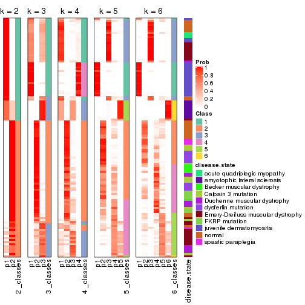


Test correlation between subgroups and known annotations. If the known
annotation is numeric, one-way ANOVA test is applied, and if the known
annotation is discrete, chi-squared contingency table test is applied.

```r
test_to_known_factors(res)
```

```
#>             n disease.state(p) k
#> SD:mclust 117         9.38e-12 2
#> SD:mclust 113         2.34e-19 3
#> SD:mclust 112         1.08e-27 4
#> SD:mclust  79         1.93e-26 5
#> SD:mclust  91         4.12e-33 6
```


If matrix rows can be associated to genes, consider to use `functional_enrichment(res,
...)` to perform function enrichment for the signature genes. See [this vignette](http://bioconductor.org/packages/devel/bioc/vignettes/cola/inst/doc/functional_enrichment.html) for more detailed explanations.


 

---------------------------------------------------


### SD:NMF*


The object with results only for a single top-value method and a single partition method 
can be extracted as:

```r
res = res_list["SD", "NMF"]
# you can also extract it by
# res = res_list["SD:NMF"]
```

A summary of `res` and all the functions that can be applied to it:

```r
res
```

```
#> A 'ConsensusPartition' object with k = 2, 3, 4, 5, 6.
#>   On a matrix with 21512 rows and 119 columns.
#>   Top rows (1000, 2000, 3000, 4000, 5000) are extracted by 'SD' method.
#>   Subgroups are detected by 'NMF' method.
#>   Performed in total 1250 partitions by row resampling.
#>   Best k for subgroups seems to be 2.
#> 
#> Following methods can be applied to this 'ConsensusPartition' object:
#>  [1] "cola_report"             "collect_classes"         "collect_plots"          
#>  [4] "collect_stats"           "colnames"                "compare_signatures"     
#>  [7] "consensus_heatmap"       "dimension_reduction"     "functional_enrichment"  
#> [10] "get_anno_col"            "get_anno"                "get_classes"            
#> [13] "get_consensus"           "get_matrix"              "get_membership"         
#> [16] "get_param"               "get_signatures"          "get_stats"              
#> [19] "is_best_k"               "is_stable_k"             "membership_heatmap"     
#> [22] "ncol"                    "nrow"                    "plot_ecdf"              
#> [25] "rownames"                "select_partition_number" "show"                   
#> [28] "suggest_best_k"          "test_to_known_factors"
```

`collect_plots()` function collects all the plots made from `res` for all `k` (number of partitions)
into one single page to provide an easy and fast comparison between different `k`.

```r
collect_plots(res)
```


The plots are:

- The first row: a plot of the ECDF (empirical cumulative distribution
  function) curves of the consensus matrix for each `k` and the heatmap of
  predicted classes for each `k`.
- The second row: heatmaps of the consensus matrix for each `k`.
- The third row: heatmaps of the membership matrix for each `k`.
- The fouth row: heatmaps of the signatures for each `k`.

All the plots in panels can be made by individual functions and they are
plotted later in this section.

`select_partition_number()` produces several plots showing different
statistics for choosing "optimized" `k`. There are following statistics:

- ECDF curves of the consensus matrix for each `k`;
- 1-PAC. [The PAC
  score](https://en.wikipedia.org/wiki/Consensus_clustering#Over-interpretation_potential_of_consensus_clustering)
  measures the proportion of the ambiguous subgrouping.
- Mean silhouette score.
- Concordance. The mean probability of fiting the consensus class ids in all
  partitions.
- Area increased. Denote $A_k$ as the area under the ECDF curve for current
  `k`, the area increased is defined as $A_k - A_{k-1}$.
- Rand index. The percent of pairs of samples that are both in a same cluster
  or both are not in a same cluster in the partition of k and k-1.
- Jaccard index. The ratio of pairs of samples are both in a same cluster in
  the partition of k and k-1 and the pairs of samples are both in a same
  cluster in the partition k or k-1.

The detailed explanations of these statistics can be found in [the _cola_
vignette](http://bioconductor.org/packages/devel/bioc/vignettes/cola/inst/doc/cola.html#toc_13).

Generally speaking, lower PAC score, higher mean silhouette score or higher
concordance corresponds to better partition. Rand index and Jaccard index
measure how similar the current partition is compared to partition with `k-1`.
If they are too similar, we won't accept `k` is better than `k-1`.

```r
select_partition_number(res)
```


The numeric values for all these statistics can be obtained by `get_stats()`.

```r
get_stats(res)
```

```
#>   k 1-PAC mean_silhouette concordance area_increased  Rand Jaccard
#> 2 2 0.914           0.924       0.970         0.5028 0.496   0.496
#> 3 3 0.535           0.705       0.846         0.3149 0.742   0.527
#> 4 4 0.595           0.583       0.764         0.1252 0.815   0.522
#> 5 5 0.619           0.521       0.748         0.0617 0.874   0.572
#> 6 6 0.675           0.632       0.766         0.0455 0.839   0.413
```

`suggest_best_k()` suggests the best $k$ based on these statistics. The rules are as follows:

- All $k$ with Jaccard index larger than 0.95 are removed because increasing
  $k$ does not provide enough extra information. If all $k$ are removed, it is
  marked as no subgroup is detected.
- For all $k$ with 1-PAC score larger than 0.9, the maximal $k$ is taken as
  the best $k$, and other $k$ are marked as optional $k$.
- If it does not fit the second rule. The $k$ with the maximal vote of the
  highest 1-PAC score, highest mean silhouette, and highest concordance is
  taken as the best $k$.

```r
suggest_best_k(res)
```

```
#> [1] 2
```


Following shows the table of the partitions (You need to click the **show/hide
code output** link to see it). The membership matrix (columns with name `p*`)
is inferred by
[`clue::cl_consensus()`](https://www.rdocumentation.org/link/cl_consensus?package=clue)
function with the `SE` method. Basically the value in the membership matrix
represents the probability to belong to a certain group. The finall class
label for an item is determined with the group with highest probability it
belongs to.

In `get_classes()` function, the entropy is calculated from the membership
matrix and the silhouette score is calculated from the consensus matrix.


<script>
$( function() {
	$( '#tabs-SD-NMF-get-classes' ).tabs();
} );
</script>
<div id='tabs-SD-NMF-get-classes'>
<ul>
<li><a href='#tab-SD-NMF-get-classes-1'>k = 2</a></li>
<li><a href='#tab-SD-NMF-get-classes-2'>k = 3</a></li>
<li><a href='#tab-SD-NMF-get-classes-3'>k = 4</a></li>
<li><a href='#tab-SD-NMF-get-classes-4'>k = 5</a></li>
<li><a href='#tab-SD-NMF-get-classes-5'>k = 6</a></li>
</ul>

<div id='tab-SD-NMF-get-classes-1'>
<p><a id='tab-SD-NMF-get-classes-1-a' style='color:#0366d6' href='#'>show/hide code output</a></p>
<pre><code class="r">cbind(get_classes(res, k = 2), get_membership(res, k = 2))
</code></pre>

<pre><code>#&gt;           class entropy silhouette    p1    p2
#&gt; GSM120719     1  0.0000      0.963 1.000 0.000
#&gt; GSM120720     1  0.0000      0.963 1.000 0.000
#&gt; GSM120765     2  0.0000      0.972 0.000 1.000
#&gt; GSM120767     2  0.0000      0.972 0.000 1.000
#&gt; GSM120784     2  0.0000      0.972 0.000 1.000
#&gt; GSM121400     1  0.0000      0.963 1.000 0.000
#&gt; GSM121401     1  0.0000      0.963 1.000 0.000
#&gt; GSM121402     2  0.0000      0.972 0.000 1.000
#&gt; GSM121403     1  0.7745      0.706 0.772 0.228
#&gt; GSM121404     2  0.0000      0.972 0.000 1.000
#&gt; GSM121405     1  0.0000      0.963 1.000 0.000
#&gt; GSM121406     2  0.0000      0.972 0.000 1.000
#&gt; GSM121408     2  0.0000      0.972 0.000 1.000
#&gt; GSM121409     1  0.0000      0.963 1.000 0.000
#&gt; GSM121410     1  0.0000      0.963 1.000 0.000
#&gt; GSM121412     2  0.0000      0.972 0.000 1.000
#&gt; GSM121413     2  0.0000      0.972 0.000 1.000
#&gt; GSM121414     2  0.0000      0.972 0.000 1.000
#&gt; GSM121415     2  0.0000      0.972 0.000 1.000
#&gt; GSM121416     2  0.0000      0.972 0.000 1.000
#&gt; GSM120591     1  0.0000      0.963 1.000 0.000
#&gt; GSM120594     1  0.0000      0.963 1.000 0.000
#&gt; GSM120718     1  0.0000      0.963 1.000 0.000
#&gt; GSM121205     1  0.0000      0.963 1.000 0.000
#&gt; GSM121206     1  0.0000      0.963 1.000 0.000
#&gt; GSM121207     1  0.0000      0.963 1.000 0.000
#&gt; GSM121208     1  0.0000      0.963 1.000 0.000
#&gt; GSM121209     1  0.0000      0.963 1.000 0.000
#&gt; GSM121210     1  0.0000      0.963 1.000 0.000
#&gt; GSM121211     1  0.0000      0.963 1.000 0.000
#&gt; GSM121212     1  0.0000      0.963 1.000 0.000
#&gt; GSM121213     1  0.0000      0.963 1.000 0.000
#&gt; GSM121214     1  0.0000      0.963 1.000 0.000
#&gt; GSM121215     1  0.0000      0.963 1.000 0.000
#&gt; GSM121216     1  0.0000      0.963 1.000 0.000
#&gt; GSM121217     1  0.0000      0.963 1.000 0.000
#&gt; GSM121218     1  0.0000      0.963 1.000 0.000
#&gt; GSM121234     1  0.0000      0.963 1.000 0.000
#&gt; GSM121243     1  0.0000      0.963 1.000 0.000
#&gt; GSM121245     1  0.0000      0.963 1.000 0.000
#&gt; GSM121246     1  0.0000      0.963 1.000 0.000
#&gt; GSM121247     1  0.0000      0.963 1.000 0.000
#&gt; GSM121248     1  0.0000      0.963 1.000 0.000
#&gt; GSM120744     1  0.9954      0.171 0.540 0.460
#&gt; GSM120745     1  0.0000      0.963 1.000 0.000
#&gt; GSM120746     1  0.4022      0.897 0.920 0.080
#&gt; GSM120747     1  0.8327      0.654 0.736 0.264
#&gt; GSM120748     2  0.2603      0.930 0.044 0.956
#&gt; GSM120749     1  0.1184      0.952 0.984 0.016
#&gt; GSM120750     1  0.7602      0.725 0.780 0.220
#&gt; GSM120751     1  0.5629      0.841 0.868 0.132
#&gt; GSM120752     1  0.0000      0.963 1.000 0.000
#&gt; GSM121336     2  0.0000      0.972 0.000 1.000
#&gt; GSM121339     2  0.0672      0.965 0.008 0.992
#&gt; GSM121349     2  0.0000      0.972 0.000 1.000
#&gt; GSM121355     2  0.0000      0.972 0.000 1.000
#&gt; GSM120757     1  0.2423      0.933 0.960 0.040
#&gt; GSM120766     1  0.9881      0.248 0.564 0.436
#&gt; GSM120770     2  0.0000      0.972 0.000 1.000
#&gt; GSM120779     1  0.0000      0.963 1.000 0.000
#&gt; GSM120780     2  0.0000      0.972 0.000 1.000
#&gt; GSM121102     2  0.0000      0.972 0.000 1.000
#&gt; GSM121203     2  0.9358      0.435 0.352 0.648
#&gt; GSM121204     1  0.0000      0.963 1.000 0.000
#&gt; GSM121330     1  0.0000      0.963 1.000 0.000
#&gt; GSM121335     1  0.0000      0.963 1.000 0.000
#&gt; GSM121337     2  0.0000      0.972 0.000 1.000
#&gt; GSM121338     2  0.0000      0.972 0.000 1.000
#&gt; GSM121341     1  0.0000      0.963 1.000 0.000
#&gt; GSM121342     1  0.0000      0.963 1.000 0.000
#&gt; GSM121343     2  0.0000      0.972 0.000 1.000
#&gt; GSM121344     1  0.0000      0.963 1.000 0.000
#&gt; GSM121346     1  0.0000      0.963 1.000 0.000
#&gt; GSM121347     2  0.0000      0.972 0.000 1.000
#&gt; GSM121348     2  0.0000      0.972 0.000 1.000
#&gt; GSM121350     1  0.0000      0.963 1.000 0.000
#&gt; GSM121352     1  0.0000      0.963 1.000 0.000
#&gt; GSM121354     1  0.0000      0.963 1.000 0.000
#&gt; GSM120753     2  0.0000      0.972 0.000 1.000
#&gt; GSM120761     2  0.0000      0.972 0.000 1.000
#&gt; GSM120768     2  0.0000      0.972 0.000 1.000
#&gt; GSM120781     2  0.0000      0.972 0.000 1.000
#&gt; GSM120788     2  0.9635      0.353 0.388 0.612
#&gt; GSM120760     2  0.0000      0.972 0.000 1.000
#&gt; GSM120763     2  0.0000      0.972 0.000 1.000
#&gt; GSM120764     2  0.0000      0.972 0.000 1.000
#&gt; GSM120777     2  0.0672      0.965 0.008 0.992
#&gt; GSM120786     2  0.0000      0.972 0.000 1.000
#&gt; GSM121329     1  0.0000      0.963 1.000 0.000
#&gt; GSM121331     1  0.2043      0.940 0.968 0.032
#&gt; GSM121333     1  0.0376      0.961 0.996 0.004
#&gt; GSM121345     1  0.0000      0.963 1.000 0.000
#&gt; GSM121356     1  0.0376      0.961 0.996 0.004
#&gt; GSM120754     2  0.0000      0.972 0.000 1.000
#&gt; GSM120759     2  0.0000      0.972 0.000 1.000
#&gt; GSM120762     2  0.0000      0.972 0.000 1.000
#&gt; GSM120775     2  0.1633      0.950 0.024 0.976
#&gt; GSM120776     2  0.9933      0.150 0.452 0.548
#&gt; GSM120782     2  0.0000      0.972 0.000 1.000
#&gt; GSM120789     2  0.0000      0.972 0.000 1.000
#&gt; GSM120790     2  0.0000      0.972 0.000 1.000
#&gt; GSM120791     2  0.0000      0.972 0.000 1.000
#&gt; GSM120755     2  0.0000      0.972 0.000 1.000
#&gt; GSM120756     1  0.4690      0.876 0.900 0.100
#&gt; GSM120769     2  0.0000      0.972 0.000 1.000
#&gt; GSM120778     2  0.0000      0.972 0.000 1.000
#&gt; GSM120792     2  0.0000      0.972 0.000 1.000
#&gt; GSM121332     2  0.0000      0.972 0.000 1.000
#&gt; GSM121334     2  0.0000      0.972 0.000 1.000
#&gt; GSM121340     2  0.0000      0.972 0.000 1.000
#&gt; GSM121351     2  0.0000      0.972 0.000 1.000
#&gt; GSM121353     2  0.9044      0.523 0.320 0.680
#&gt; GSM120758     2  0.0000      0.972 0.000 1.000
#&gt; GSM120771     2  0.0000      0.972 0.000 1.000
#&gt; GSM120772     2  0.0000      0.972 0.000 1.000
#&gt; GSM120773     2  0.0000      0.972 0.000 1.000
#&gt; GSM120774     2  0.0000      0.972 0.000 1.000
#&gt; GSM120783     2  0.0000      0.972 0.000 1.000
#&gt; GSM120787     2  0.0000      0.972 0.000 1.000
</code></pre>

<script>
$('#tab-SD-NMF-get-classes-1-a').parent().next().next().hide();
$('#tab-SD-NMF-get-classes-1-a').click(function(){
  $('#tab-SD-NMF-get-classes-1-a').parent().next().next().toggle();
  return(false);
});
</script>
</div>

<div id='tab-SD-NMF-get-classes-2'>
<p><a id='tab-SD-NMF-get-classes-2-a' style='color:#0366d6' href='#'>show/hide code output</a></p>
<pre><code class="r">cbind(get_classes(res, k = 3), get_membership(res, k = 3))
</code></pre>

<pre><code>#&gt;           class entropy silhouette    p1    p2    p3
#&gt; GSM120719     1  0.3551     0.7513 0.868 0.000 0.132
#&gt; GSM120720     3  0.3267     0.7324 0.116 0.000 0.884
#&gt; GSM120765     2  0.2711     0.8463 0.000 0.912 0.088
#&gt; GSM120767     2  0.2356     0.8541 0.000 0.928 0.072
#&gt; GSM120784     2  0.4235     0.7720 0.000 0.824 0.176
#&gt; GSM121400     3  0.1163     0.7746 0.000 0.028 0.972
#&gt; GSM121401     3  0.0475     0.7753 0.004 0.004 0.992
#&gt; GSM121402     2  0.2165     0.8573 0.000 0.936 0.064
#&gt; GSM121403     3  0.2537     0.7580 0.000 0.080 0.920
#&gt; GSM121404     3  0.6308    -0.0119 0.000 0.492 0.508
#&gt; GSM121405     3  0.1529     0.7721 0.000 0.040 0.960
#&gt; GSM121406     2  0.3116     0.8345 0.000 0.892 0.108
#&gt; GSM121408     2  0.3116     0.8359 0.000 0.892 0.108
#&gt; GSM121409     3  0.1163     0.7749 0.000 0.028 0.972
#&gt; GSM121410     3  0.1289     0.7740 0.000 0.032 0.968
#&gt; GSM121412     2  0.4750     0.7220 0.000 0.784 0.216
#&gt; GSM121413     2  0.3412     0.8236 0.000 0.876 0.124
#&gt; GSM121414     2  0.4399     0.7580 0.000 0.812 0.188
#&gt; GSM121415     2  0.3412     0.8235 0.000 0.876 0.124
#&gt; GSM121416     2  0.2356     0.8541 0.000 0.928 0.072
#&gt; GSM120591     3  0.3038     0.7412 0.104 0.000 0.896
#&gt; GSM120594     3  0.3192     0.7355 0.112 0.000 0.888
#&gt; GSM120718     3  0.6026     0.2357 0.376 0.000 0.624
#&gt; GSM121205     1  0.5098     0.6929 0.752 0.000 0.248
#&gt; GSM121206     1  0.6079     0.4946 0.612 0.000 0.388
#&gt; GSM121207     1  0.3340     0.7527 0.880 0.000 0.120
#&gt; GSM121208     3  0.5465     0.4716 0.288 0.000 0.712
#&gt; GSM121209     1  0.6286     0.3134 0.536 0.000 0.464
#&gt; GSM121210     1  0.5098     0.6922 0.752 0.000 0.248
#&gt; GSM121211     1  0.6192     0.4303 0.580 0.000 0.420
#&gt; GSM121212     1  0.4931     0.7063 0.768 0.000 0.232
#&gt; GSM121213     1  0.5497     0.6430 0.708 0.000 0.292
#&gt; GSM121214     1  0.4399     0.7344 0.812 0.000 0.188
#&gt; GSM121215     1  0.6095     0.4887 0.608 0.000 0.392
#&gt; GSM121216     1  0.5497     0.6478 0.708 0.000 0.292
#&gt; GSM121217     1  0.5948     0.5480 0.640 0.000 0.360
#&gt; GSM121218     1  0.4399     0.7344 0.812 0.000 0.188
#&gt; GSM121234     3  0.6168     0.1053 0.412 0.000 0.588
#&gt; GSM121243     1  0.4654     0.7236 0.792 0.000 0.208
#&gt; GSM121245     1  0.3879     0.7471 0.848 0.000 0.152
#&gt; GSM121246     3  0.4555     0.6337 0.200 0.000 0.800
#&gt; GSM121247     1  0.1529     0.7545 0.960 0.000 0.040
#&gt; GSM121248     1  0.4504     0.7302 0.804 0.000 0.196
#&gt; GSM120744     3  0.5216     0.6149 0.000 0.260 0.740
#&gt; GSM120745     3  0.4121     0.7020 0.168 0.000 0.832
#&gt; GSM120746     3  0.2356     0.7630 0.000 0.072 0.928
#&gt; GSM120747     3  0.2711     0.7542 0.000 0.088 0.912
#&gt; GSM120748     3  0.5178     0.6177 0.000 0.256 0.744
#&gt; GSM120749     3  0.1170     0.7760 0.008 0.016 0.976
#&gt; GSM120750     3  0.3686     0.7270 0.000 0.140 0.860
#&gt; GSM120751     3  0.3918     0.7293 0.004 0.140 0.856
#&gt; GSM120752     3  0.4605     0.6686 0.204 0.000 0.796
#&gt; GSM121336     2  0.2356     0.8540 0.000 0.928 0.072
#&gt; GSM121339     3  0.5465     0.5532 0.000 0.288 0.712
#&gt; GSM121349     2  0.2066     0.8579 0.000 0.940 0.060
#&gt; GSM121355     2  0.2796     0.8444 0.000 0.908 0.092
#&gt; GSM120757     1  0.0747     0.7481 0.984 0.016 0.000
#&gt; GSM120766     1  0.7485     0.5102 0.680 0.224 0.096
#&gt; GSM120770     2  0.3412     0.8234 0.000 0.876 0.124
#&gt; GSM120779     1  0.0892     0.7469 0.980 0.020 0.000
#&gt; GSM120780     2  0.6062     0.3889 0.000 0.616 0.384
#&gt; GSM121102     2  0.6140     0.3362 0.000 0.596 0.404
#&gt; GSM121203     3  0.5363     0.5861 0.000 0.276 0.724
#&gt; GSM121204     1  0.0983     0.7534 0.980 0.004 0.016
#&gt; GSM121330     3  0.1643     0.7689 0.044 0.000 0.956
#&gt; GSM121335     3  0.3267     0.7324 0.116 0.000 0.884
#&gt; GSM121337     2  0.3412     0.8235 0.000 0.876 0.124
#&gt; GSM121338     3  0.5859     0.4472 0.000 0.344 0.656
#&gt; GSM121341     3  0.3340     0.7289 0.120 0.000 0.880
#&gt; GSM121342     3  0.4842     0.5959 0.224 0.000 0.776
#&gt; GSM121343     3  0.5678     0.5033 0.000 0.316 0.684
#&gt; GSM121344     3  0.2959     0.7432 0.100 0.000 0.900
#&gt; GSM121346     3  0.1529     0.7700 0.040 0.000 0.960
#&gt; GSM121347     2  0.3237     0.8665 0.056 0.912 0.032
#&gt; GSM121348     2  0.4094     0.8495 0.100 0.872 0.028
#&gt; GSM121350     3  0.1289     0.7716 0.032 0.000 0.968
#&gt; GSM121352     3  0.1860     0.7661 0.052 0.000 0.948
#&gt; GSM121354     3  0.2261     0.7591 0.068 0.000 0.932
#&gt; GSM120753     2  0.1031     0.8656 0.024 0.976 0.000
#&gt; GSM120761     2  0.2165     0.8542 0.064 0.936 0.000
#&gt; GSM120768     2  0.3267     0.8261 0.116 0.884 0.000
#&gt; GSM120781     2  0.1015     0.8667 0.012 0.980 0.008
#&gt; GSM120788     1  0.3482     0.6885 0.872 0.128 0.000
#&gt; GSM120760     2  0.4887     0.7213 0.228 0.772 0.000
#&gt; GSM120763     2  0.4452     0.7621 0.192 0.808 0.000
#&gt; GSM120764     1  0.6307    -0.1562 0.512 0.488 0.000
#&gt; GSM120777     1  0.4346     0.6382 0.816 0.184 0.000
#&gt; GSM120786     2  0.6192     0.3837 0.420 0.580 0.000
#&gt; GSM121329     1  0.3879     0.7481 0.848 0.000 0.152
#&gt; GSM121331     1  0.1031     0.7454 0.976 0.024 0.000
#&gt; GSM121333     1  0.0424     0.7498 0.992 0.008 0.000
#&gt; GSM121345     1  0.1031     0.7455 0.976 0.024 0.000
#&gt; GSM121356     1  0.0983     0.7537 0.980 0.004 0.016
#&gt; GSM120754     2  0.4399     0.7655 0.188 0.812 0.000
#&gt; GSM120759     2  0.1529     0.8628 0.000 0.960 0.040
#&gt; GSM120762     2  0.1163     0.8650 0.028 0.972 0.000
#&gt; GSM120775     1  0.4654     0.6041 0.792 0.208 0.000
#&gt; GSM120776     1  0.3192     0.7009 0.888 0.112 0.000
#&gt; GSM120782     2  0.3752     0.8048 0.144 0.856 0.000
#&gt; GSM120789     2  0.0892     0.8655 0.000 0.980 0.020
#&gt; GSM120790     2  0.1129     0.8666 0.020 0.976 0.004
#&gt; GSM120791     2  0.3816     0.8011 0.148 0.852 0.000
#&gt; GSM120755     2  0.1411     0.8635 0.000 0.964 0.036
#&gt; GSM120756     1  0.3038     0.7042 0.896 0.104 0.000
#&gt; GSM120769     2  0.1163     0.8653 0.028 0.972 0.000
#&gt; GSM120778     2  0.2261     0.8528 0.068 0.932 0.000
#&gt; GSM120792     2  0.2796     0.8417 0.092 0.908 0.000
#&gt; GSM121332     2  0.1289     0.8639 0.000 0.968 0.032
#&gt; GSM121334     2  0.1529     0.8625 0.040 0.960 0.000
#&gt; GSM121340     2  0.6286     0.2668 0.464 0.536 0.000
#&gt; GSM121351     2  0.2356     0.8540 0.000 0.928 0.072
#&gt; GSM121353     1  0.4346     0.6389 0.816 0.184 0.000
#&gt; GSM120758     2  0.0892     0.8661 0.020 0.980 0.000
#&gt; GSM120771     2  0.0983     0.8662 0.004 0.980 0.016
#&gt; GSM120772     2  0.1411     0.8635 0.036 0.964 0.000
#&gt; GSM120773     2  0.4605     0.7506 0.204 0.796 0.000
#&gt; GSM120774     2  0.2537     0.8466 0.080 0.920 0.000
#&gt; GSM120783     2  0.5882     0.5382 0.348 0.652 0.000
#&gt; GSM120787     2  0.2165     0.8549 0.064 0.936 0.000
</code></pre>

<script>
$('#tab-SD-NMF-get-classes-2-a').parent().next().next().hide();
$('#tab-SD-NMF-get-classes-2-a').click(function(){
  $('#tab-SD-NMF-get-classes-2-a').parent().next().next().toggle();
  return(false);
});
</script>
</div>

<div id='tab-SD-NMF-get-classes-3'>
<p><a id='tab-SD-NMF-get-classes-3-a' style='color:#0366d6' href='#'>show/hide code output</a></p>
<pre><code class="r">cbind(get_classes(res, k = 4), get_membership(res, k = 4))
</code></pre>

<pre><code>#&gt;           class entropy silhouette    p1    p2    p3    p4
#&gt; GSM120719     1  0.4483     0.5094 0.712 0.000 0.004 0.284
#&gt; GSM120720     3  0.5163    -0.1160 0.480 0.000 0.516 0.004
#&gt; GSM120765     2  0.2589     0.8407 0.000 0.884 0.116 0.000
#&gt; GSM120767     2  0.1398     0.8777 0.000 0.956 0.040 0.004
#&gt; GSM120784     2  0.4391     0.6867 0.000 0.740 0.252 0.008
#&gt; GSM121400     3  0.3161     0.5244 0.124 0.012 0.864 0.000
#&gt; GSM121401     3  0.3975     0.4344 0.240 0.000 0.760 0.000
#&gt; GSM121402     2  0.1637     0.8696 0.000 0.940 0.060 0.000
#&gt; GSM121403     3  0.4337     0.5071 0.140 0.052 0.808 0.000
#&gt; GSM121404     3  0.4713     0.3893 0.004 0.292 0.700 0.004
#&gt; GSM121405     3  0.4194     0.4455 0.228 0.008 0.764 0.000
#&gt; GSM121406     2  0.1940     0.8619 0.000 0.924 0.076 0.000
#&gt; GSM121408     2  0.1118     0.8761 0.000 0.964 0.036 0.000
#&gt; GSM121409     3  0.4538     0.4510 0.216 0.024 0.760 0.000
#&gt; GSM121410     3  0.4898     0.3980 0.260 0.024 0.716 0.000
#&gt; GSM121412     2  0.3123     0.8059 0.000 0.844 0.156 0.000
#&gt; GSM121413     2  0.2704     0.8332 0.000 0.876 0.124 0.000
#&gt; GSM121414     2  0.3123     0.8053 0.000 0.844 0.156 0.000
#&gt; GSM121415     2  0.2704     0.8327 0.000 0.876 0.124 0.000
#&gt; GSM121416     2  0.2198     0.8670 0.000 0.920 0.072 0.008
#&gt; GSM120591     3  0.5250     0.5008 0.176 0.000 0.744 0.080
#&gt; GSM120594     3  0.5167    -0.1429 0.488 0.000 0.508 0.004
#&gt; GSM120718     1  0.4401     0.5852 0.724 0.000 0.272 0.004
#&gt; GSM121205     1  0.1302     0.7461 0.956 0.000 0.000 0.044
#&gt; GSM121206     1  0.2345     0.7205 0.900 0.000 0.100 0.000
#&gt; GSM121207     1  0.3668     0.6504 0.808 0.000 0.004 0.188
#&gt; GSM121208     1  0.4040     0.5991 0.752 0.000 0.248 0.000
#&gt; GSM121209     1  0.2921     0.6959 0.860 0.000 0.140 0.000
#&gt; GSM121210     1  0.2198     0.7440 0.920 0.000 0.008 0.072
#&gt; GSM121211     1  0.2480     0.7295 0.904 0.000 0.088 0.008
#&gt; GSM121212     1  0.1978     0.7434 0.928 0.000 0.004 0.068
#&gt; GSM121213     1  0.2089     0.7448 0.932 0.000 0.048 0.020
#&gt; GSM121214     1  0.2281     0.7311 0.904 0.000 0.000 0.096
#&gt; GSM121215     1  0.2342     0.7329 0.912 0.000 0.080 0.008
#&gt; GSM121216     1  0.1109     0.7450 0.968 0.000 0.028 0.004
#&gt; GSM121217     1  0.2142     0.7425 0.928 0.000 0.056 0.016
#&gt; GSM121218     1  0.2081     0.7363 0.916 0.000 0.000 0.084
#&gt; GSM121234     1  0.3123     0.6839 0.844 0.000 0.156 0.000
#&gt; GSM121243     1  0.1824     0.7454 0.936 0.000 0.004 0.060
#&gt; GSM121245     1  0.3400     0.6646 0.820 0.000 0.000 0.180
#&gt; GSM121246     1  0.4277     0.5606 0.720 0.000 0.280 0.000
#&gt; GSM121247     1  0.4819     0.3891 0.652 0.000 0.004 0.344
#&gt; GSM121248     1  0.1867     0.7410 0.928 0.000 0.000 0.072
#&gt; GSM120744     3  0.4916     0.3133 0.000 0.000 0.576 0.424
#&gt; GSM120745     3  0.4981     0.2483 0.000 0.000 0.536 0.464
#&gt; GSM120746     3  0.4661     0.4187 0.000 0.000 0.652 0.348
#&gt; GSM120747     3  0.4049     0.5109 0.008 0.000 0.780 0.212
#&gt; GSM120748     3  0.4250     0.4729 0.000 0.000 0.724 0.276
#&gt; GSM120749     3  0.4800     0.4295 0.004 0.000 0.656 0.340
#&gt; GSM120750     3  0.4804     0.3790 0.000 0.000 0.616 0.384
#&gt; GSM120751     3  0.4804     0.3780 0.000 0.000 0.616 0.384
#&gt; GSM120752     3  0.4998     0.1860 0.000 0.000 0.512 0.488
#&gt; GSM121336     2  0.1022     0.8769 0.000 0.968 0.032 0.000
#&gt; GSM121339     3  0.6663     0.2855 0.100 0.344 0.556 0.000
#&gt; GSM121349     2  0.0817     0.8777 0.000 0.976 0.024 0.000
#&gt; GSM121355     2  0.1302     0.8742 0.000 0.956 0.044 0.000
#&gt; GSM120757     4  0.3710     0.5238 0.004 0.000 0.192 0.804
#&gt; GSM120766     4  0.4722     0.3467 0.000 0.008 0.300 0.692
#&gt; GSM120770     3  0.6980     0.1997 0.000 0.116 0.484 0.400
#&gt; GSM120779     4  0.2999     0.5853 0.004 0.000 0.132 0.864
#&gt; GSM120780     3  0.5292     0.1920 0.000 0.008 0.512 0.480
#&gt; GSM121102     3  0.5566     0.4722 0.000 0.072 0.704 0.224
#&gt; GSM121203     3  0.4661     0.4221 0.000 0.000 0.652 0.348
#&gt; GSM121204     4  0.3335     0.5942 0.016 0.000 0.128 0.856
#&gt; GSM121330     1  0.5000     0.0941 0.500 0.000 0.500 0.000
#&gt; GSM121335     1  0.4972     0.2282 0.544 0.000 0.456 0.000
#&gt; GSM121337     2  0.4054     0.7714 0.000 0.796 0.188 0.016
#&gt; GSM121338     3  0.4052     0.5459 0.012 0.124 0.836 0.028
#&gt; GSM121341     1  0.4907     0.3162 0.580 0.000 0.420 0.000
#&gt; GSM121342     1  0.4543     0.4955 0.676 0.000 0.324 0.000
#&gt; GSM121343     3  0.4678     0.5412 0.012 0.120 0.808 0.060
#&gt; GSM121344     3  0.4907     0.0766 0.420 0.000 0.580 0.000
#&gt; GSM121346     3  0.4122     0.4416 0.236 0.000 0.760 0.004
#&gt; GSM121347     2  0.6394     0.4013 0.000 0.596 0.088 0.316
#&gt; GSM121348     4  0.5530     0.4658 0.000 0.076 0.212 0.712
#&gt; GSM121350     3  0.4040     0.4277 0.248 0.000 0.752 0.000
#&gt; GSM121352     3  0.4535     0.3590 0.292 0.000 0.704 0.004
#&gt; GSM121354     3  0.4972    -0.0271 0.456 0.000 0.544 0.000
#&gt; GSM120753     2  0.0921     0.8714 0.000 0.972 0.000 0.028
#&gt; GSM120761     2  0.3975     0.6261 0.000 0.760 0.000 0.240
#&gt; GSM120768     2  0.3726     0.6670 0.000 0.788 0.000 0.212
#&gt; GSM120781     2  0.0707     0.8738 0.000 0.980 0.000 0.020
#&gt; GSM120788     4  0.4815     0.5946 0.216 0.028 0.004 0.752
#&gt; GSM120760     4  0.5151     0.2059 0.004 0.464 0.000 0.532
#&gt; GSM120763     2  0.5004     0.2275 0.004 0.604 0.000 0.392
#&gt; GSM120764     4  0.6163     0.6337 0.140 0.168 0.004 0.688
#&gt; GSM120777     4  0.4517     0.6374 0.168 0.036 0.004 0.792
#&gt; GSM120786     4  0.5854     0.6009 0.064 0.256 0.004 0.676
#&gt; GSM121329     1  0.3539     0.6723 0.820 0.000 0.004 0.176
#&gt; GSM121331     4  0.2739     0.6423 0.036 0.000 0.060 0.904
#&gt; GSM121333     4  0.2282     0.6425 0.024 0.000 0.052 0.924
#&gt; GSM121345     4  0.3105     0.6452 0.140 0.000 0.004 0.856
#&gt; GSM121356     4  0.3032     0.5938 0.008 0.000 0.124 0.868
#&gt; GSM120754     4  0.4261     0.6235 0.000 0.112 0.068 0.820
#&gt; GSM120759     2  0.0921     0.8783 0.000 0.972 0.028 0.000
#&gt; GSM120762     2  0.0592     0.8747 0.000 0.984 0.000 0.016
#&gt; GSM120775     4  0.6109     0.5759 0.224 0.096 0.004 0.676
#&gt; GSM120776     4  0.3052     0.6457 0.032 0.008 0.064 0.896
#&gt; GSM120782     4  0.6508     0.4421 0.000 0.360 0.084 0.556
#&gt; GSM120789     2  0.0469     0.8779 0.000 0.988 0.012 0.000
#&gt; GSM120790     2  0.5170     0.6186 0.000 0.724 0.048 0.228
#&gt; GSM120791     2  0.4500     0.4533 0.000 0.684 0.000 0.316
#&gt; GSM120755     2  0.0376     0.8770 0.000 0.992 0.004 0.004
#&gt; GSM120756     4  0.5822     0.4826 0.296 0.048 0.004 0.652
#&gt; GSM120769     2  0.0707     0.8738 0.000 0.980 0.000 0.020
#&gt; GSM120778     2  0.1302     0.8638 0.000 0.956 0.000 0.044
#&gt; GSM120792     2  0.1557     0.8563 0.000 0.944 0.000 0.056
#&gt; GSM121332     2  0.0524     0.8775 0.000 0.988 0.008 0.004
#&gt; GSM121334     2  0.1557     0.8577 0.000 0.944 0.000 0.056
#&gt; GSM121340     4  0.7392     0.4950 0.172 0.300 0.004 0.524
#&gt; GSM121351     2  0.1022     0.8772 0.000 0.968 0.032 0.000
#&gt; GSM121353     1  0.7685    -0.2410 0.412 0.184 0.004 0.400
#&gt; GSM120758     2  0.0707     0.8736 0.000 0.980 0.000 0.020
#&gt; GSM120771     2  0.2319     0.8700 0.000 0.924 0.036 0.040
#&gt; GSM120772     2  0.1022     0.8698 0.000 0.968 0.000 0.032
#&gt; GSM120773     4  0.5039     0.3587 0.004 0.404 0.000 0.592
#&gt; GSM120774     2  0.1389     0.8622 0.000 0.952 0.000 0.048
#&gt; GSM120783     4  0.5778     0.4645 0.040 0.356 0.000 0.604
#&gt; GSM120787     2  0.0921     0.8708 0.000 0.972 0.000 0.028
</code></pre>

<script>
$('#tab-SD-NMF-get-classes-3-a').parent().next().next().hide();
$('#tab-SD-NMF-get-classes-3-a').click(function(){
  $('#tab-SD-NMF-get-classes-3-a').parent().next().next().toggle();
  return(false);
});
</script>
</div>

<div id='tab-SD-NMF-get-classes-4'>
<p><a id='tab-SD-NMF-get-classes-4-a' style='color:#0366d6' href='#'>show/hide code output</a></p>
<pre><code class="r">cbind(get_classes(res, k = 5), get_membership(res, k = 5))
</code></pre>

<pre><code>#&gt;           class entropy silhouette    p1    p2    p3    p4    p5
#&gt; GSM120719     1  0.5773    0.48985 0.592 0.008 0.064 0.328 0.008
#&gt; GSM120720     3  0.1410    0.70536 0.060 0.000 0.940 0.000 0.000
#&gt; GSM120765     2  0.4040    0.54341 0.000 0.712 0.012 0.000 0.276
#&gt; GSM120767     2  0.2214    0.68709 0.000 0.916 0.028 0.004 0.052
#&gt; GSM120784     2  0.5905    0.28478 0.000 0.556 0.104 0.004 0.336
#&gt; GSM121400     5  0.5295    0.40856 0.128 0.000 0.200 0.000 0.672
#&gt; GSM121401     3  0.4541    0.63935 0.172 0.000 0.744 0.000 0.084
#&gt; GSM121402     5  0.4446   -0.08951 0.000 0.476 0.000 0.004 0.520
#&gt; GSM121403     5  0.4792    0.51070 0.128 0.004 0.128 0.000 0.740
#&gt; GSM121404     3  0.5240    0.45659 0.000 0.112 0.672 0.000 0.216
#&gt; GSM121405     3  0.4818    0.62737 0.180 0.000 0.720 0.000 0.100
#&gt; GSM121406     2  0.4288    0.37590 0.000 0.612 0.004 0.000 0.384
#&gt; GSM121408     2  0.3395    0.59752 0.000 0.764 0.000 0.000 0.236
#&gt; GSM121409     5  0.5013    0.47933 0.204 0.000 0.100 0.000 0.696
#&gt; GSM121410     5  0.5447    0.44762 0.200 0.000 0.128 0.004 0.668
#&gt; GSM121412     5  0.4594    0.24983 0.004 0.364 0.012 0.000 0.620
#&gt; GSM121413     5  0.4196    0.26981 0.000 0.356 0.004 0.000 0.640
#&gt; GSM121414     5  0.4470    0.24164 0.000 0.372 0.012 0.000 0.616
#&gt; GSM121415     2  0.4622    0.24729 0.000 0.548 0.012 0.000 0.440
#&gt; GSM121416     2  0.4473    0.33720 0.000 0.580 0.000 0.008 0.412
#&gt; GSM120591     3  0.0703    0.71001 0.000 0.000 0.976 0.024 0.000
#&gt; GSM120594     3  0.1571    0.70610 0.060 0.000 0.936 0.004 0.000
#&gt; GSM120718     3  0.4003    0.51173 0.288 0.000 0.704 0.008 0.000
#&gt; GSM121205     1  0.1608    0.82032 0.928 0.000 0.000 0.072 0.000
#&gt; GSM121206     1  0.0404    0.81312 0.988 0.000 0.012 0.000 0.000
#&gt; GSM121207     1  0.3398    0.72747 0.780 0.000 0.000 0.216 0.004
#&gt; GSM121208     1  0.2278    0.77808 0.908 0.000 0.032 0.000 0.060
#&gt; GSM121209     1  0.0912    0.80797 0.972 0.000 0.016 0.000 0.012
#&gt; GSM121210     1  0.2305    0.81787 0.896 0.000 0.000 0.092 0.012
#&gt; GSM121211     1  0.0451    0.81586 0.988 0.000 0.008 0.004 0.000
#&gt; GSM121212     1  0.1908    0.81604 0.908 0.000 0.000 0.092 0.000
#&gt; GSM121213     1  0.1124    0.82234 0.960 0.000 0.000 0.036 0.004
#&gt; GSM121214     1  0.2629    0.79336 0.860 0.000 0.000 0.136 0.004
#&gt; GSM121215     1  0.0671    0.81479 0.980 0.000 0.000 0.004 0.016
#&gt; GSM121216     1  0.1579    0.82063 0.944 0.000 0.000 0.032 0.024
#&gt; GSM121217     1  0.0703    0.82101 0.976 0.000 0.000 0.024 0.000
#&gt; GSM121218     1  0.1908    0.81514 0.908 0.000 0.000 0.092 0.000
#&gt; GSM121234     1  0.1653    0.79717 0.944 0.000 0.028 0.004 0.024
#&gt; GSM121243     1  0.2236    0.82079 0.908 0.000 0.000 0.068 0.024
#&gt; GSM121245     1  0.3109    0.74522 0.800 0.000 0.000 0.200 0.000
#&gt; GSM121246     1  0.2863    0.75274 0.876 0.000 0.060 0.000 0.064
#&gt; GSM121247     1  0.5143    0.30101 0.532 0.000 0.000 0.428 0.040
#&gt; GSM121248     1  0.2020    0.81357 0.900 0.000 0.000 0.100 0.000
#&gt; GSM120744     3  0.3023    0.68065 0.000 0.004 0.860 0.112 0.024
#&gt; GSM120745     3  0.2727    0.68481 0.000 0.000 0.868 0.116 0.016
#&gt; GSM120746     3  0.1831    0.70463 0.000 0.000 0.920 0.076 0.004
#&gt; GSM120747     3  0.0955    0.71007 0.000 0.000 0.968 0.028 0.004
#&gt; GSM120748     3  0.2036    0.70646 0.000 0.000 0.920 0.056 0.024
#&gt; GSM120749     3  0.1704    0.70633 0.000 0.000 0.928 0.068 0.004
#&gt; GSM120750     3  0.2712    0.69111 0.000 0.000 0.880 0.088 0.032
#&gt; GSM120751     3  0.2136    0.69925 0.000 0.000 0.904 0.088 0.008
#&gt; GSM120752     3  0.3224    0.64825 0.000 0.000 0.824 0.160 0.016
#&gt; GSM121336     2  0.3336    0.60440 0.000 0.772 0.000 0.000 0.228
#&gt; GSM121339     3  0.7723   -0.11922 0.060 0.288 0.396 0.000 0.256
#&gt; GSM121349     2  0.3424    0.59461 0.000 0.760 0.000 0.000 0.240
#&gt; GSM121355     2  0.3534    0.57688 0.000 0.744 0.000 0.000 0.256
#&gt; GSM120757     4  0.5169    0.54515 0.008 0.000 0.048 0.640 0.304
#&gt; GSM120766     4  0.5222    0.36405 0.008 0.000 0.028 0.512 0.452
#&gt; GSM120770     5  0.6927    0.35184 0.000 0.068 0.184 0.172 0.576
#&gt; GSM120779     4  0.4560    0.55971 0.008 0.000 0.016 0.672 0.304
#&gt; GSM120780     5  0.5256    0.04391 0.000 0.008 0.048 0.324 0.620
#&gt; GSM121102     3  0.5730    0.12787 0.000 0.020 0.512 0.044 0.424
#&gt; GSM121203     3  0.5565    0.47881 0.000 0.000 0.640 0.144 0.216
#&gt; GSM121204     4  0.4998    0.58182 0.008 0.000 0.132 0.728 0.132
#&gt; GSM121330     3  0.5600    0.14999 0.456 0.000 0.480 0.004 0.060
#&gt; GSM121335     1  0.5272    0.11860 0.552 0.000 0.396 0.000 0.052
#&gt; GSM121337     5  0.4583    0.42840 0.008 0.264 0.004 0.020 0.704
#&gt; GSM121338     5  0.5426    0.15272 0.016 0.032 0.408 0.000 0.544
#&gt; GSM121341     1  0.5219    0.32039 0.616 0.000 0.328 0.004 0.052
#&gt; GSM121342     1  0.4382    0.61238 0.760 0.000 0.176 0.004 0.060
#&gt; GSM121343     5  0.3801    0.54922 0.016 0.024 0.136 0.004 0.820
#&gt; GSM121344     1  0.5504   -0.11087 0.488 0.000 0.448 0.000 0.064
#&gt; GSM121346     3  0.5299    0.59758 0.212 0.000 0.668 0.000 0.120
#&gt; GSM121347     5  0.4400    0.38530 0.000 0.060 0.000 0.196 0.744
#&gt; GSM121348     5  0.4370    0.04680 0.008 0.004 0.000 0.332 0.656
#&gt; GSM121350     3  0.5831    0.52582 0.268 0.000 0.592 0.000 0.140
#&gt; GSM121352     3  0.5635    0.55361 0.252 0.000 0.620 0.000 0.128
#&gt; GSM121354     3  0.5714    0.27020 0.412 0.000 0.512 0.004 0.072
#&gt; GSM120753     2  0.1121    0.69397 0.000 0.956 0.000 0.000 0.044
#&gt; GSM120761     2  0.2625    0.65450 0.000 0.876 0.000 0.108 0.016
#&gt; GSM120768     2  0.2389    0.62642 0.000 0.880 0.000 0.116 0.004
#&gt; GSM120781     2  0.0510    0.69316 0.000 0.984 0.000 0.000 0.016
#&gt; GSM120788     4  0.3642    0.61560 0.048 0.124 0.000 0.824 0.004
#&gt; GSM120760     4  0.5165    0.20982 0.000 0.448 0.000 0.512 0.040
#&gt; GSM120763     2  0.4763    0.26958 0.000 0.632 0.000 0.336 0.032
#&gt; GSM120764     4  0.3861    0.52095 0.004 0.284 0.000 0.712 0.000
#&gt; GSM120777     4  0.3103    0.62782 0.044 0.072 0.000 0.872 0.012
#&gt; GSM120786     4  0.4323    0.46250 0.000 0.332 0.000 0.656 0.012
#&gt; GSM121329     1  0.3336    0.71923 0.772 0.000 0.000 0.228 0.000
#&gt; GSM121331     4  0.4789    0.48089 0.024 0.000 0.000 0.584 0.392
#&gt; GSM121333     4  0.4445    0.56550 0.024 0.000 0.000 0.676 0.300
#&gt; GSM121345     4  0.4019    0.61489 0.052 0.004 0.000 0.792 0.152
#&gt; GSM121356     4  0.4872    0.42075 0.024 0.000 0.000 0.540 0.436
#&gt; GSM120754     4  0.5509    0.60283 0.000 0.188 0.056 0.700 0.056
#&gt; GSM120759     2  0.4549    0.19021 0.000 0.528 0.000 0.008 0.464
#&gt; GSM120762     2  0.1043    0.69407 0.000 0.960 0.000 0.000 0.040
#&gt; GSM120775     4  0.5656    0.46047 0.024 0.316 0.036 0.616 0.008
#&gt; GSM120776     4  0.5374    0.56234 0.000 0.064 0.208 0.696 0.032
#&gt; GSM120782     2  0.6821   -0.12932 0.000 0.420 0.328 0.248 0.004
#&gt; GSM120789     2  0.3143    0.62267 0.000 0.796 0.000 0.000 0.204
#&gt; GSM120790     5  0.4021    0.41202 0.000 0.052 0.000 0.168 0.780
#&gt; GSM120791     2  0.4000    0.48950 0.000 0.748 0.000 0.228 0.024
#&gt; GSM120755     2  0.1270    0.69203 0.000 0.948 0.000 0.000 0.052
#&gt; GSM120756     4  0.5104    0.57044 0.104 0.172 0.004 0.716 0.004
#&gt; GSM120769     2  0.0609    0.69420 0.000 0.980 0.000 0.000 0.020
#&gt; GSM120778     2  0.1205    0.67658 0.000 0.956 0.000 0.040 0.004
#&gt; GSM120792     2  0.1341    0.67101 0.000 0.944 0.000 0.056 0.000
#&gt; GSM121332     2  0.3003    0.63037 0.000 0.812 0.000 0.000 0.188
#&gt; GSM121334     2  0.2248    0.68700 0.000 0.900 0.000 0.012 0.088
#&gt; GSM121340     2  0.4530    0.19026 0.008 0.612 0.000 0.376 0.004
#&gt; GSM121351     2  0.4268    0.26817 0.000 0.556 0.000 0.000 0.444
#&gt; GSM121353     2  0.6070    0.04588 0.108 0.544 0.000 0.340 0.008
#&gt; GSM120758     2  0.0794    0.69455 0.000 0.972 0.000 0.000 0.028
#&gt; GSM120771     2  0.4638    0.46519 0.000 0.648 0.000 0.028 0.324
#&gt; GSM120772     2  0.1117    0.69054 0.000 0.964 0.000 0.020 0.016
#&gt; GSM120773     2  0.4562   -0.00039 0.000 0.548 0.004 0.444 0.004
#&gt; GSM120774     2  0.1124    0.67827 0.000 0.960 0.000 0.036 0.004
#&gt; GSM120783     2  0.4722    0.07127 0.000 0.572 0.012 0.412 0.004
#&gt; GSM120787     2  0.0671    0.69308 0.000 0.980 0.000 0.004 0.016
</code></pre>

<script>
$('#tab-SD-NMF-get-classes-4-a').parent().next().next().hide();
$('#tab-SD-NMF-get-classes-4-a').click(function(){
  $('#tab-SD-NMF-get-classes-4-a').parent().next().next().toggle();
  return(false);
});
</script>
</div>

<div id='tab-SD-NMF-get-classes-5'>
<p><a id='tab-SD-NMF-get-classes-5-a' style='color:#0366d6' href='#'>show/hide code output</a></p>
<pre><code class="r">cbind(get_classes(res, k = 6), get_membership(res, k = 6))
</code></pre>

<pre><code>#&gt;           class entropy silhouette    p1    p2    p3    p4    p5    p6
#&gt; GSM120719     1  0.5496     0.5466 0.640 0.000 0.016 0.088 0.020 0.236
#&gt; GSM120720     6  0.4016     0.6860 0.056 0.004 0.128 0.004 0.016 0.792
#&gt; GSM120765     2  0.1956     0.6871 0.000 0.928 0.008 0.016 0.016 0.032
#&gt; GSM120767     2  0.4526     0.5913 0.000 0.728 0.004 0.092 0.008 0.168
#&gt; GSM120784     2  0.4322     0.5251 0.000 0.720 0.012 0.000 0.052 0.216
#&gt; GSM121400     3  0.4687     0.6599 0.060 0.036 0.740 0.000 0.156 0.008
#&gt; GSM121401     3  0.3837     0.7632 0.060 0.000 0.780 0.000 0.008 0.152
#&gt; GSM121402     2  0.4503     0.6300 0.000 0.728 0.056 0.028 0.188 0.000
#&gt; GSM121403     3  0.5658     0.5796 0.060 0.116 0.656 0.000 0.164 0.004
#&gt; GSM121404     3  0.4286     0.7049 0.000 0.072 0.792 0.016 0.036 0.084
#&gt; GSM121405     3  0.3331     0.7742 0.044 0.000 0.816 0.000 0.004 0.136
#&gt; GSM121406     2  0.2772     0.6796 0.000 0.876 0.060 0.016 0.048 0.000
#&gt; GSM121408     2  0.1572     0.6913 0.000 0.936 0.028 0.036 0.000 0.000
#&gt; GSM121409     3  0.7906     0.1275 0.136 0.216 0.336 0.004 0.292 0.016
#&gt; GSM121410     3  0.6158     0.5382 0.108 0.092 0.604 0.000 0.192 0.004
#&gt; GSM121412     2  0.4751     0.5655 0.004 0.712 0.116 0.004 0.160 0.004
#&gt; GSM121413     2  0.4799     0.5011 0.000 0.668 0.080 0.004 0.244 0.004
#&gt; GSM121414     2  0.5014     0.5309 0.000 0.676 0.124 0.008 0.188 0.004
#&gt; GSM121415     2  0.5772     0.5074 0.000 0.604 0.264 0.044 0.080 0.008
#&gt; GSM121416     2  0.6684     0.4250 0.000 0.500 0.284 0.144 0.064 0.008
#&gt; GSM120591     6  0.1924     0.7659 0.008 0.008 0.044 0.004 0.008 0.928
#&gt; GSM120594     6  0.3564     0.7127 0.084 0.004 0.076 0.000 0.012 0.824
#&gt; GSM120718     6  0.4504     0.6066 0.204 0.000 0.068 0.004 0.008 0.716
#&gt; GSM121205     1  0.0436     0.9246 0.988 0.000 0.000 0.004 0.004 0.004
#&gt; GSM121206     1  0.0777     0.9228 0.972 0.000 0.024 0.000 0.000 0.004
#&gt; GSM121207     1  0.2307     0.8864 0.896 0.000 0.004 0.068 0.032 0.000
#&gt; GSM121208     1  0.2404     0.8458 0.872 0.000 0.112 0.000 0.016 0.000
#&gt; GSM121209     1  0.1152     0.9129 0.952 0.000 0.044 0.000 0.004 0.000
#&gt; GSM121210     1  0.0935     0.9206 0.964 0.000 0.000 0.004 0.032 0.000
#&gt; GSM121211     1  0.0777     0.9219 0.972 0.000 0.024 0.000 0.004 0.000
#&gt; GSM121212     1  0.1307     0.9220 0.952 0.000 0.008 0.032 0.008 0.000
#&gt; GSM121213     1  0.0858     0.9227 0.968 0.000 0.028 0.004 0.000 0.000
#&gt; GSM121214     1  0.1542     0.9094 0.936 0.000 0.004 0.052 0.008 0.000
#&gt; GSM121215     1  0.0632     0.9231 0.976 0.000 0.024 0.000 0.000 0.000
#&gt; GSM121216     1  0.0806     0.9250 0.972 0.000 0.020 0.000 0.008 0.000
#&gt; GSM121217     1  0.0458     0.9240 0.984 0.000 0.016 0.000 0.000 0.000
#&gt; GSM121218     1  0.0909     0.9223 0.968 0.000 0.000 0.020 0.012 0.000
#&gt; GSM121234     1  0.1364     0.9103 0.944 0.000 0.048 0.000 0.004 0.004
#&gt; GSM121243     1  0.1261     0.9203 0.956 0.000 0.004 0.008 0.028 0.004
#&gt; GSM121245     1  0.2468     0.8824 0.888 0.000 0.004 0.048 0.060 0.000
#&gt; GSM121246     1  0.2234     0.8419 0.872 0.000 0.124 0.000 0.004 0.000
#&gt; GSM121247     1  0.4137     0.7438 0.756 0.000 0.004 0.108 0.132 0.000
#&gt; GSM121248     1  0.1036     0.9213 0.964 0.000 0.004 0.024 0.008 0.000
#&gt; GSM120744     6  0.1862     0.7710 0.000 0.008 0.016 0.004 0.044 0.928
#&gt; GSM120745     6  0.1615     0.7614 0.000 0.000 0.004 0.004 0.064 0.928
#&gt; GSM120746     6  0.1338     0.7761 0.000 0.004 0.032 0.004 0.008 0.952
#&gt; GSM120747     6  0.2062     0.7594 0.000 0.004 0.088 0.000 0.008 0.900
#&gt; GSM120748     6  0.1914     0.7704 0.000 0.016 0.056 0.000 0.008 0.920
#&gt; GSM120749     6  0.1573     0.7735 0.000 0.004 0.052 0.004 0.004 0.936
#&gt; GSM120750     6  0.1788     0.7735 0.000 0.000 0.028 0.004 0.040 0.928
#&gt; GSM120751     6  0.1321     0.7757 0.000 0.000 0.024 0.004 0.020 0.952
#&gt; GSM120752     6  0.1493     0.7617 0.000 0.000 0.004 0.004 0.056 0.936
#&gt; GSM121336     2  0.0779     0.6888 0.000 0.976 0.008 0.008 0.008 0.000
#&gt; GSM121339     2  0.5323     0.4348 0.028 0.652 0.036 0.008 0.016 0.260
#&gt; GSM121349     2  0.0520     0.6897 0.000 0.984 0.000 0.008 0.008 0.000
#&gt; GSM121355     2  0.0881     0.6897 0.000 0.972 0.008 0.012 0.008 0.000
#&gt; GSM120757     5  0.4937     0.6754 0.000 0.000 0.012 0.140 0.684 0.164
#&gt; GSM120766     5  0.4278     0.7413 0.000 0.008 0.052 0.056 0.788 0.096
#&gt; GSM120770     6  0.6516    -0.0558 0.000 0.272 0.020 0.000 0.348 0.360
#&gt; GSM120779     5  0.4493     0.7262 0.016 0.000 0.004 0.120 0.748 0.112
#&gt; GSM120780     5  0.4380     0.6759 0.000 0.028 0.108 0.004 0.768 0.092
#&gt; GSM121102     6  0.6243     0.3938 0.000 0.252 0.052 0.000 0.152 0.544
#&gt; GSM121203     6  0.4645     0.5386 0.000 0.008 0.060 0.000 0.268 0.664
#&gt; GSM121204     6  0.5654     0.0643 0.024 0.000 0.000 0.084 0.400 0.492
#&gt; GSM121330     3  0.3949     0.7765 0.112 0.000 0.788 0.004 0.008 0.088
#&gt; GSM121335     3  0.4175     0.7648 0.120 0.000 0.768 0.004 0.008 0.100
#&gt; GSM121337     3  0.5764     0.4479 0.000 0.064 0.648 0.152 0.132 0.004
#&gt; GSM121338     3  0.3833     0.7052 0.004 0.056 0.824 0.004 0.064 0.048
#&gt; GSM121341     3  0.3853     0.7754 0.112 0.000 0.800 0.008 0.008 0.072
#&gt; GSM121342     3  0.4289     0.6930 0.220 0.000 0.720 0.012 0.000 0.048
#&gt; GSM121343     3  0.3577     0.6678 0.000 0.028 0.820 0.016 0.124 0.012
#&gt; GSM121344     3  0.3597     0.7798 0.104 0.000 0.812 0.004 0.004 0.076
#&gt; GSM121346     3  0.3000     0.7780 0.032 0.000 0.840 0.000 0.004 0.124
#&gt; GSM121347     5  0.7156     0.1671 0.004 0.056 0.364 0.204 0.364 0.008
#&gt; GSM121348     5  0.2738     0.7211 0.000 0.028 0.052 0.020 0.888 0.012
#&gt; GSM121350     3  0.2776     0.7865 0.052 0.000 0.860 0.000 0.000 0.088
#&gt; GSM121352     3  0.2586     0.7805 0.032 0.000 0.868 0.000 0.000 0.100
#&gt; GSM121354     3  0.3318     0.7820 0.084 0.000 0.828 0.004 0.000 0.084
#&gt; GSM120753     2  0.4234     0.3409 0.000 0.576 0.012 0.408 0.004 0.000
#&gt; GSM120761     4  0.4967     0.1204 0.000 0.412 0.012 0.540 0.028 0.008
#&gt; GSM120768     4  0.4076     0.3113 0.000 0.348 0.012 0.636 0.004 0.000
#&gt; GSM120781     2  0.4200     0.3774 0.000 0.592 0.012 0.392 0.004 0.000
#&gt; GSM120788     4  0.3661     0.5374 0.012 0.000 0.008 0.796 0.160 0.024
#&gt; GSM120760     4  0.5167     0.5757 0.000 0.216 0.000 0.632 0.148 0.004
#&gt; GSM120763     4  0.4345     0.6160 0.000 0.188 0.012 0.732 0.068 0.000
#&gt; GSM120764     4  0.2477     0.6384 0.000 0.012 0.008 0.888 0.084 0.008
#&gt; GSM120777     4  0.4351     0.4211 0.020 0.000 0.000 0.704 0.244 0.032
#&gt; GSM120786     4  0.2939     0.6591 0.000 0.044 0.004 0.864 0.080 0.008
#&gt; GSM121329     4  0.6284     0.1420 0.280 0.000 0.176 0.508 0.036 0.000
#&gt; GSM121331     5  0.3164     0.7443 0.020 0.000 0.000 0.104 0.844 0.032
#&gt; GSM121333     5  0.4209     0.6687 0.016 0.000 0.000 0.196 0.740 0.048
#&gt; GSM121345     4  0.5249    -0.1527 0.028 0.000 0.012 0.488 0.452 0.020
#&gt; GSM121356     5  0.3123     0.7534 0.004 0.000 0.008 0.100 0.848 0.040
#&gt; GSM120754     4  0.5756     0.3363 0.000 0.032 0.004 0.600 0.252 0.112
#&gt; GSM120759     2  0.4217     0.6471 0.000 0.760 0.052 0.028 0.160 0.000
#&gt; GSM120762     2  0.2909     0.6534 0.000 0.828 0.000 0.156 0.004 0.012
#&gt; GSM120775     4  0.2935     0.6406 0.008 0.020 0.004 0.880 0.040 0.048
#&gt; GSM120776     6  0.5685     0.4263 0.016 0.008 0.004 0.140 0.204 0.628
#&gt; GSM120782     6  0.4346     0.6378 0.000 0.124 0.004 0.088 0.020 0.764
#&gt; GSM120789     2  0.4604     0.6237 0.000 0.720 0.056 0.192 0.032 0.000
#&gt; GSM120790     5  0.4393     0.5093 0.000 0.248 0.024 0.016 0.704 0.008
#&gt; GSM120791     4  0.4418     0.6045 0.000 0.184 0.048 0.740 0.024 0.004
#&gt; GSM120755     2  0.3722     0.5764 0.000 0.724 0.004 0.260 0.004 0.008
#&gt; GSM120756     4  0.2332     0.6177 0.016 0.000 0.008 0.904 0.060 0.012
#&gt; GSM120769     2  0.3822     0.5277 0.000 0.688 0.004 0.300 0.004 0.004
#&gt; GSM120778     4  0.4128    -0.1625 0.000 0.492 0.004 0.500 0.004 0.000
#&gt; GSM120792     2  0.4195     0.2585 0.000 0.548 0.000 0.440 0.008 0.004
#&gt; GSM121332     2  0.3053     0.6693 0.000 0.828 0.024 0.144 0.004 0.000
#&gt; GSM121334     2  0.3672     0.6079 0.000 0.744 0.004 0.236 0.012 0.004
#&gt; GSM121340     4  0.3776     0.6097 0.008 0.188 0.008 0.776 0.016 0.004
#&gt; GSM121351     2  0.3225     0.6478 0.000 0.828 0.024 0.008 0.136 0.004
#&gt; GSM121353     4  0.3267     0.6478 0.024 0.120 0.008 0.836 0.012 0.000
#&gt; GSM120758     2  0.4150     0.4197 0.000 0.612 0.012 0.372 0.004 0.000
#&gt; GSM120771     2  0.3979     0.6609 0.000 0.796 0.016 0.036 0.132 0.020
#&gt; GSM120772     2  0.4208     0.2499 0.000 0.536 0.008 0.452 0.004 0.000
#&gt; GSM120773     4  0.3584     0.6757 0.000 0.104 0.012 0.820 0.060 0.004
#&gt; GSM120774     2  0.4077     0.4207 0.000 0.620 0.004 0.368 0.004 0.004
#&gt; GSM120783     4  0.2326     0.6749 0.000 0.092 0.012 0.888 0.008 0.000
#&gt; GSM120787     2  0.3037     0.6475 0.000 0.820 0.000 0.160 0.004 0.016
</code></pre>

<script>
$('#tab-SD-NMF-get-classes-5-a').parent().next().next().hide();
$('#tab-SD-NMF-get-classes-5-a').click(function(){
  $('#tab-SD-NMF-get-classes-5-a').parent().next().next().toggle();
  return(false);
});
</script>
</div>
</div>

Heatmaps for the consensus matrix. It visualizes the probability of two
samples to be in a same group.


<script>
$( function() {
	$( '#tabs-SD-NMF-consensus-heatmap' ).tabs();
} );
</script>
<div id='tabs-SD-NMF-consensus-heatmap'>
<ul>
<li><a href='#tab-SD-NMF-consensus-heatmap-1'>k = 2</a></li>
<li><a href='#tab-SD-NMF-consensus-heatmap-2'>k = 3</a></li>
<li><a href='#tab-SD-NMF-consensus-heatmap-3'>k = 4</a></li>
<li><a href='#tab-SD-NMF-consensus-heatmap-4'>k = 5</a></li>
<li><a href='#tab-SD-NMF-consensus-heatmap-5'>k = 6</a></li>
</ul>
<div id='tab-SD-NMF-consensus-heatmap-1'>
<pre><code class="r">consensus_heatmap(res, k = 2)
</code></pre>

<p></p>

</div>
<div id='tab-SD-NMF-consensus-heatmap-2'>
<pre><code class="r">consensus_heatmap(res, k = 3)
</code></pre>

<p></p>

</div>
<div id='tab-SD-NMF-consensus-heatmap-3'>
<pre><code class="r">consensus_heatmap(res, k = 4)
</code></pre>

<p></p>

</div>
<div id='tab-SD-NMF-consensus-heatmap-4'>
<pre><code class="r">consensus_heatmap(res, k = 5)
</code></pre>

<p></p>

</div>
<div id='tab-SD-NMF-consensus-heatmap-5'>
<pre><code class="r">consensus_heatmap(res, k = 6)
</code></pre>

<p></p>

</div>
</div>

Heatmaps for the membership of samples in all partitions to see how consistent they are:


<script>
$( function() {
	$( '#tabs-SD-NMF-membership-heatmap' ).tabs();
} );
</script>
<div id='tabs-SD-NMF-membership-heatmap'>
<ul>
<li><a href='#tab-SD-NMF-membership-heatmap-1'>k = 2</a></li>
<li><a href='#tab-SD-NMF-membership-heatmap-2'>k = 3</a></li>
<li><a href='#tab-SD-NMF-membership-heatmap-3'>k = 4</a></li>
<li><a href='#tab-SD-NMF-membership-heatmap-4'>k = 5</a></li>
<li><a href='#tab-SD-NMF-membership-heatmap-5'>k = 6</a></li>
</ul>
<div id='tab-SD-NMF-membership-heatmap-1'>
<pre><code class="r">membership_heatmap(res, k = 2)
</code></pre>

<p></p>

</div>
<div id='tab-SD-NMF-membership-heatmap-2'>
<pre><code class="r">membership_heatmap(res, k = 3)
</code></pre>

<p></p>

</div>
<div id='tab-SD-NMF-membership-heatmap-3'>
<pre><code class="r">membership_heatmap(res, k = 4)
</code></pre>

<p></p>

</div>
<div id='tab-SD-NMF-membership-heatmap-4'>
<pre><code class="r">membership_heatmap(res, k = 5)
</code></pre>

<p></p>

</div>
<div id='tab-SD-NMF-membership-heatmap-5'>
<pre><code class="r">membership_heatmap(res, k = 6)
</code></pre>

<p></p>

</div>
</div>

As soon as we have had the classes for columns, we can look for signatures
which are significantly different between classes which can be candidate marks
for certain classes. Following are the heatmaps for signatures.


Signature heatmaps where rows are scaled:


<script>
$( function() {
	$( '#tabs-SD-NMF-get-signatures' ).tabs();
} );
</script>
<div id='tabs-SD-NMF-get-signatures'>
<ul>
<li><a href='#tab-SD-NMF-get-signatures-1'>k = 2</a></li>
<li><a href='#tab-SD-NMF-get-signatures-2'>k = 3</a></li>
<li><a href='#tab-SD-NMF-get-signatures-3'>k = 4</a></li>
<li><a href='#tab-SD-NMF-get-signatures-4'>k = 5</a></li>
<li><a href='#tab-SD-NMF-get-signatures-5'>k = 6</a></li>
</ul>
<div id='tab-SD-NMF-get-signatures-1'>
<pre><code class="r">get_signatures(res, k = 2)
</code></pre>

<p></p>

</div>
<div id='tab-SD-NMF-get-signatures-2'>
<pre><code class="r">get_signatures(res, k = 3)
</code></pre>

<p></p>

</div>
<div id='tab-SD-NMF-get-signatures-3'>
<pre><code class="r">get_signatures(res, k = 4)
</code></pre>

<p></p>

</div>
<div id='tab-SD-NMF-get-signatures-4'>
<pre><code class="r">get_signatures(res, k = 5)
</code></pre>

<p></p>

</div>
<div id='tab-SD-NMF-get-signatures-5'>
<pre><code class="r">get_signatures(res, k = 6)
</code></pre>

<p></p>

</div>
</div>


Signature heatmaps where rows are not scaled:


<script>
$( function() {
	$( '#tabs-SD-NMF-get-signatures-no-scale' ).tabs();
} );
</script>
<div id='tabs-SD-NMF-get-signatures-no-scale'>
<ul>
<li><a href='#tab-SD-NMF-get-signatures-no-scale-1'>k = 2</a></li>
<li><a href='#tab-SD-NMF-get-signatures-no-scale-2'>k = 3</a></li>
<li><a href='#tab-SD-NMF-get-signatures-no-scale-3'>k = 4</a></li>
<li><a href='#tab-SD-NMF-get-signatures-no-scale-4'>k = 5</a></li>
<li><a href='#tab-SD-NMF-get-signatures-no-scale-5'>k = 6</a></li>
</ul>
<div id='tab-SD-NMF-get-signatures-no-scale-1'>
<pre><code class="r">get_signatures(res, k = 2, scale_rows = FALSE)
</code></pre>

<p></p>

</div>
<div id='tab-SD-NMF-get-signatures-no-scale-2'>
<pre><code class="r">get_signatures(res, k = 3, scale_rows = FALSE)
</code></pre>

<p></p>

</div>
<div id='tab-SD-NMF-get-signatures-no-scale-3'>
<pre><code class="r">get_signatures(res, k = 4, scale_rows = FALSE)
</code></pre>

<p></p>

</div>
<div id='tab-SD-NMF-get-signatures-no-scale-4'>
<pre><code class="r">get_signatures(res, k = 5, scale_rows = FALSE)
</code></pre>

<p></p>

</div>
<div id='tab-SD-NMF-get-signatures-no-scale-5'>
<pre><code class="r">get_signatures(res, k = 6, scale_rows = FALSE)
</code></pre>

<p></p>

</div>
</div>


Compare the overlap of signatures from different k:

```r
compare_signatures(res)
```


`get_signature()` returns a data frame invisibly. TO get the list of signatures, the function
call should be assigned to a variable explicitly. In following code, if `plot` argument is set
to `FALSE`, no heatmap is plotted while only the differential analysis is performed.

```r
# code only for demonstration
tb = get_signature(res, k = ..., plot = FALSE)
```

An example of the output of `tb` is:

```
#>   which_row         fdr    mean_1    mean_2 scaled_mean_1 scaled_mean_2 km
#> 1        38 0.042760348  8.373488  9.131774    -0.5533452     0.5164555  1
#> 2        40 0.018707592  7.106213  8.469186    -0.6173731     0.5762149  1
#> 3        55 0.019134737 10.221463 11.207825    -0.6159697     0.5749050  1
#> 4        59 0.006059896  5.921854  7.869574    -0.6899429     0.6439467  1
#> 5        60 0.018055526  8.928898 10.211722    -0.6204761     0.5791110  1
#> 6        98 0.009384629 15.714769 14.887706     0.6635654    -0.6193277  2
...
```

The columns in `tb` are:

1. `which_row`: row indices corresponding to the input matrix.
2. `fdr`: FDR for the differential test. 
3. `mean_x`: The mean value in group x.
4. `scaled_mean_x`: The mean value in group x after rows are scaled.
5. `km`: Row groups if k-means clustering is applied to rows.


UMAP plot which shows how samples are separated.


<script>
$( function() {
	$( '#tabs-SD-NMF-dimension-reduction' ).tabs();
} );
</script>
<div id='tabs-SD-NMF-dimension-reduction'>
<ul>
<li><a href='#tab-SD-NMF-dimension-reduction-1'>k = 2</a></li>
<li><a href='#tab-SD-NMF-dimension-reduction-2'>k = 3</a></li>
<li><a href='#tab-SD-NMF-dimension-reduction-3'>k = 4</a></li>
<li><a href='#tab-SD-NMF-dimension-reduction-4'>k = 5</a></li>
<li><a href='#tab-SD-NMF-dimension-reduction-5'>k = 6</a></li>
</ul>
<div id='tab-SD-NMF-dimension-reduction-1'>
<pre><code class="r">dimension_reduction(res, k = 2, method = &quot;UMAP&quot;)
</code></pre>

<p></p>

</div>
<div id='tab-SD-NMF-dimension-reduction-2'>
<pre><code class="r">dimension_reduction(res, k = 3, method = &quot;UMAP&quot;)
</code></pre>

<p></p>

</div>
<div id='tab-SD-NMF-dimension-reduction-3'>
<pre><code class="r">dimension_reduction(res, k = 4, method = &quot;UMAP&quot;)
</code></pre>

<p></p>

</div>
<div id='tab-SD-NMF-dimension-reduction-4'>
<pre><code class="r">dimension_reduction(res, k = 5, method = &quot;UMAP&quot;)
</code></pre>

<p></p>

</div>
<div id='tab-SD-NMF-dimension-reduction-5'>
<pre><code class="r">dimension_reduction(res, k = 6, method = &quot;UMAP&quot;)
</code></pre>

<p></p>

</div>
</div>


Following heatmap shows how subgroups are split when increasing `k`:

```r
collect_classes(res)
```


Test correlation between subgroups and known annotations. If the known
annotation is numeric, one-way ANOVA test is applied, and if the known
annotation is discrete, chi-squared contingency table test is applied.

```r
test_to_known_factors(res)
```

```
#>          n disease.state(p) k
#> SD:NMF 114         7.01e-09 2
#> SD:NMF 105         3.24e-13 3
#> SD:NMF  77         8.69e-16 4
#> SD:NMF  74         2.15e-16 5
#> SD:NMF  97         4.04e-31 6
```


If matrix rows can be associated to genes, consider to use `functional_enrichment(res,
...)` to perform function enrichment for the signature genes. See [this vignette](http://bioconductor.org/packages/devel/bioc/vignettes/cola/inst/doc/functional_enrichment.html) for more detailed explanations.


 

---------------------------------------------------


### CV:hclust


The object with results only for a single top-value method and a single partition method 
can be extracted as:

```r
res = res_list["CV", "hclust"]
# you can also extract it by
# res = res_list["CV:hclust"]
```

A summary of `res` and all the functions that can be applied to it:

```r
res
```

```
#> A 'ConsensusPartition' object with k = 2, 3, 4, 5, 6.
#>   On a matrix with 21512 rows and 119 columns.
#>   Top rows (1000, 2000, 3000, 4000, 5000) are extracted by 'CV' method.
#>   Subgroups are detected by 'hclust' method.
#>   Performed in total 1250 partitions by row resampling.
#>   Best k for subgroups seems to be 2.
#> 
#> Following methods can be applied to this 'ConsensusPartition' object:
#>  [1] "cola_report"             "collect_classes"         "collect_plots"          
#>  [4] "collect_stats"           "colnames"                "compare_signatures"     
#>  [7] "consensus_heatmap"       "dimension_reduction"     "functional_enrichment"  
#> [10] "get_anno_col"            "get_anno"                "get_classes"            
#> [13] "get_consensus"           "get_matrix"              "get_membership"         
#> [16] "get_param"               "get_signatures"          "get_stats"              
#> [19] "is_best_k"               "is_stable_k"             "membership_heatmap"     
#> [22] "ncol"                    "nrow"                    "plot_ecdf"              
#> [25] "rownames"                "select_partition_number" "show"                   
#> [28] "suggest_best_k"          "test_to_known_factors"
```

`collect_plots()` function collects all the plots made from `res` for all `k` (number of partitions)
into one single page to provide an easy and fast comparison between different `k`.

```r
collect_plots(res)
```


The plots are:

- The first row: a plot of the ECDF (empirical cumulative distribution
  function) curves of the consensus matrix for each `k` and the heatmap of
  predicted classes for each `k`.
- The second row: heatmaps of the consensus matrix for each `k`.
- The third row: heatmaps of the membership matrix for each `k`.
- The fouth row: heatmaps of the signatures for each `k`.

All the plots in panels can be made by individual functions and they are
plotted later in this section.

`select_partition_number()` produces several plots showing different
statistics for choosing "optimized" `k`. There are following statistics:

- ECDF curves of the consensus matrix for each `k`;
- 1-PAC. [The PAC
  score](https://en.wikipedia.org/wiki/Consensus_clustering#Over-interpretation_potential_of_consensus_clustering)
  measures the proportion of the ambiguous subgrouping.
- Mean silhouette score.
- Concordance. The mean probability of fiting the consensus class ids in all
  partitions.
- Area increased. Denote $A_k$ as the area under the ECDF curve for current
  `k`, the area increased is defined as $A_k - A_{k-1}$.
- Rand index. The percent of pairs of samples that are both in a same cluster
  or both are not in a same cluster in the partition of k and k-1.
- Jaccard index. The ratio of pairs of samples are both in a same cluster in
  the partition of k and k-1 and the pairs of samples are both in a same
  cluster in the partition k or k-1.

The detailed explanations of these statistics can be found in [the _cola_
vignette](http://bioconductor.org/packages/devel/bioc/vignettes/cola/inst/doc/cola.html#toc_13).

Generally speaking, lower PAC score, higher mean silhouette score or higher
concordance corresponds to better partition. Rand index and Jaccard index
measure how similar the current partition is compared to partition with `k-1`.
If they are too similar, we won't accept `k` is better than `k-1`.

```r
select_partition_number(res)
```


The numeric values for all these statistics can be obtained by `get_stats()`.

```r
get_stats(res)
```

```
#>   k 1-PAC mean_silhouette concordance area_increased  Rand Jaccard
#> 2 2 0.144           0.592       0.791         0.4162 0.496   0.496
#> 3 3 0.224           0.462       0.681         0.3570 0.716   0.522
#> 4 4 0.332           0.360       0.653         0.1140 0.661   0.412
#> 5 5 0.394           0.400       0.607         0.0633 0.727   0.433
#> 6 6 0.412           0.488       0.655         0.0343 0.823   0.505
```

`suggest_best_k()` suggests the best $k$ based on these statistics. The rules are as follows:

- All $k$ with Jaccard index larger than 0.95 are removed because increasing
  $k$ does not provide enough extra information. If all $k$ are removed, it is
  marked as no subgroup is detected.
- For all $k$ with 1-PAC score larger than 0.9, the maximal $k$ is taken as
  the best $k$, and other $k$ are marked as optional $k$.
- If it does not fit the second rule. The $k$ with the maximal vote of the
  highest 1-PAC score, highest mean silhouette, and highest concordance is
  taken as the best $k$.

```r
suggest_best_k(res)
```

```
#> [1] 2
```


Following shows the table of the partitions (You need to click the **show/hide
code output** link to see it). The membership matrix (columns with name `p*`)
is inferred by
[`clue::cl_consensus()`](https://www.rdocumentation.org/link/cl_consensus?package=clue)
function with the `SE` method. Basically the value in the membership matrix
represents the probability to belong to a certain group. The finall class
label for an item is determined with the group with highest probability it
belongs to.

In `get_classes()` function, the entropy is calculated from the membership
matrix and the silhouette score is calculated from the consensus matrix.


<script>
$( function() {
	$( '#tabs-CV-hclust-get-classes' ).tabs();
} );
</script>
<div id='tabs-CV-hclust-get-classes'>
<ul>
<li><a href='#tab-CV-hclust-get-classes-1'>k = 2</a></li>
<li><a href='#tab-CV-hclust-get-classes-2'>k = 3</a></li>
<li><a href='#tab-CV-hclust-get-classes-3'>k = 4</a></li>
<li><a href='#tab-CV-hclust-get-classes-4'>k = 5</a></li>
<li><a href='#tab-CV-hclust-get-classes-5'>k = 6</a></li>
</ul>

<div id='tab-CV-hclust-get-classes-1'>
<p><a id='tab-CV-hclust-get-classes-1-a' style='color:#0366d6' href='#'>show/hide code output</a></p>
<pre><code class="r">cbind(get_classes(res, k = 2), get_membership(res, k = 2))
</code></pre>

<pre><code>#&gt;           class entropy silhouette    p1    p2
#&gt; GSM120719     1  0.5408    0.71674 0.876 0.124
#&gt; GSM120720     1  0.5408    0.71674 0.876 0.124
#&gt; GSM120765     2  0.5178    0.74463 0.116 0.884
#&gt; GSM120767     2  0.4431    0.73696 0.092 0.908
#&gt; GSM120784     2  0.5946    0.75178 0.144 0.856
#&gt; GSM121400     1  0.9393    0.45465 0.644 0.356
#&gt; GSM121401     1  0.6048    0.70325 0.852 0.148
#&gt; GSM121402     2  0.0938    0.69899 0.012 0.988
#&gt; GSM121403     1  0.9491    0.43045 0.632 0.368
#&gt; GSM121404     2  0.4939    0.73242 0.108 0.892
#&gt; GSM121405     1  0.5946    0.70590 0.856 0.144
#&gt; GSM121406     2  0.0000    0.69160 0.000 1.000
#&gt; GSM121408     2  0.2236    0.71088 0.036 0.964
#&gt; GSM121409     1  0.9460    0.43821 0.636 0.364
#&gt; GSM121410     1  0.9460    0.43821 0.636 0.364
#&gt; GSM121412     2  0.0000    0.69160 0.000 1.000
#&gt; GSM121413     2  0.0000    0.69160 0.000 1.000
#&gt; GSM121414     2  0.0000    0.69160 0.000 1.000
#&gt; GSM121415     2  0.1633    0.70625 0.024 0.976
#&gt; GSM121416     2  0.2423    0.71444 0.040 0.960
#&gt; GSM120591     1  0.5408    0.71674 0.876 0.124
#&gt; GSM120594     1  0.5408    0.71674 0.876 0.124
#&gt; GSM120718     1  0.5408    0.71674 0.876 0.124
#&gt; GSM121205     1  0.0000    0.70163 1.000 0.000
#&gt; GSM121206     1  0.0000    0.70163 1.000 0.000
#&gt; GSM121207     1  0.0000    0.70163 1.000 0.000
#&gt; GSM121208     1  0.0000    0.70163 1.000 0.000
#&gt; GSM121209     1  0.0000    0.70163 1.000 0.000
#&gt; GSM121210     1  0.0000    0.70163 1.000 0.000
#&gt; GSM121211     1  0.0000    0.70163 1.000 0.000
#&gt; GSM121212     1  0.0000    0.70163 1.000 0.000
#&gt; GSM121213     1  0.0000    0.70163 1.000 0.000
#&gt; GSM121214     1  0.0000    0.70163 1.000 0.000
#&gt; GSM121215     1  0.0000    0.70163 1.000 0.000
#&gt; GSM121216     1  0.0000    0.70163 1.000 0.000
#&gt; GSM121217     1  0.0000    0.70163 1.000 0.000
#&gt; GSM121218     1  0.0000    0.70163 1.000 0.000
#&gt; GSM121234     1  0.0000    0.70163 1.000 0.000
#&gt; GSM121243     1  0.0000    0.70163 1.000 0.000
#&gt; GSM121245     1  0.0000    0.70163 1.000 0.000
#&gt; GSM121246     1  0.0000    0.70163 1.000 0.000
#&gt; GSM121247     1  0.0000    0.70163 1.000 0.000
#&gt; GSM121248     1  0.0000    0.70163 1.000 0.000
#&gt; GSM120744     1  0.9983    0.12949 0.524 0.476
#&gt; GSM120745     1  0.9970    0.16182 0.532 0.468
#&gt; GSM120746     1  0.9983    0.12949 0.524 0.476
#&gt; GSM120747     1  0.9983    0.12949 0.524 0.476
#&gt; GSM120748     1  0.9983    0.12949 0.524 0.476
#&gt; GSM120749     1  0.9970    0.16182 0.532 0.468
#&gt; GSM120750     1  0.9983    0.12949 0.524 0.476
#&gt; GSM120751     1  0.9983    0.12949 0.524 0.476
#&gt; GSM120752     1  0.9970    0.16182 0.532 0.468
#&gt; GSM121336     2  0.0000    0.69160 0.000 1.000
#&gt; GSM121339     2  0.8144    0.68729 0.252 0.748
#&gt; GSM121349     2  0.0000    0.69160 0.000 1.000
#&gt; GSM121355     2  0.0000    0.69160 0.000 1.000
#&gt; GSM120757     1  0.9933    0.18130 0.548 0.452
#&gt; GSM120766     2  0.9850    0.29954 0.428 0.572
#&gt; GSM120770     2  0.8207    0.71274 0.256 0.744
#&gt; GSM120779     1  0.9954    0.14818 0.540 0.460
#&gt; GSM120780     2  0.9850    0.29954 0.428 0.572
#&gt; GSM121102     2  0.9427    0.51452 0.360 0.640
#&gt; GSM121203     2  0.9993    0.03063 0.484 0.516
#&gt; GSM121204     1  0.8267    0.58849 0.740 0.260
#&gt; GSM121330     1  0.5629    0.71361 0.868 0.132
#&gt; GSM121335     1  0.5408    0.71656 0.876 0.124
#&gt; GSM121337     2  0.8813    0.67131 0.300 0.700
#&gt; GSM121338     2  0.8861    0.66282 0.304 0.696
#&gt; GSM121341     1  0.5408    0.71656 0.876 0.124
#&gt; GSM121342     1  0.5629    0.71361 0.868 0.132
#&gt; GSM121343     2  0.8861    0.66282 0.304 0.696
#&gt; GSM121344     1  0.5519    0.71553 0.872 0.128
#&gt; GSM121346     1  0.5519    0.71553 0.872 0.128
#&gt; GSM121347     2  0.8763    0.68037 0.296 0.704
#&gt; GSM121348     2  0.9933    0.21377 0.452 0.548
#&gt; GSM121350     1  0.5519    0.71553 0.872 0.128
#&gt; GSM121352     1  0.5519    0.71553 0.872 0.128
#&gt; GSM121354     1  0.5519    0.71553 0.872 0.128
#&gt; GSM120753     2  0.7219    0.75209 0.200 0.800
#&gt; GSM120761     2  0.7950    0.74329 0.240 0.760
#&gt; GSM120768     2  0.7528    0.74893 0.216 0.784
#&gt; GSM120781     2  0.6973    0.75413 0.188 0.812
#&gt; GSM120788     2  0.9686    0.55240 0.396 0.604
#&gt; GSM120760     2  0.9460    0.61419 0.364 0.636
#&gt; GSM120763     2  0.9323    0.63801 0.348 0.652
#&gt; GSM120764     2  0.9608    0.57813 0.384 0.616
#&gt; GSM120777     2  0.9815    0.48941 0.420 0.580
#&gt; GSM120786     2  0.9552    0.59260 0.376 0.624
#&gt; GSM121329     1  0.6712    0.68061 0.824 0.176
#&gt; GSM121331     1  0.9970    0.11193 0.532 0.468
#&gt; GSM121333     1  0.9983    0.07314 0.524 0.476
#&gt; GSM121345     1  0.8909    0.50741 0.692 0.308
#&gt; GSM121356     1  0.9970    0.11193 0.532 0.468
#&gt; GSM120754     2  0.8499    0.71943 0.276 0.724
#&gt; GSM120759     2  0.0000    0.69160 0.000 1.000
#&gt; GSM120762     2  0.6531    0.75457 0.168 0.832
#&gt; GSM120775     2  0.8661    0.70990 0.288 0.712
#&gt; GSM120776     1  0.9491    0.38674 0.632 0.368
#&gt; GSM120782     2  0.8327    0.72603 0.264 0.736
#&gt; GSM120789     2  0.4431    0.73839 0.092 0.908
#&gt; GSM120790     2  0.0000    0.69160 0.000 1.000
#&gt; GSM120791     2  0.8443    0.72482 0.272 0.728
#&gt; GSM120755     2  0.4939    0.74182 0.108 0.892
#&gt; GSM120756     2  0.9754    0.52503 0.408 0.592
#&gt; GSM120769     2  0.6887    0.75476 0.184 0.816
#&gt; GSM120778     2  0.8955    0.69049 0.312 0.688
#&gt; GSM120792     2  0.8661    0.71433 0.288 0.712
#&gt; GSM121332     2  0.5629    0.74986 0.132 0.868
#&gt; GSM121334     2  0.8386    0.72642 0.268 0.732
#&gt; GSM121340     1  0.9922   -0.00677 0.552 0.448
#&gt; GSM121351     2  0.0000    0.69160 0.000 1.000
#&gt; GSM121353     2  0.9580    0.58472 0.380 0.620
#&gt; GSM120758     2  0.7528    0.74893 0.216 0.784
#&gt; GSM120771     2  0.7376    0.75257 0.208 0.792
#&gt; GSM120772     2  0.8207    0.73662 0.256 0.744
#&gt; GSM120773     2  0.9608    0.57816 0.384 0.616
#&gt; GSM120774     2  0.9000    0.68745 0.316 0.684
#&gt; GSM120783     2  0.9635    0.57041 0.388 0.612
#&gt; GSM120787     2  0.8861    0.68690 0.304 0.696
</code></pre>

<script>
$('#tab-CV-hclust-get-classes-1-a').parent().next().next().hide();
$('#tab-CV-hclust-get-classes-1-a').click(function(){
  $('#tab-CV-hclust-get-classes-1-a').parent().next().next().toggle();
  return(false);
});
</script>
</div>

<div id='tab-CV-hclust-get-classes-2'>
<p><a id='tab-CV-hclust-get-classes-2-a' style='color:#0366d6' href='#'>show/hide code output</a></p>
<pre><code class="r">cbind(get_classes(res, k = 3), get_membership(res, k = 3))
</code></pre>

<pre><code>#&gt;           class entropy silhouette    p1    p2    p3
#&gt; GSM120719     1  0.4399     0.7640 0.812 0.188 0.000
#&gt; GSM120720     1  0.4399     0.7640 0.812 0.188 0.000
#&gt; GSM120765     2  0.6859    -0.3689 0.016 0.564 0.420
#&gt; GSM120767     2  0.6950    -0.4574 0.016 0.508 0.476
#&gt; GSM120784     2  0.7192    -0.2245 0.032 0.588 0.380
#&gt; GSM121400     1  0.7796     0.2826 0.552 0.392 0.056
#&gt; GSM121401     1  0.4702     0.7387 0.788 0.212 0.000
#&gt; GSM121402     3  0.6209     0.7806 0.004 0.368 0.628
#&gt; GSM121403     1  0.7969     0.2409 0.540 0.396 0.064
#&gt; GSM121404     2  0.7138    -0.3417 0.024 0.540 0.436
#&gt; GSM121405     1  0.4654     0.7428 0.792 0.208 0.000
#&gt; GSM121406     3  0.5905     0.7872 0.000 0.352 0.648
#&gt; GSM121408     3  0.6527     0.7005 0.008 0.404 0.588
#&gt; GSM121409     1  0.7958     0.2525 0.544 0.392 0.064
#&gt; GSM121410     1  0.7958     0.2525 0.544 0.392 0.064
#&gt; GSM121412     3  0.5327     0.8492 0.000 0.272 0.728
#&gt; GSM121413     3  0.5291     0.8486 0.000 0.268 0.732
#&gt; GSM121414     3  0.5327     0.8492 0.000 0.272 0.728
#&gt; GSM121415     3  0.6460     0.6381 0.004 0.440 0.556
#&gt; GSM121416     3  0.6680     0.5288 0.008 0.484 0.508
#&gt; GSM120591     1  0.4399     0.7640 0.812 0.188 0.000
#&gt; GSM120594     1  0.4399     0.7640 0.812 0.188 0.000
#&gt; GSM120718     1  0.4399     0.7640 0.812 0.188 0.000
#&gt; GSM121205     1  0.0237     0.7837 0.996 0.000 0.004
#&gt; GSM121206     1  0.0237     0.7837 0.996 0.000 0.004
#&gt; GSM121207     1  0.0237     0.7837 0.996 0.000 0.004
#&gt; GSM121208     1  0.0237     0.7837 0.996 0.000 0.004
#&gt; GSM121209     1  0.0237     0.7837 0.996 0.000 0.004
#&gt; GSM121210     1  0.0237     0.7837 0.996 0.000 0.004
#&gt; GSM121211     1  0.0237     0.7837 0.996 0.000 0.004
#&gt; GSM121212     1  0.0237     0.7837 0.996 0.000 0.004
#&gt; GSM121213     1  0.0237     0.7837 0.996 0.000 0.004
#&gt; GSM121214     1  0.0237     0.7837 0.996 0.000 0.004
#&gt; GSM121215     1  0.0237     0.7837 0.996 0.000 0.004
#&gt; GSM121216     1  0.0237     0.7837 0.996 0.000 0.004
#&gt; GSM121217     1  0.0237     0.7837 0.996 0.000 0.004
#&gt; GSM121218     1  0.0237     0.7837 0.996 0.000 0.004
#&gt; GSM121234     1  0.0237     0.7837 0.996 0.000 0.004
#&gt; GSM121243     1  0.0237     0.7837 0.996 0.000 0.004
#&gt; GSM121245     1  0.0237     0.7837 0.996 0.000 0.004
#&gt; GSM121246     1  0.0237     0.7837 0.996 0.000 0.004
#&gt; GSM121247     1  0.0237     0.7837 0.996 0.000 0.004
#&gt; GSM121248     1  0.0237     0.7837 0.996 0.000 0.004
#&gt; GSM120744     2  0.8310     0.1764 0.420 0.500 0.080
#&gt; GSM120745     2  0.8255     0.1512 0.428 0.496 0.076
#&gt; GSM120746     2  0.8310     0.1764 0.420 0.500 0.080
#&gt; GSM120747     2  0.8310     0.1764 0.420 0.500 0.080
#&gt; GSM120748     2  0.8310     0.1764 0.420 0.500 0.080
#&gt; GSM120749     2  0.8255     0.1512 0.428 0.496 0.076
#&gt; GSM120750     2  0.8310     0.1764 0.420 0.500 0.080
#&gt; GSM120751     2  0.8310     0.1764 0.420 0.500 0.080
#&gt; GSM120752     2  0.8255     0.1512 0.428 0.496 0.076
#&gt; GSM121336     3  0.5291     0.8420 0.000 0.268 0.732
#&gt; GSM121339     2  0.8957     0.1845 0.152 0.536 0.312
#&gt; GSM121349     3  0.5291     0.8420 0.000 0.268 0.732
#&gt; GSM121355     3  0.5291     0.8420 0.000 0.268 0.732
#&gt; GSM120757     2  0.7901     0.1112 0.440 0.504 0.056
#&gt; GSM120766     2  0.8738     0.3851 0.328 0.544 0.128
#&gt; GSM120770     2  0.8953     0.3426 0.180 0.560 0.260
#&gt; GSM120779     2  0.7883     0.1568 0.428 0.516 0.056
#&gt; GSM120780     2  0.8738     0.3851 0.328 0.544 0.128
#&gt; GSM121102     2  0.8835     0.4605 0.268 0.568 0.164
#&gt; GSM121203     2  0.8559     0.2571 0.388 0.512 0.100
#&gt; GSM121204     1  0.6381     0.5069 0.648 0.340 0.012
#&gt; GSM121330     1  0.4504     0.7572 0.804 0.196 0.000
#&gt; GSM121335     1  0.4399     0.7637 0.812 0.188 0.000
#&gt; GSM121337     2  0.8813     0.3642 0.184 0.580 0.236
#&gt; GSM121338     2  0.8957     0.3503 0.192 0.564 0.244
#&gt; GSM121341     1  0.4399     0.7637 0.812 0.188 0.000
#&gt; GSM121342     1  0.4504     0.7572 0.804 0.196 0.000
#&gt; GSM121343     2  0.8957     0.3503 0.192 0.564 0.244
#&gt; GSM121344     1  0.4452     0.7611 0.808 0.192 0.000
#&gt; GSM121346     1  0.4452     0.7611 0.808 0.192 0.000
#&gt; GSM121347     2  0.8550     0.3830 0.176 0.608 0.216
#&gt; GSM121348     2  0.8571     0.3509 0.340 0.548 0.112
#&gt; GSM121350     1  0.4452     0.7611 0.808 0.192 0.000
#&gt; GSM121352     1  0.4452     0.7611 0.808 0.192 0.000
#&gt; GSM121354     1  0.4452     0.7611 0.808 0.192 0.000
#&gt; GSM120753     2  0.6388     0.0773 0.024 0.692 0.284
#&gt; GSM120761     2  0.5947     0.3053 0.052 0.776 0.172
#&gt; GSM120768     2  0.5746     0.2658 0.040 0.780 0.180
#&gt; GSM120781     2  0.6062     0.0902 0.016 0.708 0.276
#&gt; GSM120788     2  0.5173     0.4974 0.148 0.816 0.036
#&gt; GSM120760     2  0.4591     0.4865 0.120 0.848 0.032
#&gt; GSM120763     2  0.4015     0.4730 0.096 0.876 0.028
#&gt; GSM120764     2  0.4982     0.4917 0.136 0.828 0.036
#&gt; GSM120777     2  0.5455     0.5077 0.184 0.788 0.028
#&gt; GSM120786     2  0.4799     0.4939 0.132 0.836 0.032
#&gt; GSM121329     1  0.5058     0.7063 0.756 0.244 0.000
#&gt; GSM121331     2  0.7868     0.1815 0.420 0.524 0.056
#&gt; GSM121333     2  0.7851     0.2046 0.412 0.532 0.056
#&gt; GSM121345     1  0.6661     0.3664 0.588 0.400 0.012
#&gt; GSM121356     2  0.7868     0.1815 0.420 0.524 0.056
#&gt; GSM120754     2  0.6452     0.4040 0.088 0.760 0.152
#&gt; GSM120759     3  0.5016     0.7762 0.000 0.240 0.760
#&gt; GSM120762     2  0.6566    -0.0444 0.016 0.636 0.348
#&gt; GSM120775     2  0.6425     0.4164 0.096 0.764 0.140
#&gt; GSM120776     1  0.7248     0.2176 0.536 0.436 0.028
#&gt; GSM120782     2  0.7360     0.3329 0.096 0.692 0.212
#&gt; GSM120789     2  0.6678    -0.5132 0.008 0.512 0.480
#&gt; GSM120790     3  0.4974     0.6562 0.000 0.236 0.764
#&gt; GSM120791     2  0.5730     0.3810 0.060 0.796 0.144
#&gt; GSM120755     2  0.6675    -0.2490 0.012 0.584 0.404
#&gt; GSM120756     2  0.4934     0.4998 0.156 0.820 0.024
#&gt; GSM120769     2  0.6282     0.0082 0.012 0.664 0.324
#&gt; GSM120778     2  0.6354     0.2757 0.056 0.748 0.196
#&gt; GSM120792     2  0.5998     0.4022 0.084 0.788 0.128
#&gt; GSM121332     2  0.7114    -0.2296 0.028 0.584 0.388
#&gt; GSM121334     2  0.5571     0.3775 0.056 0.804 0.140
#&gt; GSM121340     2  0.8683     0.3232 0.236 0.592 0.172
#&gt; GSM121351     3  0.5291     0.8462 0.000 0.268 0.732
#&gt; GSM121353     2  0.5473     0.4924 0.140 0.808 0.052
#&gt; GSM120758     2  0.5798     0.2616 0.040 0.776 0.184
#&gt; GSM120771     2  0.6375     0.1693 0.036 0.720 0.244
#&gt; GSM120772     2  0.6586     0.2342 0.056 0.728 0.216
#&gt; GSM120773     2  0.5241     0.4929 0.132 0.820 0.048
#&gt; GSM120774     2  0.6765     0.3456 0.068 0.724 0.208
#&gt; GSM120783     2  0.5202     0.4937 0.136 0.820 0.044
#&gt; GSM120787     2  0.7564     0.2411 0.068 0.636 0.296
</code></pre>

<script>
$('#tab-CV-hclust-get-classes-2-a').parent().next().next().hide();
$('#tab-CV-hclust-get-classes-2-a').click(function(){
  $('#tab-CV-hclust-get-classes-2-a').parent().next().next().toggle();
  return(false);
});
</script>
</div>

<div id='tab-CV-hclust-get-classes-3'>
<p><a id='tab-CV-hclust-get-classes-3-a' style='color:#0366d6' href='#'>show/hide code output</a></p>
<pre><code class="r">cbind(get_classes(res, k = 4), get_membership(res, k = 4))
</code></pre>

<pre><code>#&gt;           class entropy silhouette    p1    p2    p3    p4
#&gt; GSM120719     1  0.0657     0.6856 0.984 0.004 0.000 0.012
#&gt; GSM120720     1  0.0657     0.6856 0.984 0.004 0.000 0.012
#&gt; GSM120765     2  0.5003     0.4136 0.028 0.792 0.044 0.136
#&gt; GSM120767     2  0.3998     0.3693 0.012 0.852 0.060 0.076
#&gt; GSM120784     2  0.5417     0.3810 0.048 0.760 0.028 0.164
#&gt; GSM121400     1  0.5936     0.5416 0.724 0.084 0.020 0.172
#&gt; GSM121401     1  0.1059     0.6804 0.972 0.016 0.000 0.012
#&gt; GSM121402     2  0.6656    -0.1459 0.008 0.616 0.276 0.100
#&gt; GSM121403     1  0.6173     0.5286 0.708 0.100 0.020 0.172
#&gt; GSM121404     2  0.6466     0.3583 0.148 0.712 0.064 0.076
#&gt; GSM121405     1  0.0937     0.6819 0.976 0.012 0.000 0.012
#&gt; GSM121406     2  0.4434     0.0203 0.004 0.772 0.208 0.016
#&gt; GSM121408     2  0.4611     0.1407 0.008 0.788 0.172 0.032
#&gt; GSM121409     1  0.6116     0.5324 0.712 0.096 0.020 0.172
#&gt; GSM121410     1  0.6116     0.5324 0.712 0.096 0.020 0.172
#&gt; GSM121412     2  0.4857    -0.2494 0.000 0.668 0.324 0.008
#&gt; GSM121413     2  0.5057    -0.2873 0.000 0.648 0.340 0.012
#&gt; GSM121414     2  0.4877    -0.2541 0.000 0.664 0.328 0.008
#&gt; GSM121415     2  0.3895     0.3063 0.012 0.856 0.084 0.048
#&gt; GSM121416     2  0.4964     0.3845 0.052 0.812 0.072 0.064
#&gt; GSM120591     1  0.0657     0.6856 0.984 0.004 0.000 0.012
#&gt; GSM120594     1  0.0657     0.6856 0.984 0.004 0.000 0.012
#&gt; GSM120718     1  0.0657     0.6856 0.984 0.004 0.000 0.012
#&gt; GSM121205     1  0.4290     0.6456 0.800 0.000 0.036 0.164
#&gt; GSM121206     1  0.4290     0.6456 0.800 0.000 0.036 0.164
#&gt; GSM121207     1  0.4290     0.6456 0.800 0.000 0.036 0.164
#&gt; GSM121208     1  0.4290     0.6456 0.800 0.000 0.036 0.164
#&gt; GSM121209     1  0.4290     0.6456 0.800 0.000 0.036 0.164
#&gt; GSM121210     1  0.4290     0.6456 0.800 0.000 0.036 0.164
#&gt; GSM121211     1  0.4290     0.6456 0.800 0.000 0.036 0.164
#&gt; GSM121212     1  0.4290     0.6456 0.800 0.000 0.036 0.164
#&gt; GSM121213     1  0.4290     0.6456 0.800 0.000 0.036 0.164
#&gt; GSM121214     1  0.4290     0.6456 0.800 0.000 0.036 0.164
#&gt; GSM121215     1  0.4290     0.6456 0.800 0.000 0.036 0.164
#&gt; GSM121216     1  0.4290     0.6456 0.800 0.000 0.036 0.164
#&gt; GSM121217     1  0.4290     0.6456 0.800 0.000 0.036 0.164
#&gt; GSM121218     1  0.4290     0.6456 0.800 0.000 0.036 0.164
#&gt; GSM121234     1  0.4290     0.6456 0.800 0.000 0.036 0.164
#&gt; GSM121243     1  0.4290     0.6456 0.800 0.000 0.036 0.164
#&gt; GSM121245     1  0.4290     0.6456 0.800 0.000 0.036 0.164
#&gt; GSM121246     1  0.4290     0.6456 0.800 0.000 0.036 0.164
#&gt; GSM121247     1  0.4290     0.6456 0.800 0.000 0.036 0.164
#&gt; GSM121248     1  0.4290     0.6456 0.800 0.000 0.036 0.164
#&gt; GSM120744     1  0.7447     0.3666 0.572 0.112 0.032 0.284
#&gt; GSM120745     1  0.7379     0.3795 0.580 0.108 0.032 0.280
#&gt; GSM120746     1  0.7447     0.3666 0.572 0.112 0.032 0.284
#&gt; GSM120747     1  0.7447     0.3666 0.572 0.112 0.032 0.284
#&gt; GSM120748     1  0.7447     0.3666 0.572 0.112 0.032 0.284
#&gt; GSM120749     1  0.7379     0.3795 0.580 0.108 0.032 0.280
#&gt; GSM120750     1  0.7447     0.3666 0.572 0.112 0.032 0.284
#&gt; GSM120751     1  0.7447     0.3666 0.572 0.112 0.032 0.284
#&gt; GSM120752     1  0.7379     0.3795 0.580 0.108 0.032 0.280
#&gt; GSM121336     2  0.4608    -0.1837 0.000 0.692 0.304 0.004
#&gt; GSM121339     2  0.6933     0.1659 0.216 0.624 0.012 0.148
#&gt; GSM121349     2  0.4608    -0.1837 0.000 0.692 0.304 0.004
#&gt; GSM121355     2  0.4608    -0.1837 0.000 0.692 0.304 0.004
#&gt; GSM120757     1  0.7162     0.3813 0.600 0.112 0.024 0.264
#&gt; GSM120766     1  0.8430     0.1054 0.452 0.212 0.036 0.300
#&gt; GSM120770     2  0.8308    -0.0564 0.220 0.488 0.036 0.256
#&gt; GSM120779     1  0.7320     0.3437 0.564 0.084 0.036 0.316
#&gt; GSM120780     1  0.8430     0.1054 0.452 0.212 0.036 0.300
#&gt; GSM121102     1  0.8855    -0.1677 0.356 0.300 0.044 0.300
#&gt; GSM121203     1  0.7943     0.2917 0.528 0.168 0.032 0.272
#&gt; GSM121204     1  0.4643     0.5881 0.788 0.028 0.012 0.172
#&gt; GSM121330     1  0.0524     0.6849 0.988 0.008 0.000 0.004
#&gt; GSM121335     1  0.0524     0.6857 0.988 0.004 0.000 0.008
#&gt; GSM121337     2  0.8089    -0.0466 0.264 0.504 0.028 0.204
#&gt; GSM121338     2  0.7900    -0.0223 0.272 0.520 0.024 0.184
#&gt; GSM121341     1  0.0524     0.6857 0.988 0.004 0.000 0.008
#&gt; GSM121342     1  0.0524     0.6849 0.988 0.008 0.000 0.004
#&gt; GSM121343     2  0.7900    -0.0223 0.272 0.520 0.024 0.184
#&gt; GSM121344     1  0.0376     0.6856 0.992 0.004 0.000 0.004
#&gt; GSM121346     1  0.0376     0.6856 0.992 0.004 0.000 0.004
#&gt; GSM121347     2  0.8214    -0.0995 0.276 0.480 0.028 0.216
#&gt; GSM121348     1  0.8255     0.1541 0.476 0.180 0.036 0.308
#&gt; GSM121350     1  0.0376     0.6856 0.992 0.004 0.000 0.004
#&gt; GSM121352     1  0.0376     0.6856 0.992 0.004 0.000 0.004
#&gt; GSM121354     1  0.0376     0.6856 0.992 0.004 0.000 0.004
#&gt; GSM120753     2  0.7028     0.1777 0.052 0.600 0.052 0.296
#&gt; GSM120761     2  0.6630    -0.0945 0.060 0.548 0.012 0.380
#&gt; GSM120768     2  0.6771    -0.0629 0.084 0.560 0.008 0.348
#&gt; GSM120781     2  0.6392     0.2162 0.032 0.636 0.040 0.292
#&gt; GSM120788     4  0.7411     0.7389 0.196 0.264 0.004 0.536
#&gt; GSM120760     4  0.7358     0.7213 0.172 0.292 0.004 0.532
#&gt; GSM120763     4  0.7023     0.7148 0.164 0.272 0.000 0.564
#&gt; GSM120764     4  0.7381     0.7416 0.192 0.264 0.004 0.540
#&gt; GSM120777     4  0.7540     0.6756 0.244 0.232 0.004 0.520
#&gt; GSM120786     4  0.7417     0.7322 0.184 0.284 0.004 0.528
#&gt; GSM121329     1  0.2297     0.6620 0.928 0.024 0.004 0.044
#&gt; GSM121331     1  0.7445     0.3370 0.560 0.096 0.036 0.308
#&gt; GSM121333     1  0.7512     0.3181 0.552 0.100 0.036 0.312
#&gt; GSM121345     1  0.5623     0.5213 0.728 0.064 0.012 0.196
#&gt; GSM121356     1  0.7445     0.3370 0.560 0.096 0.036 0.308
#&gt; GSM120754     2  0.7648    -0.3751 0.164 0.460 0.008 0.368
#&gt; GSM120759     3  0.5581     0.4291 0.000 0.448 0.532 0.020
#&gt; GSM120762     2  0.6370     0.3068 0.024 0.664 0.064 0.248
#&gt; GSM120775     2  0.7743    -0.4256 0.176 0.440 0.008 0.376
#&gt; GSM120776     1  0.6187     0.4172 0.672 0.104 0.004 0.220
#&gt; GSM120782     2  0.7275    -0.0336 0.156 0.560 0.008 0.276
#&gt; GSM120789     2  0.5891     0.3393 0.024 0.740 0.120 0.116
#&gt; GSM120790     3  0.5369     0.5398 0.000 0.144 0.744 0.112
#&gt; GSM120791     2  0.7560    -0.4043 0.136 0.464 0.012 0.388
#&gt; GSM120755     2  0.4763     0.3988 0.016 0.792 0.036 0.156
#&gt; GSM120756     4  0.7471     0.7111 0.228 0.236 0.004 0.532
#&gt; GSM120769     2  0.6664     0.2730 0.016 0.624 0.084 0.276
#&gt; GSM120778     4  0.7351     0.0319 0.032 0.444 0.072 0.452
#&gt; GSM120792     2  0.7555    -0.4198 0.148 0.452 0.008 0.392
#&gt; GSM121332     2  0.5542     0.3951 0.052 0.760 0.036 0.152
#&gt; GSM121334     2  0.7515    -0.3608 0.092 0.452 0.028 0.428
#&gt; GSM121340     4  0.8097     0.1809 0.120 0.136 0.152 0.592
#&gt; GSM121351     2  0.5085    -0.3546 0.000 0.616 0.376 0.008
#&gt; GSM121353     4  0.7565     0.7118 0.216 0.268 0.004 0.512
#&gt; GSM120758     2  0.6888    -0.0602 0.084 0.556 0.012 0.348
#&gt; GSM120771     2  0.6758     0.0688 0.072 0.600 0.020 0.308
#&gt; GSM120772     2  0.6591     0.0648 0.056 0.596 0.020 0.328
#&gt; GSM120773     4  0.7570     0.7252 0.168 0.292 0.012 0.528
#&gt; GSM120774     4  0.8121     0.2217 0.076 0.412 0.080 0.432
#&gt; GSM120783     4  0.7336     0.7364 0.176 0.280 0.004 0.540
#&gt; GSM120787     2  0.7706    -0.0172 0.020 0.432 0.128 0.420
</code></pre>

<script>
$('#tab-CV-hclust-get-classes-3-a').parent().next().next().hide();
$('#tab-CV-hclust-get-classes-3-a').click(function(){
  $('#tab-CV-hclust-get-classes-3-a').parent().next().next().toggle();
  return(false);
});
</script>
</div>

<div id='tab-CV-hclust-get-classes-4'>
<p><a id='tab-CV-hclust-get-classes-4-a' style='color:#0366d6' href='#'>show/hide code output</a></p>
<pre><code class="r">cbind(get_classes(res, k = 5), get_membership(res, k = 5))
</code></pre>

<pre><code>#&gt;           class entropy silhouette    p1    p2    p3    p4    p5
#&gt; GSM120719     3   0.430    -0.1748 0.476 0.000 0.524 0.000 0.000
#&gt; GSM120720     3   0.430    -0.1748 0.476 0.000 0.524 0.000 0.000
#&gt; GSM120765     2   0.675     0.2356 0.012 0.480 0.140 0.360 0.008
#&gt; GSM120767     2   0.633     0.4778 0.028 0.560 0.056 0.340 0.016
#&gt; GSM120784     2   0.712     0.1332 0.012 0.432 0.204 0.344 0.008
#&gt; GSM121400     3   0.369     0.4608 0.200 0.020 0.780 0.000 0.000
#&gt; GSM121401     3   0.443    -0.1290 0.460 0.004 0.536 0.000 0.000
#&gt; GSM121402     2   0.633     0.4263 0.032 0.672 0.176 0.068 0.052
#&gt; GSM121403     3   0.395     0.4710 0.192 0.028 0.776 0.004 0.000
#&gt; GSM121404     2   0.707     0.3857 0.028 0.524 0.256 0.184 0.008
#&gt; GSM121405     3   0.429    -0.1329 0.460 0.000 0.540 0.000 0.000
#&gt; GSM121406     2   0.432     0.6163 0.016 0.804 0.048 0.120 0.012
#&gt; GSM121408     2   0.518     0.6269 0.020 0.736 0.056 0.172 0.016
#&gt; GSM121409     3   0.379     0.4705 0.192 0.028 0.780 0.000 0.000
#&gt; GSM121410     3   0.379     0.4705 0.192 0.028 0.780 0.000 0.000
#&gt; GSM121412     2   0.290     0.5440 0.016 0.896 0.048 0.016 0.024
#&gt; GSM121413     2   0.296     0.5258 0.016 0.892 0.048 0.012 0.032
#&gt; GSM121414     2   0.298     0.5414 0.016 0.892 0.048 0.016 0.028
#&gt; GSM121415     2   0.602     0.5467 0.012 0.620 0.100 0.260 0.008
#&gt; GSM121416     2   0.657     0.4392 0.016 0.540 0.140 0.300 0.004
#&gt; GSM120591     3   0.430    -0.1748 0.476 0.000 0.524 0.000 0.000
#&gt; GSM120594     3   0.430    -0.1748 0.476 0.000 0.524 0.000 0.000
#&gt; GSM120718     3   0.430    -0.1748 0.476 0.000 0.524 0.000 0.000
#&gt; GSM121205     1   0.366     1.0000 0.724 0.000 0.276 0.000 0.000
#&gt; GSM121206     1   0.366     1.0000 0.724 0.000 0.276 0.000 0.000
#&gt; GSM121207     1   0.366     1.0000 0.724 0.000 0.276 0.000 0.000
#&gt; GSM121208     1   0.366     1.0000 0.724 0.000 0.276 0.000 0.000
#&gt; GSM121209     1   0.366     1.0000 0.724 0.000 0.276 0.000 0.000
#&gt; GSM121210     1   0.366     1.0000 0.724 0.000 0.276 0.000 0.000
#&gt; GSM121211     1   0.366     1.0000 0.724 0.000 0.276 0.000 0.000
#&gt; GSM121212     1   0.366     1.0000 0.724 0.000 0.276 0.000 0.000
#&gt; GSM121213     1   0.366     1.0000 0.724 0.000 0.276 0.000 0.000
#&gt; GSM121214     1   0.366     1.0000 0.724 0.000 0.276 0.000 0.000
#&gt; GSM121215     1   0.366     1.0000 0.724 0.000 0.276 0.000 0.000
#&gt; GSM121216     1   0.366     1.0000 0.724 0.000 0.276 0.000 0.000
#&gt; GSM121217     1   0.366     1.0000 0.724 0.000 0.276 0.000 0.000
#&gt; GSM121218     1   0.366     1.0000 0.724 0.000 0.276 0.000 0.000
#&gt; GSM121234     1   0.366     1.0000 0.724 0.000 0.276 0.000 0.000
#&gt; GSM121243     1   0.366     1.0000 0.724 0.000 0.276 0.000 0.000
#&gt; GSM121245     1   0.366     1.0000 0.724 0.000 0.276 0.000 0.000
#&gt; GSM121246     1   0.366     1.0000 0.724 0.000 0.276 0.000 0.000
#&gt; GSM121247     1   0.366     1.0000 0.724 0.000 0.276 0.000 0.000
#&gt; GSM121248     1   0.366     1.0000 0.724 0.000 0.276 0.000 0.000
#&gt; GSM120744     3   0.136     0.5648 0.036 0.012 0.952 0.000 0.000
#&gt; GSM120745     3   0.141     0.5675 0.044 0.008 0.948 0.000 0.000
#&gt; GSM120746     3   0.136     0.5648 0.036 0.012 0.952 0.000 0.000
#&gt; GSM120747     3   0.136     0.5648 0.036 0.012 0.952 0.000 0.000
#&gt; GSM120748     3   0.136     0.5648 0.036 0.012 0.952 0.000 0.000
#&gt; GSM120749     3   0.141     0.5675 0.044 0.008 0.948 0.000 0.000
#&gt; GSM120750     3   0.136     0.5648 0.036 0.012 0.952 0.000 0.000
#&gt; GSM120751     3   0.136     0.5648 0.036 0.012 0.952 0.000 0.000
#&gt; GSM120752     3   0.141     0.5675 0.044 0.008 0.948 0.000 0.000
#&gt; GSM121336     2   0.365     0.5540 0.032 0.852 0.008 0.080 0.028
#&gt; GSM121339     3   0.773    -0.4322 0.032 0.320 0.380 0.256 0.012
#&gt; GSM121349     2   0.365     0.5540 0.032 0.852 0.008 0.080 0.028
#&gt; GSM121355     2   0.365     0.5540 0.032 0.852 0.008 0.080 0.028
#&gt; GSM120757     3   0.295     0.5496 0.088 0.004 0.876 0.028 0.004
#&gt; GSM120766     3   0.259     0.4195 0.000 0.060 0.892 0.048 0.000
#&gt; GSM120770     3   0.620    -0.2746 0.004 0.260 0.564 0.172 0.000
#&gt; GSM120779     3   0.192     0.5478 0.040 0.000 0.928 0.032 0.000
#&gt; GSM120780     3   0.259     0.4195 0.000 0.060 0.892 0.048 0.000
#&gt; GSM121102     3   0.439     0.2304 0.004 0.148 0.776 0.068 0.004
#&gt; GSM121203     3   0.297     0.5242 0.044 0.052 0.884 0.020 0.000
#&gt; GSM121204     3   0.452     0.3432 0.284 0.000 0.684 0.032 0.000
#&gt; GSM121330     3   0.430    -0.1664 0.472 0.000 0.528 0.000 0.000
#&gt; GSM121335     3   0.430    -0.1972 0.480 0.000 0.520 0.000 0.000
#&gt; GSM121337     3   0.662    -0.3012 0.004 0.252 0.492 0.252 0.000
#&gt; GSM121338     3   0.641    -0.2479 0.000 0.272 0.508 0.220 0.000
#&gt; GSM121341     3   0.430    -0.1972 0.480 0.000 0.520 0.000 0.000
#&gt; GSM121342     3   0.430    -0.1664 0.472 0.000 0.528 0.000 0.000
#&gt; GSM121343     3   0.641    -0.2479 0.000 0.272 0.508 0.220 0.000
#&gt; GSM121344     3   0.430    -0.1779 0.476 0.000 0.524 0.000 0.000
#&gt; GSM121346     3   0.430    -0.1779 0.476 0.000 0.524 0.000 0.000
#&gt; GSM121347     3   0.655    -0.3260 0.004 0.208 0.500 0.288 0.000
#&gt; GSM121348     3   0.207     0.4537 0.000 0.048 0.920 0.032 0.000
#&gt; GSM121350     3   0.430    -0.1779 0.476 0.000 0.524 0.000 0.000
#&gt; GSM121352     3   0.430    -0.1779 0.476 0.000 0.524 0.000 0.000
#&gt; GSM121354     3   0.430    -0.1779 0.476 0.000 0.524 0.000 0.000
#&gt; GSM120753     4   0.712     0.2805 0.008 0.324 0.180 0.468 0.020
#&gt; GSM120761     4   0.678     0.4903 0.008 0.220 0.264 0.504 0.004
#&gt; GSM120768     4   0.637     0.4896 0.008 0.208 0.224 0.560 0.000
#&gt; GSM120781     4   0.587     0.1920 0.036 0.248 0.064 0.648 0.004
#&gt; GSM120788     4   0.504     0.5988 0.008 0.004 0.448 0.528 0.012
#&gt; GSM120760     4   0.572     0.6083 0.008 0.032 0.432 0.512 0.016
#&gt; GSM120763     4   0.547     0.6072 0.008 0.024 0.424 0.532 0.012
#&gt; GSM120764     4   0.512     0.6001 0.012 0.004 0.436 0.536 0.012
#&gt; GSM120777     3   0.491    -0.5488 0.008 0.000 0.512 0.468 0.012
#&gt; GSM120786     4   0.530     0.6051 0.004 0.020 0.440 0.524 0.012
#&gt; GSM121329     3   0.510    -0.0862 0.448 0.000 0.516 0.036 0.000
#&gt; GSM121331     3   0.192     0.5447 0.040 0.000 0.928 0.032 0.000
#&gt; GSM121333     3   0.192     0.5354 0.036 0.000 0.928 0.036 0.000
#&gt; GSM121345     3   0.498     0.4086 0.244 0.000 0.680 0.076 0.000
#&gt; GSM121356     3   0.192     0.5447 0.040 0.000 0.928 0.032 0.000
#&gt; GSM120754     4   0.680     0.5730 0.012 0.140 0.336 0.500 0.012
#&gt; GSM120759     2   0.482    -0.0885 0.008 0.688 0.040 0.000 0.264
#&gt; GSM120762     4   0.650     0.0256 0.052 0.300 0.056 0.580 0.012
#&gt; GSM120775     4   0.673     0.5770 0.012 0.128 0.348 0.500 0.012
#&gt; GSM120776     3   0.652     0.3805 0.244 0.024 0.584 0.144 0.004
#&gt; GSM120782     4   0.708     0.4120 0.012 0.236 0.308 0.440 0.004
#&gt; GSM120789     2   0.680     0.4811 0.020 0.560 0.112 0.284 0.024
#&gt; GSM120790     5   0.471     0.0000 0.000 0.256 0.052 0.000 0.692
#&gt; GSM120791     4   0.634     0.5858 0.012 0.124 0.348 0.516 0.000
#&gt; GSM120755     4   0.662    -0.2629 0.032 0.424 0.068 0.464 0.012
#&gt; GSM120756     4   0.518     0.5672 0.020 0.000 0.476 0.492 0.012
#&gt; GSM120769     4   0.616     0.0530 0.040 0.288 0.044 0.612 0.016
#&gt; GSM120778     4   0.545     0.3111 0.048 0.084 0.056 0.760 0.052
#&gt; GSM120792     4   0.654     0.5824 0.008 0.136 0.296 0.548 0.012
#&gt; GSM121332     2   0.712     0.1619 0.008 0.436 0.168 0.368 0.020
#&gt; GSM121334     4   0.674     0.5572 0.008 0.152 0.356 0.476 0.008
#&gt; GSM121340     4   0.716    -0.3479 0.208 0.004 0.024 0.472 0.292
#&gt; GSM121351     2   0.363     0.4956 0.012 0.856 0.036 0.024 0.072
#&gt; GSM121353     4   0.599     0.5840 0.024 0.032 0.452 0.480 0.012
#&gt; GSM120758     4   0.642     0.4883 0.008 0.212 0.228 0.552 0.000
#&gt; GSM120771     4   0.719     0.3837 0.016 0.300 0.248 0.432 0.004
#&gt; GSM120772     4   0.653     0.3957 0.008 0.212 0.164 0.596 0.020
#&gt; GSM120773     4   0.591     0.6065 0.016 0.028 0.424 0.512 0.020
#&gt; GSM120774     4   0.786     0.4306 0.064 0.096 0.208 0.548 0.084
#&gt; GSM120783     4   0.542     0.6048 0.012 0.012 0.432 0.528 0.016
#&gt; GSM120787     4   0.807     0.1180 0.092 0.124 0.108 0.556 0.120
</code></pre>

<script>
$('#tab-CV-hclust-get-classes-4-a').parent().next().next().hide();
$('#tab-CV-hclust-get-classes-4-a').click(function(){
  $('#tab-CV-hclust-get-classes-4-a').parent().next().next().toggle();
  return(false);
});
</script>
</div>

<div id='tab-CV-hclust-get-classes-5'>
<p><a id='tab-CV-hclust-get-classes-5-a' style='color:#0366d6' href='#'>show/hide code output</a></p>
<pre><code class="r">cbind(get_classes(res, k = 6), get_membership(res, k = 6))
</code></pre>

<pre><code>#&gt;           class entropy silhouette    p1    p2    p3    p4    p5    p6
#&gt; GSM120719     1   0.363    0.63338 0.704 0.000 0.000 0.004 0.004 0.288
#&gt; GSM120720     1   0.363    0.63338 0.704 0.000 0.000 0.004 0.004 0.288
#&gt; GSM120765     4   0.618   -0.01688 0.000 0.388 0.008 0.440 0.012 0.152
#&gt; GSM120767     2   0.570    0.34547 0.000 0.460 0.012 0.440 0.012 0.076
#&gt; GSM120784     4   0.645    0.09738 0.000 0.340 0.008 0.420 0.012 0.220
#&gt; GSM121400     6   0.467    0.35380 0.420 0.016 0.000 0.008 0.008 0.548
#&gt; GSM121401     1   0.393    0.60928 0.684 0.004 0.000 0.004 0.008 0.300
#&gt; GSM121402     2   0.600    0.41441 0.000 0.608 0.012 0.076 0.068 0.236
#&gt; GSM121403     6   0.490    0.38252 0.412 0.024 0.000 0.008 0.012 0.544
#&gt; GSM121404     2   0.695    0.31057 0.004 0.440 0.016 0.232 0.028 0.280
#&gt; GSM121405     1   0.379    0.61313 0.688 0.000 0.000 0.004 0.008 0.300
#&gt; GSM121406     2   0.423    0.63965 0.000 0.752 0.008 0.168 0.004 0.068
#&gt; GSM121408     2   0.489    0.62950 0.000 0.684 0.008 0.224 0.012 0.072
#&gt; GSM121409     6   0.471    0.38783 0.412 0.024 0.000 0.004 0.008 0.552
#&gt; GSM121410     6   0.481    0.38212 0.412 0.024 0.000 0.008 0.008 0.548
#&gt; GSM121412     2   0.225    0.60632 0.000 0.912 0.004 0.024 0.020 0.040
#&gt; GSM121413     2   0.224    0.59743 0.000 0.912 0.004 0.016 0.028 0.040
#&gt; GSM121414     2   0.225    0.60608 0.000 0.912 0.004 0.020 0.024 0.040
#&gt; GSM121415     2   0.599    0.45629 0.000 0.540 0.016 0.308 0.012 0.124
#&gt; GSM121416     2   0.639    0.30218 0.000 0.452 0.016 0.364 0.016 0.152
#&gt; GSM120591     1   0.363    0.63338 0.704 0.000 0.000 0.004 0.004 0.288
#&gt; GSM120594     1   0.363    0.63338 0.704 0.000 0.000 0.004 0.004 0.288
#&gt; GSM120718     1   0.363    0.63338 0.704 0.000 0.000 0.004 0.004 0.288
#&gt; GSM121205     1   0.000    0.75347 1.000 0.000 0.000 0.000 0.000 0.000
#&gt; GSM121206     1   0.000    0.75347 1.000 0.000 0.000 0.000 0.000 0.000
#&gt; GSM121207     1   0.000    0.75347 1.000 0.000 0.000 0.000 0.000 0.000
#&gt; GSM121208     1   0.000    0.75347 1.000 0.000 0.000 0.000 0.000 0.000
#&gt; GSM121209     1   0.000    0.75347 1.000 0.000 0.000 0.000 0.000 0.000
#&gt; GSM121210     1   0.000    0.75347 1.000 0.000 0.000 0.000 0.000 0.000
#&gt; GSM121211     1   0.000    0.75347 1.000 0.000 0.000 0.000 0.000 0.000
#&gt; GSM121212     1   0.000    0.75347 1.000 0.000 0.000 0.000 0.000 0.000
#&gt; GSM121213     1   0.000    0.75347 1.000 0.000 0.000 0.000 0.000 0.000
#&gt; GSM121214     1   0.000    0.75347 1.000 0.000 0.000 0.000 0.000 0.000
#&gt; GSM121215     1   0.000    0.75347 1.000 0.000 0.000 0.000 0.000 0.000
#&gt; GSM121216     1   0.000    0.75347 1.000 0.000 0.000 0.000 0.000 0.000
#&gt; GSM121217     1   0.000    0.75347 1.000 0.000 0.000 0.000 0.000 0.000
#&gt; GSM121218     1   0.000    0.75347 1.000 0.000 0.000 0.000 0.000 0.000
#&gt; GSM121234     1   0.000    0.75347 1.000 0.000 0.000 0.000 0.000 0.000
#&gt; GSM121243     1   0.000    0.75347 1.000 0.000 0.000 0.000 0.000 0.000
#&gt; GSM121245     1   0.000    0.75347 1.000 0.000 0.000 0.000 0.000 0.000
#&gt; GSM121246     1   0.000    0.75347 1.000 0.000 0.000 0.000 0.000 0.000
#&gt; GSM121247     1   0.000    0.75347 1.000 0.000 0.000 0.000 0.000 0.000
#&gt; GSM121248     1   0.000    0.75347 1.000 0.000 0.000 0.000 0.000 0.000
#&gt; GSM120744     6   0.356    0.70163 0.256 0.008 0.000 0.004 0.000 0.732
#&gt; GSM120745     6   0.350    0.69415 0.264 0.004 0.000 0.004 0.000 0.728
#&gt; GSM120746     6   0.356    0.70163 0.256 0.008 0.000 0.004 0.000 0.732
#&gt; GSM120747     6   0.356    0.70163 0.256 0.008 0.000 0.004 0.000 0.732
#&gt; GSM120748     6   0.356    0.70163 0.256 0.008 0.000 0.004 0.000 0.732
#&gt; GSM120749     6   0.350    0.69415 0.264 0.004 0.000 0.004 0.000 0.728
#&gt; GSM120750     6   0.356    0.70163 0.256 0.008 0.000 0.004 0.000 0.732
#&gt; GSM120751     6   0.356    0.70163 0.256 0.008 0.000 0.004 0.000 0.732
#&gt; GSM120752     6   0.350    0.69415 0.264 0.004 0.000 0.004 0.000 0.728
#&gt; GSM121336     2   0.338    0.60382 0.000 0.832 0.016 0.120 0.012 0.020
#&gt; GSM121339     4   0.743    0.19254 0.076 0.236 0.004 0.344 0.008 0.332
#&gt; GSM121349     2   0.338    0.60382 0.000 0.832 0.016 0.120 0.012 0.020
#&gt; GSM121355     2   0.338    0.60382 0.000 0.832 0.016 0.120 0.012 0.020
#&gt; GSM120757     6   0.441    0.63883 0.300 0.004 0.000 0.032 0.004 0.660
#&gt; GSM120766     6   0.480    0.64736 0.184 0.060 0.000 0.044 0.000 0.712
#&gt; GSM120770     6   0.730   -0.02376 0.116 0.228 0.000 0.200 0.008 0.448
#&gt; GSM120779     6   0.412    0.68392 0.256 0.000 0.004 0.036 0.000 0.704
#&gt; GSM120780     6   0.480    0.64736 0.184 0.060 0.000 0.044 0.000 0.712
#&gt; GSM121102     6   0.598    0.49756 0.156 0.136 0.000 0.076 0.004 0.628
#&gt; GSM121203     6   0.467    0.70055 0.240 0.044 0.000 0.028 0.000 0.688
#&gt; GSM121204     1   0.475   -0.10641 0.508 0.000 0.008 0.032 0.000 0.452
#&gt; GSM121330     1   0.373    0.63291 0.700 0.000 0.000 0.004 0.008 0.288
#&gt; GSM121335     1   0.369    0.64153 0.708 0.000 0.000 0.004 0.008 0.280
#&gt; GSM121337     6   0.746   -0.08683 0.100 0.192 0.004 0.304 0.008 0.392
#&gt; GSM121338     6   0.749   -0.00509 0.104 0.212 0.004 0.264 0.008 0.408
#&gt; GSM121341     1   0.369    0.64153 0.708 0.000 0.000 0.004 0.008 0.280
#&gt; GSM121342     1   0.373    0.63291 0.700 0.000 0.000 0.004 0.008 0.288
#&gt; GSM121343     6   0.749   -0.00509 0.104 0.212 0.004 0.264 0.008 0.408
#&gt; GSM121344     1   0.371    0.63782 0.704 0.000 0.000 0.004 0.008 0.284
#&gt; GSM121346     1   0.371    0.63782 0.704 0.000 0.000 0.004 0.008 0.284
#&gt; GSM121347     6   0.727   -0.12535 0.096 0.148 0.004 0.348 0.008 0.396
#&gt; GSM121348     6   0.451    0.67078 0.184 0.040 0.000 0.036 0.004 0.736
#&gt; GSM121350     1   0.371    0.63782 0.704 0.000 0.000 0.004 0.008 0.284
#&gt; GSM121352     1   0.371    0.63782 0.704 0.000 0.000 0.004 0.008 0.284
#&gt; GSM121354     1   0.371    0.63782 0.704 0.000 0.000 0.004 0.008 0.284
#&gt; GSM120753     4   0.615    0.38307 0.000 0.256 0.012 0.544 0.016 0.172
#&gt; GSM120761     4   0.561    0.54217 0.000 0.148 0.000 0.576 0.012 0.264
#&gt; GSM120768     4   0.503    0.54209 0.000 0.120 0.004 0.660 0.004 0.212
#&gt; GSM120781     4   0.471    0.27241 0.000 0.180 0.012 0.724 0.016 0.068
#&gt; GSM120788     4   0.488    0.47748 0.012 0.000 0.016 0.520 0.012 0.440
#&gt; GSM120760     4   0.533    0.51386 0.012 0.012 0.020 0.520 0.016 0.420
#&gt; GSM120763     4   0.481    0.51882 0.000 0.004 0.024 0.540 0.012 0.420
#&gt; GSM120764     4   0.486    0.49302 0.008 0.000 0.020 0.524 0.012 0.436
#&gt; GSM120777     6   0.531   -0.38581 0.032 0.000 0.020 0.452 0.012 0.484
#&gt; GSM120786     4   0.491    0.49911 0.008 0.004 0.016 0.528 0.012 0.432
#&gt; GSM121329     1   0.460    0.56291 0.664 0.000 0.004 0.036 0.012 0.284
#&gt; GSM121331     6   0.404    0.68706 0.256 0.000 0.000 0.040 0.000 0.704
#&gt; GSM121333     6   0.406    0.68877 0.248 0.000 0.000 0.044 0.000 0.708
#&gt; GSM121345     6   0.524    0.25444 0.440 0.000 0.004 0.080 0.000 0.476
#&gt; GSM121356     6   0.404    0.68706 0.256 0.000 0.000 0.040 0.000 0.704
#&gt; GSM120754     4   0.576    0.58455 0.008 0.080 0.016 0.568 0.008 0.320
#&gt; GSM120759     2   0.492    0.08274 0.000 0.632 0.004 0.020 0.304 0.040
#&gt; GSM120762     4   0.498    0.14786 0.000 0.220 0.016 0.688 0.016 0.060
#&gt; GSM120775     4   0.578    0.58433 0.012 0.072 0.016 0.564 0.008 0.328
#&gt; GSM120776     1   0.637   -0.27157 0.428 0.012 0.008 0.164 0.004 0.384
#&gt; GSM120782     4   0.620    0.48536 0.024 0.152 0.004 0.536 0.004 0.280
#&gt; GSM120789     2   0.601    0.40430 0.000 0.520 0.008 0.332 0.020 0.120
#&gt; GSM120790     5   0.239    0.00000 0.000 0.128 0.000 0.000 0.864 0.008
#&gt; GSM120791     4   0.542    0.59019 0.000 0.076 0.008 0.576 0.012 0.328
#&gt; GSM120755     4   0.573   -0.09378 0.000 0.312 0.016 0.576 0.024 0.072
#&gt; GSM120756     6   0.496   -0.43240 0.020 0.000 0.016 0.476 0.008 0.480
#&gt; GSM120769     4   0.523    0.16512 0.000 0.200 0.032 0.688 0.020 0.060
#&gt; GSM120778     4   0.526    0.21593 0.000 0.016 0.128 0.712 0.048 0.096
#&gt; GSM120792     4   0.585    0.59191 0.008 0.088 0.024 0.592 0.008 0.280
#&gt; GSM121332     4   0.619    0.04448 0.000 0.356 0.008 0.464 0.012 0.160
#&gt; GSM121334     4   0.609    0.56905 0.000 0.120 0.012 0.488 0.016 0.364
#&gt; GSM121340     3   0.166    0.00000 0.000 0.000 0.928 0.056 0.000 0.016
#&gt; GSM121351     2   0.331    0.58250 0.000 0.852 0.004 0.036 0.060 0.048
#&gt; GSM121353     4   0.556    0.44352 0.020 0.028 0.016 0.476 0.008 0.452
#&gt; GSM120758     4   0.509    0.54175 0.000 0.124 0.004 0.652 0.004 0.216
#&gt; GSM120771     4   0.617    0.47647 0.000 0.216 0.000 0.504 0.020 0.260
#&gt; GSM120772     4   0.560    0.45389 0.000 0.152 0.008 0.648 0.028 0.164
#&gt; GSM120773     4   0.543    0.50278 0.008 0.004 0.044 0.508 0.016 0.420
#&gt; GSM120774     4   0.733    0.32188 0.000 0.056 0.188 0.468 0.044 0.244
#&gt; GSM120783     4   0.517    0.49379 0.008 0.000 0.040 0.512 0.012 0.428
#&gt; GSM120787     4   0.743   -0.24184 0.000 0.048 0.252 0.464 0.068 0.168
</code></pre>

<script>
$('#tab-CV-hclust-get-classes-5-a').parent().next().next().hide();
$('#tab-CV-hclust-get-classes-5-a').click(function(){
  $('#tab-CV-hclust-get-classes-5-a').parent().next().next().toggle();
  return(false);
});
</script>
</div>
</div>

Heatmaps for the consensus matrix. It visualizes the probability of two
samples to be in a same group.


<script>
$( function() {
	$( '#tabs-CV-hclust-consensus-heatmap' ).tabs();
} );
</script>
<div id='tabs-CV-hclust-consensus-heatmap'>
<ul>
<li><a href='#tab-CV-hclust-consensus-heatmap-1'>k = 2</a></li>
<li><a href='#tab-CV-hclust-consensus-heatmap-2'>k = 3</a></li>
<li><a href='#tab-CV-hclust-consensus-heatmap-3'>k = 4</a></li>
<li><a href='#tab-CV-hclust-consensus-heatmap-4'>k = 5</a></li>
<li><a href='#tab-CV-hclust-consensus-heatmap-5'>k = 6</a></li>
</ul>
<div id='tab-CV-hclust-consensus-heatmap-1'>
<pre><code class="r">consensus_heatmap(res, k = 2)
</code></pre>

<p></p>

</div>
<div id='tab-CV-hclust-consensus-heatmap-2'>
<pre><code class="r">consensus_heatmap(res, k = 3)
</code></pre>

<p></p>

</div>
<div id='tab-CV-hclust-consensus-heatmap-3'>
<pre><code class="r">consensus_heatmap(res, k = 4)
</code></pre>

<p>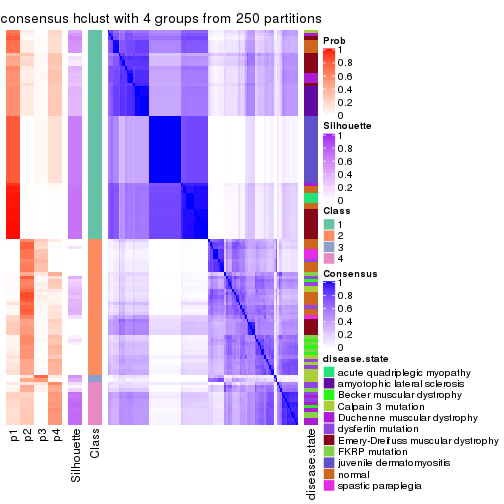</p>

</div>
<div id='tab-CV-hclust-consensus-heatmap-4'>
<pre><code class="r">consensus_heatmap(res, k = 5)
</code></pre>

<p>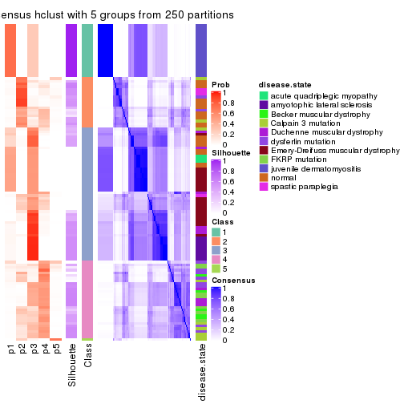</p>

</div>
<div id='tab-CV-hclust-consensus-heatmap-5'>
<pre><code class="r">consensus_heatmap(res, k = 6)
</code></pre>

<p></p>

</div>
</div>

Heatmaps for the membership of samples in all partitions to see how consistent they are:


<script>
$( function() {
	$( '#tabs-CV-hclust-membership-heatmap' ).tabs();
} );
</script>
<div id='tabs-CV-hclust-membership-heatmap'>
<ul>
<li><a href='#tab-CV-hclust-membership-heatmap-1'>k = 2</a></li>
<li><a href='#tab-CV-hclust-membership-heatmap-2'>k = 3</a></li>
<li><a href='#tab-CV-hclust-membership-heatmap-3'>k = 4</a></li>
<li><a href='#tab-CV-hclust-membership-heatmap-4'>k = 5</a></li>
<li><a href='#tab-CV-hclust-membership-heatmap-5'>k = 6</a></li>
</ul>
<div id='tab-CV-hclust-membership-heatmap-1'>
<pre><code class="r">membership_heatmap(res, k = 2)
</code></pre>

<p></p>

</div>
<div id='tab-CV-hclust-membership-heatmap-2'>
<pre><code class="r">membership_heatmap(res, k = 3)
</code></pre>

<p></p>

</div>
<div id='tab-CV-hclust-membership-heatmap-3'>
<pre><code class="r">membership_heatmap(res, k = 4)
</code></pre>

<p></p>

</div>
<div id='tab-CV-hclust-membership-heatmap-4'>
<pre><code class="r">membership_heatmap(res, k = 5)
</code></pre>

<p></p>

</div>
<div id='tab-CV-hclust-membership-heatmap-5'>
<pre><code class="r">membership_heatmap(res, k = 6)
</code></pre>

<p></p>

</div>
</div>

As soon as we have had the classes for columns, we can look for signatures
which are significantly different between classes which can be candidate marks
for certain classes. Following are the heatmaps for signatures.


Signature heatmaps where rows are scaled:


<script>
$( function() {
	$( '#tabs-CV-hclust-get-signatures' ).tabs();
} );
</script>
<div id='tabs-CV-hclust-get-signatures'>
<ul>
<li><a href='#tab-CV-hclust-get-signatures-1'>k = 2</a></li>
<li><a href='#tab-CV-hclust-get-signatures-2'>k = 3</a></li>
<li><a href='#tab-CV-hclust-get-signatures-3'>k = 4</a></li>
<li><a href='#tab-CV-hclust-get-signatures-4'>k = 5</a></li>
<li><a href='#tab-CV-hclust-get-signatures-5'>k = 6</a></li>
</ul>
<div id='tab-CV-hclust-get-signatures-1'>
<pre><code class="r">get_signatures(res, k = 2)
</code></pre>

<p></p>

</div>
<div id='tab-CV-hclust-get-signatures-2'>
<pre><code class="r">get_signatures(res, k = 3)
</code></pre>

<p></p>

</div>
<div id='tab-CV-hclust-get-signatures-3'>
<pre><code class="r">get_signatures(res, k = 4)
</code></pre>

<p></p>

</div>
<div id='tab-CV-hclust-get-signatures-4'>
<pre><code class="r">get_signatures(res, k = 5)
</code></pre>

<p></p>

</div>
<div id='tab-CV-hclust-get-signatures-5'>
<pre><code class="r">get_signatures(res, k = 6)
</code></pre>

<p></p>

</div>
</div>


Signature heatmaps where rows are not scaled:


<script>
$( function() {
	$( '#tabs-CV-hclust-get-signatures-no-scale' ).tabs();
} );
</script>
<div id='tabs-CV-hclust-get-signatures-no-scale'>
<ul>
<li><a href='#tab-CV-hclust-get-signatures-no-scale-1'>k = 2</a></li>
<li><a href='#tab-CV-hclust-get-signatures-no-scale-2'>k = 3</a></li>
<li><a href='#tab-CV-hclust-get-signatures-no-scale-3'>k = 4</a></li>
<li><a href='#tab-CV-hclust-get-signatures-no-scale-4'>k = 5</a></li>
<li><a href='#tab-CV-hclust-get-signatures-no-scale-5'>k = 6</a></li>
</ul>
<div id='tab-CV-hclust-get-signatures-no-scale-1'>
<pre><code class="r">get_signatures(res, k = 2, scale_rows = FALSE)
</code></pre>

<p></p>

</div>
<div id='tab-CV-hclust-get-signatures-no-scale-2'>
<pre><code class="r">get_signatures(res, k = 3, scale_rows = FALSE)
</code></pre>

<p></p>

</div>
<div id='tab-CV-hclust-get-signatures-no-scale-3'>
<pre><code class="r">get_signatures(res, k = 4, scale_rows = FALSE)
</code></pre>

<p></p>

</div>
<div id='tab-CV-hclust-get-signatures-no-scale-4'>
<pre><code class="r">get_signatures(res, k = 5, scale_rows = FALSE)
</code></pre>

<p></p>

</div>
<div id='tab-CV-hclust-get-signatures-no-scale-5'>
<pre><code class="r">get_signatures(res, k = 6, scale_rows = FALSE)
</code></pre>

<p></p>

</div>
</div>


Compare the overlap of signatures from different k:

```r
compare_signatures(res)
```


`get_signature()` returns a data frame invisibly. TO get the list of signatures, the function
call should be assigned to a variable explicitly. In following code, if `plot` argument is set
to `FALSE`, no heatmap is plotted while only the differential analysis is performed.

```r
# code only for demonstration
tb = get_signature(res, k = ..., plot = FALSE)
```

An example of the output of `tb` is:

```
#>   which_row         fdr    mean_1    mean_2 scaled_mean_1 scaled_mean_2 km
#> 1        38 0.042760348  8.373488  9.131774    -0.5533452     0.5164555  1
#> 2        40 0.018707592  7.106213  8.469186    -0.6173731     0.5762149  1
#> 3        55 0.019134737 10.221463 11.207825    -0.6159697     0.5749050  1
#> 4        59 0.006059896  5.921854  7.869574    -0.6899429     0.6439467  1
#> 5        60 0.018055526  8.928898 10.211722    -0.6204761     0.5791110  1
#> 6        98 0.009384629 15.714769 14.887706     0.6635654    -0.6193277  2
...
```

The columns in `tb` are:

1. `which_row`: row indices corresponding to the input matrix.
2. `fdr`: FDR for the differential test. 
3. `mean_x`: The mean value in group x.
4. `scaled_mean_x`: The mean value in group x after rows are scaled.
5. `km`: Row groups if k-means clustering is applied to rows.


UMAP plot which shows how samples are separated.


<script>
$( function() {
	$( '#tabs-CV-hclust-dimension-reduction' ).tabs();
} );
</script>
<div id='tabs-CV-hclust-dimension-reduction'>
<ul>
<li><a href='#tab-CV-hclust-dimension-reduction-1'>k = 2</a></li>
<li><a href='#tab-CV-hclust-dimension-reduction-2'>k = 3</a></li>
<li><a href='#tab-CV-hclust-dimension-reduction-3'>k = 4</a></li>
<li><a href='#tab-CV-hclust-dimension-reduction-4'>k = 5</a></li>
<li><a href='#tab-CV-hclust-dimension-reduction-5'>k = 6</a></li>
</ul>
<div id='tab-CV-hclust-dimension-reduction-1'>
<pre><code class="r">dimension_reduction(res, k = 2, method = &quot;UMAP&quot;)
</code></pre>

<p></p>

</div>
<div id='tab-CV-hclust-dimension-reduction-2'>
<pre><code class="r">dimension_reduction(res, k = 3, method = &quot;UMAP&quot;)
</code></pre>

<p></p>

</div>
<div id='tab-CV-hclust-dimension-reduction-3'>
<pre><code class="r">dimension_reduction(res, k = 4, method = &quot;UMAP&quot;)
</code></pre>

<p></p>

</div>
<div id='tab-CV-hclust-dimension-reduction-4'>
<pre><code class="r">dimension_reduction(res, k = 5, method = &quot;UMAP&quot;)
</code></pre>

<p></p>

</div>
<div id='tab-CV-hclust-dimension-reduction-5'>
<pre><code class="r">dimension_reduction(res, k = 6, method = &quot;UMAP&quot;)
</code></pre>

<p></p>

</div>
</div>


Following heatmap shows how subgroups are split when increasing `k`:

```r
collect_classes(res)
```


Test correlation between subgroups and known annotations. If the known
annotation is numeric, one-way ANOVA test is applied, and if the known
annotation is discrete, chi-squared contingency table test is applied.

```r
test_to_known_factors(res)
```

```
#>            n disease.state(p) k
#> CV:hclust 94         9.82e-10 2
#> CV:hclust 53         1.54e-08 3
#> CV:hclust 54         6.64e-14 4
#> CV:hclust 58         6.84e-21 5
#> CV:hclust 75         2.37e-18 6
```


If matrix rows can be associated to genes, consider to use `functional_enrichment(res,
...)` to perform function enrichment for the signature genes. See [this vignette](http://bioconductor.org/packages/devel/bioc/vignettes/cola/inst/doc/functional_enrichment.html) for more detailed explanations.


 

---------------------------------------------------


### CV:kmeans


The object with results only for a single top-value method and a single partition method 
can be extracted as:

```r
res = res_list["CV", "kmeans"]
# you can also extract it by
# res = res_list["CV:kmeans"]
```

A summary of `res` and all the functions that can be applied to it:

```r
res
```

```
#> A 'ConsensusPartition' object with k = 2, 3, 4, 5, 6.
#>   On a matrix with 21512 rows and 119 columns.
#>   Top rows (1000, 2000, 3000, 4000, 5000) are extracted by 'CV' method.
#>   Subgroups are detected by 'kmeans' method.
#>   Performed in total 1250 partitions by row resampling.
#>   Best k for subgroups seems to be 2.
#> 
#> Following methods can be applied to this 'ConsensusPartition' object:
#>  [1] "cola_report"             "collect_classes"         "collect_plots"          
#>  [4] "collect_stats"           "colnames"                "compare_signatures"     
#>  [7] "consensus_heatmap"       "dimension_reduction"     "functional_enrichment"  
#> [10] "get_anno_col"            "get_anno"                "get_classes"            
#> [13] "get_consensus"           "get_matrix"              "get_membership"         
#> [16] "get_param"               "get_signatures"          "get_stats"              
#> [19] "is_best_k"               "is_stable_k"             "membership_heatmap"     
#> [22] "ncol"                    "nrow"                    "plot_ecdf"              
#> [25] "rownames"                "select_partition_number" "show"                   
#> [28] "suggest_best_k"          "test_to_known_factors"
```

`collect_plots()` function collects all the plots made from `res` for all `k` (number of partitions)
into one single page to provide an easy and fast comparison between different `k`.

```r
collect_plots(res)
```


The plots are:

- The first row: a plot of the ECDF (empirical cumulative distribution
  function) curves of the consensus matrix for each `k` and the heatmap of
  predicted classes for each `k`.
- The second row: heatmaps of the consensus matrix for each `k`.
- The third row: heatmaps of the membership matrix for each `k`.
- The fouth row: heatmaps of the signatures for each `k`.

All the plots in panels can be made by individual functions and they are
plotted later in this section.

`select_partition_number()` produces several plots showing different
statistics for choosing "optimized" `k`. There are following statistics:

- ECDF curves of the consensus matrix for each `k`;
- 1-PAC. [The PAC
  score](https://en.wikipedia.org/wiki/Consensus_clustering#Over-interpretation_potential_of_consensus_clustering)
  measures the proportion of the ambiguous subgrouping.
- Mean silhouette score.
- Concordance. The mean probability of fiting the consensus class ids in all
  partitions.
- Area increased. Denote $A_k$ as the area under the ECDF curve for current
  `k`, the area increased is defined as $A_k - A_{k-1}$.
- Rand index. The percent of pairs of samples that are both in a same cluster
  or both are not in a same cluster in the partition of k and k-1.
- Jaccard index. The ratio of pairs of samples are both in a same cluster in
  the partition of k and k-1 and the pairs of samples are both in a same
  cluster in the partition k or k-1.

The detailed explanations of these statistics can be found in [the _cola_
vignette](http://bioconductor.org/packages/devel/bioc/vignettes/cola/inst/doc/cola.html#toc_13).

Generally speaking, lower PAC score, higher mean silhouette score or higher
concordance corresponds to better partition. Rand index and Jaccard index
measure how similar the current partition is compared to partition with `k-1`.
If they are too similar, we won't accept `k` is better than `k-1`.

```r
select_partition_number(res)
```


The numeric values for all these statistics can be obtained by `get_stats()`.

```r
get_stats(res)
```

```
#>   k 1-PAC mean_silhouette concordance area_increased  Rand Jaccard
#> 2 2 0.755           0.853       0.940         0.4854 0.500   0.500
#> 3 3 0.584           0.737       0.840         0.3400 0.770   0.571
#> 4 4 0.651           0.638       0.822         0.1392 0.797   0.498
#> 5 5 0.673           0.667       0.758         0.0561 0.895   0.640
#> 6 6 0.717           0.606       0.728         0.0434 0.930   0.699
```

`suggest_best_k()` suggests the best $k$ based on these statistics. The rules are as follows:

- All $k$ with Jaccard index larger than 0.95 are removed because increasing
  $k$ does not provide enough extra information. If all $k$ are removed, it is
  marked as no subgroup is detected.
- For all $k$ with 1-PAC score larger than 0.9, the maximal $k$ is taken as
  the best $k$, and other $k$ are marked as optional $k$.
- If it does not fit the second rule. The $k$ with the maximal vote of the
  highest 1-PAC score, highest mean silhouette, and highest concordance is
  taken as the best $k$.

```r
suggest_best_k(res)
```

```
#> [1] 2
```


Following shows the table of the partitions (You need to click the **show/hide
code output** link to see it). The membership matrix (columns with name `p*`)
is inferred by
[`clue::cl_consensus()`](https://www.rdocumentation.org/link/cl_consensus?package=clue)
function with the `SE` method. Basically the value in the membership matrix
represents the probability to belong to a certain group. The finall class
label for an item is determined with the group with highest probability it
belongs to.

In `get_classes()` function, the entropy is calculated from the membership
matrix and the silhouette score is calculated from the consensus matrix.


<script>
$( function() {
	$( '#tabs-CV-kmeans-get-classes' ).tabs();
} );
</script>
<div id='tabs-CV-kmeans-get-classes'>
<ul>
<li><a href='#tab-CV-kmeans-get-classes-1'>k = 2</a></li>
<li><a href='#tab-CV-kmeans-get-classes-2'>k = 3</a></li>
<li><a href='#tab-CV-kmeans-get-classes-3'>k = 4</a></li>
<li><a href='#tab-CV-kmeans-get-classes-4'>k = 5</a></li>
<li><a href='#tab-CV-kmeans-get-classes-5'>k = 6</a></li>
</ul>

<div id='tab-CV-kmeans-get-classes-1'>
<p><a id='tab-CV-kmeans-get-classes-1-a' style='color:#0366d6' href='#'>show/hide code output</a></p>
<pre><code class="r">cbind(get_classes(res, k = 2), get_membership(res, k = 2))
</code></pre>

<pre><code>#&gt;           class entropy silhouette    p1    p2
#&gt; GSM120719     1  0.0000     0.8969 1.000 0.000
#&gt; GSM120720     1  0.0000     0.8969 1.000 0.000
#&gt; GSM120765     2  0.0000     0.9625 0.000 1.000
#&gt; GSM120767     2  0.0000     0.9625 0.000 1.000
#&gt; GSM120784     2  0.0000     0.9625 0.000 1.000
#&gt; GSM121400     1  0.0672     0.8933 0.992 0.008
#&gt; GSM121401     1  0.0376     0.8952 0.996 0.004
#&gt; GSM121402     2  0.0000     0.9625 0.000 1.000
#&gt; GSM121403     2  0.9552     0.2984 0.376 0.624
#&gt; GSM121404     2  0.0000     0.9625 0.000 1.000
#&gt; GSM121405     1  0.3431     0.8617 0.936 0.064
#&gt; GSM121406     2  0.0000     0.9625 0.000 1.000
#&gt; GSM121408     2  0.0000     0.9625 0.000 1.000
#&gt; GSM121409     1  0.7299     0.7496 0.796 0.204
#&gt; GSM121410     1  0.6531     0.7842 0.832 0.168
#&gt; GSM121412     2  0.0000     0.9625 0.000 1.000
#&gt; GSM121413     2  0.0000     0.9625 0.000 1.000
#&gt; GSM121414     2  0.0000     0.9625 0.000 1.000
#&gt; GSM121415     2  0.0000     0.9625 0.000 1.000
#&gt; GSM121416     2  0.0000     0.9625 0.000 1.000
#&gt; GSM120591     1  0.0000     0.8969 1.000 0.000
#&gt; GSM120594     1  0.0000     0.8969 1.000 0.000
#&gt; GSM120718     1  0.0000     0.8969 1.000 0.000
#&gt; GSM121205     1  0.0000     0.8969 1.000 0.000
#&gt; GSM121206     1  0.0000     0.8969 1.000 0.000
#&gt; GSM121207     1  0.0000     0.8969 1.000 0.000
#&gt; GSM121208     1  0.0000     0.8969 1.000 0.000
#&gt; GSM121209     1  0.0000     0.8969 1.000 0.000
#&gt; GSM121210     1  0.0000     0.8969 1.000 0.000
#&gt; GSM121211     1  0.0000     0.8969 1.000 0.000
#&gt; GSM121212     1  0.0000     0.8969 1.000 0.000
#&gt; GSM121213     1  0.0000     0.8969 1.000 0.000
#&gt; GSM121214     1  0.0000     0.8969 1.000 0.000
#&gt; GSM121215     1  0.0000     0.8969 1.000 0.000
#&gt; GSM121216     1  0.0000     0.8969 1.000 0.000
#&gt; GSM121217     1  0.0000     0.8969 1.000 0.000
#&gt; GSM121218     1  0.0000     0.8969 1.000 0.000
#&gt; GSM121234     1  0.0000     0.8969 1.000 0.000
#&gt; GSM121243     1  0.0000     0.8969 1.000 0.000
#&gt; GSM121245     1  0.0000     0.8969 1.000 0.000
#&gt; GSM121246     1  0.0000     0.8969 1.000 0.000
#&gt; GSM121247     1  0.0000     0.8969 1.000 0.000
#&gt; GSM121248     1  0.0000     0.8969 1.000 0.000
#&gt; GSM120744     2  0.9491     0.3222 0.368 0.632
#&gt; GSM120745     1  0.7056     0.7620 0.808 0.192
#&gt; GSM120746     1  0.9993     0.1947 0.516 0.484
#&gt; GSM120747     1  1.0000     0.1533 0.504 0.496
#&gt; GSM120748     2  0.7139     0.7088 0.196 0.804
#&gt; GSM120749     1  0.9580     0.4703 0.620 0.380
#&gt; GSM120750     1  0.9998     0.1676 0.508 0.492
#&gt; GSM120751     1  0.9996     0.1814 0.512 0.488
#&gt; GSM120752     1  0.8909     0.6060 0.692 0.308
#&gt; GSM121336     2  0.0000     0.9625 0.000 1.000
#&gt; GSM121339     2  0.0000     0.9625 0.000 1.000
#&gt; GSM121349     2  0.0000     0.9625 0.000 1.000
#&gt; GSM121355     2  0.0000     0.9625 0.000 1.000
#&gt; GSM120757     1  0.9977     0.2326 0.528 0.472
#&gt; GSM120766     2  0.9881     0.0898 0.436 0.564
#&gt; GSM120770     2  0.0000     0.9625 0.000 1.000
#&gt; GSM120779     1  0.6973     0.7658 0.812 0.188
#&gt; GSM120780     2  0.6623     0.7477 0.172 0.828
#&gt; GSM121102     2  0.0000     0.9625 0.000 1.000
#&gt; GSM121203     2  0.9963    -0.0260 0.464 0.536
#&gt; GSM121204     1  0.4022     0.8513 0.920 0.080
#&gt; GSM121330     1  0.0000     0.8969 1.000 0.000
#&gt; GSM121335     1  0.0000     0.8969 1.000 0.000
#&gt; GSM121337     2  0.0000     0.9625 0.000 1.000
#&gt; GSM121338     2  0.0000     0.9625 0.000 1.000
#&gt; GSM121341     1  0.0000     0.8969 1.000 0.000
#&gt; GSM121342     1  0.0000     0.8969 1.000 0.000
#&gt; GSM121343     2  0.0000     0.9625 0.000 1.000
#&gt; GSM121344     1  0.0000     0.8969 1.000 0.000
#&gt; GSM121346     1  0.0000     0.8969 1.000 0.000
#&gt; GSM121347     2  0.0000     0.9625 0.000 1.000
#&gt; GSM121348     2  0.0000     0.9625 0.000 1.000
#&gt; GSM121350     1  0.0000     0.8969 1.000 0.000
#&gt; GSM121352     1  0.0000     0.8969 1.000 0.000
#&gt; GSM121354     1  0.0000     0.8969 1.000 0.000
#&gt; GSM120753     2  0.0000     0.9625 0.000 1.000
#&gt; GSM120761     2  0.0000     0.9625 0.000 1.000
#&gt; GSM120768     2  0.0000     0.9625 0.000 1.000
#&gt; GSM120781     2  0.0000     0.9625 0.000 1.000
#&gt; GSM120788     2  0.0000     0.9625 0.000 1.000
#&gt; GSM120760     2  0.0000     0.9625 0.000 1.000
#&gt; GSM120763     2  0.0000     0.9625 0.000 1.000
#&gt; GSM120764     2  0.0000     0.9625 0.000 1.000
#&gt; GSM120777     2  0.0000     0.9625 0.000 1.000
#&gt; GSM120786     2  0.0000     0.9625 0.000 1.000
#&gt; GSM121329     1  0.0376     0.8952 0.996 0.004
#&gt; GSM121331     1  0.9460     0.5038 0.636 0.364
#&gt; GSM121333     1  0.7299     0.7496 0.796 0.204
#&gt; GSM121345     1  0.7299     0.7496 0.796 0.204
#&gt; GSM121356     1  0.8081     0.6953 0.752 0.248
#&gt; GSM120754     2  0.0000     0.9625 0.000 1.000
#&gt; GSM120759     2  0.0000     0.9625 0.000 1.000
#&gt; GSM120762     2  0.0000     0.9625 0.000 1.000
#&gt; GSM120775     2  0.0000     0.9625 0.000 1.000
#&gt; GSM120776     2  0.1843     0.9341 0.028 0.972
#&gt; GSM120782     2  0.0000     0.9625 0.000 1.000
#&gt; GSM120789     2  0.0000     0.9625 0.000 1.000
#&gt; GSM120790     2  0.0000     0.9625 0.000 1.000
#&gt; GSM120791     2  0.0000     0.9625 0.000 1.000
#&gt; GSM120755     2  0.0000     0.9625 0.000 1.000
#&gt; GSM120756     2  0.0376     0.9587 0.004 0.996
#&gt; GSM120769     2  0.0000     0.9625 0.000 1.000
#&gt; GSM120778     2  0.0000     0.9625 0.000 1.000
#&gt; GSM120792     2  0.0000     0.9625 0.000 1.000
#&gt; GSM121332     2  0.0000     0.9625 0.000 1.000
#&gt; GSM121334     2  0.0000     0.9625 0.000 1.000
#&gt; GSM121340     2  0.0000     0.9625 0.000 1.000
#&gt; GSM121351     2  0.0000     0.9625 0.000 1.000
#&gt; GSM121353     2  0.0000     0.9625 0.000 1.000
#&gt; GSM120758     2  0.0000     0.9625 0.000 1.000
#&gt; GSM120771     2  0.0000     0.9625 0.000 1.000
#&gt; GSM120772     2  0.0000     0.9625 0.000 1.000
#&gt; GSM120773     2  0.0000     0.9625 0.000 1.000
#&gt; GSM120774     2  0.0000     0.9625 0.000 1.000
#&gt; GSM120783     2  0.0000     0.9625 0.000 1.000
#&gt; GSM120787     2  0.0000     0.9625 0.000 1.000
</code></pre>

<script>
$('#tab-CV-kmeans-get-classes-1-a').parent().next().next().hide();
$('#tab-CV-kmeans-get-classes-1-a').click(function(){
  $('#tab-CV-kmeans-get-classes-1-a').parent().next().next().toggle();
  return(false);
});
</script>
</div>

<div id='tab-CV-kmeans-get-classes-2'>
<p><a id='tab-CV-kmeans-get-classes-2-a' style='color:#0366d6' href='#'>show/hide code output</a></p>
<pre><code class="r">cbind(get_classes(res, k = 3), get_membership(res, k = 3))
</code></pre>

<pre><code>#&gt;           class entropy silhouette    p1    p2    p3
#&gt; GSM120719     1  0.4346      0.788 0.816 0.000 0.184
#&gt; GSM120720     1  0.4796      0.762 0.780 0.000 0.220
#&gt; GSM120765     2  0.4346      0.817 0.000 0.816 0.184
#&gt; GSM120767     2  0.3116      0.827 0.000 0.892 0.108
#&gt; GSM120784     2  0.4291      0.817 0.000 0.820 0.180
#&gt; GSM121400     3  0.5903      0.732 0.232 0.024 0.744
#&gt; GSM121401     3  0.6313      0.602 0.308 0.016 0.676
#&gt; GSM121402     2  0.4346      0.817 0.000 0.816 0.184
#&gt; GSM121403     3  0.3043      0.701 0.008 0.084 0.908
#&gt; GSM121404     2  0.4931      0.786 0.000 0.768 0.232
#&gt; GSM121405     3  0.6099      0.736 0.228 0.032 0.740
#&gt; GSM121406     2  0.4399      0.816 0.000 0.812 0.188
#&gt; GSM121408     2  0.4346      0.817 0.000 0.816 0.184
#&gt; GSM121409     3  0.6098      0.784 0.176 0.056 0.768
#&gt; GSM121410     3  0.6254      0.769 0.188 0.056 0.756
#&gt; GSM121412     2  0.4399      0.816 0.000 0.812 0.188
#&gt; GSM121413     2  0.4399      0.816 0.000 0.812 0.188
#&gt; GSM121414     2  0.4399      0.816 0.000 0.812 0.188
#&gt; GSM121415     2  0.4399      0.816 0.000 0.812 0.188
#&gt; GSM121416     2  0.4178      0.819 0.000 0.828 0.172
#&gt; GSM120591     1  0.6045      0.473 0.620 0.000 0.380
#&gt; GSM120594     1  0.4796      0.762 0.780 0.000 0.220
#&gt; GSM120718     1  0.4291      0.790 0.820 0.000 0.180
#&gt; GSM121205     1  0.0000      0.857 1.000 0.000 0.000
#&gt; GSM121206     1  0.0000      0.857 1.000 0.000 0.000
#&gt; GSM121207     1  0.0000      0.857 1.000 0.000 0.000
#&gt; GSM121208     1  0.0000      0.857 1.000 0.000 0.000
#&gt; GSM121209     1  0.0000      0.857 1.000 0.000 0.000
#&gt; GSM121210     1  0.0000      0.857 1.000 0.000 0.000
#&gt; GSM121211     1  0.0000      0.857 1.000 0.000 0.000
#&gt; GSM121212     1  0.0000      0.857 1.000 0.000 0.000
#&gt; GSM121213     1  0.0000      0.857 1.000 0.000 0.000
#&gt; GSM121214     1  0.0000      0.857 1.000 0.000 0.000
#&gt; GSM121215     1  0.0000      0.857 1.000 0.000 0.000
#&gt; GSM121216     1  0.0000      0.857 1.000 0.000 0.000
#&gt; GSM121217     1  0.0000      0.857 1.000 0.000 0.000
#&gt; GSM121218     1  0.0000      0.857 1.000 0.000 0.000
#&gt; GSM121234     1  0.0000      0.857 1.000 0.000 0.000
#&gt; GSM121243     1  0.0000      0.857 1.000 0.000 0.000
#&gt; GSM121245     1  0.0000      0.857 1.000 0.000 0.000
#&gt; GSM121246     1  0.3116      0.822 0.892 0.000 0.108
#&gt; GSM121247     1  0.0000      0.857 1.000 0.000 0.000
#&gt; GSM121248     1  0.0000      0.857 1.000 0.000 0.000
#&gt; GSM120744     3  0.5598      0.799 0.148 0.052 0.800
#&gt; GSM120745     3  0.5092      0.789 0.176 0.020 0.804
#&gt; GSM120746     3  0.4999      0.802 0.152 0.028 0.820
#&gt; GSM120747     3  0.4999      0.802 0.152 0.028 0.820
#&gt; GSM120748     3  0.2339      0.726 0.012 0.048 0.940
#&gt; GSM120749     3  0.5111      0.795 0.168 0.024 0.808
#&gt; GSM120750     3  0.4999      0.802 0.152 0.028 0.820
#&gt; GSM120751     3  0.4999      0.802 0.152 0.028 0.820
#&gt; GSM120752     3  0.5111      0.795 0.168 0.024 0.808
#&gt; GSM121336     2  0.4399      0.816 0.000 0.812 0.188
#&gt; GSM121339     2  0.6235      0.497 0.000 0.564 0.436
#&gt; GSM121349     2  0.4399      0.816 0.000 0.812 0.188
#&gt; GSM121355     2  0.4399      0.816 0.000 0.812 0.188
#&gt; GSM120757     3  0.5295      0.792 0.156 0.036 0.808
#&gt; GSM120766     3  0.5285      0.792 0.148 0.040 0.812
#&gt; GSM120770     2  0.6079      0.590 0.000 0.612 0.388
#&gt; GSM120779     3  0.4953      0.780 0.176 0.016 0.808
#&gt; GSM120780     3  0.2774      0.712 0.008 0.072 0.920
#&gt; GSM121102     3  0.5591      0.302 0.000 0.304 0.696
#&gt; GSM121203     3  0.5497      0.797 0.148 0.048 0.804
#&gt; GSM121204     3  0.4805      0.777 0.176 0.012 0.812
#&gt; GSM121330     1  0.5363      0.691 0.724 0.000 0.276
#&gt; GSM121335     1  0.4750      0.766 0.784 0.000 0.216
#&gt; GSM121337     2  0.6225      0.510 0.000 0.568 0.432
#&gt; GSM121338     3  0.4235      0.598 0.000 0.176 0.824
#&gt; GSM121341     1  0.4750      0.766 0.784 0.000 0.216
#&gt; GSM121342     1  0.4750      0.766 0.784 0.000 0.216
#&gt; GSM121343     3  0.4062      0.618 0.000 0.164 0.836
#&gt; GSM121344     1  0.5058      0.736 0.756 0.000 0.244
#&gt; GSM121346     1  0.6140      0.412 0.596 0.000 0.404
#&gt; GSM121347     3  0.6252     -0.312 0.000 0.444 0.556
#&gt; GSM121348     3  0.3619      0.613 0.000 0.136 0.864
#&gt; GSM121350     1  0.6126      0.429 0.600 0.000 0.400
#&gt; GSM121352     1  0.5397      0.685 0.720 0.000 0.280
#&gt; GSM121354     1  0.5058      0.736 0.756 0.000 0.244
#&gt; GSM120753     2  0.0424      0.827 0.000 0.992 0.008
#&gt; GSM120761     2  0.1031      0.822 0.000 0.976 0.024
#&gt; GSM120768     2  0.1860      0.813 0.000 0.948 0.052
#&gt; GSM120781     2  0.0424      0.827 0.000 0.992 0.008
#&gt; GSM120788     2  0.6252      0.205 0.000 0.556 0.444
#&gt; GSM120760     2  0.2356      0.805 0.000 0.928 0.072
#&gt; GSM120763     2  0.2066      0.810 0.000 0.940 0.060
#&gt; GSM120764     2  0.2796      0.793 0.000 0.908 0.092
#&gt; GSM120777     2  0.6252      0.206 0.000 0.556 0.444
#&gt; GSM120786     2  0.2796      0.793 0.000 0.908 0.092
#&gt; GSM121329     3  0.5864      0.638 0.288 0.008 0.704
#&gt; GSM121331     3  0.5581      0.789 0.168 0.040 0.792
#&gt; GSM121333     3  0.4953      0.780 0.176 0.016 0.808
#&gt; GSM121345     3  0.4953      0.780 0.176 0.016 0.808
#&gt; GSM121356     3  0.4840      0.786 0.168 0.016 0.816
#&gt; GSM120754     2  0.6095      0.349 0.000 0.608 0.392
#&gt; GSM120759     2  0.4346      0.817 0.000 0.816 0.184
#&gt; GSM120762     2  0.0424      0.827 0.000 0.992 0.008
#&gt; GSM120775     2  0.6215      0.254 0.000 0.572 0.428
#&gt; GSM120776     3  0.4504      0.677 0.000 0.196 0.804
#&gt; GSM120782     2  0.6192      0.237 0.000 0.580 0.420
#&gt; GSM120789     2  0.4121      0.821 0.000 0.832 0.168
#&gt; GSM120790     2  0.4291      0.819 0.000 0.820 0.180
#&gt; GSM120791     2  0.1964      0.812 0.000 0.944 0.056
#&gt; GSM120755     2  0.0747      0.827 0.000 0.984 0.016
#&gt; GSM120756     3  0.6302      0.035 0.000 0.480 0.520
#&gt; GSM120769     2  0.0424      0.827 0.000 0.992 0.008
#&gt; GSM120778     2  0.1860      0.813 0.000 0.948 0.052
#&gt; GSM120792     2  0.1411      0.820 0.000 0.964 0.036
#&gt; GSM121332     2  0.4178      0.820 0.000 0.828 0.172
#&gt; GSM121334     2  0.0747      0.823 0.000 0.984 0.016
#&gt; GSM121340     2  0.2448      0.803 0.000 0.924 0.076
#&gt; GSM121351     2  0.4399      0.816 0.000 0.812 0.188
#&gt; GSM121353     2  0.3816      0.751 0.000 0.852 0.148
#&gt; GSM120758     2  0.0237      0.826 0.000 0.996 0.004
#&gt; GSM120771     2  0.4235      0.819 0.000 0.824 0.176
#&gt; GSM120772     2  0.0000      0.826 0.000 1.000 0.000
#&gt; GSM120773     2  0.2537      0.800 0.000 0.920 0.080
#&gt; GSM120774     2  0.1964      0.812 0.000 0.944 0.056
#&gt; GSM120783     2  0.2625      0.798 0.000 0.916 0.084
#&gt; GSM120787     2  0.1289      0.819 0.000 0.968 0.032
</code></pre>

<script>
$('#tab-CV-kmeans-get-classes-2-a').parent().next().next().hide();
$('#tab-CV-kmeans-get-classes-2-a').click(function(){
  $('#tab-CV-kmeans-get-classes-2-a').parent().next().next().toggle();
  return(false);
});
</script>
</div>

<div id='tab-CV-kmeans-get-classes-3'>
<p><a id='tab-CV-kmeans-get-classes-3-a' style='color:#0366d6' href='#'>show/hide code output</a></p>
<pre><code class="r">cbind(get_classes(res, k = 4), get_membership(res, k = 4))
</code></pre>

<pre><code>#&gt;           class entropy silhouette    p1    p2    p3    p4
#&gt; GSM120719     1  0.5273     0.1939 0.536 0.000 0.456 0.008
#&gt; GSM120720     3  0.5263     0.0314 0.448 0.000 0.544 0.008
#&gt; GSM120765     2  0.0188     0.8778 0.000 0.996 0.000 0.004
#&gt; GSM120767     2  0.0336     0.8764 0.000 0.992 0.000 0.008
#&gt; GSM120784     2  0.0188     0.8753 0.000 0.996 0.004 0.000
#&gt; GSM121400     3  0.0657     0.6924 0.000 0.004 0.984 0.012
#&gt; GSM121401     3  0.1639     0.6728 0.036 0.004 0.952 0.008
#&gt; GSM121402     2  0.0524     0.8760 0.008 0.988 0.000 0.004
#&gt; GSM121403     3  0.1284     0.6918 0.000 0.024 0.964 0.012
#&gt; GSM121404     2  0.2281     0.7864 0.000 0.904 0.096 0.000
#&gt; GSM121405     3  0.0992     0.6841 0.012 0.004 0.976 0.008
#&gt; GSM121406     2  0.0188     0.8778 0.000 0.996 0.000 0.004
#&gt; GSM121408     2  0.0188     0.8778 0.000 0.996 0.000 0.004
#&gt; GSM121409     3  0.0779     0.6935 0.000 0.004 0.980 0.016
#&gt; GSM121410     3  0.0657     0.6924 0.000 0.004 0.984 0.012
#&gt; GSM121412     2  0.0188     0.8753 0.000 0.996 0.004 0.000
#&gt; GSM121413     2  0.0188     0.8753 0.000 0.996 0.004 0.000
#&gt; GSM121414     2  0.0188     0.8753 0.000 0.996 0.004 0.000
#&gt; GSM121415     2  0.0376     0.8770 0.000 0.992 0.004 0.004
#&gt; GSM121416     2  0.0336     0.8767 0.000 0.992 0.000 0.008
#&gt; GSM120591     3  0.4814     0.3507 0.316 0.000 0.676 0.008
#&gt; GSM120594     3  0.5263     0.0314 0.448 0.000 0.544 0.008
#&gt; GSM120718     1  0.5277     0.1835 0.532 0.000 0.460 0.008
#&gt; GSM121205     1  0.0336     0.9267 0.992 0.000 0.008 0.000
#&gt; GSM121206     1  0.0336     0.9267 0.992 0.000 0.008 0.000
#&gt; GSM121207     1  0.0336     0.9267 0.992 0.000 0.008 0.000
#&gt; GSM121208     1  0.1716     0.8799 0.936 0.000 0.064 0.000
#&gt; GSM121209     1  0.0336     0.9267 0.992 0.000 0.008 0.000
#&gt; GSM121210     1  0.0336     0.9267 0.992 0.000 0.008 0.000
#&gt; GSM121211     1  0.0336     0.9267 0.992 0.000 0.008 0.000
#&gt; GSM121212     1  0.0336     0.9267 0.992 0.000 0.008 0.000
#&gt; GSM121213     1  0.0336     0.9267 0.992 0.000 0.008 0.000
#&gt; GSM121214     1  0.0336     0.9267 0.992 0.000 0.008 0.000
#&gt; GSM121215     1  0.0524     0.9253 0.988 0.000 0.008 0.004
#&gt; GSM121216     1  0.0524     0.9253 0.988 0.000 0.008 0.004
#&gt; GSM121217     1  0.0336     0.9267 0.992 0.000 0.008 0.000
#&gt; GSM121218     1  0.0336     0.9267 0.992 0.000 0.008 0.000
#&gt; GSM121234     1  0.0524     0.9253 0.988 0.000 0.008 0.004
#&gt; GSM121243     1  0.0524     0.9253 0.988 0.000 0.008 0.004
#&gt; GSM121245     1  0.0336     0.9267 0.992 0.000 0.008 0.000
#&gt; GSM121246     1  0.4868     0.5176 0.684 0.000 0.304 0.012
#&gt; GSM121247     1  0.0336     0.9267 0.992 0.000 0.008 0.000
#&gt; GSM121248     1  0.0336     0.9267 0.992 0.000 0.008 0.000
#&gt; GSM120744     3  0.2965     0.6972 0.000 0.036 0.892 0.072
#&gt; GSM120745     3  0.1716     0.7023 0.000 0.000 0.936 0.064
#&gt; GSM120746     3  0.1716     0.7023 0.000 0.000 0.936 0.064
#&gt; GSM120747     3  0.1716     0.7023 0.000 0.000 0.936 0.064
#&gt; GSM120748     3  0.2816     0.6981 0.000 0.036 0.900 0.064
#&gt; GSM120749     3  0.1716     0.7023 0.000 0.000 0.936 0.064
#&gt; GSM120750     3  0.1716     0.7023 0.000 0.000 0.936 0.064
#&gt; GSM120751     3  0.1716     0.7023 0.000 0.000 0.936 0.064
#&gt; GSM120752     3  0.1716     0.7023 0.000 0.000 0.936 0.064
#&gt; GSM121336     2  0.0188     0.8778 0.000 0.996 0.000 0.004
#&gt; GSM121339     2  0.3402     0.6946 0.000 0.832 0.164 0.004
#&gt; GSM121349     2  0.0188     0.8778 0.000 0.996 0.000 0.004
#&gt; GSM121355     2  0.0188     0.8778 0.000 0.996 0.000 0.004
#&gt; GSM120757     3  0.4761     0.5370 0.000 0.000 0.628 0.372
#&gt; GSM120766     3  0.4761     0.5370 0.000 0.000 0.628 0.372
#&gt; GSM120770     2  0.4462     0.6563 0.000 0.792 0.164 0.044
#&gt; GSM120779     3  0.4761     0.5370 0.000 0.000 0.628 0.372
#&gt; GSM120780     3  0.5658     0.5444 0.000 0.040 0.632 0.328
#&gt; GSM121102     3  0.6082    -0.0232 0.000 0.476 0.480 0.044
#&gt; GSM121203     3  0.2342     0.7012 0.000 0.008 0.912 0.080
#&gt; GSM121204     3  0.4746     0.5409 0.000 0.000 0.632 0.368
#&gt; GSM121330     3  0.4973     0.2852 0.348 0.000 0.644 0.008
#&gt; GSM121335     3  0.5281    -0.0202 0.464 0.000 0.528 0.008
#&gt; GSM121337     2  0.6874     0.3257 0.000 0.568 0.296 0.136
#&gt; GSM121338     3  0.5510     0.2890 0.000 0.376 0.600 0.024
#&gt; GSM121341     3  0.5281    -0.0202 0.464 0.000 0.528 0.008
#&gt; GSM121342     3  0.5281    -0.0202 0.464 0.000 0.528 0.008
#&gt; GSM121343     3  0.5682     0.3333 0.000 0.352 0.612 0.036
#&gt; GSM121344     3  0.5172     0.1549 0.404 0.000 0.588 0.008
#&gt; GSM121346     3  0.2342     0.6470 0.080 0.000 0.912 0.008
#&gt; GSM121347     3  0.7812     0.0705 0.000 0.252 0.376 0.372
#&gt; GSM121348     3  0.6983     0.4240 0.000 0.124 0.516 0.360
#&gt; GSM121350     3  0.2342     0.6469 0.080 0.000 0.912 0.008
#&gt; GSM121352     3  0.4936     0.3015 0.340 0.000 0.652 0.008
#&gt; GSM121354     3  0.5172     0.1549 0.404 0.000 0.588 0.008
#&gt; GSM120753     4  0.4996     0.3339 0.000 0.484 0.000 0.516
#&gt; GSM120761     4  0.4866     0.5098 0.000 0.404 0.000 0.596
#&gt; GSM120768     4  0.3726     0.7455 0.000 0.212 0.000 0.788
#&gt; GSM120781     2  0.4981    -0.2133 0.000 0.536 0.000 0.464
#&gt; GSM120788     4  0.1059     0.7314 0.000 0.016 0.012 0.972
#&gt; GSM120760     4  0.2921     0.7732 0.000 0.140 0.000 0.860
#&gt; GSM120763     4  0.2921     0.7732 0.000 0.140 0.000 0.860
#&gt; GSM120764     4  0.2281     0.7728 0.000 0.096 0.000 0.904
#&gt; GSM120777     4  0.1059     0.7314 0.000 0.016 0.012 0.972
#&gt; GSM120786     4  0.2345     0.7742 0.000 0.100 0.000 0.900
#&gt; GSM121329     3  0.4374     0.6629 0.068 0.000 0.812 0.120
#&gt; GSM121331     3  0.4776     0.5324 0.000 0.000 0.624 0.376
#&gt; GSM121333     3  0.4776     0.5324 0.000 0.000 0.624 0.376
#&gt; GSM121345     3  0.4790     0.5288 0.000 0.000 0.620 0.380
#&gt; GSM121356     3  0.4761     0.5370 0.000 0.000 0.628 0.372
#&gt; GSM120754     4  0.0927     0.7340 0.000 0.016 0.008 0.976
#&gt; GSM120759     2  0.0804     0.8731 0.008 0.980 0.000 0.012
#&gt; GSM120762     2  0.4643     0.2577 0.000 0.656 0.000 0.344
#&gt; GSM120775     4  0.0927     0.7340 0.000 0.016 0.008 0.976
#&gt; GSM120776     4  0.4843    -0.1022 0.000 0.000 0.396 0.604
#&gt; GSM120782     4  0.2300     0.7539 0.000 0.064 0.016 0.920
#&gt; GSM120789     2  0.0672     0.8748 0.008 0.984 0.000 0.008
#&gt; GSM120790     2  0.0804     0.8731 0.008 0.980 0.000 0.012
#&gt; GSM120791     4  0.3764     0.7433 0.000 0.216 0.000 0.784
#&gt; GSM120755     2  0.4522     0.3366 0.000 0.680 0.000 0.320
#&gt; GSM120756     4  0.1059     0.7314 0.000 0.016 0.012 0.972
#&gt; GSM120769     4  0.4996     0.3347 0.000 0.484 0.000 0.516
#&gt; GSM120778     4  0.3942     0.7303 0.000 0.236 0.000 0.764
#&gt; GSM120792     4  0.4193     0.6987 0.000 0.268 0.000 0.732
#&gt; GSM121332     2  0.0336     0.8765 0.000 0.992 0.000 0.008
#&gt; GSM121334     4  0.4941     0.4468 0.000 0.436 0.000 0.564
#&gt; GSM121340     4  0.2408     0.7754 0.000 0.104 0.000 0.896
#&gt; GSM121351     2  0.0524     0.8760 0.008 0.988 0.000 0.004
#&gt; GSM121353     4  0.2408     0.7753 0.000 0.104 0.000 0.896
#&gt; GSM120758     4  0.4992     0.3557 0.000 0.476 0.000 0.524
#&gt; GSM120771     2  0.3311     0.6764 0.000 0.828 0.000 0.172
#&gt; GSM120772     4  0.4992     0.3562 0.000 0.476 0.000 0.524
#&gt; GSM120773     4  0.2589     0.7758 0.000 0.116 0.000 0.884
#&gt; GSM120774     4  0.4103     0.7138 0.000 0.256 0.000 0.744
#&gt; GSM120783     4  0.2469     0.7756 0.000 0.108 0.000 0.892
#&gt; GSM120787     4  0.4730     0.5778 0.000 0.364 0.000 0.636
</code></pre>

<script>
$('#tab-CV-kmeans-get-classes-3-a').parent().next().next().hide();
$('#tab-CV-kmeans-get-classes-3-a').click(function(){
  $('#tab-CV-kmeans-get-classes-3-a').parent().next().next().toggle();
  return(false);
});
</script>
</div>

<div id='tab-CV-kmeans-get-classes-4'>
<p><a id='tab-CV-kmeans-get-classes-4-a' style='color:#0366d6' href='#'>show/hide code output</a></p>
<pre><code class="r">cbind(get_classes(res, k = 5), get_membership(res, k = 5))
</code></pre>

<pre><code>#&gt;           class entropy silhouette    p1    p2    p3    p4    p5
#&gt; GSM120719     3  0.4617     0.5580 0.304 0.000 0.668 0.004 0.024
#&gt; GSM120720     3  0.4347     0.5965 0.256 0.000 0.716 0.004 0.024
#&gt; GSM120765     2  0.1597     0.7685 0.000 0.940 0.000 0.012 0.048
#&gt; GSM120767     2  0.2171     0.7527 0.000 0.912 0.000 0.024 0.064
#&gt; GSM120784     2  0.1914     0.7693 0.000 0.924 0.000 0.016 0.060
#&gt; GSM121400     3  0.1704     0.4939 0.000 0.004 0.928 0.000 0.068
#&gt; GSM121401     3  0.0794     0.5733 0.028 0.000 0.972 0.000 0.000
#&gt; GSM121402     2  0.3727     0.7456 0.000 0.768 0.000 0.016 0.216
#&gt; GSM121403     3  0.3691     0.3994 0.000 0.040 0.804 0.000 0.156
#&gt; GSM121404     2  0.4139     0.7488 0.000 0.804 0.052 0.020 0.124
#&gt; GSM121405     3  0.0510     0.5638 0.016 0.000 0.984 0.000 0.000
#&gt; GSM121406     2  0.2233     0.7728 0.000 0.892 0.000 0.004 0.104
#&gt; GSM121408     2  0.1701     0.7772 0.000 0.936 0.000 0.016 0.048
#&gt; GSM121409     3  0.2583     0.4417 0.000 0.004 0.864 0.000 0.132
#&gt; GSM121410     3  0.2233     0.4655 0.000 0.004 0.892 0.000 0.104
#&gt; GSM121412     2  0.2674     0.7697 0.000 0.856 0.000 0.004 0.140
#&gt; GSM121413     2  0.2674     0.7697 0.000 0.856 0.000 0.004 0.140
#&gt; GSM121414     2  0.2674     0.7697 0.000 0.856 0.000 0.004 0.140
#&gt; GSM121415     2  0.1282     0.7757 0.000 0.952 0.000 0.004 0.044
#&gt; GSM121416     2  0.2473     0.7639 0.000 0.896 0.000 0.032 0.072
#&gt; GSM120591     3  0.3684     0.6155 0.172 0.000 0.800 0.004 0.024
#&gt; GSM120594     3  0.4347     0.5965 0.256 0.000 0.716 0.004 0.024
#&gt; GSM120718     3  0.4617     0.5580 0.304 0.000 0.668 0.004 0.024
#&gt; GSM121205     1  0.0000     0.9864 1.000 0.000 0.000 0.000 0.000
#&gt; GSM121206     1  0.0000     0.9864 1.000 0.000 0.000 0.000 0.000
#&gt; GSM121207     1  0.0162     0.9851 0.996 0.000 0.000 0.000 0.004
#&gt; GSM121208     1  0.2732     0.7886 0.840 0.000 0.160 0.000 0.000
#&gt; GSM121209     1  0.0000     0.9864 1.000 0.000 0.000 0.000 0.000
#&gt; GSM121210     1  0.0000     0.9864 1.000 0.000 0.000 0.000 0.000
#&gt; GSM121211     1  0.0000     0.9864 1.000 0.000 0.000 0.000 0.000
#&gt; GSM121212     1  0.0162     0.9851 0.996 0.000 0.000 0.000 0.004
#&gt; GSM121213     1  0.0000     0.9864 1.000 0.000 0.000 0.000 0.000
#&gt; GSM121214     1  0.0000     0.9864 1.000 0.000 0.000 0.000 0.000
#&gt; GSM121215     1  0.0579     0.9799 0.984 0.000 0.000 0.008 0.008
#&gt; GSM121216     1  0.0579     0.9799 0.984 0.000 0.000 0.008 0.008
#&gt; GSM121217     1  0.0000     0.9864 1.000 0.000 0.000 0.000 0.000
#&gt; GSM121218     1  0.0000     0.9864 1.000 0.000 0.000 0.000 0.000
#&gt; GSM121234     1  0.0579     0.9799 0.984 0.000 0.000 0.008 0.008
#&gt; GSM121243     1  0.0579     0.9799 0.984 0.000 0.000 0.008 0.008
#&gt; GSM121245     1  0.0000     0.9864 1.000 0.000 0.000 0.000 0.000
#&gt; GSM121246     3  0.4692     0.2433 0.460 0.000 0.528 0.004 0.008
#&gt; GSM121247     1  0.0162     0.9851 0.996 0.000 0.000 0.000 0.004
#&gt; GSM121248     1  0.0000     0.9864 1.000 0.000 0.000 0.000 0.000
#&gt; GSM120744     3  0.4305     0.1985 0.000 0.012 0.688 0.004 0.296
#&gt; GSM120745     3  0.3884     0.2411 0.000 0.000 0.708 0.004 0.288
#&gt; GSM120746     3  0.3752     0.2421 0.000 0.000 0.708 0.000 0.292
#&gt; GSM120747     3  0.3752     0.2421 0.000 0.000 0.708 0.000 0.292
#&gt; GSM120748     3  0.4220     0.2008 0.000 0.008 0.688 0.004 0.300
#&gt; GSM120749     3  0.3752     0.2421 0.000 0.000 0.708 0.000 0.292
#&gt; GSM120750     3  0.3774     0.2350 0.000 0.000 0.704 0.000 0.296
#&gt; GSM120751     3  0.3752     0.2421 0.000 0.000 0.708 0.000 0.292
#&gt; GSM120752     3  0.3884     0.2411 0.000 0.000 0.708 0.004 0.288
#&gt; GSM121336     2  0.1704     0.7749 0.000 0.928 0.000 0.004 0.068
#&gt; GSM121339     2  0.3934     0.7350 0.000 0.820 0.060 0.016 0.104
#&gt; GSM121349     2  0.2011     0.7735 0.000 0.908 0.000 0.004 0.088
#&gt; GSM121355     2  0.1704     0.7749 0.000 0.928 0.000 0.004 0.068
#&gt; GSM120757     5  0.6085     0.8816 0.000 0.000 0.404 0.124 0.472
#&gt; GSM120766     5  0.6047     0.8798 0.000 0.000 0.400 0.120 0.480
#&gt; GSM120770     2  0.4851     0.6738 0.000 0.744 0.096 0.012 0.148
#&gt; GSM120779     5  0.6085     0.8816 0.000 0.000 0.404 0.124 0.472
#&gt; GSM120780     5  0.5576     0.7644 0.000 0.016 0.384 0.044 0.556
#&gt; GSM121102     2  0.6778     0.2090 0.000 0.496 0.248 0.012 0.244
#&gt; GSM121203     3  0.4166     0.0189 0.000 0.004 0.648 0.000 0.348
#&gt; GSM121204     5  0.5906     0.8591 0.000 0.000 0.404 0.104 0.492
#&gt; GSM121330     3  0.3003     0.6170 0.188 0.000 0.812 0.000 0.000
#&gt; GSM121335     3  0.3586     0.5915 0.264 0.000 0.736 0.000 0.000
#&gt; GSM121337     2  0.6789     0.5356 0.000 0.608 0.156 0.096 0.140
#&gt; GSM121338     2  0.6692     0.2473 0.000 0.496 0.304 0.012 0.188
#&gt; GSM121341     3  0.3586     0.5915 0.264 0.000 0.736 0.000 0.000
#&gt; GSM121342     3  0.3561     0.5941 0.260 0.000 0.740 0.000 0.000
#&gt; GSM121343     2  0.6642     0.2128 0.000 0.488 0.312 0.008 0.192
#&gt; GSM121344     3  0.3305     0.6103 0.224 0.000 0.776 0.000 0.000
#&gt; GSM121346     3  0.1671     0.5990 0.076 0.000 0.924 0.000 0.000
#&gt; GSM121347     2  0.8198     0.0957 0.000 0.380 0.188 0.288 0.144
#&gt; GSM121348     5  0.7041     0.7205 0.000 0.080 0.288 0.104 0.528
#&gt; GSM121350     3  0.1608     0.5977 0.072 0.000 0.928 0.000 0.000
#&gt; GSM121352     3  0.3039     0.6166 0.192 0.000 0.808 0.000 0.000
#&gt; GSM121354     3  0.3305     0.6103 0.224 0.000 0.776 0.000 0.000
#&gt; GSM120753     4  0.5831     0.3475 0.000 0.408 0.000 0.496 0.096
#&gt; GSM120761     4  0.5461     0.5896 0.000 0.284 0.000 0.620 0.096
#&gt; GSM120768     4  0.2491     0.8204 0.000 0.036 0.000 0.896 0.068
#&gt; GSM120781     2  0.5985    -0.1575 0.000 0.480 0.000 0.408 0.112
#&gt; GSM120788     4  0.0963     0.7963 0.000 0.000 0.000 0.964 0.036
#&gt; GSM120760     4  0.1877     0.8219 0.000 0.012 0.000 0.924 0.064
#&gt; GSM120763     4  0.2172     0.8216 0.000 0.016 0.000 0.908 0.076
#&gt; GSM120764     4  0.0807     0.8145 0.000 0.012 0.000 0.976 0.012
#&gt; GSM120777     4  0.1341     0.7854 0.000 0.000 0.000 0.944 0.056
#&gt; GSM120786     4  0.0807     0.8145 0.000 0.012 0.000 0.976 0.012
#&gt; GSM121329     3  0.3511     0.5490 0.072 0.000 0.848 0.068 0.012
#&gt; GSM121331     5  0.6257     0.8815 0.000 0.004 0.400 0.128 0.468
#&gt; GSM121333     5  0.6257     0.8815 0.000 0.004 0.400 0.128 0.468
#&gt; GSM121345     5  0.6434     0.8574 0.000 0.004 0.400 0.152 0.444
#&gt; GSM121356     5  0.6229     0.8816 0.000 0.004 0.404 0.124 0.468
#&gt; GSM120754     4  0.1106     0.8119 0.000 0.012 0.000 0.964 0.024
#&gt; GSM120759     2  0.4003     0.7134 0.000 0.704 0.000 0.008 0.288
#&gt; GSM120762     2  0.5493     0.3330 0.000 0.628 0.000 0.264 0.108
#&gt; GSM120775     4  0.0703     0.8042 0.000 0.000 0.000 0.976 0.024
#&gt; GSM120776     5  0.6320     0.4905 0.000 0.000 0.156 0.404 0.440
#&gt; GSM120782     4  0.3096     0.7695 0.000 0.024 0.008 0.860 0.108
#&gt; GSM120789     2  0.3284     0.7669 0.000 0.828 0.000 0.024 0.148
#&gt; GSM120790     2  0.4029     0.6937 0.000 0.680 0.000 0.004 0.316
#&gt; GSM120791     4  0.1915     0.8264 0.000 0.032 0.000 0.928 0.040
#&gt; GSM120755     2  0.5660     0.3306 0.000 0.612 0.000 0.264 0.124
#&gt; GSM120756     4  0.0963     0.7963 0.000 0.000 0.000 0.964 0.036
#&gt; GSM120769     4  0.6085     0.3178 0.000 0.404 0.000 0.472 0.124
#&gt; GSM120778     4  0.4254     0.7755 0.000 0.080 0.000 0.772 0.148
#&gt; GSM120792     4  0.2189     0.8115 0.000 0.084 0.000 0.904 0.012
#&gt; GSM121332     2  0.2067     0.7738 0.000 0.920 0.000 0.032 0.048
#&gt; GSM121334     4  0.5656     0.5556 0.000 0.308 0.000 0.588 0.104
#&gt; GSM121340     4  0.2069     0.8167 0.000 0.012 0.000 0.912 0.076
#&gt; GSM121351     2  0.2890     0.7637 0.000 0.836 0.000 0.004 0.160
#&gt; GSM121353     4  0.0579     0.8141 0.000 0.008 0.000 0.984 0.008
#&gt; GSM120758     4  0.5840     0.3284 0.000 0.416 0.000 0.488 0.096
#&gt; GSM120771     2  0.4164     0.6620 0.000 0.784 0.000 0.120 0.096
#&gt; GSM120772     4  0.5977     0.4776 0.000 0.332 0.000 0.540 0.128
#&gt; GSM120773     4  0.1493     0.8237 0.000 0.024 0.000 0.948 0.028
#&gt; GSM120774     4  0.4493     0.7618 0.000 0.108 0.000 0.756 0.136
#&gt; GSM120783     4  0.1281     0.8195 0.000 0.012 0.000 0.956 0.032
#&gt; GSM120787     4  0.5162     0.7123 0.000 0.160 0.000 0.692 0.148
</code></pre>

<script>
$('#tab-CV-kmeans-get-classes-4-a').parent().next().next().hide();
$('#tab-CV-kmeans-get-classes-4-a').click(function(){
  $('#tab-CV-kmeans-get-classes-4-a').parent().next().next().toggle();
  return(false);
});
</script>
</div>

<div id='tab-CV-kmeans-get-classes-5'>
<p><a id='tab-CV-kmeans-get-classes-5-a' style='color:#0366d6' href='#'>show/hide code output</a></p>
<pre><code class="r">cbind(get_classes(res, k = 6), get_membership(res, k = 6))
</code></pre>

<pre><code>#&gt;           class entropy silhouette    p1    p2    p3    p4    p5    p6
#&gt; GSM120719     3  0.4305     0.7865 0.116 0.000 0.772 0.000 0.064 0.048
#&gt; GSM120720     3  0.4190     0.7949 0.100 0.000 0.784 0.000 0.064 0.052
#&gt; GSM120765     2  0.3810     0.5512 0.000 0.708 0.004 0.004 0.008 0.276
#&gt; GSM120767     2  0.4227     0.4281 0.000 0.632 0.004 0.020 0.000 0.344
#&gt; GSM120784     2  0.4053     0.5534 0.000 0.700 0.004 0.004 0.020 0.272
#&gt; GSM121400     3  0.3660     0.6523 0.000 0.000 0.780 0.000 0.160 0.060
#&gt; GSM121401     3  0.1444     0.7931 0.000 0.000 0.928 0.000 0.072 0.000
#&gt; GSM121402     2  0.4783     0.4800 0.000 0.728 0.032 0.020 0.040 0.180
#&gt; GSM121403     3  0.6257     0.3444 0.000 0.076 0.576 0.000 0.188 0.160
#&gt; GSM121404     2  0.5434     0.4512 0.000 0.572 0.036 0.008 0.040 0.344
#&gt; GSM121405     3  0.1444     0.7931 0.000 0.000 0.928 0.000 0.072 0.000
#&gt; GSM121406     2  0.1674     0.6163 0.000 0.924 0.004 0.004 0.000 0.068
#&gt; GSM121408     2  0.3130     0.6082 0.000 0.808 0.004 0.008 0.004 0.176
#&gt; GSM121409     3  0.4282     0.5813 0.000 0.004 0.732 0.000 0.180 0.084
#&gt; GSM121410     3  0.4051     0.6208 0.000 0.004 0.756 0.000 0.164 0.076
#&gt; GSM121412     2  0.0881     0.6094 0.000 0.972 0.012 0.000 0.008 0.008
#&gt; GSM121413     2  0.1180     0.6057 0.000 0.960 0.012 0.000 0.016 0.012
#&gt; GSM121414     2  0.0881     0.6094 0.000 0.972 0.012 0.000 0.008 0.008
#&gt; GSM121415     2  0.3925     0.5621 0.000 0.716 0.008 0.004 0.012 0.260
#&gt; GSM121416     2  0.5175     0.4346 0.000 0.596 0.008 0.056 0.012 0.328
#&gt; GSM120591     3  0.3947     0.7935 0.064 0.000 0.804 0.000 0.080 0.052
#&gt; GSM120594     3  0.4190     0.7949 0.100 0.000 0.784 0.000 0.064 0.052
#&gt; GSM120718     3  0.4305     0.7865 0.116 0.000 0.772 0.000 0.064 0.048
#&gt; GSM121205     1  0.0000     0.9753 1.000 0.000 0.000 0.000 0.000 0.000
#&gt; GSM121206     1  0.0000     0.9753 1.000 0.000 0.000 0.000 0.000 0.000
#&gt; GSM121207     1  0.0000     0.9753 1.000 0.000 0.000 0.000 0.000 0.000
#&gt; GSM121208     1  0.3244     0.5871 0.732 0.000 0.268 0.000 0.000 0.000
#&gt; GSM121209     1  0.0000     0.9753 1.000 0.000 0.000 0.000 0.000 0.000
#&gt; GSM121210     1  0.0000     0.9753 1.000 0.000 0.000 0.000 0.000 0.000
#&gt; GSM121211     1  0.0000     0.9753 1.000 0.000 0.000 0.000 0.000 0.000
#&gt; GSM121212     1  0.0000     0.9753 1.000 0.000 0.000 0.000 0.000 0.000
#&gt; GSM121213     1  0.0000     0.9753 1.000 0.000 0.000 0.000 0.000 0.000
#&gt; GSM121214     1  0.0000     0.9753 1.000 0.000 0.000 0.000 0.000 0.000
#&gt; GSM121215     1  0.1155     0.9556 0.956 0.000 0.000 0.004 0.004 0.036
#&gt; GSM121216     1  0.1155     0.9556 0.956 0.000 0.000 0.004 0.004 0.036
#&gt; GSM121217     1  0.0000     0.9753 1.000 0.000 0.000 0.000 0.000 0.000
#&gt; GSM121218     1  0.0000     0.9753 1.000 0.000 0.000 0.000 0.000 0.000
#&gt; GSM121234     1  0.1155     0.9556 0.956 0.000 0.000 0.004 0.004 0.036
#&gt; GSM121243     1  0.1155     0.9556 0.956 0.000 0.000 0.004 0.004 0.036
#&gt; GSM121245     1  0.0000     0.9753 1.000 0.000 0.000 0.000 0.000 0.000
#&gt; GSM121246     3  0.4146     0.6044 0.288 0.000 0.680 0.000 0.004 0.028
#&gt; GSM121247     1  0.0000     0.9753 1.000 0.000 0.000 0.000 0.000 0.000
#&gt; GSM121248     1  0.0000     0.9753 1.000 0.000 0.000 0.000 0.000 0.000
#&gt; GSM120744     5  0.6046     0.4762 0.000 0.008 0.372 0.000 0.432 0.188
#&gt; GSM120745     5  0.5774     0.4660 0.000 0.000 0.384 0.000 0.440 0.176
#&gt; GSM120746     5  0.5761     0.4627 0.000 0.000 0.396 0.000 0.432 0.172
#&gt; GSM120747     5  0.5761     0.4627 0.000 0.000 0.396 0.000 0.432 0.172
#&gt; GSM120748     5  0.6064     0.4746 0.000 0.008 0.372 0.000 0.428 0.192
#&gt; GSM120749     5  0.5781     0.4605 0.000 0.000 0.396 0.000 0.428 0.176
#&gt; GSM120750     5  0.5761     0.4627 0.000 0.000 0.396 0.000 0.432 0.172
#&gt; GSM120751     5  0.5761     0.4627 0.000 0.000 0.396 0.000 0.432 0.172
#&gt; GSM120752     5  0.5774     0.4660 0.000 0.000 0.384 0.000 0.440 0.176
#&gt; GSM121336     2  0.3037     0.5934 0.000 0.820 0.016 0.000 0.004 0.160
#&gt; GSM121339     2  0.5153     0.4624 0.000 0.564 0.028 0.004 0.032 0.372
#&gt; GSM121349     2  0.2454     0.5904 0.000 0.876 0.016 0.000 0.004 0.104
#&gt; GSM121355     2  0.3037     0.5960 0.000 0.820 0.016 0.000 0.004 0.160
#&gt; GSM120757     5  0.2744     0.6458 0.000 0.000 0.072 0.064 0.864 0.000
#&gt; GSM120766     5  0.3008     0.6418 0.000 0.000 0.072 0.052 0.860 0.016
#&gt; GSM120770     2  0.5928     0.3737 0.000 0.532 0.008 0.004 0.184 0.272
#&gt; GSM120779     5  0.2801     0.6449 0.000 0.000 0.072 0.068 0.860 0.000
#&gt; GSM120780     5  0.3766     0.6078 0.000 0.016 0.060 0.020 0.824 0.080
#&gt; GSM121102     6  0.6963    -0.1509 0.000 0.292 0.048 0.004 0.268 0.388
#&gt; GSM121203     5  0.5986     0.5228 0.000 0.012 0.288 0.000 0.508 0.192
#&gt; GSM121204     5  0.3254     0.6495 0.000 0.000 0.072 0.052 0.848 0.028
#&gt; GSM121330     3  0.1444     0.8338 0.072 0.000 0.928 0.000 0.000 0.000
#&gt; GSM121335     3  0.1814     0.8271 0.100 0.000 0.900 0.000 0.000 0.000
#&gt; GSM121337     2  0.7198     0.2184 0.000 0.440 0.020 0.072 0.168 0.300
#&gt; GSM121338     2  0.7283     0.1166 0.000 0.364 0.096 0.008 0.176 0.356
#&gt; GSM121341     3  0.1814     0.8271 0.100 0.000 0.900 0.000 0.000 0.000
#&gt; GSM121342     3  0.1814     0.8271 0.100 0.000 0.900 0.000 0.000 0.000
#&gt; GSM121343     2  0.7420     0.1079 0.000 0.364 0.100 0.012 0.184 0.340
#&gt; GSM121344     3  0.1663     0.8324 0.088 0.000 0.912 0.000 0.000 0.000
#&gt; GSM121346     3  0.1657     0.8086 0.016 0.000 0.928 0.000 0.056 0.000
#&gt; GSM121347     6  0.8245     0.0402 0.000 0.256 0.032 0.252 0.196 0.264
#&gt; GSM121348     5  0.4583     0.4963 0.000 0.072 0.036 0.040 0.780 0.072
#&gt; GSM121350     3  0.1657     0.8086 0.016 0.000 0.928 0.000 0.056 0.000
#&gt; GSM121352     3  0.1444     0.8338 0.072 0.000 0.928 0.000 0.000 0.000
#&gt; GSM121354     3  0.1663     0.8324 0.088 0.000 0.912 0.000 0.000 0.000
#&gt; GSM120753     4  0.5922    -0.2378 0.000 0.212 0.000 0.420 0.000 0.368
#&gt; GSM120761     4  0.5411     0.0734 0.000 0.124 0.000 0.512 0.000 0.364
#&gt; GSM120768     4  0.3136     0.6483 0.000 0.016 0.000 0.796 0.000 0.188
#&gt; GSM120781     6  0.5935     0.4294 0.000 0.244 0.000 0.300 0.000 0.456
#&gt; GSM120788     4  0.1644     0.6832 0.000 0.000 0.000 0.920 0.076 0.004
#&gt; GSM120760     4  0.3348     0.6734 0.000 0.016 0.000 0.812 0.020 0.152
#&gt; GSM120763     4  0.3385     0.6702 0.000 0.016 0.000 0.808 0.020 0.156
#&gt; GSM120764     4  0.0858     0.7058 0.000 0.004 0.000 0.968 0.028 0.000
#&gt; GSM120777     4  0.2320     0.6428 0.000 0.000 0.000 0.864 0.132 0.004
#&gt; GSM120786     4  0.0858     0.7058 0.000 0.004 0.000 0.968 0.028 0.000
#&gt; GSM121329     3  0.3330     0.7868 0.032 0.000 0.848 0.040 0.076 0.004
#&gt; GSM121331     5  0.2801     0.6449 0.000 0.000 0.072 0.068 0.860 0.000
#&gt; GSM121333     5  0.2801     0.6449 0.000 0.000 0.072 0.068 0.860 0.000
#&gt; GSM121345     5  0.3307     0.6150 0.000 0.000 0.072 0.108 0.820 0.000
#&gt; GSM121356     5  0.2801     0.6449 0.000 0.000 0.072 0.068 0.860 0.000
#&gt; GSM120754     4  0.1327     0.6928 0.000 0.000 0.000 0.936 0.064 0.000
#&gt; GSM120759     2  0.5027     0.4391 0.000 0.692 0.052 0.004 0.048 0.204
#&gt; GSM120762     6  0.5870     0.4307 0.000 0.328 0.000 0.212 0.000 0.460
#&gt; GSM120775     4  0.1471     0.6910 0.000 0.000 0.000 0.932 0.064 0.004
#&gt; GSM120776     5  0.4751     0.2804 0.000 0.000 0.008 0.372 0.580 0.040
#&gt; GSM120782     4  0.3858     0.5603 0.000 0.004 0.000 0.780 0.084 0.132
#&gt; GSM120789     2  0.3782     0.5367 0.000 0.804 0.012 0.040 0.012 0.132
#&gt; GSM120790     2  0.5233     0.4248 0.000 0.688 0.052 0.004 0.076 0.180
#&gt; GSM120791     4  0.2658     0.6916 0.000 0.016 0.000 0.864 0.008 0.112
#&gt; GSM120755     6  0.5830     0.4646 0.000 0.284 0.000 0.228 0.000 0.488
#&gt; GSM120756     4  0.1753     0.6781 0.000 0.000 0.000 0.912 0.084 0.004
#&gt; GSM120769     4  0.5855    -0.2310 0.000 0.192 0.000 0.408 0.000 0.400
#&gt; GSM120778     4  0.4368     0.5201 0.000 0.020 0.000 0.640 0.012 0.328
#&gt; GSM120792     4  0.2384     0.6849 0.000 0.032 0.000 0.884 0.000 0.084
#&gt; GSM121332     2  0.4275     0.5729 0.000 0.728 0.012 0.040 0.004 0.216
#&gt; GSM121334     4  0.5337     0.1514 0.000 0.116 0.000 0.524 0.000 0.360
#&gt; GSM121340     4  0.2237     0.6882 0.000 0.004 0.000 0.896 0.020 0.080
#&gt; GSM121351     2  0.2763     0.5715 0.000 0.876 0.028 0.000 0.024 0.072
#&gt; GSM121353     4  0.0922     0.7058 0.000 0.004 0.000 0.968 0.024 0.004
#&gt; GSM120758     6  0.5673     0.2191 0.000 0.156 0.000 0.396 0.000 0.448
#&gt; GSM120771     2  0.5765     0.0175 0.000 0.440 0.004 0.104 0.012 0.440
#&gt; GSM120772     4  0.5361    -0.0563 0.000 0.108 0.000 0.448 0.000 0.444
#&gt; GSM120773     4  0.1226     0.7054 0.000 0.004 0.000 0.952 0.004 0.040
#&gt; GSM120774     4  0.4393     0.5316 0.000 0.016 0.004 0.648 0.012 0.320
#&gt; GSM120783     4  0.0922     0.7068 0.000 0.004 0.000 0.968 0.004 0.024
#&gt; GSM120787     4  0.4923     0.4177 0.000 0.036 0.004 0.572 0.012 0.376
</code></pre>

<script>
$('#tab-CV-kmeans-get-classes-5-a').parent().next().next().hide();
$('#tab-CV-kmeans-get-classes-5-a').click(function(){
  $('#tab-CV-kmeans-get-classes-5-a').parent().next().next().toggle();
  return(false);
});
</script>
</div>
</div>

Heatmaps for the consensus matrix. It visualizes the probability of two
samples to be in a same group.


<script>
$( function() {
	$( '#tabs-CV-kmeans-consensus-heatmap' ).tabs();
} );
</script>
<div id='tabs-CV-kmeans-consensus-heatmap'>
<ul>
<li><a href='#tab-CV-kmeans-consensus-heatmap-1'>k = 2</a></li>
<li><a href='#tab-CV-kmeans-consensus-heatmap-2'>k = 3</a></li>
<li><a href='#tab-CV-kmeans-consensus-heatmap-3'>k = 4</a></li>
<li><a href='#tab-CV-kmeans-consensus-heatmap-4'>k = 5</a></li>
<li><a href='#tab-CV-kmeans-consensus-heatmap-5'>k = 6</a></li>
</ul>
<div id='tab-CV-kmeans-consensus-heatmap-1'>
<pre><code class="r">consensus_heatmap(res, k = 2)
</code></pre>

<p></p>

</div>
<div id='tab-CV-kmeans-consensus-heatmap-2'>
<pre><code class="r">consensus_heatmap(res, k = 3)
</code></pre>

<p></p>

</div>
<div id='tab-CV-kmeans-consensus-heatmap-3'>
<pre><code class="r">consensus_heatmap(res, k = 4)
</code></pre>

<p></p>

</div>
<div id='tab-CV-kmeans-consensus-heatmap-4'>
<pre><code class="r">consensus_heatmap(res, k = 5)
</code></pre>

<p></p>

</div>
<div id='tab-CV-kmeans-consensus-heatmap-5'>
<pre><code class="r">consensus_heatmap(res, k = 6)
</code></pre>

<p></p>

</div>
</div>

Heatmaps for the membership of samples in all partitions to see how consistent they are:


<script>
$( function() {
	$( '#tabs-CV-kmeans-membership-heatmap' ).tabs();
} );
</script>
<div id='tabs-CV-kmeans-membership-heatmap'>
<ul>
<li><a href='#tab-CV-kmeans-membership-heatmap-1'>k = 2</a></li>
<li><a href='#tab-CV-kmeans-membership-heatmap-2'>k = 3</a></li>
<li><a href='#tab-CV-kmeans-membership-heatmap-3'>k = 4</a></li>
<li><a href='#tab-CV-kmeans-membership-heatmap-4'>k = 5</a></li>
<li><a href='#tab-CV-kmeans-membership-heatmap-5'>k = 6</a></li>
</ul>
<div id='tab-CV-kmeans-membership-heatmap-1'>
<pre><code class="r">membership_heatmap(res, k = 2)
</code></pre>

<p></p>

</div>
<div id='tab-CV-kmeans-membership-heatmap-2'>
<pre><code class="r">membership_heatmap(res, k = 3)
</code></pre>

<p></p>

</div>
<div id='tab-CV-kmeans-membership-heatmap-3'>
<pre><code class="r">membership_heatmap(res, k = 4)
</code></pre>

<p></p>

</div>
<div id='tab-CV-kmeans-membership-heatmap-4'>
<pre><code class="r">membership_heatmap(res, k = 5)
</code></pre>

<p></p>

</div>
<div id='tab-CV-kmeans-membership-heatmap-5'>
<pre><code class="r">membership_heatmap(res, k = 6)
</code></pre>

<p></p>

</div>
</div>

As soon as we have had the classes for columns, we can look for signatures
which are significantly different between classes which can be candidate marks
for certain classes. Following are the heatmaps for signatures.


Signature heatmaps where rows are scaled:


<script>
$( function() {
	$( '#tabs-CV-kmeans-get-signatures' ).tabs();
} );
</script>
<div id='tabs-CV-kmeans-get-signatures'>
<ul>
<li><a href='#tab-CV-kmeans-get-signatures-1'>k = 2</a></li>
<li><a href='#tab-CV-kmeans-get-signatures-2'>k = 3</a></li>
<li><a href='#tab-CV-kmeans-get-signatures-3'>k = 4</a></li>
<li><a href='#tab-CV-kmeans-get-signatures-4'>k = 5</a></li>
<li><a href='#tab-CV-kmeans-get-signatures-5'>k = 6</a></li>
</ul>
<div id='tab-CV-kmeans-get-signatures-1'>
<pre><code class="r">get_signatures(res, k = 2)
</code></pre>

<p></p>

</div>
<div id='tab-CV-kmeans-get-signatures-2'>
<pre><code class="r">get_signatures(res, k = 3)
</code></pre>

<p></p>

</div>
<div id='tab-CV-kmeans-get-signatures-3'>
<pre><code class="r">get_signatures(res, k = 4)
</code></pre>

<p></p>

</div>
<div id='tab-CV-kmeans-get-signatures-4'>
<pre><code class="r">get_signatures(res, k = 5)
</code></pre>

<p></p>

</div>
<div id='tab-CV-kmeans-get-signatures-5'>
<pre><code class="r">get_signatures(res, k = 6)
</code></pre>

<p></p>

</div>
</div>


Signature heatmaps where rows are not scaled:


<script>
$( function() {
	$( '#tabs-CV-kmeans-get-signatures-no-scale' ).tabs();
} );
</script>
<div id='tabs-CV-kmeans-get-signatures-no-scale'>
<ul>
<li><a href='#tab-CV-kmeans-get-signatures-no-scale-1'>k = 2</a></li>
<li><a href='#tab-CV-kmeans-get-signatures-no-scale-2'>k = 3</a></li>
<li><a href='#tab-CV-kmeans-get-signatures-no-scale-3'>k = 4</a></li>
<li><a href='#tab-CV-kmeans-get-signatures-no-scale-4'>k = 5</a></li>
<li><a href='#tab-CV-kmeans-get-signatures-no-scale-5'>k = 6</a></li>
</ul>
<div id='tab-CV-kmeans-get-signatures-no-scale-1'>
<pre><code class="r">get_signatures(res, k = 2, scale_rows = FALSE)
</code></pre>

<p></p>

</div>
<div id='tab-CV-kmeans-get-signatures-no-scale-2'>
<pre><code class="r">get_signatures(res, k = 3, scale_rows = FALSE)
</code></pre>

<p></p>

</div>
<div id='tab-CV-kmeans-get-signatures-no-scale-3'>
<pre><code class="r">get_signatures(res, k = 4, scale_rows = FALSE)
</code></pre>

<p></p>

</div>
<div id='tab-CV-kmeans-get-signatures-no-scale-4'>
<pre><code class="r">get_signatures(res, k = 5, scale_rows = FALSE)
</code></pre>

<p></p>

</div>
<div id='tab-CV-kmeans-get-signatures-no-scale-5'>
<pre><code class="r">get_signatures(res, k = 6, scale_rows = FALSE)
</code></pre>

<p></p>

</div>
</div>


Compare the overlap of signatures from different k:

```r
compare_signatures(res)
```


`get_signature()` returns a data frame invisibly. TO get the list of signatures, the function
call should be assigned to a variable explicitly. In following code, if `plot` argument is set
to `FALSE`, no heatmap is plotted while only the differential analysis is performed.

```r
# code only for demonstration
tb = get_signature(res, k = ..., plot = FALSE)
```

An example of the output of `tb` is:

```
#>   which_row         fdr    mean_1    mean_2 scaled_mean_1 scaled_mean_2 km
#> 1        38 0.042760348  8.373488  9.131774    -0.5533452     0.5164555  1
#> 2        40 0.018707592  7.106213  8.469186    -0.6173731     0.5762149  1
#> 3        55 0.019134737 10.221463 11.207825    -0.6159697     0.5749050  1
#> 4        59 0.006059896  5.921854  7.869574    -0.6899429     0.6439467  1
#> 5        60 0.018055526  8.928898 10.211722    -0.6204761     0.5791110  1
#> 6        98 0.009384629 15.714769 14.887706     0.6635654    -0.6193277  2
...
```

The columns in `tb` are:

1. `which_row`: row indices corresponding to the input matrix.
2. `fdr`: FDR for the differential test. 
3. `mean_x`: The mean value in group x.
4. `scaled_mean_x`: The mean value in group x after rows are scaled.
5. `km`: Row groups if k-means clustering is applied to rows.


UMAP plot which shows how samples are separated.


<script>
$( function() {
	$( '#tabs-CV-kmeans-dimension-reduction' ).tabs();
} );
</script>
<div id='tabs-CV-kmeans-dimension-reduction'>
<ul>
<li><a href='#tab-CV-kmeans-dimension-reduction-1'>k = 2</a></li>
<li><a href='#tab-CV-kmeans-dimension-reduction-2'>k = 3</a></li>
<li><a href='#tab-CV-kmeans-dimension-reduction-3'>k = 4</a></li>
<li><a href='#tab-CV-kmeans-dimension-reduction-4'>k = 5</a></li>
<li><a href='#tab-CV-kmeans-dimension-reduction-5'>k = 6</a></li>
</ul>
<div id='tab-CV-kmeans-dimension-reduction-1'>
<pre><code class="r">dimension_reduction(res, k = 2, method = &quot;UMAP&quot;)
</code></pre>

<p></p>

</div>
<div id='tab-CV-kmeans-dimension-reduction-2'>
<pre><code class="r">dimension_reduction(res, k = 3, method = &quot;UMAP&quot;)
</code></pre>

<p></p>

</div>
<div id='tab-CV-kmeans-dimension-reduction-3'>
<pre><code class="r">dimension_reduction(res, k = 4, method = &quot;UMAP&quot;)
</code></pre>

<p></p>

</div>
<div id='tab-CV-kmeans-dimension-reduction-4'>
<pre><code class="r">dimension_reduction(res, k = 5, method = &quot;UMAP&quot;)
</code></pre>

<p></p>

</div>
<div id='tab-CV-kmeans-dimension-reduction-5'>
<pre><code class="r">dimension_reduction(res, k = 6, method = &quot;UMAP&quot;)
</code></pre>

<p></p>

</div>
</div>


Following heatmap shows how subgroups are split when increasing `k`:

```r
collect_classes(res)
```


Test correlation between subgroups and known annotations. If the known
annotation is numeric, one-way ANOVA test is applied, and if the known
annotation is discrete, chi-squared contingency table test is applied.

```r
test_to_known_factors(res)
```

```
#>             n disease.state(p) k
#> CV:kmeans 109         4.67e-09 2
#> CV:kmeans 107         6.87e-18 3
#> CV:kmeans  92         4.33e-26 4
#> CV:kmeans  92         1.39e-25 5
#> CV:kmeans  83         4.51e-22 6
```


If matrix rows can be associated to genes, consider to use `functional_enrichment(res,
...)` to perform function enrichment for the signature genes. See [this vignette](http://bioconductor.org/packages/devel/bioc/vignettes/cola/inst/doc/functional_enrichment.html) for more detailed explanations.


 

---------------------------------------------------


### CV:skmeans


The object with results only for a single top-value method and a single partition method 
can be extracted as:

```r
res = res_list["CV", "skmeans"]
# you can also extract it by
# res = res_list["CV:skmeans"]
```

A summary of `res` and all the functions that can be applied to it:

```r
res
```

```
#> A 'ConsensusPartition' object with k = 2, 3, 4, 5, 6.
#>   On a matrix with 21512 rows and 119 columns.
#>   Top rows (1000, 2000, 3000, 4000, 5000) are extracted by 'CV' method.
#>   Subgroups are detected by 'skmeans' method.
#>   Performed in total 1250 partitions by row resampling.
#>   Best k for subgroups seems to be 2.
#> 
#> Following methods can be applied to this 'ConsensusPartition' object:
#>  [1] "cola_report"             "collect_classes"         "collect_plots"          
#>  [4] "collect_stats"           "colnames"                "compare_signatures"     
#>  [7] "consensus_heatmap"       "dimension_reduction"     "functional_enrichment"  
#> [10] "get_anno_col"            "get_anno"                "get_classes"            
#> [13] "get_consensus"           "get_matrix"              "get_membership"         
#> [16] "get_param"               "get_signatures"          "get_stats"              
#> [19] "is_best_k"               "is_stable_k"             "membership_heatmap"     
#> [22] "ncol"                    "nrow"                    "plot_ecdf"              
#> [25] "rownames"                "select_partition_number" "show"                   
#> [28] "suggest_best_k"          "test_to_known_factors"
```

`collect_plots()` function collects all the plots made from `res` for all `k` (number of partitions)
into one single page to provide an easy and fast comparison between different `k`.

```r
collect_plots(res)
```


The plots are:

- The first row: a plot of the ECDF (empirical cumulative distribution
  function) curves of the consensus matrix for each `k` and the heatmap of
  predicted classes for each `k`.
- The second row: heatmaps of the consensus matrix for each `k`.
- The third row: heatmaps of the membership matrix for each `k`.
- The fouth row: heatmaps of the signatures for each `k`.

All the plots in panels can be made by individual functions and they are
plotted later in this section.

`select_partition_number()` produces several plots showing different
statistics for choosing "optimized" `k`. There are following statistics:

- ECDF curves of the consensus matrix for each `k`;
- 1-PAC. [The PAC
  score](https://en.wikipedia.org/wiki/Consensus_clustering#Over-interpretation_potential_of_consensus_clustering)
  measures the proportion of the ambiguous subgrouping.
- Mean silhouette score.
- Concordance. The mean probability of fiting the consensus class ids in all
  partitions.
- Area increased. Denote $A_k$ as the area under the ECDF curve for current
  `k`, the area increased is defined as $A_k - A_{k-1}$.
- Rand index. The percent of pairs of samples that are both in a same cluster
  or both are not in a same cluster in the partition of k and k-1.
- Jaccard index. The ratio of pairs of samples are both in a same cluster in
  the partition of k and k-1 and the pairs of samples are both in a same
  cluster in the partition k or k-1.

The detailed explanations of these statistics can be found in [the _cola_
vignette](http://bioconductor.org/packages/devel/bioc/vignettes/cola/inst/doc/cola.html#toc_13).

Generally speaking, lower PAC score, higher mean silhouette score or higher
concordance corresponds to better partition. Rand index and Jaccard index
measure how similar the current partition is compared to partition with `k-1`.
If they are too similar, we won't accept `k` is better than `k-1`.

```r
select_partition_number(res)
```


The numeric values for all these statistics can be obtained by `get_stats()`.

```r
get_stats(res)
```

```
#>   k 1-PAC mean_silhouette concordance area_increased  Rand Jaccard
#> 2 2 0.865           0.926       0.968         0.5011 0.497   0.497
#> 3 3 0.827           0.872       0.935         0.2806 0.841   0.688
#> 4 4 0.654           0.637       0.809         0.1340 0.862   0.647
#> 5 5 0.628           0.617       0.780         0.0655 0.923   0.732
#> 6 6 0.672           0.667       0.779         0.0461 0.963   0.837
```

`suggest_best_k()` suggests the best $k$ based on these statistics. The rules are as follows:

- All $k$ with Jaccard index larger than 0.95 are removed because increasing
  $k$ does not provide enough extra information. If all $k$ are removed, it is
  marked as no subgroup is detected.
- For all $k$ with 1-PAC score larger than 0.9, the maximal $k$ is taken as
  the best $k$, and other $k$ are marked as optional $k$.
- If it does not fit the second rule. The $k$ with the maximal vote of the
  highest 1-PAC score, highest mean silhouette, and highest concordance is
  taken as the best $k$.

```r
suggest_best_k(res)
```

```
#> [1] 2
```


Following shows the table of the partitions (You need to click the **show/hide
code output** link to see it). The membership matrix (columns with name `p*`)
is inferred by
[`clue::cl_consensus()`](https://www.rdocumentation.org/link/cl_consensus?package=clue)
function with the `SE` method. Basically the value in the membership matrix
represents the probability to belong to a certain group. The finall class
label for an item is determined with the group with highest probability it
belongs to.

In `get_classes()` function, the entropy is calculated from the membership
matrix and the silhouette score is calculated from the consensus matrix.


<script>
$( function() {
	$( '#tabs-CV-skmeans-get-classes' ).tabs();
} );
</script>
<div id='tabs-CV-skmeans-get-classes'>
<ul>
<li><a href='#tab-CV-skmeans-get-classes-1'>k = 2</a></li>
<li><a href='#tab-CV-skmeans-get-classes-2'>k = 3</a></li>
<li><a href='#tab-CV-skmeans-get-classes-3'>k = 4</a></li>
<li><a href='#tab-CV-skmeans-get-classes-4'>k = 5</a></li>
<li><a href='#tab-CV-skmeans-get-classes-5'>k = 6</a></li>
</ul>

<div id='tab-CV-skmeans-get-classes-1'>
<p><a id='tab-CV-skmeans-get-classes-1-a' style='color:#0366d6' href='#'>show/hide code output</a></p>
<pre><code class="r">cbind(get_classes(res, k = 2), get_membership(res, k = 2))
</code></pre>

<pre><code>#&gt;           class entropy silhouette    p1    p2
#&gt; GSM120719     1   0.000      0.954 1.000 0.000
#&gt; GSM120720     1   0.000      0.954 1.000 0.000
#&gt; GSM120765     2   0.000      0.977 0.000 1.000
#&gt; GSM120767     2   0.000      0.977 0.000 1.000
#&gt; GSM120784     2   0.000      0.977 0.000 1.000
#&gt; GSM121400     1   0.000      0.954 1.000 0.000
#&gt; GSM121401     1   0.000      0.954 1.000 0.000
#&gt; GSM121402     2   0.000      0.977 0.000 1.000
#&gt; GSM121403     1   0.855      0.644 0.720 0.280
#&gt; GSM121404     2   0.000      0.977 0.000 1.000
#&gt; GSM121405     1   0.000      0.954 1.000 0.000
#&gt; GSM121406     2   0.000      0.977 0.000 1.000
#&gt; GSM121408     2   0.000      0.977 0.000 1.000
#&gt; GSM121409     1   0.000      0.954 1.000 0.000
#&gt; GSM121410     1   0.000      0.954 1.000 0.000
#&gt; GSM121412     2   0.000      0.977 0.000 1.000
#&gt; GSM121413     2   0.000      0.977 0.000 1.000
#&gt; GSM121414     2   0.000      0.977 0.000 1.000
#&gt; GSM121415     2   0.000      0.977 0.000 1.000
#&gt; GSM121416     2   0.000      0.977 0.000 1.000
#&gt; GSM120591     1   0.000      0.954 1.000 0.000
#&gt; GSM120594     1   0.000      0.954 1.000 0.000
#&gt; GSM120718     1   0.000      0.954 1.000 0.000
#&gt; GSM121205     1   0.000      0.954 1.000 0.000
#&gt; GSM121206     1   0.000      0.954 1.000 0.000
#&gt; GSM121207     1   0.000      0.954 1.000 0.000
#&gt; GSM121208     1   0.000      0.954 1.000 0.000
#&gt; GSM121209     1   0.000      0.954 1.000 0.000
#&gt; GSM121210     1   0.000      0.954 1.000 0.000
#&gt; GSM121211     1   0.000      0.954 1.000 0.000
#&gt; GSM121212     1   0.000      0.954 1.000 0.000
#&gt; GSM121213     1   0.000      0.954 1.000 0.000
#&gt; GSM121214     1   0.000      0.954 1.000 0.000
#&gt; GSM121215     1   0.000      0.954 1.000 0.000
#&gt; GSM121216     1   0.000      0.954 1.000 0.000
#&gt; GSM121217     1   0.000      0.954 1.000 0.000
#&gt; GSM121218     1   0.000      0.954 1.000 0.000
#&gt; GSM121234     1   0.000      0.954 1.000 0.000
#&gt; GSM121243     1   0.000      0.954 1.000 0.000
#&gt; GSM121245     1   0.000      0.954 1.000 0.000
#&gt; GSM121246     1   0.000      0.954 1.000 0.000
#&gt; GSM121247     1   0.000      0.954 1.000 0.000
#&gt; GSM121248     1   0.000      0.954 1.000 0.000
#&gt; GSM120744     2   0.978      0.242 0.412 0.588
#&gt; GSM120745     1   0.000      0.954 1.000 0.000
#&gt; GSM120746     1   0.714      0.763 0.804 0.196
#&gt; GSM120747     1   0.808      0.694 0.752 0.248
#&gt; GSM120748     2   0.814      0.640 0.252 0.748
#&gt; GSM120749     1   0.000      0.954 1.000 0.000
#&gt; GSM120750     1   0.904      0.571 0.680 0.320
#&gt; GSM120751     1   0.781      0.717 0.768 0.232
#&gt; GSM120752     1   0.000      0.954 1.000 0.000
#&gt; GSM121336     2   0.000      0.977 0.000 1.000
#&gt; GSM121339     2   0.000      0.977 0.000 1.000
#&gt; GSM121349     2   0.000      0.977 0.000 1.000
#&gt; GSM121355     2   0.000      0.977 0.000 1.000
#&gt; GSM120757     1   0.850      0.651 0.724 0.276
#&gt; GSM120766     1   0.992      0.247 0.552 0.448
#&gt; GSM120770     2   0.000      0.977 0.000 1.000
#&gt; GSM120779     1   0.000      0.954 1.000 0.000
#&gt; GSM120780     2   0.697      0.749 0.188 0.812
#&gt; GSM121102     2   0.000      0.977 0.000 1.000
#&gt; GSM121203     1   0.909      0.563 0.676 0.324
#&gt; GSM121204     1   0.000      0.954 1.000 0.000
#&gt; GSM121330     1   0.000      0.954 1.000 0.000
#&gt; GSM121335     1   0.000      0.954 1.000 0.000
#&gt; GSM121337     2   0.000      0.977 0.000 1.000
#&gt; GSM121338     2   0.000      0.977 0.000 1.000
#&gt; GSM121341     1   0.000      0.954 1.000 0.000
#&gt; GSM121342     1   0.000      0.954 1.000 0.000
#&gt; GSM121343     2   0.000      0.977 0.000 1.000
#&gt; GSM121344     1   0.000      0.954 1.000 0.000
#&gt; GSM121346     1   0.000      0.954 1.000 0.000
#&gt; GSM121347     2   0.000      0.977 0.000 1.000
#&gt; GSM121348     2   0.000      0.977 0.000 1.000
#&gt; GSM121350     1   0.000      0.954 1.000 0.000
#&gt; GSM121352     1   0.000      0.954 1.000 0.000
#&gt; GSM121354     1   0.000      0.954 1.000 0.000
#&gt; GSM120753     2   0.000      0.977 0.000 1.000
#&gt; GSM120761     2   0.000      0.977 0.000 1.000
#&gt; GSM120768     2   0.000      0.977 0.000 1.000
#&gt; GSM120781     2   0.000      0.977 0.000 1.000
#&gt; GSM120788     2   0.000      0.977 0.000 1.000
#&gt; GSM120760     2   0.000      0.977 0.000 1.000
#&gt; GSM120763     2   0.000      0.977 0.000 1.000
#&gt; GSM120764     2   0.000      0.977 0.000 1.000
#&gt; GSM120777     2   0.000      0.977 0.000 1.000
#&gt; GSM120786     2   0.000      0.977 0.000 1.000
#&gt; GSM121329     1   0.000      0.954 1.000 0.000
#&gt; GSM121331     1   0.605      0.819 0.852 0.148
#&gt; GSM121333     1   0.000      0.954 1.000 0.000
#&gt; GSM121345     1   0.000      0.954 1.000 0.000
#&gt; GSM121356     1   0.000      0.954 1.000 0.000
#&gt; GSM120754     2   0.000      0.977 0.000 1.000
#&gt; GSM120759     2   0.000      0.977 0.000 1.000
#&gt; GSM120762     2   0.000      0.977 0.000 1.000
#&gt; GSM120775     2   0.000      0.977 0.000 1.000
#&gt; GSM120776     2   0.000      0.977 0.000 1.000
#&gt; GSM120782     2   0.000      0.977 0.000 1.000
#&gt; GSM120789     2   0.000      0.977 0.000 1.000
#&gt; GSM120790     2   0.000      0.977 0.000 1.000
#&gt; GSM120791     2   0.000      0.977 0.000 1.000
#&gt; GSM120755     2   0.000      0.977 0.000 1.000
#&gt; GSM120756     2   0.866      0.588 0.288 0.712
#&gt; GSM120769     2   0.000      0.977 0.000 1.000
#&gt; GSM120778     2   0.000      0.977 0.000 1.000
#&gt; GSM120792     2   0.000      0.977 0.000 1.000
#&gt; GSM121332     2   0.000      0.977 0.000 1.000
#&gt; GSM121334     2   0.000      0.977 0.000 1.000
#&gt; GSM121340     2   0.000      0.977 0.000 1.000
#&gt; GSM121351     2   0.000      0.977 0.000 1.000
#&gt; GSM121353     2   0.644      0.789 0.164 0.836
#&gt; GSM120758     2   0.000      0.977 0.000 1.000
#&gt; GSM120771     2   0.000      0.977 0.000 1.000
#&gt; GSM120772     2   0.000      0.977 0.000 1.000
#&gt; GSM120773     2   0.000      0.977 0.000 1.000
#&gt; GSM120774     2   0.000      0.977 0.000 1.000
#&gt; GSM120783     2   0.000      0.977 0.000 1.000
#&gt; GSM120787     2   0.000      0.977 0.000 1.000
</code></pre>

<script>
$('#tab-CV-skmeans-get-classes-1-a').parent().next().next().hide();
$('#tab-CV-skmeans-get-classes-1-a').click(function(){
  $('#tab-CV-skmeans-get-classes-1-a').parent().next().next().toggle();
  return(false);
});
</script>
</div>

<div id='tab-CV-skmeans-get-classes-2'>
<p><a id='tab-CV-skmeans-get-classes-2-a' style='color:#0366d6' href='#'>show/hide code output</a></p>
<pre><code class="r">cbind(get_classes(res, k = 3), get_membership(res, k = 3))
</code></pre>

<pre><code>#&gt;           class entropy silhouette    p1    p2    p3
#&gt; GSM120719     1  0.0000      0.948 1.000 0.000 0.000
#&gt; GSM120720     1  0.1163      0.938 0.972 0.000 0.028
#&gt; GSM120765     2  0.0000      0.942 0.000 1.000 0.000
#&gt; GSM120767     2  0.0000      0.942 0.000 1.000 0.000
#&gt; GSM120784     2  0.0000      0.942 0.000 1.000 0.000
#&gt; GSM121400     1  0.5621      0.627 0.692 0.000 0.308
#&gt; GSM121401     1  0.3551      0.865 0.868 0.000 0.132
#&gt; GSM121402     2  0.0237      0.942 0.000 0.996 0.004
#&gt; GSM121403     3  0.8538      0.194 0.380 0.100 0.520
#&gt; GSM121404     2  0.2448      0.885 0.000 0.924 0.076
#&gt; GSM121405     1  0.3686      0.857 0.860 0.000 0.140
#&gt; GSM121406     2  0.0000      0.942 0.000 1.000 0.000
#&gt; GSM121408     2  0.0000      0.942 0.000 1.000 0.000
#&gt; GSM121409     1  0.6235      0.327 0.564 0.000 0.436
#&gt; GSM121410     1  0.5216      0.709 0.740 0.000 0.260
#&gt; GSM121412     2  0.0000      0.942 0.000 1.000 0.000
#&gt; GSM121413     2  0.0000      0.942 0.000 1.000 0.000
#&gt; GSM121414     2  0.0000      0.942 0.000 1.000 0.000
#&gt; GSM121415     2  0.0000      0.942 0.000 1.000 0.000
#&gt; GSM121416     2  0.0000      0.942 0.000 1.000 0.000
#&gt; GSM120591     1  0.1860      0.927 0.948 0.000 0.052
#&gt; GSM120594     1  0.1529      0.933 0.960 0.000 0.040
#&gt; GSM120718     1  0.0237      0.947 0.996 0.000 0.004
#&gt; GSM121205     1  0.0000      0.948 1.000 0.000 0.000
#&gt; GSM121206     1  0.0000      0.948 1.000 0.000 0.000
#&gt; GSM121207     1  0.0000      0.948 1.000 0.000 0.000
#&gt; GSM121208     1  0.0000      0.948 1.000 0.000 0.000
#&gt; GSM121209     1  0.0000      0.948 1.000 0.000 0.000
#&gt; GSM121210     1  0.0000      0.948 1.000 0.000 0.000
#&gt; GSM121211     1  0.0000      0.948 1.000 0.000 0.000
#&gt; GSM121212     1  0.0000      0.948 1.000 0.000 0.000
#&gt; GSM121213     1  0.0000      0.948 1.000 0.000 0.000
#&gt; GSM121214     1  0.0000      0.948 1.000 0.000 0.000
#&gt; GSM121215     1  0.0000      0.948 1.000 0.000 0.000
#&gt; GSM121216     1  0.0000      0.948 1.000 0.000 0.000
#&gt; GSM121217     1  0.0000      0.948 1.000 0.000 0.000
#&gt; GSM121218     1  0.0000      0.948 1.000 0.000 0.000
#&gt; GSM121234     1  0.0000      0.948 1.000 0.000 0.000
#&gt; GSM121243     1  0.0000      0.948 1.000 0.000 0.000
#&gt; GSM121245     1  0.0000      0.948 1.000 0.000 0.000
#&gt; GSM121246     1  0.0000      0.948 1.000 0.000 0.000
#&gt; GSM121247     1  0.0000      0.948 1.000 0.000 0.000
#&gt; GSM121248     1  0.0000      0.948 1.000 0.000 0.000
#&gt; GSM120744     3  0.1289      0.876 0.000 0.032 0.968
#&gt; GSM120745     3  0.1031      0.868 0.024 0.000 0.976
#&gt; GSM120746     3  0.1031      0.876 0.000 0.024 0.976
#&gt; GSM120747     3  0.1031      0.876 0.000 0.024 0.976
#&gt; GSM120748     3  0.1163      0.876 0.000 0.028 0.972
#&gt; GSM120749     3  0.1129      0.871 0.020 0.004 0.976
#&gt; GSM120750     3  0.1031      0.876 0.000 0.024 0.976
#&gt; GSM120751     3  0.0892      0.876 0.000 0.020 0.980
#&gt; GSM120752     3  0.1129      0.871 0.020 0.004 0.976
#&gt; GSM121336     2  0.0000      0.942 0.000 1.000 0.000
#&gt; GSM121339     2  0.2448      0.886 0.000 0.924 0.076
#&gt; GSM121349     2  0.0000      0.942 0.000 1.000 0.000
#&gt; GSM121355     2  0.0000      0.942 0.000 1.000 0.000
#&gt; GSM120757     3  0.3337      0.861 0.032 0.060 0.908
#&gt; GSM120766     3  0.2066      0.864 0.000 0.060 0.940
#&gt; GSM120770     2  0.4178      0.775 0.000 0.828 0.172
#&gt; GSM120779     3  0.3482      0.835 0.128 0.000 0.872
#&gt; GSM120780     3  0.2537      0.862 0.000 0.080 0.920
#&gt; GSM121102     3  0.6244      0.241 0.000 0.440 0.560
#&gt; GSM121203     3  0.1289      0.875 0.000 0.032 0.968
#&gt; GSM121204     3  0.4062      0.809 0.164 0.000 0.836
#&gt; GSM121330     1  0.2878      0.897 0.904 0.000 0.096
#&gt; GSM121335     1  0.0592      0.944 0.988 0.000 0.012
#&gt; GSM121337     2  0.0424      0.941 0.000 0.992 0.008
#&gt; GSM121338     2  0.5098      0.671 0.000 0.752 0.248
#&gt; GSM121341     1  0.0424      0.946 0.992 0.000 0.008
#&gt; GSM121342     1  0.0892      0.942 0.980 0.000 0.020
#&gt; GSM121343     2  0.5363      0.620 0.000 0.724 0.276
#&gt; GSM121344     1  0.1860      0.927 0.948 0.000 0.052
#&gt; GSM121346     1  0.2959      0.894 0.900 0.000 0.100
#&gt; GSM121347     2  0.1411      0.930 0.000 0.964 0.036
#&gt; GSM121348     3  0.3941      0.797 0.000 0.156 0.844
#&gt; GSM121350     1  0.3116      0.887 0.892 0.000 0.108
#&gt; GSM121352     1  0.2796      0.900 0.908 0.000 0.092
#&gt; GSM121354     1  0.2448      0.911 0.924 0.000 0.076
#&gt; GSM120753     2  0.0000      0.942 0.000 1.000 0.000
#&gt; GSM120761     2  0.0237      0.942 0.000 0.996 0.004
#&gt; GSM120768     2  0.0747      0.938 0.000 0.984 0.016
#&gt; GSM120781     2  0.0000      0.942 0.000 1.000 0.000
#&gt; GSM120788     2  0.6180      0.317 0.000 0.584 0.416
#&gt; GSM120760     2  0.1529      0.927 0.000 0.960 0.040
#&gt; GSM120763     2  0.1163      0.933 0.000 0.972 0.028
#&gt; GSM120764     2  0.1860      0.919 0.000 0.948 0.052
#&gt; GSM120777     2  0.6189      0.448 0.004 0.632 0.364
#&gt; GSM120786     2  0.1411      0.929 0.000 0.964 0.036
#&gt; GSM121329     1  0.0000      0.948 1.000 0.000 0.000
#&gt; GSM121331     3  0.3573      0.839 0.120 0.004 0.876
#&gt; GSM121333     3  0.3619      0.829 0.136 0.000 0.864
#&gt; GSM121345     3  0.5835      0.555 0.340 0.000 0.660
#&gt; GSM121356     3  0.3482      0.835 0.128 0.000 0.872
#&gt; GSM120754     2  0.2537      0.897 0.000 0.920 0.080
#&gt; GSM120759     2  0.0000      0.942 0.000 1.000 0.000
#&gt; GSM120762     2  0.0000      0.942 0.000 1.000 0.000
#&gt; GSM120775     2  0.4235      0.793 0.000 0.824 0.176
#&gt; GSM120776     3  0.3910      0.836 0.020 0.104 0.876
#&gt; GSM120782     2  0.3879      0.819 0.000 0.848 0.152
#&gt; GSM120789     2  0.0000      0.942 0.000 1.000 0.000
#&gt; GSM120790     2  0.0000      0.942 0.000 1.000 0.000
#&gt; GSM120791     2  0.0892      0.936 0.000 0.980 0.020
#&gt; GSM120755     2  0.0000      0.942 0.000 1.000 0.000
#&gt; GSM120756     2  0.9054      0.139 0.144 0.496 0.360
#&gt; GSM120769     2  0.0000      0.942 0.000 1.000 0.000
#&gt; GSM120778     2  0.0747      0.938 0.000 0.984 0.016
#&gt; GSM120792     2  0.0237      0.942 0.000 0.996 0.004
#&gt; GSM121332     2  0.0000      0.942 0.000 1.000 0.000
#&gt; GSM121334     2  0.0237      0.942 0.000 0.996 0.004
#&gt; GSM121340     2  0.1163      0.932 0.000 0.972 0.028
#&gt; GSM121351     2  0.0000      0.942 0.000 1.000 0.000
#&gt; GSM121353     2  0.3967      0.864 0.072 0.884 0.044
#&gt; GSM120758     2  0.0000      0.942 0.000 1.000 0.000
#&gt; GSM120771     2  0.0000      0.942 0.000 1.000 0.000
#&gt; GSM120772     2  0.0000      0.942 0.000 1.000 0.000
#&gt; GSM120773     2  0.1031      0.934 0.000 0.976 0.024
#&gt; GSM120774     2  0.0592      0.939 0.000 0.988 0.012
#&gt; GSM120783     2  0.1411      0.929 0.000 0.964 0.036
#&gt; GSM120787     2  0.0592      0.939 0.000 0.988 0.012
</code></pre>

<script>
$('#tab-CV-skmeans-get-classes-2-a').parent().next().next().hide();
$('#tab-CV-skmeans-get-classes-2-a').click(function(){
  $('#tab-CV-skmeans-get-classes-2-a').parent().next().next().toggle();
  return(false);
});
</script>
</div>

<div id='tab-CV-skmeans-get-classes-3'>
<p><a id='tab-CV-skmeans-get-classes-3-a' style='color:#0366d6' href='#'>show/hide code output</a></p>
<pre><code class="r">cbind(get_classes(res, k = 4), get_membership(res, k = 4))
</code></pre>

<pre><code>#&gt;           class entropy silhouette    p1    p2    p3    p4
#&gt; GSM120719     1  0.0336     0.8743 0.992 0.000 0.008 0.000
#&gt; GSM120720     1  0.2840     0.8500 0.900 0.000 0.056 0.044
#&gt; GSM120765     2  0.0000     0.7369 0.000 1.000 0.000 0.000
#&gt; GSM120767     2  0.2081     0.7019 0.000 0.916 0.000 0.084
#&gt; GSM120784     2  0.0188     0.7368 0.000 0.996 0.004 0.000
#&gt; GSM121400     1  0.7441     0.3934 0.468 0.004 0.376 0.152
#&gt; GSM121401     1  0.7054     0.5249 0.536 0.000 0.320 0.144
#&gt; GSM121402     2  0.0469     0.7373 0.000 0.988 0.000 0.012
#&gt; GSM121403     2  0.7863    -0.0295 0.020 0.432 0.400 0.148
#&gt; GSM121404     2  0.3647     0.6277 0.000 0.852 0.108 0.040
#&gt; GSM121405     1  0.7378     0.4437 0.488 0.004 0.360 0.148
#&gt; GSM121406     2  0.0000     0.7369 0.000 1.000 0.000 0.000
#&gt; GSM121408     2  0.0707     0.7357 0.000 0.980 0.000 0.020
#&gt; GSM121409     3  0.7554    -0.0715 0.348 0.012 0.496 0.144
#&gt; GSM121410     1  0.8088     0.3464 0.444 0.032 0.376 0.148
#&gt; GSM121412     2  0.0336     0.7348 0.000 0.992 0.000 0.008
#&gt; GSM121413     2  0.0188     0.7361 0.000 0.996 0.000 0.004
#&gt; GSM121414     2  0.0336     0.7348 0.000 0.992 0.000 0.008
#&gt; GSM121415     2  0.0188     0.7361 0.000 0.996 0.000 0.004
#&gt; GSM121416     2  0.1118     0.7312 0.000 0.964 0.000 0.036
#&gt; GSM120591     1  0.4181     0.8126 0.820 0.000 0.128 0.052
#&gt; GSM120594     1  0.2996     0.8478 0.892 0.000 0.064 0.044
#&gt; GSM120718     1  0.1724     0.8643 0.948 0.000 0.032 0.020
#&gt; GSM121205     1  0.0000     0.8753 1.000 0.000 0.000 0.000
#&gt; GSM121206     1  0.0000     0.8753 1.000 0.000 0.000 0.000
#&gt; GSM121207     1  0.0000     0.8753 1.000 0.000 0.000 0.000
#&gt; GSM121208     1  0.0000     0.8753 1.000 0.000 0.000 0.000
#&gt; GSM121209     1  0.0000     0.8753 1.000 0.000 0.000 0.000
#&gt; GSM121210     1  0.0000     0.8753 1.000 0.000 0.000 0.000
#&gt; GSM121211     1  0.0000     0.8753 1.000 0.000 0.000 0.000
#&gt; GSM121212     1  0.0000     0.8753 1.000 0.000 0.000 0.000
#&gt; GSM121213     1  0.0000     0.8753 1.000 0.000 0.000 0.000
#&gt; GSM121214     1  0.0000     0.8753 1.000 0.000 0.000 0.000
#&gt; GSM121215     1  0.0000     0.8753 1.000 0.000 0.000 0.000
#&gt; GSM121216     1  0.0000     0.8753 1.000 0.000 0.000 0.000
#&gt; GSM121217     1  0.0000     0.8753 1.000 0.000 0.000 0.000
#&gt; GSM121218     1  0.0000     0.8753 1.000 0.000 0.000 0.000
#&gt; GSM121234     1  0.0000     0.8753 1.000 0.000 0.000 0.000
#&gt; GSM121243     1  0.0000     0.8753 1.000 0.000 0.000 0.000
#&gt; GSM121245     1  0.0000     0.8753 1.000 0.000 0.000 0.000
#&gt; GSM121246     1  0.0657     0.8732 0.984 0.000 0.004 0.012
#&gt; GSM121247     1  0.0188     0.8737 0.996 0.000 0.000 0.004
#&gt; GSM121248     1  0.0000     0.8753 1.000 0.000 0.000 0.000
#&gt; GSM120744     3  0.1151     0.7801 0.000 0.024 0.968 0.008
#&gt; GSM120745     3  0.0592     0.7877 0.000 0.000 0.984 0.016
#&gt; GSM120746     3  0.0376     0.7865 0.000 0.004 0.992 0.004
#&gt; GSM120747     3  0.0524     0.7814 0.000 0.004 0.988 0.008
#&gt; GSM120748     3  0.1042     0.7816 0.000 0.020 0.972 0.008
#&gt; GSM120749     3  0.0336     0.7846 0.000 0.000 0.992 0.008
#&gt; GSM120750     3  0.0376     0.7865 0.000 0.004 0.992 0.004
#&gt; GSM120751     3  0.0524     0.7875 0.000 0.004 0.988 0.008
#&gt; GSM120752     3  0.0469     0.7873 0.000 0.000 0.988 0.012
#&gt; GSM121336     2  0.0188     0.7375 0.000 0.996 0.000 0.004
#&gt; GSM121339     2  0.4152     0.5785 0.000 0.808 0.160 0.032
#&gt; GSM121349     2  0.0336     0.7372 0.000 0.992 0.000 0.008
#&gt; GSM121355     2  0.0188     0.7375 0.000 0.996 0.000 0.004
#&gt; GSM120757     3  0.5558     0.6380 0.028 0.000 0.608 0.364
#&gt; GSM120766     3  0.5047     0.6504 0.004 0.004 0.636 0.356
#&gt; GSM120770     2  0.2376     0.6888 0.000 0.916 0.068 0.016
#&gt; GSM120779     3  0.6121     0.6412 0.060 0.000 0.588 0.352
#&gt; GSM120780     3  0.5304     0.6884 0.000 0.104 0.748 0.148
#&gt; GSM121102     2  0.5203     0.3708 0.000 0.636 0.348 0.016
#&gt; GSM121203     3  0.1724     0.7756 0.000 0.032 0.948 0.020
#&gt; GSM121204     3  0.7065     0.6033 0.216 0.000 0.572 0.212
#&gt; GSM121330     1  0.6025     0.7212 0.688 0.000 0.172 0.140
#&gt; GSM121335     1  0.4015     0.8233 0.832 0.000 0.052 0.116
#&gt; GSM121337     2  0.1970     0.7243 0.000 0.932 0.008 0.060
#&gt; GSM121338     2  0.6323     0.3709 0.000 0.628 0.272 0.100
#&gt; GSM121341     1  0.4046     0.8215 0.828 0.000 0.048 0.124
#&gt; GSM121342     1  0.4127     0.8193 0.824 0.000 0.052 0.124
#&gt; GSM121343     2  0.6215     0.4163 0.000 0.664 0.208 0.128
#&gt; GSM121344     1  0.5116     0.7818 0.764 0.000 0.108 0.128
#&gt; GSM121346     1  0.6251     0.6970 0.664 0.000 0.196 0.140
#&gt; GSM121347     2  0.4542     0.5308 0.000 0.752 0.020 0.228
#&gt; GSM121348     2  0.7918    -0.3187 0.000 0.352 0.332 0.316
#&gt; GSM121350     1  0.6621     0.6385 0.616 0.000 0.244 0.140
#&gt; GSM121352     1  0.6065     0.7163 0.684 0.000 0.176 0.140
#&gt; GSM121354     1  0.5630     0.7520 0.724 0.000 0.136 0.140
#&gt; GSM120753     2  0.4103     0.4766 0.000 0.744 0.000 0.256
#&gt; GSM120761     2  0.4605     0.2637 0.000 0.664 0.000 0.336
#&gt; GSM120768     4  0.4999     0.3569 0.000 0.492 0.000 0.508
#&gt; GSM120781     2  0.4040     0.4948 0.000 0.752 0.000 0.248
#&gt; GSM120788     4  0.3706     0.6205 0.000 0.112 0.040 0.848
#&gt; GSM120760     4  0.4925     0.5268 0.000 0.428 0.000 0.572
#&gt; GSM120763     4  0.4776     0.6122 0.000 0.376 0.000 0.624
#&gt; GSM120764     4  0.3907     0.6801 0.000 0.232 0.000 0.768
#&gt; GSM120777     4  0.3653     0.6386 0.000 0.128 0.028 0.844
#&gt; GSM120786     4  0.4454     0.6709 0.000 0.308 0.000 0.692
#&gt; GSM121329     1  0.1256     0.8668 0.964 0.000 0.008 0.028
#&gt; GSM121331     3  0.6110     0.6288 0.056 0.000 0.576 0.368
#&gt; GSM121333     3  0.6163     0.6300 0.060 0.000 0.576 0.364
#&gt; GSM121345     4  0.7754    -0.4189 0.244 0.000 0.336 0.420
#&gt; GSM121356     3  0.6263     0.6350 0.068 0.000 0.576 0.356
#&gt; GSM120754     4  0.4477     0.6663 0.000 0.312 0.000 0.688
#&gt; GSM120759     2  0.0188     0.7373 0.000 0.996 0.000 0.004
#&gt; GSM120762     2  0.3528     0.5862 0.000 0.808 0.000 0.192
#&gt; GSM120775     4  0.3937     0.6691 0.000 0.188 0.012 0.800
#&gt; GSM120776     4  0.5016    -0.2538 0.004 0.000 0.396 0.600
#&gt; GSM120782     4  0.7119     0.5159 0.000 0.352 0.140 0.508
#&gt; GSM120789     2  0.2281     0.6975 0.000 0.904 0.000 0.096
#&gt; GSM120790     2  0.1474     0.7250 0.000 0.948 0.000 0.052
#&gt; GSM120791     4  0.4998     0.3722 0.000 0.488 0.000 0.512
#&gt; GSM120755     2  0.3123     0.6332 0.000 0.844 0.000 0.156
#&gt; GSM120756     4  0.4153     0.5749 0.084 0.076 0.004 0.836
#&gt; GSM120769     2  0.4477     0.3426 0.000 0.688 0.000 0.312
#&gt; GSM120778     2  0.4989    -0.2885 0.000 0.528 0.000 0.472
#&gt; GSM120792     4  0.5000     0.3346 0.000 0.496 0.000 0.504
#&gt; GSM121332     2  0.1792     0.7171 0.000 0.932 0.000 0.068
#&gt; GSM121334     2  0.4250     0.4319 0.000 0.724 0.000 0.276
#&gt; GSM121340     4  0.4431     0.6718 0.000 0.304 0.000 0.696
#&gt; GSM121351     2  0.0000     0.7369 0.000 1.000 0.000 0.000
#&gt; GSM121353     4  0.4671     0.6783 0.028 0.220 0.000 0.752
#&gt; GSM120758     2  0.3764     0.5494 0.000 0.784 0.000 0.216
#&gt; GSM120771     2  0.1118     0.7312 0.000 0.964 0.000 0.036
#&gt; GSM120772     2  0.4250     0.4367 0.000 0.724 0.000 0.276
#&gt; GSM120773     4  0.4843     0.5753 0.000 0.396 0.000 0.604
#&gt; GSM120774     2  0.4804     0.0758 0.000 0.616 0.000 0.384
#&gt; GSM120783     4  0.4605     0.6509 0.000 0.336 0.000 0.664
#&gt; GSM120787     2  0.4817     0.0616 0.000 0.612 0.000 0.388
</code></pre>

<script>
$('#tab-CV-skmeans-get-classes-3-a').parent().next().next().hide();
$('#tab-CV-skmeans-get-classes-3-a').click(function(){
  $('#tab-CV-skmeans-get-classes-3-a').parent().next().next().toggle();
  return(false);
});
</script>
</div>

<div id='tab-CV-skmeans-get-classes-4'>
<p><a id='tab-CV-skmeans-get-classes-4-a' style='color:#0366d6' href='#'>show/hide code output</a></p>
<pre><code class="r">cbind(get_classes(res, k = 5), get_membership(res, k = 5))
</code></pre>

<pre><code>#&gt;           class entropy silhouette    p1    p2    p3    p4    p5
#&gt; GSM120719     1  0.1830     0.8195 0.932 0.000 0.040 0.000 0.028
#&gt; GSM120720     1  0.4754     0.4602 0.684 0.000 0.264 0.000 0.052
#&gt; GSM120765     2  0.0566     0.7603 0.000 0.984 0.012 0.004 0.000
#&gt; GSM120767     2  0.1731     0.7540 0.000 0.932 0.004 0.060 0.004
#&gt; GSM120784     2  0.0740     0.7603 0.000 0.980 0.008 0.004 0.008
#&gt; GSM121400     3  0.3134     0.6983 0.120 0.000 0.848 0.000 0.032
#&gt; GSM121401     3  0.3958     0.7529 0.176 0.000 0.780 0.000 0.044
#&gt; GSM121402     2  0.1282     0.7608 0.000 0.952 0.004 0.044 0.000
#&gt; GSM121403     3  0.4739     0.4052 0.004 0.160 0.756 0.012 0.068
#&gt; GSM121404     2  0.4346     0.6551 0.000 0.800 0.096 0.028 0.076
#&gt; GSM121405     3  0.3960     0.7251 0.140 0.004 0.800 0.000 0.056
#&gt; GSM121406     2  0.0162     0.7602 0.000 0.996 0.000 0.004 0.000
#&gt; GSM121408     2  0.1597     0.7625 0.000 0.940 0.012 0.048 0.000
#&gt; GSM121409     3  0.5418     0.5325 0.120 0.008 0.704 0.008 0.160
#&gt; GSM121410     3  0.4040     0.6632 0.112 0.016 0.820 0.008 0.044
#&gt; GSM121412     2  0.0798     0.7569 0.000 0.976 0.016 0.008 0.000
#&gt; GSM121413     2  0.0992     0.7551 0.000 0.968 0.024 0.008 0.000
#&gt; GSM121414     2  0.0898     0.7558 0.000 0.972 0.020 0.008 0.000
#&gt; GSM121415     2  0.0451     0.7602 0.000 0.988 0.008 0.004 0.000
#&gt; GSM121416     2  0.2006     0.7551 0.000 0.916 0.012 0.072 0.000
#&gt; GSM120591     1  0.5868     0.2046 0.576 0.000 0.292 0.000 0.132
#&gt; GSM120594     1  0.5040     0.4131 0.660 0.000 0.272 0.000 0.068
#&gt; GSM120718     1  0.3910     0.6223 0.772 0.000 0.196 0.000 0.032
#&gt; GSM121205     1  0.0000     0.8684 1.000 0.000 0.000 0.000 0.000
#&gt; GSM121206     1  0.0000     0.8684 1.000 0.000 0.000 0.000 0.000
#&gt; GSM121207     1  0.0000     0.8684 1.000 0.000 0.000 0.000 0.000
#&gt; GSM121208     1  0.0880     0.8462 0.968 0.000 0.032 0.000 0.000
#&gt; GSM121209     1  0.0000     0.8684 1.000 0.000 0.000 0.000 0.000
#&gt; GSM121210     1  0.0000     0.8684 1.000 0.000 0.000 0.000 0.000
#&gt; GSM121211     1  0.0000     0.8684 1.000 0.000 0.000 0.000 0.000
#&gt; GSM121212     1  0.0000     0.8684 1.000 0.000 0.000 0.000 0.000
#&gt; GSM121213     1  0.0000     0.8684 1.000 0.000 0.000 0.000 0.000
#&gt; GSM121214     1  0.0000     0.8684 1.000 0.000 0.000 0.000 0.000
#&gt; GSM121215     1  0.0000     0.8684 1.000 0.000 0.000 0.000 0.000
#&gt; GSM121216     1  0.0000     0.8684 1.000 0.000 0.000 0.000 0.000
#&gt; GSM121217     1  0.0000     0.8684 1.000 0.000 0.000 0.000 0.000
#&gt; GSM121218     1  0.0000     0.8684 1.000 0.000 0.000 0.000 0.000
#&gt; GSM121234     1  0.0000     0.8684 1.000 0.000 0.000 0.000 0.000
#&gt; GSM121243     1  0.0000     0.8684 1.000 0.000 0.000 0.000 0.000
#&gt; GSM121245     1  0.0000     0.8684 1.000 0.000 0.000 0.000 0.000
#&gt; GSM121246     1  0.1608     0.8074 0.928 0.000 0.072 0.000 0.000
#&gt; GSM121247     1  0.0404     0.8569 0.988 0.000 0.012 0.000 0.000
#&gt; GSM121248     1  0.0000     0.8684 1.000 0.000 0.000 0.000 0.000
#&gt; GSM120744     5  0.3565     0.5941 0.000 0.024 0.176 0.000 0.800
#&gt; GSM120745     5  0.2966     0.6002 0.000 0.000 0.184 0.000 0.816
#&gt; GSM120746     5  0.2966     0.5980 0.000 0.000 0.184 0.000 0.816
#&gt; GSM120747     5  0.3242     0.5774 0.000 0.000 0.216 0.000 0.784
#&gt; GSM120748     5  0.3910     0.5794 0.000 0.032 0.196 0.000 0.772
#&gt; GSM120749     5  0.3210     0.5797 0.000 0.000 0.212 0.000 0.788
#&gt; GSM120750     5  0.3039     0.5924 0.000 0.000 0.192 0.000 0.808
#&gt; GSM120751     5  0.3039     0.5939 0.000 0.000 0.192 0.000 0.808
#&gt; GSM120752     5  0.2929     0.5990 0.000 0.000 0.180 0.000 0.820
#&gt; GSM121336     2  0.0324     0.7603 0.000 0.992 0.004 0.004 0.000
#&gt; GSM121339     2  0.3956     0.6574 0.000 0.808 0.108 0.004 0.080
#&gt; GSM121349     2  0.0324     0.7606 0.000 0.992 0.004 0.004 0.000
#&gt; GSM121355     2  0.0162     0.7613 0.000 0.996 0.004 0.000 0.000
#&gt; GSM120757     5  0.6408     0.5401 0.020 0.000 0.132 0.292 0.556
#&gt; GSM120766     5  0.6215     0.5416 0.004 0.000 0.164 0.276 0.556
#&gt; GSM120770     2  0.4249     0.6631 0.000 0.800 0.056 0.024 0.120
#&gt; GSM120779     5  0.7537     0.5147 0.088 0.000 0.152 0.288 0.472
#&gt; GSM120780     5  0.6511     0.5684 0.000 0.048 0.204 0.140 0.608
#&gt; GSM121102     2  0.6024     0.2869 0.000 0.548 0.092 0.012 0.348
#&gt; GSM121203     5  0.4196     0.5902 0.000 0.024 0.192 0.016 0.768
#&gt; GSM121204     5  0.7352     0.3655 0.324 0.000 0.088 0.116 0.472
#&gt; GSM121330     3  0.3969     0.7418 0.304 0.000 0.692 0.000 0.004
#&gt; GSM121335     1  0.4302    -0.3100 0.520 0.000 0.480 0.000 0.000
#&gt; GSM121337     2  0.5163     0.6205 0.000 0.740 0.084 0.136 0.040
#&gt; GSM121338     2  0.6259     0.3748 0.000 0.560 0.304 0.016 0.120
#&gt; GSM121341     3  0.4307     0.3125 0.500 0.000 0.500 0.000 0.000
#&gt; GSM121342     1  0.4306    -0.3548 0.508 0.000 0.492 0.000 0.000
#&gt; GSM121343     2  0.6338     0.2328 0.000 0.488 0.400 0.024 0.088
#&gt; GSM121344     3  0.4126     0.6330 0.380 0.000 0.620 0.000 0.000
#&gt; GSM121346     3  0.3796     0.7465 0.300 0.000 0.700 0.000 0.000
#&gt; GSM121347     2  0.7030     0.2536 0.000 0.516 0.112 0.304 0.068
#&gt; GSM121348     5  0.8480     0.3178 0.000 0.200 0.200 0.280 0.320
#&gt; GSM121350     3  0.3586     0.7605 0.264 0.000 0.736 0.000 0.000
#&gt; GSM121352     3  0.3895     0.7311 0.320 0.000 0.680 0.000 0.000
#&gt; GSM121354     3  0.3966     0.7103 0.336 0.000 0.664 0.000 0.000
#&gt; GSM120753     2  0.3969     0.4999 0.000 0.692 0.004 0.304 0.000
#&gt; GSM120761     2  0.4403     0.4097 0.000 0.648 0.008 0.340 0.004
#&gt; GSM120768     4  0.4238     0.5311 0.000 0.368 0.004 0.628 0.000
#&gt; GSM120781     2  0.3579     0.6092 0.000 0.756 0.004 0.240 0.000
#&gt; GSM120788     4  0.1982     0.6206 0.000 0.028 0.012 0.932 0.028
#&gt; GSM120760     4  0.4387     0.6032 0.000 0.336 0.004 0.652 0.008
#&gt; GSM120763     4  0.4081     0.6543 0.000 0.296 0.004 0.696 0.004
#&gt; GSM120764     4  0.2597     0.7271 0.000 0.120 0.004 0.872 0.004
#&gt; GSM120777     4  0.2770     0.5549 0.000 0.016 0.020 0.888 0.076
#&gt; GSM120786     4  0.3492     0.7293 0.000 0.188 0.000 0.796 0.016
#&gt; GSM121329     1  0.4119     0.6527 0.792 0.000 0.156 0.032 0.020
#&gt; GSM121331     5  0.7928     0.4877 0.104 0.004 0.160 0.304 0.428
#&gt; GSM121333     5  0.7875     0.4806 0.124 0.000 0.148 0.304 0.424
#&gt; GSM121345     4  0.8402    -0.3671 0.244 0.000 0.164 0.348 0.244
#&gt; GSM121356     5  0.7851     0.4924 0.108 0.000 0.168 0.296 0.428
#&gt; GSM120754     4  0.4321     0.7088 0.000 0.152 0.024 0.784 0.040
#&gt; GSM120759     2  0.1357     0.7620 0.000 0.948 0.004 0.048 0.000
#&gt; GSM120762     2  0.3333     0.6463 0.000 0.788 0.004 0.208 0.000
#&gt; GSM120775     4  0.2289     0.7032 0.000 0.080 0.004 0.904 0.012
#&gt; GSM120776     5  0.5494     0.2527 0.000 0.004 0.052 0.460 0.484
#&gt; GSM120782     4  0.7058     0.4312 0.000 0.256 0.024 0.476 0.244
#&gt; GSM120789     2  0.2583     0.7233 0.000 0.864 0.004 0.132 0.000
#&gt; GSM120790     2  0.3441     0.7169 0.000 0.852 0.020 0.092 0.036
#&gt; GSM120791     4  0.4236     0.6070 0.000 0.328 0.004 0.664 0.004
#&gt; GSM120755     2  0.3160     0.6683 0.000 0.808 0.004 0.188 0.000
#&gt; GSM120756     4  0.2631     0.5961 0.036 0.012 0.004 0.904 0.044
#&gt; GSM120769     2  0.4182     0.3794 0.000 0.644 0.004 0.352 0.000
#&gt; GSM120778     4  0.4383     0.3913 0.000 0.424 0.004 0.572 0.000
#&gt; GSM120792     4  0.4714     0.5265 0.000 0.372 0.004 0.608 0.016
#&gt; GSM121332     2  0.2674     0.7238 0.000 0.856 0.004 0.140 0.000
#&gt; GSM121334     2  0.4084     0.4456 0.000 0.668 0.004 0.328 0.000
#&gt; GSM121340     4  0.3487     0.7214 0.000 0.212 0.000 0.780 0.008
#&gt; GSM121351     2  0.0451     0.7607 0.000 0.988 0.008 0.004 0.000
#&gt; GSM121353     4  0.3958     0.7240 0.040 0.140 0.004 0.808 0.008
#&gt; GSM120758     2  0.3814     0.5568 0.000 0.720 0.004 0.276 0.000
#&gt; GSM120771     2  0.2068     0.7460 0.000 0.904 0.004 0.092 0.000
#&gt; GSM120772     2  0.3949     0.5096 0.000 0.696 0.004 0.300 0.000
#&gt; GSM120773     4  0.3844     0.6885 0.000 0.256 0.004 0.736 0.004
#&gt; GSM120774     2  0.4567     0.0303 0.000 0.544 0.004 0.448 0.004
#&gt; GSM120783     4  0.3074     0.7227 0.000 0.196 0.000 0.804 0.000
#&gt; GSM120787     2  0.4264     0.3156 0.000 0.620 0.004 0.376 0.000
</code></pre>

<script>
$('#tab-CV-skmeans-get-classes-4-a').parent().next().next().hide();
$('#tab-CV-skmeans-get-classes-4-a').click(function(){
  $('#tab-CV-skmeans-get-classes-4-a').parent().next().next().toggle();
  return(false);
});
</script>
</div>

<div id='tab-CV-skmeans-get-classes-5'>
<p><a id='tab-CV-skmeans-get-classes-5-a' style='color:#0366d6' href='#'>show/hide code output</a></p>
<pre><code class="r">cbind(get_classes(res, k = 6), get_membership(res, k = 6))
</code></pre>

<pre><code>#&gt;           class entropy silhouette    p1    p2    p3    p4    p5    p6
#&gt; GSM120719     1  0.3978     0.7624 0.820 0.000 0.068 0.032 0.036 0.044
#&gt; GSM120720     1  0.6328     0.2327 0.524 0.000 0.320 0.028 0.028 0.100
#&gt; GSM120765     2  0.2050     0.7189 0.000 0.920 0.008 0.032 0.036 0.004
#&gt; GSM120767     2  0.3077     0.7073 0.000 0.864 0.008 0.068 0.044 0.016
#&gt; GSM120784     2  0.1881     0.7197 0.000 0.928 0.008 0.012 0.044 0.008
#&gt; GSM121400     3  0.3968     0.7775 0.052 0.000 0.800 0.000 0.096 0.052
#&gt; GSM121401     3  0.3267     0.8199 0.064 0.000 0.852 0.004 0.024 0.056
#&gt; GSM121402     2  0.2829     0.7160 0.000 0.864 0.016 0.096 0.024 0.000
#&gt; GSM121403     3  0.5951     0.5271 0.000 0.124 0.632 0.004 0.160 0.080
#&gt; GSM121404     2  0.6118     0.5644 0.000 0.664 0.100 0.068 0.064 0.104
#&gt; GSM121405     3  0.3053     0.7966 0.036 0.000 0.864 0.004 0.024 0.072
#&gt; GSM121406     2  0.1452     0.7160 0.000 0.948 0.012 0.020 0.020 0.000
#&gt; GSM121408     2  0.2415     0.7211 0.000 0.904 0.024 0.032 0.036 0.004
#&gt; GSM121409     3  0.6791     0.6237 0.104 0.032 0.600 0.008 0.124 0.132
#&gt; GSM121410     3  0.5496     0.6738 0.024 0.028 0.700 0.016 0.164 0.068
#&gt; GSM121412     2  0.1950     0.7103 0.000 0.924 0.020 0.008 0.044 0.004
#&gt; GSM121413     2  0.1769     0.7105 0.000 0.924 0.012 0.004 0.060 0.000
#&gt; GSM121414     2  0.2002     0.7078 0.000 0.916 0.020 0.008 0.056 0.000
#&gt; GSM121415     2  0.2239     0.7190 0.000 0.908 0.020 0.024 0.048 0.000
#&gt; GSM121416     2  0.3916     0.6931 0.000 0.792 0.028 0.128 0.052 0.000
#&gt; GSM120591     1  0.6969     0.0745 0.448 0.000 0.312 0.028 0.036 0.176
#&gt; GSM120594     1  0.6364     0.3015 0.544 0.000 0.288 0.028 0.032 0.108
#&gt; GSM120718     1  0.5489     0.5318 0.660 0.000 0.220 0.028 0.028 0.064
#&gt; GSM121205     1  0.0000     0.8923 1.000 0.000 0.000 0.000 0.000 0.000
#&gt; GSM121206     1  0.0000     0.8923 1.000 0.000 0.000 0.000 0.000 0.000
#&gt; GSM121207     1  0.0000     0.8923 1.000 0.000 0.000 0.000 0.000 0.000
#&gt; GSM121208     1  0.1075     0.8612 0.952 0.000 0.048 0.000 0.000 0.000
#&gt; GSM121209     1  0.0000     0.8923 1.000 0.000 0.000 0.000 0.000 0.000
#&gt; GSM121210     1  0.0000     0.8923 1.000 0.000 0.000 0.000 0.000 0.000
#&gt; GSM121211     1  0.0000     0.8923 1.000 0.000 0.000 0.000 0.000 0.000
#&gt; GSM121212     1  0.0000     0.8923 1.000 0.000 0.000 0.000 0.000 0.000
#&gt; GSM121213     1  0.0000     0.8923 1.000 0.000 0.000 0.000 0.000 0.000
#&gt; GSM121214     1  0.0000     0.8923 1.000 0.000 0.000 0.000 0.000 0.000
#&gt; GSM121215     1  0.0000     0.8923 1.000 0.000 0.000 0.000 0.000 0.000
#&gt; GSM121216     1  0.0146     0.8907 0.996 0.000 0.000 0.000 0.004 0.000
#&gt; GSM121217     1  0.0000     0.8923 1.000 0.000 0.000 0.000 0.000 0.000
#&gt; GSM121218     1  0.0000     0.8923 1.000 0.000 0.000 0.000 0.000 0.000
#&gt; GSM121234     1  0.0146     0.8907 0.996 0.000 0.000 0.000 0.004 0.000
#&gt; GSM121243     1  0.0146     0.8907 0.996 0.000 0.000 0.000 0.004 0.000
#&gt; GSM121245     1  0.0000     0.8923 1.000 0.000 0.000 0.000 0.000 0.000
#&gt; GSM121246     1  0.2488     0.7806 0.864 0.000 0.124 0.004 0.008 0.000
#&gt; GSM121247     1  0.0146     0.8903 0.996 0.000 0.000 0.000 0.004 0.000
#&gt; GSM121248     1  0.0000     0.8923 1.000 0.000 0.000 0.000 0.000 0.000
#&gt; GSM120744     6  0.1570     0.9136 0.000 0.004 0.016 0.008 0.028 0.944
#&gt; GSM120745     6  0.1321     0.9163 0.000 0.000 0.020 0.004 0.024 0.952
#&gt; GSM120746     6  0.0891     0.9252 0.000 0.000 0.024 0.000 0.008 0.968
#&gt; GSM120747     6  0.1320     0.9162 0.000 0.000 0.036 0.000 0.016 0.948
#&gt; GSM120748     6  0.1320     0.9153 0.000 0.000 0.036 0.000 0.016 0.948
#&gt; GSM120749     6  0.1296     0.9120 0.000 0.000 0.044 0.004 0.004 0.948
#&gt; GSM120750     6  0.1092     0.9242 0.000 0.000 0.020 0.000 0.020 0.960
#&gt; GSM120751     6  0.1257     0.9229 0.000 0.000 0.028 0.000 0.020 0.952
#&gt; GSM120752     6  0.1777     0.9006 0.000 0.000 0.024 0.004 0.044 0.928
#&gt; GSM121336     2  0.1148     0.7144 0.000 0.960 0.004 0.020 0.016 0.000
#&gt; GSM121339     2  0.5338     0.6133 0.000 0.720 0.056 0.032 0.084 0.108
#&gt; GSM121349     2  0.1251     0.7157 0.000 0.956 0.008 0.024 0.012 0.000
#&gt; GSM121355     2  0.1257     0.7174 0.000 0.952 0.000 0.028 0.020 0.000
#&gt; GSM120757     5  0.5002     0.6594 0.008 0.000 0.004 0.076 0.640 0.272
#&gt; GSM120766     5  0.4136     0.6534 0.000 0.004 0.000 0.032 0.692 0.272
#&gt; GSM120770     2  0.4966     0.6197 0.000 0.728 0.020 0.024 0.136 0.092
#&gt; GSM120779     5  0.4852     0.7254 0.064 0.000 0.000 0.044 0.708 0.184
#&gt; GSM120780     5  0.5298     0.5015 0.000 0.036 0.028 0.012 0.592 0.332
#&gt; GSM121102     2  0.6445     0.3514 0.000 0.512 0.040 0.020 0.108 0.320
#&gt; GSM121203     6  0.5423     0.5224 0.000 0.040 0.084 0.008 0.204 0.664
#&gt; GSM121204     5  0.6751     0.3366 0.340 0.000 0.004 0.028 0.360 0.268
#&gt; GSM121330     3  0.2358     0.8421 0.108 0.000 0.876 0.000 0.000 0.016
#&gt; GSM121335     3  0.3855     0.6993 0.276 0.000 0.704 0.004 0.000 0.016
#&gt; GSM121337     2  0.7007     0.4169 0.000 0.512 0.064 0.168 0.228 0.028
#&gt; GSM121338     2  0.7747     0.2944 0.000 0.440 0.216 0.036 0.152 0.156
#&gt; GSM121341     3  0.3656     0.7342 0.256 0.000 0.728 0.000 0.004 0.012
#&gt; GSM121342     3  0.3404     0.7383 0.248 0.000 0.744 0.004 0.000 0.004
#&gt; GSM121343     2  0.7753     0.0879 0.000 0.356 0.308 0.036 0.216 0.084
#&gt; GSM121344     3  0.3086     0.8258 0.156 0.000 0.820 0.004 0.000 0.020
#&gt; GSM121346     3  0.2605     0.8426 0.108 0.000 0.864 0.000 0.000 0.028
#&gt; GSM121347     2  0.7610     0.1063 0.000 0.348 0.076 0.224 0.324 0.028
#&gt; GSM121348     5  0.5239     0.5369 0.000 0.164 0.028 0.040 0.708 0.060
#&gt; GSM121350     3  0.2781     0.8419 0.108 0.000 0.860 0.000 0.008 0.024
#&gt; GSM121352     3  0.2678     0.8420 0.116 0.000 0.860 0.004 0.000 0.020
#&gt; GSM121354     3  0.2531     0.8368 0.132 0.000 0.856 0.000 0.000 0.012
#&gt; GSM120753     2  0.5039     0.4510 0.000 0.612 0.020 0.320 0.044 0.004
#&gt; GSM120761     2  0.5168     0.0541 0.000 0.480 0.020 0.456 0.044 0.000
#&gt; GSM120768     4  0.4152     0.5988 0.000 0.264 0.012 0.700 0.024 0.000
#&gt; GSM120781     2  0.4520     0.5078 0.000 0.656 0.004 0.296 0.040 0.004
#&gt; GSM120788     4  0.3354     0.6017 0.000 0.000 0.016 0.792 0.184 0.008
#&gt; GSM120760     4  0.5174     0.6233 0.000 0.244 0.020 0.656 0.072 0.008
#&gt; GSM120763     4  0.4795     0.6620 0.000 0.212 0.016 0.700 0.064 0.008
#&gt; GSM120764     4  0.3511     0.7094 0.000 0.048 0.012 0.828 0.104 0.008
#&gt; GSM120777     4  0.3834     0.4966 0.000 0.000 0.024 0.708 0.268 0.000
#&gt; GSM120786     4  0.3622     0.7453 0.000 0.088 0.024 0.820 0.068 0.000
#&gt; GSM121329     1  0.5107     0.5930 0.704 0.000 0.176 0.036 0.072 0.012
#&gt; GSM121331     5  0.5000     0.7305 0.072 0.004 0.000 0.060 0.720 0.144
#&gt; GSM121333     5  0.5083     0.7251 0.092 0.000 0.000 0.056 0.704 0.148
#&gt; GSM121345     5  0.6458     0.6284 0.152 0.000 0.032 0.140 0.608 0.068
#&gt; GSM121356     5  0.5184     0.7284 0.064 0.000 0.016 0.048 0.708 0.164
#&gt; GSM120754     4  0.5432     0.6827 0.000 0.172 0.020 0.664 0.132 0.012
#&gt; GSM120759     2  0.2857     0.7168 0.000 0.876 0.020 0.064 0.036 0.004
#&gt; GSM120762     2  0.4233     0.6089 0.000 0.724 0.008 0.224 0.040 0.004
#&gt; GSM120775     4  0.3633     0.6901 0.000 0.028 0.020 0.832 0.092 0.028
#&gt; GSM120776     5  0.6591     0.3238 0.000 0.004 0.016 0.336 0.356 0.288
#&gt; GSM120782     4  0.7540     0.3652 0.000 0.204 0.032 0.412 0.076 0.276
#&gt; GSM120789     2  0.4271     0.6542 0.000 0.752 0.016 0.180 0.044 0.008
#&gt; GSM120790     2  0.4206     0.6612 0.000 0.764 0.028 0.056 0.152 0.000
#&gt; GSM120791     4  0.4741     0.6077 0.000 0.252 0.016 0.672 0.060 0.000
#&gt; GSM120755     2  0.4511     0.6127 0.000 0.712 0.024 0.224 0.036 0.004
#&gt; GSM120756     4  0.3753     0.6026 0.012 0.000 0.020 0.780 0.180 0.008
#&gt; GSM120769     2  0.5032     0.2806 0.000 0.556 0.016 0.388 0.036 0.004
#&gt; GSM120778     4  0.4885     0.4342 0.000 0.340 0.012 0.604 0.040 0.004
#&gt; GSM120792     4  0.5195     0.5803 0.000 0.264 0.020 0.648 0.052 0.016
#&gt; GSM121332     2  0.3811     0.6743 0.000 0.788 0.012 0.160 0.032 0.008
#&gt; GSM121334     2  0.5313     0.3910 0.000 0.572 0.036 0.344 0.048 0.000
#&gt; GSM121340     4  0.4264     0.7378 0.000 0.108 0.008 0.760 0.120 0.004
#&gt; GSM121351     2  0.1679     0.7166 0.000 0.936 0.016 0.012 0.036 0.000
#&gt; GSM121353     4  0.4244     0.7043 0.032 0.040 0.032 0.804 0.088 0.004
#&gt; GSM120758     2  0.5134     0.4189 0.000 0.596 0.028 0.328 0.048 0.000
#&gt; GSM120771     2  0.4210     0.6759 0.000 0.768 0.024 0.152 0.052 0.004
#&gt; GSM120772     2  0.5327     0.3208 0.000 0.552 0.016 0.372 0.052 0.008
#&gt; GSM120773     4  0.4241     0.7335 0.000 0.140 0.024 0.764 0.072 0.000
#&gt; GSM120774     4  0.5151     0.1467 0.000 0.436 0.004 0.500 0.052 0.008
#&gt; GSM120783     4  0.3235     0.7405 0.000 0.076 0.012 0.848 0.060 0.004
#&gt; GSM120787     2  0.5133     0.2506 0.000 0.540 0.012 0.400 0.040 0.008
</code></pre>

<script>
$('#tab-CV-skmeans-get-classes-5-a').parent().next().next().hide();
$('#tab-CV-skmeans-get-classes-5-a').click(function(){
  $('#tab-CV-skmeans-get-classes-5-a').parent().next().next().toggle();
  return(false);
});
</script>
</div>
</div>

Heatmaps for the consensus matrix. It visualizes the probability of two
samples to be in a same group.


<script>
$( function() {
	$( '#tabs-CV-skmeans-consensus-heatmap' ).tabs();
} );
</script>
<div id='tabs-CV-skmeans-consensus-heatmap'>
<ul>
<li><a href='#tab-CV-skmeans-consensus-heatmap-1'>k = 2</a></li>
<li><a href='#tab-CV-skmeans-consensus-heatmap-2'>k = 3</a></li>
<li><a href='#tab-CV-skmeans-consensus-heatmap-3'>k = 4</a></li>
<li><a href='#tab-CV-skmeans-consensus-heatmap-4'>k = 5</a></li>
<li><a href='#tab-CV-skmeans-consensus-heatmap-5'>k = 6</a></li>
</ul>
<div id='tab-CV-skmeans-consensus-heatmap-1'>
<pre><code class="r">consensus_heatmap(res, k = 2)
</code></pre>

<p></p>

</div>
<div id='tab-CV-skmeans-consensus-heatmap-2'>
<pre><code class="r">consensus_heatmap(res, k = 3)
</code></pre>

<p></p>

</div>
<div id='tab-CV-skmeans-consensus-heatmap-3'>
<pre><code class="r">consensus_heatmap(res, k = 4)
</code></pre>

<p>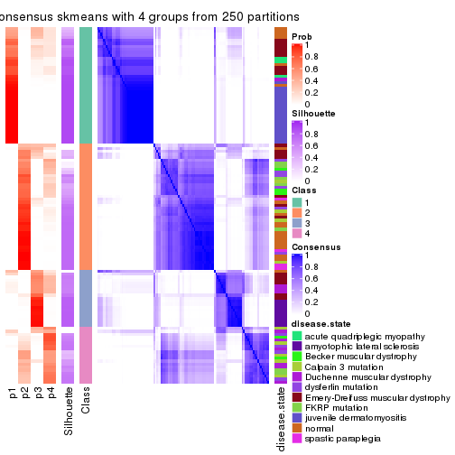</p>

</div>
<div id='tab-CV-skmeans-consensus-heatmap-4'>
<pre><code class="r">consensus_heatmap(res, k = 5)
</code></pre>

<p></p>

</div>
<div id='tab-CV-skmeans-consensus-heatmap-5'>
<pre><code class="r">consensus_heatmap(res, k = 6)
</code></pre>

<p></p>

</div>
</div>

Heatmaps for the membership of samples in all partitions to see how consistent they are:


<script>
$( function() {
	$( '#tabs-CV-skmeans-membership-heatmap' ).tabs();
} );
</script>
<div id='tabs-CV-skmeans-membership-heatmap'>
<ul>
<li><a href='#tab-CV-skmeans-membership-heatmap-1'>k = 2</a></li>
<li><a href='#tab-CV-skmeans-membership-heatmap-2'>k = 3</a></li>
<li><a href='#tab-CV-skmeans-membership-heatmap-3'>k = 4</a></li>
<li><a href='#tab-CV-skmeans-membership-heatmap-4'>k = 5</a></li>
<li><a href='#tab-CV-skmeans-membership-heatmap-5'>k = 6</a></li>
</ul>
<div id='tab-CV-skmeans-membership-heatmap-1'>
<pre><code class="r">membership_heatmap(res, k = 2)
</code></pre>

<p></p>

</div>
<div id='tab-CV-skmeans-membership-heatmap-2'>
<pre><code class="r">membership_heatmap(res, k = 3)
</code></pre>

<p></p>

</div>
<div id='tab-CV-skmeans-membership-heatmap-3'>
<pre><code class="r">membership_heatmap(res, k = 4)
</code></pre>

<p></p>

</div>
<div id='tab-CV-skmeans-membership-heatmap-4'>
<pre><code class="r">membership_heatmap(res, k = 5)
</code></pre>

<p></p>

</div>
<div id='tab-CV-skmeans-membership-heatmap-5'>
<pre><code class="r">membership_heatmap(res, k = 6)
</code></pre>

<p></p>

</div>
</div>

As soon as we have had the classes for columns, we can look for signatures
which are significantly different between classes which can be candidate marks
for certain classes. Following are the heatmaps for signatures.


Signature heatmaps where rows are scaled:


<script>
$( function() {
	$( '#tabs-CV-skmeans-get-signatures' ).tabs();
} );
</script>
<div id='tabs-CV-skmeans-get-signatures'>
<ul>
<li><a href='#tab-CV-skmeans-get-signatures-1'>k = 2</a></li>
<li><a href='#tab-CV-skmeans-get-signatures-2'>k = 3</a></li>
<li><a href='#tab-CV-skmeans-get-signatures-3'>k = 4</a></li>
<li><a href='#tab-CV-skmeans-get-signatures-4'>k = 5</a></li>
<li><a href='#tab-CV-skmeans-get-signatures-5'>k = 6</a></li>
</ul>
<div id='tab-CV-skmeans-get-signatures-1'>
<pre><code class="r">get_signatures(res, k = 2)
</code></pre>

<p></p>

</div>
<div id='tab-CV-skmeans-get-signatures-2'>
<pre><code class="r">get_signatures(res, k = 3)
</code></pre>

<p></p>

</div>
<div id='tab-CV-skmeans-get-signatures-3'>
<pre><code class="r">get_signatures(res, k = 4)
</code></pre>

<p></p>

</div>
<div id='tab-CV-skmeans-get-signatures-4'>
<pre><code class="r">get_signatures(res, k = 5)
</code></pre>

<p></p>

</div>
<div id='tab-CV-skmeans-get-signatures-5'>
<pre><code class="r">get_signatures(res, k = 6)
</code></pre>

<p></p>

</div>
</div>


Signature heatmaps where rows are not scaled:


<script>
$( function() {
	$( '#tabs-CV-skmeans-get-signatures-no-scale' ).tabs();
} );
</script>
<div id='tabs-CV-skmeans-get-signatures-no-scale'>
<ul>
<li><a href='#tab-CV-skmeans-get-signatures-no-scale-1'>k = 2</a></li>
<li><a href='#tab-CV-skmeans-get-signatures-no-scale-2'>k = 3</a></li>
<li><a href='#tab-CV-skmeans-get-signatures-no-scale-3'>k = 4</a></li>
<li><a href='#tab-CV-skmeans-get-signatures-no-scale-4'>k = 5</a></li>
<li><a href='#tab-CV-skmeans-get-signatures-no-scale-5'>k = 6</a></li>
</ul>
<div id='tab-CV-skmeans-get-signatures-no-scale-1'>
<pre><code class="r">get_signatures(res, k = 2, scale_rows = FALSE)
</code></pre>

<p></p>

</div>
<div id='tab-CV-skmeans-get-signatures-no-scale-2'>
<pre><code class="r">get_signatures(res, k = 3, scale_rows = FALSE)
</code></pre>

<p></p>

</div>
<div id='tab-CV-skmeans-get-signatures-no-scale-3'>
<pre><code class="r">get_signatures(res, k = 4, scale_rows = FALSE)
</code></pre>

<p></p>

</div>
<div id='tab-CV-skmeans-get-signatures-no-scale-4'>
<pre><code class="r">get_signatures(res, k = 5, scale_rows = FALSE)
</code></pre>

<p></p>

</div>
<div id='tab-CV-skmeans-get-signatures-no-scale-5'>
<pre><code class="r">get_signatures(res, k = 6, scale_rows = FALSE)
</code></pre>

<p></p>

</div>
</div>


Compare the overlap of signatures from different k:

```r
compare_signatures(res)
```


`get_signature()` returns a data frame invisibly. TO get the list of signatures, the function
call should be assigned to a variable explicitly. In following code, if `plot` argument is set
to `FALSE`, no heatmap is plotted while only the differential analysis is performed.

```r
# code only for demonstration
tb = get_signature(res, k = ..., plot = FALSE)
```

An example of the output of `tb` is:

```
#>   which_row         fdr    mean_1    mean_2 scaled_mean_1 scaled_mean_2 km
#> 1        38 0.042760348  8.373488  9.131774    -0.5533452     0.5164555  1
#> 2        40 0.018707592  7.106213  8.469186    -0.6173731     0.5762149  1
#> 3        55 0.019134737 10.221463 11.207825    -0.6159697     0.5749050  1
#> 4        59 0.006059896  5.921854  7.869574    -0.6899429     0.6439467  1
#> 5        60 0.018055526  8.928898 10.211722    -0.6204761     0.5791110  1
#> 6        98 0.009384629 15.714769 14.887706     0.6635654    -0.6193277  2
...
```

The columns in `tb` are:

1. `which_row`: row indices corresponding to the input matrix.
2. `fdr`: FDR for the differential test. 
3. `mean_x`: The mean value in group x.
4. `scaled_mean_x`: The mean value in group x after rows are scaled.
5. `km`: Row groups if k-means clustering is applied to rows.


UMAP plot which shows how samples are separated.


<script>
$( function() {
	$( '#tabs-CV-skmeans-dimension-reduction' ).tabs();
} );
</script>
<div id='tabs-CV-skmeans-dimension-reduction'>
<ul>
<li><a href='#tab-CV-skmeans-dimension-reduction-1'>k = 2</a></li>
<li><a href='#tab-CV-skmeans-dimension-reduction-2'>k = 3</a></li>
<li><a href='#tab-CV-skmeans-dimension-reduction-3'>k = 4</a></li>
<li><a href='#tab-CV-skmeans-dimension-reduction-4'>k = 5</a></li>
<li><a href='#tab-CV-skmeans-dimension-reduction-5'>k = 6</a></li>
</ul>
<div id='tab-CV-skmeans-dimension-reduction-1'>
<pre><code class="r">dimension_reduction(res, k = 2, method = &quot;UMAP&quot;)
</code></pre>

<p></p>

</div>
<div id='tab-CV-skmeans-dimension-reduction-2'>
<pre><code class="r">dimension_reduction(res, k = 3, method = &quot;UMAP&quot;)
</code></pre>

<p></p>

</div>
<div id='tab-CV-skmeans-dimension-reduction-3'>
<pre><code class="r">dimension_reduction(res, k = 4, method = &quot;UMAP&quot;)
</code></pre>

<p></p>

</div>
<div id='tab-CV-skmeans-dimension-reduction-4'>
<pre><code class="r">dimension_reduction(res, k = 5, method = &quot;UMAP&quot;)
</code></pre>

<p></p>

</div>
<div id='tab-CV-skmeans-dimension-reduction-5'>
<pre><code class="r">dimension_reduction(res, k = 6, method = &quot;UMAP&quot;)
</code></pre>

<p></p>

</div>
</div>


Following heatmap shows how subgroups are split when increasing `k`:

```r
collect_classes(res)
```


Test correlation between subgroups and known annotations. If the known
annotation is numeric, one-way ANOVA test is applied, and if the known
annotation is discrete, chi-squared contingency table test is applied.

```r
test_to_known_factors(res)
```

```
#>              n disease.state(p) k
#> CV:skmeans 117         5.29e-10 2
#> CV:skmeans 113         1.79e-18 3
#> CV:skmeans  96         1.17e-19 4
#> CV:skmeans  93         6.15e-26 5
#> CV:skmeans  98         7.70e-33 6
```


If matrix rows can be associated to genes, consider to use `functional_enrichment(res,
...)` to perform function enrichment for the signature genes. See [this vignette](http://bioconductor.org/packages/devel/bioc/vignettes/cola/inst/doc/functional_enrichment.html) for more detailed explanations.


 

---------------------------------------------------


### CV:pam


The object with results only for a single top-value method and a single partition method 
can be extracted as:

```r
res = res_list["CV", "pam"]
# you can also extract it by
# res = res_list["CV:pam"]
```

A summary of `res` and all the functions that can be applied to it:

```r
res
```

```
#> A 'ConsensusPartition' object with k = 2, 3, 4, 5, 6.
#>   On a matrix with 21512 rows and 119 columns.
#>   Top rows (1000, 2000, 3000, 4000, 5000) are extracted by 'CV' method.
#>   Subgroups are detected by 'pam' method.
#>   Performed in total 1250 partitions by row resampling.
#>   Best k for subgroups seems to be 2.
#> 
#> Following methods can be applied to this 'ConsensusPartition' object:
#>  [1] "cola_report"             "collect_classes"         "collect_plots"          
#>  [4] "collect_stats"           "colnames"                "compare_signatures"     
#>  [7] "consensus_heatmap"       "dimension_reduction"     "functional_enrichment"  
#> [10] "get_anno_col"            "get_anno"                "get_classes"            
#> [13] "get_consensus"           "get_matrix"              "get_membership"         
#> [16] "get_param"               "get_signatures"          "get_stats"              
#> [19] "is_best_k"               "is_stable_k"             "membership_heatmap"     
#> [22] "ncol"                    "nrow"                    "plot_ecdf"              
#> [25] "rownames"                "select_partition_number" "show"                   
#> [28] "suggest_best_k"          "test_to_known_factors"
```

`collect_plots()` function collects all the plots made from `res` for all `k` (number of partitions)
into one single page to provide an easy and fast comparison between different `k`.

```r
collect_plots(res)
```


The plots are:

- The first row: a plot of the ECDF (empirical cumulative distribution
  function) curves of the consensus matrix for each `k` and the heatmap of
  predicted classes for each `k`.
- The second row: heatmaps of the consensus matrix for each `k`.
- The third row: heatmaps of the membership matrix for each `k`.
- The fouth row: heatmaps of the signatures for each `k`.

All the plots in panels can be made by individual functions and they are
plotted later in this section.

`select_partition_number()` produces several plots showing different
statistics for choosing "optimized" `k`. There are following statistics:

- ECDF curves of the consensus matrix for each `k`;
- 1-PAC. [The PAC
  score](https://en.wikipedia.org/wiki/Consensus_clustering#Over-interpretation_potential_of_consensus_clustering)
  measures the proportion of the ambiguous subgrouping.
- Mean silhouette score.
- Concordance. The mean probability of fiting the consensus class ids in all
  partitions.
- Area increased. Denote $A_k$ as the area under the ECDF curve for current
  `k`, the area increased is defined as $A_k - A_{k-1}$.
- Rand index. The percent of pairs of samples that are both in a same cluster
  or both are not in a same cluster in the partition of k and k-1.
- Jaccard index. The ratio of pairs of samples are both in a same cluster in
  the partition of k and k-1 and the pairs of samples are both in a same
  cluster in the partition k or k-1.

The detailed explanations of these statistics can be found in [the _cola_
vignette](http://bioconductor.org/packages/devel/bioc/vignettes/cola/inst/doc/cola.html#toc_13).

Generally speaking, lower PAC score, higher mean silhouette score or higher
concordance corresponds to better partition. Rand index and Jaccard index
measure how similar the current partition is compared to partition with `k-1`.
If they are too similar, we won't accept `k` is better than `k-1`.

```r
select_partition_number(res)
```


The numeric values for all these statistics can be obtained by `get_stats()`.

```r
get_stats(res)
```

```
#>   k 1-PAC mean_silhouette concordance area_increased  Rand Jaccard
#> 2 2 0.539           0.782       0.901         0.4830 0.499   0.499
#> 3 3 0.350           0.427       0.639         0.3153 0.945   0.891
#> 4 4 0.506           0.470       0.758         0.1598 0.704   0.410
#> 5 5 0.568           0.553       0.743         0.0739 0.839   0.479
#> 6 6 0.684           0.646       0.769         0.0425 0.916   0.623
```

`suggest_best_k()` suggests the best $k$ based on these statistics. The rules are as follows:

- All $k$ with Jaccard index larger than 0.95 are removed because increasing
  $k$ does not provide enough extra information. If all $k$ are removed, it is
  marked as no subgroup is detected.
- For all $k$ with 1-PAC score larger than 0.9, the maximal $k$ is taken as
  the best $k$, and other $k$ are marked as optional $k$.
- If it does not fit the second rule. The $k$ with the maximal vote of the
  highest 1-PAC score, highest mean silhouette, and highest concordance is
  taken as the best $k$.

```r
suggest_best_k(res)
```

```
#> [1] 2
```


Following shows the table of the partitions (You need to click the **show/hide
code output** link to see it). The membership matrix (columns with name `p*`)
is inferred by
[`clue::cl_consensus()`](https://www.rdocumentation.org/link/cl_consensus?package=clue)
function with the `SE` method. Basically the value in the membership matrix
represents the probability to belong to a certain group. The finall class
label for an item is determined with the group with highest probability it
belongs to.

In `get_classes()` function, the entropy is calculated from the membership
matrix and the silhouette score is calculated from the consensus matrix.


<script>
$( function() {
	$( '#tabs-CV-pam-get-classes' ).tabs();
} );
</script>
<div id='tabs-CV-pam-get-classes'>
<ul>
<li><a href='#tab-CV-pam-get-classes-1'>k = 2</a></li>
<li><a href='#tab-CV-pam-get-classes-2'>k = 3</a></li>
<li><a href='#tab-CV-pam-get-classes-3'>k = 4</a></li>
<li><a href='#tab-CV-pam-get-classes-4'>k = 5</a></li>
<li><a href='#tab-CV-pam-get-classes-5'>k = 6</a></li>
</ul>

<div id='tab-CV-pam-get-classes-1'>
<p><a id='tab-CV-pam-get-classes-1-a' style='color:#0366d6' href='#'>show/hide code output</a></p>
<pre><code class="r">cbind(get_classes(res, k = 2), get_membership(res, k = 2))
</code></pre>

<pre><code>#&gt;           class entropy silhouette    p1    p2
#&gt; GSM120719     1  0.0000     0.8733 1.000 0.000
#&gt; GSM120720     1  0.0376     0.8728 0.996 0.004
#&gt; GSM120765     2  0.0000     0.8874 0.000 1.000
#&gt; GSM120767     2  0.0000     0.8874 0.000 1.000
#&gt; GSM120784     2  0.0000     0.8874 0.000 1.000
#&gt; GSM121400     1  0.9000     0.5632 0.684 0.316
#&gt; GSM121401     1  0.9129     0.5408 0.672 0.328
#&gt; GSM121402     2  0.0000     0.8874 0.000 1.000
#&gt; GSM121403     1  0.9044     0.5558 0.680 0.320
#&gt; GSM121404     2  0.9686     0.3718 0.396 0.604
#&gt; GSM121405     1  0.9998     0.0354 0.508 0.492
#&gt; GSM121406     2  0.0000     0.8874 0.000 1.000
#&gt; GSM121408     2  0.1184     0.8855 0.016 0.984
#&gt; GSM121409     1  0.9909     0.2228 0.556 0.444
#&gt; GSM121410     1  0.9000     0.5635 0.684 0.316
#&gt; GSM121412     2  0.2603     0.8729 0.044 0.956
#&gt; GSM121413     2  0.0000     0.8874 0.000 1.000
#&gt; GSM121414     2  0.1633     0.8834 0.024 0.976
#&gt; GSM121415     2  0.8861     0.5396 0.304 0.696
#&gt; GSM121416     2  0.0000     0.8874 0.000 1.000
#&gt; GSM120591     1  0.2603     0.8614 0.956 0.044
#&gt; GSM120594     1  0.1843     0.8669 0.972 0.028
#&gt; GSM120718     1  0.0000     0.8733 1.000 0.000
#&gt; GSM121205     1  0.0000     0.8733 1.000 0.000
#&gt; GSM121206     1  0.0000     0.8733 1.000 0.000
#&gt; GSM121207     1  0.0000     0.8733 1.000 0.000
#&gt; GSM121208     1  0.0000     0.8733 1.000 0.000
#&gt; GSM121209     1  0.0000     0.8733 1.000 0.000
#&gt; GSM121210     1  0.0000     0.8733 1.000 0.000
#&gt; GSM121211     1  0.0000     0.8733 1.000 0.000
#&gt; GSM121212     1  0.0000     0.8733 1.000 0.000
#&gt; GSM121213     1  0.0000     0.8733 1.000 0.000
#&gt; GSM121214     1  0.0000     0.8733 1.000 0.000
#&gt; GSM121215     1  0.0000     0.8733 1.000 0.000
#&gt; GSM121216     1  0.0000     0.8733 1.000 0.000
#&gt; GSM121217     1  0.0000     0.8733 1.000 0.000
#&gt; GSM121218     1  0.0000     0.8733 1.000 0.000
#&gt; GSM121234     1  0.0000     0.8733 1.000 0.000
#&gt; GSM121243     1  0.0000     0.8733 1.000 0.000
#&gt; GSM121245     1  0.0000     0.8733 1.000 0.000
#&gt; GSM121246     1  0.0000     0.8733 1.000 0.000
#&gt; GSM121247     1  0.0000     0.8733 1.000 0.000
#&gt; GSM121248     1  0.0000     0.8733 1.000 0.000
#&gt; GSM120744     2  0.7602     0.7177 0.220 0.780
#&gt; GSM120745     2  0.9087     0.5559 0.324 0.676
#&gt; GSM120746     2  0.7815     0.7037 0.232 0.768
#&gt; GSM120747     2  0.7815     0.7038 0.232 0.768
#&gt; GSM120748     2  0.7528     0.7226 0.216 0.784
#&gt; GSM120749     2  0.8016     0.6906 0.244 0.756
#&gt; GSM120750     2  0.7950     0.6953 0.240 0.760
#&gt; GSM120751     2  0.8016     0.6906 0.244 0.756
#&gt; GSM120752     2  0.8207     0.6736 0.256 0.744
#&gt; GSM121336     2  0.0000     0.8874 0.000 1.000
#&gt; GSM121339     2  0.4939     0.8306 0.108 0.892
#&gt; GSM121349     2  0.0000     0.8874 0.000 1.000
#&gt; GSM121355     2  0.0000     0.8874 0.000 1.000
#&gt; GSM120757     2  0.9358     0.4880 0.352 0.648
#&gt; GSM120766     2  0.9686     0.3424 0.396 0.604
#&gt; GSM120770     2  0.0376     0.8871 0.004 0.996
#&gt; GSM120779     1  0.3879     0.8444 0.924 0.076
#&gt; GSM120780     2  0.4161     0.8479 0.084 0.916
#&gt; GSM121102     2  0.1184     0.8846 0.016 0.984
#&gt; GSM121203     2  0.7745     0.7077 0.228 0.772
#&gt; GSM121204     1  0.8955     0.5401 0.688 0.312
#&gt; GSM121330     1  0.4431     0.8342 0.908 0.092
#&gt; GSM121335     1  0.0000     0.8733 1.000 0.000
#&gt; GSM121337     1  0.9608     0.4110 0.616 0.384
#&gt; GSM121338     2  0.9775     0.3229 0.412 0.588
#&gt; GSM121341     1  0.0000     0.8733 1.000 0.000
#&gt; GSM121342     1  0.0000     0.8733 1.000 0.000
#&gt; GSM121343     1  0.9608     0.4152 0.616 0.384
#&gt; GSM121344     1  0.0672     0.8721 0.992 0.008
#&gt; GSM121346     1  0.6247     0.7797 0.844 0.156
#&gt; GSM121347     1  0.9044     0.5558 0.680 0.320
#&gt; GSM121348     1  0.9323     0.5073 0.652 0.348
#&gt; GSM121350     1  0.7950     0.6817 0.760 0.240
#&gt; GSM121352     1  0.3114     0.8559 0.944 0.056
#&gt; GSM121354     1  0.0376     0.8728 0.996 0.004
#&gt; GSM120753     2  0.0000     0.8874 0.000 1.000
#&gt; GSM120761     2  0.0000     0.8874 0.000 1.000
#&gt; GSM120768     2  0.0000     0.8874 0.000 1.000
#&gt; GSM120781     2  0.0000     0.8874 0.000 1.000
#&gt; GSM120788     1  0.9323     0.5261 0.652 0.348
#&gt; GSM120760     2  0.0672     0.8865 0.008 0.992
#&gt; GSM120763     2  0.0000     0.8874 0.000 1.000
#&gt; GSM120764     2  0.1414     0.8840 0.020 0.980
#&gt; GSM120777     2  0.9866     0.2338 0.432 0.568
#&gt; GSM120786     2  0.1414     0.8847 0.020 0.980
#&gt; GSM121329     1  0.0672     0.8721 0.992 0.008
#&gt; GSM121331     1  0.4022     0.8458 0.920 0.080
#&gt; GSM121333     1  0.3733     0.8504 0.928 0.072
#&gt; GSM121345     1  0.2423     0.8637 0.960 0.040
#&gt; GSM121356     1  0.4298     0.8406 0.912 0.088
#&gt; GSM120754     2  0.0000     0.8874 0.000 1.000
#&gt; GSM120759     2  0.0000     0.8874 0.000 1.000
#&gt; GSM120762     2  0.1414     0.8832 0.020 0.980
#&gt; GSM120775     2  0.9608     0.3744 0.384 0.616
#&gt; GSM120776     2  0.7139     0.7411 0.196 0.804
#&gt; GSM120782     2  0.1633     0.8833 0.024 0.976
#&gt; GSM120789     2  0.0938     0.8863 0.012 0.988
#&gt; GSM120790     2  0.0000     0.8874 0.000 1.000
#&gt; GSM120791     2  0.0000     0.8874 0.000 1.000
#&gt; GSM120755     2  0.0000     0.8874 0.000 1.000
#&gt; GSM120756     1  0.4690     0.8245 0.900 0.100
#&gt; GSM120769     2  0.0000     0.8874 0.000 1.000
#&gt; GSM120778     2  0.2043     0.8770 0.032 0.968
#&gt; GSM120792     2  0.0000     0.8874 0.000 1.000
#&gt; GSM121332     2  0.1414     0.8844 0.020 0.980
#&gt; GSM121334     2  0.3114     0.8602 0.056 0.944
#&gt; GSM121340     1  0.8081     0.6877 0.752 0.248
#&gt; GSM121351     2  0.1633     0.8815 0.024 0.976
#&gt; GSM121353     1  0.6048     0.7877 0.852 0.148
#&gt; GSM120758     2  0.0000     0.8874 0.000 1.000
#&gt; GSM120771     2  0.0000     0.8874 0.000 1.000
#&gt; GSM120772     2  0.0000     0.8874 0.000 1.000
#&gt; GSM120773     2  0.1843     0.8794 0.028 0.972
#&gt; GSM120774     2  0.0000     0.8874 0.000 1.000
#&gt; GSM120783     2  0.1843     0.8818 0.028 0.972
#&gt; GSM120787     2  0.1843     0.8796 0.028 0.972
</code></pre>

<script>
$('#tab-CV-pam-get-classes-1-a').parent().next().next().hide();
$('#tab-CV-pam-get-classes-1-a').click(function(){
  $('#tab-CV-pam-get-classes-1-a').parent().next().next().toggle();
  return(false);
});
</script>
</div>

<div id='tab-CV-pam-get-classes-2'>
<p><a id='tab-CV-pam-get-classes-2-a' style='color:#0366d6' href='#'>show/hide code output</a></p>
<pre><code class="r">cbind(get_classes(res, k = 3), get_membership(res, k = 3))
</code></pre>

<pre><code>#&gt;           class entropy silhouette    p1    p2    p3
#&gt; GSM120719     1  0.6305    0.25744 0.516 0.000 0.484
#&gt; GSM120720     1  0.4413    0.35184 0.832 0.008 0.160
#&gt; GSM120765     2  0.1643    0.74524 0.000 0.956 0.044
#&gt; GSM120767     2  0.6361    0.67804 0.040 0.728 0.232
#&gt; GSM120784     2  0.2796    0.74928 0.000 0.908 0.092
#&gt; GSM121400     1  0.6719    0.19518 0.744 0.096 0.160
#&gt; GSM121401     1  0.6714    0.19645 0.748 0.140 0.112
#&gt; GSM121402     2  0.4062    0.73335 0.000 0.836 0.164
#&gt; GSM121403     1  0.6375    0.16984 0.720 0.244 0.036
#&gt; GSM121404     2  0.7961    0.32537 0.336 0.588 0.076
#&gt; GSM121405     1  0.7997    0.01873 0.600 0.316 0.084
#&gt; GSM121406     2  0.1031    0.74381 0.000 0.976 0.024
#&gt; GSM121408     2  0.4233    0.65741 0.160 0.836 0.004
#&gt; GSM121409     1  0.9076   -0.06208 0.552 0.208 0.240
#&gt; GSM121410     1  0.7004    0.16570 0.728 0.112 0.160
#&gt; GSM121412     2  0.4095    0.72804 0.056 0.880 0.064
#&gt; GSM121413     2  0.3272    0.74145 0.004 0.892 0.104
#&gt; GSM121414     2  0.5722    0.72972 0.068 0.800 0.132
#&gt; GSM121415     2  0.7391    0.54512 0.196 0.696 0.108
#&gt; GSM121416     2  0.5061    0.70924 0.008 0.784 0.208
#&gt; GSM120591     1  0.4483    0.34437 0.848 0.024 0.128
#&gt; GSM120594     1  0.1182    0.38702 0.976 0.012 0.012
#&gt; GSM120718     1  0.5733    0.30611 0.676 0.000 0.324
#&gt; GSM121205     1  0.6309    0.25528 0.504 0.000 0.496
#&gt; GSM121206     1  0.5016    0.32998 0.760 0.000 0.240
#&gt; GSM121207     1  0.6309    0.25528 0.504 0.000 0.496
#&gt; GSM121208     1  0.4887    0.33277 0.772 0.000 0.228
#&gt; GSM121209     1  0.6235    0.27431 0.564 0.000 0.436
#&gt; GSM121210     1  0.6309    0.25528 0.504 0.000 0.496
#&gt; GSM121211     1  0.6308    0.25646 0.508 0.000 0.492
#&gt; GSM121212     1  0.6244    0.27573 0.560 0.000 0.440
#&gt; GSM121213     1  0.6309    0.25528 0.504 0.000 0.496
#&gt; GSM121214     1  0.6309    0.25528 0.504 0.000 0.496
#&gt; GSM121215     1  0.6309    0.25528 0.504 0.000 0.496
#&gt; GSM121216     1  0.6309    0.25528 0.504 0.000 0.496
#&gt; GSM121217     1  0.6309    0.25528 0.504 0.000 0.496
#&gt; GSM121218     1  0.6309    0.25528 0.504 0.000 0.496
#&gt; GSM121234     1  0.6309    0.25528 0.504 0.000 0.496
#&gt; GSM121243     1  0.6309    0.25528 0.504 0.000 0.496
#&gt; GSM121245     1  0.6309    0.25528 0.504 0.000 0.496
#&gt; GSM121246     1  0.3192    0.37316 0.888 0.000 0.112
#&gt; GSM121247     3  0.6309   -0.36871 0.500 0.000 0.500
#&gt; GSM121248     1  0.6309    0.25528 0.504 0.000 0.496
#&gt; GSM120744     2  0.8067    0.59249 0.100 0.616 0.284
#&gt; GSM120745     2  0.9304    0.46548 0.204 0.516 0.280
#&gt; GSM120746     2  0.8258    0.58447 0.112 0.604 0.284
#&gt; GSM120747     2  0.8291    0.58139 0.116 0.604 0.280
#&gt; GSM120748     2  0.8258    0.58447 0.112 0.604 0.284
#&gt; GSM120749     2  0.8291    0.58139 0.116 0.604 0.280
#&gt; GSM120750     2  0.8104    0.59045 0.104 0.616 0.280
#&gt; GSM120751     2  0.8291    0.58139 0.116 0.604 0.280
#&gt; GSM120752     2  0.8291    0.58037 0.116 0.604 0.280
#&gt; GSM121336     2  0.1989    0.73233 0.048 0.948 0.004
#&gt; GSM121339     2  0.7728    0.62629 0.084 0.640 0.276
#&gt; GSM121349     2  0.0892    0.74372 0.000 0.980 0.020
#&gt; GSM121355     2  0.2339    0.74764 0.012 0.940 0.048
#&gt; GSM120757     3  0.9120   -0.32846 0.156 0.340 0.504
#&gt; GSM120766     2  0.9992   -0.03670 0.328 0.352 0.320
#&gt; GSM120770     2  0.5465    0.71312 0.000 0.712 0.288
#&gt; GSM120779     3  0.7807    0.13527 0.432 0.052 0.516
#&gt; GSM120780     2  0.7442    0.65020 0.056 0.628 0.316
#&gt; GSM121102     2  0.6761    0.67239 0.048 0.700 0.252
#&gt; GSM121203     2  0.8573    0.56362 0.104 0.524 0.372
#&gt; GSM121204     3  0.8241    0.25737 0.204 0.160 0.636
#&gt; GSM121330     1  0.1129    0.37978 0.976 0.020 0.004
#&gt; GSM121335     1  0.1031    0.38895 0.976 0.000 0.024
#&gt; GSM121337     1  0.7876   -0.09200 0.520 0.424 0.056
#&gt; GSM121338     2  0.8604    0.34856 0.312 0.564 0.124
#&gt; GSM121341     1  0.1529    0.38690 0.960 0.000 0.040
#&gt; GSM121342     1  0.0000    0.38737 1.000 0.000 0.000
#&gt; GSM121343     1  0.7844    0.08003 0.660 0.220 0.120
#&gt; GSM121344     1  0.0424    0.38607 0.992 0.008 0.000
#&gt; GSM121346     1  0.5377    0.26626 0.820 0.068 0.112
#&gt; GSM121347     1  0.8637   -0.02116 0.596 0.236 0.168
#&gt; GSM121348     1  0.9485   -0.17405 0.484 0.304 0.212
#&gt; GSM121350     1  0.4914    0.28777 0.844 0.068 0.088
#&gt; GSM121352     1  0.1585    0.37370 0.964 0.028 0.008
#&gt; GSM121354     1  0.0424    0.38607 0.992 0.008 0.000
#&gt; GSM120753     2  0.3851    0.75575 0.004 0.860 0.136
#&gt; GSM120761     2  0.3340    0.73668 0.000 0.880 0.120
#&gt; GSM120768     2  0.3686    0.73485 0.000 0.860 0.140
#&gt; GSM120781     2  0.2537    0.73946 0.000 0.920 0.080
#&gt; GSM120788     1  0.9577   -0.25765 0.404 0.196 0.400
#&gt; GSM120760     2  0.5138    0.69982 0.000 0.748 0.252
#&gt; GSM120763     2  0.5158    0.67429 0.004 0.764 0.232
#&gt; GSM120764     2  0.6608    0.66081 0.016 0.628 0.356
#&gt; GSM120777     3  0.9756    0.14581 0.248 0.316 0.436
#&gt; GSM120786     2  0.6172    0.67032 0.012 0.680 0.308
#&gt; GSM121329     1  0.1529    0.38349 0.960 0.000 0.040
#&gt; GSM121331     1  0.7756   -0.06028 0.564 0.056 0.380
#&gt; GSM121333     3  0.7759    0.04495 0.472 0.048 0.480
#&gt; GSM121345     1  0.7192   -0.00934 0.588 0.032 0.380
#&gt; GSM121356     1  0.7095    0.05283 0.660 0.048 0.292
#&gt; GSM120754     2  0.5431    0.70475 0.000 0.716 0.284
#&gt; GSM120759     2  0.2772    0.75124 0.004 0.916 0.080
#&gt; GSM120762     2  0.2229    0.74659 0.012 0.944 0.044
#&gt; GSM120775     2  0.9674    0.26270 0.212 0.396 0.392
#&gt; GSM120776     2  0.8037    0.55977 0.076 0.572 0.352
#&gt; GSM120782     2  0.5843    0.67875 0.016 0.732 0.252
#&gt; GSM120789     2  0.5746    0.71011 0.040 0.780 0.180
#&gt; GSM120790     2  0.5285    0.68486 0.004 0.752 0.244
#&gt; GSM120791     2  0.5115    0.70410 0.004 0.768 0.228
#&gt; GSM120755     2  0.2806    0.73714 0.032 0.928 0.040
#&gt; GSM120756     3  0.8050   -0.11520 0.436 0.064 0.500
#&gt; GSM120769     2  0.1453    0.74185 0.008 0.968 0.024
#&gt; GSM120778     2  0.4397    0.73694 0.028 0.856 0.116
#&gt; GSM120792     2  0.5578    0.70864 0.012 0.748 0.240
#&gt; GSM121332     2  0.5060    0.71281 0.100 0.836 0.064
#&gt; GSM121334     2  0.4968    0.68682 0.012 0.800 0.188
#&gt; GSM121340     1  0.9663   -0.22410 0.416 0.212 0.372
#&gt; GSM121351     2  0.3910    0.74209 0.020 0.876 0.104
#&gt; GSM121353     1  0.7898    0.05676 0.616 0.084 0.300
#&gt; GSM120758     2  0.3551    0.72539 0.000 0.868 0.132
#&gt; GSM120771     2  0.4796    0.72497 0.000 0.780 0.220
#&gt; GSM120772     2  0.4654    0.75116 0.000 0.792 0.208
#&gt; GSM120773     2  0.6168    0.71107 0.036 0.740 0.224
#&gt; GSM120774     2  0.4654    0.72979 0.000 0.792 0.208
#&gt; GSM120783     2  0.6319    0.70361 0.040 0.732 0.228
#&gt; GSM120787     2  0.4068    0.75537 0.016 0.864 0.120
</code></pre>

<script>
$('#tab-CV-pam-get-classes-2-a').parent().next().next().hide();
$('#tab-CV-pam-get-classes-2-a').click(function(){
  $('#tab-CV-pam-get-classes-2-a').parent().next().next().toggle();
  return(false);
});
</script>
</div>

<div id='tab-CV-pam-get-classes-3'>
<p><a id='tab-CV-pam-get-classes-3-a' style='color:#0366d6' href='#'>show/hide code output</a></p>
<pre><code class="r">cbind(get_classes(res, k = 4), get_membership(res, k = 4))
</code></pre>

<pre><code>#&gt;           class entropy silhouette    p1    p2    p3    p4
#&gt; GSM120719     1  0.0188    0.91085 0.996 0.000 0.000 0.004
#&gt; GSM120720     4  0.4456    0.58749 0.280 0.000 0.004 0.716
#&gt; GSM120765     2  0.5511   -0.01006 0.000 0.500 0.484 0.016
#&gt; GSM120767     3  0.2408    0.59010 0.000 0.104 0.896 0.000
#&gt; GSM120784     3  0.4830    0.21895 0.000 0.392 0.608 0.000
#&gt; GSM121400     4  0.0657    0.80842 0.000 0.004 0.012 0.984
#&gt; GSM121401     4  0.0469    0.80860 0.000 0.000 0.012 0.988
#&gt; GSM121402     2  0.5298    0.29475 0.000 0.612 0.372 0.016
#&gt; GSM121403     4  0.0927    0.80044 0.000 0.008 0.016 0.976
#&gt; GSM121404     3  0.5388    0.17391 0.000 0.012 0.532 0.456
#&gt; GSM121405     4  0.1867    0.77299 0.000 0.000 0.072 0.928
#&gt; GSM121406     3  0.5310    0.17303 0.000 0.412 0.576 0.012
#&gt; GSM121408     2  0.7748    0.03811 0.000 0.428 0.324 0.248
#&gt; GSM121409     4  0.5132    0.18565 0.000 0.004 0.448 0.548
#&gt; GSM121410     4  0.3015    0.74991 0.000 0.092 0.024 0.884
#&gt; GSM121412     3  0.5639    0.30942 0.000 0.324 0.636 0.040
#&gt; GSM121413     2  0.5329    0.17189 0.000 0.568 0.420 0.012
#&gt; GSM121414     3  0.6336    0.02497 0.000 0.460 0.480 0.060
#&gt; GSM121415     2  0.7166    0.28917 0.000 0.544 0.280 0.176
#&gt; GSM121416     2  0.4610    0.40156 0.000 0.744 0.236 0.020
#&gt; GSM120591     4  0.5006    0.71899 0.124 0.000 0.104 0.772
#&gt; GSM120594     4  0.3790    0.72619 0.164 0.000 0.016 0.820
#&gt; GSM120718     1  0.4222    0.59319 0.728 0.000 0.000 0.272
#&gt; GSM121205     1  0.0000    0.91313 1.000 0.000 0.000 0.000
#&gt; GSM121206     1  0.4776    0.29402 0.624 0.000 0.000 0.376
#&gt; GSM121207     1  0.0000    0.91313 1.000 0.000 0.000 0.000
#&gt; GSM121208     1  0.4866    0.21697 0.596 0.000 0.000 0.404
#&gt; GSM121209     1  0.1302    0.88025 0.956 0.000 0.000 0.044
#&gt; GSM121210     1  0.0000    0.91313 1.000 0.000 0.000 0.000
#&gt; GSM121211     1  0.0336    0.90800 0.992 0.000 0.000 0.008
#&gt; GSM121212     1  0.1302    0.87928 0.956 0.000 0.000 0.044
#&gt; GSM121213     1  0.0000    0.91313 1.000 0.000 0.000 0.000
#&gt; GSM121214     1  0.0000    0.91313 1.000 0.000 0.000 0.000
#&gt; GSM121215     1  0.0000    0.91313 1.000 0.000 0.000 0.000
#&gt; GSM121216     1  0.0000    0.91313 1.000 0.000 0.000 0.000
#&gt; GSM121217     1  0.0000    0.91313 1.000 0.000 0.000 0.000
#&gt; GSM121218     1  0.0000    0.91313 1.000 0.000 0.000 0.000
#&gt; GSM121234     1  0.0000    0.91313 1.000 0.000 0.000 0.000
#&gt; GSM121243     1  0.0000    0.91313 1.000 0.000 0.000 0.000
#&gt; GSM121245     1  0.0000    0.91313 1.000 0.000 0.000 0.000
#&gt; GSM121246     4  0.4356    0.57761 0.292 0.000 0.000 0.708
#&gt; GSM121247     1  0.0000    0.91313 1.000 0.000 0.000 0.000
#&gt; GSM121248     1  0.0000    0.91313 1.000 0.000 0.000 0.000
#&gt; GSM120744     3  0.0376    0.62362 0.000 0.004 0.992 0.004
#&gt; GSM120745     3  0.2345    0.56350 0.000 0.000 0.900 0.100
#&gt; GSM120746     3  0.0376    0.62362 0.000 0.004 0.992 0.004
#&gt; GSM120747     3  0.0336    0.62423 0.000 0.000 0.992 0.008
#&gt; GSM120748     3  0.0376    0.62362 0.000 0.004 0.992 0.004
#&gt; GSM120749     3  0.0336    0.62423 0.000 0.000 0.992 0.008
#&gt; GSM120750     3  0.0336    0.62423 0.000 0.000 0.992 0.008
#&gt; GSM120751     3  0.0336    0.62423 0.000 0.000 0.992 0.008
#&gt; GSM120752     3  0.0524    0.62267 0.000 0.004 0.988 0.008
#&gt; GSM121336     2  0.5695   -0.02788 0.000 0.500 0.476 0.024
#&gt; GSM121339     3  0.2443    0.60573 0.000 0.024 0.916 0.060
#&gt; GSM121349     2  0.5402    0.00298 0.000 0.516 0.472 0.012
#&gt; GSM121355     3  0.5550    0.14502 0.000 0.428 0.552 0.020
#&gt; GSM120757     3  0.6595   -0.07496 0.000 0.428 0.492 0.080
#&gt; GSM120766     2  0.7289    0.25668 0.000 0.532 0.200 0.268
#&gt; GSM120770     2  0.4830    0.26954 0.000 0.608 0.392 0.000
#&gt; GSM120779     2  0.9180   -0.03946 0.164 0.428 0.120 0.288
#&gt; GSM120780     2  0.5720    0.29853 0.000 0.652 0.296 0.052
#&gt; GSM121102     3  0.2949    0.59437 0.000 0.088 0.888 0.024
#&gt; GSM121203     3  0.4638    0.40404 0.000 0.180 0.776 0.044
#&gt; GSM121204     3  0.8354    0.03934 0.216 0.272 0.476 0.036
#&gt; GSM121330     4  0.0469    0.81101 0.012 0.000 0.000 0.988
#&gt; GSM121335     4  0.1792    0.79461 0.068 0.000 0.000 0.932
#&gt; GSM121337     4  0.6351    0.26588 0.000 0.080 0.332 0.588
#&gt; GSM121338     3  0.4539    0.41224 0.000 0.008 0.720 0.272
#&gt; GSM121341     4  0.1867    0.78654 0.072 0.000 0.000 0.928
#&gt; GSM121342     4  0.0592    0.81122 0.016 0.000 0.000 0.984
#&gt; GSM121343     4  0.3286    0.74450 0.000 0.080 0.044 0.876
#&gt; GSM121344     4  0.0469    0.81101 0.012 0.000 0.000 0.988
#&gt; GSM121346     4  0.0469    0.80860 0.000 0.000 0.012 0.988
#&gt; GSM121347     4  0.7335    0.05308 0.000 0.400 0.156 0.444
#&gt; GSM121348     2  0.5800   -0.00245 0.000 0.548 0.032 0.420
#&gt; GSM121350     4  0.0524    0.80985 0.004 0.000 0.008 0.988
#&gt; GSM121352     4  0.0469    0.81101 0.012 0.000 0.000 0.988
#&gt; GSM121354     4  0.0469    0.81101 0.012 0.000 0.000 0.988
#&gt; GSM120753     2  0.4872    0.29983 0.000 0.640 0.356 0.004
#&gt; GSM120761     2  0.4564    0.29060 0.000 0.672 0.328 0.000
#&gt; GSM120768     2  0.4477    0.32741 0.000 0.688 0.312 0.000
#&gt; GSM120781     2  0.4564    0.27384 0.000 0.672 0.328 0.000
#&gt; GSM120788     2  0.6461    0.28467 0.000 0.632 0.128 0.240
#&gt; GSM120760     2  0.2921    0.45351 0.000 0.860 0.140 0.000
#&gt; GSM120763     2  0.1970    0.45449 0.000 0.932 0.060 0.008
#&gt; GSM120764     2  0.4406    0.31836 0.000 0.700 0.300 0.000
#&gt; GSM120777     2  0.7322    0.32722 0.064 0.648 0.140 0.148
#&gt; GSM120786     2  0.3801    0.41039 0.000 0.780 0.220 0.000
#&gt; GSM121329     4  0.3893    0.69796 0.196 0.008 0.000 0.796
#&gt; GSM121331     2  0.8308   -0.18045 0.088 0.428 0.084 0.400
#&gt; GSM121333     2  0.8846   -0.07161 0.236 0.432 0.060 0.272
#&gt; GSM121345     4  0.8531    0.30818 0.224 0.316 0.036 0.424
#&gt; GSM121356     2  0.8093   -0.19163 0.060 0.424 0.096 0.420
#&gt; GSM120754     2  0.4134    0.41017 0.000 0.740 0.260 0.000
#&gt; GSM120759     2  0.5399    0.03369 0.000 0.520 0.468 0.012
#&gt; GSM120762     2  0.4991    0.15758 0.000 0.608 0.388 0.004
#&gt; GSM120775     2  0.6147    0.22328 0.000 0.564 0.380 0.056
#&gt; GSM120776     3  0.4051    0.45277 0.004 0.208 0.784 0.004
#&gt; GSM120782     3  0.1940    0.59021 0.000 0.076 0.924 0.000
#&gt; GSM120789     3  0.3881    0.54182 0.000 0.172 0.812 0.016
#&gt; GSM120790     2  0.4137    0.39387 0.000 0.780 0.208 0.012
#&gt; GSM120791     2  0.3569    0.43926 0.000 0.804 0.196 0.000
#&gt; GSM120755     3  0.5204    0.24903 0.000 0.376 0.612 0.012
#&gt; GSM120756     1  0.7754    0.42709 0.568 0.236 0.036 0.160
#&gt; GSM120769     2  0.4907    0.08521 0.000 0.580 0.420 0.000
#&gt; GSM120778     2  0.4313    0.36697 0.000 0.736 0.260 0.004
#&gt; GSM120792     3  0.4936    0.24327 0.000 0.372 0.624 0.004
#&gt; GSM121332     3  0.7221    0.04927 0.000 0.428 0.432 0.140
#&gt; GSM121334     2  0.2530    0.45644 0.000 0.896 0.100 0.004
#&gt; GSM121340     2  0.6410    0.34852 0.028 0.692 0.092 0.188
#&gt; GSM121351     2  0.5339    0.26561 0.000 0.624 0.356 0.020
#&gt; GSM121353     4  0.9213    0.34421 0.256 0.136 0.164 0.444
#&gt; GSM120758     2  0.4516    0.39949 0.000 0.736 0.252 0.012
#&gt; GSM120771     2  0.5174    0.28172 0.000 0.620 0.368 0.012
#&gt; GSM120772     3  0.5099    0.26602 0.000 0.380 0.612 0.008
#&gt; GSM120773     2  0.4833    0.40921 0.000 0.740 0.228 0.032
#&gt; GSM120774     3  0.4605    0.35169 0.000 0.336 0.664 0.000
#&gt; GSM120783     2  0.4610    0.39992 0.000 0.744 0.236 0.020
#&gt; GSM120787     2  0.5097    0.12727 0.000 0.568 0.428 0.004
</code></pre>

<script>
$('#tab-CV-pam-get-classes-3-a').parent().next().next().hide();
$('#tab-CV-pam-get-classes-3-a').click(function(){
  $('#tab-CV-pam-get-classes-3-a').parent().next().next().toggle();
  return(false);
});
</script>
</div>

<div id='tab-CV-pam-get-classes-4'>
<p><a id='tab-CV-pam-get-classes-4-a' style='color:#0366d6' href='#'>show/hide code output</a></p>
<pre><code class="r">cbind(get_classes(res, k = 5), get_membership(res, k = 5))
</code></pre>

<pre><code>#&gt;           class entropy silhouette    p1    p2    p3    p4    p5
#&gt; GSM120719     1  0.2694     0.8504 0.876 0.008 0.008 0.000 0.108
#&gt; GSM120720     3  0.6057     0.4479 0.312 0.008 0.564 0.000 0.116
#&gt; GSM120765     2  0.3264     0.6645 0.000 0.836 0.004 0.020 0.140
#&gt; GSM120767     5  0.4682     0.2005 0.000 0.420 0.000 0.016 0.564
#&gt; GSM120784     2  0.4227     0.5335 0.000 0.692 0.000 0.016 0.292
#&gt; GSM121400     3  0.1012     0.8046 0.000 0.020 0.968 0.012 0.000
#&gt; GSM121401     3  0.0000     0.8140 0.000 0.000 1.000 0.000 0.000
#&gt; GSM121402     2  0.6219     0.4882 0.000 0.548 0.000 0.212 0.240
#&gt; GSM121403     3  0.2011     0.7728 0.000 0.088 0.908 0.000 0.004
#&gt; GSM121404     3  0.6312     0.1591 0.000 0.200 0.524 0.000 0.276
#&gt; GSM121405     3  0.0162     0.8131 0.000 0.004 0.996 0.000 0.000
#&gt; GSM121406     2  0.3098     0.6487 0.000 0.836 0.000 0.016 0.148
#&gt; GSM121408     2  0.5489     0.5629 0.000 0.704 0.172 0.036 0.088
#&gt; GSM121409     5  0.5271     0.2221 0.000 0.036 0.392 0.008 0.564
#&gt; GSM121410     3  0.4189     0.7053 0.000 0.108 0.808 0.056 0.028
#&gt; GSM121412     2  0.4403     0.5563 0.000 0.724 0.032 0.004 0.240
#&gt; GSM121413     2  0.4355     0.6442 0.000 0.760 0.000 0.076 0.164
#&gt; GSM121414     2  0.4981     0.6200 0.000 0.744 0.036 0.060 0.160
#&gt; GSM121415     2  0.5351     0.6503 0.000 0.708 0.020 0.112 0.160
#&gt; GSM121416     2  0.5815     0.4040 0.000 0.588 0.004 0.300 0.108
#&gt; GSM120591     3  0.6300     0.5100 0.156 0.008 0.552 0.000 0.284
#&gt; GSM120594     3  0.6022     0.5182 0.268 0.008 0.592 0.000 0.132
#&gt; GSM120718     1  0.5082     0.6518 0.716 0.008 0.168 0.000 0.108
#&gt; GSM121205     1  0.0000     0.9470 1.000 0.000 0.000 0.000 0.000
#&gt; GSM121206     1  0.3424     0.6195 0.760 0.000 0.240 0.000 0.000
#&gt; GSM121207     1  0.0000     0.9470 1.000 0.000 0.000 0.000 0.000
#&gt; GSM121208     1  0.3534     0.5914 0.744 0.000 0.256 0.000 0.000
#&gt; GSM121209     1  0.0000     0.9470 1.000 0.000 0.000 0.000 0.000
#&gt; GSM121210     1  0.0000     0.9470 1.000 0.000 0.000 0.000 0.000
#&gt; GSM121211     1  0.0162     0.9443 0.996 0.000 0.004 0.000 0.000
#&gt; GSM121212     1  0.0404     0.9375 0.988 0.000 0.012 0.000 0.000
#&gt; GSM121213     1  0.0000     0.9470 1.000 0.000 0.000 0.000 0.000
#&gt; GSM121214     1  0.0000     0.9470 1.000 0.000 0.000 0.000 0.000
#&gt; GSM121215     1  0.0000     0.9470 1.000 0.000 0.000 0.000 0.000
#&gt; GSM121216     1  0.0000     0.9470 1.000 0.000 0.000 0.000 0.000
#&gt; GSM121217     1  0.0000     0.9470 1.000 0.000 0.000 0.000 0.000
#&gt; GSM121218     1  0.0000     0.9470 1.000 0.000 0.000 0.000 0.000
#&gt; GSM121234     1  0.0000     0.9470 1.000 0.000 0.000 0.000 0.000
#&gt; GSM121243     1  0.0162     0.9443 0.996 0.000 0.004 0.000 0.000
#&gt; GSM121245     1  0.0000     0.9470 1.000 0.000 0.000 0.000 0.000
#&gt; GSM121246     3  0.4481     0.5404 0.312 0.004 0.668 0.000 0.016
#&gt; GSM121247     1  0.0000     0.9470 1.000 0.000 0.000 0.000 0.000
#&gt; GSM121248     1  0.0000     0.9470 1.000 0.000 0.000 0.000 0.000
#&gt; GSM120744     5  0.2127     0.6981 0.000 0.108 0.000 0.000 0.892
#&gt; GSM120745     5  0.1300     0.6554 0.000 0.016 0.028 0.000 0.956
#&gt; GSM120746     5  0.2127     0.6981 0.000 0.108 0.000 0.000 0.892
#&gt; GSM120747     5  0.2127     0.6981 0.000 0.108 0.000 0.000 0.892
#&gt; GSM120748     5  0.2127     0.6981 0.000 0.108 0.000 0.000 0.892
#&gt; GSM120749     5  0.1608     0.6932 0.000 0.072 0.000 0.000 0.928
#&gt; GSM120750     5  0.2127     0.6981 0.000 0.108 0.000 0.000 0.892
#&gt; GSM120751     5  0.2127     0.6981 0.000 0.108 0.000 0.000 0.892
#&gt; GSM120752     5  0.0609     0.6715 0.000 0.020 0.000 0.000 0.980
#&gt; GSM121336     2  0.2969     0.6617 0.000 0.852 0.000 0.020 0.128
#&gt; GSM121339     5  0.4461     0.5639 0.000 0.220 0.052 0.000 0.728
#&gt; GSM121349     2  0.2361     0.6668 0.000 0.892 0.000 0.012 0.096
#&gt; GSM121355     2  0.2787     0.6560 0.000 0.856 0.004 0.004 0.136
#&gt; GSM120757     4  0.5234     0.2221 0.000 0.020 0.032 0.632 0.316
#&gt; GSM120766     4  0.6486     0.3900 0.000 0.068 0.176 0.628 0.128
#&gt; GSM120770     5  0.6758    -0.1579 0.000 0.304 0.000 0.292 0.404
#&gt; GSM120779     4  0.6696     0.3774 0.084 0.016 0.200 0.628 0.072
#&gt; GSM120780     4  0.6108     0.2398 0.000 0.216 0.012 0.608 0.164
#&gt; GSM121102     5  0.3869     0.6704 0.000 0.140 0.028 0.020 0.812
#&gt; GSM121203     5  0.5389     0.5319 0.000 0.076 0.032 0.188 0.704
#&gt; GSM121204     5  0.5884     0.0421 0.100 0.000 0.000 0.420 0.480
#&gt; GSM121330     3  0.0000     0.8140 0.000 0.000 1.000 0.000 0.000
#&gt; GSM121335     3  0.0955     0.8057 0.028 0.000 0.968 0.000 0.004
#&gt; GSM121337     3  0.7390     0.1152 0.000 0.324 0.452 0.060 0.164
#&gt; GSM121338     5  0.5611     0.5099 0.000 0.196 0.148 0.004 0.652
#&gt; GSM121341     3  0.0703     0.8055 0.024 0.000 0.976 0.000 0.000
#&gt; GSM121342     3  0.0324     0.8130 0.004 0.000 0.992 0.000 0.004
#&gt; GSM121343     3  0.3574     0.7283 0.000 0.108 0.840 0.032 0.020
#&gt; GSM121344     3  0.0000     0.8140 0.000 0.000 1.000 0.000 0.000
#&gt; GSM121346     3  0.0000     0.8140 0.000 0.000 1.000 0.000 0.000
#&gt; GSM121347     4  0.8362     0.1822 0.000 0.148 0.296 0.328 0.228
#&gt; GSM121348     4  0.6030     0.3624 0.000 0.116 0.232 0.628 0.024
#&gt; GSM121350     3  0.0000     0.8140 0.000 0.000 1.000 0.000 0.000
#&gt; GSM121352     3  0.0000     0.8140 0.000 0.000 1.000 0.000 0.000
#&gt; GSM121354     3  0.0000     0.8140 0.000 0.000 1.000 0.000 0.000
#&gt; GSM120753     2  0.6403     0.3443 0.000 0.512 0.000 0.256 0.232
#&gt; GSM120761     2  0.6171     0.2711 0.000 0.488 0.000 0.372 0.140
#&gt; GSM120768     4  0.5216     0.1376 0.000 0.436 0.000 0.520 0.044
#&gt; GSM120781     2  0.3888     0.6041 0.000 0.800 0.000 0.136 0.064
#&gt; GSM120788     4  0.4644     0.4424 0.000 0.156 0.016 0.760 0.068
#&gt; GSM120760     4  0.5960     0.1238 0.000 0.352 0.000 0.528 0.120
#&gt; GSM120763     4  0.4824     0.2949 0.000 0.376 0.000 0.596 0.028
#&gt; GSM120764     4  0.4629     0.3983 0.000 0.244 0.000 0.704 0.052
#&gt; GSM120777     4  0.2073     0.4650 0.008 0.044 0.004 0.928 0.016
#&gt; GSM120786     4  0.4975     0.3623 0.000 0.276 0.004 0.668 0.052
#&gt; GSM121329     3  0.4997     0.5776 0.276 0.000 0.672 0.012 0.040
#&gt; GSM121331     4  0.6380     0.3513 0.064 0.012 0.232 0.632 0.060
#&gt; GSM121333     4  0.6402     0.3538 0.152 0.000 0.192 0.616 0.040
#&gt; GSM121345     4  0.7245     0.2009 0.160 0.000 0.268 0.508 0.064
#&gt; GSM121356     4  0.6300     0.3456 0.044 0.004 0.244 0.620 0.088
#&gt; GSM120754     4  0.6108     0.2664 0.000 0.248 0.000 0.564 0.188
#&gt; GSM120759     2  0.5392     0.5893 0.000 0.668 0.004 0.112 0.216
#&gt; GSM120762     2  0.3163     0.5329 0.000 0.824 0.000 0.164 0.012
#&gt; GSM120775     4  0.5913     0.3644 0.000 0.188 0.004 0.616 0.192
#&gt; GSM120776     5  0.5550     0.2501 0.000 0.076 0.000 0.376 0.548
#&gt; GSM120782     5  0.3752     0.6582 0.000 0.124 0.000 0.064 0.812
#&gt; GSM120789     5  0.4949     0.4805 0.000 0.296 0.004 0.044 0.656
#&gt; GSM120790     4  0.4651     0.1043 0.000 0.372 0.000 0.608 0.020
#&gt; GSM120791     4  0.5252     0.2632 0.000 0.364 0.000 0.580 0.056
#&gt; GSM120755     2  0.4181     0.5441 0.000 0.712 0.000 0.020 0.268
#&gt; GSM120756     4  0.7032     0.3279 0.236 0.040 0.036 0.588 0.100
#&gt; GSM120769     2  0.4761     0.1976 0.000 0.616 0.000 0.356 0.028
#&gt; GSM120778     4  0.6100     0.0928 0.000 0.416 0.004 0.472 0.108
#&gt; GSM120792     4  0.6742    -0.0387 0.000 0.292 0.000 0.412 0.296
#&gt; GSM121332     2  0.6119     0.5393 0.000 0.652 0.084 0.064 0.200
#&gt; GSM121334     2  0.4713     0.3947 0.000 0.676 0.000 0.280 0.044
#&gt; GSM121340     4  0.2392     0.4577 0.000 0.104 0.004 0.888 0.004
#&gt; GSM121351     2  0.4022     0.6680 0.000 0.796 0.000 0.100 0.104
#&gt; GSM121353     4  0.9427     0.2141 0.160 0.092 0.160 0.344 0.244
#&gt; GSM120758     2  0.5163     0.4349 0.000 0.636 0.000 0.296 0.068
#&gt; GSM120771     2  0.6665     0.3861 0.000 0.440 0.000 0.260 0.300
#&gt; GSM120772     5  0.5891     0.2678 0.000 0.328 0.000 0.120 0.552
#&gt; GSM120773     4  0.5992     0.2896 0.000 0.316 0.008 0.568 0.108
#&gt; GSM120774     5  0.6491     0.1683 0.000 0.228 0.000 0.284 0.488
#&gt; GSM120783     4  0.5225     0.3631 0.000 0.268 0.004 0.656 0.072
#&gt; GSM120787     2  0.6361     0.3068 0.000 0.484 0.000 0.340 0.176
</code></pre>

<script>
$('#tab-CV-pam-get-classes-4-a').parent().next().next().hide();
$('#tab-CV-pam-get-classes-4-a').click(function(){
  $('#tab-CV-pam-get-classes-4-a').parent().next().next().toggle();
  return(false);
});
</script>
</div>

<div id='tab-CV-pam-get-classes-5'>
<p><a id='tab-CV-pam-get-classes-5-a' style='color:#0366d6' href='#'>show/hide code output</a></p>
<pre><code class="r">cbind(get_classes(res, k = 6), get_membership(res, k = 6))
</code></pre>

<pre><code>#&gt;           class entropy silhouette    p1    p2    p3    p4    p5    p6
#&gt; GSM120719     1  0.6144     0.5444 0.580 0.020 0.000 0.048 0.268 0.084
#&gt; GSM120720     3  0.8370     0.1867 0.240 0.020 0.336 0.048 0.268 0.088
#&gt; GSM120765     2  0.3171     0.7366 0.000 0.844 0.004 0.056 0.004 0.092
#&gt; GSM120767     2  0.4338     0.1090 0.000 0.496 0.000 0.020 0.000 0.484
#&gt; GSM120784     2  0.4198     0.6344 0.000 0.716 0.000 0.052 0.004 0.228
#&gt; GSM121400     3  0.0632     0.8266 0.000 0.024 0.976 0.000 0.000 0.000
#&gt; GSM121401     3  0.0000     0.8342 0.000 0.000 1.000 0.000 0.000 0.000
#&gt; GSM121402     2  0.5999     0.5074 0.000 0.552 0.000 0.220 0.024 0.204
#&gt; GSM121403     3  0.2100     0.7716 0.000 0.112 0.884 0.000 0.000 0.004
#&gt; GSM121404     3  0.5439     0.4178 0.000 0.200 0.608 0.008 0.000 0.184
#&gt; GSM121405     3  0.0000     0.8342 0.000 0.000 1.000 0.000 0.000 0.000
#&gt; GSM121406     2  0.2176     0.7398 0.000 0.896 0.000 0.024 0.000 0.080
#&gt; GSM121408     2  0.5090     0.6259 0.000 0.700 0.152 0.100 0.000 0.048
#&gt; GSM121409     6  0.4932     0.4103 0.000 0.024 0.304 0.016 0.020 0.636
#&gt; GSM121410     3  0.4286     0.7120 0.000 0.140 0.776 0.016 0.036 0.032
#&gt; GSM121412     2  0.3110     0.7185 0.000 0.836 0.020 0.016 0.000 0.128
#&gt; GSM121413     2  0.2317     0.7362 0.000 0.900 0.000 0.016 0.020 0.064
#&gt; GSM121414     2  0.2396     0.7363 0.000 0.904 0.012 0.020 0.012 0.052
#&gt; GSM121415     2  0.3372     0.7320 0.000 0.848 0.012 0.036 0.024 0.080
#&gt; GSM121416     2  0.5684     0.4716 0.000 0.588 0.004 0.292 0.040 0.076
#&gt; GSM120591     6  0.8604     0.0107 0.148 0.020 0.192 0.048 0.268 0.324
#&gt; GSM120594     1  0.8323     0.0493 0.348 0.020 0.232 0.048 0.268 0.084
#&gt; GSM120718     1  0.6957     0.4867 0.540 0.020 0.040 0.048 0.268 0.084
#&gt; GSM121205     1  0.0000     0.9300 1.000 0.000 0.000 0.000 0.000 0.000
#&gt; GSM121206     1  0.0458     0.9168 0.984 0.000 0.016 0.000 0.000 0.000
#&gt; GSM121207     1  0.0000     0.9300 1.000 0.000 0.000 0.000 0.000 0.000
#&gt; GSM121208     1  0.0547     0.9133 0.980 0.000 0.020 0.000 0.000 0.000
#&gt; GSM121209     1  0.0000     0.9300 1.000 0.000 0.000 0.000 0.000 0.000
#&gt; GSM121210     1  0.0000     0.9300 1.000 0.000 0.000 0.000 0.000 0.000
#&gt; GSM121211     1  0.0000     0.9300 1.000 0.000 0.000 0.000 0.000 0.000
#&gt; GSM121212     1  0.0000     0.9300 1.000 0.000 0.000 0.000 0.000 0.000
#&gt; GSM121213     1  0.0000     0.9300 1.000 0.000 0.000 0.000 0.000 0.000
#&gt; GSM121214     1  0.0000     0.9300 1.000 0.000 0.000 0.000 0.000 0.000
#&gt; GSM121215     1  0.0000     0.9300 1.000 0.000 0.000 0.000 0.000 0.000
#&gt; GSM121216     1  0.0000     0.9300 1.000 0.000 0.000 0.000 0.000 0.000
#&gt; GSM121217     1  0.0000     0.9300 1.000 0.000 0.000 0.000 0.000 0.000
#&gt; GSM121218     1  0.0000     0.9300 1.000 0.000 0.000 0.000 0.000 0.000
#&gt; GSM121234     1  0.0000     0.9300 1.000 0.000 0.000 0.000 0.000 0.000
#&gt; GSM121243     1  0.0000     0.9300 1.000 0.000 0.000 0.000 0.000 0.000
#&gt; GSM121245     1  0.0000     0.9300 1.000 0.000 0.000 0.000 0.000 0.000
#&gt; GSM121246     3  0.4943     0.5081 0.292 0.008 0.648 0.008 0.020 0.024
#&gt; GSM121247     1  0.0000     0.9300 1.000 0.000 0.000 0.000 0.000 0.000
#&gt; GSM121248     1  0.0000     0.9300 1.000 0.000 0.000 0.000 0.000 0.000
#&gt; GSM120744     6  0.1663     0.7198 0.000 0.088 0.000 0.000 0.000 0.912
#&gt; GSM120745     6  0.1686     0.6732 0.000 0.004 0.008 0.004 0.052 0.932
#&gt; GSM120746     6  0.1663     0.7198 0.000 0.088 0.000 0.000 0.000 0.912
#&gt; GSM120747     6  0.1663     0.7198 0.000 0.088 0.000 0.000 0.000 0.912
#&gt; GSM120748     6  0.1663     0.7198 0.000 0.088 0.000 0.000 0.000 0.912
#&gt; GSM120749     6  0.1398     0.7157 0.000 0.052 0.000 0.000 0.008 0.940
#&gt; GSM120750     6  0.1610     0.7195 0.000 0.084 0.000 0.000 0.000 0.916
#&gt; GSM120751     6  0.1610     0.7195 0.000 0.084 0.000 0.000 0.000 0.916
#&gt; GSM120752     6  0.2321     0.6905 0.000 0.040 0.000 0.008 0.052 0.900
#&gt; GSM121336     2  0.2350     0.7267 0.000 0.888 0.000 0.076 0.000 0.036
#&gt; GSM121339     6  0.5936     0.4522 0.000 0.252 0.044 0.016 0.084 0.604
#&gt; GSM121349     2  0.1719     0.7246 0.000 0.924 0.000 0.060 0.000 0.016
#&gt; GSM121355     2  0.1594     0.7274 0.000 0.932 0.000 0.052 0.000 0.016
#&gt; GSM120757     5  0.4412     0.8507 0.000 0.028 0.000 0.200 0.728 0.044
#&gt; GSM120766     5  0.4492     0.8512 0.000 0.044 0.004 0.192 0.732 0.028
#&gt; GSM120770     6  0.6579     0.0422 0.000 0.340 0.000 0.196 0.040 0.424
#&gt; GSM120779     5  0.4581     0.8556 0.028 0.020 0.000 0.200 0.728 0.024
#&gt; GSM120780     5  0.4525     0.8294 0.000 0.080 0.000 0.180 0.724 0.016
#&gt; GSM121102     6  0.2986     0.7079 0.000 0.112 0.020 0.012 0.004 0.852
#&gt; GSM121203     6  0.4735     0.6271 0.000 0.104 0.020 0.124 0.012 0.740
#&gt; GSM121204     5  0.3872     0.6992 0.048 0.000 0.000 0.036 0.800 0.116
#&gt; GSM121330     3  0.0000     0.8342 0.000 0.000 1.000 0.000 0.000 0.000
#&gt; GSM121335     3  0.1088     0.8190 0.024 0.000 0.960 0.000 0.016 0.000
#&gt; GSM121337     3  0.7568    -0.0827 0.000 0.312 0.360 0.116 0.012 0.200
#&gt; GSM121338     6  0.4035     0.6105 0.000 0.204 0.052 0.004 0.000 0.740
#&gt; GSM121341     3  0.0000     0.8342 0.000 0.000 1.000 0.000 0.000 0.000
#&gt; GSM121342     3  0.0405     0.8306 0.008 0.000 0.988 0.000 0.004 0.000
#&gt; GSM121343     3  0.3157     0.7381 0.000 0.136 0.832 0.012 0.004 0.016
#&gt; GSM121344     3  0.0000     0.8342 0.000 0.000 1.000 0.000 0.000 0.000
#&gt; GSM121346     3  0.0000     0.8342 0.000 0.000 1.000 0.000 0.000 0.000
#&gt; GSM121347     6  0.7743     0.2448 0.000 0.216 0.068 0.212 0.068 0.436
#&gt; GSM121348     5  0.4875     0.8200 0.000 0.092 0.008 0.200 0.692 0.008
#&gt; GSM121350     3  0.0000     0.8342 0.000 0.000 1.000 0.000 0.000 0.000
#&gt; GSM121352     3  0.0000     0.8342 0.000 0.000 1.000 0.000 0.000 0.000
#&gt; GSM121354     3  0.0000     0.8342 0.000 0.000 1.000 0.000 0.000 0.000
#&gt; GSM120753     4  0.6023     0.0501 0.000 0.280 0.000 0.428 0.000 0.292
#&gt; GSM120761     4  0.5454     0.4494 0.000 0.288 0.000 0.588 0.016 0.108
#&gt; GSM120768     4  0.2740     0.6835 0.000 0.076 0.000 0.864 0.000 0.060
#&gt; GSM120781     2  0.4775     0.5197 0.000 0.636 0.000 0.296 0.008 0.060
#&gt; GSM120788     4  0.3861     0.6105 0.004 0.016 0.004 0.808 0.108 0.060
#&gt; GSM120760     4  0.5567     0.5278 0.000 0.216 0.000 0.636 0.052 0.096
#&gt; GSM120763     4  0.3591     0.6486 0.000 0.120 0.000 0.812 0.052 0.016
#&gt; GSM120764     4  0.2123     0.6676 0.000 0.012 0.000 0.912 0.052 0.024
#&gt; GSM120777     4  0.4087     0.2795 0.008 0.008 0.000 0.668 0.312 0.004
#&gt; GSM120786     4  0.2038     0.6803 0.000 0.032 0.000 0.920 0.028 0.020
#&gt; GSM121329     3  0.7066     0.3172 0.304 0.008 0.488 0.048 0.116 0.036
#&gt; GSM121331     5  0.4645     0.8566 0.024 0.024 0.004 0.200 0.728 0.020
#&gt; GSM121333     5  0.4644     0.8455 0.044 0.008 0.004 0.200 0.724 0.020
#&gt; GSM121345     5  0.4957     0.7794 0.060 0.008 0.044 0.144 0.736 0.008
#&gt; GSM121356     5  0.4667     0.8563 0.020 0.016 0.008 0.200 0.728 0.028
#&gt; GSM120754     4  0.4709     0.6324 0.000 0.140 0.000 0.716 0.016 0.128
#&gt; GSM120759     2  0.5384     0.5436 0.000 0.616 0.000 0.176 0.008 0.200
#&gt; GSM120762     2  0.3833     0.4096 0.000 0.648 0.000 0.344 0.000 0.008
#&gt; GSM120775     4  0.3441     0.6651 0.000 0.016 0.000 0.824 0.048 0.112
#&gt; GSM120776     5  0.4894     0.4853 0.000 0.008 0.000 0.068 0.624 0.300
#&gt; GSM120782     6  0.3808     0.6703 0.000 0.088 0.000 0.112 0.008 0.792
#&gt; GSM120789     6  0.5012     0.4937 0.000 0.236 0.000 0.132 0.000 0.632
#&gt; GSM120790     5  0.5253     0.6856 0.000 0.200 0.000 0.192 0.608 0.000
#&gt; GSM120791     4  0.2641     0.6930 0.000 0.072 0.000 0.876 0.004 0.048
#&gt; GSM120755     2  0.5150     0.5984 0.000 0.620 0.000 0.160 0.000 0.220
#&gt; GSM120756     4  0.5699     0.3808 0.032 0.004 0.020 0.540 0.372 0.032
#&gt; GSM120769     4  0.3584     0.4809 0.000 0.308 0.000 0.688 0.000 0.004
#&gt; GSM120778     4  0.3649     0.6492 0.000 0.112 0.004 0.800 0.000 0.084
#&gt; GSM120792     4  0.4813     0.5561 0.000 0.092 0.000 0.672 0.008 0.228
#&gt; GSM121332     2  0.5955     0.6007 0.000 0.608 0.060 0.156 0.000 0.176
#&gt; GSM121334     2  0.4912     0.4284 0.000 0.588 0.000 0.356 0.028 0.028
#&gt; GSM121340     4  0.3265     0.4416 0.000 0.004 0.000 0.748 0.248 0.000
#&gt; GSM121351     2  0.2274     0.7273 0.000 0.908 0.000 0.036 0.028 0.028
#&gt; GSM121353     4  0.6875     0.4527 0.032 0.008 0.068 0.560 0.224 0.108
#&gt; GSM120758     4  0.5065    -0.1393 0.000 0.448 0.000 0.492 0.012 0.048
#&gt; GSM120771     2  0.6022     0.4006 0.000 0.548 0.000 0.152 0.032 0.268
#&gt; GSM120772     6  0.5857     0.3999 0.000 0.220 0.000 0.192 0.020 0.568
#&gt; GSM120773     4  0.3385     0.6980 0.000 0.064 0.004 0.840 0.016 0.076
#&gt; GSM120774     6  0.5867    -0.0859 0.000 0.136 0.000 0.416 0.012 0.436
#&gt; GSM120783     4  0.2985     0.7006 0.000 0.028 0.004 0.864 0.020 0.084
#&gt; GSM120787     4  0.5752     0.2255 0.000 0.372 0.000 0.472 0.004 0.152
</code></pre>

<script>
$('#tab-CV-pam-get-classes-5-a').parent().next().next().hide();
$('#tab-CV-pam-get-classes-5-a').click(function(){
  $('#tab-CV-pam-get-classes-5-a').parent().next().next().toggle();
  return(false);
});
</script>
</div>
</div>

Heatmaps for the consensus matrix. It visualizes the probability of two
samples to be in a same group.


<script>
$( function() {
	$( '#tabs-CV-pam-consensus-heatmap' ).tabs();
} );
</script>
<div id='tabs-CV-pam-consensus-heatmap'>
<ul>
<li><a href='#tab-CV-pam-consensus-heatmap-1'>k = 2</a></li>
<li><a href='#tab-CV-pam-consensus-heatmap-2'>k = 3</a></li>
<li><a href='#tab-CV-pam-consensus-heatmap-3'>k = 4</a></li>
<li><a href='#tab-CV-pam-consensus-heatmap-4'>k = 5</a></li>
<li><a href='#tab-CV-pam-consensus-heatmap-5'>k = 6</a></li>
</ul>
<div id='tab-CV-pam-consensus-heatmap-1'>
<pre><code class="r">consensus_heatmap(res, k = 2)
</code></pre>

<p></p>

</div>
<div id='tab-CV-pam-consensus-heatmap-2'>
<pre><code class="r">consensus_heatmap(res, k = 3)
</code></pre>

<p></p>

</div>
<div id='tab-CV-pam-consensus-heatmap-3'>
<pre><code class="r">consensus_heatmap(res, k = 4)
</code></pre>

<p></p>

</div>
<div id='tab-CV-pam-consensus-heatmap-4'>
<pre><code class="r">consensus_heatmap(res, k = 5)
</code></pre>

<p></p>

</div>
<div id='tab-CV-pam-consensus-heatmap-5'>
<pre><code class="r">consensus_heatmap(res, k = 6)
</code></pre>

<p></p>

</div>
</div>

Heatmaps for the membership of samples in all partitions to see how consistent they are:


<script>
$( function() {
	$( '#tabs-CV-pam-membership-heatmap' ).tabs();
} );
</script>
<div id='tabs-CV-pam-membership-heatmap'>
<ul>
<li><a href='#tab-CV-pam-membership-heatmap-1'>k = 2</a></li>
<li><a href='#tab-CV-pam-membership-heatmap-2'>k = 3</a></li>
<li><a href='#tab-CV-pam-membership-heatmap-3'>k = 4</a></li>
<li><a href='#tab-CV-pam-membership-heatmap-4'>k = 5</a></li>
<li><a href='#tab-CV-pam-membership-heatmap-5'>k = 6</a></li>
</ul>
<div id='tab-CV-pam-membership-heatmap-1'>
<pre><code class="r">membership_heatmap(res, k = 2)
</code></pre>

<p></p>

</div>
<div id='tab-CV-pam-membership-heatmap-2'>
<pre><code class="r">membership_heatmap(res, k = 3)
</code></pre>

<p></p>

</div>
<div id='tab-CV-pam-membership-heatmap-3'>
<pre><code class="r">membership_heatmap(res, k = 4)
</code></pre>

<p></p>

</div>
<div id='tab-CV-pam-membership-heatmap-4'>
<pre><code class="r">membership_heatmap(res, k = 5)
</code></pre>

<p></p>

</div>
<div id='tab-CV-pam-membership-heatmap-5'>
<pre><code class="r">membership_heatmap(res, k = 6)
</code></pre>

<p></p>

</div>
</div>

As soon as we have had the classes for columns, we can look for signatures
which are significantly different between classes which can be candidate marks
for certain classes. Following are the heatmaps for signatures.


Signature heatmaps where rows are scaled:


<script>
$( function() {
	$( '#tabs-CV-pam-get-signatures' ).tabs();
} );
</script>
<div id='tabs-CV-pam-get-signatures'>
<ul>
<li><a href='#tab-CV-pam-get-signatures-1'>k = 2</a></li>
<li><a href='#tab-CV-pam-get-signatures-2'>k = 3</a></li>
<li><a href='#tab-CV-pam-get-signatures-3'>k = 4</a></li>
<li><a href='#tab-CV-pam-get-signatures-4'>k = 5</a></li>
<li><a href='#tab-CV-pam-get-signatures-5'>k = 6</a></li>
</ul>
<div id='tab-CV-pam-get-signatures-1'>
<pre><code class="r">get_signatures(res, k = 2)
</code></pre>

<p></p>

</div>
<div id='tab-CV-pam-get-signatures-2'>
<pre><code class="r">get_signatures(res, k = 3)
</code></pre>

<p></p>

</div>
<div id='tab-CV-pam-get-signatures-3'>
<pre><code class="r">get_signatures(res, k = 4)
</code></pre>

<p></p>

</div>
<div id='tab-CV-pam-get-signatures-4'>
<pre><code class="r">get_signatures(res, k = 5)
</code></pre>

<p></p>

</div>
<div id='tab-CV-pam-get-signatures-5'>
<pre><code class="r">get_signatures(res, k = 6)
</code></pre>

<p></p>

</div>
</div>


Signature heatmaps where rows are not scaled:


<script>
$( function() {
	$( '#tabs-CV-pam-get-signatures-no-scale' ).tabs();
} );
</script>
<div id='tabs-CV-pam-get-signatures-no-scale'>
<ul>
<li><a href='#tab-CV-pam-get-signatures-no-scale-1'>k = 2</a></li>
<li><a href='#tab-CV-pam-get-signatures-no-scale-2'>k = 3</a></li>
<li><a href='#tab-CV-pam-get-signatures-no-scale-3'>k = 4</a></li>
<li><a href='#tab-CV-pam-get-signatures-no-scale-4'>k = 5</a></li>
<li><a href='#tab-CV-pam-get-signatures-no-scale-5'>k = 6</a></li>
</ul>
<div id='tab-CV-pam-get-signatures-no-scale-1'>
<pre><code class="r">get_signatures(res, k = 2, scale_rows = FALSE)
</code></pre>

<p></p>

</div>
<div id='tab-CV-pam-get-signatures-no-scale-2'>
<pre><code class="r">get_signatures(res, k = 3, scale_rows = FALSE)
</code></pre>

<p></p>

</div>
<div id='tab-CV-pam-get-signatures-no-scale-3'>
<pre><code class="r">get_signatures(res, k = 4, scale_rows = FALSE)
</code></pre>

<p></p>

</div>
<div id='tab-CV-pam-get-signatures-no-scale-4'>
<pre><code class="r">get_signatures(res, k = 5, scale_rows = FALSE)
</code></pre>

<p></p>

</div>
<div id='tab-CV-pam-get-signatures-no-scale-5'>
<pre><code class="r">get_signatures(res, k = 6, scale_rows = FALSE)
</code></pre>

<p></p>

</div>
</div>


Compare the overlap of signatures from different k:

```r
compare_signatures(res)
```


`get_signature()` returns a data frame invisibly. TO get the list of signatures, the function
call should be assigned to a variable explicitly. In following code, if `plot` argument is set
to `FALSE`, no heatmap is plotted while only the differential analysis is performed.

```r
# code only for demonstration
tb = get_signature(res, k = ..., plot = FALSE)
```

An example of the output of `tb` is:

```
#>   which_row         fdr    mean_1    mean_2 scaled_mean_1 scaled_mean_2 km
#> 1        38 0.042760348  8.373488  9.131774    -0.5533452     0.5164555  1
#> 2        40 0.018707592  7.106213  8.469186    -0.6173731     0.5762149  1
#> 3        55 0.019134737 10.221463 11.207825    -0.6159697     0.5749050  1
#> 4        59 0.006059896  5.921854  7.869574    -0.6899429     0.6439467  1
#> 5        60 0.018055526  8.928898 10.211722    -0.6204761     0.5791110  1
#> 6        98 0.009384629 15.714769 14.887706     0.6635654    -0.6193277  2
...
```

The columns in `tb` are:

1. `which_row`: row indices corresponding to the input matrix.
2. `fdr`: FDR for the differential test. 
3. `mean_x`: The mean value in group x.
4. `scaled_mean_x`: The mean value in group x after rows are scaled.
5. `km`: Row groups if k-means clustering is applied to rows.


UMAP plot which shows how samples are separated.


<script>
$( function() {
	$( '#tabs-CV-pam-dimension-reduction' ).tabs();
} );
</script>
<div id='tabs-CV-pam-dimension-reduction'>
<ul>
<li><a href='#tab-CV-pam-dimension-reduction-1'>k = 2</a></li>
<li><a href='#tab-CV-pam-dimension-reduction-2'>k = 3</a></li>
<li><a href='#tab-CV-pam-dimension-reduction-3'>k = 4</a></li>
<li><a href='#tab-CV-pam-dimension-reduction-4'>k = 5</a></li>
<li><a href='#tab-CV-pam-dimension-reduction-5'>k = 6</a></li>
</ul>
<div id='tab-CV-pam-dimension-reduction-1'>
<pre><code class="r">dimension_reduction(res, k = 2, method = &quot;UMAP&quot;)
</code></pre>

<p></p>

</div>
<div id='tab-CV-pam-dimension-reduction-2'>
<pre><code class="r">dimension_reduction(res, k = 3, method = &quot;UMAP&quot;)
</code></pre>

<p>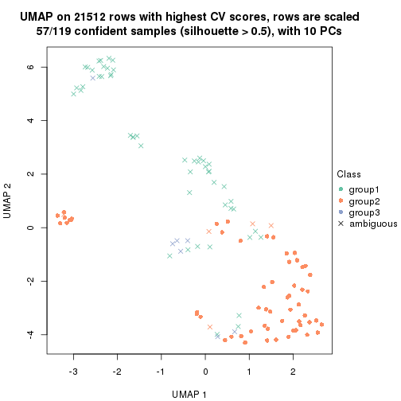</p>

</div>
<div id='tab-CV-pam-dimension-reduction-3'>
<pre><code class="r">dimension_reduction(res, k = 4, method = &quot;UMAP&quot;)
</code></pre>

<p></p>

</div>
<div id='tab-CV-pam-dimension-reduction-4'>
<pre><code class="r">dimension_reduction(res, k = 5, method = &quot;UMAP&quot;)
</code></pre>

<p></p>

</div>
<div id='tab-CV-pam-dimension-reduction-5'>
<pre><code class="r">dimension_reduction(res, k = 6, method = &quot;UMAP&quot;)
</code></pre>

<p></p>

</div>
</div>


Following heatmap shows how subgroups are split when increasing `k`:

```r
collect_classes(res)
```


Test correlation between subgroups and known annotations. If the known
annotation is numeric, one-way ANOVA test is applied, and if the known
annotation is discrete, chi-squared contingency table test is applied.

```r
test_to_known_factors(res)
```

```
#>          n disease.state(p) k
#> CV:pam 109         2.86e-09 2
#> CV:pam  57               NA 3
#> CV:pam  53         1.39e-11 4
#> CV:pam  71         5.82e-17 5
#> CV:pam  90         1.78e-28 6
```


If matrix rows can be associated to genes, consider to use `functional_enrichment(res,
...)` to perform function enrichment for the signature genes. See [this vignette](http://bioconductor.org/packages/devel/bioc/vignettes/cola/inst/doc/functional_enrichment.html) for more detailed explanations.


 

---------------------------------------------------


### CV:mclust


The object with results only for a single top-value method and a single partition method 
can be extracted as:

```r
res = res_list["CV", "mclust"]
# you can also extract it by
# res = res_list["CV:mclust"]
```

A summary of `res` and all the functions that can be applied to it:

```r
res
```

```
#> A 'ConsensusPartition' object with k = 2, 3, 4, 5, 6.
#>   On a matrix with 21512 rows and 119 columns.
#>   Top rows (1000, 2000, 3000, 4000, 5000) are extracted by 'CV' method.
#>   Subgroups are detected by 'mclust' method.
#>   Performed in total 1250 partitions by row resampling.
#>   Best k for subgroups seems to be 2.
#> 
#> Following methods can be applied to this 'ConsensusPartition' object:
#>  [1] "cola_report"             "collect_classes"         "collect_plots"          
#>  [4] "collect_stats"           "colnames"                "compare_signatures"     
#>  [7] "consensus_heatmap"       "dimension_reduction"     "functional_enrichment"  
#> [10] "get_anno_col"            "get_anno"                "get_classes"            
#> [13] "get_consensus"           "get_matrix"              "get_membership"         
#> [16] "get_param"               "get_signatures"          "get_stats"              
#> [19] "is_best_k"               "is_stable_k"             "membership_heatmap"     
#> [22] "ncol"                    "nrow"                    "plot_ecdf"              
#> [25] "rownames"                "select_partition_number" "show"                   
#> [28] "suggest_best_k"          "test_to_known_factors"
```

`collect_plots()` function collects all the plots made from `res` for all `k` (number of partitions)
into one single page to provide an easy and fast comparison between different `k`.

```r
collect_plots(res)
```


The plots are:

- The first row: a plot of the ECDF (empirical cumulative distribution
  function) curves of the consensus matrix for each `k` and the heatmap of
  predicted classes for each `k`.
- The second row: heatmaps of the consensus matrix for each `k`.
- The third row: heatmaps of the membership matrix for each `k`.
- The fouth row: heatmaps of the signatures for each `k`.

All the plots in panels can be made by individual functions and they are
plotted later in this section.

`select_partition_number()` produces several plots showing different
statistics for choosing "optimized" `k`. There are following statistics:

- ECDF curves of the consensus matrix for each `k`;
- 1-PAC. [The PAC
  score](https://en.wikipedia.org/wiki/Consensus_clustering#Over-interpretation_potential_of_consensus_clustering)
  measures the proportion of the ambiguous subgrouping.
- Mean silhouette score.
- Concordance. The mean probability of fiting the consensus class ids in all
  partitions.
- Area increased. Denote $A_k$ as the area under the ECDF curve for current
  `k`, the area increased is defined as $A_k - A_{k-1}$.
- Rand index. The percent of pairs of samples that are both in a same cluster
  or both are not in a same cluster in the partition of k and k-1.
- Jaccard index. The ratio of pairs of samples are both in a same cluster in
  the partition of k and k-1 and the pairs of samples are both in a same
  cluster in the partition k or k-1.

The detailed explanations of these statistics can be found in [the _cola_
vignette](http://bioconductor.org/packages/devel/bioc/vignettes/cola/inst/doc/cola.html#toc_13).

Generally speaking, lower PAC score, higher mean silhouette score or higher
concordance corresponds to better partition. Rand index and Jaccard index
measure how similar the current partition is compared to partition with `k-1`.
If they are too similar, we won't accept `k` is better than `k-1`.

```r
select_partition_number(res)
```


The numeric values for all these statistics can be obtained by `get_stats()`.

```r
get_stats(res)
```

```
#>   k 1-PAC mean_silhouette concordance area_increased  Rand Jaccard
#> 2 2 0.704           0.865       0.934         0.4753 0.545   0.545
#> 3 3 0.674           0.871       0.878         0.3228 0.778   0.599
#> 4 4 0.760           0.848       0.918         0.1235 0.900   0.728
#> 5 5 0.687           0.633       0.806         0.1040 0.917   0.720
#> 6 6 0.712           0.644       0.780         0.0436 0.878   0.528
```

`suggest_best_k()` suggests the best $k$ based on these statistics. The rules are as follows:

- All $k$ with Jaccard index larger than 0.95 are removed because increasing
  $k$ does not provide enough extra information. If all $k$ are removed, it is
  marked as no subgroup is detected.
- For all $k$ with 1-PAC score larger than 0.9, the maximal $k$ is taken as
  the best $k$, and other $k$ are marked as optional $k$.
- If it does not fit the second rule. The $k$ with the maximal vote of the
  highest 1-PAC score, highest mean silhouette, and highest concordance is
  taken as the best $k$.

```r
suggest_best_k(res)
```

```
#> [1] 2
```


Following shows the table of the partitions (You need to click the **show/hide
code output** link to see it). The membership matrix (columns with name `p*`)
is inferred by
[`clue::cl_consensus()`](https://www.rdocumentation.org/link/cl_consensus?package=clue)
function with the `SE` method. Basically the value in the membership matrix
represents the probability to belong to a certain group. The finall class
label for an item is determined with the group with highest probability it
belongs to.

In `get_classes()` function, the entropy is calculated from the membership
matrix and the silhouette score is calculated from the consensus matrix.


<script>
$( function() {
	$( '#tabs-CV-mclust-get-classes' ).tabs();
} );
</script>
<div id='tabs-CV-mclust-get-classes'>
<ul>
<li><a href='#tab-CV-mclust-get-classes-1'>k = 2</a></li>
<li><a href='#tab-CV-mclust-get-classes-2'>k = 3</a></li>
<li><a href='#tab-CV-mclust-get-classes-3'>k = 4</a></li>
<li><a href='#tab-CV-mclust-get-classes-4'>k = 5</a></li>
<li><a href='#tab-CV-mclust-get-classes-5'>k = 6</a></li>
</ul>

<div id='tab-CV-mclust-get-classes-1'>
<p><a id='tab-CV-mclust-get-classes-1-a' style='color:#0366d6' href='#'>show/hide code output</a></p>
<pre><code class="r">cbind(get_classes(res, k = 2), get_membership(res, k = 2))
</code></pre>

<pre><code>#&gt;           class entropy silhouette    p1    p2
#&gt; GSM120719     1  0.0000      0.999 1.000 0.000
#&gt; GSM120720     1  0.0000      0.999 1.000 0.000
#&gt; GSM120765     2  0.0000      0.889 0.000 1.000
#&gt; GSM120767     2  0.0000      0.889 0.000 1.000
#&gt; GSM120784     2  0.0000      0.889 0.000 1.000
#&gt; GSM121400     1  0.0000      0.999 1.000 0.000
#&gt; GSM121401     1  0.0000      0.999 1.000 0.000
#&gt; GSM121402     2  0.0000      0.889 0.000 1.000
#&gt; GSM121403     1  0.0000      0.999 1.000 0.000
#&gt; GSM121404     2  0.0000      0.889 0.000 1.000
#&gt; GSM121405     1  0.0000      0.999 1.000 0.000
#&gt; GSM121406     2  0.0000      0.889 0.000 1.000
#&gt; GSM121408     2  0.0000      0.889 0.000 1.000
#&gt; GSM121409     1  0.0000      0.999 1.000 0.000
#&gt; GSM121410     1  0.0000      0.999 1.000 0.000
#&gt; GSM121412     2  0.0000      0.889 0.000 1.000
#&gt; GSM121413     2  0.0000      0.889 0.000 1.000
#&gt; GSM121414     2  0.0000      0.889 0.000 1.000
#&gt; GSM121415     2  0.0000      0.889 0.000 1.000
#&gt; GSM121416     2  0.0000      0.889 0.000 1.000
#&gt; GSM120591     1  0.0000      0.999 1.000 0.000
#&gt; GSM120594     1  0.0000      0.999 1.000 0.000
#&gt; GSM120718     1  0.0000      0.999 1.000 0.000
#&gt; GSM121205     1  0.0000      0.999 1.000 0.000
#&gt; GSM121206     1  0.0000      0.999 1.000 0.000
#&gt; GSM121207     1  0.0000      0.999 1.000 0.000
#&gt; GSM121208     1  0.0000      0.999 1.000 0.000
#&gt; GSM121209     1  0.0000      0.999 1.000 0.000
#&gt; GSM121210     1  0.0000      0.999 1.000 0.000
#&gt; GSM121211     1  0.0000      0.999 1.000 0.000
#&gt; GSM121212     1  0.0000      0.999 1.000 0.000
#&gt; GSM121213     1  0.0000      0.999 1.000 0.000
#&gt; GSM121214     1  0.0000      0.999 1.000 0.000
#&gt; GSM121215     1  0.0000      0.999 1.000 0.000
#&gt; GSM121216     1  0.0000      0.999 1.000 0.000
#&gt; GSM121217     1  0.0000      0.999 1.000 0.000
#&gt; GSM121218     1  0.0000      0.999 1.000 0.000
#&gt; GSM121234     1  0.0000      0.999 1.000 0.000
#&gt; GSM121243     1  0.0000      0.999 1.000 0.000
#&gt; GSM121245     1  0.0000      0.999 1.000 0.000
#&gt; GSM121246     1  0.0000      0.999 1.000 0.000
#&gt; GSM121247     1  0.0000      0.999 1.000 0.000
#&gt; GSM121248     1  0.0000      0.999 1.000 0.000
#&gt; GSM120744     2  0.9635      0.521 0.388 0.612
#&gt; GSM120745     2  0.9635      0.521 0.388 0.612
#&gt; GSM120746     2  0.9635      0.521 0.388 0.612
#&gt; GSM120747     2  0.9635      0.521 0.388 0.612
#&gt; GSM120748     2  0.9635      0.521 0.388 0.612
#&gt; GSM120749     2  0.9635      0.521 0.388 0.612
#&gt; GSM120750     2  0.9635      0.521 0.388 0.612
#&gt; GSM120751     2  0.9635      0.521 0.388 0.612
#&gt; GSM120752     2  0.9635      0.521 0.388 0.612
#&gt; GSM121336     2  0.0000      0.889 0.000 1.000
#&gt; GSM121339     2  0.4939      0.799 0.108 0.892
#&gt; GSM121349     2  0.0000      0.889 0.000 1.000
#&gt; GSM121355     2  0.0000      0.889 0.000 1.000
#&gt; GSM120757     2  0.9635      0.521 0.388 0.612
#&gt; GSM120766     2  0.9635      0.521 0.388 0.612
#&gt; GSM120770     2  0.0000      0.889 0.000 1.000
#&gt; GSM120779     2  0.9635      0.521 0.388 0.612
#&gt; GSM120780     2  0.9635      0.521 0.388 0.612
#&gt; GSM121102     2  0.0000      0.889 0.000 1.000
#&gt; GSM121203     2  0.9635      0.521 0.388 0.612
#&gt; GSM121204     2  0.9635      0.521 0.388 0.612
#&gt; GSM121330     1  0.0000      0.999 1.000 0.000
#&gt; GSM121335     1  0.0000      0.999 1.000 0.000
#&gt; GSM121337     2  0.0000      0.889 0.000 1.000
#&gt; GSM121338     2  0.0672      0.883 0.008 0.992
#&gt; GSM121341     1  0.0000      0.999 1.000 0.000
#&gt; GSM121342     1  0.0000      0.999 1.000 0.000
#&gt; GSM121343     2  0.0000      0.889 0.000 1.000
#&gt; GSM121344     1  0.0000      0.999 1.000 0.000
#&gt; GSM121346     1  0.0000      0.999 1.000 0.000
#&gt; GSM121347     2  0.0000      0.889 0.000 1.000
#&gt; GSM121348     2  0.9170      0.594 0.332 0.668
#&gt; GSM121350     1  0.0000      0.999 1.000 0.000
#&gt; GSM121352     1  0.0000      0.999 1.000 0.000
#&gt; GSM121354     1  0.0000      0.999 1.000 0.000
#&gt; GSM120753     2  0.0000      0.889 0.000 1.000
#&gt; GSM120761     2  0.0000      0.889 0.000 1.000
#&gt; GSM120768     2  0.0000      0.889 0.000 1.000
#&gt; GSM120781     2  0.0000      0.889 0.000 1.000
#&gt; GSM120788     2  0.0000      0.889 0.000 1.000
#&gt; GSM120760     2  0.0000      0.889 0.000 1.000
#&gt; GSM120763     2  0.0000      0.889 0.000 1.000
#&gt; GSM120764     2  0.0000      0.889 0.000 1.000
#&gt; GSM120777     2  0.0000      0.889 0.000 1.000
#&gt; GSM120786     2  0.0000      0.889 0.000 1.000
#&gt; GSM121329     1  0.1843      0.965 0.972 0.028
#&gt; GSM121331     2  0.9635      0.521 0.388 0.612
#&gt; GSM121333     2  0.9635      0.521 0.388 0.612
#&gt; GSM121345     2  0.9635      0.521 0.388 0.612
#&gt; GSM121356     2  0.9635      0.521 0.388 0.612
#&gt; GSM120754     2  0.0000      0.889 0.000 1.000
#&gt; GSM120759     2  0.0000      0.889 0.000 1.000
#&gt; GSM120762     2  0.0000      0.889 0.000 1.000
#&gt; GSM120775     2  0.0000      0.889 0.000 1.000
#&gt; GSM120776     2  0.0000      0.889 0.000 1.000
#&gt; GSM120782     2  0.0000      0.889 0.000 1.000
#&gt; GSM120789     2  0.0000      0.889 0.000 1.000
#&gt; GSM120790     2  0.0000      0.889 0.000 1.000
#&gt; GSM120791     2  0.0000      0.889 0.000 1.000
#&gt; GSM120755     2  0.0000      0.889 0.000 1.000
#&gt; GSM120756     2  0.0000      0.889 0.000 1.000
#&gt; GSM120769     2  0.0000      0.889 0.000 1.000
#&gt; GSM120778     2  0.0000      0.889 0.000 1.000
#&gt; GSM120792     2  0.0000      0.889 0.000 1.000
#&gt; GSM121332     2  0.0000      0.889 0.000 1.000
#&gt; GSM121334     2  0.0000      0.889 0.000 1.000
#&gt; GSM121340     2  0.0000      0.889 0.000 1.000
#&gt; GSM121351     2  0.0000      0.889 0.000 1.000
#&gt; GSM121353     2  0.0938      0.881 0.012 0.988
#&gt; GSM120758     2  0.0000      0.889 0.000 1.000
#&gt; GSM120771     2  0.0000      0.889 0.000 1.000
#&gt; GSM120772     2  0.0000      0.889 0.000 1.000
#&gt; GSM120773     2  0.0000      0.889 0.000 1.000
#&gt; GSM120774     2  0.0000      0.889 0.000 1.000
#&gt; GSM120783     2  0.0000      0.889 0.000 1.000
#&gt; GSM120787     2  0.0000      0.889 0.000 1.000
</code></pre>

<script>
$('#tab-CV-mclust-get-classes-1-a').parent().next().next().hide();
$('#tab-CV-mclust-get-classes-1-a').click(function(){
  $('#tab-CV-mclust-get-classes-1-a').parent().next().next().toggle();
  return(false);
});
</script>
</div>

<div id='tab-CV-mclust-get-classes-2'>
<p><a id='tab-CV-mclust-get-classes-2-a' style='color:#0366d6' href='#'>show/hide code output</a></p>
<pre><code class="r">cbind(get_classes(res, k = 3), get_membership(res, k = 3))
</code></pre>

<pre><code>#&gt;           class entropy silhouette    p1    p2    p3
#&gt; GSM120719     1  0.5465      0.846 0.712 0.000 0.288
#&gt; GSM120720     1  0.5529      0.851 0.704 0.000 0.296
#&gt; GSM120765     2  0.1031      0.969 0.000 0.976 0.024
#&gt; GSM120767     2  0.1031      0.969 0.000 0.976 0.024
#&gt; GSM120784     2  0.1411      0.961 0.000 0.964 0.036
#&gt; GSM121400     1  0.5988      0.786 0.632 0.000 0.368
#&gt; GSM121401     1  0.5560      0.849 0.700 0.000 0.300
#&gt; GSM121402     2  0.0747      0.973 0.000 0.984 0.016
#&gt; GSM121403     3  0.6027      0.121 0.272 0.016 0.712
#&gt; GSM121404     3  0.5058      0.844 0.000 0.244 0.756
#&gt; GSM121405     1  0.5650      0.841 0.688 0.000 0.312
#&gt; GSM121406     2  0.0892      0.971 0.000 0.980 0.020
#&gt; GSM121408     2  0.1031      0.969 0.000 0.976 0.024
#&gt; GSM121409     3  0.6468     -0.468 0.444 0.004 0.552
#&gt; GSM121410     1  0.6111      0.752 0.604 0.000 0.396
#&gt; GSM121412     2  0.1163      0.966 0.000 0.972 0.028
#&gt; GSM121413     2  0.1031      0.969 0.000 0.976 0.024
#&gt; GSM121414     2  0.1031      0.969 0.000 0.976 0.024
#&gt; GSM121415     2  0.1163      0.966 0.000 0.972 0.028
#&gt; GSM121416     2  0.0592      0.974 0.000 0.988 0.012
#&gt; GSM120591     1  0.5591      0.846 0.696 0.000 0.304
#&gt; GSM120594     1  0.5497      0.852 0.708 0.000 0.292
#&gt; GSM120718     1  0.5465      0.853 0.712 0.000 0.288
#&gt; GSM121205     1  0.0000      0.842 1.000 0.000 0.000
#&gt; GSM121206     1  0.0000      0.842 1.000 0.000 0.000
#&gt; GSM121207     1  0.0424      0.843 0.992 0.000 0.008
#&gt; GSM121208     1  0.5431      0.854 0.716 0.000 0.284
#&gt; GSM121209     1  0.0000      0.842 1.000 0.000 0.000
#&gt; GSM121210     1  0.0424      0.843 0.992 0.000 0.008
#&gt; GSM121211     1  0.0000      0.842 1.000 0.000 0.000
#&gt; GSM121212     1  0.0000      0.842 1.000 0.000 0.000
#&gt; GSM121213     1  0.0000      0.842 1.000 0.000 0.000
#&gt; GSM121214     1  0.0000      0.842 1.000 0.000 0.000
#&gt; GSM121215     1  0.0000      0.842 1.000 0.000 0.000
#&gt; GSM121216     1  0.1031      0.840 0.976 0.000 0.024
#&gt; GSM121217     1  0.0000      0.842 1.000 0.000 0.000
#&gt; GSM121218     1  0.0000      0.842 1.000 0.000 0.000
#&gt; GSM121234     1  0.0000      0.842 1.000 0.000 0.000
#&gt; GSM121243     1  0.0237      0.843 0.996 0.000 0.004
#&gt; GSM121245     1  0.0237      0.843 0.996 0.000 0.004
#&gt; GSM121246     1  0.5397      0.854 0.720 0.000 0.280
#&gt; GSM121247     1  0.3375      0.837 0.892 0.008 0.100
#&gt; GSM121248     1  0.0000      0.842 1.000 0.000 0.000
#&gt; GSM120744     3  0.3879      0.877 0.000 0.152 0.848
#&gt; GSM120745     3  0.3816      0.876 0.000 0.148 0.852
#&gt; GSM120746     3  0.3816      0.876 0.000 0.148 0.852
#&gt; GSM120747     3  0.3816      0.876 0.000 0.148 0.852
#&gt; GSM120748     3  0.3816      0.876 0.000 0.148 0.852
#&gt; GSM120749     3  0.3816      0.876 0.000 0.148 0.852
#&gt; GSM120750     3  0.3816      0.876 0.000 0.148 0.852
#&gt; GSM120751     3  0.3816      0.876 0.000 0.148 0.852
#&gt; GSM120752     3  0.3816      0.876 0.000 0.148 0.852
#&gt; GSM121336     2  0.1031      0.969 0.000 0.976 0.024
#&gt; GSM121339     3  0.3941      0.848 0.000 0.156 0.844
#&gt; GSM121349     2  0.0747      0.973 0.000 0.984 0.016
#&gt; GSM121355     2  0.1163      0.966 0.000 0.972 0.028
#&gt; GSM120757     3  0.4974      0.869 0.000 0.236 0.764
#&gt; GSM120766     3  0.4974      0.869 0.000 0.236 0.764
#&gt; GSM120770     3  0.6274      0.473 0.000 0.456 0.544
#&gt; GSM120779     3  0.4974      0.869 0.000 0.236 0.764
#&gt; GSM120780     3  0.4178      0.879 0.000 0.172 0.828
#&gt; GSM121102     3  0.4702      0.869 0.000 0.212 0.788
#&gt; GSM121203     3  0.3816      0.876 0.000 0.148 0.852
#&gt; GSM121204     3  0.4974      0.869 0.000 0.236 0.764
#&gt; GSM121330     1  0.5529      0.851 0.704 0.000 0.296
#&gt; GSM121335     1  0.5497      0.852 0.708 0.000 0.292
#&gt; GSM121337     3  0.6244      0.524 0.000 0.440 0.560
#&gt; GSM121338     3  0.4178      0.878 0.000 0.172 0.828
#&gt; GSM121341     1  0.5465      0.853 0.712 0.000 0.288
#&gt; GSM121342     1  0.5465      0.853 0.712 0.000 0.288
#&gt; GSM121343     3  0.4121      0.879 0.000 0.168 0.832
#&gt; GSM121344     1  0.5497      0.852 0.708 0.000 0.292
#&gt; GSM121346     1  0.5497      0.852 0.708 0.000 0.292
#&gt; GSM121347     3  0.6308      0.430 0.000 0.492 0.508
#&gt; GSM121348     3  0.4931      0.868 0.000 0.232 0.768
#&gt; GSM121350     1  0.5560      0.849 0.700 0.000 0.300
#&gt; GSM121352     1  0.5529      0.851 0.704 0.000 0.296
#&gt; GSM121354     1  0.5497      0.852 0.708 0.000 0.292
#&gt; GSM120753     2  0.0747      0.973 0.000 0.984 0.016
#&gt; GSM120761     2  0.0424      0.973 0.000 0.992 0.008
#&gt; GSM120768     2  0.0592      0.971 0.000 0.988 0.012
#&gt; GSM120781     2  0.0424      0.974 0.000 0.992 0.008
#&gt; GSM120788     2  0.1529      0.945 0.000 0.960 0.040
#&gt; GSM120760     2  0.0424      0.973 0.000 0.992 0.008
#&gt; GSM120763     2  0.0424      0.973 0.000 0.992 0.008
#&gt; GSM120764     2  0.0592      0.971 0.000 0.988 0.012
#&gt; GSM120777     2  0.1529      0.945 0.000 0.960 0.040
#&gt; GSM120786     2  0.0592      0.971 0.000 0.988 0.012
#&gt; GSM121329     1  0.6326      0.822 0.688 0.020 0.292
#&gt; GSM121331     3  0.4974      0.869 0.000 0.236 0.764
#&gt; GSM121333     3  0.4974      0.869 0.000 0.236 0.764
#&gt; GSM121345     3  0.4974      0.869 0.000 0.236 0.764
#&gt; GSM121356     3  0.4974      0.869 0.000 0.236 0.764
#&gt; GSM120754     2  0.1860      0.929 0.000 0.948 0.052
#&gt; GSM120759     2  0.0237      0.974 0.000 0.996 0.004
#&gt; GSM120762     2  0.0000      0.973 0.000 1.000 0.000
#&gt; GSM120775     2  0.1529      0.945 0.000 0.960 0.040
#&gt; GSM120776     3  0.5254      0.842 0.000 0.264 0.736
#&gt; GSM120782     2  0.4605      0.687 0.000 0.796 0.204
#&gt; GSM120789     2  0.0237      0.974 0.000 0.996 0.004
#&gt; GSM120790     2  0.0237      0.973 0.000 0.996 0.004
#&gt; GSM120791     2  0.0592      0.971 0.000 0.988 0.012
#&gt; GSM120755     2  0.0892      0.971 0.000 0.980 0.020
#&gt; GSM120756     2  0.1529      0.945 0.000 0.960 0.040
#&gt; GSM120769     2  0.0000      0.973 0.000 1.000 0.000
#&gt; GSM120778     2  0.0000      0.973 0.000 1.000 0.000
#&gt; GSM120792     2  0.0592      0.971 0.000 0.988 0.012
#&gt; GSM121332     2  0.0747      0.973 0.000 0.984 0.016
#&gt; GSM121334     2  0.0237      0.973 0.000 0.996 0.004
#&gt; GSM121340     2  0.0424      0.973 0.000 0.992 0.008
#&gt; GSM121351     2  0.0747      0.973 0.000 0.984 0.016
#&gt; GSM121353     2  0.1411      0.947 0.000 0.964 0.036
#&gt; GSM120758     2  0.0237      0.974 0.000 0.996 0.004
#&gt; GSM120771     2  0.0747      0.974 0.000 0.984 0.016
#&gt; GSM120772     2  0.0000      0.973 0.000 1.000 0.000
#&gt; GSM120773     2  0.0424      0.973 0.000 0.992 0.008
#&gt; GSM120774     2  0.0000      0.973 0.000 1.000 0.000
#&gt; GSM120783     2  0.0424      0.973 0.000 0.992 0.008
#&gt; GSM120787     2  0.0000      0.973 0.000 1.000 0.000
</code></pre>

<script>
$('#tab-CV-mclust-get-classes-2-a').parent().next().next().hide();
$('#tab-CV-mclust-get-classes-2-a').click(function(){
  $('#tab-CV-mclust-get-classes-2-a').parent().next().next().toggle();
  return(false);
});
</script>
</div>

<div id='tab-CV-mclust-get-classes-3'>
<p><a id='tab-CV-mclust-get-classes-3-a' style='color:#0366d6' href='#'>show/hide code output</a></p>
<pre><code class="r">cbind(get_classes(res, k = 4), get_membership(res, k = 4))
</code></pre>

<pre><code>#&gt;           class entropy silhouette    p1    p2    p3    p4
#&gt; GSM120719     1  0.3791     0.7500 0.796 0.000 0.200 0.004
#&gt; GSM120720     1  0.0188     0.8793 0.996 0.000 0.000 0.004
#&gt; GSM120765     2  0.2760     0.8754 0.000 0.872 0.128 0.000
#&gt; GSM120767     2  0.0336     0.8996 0.000 0.992 0.008 0.000
#&gt; GSM120784     2  0.3356     0.8466 0.000 0.824 0.176 0.000
#&gt; GSM121400     1  0.3356     0.7709 0.824 0.000 0.176 0.000
#&gt; GSM121401     1  0.0000     0.8790 1.000 0.000 0.000 0.000
#&gt; GSM121402     2  0.0188     0.9000 0.000 0.996 0.004 0.000
#&gt; GSM121403     1  0.4985     0.2462 0.532 0.000 0.468 0.000
#&gt; GSM121404     3  0.5404    -0.0401 0.012 0.476 0.512 0.000
#&gt; GSM121405     1  0.0000     0.8790 1.000 0.000 0.000 0.000
#&gt; GSM121406     2  0.0524     0.8989 0.000 0.988 0.008 0.004
#&gt; GSM121408     2  0.0524     0.8989 0.000 0.988 0.008 0.004
#&gt; GSM121409     1  0.4866     0.4157 0.596 0.000 0.404 0.000
#&gt; GSM121410     1  0.4304     0.6429 0.716 0.000 0.284 0.000
#&gt; GSM121412     2  0.0524     0.8989 0.000 0.988 0.008 0.004
#&gt; GSM121413     2  0.0336     0.8996 0.000 0.992 0.008 0.000
#&gt; GSM121414     2  0.0524     0.8989 0.000 0.988 0.008 0.004
#&gt; GSM121415     2  0.0779     0.9008 0.000 0.980 0.016 0.004
#&gt; GSM121416     2  0.1716     0.8955 0.000 0.936 0.064 0.000
#&gt; GSM120591     1  0.1004     0.8691 0.972 0.000 0.024 0.004
#&gt; GSM120594     1  0.0188     0.8793 0.996 0.000 0.000 0.004
#&gt; GSM120718     1  0.0592     0.8724 0.984 0.000 0.000 0.016
#&gt; GSM121205     4  0.0188     0.9440 0.004 0.000 0.000 0.996
#&gt; GSM121206     4  0.0188     0.9440 0.004 0.000 0.000 0.996
#&gt; GSM121207     4  0.2589     0.8982 0.116 0.000 0.000 0.884
#&gt; GSM121208     1  0.0188     0.8793 0.996 0.000 0.000 0.004
#&gt; GSM121209     4  0.0188     0.9440 0.004 0.000 0.000 0.996
#&gt; GSM121210     4  0.3486     0.8301 0.188 0.000 0.000 0.812
#&gt; GSM121211     4  0.0188     0.9440 0.004 0.000 0.000 0.996
#&gt; GSM121212     4  0.2704     0.8936 0.124 0.000 0.000 0.876
#&gt; GSM121213     4  0.0188     0.9440 0.004 0.000 0.000 0.996
#&gt; GSM121214     4  0.0188     0.9440 0.004 0.000 0.000 0.996
#&gt; GSM121215     4  0.0188     0.9440 0.004 0.000 0.000 0.996
#&gt; GSM121216     4  0.3074     0.8723 0.152 0.000 0.000 0.848
#&gt; GSM121217     4  0.0188     0.9440 0.004 0.000 0.000 0.996
#&gt; GSM121218     4  0.0188     0.9440 0.004 0.000 0.000 0.996
#&gt; GSM121234     4  0.0336     0.9429 0.008 0.000 0.000 0.992
#&gt; GSM121243     4  0.3172     0.8645 0.160 0.000 0.000 0.840
#&gt; GSM121245     4  0.2921     0.8822 0.140 0.000 0.000 0.860
#&gt; GSM121246     1  0.0188     0.8793 0.996 0.000 0.000 0.004
#&gt; GSM121247     1  0.7357     0.3948 0.524 0.000 0.216 0.260
#&gt; GSM121248     4  0.0188     0.9440 0.004 0.000 0.000 0.996
#&gt; GSM120744     3  0.0592     0.9308 0.016 0.000 0.984 0.000
#&gt; GSM120745     3  0.0592     0.9308 0.016 0.000 0.984 0.000
#&gt; GSM120746     3  0.0592     0.9308 0.016 0.000 0.984 0.000
#&gt; GSM120747     3  0.0592     0.9308 0.016 0.000 0.984 0.000
#&gt; GSM120748     3  0.0592     0.9308 0.016 0.000 0.984 0.000
#&gt; GSM120749     3  0.0592     0.9308 0.016 0.000 0.984 0.000
#&gt; GSM120750     3  0.0592     0.9308 0.016 0.000 0.984 0.000
#&gt; GSM120751     3  0.0592     0.9308 0.016 0.000 0.984 0.000
#&gt; GSM120752     3  0.0592     0.9308 0.016 0.000 0.984 0.000
#&gt; GSM121336     2  0.0336     0.8996 0.000 0.992 0.008 0.000
#&gt; GSM121339     2  0.6840     0.0125 0.100 0.468 0.432 0.000
#&gt; GSM121349     2  0.0336     0.8996 0.000 0.992 0.008 0.000
#&gt; GSM121355     2  0.0524     0.8989 0.000 0.988 0.008 0.004
#&gt; GSM120757     3  0.0336     0.9300 0.000 0.008 0.992 0.000
#&gt; GSM120766     3  0.0336     0.9300 0.000 0.008 0.992 0.000
#&gt; GSM120770     3  0.1940     0.8760 0.000 0.076 0.924 0.000
#&gt; GSM120779     3  0.0336     0.9300 0.000 0.008 0.992 0.000
#&gt; GSM120780     3  0.0592     0.9308 0.016 0.000 0.984 0.000
#&gt; GSM121102     3  0.2125     0.8772 0.004 0.076 0.920 0.000
#&gt; GSM121203     3  0.1182     0.9215 0.016 0.016 0.968 0.000
#&gt; GSM121204     3  0.0336     0.9300 0.000 0.008 0.992 0.000
#&gt; GSM121330     1  0.0000     0.8790 1.000 0.000 0.000 0.000
#&gt; GSM121335     1  0.0188     0.8793 0.996 0.000 0.000 0.004
#&gt; GSM121337     2  0.4877     0.3992 0.000 0.592 0.408 0.000
#&gt; GSM121338     3  0.4720     0.6258 0.016 0.264 0.720 0.000
#&gt; GSM121341     1  0.0188     0.8793 0.996 0.000 0.000 0.004
#&gt; GSM121342     1  0.0188     0.8793 0.996 0.000 0.000 0.004
#&gt; GSM121343     3  0.3695     0.7872 0.016 0.156 0.828 0.000
#&gt; GSM121344     1  0.0188     0.8793 0.996 0.000 0.000 0.004
#&gt; GSM121346     1  0.0000     0.8790 1.000 0.000 0.000 0.000
#&gt; GSM121347     2  0.4933     0.3130 0.000 0.568 0.432 0.000
#&gt; GSM121348     3  0.0336     0.9300 0.000 0.008 0.992 0.000
#&gt; GSM121350     1  0.0000     0.8790 1.000 0.000 0.000 0.000
#&gt; GSM121352     1  0.0188     0.8793 0.996 0.000 0.000 0.004
#&gt; GSM121354     1  0.0188     0.8793 0.996 0.000 0.000 0.004
#&gt; GSM120753     2  0.0188     0.9000 0.000 0.996 0.004 0.000
#&gt; GSM120761     2  0.3172     0.8583 0.000 0.840 0.160 0.000
#&gt; GSM120768     2  0.3219     0.8573 0.000 0.836 0.164 0.000
#&gt; GSM120781     2  0.1389     0.8995 0.000 0.952 0.048 0.000
#&gt; GSM120788     2  0.3400     0.8467 0.000 0.820 0.180 0.000
#&gt; GSM120760     2  0.2921     0.8689 0.000 0.860 0.140 0.000
#&gt; GSM120763     2  0.3219     0.8573 0.000 0.836 0.164 0.000
#&gt; GSM120764     2  0.3266     0.8546 0.000 0.832 0.168 0.000
#&gt; GSM120777     2  0.3400     0.8462 0.000 0.820 0.180 0.000
#&gt; GSM120786     2  0.3266     0.8546 0.000 0.832 0.168 0.000
#&gt; GSM121329     1  0.4372     0.6684 0.728 0.000 0.268 0.004
#&gt; GSM121331     3  0.0336     0.9300 0.000 0.008 0.992 0.000
#&gt; GSM121333     3  0.0336     0.9300 0.000 0.008 0.992 0.000
#&gt; GSM121345     3  0.0592     0.9273 0.000 0.016 0.984 0.000
#&gt; GSM121356     3  0.0592     0.9284 0.000 0.016 0.984 0.000
#&gt; GSM120754     2  0.3356     0.8494 0.000 0.824 0.176 0.000
#&gt; GSM120759     2  0.0000     0.9000 0.000 1.000 0.000 0.000
#&gt; GSM120762     2  0.0000     0.9000 0.000 1.000 0.000 0.000
#&gt; GSM120775     2  0.3400     0.8467 0.000 0.820 0.180 0.000
#&gt; GSM120776     3  0.0592     0.9261 0.000 0.016 0.984 0.000
#&gt; GSM120782     2  0.4917     0.6197 0.008 0.656 0.336 0.000
#&gt; GSM120789     2  0.0188     0.8996 0.000 0.996 0.000 0.004
#&gt; GSM120790     2  0.0336     0.9011 0.000 0.992 0.008 0.000
#&gt; GSM120791     2  0.3219     0.8573 0.000 0.836 0.164 0.000
#&gt; GSM120755     2  0.0524     0.8989 0.000 0.988 0.008 0.004
#&gt; GSM120756     2  0.3444     0.8434 0.000 0.816 0.184 0.000
#&gt; GSM120769     2  0.0000     0.9000 0.000 1.000 0.000 0.000
#&gt; GSM120778     2  0.0779     0.9002 0.000 0.980 0.016 0.004
#&gt; GSM120792     2  0.1022     0.9009 0.000 0.968 0.032 0.000
#&gt; GSM121332     2  0.0376     0.8996 0.000 0.992 0.004 0.004
#&gt; GSM121334     2  0.0000     0.9000 0.000 1.000 0.000 0.000
#&gt; GSM121340     2  0.2197     0.8903 0.000 0.916 0.080 0.004
#&gt; GSM121351     2  0.0188     0.9000 0.000 0.996 0.004 0.000
#&gt; GSM121353     2  0.2831     0.8761 0.000 0.876 0.120 0.004
#&gt; GSM120758     2  0.1302     0.8991 0.000 0.956 0.044 0.000
#&gt; GSM120771     2  0.1211     0.9007 0.000 0.960 0.040 0.000
#&gt; GSM120772     2  0.0000     0.9000 0.000 1.000 0.000 0.000
#&gt; GSM120773     2  0.3172     0.8596 0.000 0.840 0.160 0.000
#&gt; GSM120774     2  0.0817     0.9009 0.000 0.976 0.024 0.000
#&gt; GSM120783     2  0.3219     0.8573 0.000 0.836 0.164 0.000
#&gt; GSM120787     2  0.0188     0.9002 0.000 0.996 0.004 0.000
</code></pre>

<script>
$('#tab-CV-mclust-get-classes-3-a').parent().next().next().hide();
$('#tab-CV-mclust-get-classes-3-a').click(function(){
  $('#tab-CV-mclust-get-classes-3-a').parent().next().next().toggle();
  return(false);
});
</script>
</div>

<div id='tab-CV-mclust-get-classes-4'>
<p><a id='tab-CV-mclust-get-classes-4-a' style='color:#0366d6' href='#'>show/hide code output</a></p>
<pre><code class="r">cbind(get_classes(res, k = 5), get_membership(res, k = 5))
</code></pre>

<pre><code>#&gt;           class entropy silhouette    p1    p2    p3    p4    p5
#&gt; GSM120719     3  0.7085      0.454 0.204 0.048 0.528 0.000 0.220
#&gt; GSM120720     3  0.0794      0.879 0.028 0.000 0.972 0.000 0.000
#&gt; GSM120765     2  0.4251      0.459 0.000 0.672 0.000 0.316 0.012
#&gt; GSM120767     4  0.2280      0.548 0.000 0.120 0.000 0.880 0.000
#&gt; GSM120784     2  0.4761      0.540 0.000 0.728 0.000 0.168 0.104
#&gt; GSM121400     3  0.2773      0.761 0.000 0.000 0.836 0.000 0.164
#&gt; GSM121401     3  0.0000      0.890 0.000 0.000 1.000 0.000 0.000
#&gt; GSM121402     4  0.4242     -0.233 0.000 0.428 0.000 0.572 0.000
#&gt; GSM121403     3  0.5243      0.399 0.000 0.048 0.596 0.004 0.352
#&gt; GSM121404     2  0.7277      0.371 0.000 0.456 0.036 0.228 0.280
#&gt; GSM121405     3  0.0000      0.890 0.000 0.000 1.000 0.000 0.000
#&gt; GSM121406     4  0.4268     -0.227 0.000 0.444 0.000 0.556 0.000
#&gt; GSM121408     4  0.1478      0.592 0.000 0.064 0.000 0.936 0.000
#&gt; GSM121409     3  0.4891      0.490 0.000 0.044 0.640 0.000 0.316
#&gt; GSM121410     3  0.3845      0.688 0.000 0.024 0.768 0.000 0.208
#&gt; GSM121412     4  0.4287     -0.257 0.000 0.460 0.000 0.540 0.000
#&gt; GSM121413     2  0.4307      0.261 0.000 0.504 0.000 0.496 0.000
#&gt; GSM121414     4  0.4287     -0.257 0.000 0.460 0.000 0.540 0.000
#&gt; GSM121415     2  0.4304      0.278 0.000 0.516 0.000 0.484 0.000
#&gt; GSM121416     2  0.4211      0.442 0.000 0.636 0.000 0.360 0.004
#&gt; GSM120591     3  0.0324      0.888 0.000 0.004 0.992 0.000 0.004
#&gt; GSM120594     3  0.0000      0.890 0.000 0.000 1.000 0.000 0.000
#&gt; GSM120718     3  0.2230      0.812 0.116 0.000 0.884 0.000 0.000
#&gt; GSM121205     1  0.0000      0.973 1.000 0.000 0.000 0.000 0.000
#&gt; GSM121206     1  0.0000      0.973 1.000 0.000 0.000 0.000 0.000
#&gt; GSM121207     1  0.0000      0.973 1.000 0.000 0.000 0.000 0.000
#&gt; GSM121208     3  0.0290      0.888 0.000 0.008 0.992 0.000 0.000
#&gt; GSM121209     1  0.0000      0.973 1.000 0.000 0.000 0.000 0.000
#&gt; GSM121210     1  0.0162      0.969 0.996 0.000 0.004 0.000 0.000
#&gt; GSM121211     1  0.0000      0.973 1.000 0.000 0.000 0.000 0.000
#&gt; GSM121212     1  0.0000      0.973 1.000 0.000 0.000 0.000 0.000
#&gt; GSM121213     1  0.0000      0.973 1.000 0.000 0.000 0.000 0.000
#&gt; GSM121214     1  0.0000      0.973 1.000 0.000 0.000 0.000 0.000
#&gt; GSM121215     1  0.0000      0.973 1.000 0.000 0.000 0.000 0.000
#&gt; GSM121216     1  0.0000      0.973 1.000 0.000 0.000 0.000 0.000
#&gt; GSM121217     1  0.0000      0.973 1.000 0.000 0.000 0.000 0.000
#&gt; GSM121218     1  0.0000      0.973 1.000 0.000 0.000 0.000 0.000
#&gt; GSM121234     1  0.0000      0.973 1.000 0.000 0.000 0.000 0.000
#&gt; GSM121243     1  0.0000      0.973 1.000 0.000 0.000 0.000 0.000
#&gt; GSM121245     1  0.0000      0.973 1.000 0.000 0.000 0.000 0.000
#&gt; GSM121246     3  0.0451      0.887 0.004 0.008 0.988 0.000 0.000
#&gt; GSM121247     1  0.6700      0.354 0.564 0.032 0.188 0.000 0.216
#&gt; GSM121248     1  0.0000      0.973 1.000 0.000 0.000 0.000 0.000
#&gt; GSM120744     5  0.1648      0.820 0.000 0.020 0.040 0.000 0.940
#&gt; GSM120745     5  0.2153      0.811 0.000 0.040 0.044 0.000 0.916
#&gt; GSM120746     5  0.2153      0.811 0.000 0.040 0.044 0.000 0.916
#&gt; GSM120747     5  0.2153      0.811 0.000 0.040 0.044 0.000 0.916
#&gt; GSM120748     5  0.2230      0.814 0.000 0.044 0.044 0.000 0.912
#&gt; GSM120749     5  0.2153      0.811 0.000 0.040 0.044 0.000 0.916
#&gt; GSM120750     5  0.2153      0.811 0.000 0.040 0.044 0.000 0.916
#&gt; GSM120751     5  0.2153      0.811 0.000 0.040 0.044 0.000 0.916
#&gt; GSM120752     5  0.2153      0.811 0.000 0.040 0.044 0.000 0.916
#&gt; GSM121336     4  0.1544      0.589 0.000 0.068 0.000 0.932 0.000
#&gt; GSM121339     2  0.8222      0.299 0.000 0.380 0.132 0.240 0.248
#&gt; GSM121349     4  0.1197      0.603 0.000 0.048 0.000 0.952 0.000
#&gt; GSM121355     4  0.1732      0.578 0.000 0.080 0.000 0.920 0.000
#&gt; GSM120757     5  0.2605      0.811 0.000 0.148 0.000 0.000 0.852
#&gt; GSM120766     5  0.2605      0.811 0.000 0.148 0.000 0.000 0.852
#&gt; GSM120770     5  0.4614      0.719 0.000 0.224 0.032 0.016 0.728
#&gt; GSM120779     5  0.2773      0.807 0.000 0.164 0.000 0.000 0.836
#&gt; GSM120780     5  0.1981      0.823 0.000 0.048 0.028 0.000 0.924
#&gt; GSM121102     5  0.4925      0.720 0.000 0.152 0.020 0.084 0.744
#&gt; GSM121203     5  0.3549      0.811 0.000 0.076 0.040 0.032 0.852
#&gt; GSM121204     5  0.2930      0.810 0.000 0.164 0.004 0.000 0.832
#&gt; GSM121330     3  0.0000      0.890 0.000 0.000 1.000 0.000 0.000
#&gt; GSM121335     3  0.0000      0.890 0.000 0.000 1.000 0.000 0.000
#&gt; GSM121337     2  0.6521      0.484 0.000 0.512 0.004 0.220 0.264
#&gt; GSM121338     5  0.7401      0.287 0.000 0.224 0.068 0.208 0.500
#&gt; GSM121341     3  0.0290      0.888 0.008 0.000 0.992 0.000 0.000
#&gt; GSM121342     3  0.0794      0.879 0.028 0.000 0.972 0.000 0.000
#&gt; GSM121343     5  0.6932      0.377 0.000 0.248 0.044 0.168 0.540
#&gt; GSM121344     3  0.0000      0.890 0.000 0.000 1.000 0.000 0.000
#&gt; GSM121346     3  0.0000      0.890 0.000 0.000 1.000 0.000 0.000
#&gt; GSM121347     2  0.6328      0.521 0.000 0.528 0.000 0.228 0.244
#&gt; GSM121348     5  0.3132      0.803 0.000 0.172 0.000 0.008 0.820
#&gt; GSM121350     3  0.0000      0.890 0.000 0.000 1.000 0.000 0.000
#&gt; GSM121352     3  0.0000      0.890 0.000 0.000 1.000 0.000 0.000
#&gt; GSM121354     3  0.0000      0.890 0.000 0.000 1.000 0.000 0.000
#&gt; GSM120753     4  0.1671      0.605 0.000 0.076 0.000 0.924 0.000
#&gt; GSM120761     2  0.5109     -0.189 0.000 0.504 0.000 0.460 0.036
#&gt; GSM120768     4  0.4731      0.440 0.000 0.328 0.000 0.640 0.032
#&gt; GSM120781     4  0.1608      0.611 0.000 0.072 0.000 0.928 0.000
#&gt; GSM120788     4  0.5527      0.331 0.000 0.388 0.000 0.540 0.072
#&gt; GSM120760     4  0.4835      0.405 0.000 0.380 0.000 0.592 0.028
#&gt; GSM120763     4  0.4856      0.401 0.000 0.388 0.000 0.584 0.028
#&gt; GSM120764     4  0.5028      0.384 0.000 0.400 0.000 0.564 0.036
#&gt; GSM120777     4  0.5476      0.344 0.000 0.388 0.000 0.544 0.068
#&gt; GSM120786     4  0.4966      0.383 0.000 0.404 0.000 0.564 0.032
#&gt; GSM121329     3  0.6989      0.489 0.164 0.060 0.556 0.000 0.220
#&gt; GSM121331     5  0.2891      0.802 0.000 0.176 0.000 0.000 0.824
#&gt; GSM121333     5  0.2773      0.807 0.000 0.164 0.000 0.000 0.836
#&gt; GSM121345     5  0.3242      0.777 0.000 0.216 0.000 0.000 0.784
#&gt; GSM121356     5  0.2970      0.805 0.000 0.168 0.000 0.004 0.828
#&gt; GSM120754     2  0.5060      0.399 0.000 0.684 0.000 0.224 0.092
#&gt; GSM120759     4  0.2891      0.367 0.000 0.176 0.000 0.824 0.000
#&gt; GSM120762     4  0.0162      0.613 0.000 0.004 0.000 0.996 0.000
#&gt; GSM120775     4  0.5510      0.340 0.000 0.380 0.000 0.548 0.072
#&gt; GSM120776     5  0.4302      0.312 0.000 0.480 0.000 0.000 0.520
#&gt; GSM120782     2  0.5824      0.468 0.000 0.660 0.020 0.176 0.144
#&gt; GSM120789     4  0.0290      0.612 0.000 0.008 0.000 0.992 0.000
#&gt; GSM120790     2  0.4262      0.261 0.000 0.560 0.000 0.440 0.000
#&gt; GSM120791     4  0.4930      0.398 0.000 0.388 0.000 0.580 0.032
#&gt; GSM120755     4  0.1270      0.599 0.000 0.052 0.000 0.948 0.000
#&gt; GSM120756     4  0.5579      0.334 0.000 0.368 0.000 0.552 0.080
#&gt; GSM120769     4  0.0000      0.614 0.000 0.000 0.000 1.000 0.000
#&gt; GSM120778     4  0.0912      0.619 0.000 0.016 0.000 0.972 0.012
#&gt; GSM120792     4  0.1399      0.616 0.000 0.028 0.000 0.952 0.020
#&gt; GSM121332     4  0.0880      0.603 0.000 0.032 0.000 0.968 0.000
#&gt; GSM121334     4  0.3305      0.504 0.000 0.224 0.000 0.776 0.000
#&gt; GSM121340     4  0.2388      0.603 0.000 0.072 0.000 0.900 0.028
#&gt; GSM121351     4  0.3424      0.259 0.000 0.240 0.000 0.760 0.000
#&gt; GSM121353     4  0.3410      0.540 0.000 0.092 0.000 0.840 0.068
#&gt; GSM120758     4  0.2074      0.590 0.000 0.104 0.000 0.896 0.000
#&gt; GSM120771     2  0.4300      0.245 0.000 0.524 0.000 0.476 0.000
#&gt; GSM120772     4  0.0963      0.617 0.000 0.036 0.000 0.964 0.000
#&gt; GSM120773     4  0.4798      0.392 0.000 0.396 0.000 0.580 0.024
#&gt; GSM120774     4  0.0798      0.618 0.000 0.016 0.000 0.976 0.008
#&gt; GSM120783     4  0.4856      0.401 0.000 0.388 0.000 0.584 0.028
#&gt; GSM120787     4  0.0451      0.616 0.000 0.008 0.000 0.988 0.004
</code></pre>

<script>
$('#tab-CV-mclust-get-classes-4-a').parent().next().next().hide();
$('#tab-CV-mclust-get-classes-4-a').click(function(){
  $('#tab-CV-mclust-get-classes-4-a').parent().next().next().toggle();
  return(false);
});
</script>
</div>

<div id='tab-CV-mclust-get-classes-5'>
<p><a id='tab-CV-mclust-get-classes-5-a' style='color:#0366d6' href='#'>show/hide code output</a></p>
<pre><code class="r">cbind(get_classes(res, k = 6), get_membership(res, k = 6))
</code></pre>

<pre><code>#&gt;           class entropy silhouette    p1    p2    p3    p4    p5    p6
#&gt; GSM120719     3  0.6715    0.38335 0.244 0.000 0.488 0.072 0.196 0.000
#&gt; GSM120720     3  0.0458    0.87359 0.016 0.000 0.984 0.000 0.000 0.000
#&gt; GSM120765     2  0.4060    0.46882 0.000 0.760 0.000 0.180 0.032 0.028
#&gt; GSM120767     2  0.2234    0.67040 0.000 0.872 0.000 0.124 0.004 0.000
#&gt; GSM120784     2  0.5211    0.38449 0.000 0.680 0.000 0.188 0.076 0.056
#&gt; GSM121400     3  0.3910    0.71815 0.000 0.000 0.784 0.012 0.072 0.132
#&gt; GSM121401     3  0.0146    0.88050 0.000 0.000 0.996 0.004 0.000 0.000
#&gt; GSM121402     2  0.2538    0.65493 0.000 0.860 0.000 0.124 0.000 0.016
#&gt; GSM121403     3  0.6895    0.13295 0.000 0.000 0.400 0.076 0.176 0.348
#&gt; GSM121404     2  0.7100   -0.01097 0.000 0.376 0.000 0.080 0.232 0.312
#&gt; GSM121405     3  0.0146    0.88050 0.000 0.000 0.996 0.004 0.000 0.000
#&gt; GSM121406     2  0.0692    0.65470 0.000 0.976 0.000 0.020 0.000 0.004
#&gt; GSM121408     2  0.2260    0.66757 0.000 0.860 0.000 0.140 0.000 0.000
#&gt; GSM121409     3  0.6645    0.35096 0.000 0.000 0.504 0.072 0.192 0.232
#&gt; GSM121410     3  0.5370    0.62917 0.000 0.000 0.684 0.072 0.128 0.116
#&gt; GSM121412     2  0.0806    0.64931 0.000 0.972 0.000 0.008 0.000 0.020
#&gt; GSM121413     2  0.0909    0.64688 0.000 0.968 0.000 0.012 0.000 0.020
#&gt; GSM121414     2  0.0806    0.64722 0.000 0.972 0.000 0.008 0.000 0.020
#&gt; GSM121415     2  0.1346    0.64308 0.000 0.952 0.000 0.024 0.008 0.016
#&gt; GSM121416     2  0.3780    0.49559 0.000 0.760 0.000 0.204 0.016 0.020
#&gt; GSM120591     3  0.0692    0.87165 0.000 0.000 0.976 0.020 0.004 0.000
#&gt; GSM120594     3  0.0000    0.88089 0.000 0.000 1.000 0.000 0.000 0.000
#&gt; GSM120718     3  0.1814    0.81201 0.100 0.000 0.900 0.000 0.000 0.000
#&gt; GSM121205     1  0.0000    0.97319 1.000 0.000 0.000 0.000 0.000 0.000
#&gt; GSM121206     1  0.0000    0.97319 1.000 0.000 0.000 0.000 0.000 0.000
#&gt; GSM121207     1  0.0000    0.97319 1.000 0.000 0.000 0.000 0.000 0.000
#&gt; GSM121208     3  0.0146    0.88050 0.000 0.000 0.996 0.004 0.000 0.000
#&gt; GSM121209     1  0.0000    0.97319 1.000 0.000 0.000 0.000 0.000 0.000
#&gt; GSM121210     1  0.0000    0.97319 1.000 0.000 0.000 0.000 0.000 0.000
#&gt; GSM121211     1  0.0000    0.97319 1.000 0.000 0.000 0.000 0.000 0.000
#&gt; GSM121212     1  0.0000    0.97319 1.000 0.000 0.000 0.000 0.000 0.000
#&gt; GSM121213     1  0.0000    0.97319 1.000 0.000 0.000 0.000 0.000 0.000
#&gt; GSM121214     1  0.0000    0.97319 1.000 0.000 0.000 0.000 0.000 0.000
#&gt; GSM121215     1  0.0000    0.97319 1.000 0.000 0.000 0.000 0.000 0.000
#&gt; GSM121216     1  0.0000    0.97319 1.000 0.000 0.000 0.000 0.000 0.000
#&gt; GSM121217     1  0.0000    0.97319 1.000 0.000 0.000 0.000 0.000 0.000
#&gt; GSM121218     1  0.0000    0.97319 1.000 0.000 0.000 0.000 0.000 0.000
#&gt; GSM121234     1  0.0000    0.97319 1.000 0.000 0.000 0.000 0.000 0.000
#&gt; GSM121243     1  0.0000    0.97319 1.000 0.000 0.000 0.000 0.000 0.000
#&gt; GSM121245     1  0.0000    0.97319 1.000 0.000 0.000 0.000 0.000 0.000
#&gt; GSM121246     3  0.0146    0.88050 0.000 0.000 0.996 0.004 0.000 0.000
#&gt; GSM121247     1  0.6322    0.35483 0.560 0.000 0.176 0.068 0.196 0.000
#&gt; GSM121248     1  0.0000    0.97319 1.000 0.000 0.000 0.000 0.000 0.000
#&gt; GSM120744     6  0.3659    0.59541 0.000 0.000 0.000 0.000 0.364 0.636
#&gt; GSM120745     6  0.3864    0.35807 0.000 0.000 0.000 0.000 0.480 0.520
#&gt; GSM120746     6  0.3050    0.73746 0.000 0.000 0.000 0.000 0.236 0.764
#&gt; GSM120747     6  0.3076    0.73681 0.000 0.000 0.000 0.000 0.240 0.760
#&gt; GSM120748     6  0.3101    0.73517 0.000 0.000 0.000 0.000 0.244 0.756
#&gt; GSM120749     6  0.3050    0.73746 0.000 0.000 0.000 0.000 0.236 0.764
#&gt; GSM120750     6  0.3050    0.73746 0.000 0.000 0.000 0.000 0.236 0.764
#&gt; GSM120751     6  0.3050    0.73746 0.000 0.000 0.000 0.000 0.236 0.764
#&gt; GSM120752     6  0.3428    0.68106 0.000 0.000 0.000 0.000 0.304 0.696
#&gt; GSM121336     2  0.2300    0.66738 0.000 0.856 0.000 0.144 0.000 0.000
#&gt; GSM121339     2  0.8306   -0.04755 0.000 0.328 0.104 0.080 0.216 0.272
#&gt; GSM121349     2  0.2664    0.65116 0.000 0.816 0.000 0.184 0.000 0.000
#&gt; GSM121355     2  0.2135    0.67006 0.000 0.872 0.000 0.128 0.000 0.000
#&gt; GSM120757     5  0.0806    0.77025 0.000 0.000 0.000 0.008 0.972 0.020
#&gt; GSM120766     5  0.1349    0.74242 0.000 0.000 0.000 0.004 0.940 0.056
#&gt; GSM120770     5  0.6038   -0.05375 0.000 0.044 0.000 0.092 0.444 0.420
#&gt; GSM120779     5  0.0405    0.76571 0.000 0.000 0.000 0.004 0.988 0.008
#&gt; GSM120780     5  0.3907   -0.07794 0.000 0.000 0.000 0.004 0.588 0.408
#&gt; GSM121102     5  0.6062    0.00329 0.000 0.148 0.000 0.024 0.496 0.332
#&gt; GSM121203     6  0.4874    0.61914 0.000 0.072 0.000 0.008 0.284 0.636
#&gt; GSM121204     5  0.0603    0.76999 0.000 0.000 0.000 0.004 0.980 0.016
#&gt; GSM121330     3  0.0000    0.88089 0.000 0.000 1.000 0.000 0.000 0.000
#&gt; GSM121335     3  0.0000    0.88089 0.000 0.000 1.000 0.000 0.000 0.000
#&gt; GSM121337     2  0.6773    0.12845 0.000 0.432 0.000 0.052 0.236 0.280
#&gt; GSM121338     6  0.6728    0.05281 0.000 0.180 0.000 0.080 0.248 0.492
#&gt; GSM121341     3  0.0000    0.88089 0.000 0.000 1.000 0.000 0.000 0.000
#&gt; GSM121342     3  0.0146    0.87976 0.004 0.000 0.996 0.000 0.000 0.000
#&gt; GSM121343     6  0.6626    0.05929 0.000 0.152 0.000 0.084 0.256 0.508
#&gt; GSM121344     3  0.0000    0.88089 0.000 0.000 1.000 0.000 0.000 0.000
#&gt; GSM121346     3  0.0000    0.88089 0.000 0.000 1.000 0.000 0.000 0.000
#&gt; GSM121347     4  0.7637   -0.04828 0.000 0.176 0.000 0.300 0.252 0.272
#&gt; GSM121348     5  0.3438    0.57401 0.000 0.008 0.000 0.020 0.788 0.184
#&gt; GSM121350     3  0.0000    0.88089 0.000 0.000 1.000 0.000 0.000 0.000
#&gt; GSM121352     3  0.0000    0.88089 0.000 0.000 1.000 0.000 0.000 0.000
#&gt; GSM121354     3  0.0000    0.88089 0.000 0.000 1.000 0.000 0.000 0.000
#&gt; GSM120753     2  0.3684    0.52055 0.000 0.664 0.000 0.332 0.004 0.000
#&gt; GSM120761     4  0.4804    0.69761 0.000 0.140 0.000 0.700 0.148 0.012
#&gt; GSM120768     4  0.4787    0.67864 0.000 0.184 0.000 0.672 0.144 0.000
#&gt; GSM120781     2  0.3938    0.51511 0.000 0.660 0.000 0.324 0.016 0.000
#&gt; GSM120788     4  0.4795    0.70508 0.000 0.088 0.000 0.692 0.204 0.016
#&gt; GSM120760     4  0.3464    0.71436 0.000 0.084 0.000 0.808 0.108 0.000
#&gt; GSM120763     4  0.3930    0.72056 0.000 0.092 0.000 0.764 0.144 0.000
#&gt; GSM120764     4  0.4105    0.71791 0.000 0.080 0.000 0.760 0.152 0.008
#&gt; GSM120777     4  0.4767    0.70689 0.000 0.088 0.000 0.696 0.200 0.016
#&gt; GSM120786     4  0.3961    0.71910 0.000 0.080 0.000 0.768 0.148 0.004
#&gt; GSM121329     3  0.5702    0.59157 0.040 0.004 0.656 0.072 0.208 0.020
#&gt; GSM121331     5  0.0520    0.76871 0.000 0.000 0.000 0.008 0.984 0.008
#&gt; GSM121333     5  0.0717    0.77083 0.000 0.000 0.000 0.008 0.976 0.016
#&gt; GSM121345     5  0.0914    0.76576 0.000 0.000 0.000 0.016 0.968 0.016
#&gt; GSM121356     5  0.0909    0.76573 0.000 0.000 0.000 0.020 0.968 0.012
#&gt; GSM120754     4  0.5979    0.56948 0.000 0.212 0.000 0.556 0.208 0.024
#&gt; GSM120759     2  0.3309    0.57591 0.000 0.720 0.000 0.280 0.000 0.000
#&gt; GSM120762     2  0.3756    0.42602 0.000 0.600 0.000 0.400 0.000 0.000
#&gt; GSM120775     4  0.4767    0.70644 0.000 0.088 0.000 0.696 0.200 0.016
#&gt; GSM120776     5  0.2818    0.66970 0.000 0.028 0.000 0.076 0.872 0.024
#&gt; GSM120782     4  0.7205    0.41139 0.000 0.224 0.000 0.440 0.196 0.140
#&gt; GSM120789     2  0.3371    0.58041 0.000 0.708 0.000 0.292 0.000 0.000
#&gt; GSM120790     4  0.3876    0.53579 0.000 0.244 0.000 0.728 0.012 0.016
#&gt; GSM120791     4  0.4277    0.71388 0.000 0.124 0.000 0.732 0.144 0.000
#&gt; GSM120755     2  0.2883    0.62785 0.000 0.788 0.000 0.212 0.000 0.000
#&gt; GSM120756     4  0.4929    0.70091 0.000 0.088 0.000 0.680 0.212 0.020
#&gt; GSM120769     2  0.3797    0.38227 0.000 0.580 0.000 0.420 0.000 0.000
#&gt; GSM120778     4  0.3672    0.31833 0.000 0.368 0.000 0.632 0.000 0.000
#&gt; GSM120792     4  0.4018    0.25557 0.000 0.412 0.000 0.580 0.008 0.000
#&gt; GSM121332     2  0.2697    0.65257 0.000 0.812 0.000 0.188 0.000 0.000
#&gt; GSM121334     4  0.3050    0.52027 0.000 0.236 0.000 0.764 0.000 0.000
#&gt; GSM121340     4  0.4337    0.42159 0.000 0.320 0.000 0.648 0.020 0.012
#&gt; GSM121351     2  0.2933    0.63240 0.000 0.796 0.000 0.200 0.000 0.004
#&gt; GSM121353     4  0.5135    0.43312 0.000 0.304 0.000 0.608 0.072 0.016
#&gt; GSM120758     2  0.3916    0.56001 0.000 0.680 0.000 0.300 0.020 0.000
#&gt; GSM120771     2  0.4915    0.26539 0.000 0.552 0.000 0.396 0.036 0.016
#&gt; GSM120772     2  0.3828    0.35152 0.000 0.560 0.000 0.440 0.000 0.000
#&gt; GSM120773     4  0.3746    0.72028 0.000 0.080 0.000 0.780 0.140 0.000
#&gt; GSM120774     4  0.3899    0.33414 0.000 0.364 0.000 0.628 0.008 0.000
#&gt; GSM120783     4  0.3923    0.71940 0.000 0.080 0.000 0.772 0.144 0.004
#&gt; GSM120787     4  0.3717    0.27333 0.000 0.384 0.000 0.616 0.000 0.000
</code></pre>

<script>
$('#tab-CV-mclust-get-classes-5-a').parent().next().next().hide();
$('#tab-CV-mclust-get-classes-5-a').click(function(){
  $('#tab-CV-mclust-get-classes-5-a').parent().next().next().toggle();
  return(false);
});
</script>
</div>
</div>

Heatmaps for the consensus matrix. It visualizes the probability of two
samples to be in a same group.


<script>
$( function() {
	$( '#tabs-CV-mclust-consensus-heatmap' ).tabs();
} );
</script>
<div id='tabs-CV-mclust-consensus-heatmap'>
<ul>
<li><a href='#tab-CV-mclust-consensus-heatmap-1'>k = 2</a></li>
<li><a href='#tab-CV-mclust-consensus-heatmap-2'>k = 3</a></li>
<li><a href='#tab-CV-mclust-consensus-heatmap-3'>k = 4</a></li>
<li><a href='#tab-CV-mclust-consensus-heatmap-4'>k = 5</a></li>
<li><a href='#tab-CV-mclust-consensus-heatmap-5'>k = 6</a></li>
</ul>
<div id='tab-CV-mclust-consensus-heatmap-1'>
<pre><code class="r">consensus_heatmap(res, k = 2)
</code></pre>

<p>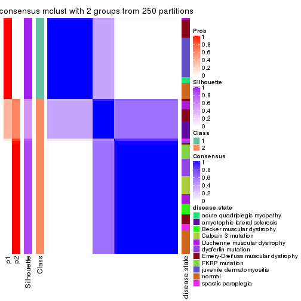</p>

</div>
<div id='tab-CV-mclust-consensus-heatmap-2'>
<pre><code class="r">consensus_heatmap(res, k = 3)
</code></pre>

<p></p>

</div>
<div id='tab-CV-mclust-consensus-heatmap-3'>
<pre><code class="r">consensus_heatmap(res, k = 4)
</code></pre>

<p></p>

</div>
<div id='tab-CV-mclust-consensus-heatmap-4'>
<pre><code class="r">consensus_heatmap(res, k = 5)
</code></pre>

<p></p>

</div>
<div id='tab-CV-mclust-consensus-heatmap-5'>
<pre><code class="r">consensus_heatmap(res, k = 6)
</code></pre>

<p></p>

</div>
</div>

Heatmaps for the membership of samples in all partitions to see how consistent they are:


<script>
$( function() {
	$( '#tabs-CV-mclust-membership-heatmap' ).tabs();
} );
</script>
<div id='tabs-CV-mclust-membership-heatmap'>
<ul>
<li><a href='#tab-CV-mclust-membership-heatmap-1'>k = 2</a></li>
<li><a href='#tab-CV-mclust-membership-heatmap-2'>k = 3</a></li>
<li><a href='#tab-CV-mclust-membership-heatmap-3'>k = 4</a></li>
<li><a href='#tab-CV-mclust-membership-heatmap-4'>k = 5</a></li>
<li><a href='#tab-CV-mclust-membership-heatmap-5'>k = 6</a></li>
</ul>
<div id='tab-CV-mclust-membership-heatmap-1'>
<pre><code class="r">membership_heatmap(res, k = 2)
</code></pre>

<p></p>

</div>
<div id='tab-CV-mclust-membership-heatmap-2'>
<pre><code class="r">membership_heatmap(res, k = 3)
</code></pre>

<p></p>

</div>
<div id='tab-CV-mclust-membership-heatmap-3'>
<pre><code class="r">membership_heatmap(res, k = 4)
</code></pre>

<p></p>

</div>
<div id='tab-CV-mclust-membership-heatmap-4'>
<pre><code class="r">membership_heatmap(res, k = 5)
</code></pre>

<p></p>

</div>
<div id='tab-CV-mclust-membership-heatmap-5'>
<pre><code class="r">membership_heatmap(res, k = 6)
</code></pre>

<p></p>

</div>
</div>

As soon as we have had the classes for columns, we can look for signatures
which are significantly different between classes which can be candidate marks
for certain classes. Following are the heatmaps for signatures.


Signature heatmaps where rows are scaled:


<script>
$( function() {
	$( '#tabs-CV-mclust-get-signatures' ).tabs();
} );
</script>
<div id='tabs-CV-mclust-get-signatures'>
<ul>
<li><a href='#tab-CV-mclust-get-signatures-1'>k = 2</a></li>
<li><a href='#tab-CV-mclust-get-signatures-2'>k = 3</a></li>
<li><a href='#tab-CV-mclust-get-signatures-3'>k = 4</a></li>
<li><a href='#tab-CV-mclust-get-signatures-4'>k = 5</a></li>
<li><a href='#tab-CV-mclust-get-signatures-5'>k = 6</a></li>
</ul>
<div id='tab-CV-mclust-get-signatures-1'>
<pre><code class="r">get_signatures(res, k = 2)
</code></pre>

<p></p>

</div>
<div id='tab-CV-mclust-get-signatures-2'>
<pre><code class="r">get_signatures(res, k = 3)
</code></pre>

<p></p>

</div>
<div id='tab-CV-mclust-get-signatures-3'>
<pre><code class="r">get_signatures(res, k = 4)
</code></pre>

<p></p>

</div>
<div id='tab-CV-mclust-get-signatures-4'>
<pre><code class="r">get_signatures(res, k = 5)
</code></pre>

<p></p>

</div>
<div id='tab-CV-mclust-get-signatures-5'>
<pre><code class="r">get_signatures(res, k = 6)
</code></pre>

<p></p>

</div>
</div>


Signature heatmaps where rows are not scaled:


<script>
$( function() {
	$( '#tabs-CV-mclust-get-signatures-no-scale' ).tabs();
} );
</script>
<div id='tabs-CV-mclust-get-signatures-no-scale'>
<ul>
<li><a href='#tab-CV-mclust-get-signatures-no-scale-1'>k = 2</a></li>
<li><a href='#tab-CV-mclust-get-signatures-no-scale-2'>k = 3</a></li>
<li><a href='#tab-CV-mclust-get-signatures-no-scale-3'>k = 4</a></li>
<li><a href='#tab-CV-mclust-get-signatures-no-scale-4'>k = 5</a></li>
<li><a href='#tab-CV-mclust-get-signatures-no-scale-5'>k = 6</a></li>
</ul>
<div id='tab-CV-mclust-get-signatures-no-scale-1'>
<pre><code class="r">get_signatures(res, k = 2, scale_rows = FALSE)
</code></pre>

<p></p>

</div>
<div id='tab-CV-mclust-get-signatures-no-scale-2'>
<pre><code class="r">get_signatures(res, k = 3, scale_rows = FALSE)
</code></pre>

<p></p>

</div>
<div id='tab-CV-mclust-get-signatures-no-scale-3'>
<pre><code class="r">get_signatures(res, k = 4, scale_rows = FALSE)
</code></pre>

<p></p>

</div>
<div id='tab-CV-mclust-get-signatures-no-scale-4'>
<pre><code class="r">get_signatures(res, k = 5, scale_rows = FALSE)
</code></pre>

<p></p>

</div>
<div id='tab-CV-mclust-get-signatures-no-scale-5'>
<pre><code class="r">get_signatures(res, k = 6, scale_rows = FALSE)
</code></pre>

<p></p>

</div>
</div>


Compare the overlap of signatures from different k:

```r
compare_signatures(res)
```


`get_signature()` returns a data frame invisibly. TO get the list of signatures, the function
call should be assigned to a variable explicitly. In following code, if `plot` argument is set
to `FALSE`, no heatmap is plotted while only the differential analysis is performed.

```r
# code only for demonstration
tb = get_signature(res, k = ..., plot = FALSE)
```

An example of the output of `tb` is:

```
#>   which_row         fdr    mean_1    mean_2 scaled_mean_1 scaled_mean_2 km
#> 1        38 0.042760348  8.373488  9.131774    -0.5533452     0.5164555  1
#> 2        40 0.018707592  7.106213  8.469186    -0.6173731     0.5762149  1
#> 3        55 0.019134737 10.221463 11.207825    -0.6159697     0.5749050  1
#> 4        59 0.006059896  5.921854  7.869574    -0.6899429     0.6439467  1
#> 5        60 0.018055526  8.928898 10.211722    -0.6204761     0.5791110  1
#> 6        98 0.009384629 15.714769 14.887706     0.6635654    -0.6193277  2
...
```

The columns in `tb` are:

1. `which_row`: row indices corresponding to the input matrix.
2. `fdr`: FDR for the differential test. 
3. `mean_x`: The mean value in group x.
4. `scaled_mean_x`: The mean value in group x after rows are scaled.
5. `km`: Row groups if k-means clustering is applied to rows.


UMAP plot which shows how samples are separated.


<script>
$( function() {
	$( '#tabs-CV-mclust-dimension-reduction' ).tabs();
} );
</script>
<div id='tabs-CV-mclust-dimension-reduction'>
<ul>
<li><a href='#tab-CV-mclust-dimension-reduction-1'>k = 2</a></li>
<li><a href='#tab-CV-mclust-dimension-reduction-2'>k = 3</a></li>
<li><a href='#tab-CV-mclust-dimension-reduction-3'>k = 4</a></li>
<li><a href='#tab-CV-mclust-dimension-reduction-4'>k = 5</a></li>
<li><a href='#tab-CV-mclust-dimension-reduction-5'>k = 6</a></li>
</ul>
<div id='tab-CV-mclust-dimension-reduction-1'>
<pre><code class="r">dimension_reduction(res, k = 2, method = &quot;UMAP&quot;)
</code></pre>

<p></p>

</div>
<div id='tab-CV-mclust-dimension-reduction-2'>
<pre><code class="r">dimension_reduction(res, k = 3, method = &quot;UMAP&quot;)
</code></pre>

<p></p>

</div>
<div id='tab-CV-mclust-dimension-reduction-3'>
<pre><code class="r">dimension_reduction(res, k = 4, method = &quot;UMAP&quot;)
</code></pre>

<p></p>

</div>
<div id='tab-CV-mclust-dimension-reduction-4'>
<pre><code class="r">dimension_reduction(res, k = 5, method = &quot;UMAP&quot;)
</code></pre>

<p>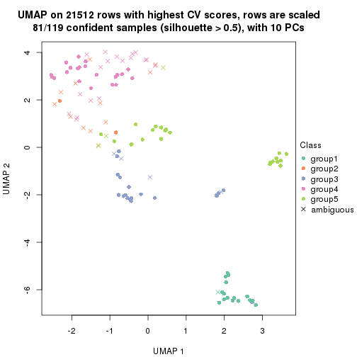</p>

</div>
<div id='tab-CV-mclust-dimension-reduction-5'>
<pre><code class="r">dimension_reduction(res, k = 6, method = &quot;UMAP&quot;)
</code></pre>

<p></p>

</div>
</div>


Following heatmap shows how subgroups are split when increasing `k`:

```r
collect_classes(res)
```


Test correlation between subgroups and known annotations. If the known
annotation is numeric, one-way ANOVA test is applied, and if the known
annotation is discrete, chi-squared contingency table test is applied.

```r
test_to_known_factors(res)
```

```
#>             n disease.state(p) k
#> CV:mclust 119         4.04e-11 2
#> CV:mclust 115         8.21e-20 3
#> CV:mclust 112         9.16e-29 4
#> CV:mclust  81         4.06e-20 5
#> CV:mclust  91         2.14e-29 6
```


If matrix rows can be associated to genes, consider to use `functional_enrichment(res,
...)` to perform function enrichment for the signature genes. See [this vignette](http://bioconductor.org/packages/devel/bioc/vignettes/cola/inst/doc/functional_enrichment.html) for more detailed explanations.


 

---------------------------------------------------


### CV:NMF


The object with results only for a single top-value method and a single partition method 
can be extracted as:

```r
res = res_list["CV", "NMF"]
# you can also extract it by
# res = res_list["CV:NMF"]
```

A summary of `res` and all the functions that can be applied to it:

```r
res
```

```
#> A 'ConsensusPartition' object with k = 2, 3, 4, 5, 6.
#>   On a matrix with 21512 rows and 119 columns.
#>   Top rows (1000, 2000, 3000, 4000, 5000) are extracted by 'CV' method.
#>   Subgroups are detected by 'NMF' method.
#>   Performed in total 1250 partitions by row resampling.
#>   Best k for subgroups seems to be 2.
#> 
#> Following methods can be applied to this 'ConsensusPartition' object:
#>  [1] "cola_report"             "collect_classes"         "collect_plots"          
#>  [4] "collect_stats"           "colnames"                "compare_signatures"     
#>  [7] "consensus_heatmap"       "dimension_reduction"     "functional_enrichment"  
#> [10] "get_anno_col"            "get_anno"                "get_classes"            
#> [13] "get_consensus"           "get_matrix"              "get_membership"         
#> [16] "get_param"               "get_signatures"          "get_stats"              
#> [19] "is_best_k"               "is_stable_k"             "membership_heatmap"     
#> [22] "ncol"                    "nrow"                    "plot_ecdf"              
#> [25] "rownames"                "select_partition_number" "show"                   
#> [28] "suggest_best_k"          "test_to_known_factors"
```

`collect_plots()` function collects all the plots made from `res` for all `k` (number of partitions)
into one single page to provide an easy and fast comparison between different `k`.

```r
collect_plots(res)
```


The plots are:

- The first row: a plot of the ECDF (empirical cumulative distribution
  function) curves of the consensus matrix for each `k` and the heatmap of
  predicted classes for each `k`.
- The second row: heatmaps of the consensus matrix for each `k`.
- The third row: heatmaps of the membership matrix for each `k`.
- The fouth row: heatmaps of the signatures for each `k`.

All the plots in panels can be made by individual functions and they are
plotted later in this section.

`select_partition_number()` produces several plots showing different
statistics for choosing "optimized" `k`. There are following statistics:

- ECDF curves of the consensus matrix for each `k`;
- 1-PAC. [The PAC
  score](https://en.wikipedia.org/wiki/Consensus_clustering#Over-interpretation_potential_of_consensus_clustering)
  measures the proportion of the ambiguous subgrouping.
- Mean silhouette score.
- Concordance. The mean probability of fiting the consensus class ids in all
  partitions.
- Area increased. Denote $A_k$ as the area under the ECDF curve for current
  `k`, the area increased is defined as $A_k - A_{k-1}$.
- Rand index. The percent of pairs of samples that are both in a same cluster
  or both are not in a same cluster in the partition of k and k-1.
- Jaccard index. The ratio of pairs of samples are both in a same cluster in
  the partition of k and k-1 and the pairs of samples are both in a same
  cluster in the partition k or k-1.

The detailed explanations of these statistics can be found in [the _cola_
vignette](http://bioconductor.org/packages/devel/bioc/vignettes/cola/inst/doc/cola.html#toc_13).

Generally speaking, lower PAC score, higher mean silhouette score or higher
concordance corresponds to better partition. Rand index and Jaccard index
measure how similar the current partition is compared to partition with `k-1`.
If they are too similar, we won't accept `k` is better than `k-1`.

```r
select_partition_number(res)
```


The numeric values for all these statistics can be obtained by `get_stats()`.

```r
get_stats(res)
```

```
#>   k 1-PAC mean_silhouette concordance area_increased  Rand Jaccard
#> 2 2 0.817           0.904       0.959         0.4972 0.499   0.499
#> 3 3 0.502           0.650       0.821         0.3161 0.741   0.529
#> 4 4 0.577           0.529       0.716         0.1312 0.775   0.469
#> 5 5 0.607           0.523       0.705         0.0640 0.833   0.500
#> 6 6 0.662           0.610       0.753         0.0469 0.883   0.548
```

`suggest_best_k()` suggests the best $k$ based on these statistics. The rules are as follows:

- All $k$ with Jaccard index larger than 0.95 are removed because increasing
  $k$ does not provide enough extra information. If all $k$ are removed, it is
  marked as no subgroup is detected.
- For all $k$ with 1-PAC score larger than 0.9, the maximal $k$ is taken as
  the best $k$, and other $k$ are marked as optional $k$.
- If it does not fit the second rule. The $k$ with the maximal vote of the
  highest 1-PAC score, highest mean silhouette, and highest concordance is
  taken as the best $k$.

```r
suggest_best_k(res)
```

```
#> [1] 2
```


Following shows the table of the partitions (You need to click the **show/hide
code output** link to see it). The membership matrix (columns with name `p*`)
is inferred by
[`clue::cl_consensus()`](https://www.rdocumentation.org/link/cl_consensus?package=clue)
function with the `SE` method. Basically the value in the membership matrix
represents the probability to belong to a certain group. The finall class
label for an item is determined with the group with highest probability it
belongs to.

In `get_classes()` function, the entropy is calculated from the membership
matrix and the silhouette score is calculated from the consensus matrix.


<script>
$( function() {
	$( '#tabs-CV-NMF-get-classes' ).tabs();
} );
</script>
<div id='tabs-CV-NMF-get-classes'>
<ul>
<li><a href='#tab-CV-NMF-get-classes-1'>k = 2</a></li>
<li><a href='#tab-CV-NMF-get-classes-2'>k = 3</a></li>
<li><a href='#tab-CV-NMF-get-classes-3'>k = 4</a></li>
<li><a href='#tab-CV-NMF-get-classes-4'>k = 5</a></li>
<li><a href='#tab-CV-NMF-get-classes-5'>k = 6</a></li>
</ul>

<div id='tab-CV-NMF-get-classes-1'>
<p><a id='tab-CV-NMF-get-classes-1-a' style='color:#0366d6' href='#'>show/hide code output</a></p>
<pre><code class="r">cbind(get_classes(res, k = 2), get_membership(res, k = 2))
</code></pre>

<pre><code>#&gt;           class entropy silhouette    p1    p2
#&gt; GSM120719     1  0.0000     0.9421 1.000 0.000
#&gt; GSM120720     1  0.0000     0.9421 1.000 0.000
#&gt; GSM120765     2  0.0000     0.9685 0.000 1.000
#&gt; GSM120767     2  0.0000     0.9685 0.000 1.000
#&gt; GSM120784     2  0.0000     0.9685 0.000 1.000
#&gt; GSM121400     1  0.0000     0.9421 1.000 0.000
#&gt; GSM121401     1  0.0000     0.9421 1.000 0.000
#&gt; GSM121402     2  0.0000     0.9685 0.000 1.000
#&gt; GSM121403     1  0.9963     0.1596 0.536 0.464
#&gt; GSM121404     2  0.0000     0.9685 0.000 1.000
#&gt; GSM121405     1  0.0000     0.9421 1.000 0.000
#&gt; GSM121406     2  0.0000     0.9685 0.000 1.000
#&gt; GSM121408     2  0.0000     0.9685 0.000 1.000
#&gt; GSM121409     1  0.4022     0.8892 0.920 0.080
#&gt; GSM121410     1  0.0000     0.9421 1.000 0.000
#&gt; GSM121412     2  0.0000     0.9685 0.000 1.000
#&gt; GSM121413     2  0.0000     0.9685 0.000 1.000
#&gt; GSM121414     2  0.0000     0.9685 0.000 1.000
#&gt; GSM121415     2  0.0000     0.9685 0.000 1.000
#&gt; GSM121416     2  0.0000     0.9685 0.000 1.000
#&gt; GSM120591     1  0.0000     0.9421 1.000 0.000
#&gt; GSM120594     1  0.0000     0.9421 1.000 0.000
#&gt; GSM120718     1  0.0000     0.9421 1.000 0.000
#&gt; GSM121205     1  0.0000     0.9421 1.000 0.000
#&gt; GSM121206     1  0.0000     0.9421 1.000 0.000
#&gt; GSM121207     1  0.0000     0.9421 1.000 0.000
#&gt; GSM121208     1  0.0000     0.9421 1.000 0.000
#&gt; GSM121209     1  0.0000     0.9421 1.000 0.000
#&gt; GSM121210     1  0.0000     0.9421 1.000 0.000
#&gt; GSM121211     1  0.0000     0.9421 1.000 0.000
#&gt; GSM121212     1  0.0000     0.9421 1.000 0.000
#&gt; GSM121213     1  0.0000     0.9421 1.000 0.000
#&gt; GSM121214     1  0.0000     0.9421 1.000 0.000
#&gt; GSM121215     1  0.0000     0.9421 1.000 0.000
#&gt; GSM121216     1  0.0000     0.9421 1.000 0.000
#&gt; GSM121217     1  0.0000     0.9421 1.000 0.000
#&gt; GSM121218     1  0.0000     0.9421 1.000 0.000
#&gt; GSM121234     1  0.0000     0.9421 1.000 0.000
#&gt; GSM121243     1  0.0000     0.9421 1.000 0.000
#&gt; GSM121245     1  0.0000     0.9421 1.000 0.000
#&gt; GSM121246     1  0.0000     0.9421 1.000 0.000
#&gt; GSM121247     1  0.0000     0.9421 1.000 0.000
#&gt; GSM121248     1  0.0000     0.9421 1.000 0.000
#&gt; GSM120744     2  0.7299     0.7284 0.204 0.796
#&gt; GSM120745     1  0.0672     0.9374 0.992 0.008
#&gt; GSM120746     1  0.7299     0.7569 0.796 0.204
#&gt; GSM120747     2  0.9993    -0.0206 0.484 0.516
#&gt; GSM120748     2  0.0938     0.9583 0.012 0.988
#&gt; GSM120749     1  0.6048     0.8237 0.852 0.148
#&gt; GSM120750     1  0.9522     0.4560 0.628 0.372
#&gt; GSM120751     1  0.8909     0.5922 0.692 0.308
#&gt; GSM120752     1  0.2948     0.9096 0.948 0.052
#&gt; GSM121336     2  0.0000     0.9685 0.000 1.000
#&gt; GSM121339     2  0.0000     0.9685 0.000 1.000
#&gt; GSM121349     2  0.0000     0.9685 0.000 1.000
#&gt; GSM121355     2  0.0000     0.9685 0.000 1.000
#&gt; GSM120757     1  0.8909     0.5933 0.692 0.308
#&gt; GSM120766     2  0.9393     0.4123 0.356 0.644
#&gt; GSM120770     2  0.0000     0.9685 0.000 1.000
#&gt; GSM120779     1  0.3584     0.8984 0.932 0.068
#&gt; GSM120780     2  0.0672     0.9618 0.008 0.992
#&gt; GSM121102     2  0.0000     0.9685 0.000 1.000
#&gt; GSM121203     2  0.7528     0.7094 0.216 0.784
#&gt; GSM121204     1  0.0000     0.9421 1.000 0.000
#&gt; GSM121330     1  0.0000     0.9421 1.000 0.000
#&gt; GSM121335     1  0.0000     0.9421 1.000 0.000
#&gt; GSM121337     2  0.0000     0.9685 0.000 1.000
#&gt; GSM121338     2  0.0000     0.9685 0.000 1.000
#&gt; GSM121341     1  0.0000     0.9421 1.000 0.000
#&gt; GSM121342     1  0.0000     0.9421 1.000 0.000
#&gt; GSM121343     2  0.0000     0.9685 0.000 1.000
#&gt; GSM121344     1  0.0000     0.9421 1.000 0.000
#&gt; GSM121346     1  0.0000     0.9421 1.000 0.000
#&gt; GSM121347     2  0.0000     0.9685 0.000 1.000
#&gt; GSM121348     2  0.0000     0.9685 0.000 1.000
#&gt; GSM121350     1  0.0000     0.9421 1.000 0.000
#&gt; GSM121352     1  0.0000     0.9421 1.000 0.000
#&gt; GSM121354     1  0.0000     0.9421 1.000 0.000
#&gt; GSM120753     2  0.0000     0.9685 0.000 1.000
#&gt; GSM120761     2  0.0000     0.9685 0.000 1.000
#&gt; GSM120768     2  0.0000     0.9685 0.000 1.000
#&gt; GSM120781     2  0.0000     0.9685 0.000 1.000
#&gt; GSM120788     2  0.4939     0.8613 0.108 0.892
#&gt; GSM120760     2  0.0000     0.9685 0.000 1.000
#&gt; GSM120763     2  0.0000     0.9685 0.000 1.000
#&gt; GSM120764     2  0.0000     0.9685 0.000 1.000
#&gt; GSM120777     2  0.0000     0.9685 0.000 1.000
#&gt; GSM120786     2  0.0000     0.9685 0.000 1.000
#&gt; GSM121329     1  0.0000     0.9421 1.000 0.000
#&gt; GSM121331     1  0.7815     0.7189 0.768 0.232
#&gt; GSM121333     1  0.4690     0.8717 0.900 0.100
#&gt; GSM121345     1  0.3733     0.8953 0.928 0.072
#&gt; GSM121356     1  0.5408     0.8488 0.876 0.124
#&gt; GSM120754     2  0.0000     0.9685 0.000 1.000
#&gt; GSM120759     2  0.0000     0.9685 0.000 1.000
#&gt; GSM120762     2  0.0000     0.9685 0.000 1.000
#&gt; GSM120775     2  0.1414     0.9511 0.020 0.980
#&gt; GSM120776     2  0.7602     0.7088 0.220 0.780
#&gt; GSM120782     2  0.0000     0.9685 0.000 1.000
#&gt; GSM120789     2  0.0000     0.9685 0.000 1.000
#&gt; GSM120790     2  0.0000     0.9685 0.000 1.000
#&gt; GSM120791     2  0.0000     0.9685 0.000 1.000
#&gt; GSM120755     2  0.0000     0.9685 0.000 1.000
#&gt; GSM120756     1  0.9933     0.1854 0.548 0.452
#&gt; GSM120769     2  0.0000     0.9685 0.000 1.000
#&gt; GSM120778     2  0.0000     0.9685 0.000 1.000
#&gt; GSM120792     2  0.0000     0.9685 0.000 1.000
#&gt; GSM121332     2  0.0000     0.9685 0.000 1.000
#&gt; GSM121334     2  0.0000     0.9685 0.000 1.000
#&gt; GSM121340     2  0.0000     0.9685 0.000 1.000
#&gt; GSM121351     2  0.0000     0.9685 0.000 1.000
#&gt; GSM121353     2  0.7219     0.7402 0.200 0.800
#&gt; GSM120758     2  0.0000     0.9685 0.000 1.000
#&gt; GSM120771     2  0.0000     0.9685 0.000 1.000
#&gt; GSM120772     2  0.0000     0.9685 0.000 1.000
#&gt; GSM120773     2  0.0000     0.9685 0.000 1.000
#&gt; GSM120774     2  0.0000     0.9685 0.000 1.000
#&gt; GSM120783     2  0.0000     0.9685 0.000 1.000
#&gt; GSM120787     2  0.0000     0.9685 0.000 1.000
</code></pre>

<script>
$('#tab-CV-NMF-get-classes-1-a').parent().next().next().hide();
$('#tab-CV-NMF-get-classes-1-a').click(function(){
  $('#tab-CV-NMF-get-classes-1-a').parent().next().next().toggle();
  return(false);
});
</script>
</div>

<div id='tab-CV-NMF-get-classes-2'>
<p><a id='tab-CV-NMF-get-classes-2-a' style='color:#0366d6' href='#'>show/hide code output</a></p>
<pre><code class="r">cbind(get_classes(res, k = 3), get_membership(res, k = 3))
</code></pre>

<pre><code>#&gt;           class entropy silhouette    p1    p2    p3
#&gt; GSM120719     1  0.4750     0.7342 0.784 0.000 0.216
#&gt; GSM120720     3  0.4931     0.5023 0.232 0.000 0.768
#&gt; GSM120765     2  0.3619     0.7925 0.000 0.864 0.136
#&gt; GSM120767     2  0.3116     0.8124 0.000 0.892 0.108
#&gt; GSM120784     2  0.5058     0.6871 0.000 0.756 0.244
#&gt; GSM121400     3  0.0424     0.7155 0.000 0.008 0.992
#&gt; GSM121401     3  0.0237     0.7133 0.004 0.000 0.996
#&gt; GSM121402     2  0.2261     0.8308 0.000 0.932 0.068
#&gt; GSM121403     3  0.3038     0.6999 0.000 0.104 0.896
#&gt; GSM121404     2  0.6295     0.1674 0.000 0.528 0.472
#&gt; GSM121405     3  0.1163     0.7172 0.000 0.028 0.972
#&gt; GSM121406     2  0.3482     0.7983 0.000 0.872 0.128
#&gt; GSM121408     2  0.3038     0.8142 0.000 0.896 0.104
#&gt; GSM121409     3  0.1411     0.7181 0.000 0.036 0.964
#&gt; GSM121410     3  0.1753     0.7165 0.000 0.048 0.952
#&gt; GSM121412     2  0.5431     0.6262 0.000 0.716 0.284
#&gt; GSM121413     2  0.4399     0.7492 0.000 0.812 0.188
#&gt; GSM121414     2  0.5058     0.6862 0.000 0.756 0.244
#&gt; GSM121415     2  0.4605     0.7340 0.000 0.796 0.204
#&gt; GSM121416     2  0.2537     0.8262 0.000 0.920 0.080
#&gt; GSM120591     3  0.3752     0.6201 0.144 0.000 0.856
#&gt; GSM120594     3  0.4504     0.5548 0.196 0.000 0.804
#&gt; GSM120718     3  0.6154     0.0418 0.408 0.000 0.592
#&gt; GSM121205     1  0.4931     0.7262 0.768 0.000 0.232
#&gt; GSM121206     1  0.5760     0.6325 0.672 0.000 0.328
#&gt; GSM121207     1  0.2625     0.7339 0.916 0.000 0.084
#&gt; GSM121208     3  0.6095     0.1106 0.392 0.000 0.608
#&gt; GSM121209     1  0.5988     0.5675 0.632 0.000 0.368
#&gt; GSM121210     1  0.5431     0.6845 0.716 0.000 0.284
#&gt; GSM121211     1  0.5835     0.6153 0.660 0.000 0.340
#&gt; GSM121212     1  0.4842     0.7303 0.776 0.000 0.224
#&gt; GSM121213     1  0.5529     0.6719 0.704 0.000 0.296
#&gt; GSM121214     1  0.4931     0.7263 0.768 0.000 0.232
#&gt; GSM121215     1  0.5706     0.6442 0.680 0.000 0.320
#&gt; GSM121216     1  0.4605     0.7372 0.796 0.000 0.204
#&gt; GSM121217     1  0.5497     0.6766 0.708 0.000 0.292
#&gt; GSM121218     1  0.4346     0.7408 0.816 0.000 0.184
#&gt; GSM121234     1  0.6140     0.4999 0.596 0.000 0.404
#&gt; GSM121243     1  0.4931     0.7264 0.768 0.000 0.232
#&gt; GSM121245     1  0.4121     0.7421 0.832 0.000 0.168
#&gt; GSM121246     3  0.5948     0.2209 0.360 0.000 0.640
#&gt; GSM121247     1  0.1411     0.7245 0.964 0.000 0.036
#&gt; GSM121248     1  0.4750     0.7331 0.784 0.000 0.216
#&gt; GSM120744     3  0.6209     0.3318 0.004 0.368 0.628
#&gt; GSM120745     3  0.3272     0.6907 0.080 0.016 0.904
#&gt; GSM120746     3  0.2682     0.7100 0.004 0.076 0.920
#&gt; GSM120747     3  0.3644     0.6903 0.004 0.124 0.872
#&gt; GSM120748     3  0.5588     0.5162 0.004 0.276 0.720
#&gt; GSM120749     3  0.2584     0.7150 0.008 0.064 0.928
#&gt; GSM120750     3  0.3715     0.6894 0.004 0.128 0.868
#&gt; GSM120751     3  0.3715     0.6893 0.004 0.128 0.868
#&gt; GSM120752     3  0.3692     0.7127 0.056 0.048 0.896
#&gt; GSM121336     2  0.2448     0.8271 0.000 0.924 0.076
#&gt; GSM121339     3  0.6274     0.0613 0.000 0.456 0.544
#&gt; GSM121349     2  0.1753     0.8353 0.000 0.952 0.048
#&gt; GSM121355     2  0.2959     0.8163 0.000 0.900 0.100
#&gt; GSM120757     1  0.6144     0.6363 0.780 0.132 0.088
#&gt; GSM120766     2  0.8370     0.2536 0.084 0.500 0.416
#&gt; GSM120770     2  0.5244     0.6897 0.004 0.756 0.240
#&gt; GSM120779     1  0.2050     0.7173 0.952 0.020 0.028
#&gt; GSM120780     3  0.6676    -0.0290 0.008 0.476 0.516
#&gt; GSM121102     2  0.6505     0.1736 0.004 0.528 0.468
#&gt; GSM121203     3  0.5690     0.4977 0.004 0.288 0.708
#&gt; GSM121204     1  0.2173     0.7266 0.944 0.008 0.048
#&gt; GSM121330     3  0.1964     0.6928 0.056 0.000 0.944
#&gt; GSM121335     3  0.5016     0.4929 0.240 0.000 0.760
#&gt; GSM121337     2  0.4605     0.7338 0.000 0.796 0.204
#&gt; GSM121338     3  0.6126     0.2464 0.000 0.400 0.600
#&gt; GSM121341     3  0.5098     0.4754 0.248 0.000 0.752
#&gt; GSM121342     3  0.5591     0.3569 0.304 0.000 0.696
#&gt; GSM121343     3  0.6140     0.2352 0.000 0.404 0.596
#&gt; GSM121344     3  0.3752     0.6197 0.144 0.000 0.856
#&gt; GSM121346     3  0.1163     0.7056 0.028 0.000 0.972
#&gt; GSM121347     2  0.4475     0.8238 0.064 0.864 0.072
#&gt; GSM121348     2  0.5493     0.7005 0.012 0.756 0.232
#&gt; GSM121350     3  0.0592     0.7113 0.012 0.000 0.988
#&gt; GSM121352     3  0.2066     0.6903 0.060 0.000 0.940
#&gt; GSM121354     3  0.3038     0.6566 0.104 0.000 0.896
#&gt; GSM120753     2  0.0475     0.8404 0.004 0.992 0.004
#&gt; GSM120761     2  0.1289     0.8367 0.032 0.968 0.000
#&gt; GSM120768     2  0.2711     0.8152 0.088 0.912 0.000
#&gt; GSM120781     2  0.0661     0.8404 0.004 0.988 0.008
#&gt; GSM120788     1  0.4931     0.5481 0.768 0.232 0.000
#&gt; GSM120760     2  0.4346     0.7382 0.184 0.816 0.000
#&gt; GSM120763     2  0.4452     0.7301 0.192 0.808 0.000
#&gt; GSM120764     2  0.6026     0.4541 0.376 0.624 0.000
#&gt; GSM120777     1  0.6095     0.2084 0.608 0.392 0.000
#&gt; GSM120786     2  0.5785     0.5392 0.332 0.668 0.000
#&gt; GSM121329     1  0.4062     0.7428 0.836 0.000 0.164
#&gt; GSM121331     1  0.3966     0.6763 0.876 0.100 0.024
#&gt; GSM121333     1  0.2050     0.7119 0.952 0.028 0.020
#&gt; GSM121345     1  0.1267     0.7057 0.972 0.024 0.004
#&gt; GSM121356     1  0.6171     0.6724 0.776 0.080 0.144
#&gt; GSM120754     2  0.3192     0.8041 0.112 0.888 0.000
#&gt; GSM120759     2  0.1289     0.8385 0.000 0.968 0.032
#&gt; GSM120762     2  0.1289     0.8362 0.032 0.968 0.000
#&gt; GSM120775     1  0.6111     0.2001 0.604 0.396 0.000
#&gt; GSM120776     1  0.5397     0.4715 0.720 0.280 0.000
#&gt; GSM120782     2  0.1399     0.8390 0.028 0.968 0.004
#&gt; GSM120789     2  0.0892     0.8402 0.000 0.980 0.020
#&gt; GSM120790     2  0.1453     0.8415 0.008 0.968 0.024
#&gt; GSM120791     2  0.3116     0.8035 0.108 0.892 0.000
#&gt; GSM120755     2  0.0592     0.8405 0.000 0.988 0.012
#&gt; GSM120756     1  0.4235     0.6053 0.824 0.176 0.000
#&gt; GSM120769     2  0.1289     0.8368 0.032 0.968 0.000
#&gt; GSM120778     2  0.2625     0.8172 0.084 0.916 0.000
#&gt; GSM120792     2  0.2261     0.8254 0.068 0.932 0.000
#&gt; GSM121332     2  0.0747     0.8403 0.000 0.984 0.016
#&gt; GSM121334     2  0.1031     0.8382 0.024 0.976 0.000
#&gt; GSM121340     2  0.6062     0.4384 0.384 0.616 0.000
#&gt; GSM121351     2  0.2356     0.8289 0.000 0.928 0.072
#&gt; GSM121353     1  0.5465     0.4536 0.712 0.288 0.000
#&gt; GSM120758     2  0.0747     0.8393 0.016 0.984 0.000
#&gt; GSM120771     2  0.1267     0.8414 0.004 0.972 0.024
#&gt; GSM120772     2  0.1163     0.8373 0.028 0.972 0.000
#&gt; GSM120773     2  0.3879     0.7704 0.152 0.848 0.000
#&gt; GSM120774     2  0.2448     0.8210 0.076 0.924 0.000
#&gt; GSM120783     2  0.5431     0.6181 0.284 0.716 0.000
#&gt; GSM120787     2  0.2356     0.8232 0.072 0.928 0.000
</code></pre>

<script>
$('#tab-CV-NMF-get-classes-2-a').parent().next().next().hide();
$('#tab-CV-NMF-get-classes-2-a').click(function(){
  $('#tab-CV-NMF-get-classes-2-a').parent().next().next().toggle();
  return(false);
});
</script>
</div>

<div id='tab-CV-NMF-get-classes-3'>
<p><a id='tab-CV-NMF-get-classes-3-a' style='color:#0366d6' href='#'>show/hide code output</a></p>
<pre><code class="r">cbind(get_classes(res, k = 4), get_membership(res, k = 4))
</code></pre>

<pre><code>#&gt;           class entropy silhouette    p1    p2    p3    p4
#&gt; GSM120719     4  0.5125     0.1340 0.388 0.000 0.008 0.604
#&gt; GSM120720     1  0.3105     0.5714 0.868 0.000 0.120 0.012
#&gt; GSM120765     2  0.2563     0.8073 0.000 0.908 0.072 0.020
#&gt; GSM120767     2  0.0592     0.8320 0.000 0.984 0.016 0.000
#&gt; GSM120784     2  0.5228     0.6072 0.004 0.700 0.268 0.028
#&gt; GSM121400     1  0.6473     0.1352 0.476 0.024 0.472 0.028
#&gt; GSM121401     1  0.5858     0.4531 0.660 0.020 0.292 0.028
#&gt; GSM121402     2  0.1398     0.8274 0.000 0.956 0.040 0.004
#&gt; GSM121403     1  0.7415     0.1090 0.468 0.084 0.420 0.028
#&gt; GSM121404     2  0.8178     0.1844 0.200 0.480 0.292 0.028
#&gt; GSM121405     1  0.6225     0.4213 0.632 0.032 0.308 0.028
#&gt; GSM121406     2  0.2021     0.8190 0.000 0.936 0.040 0.024
#&gt; GSM121408     2  0.1174     0.8279 0.000 0.968 0.012 0.020
#&gt; GSM121409     1  0.7049     0.2226 0.516 0.060 0.396 0.028
#&gt; GSM121410     1  0.6809     0.3388 0.580 0.056 0.336 0.028
#&gt; GSM121412     2  0.3301     0.7893 0.004 0.876 0.092 0.028
#&gt; GSM121413     2  0.3427     0.7807 0.000 0.860 0.112 0.028
#&gt; GSM121414     2  0.3366     0.7872 0.004 0.872 0.096 0.028
#&gt; GSM121415     2  0.3245     0.7892 0.000 0.872 0.100 0.028
#&gt; GSM121416     2  0.2300     0.8218 0.000 0.920 0.064 0.016
#&gt; GSM120591     1  0.4699     0.4654 0.676 0.000 0.320 0.004
#&gt; GSM120594     1  0.3105     0.5704 0.856 0.000 0.140 0.004
#&gt; GSM120718     1  0.3399     0.5383 0.868 0.000 0.040 0.092
#&gt; GSM121205     1  0.4925     0.2584 0.572 0.000 0.000 0.428
#&gt; GSM121206     1  0.4304     0.4243 0.716 0.000 0.000 0.284
#&gt; GSM121207     4  0.4804     0.1439 0.384 0.000 0.000 0.616
#&gt; GSM121208     1  0.2589     0.5194 0.884 0.000 0.000 0.116
#&gt; GSM121209     1  0.4040     0.4506 0.752 0.000 0.000 0.248
#&gt; GSM121210     1  0.4961     0.2236 0.552 0.000 0.000 0.448
#&gt; GSM121211     1  0.4406     0.4127 0.700 0.000 0.000 0.300
#&gt; GSM121212     1  0.4992     0.1643 0.524 0.000 0.000 0.476
#&gt; GSM121213     1  0.4855     0.3008 0.600 0.000 0.000 0.400
#&gt; GSM121214     1  0.4996     0.1480 0.516 0.000 0.000 0.484
#&gt; GSM121215     1  0.4500     0.3973 0.684 0.000 0.000 0.316
#&gt; GSM121216     1  0.4855     0.2988 0.600 0.000 0.000 0.400
#&gt; GSM121217     1  0.4746     0.3402 0.632 0.000 0.000 0.368
#&gt; GSM121218     1  0.4999     0.1250 0.508 0.000 0.000 0.492
#&gt; GSM121234     1  0.3764     0.4697 0.784 0.000 0.000 0.216
#&gt; GSM121243     1  0.4967     0.2123 0.548 0.000 0.000 0.452
#&gt; GSM121245     4  0.4877     0.0787 0.408 0.000 0.000 0.592
#&gt; GSM121246     1  0.1557     0.5395 0.944 0.000 0.000 0.056
#&gt; GSM121247     4  0.3837     0.3750 0.224 0.000 0.000 0.776
#&gt; GSM121248     1  0.4994     0.1557 0.520 0.000 0.000 0.480
#&gt; GSM120744     3  0.1743     0.7096 0.004 0.000 0.940 0.056
#&gt; GSM120745     3  0.2662     0.7049 0.016 0.000 0.900 0.084
#&gt; GSM120746     3  0.1545     0.6947 0.040 0.000 0.952 0.008
#&gt; GSM120747     3  0.3734     0.6055 0.116 0.012 0.852 0.020
#&gt; GSM120748     3  0.2641     0.6657 0.064 0.012 0.912 0.012
#&gt; GSM120749     3  0.1978     0.6801 0.068 0.000 0.928 0.004
#&gt; GSM120750     3  0.0927     0.7037 0.016 0.000 0.976 0.008
#&gt; GSM120751     3  0.1733     0.7064 0.024 0.000 0.948 0.028
#&gt; GSM120752     3  0.2266     0.7050 0.004 0.000 0.912 0.084
#&gt; GSM121336     2  0.0804     0.8305 0.000 0.980 0.012 0.008
#&gt; GSM121339     2  0.7755     0.3511 0.252 0.552 0.168 0.028
#&gt; GSM121349     2  0.0376     0.8313 0.000 0.992 0.004 0.004
#&gt; GSM121355     2  0.1406     0.8258 0.000 0.960 0.016 0.024
#&gt; GSM120757     3  0.4605     0.5448 0.000 0.000 0.664 0.336
#&gt; GSM120766     3  0.3975     0.6251 0.000 0.000 0.760 0.240
#&gt; GSM120770     3  0.3198     0.6868 0.000 0.080 0.880 0.040
#&gt; GSM120779     3  0.4746     0.5081 0.000 0.000 0.632 0.368
#&gt; GSM120780     3  0.2530     0.7007 0.000 0.004 0.896 0.100
#&gt; GSM121102     3  0.4208     0.6421 0.048 0.096 0.840 0.016
#&gt; GSM121203     3  0.1114     0.7025 0.016 0.004 0.972 0.008
#&gt; GSM121204     3  0.4981     0.3480 0.000 0.000 0.536 0.464
#&gt; GSM121330     1  0.4419     0.5582 0.792 0.004 0.176 0.028
#&gt; GSM121335     1  0.2593     0.5724 0.892 0.000 0.104 0.004
#&gt; GSM121337     2  0.5486     0.6803 0.000 0.720 0.200 0.080
#&gt; GSM121338     3  0.8099     0.1914 0.272 0.200 0.500 0.028
#&gt; GSM121341     1  0.2859     0.5726 0.880 0.000 0.112 0.008
#&gt; GSM121342     1  0.2882     0.5680 0.892 0.000 0.084 0.024
#&gt; GSM121343     3  0.7229     0.3604 0.208 0.144 0.620 0.028
#&gt; GSM121344     1  0.4072     0.5336 0.748 0.000 0.252 0.000
#&gt; GSM121346     1  0.5540     0.4404 0.648 0.004 0.320 0.028
#&gt; GSM121347     3  0.7789     0.1482 0.000 0.352 0.400 0.248
#&gt; GSM121348     3  0.4713     0.6501 0.000 0.052 0.776 0.172
#&gt; GSM121350     1  0.5454     0.4572 0.664 0.004 0.304 0.028
#&gt; GSM121352     1  0.5498     0.4525 0.656 0.004 0.312 0.028
#&gt; GSM121354     1  0.3870     0.5578 0.788 0.000 0.208 0.004
#&gt; GSM120753     2  0.1109     0.8308 0.000 0.968 0.004 0.028
#&gt; GSM120761     2  0.4127     0.7679 0.000 0.824 0.052 0.124
#&gt; GSM120768     2  0.3428     0.7639 0.000 0.844 0.012 0.144
#&gt; GSM120781     2  0.1109     0.8308 0.000 0.968 0.004 0.028
#&gt; GSM120788     4  0.3308     0.5045 0.000 0.036 0.092 0.872
#&gt; GSM120760     2  0.6188     0.3624 0.000 0.548 0.056 0.396
#&gt; GSM120763     2  0.5173     0.5502 0.000 0.660 0.020 0.320
#&gt; GSM120764     4  0.5535     0.3164 0.000 0.304 0.040 0.656
#&gt; GSM120777     4  0.4364     0.4472 0.000 0.056 0.136 0.808
#&gt; GSM120786     4  0.6089     0.2430 0.000 0.328 0.064 0.608
#&gt; GSM121329     4  0.4916     0.0186 0.424 0.000 0.000 0.576
#&gt; GSM121331     3  0.4898     0.4445 0.000 0.000 0.584 0.416
#&gt; GSM121333     3  0.4989     0.3398 0.000 0.000 0.528 0.472
#&gt; GSM121345     4  0.4406     0.1807 0.000 0.000 0.300 0.700
#&gt; GSM121356     3  0.4661     0.5351 0.000 0.000 0.652 0.348
#&gt; GSM120754     3  0.7242     0.2940 0.000 0.148 0.476 0.376
#&gt; GSM120759     2  0.1356     0.8320 0.000 0.960 0.032 0.008
#&gt; GSM120762     2  0.1022     0.8295 0.000 0.968 0.000 0.032
#&gt; GSM120775     4  0.3907     0.5212 0.000 0.120 0.044 0.836
#&gt; GSM120776     4  0.5378    -0.2434 0.000 0.012 0.448 0.540
#&gt; GSM120782     2  0.6910     0.4539 0.000 0.584 0.164 0.252
#&gt; GSM120789     2  0.0779     0.8313 0.000 0.980 0.004 0.016
#&gt; GSM120790     2  0.5970     0.3819 0.000 0.600 0.348 0.052
#&gt; GSM120791     2  0.4019     0.7165 0.000 0.792 0.012 0.196
#&gt; GSM120755     2  0.0707     0.8307 0.000 0.980 0.000 0.020
#&gt; GSM120756     4  0.2636     0.5560 0.012 0.052 0.020 0.916
#&gt; GSM120769     2  0.1211     0.8277 0.000 0.960 0.000 0.040
#&gt; GSM120778     2  0.1867     0.8159 0.000 0.928 0.000 0.072
#&gt; GSM120792     2  0.1867     0.8168 0.000 0.928 0.000 0.072
#&gt; GSM121332     2  0.0469     0.8314 0.000 0.988 0.000 0.012
#&gt; GSM121334     2  0.1576     0.8271 0.000 0.948 0.004 0.048
#&gt; GSM121340     2  0.4961     0.2892 0.000 0.552 0.000 0.448
#&gt; GSM121351     2  0.1109     0.8302 0.000 0.968 0.028 0.004
#&gt; GSM121353     4  0.5721     0.4454 0.056 0.284 0.000 0.660
#&gt; GSM120758     2  0.1305     0.8298 0.000 0.960 0.004 0.036
#&gt; GSM120771     2  0.3523     0.7947 0.000 0.856 0.112 0.032
#&gt; GSM120772     2  0.1398     0.8290 0.000 0.956 0.004 0.040
#&gt; GSM120773     2  0.5970     0.4766 0.000 0.600 0.052 0.348
#&gt; GSM120774     2  0.1637     0.8213 0.000 0.940 0.000 0.060
#&gt; GSM120783     2  0.5856     0.2132 0.000 0.504 0.032 0.464
#&gt; GSM120787     2  0.1637     0.8214 0.000 0.940 0.000 0.060
</code></pre>

<script>
$('#tab-CV-NMF-get-classes-3-a').parent().next().next().hide();
$('#tab-CV-NMF-get-classes-3-a').click(function(){
  $('#tab-CV-NMF-get-classes-3-a').parent().next().next().toggle();
  return(false);
});
</script>
</div>

<div id='tab-CV-NMF-get-classes-4'>
<p><a id='tab-CV-NMF-get-classes-4-a' style='color:#0366d6' href='#'>show/hide code output</a></p>
<pre><code class="r">cbind(get_classes(res, k = 5), get_membership(res, k = 5))
</code></pre>

<pre><code>#&gt;           class entropy silhouette    p1    p2    p3    p4    p5
#&gt; GSM120719     1  0.6133    0.35771 0.512 0.000 0.120 0.364 0.004
#&gt; GSM120720     3  0.2818    0.63404 0.128 0.000 0.860 0.008 0.004
#&gt; GSM120765     2  0.2753    0.69867 0.000 0.856 0.008 0.000 0.136
#&gt; GSM120767     2  0.1471    0.71173 0.000 0.952 0.020 0.024 0.004
#&gt; GSM120784     2  0.5348    0.55989 0.000 0.684 0.108 0.008 0.200
#&gt; GSM121400     5  0.7273    0.25028 0.180 0.008 0.248 0.044 0.520
#&gt; GSM121401     3  0.5098    0.55615 0.248 0.004 0.692 0.036 0.020
#&gt; GSM121402     2  0.3999    0.51578 0.000 0.656 0.000 0.000 0.344
#&gt; GSM121403     5  0.7839    0.41541 0.144 0.112 0.140 0.044 0.560
#&gt; GSM121404     3  0.6190    0.12388 0.000 0.356 0.520 0.008 0.116
#&gt; GSM121405     3  0.5362    0.54856 0.252 0.004 0.676 0.040 0.028
#&gt; GSM121406     2  0.3766    0.59955 0.000 0.728 0.004 0.000 0.268
#&gt; GSM121408     2  0.2179    0.71216 0.000 0.888 0.000 0.000 0.112
#&gt; GSM121409     5  0.7584    0.39686 0.236 0.072 0.096 0.044 0.552
#&gt; GSM121410     5  0.7621    0.40688 0.208 0.076 0.104 0.048 0.564
#&gt; GSM121412     2  0.4951    0.34283 0.000 0.556 0.012 0.012 0.420
#&gt; GSM121413     5  0.4434   -0.14171 0.000 0.460 0.004 0.000 0.536
#&gt; GSM121414     2  0.4782    0.31239 0.000 0.544 0.008 0.008 0.440
#&gt; GSM121415     2  0.4313    0.50132 0.000 0.636 0.008 0.000 0.356
#&gt; GSM121416     2  0.4211    0.50520 0.000 0.636 0.000 0.004 0.360
#&gt; GSM120591     3  0.2196    0.63644 0.024 0.000 0.916 0.056 0.004
#&gt; GSM120594     3  0.2304    0.63689 0.100 0.000 0.892 0.008 0.000
#&gt; GSM120718     3  0.3934    0.55911 0.244 0.000 0.740 0.016 0.000
#&gt; GSM121205     1  0.1732    0.80813 0.920 0.000 0.000 0.080 0.000
#&gt; GSM121206     1  0.1106    0.79556 0.964 0.000 0.024 0.012 0.000
#&gt; GSM121207     1  0.3885    0.66061 0.724 0.000 0.000 0.268 0.008
#&gt; GSM121208     1  0.3134    0.73246 0.876 0.000 0.056 0.044 0.024
#&gt; GSM121209     1  0.1522    0.77616 0.944 0.000 0.044 0.012 0.000
#&gt; GSM121210     1  0.2248    0.80680 0.900 0.000 0.000 0.088 0.012
#&gt; GSM121211     1  0.1012    0.80050 0.968 0.000 0.020 0.012 0.000
#&gt; GSM121212     1  0.2439    0.79657 0.876 0.000 0.000 0.120 0.004
#&gt; GSM121213     1  0.1041    0.80765 0.964 0.000 0.004 0.032 0.000
#&gt; GSM121214     1  0.2605    0.78352 0.852 0.000 0.000 0.148 0.000
#&gt; GSM121215     1  0.0798    0.80342 0.976 0.000 0.008 0.016 0.000
#&gt; GSM121216     1  0.1557    0.80691 0.940 0.000 0.000 0.052 0.008
#&gt; GSM121217     1  0.1041    0.80806 0.964 0.000 0.004 0.032 0.000
#&gt; GSM121218     1  0.2439    0.79495 0.876 0.000 0.000 0.120 0.004
#&gt; GSM121234     1  0.1907    0.76779 0.928 0.000 0.044 0.028 0.000
#&gt; GSM121243     1  0.2616    0.80161 0.880 0.000 0.000 0.100 0.020
#&gt; GSM121245     1  0.3642    0.70079 0.760 0.000 0.000 0.232 0.008
#&gt; GSM121246     1  0.3270    0.70379 0.852 0.000 0.100 0.044 0.004
#&gt; GSM121247     1  0.5338    0.37406 0.544 0.000 0.000 0.400 0.056
#&gt; GSM121248     1  0.2377    0.79578 0.872 0.000 0.000 0.128 0.000
#&gt; GSM120744     3  0.4098    0.56977 0.000 0.000 0.780 0.156 0.064
#&gt; GSM120745     3  0.4075    0.56830 0.000 0.000 0.780 0.160 0.060
#&gt; GSM120746     3  0.3437    0.60687 0.000 0.000 0.832 0.120 0.048
#&gt; GSM120747     3  0.2300    0.62821 0.000 0.000 0.904 0.072 0.024
#&gt; GSM120748     3  0.3112    0.61749 0.000 0.000 0.856 0.100 0.044
#&gt; GSM120749     3  0.2873    0.61256 0.000 0.000 0.856 0.128 0.016
#&gt; GSM120750     3  0.3767    0.59612 0.000 0.000 0.812 0.120 0.068
#&gt; GSM120751     3  0.3477    0.59783 0.000 0.000 0.824 0.136 0.040
#&gt; GSM120752     3  0.4360    0.54006 0.000 0.000 0.752 0.184 0.064
#&gt; GSM121336     2  0.2127    0.71197 0.000 0.892 0.000 0.000 0.108
#&gt; GSM121339     2  0.6237    0.28678 0.000 0.544 0.332 0.016 0.108
#&gt; GSM121349     2  0.2230    0.71048 0.000 0.884 0.000 0.000 0.116
#&gt; GSM121355     2  0.2280    0.70941 0.000 0.880 0.000 0.000 0.120
#&gt; GSM120757     5  0.5868    0.17057 0.000 0.000 0.104 0.380 0.516
#&gt; GSM120766     5  0.4974    0.43570 0.000 0.000 0.092 0.212 0.696
#&gt; GSM120770     5  0.5432    0.51090 0.000 0.044 0.140 0.096 0.720
#&gt; GSM120779     5  0.5240    0.25300 0.000 0.000 0.056 0.360 0.584
#&gt; GSM120780     5  0.4454    0.49538 0.000 0.000 0.112 0.128 0.760
#&gt; GSM121102     3  0.6974   -0.13936 0.000 0.108 0.432 0.052 0.408
#&gt; GSM121203     3  0.5815    0.21397 0.000 0.000 0.540 0.104 0.356
#&gt; GSM121204     4  0.6184    0.23211 0.004 0.000 0.160 0.560 0.276
#&gt; GSM121330     3  0.5629    0.29303 0.416 0.004 0.528 0.040 0.012
#&gt; GSM121335     1  0.5299    0.17174 0.576 0.000 0.376 0.040 0.008
#&gt; GSM121337     5  0.4623    0.20328 0.000 0.340 0.008 0.012 0.640
#&gt; GSM121338     5  0.7574    0.25048 0.020 0.164 0.328 0.036 0.452
#&gt; GSM121341     1  0.5294    0.24033 0.596 0.000 0.352 0.044 0.008
#&gt; GSM121342     1  0.4729    0.45391 0.688 0.000 0.268 0.040 0.004
#&gt; GSM121343     5  0.5902    0.52138 0.016 0.144 0.104 0.036 0.700
#&gt; GSM121344     3  0.5447    0.21959 0.440 0.000 0.512 0.036 0.012
#&gt; GSM121346     3  0.5244    0.54295 0.260 0.004 0.676 0.040 0.020
#&gt; GSM121347     5  0.3416    0.53804 0.000 0.072 0.000 0.088 0.840
#&gt; GSM121348     5  0.2552    0.54155 0.004 0.004 0.016 0.080 0.896
#&gt; GSM121350     3  0.5947    0.44331 0.328 0.004 0.588 0.044 0.036
#&gt; GSM121352     3  0.5780    0.49944 0.288 0.004 0.628 0.040 0.040
#&gt; GSM121354     3  0.5347    0.33908 0.396 0.000 0.556 0.040 0.008
#&gt; GSM120753     2  0.1522    0.71119 0.000 0.944 0.000 0.044 0.012
#&gt; GSM120761     2  0.4215    0.59292 0.000 0.772 0.004 0.172 0.052
#&gt; GSM120768     2  0.3826    0.52408 0.000 0.752 0.004 0.236 0.008
#&gt; GSM120781     2  0.1774    0.70961 0.000 0.932 0.000 0.052 0.016
#&gt; GSM120788     4  0.4281    0.60248 0.104 0.048 0.008 0.812 0.028
#&gt; GSM120760     2  0.5337    0.00654 0.000 0.508 0.000 0.440 0.052
#&gt; GSM120763     2  0.4707    0.24262 0.000 0.588 0.000 0.392 0.020
#&gt; GSM120764     4  0.4845    0.55959 0.012 0.276 0.004 0.684 0.024
#&gt; GSM120777     4  0.4434    0.57593 0.084 0.024 0.008 0.804 0.080
#&gt; GSM120786     4  0.4607    0.48626 0.000 0.320 0.004 0.656 0.020
#&gt; GSM121329     1  0.3817    0.68588 0.740 0.004 0.000 0.252 0.004
#&gt; GSM121331     5  0.4288    0.43476 0.016 0.000 0.012 0.240 0.732
#&gt; GSM121333     5  0.5230    0.18455 0.020 0.000 0.020 0.384 0.576
#&gt; GSM121345     4  0.5458    0.31475 0.076 0.004 0.000 0.616 0.304
#&gt; GSM121356     5  0.3944    0.46581 0.004 0.000 0.020 0.212 0.764
#&gt; GSM120754     4  0.6513    0.52793 0.000 0.136 0.088 0.636 0.140
#&gt; GSM120759     2  0.3816    0.56622 0.000 0.696 0.000 0.000 0.304
#&gt; GSM120762     2  0.1041    0.71255 0.000 0.964 0.000 0.032 0.004
#&gt; GSM120775     4  0.4841    0.63475 0.040 0.200 0.028 0.732 0.000
#&gt; GSM120776     4  0.5745    0.44410 0.004 0.020 0.252 0.648 0.076
#&gt; GSM120782     4  0.6856    0.35828 0.000 0.248 0.368 0.380 0.004
#&gt; GSM120789     2  0.2583    0.70707 0.000 0.864 0.000 0.004 0.132
#&gt; GSM120790     5  0.3918    0.52451 0.008 0.144 0.000 0.044 0.804
#&gt; GSM120791     2  0.4209    0.53073 0.000 0.744 0.004 0.224 0.028
#&gt; GSM120755     2  0.1251    0.71125 0.000 0.956 0.000 0.036 0.008
#&gt; GSM120756     4  0.4775    0.61312 0.112 0.108 0.008 0.764 0.008
#&gt; GSM120769     2  0.1502    0.70591 0.000 0.940 0.000 0.056 0.004
#&gt; GSM120778     2  0.2389    0.66251 0.000 0.880 0.000 0.116 0.004
#&gt; GSM120792     2  0.2971    0.62485 0.000 0.836 0.000 0.156 0.008
#&gt; GSM121332     2  0.2124    0.71459 0.000 0.900 0.000 0.004 0.096
#&gt; GSM121334     2  0.1444    0.71296 0.000 0.948 0.000 0.040 0.012
#&gt; GSM121340     2  0.4837    0.09620 0.016 0.556 0.000 0.424 0.004
#&gt; GSM121351     2  0.3983    0.52319 0.000 0.660 0.000 0.000 0.340
#&gt; GSM121353     4  0.5869    0.25626 0.084 0.428 0.000 0.484 0.004
#&gt; GSM120758     2  0.1412    0.71077 0.000 0.952 0.004 0.036 0.008
#&gt; GSM120771     2  0.4550    0.58058 0.000 0.692 0.004 0.028 0.276
#&gt; GSM120772     2  0.1704    0.69551 0.000 0.928 0.000 0.068 0.004
#&gt; GSM120773     2  0.4489    0.14451 0.000 0.572 0.008 0.420 0.000
#&gt; GSM120774     2  0.1965    0.67939 0.000 0.904 0.000 0.096 0.000
#&gt; GSM120783     2  0.4803   -0.12525 0.000 0.500 0.012 0.484 0.004
#&gt; GSM120787     2  0.1768    0.69814 0.000 0.924 0.000 0.072 0.004
</code></pre>

<script>
$('#tab-CV-NMF-get-classes-4-a').parent().next().next().hide();
$('#tab-CV-NMF-get-classes-4-a').click(function(){
  $('#tab-CV-NMF-get-classes-4-a').parent().next().next().toggle();
  return(false);
});
</script>
</div>

<div id='tab-CV-NMF-get-classes-5'>
<p><a id='tab-CV-NMF-get-classes-5-a' style='color:#0366d6' href='#'>show/hide code output</a></p>
<pre><code class="r">cbind(get_classes(res, k = 6), get_membership(res, k = 6))
</code></pre>

<pre><code>#&gt;           class entropy silhouette    p1    p2    p3    p4    p5    p6
#&gt; GSM120719     1  0.5818     0.3167 0.548 0.000 0.032 0.068 0.012 0.340
#&gt; GSM120720     6  0.4807     0.6241 0.112 0.008 0.176 0.000 0.004 0.700
#&gt; GSM120765     2  0.2479     0.6483 0.000 0.896 0.012 0.008 0.020 0.064
#&gt; GSM120767     2  0.3875     0.5728 0.000 0.772 0.008 0.020 0.016 0.184
#&gt; GSM120784     2  0.5232     0.3907 0.000 0.628 0.016 0.000 0.100 0.256
#&gt; GSM121400     3  0.5303     0.5923 0.068 0.016 0.652 0.000 0.244 0.020
#&gt; GSM121401     3  0.3367     0.7821 0.080 0.000 0.816 0.000 0.000 0.104
#&gt; GSM121402     2  0.4939     0.5930 0.000 0.688 0.044 0.056 0.212 0.000
#&gt; GSM121403     3  0.6324     0.3938 0.056 0.124 0.536 0.000 0.280 0.004
#&gt; GSM121404     3  0.4860     0.6334 0.000 0.112 0.752 0.064 0.024 0.048
#&gt; GSM121405     3  0.3138     0.7788 0.060 0.000 0.832 0.000 0.000 0.108
#&gt; GSM121406     2  0.3337     0.6436 0.000 0.840 0.044 0.028 0.088 0.000
#&gt; GSM121408     2  0.2663     0.6572 0.000 0.880 0.040 0.068 0.012 0.000
#&gt; GSM121409     5  0.7892     0.0350 0.160 0.176 0.252 0.004 0.388 0.020
#&gt; GSM121410     3  0.6595     0.2618 0.108 0.088 0.448 0.000 0.356 0.000
#&gt; GSM121412     2  0.4873     0.4910 0.004 0.660 0.072 0.008 0.256 0.000
#&gt; GSM121413     2  0.4798     0.3386 0.000 0.580 0.052 0.004 0.364 0.000
#&gt; GSM121414     2  0.4818     0.4520 0.000 0.636 0.076 0.004 0.284 0.000
#&gt; GSM121415     2  0.5157     0.5701 0.000 0.680 0.140 0.028 0.152 0.000
#&gt; GSM121416     2  0.7140     0.3169 0.000 0.452 0.204 0.212 0.132 0.000
#&gt; GSM120591     6  0.2538     0.7528 0.020 0.012 0.076 0.000 0.004 0.888
#&gt; GSM120594     6  0.4300     0.6837 0.092 0.012 0.132 0.000 0.004 0.760
#&gt; GSM120718     6  0.4986     0.5028 0.284 0.000 0.104 0.000 0.000 0.612
#&gt; GSM121205     1  0.0603     0.9038 0.980 0.000 0.004 0.016 0.000 0.000
#&gt; GSM121206     1  0.1080     0.8974 0.960 0.000 0.032 0.004 0.000 0.004
#&gt; GSM121207     1  0.2821     0.8102 0.832 0.000 0.000 0.152 0.016 0.000
#&gt; GSM121208     1  0.2933     0.7308 0.796 0.000 0.200 0.000 0.004 0.000
#&gt; GSM121209     1  0.1141     0.8892 0.948 0.000 0.052 0.000 0.000 0.000
#&gt; GSM121210     1  0.1148     0.9009 0.960 0.000 0.004 0.016 0.020 0.000
#&gt; GSM121211     1  0.0865     0.8972 0.964 0.000 0.036 0.000 0.000 0.000
#&gt; GSM121212     1  0.1367     0.9010 0.944 0.000 0.012 0.044 0.000 0.000
#&gt; GSM121213     1  0.0692     0.9030 0.976 0.000 0.020 0.004 0.000 0.000
#&gt; GSM121214     1  0.1204     0.8939 0.944 0.000 0.000 0.056 0.000 0.000
#&gt; GSM121215     1  0.0692     0.9015 0.976 0.000 0.020 0.004 0.000 0.000
#&gt; GSM121216     1  0.0653     0.9032 0.980 0.004 0.012 0.004 0.000 0.000
#&gt; GSM121217     1  0.0603     0.9031 0.980 0.000 0.016 0.004 0.000 0.000
#&gt; GSM121218     1  0.1082     0.8998 0.956 0.000 0.004 0.040 0.000 0.000
#&gt; GSM121234     1  0.1349     0.8840 0.940 0.000 0.056 0.004 0.000 0.000
#&gt; GSM121243     1  0.0951     0.9000 0.968 0.000 0.004 0.008 0.020 0.000
#&gt; GSM121245     1  0.2633     0.8405 0.864 0.000 0.000 0.104 0.032 0.000
#&gt; GSM121246     1  0.2738     0.7665 0.820 0.000 0.176 0.000 0.004 0.000
#&gt; GSM121247     1  0.4599     0.6714 0.700 0.000 0.004 0.192 0.104 0.000
#&gt; GSM121248     1  0.0865     0.9007 0.964 0.000 0.000 0.036 0.000 0.000
#&gt; GSM120744     6  0.2569     0.7685 0.000 0.008 0.036 0.008 0.056 0.892
#&gt; GSM120745     6  0.2394     0.7667 0.000 0.000 0.032 0.020 0.048 0.900
#&gt; GSM120746     6  0.2351     0.7740 0.000 0.000 0.052 0.012 0.036 0.900
#&gt; GSM120747     6  0.2706     0.7337 0.000 0.000 0.160 0.000 0.008 0.832
#&gt; GSM120748     6  0.3220     0.7644 0.000 0.028 0.084 0.004 0.032 0.852
#&gt; GSM120749     6  0.2174     0.7678 0.000 0.000 0.088 0.008 0.008 0.896
#&gt; GSM120750     6  0.2787     0.7655 0.000 0.000 0.044 0.012 0.072 0.872
#&gt; GSM120751     6  0.2152     0.7738 0.000 0.000 0.040 0.012 0.036 0.912
#&gt; GSM120752     6  0.2108     0.7626 0.000 0.000 0.016 0.016 0.056 0.912
#&gt; GSM121336     2  0.1708     0.6503 0.000 0.932 0.004 0.000 0.024 0.040
#&gt; GSM121339     2  0.4581     0.4867 0.008 0.700 0.016 0.004 0.028 0.244
#&gt; GSM121349     2  0.1434     0.6532 0.000 0.948 0.008 0.000 0.024 0.020
#&gt; GSM121355     2  0.1636     0.6517 0.000 0.936 0.004 0.000 0.024 0.036
#&gt; GSM120757     5  0.5128     0.5785 0.004 0.000 0.012 0.112 0.664 0.208
#&gt; GSM120766     5  0.3479     0.6812 0.000 0.000 0.024 0.024 0.812 0.140
#&gt; GSM120770     5  0.5963     0.4018 0.000 0.176 0.020 0.000 0.540 0.264
#&gt; GSM120779     5  0.4209     0.6487 0.004 0.000 0.004 0.092 0.756 0.144
#&gt; GSM120780     5  0.3220     0.6903 0.000 0.004 0.056 0.004 0.840 0.096
#&gt; GSM121102     6  0.6485     0.1586 0.000 0.196 0.040 0.000 0.292 0.472
#&gt; GSM121203     6  0.5329     0.3294 0.000 0.012 0.084 0.000 0.348 0.556
#&gt; GSM121204     6  0.5894     0.2660 0.016 0.000 0.008 0.120 0.316 0.540
#&gt; GSM121330     3  0.3274     0.7881 0.096 0.000 0.824 0.000 0.000 0.080
#&gt; GSM121335     3  0.3062     0.7831 0.112 0.000 0.836 0.000 0.000 0.052
#&gt; GSM121337     3  0.6776     0.1624 0.000 0.096 0.472 0.140 0.292 0.000
#&gt; GSM121338     3  0.4622     0.6580 0.000 0.084 0.760 0.008 0.104 0.044
#&gt; GSM121341     3  0.2839     0.7861 0.092 0.000 0.860 0.004 0.000 0.044
#&gt; GSM121342     3  0.3315     0.7520 0.156 0.000 0.804 0.000 0.000 0.040
#&gt; GSM121343     3  0.4561     0.5682 0.000 0.036 0.724 0.036 0.200 0.004
#&gt; GSM121344     3  0.3118     0.7896 0.092 0.000 0.836 0.000 0.000 0.072
#&gt; GSM121346     3  0.2896     0.7849 0.044 0.000 0.864 0.000 0.012 0.080
#&gt; GSM121347     5  0.6798     0.2925 0.000 0.068 0.248 0.220 0.464 0.000
#&gt; GSM121348     5  0.2215     0.6922 0.000 0.024 0.032 0.008 0.916 0.020
#&gt; GSM121350     3  0.3419     0.7925 0.088 0.000 0.828 0.000 0.012 0.072
#&gt; GSM121352     3  0.2644     0.7867 0.052 0.000 0.880 0.000 0.008 0.060
#&gt; GSM121354     3  0.3006     0.7913 0.092 0.000 0.844 0.000 0.000 0.064
#&gt; GSM120753     2  0.4370     0.4261 0.000 0.616 0.020 0.356 0.008 0.000
#&gt; GSM120761     2  0.5703     0.2146 0.000 0.512 0.008 0.392 0.052 0.036
#&gt; GSM120768     4  0.4334     0.2393 0.000 0.392 0.012 0.588 0.004 0.004
#&gt; GSM120781     2  0.4178     0.5004 0.000 0.680 0.008 0.292 0.004 0.016
#&gt; GSM120788     4  0.3308     0.6003 0.036 0.004 0.000 0.852 0.060 0.048
#&gt; GSM120760     4  0.5550     0.3134 0.000 0.360 0.008 0.548 0.060 0.024
#&gt; GSM120763     4  0.4342     0.5197 0.000 0.272 0.016 0.688 0.020 0.004
#&gt; GSM120764     4  0.2649     0.6705 0.000 0.064 0.000 0.884 0.024 0.028
#&gt; GSM120777     4  0.4394     0.5304 0.044 0.000 0.004 0.772 0.112 0.068
#&gt; GSM120786     4  0.3142     0.6683 0.000 0.084 0.004 0.856 0.024 0.032
#&gt; GSM121329     4  0.6032     0.2087 0.284 0.000 0.164 0.528 0.024 0.000
#&gt; GSM121331     5  0.2856     0.7105 0.016 0.000 0.004 0.052 0.876 0.052
#&gt; GSM121333     5  0.5034     0.6174 0.028 0.000 0.004 0.192 0.692 0.084
#&gt; GSM121345     4  0.5738     0.0341 0.024 0.000 0.024 0.552 0.348 0.052
#&gt; GSM121356     5  0.2941     0.7124 0.004 0.000 0.020 0.056 0.872 0.048
#&gt; GSM120754     4  0.7147     0.2372 0.000 0.092 0.008 0.448 0.180 0.272
#&gt; GSM120759     2  0.4562     0.6105 0.000 0.732 0.048 0.044 0.176 0.000
#&gt; GSM120762     2  0.2678     0.6378 0.000 0.860 0.000 0.116 0.004 0.020
#&gt; GSM120775     4  0.4305     0.6229 0.028 0.044 0.008 0.788 0.012 0.120
#&gt; GSM120776     6  0.5257     0.5771 0.008 0.028 0.012 0.112 0.128 0.712
#&gt; GSM120782     6  0.3813     0.6517 0.000 0.132 0.012 0.048 0.008 0.800
#&gt; GSM120789     2  0.4889     0.6047 0.000 0.696 0.052 0.204 0.048 0.000
#&gt; GSM120790     5  0.4135     0.5494 0.004 0.204 0.028 0.008 0.748 0.008
#&gt; GSM120791     4  0.4737     0.4788 0.000 0.276 0.064 0.652 0.008 0.000
#&gt; GSM120755     2  0.3894     0.5685 0.000 0.732 0.008 0.240 0.004 0.016
#&gt; GSM120756     4  0.2244     0.6367 0.036 0.000 0.004 0.912 0.016 0.032
#&gt; GSM120769     2  0.3627     0.5603 0.000 0.740 0.008 0.244 0.004 0.004
#&gt; GSM120778     2  0.4374     0.1829 0.000 0.532 0.016 0.448 0.000 0.004
#&gt; GSM120792     2  0.4539     0.3543 0.000 0.600 0.008 0.368 0.004 0.020
#&gt; GSM121332     2  0.3495     0.6425 0.000 0.812 0.036 0.136 0.016 0.000
#&gt; GSM121334     2  0.3990     0.5582 0.000 0.716 0.008 0.256 0.016 0.004
#&gt; GSM121340     4  0.3859     0.5355 0.012 0.256 0.012 0.720 0.000 0.000
#&gt; GSM121351     2  0.4236     0.5712 0.008 0.748 0.024 0.008 0.200 0.012
#&gt; GSM121353     4  0.3638     0.6265 0.036 0.156 0.008 0.796 0.004 0.000
#&gt; GSM120758     2  0.3830     0.5242 0.000 0.704 0.004 0.280 0.004 0.008
#&gt; GSM120771     2  0.4756     0.5469 0.000 0.672 0.012 0.024 0.268 0.024
#&gt; GSM120772     2  0.4789     0.3149 0.000 0.552 0.036 0.404 0.004 0.004
#&gt; GSM120773     4  0.3678     0.5834 0.000 0.228 0.008 0.748 0.000 0.016
#&gt; GSM120774     2  0.4376     0.3984 0.000 0.604 0.024 0.368 0.000 0.004
#&gt; GSM120783     4  0.3844     0.6156 0.000 0.192 0.016 0.764 0.000 0.028
#&gt; GSM120787     2  0.3265     0.6344 0.000 0.836 0.012 0.116 0.004 0.032
</code></pre>

<script>
$('#tab-CV-NMF-get-classes-5-a').parent().next().next().hide();
$('#tab-CV-NMF-get-classes-5-a').click(function(){
  $('#tab-CV-NMF-get-classes-5-a').parent().next().next().toggle();
  return(false);
});
</script>
</div>
</div>

Heatmaps for the consensus matrix. It visualizes the probability of two
samples to be in a same group.


<script>
$( function() {
	$( '#tabs-CV-NMF-consensus-heatmap' ).tabs();
} );
</script>
<div id='tabs-CV-NMF-consensus-heatmap'>
<ul>
<li><a href='#tab-CV-NMF-consensus-heatmap-1'>k = 2</a></li>
<li><a href='#tab-CV-NMF-consensus-heatmap-2'>k = 3</a></li>
<li><a href='#tab-CV-NMF-consensus-heatmap-3'>k = 4</a></li>
<li><a href='#tab-CV-NMF-consensus-heatmap-4'>k = 5</a></li>
<li><a href='#tab-CV-NMF-consensus-heatmap-5'>k = 6</a></li>
</ul>
<div id='tab-CV-NMF-consensus-heatmap-1'>
<pre><code class="r">consensus_heatmap(res, k = 2)
</code></pre>

<p></p>

</div>
<div id='tab-CV-NMF-consensus-heatmap-2'>
<pre><code class="r">consensus_heatmap(res, k = 3)
</code></pre>

<p></p>

</div>
<div id='tab-CV-NMF-consensus-heatmap-3'>
<pre><code class="r">consensus_heatmap(res, k = 4)
</code></pre>

<p></p>

</div>
<div id='tab-CV-NMF-consensus-heatmap-4'>
<pre><code class="r">consensus_heatmap(res, k = 5)
</code></pre>

<p></p>

</div>
<div id='tab-CV-NMF-consensus-heatmap-5'>
<pre><code class="r">consensus_heatmap(res, k = 6)
</code></pre>

<p></p>

</div>
</div>

Heatmaps for the membership of samples in all partitions to see how consistent they are:


<script>
$( function() {
	$( '#tabs-CV-NMF-membership-heatmap' ).tabs();
} );
</script>
<div id='tabs-CV-NMF-membership-heatmap'>
<ul>
<li><a href='#tab-CV-NMF-membership-heatmap-1'>k = 2</a></li>
<li><a href='#tab-CV-NMF-membership-heatmap-2'>k = 3</a></li>
<li><a href='#tab-CV-NMF-membership-heatmap-3'>k = 4</a></li>
<li><a href='#tab-CV-NMF-membership-heatmap-4'>k = 5</a></li>
<li><a href='#tab-CV-NMF-membership-heatmap-5'>k = 6</a></li>
</ul>
<div id='tab-CV-NMF-membership-heatmap-1'>
<pre><code class="r">membership_heatmap(res, k = 2)
</code></pre>

<p></p>

</div>
<div id='tab-CV-NMF-membership-heatmap-2'>
<pre><code class="r">membership_heatmap(res, k = 3)
</code></pre>

<p></p>

</div>
<div id='tab-CV-NMF-membership-heatmap-3'>
<pre><code class="r">membership_heatmap(res, k = 4)
</code></pre>

<p></p>

</div>
<div id='tab-CV-NMF-membership-heatmap-4'>
<pre><code class="r">membership_heatmap(res, k = 5)
</code></pre>

<p></p>

</div>
<div id='tab-CV-NMF-membership-heatmap-5'>
<pre><code class="r">membership_heatmap(res, k = 6)
</code></pre>

<p></p>

</div>
</div>

As soon as we have had the classes for columns, we can look for signatures
which are significantly different between classes which can be candidate marks
for certain classes. Following are the heatmaps for signatures.


Signature heatmaps where rows are scaled:


<script>
$( function() {
	$( '#tabs-CV-NMF-get-signatures' ).tabs();
} );
</script>
<div id='tabs-CV-NMF-get-signatures'>
<ul>
<li><a href='#tab-CV-NMF-get-signatures-1'>k = 2</a></li>
<li><a href='#tab-CV-NMF-get-signatures-2'>k = 3</a></li>
<li><a href='#tab-CV-NMF-get-signatures-3'>k = 4</a></li>
<li><a href='#tab-CV-NMF-get-signatures-4'>k = 5</a></li>
<li><a href='#tab-CV-NMF-get-signatures-5'>k = 6</a></li>
</ul>
<div id='tab-CV-NMF-get-signatures-1'>
<pre><code class="r">get_signatures(res, k = 2)
</code></pre>

<p></p>

</div>
<div id='tab-CV-NMF-get-signatures-2'>
<pre><code class="r">get_signatures(res, k = 3)
</code></pre>

<p></p>

</div>
<div id='tab-CV-NMF-get-signatures-3'>
<pre><code class="r">get_signatures(res, k = 4)
</code></pre>

<p>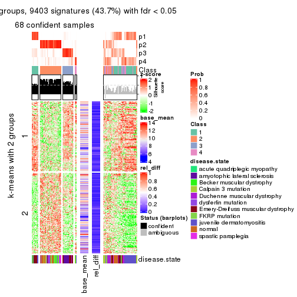</p>

</div>
<div id='tab-CV-NMF-get-signatures-4'>
<pre><code class="r">get_signatures(res, k = 5)
</code></pre>

<p></p>

</div>
<div id='tab-CV-NMF-get-signatures-5'>
<pre><code class="r">get_signatures(res, k = 6)
</code></pre>

<p></p>

</div>
</div>


Signature heatmaps where rows are not scaled:


<script>
$( function() {
	$( '#tabs-CV-NMF-get-signatures-no-scale' ).tabs();
} );
</script>
<div id='tabs-CV-NMF-get-signatures-no-scale'>
<ul>
<li><a href='#tab-CV-NMF-get-signatures-no-scale-1'>k = 2</a></li>
<li><a href='#tab-CV-NMF-get-signatures-no-scale-2'>k = 3</a></li>
<li><a href='#tab-CV-NMF-get-signatures-no-scale-3'>k = 4</a></li>
<li><a href='#tab-CV-NMF-get-signatures-no-scale-4'>k = 5</a></li>
<li><a href='#tab-CV-NMF-get-signatures-no-scale-5'>k = 6</a></li>
</ul>
<div id='tab-CV-NMF-get-signatures-no-scale-1'>
<pre><code class="r">get_signatures(res, k = 2, scale_rows = FALSE)
</code></pre>

<p></p>

</div>
<div id='tab-CV-NMF-get-signatures-no-scale-2'>
<pre><code class="r">get_signatures(res, k = 3, scale_rows = FALSE)
</code></pre>

<p></p>

</div>
<div id='tab-CV-NMF-get-signatures-no-scale-3'>
<pre><code class="r">get_signatures(res, k = 4, scale_rows = FALSE)
</code></pre>

<p></p>

</div>
<div id='tab-CV-NMF-get-signatures-no-scale-4'>
<pre><code class="r">get_signatures(res, k = 5, scale_rows = FALSE)
</code></pre>

<pre><code>#&gt; Error in mat[ceiling(1:nr/h_ratio), ceiling(1:nc/w_ratio), drop = FALSE]: subscript out of bounds
</code></pre>

<p></p>

</div>
<div id='tab-CV-NMF-get-signatures-no-scale-5'>
<pre><code class="r">get_signatures(res, k = 6, scale_rows = FALSE)
</code></pre>

<p></p>

</div>
</div>


Compare the overlap of signatures from different k:

```r
compare_signatures(res)
```


`get_signature()` returns a data frame invisibly. TO get the list of signatures, the function
call should be assigned to a variable explicitly. In following code, if `plot` argument is set
to `FALSE`, no heatmap is plotted while only the differential analysis is performed.

```r
# code only for demonstration
tb = get_signature(res, k = ..., plot = FALSE)
```

An example of the output of `tb` is:

```
#>   which_row         fdr    mean_1    mean_2 scaled_mean_1 scaled_mean_2 km
#> 1        38 0.042760348  8.373488  9.131774    -0.5533452     0.5164555  1
#> 2        40 0.018707592  7.106213  8.469186    -0.6173731     0.5762149  1
#> 3        55 0.019134737 10.221463 11.207825    -0.6159697     0.5749050  1
#> 4        59 0.006059896  5.921854  7.869574    -0.6899429     0.6439467  1
#> 5        60 0.018055526  8.928898 10.211722    -0.6204761     0.5791110  1
#> 6        98 0.009384629 15.714769 14.887706     0.6635654    -0.6193277  2
...
```

The columns in `tb` are:

1. `which_row`: row indices corresponding to the input matrix.
2. `fdr`: FDR for the differential test. 
3. `mean_x`: The mean value in group x.
4. `scaled_mean_x`: The mean value in group x after rows are scaled.
5. `km`: Row groups if k-means clustering is applied to rows.


UMAP plot which shows how samples are separated.


<script>
$( function() {
	$( '#tabs-CV-NMF-dimension-reduction' ).tabs();
} );
</script>
<div id='tabs-CV-NMF-dimension-reduction'>
<ul>
<li><a href='#tab-CV-NMF-dimension-reduction-1'>k = 2</a></li>
<li><a href='#tab-CV-NMF-dimension-reduction-2'>k = 3</a></li>
<li><a href='#tab-CV-NMF-dimension-reduction-3'>k = 4</a></li>
<li><a href='#tab-CV-NMF-dimension-reduction-4'>k = 5</a></li>
<li><a href='#tab-CV-NMF-dimension-reduction-5'>k = 6</a></li>
</ul>
<div id='tab-CV-NMF-dimension-reduction-1'>
<pre><code class="r">dimension_reduction(res, k = 2, method = &quot;UMAP&quot;)
</code></pre>

<p></p>

</div>
<div id='tab-CV-NMF-dimension-reduction-2'>
<pre><code class="r">dimension_reduction(res, k = 3, method = &quot;UMAP&quot;)
</code></pre>

<p></p>

</div>
<div id='tab-CV-NMF-dimension-reduction-3'>
<pre><code class="r">dimension_reduction(res, k = 4, method = &quot;UMAP&quot;)
</code></pre>

<p></p>

</div>
<div id='tab-CV-NMF-dimension-reduction-4'>
<pre><code class="r">dimension_reduction(res, k = 5, method = &quot;UMAP&quot;)
</code></pre>

<p></p>

</div>
<div id='tab-CV-NMF-dimension-reduction-5'>
<pre><code class="r">dimension_reduction(res, k = 6, method = &quot;UMAP&quot;)
</code></pre>

<p></p>

</div>
</div>


Following heatmap shows how subgroups are split when increasing `k`:

```r
collect_classes(res)
```


Test correlation between subgroups and known annotations. If the known
annotation is numeric, one-way ANOVA test is applied, and if the known
annotation is discrete, chi-squared contingency table test is applied.

```r
test_to_known_factors(res)
```

```
#>          n disease.state(p) k
#> CV:NMF 114         4.29e-09 2
#> CV:NMF  97         2.32e-15 3
#> CV:NMF  68         1.18e-08 4
#> CV:NMF  78         3.29e-24 5
#> CV:NMF  91         7.84e-30 6
```


If matrix rows can be associated to genes, consider to use `functional_enrichment(res,
...)` to perform function enrichment for the signature genes. See [this vignette](http://bioconductor.org/packages/devel/bioc/vignettes/cola/inst/doc/functional_enrichment.html) for more detailed explanations.


 

---------------------------------------------------


### MAD:hclust


The object with results only for a single top-value method and a single partition method 
can be extracted as:

```r
res = res_list["MAD", "hclust"]
# you can also extract it by
# res = res_list["MAD:hclust"]
```

A summary of `res` and all the functions that can be applied to it:

```r
res
```

```
#> A 'ConsensusPartition' object with k = 2, 3, 4, 5, 6.
#>   On a matrix with 21512 rows and 119 columns.
#>   Top rows (1000, 2000, 3000, 4000, 5000) are extracted by 'MAD' method.
#>   Subgroups are detected by 'hclust' method.
#>   Performed in total 1250 partitions by row resampling.
#>   Best k for subgroups seems to be 2.
#> 
#> Following methods can be applied to this 'ConsensusPartition' object:
#>  [1] "cola_report"             "collect_classes"         "collect_plots"          
#>  [4] "collect_stats"           "colnames"                "compare_signatures"     
#>  [7] "consensus_heatmap"       "dimension_reduction"     "functional_enrichment"  
#> [10] "get_anno_col"            "get_anno"                "get_classes"            
#> [13] "get_consensus"           "get_matrix"              "get_membership"         
#> [16] "get_param"               "get_signatures"          "get_stats"              
#> [19] "is_best_k"               "is_stable_k"             "membership_heatmap"     
#> [22] "ncol"                    "nrow"                    "plot_ecdf"              
#> [25] "rownames"                "select_partition_number" "show"                   
#> [28] "suggest_best_k"          "test_to_known_factors"
```

`collect_plots()` function collects all the plots made from `res` for all `k` (number of partitions)
into one single page to provide an easy and fast comparison between different `k`.

```r
collect_plots(res)
```


The plots are:

- The first row: a plot of the ECDF (empirical cumulative distribution
  function) curves of the consensus matrix for each `k` and the heatmap of
  predicted classes for each `k`.
- The second row: heatmaps of the consensus matrix for each `k`.
- The third row: heatmaps of the membership matrix for each `k`.
- The fouth row: heatmaps of the signatures for each `k`.

All the plots in panels can be made by individual functions and they are
plotted later in this section.

`select_partition_number()` produces several plots showing different
statistics for choosing "optimized" `k`. There are following statistics:

- ECDF curves of the consensus matrix for each `k`;
- 1-PAC. [The PAC
  score](https://en.wikipedia.org/wiki/Consensus_clustering#Over-interpretation_potential_of_consensus_clustering)
  measures the proportion of the ambiguous subgrouping.
- Mean silhouette score.
- Concordance. The mean probability of fiting the consensus class ids in all
  partitions.
- Area increased. Denote $A_k$ as the area under the ECDF curve for current
  `k`, the area increased is defined as $A_k - A_{k-1}$.
- Rand index. The percent of pairs of samples that are both in a same cluster
  or both are not in a same cluster in the partition of k and k-1.
- Jaccard index. The ratio of pairs of samples are both in a same cluster in
  the partition of k and k-1 and the pairs of samples are both in a same
  cluster in the partition k or k-1.

The detailed explanations of these statistics can be found in [the _cola_
vignette](http://bioconductor.org/packages/devel/bioc/vignettes/cola/inst/doc/cola.html#toc_13).

Generally speaking, lower PAC score, higher mean silhouette score or higher
concordance corresponds to better partition. Rand index and Jaccard index
measure how similar the current partition is compared to partition with `k-1`.
If they are too similar, we won't accept `k` is better than `k-1`.

```r
select_partition_number(res)
```


The numeric values for all these statistics can be obtained by `get_stats()`.

```r
get_stats(res)
```

```
#>   k 1-PAC mean_silhouette concordance area_increased  Rand Jaccard
#> 2 2 0.554           0.684       0.871         0.4682 0.522   0.522
#> 3 3 0.414           0.598       0.740         0.3011 0.639   0.436
#> 4 4 0.525           0.656       0.758         0.1034 0.833   0.598
#> 5 5 0.503           0.686       0.762         0.0569 0.937   0.783
#> 6 6 0.575           0.671       0.801         0.0507 0.996   0.983
```

`suggest_best_k()` suggests the best $k$ based on these statistics. The rules are as follows:

- All $k$ with Jaccard index larger than 0.95 are removed because increasing
  $k$ does not provide enough extra information. If all $k$ are removed, it is
  marked as no subgroup is detected.
- For all $k$ with 1-PAC score larger than 0.9, the maximal $k$ is taken as
  the best $k$, and other $k$ are marked as optional $k$.
- If it does not fit the second rule. The $k$ with the maximal vote of the
  highest 1-PAC score, highest mean silhouette, and highest concordance is
  taken as the best $k$.

```r
suggest_best_k(res)
```

```
#> [1] 2
```


Following shows the table of the partitions (You need to click the **show/hide
code output** link to see it). The membership matrix (columns with name `p*`)
is inferred by
[`clue::cl_consensus()`](https://www.rdocumentation.org/link/cl_consensus?package=clue)
function with the `SE` method. Basically the value in the membership matrix
represents the probability to belong to a certain group. The finall class
label for an item is determined with the group with highest probability it
belongs to.

In `get_classes()` function, the entropy is calculated from the membership
matrix and the silhouette score is calculated from the consensus matrix.


<script>
$( function() {
	$( '#tabs-MAD-hclust-get-classes' ).tabs();
} );
</script>
<div id='tabs-MAD-hclust-get-classes'>
<ul>
<li><a href='#tab-MAD-hclust-get-classes-1'>k = 2</a></li>
<li><a href='#tab-MAD-hclust-get-classes-2'>k = 3</a></li>
<li><a href='#tab-MAD-hclust-get-classes-3'>k = 4</a></li>
<li><a href='#tab-MAD-hclust-get-classes-4'>k = 5</a></li>
<li><a href='#tab-MAD-hclust-get-classes-5'>k = 6</a></li>
</ul>

<div id='tab-MAD-hclust-get-classes-1'>
<p><a id='tab-MAD-hclust-get-classes-1-a' style='color:#0366d6' href='#'>show/hide code output</a></p>
<pre><code class="r">cbind(get_classes(res, k = 2), get_membership(res, k = 2))
</code></pre>

<pre><code>#&gt;           class entropy silhouette    p1    p2
#&gt; GSM120719     1  0.1184      0.880 0.984 0.016
#&gt; GSM120720     1  0.1184      0.880 0.984 0.016
#&gt; GSM120765     2  0.0000      0.813 0.000 1.000
#&gt; GSM120767     2  0.0376      0.813 0.004 0.996
#&gt; GSM120784     2  0.0000      0.813 0.000 1.000
#&gt; GSM121400     1  0.9129      0.433 0.672 0.328
#&gt; GSM121401     1  0.3879      0.831 0.924 0.076
#&gt; GSM121402     2  0.0000      0.813 0.000 1.000
#&gt; GSM121403     1  0.9129      0.433 0.672 0.328
#&gt; GSM121404     2  0.3114      0.800 0.056 0.944
#&gt; GSM121405     1  0.3879      0.831 0.924 0.076
#&gt; GSM121406     2  0.0000      0.813 0.000 1.000
#&gt; GSM121408     2  0.0000      0.813 0.000 1.000
#&gt; GSM121409     1  0.9170      0.422 0.668 0.332
#&gt; GSM121410     1  0.9129      0.433 0.672 0.328
#&gt; GSM121412     2  0.0000      0.813 0.000 1.000
#&gt; GSM121413     2  0.0000      0.813 0.000 1.000
#&gt; GSM121414     2  0.0000      0.813 0.000 1.000
#&gt; GSM121415     2  0.0000      0.813 0.000 1.000
#&gt; GSM121416     2  0.0000      0.813 0.000 1.000
#&gt; GSM120591     1  0.1184      0.880 0.984 0.016
#&gt; GSM120594     1  0.1184      0.880 0.984 0.016
#&gt; GSM120718     1  0.1184      0.880 0.984 0.016
#&gt; GSM121205     1  0.0000      0.883 1.000 0.000
#&gt; GSM121206     1  0.0000      0.883 1.000 0.000
#&gt; GSM121207     1  0.0000      0.883 1.000 0.000
#&gt; GSM121208     1  0.0000      0.883 1.000 0.000
#&gt; GSM121209     1  0.0000      0.883 1.000 0.000
#&gt; GSM121210     1  0.0000      0.883 1.000 0.000
#&gt; GSM121211     1  0.0000      0.883 1.000 0.000
#&gt; GSM121212     1  0.0000      0.883 1.000 0.000
#&gt; GSM121213     1  0.0000      0.883 1.000 0.000
#&gt; GSM121214     1  0.0000      0.883 1.000 0.000
#&gt; GSM121215     1  0.0000      0.883 1.000 0.000
#&gt; GSM121216     1  0.0000      0.883 1.000 0.000
#&gt; GSM121217     1  0.0000      0.883 1.000 0.000
#&gt; GSM121218     1  0.0000      0.883 1.000 0.000
#&gt; GSM121234     1  0.0000      0.883 1.000 0.000
#&gt; GSM121243     1  0.0000      0.883 1.000 0.000
#&gt; GSM121245     1  0.0000      0.883 1.000 0.000
#&gt; GSM121246     1  0.0672      0.882 0.992 0.008
#&gt; GSM121247     1  0.0000      0.883 1.000 0.000
#&gt; GSM121248     1  0.0000      0.883 1.000 0.000
#&gt; GSM120744     2  1.0000      0.177 0.496 0.504
#&gt; GSM120745     2  1.0000      0.177 0.496 0.504
#&gt; GSM120746     2  1.0000      0.177 0.496 0.504
#&gt; GSM120747     2  1.0000      0.177 0.496 0.504
#&gt; GSM120748     2  1.0000      0.177 0.496 0.504
#&gt; GSM120749     2  1.0000      0.177 0.496 0.504
#&gt; GSM120750     2  1.0000      0.177 0.496 0.504
#&gt; GSM120751     2  1.0000      0.177 0.496 0.504
#&gt; GSM120752     2  1.0000      0.177 0.496 0.504
#&gt; GSM121336     2  0.0000      0.813 0.000 1.000
#&gt; GSM121339     2  0.8081      0.635 0.248 0.752
#&gt; GSM121349     2  0.0000      0.813 0.000 1.000
#&gt; GSM121355     2  0.0000      0.813 0.000 1.000
#&gt; GSM120757     1  0.9775      0.156 0.588 0.412
#&gt; GSM120766     2  0.9881      0.329 0.436 0.564
#&gt; GSM120770     2  0.9044      0.536 0.320 0.680
#&gt; GSM120779     1  0.9983     -0.102 0.524 0.476
#&gt; GSM120780     2  0.9881      0.329 0.436 0.564
#&gt; GSM121102     2  0.9933      0.291 0.452 0.548
#&gt; GSM121203     2  0.9933      0.291 0.452 0.548
#&gt; GSM121204     1  0.9580      0.261 0.620 0.380
#&gt; GSM121330     1  0.1184      0.880 0.984 0.016
#&gt; GSM121335     1  0.0672      0.883 0.992 0.008
#&gt; GSM121337     2  0.9491      0.466 0.368 0.632
#&gt; GSM121338     2  0.9427      0.476 0.360 0.640
#&gt; GSM121341     1  0.0672      0.883 0.992 0.008
#&gt; GSM121342     1  0.0938      0.882 0.988 0.012
#&gt; GSM121343     2  0.9491      0.462 0.368 0.632
#&gt; GSM121344     1  0.0672      0.883 0.992 0.008
#&gt; GSM121346     1  0.0672      0.883 0.992 0.008
#&gt; GSM121347     2  0.9491      0.464 0.368 0.632
#&gt; GSM121348     2  0.9988      0.217 0.480 0.520
#&gt; GSM121350     1  0.0938      0.882 0.988 0.012
#&gt; GSM121352     1  0.0938      0.882 0.988 0.012
#&gt; GSM121354     1  0.0672      0.883 0.992 0.008
#&gt; GSM120753     2  0.0000      0.813 0.000 1.000
#&gt; GSM120761     2  0.0376      0.813 0.004 0.996
#&gt; GSM120768     2  0.0376      0.813 0.004 0.996
#&gt; GSM120781     2  0.0000      0.813 0.000 1.000
#&gt; GSM120788     2  0.5178      0.767 0.116 0.884
#&gt; GSM120760     2  0.2043      0.809 0.032 0.968
#&gt; GSM120763     2  0.2423      0.807 0.040 0.960
#&gt; GSM120764     2  0.3584      0.797 0.068 0.932
#&gt; GSM120777     2  0.5737      0.754 0.136 0.864
#&gt; GSM120786     2  0.2948      0.803 0.052 0.948
#&gt; GSM121329     1  0.6623      0.715 0.828 0.172
#&gt; GSM121331     2  1.0000      0.165 0.496 0.504
#&gt; GSM121333     2  1.0000      0.165 0.496 0.504
#&gt; GSM121345     1  0.9988     -0.109 0.520 0.480
#&gt; GSM121356     1  1.0000     -0.181 0.500 0.500
#&gt; GSM120754     2  0.2948      0.802 0.052 0.948
#&gt; GSM120759     2  0.0000      0.813 0.000 1.000
#&gt; GSM120762     2  0.0376      0.813 0.004 0.996
#&gt; GSM120775     2  0.3431      0.798 0.064 0.936
#&gt; GSM120776     2  0.9170      0.530 0.332 0.668
#&gt; GSM120782     2  0.2948      0.802 0.052 0.948
#&gt; GSM120789     2  0.0672      0.813 0.008 0.992
#&gt; GSM120790     2  0.0376      0.813 0.004 0.996
#&gt; GSM120791     2  0.2043      0.809 0.032 0.968
#&gt; GSM120755     2  0.0376      0.813 0.004 0.996
#&gt; GSM120756     2  0.6048      0.743 0.148 0.852
#&gt; GSM120769     2  0.0000      0.813 0.000 1.000
#&gt; GSM120778     2  0.0672      0.813 0.008 0.992
#&gt; GSM120792     2  0.0376      0.812 0.004 0.996
#&gt; GSM121332     2  0.0376      0.813 0.004 0.996
#&gt; GSM121334     2  0.0376      0.813 0.004 0.996
#&gt; GSM121340     2  0.3274      0.797 0.060 0.940
#&gt; GSM121351     2  0.0000      0.813 0.000 1.000
#&gt; GSM121353     2  0.3431      0.797 0.064 0.936
#&gt; GSM120758     2  0.0376      0.813 0.004 0.996
#&gt; GSM120771     2  0.0938      0.813 0.012 0.988
#&gt; GSM120772     2  0.0672      0.813 0.008 0.992
#&gt; GSM120773     2  0.2423      0.807 0.040 0.960
#&gt; GSM120774     2  0.0938      0.813 0.012 0.988
#&gt; GSM120783     2  0.2423      0.807 0.040 0.960
#&gt; GSM120787     2  0.0672      0.813 0.008 0.992
</code></pre>

<script>
$('#tab-MAD-hclust-get-classes-1-a').parent().next().next().hide();
$('#tab-MAD-hclust-get-classes-1-a').click(function(){
  $('#tab-MAD-hclust-get-classes-1-a').parent().next().next().toggle();
  return(false);
});
</script>
</div>

<div id='tab-MAD-hclust-get-classes-2'>
<p><a id='tab-MAD-hclust-get-classes-2-a' style='color:#0366d6' href='#'>show/hide code output</a></p>
<pre><code class="r">cbind(get_classes(res, k = 3), get_membership(res, k = 3))
</code></pre>

<pre><code>#&gt;           class entropy silhouette    p1    p2    p3
#&gt; GSM120719     1  0.1315    0.75739 0.972 0.020 0.008
#&gt; GSM120720     1  0.1315    0.75739 0.972 0.020 0.008
#&gt; GSM120765     3  0.6286    0.10341 0.000 0.464 0.536
#&gt; GSM120767     2  0.6302    0.04755 0.000 0.520 0.480
#&gt; GSM120784     2  0.6309    0.09227 0.000 0.504 0.496
#&gt; GSM121400     1  0.7844    0.62552 0.652 0.108 0.240
#&gt; GSM121401     1  0.3310    0.73726 0.908 0.028 0.064
#&gt; GSM121402     3  0.5216    0.64115 0.000 0.260 0.740
#&gt; GSM121403     1  0.7844    0.62552 0.652 0.108 0.240
#&gt; GSM121404     3  0.6894    0.57691 0.052 0.256 0.692
#&gt; GSM121405     1  0.3310    0.73726 0.908 0.028 0.064
#&gt; GSM121406     3  0.4887    0.66038 0.000 0.228 0.772
#&gt; GSM121408     3  0.5397    0.60798 0.000 0.280 0.720
#&gt; GSM121409     1  0.7909    0.62325 0.648 0.112 0.240
#&gt; GSM121410     1  0.7844    0.62552 0.652 0.108 0.240
#&gt; GSM121412     3  0.4842    0.66109 0.000 0.224 0.776
#&gt; GSM121413     3  0.4842    0.66109 0.000 0.224 0.776
#&gt; GSM121414     3  0.4842    0.66109 0.000 0.224 0.776
#&gt; GSM121415     3  0.4842    0.66145 0.000 0.224 0.776
#&gt; GSM121416     3  0.4842    0.66145 0.000 0.224 0.776
#&gt; GSM120591     1  0.1315    0.75739 0.972 0.020 0.008
#&gt; GSM120594     1  0.1315    0.75739 0.972 0.020 0.008
#&gt; GSM120718     1  0.1315    0.75739 0.972 0.020 0.008
#&gt; GSM121205     1  0.0237    0.75505 0.996 0.000 0.004
#&gt; GSM121206     1  0.0237    0.75505 0.996 0.000 0.004
#&gt; GSM121207     1  0.0237    0.75505 0.996 0.000 0.004
#&gt; GSM121208     1  0.0237    0.75505 0.996 0.000 0.004
#&gt; GSM121209     1  0.0237    0.75505 0.996 0.000 0.004
#&gt; GSM121210     1  0.0237    0.75505 0.996 0.000 0.004
#&gt; GSM121211     1  0.0237    0.75505 0.996 0.000 0.004
#&gt; GSM121212     1  0.0237    0.75505 0.996 0.000 0.004
#&gt; GSM121213     1  0.0237    0.75505 0.996 0.000 0.004
#&gt; GSM121214     1  0.0237    0.75505 0.996 0.000 0.004
#&gt; GSM121215     1  0.0237    0.75505 0.996 0.000 0.004
#&gt; GSM121216     1  0.0237    0.75505 0.996 0.000 0.004
#&gt; GSM121217     1  0.0237    0.75505 0.996 0.000 0.004
#&gt; GSM121218     1  0.0237    0.75505 0.996 0.000 0.004
#&gt; GSM121234     1  0.0237    0.75505 0.996 0.000 0.004
#&gt; GSM121243     1  0.0237    0.75505 0.996 0.000 0.004
#&gt; GSM121245     1  0.0237    0.75505 0.996 0.000 0.004
#&gt; GSM121246     1  0.0424    0.75582 0.992 0.000 0.008
#&gt; GSM121247     1  0.0237    0.75505 0.996 0.000 0.004
#&gt; GSM121248     1  0.0237    0.75505 0.996 0.000 0.004
#&gt; GSM120744     1  0.9624    0.49406 0.472 0.272 0.256
#&gt; GSM120745     1  0.9624    0.49406 0.472 0.272 0.256
#&gt; GSM120746     1  0.9624    0.49406 0.472 0.272 0.256
#&gt; GSM120747     1  0.9624    0.49406 0.472 0.272 0.256
#&gt; GSM120748     1  0.9624    0.49406 0.472 0.272 0.256
#&gt; GSM120749     1  0.9624    0.49406 0.472 0.272 0.256
#&gt; GSM120750     1  0.9624    0.49406 0.472 0.272 0.256
#&gt; GSM120751     1  0.9624    0.49406 0.472 0.272 0.256
#&gt; GSM120752     1  0.9624    0.49406 0.472 0.272 0.256
#&gt; GSM121336     3  0.4931    0.65958 0.000 0.232 0.768
#&gt; GSM121339     3  0.9756    0.11730 0.240 0.332 0.428
#&gt; GSM121349     3  0.4887    0.66158 0.000 0.228 0.772
#&gt; GSM121355     3  0.4887    0.66158 0.000 0.228 0.772
#&gt; GSM120757     1  0.8940    0.58034 0.568 0.232 0.200
#&gt; GSM120766     1  0.9846    0.41645 0.420 0.276 0.304
#&gt; GSM120770     3  0.9970   -0.08576 0.312 0.316 0.372
#&gt; GSM120779     1  0.9304    0.53169 0.508 0.300 0.192
#&gt; GSM120780     1  0.9846    0.41645 0.420 0.276 0.304
#&gt; GSM121102     1  0.9790    0.43748 0.436 0.272 0.292
#&gt; GSM121203     1  0.9790    0.43748 0.436 0.272 0.292
#&gt; GSM121204     1  0.8528    0.59919 0.604 0.240 0.156
#&gt; GSM121330     1  0.1337    0.75761 0.972 0.016 0.012
#&gt; GSM121335     1  0.1015    0.75758 0.980 0.012 0.008
#&gt; GSM121337     1  0.9964    0.16214 0.356 0.292 0.352
#&gt; GSM121338     3  0.9904   -0.14320 0.352 0.268 0.380
#&gt; GSM121341     1  0.1015    0.75758 0.980 0.012 0.008
#&gt; GSM121342     1  0.1170    0.75732 0.976 0.016 0.008
#&gt; GSM121343     3  0.9880   -0.16694 0.356 0.260 0.384
#&gt; GSM121344     1  0.1015    0.75758 0.980 0.012 0.008
#&gt; GSM121346     1  0.1015    0.75758 0.980 0.012 0.008
#&gt; GSM121347     1  0.9940    0.17172 0.360 0.280 0.360
#&gt; GSM121348     1  0.9641    0.48612 0.464 0.296 0.240
#&gt; GSM121350     1  0.1182    0.75777 0.976 0.012 0.012
#&gt; GSM121352     1  0.1182    0.75777 0.976 0.012 0.012
#&gt; GSM121354     1  0.1015    0.75758 0.980 0.012 0.008
#&gt; GSM120753     2  0.4654    0.68589 0.000 0.792 0.208
#&gt; GSM120761     2  0.4062    0.72372 0.000 0.836 0.164
#&gt; GSM120768     2  0.4654    0.68597 0.000 0.792 0.208
#&gt; GSM120781     2  0.5098    0.64829 0.000 0.752 0.248
#&gt; GSM120788     2  0.3213    0.65225 0.092 0.900 0.008
#&gt; GSM120760     2  0.2313    0.72884 0.024 0.944 0.032
#&gt; GSM120763     2  0.2689    0.72750 0.032 0.932 0.036
#&gt; GSM120764     2  0.2269    0.70358 0.040 0.944 0.016
#&gt; GSM120777     2  0.4249    0.60903 0.108 0.864 0.028
#&gt; GSM120786     2  0.1399    0.71313 0.028 0.968 0.004
#&gt; GSM121329     1  0.5239    0.68978 0.808 0.160 0.032
#&gt; GSM121331     1  0.9498    0.50740 0.484 0.300 0.216
#&gt; GSM121333     1  0.9498    0.50740 0.484 0.300 0.216
#&gt; GSM121345     1  0.9160    0.48051 0.492 0.352 0.156
#&gt; GSM121356     1  0.9519    0.51306 0.484 0.292 0.224
#&gt; GSM120754     2  0.5514    0.68355 0.044 0.800 0.156
#&gt; GSM120759     3  0.5497    0.59274 0.000 0.292 0.708
#&gt; GSM120762     2  0.5560    0.56308 0.000 0.700 0.300
#&gt; GSM120775     2  0.5136    0.68557 0.044 0.824 0.132
#&gt; GSM120776     2  0.8570    0.19615 0.316 0.564 0.120
#&gt; GSM120782     2  0.5798    0.67590 0.044 0.780 0.176
#&gt; GSM120789     3  0.6577    0.30811 0.008 0.420 0.572
#&gt; GSM120790     3  0.5397    0.23469 0.000 0.280 0.720
#&gt; GSM120791     2  0.2269    0.73128 0.016 0.944 0.040
#&gt; GSM120755     2  0.5988    0.42373 0.000 0.632 0.368
#&gt; GSM120756     2  0.3918    0.61289 0.120 0.868 0.012
#&gt; GSM120769     2  0.4931    0.66800 0.000 0.768 0.232
#&gt; GSM120778     2  0.3038    0.73239 0.000 0.896 0.104
#&gt; GSM120792     2  0.3983    0.73206 0.004 0.852 0.144
#&gt; GSM121332     2  0.6516   -0.00739 0.004 0.516 0.480
#&gt; GSM121334     2  0.4504    0.69901 0.000 0.804 0.196
#&gt; GSM121340     2  0.3310    0.69845 0.028 0.908 0.064
#&gt; GSM121351     3  0.4931    0.65857 0.000 0.232 0.768
#&gt; GSM121353     2  0.6565    0.59320 0.048 0.720 0.232
#&gt; GSM120758     2  0.4702    0.68262 0.000 0.788 0.212
#&gt; GSM120771     2  0.4861    0.71360 0.008 0.800 0.192
#&gt; GSM120772     2  0.4409    0.71932 0.004 0.824 0.172
#&gt; GSM120773     2  0.1781    0.72476 0.020 0.960 0.020
#&gt; GSM120774     2  0.3918    0.73062 0.004 0.856 0.140
#&gt; GSM120783     2  0.1781    0.72476 0.020 0.960 0.020
#&gt; GSM120787     2  0.4178    0.71089 0.000 0.828 0.172
</code></pre>

<script>
$('#tab-MAD-hclust-get-classes-2-a').parent().next().next().hide();
$('#tab-MAD-hclust-get-classes-2-a').click(function(){
  $('#tab-MAD-hclust-get-classes-2-a').parent().next().next().toggle();
  return(false);
});
</script>
</div>

<div id='tab-MAD-hclust-get-classes-3'>
<p><a id='tab-MAD-hclust-get-classes-3-a' style='color:#0366d6' href='#'>show/hide code output</a></p>
<pre><code class="r">cbind(get_classes(res, k = 4), get_membership(res, k = 4))
</code></pre>

<pre><code>#&gt;           class entropy silhouette    p1    p2    p3    p4
#&gt; GSM120719     1  0.2216     0.8048 0.908 0.000 0.092 0.000
#&gt; GSM120720     1  0.2216     0.8048 0.908 0.000 0.092 0.000
#&gt; GSM120765     2  0.5069     0.4185 0.000 0.664 0.016 0.320
#&gt; GSM120767     2  0.5028     0.1945 0.000 0.596 0.004 0.400
#&gt; GSM120784     2  0.5905     0.1578 0.000 0.564 0.040 0.396
#&gt; GSM121400     1  0.6436    -0.2142 0.556 0.064 0.376 0.004
#&gt; GSM121401     1  0.3813     0.7082 0.828 0.024 0.148 0.000
#&gt; GSM121402     2  0.2919     0.7766 0.000 0.896 0.060 0.044
#&gt; GSM121403     1  0.6436    -0.2142 0.556 0.064 0.376 0.004
#&gt; GSM121404     2  0.4401     0.7350 0.016 0.832 0.084 0.068
#&gt; GSM121405     1  0.3813     0.7082 0.828 0.024 0.148 0.000
#&gt; GSM121406     2  0.0817     0.8066 0.000 0.976 0.000 0.024
#&gt; GSM121408     2  0.2334     0.7750 0.000 0.908 0.004 0.088
#&gt; GSM121409     1  0.6447    -0.2323 0.552 0.064 0.380 0.004
#&gt; GSM121410     1  0.6436    -0.2142 0.556 0.064 0.376 0.004
#&gt; GSM121412     2  0.0657     0.8045 0.000 0.984 0.004 0.012
#&gt; GSM121413     2  0.0657     0.8045 0.000 0.984 0.004 0.012
#&gt; GSM121414     2  0.0657     0.8045 0.000 0.984 0.004 0.012
#&gt; GSM121415     2  0.1520     0.8043 0.000 0.956 0.020 0.024
#&gt; GSM121416     2  0.1520     0.8043 0.000 0.956 0.020 0.024
#&gt; GSM120591     1  0.2216     0.8048 0.908 0.000 0.092 0.000
#&gt; GSM120594     1  0.2216     0.8048 0.908 0.000 0.092 0.000
#&gt; GSM120718     1  0.2216     0.8048 0.908 0.000 0.092 0.000
#&gt; GSM121205     1  0.0000     0.8211 1.000 0.000 0.000 0.000
#&gt; GSM121206     1  0.0000     0.8211 1.000 0.000 0.000 0.000
#&gt; GSM121207     1  0.0000     0.8211 1.000 0.000 0.000 0.000
#&gt; GSM121208     1  0.0000     0.8211 1.000 0.000 0.000 0.000
#&gt; GSM121209     1  0.0000     0.8211 1.000 0.000 0.000 0.000
#&gt; GSM121210     1  0.0000     0.8211 1.000 0.000 0.000 0.000
#&gt; GSM121211     1  0.0000     0.8211 1.000 0.000 0.000 0.000
#&gt; GSM121212     1  0.0000     0.8211 1.000 0.000 0.000 0.000
#&gt; GSM121213     1  0.0000     0.8211 1.000 0.000 0.000 0.000
#&gt; GSM121214     1  0.0000     0.8211 1.000 0.000 0.000 0.000
#&gt; GSM121215     1  0.0336     0.8212 0.992 0.000 0.008 0.000
#&gt; GSM121216     1  0.0000     0.8211 1.000 0.000 0.000 0.000
#&gt; GSM121217     1  0.0000     0.8211 1.000 0.000 0.000 0.000
#&gt; GSM121218     1  0.0000     0.8211 1.000 0.000 0.000 0.000
#&gt; GSM121234     1  0.0336     0.8212 0.992 0.000 0.008 0.000
#&gt; GSM121243     1  0.0000     0.8211 1.000 0.000 0.000 0.000
#&gt; GSM121245     1  0.0000     0.8211 1.000 0.000 0.000 0.000
#&gt; GSM121246     1  0.1489     0.8169 0.952 0.004 0.044 0.000
#&gt; GSM121247     1  0.0000     0.8211 1.000 0.000 0.000 0.000
#&gt; GSM121248     1  0.0000     0.8211 1.000 0.000 0.000 0.000
#&gt; GSM120744     3  0.7354     0.8072 0.372 0.068 0.520 0.040
#&gt; GSM120745     3  0.7354     0.8072 0.372 0.068 0.520 0.040
#&gt; GSM120746     3  0.7354     0.8072 0.372 0.068 0.520 0.040
#&gt; GSM120747     3  0.7354     0.8072 0.372 0.068 0.520 0.040
#&gt; GSM120748     3  0.7354     0.8072 0.372 0.068 0.520 0.040
#&gt; GSM120749     3  0.7354     0.8072 0.372 0.068 0.520 0.040
#&gt; GSM120750     3  0.7354     0.8072 0.372 0.068 0.520 0.040
#&gt; GSM120751     3  0.7354     0.8072 0.372 0.068 0.520 0.040
#&gt; GSM120752     3  0.7354     0.8072 0.372 0.068 0.520 0.040
#&gt; GSM121336     2  0.1004     0.8062 0.000 0.972 0.004 0.024
#&gt; GSM121339     2  0.9163     0.2028 0.192 0.460 0.128 0.220
#&gt; GSM121349     2  0.0895     0.8062 0.000 0.976 0.004 0.020
#&gt; GSM121355     2  0.0895     0.8062 0.000 0.976 0.004 0.020
#&gt; GSM120757     1  0.6342    -0.5587 0.488 0.012 0.464 0.036
#&gt; GSM120766     3  0.7542     0.8007 0.320 0.088 0.548 0.044
#&gt; GSM120770     3  0.8937     0.6475 0.240 0.248 0.440 0.072
#&gt; GSM120779     3  0.6155     0.6866 0.412 0.000 0.536 0.052
#&gt; GSM120780     3  0.7542     0.8007 0.320 0.088 0.548 0.044
#&gt; GSM121102     3  0.7564     0.8057 0.340 0.096 0.528 0.036
#&gt; GSM121203     3  0.7564     0.8057 0.340 0.096 0.528 0.036
#&gt; GSM121204     1  0.6229    -0.4333 0.528 0.000 0.416 0.056
#&gt; GSM121330     1  0.2216     0.8055 0.908 0.000 0.092 0.000
#&gt; GSM121335     1  0.2011     0.8113 0.920 0.000 0.080 0.000
#&gt; GSM121337     3  0.8657     0.7108 0.280 0.216 0.452 0.052
#&gt; GSM121338     3  0.8842     0.6441 0.280 0.280 0.392 0.048
#&gt; GSM121341     1  0.2011     0.8113 0.920 0.000 0.080 0.000
#&gt; GSM121342     1  0.2081     0.8098 0.916 0.000 0.084 0.000
#&gt; GSM121343     3  0.8769     0.6518 0.280 0.276 0.400 0.044
#&gt; GSM121344     1  0.2011     0.8113 0.920 0.000 0.080 0.000
#&gt; GSM121346     1  0.2011     0.8113 0.920 0.000 0.080 0.000
#&gt; GSM121347     3  0.8697     0.7082 0.280 0.212 0.452 0.056
#&gt; GSM121348     3  0.6681     0.7565 0.364 0.024 0.564 0.048
#&gt; GSM121350     1  0.2149     0.8073 0.912 0.000 0.088 0.000
#&gt; GSM121352     1  0.2081     0.8096 0.916 0.000 0.084 0.000
#&gt; GSM121354     1  0.2011     0.8113 0.920 0.000 0.080 0.000
#&gt; GSM120753     4  0.4343     0.6877 0.000 0.264 0.004 0.732
#&gt; GSM120761     4  0.5144     0.7343 0.000 0.216 0.052 0.732
#&gt; GSM120768     4  0.4452     0.6928 0.000 0.260 0.008 0.732
#&gt; GSM120781     4  0.4980     0.6354 0.000 0.304 0.016 0.680
#&gt; GSM120788     4  0.4657     0.7084 0.056 0.012 0.124 0.808
#&gt; GSM120760     4  0.3550     0.7578 0.000 0.044 0.096 0.860
#&gt; GSM120763     4  0.3372     0.7557 0.000 0.036 0.096 0.868
#&gt; GSM120764     4  0.3965     0.7379 0.016 0.020 0.124 0.840
#&gt; GSM120777     4  0.4989     0.6528 0.072 0.000 0.164 0.764
#&gt; GSM120786     4  0.3462     0.7448 0.004 0.020 0.116 0.860
#&gt; GSM121329     1  0.5631     0.5233 0.732 0.004 0.156 0.108
#&gt; GSM121331     3  0.6554     0.7112 0.396 0.008 0.536 0.060
#&gt; GSM121333     3  0.6554     0.7112 0.396 0.008 0.536 0.060
#&gt; GSM121345     1  0.7662    -0.5746 0.416 0.004 0.400 0.180
#&gt; GSM121356     3  0.6586     0.7219 0.388 0.012 0.544 0.056
#&gt; GSM120754     4  0.6263     0.7124 0.036 0.156 0.092 0.716
#&gt; GSM120759     2  0.4057     0.7152 0.000 0.812 0.160 0.028
#&gt; GSM120762     4  0.4964     0.4924 0.000 0.380 0.004 0.616
#&gt; GSM120775     4  0.6156     0.7160 0.036 0.132 0.104 0.728
#&gt; GSM120776     4  0.8617    -0.0642 0.264 0.040 0.264 0.432
#&gt; GSM120782     4  0.6490     0.7043 0.036 0.172 0.096 0.696
#&gt; GSM120789     2  0.5491     0.5526 0.000 0.688 0.052 0.260
#&gt; GSM120790     3  0.4904    -0.0462 0.000 0.216 0.744 0.040
#&gt; GSM120791     4  0.4083     0.7622 0.000 0.068 0.100 0.832
#&gt; GSM120755     4  0.5132     0.3246 0.000 0.448 0.004 0.548
#&gt; GSM120756     4  0.4791     0.6700 0.080 0.000 0.136 0.784
#&gt; GSM120769     4  0.4647     0.6606 0.000 0.288 0.008 0.704
#&gt; GSM120778     4  0.3047     0.7487 0.000 0.116 0.012 0.872
#&gt; GSM120792     4  0.4303     0.7524 0.004 0.184 0.020 0.792
#&gt; GSM121332     2  0.5805     0.2153 0.000 0.576 0.036 0.388
#&gt; GSM121334     4  0.5055     0.7089 0.000 0.256 0.032 0.712
#&gt; GSM121340     4  0.1938     0.6904 0.000 0.012 0.052 0.936
#&gt; GSM121351     2  0.0817     0.8065 0.000 0.976 0.000 0.024
#&gt; GSM121353     4  0.7106     0.5536 0.032 0.268 0.092 0.608
#&gt; GSM120758     4  0.4482     0.6897 0.000 0.264 0.008 0.728
#&gt; GSM120771     4  0.5559     0.7124 0.000 0.240 0.064 0.696
#&gt; GSM120772     4  0.4049     0.7267 0.000 0.212 0.008 0.780
#&gt; GSM120773     4  0.3716     0.7603 0.000 0.052 0.096 0.852
#&gt; GSM120774     4  0.3757     0.7504 0.000 0.152 0.020 0.828
#&gt; GSM120783     4  0.3716     0.7603 0.000 0.052 0.096 0.852
#&gt; GSM120787     4  0.3893     0.7280 0.000 0.196 0.008 0.796
</code></pre>

<script>
$('#tab-MAD-hclust-get-classes-3-a').parent().next().next().hide();
$('#tab-MAD-hclust-get-classes-3-a').click(function(){
  $('#tab-MAD-hclust-get-classes-3-a').parent().next().next().toggle();
  return(false);
});
</script>
</div>

<div id='tab-MAD-hclust-get-classes-4'>
<p><a id='tab-MAD-hclust-get-classes-4-a' style='color:#0366d6' href='#'>show/hide code output</a></p>
<pre><code class="r">cbind(get_classes(res, k = 5), get_membership(res, k = 5))
</code></pre>

<pre><code>#&gt;           class entropy silhouette    p1    p2    p3    p4    p5
#&gt; GSM120719     1  0.4613   0.779161 0.620 0.000 0.020 0.000 0.360
#&gt; GSM120720     1  0.4613   0.779161 0.620 0.000 0.020 0.000 0.360
#&gt; GSM120765     2  0.5559   0.370539 0.004 0.612 0.040 0.324 0.020
#&gt; GSM120767     2  0.5503   0.143294 0.008 0.548 0.040 0.400 0.004
#&gt; GSM120784     2  0.6582   0.080729 0.004 0.488 0.044 0.396 0.068
#&gt; GSM121400     5  0.4803   0.454768 0.252 0.020 0.020 0.004 0.704
#&gt; GSM121401     1  0.5101   0.670050 0.552 0.008 0.024 0.000 0.416
#&gt; GSM121402     2  0.3864   0.668285 0.004 0.840 0.032 0.052 0.072
#&gt; GSM121403     5  0.4803   0.454768 0.252 0.020 0.020 0.004 0.704
#&gt; GSM121404     2  0.5073   0.622732 0.012 0.768 0.044 0.068 0.108
#&gt; GSM121405     1  0.5101   0.670050 0.552 0.008 0.024 0.000 0.416
#&gt; GSM121406     2  0.0955   0.733286 0.004 0.968 0.000 0.028 0.000
#&gt; GSM121408     2  0.3002   0.704600 0.004 0.872 0.028 0.092 0.004
#&gt; GSM121409     5  0.4777   0.465875 0.248 0.020 0.020 0.004 0.708
#&gt; GSM121410     5  0.4803   0.454768 0.252 0.020 0.020 0.004 0.704
#&gt; GSM121412     2  0.0968   0.721574 0.000 0.972 0.012 0.004 0.012
#&gt; GSM121413     2  0.0968   0.721574 0.000 0.972 0.012 0.004 0.012
#&gt; GSM121414     2  0.0968   0.721574 0.000 0.972 0.012 0.004 0.012
#&gt; GSM121415     2  0.1954   0.727440 0.000 0.932 0.008 0.028 0.032
#&gt; GSM121416     2  0.1954   0.727440 0.000 0.932 0.008 0.028 0.032
#&gt; GSM120591     1  0.4613   0.779161 0.620 0.000 0.020 0.000 0.360
#&gt; GSM120594     1  0.4613   0.779161 0.620 0.000 0.020 0.000 0.360
#&gt; GSM120718     1  0.4613   0.779161 0.620 0.000 0.020 0.000 0.360
#&gt; GSM121205     1  0.3003   0.846886 0.812 0.000 0.000 0.000 0.188
#&gt; GSM121206     1  0.3003   0.846886 0.812 0.000 0.000 0.000 0.188
#&gt; GSM121207     1  0.3003   0.846886 0.812 0.000 0.000 0.000 0.188
#&gt; GSM121208     1  0.3003   0.846886 0.812 0.000 0.000 0.000 0.188
#&gt; GSM121209     1  0.3003   0.846886 0.812 0.000 0.000 0.000 0.188
#&gt; GSM121210     1  0.3003   0.846886 0.812 0.000 0.000 0.000 0.188
#&gt; GSM121211     1  0.3003   0.846886 0.812 0.000 0.000 0.000 0.188
#&gt; GSM121212     1  0.3003   0.846886 0.812 0.000 0.000 0.000 0.188
#&gt; GSM121213     1  0.3003   0.846886 0.812 0.000 0.000 0.000 0.188
#&gt; GSM121214     1  0.3003   0.846886 0.812 0.000 0.000 0.000 0.188
#&gt; GSM121215     1  0.3366   0.843215 0.768 0.000 0.000 0.000 0.232
#&gt; GSM121216     1  0.3003   0.846886 0.812 0.000 0.000 0.000 0.188
#&gt; GSM121217     1  0.3003   0.846886 0.812 0.000 0.000 0.000 0.188
#&gt; GSM121218     1  0.3003   0.846886 0.812 0.000 0.000 0.000 0.188
#&gt; GSM121234     1  0.3366   0.843215 0.768 0.000 0.000 0.000 0.232
#&gt; GSM121243     1  0.3003   0.846886 0.812 0.000 0.000 0.000 0.188
#&gt; GSM121245     1  0.3003   0.846886 0.812 0.000 0.000 0.000 0.188
#&gt; GSM121246     1  0.3838   0.830060 0.716 0.000 0.004 0.000 0.280
#&gt; GSM121247     1  0.3003   0.846886 0.812 0.000 0.000 0.000 0.188
#&gt; GSM121248     1  0.3003   0.846886 0.812 0.000 0.000 0.000 0.188
#&gt; GSM120744     5  0.1808   0.803236 0.044 0.012 0.000 0.008 0.936
#&gt; GSM120745     5  0.1808   0.803236 0.044 0.012 0.000 0.008 0.936
#&gt; GSM120746     5  0.1808   0.803236 0.044 0.012 0.000 0.008 0.936
#&gt; GSM120747     5  0.1808   0.803236 0.044 0.012 0.000 0.008 0.936
#&gt; GSM120748     5  0.1808   0.803236 0.044 0.012 0.000 0.008 0.936
#&gt; GSM120749     5  0.1808   0.803236 0.044 0.012 0.000 0.008 0.936
#&gt; GSM120750     5  0.1808   0.803236 0.044 0.012 0.000 0.008 0.936
#&gt; GSM120751     5  0.1808   0.803236 0.044 0.012 0.000 0.008 0.936
#&gt; GSM120752     5  0.1808   0.803236 0.044 0.012 0.000 0.008 0.936
#&gt; GSM121336     2  0.1200   0.731691 0.000 0.964 0.012 0.016 0.008
#&gt; GSM121339     2  0.8223   0.121902 0.036 0.388 0.044 0.228 0.304
#&gt; GSM121349     2  0.0960   0.731370 0.000 0.972 0.008 0.016 0.004
#&gt; GSM121355     2  0.0960   0.731370 0.000 0.972 0.008 0.016 0.004
#&gt; GSM120757     5  0.4280   0.649530 0.192 0.000 0.028 0.016 0.764
#&gt; GSM120766     5  0.2559   0.769048 0.008 0.032 0.024 0.024 0.912
#&gt; GSM120770     5  0.4959   0.508225 0.000 0.184 0.016 0.072 0.728
#&gt; GSM120779     5  0.4233   0.732870 0.108 0.000 0.064 0.024 0.804
#&gt; GSM120780     5  0.2559   0.769048 0.008 0.032 0.024 0.024 0.912
#&gt; GSM121102     5  0.1729   0.782088 0.012 0.032 0.004 0.008 0.944
#&gt; GSM121203     5  0.1729   0.782088 0.012 0.032 0.004 0.008 0.944
#&gt; GSM121204     5  0.5149   0.553924 0.232 0.000 0.044 0.028 0.696
#&gt; GSM121330     1  0.4639   0.794898 0.632 0.000 0.024 0.000 0.344
#&gt; GSM121335     1  0.4524   0.803857 0.644 0.000 0.020 0.000 0.336
#&gt; GSM121337     5  0.4590   0.638958 0.004 0.140 0.032 0.044 0.780
#&gt; GSM121338     5  0.5211   0.543665 0.004 0.212 0.024 0.052 0.708
#&gt; GSM121341     1  0.4524   0.803857 0.644 0.000 0.020 0.000 0.336
#&gt; GSM121342     1  0.4608   0.801592 0.640 0.000 0.024 0.000 0.336
#&gt; GSM121343     5  0.5115   0.556242 0.004 0.208 0.024 0.048 0.716
#&gt; GSM121344     1  0.4524   0.803857 0.644 0.000 0.020 0.000 0.336
#&gt; GSM121346     1  0.4524   0.803857 0.644 0.000 0.020 0.000 0.336
#&gt; GSM121347     5  0.4648   0.633498 0.004 0.140 0.028 0.052 0.776
#&gt; GSM121348     5  0.3373   0.760224 0.052 0.008 0.056 0.016 0.868
#&gt; GSM121350     1  0.4555   0.797606 0.636 0.000 0.020 0.000 0.344
#&gt; GSM121352     1  0.4540   0.801084 0.640 0.000 0.020 0.000 0.340
#&gt; GSM121354     1  0.4524   0.803857 0.644 0.000 0.020 0.000 0.336
#&gt; GSM120753     4  0.4530   0.683531 0.004 0.216 0.028 0.740 0.012
#&gt; GSM120761     4  0.4636   0.725551 0.000 0.172 0.020 0.756 0.052
#&gt; GSM120768     4  0.4292   0.686825 0.000 0.216 0.024 0.748 0.012
#&gt; GSM120781     4  0.5289   0.631303 0.008 0.248 0.040 0.684 0.020
#&gt; GSM120788     4  0.4634   0.681640 0.044 0.004 0.028 0.772 0.152
#&gt; GSM120760     4  0.3549   0.750905 0.004 0.024 0.024 0.848 0.100
#&gt; GSM120763     4  0.3527   0.747819 0.004 0.024 0.028 0.852 0.092
#&gt; GSM120764     4  0.4202   0.719789 0.016 0.008 0.040 0.804 0.132
#&gt; GSM120777     4  0.5028   0.619573 0.040 0.000 0.036 0.720 0.204
#&gt; GSM120786     4  0.3189   0.728046 0.004 0.004 0.016 0.848 0.128
#&gt; GSM121329     1  0.6500   0.494164 0.492 0.000 0.032 0.092 0.384
#&gt; GSM121331     5  0.4093   0.740359 0.088 0.000 0.072 0.024 0.816
#&gt; GSM121333     5  0.4093   0.740359 0.088 0.000 0.072 0.024 0.816
#&gt; GSM121345     5  0.6057   0.598656 0.156 0.000 0.048 0.132 0.664
#&gt; GSM121356     5  0.3828   0.746494 0.080 0.000 0.068 0.020 0.832
#&gt; GSM120754     4  0.5342   0.708855 0.000 0.100 0.032 0.720 0.148
#&gt; GSM120759     2  0.4671   0.508588 0.000 0.740 0.200 0.020 0.040
#&gt; GSM120762     4  0.5663   0.518467 0.008 0.304 0.056 0.620 0.012
#&gt; GSM120775     4  0.5096   0.711258 0.000 0.084 0.028 0.736 0.152
#&gt; GSM120776     4  0.7248   0.000222 0.120 0.012 0.040 0.416 0.412
#&gt; GSM120782     4  0.5366   0.705196 0.000 0.112 0.028 0.716 0.144
#&gt; GSM120789     2  0.6534   0.486801 0.004 0.596 0.080 0.260 0.060
#&gt; GSM120790     3  0.5538   0.000000 0.000 0.100 0.688 0.024 0.188
#&gt; GSM120791     4  0.3802   0.753223 0.000 0.036 0.020 0.824 0.120
#&gt; GSM120755     4  0.5716   0.355724 0.008 0.388 0.048 0.548 0.008
#&gt; GSM120756     4  0.5177   0.638975 0.068 0.000 0.040 0.732 0.160
#&gt; GSM120769     4  0.5174   0.657550 0.008 0.224 0.048 0.704 0.016
#&gt; GSM120778     4  0.3606   0.737051 0.012 0.072 0.064 0.848 0.004
#&gt; GSM120792     4  0.4449   0.740800 0.004 0.156 0.028 0.780 0.032
#&gt; GSM121332     2  0.6376   0.119991 0.004 0.496 0.040 0.404 0.056
#&gt; GSM121334     4  0.4929   0.704023 0.004 0.216 0.016 0.720 0.044
#&gt; GSM121340     4  0.6164   0.297066 0.156 0.000 0.236 0.596 0.012
#&gt; GSM121351     2  0.1267   0.731360 0.000 0.960 0.024 0.012 0.004
#&gt; GSM121353     4  0.7092   0.562295 0.040 0.220 0.040 0.592 0.108
#&gt; GSM120758     4  0.4323   0.685888 0.000 0.220 0.024 0.744 0.012
#&gt; GSM120771     4  0.5196   0.707649 0.000 0.188 0.028 0.716 0.068
#&gt; GSM120772     4  0.4429   0.719985 0.008 0.156 0.044 0.780 0.012
#&gt; GSM120773     4  0.3739   0.753023 0.004 0.028 0.024 0.836 0.108
#&gt; GSM120774     4  0.4491   0.737843 0.016 0.100 0.056 0.804 0.024
#&gt; GSM120783     4  0.3739   0.753023 0.004 0.028 0.024 0.836 0.108
#&gt; GSM120787     4  0.5178   0.705416 0.016 0.124 0.096 0.748 0.016
</code></pre>

<script>
$('#tab-MAD-hclust-get-classes-4-a').parent().next().next().hide();
$('#tab-MAD-hclust-get-classes-4-a').click(function(){
  $('#tab-MAD-hclust-get-classes-4-a').parent().next().next().toggle();
  return(false);
});
</script>
</div>

<div id='tab-MAD-hclust-get-classes-5'>
<p><a id='tab-MAD-hclust-get-classes-5-a' style='color:#0366d6' href='#'>show/hide code output</a></p>
<pre><code class="r">cbind(get_classes(res, k = 6), get_membership(res, k = 6))
</code></pre>

<pre><code>#&gt;           class entropy silhouette    p1    p2    p3    p4    p5    p6
#&gt; GSM120719     1  0.3828     0.7396 0.724 0.000 0.016 0.000 0.008 0.252
#&gt; GSM120720     1  0.3828     0.7396 0.724 0.000 0.016 0.000 0.008 0.252
#&gt; GSM120765     2  0.5436     0.3630 0.000 0.596 0.012 0.316 0.040 0.036
#&gt; GSM120767     2  0.5461     0.1103 0.000 0.524 0.016 0.396 0.052 0.012
#&gt; GSM120784     2  0.6404     0.0845 0.000 0.464 0.020 0.388 0.044 0.084
#&gt; GSM121400     6  0.4512     0.5074 0.304 0.008 0.020 0.000 0.012 0.656
#&gt; GSM121401     1  0.4216     0.6801 0.676 0.000 0.020 0.000 0.012 0.292
#&gt; GSM121402     2  0.4204     0.6457 0.000 0.804 0.056 0.044 0.024 0.072
#&gt; GSM121403     6  0.4512     0.5074 0.304 0.008 0.020 0.000 0.012 0.656
#&gt; GSM121404     2  0.5173     0.5907 0.012 0.736 0.044 0.036 0.036 0.136
#&gt; GSM121405     1  0.4216     0.6801 0.676 0.000 0.020 0.000 0.012 0.292
#&gt; GSM121406     2  0.1129     0.7176 0.000 0.964 0.012 0.012 0.004 0.008
#&gt; GSM121408     2  0.3350     0.6826 0.000 0.844 0.024 0.096 0.024 0.012
#&gt; GSM121409     6  0.4495     0.5164 0.300 0.008 0.020 0.000 0.012 0.660
#&gt; GSM121410     6  0.4512     0.5074 0.304 0.008 0.020 0.000 0.012 0.656
#&gt; GSM121412     2  0.0891     0.7054 0.000 0.968 0.024 0.000 0.000 0.008
#&gt; GSM121413     2  0.0891     0.7054 0.000 0.968 0.024 0.000 0.000 0.008
#&gt; GSM121414     2  0.0891     0.7054 0.000 0.968 0.024 0.000 0.000 0.008
#&gt; GSM121415     2  0.2007     0.7089 0.000 0.924 0.012 0.016 0.008 0.040
#&gt; GSM121416     2  0.2007     0.7089 0.000 0.924 0.012 0.016 0.008 0.040
#&gt; GSM120591     1  0.3828     0.7396 0.724 0.000 0.016 0.000 0.008 0.252
#&gt; GSM120594     1  0.3828     0.7396 0.724 0.000 0.016 0.000 0.008 0.252
#&gt; GSM120718     1  0.3828     0.7396 0.724 0.000 0.016 0.000 0.008 0.252
#&gt; GSM121205     1  0.0363     0.8304 0.988 0.000 0.000 0.000 0.000 0.012
#&gt; GSM121206     1  0.0363     0.8304 0.988 0.000 0.000 0.000 0.000 0.012
#&gt; GSM121207     1  0.0363     0.8304 0.988 0.000 0.000 0.000 0.000 0.012
#&gt; GSM121208     1  0.0363     0.8304 0.988 0.000 0.000 0.000 0.000 0.012
#&gt; GSM121209     1  0.0363     0.8304 0.988 0.000 0.000 0.000 0.000 0.012
#&gt; GSM121210     1  0.0363     0.8304 0.988 0.000 0.000 0.000 0.000 0.012
#&gt; GSM121211     1  0.0363     0.8304 0.988 0.000 0.000 0.000 0.000 0.012
#&gt; GSM121212     1  0.0363     0.8304 0.988 0.000 0.000 0.000 0.000 0.012
#&gt; GSM121213     1  0.0363     0.8304 0.988 0.000 0.000 0.000 0.000 0.012
#&gt; GSM121214     1  0.0363     0.8304 0.988 0.000 0.000 0.000 0.000 0.012
#&gt; GSM121215     1  0.1501     0.8289 0.924 0.000 0.000 0.000 0.000 0.076
#&gt; GSM121216     1  0.0363     0.8304 0.988 0.000 0.000 0.000 0.000 0.012
#&gt; GSM121217     1  0.0363     0.8304 0.988 0.000 0.000 0.000 0.000 0.012
#&gt; GSM121218     1  0.0363     0.8304 0.988 0.000 0.000 0.000 0.000 0.012
#&gt; GSM121234     1  0.1501     0.8289 0.924 0.000 0.000 0.000 0.000 0.076
#&gt; GSM121243     1  0.0363     0.8304 0.988 0.000 0.000 0.000 0.000 0.012
#&gt; GSM121245     1  0.0363     0.8304 0.988 0.000 0.000 0.000 0.000 0.012
#&gt; GSM121246     1  0.2320     0.8157 0.864 0.000 0.000 0.000 0.004 0.132
#&gt; GSM121247     1  0.0363     0.8304 0.988 0.000 0.000 0.000 0.000 0.012
#&gt; GSM121248     1  0.0363     0.8304 0.988 0.000 0.000 0.000 0.000 0.012
#&gt; GSM120744     6  0.1732     0.8060 0.072 0.004 0.000 0.004 0.000 0.920
#&gt; GSM120745     6  0.1732     0.8060 0.072 0.004 0.000 0.004 0.000 0.920
#&gt; GSM120746     6  0.1732     0.8060 0.072 0.004 0.000 0.004 0.000 0.920
#&gt; GSM120747     6  0.1732     0.8060 0.072 0.004 0.000 0.004 0.000 0.920
#&gt; GSM120748     6  0.1732     0.8060 0.072 0.004 0.000 0.004 0.000 0.920
#&gt; GSM120749     6  0.1732     0.8060 0.072 0.004 0.000 0.004 0.000 0.920
#&gt; GSM120750     6  0.1732     0.8060 0.072 0.004 0.000 0.004 0.000 0.920
#&gt; GSM120751     6  0.1732     0.8060 0.072 0.004 0.000 0.004 0.000 0.920
#&gt; GSM120752     6  0.1732     0.8060 0.072 0.004 0.000 0.004 0.000 0.920
#&gt; GSM121336     2  0.1325     0.7176 0.000 0.956 0.004 0.016 0.012 0.012
#&gt; GSM121339     2  0.7925     0.1463 0.040 0.348 0.028 0.236 0.036 0.312
#&gt; GSM121349     2  0.1121     0.7170 0.000 0.964 0.004 0.016 0.008 0.008
#&gt; GSM121355     2  0.1121     0.7170 0.000 0.964 0.004 0.016 0.008 0.008
#&gt; GSM120757     6  0.4861     0.6746 0.236 0.000 0.036 0.028 0.012 0.688
#&gt; GSM120766     6  0.2743     0.7783 0.036 0.024 0.036 0.008 0.004 0.892
#&gt; GSM120770     6  0.4763     0.6018 0.016 0.176 0.012 0.056 0.008 0.732
#&gt; GSM120779     6  0.5057     0.7230 0.140 0.000 0.072 0.032 0.028 0.728
#&gt; GSM120780     6  0.2743     0.7783 0.036 0.024 0.036 0.008 0.004 0.892
#&gt; GSM121102     6  0.1624     0.7891 0.040 0.020 0.000 0.004 0.000 0.936
#&gt; GSM121203     6  0.1624     0.7891 0.040 0.020 0.000 0.004 0.000 0.936
#&gt; GSM121204     6  0.5727     0.5889 0.280 0.000 0.044 0.036 0.032 0.608
#&gt; GSM121330     1  0.3748     0.7771 0.756 0.000 0.020 0.000 0.012 0.212
#&gt; GSM121335     1  0.3607     0.7849 0.768 0.000 0.016 0.000 0.012 0.204
#&gt; GSM121337     6  0.4502     0.6768 0.020 0.108 0.028 0.028 0.028 0.788
#&gt; GSM121338     6  0.5046     0.6022 0.020 0.184 0.032 0.020 0.024 0.720
#&gt; GSM121341     1  0.3607     0.7849 0.768 0.000 0.016 0.000 0.012 0.204
#&gt; GSM121342     1  0.3691     0.7829 0.764 0.000 0.020 0.000 0.012 0.204
#&gt; GSM121343     6  0.4984     0.6127 0.020 0.176 0.032 0.020 0.024 0.728
#&gt; GSM121344     1  0.3607     0.7849 0.768 0.000 0.016 0.000 0.012 0.204
#&gt; GSM121346     1  0.3607     0.7849 0.768 0.000 0.016 0.000 0.012 0.204
#&gt; GSM121347     6  0.4603     0.6724 0.020 0.104 0.028 0.032 0.032 0.784
#&gt; GSM121348     6  0.4021     0.7646 0.080 0.004 0.068 0.020 0.016 0.812
#&gt; GSM121350     1  0.3665     0.7800 0.760 0.000 0.016 0.000 0.012 0.212
#&gt; GSM121352     1  0.3636     0.7825 0.764 0.000 0.016 0.000 0.012 0.208
#&gt; GSM121354     1  0.3607     0.7849 0.768 0.000 0.016 0.000 0.012 0.204
#&gt; GSM120753     4  0.4322     0.6826 0.000 0.176 0.008 0.752 0.044 0.020
#&gt; GSM120761     4  0.4412     0.7083 0.000 0.144 0.016 0.764 0.020 0.056
#&gt; GSM120768     4  0.4141     0.6852 0.000 0.172 0.008 0.764 0.040 0.016
#&gt; GSM120781     4  0.5019     0.6392 0.000 0.200 0.016 0.700 0.056 0.028
#&gt; GSM120788     4  0.4762     0.6112 0.044 0.000 0.012 0.752 0.084 0.108
#&gt; GSM120760     4  0.3733     0.7010 0.000 0.020 0.012 0.824 0.064 0.080
#&gt; GSM120763     4  0.3693     0.6957 0.000 0.020 0.008 0.824 0.076 0.072
#&gt; GSM120764     4  0.3996     0.6525 0.004 0.004 0.008 0.792 0.084 0.108
#&gt; GSM120777     4  0.5271     0.5498 0.040 0.000 0.012 0.696 0.088 0.164
#&gt; GSM120786     4  0.3299     0.6696 0.000 0.000 0.012 0.836 0.060 0.092
#&gt; GSM121329     1  0.6136     0.5504 0.600 0.000 0.020 0.068 0.072 0.240
#&gt; GSM121331     6  0.4625     0.7436 0.112 0.000 0.072 0.020 0.032 0.764
#&gt; GSM121333     6  0.4625     0.7436 0.112 0.000 0.072 0.020 0.032 0.764
#&gt; GSM121345     6  0.6618     0.5736 0.184 0.000 0.024 0.108 0.100 0.584
#&gt; GSM121356     6  0.4465     0.7483 0.104 0.000 0.072 0.020 0.028 0.776
#&gt; GSM120754     4  0.4873     0.6590 0.004 0.068 0.016 0.740 0.028 0.144
#&gt; GSM120759     2  0.4023     0.4844 0.000 0.704 0.264 0.004 0.000 0.028
#&gt; GSM120762     4  0.5601     0.5285 0.000 0.268 0.020 0.620 0.064 0.028
#&gt; GSM120775     4  0.4847     0.6527 0.004 0.056 0.016 0.744 0.036 0.144
#&gt; GSM120776     4  0.7070     0.0696 0.148 0.004 0.032 0.420 0.036 0.360
#&gt; GSM120782     4  0.4772     0.6638 0.004 0.072 0.016 0.744 0.020 0.144
#&gt; GSM120789     2  0.6527     0.4582 0.000 0.556 0.104 0.248 0.016 0.076
#&gt; GSM120790     3  0.2177     0.0000 0.000 0.032 0.908 0.008 0.000 0.052
#&gt; GSM120791     4  0.3811     0.7087 0.000 0.032 0.012 0.820 0.044 0.092
#&gt; GSM120755     4  0.5637     0.3902 0.000 0.340 0.012 0.560 0.064 0.024
#&gt; GSM120756     4  0.5390     0.5531 0.060 0.000 0.012 0.700 0.104 0.124
#&gt; GSM120769     4  0.4939     0.6545 0.000 0.184 0.016 0.712 0.064 0.024
#&gt; GSM120778     4  0.3178     0.6804 0.000 0.028 0.008 0.836 0.124 0.004
#&gt; GSM120792     4  0.4091     0.7162 0.000 0.116 0.012 0.796 0.036 0.040
#&gt; GSM121332     2  0.6056     0.0730 0.000 0.460 0.020 0.420 0.024 0.076
#&gt; GSM121334     4  0.4714     0.6871 0.000 0.192 0.020 0.724 0.020 0.044
#&gt; GSM121340     5  0.2219     0.0000 0.000 0.000 0.000 0.136 0.864 0.000
#&gt; GSM121351     2  0.1741     0.7153 0.000 0.936 0.036 0.012 0.008 0.008
#&gt; GSM121353     4  0.7040     0.4967 0.024 0.208 0.020 0.560 0.080 0.108
#&gt; GSM120758     4  0.4174     0.6854 0.000 0.176 0.008 0.760 0.040 0.016
#&gt; GSM120771     4  0.4839     0.6968 0.000 0.160 0.028 0.728 0.012 0.072
#&gt; GSM120772     4  0.4065     0.6980 0.000 0.108 0.024 0.800 0.052 0.016
#&gt; GSM120773     4  0.3681     0.7009 0.000 0.016 0.016 0.828 0.060 0.080
#&gt; GSM120774     4  0.4676     0.6399 0.000 0.040 0.020 0.752 0.144 0.044
#&gt; GSM120783     4  0.3681     0.7006 0.000 0.016 0.016 0.828 0.060 0.080
#&gt; GSM120787     4  0.5315     0.5712 0.000 0.032 0.036 0.688 0.196 0.048
</code></pre>

<script>
$('#tab-MAD-hclust-get-classes-5-a').parent().next().next().hide();
$('#tab-MAD-hclust-get-classes-5-a').click(function(){
  $('#tab-MAD-hclust-get-classes-5-a').parent().next().next().toggle();
  return(false);
});
</script>
</div>
</div>

Heatmaps for the consensus matrix. It visualizes the probability of two
samples to be in a same group.


<script>
$( function() {
	$( '#tabs-MAD-hclust-consensus-heatmap' ).tabs();
} );
</script>
<div id='tabs-MAD-hclust-consensus-heatmap'>
<ul>
<li><a href='#tab-MAD-hclust-consensus-heatmap-1'>k = 2</a></li>
<li><a href='#tab-MAD-hclust-consensus-heatmap-2'>k = 3</a></li>
<li><a href='#tab-MAD-hclust-consensus-heatmap-3'>k = 4</a></li>
<li><a href='#tab-MAD-hclust-consensus-heatmap-4'>k = 5</a></li>
<li><a href='#tab-MAD-hclust-consensus-heatmap-5'>k = 6</a></li>
</ul>
<div id='tab-MAD-hclust-consensus-heatmap-1'>
<pre><code class="r">consensus_heatmap(res, k = 2)
</code></pre>

<p></p>

</div>
<div id='tab-MAD-hclust-consensus-heatmap-2'>
<pre><code class="r">consensus_heatmap(res, k = 3)
</code></pre>

<p></p>

</div>
<div id='tab-MAD-hclust-consensus-heatmap-3'>
<pre><code class="r">consensus_heatmap(res, k = 4)
</code></pre>

<p></p>

</div>
<div id='tab-MAD-hclust-consensus-heatmap-4'>
<pre><code class="r">consensus_heatmap(res, k = 5)
</code></pre>

<p></p>

</div>
<div id='tab-MAD-hclust-consensus-heatmap-5'>
<pre><code class="r">consensus_heatmap(res, k = 6)
</code></pre>

<p></p>

</div>
</div>

Heatmaps for the membership of samples in all partitions to see how consistent they are:


<script>
$( function() {
	$( '#tabs-MAD-hclust-membership-heatmap' ).tabs();
} );
</script>
<div id='tabs-MAD-hclust-membership-heatmap'>
<ul>
<li><a href='#tab-MAD-hclust-membership-heatmap-1'>k = 2</a></li>
<li><a href='#tab-MAD-hclust-membership-heatmap-2'>k = 3</a></li>
<li><a href='#tab-MAD-hclust-membership-heatmap-3'>k = 4</a></li>
<li><a href='#tab-MAD-hclust-membership-heatmap-4'>k = 5</a></li>
<li><a href='#tab-MAD-hclust-membership-heatmap-5'>k = 6</a></li>
</ul>
<div id='tab-MAD-hclust-membership-heatmap-1'>
<pre><code class="r">membership_heatmap(res, k = 2)
</code></pre>

<p></p>

</div>
<div id='tab-MAD-hclust-membership-heatmap-2'>
<pre><code class="r">membership_heatmap(res, k = 3)
</code></pre>

<p></p>

</div>
<div id='tab-MAD-hclust-membership-heatmap-3'>
<pre><code class="r">membership_heatmap(res, k = 4)
</code></pre>

<p></p>

</div>
<div id='tab-MAD-hclust-membership-heatmap-4'>
<pre><code class="r">membership_heatmap(res, k = 5)
</code></pre>

<p></p>

</div>
<div id='tab-MAD-hclust-membership-heatmap-5'>
<pre><code class="r">membership_heatmap(res, k = 6)
</code></pre>

<p></p>

</div>
</div>

As soon as we have had the classes for columns, we can look for signatures
which are significantly different between classes which can be candidate marks
for certain classes. Following are the heatmaps for signatures.


Signature heatmaps where rows are scaled:


<script>
$( function() {
	$( '#tabs-MAD-hclust-get-signatures' ).tabs();
} );
</script>
<div id='tabs-MAD-hclust-get-signatures'>
<ul>
<li><a href='#tab-MAD-hclust-get-signatures-1'>k = 2</a></li>
<li><a href='#tab-MAD-hclust-get-signatures-2'>k = 3</a></li>
<li><a href='#tab-MAD-hclust-get-signatures-3'>k = 4</a></li>
<li><a href='#tab-MAD-hclust-get-signatures-4'>k = 5</a></li>
<li><a href='#tab-MAD-hclust-get-signatures-5'>k = 6</a></li>
</ul>
<div id='tab-MAD-hclust-get-signatures-1'>
<pre><code class="r">get_signatures(res, k = 2)
</code></pre>

<p></p>

</div>
<div id='tab-MAD-hclust-get-signatures-2'>
<pre><code class="r">get_signatures(res, k = 3)
</code></pre>

<p>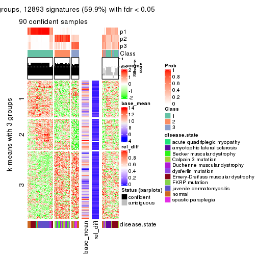</p>

</div>
<div id='tab-MAD-hclust-get-signatures-3'>
<pre><code class="r">get_signatures(res, k = 4)
</code></pre>

<p></p>

</div>
<div id='tab-MAD-hclust-get-signatures-4'>
<pre><code class="r">get_signatures(res, k = 5)
</code></pre>

<p></p>

</div>
<div id='tab-MAD-hclust-get-signatures-5'>
<pre><code class="r">get_signatures(res, k = 6)
</code></pre>

<p></p>

</div>
</div>


Signature heatmaps where rows are not scaled:


<script>
$( function() {
	$( '#tabs-MAD-hclust-get-signatures-no-scale' ).tabs();
} );
</script>
<div id='tabs-MAD-hclust-get-signatures-no-scale'>
<ul>
<li><a href='#tab-MAD-hclust-get-signatures-no-scale-1'>k = 2</a></li>
<li><a href='#tab-MAD-hclust-get-signatures-no-scale-2'>k = 3</a></li>
<li><a href='#tab-MAD-hclust-get-signatures-no-scale-3'>k = 4</a></li>
<li><a href='#tab-MAD-hclust-get-signatures-no-scale-4'>k = 5</a></li>
<li><a href='#tab-MAD-hclust-get-signatures-no-scale-5'>k = 6</a></li>
</ul>
<div id='tab-MAD-hclust-get-signatures-no-scale-1'>
<pre><code class="r">get_signatures(res, k = 2, scale_rows = FALSE)
</code></pre>

<p></p>

</div>
<div id='tab-MAD-hclust-get-signatures-no-scale-2'>
<pre><code class="r">get_signatures(res, k = 3, scale_rows = FALSE)
</code></pre>

<p></p>

</div>
<div id='tab-MAD-hclust-get-signatures-no-scale-3'>
<pre><code class="r">get_signatures(res, k = 4, scale_rows = FALSE)
</code></pre>

<p></p>

</div>
<div id='tab-MAD-hclust-get-signatures-no-scale-4'>
<pre><code class="r">get_signatures(res, k = 5, scale_rows = FALSE)
</code></pre>

<p></p>

</div>
<div id='tab-MAD-hclust-get-signatures-no-scale-5'>
<pre><code class="r">get_signatures(res, k = 6, scale_rows = FALSE)
</code></pre>

<p></p>

</div>
</div>


Compare the overlap of signatures from different k:

```r
compare_signatures(res)
```


`get_signature()` returns a data frame invisibly. TO get the list of signatures, the function
call should be assigned to a variable explicitly. In following code, if `plot` argument is set
to `FALSE`, no heatmap is plotted while only the differential analysis is performed.

```r
# code only for demonstration
tb = get_signature(res, k = ..., plot = FALSE)
```

An example of the output of `tb` is:

```
#>   which_row         fdr    mean_1    mean_2 scaled_mean_1 scaled_mean_2 km
#> 1        38 0.042760348  8.373488  9.131774    -0.5533452     0.5164555  1
#> 2        40 0.018707592  7.106213  8.469186    -0.6173731     0.5762149  1
#> 3        55 0.019134737 10.221463 11.207825    -0.6159697     0.5749050  1
#> 4        59 0.006059896  5.921854  7.869574    -0.6899429     0.6439467  1
#> 5        60 0.018055526  8.928898 10.211722    -0.6204761     0.5791110  1
#> 6        98 0.009384629 15.714769 14.887706     0.6635654    -0.6193277  2
...
```

The columns in `tb` are:

1. `which_row`: row indices corresponding to the input matrix.
2. `fdr`: FDR for the differential test. 
3. `mean_x`: The mean value in group x.
4. `scaled_mean_x`: The mean value in group x after rows are scaled.
5. `km`: Row groups if k-means clustering is applied to rows.


UMAP plot which shows how samples are separated.


<script>
$( function() {
	$( '#tabs-MAD-hclust-dimension-reduction' ).tabs();
} );
</script>
<div id='tabs-MAD-hclust-dimension-reduction'>
<ul>
<li><a href='#tab-MAD-hclust-dimension-reduction-1'>k = 2</a></li>
<li><a href='#tab-MAD-hclust-dimension-reduction-2'>k = 3</a></li>
<li><a href='#tab-MAD-hclust-dimension-reduction-3'>k = 4</a></li>
<li><a href='#tab-MAD-hclust-dimension-reduction-4'>k = 5</a></li>
<li><a href='#tab-MAD-hclust-dimension-reduction-5'>k = 6</a></li>
</ul>
<div id='tab-MAD-hclust-dimension-reduction-1'>
<pre><code class="r">dimension_reduction(res, k = 2, method = &quot;UMAP&quot;)
</code></pre>

<p></p>

</div>
<div id='tab-MAD-hclust-dimension-reduction-2'>
<pre><code class="r">dimension_reduction(res, k = 3, method = &quot;UMAP&quot;)
</code></pre>

<p></p>

</div>
<div id='tab-MAD-hclust-dimension-reduction-3'>
<pre><code class="r">dimension_reduction(res, k = 4, method = &quot;UMAP&quot;)
</code></pre>

<p></p>

</div>
<div id='tab-MAD-hclust-dimension-reduction-4'>
<pre><code class="r">dimension_reduction(res, k = 5, method = &quot;UMAP&quot;)
</code></pre>

<p></p>

</div>
<div id='tab-MAD-hclust-dimension-reduction-5'>
<pre><code class="r">dimension_reduction(res, k = 6, method = &quot;UMAP&quot;)
</code></pre>

<p>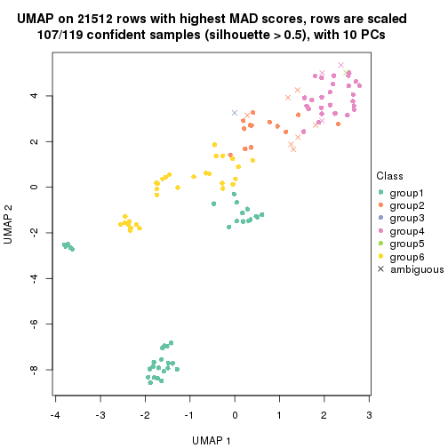</p>

</div>
</div>


Following heatmap shows how subgroups are split when increasing `k`:

```r
collect_classes(res)
```


Test correlation between subgroups and known annotations. If the known
annotation is numeric, one-way ANOVA test is applied, and if the known
annotation is discrete, chi-squared contingency table test is applied.

```r
test_to_known_factors(res)
```

```
#>              n disease.state(p) k
#> MAD:hclust  90         1.24e-11 2
#> MAD:hclust  90         1.40e-16 3
#> MAD:hclust 103         1.13e-27 4
#> MAD:hclust 104         4.61e-29 5
#> MAD:hclust 107         3.50e-27 6
```


If matrix rows can be associated to genes, consider to use `functional_enrichment(res,
...)` to perform function enrichment for the signature genes. See [this vignette](http://bioconductor.org/packages/devel/bioc/vignettes/cola/inst/doc/functional_enrichment.html) for more detailed explanations.


 

---------------------------------------------------


### MAD:kmeans


The object with results only for a single top-value method and a single partition method 
can be extracted as:

```r
res = res_list["MAD", "kmeans"]
# you can also extract it by
# res = res_list["MAD:kmeans"]
```

A summary of `res` and all the functions that can be applied to it:

```r
res
```

```
#> A 'ConsensusPartition' object with k = 2, 3, 4, 5, 6.
#>   On a matrix with 21512 rows and 119 columns.
#>   Top rows (1000, 2000, 3000, 4000, 5000) are extracted by 'MAD' method.
#>   Subgroups are detected by 'kmeans' method.
#>   Performed in total 1250 partitions by row resampling.
#>   Best k for subgroups seems to be 2.
#> 
#> Following methods can be applied to this 'ConsensusPartition' object:
#>  [1] "cola_report"             "collect_classes"         "collect_plots"          
#>  [4] "collect_stats"           "colnames"                "compare_signatures"     
#>  [7] "consensus_heatmap"       "dimension_reduction"     "functional_enrichment"  
#> [10] "get_anno_col"            "get_anno"                "get_classes"            
#> [13] "get_consensus"           "get_matrix"              "get_membership"         
#> [16] "get_param"               "get_signatures"          "get_stats"              
#> [19] "is_best_k"               "is_stable_k"             "membership_heatmap"     
#> [22] "ncol"                    "nrow"                    "plot_ecdf"              
#> [25] "rownames"                "select_partition_number" "show"                   
#> [28] "suggest_best_k"          "test_to_known_factors"
```

`collect_plots()` function collects all the plots made from `res` for all `k` (number of partitions)
into one single page to provide an easy and fast comparison between different `k`.

```r
collect_plots(res)
```


The plots are:

- The first row: a plot of the ECDF (empirical cumulative distribution
  function) curves of the consensus matrix for each `k` and the heatmap of
  predicted classes for each `k`.
- The second row: heatmaps of the consensus matrix for each `k`.
- The third row: heatmaps of the membership matrix for each `k`.
- The fouth row: heatmaps of the signatures for each `k`.

All the plots in panels can be made by individual functions and they are
plotted later in this section.

`select_partition_number()` produces several plots showing different
statistics for choosing "optimized" `k`. There are following statistics:

- ECDF curves of the consensus matrix for each `k`;
- 1-PAC. [The PAC
  score](https://en.wikipedia.org/wiki/Consensus_clustering#Over-interpretation_potential_of_consensus_clustering)
  measures the proportion of the ambiguous subgrouping.
- Mean silhouette score.
- Concordance. The mean probability of fiting the consensus class ids in all
  partitions.
- Area increased. Denote $A_k$ as the area under the ECDF curve for current
  `k`, the area increased is defined as $A_k - A_{k-1}$.
- Rand index. The percent of pairs of samples that are both in a same cluster
  or both are not in a same cluster in the partition of k and k-1.
- Jaccard index. The ratio of pairs of samples are both in a same cluster in
  the partition of k and k-1 and the pairs of samples are both in a same
  cluster in the partition k or k-1.

The detailed explanations of these statistics can be found in [the _cola_
vignette](http://bioconductor.org/packages/devel/bioc/vignettes/cola/inst/doc/cola.html#toc_13).

Generally speaking, lower PAC score, higher mean silhouette score or higher
concordance corresponds to better partition. Rand index and Jaccard index
measure how similar the current partition is compared to partition with `k-1`.
If they are too similar, we won't accept `k` is better than `k-1`.

```r
select_partition_number(res)
```


The numeric values for all these statistics can be obtained by `get_stats()`.

```r
get_stats(res)
```

```
#>   k 1-PAC mean_silhouette concordance area_increased  Rand Jaccard
#> 2 2 0.896           0.920       0.961         0.4945 0.496   0.496
#> 3 3 0.739           0.899       0.925         0.3194 0.799   0.615
#> 4 4 0.680           0.736       0.805         0.1340 0.865   0.630
#> 5 5 0.724           0.680       0.768         0.0628 0.945   0.799
#> 6 6 0.722           0.583       0.696         0.0407 0.929   0.714
```

`suggest_best_k()` suggests the best $k$ based on these statistics. The rules are as follows:

- All $k$ with Jaccard index larger than 0.95 are removed because increasing
  $k$ does not provide enough extra information. If all $k$ are removed, it is
  marked as no subgroup is detected.
- For all $k$ with 1-PAC score larger than 0.9, the maximal $k$ is taken as
  the best $k$, and other $k$ are marked as optional $k$.
- If it does not fit the second rule. The $k$ with the maximal vote of the
  highest 1-PAC score, highest mean silhouette, and highest concordance is
  taken as the best $k$.

```r
suggest_best_k(res)
```

```
#> [1] 2
```


Following shows the table of the partitions (You need to click the **show/hide
code output** link to see it). The membership matrix (columns with name `p*`)
is inferred by
[`clue::cl_consensus()`](https://www.rdocumentation.org/link/cl_consensus?package=clue)
function with the `SE` method. Basically the value in the membership matrix
represents the probability to belong to a certain group. The finall class
label for an item is determined with the group with highest probability it
belongs to.

In `get_classes()` function, the entropy is calculated from the membership
matrix and the silhouette score is calculated from the consensus matrix.


<script>
$( function() {
	$( '#tabs-MAD-kmeans-get-classes' ).tabs();
} );
</script>
<div id='tabs-MAD-kmeans-get-classes'>
<ul>
<li><a href='#tab-MAD-kmeans-get-classes-1'>k = 2</a></li>
<li><a href='#tab-MAD-kmeans-get-classes-2'>k = 3</a></li>
<li><a href='#tab-MAD-kmeans-get-classes-3'>k = 4</a></li>
<li><a href='#tab-MAD-kmeans-get-classes-4'>k = 5</a></li>
<li><a href='#tab-MAD-kmeans-get-classes-5'>k = 6</a></li>
</ul>

<div id='tab-MAD-kmeans-get-classes-1'>
<p><a id='tab-MAD-kmeans-get-classes-1-a' style='color:#0366d6' href='#'>show/hide code output</a></p>
<pre><code class="r">cbind(get_classes(res, k = 2), get_membership(res, k = 2))
</code></pre>

<pre><code>#&gt;           class entropy silhouette    p1    p2
#&gt; GSM120719     1  0.0000      0.919 1.000 0.000
#&gt; GSM120720     1  0.0000      0.919 1.000 0.000
#&gt; GSM120765     2  0.0000      0.997 0.000 1.000
#&gt; GSM120767     2  0.0000      0.997 0.000 1.000
#&gt; GSM120784     2  0.0000      0.997 0.000 1.000
#&gt; GSM121400     1  0.0000      0.919 1.000 0.000
#&gt; GSM121401     1  0.0000      0.919 1.000 0.000
#&gt; GSM121402     2  0.0000      0.997 0.000 1.000
#&gt; GSM121403     1  0.9129      0.603 0.672 0.328
#&gt; GSM121404     2  0.0000      0.997 0.000 1.000
#&gt; GSM121405     1  0.0000      0.919 1.000 0.000
#&gt; GSM121406     2  0.0000      0.997 0.000 1.000
#&gt; GSM121408     2  0.0000      0.997 0.000 1.000
#&gt; GSM121409     1  0.3274      0.888 0.940 0.060
#&gt; GSM121410     1  0.0938      0.913 0.988 0.012
#&gt; GSM121412     2  0.0000      0.997 0.000 1.000
#&gt; GSM121413     2  0.0000      0.997 0.000 1.000
#&gt; GSM121414     2  0.0000      0.997 0.000 1.000
#&gt; GSM121415     2  0.0000      0.997 0.000 1.000
#&gt; GSM121416     2  0.0000      0.997 0.000 1.000
#&gt; GSM120591     1  0.0000      0.919 1.000 0.000
#&gt; GSM120594     1  0.0000      0.919 1.000 0.000
#&gt; GSM120718     1  0.0000      0.919 1.000 0.000
#&gt; GSM121205     1  0.0000      0.919 1.000 0.000
#&gt; GSM121206     1  0.0000      0.919 1.000 0.000
#&gt; GSM121207     1  0.0000      0.919 1.000 0.000
#&gt; GSM121208     1  0.0000      0.919 1.000 0.000
#&gt; GSM121209     1  0.0000      0.919 1.000 0.000
#&gt; GSM121210     1  0.0000      0.919 1.000 0.000
#&gt; GSM121211     1  0.0000      0.919 1.000 0.000
#&gt; GSM121212     1  0.0000      0.919 1.000 0.000
#&gt; GSM121213     1  0.0000      0.919 1.000 0.000
#&gt; GSM121214     1  0.0000      0.919 1.000 0.000
#&gt; GSM121215     1  0.0000      0.919 1.000 0.000
#&gt; GSM121216     1  0.0000      0.919 1.000 0.000
#&gt; GSM121217     1  0.0000      0.919 1.000 0.000
#&gt; GSM121218     1  0.0000      0.919 1.000 0.000
#&gt; GSM121234     1  0.0000      0.919 1.000 0.000
#&gt; GSM121243     1  0.0000      0.919 1.000 0.000
#&gt; GSM121245     1  0.0000      0.919 1.000 0.000
#&gt; GSM121246     1  0.0000      0.919 1.000 0.000
#&gt; GSM121247     1  0.0000      0.919 1.000 0.000
#&gt; GSM121248     1  0.0000      0.919 1.000 0.000
#&gt; GSM120744     1  0.9580      0.512 0.620 0.380
#&gt; GSM120745     1  0.4161      0.873 0.916 0.084
#&gt; GSM120746     1  0.9491      0.535 0.632 0.368
#&gt; GSM120747     1  0.9552      0.520 0.624 0.376
#&gt; GSM120748     2  0.4431      0.886 0.092 0.908
#&gt; GSM120749     1  0.9129      0.603 0.672 0.328
#&gt; GSM120750     1  0.9608      0.503 0.616 0.384
#&gt; GSM120751     1  0.9522      0.527 0.628 0.372
#&gt; GSM120752     1  0.8207      0.702 0.744 0.256
#&gt; GSM121336     2  0.0000      0.997 0.000 1.000
#&gt; GSM121339     2  0.0000      0.997 0.000 1.000
#&gt; GSM121349     2  0.0000      0.997 0.000 1.000
#&gt; GSM121355     2  0.0000      0.997 0.000 1.000
#&gt; GSM120757     1  0.9358      0.564 0.648 0.352
#&gt; GSM120766     1  0.9661      0.486 0.608 0.392
#&gt; GSM120770     2  0.0000      0.997 0.000 1.000
#&gt; GSM120779     1  0.4022      0.876 0.920 0.080
#&gt; GSM120780     2  0.3879      0.907 0.076 0.924
#&gt; GSM121102     2  0.0000      0.997 0.000 1.000
#&gt; GSM121203     1  0.9661      0.486 0.608 0.392
#&gt; GSM121204     1  0.0000      0.919 1.000 0.000
#&gt; GSM121330     1  0.0000      0.919 1.000 0.000
#&gt; GSM121335     1  0.0000      0.919 1.000 0.000
#&gt; GSM121337     2  0.0000      0.997 0.000 1.000
#&gt; GSM121338     2  0.0000      0.997 0.000 1.000
#&gt; GSM121341     1  0.0000      0.919 1.000 0.000
#&gt; GSM121342     1  0.0000      0.919 1.000 0.000
#&gt; GSM121343     2  0.0000      0.997 0.000 1.000
#&gt; GSM121344     1  0.0000      0.919 1.000 0.000
#&gt; GSM121346     1  0.0000      0.919 1.000 0.000
#&gt; GSM121347     2  0.0000      0.997 0.000 1.000
#&gt; GSM121348     2  0.0000      0.997 0.000 1.000
#&gt; GSM121350     1  0.0000      0.919 1.000 0.000
#&gt; GSM121352     1  0.0000      0.919 1.000 0.000
#&gt; GSM121354     1  0.0000      0.919 1.000 0.000
#&gt; GSM120753     2  0.0000      0.997 0.000 1.000
#&gt; GSM120761     2  0.0000      0.997 0.000 1.000
#&gt; GSM120768     2  0.0000      0.997 0.000 1.000
#&gt; GSM120781     2  0.0000      0.997 0.000 1.000
#&gt; GSM120788     2  0.0000      0.997 0.000 1.000
#&gt; GSM120760     2  0.0000      0.997 0.000 1.000
#&gt; GSM120763     2  0.0000      0.997 0.000 1.000
#&gt; GSM120764     2  0.0000      0.997 0.000 1.000
#&gt; GSM120777     2  0.0000      0.997 0.000 1.000
#&gt; GSM120786     2  0.0000      0.997 0.000 1.000
#&gt; GSM121329     1  0.0000      0.919 1.000 0.000
#&gt; GSM121331     1  0.4690      0.861 0.900 0.100
#&gt; GSM121333     1  0.3879      0.878 0.924 0.076
#&gt; GSM121345     1  0.4161      0.873 0.916 0.084
#&gt; GSM121356     1  0.3879      0.878 0.924 0.076
#&gt; GSM120754     2  0.0000      0.997 0.000 1.000
#&gt; GSM120759     2  0.0000      0.997 0.000 1.000
#&gt; GSM120762     2  0.0000      0.997 0.000 1.000
#&gt; GSM120775     2  0.0000      0.997 0.000 1.000
#&gt; GSM120776     2  0.0000      0.997 0.000 1.000
#&gt; GSM120782     2  0.0000      0.997 0.000 1.000
#&gt; GSM120789     2  0.0000      0.997 0.000 1.000
#&gt; GSM120790     2  0.0000      0.997 0.000 1.000
#&gt; GSM120791     2  0.0000      0.997 0.000 1.000
#&gt; GSM120755     2  0.0000      0.997 0.000 1.000
#&gt; GSM120756     2  0.0000      0.997 0.000 1.000
#&gt; GSM120769     2  0.0000      0.997 0.000 1.000
#&gt; GSM120778     2  0.0000      0.997 0.000 1.000
#&gt; GSM120792     2  0.0000      0.997 0.000 1.000
#&gt; GSM121332     2  0.0000      0.997 0.000 1.000
#&gt; GSM121334     2  0.0000      0.997 0.000 1.000
#&gt; GSM121340     2  0.0000      0.997 0.000 1.000
#&gt; GSM121351     2  0.0000      0.997 0.000 1.000
#&gt; GSM121353     2  0.0000      0.997 0.000 1.000
#&gt; GSM120758     2  0.0000      0.997 0.000 1.000
#&gt; GSM120771     2  0.0000      0.997 0.000 1.000
#&gt; GSM120772     2  0.0000      0.997 0.000 1.000
#&gt; GSM120773     2  0.0000      0.997 0.000 1.000
#&gt; GSM120774     2  0.0000      0.997 0.000 1.000
#&gt; GSM120783     2  0.0000      0.997 0.000 1.000
#&gt; GSM120787     2  0.0000      0.997 0.000 1.000
</code></pre>

<script>
$('#tab-MAD-kmeans-get-classes-1-a').parent().next().next().hide();
$('#tab-MAD-kmeans-get-classes-1-a').click(function(){
  $('#tab-MAD-kmeans-get-classes-1-a').parent().next().next().toggle();
  return(false);
});
</script>
</div>

<div id='tab-MAD-kmeans-get-classes-2'>
<p><a id='tab-MAD-kmeans-get-classes-2-a' style='color:#0366d6' href='#'>show/hide code output</a></p>
<pre><code class="r">cbind(get_classes(res, k = 3), get_membership(res, k = 3))
</code></pre>

<pre><code>#&gt;           class entropy silhouette    p1    p2    p3
#&gt; GSM120719     1  0.0747      0.957 0.984 0.000 0.016
#&gt; GSM120720     1  0.1643      0.939 0.956 0.000 0.044
#&gt; GSM120765     2  0.3941      0.896 0.000 0.844 0.156
#&gt; GSM120767     2  0.2711      0.917 0.000 0.912 0.088
#&gt; GSM120784     2  0.3941      0.896 0.000 0.844 0.156
#&gt; GSM121400     3  0.3267      0.902 0.116 0.000 0.884
#&gt; GSM121401     3  0.5016      0.775 0.240 0.000 0.760
#&gt; GSM121402     2  0.3752      0.900 0.000 0.856 0.144
#&gt; GSM121403     3  0.0848      0.859 0.008 0.008 0.984
#&gt; GSM121404     2  0.4605      0.857 0.000 0.796 0.204
#&gt; GSM121405     3  0.3752      0.885 0.144 0.000 0.856
#&gt; GSM121406     2  0.3941      0.896 0.000 0.844 0.156
#&gt; GSM121408     2  0.3551      0.905 0.000 0.868 0.132
#&gt; GSM121409     3  0.3349      0.905 0.108 0.004 0.888
#&gt; GSM121410     3  0.3425      0.903 0.112 0.004 0.884
#&gt; GSM121412     2  0.3941      0.896 0.000 0.844 0.156
#&gt; GSM121413     2  0.3941      0.896 0.000 0.844 0.156
#&gt; GSM121414     2  0.3941      0.896 0.000 0.844 0.156
#&gt; GSM121415     2  0.3941      0.896 0.000 0.844 0.156
#&gt; GSM121416     2  0.3941      0.896 0.000 0.844 0.156
#&gt; GSM120591     1  0.5948      0.374 0.640 0.000 0.360
#&gt; GSM120594     1  0.1643      0.939 0.956 0.000 0.044
#&gt; GSM120718     1  0.0747      0.957 0.984 0.000 0.016
#&gt; GSM121205     1  0.0000      0.960 1.000 0.000 0.000
#&gt; GSM121206     1  0.0000      0.960 1.000 0.000 0.000
#&gt; GSM121207     1  0.0000      0.960 1.000 0.000 0.000
#&gt; GSM121208     1  0.0000      0.960 1.000 0.000 0.000
#&gt; GSM121209     1  0.0000      0.960 1.000 0.000 0.000
#&gt; GSM121210     1  0.0000      0.960 1.000 0.000 0.000
#&gt; GSM121211     1  0.0000      0.960 1.000 0.000 0.000
#&gt; GSM121212     1  0.0000      0.960 1.000 0.000 0.000
#&gt; GSM121213     1  0.0000      0.960 1.000 0.000 0.000
#&gt; GSM121214     1  0.0000      0.960 1.000 0.000 0.000
#&gt; GSM121215     1  0.0000      0.960 1.000 0.000 0.000
#&gt; GSM121216     1  0.0000      0.960 1.000 0.000 0.000
#&gt; GSM121217     1  0.0000      0.960 1.000 0.000 0.000
#&gt; GSM121218     1  0.0000      0.960 1.000 0.000 0.000
#&gt; GSM121234     1  0.0000      0.960 1.000 0.000 0.000
#&gt; GSM121243     1  0.0000      0.960 1.000 0.000 0.000
#&gt; GSM121245     1  0.0000      0.960 1.000 0.000 0.000
#&gt; GSM121246     1  0.0424      0.959 0.992 0.000 0.008
#&gt; GSM121247     1  0.0000      0.960 1.000 0.000 0.000
#&gt; GSM121248     1  0.0000      0.960 1.000 0.000 0.000
#&gt; GSM120744     3  0.3193      0.907 0.100 0.004 0.896
#&gt; GSM120745     3  0.3551      0.891 0.132 0.000 0.868
#&gt; GSM120746     3  0.3193      0.907 0.100 0.004 0.896
#&gt; GSM120747     3  0.3193      0.907 0.100 0.004 0.896
#&gt; GSM120748     3  0.0237      0.859 0.000 0.004 0.996
#&gt; GSM120749     3  0.3193      0.907 0.100 0.004 0.896
#&gt; GSM120750     3  0.3193      0.907 0.100 0.004 0.896
#&gt; GSM120751     3  0.3193      0.907 0.100 0.004 0.896
#&gt; GSM120752     3  0.3192      0.903 0.112 0.000 0.888
#&gt; GSM121336     2  0.3941      0.896 0.000 0.844 0.156
#&gt; GSM121339     2  0.4002      0.894 0.000 0.840 0.160
#&gt; GSM121349     2  0.3941      0.896 0.000 0.844 0.156
#&gt; GSM121355     2  0.3941      0.896 0.000 0.844 0.156
#&gt; GSM120757     3  0.4045      0.900 0.104 0.024 0.872
#&gt; GSM120766     3  0.3415      0.902 0.080 0.020 0.900
#&gt; GSM120770     2  0.5835      0.662 0.000 0.660 0.340
#&gt; GSM120779     3  0.4811      0.877 0.148 0.024 0.828
#&gt; GSM120780     3  0.0000      0.860 0.000 0.000 1.000
#&gt; GSM121102     3  0.1163      0.847 0.000 0.028 0.972
#&gt; GSM121203     3  0.2496      0.897 0.068 0.004 0.928
#&gt; GSM121204     3  0.4178      0.861 0.172 0.000 0.828
#&gt; GSM121330     1  0.2066      0.927 0.940 0.000 0.060
#&gt; GSM121335     1  0.0747      0.957 0.984 0.000 0.016
#&gt; GSM121337     2  0.5760      0.673 0.000 0.672 0.328
#&gt; GSM121338     3  0.2261      0.821 0.000 0.068 0.932
#&gt; GSM121341     1  0.0747      0.957 0.984 0.000 0.016
#&gt; GSM121342     1  0.0747      0.957 0.984 0.000 0.016
#&gt; GSM121343     3  0.2261      0.821 0.000 0.068 0.932
#&gt; GSM121344     1  0.0747      0.957 0.984 0.000 0.016
#&gt; GSM121346     1  0.4931      0.692 0.768 0.000 0.232
#&gt; GSM121347     3  0.5591      0.439 0.000 0.304 0.696
#&gt; GSM121348     3  0.1643      0.849 0.000 0.044 0.956
#&gt; GSM121350     1  0.4750      0.720 0.784 0.000 0.216
#&gt; GSM121352     1  0.2625      0.903 0.916 0.000 0.084
#&gt; GSM121354     1  0.1289      0.948 0.968 0.000 0.032
#&gt; GSM120753     2  0.0000      0.929 0.000 1.000 0.000
#&gt; GSM120761     2  0.0000      0.929 0.000 1.000 0.000
#&gt; GSM120768     2  0.0000      0.929 0.000 1.000 0.000
#&gt; GSM120781     2  0.0000      0.929 0.000 1.000 0.000
#&gt; GSM120788     2  0.0747      0.925 0.000 0.984 0.016
#&gt; GSM120760     2  0.0237      0.928 0.000 0.996 0.004
#&gt; GSM120763     2  0.0237      0.928 0.000 0.996 0.004
#&gt; GSM120764     2  0.0747      0.925 0.000 0.984 0.016
#&gt; GSM120777     2  0.0747      0.925 0.000 0.984 0.016
#&gt; GSM120786     2  0.0747      0.925 0.000 0.984 0.016
#&gt; GSM121329     1  0.1753      0.935 0.952 0.000 0.048
#&gt; GSM121331     3  0.4811      0.877 0.148 0.024 0.828
#&gt; GSM121333     3  0.4811      0.877 0.148 0.024 0.828
#&gt; GSM121345     3  0.5028      0.880 0.132 0.040 0.828
#&gt; GSM121356     3  0.4618      0.883 0.136 0.024 0.840
#&gt; GSM120754     2  0.0747      0.925 0.000 0.984 0.016
#&gt; GSM120759     2  0.3686      0.902 0.000 0.860 0.140
#&gt; GSM120762     2  0.0000      0.929 0.000 1.000 0.000
#&gt; GSM120775     2  0.0747      0.925 0.000 0.984 0.016
#&gt; GSM120776     3  0.5098      0.725 0.000 0.248 0.752
#&gt; GSM120782     2  0.0747      0.927 0.000 0.984 0.016
#&gt; GSM120789     2  0.1031      0.928 0.000 0.976 0.024
#&gt; GSM120790     2  0.3686      0.903 0.000 0.860 0.140
#&gt; GSM120791     2  0.0237      0.928 0.000 0.996 0.004
#&gt; GSM120755     2  0.0892      0.927 0.000 0.980 0.020
#&gt; GSM120756     2  0.0747      0.925 0.000 0.984 0.016
#&gt; GSM120769     2  0.0000      0.929 0.000 1.000 0.000
#&gt; GSM120778     2  0.0000      0.929 0.000 1.000 0.000
#&gt; GSM120792     2  0.0237      0.929 0.000 0.996 0.004
#&gt; GSM121332     2  0.2959      0.914 0.000 0.900 0.100
#&gt; GSM121334     2  0.0000      0.929 0.000 1.000 0.000
#&gt; GSM121340     2  0.0424      0.928 0.000 0.992 0.008
#&gt; GSM121351     2  0.3941      0.896 0.000 0.844 0.156
#&gt; GSM121353     2  0.0747      0.925 0.000 0.984 0.016
#&gt; GSM120758     2  0.0000      0.929 0.000 1.000 0.000
#&gt; GSM120771     2  0.2878      0.915 0.000 0.904 0.096
#&gt; GSM120772     2  0.0000      0.929 0.000 1.000 0.000
#&gt; GSM120773     2  0.0237      0.928 0.000 0.996 0.004
#&gt; GSM120774     2  0.0000      0.929 0.000 1.000 0.000
#&gt; GSM120783     2  0.0747      0.925 0.000 0.984 0.016
#&gt; GSM120787     2  0.0000      0.929 0.000 1.000 0.000
</code></pre>

<script>
$('#tab-MAD-kmeans-get-classes-2-a').parent().next().next().hide();
$('#tab-MAD-kmeans-get-classes-2-a').click(function(){
  $('#tab-MAD-kmeans-get-classes-2-a').parent().next().next().toggle();
  return(false);
});
</script>
</div>

<div id='tab-MAD-kmeans-get-classes-3'>
<p><a id='tab-MAD-kmeans-get-classes-3-a' style='color:#0366d6' href='#'>show/hide code output</a></p>
<pre><code class="r">cbind(get_classes(res, k = 4), get_membership(res, k = 4))
</code></pre>

<pre><code>#&gt;           class entropy silhouette    p1    p2    p3    p4
#&gt; GSM120719     1  0.4036     0.8601 0.836 0.000 0.076 0.088
#&gt; GSM120720     1  0.5080     0.8064 0.764 0.000 0.144 0.092
#&gt; GSM120765     2  0.0000     0.8799 0.000 1.000 0.000 0.000
#&gt; GSM120767     2  0.0336     0.8748 0.000 0.992 0.008 0.000
#&gt; GSM120784     2  0.0000     0.8799 0.000 1.000 0.000 0.000
#&gt; GSM121400     3  0.3232     0.7598 0.016 0.004 0.872 0.108
#&gt; GSM121401     3  0.4961     0.6589 0.116 0.004 0.784 0.096
#&gt; GSM121402     2  0.0000     0.8799 0.000 1.000 0.000 0.000
#&gt; GSM121403     3  0.3160     0.7635 0.000 0.020 0.872 0.108
#&gt; GSM121404     2  0.3306     0.6876 0.000 0.840 0.156 0.004
#&gt; GSM121405     3  0.4205     0.7119 0.068 0.004 0.832 0.096
#&gt; GSM121406     2  0.0000     0.8799 0.000 1.000 0.000 0.000
#&gt; GSM121408     2  0.0000     0.8799 0.000 1.000 0.000 0.000
#&gt; GSM121409     3  0.2983     0.7640 0.008 0.004 0.880 0.108
#&gt; GSM121410     3  0.3232     0.7598 0.016 0.004 0.872 0.108
#&gt; GSM121412     2  0.0376     0.8754 0.000 0.992 0.004 0.004
#&gt; GSM121413     2  0.0376     0.8754 0.000 0.992 0.004 0.004
#&gt; GSM121414     2  0.0376     0.8754 0.000 0.992 0.004 0.004
#&gt; GSM121415     2  0.0000     0.8799 0.000 1.000 0.000 0.000
#&gt; GSM121416     2  0.0000     0.8799 0.000 1.000 0.000 0.000
#&gt; GSM120591     3  0.6737    -0.0617 0.420 0.000 0.488 0.092
#&gt; GSM120594     1  0.5080     0.8064 0.764 0.000 0.144 0.092
#&gt; GSM120718     1  0.4235     0.8541 0.824 0.000 0.084 0.092
#&gt; GSM121205     1  0.0000     0.9079 1.000 0.000 0.000 0.000
#&gt; GSM121206     1  0.0000     0.9079 1.000 0.000 0.000 0.000
#&gt; GSM121207     1  0.0000     0.9079 1.000 0.000 0.000 0.000
#&gt; GSM121208     1  0.0469     0.9052 0.988 0.000 0.000 0.012
#&gt; GSM121209     1  0.0000     0.9079 1.000 0.000 0.000 0.000
#&gt; GSM121210     1  0.0000     0.9079 1.000 0.000 0.000 0.000
#&gt; GSM121211     1  0.0000     0.9079 1.000 0.000 0.000 0.000
#&gt; GSM121212     1  0.0000     0.9079 1.000 0.000 0.000 0.000
#&gt; GSM121213     1  0.0000     0.9079 1.000 0.000 0.000 0.000
#&gt; GSM121214     1  0.0000     0.9079 1.000 0.000 0.000 0.000
#&gt; GSM121215     1  0.0000     0.9079 1.000 0.000 0.000 0.000
#&gt; GSM121216     1  0.0000     0.9079 1.000 0.000 0.000 0.000
#&gt; GSM121217     1  0.0000     0.9079 1.000 0.000 0.000 0.000
#&gt; GSM121218     1  0.0000     0.9079 1.000 0.000 0.000 0.000
#&gt; GSM121234     1  0.0000     0.9079 1.000 0.000 0.000 0.000
#&gt; GSM121243     1  0.0000     0.9079 1.000 0.000 0.000 0.000
#&gt; GSM121245     1  0.0000     0.9079 1.000 0.000 0.000 0.000
#&gt; GSM121246     1  0.3900     0.8609 0.844 0.000 0.072 0.084
#&gt; GSM121247     1  0.0000     0.9079 1.000 0.000 0.000 0.000
#&gt; GSM121248     1  0.0000     0.9079 1.000 0.000 0.000 0.000
#&gt; GSM120744     3  0.0712     0.7902 0.008 0.004 0.984 0.004
#&gt; GSM120745     3  0.0927     0.7897 0.008 0.000 0.976 0.016
#&gt; GSM120746     3  0.0712     0.7902 0.008 0.004 0.984 0.004
#&gt; GSM120747     3  0.0712     0.7902 0.008 0.004 0.984 0.004
#&gt; GSM120748     3  0.0657     0.7897 0.000 0.012 0.984 0.004
#&gt; GSM120749     3  0.0712     0.7902 0.008 0.004 0.984 0.004
#&gt; GSM120750     3  0.0712     0.7902 0.008 0.004 0.984 0.004
#&gt; GSM120751     3  0.0712     0.7902 0.008 0.004 0.984 0.004
#&gt; GSM120752     3  0.0927     0.7897 0.008 0.000 0.976 0.016
#&gt; GSM121336     2  0.0000     0.8799 0.000 1.000 0.000 0.000
#&gt; GSM121339     2  0.1398     0.8399 0.000 0.956 0.040 0.004
#&gt; GSM121349     2  0.0188     0.8771 0.000 0.996 0.000 0.004
#&gt; GSM121355     2  0.0000     0.8799 0.000 1.000 0.000 0.000
#&gt; GSM120757     3  0.4621     0.7096 0.008 0.000 0.708 0.284
#&gt; GSM120766     3  0.4579     0.7154 0.004 0.004 0.720 0.272
#&gt; GSM120770     2  0.1902     0.8160 0.000 0.932 0.064 0.004
#&gt; GSM120779     3  0.4963     0.7061 0.020 0.000 0.696 0.284
#&gt; GSM120780     3  0.3547     0.7626 0.000 0.016 0.840 0.144
#&gt; GSM121102     3  0.3392     0.7295 0.000 0.124 0.856 0.020
#&gt; GSM121203     3  0.1114     0.7894 0.004 0.008 0.972 0.016
#&gt; GSM121204     3  0.4882     0.7095 0.020 0.000 0.708 0.272
#&gt; GSM121330     1  0.5907     0.6940 0.680 0.000 0.228 0.092
#&gt; GSM121335     1  0.4168     0.8543 0.828 0.000 0.080 0.092
#&gt; GSM121337     2  0.7747     0.0277 0.000 0.432 0.316 0.252
#&gt; GSM121338     3  0.5738     0.2336 0.000 0.432 0.540 0.028
#&gt; GSM121341     1  0.4168     0.8543 0.828 0.000 0.080 0.092
#&gt; GSM121342     1  0.4168     0.8543 0.828 0.000 0.080 0.092
#&gt; GSM121343     3  0.5630     0.3985 0.000 0.360 0.608 0.032
#&gt; GSM121344     1  0.4235     0.8519 0.824 0.000 0.084 0.092
#&gt; GSM121346     3  0.6752    -0.1383 0.440 0.000 0.468 0.092
#&gt; GSM121347     3  0.7796     0.3089 0.000 0.292 0.424 0.284
#&gt; GSM121348     3  0.5522     0.6837 0.000 0.044 0.668 0.288
#&gt; GSM121350     3  0.6750    -0.1248 0.436 0.000 0.472 0.092
#&gt; GSM121352     1  0.6483     0.5184 0.584 0.000 0.324 0.092
#&gt; GSM121354     1  0.5669     0.7351 0.708 0.000 0.200 0.092
#&gt; GSM120753     4  0.5290     0.6222 0.000 0.476 0.008 0.516
#&gt; GSM120761     4  0.5203     0.7109 0.000 0.416 0.008 0.576
#&gt; GSM120768     4  0.5112     0.7409 0.000 0.384 0.008 0.608
#&gt; GSM120781     4  0.5296     0.5889 0.000 0.492 0.008 0.500
#&gt; GSM120788     4  0.2918     0.6991 0.000 0.116 0.008 0.876
#&gt; GSM120760     4  0.4422     0.7909 0.000 0.256 0.008 0.736
#&gt; GSM120763     4  0.4697     0.7872 0.000 0.296 0.008 0.696
#&gt; GSM120764     4  0.3649     0.7767 0.000 0.204 0.000 0.796
#&gt; GSM120777     4  0.2859     0.6948 0.000 0.112 0.008 0.880
#&gt; GSM120786     4  0.3649     0.7767 0.000 0.204 0.000 0.796
#&gt; GSM121329     1  0.4931     0.8212 0.776 0.000 0.092 0.132
#&gt; GSM121331     3  0.4963     0.7061 0.020 0.000 0.696 0.284
#&gt; GSM121333     3  0.4963     0.7061 0.020 0.000 0.696 0.284
#&gt; GSM121345     3  0.5173     0.6768 0.020 0.000 0.660 0.320
#&gt; GSM121356     3  0.4621     0.7096 0.008 0.000 0.708 0.284
#&gt; GSM120754     4  0.3907     0.7873 0.000 0.232 0.000 0.768
#&gt; GSM120759     2  0.0188     0.8771 0.000 0.996 0.000 0.004
#&gt; GSM120762     2  0.4836     0.0662 0.000 0.672 0.008 0.320
#&gt; GSM120775     4  0.3751     0.7707 0.000 0.196 0.004 0.800
#&gt; GSM120776     4  0.4560     0.1536 0.000 0.004 0.296 0.700
#&gt; GSM120782     4  0.4331     0.7890 0.000 0.288 0.000 0.712
#&gt; GSM120789     2  0.2859     0.7283 0.000 0.880 0.008 0.112
#&gt; GSM120790     2  0.2197     0.7948 0.000 0.916 0.004 0.080
#&gt; GSM120791     4  0.4746     0.7844 0.000 0.304 0.008 0.688
#&gt; GSM120755     2  0.3401     0.6375 0.000 0.840 0.008 0.152
#&gt; GSM120756     4  0.2918     0.6991 0.000 0.116 0.008 0.876
#&gt; GSM120769     4  0.5290     0.6222 0.000 0.476 0.008 0.516
#&gt; GSM120778     4  0.5125     0.7379 0.000 0.388 0.008 0.604
#&gt; GSM120792     4  0.4761     0.7527 0.000 0.372 0.000 0.628
#&gt; GSM121332     2  0.0592     0.8684 0.000 0.984 0.000 0.016
#&gt; GSM121334     4  0.5294     0.6083 0.000 0.484 0.008 0.508
#&gt; GSM121340     4  0.3688     0.7787 0.000 0.208 0.000 0.792
#&gt; GSM121351     2  0.0000     0.8799 0.000 1.000 0.000 0.000
#&gt; GSM121353     4  0.3688     0.7789 0.000 0.208 0.000 0.792
#&gt; GSM120758     4  0.5296     0.5918 0.000 0.492 0.008 0.500
#&gt; GSM120771     2  0.4955    -0.0585 0.000 0.648 0.008 0.344
#&gt; GSM120772     4  0.5257     0.6747 0.000 0.444 0.008 0.548
#&gt; GSM120773     4  0.4008     0.7894 0.000 0.244 0.000 0.756
#&gt; GSM120774     4  0.5070     0.7513 0.000 0.372 0.008 0.620
#&gt; GSM120783     4  0.3873     0.7862 0.000 0.228 0.000 0.772
#&gt; GSM120787     4  0.5183     0.7193 0.000 0.408 0.008 0.584
</code></pre>

<script>
$('#tab-MAD-kmeans-get-classes-3-a').parent().next().next().hide();
$('#tab-MAD-kmeans-get-classes-3-a').click(function(){
  $('#tab-MAD-kmeans-get-classes-3-a').parent().next().next().toggle();
  return(false);
});
</script>
</div>

<div id='tab-MAD-kmeans-get-classes-4'>
<p><a id='tab-MAD-kmeans-get-classes-4-a' style='color:#0366d6' href='#'>show/hide code output</a></p>
<pre><code class="r">cbind(get_classes(res, k = 5), get_membership(res, k = 5))
</code></pre>

<pre><code>#&gt;           class entropy silhouette    p1    p2    p3    p4 p5
#&gt; GSM120719     1  0.3692     0.6088 0.812 0.008 0.152 0.000 NA
#&gt; GSM120720     1  0.4485     0.5378 0.732 0.008 0.224 0.000 NA
#&gt; GSM120765     2  0.1830     0.8368 0.000 0.932 0.000 0.040 NA
#&gt; GSM120767     2  0.3176     0.7921 0.000 0.856 0.000 0.080 NA
#&gt; GSM120784     2  0.1741     0.8366 0.000 0.936 0.000 0.040 NA
#&gt; GSM121400     3  0.5727     0.5688 0.220 0.012 0.648 0.000 NA
#&gt; GSM121401     3  0.5635     0.4580 0.284 0.012 0.624 0.000 NA
#&gt; GSM121402     2  0.3432     0.8293 0.000 0.828 0.000 0.040 NA
#&gt; GSM121403     3  0.6265     0.5679 0.208 0.032 0.620 0.000 NA
#&gt; GSM121404     2  0.4596     0.7935 0.000 0.784 0.096 0.032 NA
#&gt; GSM121405     3  0.5574     0.4797 0.272 0.012 0.636 0.000 NA
#&gt; GSM121406     2  0.1836     0.8421 0.000 0.932 0.000 0.036 NA
#&gt; GSM121408     2  0.2300     0.8367 0.000 0.908 0.000 0.040 NA
#&gt; GSM121409     3  0.5672     0.5776 0.212 0.012 0.656 0.000 NA
#&gt; GSM121410     3  0.5700     0.5729 0.216 0.012 0.652 0.000 NA
#&gt; GSM121412     2  0.2616     0.8375 0.000 0.888 0.000 0.036 NA
#&gt; GSM121413     2  0.2616     0.8375 0.000 0.888 0.000 0.036 NA
#&gt; GSM121414     2  0.2616     0.8375 0.000 0.888 0.000 0.036 NA
#&gt; GSM121415     2  0.2221     0.8408 0.000 0.912 0.000 0.036 NA
#&gt; GSM121416     2  0.2300     0.8411 0.000 0.908 0.000 0.040 NA
#&gt; GSM120591     3  0.5368     0.0352 0.476 0.008 0.480 0.000 NA
#&gt; GSM120594     1  0.4485     0.5378 0.732 0.008 0.224 0.000 NA
#&gt; GSM120718     1  0.3768     0.6112 0.812 0.008 0.144 0.000 NA
#&gt; GSM121205     1  0.3395     0.7521 0.764 0.000 0.000 0.000 NA
#&gt; GSM121206     1  0.3395     0.7521 0.764 0.000 0.000 0.000 NA
#&gt; GSM121207     1  0.3395     0.7521 0.764 0.000 0.000 0.000 NA
#&gt; GSM121208     1  0.2732     0.7338 0.840 0.000 0.000 0.000 NA
#&gt; GSM121209     1  0.3395     0.7521 0.764 0.000 0.000 0.000 NA
#&gt; GSM121210     1  0.3395     0.7521 0.764 0.000 0.000 0.000 NA
#&gt; GSM121211     1  0.3395     0.7521 0.764 0.000 0.000 0.000 NA
#&gt; GSM121212     1  0.3395     0.7521 0.764 0.000 0.000 0.000 NA
#&gt; GSM121213     1  0.3395     0.7521 0.764 0.000 0.000 0.000 NA
#&gt; GSM121214     1  0.3395     0.7521 0.764 0.000 0.000 0.000 NA
#&gt; GSM121215     1  0.3819     0.7484 0.756 0.016 0.000 0.000 NA
#&gt; GSM121216     1  0.3819     0.7484 0.756 0.016 0.000 0.000 NA
#&gt; GSM121217     1  0.3395     0.7521 0.764 0.000 0.000 0.000 NA
#&gt; GSM121218     1  0.3395     0.7521 0.764 0.000 0.000 0.000 NA
#&gt; GSM121234     1  0.3819     0.7484 0.756 0.016 0.000 0.000 NA
#&gt; GSM121243     1  0.3750     0.7491 0.756 0.012 0.000 0.000 NA
#&gt; GSM121245     1  0.3395     0.7521 0.764 0.000 0.000 0.000 NA
#&gt; GSM121246     1  0.4129     0.6149 0.808 0.016 0.100 0.000 NA
#&gt; GSM121247     1  0.3395     0.7521 0.764 0.000 0.000 0.000 NA
#&gt; GSM121248     1  0.3395     0.7521 0.764 0.000 0.000 0.000 NA
#&gt; GSM120744     3  0.0162     0.7502 0.004 0.000 0.996 0.000 NA
#&gt; GSM120745     3  0.0771     0.7489 0.004 0.000 0.976 0.000 NA
#&gt; GSM120746     3  0.0162     0.7502 0.004 0.000 0.996 0.000 NA
#&gt; GSM120747     3  0.0162     0.7502 0.004 0.000 0.996 0.000 NA
#&gt; GSM120748     3  0.0162     0.7499 0.000 0.004 0.996 0.000 NA
#&gt; GSM120749     3  0.0162     0.7502 0.004 0.000 0.996 0.000 NA
#&gt; GSM120750     3  0.0162     0.7502 0.004 0.000 0.996 0.000 NA
#&gt; GSM120751     3  0.0162     0.7502 0.004 0.000 0.996 0.000 NA
#&gt; GSM120752     3  0.0771     0.7489 0.004 0.000 0.976 0.000 NA
#&gt; GSM121336     2  0.2228     0.8293 0.000 0.912 0.000 0.040 NA
#&gt; GSM121339     2  0.1822     0.8376 0.000 0.936 0.004 0.036 NA
#&gt; GSM121349     2  0.2300     0.8307 0.000 0.908 0.000 0.040 NA
#&gt; GSM121355     2  0.2228     0.8293 0.000 0.912 0.000 0.040 NA
#&gt; GSM120757     3  0.4940     0.6945 0.004 0.004 0.640 0.028 NA
#&gt; GSM120766     3  0.4773     0.6930 0.000 0.008 0.656 0.024 NA
#&gt; GSM120770     2  0.3841     0.8137 0.000 0.836 0.072 0.032 NA
#&gt; GSM120779     3  0.5033     0.6931 0.004 0.004 0.632 0.032 NA
#&gt; GSM120780     3  0.4607     0.6811 0.000 0.020 0.656 0.004 NA
#&gt; GSM121102     3  0.4822     0.4192 0.000 0.288 0.664 0.000 NA
#&gt; GSM121203     3  0.1408     0.7489 0.000 0.008 0.948 0.000 NA
#&gt; GSM121204     3  0.4754     0.6954 0.004 0.000 0.652 0.028 NA
#&gt; GSM121330     1  0.5704     0.3822 0.616 0.012 0.288 0.000 NA
#&gt; GSM121335     1  0.4403     0.6014 0.784 0.012 0.112 0.000 NA
#&gt; GSM121337     2  0.7780     0.4855 0.000 0.480 0.176 0.216 NA
#&gt; GSM121338     2  0.5818     0.4980 0.000 0.592 0.316 0.016 NA
#&gt; GSM121341     1  0.4403     0.6014 0.784 0.012 0.112 0.000 NA
#&gt; GSM121342     1  0.4403     0.6014 0.784 0.012 0.112 0.000 NA
#&gt; GSM121343     2  0.6169     0.4545 0.000 0.564 0.312 0.016 NA
#&gt; GSM121344     1  0.4718     0.5778 0.756 0.012 0.140 0.000 NA
#&gt; GSM121346     1  0.6081    -0.0200 0.464 0.012 0.440 0.000 NA
#&gt; GSM121347     2  0.8269     0.2706 0.000 0.380 0.260 0.208 NA
#&gt; GSM121348     3  0.5867     0.6162 0.000 0.040 0.552 0.036 NA
#&gt; GSM121350     1  0.6081    -0.0196 0.464 0.012 0.440 0.000 NA
#&gt; GSM121352     1  0.5908     0.2792 0.564 0.012 0.340 0.000 NA
#&gt; GSM121354     1  0.5625     0.4104 0.632 0.012 0.272 0.000 NA
#&gt; GSM120753     4  0.4537     0.7155 0.000 0.184 0.000 0.740 NA
#&gt; GSM120761     4  0.3995     0.7534 0.000 0.152 0.000 0.788 NA
#&gt; GSM120768     4  0.2153     0.8138 0.000 0.040 0.000 0.916 NA
#&gt; GSM120781     4  0.4933     0.6594 0.000 0.228 0.000 0.692 NA
#&gt; GSM120788     4  0.1908     0.8185 0.000 0.000 0.000 0.908 NA
#&gt; GSM120760     4  0.1211     0.8226 0.000 0.016 0.000 0.960 NA
#&gt; GSM120763     4  0.1549     0.8200 0.000 0.016 0.000 0.944 NA
#&gt; GSM120764     4  0.1851     0.8202 0.000 0.000 0.000 0.912 NA
#&gt; GSM120777     4  0.1908     0.8185 0.000 0.000 0.000 0.908 NA
#&gt; GSM120786     4  0.1851     0.8202 0.000 0.000 0.000 0.912 NA
#&gt; GSM121329     1  0.4890     0.5786 0.752 0.012 0.132 0.004 NA
#&gt; GSM121331     3  0.5033     0.6931 0.004 0.004 0.632 0.032 NA
#&gt; GSM121333     3  0.5033     0.6931 0.004 0.004 0.632 0.032 NA
#&gt; GSM121345     3  0.6185     0.5922 0.000 0.004 0.500 0.124 NA
#&gt; GSM121356     3  0.5033     0.6931 0.004 0.004 0.632 0.032 NA
#&gt; GSM120754     4  0.2193     0.8218 0.000 0.008 0.000 0.900 NA
#&gt; GSM120759     2  0.3983     0.8158 0.000 0.784 0.000 0.052 NA
#&gt; GSM120762     4  0.5663     0.3349 0.000 0.384 0.000 0.532 NA
#&gt; GSM120775     4  0.1908     0.8197 0.000 0.000 0.000 0.908 NA
#&gt; GSM120776     4  0.6235     0.1959 0.000 0.000 0.344 0.500 NA
#&gt; GSM120782     4  0.2505     0.8238 0.000 0.020 0.000 0.888 NA
#&gt; GSM120789     2  0.5990     0.5113 0.000 0.568 0.000 0.280 NA
#&gt; GSM120790     2  0.4989     0.7284 0.000 0.648 0.000 0.056 NA
#&gt; GSM120791     4  0.0798     0.8257 0.000 0.016 0.000 0.976 NA
#&gt; GSM120755     2  0.5426     0.3979 0.000 0.608 0.000 0.308 NA
#&gt; GSM120756     4  0.1965     0.8162 0.000 0.000 0.000 0.904 NA
#&gt; GSM120769     4  0.4373     0.7368 0.000 0.160 0.000 0.760 NA
#&gt; GSM120778     4  0.3181     0.7958 0.000 0.072 0.000 0.856 NA
#&gt; GSM120792     4  0.3058     0.8248 0.000 0.044 0.000 0.860 NA
#&gt; GSM121332     2  0.3055     0.8301 0.000 0.864 0.000 0.072 NA
#&gt; GSM121334     4  0.4558     0.6970 0.000 0.208 0.000 0.728 NA
#&gt; GSM121340     4  0.2068     0.8206 0.000 0.000 0.004 0.904 NA
#&gt; GSM121351     2  0.2813     0.8351 0.000 0.876 0.000 0.040 NA
#&gt; GSM121353     4  0.1908     0.8197 0.000 0.000 0.000 0.908 NA
#&gt; GSM120758     4  0.5028     0.6206 0.000 0.260 0.000 0.668 NA
#&gt; GSM120771     4  0.5501     0.1473 0.000 0.444 0.000 0.492 NA
#&gt; GSM120772     4  0.4199     0.7443 0.000 0.160 0.000 0.772 NA
#&gt; GSM120773     4  0.2177     0.8240 0.000 0.008 0.004 0.908 NA
#&gt; GSM120774     4  0.2885     0.8089 0.000 0.052 0.004 0.880 NA
#&gt; GSM120783     4  0.2295     0.8224 0.000 0.008 0.004 0.900 NA
#&gt; GSM120787     4  0.3898     0.7801 0.000 0.108 0.004 0.812 NA
</code></pre>

<script>
$('#tab-MAD-kmeans-get-classes-4-a').parent().next().next().hide();
$('#tab-MAD-kmeans-get-classes-4-a').click(function(){
  $('#tab-MAD-kmeans-get-classes-4-a').parent().next().next().toggle();
  return(false);
});
</script>
</div>

<div id='tab-MAD-kmeans-get-classes-5'>
<p><a id='tab-MAD-kmeans-get-classes-5-a' style='color:#0366d6' href='#'>show/hide code output</a></p>
<pre><code class="r">cbind(get_classes(res, k = 6), get_membership(res, k = 6))
</code></pre>

<pre><code>#&gt;           class entropy silhouette    p1    p2    p3    p4    p5    p6
#&gt; GSM120719     1  0.6423     -0.319 0.472 0.000 0.284 0.000 0.032 0.212
#&gt; GSM120720     1  0.6717     -0.557 0.348 0.000 0.304 0.000 0.032 0.316
#&gt; GSM120765     2  0.1657      0.768 0.000 0.928 0.016 0.000 0.056 0.000
#&gt; GSM120767     2  0.3014      0.694 0.000 0.804 0.012 0.000 0.184 0.000
#&gt; GSM120784     2  0.1657      0.770 0.000 0.928 0.016 0.000 0.056 0.000
#&gt; GSM121400     6  0.4731      0.184 0.000 0.000 0.428 0.000 0.048 0.524
#&gt; GSM121401     6  0.4097     -0.227 0.008 0.000 0.488 0.000 0.000 0.504
#&gt; GSM121402     2  0.4737      0.699 0.000 0.676 0.192 0.000 0.132 0.000
#&gt; GSM121403     6  0.4962      0.194 0.000 0.008 0.428 0.000 0.048 0.516
#&gt; GSM121404     2  0.5629      0.657 0.000 0.656 0.140 0.000 0.072 0.132
#&gt; GSM121405     6  0.4128     -0.210 0.004 0.004 0.492 0.000 0.000 0.500
#&gt; GSM121406     2  0.0935      0.775 0.000 0.964 0.032 0.000 0.004 0.000
#&gt; GSM121408     2  0.1984      0.774 0.000 0.912 0.032 0.000 0.056 0.000
#&gt; GSM121409     6  0.4721      0.203 0.000 0.000 0.420 0.000 0.048 0.532
#&gt; GSM121410     6  0.4731      0.184 0.000 0.000 0.428 0.000 0.048 0.524
#&gt; GSM121412     2  0.2030      0.769 0.000 0.908 0.064 0.000 0.028 0.000
#&gt; GSM121413     2  0.1890      0.770 0.000 0.916 0.060 0.000 0.024 0.000
#&gt; GSM121414     2  0.1890      0.770 0.000 0.916 0.060 0.000 0.024 0.000
#&gt; GSM121415     2  0.1245      0.776 0.000 0.952 0.032 0.000 0.016 0.000
#&gt; GSM121416     2  0.1794      0.776 0.000 0.924 0.036 0.000 0.040 0.000
#&gt; GSM120591     6  0.6090     -0.256 0.144 0.000 0.304 0.000 0.032 0.520
#&gt; GSM120594     1  0.6721     -0.567 0.336 0.000 0.304 0.000 0.032 0.328
#&gt; GSM120718     1  0.6497     -0.387 0.448 0.000 0.300 0.000 0.032 0.220
#&gt; GSM121205     1  0.0000      0.847 1.000 0.000 0.000 0.000 0.000 0.000
#&gt; GSM121206     1  0.0000      0.847 1.000 0.000 0.000 0.000 0.000 0.000
#&gt; GSM121207     1  0.0000      0.847 1.000 0.000 0.000 0.000 0.000 0.000
#&gt; GSM121208     1  0.1556      0.756 0.920 0.000 0.080 0.000 0.000 0.000
#&gt; GSM121209     1  0.0000      0.847 1.000 0.000 0.000 0.000 0.000 0.000
#&gt; GSM121210     1  0.0000      0.847 1.000 0.000 0.000 0.000 0.000 0.000
#&gt; GSM121211     1  0.0000      0.847 1.000 0.000 0.000 0.000 0.000 0.000
#&gt; GSM121212     1  0.0000      0.847 1.000 0.000 0.000 0.000 0.000 0.000
#&gt; GSM121213     1  0.0000      0.847 1.000 0.000 0.000 0.000 0.000 0.000
#&gt; GSM121214     1  0.0000      0.847 1.000 0.000 0.000 0.000 0.000 0.000
#&gt; GSM121215     1  0.0909      0.832 0.968 0.000 0.012 0.000 0.020 0.000
#&gt; GSM121216     1  0.0909      0.832 0.968 0.000 0.012 0.000 0.020 0.000
#&gt; GSM121217     1  0.0000      0.847 1.000 0.000 0.000 0.000 0.000 0.000
#&gt; GSM121218     1  0.0000      0.847 1.000 0.000 0.000 0.000 0.000 0.000
#&gt; GSM121234     1  0.0909      0.832 0.968 0.000 0.012 0.000 0.020 0.000
#&gt; GSM121243     1  0.0622      0.838 0.980 0.000 0.008 0.000 0.012 0.000
#&gt; GSM121245     1  0.0000      0.847 1.000 0.000 0.000 0.000 0.000 0.000
#&gt; GSM121246     3  0.5603      0.716 0.376 0.000 0.476 0.000 0.000 0.148
#&gt; GSM121247     1  0.0000      0.847 1.000 0.000 0.000 0.000 0.000 0.000
#&gt; GSM121248     1  0.0000      0.847 1.000 0.000 0.000 0.000 0.000 0.000
#&gt; GSM120744     6  0.0000      0.643 0.000 0.000 0.000 0.000 0.000 1.000
#&gt; GSM120745     6  0.0405      0.634 0.000 0.000 0.004 0.000 0.008 0.988
#&gt; GSM120746     6  0.0000      0.643 0.000 0.000 0.000 0.000 0.000 1.000
#&gt; GSM120747     6  0.0000      0.643 0.000 0.000 0.000 0.000 0.000 1.000
#&gt; GSM120748     6  0.0632      0.624 0.000 0.000 0.024 0.000 0.000 0.976
#&gt; GSM120749     6  0.0000      0.643 0.000 0.000 0.000 0.000 0.000 1.000
#&gt; GSM120750     6  0.0000      0.643 0.000 0.000 0.000 0.000 0.000 1.000
#&gt; GSM120751     6  0.0000      0.643 0.000 0.000 0.000 0.000 0.000 1.000
#&gt; GSM120752     6  0.0405      0.634 0.000 0.000 0.004 0.000 0.008 0.988
#&gt; GSM121336     2  0.1524      0.767 0.000 0.932 0.008 0.000 0.060 0.000
#&gt; GSM121339     2  0.2034      0.770 0.000 0.912 0.024 0.000 0.060 0.004
#&gt; GSM121349     2  0.1563      0.768 0.000 0.932 0.012 0.000 0.056 0.000
#&gt; GSM121355     2  0.1462      0.767 0.000 0.936 0.008 0.000 0.056 0.000
#&gt; GSM120757     5  0.6165      0.640 0.000 0.000 0.152 0.024 0.440 0.384
#&gt; GSM120766     5  0.6043      0.632 0.000 0.000 0.156 0.016 0.452 0.376
#&gt; GSM120770     2  0.3497      0.751 0.000 0.832 0.084 0.000 0.048 0.036
#&gt; GSM120779     5  0.6204      0.639 0.000 0.000 0.148 0.028 0.440 0.384
#&gt; GSM120780     5  0.5904      0.596 0.000 0.000 0.176 0.004 0.432 0.388
#&gt; GSM121102     6  0.5674      0.224 0.000 0.256 0.072 0.000 0.064 0.608
#&gt; GSM121203     6  0.2197      0.561 0.000 0.000 0.056 0.000 0.044 0.900
#&gt; GSM121204     6  0.6150     -0.633 0.000 0.000 0.148 0.024 0.400 0.428
#&gt; GSM121330     3  0.5675      0.671 0.168 0.000 0.488 0.000 0.000 0.344
#&gt; GSM121335     3  0.5649      0.754 0.356 0.000 0.484 0.000 0.000 0.160
#&gt; GSM121337     2  0.8289      0.393 0.000 0.408 0.200 0.136 0.128 0.128
#&gt; GSM121338     2  0.6648      0.473 0.000 0.508 0.160 0.000 0.084 0.248
#&gt; GSM121341     3  0.5666      0.758 0.352 0.000 0.484 0.000 0.000 0.164
#&gt; GSM121342     3  0.5649      0.754 0.356 0.000 0.484 0.000 0.000 0.160
#&gt; GSM121343     2  0.7010      0.419 0.000 0.460 0.188 0.000 0.108 0.244
#&gt; GSM121344     3  0.5720      0.770 0.332 0.000 0.488 0.000 0.000 0.180
#&gt; GSM121346     3  0.5246      0.513 0.096 0.000 0.488 0.000 0.000 0.416
#&gt; GSM121347     2  0.8697      0.257 0.000 0.324 0.208 0.132 0.164 0.172
#&gt; GSM121348     5  0.6688      0.540 0.000 0.032 0.212 0.020 0.508 0.228
#&gt; GSM121350     3  0.5178      0.487 0.088 0.000 0.488 0.000 0.000 0.424
#&gt; GSM121352     3  0.5449      0.590 0.124 0.000 0.488 0.000 0.000 0.388
#&gt; GSM121354     3  0.5706      0.681 0.176 0.000 0.488 0.000 0.000 0.336
#&gt; GSM120753     4  0.5402      0.653 0.000 0.104 0.004 0.512 0.380 0.000
#&gt; GSM120761     4  0.5463      0.680 0.000 0.088 0.016 0.544 0.352 0.000
#&gt; GSM120768     4  0.4045      0.735 0.000 0.024 0.000 0.664 0.312 0.000
#&gt; GSM120781     4  0.5970      0.572 0.000 0.172 0.008 0.444 0.376 0.000
#&gt; GSM120788     4  0.0146      0.757 0.000 0.000 0.004 0.996 0.000 0.000
#&gt; GSM120760     4  0.3764      0.750 0.000 0.008 0.012 0.724 0.256 0.000
#&gt; GSM120763     4  0.3954      0.741 0.000 0.008 0.012 0.688 0.292 0.000
#&gt; GSM120764     4  0.0291      0.759 0.000 0.004 0.004 0.992 0.000 0.000
#&gt; GSM120777     4  0.0146      0.757 0.000 0.000 0.004 0.996 0.000 0.000
#&gt; GSM120786     4  0.0291      0.759 0.000 0.004 0.004 0.992 0.000 0.000
#&gt; GSM121329     3  0.5949      0.748 0.348 0.000 0.480 0.000 0.012 0.160
#&gt; GSM121331     5  0.6225      0.642 0.000 0.000 0.152 0.028 0.440 0.380
#&gt; GSM121333     5  0.6225      0.642 0.000 0.000 0.152 0.028 0.440 0.380
#&gt; GSM121345     5  0.7182      0.562 0.000 0.000 0.156 0.152 0.436 0.256
#&gt; GSM121356     5  0.6185      0.641 0.000 0.000 0.156 0.024 0.440 0.380
#&gt; GSM120754     4  0.0862      0.763 0.000 0.008 0.004 0.972 0.016 0.000
#&gt; GSM120759     2  0.5196      0.646 0.000 0.604 0.252 0.000 0.144 0.000
#&gt; GSM120762     5  0.6300     -0.409 0.000 0.332 0.008 0.280 0.380 0.000
#&gt; GSM120775     4  0.0405      0.760 0.000 0.004 0.008 0.988 0.000 0.000
#&gt; GSM120776     4  0.4937      0.316 0.000 0.000 0.016 0.676 0.096 0.212
#&gt; GSM120782     4  0.1321      0.764 0.000 0.020 0.004 0.952 0.024 0.000
#&gt; GSM120789     2  0.7466      0.197 0.000 0.360 0.172 0.180 0.288 0.000
#&gt; GSM120790     2  0.6173      0.483 0.000 0.472 0.268 0.012 0.248 0.000
#&gt; GSM120791     4  0.2765      0.768 0.000 0.016 0.004 0.848 0.132 0.000
#&gt; GSM120755     2  0.5798      0.206 0.000 0.476 0.008 0.144 0.372 0.000
#&gt; GSM120756     4  0.0260      0.757 0.000 0.000 0.008 0.992 0.000 0.000
#&gt; GSM120769     4  0.5471      0.647 0.000 0.112 0.004 0.504 0.380 0.000
#&gt; GSM120778     4  0.4582      0.713 0.000 0.032 0.008 0.604 0.356 0.000
#&gt; GSM120792     4  0.2781      0.768 0.000 0.024 0.008 0.860 0.108 0.000
#&gt; GSM121332     2  0.3671      0.760 0.000 0.820 0.088 0.036 0.056 0.000
#&gt; GSM121334     4  0.6152      0.636 0.000 0.140 0.032 0.488 0.340 0.000
#&gt; GSM121340     4  0.1138      0.758 0.000 0.004 0.024 0.960 0.012 0.000
#&gt; GSM121351     2  0.2837      0.761 0.000 0.856 0.088 0.000 0.056 0.000
#&gt; GSM121353     4  0.0508      0.760 0.000 0.004 0.012 0.984 0.000 0.000
#&gt; GSM120758     4  0.6033      0.526 0.000 0.208 0.004 0.420 0.368 0.000
#&gt; GSM120771     5  0.6693     -0.415 0.000 0.308 0.032 0.288 0.372 0.000
#&gt; GSM120772     4  0.5635      0.669 0.000 0.096 0.020 0.524 0.360 0.000
#&gt; GSM120773     4  0.0748      0.764 0.000 0.004 0.004 0.976 0.016 0.000
#&gt; GSM120774     4  0.4653      0.734 0.000 0.020 0.032 0.644 0.304 0.000
#&gt; GSM120783     4  0.0291      0.760 0.000 0.004 0.004 0.992 0.000 0.000
#&gt; GSM120787     4  0.5149      0.716 0.000 0.040 0.036 0.596 0.328 0.000
</code></pre>

<script>
$('#tab-MAD-kmeans-get-classes-5-a').parent().next().next().hide();
$('#tab-MAD-kmeans-get-classes-5-a').click(function(){
  $('#tab-MAD-kmeans-get-classes-5-a').parent().next().next().toggle();
  return(false);
});
</script>
</div>
</div>

Heatmaps for the consensus matrix. It visualizes the probability of two
samples to be in a same group.


<script>
$( function() {
	$( '#tabs-MAD-kmeans-consensus-heatmap' ).tabs();
} );
</script>
<div id='tabs-MAD-kmeans-consensus-heatmap'>
<ul>
<li><a href='#tab-MAD-kmeans-consensus-heatmap-1'>k = 2</a></li>
<li><a href='#tab-MAD-kmeans-consensus-heatmap-2'>k = 3</a></li>
<li><a href='#tab-MAD-kmeans-consensus-heatmap-3'>k = 4</a></li>
<li><a href='#tab-MAD-kmeans-consensus-heatmap-4'>k = 5</a></li>
<li><a href='#tab-MAD-kmeans-consensus-heatmap-5'>k = 6</a></li>
</ul>
<div id='tab-MAD-kmeans-consensus-heatmap-1'>
<pre><code class="r">consensus_heatmap(res, k = 2)
</code></pre>

<p></p>

</div>
<div id='tab-MAD-kmeans-consensus-heatmap-2'>
<pre><code class="r">consensus_heatmap(res, k = 3)
</code></pre>

<p></p>

</div>
<div id='tab-MAD-kmeans-consensus-heatmap-3'>
<pre><code class="r">consensus_heatmap(res, k = 4)
</code></pre>

<p></p>

</div>
<div id='tab-MAD-kmeans-consensus-heatmap-4'>
<pre><code class="r">consensus_heatmap(res, k = 5)
</code></pre>

<p></p>

</div>
<div id='tab-MAD-kmeans-consensus-heatmap-5'>
<pre><code class="r">consensus_heatmap(res, k = 6)
</code></pre>

<p></p>

</div>
</div>

Heatmaps for the membership of samples in all partitions to see how consistent they are:


<script>
$( function() {
	$( '#tabs-MAD-kmeans-membership-heatmap' ).tabs();
} );
</script>
<div id='tabs-MAD-kmeans-membership-heatmap'>
<ul>
<li><a href='#tab-MAD-kmeans-membership-heatmap-1'>k = 2</a></li>
<li><a href='#tab-MAD-kmeans-membership-heatmap-2'>k = 3</a></li>
<li><a href='#tab-MAD-kmeans-membership-heatmap-3'>k = 4</a></li>
<li><a href='#tab-MAD-kmeans-membership-heatmap-4'>k = 5</a></li>
<li><a href='#tab-MAD-kmeans-membership-heatmap-5'>k = 6</a></li>
</ul>
<div id='tab-MAD-kmeans-membership-heatmap-1'>
<pre><code class="r">membership_heatmap(res, k = 2)
</code></pre>

<p>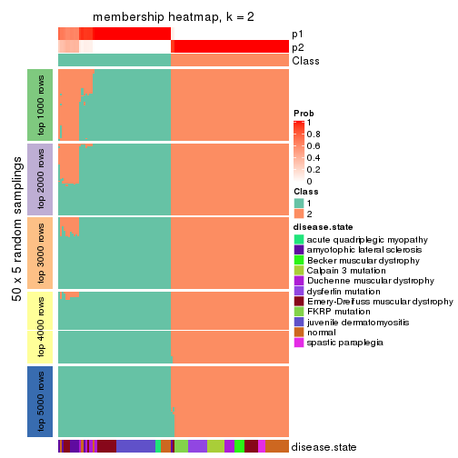</p>

</div>
<div id='tab-MAD-kmeans-membership-heatmap-2'>
<pre><code class="r">membership_heatmap(res, k = 3)
</code></pre>

<p></p>

</div>
<div id='tab-MAD-kmeans-membership-heatmap-3'>
<pre><code class="r">membership_heatmap(res, k = 4)
</code></pre>

<p></p>

</div>
<div id='tab-MAD-kmeans-membership-heatmap-4'>
<pre><code class="r">membership_heatmap(res, k = 5)
</code></pre>

<p></p>

</div>
<div id='tab-MAD-kmeans-membership-heatmap-5'>
<pre><code class="r">membership_heatmap(res, k = 6)
</code></pre>

<p></p>

</div>
</div>

As soon as we have had the classes for columns, we can look for signatures
which are significantly different between classes which can be candidate marks
for certain classes. Following are the heatmaps for signatures.


Signature heatmaps where rows are scaled:


<script>
$( function() {
	$( '#tabs-MAD-kmeans-get-signatures' ).tabs();
} );
</script>
<div id='tabs-MAD-kmeans-get-signatures'>
<ul>
<li><a href='#tab-MAD-kmeans-get-signatures-1'>k = 2</a></li>
<li><a href='#tab-MAD-kmeans-get-signatures-2'>k = 3</a></li>
<li><a href='#tab-MAD-kmeans-get-signatures-3'>k = 4</a></li>
<li><a href='#tab-MAD-kmeans-get-signatures-4'>k = 5</a></li>
<li><a href='#tab-MAD-kmeans-get-signatures-5'>k = 6</a></li>
</ul>
<div id='tab-MAD-kmeans-get-signatures-1'>
<pre><code class="r">get_signatures(res, k = 2)
</code></pre>

<p></p>

</div>
<div id='tab-MAD-kmeans-get-signatures-2'>
<pre><code class="r">get_signatures(res, k = 3)
</code></pre>

<p></p>

</div>
<div id='tab-MAD-kmeans-get-signatures-3'>
<pre><code class="r">get_signatures(res, k = 4)
</code></pre>

<p></p>

</div>
<div id='tab-MAD-kmeans-get-signatures-4'>
<pre><code class="r">get_signatures(res, k = 5)
</code></pre>

<p></p>

</div>
<div id='tab-MAD-kmeans-get-signatures-5'>
<pre><code class="r">get_signatures(res, k = 6)
</code></pre>

<p></p>

</div>
</div>


Signature heatmaps where rows are not scaled:


<script>
$( function() {
	$( '#tabs-MAD-kmeans-get-signatures-no-scale' ).tabs();
} );
</script>
<div id='tabs-MAD-kmeans-get-signatures-no-scale'>
<ul>
<li><a href='#tab-MAD-kmeans-get-signatures-no-scale-1'>k = 2</a></li>
<li><a href='#tab-MAD-kmeans-get-signatures-no-scale-2'>k = 3</a></li>
<li><a href='#tab-MAD-kmeans-get-signatures-no-scale-3'>k = 4</a></li>
<li><a href='#tab-MAD-kmeans-get-signatures-no-scale-4'>k = 5</a></li>
<li><a href='#tab-MAD-kmeans-get-signatures-no-scale-5'>k = 6</a></li>
</ul>
<div id='tab-MAD-kmeans-get-signatures-no-scale-1'>
<pre><code class="r">get_signatures(res, k = 2, scale_rows = FALSE)
</code></pre>

<p></p>

</div>
<div id='tab-MAD-kmeans-get-signatures-no-scale-2'>
<pre><code class="r">get_signatures(res, k = 3, scale_rows = FALSE)
</code></pre>

<p></p>

</div>
<div id='tab-MAD-kmeans-get-signatures-no-scale-3'>
<pre><code class="r">get_signatures(res, k = 4, scale_rows = FALSE)
</code></pre>

<p></p>

</div>
<div id='tab-MAD-kmeans-get-signatures-no-scale-4'>
<pre><code class="r">get_signatures(res, k = 5, scale_rows = FALSE)
</code></pre>

<p></p>

</div>
<div id='tab-MAD-kmeans-get-signatures-no-scale-5'>
<pre><code class="r">get_signatures(res, k = 6, scale_rows = FALSE)
</code></pre>

<p></p>

</div>
</div>


Compare the overlap of signatures from different k:

```r
compare_signatures(res)
```


`get_signature()` returns a data frame invisibly. TO get the list of signatures, the function
call should be assigned to a variable explicitly. In following code, if `plot` argument is set
to `FALSE`, no heatmap is plotted while only the differential analysis is performed.

```r
# code only for demonstration
tb = get_signature(res, k = ..., plot = FALSE)
```

An example of the output of `tb` is:

```
#>   which_row         fdr    mean_1    mean_2 scaled_mean_1 scaled_mean_2 km
#> 1        38 0.042760348  8.373488  9.131774    -0.5533452     0.5164555  1
#> 2        40 0.018707592  7.106213  8.469186    -0.6173731     0.5762149  1
#> 3        55 0.019134737 10.221463 11.207825    -0.6159697     0.5749050  1
#> 4        59 0.006059896  5.921854  7.869574    -0.6899429     0.6439467  1
#> 5        60 0.018055526  8.928898 10.211722    -0.6204761     0.5791110  1
#> 6        98 0.009384629 15.714769 14.887706     0.6635654    -0.6193277  2
...
```

The columns in `tb` are:

1. `which_row`: row indices corresponding to the input matrix.
2. `fdr`: FDR for the differential test. 
3. `mean_x`: The mean value in group x.
4. `scaled_mean_x`: The mean value in group x after rows are scaled.
5. `km`: Row groups if k-means clustering is applied to rows.


UMAP plot which shows how samples are separated.


<script>
$( function() {
	$( '#tabs-MAD-kmeans-dimension-reduction' ).tabs();
} );
</script>
<div id='tabs-MAD-kmeans-dimension-reduction'>
<ul>
<li><a href='#tab-MAD-kmeans-dimension-reduction-1'>k = 2</a></li>
<li><a href='#tab-MAD-kmeans-dimension-reduction-2'>k = 3</a></li>
<li><a href='#tab-MAD-kmeans-dimension-reduction-3'>k = 4</a></li>
<li><a href='#tab-MAD-kmeans-dimension-reduction-4'>k = 5</a></li>
<li><a href='#tab-MAD-kmeans-dimension-reduction-5'>k = 6</a></li>
</ul>
<div id='tab-MAD-kmeans-dimension-reduction-1'>
<pre><code class="r">dimension_reduction(res, k = 2, method = &quot;UMAP&quot;)
</code></pre>

<p></p>

</div>
<div id='tab-MAD-kmeans-dimension-reduction-2'>
<pre><code class="r">dimension_reduction(res, k = 3, method = &quot;UMAP&quot;)
</code></pre>

<p></p>

</div>
<div id='tab-MAD-kmeans-dimension-reduction-3'>
<pre><code class="r">dimension_reduction(res, k = 4, method = &quot;UMAP&quot;)
</code></pre>

<p></p>

</div>
<div id='tab-MAD-kmeans-dimension-reduction-4'>
<pre><code class="r">dimension_reduction(res, k = 5, method = &quot;UMAP&quot;)
</code></pre>

<p></p>

</div>
<div id='tab-MAD-kmeans-dimension-reduction-5'>
<pre><code class="r">dimension_reduction(res, k = 6, method = &quot;UMAP&quot;)
</code></pre>

<p></p>

</div>
</div>


Following heatmap shows how subgroups are split when increasing `k`:

```r
collect_classes(res)
```


Test correlation between subgroups and known annotations. If the known
annotation is numeric, one-way ANOVA test is applied, and if the known
annotation is discrete, chi-squared contingency table test is applied.

```r
test_to_known_factors(res)
```

```
#>              n disease.state(p) k
#> MAD:kmeans 117         4.14e-10 2
#> MAD:kmeans 117         3.92e-19 3
#> MAD:kmeans 109         2.52e-25 4
#> MAD:kmeans 102         1.80e-25 5
#> MAD:kmeans  95         3.19e-42 6
```


If matrix rows can be associated to genes, consider to use `functional_enrichment(res,
...)` to perform function enrichment for the signature genes. See [this vignette](http://bioconductor.org/packages/devel/bioc/vignettes/cola/inst/doc/functional_enrichment.html) for more detailed explanations.


 

---------------------------------------------------


### MAD:skmeans**


The object with results only for a single top-value method and a single partition method 
can be extracted as:

```r
res = res_list["MAD", "skmeans"]
# you can also extract it by
# res = res_list["MAD:skmeans"]
```

A summary of `res` and all the functions that can be applied to it:

```r
res
```

```
#> A 'ConsensusPartition' object with k = 2, 3, 4, 5, 6.
#>   On a matrix with 21512 rows and 119 columns.
#>   Top rows (1000, 2000, 3000, 4000, 5000) are extracted by 'MAD' method.
#>   Subgroups are detected by 'skmeans' method.
#>   Performed in total 1250 partitions by row resampling.
#>   Best k for subgroups seems to be 2.
#> 
#> Following methods can be applied to this 'ConsensusPartition' object:
#>  [1] "cola_report"             "collect_classes"         "collect_plots"          
#>  [4] "collect_stats"           "colnames"                "compare_signatures"     
#>  [7] "consensus_heatmap"       "dimension_reduction"     "functional_enrichment"  
#> [10] "get_anno_col"            "get_anno"                "get_classes"            
#> [13] "get_consensus"           "get_matrix"              "get_membership"         
#> [16] "get_param"               "get_signatures"          "get_stats"              
#> [19] "is_best_k"               "is_stable_k"             "membership_heatmap"     
#> [22] "ncol"                    "nrow"                    "plot_ecdf"              
#> [25] "rownames"                "select_partition_number" "show"                   
#> [28] "suggest_best_k"          "test_to_known_factors"
```

`collect_plots()` function collects all the plots made from `res` for all `k` (number of partitions)
into one single page to provide an easy and fast comparison between different `k`.

```r
collect_plots(res)
```


The plots are:

- The first row: a plot of the ECDF (empirical cumulative distribution
  function) curves of the consensus matrix for each `k` and the heatmap of
  predicted classes for each `k`.
- The second row: heatmaps of the consensus matrix for each `k`.
- The third row: heatmaps of the membership matrix for each `k`.
- The fouth row: heatmaps of the signatures for each `k`.

All the plots in panels can be made by individual functions and they are
plotted later in this section.

`select_partition_number()` produces several plots showing different
statistics for choosing "optimized" `k`. There are following statistics:

- ECDF curves of the consensus matrix for each `k`;
- 1-PAC. [The PAC
  score](https://en.wikipedia.org/wiki/Consensus_clustering#Over-interpretation_potential_of_consensus_clustering)
  measures the proportion of the ambiguous subgrouping.
- Mean silhouette score.
- Concordance. The mean probability of fiting the consensus class ids in all
  partitions.
- Area increased. Denote $A_k$ as the area under the ECDF curve for current
  `k`, the area increased is defined as $A_k - A_{k-1}$.
- Rand index. The percent of pairs of samples that are both in a same cluster
  or both are not in a same cluster in the partition of k and k-1.
- Jaccard index. The ratio of pairs of samples are both in a same cluster in
  the partition of k and k-1 and the pairs of samples are both in a same
  cluster in the partition k or k-1.

The detailed explanations of these statistics can be found in [the _cola_
vignette](http://bioconductor.org/packages/devel/bioc/vignettes/cola/inst/doc/cola.html#toc_13).

Generally speaking, lower PAC score, higher mean silhouette score or higher
concordance corresponds to better partition. Rand index and Jaccard index
measure how similar the current partition is compared to partition with `k-1`.
If they are too similar, we won't accept `k` is better than `k-1`.

```r
select_partition_number(res)
```


The numeric values for all these statistics can be obtained by `get_stats()`.

```r
get_stats(res)
```

```
#>   k 1-PAC mean_silhouette concordance area_increased  Rand Jaccard
#> 2 2 0.982           0.975       0.987         0.5029 0.496   0.496
#> 3 3 0.895           0.905       0.955         0.2654 0.845   0.695
#> 4 4 0.694           0.688       0.830         0.1473 0.880   0.680
#> 5 5 0.688           0.647       0.803         0.0656 0.932   0.754
#> 6 6 0.716           0.695       0.810         0.0386 0.936   0.736
```

`suggest_best_k()` suggests the best $k$ based on these statistics. The rules are as follows:

- All $k$ with Jaccard index larger than 0.95 are removed because increasing
  $k$ does not provide enough extra information. If all $k$ are removed, it is
  marked as no subgroup is detected.
- For all $k$ with 1-PAC score larger than 0.9, the maximal $k$ is taken as
  the best $k$, and other $k$ are marked as optional $k$.
- If it does not fit the second rule. The $k$ with the maximal vote of the
  highest 1-PAC score, highest mean silhouette, and highest concordance is
  taken as the best $k$.

```r
suggest_best_k(res)
```

```
#> [1] 2
```


Following shows the table of the partitions (You need to click the **show/hide
code output** link to see it). The membership matrix (columns with name `p*`)
is inferred by
[`clue::cl_consensus()`](https://www.rdocumentation.org/link/cl_consensus?package=clue)
function with the `SE` method. Basically the value in the membership matrix
represents the probability to belong to a certain group. The finall class
label for an item is determined with the group with highest probability it
belongs to.

In `get_classes()` function, the entropy is calculated from the membership
matrix and the silhouette score is calculated from the consensus matrix.


<script>
$( function() {
	$( '#tabs-MAD-skmeans-get-classes' ).tabs();
} );
</script>
<div id='tabs-MAD-skmeans-get-classes'>
<ul>
<li><a href='#tab-MAD-skmeans-get-classes-1'>k = 2</a></li>
<li><a href='#tab-MAD-skmeans-get-classes-2'>k = 3</a></li>
<li><a href='#tab-MAD-skmeans-get-classes-3'>k = 4</a></li>
<li><a href='#tab-MAD-skmeans-get-classes-4'>k = 5</a></li>
<li><a href='#tab-MAD-skmeans-get-classes-5'>k = 6</a></li>
</ul>

<div id='tab-MAD-skmeans-get-classes-1'>
<p><a id='tab-MAD-skmeans-get-classes-1-a' style='color:#0366d6' href='#'>show/hide code output</a></p>
<pre><code class="r">cbind(get_classes(res, k = 2), get_membership(res, k = 2))
</code></pre>

<pre><code>#&gt;           class entropy silhouette    p1    p2
#&gt; GSM120719     1  0.0000      0.978 1.000 0.000
#&gt; GSM120720     1  0.0000      0.978 1.000 0.000
#&gt; GSM120765     2  0.0000      0.996 0.000 1.000
#&gt; GSM120767     2  0.0000      0.996 0.000 1.000
#&gt; GSM120784     2  0.0000      0.996 0.000 1.000
#&gt; GSM121400     1  0.0000      0.978 1.000 0.000
#&gt; GSM121401     1  0.0000      0.978 1.000 0.000
#&gt; GSM121402     2  0.0000      0.996 0.000 1.000
#&gt; GSM121403     1  0.0000      0.978 1.000 0.000
#&gt; GSM121404     2  0.0000      0.996 0.000 1.000
#&gt; GSM121405     1  0.0000      0.978 1.000 0.000
#&gt; GSM121406     2  0.0000      0.996 0.000 1.000
#&gt; GSM121408     2  0.0000      0.996 0.000 1.000
#&gt; GSM121409     1  0.0000      0.978 1.000 0.000
#&gt; GSM121410     1  0.0000      0.978 1.000 0.000
#&gt; GSM121412     2  0.0000      0.996 0.000 1.000
#&gt; GSM121413     2  0.0000      0.996 0.000 1.000
#&gt; GSM121414     2  0.0000      0.996 0.000 1.000
#&gt; GSM121415     2  0.0000      0.996 0.000 1.000
#&gt; GSM121416     2  0.0000      0.996 0.000 1.000
#&gt; GSM120591     1  0.0000      0.978 1.000 0.000
#&gt; GSM120594     1  0.0000      0.978 1.000 0.000
#&gt; GSM120718     1  0.0000      0.978 1.000 0.000
#&gt; GSM121205     1  0.0000      0.978 1.000 0.000
#&gt; GSM121206     1  0.0000      0.978 1.000 0.000
#&gt; GSM121207     1  0.0000      0.978 1.000 0.000
#&gt; GSM121208     1  0.0000      0.978 1.000 0.000
#&gt; GSM121209     1  0.0000      0.978 1.000 0.000
#&gt; GSM121210     1  0.0000      0.978 1.000 0.000
#&gt; GSM121211     1  0.0000      0.978 1.000 0.000
#&gt; GSM121212     1  0.0000      0.978 1.000 0.000
#&gt; GSM121213     1  0.0000      0.978 1.000 0.000
#&gt; GSM121214     1  0.0000      0.978 1.000 0.000
#&gt; GSM121215     1  0.0000      0.978 1.000 0.000
#&gt; GSM121216     1  0.0000      0.978 1.000 0.000
#&gt; GSM121217     1  0.0000      0.978 1.000 0.000
#&gt; GSM121218     1  0.0000      0.978 1.000 0.000
#&gt; GSM121234     1  0.0000      0.978 1.000 0.000
#&gt; GSM121243     1  0.0000      0.978 1.000 0.000
#&gt; GSM121245     1  0.0000      0.978 1.000 0.000
#&gt; GSM121246     1  0.0000      0.978 1.000 0.000
#&gt; GSM121247     1  0.0000      0.978 1.000 0.000
#&gt; GSM121248     1  0.0000      0.978 1.000 0.000
#&gt; GSM120744     1  0.6973      0.793 0.812 0.188
#&gt; GSM120745     1  0.0000      0.978 1.000 0.000
#&gt; GSM120746     1  0.6531      0.818 0.832 0.168
#&gt; GSM120747     1  0.6148      0.837 0.848 0.152
#&gt; GSM120748     2  0.5408      0.855 0.124 0.876
#&gt; GSM120749     1  0.0938      0.969 0.988 0.012
#&gt; GSM120750     1  0.6973      0.793 0.812 0.188
#&gt; GSM120751     1  0.3733      0.919 0.928 0.072
#&gt; GSM120752     1  0.0000      0.978 1.000 0.000
#&gt; GSM121336     2  0.0000      0.996 0.000 1.000
#&gt; GSM121339     2  0.0000      0.996 0.000 1.000
#&gt; GSM121349     2  0.0000      0.996 0.000 1.000
#&gt; GSM121355     2  0.0000      0.996 0.000 1.000
#&gt; GSM120757     1  0.4298      0.904 0.912 0.088
#&gt; GSM120766     1  0.7139      0.782 0.804 0.196
#&gt; GSM120770     2  0.0000      0.996 0.000 1.000
#&gt; GSM120779     1  0.0000      0.978 1.000 0.000
#&gt; GSM120780     2  0.3114      0.938 0.056 0.944
#&gt; GSM121102     2  0.0000      0.996 0.000 1.000
#&gt; GSM121203     1  0.6973      0.793 0.812 0.188
#&gt; GSM121204     1  0.0000      0.978 1.000 0.000
#&gt; GSM121330     1  0.0000      0.978 1.000 0.000
#&gt; GSM121335     1  0.0000      0.978 1.000 0.000
#&gt; GSM121337     2  0.0000      0.996 0.000 1.000
#&gt; GSM121338     2  0.0000      0.996 0.000 1.000
#&gt; GSM121341     1  0.0000      0.978 1.000 0.000
#&gt; GSM121342     1  0.0000      0.978 1.000 0.000
#&gt; GSM121343     2  0.0000      0.996 0.000 1.000
#&gt; GSM121344     1  0.0000      0.978 1.000 0.000
#&gt; GSM121346     1  0.0000      0.978 1.000 0.000
#&gt; GSM121347     2  0.0000      0.996 0.000 1.000
#&gt; GSM121348     2  0.0000      0.996 0.000 1.000
#&gt; GSM121350     1  0.0000      0.978 1.000 0.000
#&gt; GSM121352     1  0.0000      0.978 1.000 0.000
#&gt; GSM121354     1  0.0000      0.978 1.000 0.000
#&gt; GSM120753     2  0.0000      0.996 0.000 1.000
#&gt; GSM120761     2  0.0000      0.996 0.000 1.000
#&gt; GSM120768     2  0.0000      0.996 0.000 1.000
#&gt; GSM120781     2  0.0000      0.996 0.000 1.000
#&gt; GSM120788     2  0.0000      0.996 0.000 1.000
#&gt; GSM120760     2  0.0000      0.996 0.000 1.000
#&gt; GSM120763     2  0.0000      0.996 0.000 1.000
#&gt; GSM120764     2  0.0000      0.996 0.000 1.000
#&gt; GSM120777     2  0.0000      0.996 0.000 1.000
#&gt; GSM120786     2  0.0000      0.996 0.000 1.000
#&gt; GSM121329     1  0.0000      0.978 1.000 0.000
#&gt; GSM121331     1  0.0000      0.978 1.000 0.000
#&gt; GSM121333     1  0.0000      0.978 1.000 0.000
#&gt; GSM121345     1  0.0000      0.978 1.000 0.000
#&gt; GSM121356     1  0.0000      0.978 1.000 0.000
#&gt; GSM120754     2  0.0000      0.996 0.000 1.000
#&gt; GSM120759     2  0.0000      0.996 0.000 1.000
#&gt; GSM120762     2  0.0000      0.996 0.000 1.000
#&gt; GSM120775     2  0.0000      0.996 0.000 1.000
#&gt; GSM120776     2  0.0000      0.996 0.000 1.000
#&gt; GSM120782     2  0.0000      0.996 0.000 1.000
#&gt; GSM120789     2  0.0000      0.996 0.000 1.000
#&gt; GSM120790     2  0.0000      0.996 0.000 1.000
#&gt; GSM120791     2  0.0000      0.996 0.000 1.000
#&gt; GSM120755     2  0.0000      0.996 0.000 1.000
#&gt; GSM120756     2  0.3733      0.921 0.072 0.928
#&gt; GSM120769     2  0.0000      0.996 0.000 1.000
#&gt; GSM120778     2  0.0000      0.996 0.000 1.000
#&gt; GSM120792     2  0.0000      0.996 0.000 1.000
#&gt; GSM121332     2  0.0000      0.996 0.000 1.000
#&gt; GSM121334     2  0.0000      0.996 0.000 1.000
#&gt; GSM121340     2  0.0000      0.996 0.000 1.000
#&gt; GSM121351     2  0.0000      0.996 0.000 1.000
#&gt; GSM121353     2  0.0000      0.996 0.000 1.000
#&gt; GSM120758     2  0.0000      0.996 0.000 1.000
#&gt; GSM120771     2  0.0000      0.996 0.000 1.000
#&gt; GSM120772     2  0.0000      0.996 0.000 1.000
#&gt; GSM120773     2  0.0000      0.996 0.000 1.000
#&gt; GSM120774     2  0.0000      0.996 0.000 1.000
#&gt; GSM120783     2  0.0000      0.996 0.000 1.000
#&gt; GSM120787     2  0.0000      0.996 0.000 1.000
</code></pre>

<script>
$('#tab-MAD-skmeans-get-classes-1-a').parent().next().next().hide();
$('#tab-MAD-skmeans-get-classes-1-a').click(function(){
  $('#tab-MAD-skmeans-get-classes-1-a').parent().next().next().toggle();
  return(false);
});
</script>
</div>

<div id='tab-MAD-skmeans-get-classes-2'>
<p><a id='tab-MAD-skmeans-get-classes-2-a' style='color:#0366d6' href='#'>show/hide code output</a></p>
<pre><code class="r">cbind(get_classes(res, k = 3), get_membership(res, k = 3))
</code></pre>

<pre><code>#&gt;           class entropy silhouette    p1    p2    p3
#&gt; GSM120719     1  0.0000      0.950 1.000 0.000 0.000
#&gt; GSM120720     1  0.0000      0.950 1.000 0.000 0.000
#&gt; GSM120765     2  0.0424      0.976 0.000 0.992 0.008
#&gt; GSM120767     2  0.0237      0.977 0.000 0.996 0.004
#&gt; GSM120784     2  0.0424      0.976 0.000 0.992 0.008
#&gt; GSM121400     1  0.6062      0.426 0.616 0.000 0.384
#&gt; GSM121401     1  0.4121      0.796 0.832 0.000 0.168
#&gt; GSM121402     2  0.0424      0.976 0.000 0.992 0.008
#&gt; GSM121403     3  0.6235      0.127 0.436 0.000 0.564
#&gt; GSM121404     2  0.2796      0.901 0.000 0.908 0.092
#&gt; GSM121405     1  0.4178      0.791 0.828 0.000 0.172
#&gt; GSM121406     2  0.0237      0.977 0.000 0.996 0.004
#&gt; GSM121408     2  0.0000      0.978 0.000 1.000 0.000
#&gt; GSM121409     1  0.6305      0.122 0.516 0.000 0.484
#&gt; GSM121410     1  0.5291      0.659 0.732 0.000 0.268
#&gt; GSM121412     2  0.0592      0.974 0.000 0.988 0.012
#&gt; GSM121413     2  0.0592      0.974 0.000 0.988 0.012
#&gt; GSM121414     2  0.0424      0.976 0.000 0.992 0.008
#&gt; GSM121415     2  0.0424      0.976 0.000 0.992 0.008
#&gt; GSM121416     2  0.0237      0.977 0.000 0.996 0.004
#&gt; GSM120591     1  0.0237      0.947 0.996 0.000 0.004
#&gt; GSM120594     1  0.0000      0.950 1.000 0.000 0.000
#&gt; GSM120718     1  0.0000      0.950 1.000 0.000 0.000
#&gt; GSM121205     1  0.0000      0.950 1.000 0.000 0.000
#&gt; GSM121206     1  0.0000      0.950 1.000 0.000 0.000
#&gt; GSM121207     1  0.0000      0.950 1.000 0.000 0.000
#&gt; GSM121208     1  0.0000      0.950 1.000 0.000 0.000
#&gt; GSM121209     1  0.0000      0.950 1.000 0.000 0.000
#&gt; GSM121210     1  0.0000      0.950 1.000 0.000 0.000
#&gt; GSM121211     1  0.0000      0.950 1.000 0.000 0.000
#&gt; GSM121212     1  0.0000      0.950 1.000 0.000 0.000
#&gt; GSM121213     1  0.0000      0.950 1.000 0.000 0.000
#&gt; GSM121214     1  0.0000      0.950 1.000 0.000 0.000
#&gt; GSM121215     1  0.0000      0.950 1.000 0.000 0.000
#&gt; GSM121216     1  0.0000      0.950 1.000 0.000 0.000
#&gt; GSM121217     1  0.0000      0.950 1.000 0.000 0.000
#&gt; GSM121218     1  0.0000      0.950 1.000 0.000 0.000
#&gt; GSM121234     1  0.0000      0.950 1.000 0.000 0.000
#&gt; GSM121243     1  0.0000      0.950 1.000 0.000 0.000
#&gt; GSM121245     1  0.0000      0.950 1.000 0.000 0.000
#&gt; GSM121246     1  0.0000      0.950 1.000 0.000 0.000
#&gt; GSM121247     1  0.0000      0.950 1.000 0.000 0.000
#&gt; GSM121248     1  0.0000      0.950 1.000 0.000 0.000
#&gt; GSM120744     3  0.0000      0.885 0.000 0.000 1.000
#&gt; GSM120745     3  0.0424      0.883 0.008 0.000 0.992
#&gt; GSM120746     3  0.0000      0.885 0.000 0.000 1.000
#&gt; GSM120747     3  0.0000      0.885 0.000 0.000 1.000
#&gt; GSM120748     3  0.0000      0.885 0.000 0.000 1.000
#&gt; GSM120749     3  0.0000      0.885 0.000 0.000 1.000
#&gt; GSM120750     3  0.0000      0.885 0.000 0.000 1.000
#&gt; GSM120751     3  0.0000      0.885 0.000 0.000 1.000
#&gt; GSM120752     3  0.0424      0.883 0.008 0.000 0.992
#&gt; GSM121336     2  0.0237      0.977 0.000 0.996 0.004
#&gt; GSM121339     2  0.1643      0.949 0.000 0.956 0.044
#&gt; GSM121349     2  0.0237      0.977 0.000 0.996 0.004
#&gt; GSM121355     2  0.0237      0.977 0.000 0.996 0.004
#&gt; GSM120757     3  0.2066      0.866 0.060 0.000 0.940
#&gt; GSM120766     3  0.0000      0.885 0.000 0.000 1.000
#&gt; GSM120770     2  0.2448      0.919 0.000 0.924 0.076
#&gt; GSM120779     3  0.4291      0.797 0.180 0.000 0.820
#&gt; GSM120780     3  0.0000      0.885 0.000 0.000 1.000
#&gt; GSM121102     3  0.2711      0.826 0.000 0.088 0.912
#&gt; GSM121203     3  0.0000      0.885 0.000 0.000 1.000
#&gt; GSM121204     3  0.4974      0.736 0.236 0.000 0.764
#&gt; GSM121330     1  0.1753      0.916 0.952 0.000 0.048
#&gt; GSM121335     1  0.0000      0.950 1.000 0.000 0.000
#&gt; GSM121337     2  0.1289      0.957 0.000 0.968 0.032
#&gt; GSM121338     2  0.5591      0.593 0.000 0.696 0.304
#&gt; GSM121341     1  0.0000      0.950 1.000 0.000 0.000
#&gt; GSM121342     1  0.0000      0.950 1.000 0.000 0.000
#&gt; GSM121343     2  0.5560      0.600 0.000 0.700 0.300
#&gt; GSM121344     1  0.0000      0.950 1.000 0.000 0.000
#&gt; GSM121346     1  0.2625      0.886 0.916 0.000 0.084
#&gt; GSM121347     2  0.3267      0.872 0.000 0.884 0.116
#&gt; GSM121348     3  0.3192      0.816 0.000 0.112 0.888
#&gt; GSM121350     1  0.3038      0.866 0.896 0.000 0.104
#&gt; GSM121352     1  0.2066      0.907 0.940 0.000 0.060
#&gt; GSM121354     1  0.1289      0.928 0.968 0.000 0.032
#&gt; GSM120753     2  0.0000      0.978 0.000 1.000 0.000
#&gt; GSM120761     2  0.0000      0.978 0.000 1.000 0.000
#&gt; GSM120768     2  0.0000      0.978 0.000 1.000 0.000
#&gt; GSM120781     2  0.0000      0.978 0.000 1.000 0.000
#&gt; GSM120788     2  0.1643      0.944 0.000 0.956 0.044
#&gt; GSM120760     2  0.0000      0.978 0.000 1.000 0.000
#&gt; GSM120763     2  0.0000      0.978 0.000 1.000 0.000
#&gt; GSM120764     2  0.0000      0.978 0.000 1.000 0.000
#&gt; GSM120777     2  0.1031      0.962 0.000 0.976 0.024
#&gt; GSM120786     2  0.0000      0.978 0.000 1.000 0.000
#&gt; GSM121329     1  0.0000      0.950 1.000 0.000 0.000
#&gt; GSM121331     3  0.4291      0.797 0.180 0.000 0.820
#&gt; GSM121333     3  0.4399      0.790 0.188 0.000 0.812
#&gt; GSM121345     3  0.5926      0.542 0.356 0.000 0.644
#&gt; GSM121356     3  0.4235      0.801 0.176 0.000 0.824
#&gt; GSM120754     2  0.0000      0.978 0.000 1.000 0.000
#&gt; GSM120759     2  0.0237      0.977 0.000 0.996 0.004
#&gt; GSM120762     2  0.0000      0.978 0.000 1.000 0.000
#&gt; GSM120775     2  0.0000      0.978 0.000 1.000 0.000
#&gt; GSM120776     3  0.5843      0.654 0.016 0.252 0.732
#&gt; GSM120782     2  0.0000      0.978 0.000 1.000 0.000
#&gt; GSM120789     2  0.0000      0.978 0.000 1.000 0.000
#&gt; GSM120790     2  0.0592      0.974 0.000 0.988 0.012
#&gt; GSM120791     2  0.0000      0.978 0.000 1.000 0.000
#&gt; GSM120755     2  0.0000      0.978 0.000 1.000 0.000
#&gt; GSM120756     2  0.1999      0.939 0.036 0.952 0.012
#&gt; GSM120769     2  0.0000      0.978 0.000 1.000 0.000
#&gt; GSM120778     2  0.0000      0.978 0.000 1.000 0.000
#&gt; GSM120792     2  0.0000      0.978 0.000 1.000 0.000
#&gt; GSM121332     2  0.0000      0.978 0.000 1.000 0.000
#&gt; GSM121334     2  0.0000      0.978 0.000 1.000 0.000
#&gt; GSM121340     2  0.0000      0.978 0.000 1.000 0.000
#&gt; GSM121351     2  0.0424      0.976 0.000 0.992 0.008
#&gt; GSM121353     2  0.0000      0.978 0.000 1.000 0.000
#&gt; GSM120758     2  0.0000      0.978 0.000 1.000 0.000
#&gt; GSM120771     2  0.0000      0.978 0.000 1.000 0.000
#&gt; GSM120772     2  0.0000      0.978 0.000 1.000 0.000
#&gt; GSM120773     2  0.0000      0.978 0.000 1.000 0.000
#&gt; GSM120774     2  0.0000      0.978 0.000 1.000 0.000
#&gt; GSM120783     2  0.0000      0.978 0.000 1.000 0.000
#&gt; GSM120787     2  0.0000      0.978 0.000 1.000 0.000
</code></pre>

<script>
$('#tab-MAD-skmeans-get-classes-2-a').parent().next().next().hide();
$('#tab-MAD-skmeans-get-classes-2-a').click(function(){
  $('#tab-MAD-skmeans-get-classes-2-a').parent().next().next().toggle();
  return(false);
});
</script>
</div>

<div id='tab-MAD-skmeans-get-classes-3'>
<p><a id='tab-MAD-skmeans-get-classes-3-a' style='color:#0366d6' href='#'>show/hide code output</a></p>
<pre><code class="r">cbind(get_classes(res, k = 4), get_membership(res, k = 4))
</code></pre>

<pre><code>#&gt;           class entropy silhouette    p1    p2    p3    p4
#&gt; GSM120719     1  0.0188     0.9179 0.996 0.000 0.004 0.000
#&gt; GSM120720     1  0.0779     0.9139 0.980 0.000 0.016 0.004
#&gt; GSM120765     2  0.0000     0.7820 0.000 1.000 0.000 0.000
#&gt; GSM120767     2  0.1557     0.7586 0.000 0.944 0.000 0.056
#&gt; GSM120784     2  0.0000     0.7820 0.000 1.000 0.000 0.000
#&gt; GSM121400     1  0.6919     0.3162 0.504 0.004 0.396 0.096
#&gt; GSM121401     1  0.6307     0.5629 0.620 0.000 0.288 0.092
#&gt; GSM121402     2  0.0000     0.7820 0.000 1.000 0.000 0.000
#&gt; GSM121403     3  0.8198     0.1588 0.068 0.404 0.432 0.096
#&gt; GSM121404     2  0.3239     0.6859 0.000 0.880 0.068 0.052
#&gt; GSM121405     1  0.6656     0.5079 0.588 0.004 0.312 0.096
#&gt; GSM121406     2  0.0000     0.7820 0.000 1.000 0.000 0.000
#&gt; GSM121408     2  0.0336     0.7802 0.000 0.992 0.000 0.008
#&gt; GSM121409     3  0.7252    -0.0260 0.396 0.012 0.488 0.104
#&gt; GSM121410     1  0.6883     0.4219 0.548 0.004 0.344 0.104
#&gt; GSM121412     2  0.0000     0.7820 0.000 1.000 0.000 0.000
#&gt; GSM121413     2  0.0000     0.7820 0.000 1.000 0.000 0.000
#&gt; GSM121414     2  0.0000     0.7820 0.000 1.000 0.000 0.000
#&gt; GSM121415     2  0.0000     0.7820 0.000 1.000 0.000 0.000
#&gt; GSM121416     2  0.0188     0.7813 0.000 0.996 0.000 0.004
#&gt; GSM120591     1  0.1398     0.9013 0.956 0.000 0.040 0.004
#&gt; GSM120594     1  0.0779     0.9139 0.980 0.000 0.016 0.004
#&gt; GSM120718     1  0.0336     0.9171 0.992 0.000 0.008 0.000
#&gt; GSM121205     1  0.0000     0.9192 1.000 0.000 0.000 0.000
#&gt; GSM121206     1  0.0000     0.9192 1.000 0.000 0.000 0.000
#&gt; GSM121207     1  0.0000     0.9192 1.000 0.000 0.000 0.000
#&gt; GSM121208     1  0.0000     0.9192 1.000 0.000 0.000 0.000
#&gt; GSM121209     1  0.0000     0.9192 1.000 0.000 0.000 0.000
#&gt; GSM121210     1  0.0000     0.9192 1.000 0.000 0.000 0.000
#&gt; GSM121211     1  0.0000     0.9192 1.000 0.000 0.000 0.000
#&gt; GSM121212     1  0.0000     0.9192 1.000 0.000 0.000 0.000
#&gt; GSM121213     1  0.0000     0.9192 1.000 0.000 0.000 0.000
#&gt; GSM121214     1  0.0000     0.9192 1.000 0.000 0.000 0.000
#&gt; GSM121215     1  0.0000     0.9192 1.000 0.000 0.000 0.000
#&gt; GSM121216     1  0.0000     0.9192 1.000 0.000 0.000 0.000
#&gt; GSM121217     1  0.0000     0.9192 1.000 0.000 0.000 0.000
#&gt; GSM121218     1  0.0000     0.9192 1.000 0.000 0.000 0.000
#&gt; GSM121234     1  0.0000     0.9192 1.000 0.000 0.000 0.000
#&gt; GSM121243     1  0.0000     0.9192 1.000 0.000 0.000 0.000
#&gt; GSM121245     1  0.0000     0.9192 1.000 0.000 0.000 0.000
#&gt; GSM121246     1  0.0336     0.9174 0.992 0.000 0.000 0.008
#&gt; GSM121247     1  0.0188     0.9177 0.996 0.000 0.000 0.004
#&gt; GSM121248     1  0.0000     0.9192 1.000 0.000 0.000 0.000
#&gt; GSM120744     3  0.0000     0.7889 0.000 0.000 1.000 0.000
#&gt; GSM120745     3  0.0336     0.7892 0.000 0.000 0.992 0.008
#&gt; GSM120746     3  0.0000     0.7889 0.000 0.000 1.000 0.000
#&gt; GSM120747     3  0.0188     0.7877 0.000 0.000 0.996 0.004
#&gt; GSM120748     3  0.0336     0.7874 0.000 0.000 0.992 0.008
#&gt; GSM120749     3  0.0000     0.7889 0.000 0.000 1.000 0.000
#&gt; GSM120750     3  0.0000     0.7889 0.000 0.000 1.000 0.000
#&gt; GSM120751     3  0.0188     0.7892 0.000 0.000 0.996 0.004
#&gt; GSM120752     3  0.0336     0.7892 0.000 0.000 0.992 0.008
#&gt; GSM121336     2  0.0000     0.7820 0.000 1.000 0.000 0.000
#&gt; GSM121339     2  0.2002     0.7403 0.000 0.936 0.044 0.020
#&gt; GSM121349     2  0.0000     0.7820 0.000 1.000 0.000 0.000
#&gt; GSM121355     2  0.0000     0.7820 0.000 1.000 0.000 0.000
#&gt; GSM120757     3  0.5309     0.6957 0.044 0.000 0.700 0.256
#&gt; GSM120766     3  0.4126     0.7247 0.004 0.004 0.776 0.216
#&gt; GSM120770     2  0.1022     0.7647 0.000 0.968 0.032 0.000
#&gt; GSM120779     3  0.6040     0.6720 0.080 0.000 0.648 0.272
#&gt; GSM120780     3  0.2593     0.7727 0.000 0.016 0.904 0.080
#&gt; GSM121102     3  0.5268     0.1683 0.000 0.452 0.540 0.008
#&gt; GSM121203     3  0.0188     0.7885 0.000 0.000 0.996 0.004
#&gt; GSM121204     3  0.6651     0.6185 0.236 0.000 0.616 0.148
#&gt; GSM121330     1  0.4106     0.8238 0.832 0.000 0.084 0.084
#&gt; GSM121335     1  0.1545     0.9024 0.952 0.000 0.008 0.040
#&gt; GSM121337     2  0.4010     0.6500 0.000 0.816 0.028 0.156
#&gt; GSM121338     2  0.5910     0.4272 0.000 0.672 0.244 0.084
#&gt; GSM121341     1  0.1890     0.8943 0.936 0.000 0.008 0.056
#&gt; GSM121342     1  0.1211     0.9054 0.960 0.000 0.000 0.040
#&gt; GSM121343     2  0.5454     0.5145 0.000 0.732 0.172 0.096
#&gt; GSM121344     1  0.2255     0.8848 0.920 0.000 0.012 0.068
#&gt; GSM121346     1  0.4969     0.7669 0.772 0.000 0.140 0.088
#&gt; GSM121347     2  0.6148     0.3967 0.000 0.636 0.084 0.280
#&gt; GSM121348     3  0.7149     0.5450 0.000 0.156 0.528 0.316
#&gt; GSM121350     1  0.5457     0.7158 0.728 0.000 0.184 0.088
#&gt; GSM121352     1  0.4477     0.8026 0.808 0.000 0.108 0.084
#&gt; GSM121354     1  0.3900     0.8337 0.844 0.000 0.072 0.084
#&gt; GSM120753     2  0.4679     0.2730 0.000 0.648 0.000 0.352
#&gt; GSM120761     2  0.4866     0.0543 0.000 0.596 0.000 0.404
#&gt; GSM120768     4  0.4907     0.5462 0.000 0.420 0.000 0.580
#&gt; GSM120781     2  0.4454     0.3999 0.000 0.692 0.000 0.308
#&gt; GSM120788     4  0.2530     0.6781 0.000 0.100 0.004 0.896
#&gt; GSM120760     4  0.4585     0.6896 0.000 0.332 0.000 0.668
#&gt; GSM120763     4  0.4585     0.6887 0.000 0.332 0.000 0.668
#&gt; GSM120764     4  0.3311     0.7252 0.000 0.172 0.000 0.828
#&gt; GSM120777     4  0.2469     0.6843 0.000 0.108 0.000 0.892
#&gt; GSM120786     4  0.3726     0.7397 0.000 0.212 0.000 0.788
#&gt; GSM121329     1  0.0188     0.9185 0.996 0.000 0.000 0.004
#&gt; GSM121331     3  0.6293     0.6629 0.096 0.000 0.628 0.276
#&gt; GSM121333     3  0.6347     0.6613 0.100 0.000 0.624 0.276
#&gt; GSM121345     4  0.7608    -0.3538 0.216 0.000 0.328 0.456
#&gt; GSM121356     3  0.6269     0.6676 0.096 0.000 0.632 0.272
#&gt; GSM120754     4  0.4164     0.7338 0.000 0.264 0.000 0.736
#&gt; GSM120759     2  0.0188     0.7813 0.000 0.996 0.000 0.004
#&gt; GSM120762     2  0.3873     0.5694 0.000 0.772 0.000 0.228
#&gt; GSM120775     4  0.3400     0.7293 0.000 0.180 0.000 0.820
#&gt; GSM120776     4  0.4406     0.1071 0.000 0.000 0.300 0.700
#&gt; GSM120782     4  0.5159     0.6454 0.000 0.364 0.012 0.624
#&gt; GSM120789     2  0.3219     0.6658 0.000 0.836 0.000 0.164
#&gt; GSM120790     2  0.2737     0.7323 0.000 0.888 0.008 0.104
#&gt; GSM120791     4  0.4761     0.6379 0.000 0.372 0.000 0.628
#&gt; GSM120755     2  0.3172     0.6699 0.000 0.840 0.000 0.160
#&gt; GSM120756     4  0.2796     0.6727 0.016 0.092 0.000 0.892
#&gt; GSM120769     2  0.4843     0.1007 0.000 0.604 0.000 0.396
#&gt; GSM120778     4  0.4981     0.4284 0.000 0.464 0.000 0.536
#&gt; GSM120792     4  0.4817     0.6087 0.000 0.388 0.000 0.612
#&gt; GSM121332     2  0.2345     0.7318 0.000 0.900 0.000 0.100
#&gt; GSM121334     2  0.4564     0.3485 0.000 0.672 0.000 0.328
#&gt; GSM121340     4  0.3837     0.7405 0.000 0.224 0.000 0.776
#&gt; GSM121351     2  0.0000     0.7820 0.000 1.000 0.000 0.000
#&gt; GSM121353     4  0.3764     0.7405 0.000 0.216 0.000 0.784
#&gt; GSM120758     2  0.4477     0.3906 0.000 0.688 0.000 0.312
#&gt; GSM120771     2  0.3311     0.6567 0.000 0.828 0.000 0.172
#&gt; GSM120772     2  0.4713     0.2414 0.000 0.640 0.000 0.360
#&gt; GSM120773     4  0.4406     0.7144 0.000 0.300 0.000 0.700
#&gt; GSM120774     4  0.5000     0.3362 0.000 0.496 0.000 0.504
#&gt; GSM120783     4  0.4222     0.7297 0.000 0.272 0.000 0.728
#&gt; GSM120787     2  0.4981    -0.2340 0.000 0.536 0.000 0.464
</code></pre>

<script>
$('#tab-MAD-skmeans-get-classes-3-a').parent().next().next().hide();
$('#tab-MAD-skmeans-get-classes-3-a').click(function(){
  $('#tab-MAD-skmeans-get-classes-3-a').parent().next().next().toggle();
  return(false);
});
</script>
</div>

<div id='tab-MAD-skmeans-get-classes-4'>
<p><a id='tab-MAD-skmeans-get-classes-4-a' style='color:#0366d6' href='#'>show/hide code output</a></p>
<pre><code class="r">cbind(get_classes(res, k = 5), get_membership(res, k = 5))
</code></pre>

<pre><code>#&gt;           class entropy silhouette    p1    p2    p3    p4    p5
#&gt; GSM120719     1  0.0932    0.87611 0.972 0.000 0.020 0.004 0.004
#&gt; GSM120720     1  0.2681    0.80131 0.876 0.000 0.108 0.004 0.012
#&gt; GSM120765     2  0.0324    0.77590 0.000 0.992 0.004 0.004 0.000
#&gt; GSM120767     2  0.1764    0.75805 0.000 0.928 0.008 0.064 0.000
#&gt; GSM120784     2  0.0324    0.77590 0.000 0.992 0.004 0.004 0.000
#&gt; GSM121400     3  0.4273    0.64405 0.116 0.004 0.784 0.000 0.096
#&gt; GSM121401     3  0.2971    0.67236 0.156 0.000 0.836 0.000 0.008
#&gt; GSM121402     2  0.0404    0.77564 0.000 0.988 0.000 0.012 0.000
#&gt; GSM121403     3  0.4013    0.45523 0.004 0.108 0.804 0.000 0.084
#&gt; GSM121404     2  0.2712    0.72417 0.000 0.880 0.088 0.000 0.032
#&gt; GSM121405     3  0.2392    0.62680 0.104 0.004 0.888 0.000 0.004
#&gt; GSM121406     2  0.0000    0.77470 0.000 1.000 0.000 0.000 0.000
#&gt; GSM121408     2  0.0703    0.77391 0.000 0.976 0.000 0.024 0.000
#&gt; GSM121409     3  0.4268    0.53481 0.084 0.000 0.772 0.000 0.144
#&gt; GSM121410     3  0.4953    0.66580 0.164 0.000 0.712 0.000 0.124
#&gt; GSM121412     2  0.0162    0.77507 0.000 0.996 0.004 0.000 0.000
#&gt; GSM121413     2  0.0162    0.77507 0.000 0.996 0.004 0.000 0.000
#&gt; GSM121414     2  0.0290    0.77493 0.000 0.992 0.008 0.000 0.000
#&gt; GSM121415     2  0.0162    0.77501 0.000 0.996 0.004 0.000 0.000
#&gt; GSM121416     2  0.0290    0.77606 0.000 0.992 0.000 0.008 0.000
#&gt; GSM120591     1  0.4184    0.65066 0.772 0.000 0.176 0.004 0.048
#&gt; GSM120594     1  0.2731    0.80014 0.876 0.000 0.104 0.004 0.016
#&gt; GSM120718     1  0.1857    0.84781 0.928 0.000 0.060 0.004 0.008
#&gt; GSM121205     1  0.0000    0.89349 1.000 0.000 0.000 0.000 0.000
#&gt; GSM121206     1  0.0000    0.89349 1.000 0.000 0.000 0.000 0.000
#&gt; GSM121207     1  0.0000    0.89349 1.000 0.000 0.000 0.000 0.000
#&gt; GSM121208     1  0.0162    0.89112 0.996 0.000 0.004 0.000 0.000
#&gt; GSM121209     1  0.0000    0.89349 1.000 0.000 0.000 0.000 0.000
#&gt; GSM121210     1  0.0000    0.89349 1.000 0.000 0.000 0.000 0.000
#&gt; GSM121211     1  0.0000    0.89349 1.000 0.000 0.000 0.000 0.000
#&gt; GSM121212     1  0.0000    0.89349 1.000 0.000 0.000 0.000 0.000
#&gt; GSM121213     1  0.0000    0.89349 1.000 0.000 0.000 0.000 0.000
#&gt; GSM121214     1  0.0000    0.89349 1.000 0.000 0.000 0.000 0.000
#&gt; GSM121215     1  0.0000    0.89349 1.000 0.000 0.000 0.000 0.000
#&gt; GSM121216     1  0.0000    0.89349 1.000 0.000 0.000 0.000 0.000
#&gt; GSM121217     1  0.0000    0.89349 1.000 0.000 0.000 0.000 0.000
#&gt; GSM121218     1  0.0000    0.89349 1.000 0.000 0.000 0.000 0.000
#&gt; GSM121234     1  0.0000    0.89349 1.000 0.000 0.000 0.000 0.000
#&gt; GSM121243     1  0.0000    0.89349 1.000 0.000 0.000 0.000 0.000
#&gt; GSM121245     1  0.0000    0.89349 1.000 0.000 0.000 0.000 0.000
#&gt; GSM121246     1  0.1965    0.80879 0.904 0.000 0.096 0.000 0.000
#&gt; GSM121247     1  0.0404    0.88343 0.988 0.000 0.000 0.000 0.012
#&gt; GSM121248     1  0.0000    0.89349 1.000 0.000 0.000 0.000 0.000
#&gt; GSM120744     5  0.4410    0.61281 0.000 0.000 0.440 0.004 0.556
#&gt; GSM120745     5  0.4350    0.62115 0.000 0.000 0.408 0.004 0.588
#&gt; GSM120746     5  0.4403    0.61376 0.000 0.000 0.436 0.004 0.560
#&gt; GSM120747     5  0.4420    0.60491 0.000 0.000 0.448 0.004 0.548
#&gt; GSM120748     5  0.4430    0.60157 0.000 0.000 0.456 0.004 0.540
#&gt; GSM120749     5  0.4410    0.61164 0.000 0.000 0.440 0.004 0.556
#&gt; GSM120750     5  0.4410    0.61281 0.000 0.000 0.440 0.004 0.556
#&gt; GSM120751     5  0.4410    0.61281 0.000 0.000 0.440 0.004 0.556
#&gt; GSM120752     5  0.4331    0.62251 0.000 0.000 0.400 0.004 0.596
#&gt; GSM121336     2  0.0290    0.77565 0.000 0.992 0.000 0.008 0.000
#&gt; GSM121339     2  0.1970    0.75090 0.000 0.924 0.060 0.004 0.012
#&gt; GSM121349     2  0.0162    0.77560 0.000 0.996 0.000 0.004 0.000
#&gt; GSM121355     2  0.0162    0.77560 0.000 0.996 0.000 0.004 0.000
#&gt; GSM120757     5  0.2722    0.59107 0.004 0.000 0.008 0.120 0.868
#&gt; GSM120766     5  0.2464    0.59709 0.000 0.000 0.016 0.096 0.888
#&gt; GSM120770     2  0.2990    0.72165 0.000 0.868 0.024 0.008 0.100
#&gt; GSM120779     5  0.3339    0.57944 0.040 0.000 0.000 0.124 0.836
#&gt; GSM120780     5  0.2484    0.60380 0.000 0.004 0.068 0.028 0.900
#&gt; GSM121102     2  0.6868   -0.13286 0.000 0.408 0.268 0.004 0.320
#&gt; GSM121203     5  0.4264    0.61150 0.000 0.000 0.376 0.004 0.620
#&gt; GSM121204     5  0.6021    0.25130 0.364 0.000 0.032 0.056 0.548
#&gt; GSM121330     3  0.4235    0.54359 0.424 0.000 0.576 0.000 0.000
#&gt; GSM121335     1  0.3983    0.27996 0.660 0.000 0.340 0.000 0.000
#&gt; GSM121337     2  0.6825    0.46191 0.000 0.596 0.100 0.196 0.108
#&gt; GSM121338     2  0.5174    0.43549 0.000 0.604 0.340 0.000 0.056
#&gt; GSM121341     1  0.4201   -0.00737 0.592 0.000 0.408 0.000 0.000
#&gt; GSM121342     1  0.3774    0.42483 0.704 0.000 0.296 0.000 0.000
#&gt; GSM121343     2  0.5748    0.42050 0.000 0.584 0.300 0.000 0.116
#&gt; GSM121344     1  0.4278   -0.20486 0.548 0.000 0.452 0.000 0.000
#&gt; GSM121346     3  0.4264    0.62386 0.376 0.000 0.620 0.000 0.004
#&gt; GSM121347     2  0.7470    0.19074 0.000 0.444 0.048 0.248 0.260
#&gt; GSM121348     5  0.6283    0.44458 0.000 0.100 0.064 0.196 0.640
#&gt; GSM121350     3  0.4182    0.65018 0.352 0.000 0.644 0.000 0.004
#&gt; GSM121352     3  0.4242    0.53627 0.428 0.000 0.572 0.000 0.000
#&gt; GSM121354     3  0.4287    0.44901 0.460 0.000 0.540 0.000 0.000
#&gt; GSM120753     2  0.3949    0.44009 0.000 0.668 0.000 0.332 0.000
#&gt; GSM120761     4  0.4306    0.13936 0.000 0.492 0.000 0.508 0.000
#&gt; GSM120768     4  0.3661    0.68656 0.000 0.276 0.000 0.724 0.000
#&gt; GSM120781     2  0.3895    0.46629 0.000 0.680 0.000 0.320 0.000
#&gt; GSM120788     4  0.0693    0.75911 0.000 0.008 0.000 0.980 0.012
#&gt; GSM120760     4  0.3242    0.75784 0.000 0.216 0.000 0.784 0.000
#&gt; GSM120763     4  0.3210    0.76200 0.000 0.212 0.000 0.788 0.000
#&gt; GSM120764     4  0.1282    0.79562 0.000 0.044 0.000 0.952 0.004
#&gt; GSM120777     4  0.0898    0.75478 0.000 0.008 0.000 0.972 0.020
#&gt; GSM120786     4  0.1671    0.80973 0.000 0.076 0.000 0.924 0.000
#&gt; GSM121329     1  0.2228    0.83448 0.916 0.000 0.056 0.008 0.020
#&gt; GSM121331     5  0.4772    0.53295 0.092 0.000 0.008 0.156 0.744
#&gt; GSM121333     5  0.4514    0.54613 0.076 0.000 0.008 0.152 0.764
#&gt; GSM121345     5  0.6603    0.32120 0.192 0.000 0.012 0.272 0.524
#&gt; GSM121356     5  0.4576    0.54214 0.096 0.000 0.008 0.132 0.764
#&gt; GSM120754     4  0.2470    0.80762 0.000 0.104 0.000 0.884 0.012
#&gt; GSM120759     2  0.0609    0.77469 0.000 0.980 0.000 0.020 0.000
#&gt; GSM120762     2  0.3671    0.61146 0.000 0.756 0.008 0.236 0.000
#&gt; GSM120775     4  0.1430    0.79995 0.000 0.052 0.000 0.944 0.004
#&gt; GSM120776     4  0.5034    0.26604 0.000 0.004 0.048 0.648 0.300
#&gt; GSM120782     4  0.5213    0.65333 0.000 0.264 0.032 0.672 0.032
#&gt; GSM120789     2  0.3074    0.66582 0.000 0.804 0.000 0.196 0.000
#&gt; GSM120790     2  0.4295    0.65984 0.000 0.780 0.004 0.084 0.132
#&gt; GSM120791     4  0.3109    0.77304 0.000 0.200 0.000 0.800 0.000
#&gt; GSM120755     2  0.2329    0.72475 0.000 0.876 0.000 0.124 0.000
#&gt; GSM120756     4  0.0671    0.77349 0.000 0.016 0.000 0.980 0.004
#&gt; GSM120769     2  0.4256    0.12240 0.000 0.564 0.000 0.436 0.000
#&gt; GSM120778     4  0.4030    0.55125 0.000 0.352 0.000 0.648 0.000
#&gt; GSM120792     4  0.3534    0.71535 0.000 0.256 0.000 0.744 0.000
#&gt; GSM121332     2  0.2424    0.72563 0.000 0.868 0.000 0.132 0.000
#&gt; GSM121334     2  0.3932    0.44382 0.000 0.672 0.000 0.328 0.000
#&gt; GSM121340     4  0.1851    0.81112 0.000 0.088 0.000 0.912 0.000
#&gt; GSM121351     2  0.0324    0.77590 0.000 0.992 0.004 0.004 0.000
#&gt; GSM121353     4  0.1952    0.81101 0.000 0.084 0.000 0.912 0.004
#&gt; GSM120758     2  0.3949    0.43439 0.000 0.668 0.000 0.332 0.000
#&gt; GSM120771     2  0.3143    0.65003 0.000 0.796 0.000 0.204 0.000
#&gt; GSM120772     2  0.4415    0.07330 0.000 0.552 0.004 0.444 0.000
#&gt; GSM120773     4  0.2536    0.80544 0.000 0.128 0.000 0.868 0.004
#&gt; GSM120774     4  0.4235    0.38744 0.000 0.424 0.000 0.576 0.000
#&gt; GSM120783     4  0.2233    0.80988 0.000 0.104 0.000 0.892 0.004
#&gt; GSM120787     2  0.4294   -0.02278 0.000 0.532 0.000 0.468 0.000
</code></pre>

<script>
$('#tab-MAD-skmeans-get-classes-4-a').parent().next().next().hide();
$('#tab-MAD-skmeans-get-classes-4-a').click(function(){
  $('#tab-MAD-skmeans-get-classes-4-a').parent().next().next().toggle();
  return(false);
});
</script>
</div>

<div id='tab-MAD-skmeans-get-classes-5'>
<p><a id='tab-MAD-skmeans-get-classes-5-a' style='color:#0366d6' href='#'>show/hide code output</a></p>
<pre><code class="r">cbind(get_classes(res, k = 6), get_membership(res, k = 6))
</code></pre>

<pre><code>#&gt;           class entropy silhouette    p1    p2    p3    p4    p5    p6
#&gt; GSM120719     1  0.4004     0.7664 0.816 0.000 0.040 0.024 0.044 0.076
#&gt; GSM120720     1  0.5959     0.5338 0.640 0.000 0.184 0.024 0.048 0.104
#&gt; GSM120765     2  0.0622     0.7621 0.000 0.980 0.012 0.000 0.008 0.000
#&gt; GSM120767     2  0.2001     0.7576 0.000 0.920 0.016 0.044 0.020 0.000
#&gt; GSM120784     2  0.0964     0.7613 0.000 0.968 0.012 0.004 0.016 0.000
#&gt; GSM121400     3  0.3909     0.6786 0.024 0.000 0.816 0.016 0.072 0.072
#&gt; GSM121401     3  0.3093     0.7497 0.076 0.000 0.852 0.000 0.012 0.060
#&gt; GSM121402     2  0.2078     0.7645 0.000 0.916 0.012 0.032 0.040 0.000
#&gt; GSM121403     3  0.4158     0.6192 0.000 0.024 0.796 0.016 0.096 0.068
#&gt; GSM121404     2  0.4849     0.6775 0.000 0.756 0.100 0.024 0.060 0.060
#&gt; GSM121405     3  0.2934     0.7308 0.048 0.008 0.872 0.000 0.012 0.060
#&gt; GSM121406     2  0.1230     0.7621 0.000 0.956 0.008 0.008 0.028 0.000
#&gt; GSM121408     2  0.1515     0.7640 0.000 0.944 0.008 0.028 0.020 0.000
#&gt; GSM121409     3  0.6066     0.5326 0.060 0.000 0.632 0.016 0.144 0.148
#&gt; GSM121410     3  0.4349     0.6703 0.032 0.004 0.788 0.012 0.100 0.064
#&gt; GSM121412     2  0.2016     0.7547 0.000 0.920 0.024 0.016 0.040 0.000
#&gt; GSM121413     2  0.1585     0.7572 0.000 0.940 0.012 0.012 0.036 0.000
#&gt; GSM121414     2  0.1511     0.7578 0.000 0.944 0.012 0.012 0.032 0.000
#&gt; GSM121415     2  0.1518     0.7597 0.000 0.944 0.024 0.008 0.024 0.000
#&gt; GSM121416     2  0.1787     0.7643 0.000 0.932 0.020 0.016 0.032 0.000
#&gt; GSM120591     1  0.6682     0.3575 0.540 0.000 0.180 0.024 0.044 0.212
#&gt; GSM120594     1  0.6045     0.5166 0.628 0.000 0.188 0.024 0.044 0.116
#&gt; GSM120718     1  0.5048     0.6793 0.736 0.000 0.116 0.024 0.044 0.080
#&gt; GSM121205     1  0.0000     0.9120 1.000 0.000 0.000 0.000 0.000 0.000
#&gt; GSM121206     1  0.0000     0.9120 1.000 0.000 0.000 0.000 0.000 0.000
#&gt; GSM121207     1  0.0000     0.9120 1.000 0.000 0.000 0.000 0.000 0.000
#&gt; GSM121208     1  0.0937     0.8827 0.960 0.000 0.040 0.000 0.000 0.000
#&gt; GSM121209     1  0.0000     0.9120 1.000 0.000 0.000 0.000 0.000 0.000
#&gt; GSM121210     1  0.0000     0.9120 1.000 0.000 0.000 0.000 0.000 0.000
#&gt; GSM121211     1  0.0000     0.9120 1.000 0.000 0.000 0.000 0.000 0.000
#&gt; GSM121212     1  0.0000     0.9120 1.000 0.000 0.000 0.000 0.000 0.000
#&gt; GSM121213     1  0.0000     0.9120 1.000 0.000 0.000 0.000 0.000 0.000
#&gt; GSM121214     1  0.0000     0.9120 1.000 0.000 0.000 0.000 0.000 0.000
#&gt; GSM121215     1  0.0000     0.9120 1.000 0.000 0.000 0.000 0.000 0.000
#&gt; GSM121216     1  0.0000     0.9120 1.000 0.000 0.000 0.000 0.000 0.000
#&gt; GSM121217     1  0.0000     0.9120 1.000 0.000 0.000 0.000 0.000 0.000
#&gt; GSM121218     1  0.0000     0.9120 1.000 0.000 0.000 0.000 0.000 0.000
#&gt; GSM121234     1  0.0000     0.9120 1.000 0.000 0.000 0.000 0.000 0.000
#&gt; GSM121243     1  0.0000     0.9120 1.000 0.000 0.000 0.000 0.000 0.000
#&gt; GSM121245     1  0.0000     0.9120 1.000 0.000 0.000 0.000 0.000 0.000
#&gt; GSM121246     1  0.2260     0.7672 0.860 0.000 0.140 0.000 0.000 0.000
#&gt; GSM121247     1  0.0547     0.8955 0.980 0.000 0.000 0.000 0.020 0.000
#&gt; GSM121248     1  0.0000     0.9120 1.000 0.000 0.000 0.000 0.000 0.000
#&gt; GSM120744     6  0.0806     0.8719 0.000 0.000 0.020 0.000 0.008 0.972
#&gt; GSM120745     6  0.0603     0.8587 0.000 0.000 0.004 0.000 0.016 0.980
#&gt; GSM120746     6  0.0993     0.8720 0.000 0.000 0.024 0.000 0.012 0.964
#&gt; GSM120747     6  0.1265     0.8609 0.000 0.000 0.044 0.000 0.008 0.948
#&gt; GSM120748     6  0.1408     0.8598 0.000 0.000 0.036 0.000 0.020 0.944
#&gt; GSM120749     6  0.0622     0.8688 0.000 0.000 0.008 0.000 0.012 0.980
#&gt; GSM120750     6  0.0993     0.8721 0.000 0.000 0.024 0.000 0.012 0.964
#&gt; GSM120751     6  0.0622     0.8698 0.000 0.000 0.012 0.000 0.008 0.980
#&gt; GSM120752     6  0.0547     0.8608 0.000 0.000 0.000 0.000 0.020 0.980
#&gt; GSM121336     2  0.0520     0.7610 0.000 0.984 0.008 0.008 0.000 0.000
#&gt; GSM121339     2  0.4004     0.7077 0.000 0.816 0.080 0.036 0.032 0.036
#&gt; GSM121349     2  0.0725     0.7619 0.000 0.976 0.012 0.012 0.000 0.000
#&gt; GSM121355     2  0.0767     0.7613 0.000 0.976 0.008 0.012 0.004 0.000
#&gt; GSM120757     5  0.4034     0.6966 0.012 0.000 0.008 0.012 0.724 0.244
#&gt; GSM120766     5  0.3686     0.6931 0.000 0.000 0.012 0.012 0.748 0.228
#&gt; GSM120770     2  0.4357     0.7029 0.000 0.788 0.048 0.016 0.092 0.056
#&gt; GSM120779     5  0.3866     0.7363 0.036 0.000 0.000 0.012 0.764 0.188
#&gt; GSM120780     5  0.4474     0.6156 0.000 0.004 0.032 0.012 0.680 0.272
#&gt; GSM121102     6  0.7018     0.1628 0.000 0.364 0.088 0.016 0.112 0.420
#&gt; GSM121203     6  0.4260     0.6178 0.000 0.000 0.064 0.012 0.184 0.740
#&gt; GSM121204     5  0.6507     0.3331 0.328 0.000 0.016 0.004 0.404 0.248
#&gt; GSM121330     3  0.3281     0.7797 0.200 0.000 0.784 0.000 0.004 0.012
#&gt; GSM121335     3  0.3961     0.4465 0.440 0.000 0.556 0.000 0.004 0.000
#&gt; GSM121337     2  0.7163     0.4012 0.000 0.500 0.116 0.164 0.204 0.016
#&gt; GSM121338     2  0.7326     0.2636 0.000 0.468 0.260 0.024 0.120 0.128
#&gt; GSM121341     3  0.3878     0.6358 0.348 0.000 0.644 0.000 0.004 0.004
#&gt; GSM121342     3  0.3993     0.3401 0.476 0.000 0.520 0.000 0.004 0.000
#&gt; GSM121343     2  0.7139     0.2051 0.000 0.440 0.288 0.028 0.200 0.044
#&gt; GSM121344     3  0.3601     0.6846 0.312 0.000 0.684 0.000 0.004 0.000
#&gt; GSM121346     3  0.3527     0.7808 0.164 0.000 0.792 0.000 0.004 0.040
#&gt; GSM121347     5  0.7788     0.0550 0.000 0.308 0.084 0.196 0.368 0.044
#&gt; GSM121348     5  0.3512     0.6922 0.000 0.036 0.012 0.044 0.844 0.064
#&gt; GSM121350     3  0.3090     0.7771 0.140 0.000 0.828 0.000 0.004 0.028
#&gt; GSM121352     3  0.3250     0.7810 0.196 0.000 0.788 0.000 0.004 0.012
#&gt; GSM121354     3  0.3248     0.7680 0.224 0.000 0.768 0.000 0.004 0.004
#&gt; GSM120753     2  0.4675     0.3877 0.000 0.584 0.016 0.376 0.024 0.000
#&gt; GSM120761     2  0.4605     0.2887 0.000 0.552 0.016 0.416 0.016 0.000
#&gt; GSM120768     4  0.4116     0.5691 0.000 0.288 0.016 0.684 0.012 0.000
#&gt; GSM120781     2  0.4499     0.4711 0.000 0.620 0.024 0.344 0.012 0.000
#&gt; GSM120788     4  0.2174     0.7700 0.000 0.008 0.008 0.896 0.088 0.000
#&gt; GSM120760     4  0.3988     0.7262 0.000 0.200 0.020 0.752 0.028 0.000
#&gt; GSM120763     4  0.3799     0.7115 0.000 0.196 0.016 0.764 0.024 0.000
#&gt; GSM120764     4  0.2619     0.8115 0.000 0.056 0.012 0.884 0.048 0.000
#&gt; GSM120777     4  0.2755     0.7278 0.000 0.004 0.012 0.844 0.140 0.000
#&gt; GSM120786     4  0.2247     0.8146 0.000 0.060 0.012 0.904 0.024 0.000
#&gt; GSM121329     1  0.2412     0.8134 0.880 0.000 0.092 0.000 0.028 0.000
#&gt; GSM121331     5  0.3892     0.7514 0.080 0.000 0.000 0.012 0.788 0.120
#&gt; GSM121333     5  0.4073     0.7486 0.084 0.000 0.000 0.016 0.776 0.124
#&gt; GSM121345     5  0.4820     0.6844 0.132 0.000 0.000 0.092 0.728 0.048
#&gt; GSM121356     5  0.3869     0.7483 0.080 0.000 0.008 0.008 0.800 0.104
#&gt; GSM120754     4  0.3943     0.7963 0.000 0.104 0.028 0.796 0.072 0.000
#&gt; GSM120759     2  0.2186     0.7636 0.000 0.908 0.008 0.048 0.036 0.000
#&gt; GSM120762     2  0.3962     0.6305 0.000 0.732 0.024 0.232 0.012 0.000
#&gt; GSM120775     4  0.2521     0.7955 0.000 0.032 0.020 0.892 0.056 0.000
#&gt; GSM120776     4  0.6424     0.1846 0.004 0.000 0.032 0.500 0.268 0.196
#&gt; GSM120782     4  0.6517     0.5787 0.000 0.232 0.032 0.576 0.064 0.096
#&gt; GSM120789     2  0.4051     0.6927 0.000 0.756 0.028 0.188 0.028 0.000
#&gt; GSM120790     2  0.4707     0.6278 0.000 0.688 0.016 0.068 0.228 0.000
#&gt; GSM120791     4  0.4133     0.6978 0.000 0.220 0.024 0.732 0.024 0.000
#&gt; GSM120755     2  0.3492     0.6973 0.000 0.796 0.016 0.168 0.020 0.000
#&gt; GSM120756     4  0.2039     0.7718 0.000 0.004 0.016 0.908 0.072 0.000
#&gt; GSM120769     2  0.4738     0.3132 0.000 0.556 0.020 0.404 0.020 0.000
#&gt; GSM120778     4  0.4632     0.3898 0.000 0.360 0.024 0.600 0.016 0.000
#&gt; GSM120792     4  0.4159     0.6966 0.000 0.224 0.024 0.728 0.024 0.000
#&gt; GSM121332     2  0.3310     0.7238 0.000 0.816 0.016 0.148 0.020 0.000
#&gt; GSM121334     2  0.4794     0.4743 0.000 0.608 0.024 0.340 0.028 0.000
#&gt; GSM121340     4  0.2556     0.8131 0.000 0.052 0.012 0.888 0.048 0.000
#&gt; GSM121351     2  0.1599     0.7635 0.000 0.940 0.008 0.024 0.028 0.000
#&gt; GSM121353     4  0.2629     0.8111 0.000 0.048 0.028 0.888 0.036 0.000
#&gt; GSM120758     2  0.4476     0.5593 0.000 0.672 0.020 0.280 0.028 0.000
#&gt; GSM120771     2  0.4060     0.6725 0.000 0.748 0.020 0.200 0.032 0.000
#&gt; GSM120772     2  0.4835     0.4754 0.000 0.612 0.032 0.332 0.024 0.000
#&gt; GSM120773     4  0.2698     0.8058 0.000 0.092 0.016 0.872 0.020 0.000
#&gt; GSM120774     2  0.4874     0.0419 0.000 0.484 0.020 0.472 0.024 0.000
#&gt; GSM120783     4  0.2036     0.8118 0.000 0.064 0.008 0.912 0.016 0.000
#&gt; GSM120787     2  0.4979     0.1908 0.000 0.524 0.024 0.424 0.028 0.000
</code></pre>

<script>
$('#tab-MAD-skmeans-get-classes-5-a').parent().next().next().hide();
$('#tab-MAD-skmeans-get-classes-5-a').click(function(){
  $('#tab-MAD-skmeans-get-classes-5-a').parent().next().next().toggle();
  return(false);
});
</script>
</div>
</div>

Heatmaps for the consensus matrix. It visualizes the probability of two
samples to be in a same group.


<script>
$( function() {
	$( '#tabs-MAD-skmeans-consensus-heatmap' ).tabs();
} );
</script>
<div id='tabs-MAD-skmeans-consensus-heatmap'>
<ul>
<li><a href='#tab-MAD-skmeans-consensus-heatmap-1'>k = 2</a></li>
<li><a href='#tab-MAD-skmeans-consensus-heatmap-2'>k = 3</a></li>
<li><a href='#tab-MAD-skmeans-consensus-heatmap-3'>k = 4</a></li>
<li><a href='#tab-MAD-skmeans-consensus-heatmap-4'>k = 5</a></li>
<li><a href='#tab-MAD-skmeans-consensus-heatmap-5'>k = 6</a></li>
</ul>
<div id='tab-MAD-skmeans-consensus-heatmap-1'>
<pre><code class="r">consensus_heatmap(res, k = 2)
</code></pre>

<p></p>

</div>
<div id='tab-MAD-skmeans-consensus-heatmap-2'>
<pre><code class="r">consensus_heatmap(res, k = 3)
</code></pre>

<p>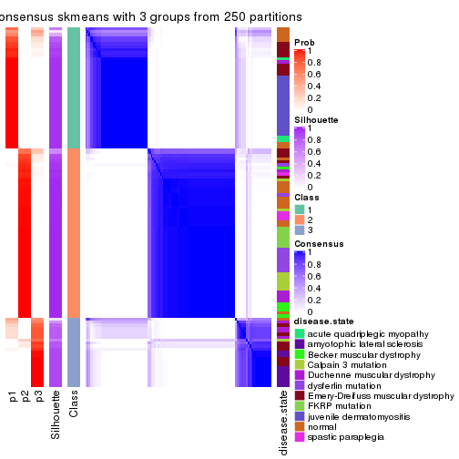</p>

</div>
<div id='tab-MAD-skmeans-consensus-heatmap-3'>
<pre><code class="r">consensus_heatmap(res, k = 4)
</code></pre>

<p></p>

</div>
<div id='tab-MAD-skmeans-consensus-heatmap-4'>
<pre><code class="r">consensus_heatmap(res, k = 5)
</code></pre>

<p></p>

</div>
<div id='tab-MAD-skmeans-consensus-heatmap-5'>
<pre><code class="r">consensus_heatmap(res, k = 6)
</code></pre>

<p></p>

</div>
</div>

Heatmaps for the membership of samples in all partitions to see how consistent they are:


<script>
$( function() {
	$( '#tabs-MAD-skmeans-membership-heatmap' ).tabs();
} );
</script>
<div id='tabs-MAD-skmeans-membership-heatmap'>
<ul>
<li><a href='#tab-MAD-skmeans-membership-heatmap-1'>k = 2</a></li>
<li><a href='#tab-MAD-skmeans-membership-heatmap-2'>k = 3</a></li>
<li><a href='#tab-MAD-skmeans-membership-heatmap-3'>k = 4</a></li>
<li><a href='#tab-MAD-skmeans-membership-heatmap-4'>k = 5</a></li>
<li><a href='#tab-MAD-skmeans-membership-heatmap-5'>k = 6</a></li>
</ul>
<div id='tab-MAD-skmeans-membership-heatmap-1'>
<pre><code class="r">membership_heatmap(res, k = 2)
</code></pre>

<p></p>

</div>
<div id='tab-MAD-skmeans-membership-heatmap-2'>
<pre><code class="r">membership_heatmap(res, k = 3)
</code></pre>

<p></p>

</div>
<div id='tab-MAD-skmeans-membership-heatmap-3'>
<pre><code class="r">membership_heatmap(res, k = 4)
</code></pre>

<p></p>

</div>
<div id='tab-MAD-skmeans-membership-heatmap-4'>
<pre><code class="r">membership_heatmap(res, k = 5)
</code></pre>

<p></p>

</div>
<div id='tab-MAD-skmeans-membership-heatmap-5'>
<pre><code class="r">membership_heatmap(res, k = 6)
</code></pre>

<p></p>

</div>
</div>

As soon as we have had the classes for columns, we can look for signatures
which are significantly different between classes which can be candidate marks
for certain classes. Following are the heatmaps for signatures.


Signature heatmaps where rows are scaled:


<script>
$( function() {
	$( '#tabs-MAD-skmeans-get-signatures' ).tabs();
} );
</script>
<div id='tabs-MAD-skmeans-get-signatures'>
<ul>
<li><a href='#tab-MAD-skmeans-get-signatures-1'>k = 2</a></li>
<li><a href='#tab-MAD-skmeans-get-signatures-2'>k = 3</a></li>
<li><a href='#tab-MAD-skmeans-get-signatures-3'>k = 4</a></li>
<li><a href='#tab-MAD-skmeans-get-signatures-4'>k = 5</a></li>
<li><a href='#tab-MAD-skmeans-get-signatures-5'>k = 6</a></li>
</ul>
<div id='tab-MAD-skmeans-get-signatures-1'>
<pre><code class="r">get_signatures(res, k = 2)
</code></pre>

<p></p>

</div>
<div id='tab-MAD-skmeans-get-signatures-2'>
<pre><code class="r">get_signatures(res, k = 3)
</code></pre>

<p></p>

</div>
<div id='tab-MAD-skmeans-get-signatures-3'>
<pre><code class="r">get_signatures(res, k = 4)
</code></pre>

<p></p>

</div>
<div id='tab-MAD-skmeans-get-signatures-4'>
<pre><code class="r">get_signatures(res, k = 5)
</code></pre>

<p></p>

</div>
<div id='tab-MAD-skmeans-get-signatures-5'>
<pre><code class="r">get_signatures(res, k = 6)
</code></pre>

<p></p>

</div>
</div>


Signature heatmaps where rows are not scaled:


<script>
$( function() {
	$( '#tabs-MAD-skmeans-get-signatures-no-scale' ).tabs();
} );
</script>
<div id='tabs-MAD-skmeans-get-signatures-no-scale'>
<ul>
<li><a href='#tab-MAD-skmeans-get-signatures-no-scale-1'>k = 2</a></li>
<li><a href='#tab-MAD-skmeans-get-signatures-no-scale-2'>k = 3</a></li>
<li><a href='#tab-MAD-skmeans-get-signatures-no-scale-3'>k = 4</a></li>
<li><a href='#tab-MAD-skmeans-get-signatures-no-scale-4'>k = 5</a></li>
<li><a href='#tab-MAD-skmeans-get-signatures-no-scale-5'>k = 6</a></li>
</ul>
<div id='tab-MAD-skmeans-get-signatures-no-scale-1'>
<pre><code class="r">get_signatures(res, k = 2, scale_rows = FALSE)
</code></pre>

<p></p>

</div>
<div id='tab-MAD-skmeans-get-signatures-no-scale-2'>
<pre><code class="r">get_signatures(res, k = 3, scale_rows = FALSE)
</code></pre>

<p></p>

</div>
<div id='tab-MAD-skmeans-get-signatures-no-scale-3'>
<pre><code class="r">get_signatures(res, k = 4, scale_rows = FALSE)
</code></pre>

<p>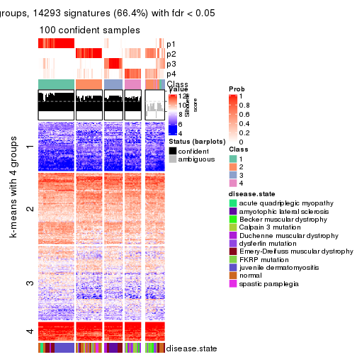</p>

</div>
<div id='tab-MAD-skmeans-get-signatures-no-scale-4'>
<pre><code class="r">get_signatures(res, k = 5, scale_rows = FALSE)
</code></pre>

<p></p>

</div>
<div id='tab-MAD-skmeans-get-signatures-no-scale-5'>
<pre><code class="r">get_signatures(res, k = 6, scale_rows = FALSE)
</code></pre>

<p></p>

</div>
</div>


Compare the overlap of signatures from different k:

```r
compare_signatures(res)
```


`get_signature()` returns a data frame invisibly. TO get the list of signatures, the function
call should be assigned to a variable explicitly. In following code, if `plot` argument is set
to `FALSE`, no heatmap is plotted while only the differential analysis is performed.

```r
# code only for demonstration
tb = get_signature(res, k = ..., plot = FALSE)
```

An example of the output of `tb` is:

```
#>   which_row         fdr    mean_1    mean_2 scaled_mean_1 scaled_mean_2 km
#> 1        38 0.042760348  8.373488  9.131774    -0.5533452     0.5164555  1
#> 2        40 0.018707592  7.106213  8.469186    -0.6173731     0.5762149  1
#> 3        55 0.019134737 10.221463 11.207825    -0.6159697     0.5749050  1
#> 4        59 0.006059896  5.921854  7.869574    -0.6899429     0.6439467  1
#> 5        60 0.018055526  8.928898 10.211722    -0.6204761     0.5791110  1
#> 6        98 0.009384629 15.714769 14.887706     0.6635654    -0.6193277  2
...
```

The columns in `tb` are:

1. `which_row`: row indices corresponding to the input matrix.
2. `fdr`: FDR for the differential test. 
3. `mean_x`: The mean value in group x.
4. `scaled_mean_x`: The mean value in group x after rows are scaled.
5. `km`: Row groups if k-means clustering is applied to rows.


UMAP plot which shows how samples are separated.


<script>
$( function() {
	$( '#tabs-MAD-skmeans-dimension-reduction' ).tabs();
} );
</script>
<div id='tabs-MAD-skmeans-dimension-reduction'>
<ul>
<li><a href='#tab-MAD-skmeans-dimension-reduction-1'>k = 2</a></li>
<li><a href='#tab-MAD-skmeans-dimension-reduction-2'>k = 3</a></li>
<li><a href='#tab-MAD-skmeans-dimension-reduction-3'>k = 4</a></li>
<li><a href='#tab-MAD-skmeans-dimension-reduction-4'>k = 5</a></li>
<li><a href='#tab-MAD-skmeans-dimension-reduction-5'>k = 6</a></li>
</ul>
<div id='tab-MAD-skmeans-dimension-reduction-1'>
<pre><code class="r">dimension_reduction(res, k = 2, method = &quot;UMAP&quot;)
</code></pre>

<p></p>

</div>
<div id='tab-MAD-skmeans-dimension-reduction-2'>
<pre><code class="r">dimension_reduction(res, k = 3, method = &quot;UMAP&quot;)
</code></pre>

<p></p>

</div>
<div id='tab-MAD-skmeans-dimension-reduction-3'>
<pre><code class="r">dimension_reduction(res, k = 4, method = &quot;UMAP&quot;)
</code></pre>

<p></p>

</div>
<div id='tab-MAD-skmeans-dimension-reduction-4'>
<pre><code class="r">dimension_reduction(res, k = 5, method = &quot;UMAP&quot;)
</code></pre>

<p></p>

</div>
<div id='tab-MAD-skmeans-dimension-reduction-5'>
<pre><code class="r">dimension_reduction(res, k = 6, method = &quot;UMAP&quot;)
</code></pre>

<p></p>

</div>
</div>


Following heatmap shows how subgroups are split when increasing `k`:

```r
collect_classes(res)
```


Test correlation between subgroups and known annotations. If the known
annotation is numeric, one-way ANOVA test is applied, and if the known
annotation is discrete, chi-squared contingency table test is applied.

```r
test_to_known_factors(res)
```

```
#>               n disease.state(p) k
#> MAD:skmeans 119         2.79e-10 2
#> MAD:skmeans 116         3.26e-19 3
#> MAD:skmeans 100         5.17e-21 4
#> MAD:skmeans  95         1.65e-24 5
#> MAD:skmeans 100         5.86e-33 6
```


If matrix rows can be associated to genes, consider to use `functional_enrichment(res,
...)` to perform function enrichment for the signature genes. See [this vignette](http://bioconductor.org/packages/devel/bioc/vignettes/cola/inst/doc/functional_enrichment.html) for more detailed explanations.


 

---------------------------------------------------


### MAD:pam


The object with results only for a single top-value method and a single partition method 
can be extracted as:

```r
res = res_list["MAD", "pam"]
# you can also extract it by
# res = res_list["MAD:pam"]
```

A summary of `res` and all the functions that can be applied to it:

```r
res
```

```
#> A 'ConsensusPartition' object with k = 2, 3, 4, 5, 6.
#>   On a matrix with 21512 rows and 119 columns.
#>   Top rows (1000, 2000, 3000, 4000, 5000) are extracted by 'MAD' method.
#>   Subgroups are detected by 'pam' method.
#>   Performed in total 1250 partitions by row resampling.
#>   Best k for subgroups seems to be 2.
#> 
#> Following methods can be applied to this 'ConsensusPartition' object:
#>  [1] "cola_report"             "collect_classes"         "collect_plots"          
#>  [4] "collect_stats"           "colnames"                "compare_signatures"     
#>  [7] "consensus_heatmap"       "dimension_reduction"     "functional_enrichment"  
#> [10] "get_anno_col"            "get_anno"                "get_classes"            
#> [13] "get_consensus"           "get_matrix"              "get_membership"         
#> [16] "get_param"               "get_signatures"          "get_stats"              
#> [19] "is_best_k"               "is_stable_k"             "membership_heatmap"     
#> [22] "ncol"                    "nrow"                    "plot_ecdf"              
#> [25] "rownames"                "select_partition_number" "show"                   
#> [28] "suggest_best_k"          "test_to_known_factors"
```

`collect_plots()` function collects all the plots made from `res` for all `k` (number of partitions)
into one single page to provide an easy and fast comparison between different `k`.

```r
collect_plots(res)
```


The plots are:

- The first row: a plot of the ECDF (empirical cumulative distribution
  function) curves of the consensus matrix for each `k` and the heatmap of
  predicted classes for each `k`.
- The second row: heatmaps of the consensus matrix for each `k`.
- The third row: heatmaps of the membership matrix for each `k`.
- The fouth row: heatmaps of the signatures for each `k`.

All the plots in panels can be made by individual functions and they are
plotted later in this section.

`select_partition_number()` produces several plots showing different
statistics for choosing "optimized" `k`. There are following statistics:

- ECDF curves of the consensus matrix for each `k`;
- 1-PAC. [The PAC
  score](https://en.wikipedia.org/wiki/Consensus_clustering#Over-interpretation_potential_of_consensus_clustering)
  measures the proportion of the ambiguous subgrouping.
- Mean silhouette score.
- Concordance. The mean probability of fiting the consensus class ids in all
  partitions.
- Area increased. Denote $A_k$ as the area under the ECDF curve for current
  `k`, the area increased is defined as $A_k - A_{k-1}$.
- Rand index. The percent of pairs of samples that are both in a same cluster
  or both are not in a same cluster in the partition of k and k-1.
- Jaccard index. The ratio of pairs of samples are both in a same cluster in
  the partition of k and k-1 and the pairs of samples are both in a same
  cluster in the partition k or k-1.

The detailed explanations of these statistics can be found in [the _cola_
vignette](http://bioconductor.org/packages/devel/bioc/vignettes/cola/inst/doc/cola.html#toc_13).

Generally speaking, lower PAC score, higher mean silhouette score or higher
concordance corresponds to better partition. Rand index and Jaccard index
measure how similar the current partition is compared to partition with `k-1`.
If they are too similar, we won't accept `k` is better than `k-1`.

```r
select_partition_number(res)
```


The numeric values for all these statistics can be obtained by `get_stats()`.

```r
get_stats(res)
```

```
#>   k 1-PAC mean_silhouette concordance area_increased  Rand Jaccard
#> 2 2 0.556           0.827       0.907         0.4859 0.500   0.500
#> 3 3 0.658           0.789       0.848         0.3741 0.714   0.487
#> 4 4 0.701           0.749       0.877         0.0994 0.907   0.728
#> 5 5 0.715           0.643       0.796         0.0720 0.877   0.593
#> 6 6 0.793           0.775       0.874         0.0492 0.919   0.662
```

`suggest_best_k()` suggests the best $k$ based on these statistics. The rules are as follows:

- All $k$ with Jaccard index larger than 0.95 are removed because increasing
  $k$ does not provide enough extra information. If all $k$ are removed, it is
  marked as no subgroup is detected.
- For all $k$ with 1-PAC score larger than 0.9, the maximal $k$ is taken as
  the best $k$, and other $k$ are marked as optional $k$.
- If it does not fit the second rule. The $k$ with the maximal vote of the
  highest 1-PAC score, highest mean silhouette, and highest concordance is
  taken as the best $k$.

```r
suggest_best_k(res)
```

```
#> [1] 2
```


Following shows the table of the partitions (You need to click the **show/hide
code output** link to see it). The membership matrix (columns with name `p*`)
is inferred by
[`clue::cl_consensus()`](https://www.rdocumentation.org/link/cl_consensus?package=clue)
function with the `SE` method. Basically the value in the membership matrix
represents the probability to belong to a certain group. The finall class
label for an item is determined with the group with highest probability it
belongs to.

In `get_classes()` function, the entropy is calculated from the membership
matrix and the silhouette score is calculated from the consensus matrix.


<script>
$( function() {
	$( '#tabs-MAD-pam-get-classes' ).tabs();
} );
</script>
<div id='tabs-MAD-pam-get-classes'>
<ul>
<li><a href='#tab-MAD-pam-get-classes-1'>k = 2</a></li>
<li><a href='#tab-MAD-pam-get-classes-2'>k = 3</a></li>
<li><a href='#tab-MAD-pam-get-classes-3'>k = 4</a></li>
<li><a href='#tab-MAD-pam-get-classes-4'>k = 5</a></li>
<li><a href='#tab-MAD-pam-get-classes-5'>k = 6</a></li>
</ul>

<div id='tab-MAD-pam-get-classes-1'>
<p><a id='tab-MAD-pam-get-classes-1-a' style='color:#0366d6' href='#'>show/hide code output</a></p>
<pre><code class="r">cbind(get_classes(res, k = 2), get_membership(res, k = 2))
</code></pre>

<pre><code>#&gt;           class entropy silhouette    p1    p2
#&gt; GSM120719     1  0.0000      0.840 1.000 0.000
#&gt; GSM120720     1  0.0000      0.840 1.000 0.000
#&gt; GSM120765     2  0.0000      0.950 0.000 1.000
#&gt; GSM120767     2  0.0000      0.950 0.000 1.000
#&gt; GSM120784     2  0.0000      0.950 0.000 1.000
#&gt; GSM121400     1  0.9044      0.682 0.680 0.320
#&gt; GSM121401     1  0.9248      0.666 0.660 0.340
#&gt; GSM121402     2  0.0000      0.950 0.000 1.000
#&gt; GSM121403     1  0.9323      0.658 0.652 0.348
#&gt; GSM121404     1  0.9427      0.642 0.640 0.360
#&gt; GSM121405     1  0.9323      0.658 0.652 0.348
#&gt; GSM121406     2  0.0000      0.950 0.000 1.000
#&gt; GSM121408     2  0.0000      0.950 0.000 1.000
#&gt; GSM121409     1  0.8813      0.698 0.700 0.300
#&gt; GSM121410     1  0.7453      0.755 0.788 0.212
#&gt; GSM121412     2  0.0376      0.947 0.004 0.996
#&gt; GSM121413     2  0.0000      0.950 0.000 1.000
#&gt; GSM121414     2  0.0000      0.950 0.000 1.000
#&gt; GSM121415     2  0.4431      0.852 0.092 0.908
#&gt; GSM121416     2  0.0000      0.950 0.000 1.000
#&gt; GSM120591     1  0.2236      0.835 0.964 0.036
#&gt; GSM120594     1  0.0000      0.840 1.000 0.000
#&gt; GSM120718     1  0.0000      0.840 1.000 0.000
#&gt; GSM121205     1  0.0000      0.840 1.000 0.000
#&gt; GSM121206     1  0.0000      0.840 1.000 0.000
#&gt; GSM121207     1  0.0000      0.840 1.000 0.000
#&gt; GSM121208     1  0.0000      0.840 1.000 0.000
#&gt; GSM121209     1  0.0000      0.840 1.000 0.000
#&gt; GSM121210     1  0.0000      0.840 1.000 0.000
#&gt; GSM121211     1  0.0000      0.840 1.000 0.000
#&gt; GSM121212     1  0.0000      0.840 1.000 0.000
#&gt; GSM121213     1  0.0000      0.840 1.000 0.000
#&gt; GSM121214     1  0.0000      0.840 1.000 0.000
#&gt; GSM121215     1  0.0000      0.840 1.000 0.000
#&gt; GSM121216     1  0.0000      0.840 1.000 0.000
#&gt; GSM121217     1  0.0000      0.840 1.000 0.000
#&gt; GSM121218     1  0.0000      0.840 1.000 0.000
#&gt; GSM121234     1  0.0000      0.840 1.000 0.000
#&gt; GSM121243     1  0.0000      0.840 1.000 0.000
#&gt; GSM121245     1  0.0000      0.840 1.000 0.000
#&gt; GSM121246     1  0.0000      0.840 1.000 0.000
#&gt; GSM121247     1  0.0000      0.840 1.000 0.000
#&gt; GSM121248     1  0.0000      0.840 1.000 0.000
#&gt; GSM120744     1  0.9460      0.636 0.636 0.364
#&gt; GSM120745     1  0.9323      0.658 0.652 0.348
#&gt; GSM120746     1  0.9358      0.654 0.648 0.352
#&gt; GSM120747     1  0.9358      0.654 0.648 0.352
#&gt; GSM120748     2  0.9358      0.261 0.352 0.648
#&gt; GSM120749     1  0.9323      0.658 0.652 0.348
#&gt; GSM120750     1  0.9358      0.654 0.648 0.352
#&gt; GSM120751     1  0.9358      0.654 0.648 0.352
#&gt; GSM120752     1  0.9358      0.654 0.648 0.352
#&gt; GSM121336     2  0.0000      0.950 0.000 1.000
#&gt; GSM121339     2  0.6887      0.709 0.184 0.816
#&gt; GSM121349     2  0.0000      0.950 0.000 1.000
#&gt; GSM121355     2  0.0000      0.950 0.000 1.000
#&gt; GSM120757     1  0.9710      0.555 0.600 0.400
#&gt; GSM120766     1  0.9522      0.622 0.628 0.372
#&gt; GSM120770     2  0.4815      0.836 0.104 0.896
#&gt; GSM120779     1  0.4690      0.814 0.900 0.100
#&gt; GSM120780     1  0.9358      0.654 0.648 0.352
#&gt; GSM121102     2  0.2423      0.913 0.040 0.960
#&gt; GSM121203     1  0.9358      0.654 0.648 0.352
#&gt; GSM121204     1  0.1184      0.838 0.984 0.016
#&gt; GSM121330     1  0.0000      0.840 1.000 0.000
#&gt; GSM121335     1  0.0000      0.840 1.000 0.000
#&gt; GSM121337     1  0.9358      0.654 0.648 0.352
#&gt; GSM121338     1  0.9460      0.636 0.636 0.364
#&gt; GSM121341     1  0.0000      0.840 1.000 0.000
#&gt; GSM121342     1  0.0000      0.840 1.000 0.000
#&gt; GSM121343     1  0.9393      0.648 0.644 0.356
#&gt; GSM121344     1  0.0000      0.840 1.000 0.000
#&gt; GSM121346     1  0.2603      0.833 0.956 0.044
#&gt; GSM121347     1  0.9248      0.666 0.660 0.340
#&gt; GSM121348     1  0.9358      0.654 0.648 0.352
#&gt; GSM121350     1  0.3733      0.824 0.928 0.072
#&gt; GSM121352     1  0.1184      0.838 0.984 0.016
#&gt; GSM121354     1  0.0000      0.840 1.000 0.000
#&gt; GSM120753     2  0.0000      0.950 0.000 1.000
#&gt; GSM120761     2  0.0000      0.950 0.000 1.000
#&gt; GSM120768     2  0.0000      0.950 0.000 1.000
#&gt; GSM120781     2  0.0000      0.950 0.000 1.000
#&gt; GSM120788     2  0.5408      0.827 0.124 0.876
#&gt; GSM120760     2  0.0000      0.950 0.000 1.000
#&gt; GSM120763     2  0.0000      0.950 0.000 1.000
#&gt; GSM120764     2  0.0000      0.950 0.000 1.000
#&gt; GSM120777     2  0.5178      0.834 0.116 0.884
#&gt; GSM120786     2  0.0000      0.950 0.000 1.000
#&gt; GSM121329     1  0.0000      0.840 1.000 0.000
#&gt; GSM121331     1  0.4939      0.811 0.892 0.108
#&gt; GSM121333     1  0.5294      0.805 0.880 0.120
#&gt; GSM121345     1  0.2948      0.830 0.948 0.052
#&gt; GSM121356     1  0.5408      0.804 0.876 0.124
#&gt; GSM120754     2  0.0000      0.950 0.000 1.000
#&gt; GSM120759     2  0.0000      0.950 0.000 1.000
#&gt; GSM120762     2  0.0000      0.950 0.000 1.000
#&gt; GSM120775     2  0.0000      0.950 0.000 1.000
#&gt; GSM120776     2  0.6973      0.703 0.188 0.812
#&gt; GSM120782     2  0.0000      0.950 0.000 1.000
#&gt; GSM120789     2  0.0000      0.950 0.000 1.000
#&gt; GSM120790     2  0.0672      0.943 0.008 0.992
#&gt; GSM120791     2  0.0000      0.950 0.000 1.000
#&gt; GSM120755     2  0.0000      0.950 0.000 1.000
#&gt; GSM120756     2  0.9460      0.442 0.364 0.636
#&gt; GSM120769     2  0.0000      0.950 0.000 1.000
#&gt; GSM120778     2  0.0000      0.950 0.000 1.000
#&gt; GSM120792     2  0.0000      0.950 0.000 1.000
#&gt; GSM121332     2  0.0000      0.950 0.000 1.000
#&gt; GSM121334     2  0.0000      0.950 0.000 1.000
#&gt; GSM121340     2  0.7219      0.714 0.200 0.800
#&gt; GSM121351     2  0.0000      0.950 0.000 1.000
#&gt; GSM121353     2  0.9323      0.471 0.348 0.652
#&gt; GSM120758     2  0.0000      0.950 0.000 1.000
#&gt; GSM120771     2  0.0000      0.950 0.000 1.000
#&gt; GSM120772     2  0.0000      0.950 0.000 1.000
#&gt; GSM120773     2  0.0000      0.950 0.000 1.000
#&gt; GSM120774     2  0.0000      0.950 0.000 1.000
#&gt; GSM120783     2  0.0000      0.950 0.000 1.000
#&gt; GSM120787     2  0.0000      0.950 0.000 1.000
</code></pre>

<script>
$('#tab-MAD-pam-get-classes-1-a').parent().next().next().hide();
$('#tab-MAD-pam-get-classes-1-a').click(function(){
  $('#tab-MAD-pam-get-classes-1-a').parent().next().next().toggle();
  return(false);
});
</script>
</div>

<div id='tab-MAD-pam-get-classes-2'>
<p><a id='tab-MAD-pam-get-classes-2-a' style='color:#0366d6' href='#'>show/hide code output</a></p>
<pre><code class="r">cbind(get_classes(res, k = 3), get_membership(res, k = 3))
</code></pre>

<pre><code>#&gt;           class entropy silhouette    p1    p2    p3
#&gt; GSM120719     1  0.0000     0.9404 1.000 0.000 0.000
#&gt; GSM120720     1  0.0000     0.9404 1.000 0.000 0.000
#&gt; GSM120765     2  0.5988     0.5166 0.000 0.632 0.368
#&gt; GSM120767     3  0.2537     0.8250 0.000 0.080 0.920
#&gt; GSM120784     3  0.3551     0.7856 0.000 0.132 0.868
#&gt; GSM121400     3  0.2663     0.8307 0.044 0.024 0.932
#&gt; GSM121401     3  0.0747     0.8529 0.016 0.000 0.984
#&gt; GSM121402     3  0.5529     0.5660 0.000 0.296 0.704
#&gt; GSM121403     3  0.0000     0.8588 0.000 0.000 1.000
#&gt; GSM121404     3  0.0000     0.8588 0.000 0.000 1.000
#&gt; GSM121405     3  0.0000     0.8588 0.000 0.000 1.000
#&gt; GSM121406     3  0.5497     0.5639 0.000 0.292 0.708
#&gt; GSM121408     2  0.5291     0.6836 0.000 0.732 0.268
#&gt; GSM121409     3  0.3434     0.8098 0.064 0.032 0.904
#&gt; GSM121410     3  0.5355     0.7131 0.160 0.036 0.804
#&gt; GSM121412     3  0.5363     0.5688 0.000 0.276 0.724
#&gt; GSM121413     3  0.4002     0.7658 0.000 0.160 0.840
#&gt; GSM121414     3  0.3816     0.7624 0.000 0.148 0.852
#&gt; GSM121415     3  0.5138     0.6291 0.000 0.252 0.748
#&gt; GSM121416     2  0.5785     0.5493 0.000 0.668 0.332
#&gt; GSM120591     1  0.3879     0.8288 0.848 0.000 0.152
#&gt; GSM120594     1  0.0237     0.9394 0.996 0.000 0.004
#&gt; GSM120718     1  0.0000     0.9404 1.000 0.000 0.000
#&gt; GSM121205     1  0.0000     0.9404 1.000 0.000 0.000
#&gt; GSM121206     1  0.0000     0.9404 1.000 0.000 0.000
#&gt; GSM121207     1  0.0000     0.9404 1.000 0.000 0.000
#&gt; GSM121208     1  0.0000     0.9404 1.000 0.000 0.000
#&gt; GSM121209     1  0.0000     0.9404 1.000 0.000 0.000
#&gt; GSM121210     1  0.0000     0.9404 1.000 0.000 0.000
#&gt; GSM121211     1  0.0000     0.9404 1.000 0.000 0.000
#&gt; GSM121212     1  0.0000     0.9404 1.000 0.000 0.000
#&gt; GSM121213     1  0.0000     0.9404 1.000 0.000 0.000
#&gt; GSM121214     1  0.0000     0.9404 1.000 0.000 0.000
#&gt; GSM121215     1  0.0000     0.9404 1.000 0.000 0.000
#&gt; GSM121216     1  0.0000     0.9404 1.000 0.000 0.000
#&gt; GSM121217     1  0.0000     0.9404 1.000 0.000 0.000
#&gt; GSM121218     1  0.0000     0.9404 1.000 0.000 0.000
#&gt; GSM121234     1  0.0000     0.9404 1.000 0.000 0.000
#&gt; GSM121243     1  0.0000     0.9404 1.000 0.000 0.000
#&gt; GSM121245     1  0.0000     0.9404 1.000 0.000 0.000
#&gt; GSM121246     1  0.0237     0.9394 0.996 0.000 0.004
#&gt; GSM121247     1  0.0000     0.9404 1.000 0.000 0.000
#&gt; GSM121248     1  0.0000     0.9404 1.000 0.000 0.000
#&gt; GSM120744     3  0.0000     0.8588 0.000 0.000 1.000
#&gt; GSM120745     3  0.0000     0.8588 0.000 0.000 1.000
#&gt; GSM120746     3  0.0000     0.8588 0.000 0.000 1.000
#&gt; GSM120747     3  0.0000     0.8588 0.000 0.000 1.000
#&gt; GSM120748     3  0.0000     0.8588 0.000 0.000 1.000
#&gt; GSM120749     3  0.0000     0.8588 0.000 0.000 1.000
#&gt; GSM120750     3  0.0237     0.8585 0.000 0.004 0.996
#&gt; GSM120751     3  0.0000     0.8588 0.000 0.000 1.000
#&gt; GSM120752     3  0.0237     0.8585 0.000 0.004 0.996
#&gt; GSM121336     2  0.5327     0.6779 0.000 0.728 0.272
#&gt; GSM121339     3  0.0592     0.8574 0.000 0.012 0.988
#&gt; GSM121349     2  0.5835     0.5556 0.000 0.660 0.340
#&gt; GSM121355     2  0.5948     0.5236 0.000 0.640 0.360
#&gt; GSM120757     3  0.3998     0.8094 0.056 0.060 0.884
#&gt; GSM120766     3  0.1753     0.8439 0.000 0.048 0.952
#&gt; GSM120770     3  0.5706     0.5636 0.000 0.320 0.680
#&gt; GSM120779     1  0.6423     0.6969 0.728 0.044 0.228
#&gt; GSM120780     3  0.1529     0.8444 0.000 0.040 0.960
#&gt; GSM121102     3  0.0237     0.8585 0.000 0.004 0.996
#&gt; GSM121203     3  0.0237     0.8585 0.000 0.004 0.996
#&gt; GSM121204     1  0.3573     0.8547 0.876 0.004 0.120
#&gt; GSM121330     1  0.0237     0.9394 0.996 0.000 0.004
#&gt; GSM121335     1  0.0237     0.9394 0.996 0.000 0.004
#&gt; GSM121337     3  0.5859     0.5204 0.000 0.344 0.656
#&gt; GSM121338     3  0.0000     0.8588 0.000 0.000 1.000
#&gt; GSM121341     1  0.0237     0.9394 0.996 0.000 0.004
#&gt; GSM121342     1  0.0237     0.9394 0.996 0.000 0.004
#&gt; GSM121343     3  0.0892     0.8570 0.000 0.020 0.980
#&gt; GSM121344     1  0.0237     0.9394 0.996 0.000 0.004
#&gt; GSM121346     1  0.5497     0.6367 0.708 0.000 0.292
#&gt; GSM121347     3  0.1765     0.8456 0.004 0.040 0.956
#&gt; GSM121348     3  0.5785     0.5428 0.000 0.332 0.668
#&gt; GSM121350     1  0.5216     0.6810 0.740 0.000 0.260
#&gt; GSM121352     1  0.2448     0.8937 0.924 0.000 0.076
#&gt; GSM121354     1  0.0237     0.9394 0.996 0.000 0.004
#&gt; GSM120753     2  0.2878     0.8220 0.000 0.904 0.096
#&gt; GSM120761     2  0.2261     0.8365 0.000 0.932 0.068
#&gt; GSM120768     2  0.1753     0.8380 0.000 0.952 0.048
#&gt; GSM120781     2  0.2066     0.8371 0.000 0.940 0.060
#&gt; GSM120788     2  0.2187     0.8238 0.024 0.948 0.028
#&gt; GSM120760     2  0.0000     0.8312 0.000 1.000 0.000
#&gt; GSM120763     2  0.0000     0.8312 0.000 1.000 0.000
#&gt; GSM120764     2  0.0237     0.8314 0.000 0.996 0.004
#&gt; GSM120777     2  0.1031     0.8354 0.000 0.976 0.024
#&gt; GSM120786     2  0.0000     0.8312 0.000 1.000 0.000
#&gt; GSM121329     1  0.0000     0.9404 1.000 0.000 0.000
#&gt; GSM121331     1  0.6247     0.7156 0.744 0.044 0.212
#&gt; GSM121333     1  0.4902     0.8338 0.844 0.064 0.092
#&gt; GSM121345     1  0.4384     0.8593 0.868 0.068 0.064
#&gt; GSM121356     1  0.5635     0.7628 0.784 0.036 0.180
#&gt; GSM120754     2  0.3752     0.7647 0.000 0.856 0.144
#&gt; GSM120759     2  0.6244     0.3242 0.000 0.560 0.440
#&gt; GSM120762     2  0.1643     0.8365 0.000 0.956 0.044
#&gt; GSM120775     2  0.1289     0.8321 0.000 0.968 0.032
#&gt; GSM120776     3  0.6225     0.2141 0.000 0.432 0.568
#&gt; GSM120782     3  0.6299     0.0685 0.000 0.476 0.524
#&gt; GSM120789     2  0.5363     0.6807 0.000 0.724 0.276
#&gt; GSM120790     3  0.5706     0.5735 0.000 0.320 0.680
#&gt; GSM120791     2  0.0747     0.8355 0.000 0.984 0.016
#&gt; GSM120755     2  0.4974     0.7158 0.000 0.764 0.236
#&gt; GSM120756     1  0.6307     0.0807 0.512 0.488 0.000
#&gt; GSM120769     2  0.1289     0.8353 0.000 0.968 0.032
#&gt; GSM120778     2  0.1031     0.8360 0.000 0.976 0.024
#&gt; GSM120792     2  0.1753     0.8378 0.000 0.952 0.048
#&gt; GSM121332     2  0.1964     0.8378 0.000 0.944 0.056
#&gt; GSM121334     2  0.2625     0.8251 0.000 0.916 0.084
#&gt; GSM121340     2  0.0000     0.8312 0.000 1.000 0.000
#&gt; GSM121351     2  0.5733     0.5847 0.000 0.676 0.324
#&gt; GSM121353     2  0.4702     0.6643 0.212 0.788 0.000
#&gt; GSM120758     2  0.0892     0.8377 0.000 0.980 0.020
#&gt; GSM120771     2  0.5621     0.5693 0.000 0.692 0.308
#&gt; GSM120772     2  0.4931     0.6907 0.000 0.768 0.232
#&gt; GSM120773     2  0.1529     0.8369 0.000 0.960 0.040
#&gt; GSM120774     2  0.3752     0.8056 0.000 0.856 0.144
#&gt; GSM120783     2  0.1411     0.8364 0.000 0.964 0.036
#&gt; GSM120787     2  0.6252     0.2151 0.000 0.556 0.444
</code></pre>

<script>
$('#tab-MAD-pam-get-classes-2-a').parent().next().next().hide();
$('#tab-MAD-pam-get-classes-2-a').click(function(){
  $('#tab-MAD-pam-get-classes-2-a').parent().next().next().toggle();
  return(false);
});
</script>
</div>

<div id='tab-MAD-pam-get-classes-3'>
<p><a id='tab-MAD-pam-get-classes-3-a' style='color:#0366d6' href='#'>show/hide code output</a></p>
<pre><code class="r">cbind(get_classes(res, k = 4), get_membership(res, k = 4))
</code></pre>

<pre><code>#&gt;           class entropy silhouette    p1    p2    p3    p4
#&gt; GSM120719     1  0.0000     0.9283 1.000 0.000 0.000 0.000
#&gt; GSM120720     1  0.1661     0.8962 0.944 0.000 0.004 0.052
#&gt; GSM120765     2  0.4356     0.5973 0.000 0.708 0.292 0.000
#&gt; GSM120767     3  0.3569     0.6700 0.000 0.196 0.804 0.000
#&gt; GSM120784     3  0.4331     0.5764 0.000 0.288 0.712 0.000
#&gt; GSM121400     4  0.0707     0.9417 0.000 0.000 0.020 0.980
#&gt; GSM121401     4  0.1302     0.9396 0.000 0.000 0.044 0.956
#&gt; GSM121402     3  0.4661     0.4927 0.000 0.348 0.652 0.000
#&gt; GSM121403     4  0.1557     0.9331 0.000 0.000 0.056 0.944
#&gt; GSM121404     3  0.5088     0.2284 0.000 0.004 0.572 0.424
#&gt; GSM121405     4  0.1302     0.9396 0.000 0.000 0.044 0.956
#&gt; GSM121406     3  0.4992     0.1112 0.000 0.476 0.524 0.000
#&gt; GSM121408     2  0.3764     0.7015 0.000 0.784 0.216 0.000
#&gt; GSM121409     3  0.5407    -0.0451 0.012 0.000 0.504 0.484
#&gt; GSM121410     4  0.0859     0.9402 0.008 0.004 0.008 0.980
#&gt; GSM121412     3  0.4699     0.4623 0.000 0.320 0.676 0.004
#&gt; GSM121413     3  0.4522     0.5414 0.000 0.320 0.680 0.000
#&gt; GSM121414     3  0.4134     0.5918 0.000 0.260 0.740 0.000
#&gt; GSM121415     3  0.4961     0.1880 0.000 0.448 0.552 0.000
#&gt; GSM121416     2  0.5321     0.5418 0.000 0.672 0.296 0.032
#&gt; GSM120591     1  0.6401     0.6033 0.652 0.000 0.176 0.172
#&gt; GSM120594     1  0.2334     0.8680 0.908 0.000 0.004 0.088
#&gt; GSM120718     1  0.0000     0.9283 1.000 0.000 0.000 0.000
#&gt; GSM121205     1  0.0000     0.9283 1.000 0.000 0.000 0.000
#&gt; GSM121206     1  0.0188     0.9264 0.996 0.000 0.000 0.004
#&gt; GSM121207     1  0.0000     0.9283 1.000 0.000 0.000 0.000
#&gt; GSM121208     1  0.0188     0.9264 0.996 0.000 0.000 0.004
#&gt; GSM121209     1  0.0000     0.9283 1.000 0.000 0.000 0.000
#&gt; GSM121210     1  0.0000     0.9283 1.000 0.000 0.000 0.000
#&gt; GSM121211     1  0.0000     0.9283 1.000 0.000 0.000 0.000
#&gt; GSM121212     1  0.0000     0.9283 1.000 0.000 0.000 0.000
#&gt; GSM121213     1  0.0000     0.9283 1.000 0.000 0.000 0.000
#&gt; GSM121214     1  0.0000     0.9283 1.000 0.000 0.000 0.000
#&gt; GSM121215     1  0.0000     0.9283 1.000 0.000 0.000 0.000
#&gt; GSM121216     1  0.0000     0.9283 1.000 0.000 0.000 0.000
#&gt; GSM121217     1  0.0000     0.9283 1.000 0.000 0.000 0.000
#&gt; GSM121218     1  0.0000     0.9283 1.000 0.000 0.000 0.000
#&gt; GSM121234     1  0.0000     0.9283 1.000 0.000 0.000 0.000
#&gt; GSM121243     1  0.0000     0.9283 1.000 0.000 0.000 0.000
#&gt; GSM121245     1  0.0000     0.9283 1.000 0.000 0.000 0.000
#&gt; GSM121246     1  0.4730     0.4475 0.636 0.000 0.000 0.364
#&gt; GSM121247     1  0.0000     0.9283 1.000 0.000 0.000 0.000
#&gt; GSM121248     1  0.0000     0.9283 1.000 0.000 0.000 0.000
#&gt; GSM120744     3  0.0000     0.7667 0.000 0.000 1.000 0.000
#&gt; GSM120745     3  0.0000     0.7667 0.000 0.000 1.000 0.000
#&gt; GSM120746     3  0.0000     0.7667 0.000 0.000 1.000 0.000
#&gt; GSM120747     3  0.0000     0.7667 0.000 0.000 1.000 0.000
#&gt; GSM120748     3  0.0000     0.7667 0.000 0.000 1.000 0.000
#&gt; GSM120749     3  0.0000     0.7667 0.000 0.000 1.000 0.000
#&gt; GSM120750     3  0.0000     0.7667 0.000 0.000 1.000 0.000
#&gt; GSM120751     3  0.0000     0.7667 0.000 0.000 1.000 0.000
#&gt; GSM120752     3  0.0000     0.7667 0.000 0.000 1.000 0.000
#&gt; GSM121336     2  0.3726     0.7098 0.000 0.788 0.212 0.000
#&gt; GSM121339     3  0.2473     0.7263 0.000 0.012 0.908 0.080
#&gt; GSM121349     2  0.3726     0.7056 0.000 0.788 0.212 0.000
#&gt; GSM121355     2  0.4103     0.6557 0.000 0.744 0.256 0.000
#&gt; GSM120757     3  0.3595     0.7348 0.036 0.040 0.880 0.044
#&gt; GSM120766     3  0.2399     0.7492 0.000 0.032 0.920 0.048
#&gt; GSM120770     3  0.5582     0.4912 0.000 0.348 0.620 0.032
#&gt; GSM120779     1  0.5954     0.6483 0.688 0.020 0.244 0.048
#&gt; GSM120780     3  0.1798     0.7539 0.000 0.016 0.944 0.040
#&gt; GSM121102     3  0.0000     0.7667 0.000 0.000 1.000 0.000
#&gt; GSM121203     3  0.0188     0.7661 0.000 0.000 0.996 0.004
#&gt; GSM121204     1  0.4673     0.7132 0.748 0.008 0.232 0.012
#&gt; GSM121330     4  0.1302     0.9568 0.044 0.000 0.000 0.956
#&gt; GSM121335     4  0.1302     0.9568 0.044 0.000 0.000 0.956
#&gt; GSM121337     4  0.4417     0.7352 0.000 0.044 0.160 0.796
#&gt; GSM121338     3  0.3257     0.6846 0.000 0.004 0.844 0.152
#&gt; GSM121341     4  0.1389     0.9545 0.048 0.000 0.000 0.952
#&gt; GSM121342     4  0.1389     0.9543 0.048 0.000 0.000 0.952
#&gt; GSM121343     4  0.2401     0.8958 0.000 0.004 0.092 0.904
#&gt; GSM121344     4  0.1302     0.9568 0.044 0.000 0.000 0.956
#&gt; GSM121346     4  0.1302     0.9568 0.044 0.000 0.000 0.956
#&gt; GSM121347     3  0.2179     0.7478 0.000 0.012 0.924 0.064
#&gt; GSM121348     3  0.6097     0.4429 0.000 0.364 0.580 0.056
#&gt; GSM121350     4  0.1452     0.9558 0.036 0.000 0.008 0.956
#&gt; GSM121352     4  0.1302     0.9568 0.044 0.000 0.000 0.956
#&gt; GSM121354     4  0.1302     0.9568 0.044 0.000 0.000 0.956
#&gt; GSM120753     2  0.1637     0.8212 0.000 0.940 0.060 0.000
#&gt; GSM120761     2  0.1474     0.8291 0.000 0.948 0.052 0.000
#&gt; GSM120768     2  0.0707     0.8307 0.000 0.980 0.020 0.000
#&gt; GSM120781     2  0.1118     0.8307 0.000 0.964 0.036 0.000
#&gt; GSM120788     2  0.2733     0.8069 0.020 0.916 0.032 0.032
#&gt; GSM120760     2  0.0188     0.8278 0.000 0.996 0.000 0.004
#&gt; GSM120763     2  0.0336     0.8286 0.000 0.992 0.000 0.008
#&gt; GSM120764     2  0.0524     0.8284 0.000 0.988 0.004 0.008
#&gt; GSM120777     2  0.2310     0.8185 0.004 0.928 0.028 0.040
#&gt; GSM120786     2  0.0524     0.8282 0.000 0.988 0.004 0.008
#&gt; GSM121329     1  0.0592     0.9206 0.984 0.000 0.000 0.016
#&gt; GSM121331     1  0.5691     0.6767 0.712 0.016 0.224 0.048
#&gt; GSM121333     1  0.3410     0.8630 0.888 0.032 0.036 0.044
#&gt; GSM121345     1  0.3507     0.8648 0.884 0.040 0.036 0.040
#&gt; GSM121356     1  0.5165     0.7406 0.760 0.012 0.180 0.048
#&gt; GSM120754     2  0.3088     0.7653 0.000 0.864 0.128 0.008
#&gt; GSM120759     2  0.4713     0.4487 0.000 0.640 0.360 0.000
#&gt; GSM120762     2  0.0592     0.8299 0.000 0.984 0.016 0.000
#&gt; GSM120775     2  0.2021     0.8196 0.000 0.936 0.040 0.024
#&gt; GSM120776     3  0.5329     0.3417 0.000 0.420 0.568 0.012
#&gt; GSM120782     3  0.4999     0.1538 0.000 0.492 0.508 0.000
#&gt; GSM120789     2  0.4843     0.3647 0.000 0.604 0.396 0.000
#&gt; GSM120790     3  0.5855     0.4659 0.000 0.356 0.600 0.044
#&gt; GSM120791     2  0.0188     0.8286 0.000 0.996 0.004 0.000
#&gt; GSM120755     2  0.3400     0.7406 0.000 0.820 0.180 0.000
#&gt; GSM120756     2  0.5163     0.0249 0.480 0.516 0.000 0.004
#&gt; GSM120769     2  0.0469     0.8286 0.000 0.988 0.012 0.000
#&gt; GSM120778     2  0.0336     0.8290 0.000 0.992 0.008 0.000
#&gt; GSM120792     2  0.1118     0.8323 0.000 0.964 0.036 0.000
#&gt; GSM121332     2  0.0921     0.8319 0.000 0.972 0.028 0.000
#&gt; GSM121334     2  0.2048     0.8198 0.000 0.928 0.064 0.008
#&gt; GSM121340     2  0.0376     0.8281 0.000 0.992 0.004 0.004
#&gt; GSM121351     2  0.3873     0.6803 0.000 0.772 0.228 0.000
#&gt; GSM121353     2  0.3441     0.7093 0.152 0.840 0.004 0.004
#&gt; GSM120758     2  0.0779     0.8324 0.000 0.980 0.016 0.004
#&gt; GSM120771     2  0.4908     0.5333 0.000 0.692 0.292 0.016
#&gt; GSM120772     2  0.4382     0.5301 0.000 0.704 0.296 0.000
#&gt; GSM120773     2  0.1004     0.8319 0.000 0.972 0.024 0.004
#&gt; GSM120774     2  0.2814     0.7896 0.000 0.868 0.132 0.000
#&gt; GSM120783     2  0.0592     0.8305 0.000 0.984 0.016 0.000
#&gt; GSM120787     2  0.4843     0.2329 0.000 0.604 0.396 0.000
</code></pre>

<script>
$('#tab-MAD-pam-get-classes-3-a').parent().next().next().hide();
$('#tab-MAD-pam-get-classes-3-a').click(function(){
  $('#tab-MAD-pam-get-classes-3-a').parent().next().next().toggle();
  return(false);
});
</script>
</div>

<div id='tab-MAD-pam-get-classes-4'>
<p><a id='tab-MAD-pam-get-classes-4-a' style='color:#0366d6' href='#'>show/hide code output</a></p>
<pre><code class="r">cbind(get_classes(res, k = 5), get_membership(res, k = 5))
</code></pre>

<pre><code>#&gt;           class entropy silhouette    p1    p2    p3    p4    p5
#&gt; GSM120719     1  0.0000     0.9486 1.000 0.000 0.000 0.000 0.000
#&gt; GSM120720     1  0.1270     0.8989 0.948 0.000 0.052 0.000 0.000
#&gt; GSM120765     2  0.4410    -0.0440 0.000 0.556 0.000 0.440 0.004
#&gt; GSM120767     2  0.2264     0.5771 0.000 0.912 0.004 0.060 0.024
#&gt; GSM120784     2  0.1894     0.5679 0.000 0.920 0.000 0.072 0.008
#&gt; GSM121400     3  0.0162     0.9319 0.000 0.000 0.996 0.000 0.004
#&gt; GSM121401     3  0.0000     0.9330 0.000 0.000 1.000 0.000 0.000
#&gt; GSM121402     2  0.4428     0.5441 0.000 0.756 0.000 0.160 0.084
#&gt; GSM121403     3  0.0510     0.9247 0.000 0.016 0.984 0.000 0.000
#&gt; GSM121404     2  0.5777     0.0216 0.000 0.468 0.444 0.000 0.088
#&gt; GSM121405     3  0.0000     0.9330 0.000 0.000 1.000 0.000 0.000
#&gt; GSM121406     2  0.3424     0.3968 0.000 0.760 0.000 0.240 0.000
#&gt; GSM121408     4  0.4302     0.2068 0.000 0.480 0.000 0.520 0.000
#&gt; GSM121409     3  0.6768     0.1138 0.004 0.272 0.452 0.000 0.272
#&gt; GSM121410     3  0.1774     0.8874 0.000 0.016 0.932 0.000 0.052
#&gt; GSM121412     2  0.4268     0.3796 0.000 0.708 0.000 0.268 0.024
#&gt; GSM121413     2  0.2513     0.5352 0.000 0.876 0.000 0.116 0.008
#&gt; GSM121414     2  0.3171     0.4693 0.000 0.816 0.000 0.176 0.008
#&gt; GSM121415     2  0.4033     0.4264 0.000 0.760 0.004 0.212 0.024
#&gt; GSM121416     2  0.6219    -0.0831 0.000 0.472 0.000 0.384 0.144
#&gt; GSM120591     1  0.6515     0.4157 0.624 0.080 0.192 0.000 0.104
#&gt; GSM120594     1  0.2193     0.8453 0.900 0.000 0.092 0.000 0.008
#&gt; GSM120718     1  0.0000     0.9486 1.000 0.000 0.000 0.000 0.000
#&gt; GSM121205     1  0.0000     0.9486 1.000 0.000 0.000 0.000 0.000
#&gt; GSM121206     1  0.0000     0.9486 1.000 0.000 0.000 0.000 0.000
#&gt; GSM121207     1  0.0000     0.9486 1.000 0.000 0.000 0.000 0.000
#&gt; GSM121208     1  0.0000     0.9486 1.000 0.000 0.000 0.000 0.000
#&gt; GSM121209     1  0.0000     0.9486 1.000 0.000 0.000 0.000 0.000
#&gt; GSM121210     1  0.0000     0.9486 1.000 0.000 0.000 0.000 0.000
#&gt; GSM121211     1  0.0000     0.9486 1.000 0.000 0.000 0.000 0.000
#&gt; GSM121212     1  0.0000     0.9486 1.000 0.000 0.000 0.000 0.000
#&gt; GSM121213     1  0.0000     0.9486 1.000 0.000 0.000 0.000 0.000
#&gt; GSM121214     1  0.0000     0.9486 1.000 0.000 0.000 0.000 0.000
#&gt; GSM121215     1  0.0000     0.9486 1.000 0.000 0.000 0.000 0.000
#&gt; GSM121216     1  0.0000     0.9486 1.000 0.000 0.000 0.000 0.000
#&gt; GSM121217     1  0.0000     0.9486 1.000 0.000 0.000 0.000 0.000
#&gt; GSM121218     1  0.0000     0.9486 1.000 0.000 0.000 0.000 0.000
#&gt; GSM121234     1  0.0162     0.9452 0.996 0.000 0.004 0.000 0.000
#&gt; GSM121243     1  0.0000     0.9486 1.000 0.000 0.000 0.000 0.000
#&gt; GSM121245     1  0.0000     0.9486 1.000 0.000 0.000 0.000 0.000
#&gt; GSM121246     1  0.4262     0.2506 0.560 0.000 0.440 0.000 0.000
#&gt; GSM121247     1  0.0000     0.9486 1.000 0.000 0.000 0.000 0.000
#&gt; GSM121248     1  0.0000     0.9486 1.000 0.000 0.000 0.000 0.000
#&gt; GSM120744     2  0.4066     0.5501 0.000 0.672 0.004 0.000 0.324
#&gt; GSM120745     2  0.4066     0.5501 0.000 0.672 0.004 0.000 0.324
#&gt; GSM120746     2  0.4066     0.5501 0.000 0.672 0.004 0.000 0.324
#&gt; GSM120747     2  0.4066     0.5501 0.000 0.672 0.004 0.000 0.324
#&gt; GSM120748     2  0.4066     0.5501 0.000 0.672 0.004 0.000 0.324
#&gt; GSM120749     2  0.4066     0.5501 0.000 0.672 0.004 0.000 0.324
#&gt; GSM120750     2  0.4066     0.5501 0.000 0.672 0.004 0.000 0.324
#&gt; GSM120751     2  0.4066     0.5501 0.000 0.672 0.004 0.000 0.324
#&gt; GSM120752     2  0.4066     0.5501 0.000 0.672 0.004 0.000 0.324
#&gt; GSM121336     2  0.4307    -0.2034 0.000 0.504 0.000 0.496 0.000
#&gt; GSM121339     2  0.3274     0.5614 0.000 0.856 0.064 0.004 0.076
#&gt; GSM121349     4  0.4294     0.2415 0.000 0.468 0.000 0.532 0.000
#&gt; GSM121355     2  0.4306    -0.1915 0.000 0.508 0.000 0.492 0.000
#&gt; GSM120757     5  0.0290     0.6667 0.008 0.000 0.000 0.000 0.992
#&gt; GSM120766     5  0.0000     0.6573 0.000 0.000 0.000 0.000 1.000
#&gt; GSM120770     2  0.5726     0.4677 0.000 0.612 0.000 0.140 0.248
#&gt; GSM120779     5  0.3109     0.7708 0.200 0.000 0.000 0.000 0.800
#&gt; GSM120780     5  0.0880     0.6442 0.000 0.032 0.000 0.000 0.968
#&gt; GSM121102     2  0.4118     0.5446 0.000 0.660 0.004 0.000 0.336
#&gt; GSM121203     2  0.4151     0.5370 0.000 0.652 0.004 0.000 0.344
#&gt; GSM121204     5  0.4206     0.7192 0.272 0.020 0.000 0.000 0.708
#&gt; GSM121330     3  0.0162     0.9346 0.004 0.000 0.996 0.000 0.000
#&gt; GSM121335     3  0.0162     0.9346 0.004 0.000 0.996 0.000 0.000
#&gt; GSM121337     3  0.3817     0.7525 0.000 0.152 0.808 0.016 0.024
#&gt; GSM121338     2  0.5150     0.5166 0.000 0.692 0.136 0.000 0.172
#&gt; GSM121341     3  0.0162     0.9346 0.004 0.000 0.996 0.000 0.000
#&gt; GSM121342     3  0.0290     0.9318 0.008 0.000 0.992 0.000 0.000
#&gt; GSM121343     3  0.2325     0.8615 0.000 0.068 0.904 0.000 0.028
#&gt; GSM121344     3  0.0162     0.9346 0.004 0.000 0.996 0.000 0.000
#&gt; GSM121346     3  0.0162     0.9346 0.004 0.000 0.996 0.000 0.000
#&gt; GSM121347     2  0.4545     0.4369 0.000 0.560 0.004 0.004 0.432
#&gt; GSM121348     5  0.4791     0.6158 0.000 0.072 0.012 0.176 0.740
#&gt; GSM121350     3  0.0162     0.9346 0.004 0.000 0.996 0.000 0.000
#&gt; GSM121352     3  0.0162     0.9346 0.004 0.000 0.996 0.000 0.000
#&gt; GSM121354     3  0.0162     0.9346 0.004 0.000 0.996 0.000 0.000
#&gt; GSM120753     4  0.3534     0.5997 0.000 0.256 0.000 0.744 0.000
#&gt; GSM120761     4  0.2338     0.7399 0.000 0.112 0.000 0.884 0.004
#&gt; GSM120768     4  0.0727     0.7643 0.000 0.012 0.004 0.980 0.004
#&gt; GSM120781     4  0.3455     0.6540 0.000 0.208 0.000 0.784 0.008
#&gt; GSM120788     4  0.3336     0.6881 0.016 0.008 0.000 0.832 0.144
#&gt; GSM120760     4  0.0566     0.7632 0.000 0.004 0.000 0.984 0.012
#&gt; GSM120763     4  0.1168     0.7635 0.000 0.008 0.000 0.960 0.032
#&gt; GSM120764     4  0.0880     0.7620 0.000 0.000 0.000 0.968 0.032
#&gt; GSM120777     4  0.4299     0.2862 0.000 0.004 0.000 0.608 0.388
#&gt; GSM120786     4  0.0609     0.7626 0.000 0.000 0.000 0.980 0.020
#&gt; GSM121329     1  0.1197     0.9013 0.952 0.000 0.048 0.000 0.000
#&gt; GSM121331     5  0.3452     0.7535 0.244 0.000 0.000 0.000 0.756
#&gt; GSM121333     5  0.3876     0.6767 0.316 0.000 0.000 0.000 0.684
#&gt; GSM121345     5  0.5297     0.5792 0.360 0.000 0.000 0.060 0.580
#&gt; GSM121356     5  0.3684     0.7224 0.280 0.000 0.000 0.000 0.720
#&gt; GSM120754     4  0.3445     0.6647 0.000 0.140 0.000 0.824 0.036
#&gt; GSM120759     2  0.4818    -0.0679 0.000 0.520 0.000 0.460 0.020
#&gt; GSM120762     4  0.3661     0.5861 0.000 0.276 0.000 0.724 0.000
#&gt; GSM120775     4  0.2300     0.7366 0.000 0.024 0.000 0.904 0.072
#&gt; GSM120776     4  0.6381    -0.0211 0.000 0.168 0.000 0.448 0.384
#&gt; GSM120782     4  0.5190    -0.0309 0.000 0.468 0.004 0.496 0.032
#&gt; GSM120789     4  0.5642     0.4123 0.000 0.180 0.000 0.636 0.184
#&gt; GSM120790     5  0.4522     0.5865 0.000 0.176 0.000 0.080 0.744
#&gt; GSM120791     4  0.0000     0.7617 0.000 0.000 0.000 1.000 0.000
#&gt; GSM120755     4  0.4227     0.3438 0.000 0.420 0.000 0.580 0.000
#&gt; GSM120756     4  0.4643     0.5492 0.192 0.004 0.000 0.736 0.068
#&gt; GSM120769     4  0.0794     0.7615 0.000 0.028 0.000 0.972 0.000
#&gt; GSM120778     4  0.0162     0.7618 0.000 0.004 0.000 0.996 0.000
#&gt; GSM120792     4  0.0671     0.7639 0.000 0.016 0.000 0.980 0.004
#&gt; GSM121332     4  0.1410     0.7591 0.000 0.060 0.000 0.940 0.000
#&gt; GSM121334     4  0.4315     0.6005 0.000 0.276 0.000 0.700 0.024
#&gt; GSM121340     4  0.0510     0.7631 0.000 0.000 0.000 0.984 0.016
#&gt; GSM121351     2  0.4302    -0.1599 0.000 0.520 0.000 0.480 0.000
#&gt; GSM121353     4  0.1282     0.7502 0.044 0.004 0.000 0.952 0.000
#&gt; GSM120758     4  0.3521     0.6277 0.000 0.232 0.000 0.764 0.004
#&gt; GSM120771     2  0.5329    -0.1321 0.000 0.516 0.000 0.432 0.052
#&gt; GSM120772     4  0.4649     0.5912 0.000 0.220 0.000 0.716 0.064
#&gt; GSM120773     4  0.0771     0.7632 0.000 0.020 0.000 0.976 0.004
#&gt; GSM120774     4  0.2172     0.7373 0.000 0.076 0.000 0.908 0.016
#&gt; GSM120783     4  0.0290     0.7620 0.000 0.008 0.000 0.992 0.000
#&gt; GSM120787     4  0.4350     0.2482 0.000 0.408 0.000 0.588 0.004
</code></pre>

<script>
$('#tab-MAD-pam-get-classes-4-a').parent().next().next().hide();
$('#tab-MAD-pam-get-classes-4-a').click(function(){
  $('#tab-MAD-pam-get-classes-4-a').parent().next().next().toggle();
  return(false);
});
</script>
</div>

<div id='tab-MAD-pam-get-classes-5'>
<p><a id='tab-MAD-pam-get-classes-5-a' style='color:#0366d6' href='#'>show/hide code output</a></p>
<pre><code class="r">cbind(get_classes(res, k = 6), get_membership(res, k = 6))
</code></pre>

<pre><code>#&gt;           class entropy silhouette    p1    p2    p3    p4    p5    p6
#&gt; GSM120719     1  0.2667      0.842 0.852 0.020 0.000 0.000 0.000 0.128
#&gt; GSM120720     1  0.3820      0.803 0.796 0.020 0.056 0.000 0.000 0.128
#&gt; GSM120765     2  0.2536      0.779 0.000 0.864 0.000 0.116 0.000 0.020
#&gt; GSM120767     2  0.2980      0.650 0.000 0.808 0.000 0.012 0.000 0.180
#&gt; GSM120784     2  0.1867      0.743 0.000 0.916 0.000 0.020 0.000 0.064
#&gt; GSM121400     3  0.0146      0.951 0.000 0.000 0.996 0.000 0.004 0.000
#&gt; GSM121401     3  0.0000      0.953 0.000 0.000 1.000 0.000 0.000 0.000
#&gt; GSM121402     2  0.4472      0.561 0.000 0.700 0.000 0.064 0.008 0.228
#&gt; GSM121403     3  0.0260      0.948 0.000 0.008 0.992 0.000 0.000 0.000
#&gt; GSM121404     3  0.4972      0.112 0.000 0.072 0.536 0.000 0.000 0.392
#&gt; GSM121405     3  0.0000      0.953 0.000 0.000 1.000 0.000 0.000 0.000
#&gt; GSM121406     2  0.0820      0.755 0.000 0.972 0.000 0.012 0.000 0.016
#&gt; GSM121408     2  0.2473      0.768 0.000 0.856 0.000 0.136 0.000 0.008
#&gt; GSM121409     6  0.4077      0.510 0.000 0.008 0.320 0.000 0.012 0.660
#&gt; GSM121410     3  0.1367      0.915 0.000 0.012 0.944 0.000 0.044 0.000
#&gt; GSM121412     2  0.1934      0.755 0.000 0.916 0.000 0.040 0.000 0.044
#&gt; GSM121413     2  0.0820      0.755 0.000 0.972 0.000 0.012 0.000 0.016
#&gt; GSM121414     2  0.0717      0.754 0.000 0.976 0.000 0.008 0.000 0.016
#&gt; GSM121415     2  0.2798      0.735 0.000 0.852 0.000 0.036 0.000 0.112
#&gt; GSM121416     2  0.5670      0.680 0.000 0.640 0.000 0.176 0.128 0.056
#&gt; GSM120591     1  0.6119      0.360 0.480 0.020 0.168 0.000 0.000 0.332
#&gt; GSM120594     1  0.4294      0.771 0.760 0.020 0.092 0.000 0.000 0.128
#&gt; GSM120718     1  0.2667      0.842 0.852 0.020 0.000 0.000 0.000 0.128
#&gt; GSM121205     1  0.0000      0.929 1.000 0.000 0.000 0.000 0.000 0.000
#&gt; GSM121206     1  0.0000      0.929 1.000 0.000 0.000 0.000 0.000 0.000
#&gt; GSM121207     1  0.0000      0.929 1.000 0.000 0.000 0.000 0.000 0.000
#&gt; GSM121208     1  0.0000      0.929 1.000 0.000 0.000 0.000 0.000 0.000
#&gt; GSM121209     1  0.0000      0.929 1.000 0.000 0.000 0.000 0.000 0.000
#&gt; GSM121210     1  0.0000      0.929 1.000 0.000 0.000 0.000 0.000 0.000
#&gt; GSM121211     1  0.0000      0.929 1.000 0.000 0.000 0.000 0.000 0.000
#&gt; GSM121212     1  0.0000      0.929 1.000 0.000 0.000 0.000 0.000 0.000
#&gt; GSM121213     1  0.0000      0.929 1.000 0.000 0.000 0.000 0.000 0.000
#&gt; GSM121214     1  0.0000      0.929 1.000 0.000 0.000 0.000 0.000 0.000
#&gt; GSM121215     1  0.0000      0.929 1.000 0.000 0.000 0.000 0.000 0.000
#&gt; GSM121216     1  0.0000      0.929 1.000 0.000 0.000 0.000 0.000 0.000
#&gt; GSM121217     1  0.0000      0.929 1.000 0.000 0.000 0.000 0.000 0.000
#&gt; GSM121218     1  0.0000      0.929 1.000 0.000 0.000 0.000 0.000 0.000
#&gt; GSM121234     1  0.0146      0.927 0.996 0.000 0.004 0.000 0.000 0.000
#&gt; GSM121243     1  0.0000      0.929 1.000 0.000 0.000 0.000 0.000 0.000
#&gt; GSM121245     1  0.0000      0.929 1.000 0.000 0.000 0.000 0.000 0.000
#&gt; GSM121246     1  0.3866      0.114 0.516 0.000 0.484 0.000 0.000 0.000
#&gt; GSM121247     1  0.0000      0.929 1.000 0.000 0.000 0.000 0.000 0.000
#&gt; GSM121248     1  0.0000      0.929 1.000 0.000 0.000 0.000 0.000 0.000
#&gt; GSM120744     6  0.2135      0.909 0.000 0.128 0.000 0.000 0.000 0.872
#&gt; GSM120745     6  0.0260      0.832 0.000 0.008 0.000 0.000 0.000 0.992
#&gt; GSM120746     6  0.2135      0.909 0.000 0.128 0.000 0.000 0.000 0.872
#&gt; GSM120747     6  0.2135      0.909 0.000 0.128 0.000 0.000 0.000 0.872
#&gt; GSM120748     6  0.2135      0.909 0.000 0.128 0.000 0.000 0.000 0.872
#&gt; GSM120749     6  0.2135      0.909 0.000 0.128 0.000 0.000 0.000 0.872
#&gt; GSM120750     6  0.2135      0.909 0.000 0.128 0.000 0.000 0.000 0.872
#&gt; GSM120751     6  0.2135      0.909 0.000 0.128 0.000 0.000 0.000 0.872
#&gt; GSM120752     6  0.0458      0.839 0.000 0.016 0.000 0.000 0.000 0.984
#&gt; GSM121336     2  0.2278      0.765 0.000 0.868 0.000 0.128 0.000 0.004
#&gt; GSM121339     2  0.3896      0.570 0.000 0.748 0.056 0.000 0.000 0.196
#&gt; GSM121349     2  0.2003      0.769 0.000 0.884 0.000 0.116 0.000 0.000
#&gt; GSM121355     2  0.1814      0.776 0.000 0.900 0.000 0.100 0.000 0.000
#&gt; GSM120757     5  0.0000      0.963 0.000 0.000 0.000 0.000 1.000 0.000
#&gt; GSM120766     5  0.0000      0.963 0.000 0.000 0.000 0.000 1.000 0.000
#&gt; GSM120770     2  0.6879      0.133 0.000 0.424 0.000 0.092 0.148 0.336
#&gt; GSM120779     5  0.0000      0.963 0.000 0.000 0.000 0.000 1.000 0.000
#&gt; GSM120780     5  0.0458      0.954 0.000 0.000 0.000 0.000 0.984 0.016
#&gt; GSM121102     6  0.2489      0.905 0.000 0.128 0.000 0.000 0.012 0.860
#&gt; GSM121203     6  0.2972      0.893 0.000 0.128 0.000 0.000 0.036 0.836
#&gt; GSM121204     5  0.2563      0.872 0.040 0.004 0.000 0.000 0.880 0.076
#&gt; GSM121330     3  0.0000      0.953 0.000 0.000 1.000 0.000 0.000 0.000
#&gt; GSM121335     3  0.0000      0.953 0.000 0.000 1.000 0.000 0.000 0.000
#&gt; GSM121337     3  0.2663      0.855 0.000 0.032 0.884 0.012 0.004 0.068
#&gt; GSM121338     6  0.5305      0.677 0.000 0.204 0.176 0.000 0.004 0.616
#&gt; GSM121341     3  0.0000      0.953 0.000 0.000 1.000 0.000 0.000 0.000
#&gt; GSM121342     3  0.0291      0.949 0.004 0.004 0.992 0.000 0.000 0.000
#&gt; GSM121343     3  0.1718      0.911 0.000 0.020 0.936 0.000 0.024 0.020
#&gt; GSM121344     3  0.0000      0.953 0.000 0.000 1.000 0.000 0.000 0.000
#&gt; GSM121346     3  0.0000      0.953 0.000 0.000 1.000 0.000 0.000 0.000
#&gt; GSM121347     6  0.4520      0.805 0.000 0.132 0.004 0.004 0.132 0.728
#&gt; GSM121348     5  0.0146      0.961 0.000 0.004 0.000 0.000 0.996 0.000
#&gt; GSM121350     3  0.0000      0.953 0.000 0.000 1.000 0.000 0.000 0.000
#&gt; GSM121352     3  0.0000      0.953 0.000 0.000 1.000 0.000 0.000 0.000
#&gt; GSM121354     3  0.0000      0.953 0.000 0.000 1.000 0.000 0.000 0.000
#&gt; GSM120753     4  0.3864     -0.270 0.000 0.480 0.000 0.520 0.000 0.000
#&gt; GSM120761     4  0.3453      0.700 0.000 0.132 0.000 0.804 0.000 0.064
#&gt; GSM120768     4  0.0260      0.798 0.000 0.008 0.000 0.992 0.000 0.000
#&gt; GSM120781     4  0.4224     -0.103 0.000 0.432 0.000 0.552 0.000 0.016
#&gt; GSM120788     4  0.2543      0.764 0.004 0.004 0.000 0.868 0.116 0.008
#&gt; GSM120760     4  0.0291      0.799 0.000 0.004 0.000 0.992 0.004 0.000
#&gt; GSM120763     4  0.1594      0.787 0.000 0.016 0.000 0.932 0.052 0.000
#&gt; GSM120764     4  0.0935      0.800 0.000 0.004 0.000 0.964 0.032 0.000
#&gt; GSM120777     4  0.3151      0.640 0.000 0.000 0.000 0.748 0.252 0.000
#&gt; GSM120786     4  0.0508      0.800 0.000 0.004 0.000 0.984 0.012 0.000
#&gt; GSM121329     1  0.2683      0.863 0.880 0.012 0.056 0.000 0.000 0.052
#&gt; GSM121331     5  0.0000      0.963 0.000 0.000 0.000 0.000 1.000 0.000
#&gt; GSM121333     5  0.0260      0.960 0.008 0.000 0.000 0.000 0.992 0.000
#&gt; GSM121345     5  0.3223      0.832 0.104 0.008 0.000 0.052 0.836 0.000
#&gt; GSM121356     5  0.0260      0.960 0.008 0.000 0.000 0.000 0.992 0.000
#&gt; GSM120754     4  0.2686      0.764 0.000 0.080 0.000 0.876 0.032 0.012
#&gt; GSM120759     2  0.5378      0.497 0.000 0.552 0.000 0.340 0.008 0.100
#&gt; GSM120762     2  0.3765      0.489 0.000 0.596 0.000 0.404 0.000 0.000
#&gt; GSM120775     4  0.1845      0.791 0.000 0.000 0.000 0.920 0.052 0.028
#&gt; GSM120776     4  0.5862      0.414 0.000 0.008 0.000 0.532 0.224 0.236
#&gt; GSM120782     4  0.4949      0.537 0.000 0.144 0.000 0.648 0.000 0.208
#&gt; GSM120789     4  0.4199      0.338 0.000 0.016 0.000 0.568 0.000 0.416
#&gt; GSM120790     5  0.1003      0.939 0.000 0.016 0.000 0.020 0.964 0.000
#&gt; GSM120791     4  0.0146      0.798 0.000 0.004 0.000 0.996 0.000 0.000
#&gt; GSM120755     2  0.3742      0.566 0.000 0.648 0.000 0.348 0.000 0.004
#&gt; GSM120756     4  0.4892      0.669 0.072 0.012 0.000 0.744 0.060 0.112
#&gt; GSM120769     4  0.1610      0.770 0.000 0.084 0.000 0.916 0.000 0.000
#&gt; GSM120778     4  0.0260      0.798 0.000 0.008 0.000 0.992 0.000 0.000
#&gt; GSM120792     4  0.0146      0.799 0.000 0.000 0.000 0.996 0.000 0.004
#&gt; GSM121332     4  0.2346      0.746 0.000 0.124 0.000 0.868 0.000 0.008
#&gt; GSM121334     2  0.4801      0.362 0.000 0.520 0.000 0.436 0.008 0.036
#&gt; GSM121340     4  0.1049      0.795 0.000 0.000 0.000 0.960 0.008 0.032
#&gt; GSM121351     2  0.1663      0.779 0.000 0.912 0.000 0.088 0.000 0.000
#&gt; GSM121353     4  0.2890      0.733 0.012 0.016 0.000 0.848 0.000 0.124
#&gt; GSM120758     2  0.3868      0.276 0.000 0.508 0.000 0.492 0.000 0.000
#&gt; GSM120771     2  0.3456      0.752 0.000 0.800 0.000 0.156 0.040 0.004
#&gt; GSM120772     4  0.4791      0.452 0.000 0.244 0.000 0.652 0.000 0.104
#&gt; GSM120773     4  0.0260      0.800 0.000 0.000 0.000 0.992 0.000 0.008
#&gt; GSM120774     4  0.1700      0.784 0.000 0.004 0.000 0.916 0.000 0.080
#&gt; GSM120783     4  0.0000      0.798 0.000 0.000 0.000 1.000 0.000 0.000
#&gt; GSM120787     4  0.4766      0.438 0.000 0.316 0.000 0.612 0.000 0.072
</code></pre>

<script>
$('#tab-MAD-pam-get-classes-5-a').parent().next().next().hide();
$('#tab-MAD-pam-get-classes-5-a').click(function(){
  $('#tab-MAD-pam-get-classes-5-a').parent().next().next().toggle();
  return(false);
});
</script>
</div>
</div>

Heatmaps for the consensus matrix. It visualizes the probability of two
samples to be in a same group.


<script>
$( function() {
	$( '#tabs-MAD-pam-consensus-heatmap' ).tabs();
} );
</script>
<div id='tabs-MAD-pam-consensus-heatmap'>
<ul>
<li><a href='#tab-MAD-pam-consensus-heatmap-1'>k = 2</a></li>
<li><a href='#tab-MAD-pam-consensus-heatmap-2'>k = 3</a></li>
<li><a href='#tab-MAD-pam-consensus-heatmap-3'>k = 4</a></li>
<li><a href='#tab-MAD-pam-consensus-heatmap-4'>k = 5</a></li>
<li><a href='#tab-MAD-pam-consensus-heatmap-5'>k = 6</a></li>
</ul>
<div id='tab-MAD-pam-consensus-heatmap-1'>
<pre><code class="r">consensus_heatmap(res, k = 2)
</code></pre>

<p></p>

</div>
<div id='tab-MAD-pam-consensus-heatmap-2'>
<pre><code class="r">consensus_heatmap(res, k = 3)
</code></pre>

<p>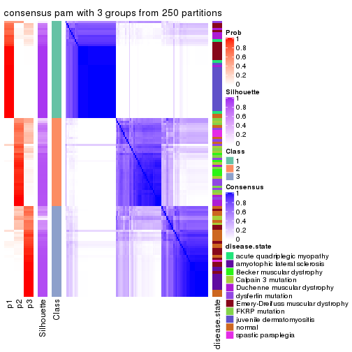</p>

</div>
<div id='tab-MAD-pam-consensus-heatmap-3'>
<pre><code class="r">consensus_heatmap(res, k = 4)
</code></pre>

<p></p>

</div>
<div id='tab-MAD-pam-consensus-heatmap-4'>
<pre><code class="r">consensus_heatmap(res, k = 5)
</code></pre>

<p></p>

</div>
<div id='tab-MAD-pam-consensus-heatmap-5'>
<pre><code class="r">consensus_heatmap(res, k = 6)
</code></pre>

<p></p>

</div>
</div>

Heatmaps for the membership of samples in all partitions to see how consistent they are:


<script>
$( function() {
	$( '#tabs-MAD-pam-membership-heatmap' ).tabs();
} );
</script>
<div id='tabs-MAD-pam-membership-heatmap'>
<ul>
<li><a href='#tab-MAD-pam-membership-heatmap-1'>k = 2</a></li>
<li><a href='#tab-MAD-pam-membership-heatmap-2'>k = 3</a></li>
<li><a href='#tab-MAD-pam-membership-heatmap-3'>k = 4</a></li>
<li><a href='#tab-MAD-pam-membership-heatmap-4'>k = 5</a></li>
<li><a href='#tab-MAD-pam-membership-heatmap-5'>k = 6</a></li>
</ul>
<div id='tab-MAD-pam-membership-heatmap-1'>
<pre><code class="r">membership_heatmap(res, k = 2)
</code></pre>

<p></p>

</div>
<div id='tab-MAD-pam-membership-heatmap-2'>
<pre><code class="r">membership_heatmap(res, k = 3)
</code></pre>

<p></p>

</div>
<div id='tab-MAD-pam-membership-heatmap-3'>
<pre><code class="r">membership_heatmap(res, k = 4)
</code></pre>

<p></p>

</div>
<div id='tab-MAD-pam-membership-heatmap-4'>
<pre><code class="r">membership_heatmap(res, k = 5)
</code></pre>

<p></p>

</div>
<div id='tab-MAD-pam-membership-heatmap-5'>
<pre><code class="r">membership_heatmap(res, k = 6)
</code></pre>

<p></p>

</div>
</div>

As soon as we have had the classes for columns, we can look for signatures
which are significantly different between classes which can be candidate marks
for certain classes. Following are the heatmaps for signatures.


Signature heatmaps where rows are scaled:


<script>
$( function() {
	$( '#tabs-MAD-pam-get-signatures' ).tabs();
} );
</script>
<div id='tabs-MAD-pam-get-signatures'>
<ul>
<li><a href='#tab-MAD-pam-get-signatures-1'>k = 2</a></li>
<li><a href='#tab-MAD-pam-get-signatures-2'>k = 3</a></li>
<li><a href='#tab-MAD-pam-get-signatures-3'>k = 4</a></li>
<li><a href='#tab-MAD-pam-get-signatures-4'>k = 5</a></li>
<li><a href='#tab-MAD-pam-get-signatures-5'>k = 6</a></li>
</ul>
<div id='tab-MAD-pam-get-signatures-1'>
<pre><code class="r">get_signatures(res, k = 2)
</code></pre>

<p></p>

</div>
<div id='tab-MAD-pam-get-signatures-2'>
<pre><code class="r">get_signatures(res, k = 3)
</code></pre>

<p></p>

</div>
<div id='tab-MAD-pam-get-signatures-3'>
<pre><code class="r">get_signatures(res, k = 4)
</code></pre>

<p></p>

</div>
<div id='tab-MAD-pam-get-signatures-4'>
<pre><code class="r">get_signatures(res, k = 5)
</code></pre>

<p></p>

</div>
<div id='tab-MAD-pam-get-signatures-5'>
<pre><code class="r">get_signatures(res, k = 6)
</code></pre>

<p></p>

</div>
</div>


Signature heatmaps where rows are not scaled:


<script>
$( function() {
	$( '#tabs-MAD-pam-get-signatures-no-scale' ).tabs();
} );
</script>
<div id='tabs-MAD-pam-get-signatures-no-scale'>
<ul>
<li><a href='#tab-MAD-pam-get-signatures-no-scale-1'>k = 2</a></li>
<li><a href='#tab-MAD-pam-get-signatures-no-scale-2'>k = 3</a></li>
<li><a href='#tab-MAD-pam-get-signatures-no-scale-3'>k = 4</a></li>
<li><a href='#tab-MAD-pam-get-signatures-no-scale-4'>k = 5</a></li>
<li><a href='#tab-MAD-pam-get-signatures-no-scale-5'>k = 6</a></li>
</ul>
<div id='tab-MAD-pam-get-signatures-no-scale-1'>
<pre><code class="r">get_signatures(res, k = 2, scale_rows = FALSE)
</code></pre>

<p></p>

</div>
<div id='tab-MAD-pam-get-signatures-no-scale-2'>
<pre><code class="r">get_signatures(res, k = 3, scale_rows = FALSE)
</code></pre>

<p></p>

</div>
<div id='tab-MAD-pam-get-signatures-no-scale-3'>
<pre><code class="r">get_signatures(res, k = 4, scale_rows = FALSE)
</code></pre>

<p></p>

</div>
<div id='tab-MAD-pam-get-signatures-no-scale-4'>
<pre><code class="r">get_signatures(res, k = 5, scale_rows = FALSE)
</code></pre>

<p></p>

</div>
<div id='tab-MAD-pam-get-signatures-no-scale-5'>
<pre><code class="r">get_signatures(res, k = 6, scale_rows = FALSE)
</code></pre>

<p></p>

</div>
</div>


Compare the overlap of signatures from different k:

```r
compare_signatures(res)
```


`get_signature()` returns a data frame invisibly. TO get the list of signatures, the function
call should be assigned to a variable explicitly. In following code, if `plot` argument is set
to `FALSE`, no heatmap is plotted while only the differential analysis is performed.

```r
# code only for demonstration
tb = get_signature(res, k = ..., plot = FALSE)
```

An example of the output of `tb` is:

```
#>   which_row         fdr    mean_1    mean_2 scaled_mean_1 scaled_mean_2 km
#> 1        38 0.042760348  8.373488  9.131774    -0.5533452     0.5164555  1
#> 2        40 0.018707592  7.106213  8.469186    -0.6173731     0.5762149  1
#> 3        55 0.019134737 10.221463 11.207825    -0.6159697     0.5749050  1
#> 4        59 0.006059896  5.921854  7.869574    -0.6899429     0.6439467  1
#> 5        60 0.018055526  8.928898 10.211722    -0.6204761     0.5791110  1
#> 6        98 0.009384629 15.714769 14.887706     0.6635654    -0.6193277  2
...
```

The columns in `tb` are:

1. `which_row`: row indices corresponding to the input matrix.
2. `fdr`: FDR for the differential test. 
3. `mean_x`: The mean value in group x.
4. `scaled_mean_x`: The mean value in group x after rows are scaled.
5. `km`: Row groups if k-means clustering is applied to rows.


UMAP plot which shows how samples are separated.


<script>
$( function() {
	$( '#tabs-MAD-pam-dimension-reduction' ).tabs();
} );
</script>
<div id='tabs-MAD-pam-dimension-reduction'>
<ul>
<li><a href='#tab-MAD-pam-dimension-reduction-1'>k = 2</a></li>
<li><a href='#tab-MAD-pam-dimension-reduction-2'>k = 3</a></li>
<li><a href='#tab-MAD-pam-dimension-reduction-3'>k = 4</a></li>
<li><a href='#tab-MAD-pam-dimension-reduction-4'>k = 5</a></li>
<li><a href='#tab-MAD-pam-dimension-reduction-5'>k = 6</a></li>
</ul>
<div id='tab-MAD-pam-dimension-reduction-1'>
<pre><code class="r">dimension_reduction(res, k = 2, method = &quot;UMAP&quot;)
</code></pre>

<p></p>

</div>
<div id='tab-MAD-pam-dimension-reduction-2'>
<pre><code class="r">dimension_reduction(res, k = 3, method = &quot;UMAP&quot;)
</code></pre>

<p></p>

</div>
<div id='tab-MAD-pam-dimension-reduction-3'>
<pre><code class="r">dimension_reduction(res, k = 4, method = &quot;UMAP&quot;)
</code></pre>

<p></p>

</div>
<div id='tab-MAD-pam-dimension-reduction-4'>
<pre><code class="r">dimension_reduction(res, k = 5, method = &quot;UMAP&quot;)
</code></pre>

<p></p>

</div>
<div id='tab-MAD-pam-dimension-reduction-5'>
<pre><code class="r">dimension_reduction(res, k = 6, method = &quot;UMAP&quot;)
</code></pre>

<p></p>

</div>
</div>


Following heatmap shows how subgroups are split when increasing `k`:

```r
collect_classes(res)
```


Test correlation between subgroups and known annotations. If the known
annotation is numeric, one-way ANOVA test is applied, and if the known
annotation is discrete, chi-squared contingency table test is applied.

```r
test_to_known_factors(res)
```

```
#>           n disease.state(p) k
#> MAD:pam 116         1.04e-12 2
#> MAD:pam 114         3.11e-21 3
#> MAD:pam 103         2.60e-23 4
#> MAD:pam  94         9.48e-27 5
#> MAD:pam 105         1.45e-34 6
```


If matrix rows can be associated to genes, consider to use `functional_enrichment(res,
...)` to perform function enrichment for the signature genes. See [this vignette](http://bioconductor.org/packages/devel/bioc/vignettes/cola/inst/doc/functional_enrichment.html) for more detailed explanations.


 

---------------------------------------------------


### MAD:mclust*


The object with results only for a single top-value method and a single partition method 
can be extracted as:

```r
res = res_list["MAD", "mclust"]
# you can also extract it by
# res = res_list["MAD:mclust"]
```

A summary of `res` and all the functions that can be applied to it:

```r
res
```

```
#> A 'ConsensusPartition' object with k = 2, 3, 4, 5, 6.
#>   On a matrix with 21512 rows and 119 columns.
#>   Top rows (1000, 2000, 3000, 4000, 5000) are extracted by 'MAD' method.
#>   Subgroups are detected by 'mclust' method.
#>   Performed in total 1250 partitions by row resampling.
#>   Best k for subgroups seems to be 3.
#> 
#> Following methods can be applied to this 'ConsensusPartition' object:
#>  [1] "cola_report"             "collect_classes"         "collect_plots"          
#>  [4] "collect_stats"           "colnames"                "compare_signatures"     
#>  [7] "consensus_heatmap"       "dimension_reduction"     "functional_enrichment"  
#> [10] "get_anno_col"            "get_anno"                "get_classes"            
#> [13] "get_consensus"           "get_matrix"              "get_membership"         
#> [16] "get_param"               "get_signatures"          "get_stats"              
#> [19] "is_best_k"               "is_stable_k"             "membership_heatmap"     
#> [22] "ncol"                    "nrow"                    "plot_ecdf"              
#> [25] "rownames"                "select_partition_number" "show"                   
#> [28] "suggest_best_k"          "test_to_known_factors"
```

`collect_plots()` function collects all the plots made from `res` for all `k` (number of partitions)
into one single page to provide an easy and fast comparison between different `k`.

```r
collect_plots(res)
```


The plots are:

- The first row: a plot of the ECDF (empirical cumulative distribution
  function) curves of the consensus matrix for each `k` and the heatmap of
  predicted classes for each `k`.
- The second row: heatmaps of the consensus matrix for each `k`.
- The third row: heatmaps of the membership matrix for each `k`.
- The fouth row: heatmaps of the signatures for each `k`.

All the plots in panels can be made by individual functions and they are
plotted later in this section.

`select_partition_number()` produces several plots showing different
statistics for choosing "optimized" `k`. There are following statistics:

- ECDF curves of the consensus matrix for each `k`;
- 1-PAC. [The PAC
  score](https://en.wikipedia.org/wiki/Consensus_clustering#Over-interpretation_potential_of_consensus_clustering)
  measures the proportion of the ambiguous subgrouping.
- Mean silhouette score.
- Concordance. The mean probability of fiting the consensus class ids in all
  partitions.
- Area increased. Denote $A_k$ as the area under the ECDF curve for current
  `k`, the area increased is defined as $A_k - A_{k-1}$.
- Rand index. The percent of pairs of samples that are both in a same cluster
  or both are not in a same cluster in the partition of k and k-1.
- Jaccard index. The ratio of pairs of samples are both in a same cluster in
  the partition of k and k-1 and the pairs of samples are both in a same
  cluster in the partition k or k-1.

The detailed explanations of these statistics can be found in [the _cola_
vignette](http://bioconductor.org/packages/devel/bioc/vignettes/cola/inst/doc/cola.html#toc_13).

Generally speaking, lower PAC score, higher mean silhouette score or higher
concordance corresponds to better partition. Rand index and Jaccard index
measure how similar the current partition is compared to partition with `k-1`.
If they are too similar, we won't accept `k` is better than `k-1`.

```r
select_partition_number(res)
```


The numeric values for all these statistics can be obtained by `get_stats()`.

```r
get_stats(res)
```

```
#>   k 1-PAC mean_silhouette concordance area_increased  Rand Jaccard
#> 2 2 0.732           0.939       0.967         0.4974 0.496   0.496
#> 3 3 0.904           0.902       0.954         0.3095 0.787   0.593
#> 4 4 0.796           0.868       0.906         0.0822 0.959   0.878
#> 5 5 0.762           0.707       0.844         0.0878 0.913   0.717
#> 6 6 0.705           0.571       0.777         0.0580 0.871   0.521
```

`suggest_best_k()` suggests the best $k$ based on these statistics. The rules are as follows:

- All $k$ with Jaccard index larger than 0.95 are removed because increasing
  $k$ does not provide enough extra information. If all $k$ are removed, it is
  marked as no subgroup is detected.
- For all $k$ with 1-PAC score larger than 0.9, the maximal $k$ is taken as
  the best $k$, and other $k$ are marked as optional $k$.
- If it does not fit the second rule. The $k$ with the maximal vote of the
  highest 1-PAC score, highest mean silhouette, and highest concordance is
  taken as the best $k$.

```r
suggest_best_k(res)
```

```
#> [1] 3
```


Following shows the table of the partitions (You need to click the **show/hide
code output** link to see it). The membership matrix (columns with name `p*`)
is inferred by
[`clue::cl_consensus()`](https://www.rdocumentation.org/link/cl_consensus?package=clue)
function with the `SE` method. Basically the value in the membership matrix
represents the probability to belong to a certain group. The finall class
label for an item is determined with the group with highest probability it
belongs to.

In `get_classes()` function, the entropy is calculated from the membership
matrix and the silhouette score is calculated from the consensus matrix.


<script>
$( function() {
	$( '#tabs-MAD-mclust-get-classes' ).tabs();
} );
</script>
<div id='tabs-MAD-mclust-get-classes'>
<ul>
<li><a href='#tab-MAD-mclust-get-classes-1'>k = 2</a></li>
<li><a href='#tab-MAD-mclust-get-classes-2'>k = 3</a></li>
<li><a href='#tab-MAD-mclust-get-classes-3'>k = 4</a></li>
<li><a href='#tab-MAD-mclust-get-classes-4'>k = 5</a></li>
<li><a href='#tab-MAD-mclust-get-classes-5'>k = 6</a></li>
</ul>

<div id='tab-MAD-mclust-get-classes-1'>
<p><a id='tab-MAD-mclust-get-classes-1-a' style='color:#0366d6' href='#'>show/hide code output</a></p>
<pre><code class="r">cbind(get_classes(res, k = 2), get_membership(res, k = 2))
</code></pre>

<pre><code>#&gt;           class entropy silhouette    p1    p2
#&gt; GSM120719     1  0.0376      0.950 0.996 0.004
#&gt; GSM120720     1  0.0000      0.951 1.000 0.000
#&gt; GSM120765     2  0.0000      0.979 0.000 1.000
#&gt; GSM120767     2  0.0000      0.979 0.000 1.000
#&gt; GSM120784     2  0.0000      0.979 0.000 1.000
#&gt; GSM121400     1  0.0376      0.950 0.996 0.004
#&gt; GSM121401     1  0.0000      0.951 1.000 0.000
#&gt; GSM121402     2  0.0000      0.979 0.000 1.000
#&gt; GSM121403     1  0.0938      0.948 0.988 0.012
#&gt; GSM121404     2  0.4161      0.905 0.084 0.916
#&gt; GSM121405     1  0.0000      0.951 1.000 0.000
#&gt; GSM121406     2  0.0000      0.979 0.000 1.000
#&gt; GSM121408     2  0.0000      0.979 0.000 1.000
#&gt; GSM121409     1  0.1184      0.946 0.984 0.016
#&gt; GSM121410     1  0.0672      0.949 0.992 0.008
#&gt; GSM121412     2  0.0000      0.979 0.000 1.000
#&gt; GSM121413     2  0.0000      0.979 0.000 1.000
#&gt; GSM121414     2  0.0000      0.979 0.000 1.000
#&gt; GSM121415     2  0.0000      0.979 0.000 1.000
#&gt; GSM121416     2  0.0000      0.979 0.000 1.000
#&gt; GSM120591     1  0.0000      0.951 1.000 0.000
#&gt; GSM120594     1  0.0000      0.951 1.000 0.000
#&gt; GSM120718     1  0.0000      0.951 1.000 0.000
#&gt; GSM121205     1  0.0000      0.951 1.000 0.000
#&gt; GSM121206     1  0.0000      0.951 1.000 0.000
#&gt; GSM121207     1  0.0000      0.951 1.000 0.000
#&gt; GSM121208     1  0.0000      0.951 1.000 0.000
#&gt; GSM121209     1  0.0000      0.951 1.000 0.000
#&gt; GSM121210     1  0.0000      0.951 1.000 0.000
#&gt; GSM121211     1  0.0000      0.951 1.000 0.000
#&gt; GSM121212     1  0.0000      0.951 1.000 0.000
#&gt; GSM121213     1  0.0000      0.951 1.000 0.000
#&gt; GSM121214     1  0.0000      0.951 1.000 0.000
#&gt; GSM121215     1  0.0000      0.951 1.000 0.000
#&gt; GSM121216     1  0.0000      0.951 1.000 0.000
#&gt; GSM121217     1  0.0000      0.951 1.000 0.000
#&gt; GSM121218     1  0.0000      0.951 1.000 0.000
#&gt; GSM121234     1  0.0000      0.951 1.000 0.000
#&gt; GSM121243     1  0.0000      0.951 1.000 0.000
#&gt; GSM121245     1  0.0000      0.951 1.000 0.000
#&gt; GSM121246     1  0.0000      0.951 1.000 0.000
#&gt; GSM121247     1  0.0672      0.949 0.992 0.008
#&gt; GSM121248     1  0.0000      0.951 1.000 0.000
#&gt; GSM120744     1  0.5059      0.902 0.888 0.112
#&gt; GSM120745     1  0.5059      0.902 0.888 0.112
#&gt; GSM120746     1  0.5059      0.902 0.888 0.112
#&gt; GSM120747     1  0.4815      0.906 0.896 0.104
#&gt; GSM120748     1  0.5059      0.902 0.888 0.112
#&gt; GSM120749     1  0.4939      0.904 0.892 0.108
#&gt; GSM120750     1  0.5059      0.902 0.888 0.112
#&gt; GSM120751     1  0.5059      0.902 0.888 0.112
#&gt; GSM120752     1  0.5059      0.902 0.888 0.112
#&gt; GSM121336     2  0.0000      0.979 0.000 1.000
#&gt; GSM121339     2  0.4298      0.903 0.088 0.912
#&gt; GSM121349     2  0.0000      0.979 0.000 1.000
#&gt; GSM121355     2  0.0000      0.979 0.000 1.000
#&gt; GSM120757     1  0.5408      0.892 0.876 0.124
#&gt; GSM120766     1  0.5408      0.892 0.876 0.124
#&gt; GSM120770     2  0.4431      0.897 0.092 0.908
#&gt; GSM120779     1  0.5408      0.892 0.876 0.124
#&gt; GSM120780     1  0.5294      0.896 0.880 0.120
#&gt; GSM121102     2  0.8443      0.618 0.272 0.728
#&gt; GSM121203     1  0.5059      0.902 0.888 0.112
#&gt; GSM121204     1  0.4939      0.904 0.892 0.108
#&gt; GSM121330     1  0.0000      0.951 1.000 0.000
#&gt; GSM121335     1  0.0000      0.951 1.000 0.000
#&gt; GSM121337     2  0.4161      0.905 0.084 0.916
#&gt; GSM121338     2  0.6531      0.802 0.168 0.832
#&gt; GSM121341     1  0.0000      0.951 1.000 0.000
#&gt; GSM121342     1  0.0000      0.951 1.000 0.000
#&gt; GSM121343     2  0.6887      0.778 0.184 0.816
#&gt; GSM121344     1  0.0000      0.951 1.000 0.000
#&gt; GSM121346     1  0.0000      0.951 1.000 0.000
#&gt; GSM121347     2  0.4161      0.905 0.084 0.916
#&gt; GSM121348     1  0.6623      0.837 0.828 0.172
#&gt; GSM121350     1  0.0000      0.951 1.000 0.000
#&gt; GSM121352     1  0.0000      0.951 1.000 0.000
#&gt; GSM121354     1  0.0000      0.951 1.000 0.000
#&gt; GSM120753     2  0.0000      0.979 0.000 1.000
#&gt; GSM120761     2  0.0000      0.979 0.000 1.000
#&gt; GSM120768     2  0.0000      0.979 0.000 1.000
#&gt; GSM120781     2  0.0000      0.979 0.000 1.000
#&gt; GSM120788     2  0.0000      0.979 0.000 1.000
#&gt; GSM120760     2  0.0000      0.979 0.000 1.000
#&gt; GSM120763     2  0.0000      0.979 0.000 1.000
#&gt; GSM120764     2  0.0000      0.979 0.000 1.000
#&gt; GSM120777     2  0.0000      0.979 0.000 1.000
#&gt; GSM120786     2  0.0000      0.979 0.000 1.000
#&gt; GSM121329     1  0.1414      0.944 0.980 0.020
#&gt; GSM121331     1  0.5408      0.892 0.876 0.124
#&gt; GSM121333     1  0.5408      0.892 0.876 0.124
#&gt; GSM121345     1  0.9996      0.110 0.512 0.488
#&gt; GSM121356     1  0.5408      0.892 0.876 0.124
#&gt; GSM120754     2  0.0000      0.979 0.000 1.000
#&gt; GSM120759     2  0.0000      0.979 0.000 1.000
#&gt; GSM120762     2  0.0000      0.979 0.000 1.000
#&gt; GSM120775     2  0.0000      0.979 0.000 1.000
#&gt; GSM120776     2  0.2778      0.939 0.048 0.952
#&gt; GSM120782     2  0.0000      0.979 0.000 1.000
#&gt; GSM120789     2  0.0000      0.979 0.000 1.000
#&gt; GSM120790     2  0.0000      0.979 0.000 1.000
#&gt; GSM120791     2  0.0000      0.979 0.000 1.000
#&gt; GSM120755     2  0.0000      0.979 0.000 1.000
#&gt; GSM120756     2  0.0000      0.979 0.000 1.000
#&gt; GSM120769     2  0.0000      0.979 0.000 1.000
#&gt; GSM120778     2  0.0000      0.979 0.000 1.000
#&gt; GSM120792     2  0.0000      0.979 0.000 1.000
#&gt; GSM121332     2  0.0000      0.979 0.000 1.000
#&gt; GSM121334     2  0.0000      0.979 0.000 1.000
#&gt; GSM121340     2  0.0000      0.979 0.000 1.000
#&gt; GSM121351     2  0.0000      0.979 0.000 1.000
#&gt; GSM121353     2  0.0000      0.979 0.000 1.000
#&gt; GSM120758     2  0.0000      0.979 0.000 1.000
#&gt; GSM120771     2  0.0000      0.979 0.000 1.000
#&gt; GSM120772     2  0.0000      0.979 0.000 1.000
#&gt; GSM120773     2  0.0000      0.979 0.000 1.000
#&gt; GSM120774     2  0.0000      0.979 0.000 1.000
#&gt; GSM120783     2  0.0000      0.979 0.000 1.000
#&gt; GSM120787     2  0.0000      0.979 0.000 1.000
</code></pre>

<script>
$('#tab-MAD-mclust-get-classes-1-a').parent().next().next().hide();
$('#tab-MAD-mclust-get-classes-1-a').click(function(){
  $('#tab-MAD-mclust-get-classes-1-a').parent().next().next().toggle();
  return(false);
});
</script>
</div>

<div id='tab-MAD-mclust-get-classes-2'>
<p><a id='tab-MAD-mclust-get-classes-2-a' style='color:#0366d6' href='#'>show/hide code output</a></p>
<pre><code class="r">cbind(get_classes(res, k = 3), get_membership(res, k = 3))
</code></pre>

<pre><code>#&gt;           class entropy silhouette    p1    p2    p3
#&gt; GSM120719     1  0.4291      0.835 0.820 0.000 0.180
#&gt; GSM120720     1  0.3038      0.909 0.896 0.000 0.104
#&gt; GSM120765     2  0.0000      1.000 0.000 1.000 0.000
#&gt; GSM120767     2  0.0000      1.000 0.000 1.000 0.000
#&gt; GSM120784     2  0.0000      1.000 0.000 1.000 0.000
#&gt; GSM121400     1  0.5760      0.602 0.672 0.000 0.328
#&gt; GSM121401     1  0.2878      0.914 0.904 0.000 0.096
#&gt; GSM121402     2  0.0000      1.000 0.000 1.000 0.000
#&gt; GSM121403     3  0.6168      0.147 0.412 0.000 0.588
#&gt; GSM121404     3  0.6291      0.226 0.000 0.468 0.532
#&gt; GSM121405     1  0.3038      0.909 0.896 0.000 0.104
#&gt; GSM121406     2  0.0000      1.000 0.000 1.000 0.000
#&gt; GSM121408     2  0.0000      1.000 0.000 1.000 0.000
#&gt; GSM121409     3  0.6008      0.271 0.372 0.000 0.628
#&gt; GSM121410     1  0.5327      0.707 0.728 0.000 0.272
#&gt; GSM121412     2  0.0000      1.000 0.000 1.000 0.000
#&gt; GSM121413     2  0.0000      1.000 0.000 1.000 0.000
#&gt; GSM121414     2  0.0000      1.000 0.000 1.000 0.000
#&gt; GSM121415     2  0.0000      1.000 0.000 1.000 0.000
#&gt; GSM121416     2  0.0000      1.000 0.000 1.000 0.000
#&gt; GSM120591     1  0.3619      0.881 0.864 0.000 0.136
#&gt; GSM120594     1  0.2959      0.912 0.900 0.000 0.100
#&gt; GSM120718     1  0.1529      0.944 0.960 0.000 0.040
#&gt; GSM121205     1  0.0000      0.940 1.000 0.000 0.000
#&gt; GSM121206     1  0.0000      0.940 1.000 0.000 0.000
#&gt; GSM121207     1  0.1289      0.945 0.968 0.000 0.032
#&gt; GSM121208     1  0.1411      0.945 0.964 0.000 0.036
#&gt; GSM121209     1  0.0000      0.940 1.000 0.000 0.000
#&gt; GSM121210     1  0.1411      0.945 0.964 0.000 0.036
#&gt; GSM121211     1  0.0000      0.940 1.000 0.000 0.000
#&gt; GSM121212     1  0.0237      0.941 0.996 0.000 0.004
#&gt; GSM121213     1  0.0000      0.940 1.000 0.000 0.000
#&gt; GSM121214     1  0.0000      0.940 1.000 0.000 0.000
#&gt; GSM121215     1  0.0000      0.940 1.000 0.000 0.000
#&gt; GSM121216     1  0.2959      0.912 0.900 0.000 0.100
#&gt; GSM121217     1  0.0000      0.940 1.000 0.000 0.000
#&gt; GSM121218     1  0.0000      0.940 1.000 0.000 0.000
#&gt; GSM121234     1  0.0424      0.943 0.992 0.000 0.008
#&gt; GSM121243     1  0.0424      0.943 0.992 0.000 0.008
#&gt; GSM121245     1  0.0424      0.943 0.992 0.000 0.008
#&gt; GSM121246     1  0.1411      0.945 0.964 0.000 0.036
#&gt; GSM121247     1  0.4291      0.835 0.820 0.000 0.180
#&gt; GSM121248     1  0.0000      0.940 1.000 0.000 0.000
#&gt; GSM120744     3  0.0000      0.873 0.000 0.000 1.000
#&gt; GSM120745     3  0.0000      0.873 0.000 0.000 1.000
#&gt; GSM120746     3  0.0000      0.873 0.000 0.000 1.000
#&gt; GSM120747     3  0.0000      0.873 0.000 0.000 1.000
#&gt; GSM120748     3  0.0000      0.873 0.000 0.000 1.000
#&gt; GSM120749     3  0.0000      0.873 0.000 0.000 1.000
#&gt; GSM120750     3  0.0000      0.873 0.000 0.000 1.000
#&gt; GSM120751     3  0.0000      0.873 0.000 0.000 1.000
#&gt; GSM120752     3  0.0000      0.873 0.000 0.000 1.000
#&gt; GSM121336     2  0.0000      1.000 0.000 1.000 0.000
#&gt; GSM121339     3  0.6309      0.135 0.000 0.496 0.504
#&gt; GSM121349     2  0.0000      1.000 0.000 1.000 0.000
#&gt; GSM121355     2  0.0000      1.000 0.000 1.000 0.000
#&gt; GSM120757     3  0.0000      0.873 0.000 0.000 1.000
#&gt; GSM120766     3  0.0000      0.873 0.000 0.000 1.000
#&gt; GSM120770     3  0.6062      0.441 0.000 0.384 0.616
#&gt; GSM120779     3  0.0000      0.873 0.000 0.000 1.000
#&gt; GSM120780     3  0.0000      0.873 0.000 0.000 1.000
#&gt; GSM121102     3  0.0000      0.873 0.000 0.000 1.000
#&gt; GSM121203     3  0.0000      0.873 0.000 0.000 1.000
#&gt; GSM121204     3  0.0000      0.873 0.000 0.000 1.000
#&gt; GSM121330     1  0.1411      0.945 0.964 0.000 0.036
#&gt; GSM121335     1  0.1411      0.945 0.964 0.000 0.036
#&gt; GSM121337     3  0.6244      0.307 0.000 0.440 0.560
#&gt; GSM121338     3  0.1529      0.850 0.000 0.040 0.960
#&gt; GSM121341     1  0.0747      0.944 0.984 0.000 0.016
#&gt; GSM121342     1  0.0592      0.944 0.988 0.000 0.012
#&gt; GSM121343     3  0.1163      0.857 0.000 0.028 0.972
#&gt; GSM121344     1  0.1411      0.945 0.964 0.000 0.036
#&gt; GSM121346     1  0.1411      0.945 0.964 0.000 0.036
#&gt; GSM121347     3  0.4887      0.693 0.000 0.228 0.772
#&gt; GSM121348     3  0.0237      0.871 0.000 0.004 0.996
#&gt; GSM121350     1  0.1411      0.945 0.964 0.000 0.036
#&gt; GSM121352     1  0.1411      0.945 0.964 0.000 0.036
#&gt; GSM121354     1  0.1411      0.945 0.964 0.000 0.036
#&gt; GSM120753     2  0.0000      1.000 0.000 1.000 0.000
#&gt; GSM120761     2  0.0000      1.000 0.000 1.000 0.000
#&gt; GSM120768     2  0.0000      1.000 0.000 1.000 0.000
#&gt; GSM120781     2  0.0000      1.000 0.000 1.000 0.000
#&gt; GSM120788     2  0.0000      1.000 0.000 1.000 0.000
#&gt; GSM120760     2  0.0000      1.000 0.000 1.000 0.000
#&gt; GSM120763     2  0.0000      1.000 0.000 1.000 0.000
#&gt; GSM120764     2  0.0000      1.000 0.000 1.000 0.000
#&gt; GSM120777     2  0.0000      1.000 0.000 1.000 0.000
#&gt; GSM120786     2  0.0000      1.000 0.000 1.000 0.000
#&gt; GSM121329     1  0.4452      0.821 0.808 0.000 0.192
#&gt; GSM121331     3  0.0000      0.873 0.000 0.000 1.000
#&gt; GSM121333     3  0.0000      0.873 0.000 0.000 1.000
#&gt; GSM121345     3  0.0000      0.873 0.000 0.000 1.000
#&gt; GSM121356     3  0.0000      0.873 0.000 0.000 1.000
#&gt; GSM120754     2  0.0000      1.000 0.000 1.000 0.000
#&gt; GSM120759     2  0.0000      1.000 0.000 1.000 0.000
#&gt; GSM120762     2  0.0000      1.000 0.000 1.000 0.000
#&gt; GSM120775     2  0.0000      1.000 0.000 1.000 0.000
#&gt; GSM120776     3  0.5859      0.513 0.000 0.344 0.656
#&gt; GSM120782     2  0.0000      1.000 0.000 1.000 0.000
#&gt; GSM120789     2  0.0000      1.000 0.000 1.000 0.000
#&gt; GSM120790     2  0.0592      0.987 0.000 0.988 0.012
#&gt; GSM120791     2  0.0000      1.000 0.000 1.000 0.000
#&gt; GSM120755     2  0.0000      1.000 0.000 1.000 0.000
#&gt; GSM120756     2  0.0000      1.000 0.000 1.000 0.000
#&gt; GSM120769     2  0.0000      1.000 0.000 1.000 0.000
#&gt; GSM120778     2  0.0000      1.000 0.000 1.000 0.000
#&gt; GSM120792     2  0.0000      1.000 0.000 1.000 0.000
#&gt; GSM121332     2  0.0000      1.000 0.000 1.000 0.000
#&gt; GSM121334     2  0.0000      1.000 0.000 1.000 0.000
#&gt; GSM121340     2  0.0000      1.000 0.000 1.000 0.000
#&gt; GSM121351     2  0.0000      1.000 0.000 1.000 0.000
#&gt; GSM121353     2  0.0000      1.000 0.000 1.000 0.000
#&gt; GSM120758     2  0.0000      1.000 0.000 1.000 0.000
#&gt; GSM120771     2  0.0000      1.000 0.000 1.000 0.000
#&gt; GSM120772     2  0.0000      1.000 0.000 1.000 0.000
#&gt; GSM120773     2  0.0000      1.000 0.000 1.000 0.000
#&gt; GSM120774     2  0.0000      1.000 0.000 1.000 0.000
#&gt; GSM120783     2  0.0000      1.000 0.000 1.000 0.000
#&gt; GSM120787     2  0.0000      1.000 0.000 1.000 0.000
</code></pre>

<script>
$('#tab-MAD-mclust-get-classes-2-a').parent().next().next().hide();
$('#tab-MAD-mclust-get-classes-2-a').click(function(){
  $('#tab-MAD-mclust-get-classes-2-a').parent().next().next().toggle();
  return(false);
});
</script>
</div>

<div id='tab-MAD-mclust-get-classes-3'>
<p><a id='tab-MAD-mclust-get-classes-3-a' style='color:#0366d6' href='#'>show/hide code output</a></p>
<pre><code class="r">cbind(get_classes(res, k = 4), get_membership(res, k = 4))
</code></pre>

<pre><code>#&gt;           class entropy silhouette    p1    p2    p3    p4
#&gt; GSM120719     1  0.3925      0.653 0.808 0.000 0.176 0.016
#&gt; GSM120720     1  0.0000      0.849 1.000 0.000 0.000 0.000
#&gt; GSM120765     2  0.2281      0.919 0.000 0.904 0.000 0.096
#&gt; GSM120767     2  0.0188      0.962 0.000 0.996 0.000 0.004
#&gt; GSM120784     2  0.3172      0.878 0.000 0.840 0.000 0.160
#&gt; GSM121400     1  0.5193      0.260 0.580 0.000 0.412 0.008
#&gt; GSM121401     1  0.0000      0.849 1.000 0.000 0.000 0.000
#&gt; GSM121402     2  0.3074      0.883 0.000 0.848 0.000 0.152
#&gt; GSM121403     3  0.3224      0.800 0.120 0.000 0.864 0.016
#&gt; GSM121404     3  0.6875      0.580 0.000 0.220 0.596 0.184
#&gt; GSM121405     1  0.0336      0.845 0.992 0.000 0.008 0.000
#&gt; GSM121406     2  0.1716      0.936 0.000 0.936 0.000 0.064
#&gt; GSM121408     2  0.0188      0.962 0.000 0.996 0.000 0.004
#&gt; GSM121409     3  0.3048      0.812 0.108 0.000 0.876 0.016
#&gt; GSM121410     1  0.4883      0.479 0.696 0.000 0.288 0.016
#&gt; GSM121412     2  0.3266      0.872 0.000 0.832 0.000 0.168
#&gt; GSM121413     2  0.3172      0.878 0.000 0.840 0.000 0.160
#&gt; GSM121414     2  0.3172      0.878 0.000 0.840 0.000 0.160
#&gt; GSM121415     2  0.3400      0.862 0.000 0.820 0.000 0.180
#&gt; GSM121416     2  0.3400      0.862 0.000 0.820 0.000 0.180
#&gt; GSM120591     1  0.1406      0.819 0.960 0.000 0.024 0.016
#&gt; GSM120594     1  0.0000      0.849 1.000 0.000 0.000 0.000
#&gt; GSM120718     1  0.0817      0.841 0.976 0.000 0.000 0.024
#&gt; GSM121205     4  0.4356      1.000 0.292 0.000 0.000 0.708
#&gt; GSM121206     4  0.4356      1.000 0.292 0.000 0.000 0.708
#&gt; GSM121207     1  0.3266      0.689 0.832 0.000 0.000 0.168
#&gt; GSM121208     1  0.0336      0.848 0.992 0.000 0.000 0.008
#&gt; GSM121209     4  0.4356      1.000 0.292 0.000 0.000 0.708
#&gt; GSM121210     1  0.3172      0.702 0.840 0.000 0.000 0.160
#&gt; GSM121211     4  0.4356      1.000 0.292 0.000 0.000 0.708
#&gt; GSM121212     1  0.3123      0.708 0.844 0.000 0.000 0.156
#&gt; GSM121213     4  0.4356      1.000 0.292 0.000 0.000 0.708
#&gt; GSM121214     4  0.4356      1.000 0.292 0.000 0.000 0.708
#&gt; GSM121215     4  0.4356      1.000 0.292 0.000 0.000 0.708
#&gt; GSM121216     1  0.1637      0.813 0.940 0.000 0.000 0.060
#&gt; GSM121217     4  0.4356      1.000 0.292 0.000 0.000 0.708
#&gt; GSM121218     4  0.4356      1.000 0.292 0.000 0.000 0.708
#&gt; GSM121234     1  0.4643      0.173 0.656 0.000 0.000 0.344
#&gt; GSM121243     1  0.3074      0.713 0.848 0.000 0.000 0.152
#&gt; GSM121245     1  0.3219      0.696 0.836 0.000 0.000 0.164
#&gt; GSM121246     1  0.0000      0.849 1.000 0.000 0.000 0.000
#&gt; GSM121247     1  0.3300      0.712 0.848 0.000 0.144 0.008
#&gt; GSM121248     4  0.4356      1.000 0.292 0.000 0.000 0.708
#&gt; GSM120744     3  0.0000      0.884 0.000 0.000 1.000 0.000
#&gt; GSM120745     3  0.0188      0.884 0.000 0.000 0.996 0.004
#&gt; GSM120746     3  0.0000      0.884 0.000 0.000 1.000 0.000
#&gt; GSM120747     3  0.0188      0.884 0.000 0.000 0.996 0.004
#&gt; GSM120748     3  0.0188      0.884 0.000 0.000 0.996 0.004
#&gt; GSM120749     3  0.0188      0.884 0.000 0.000 0.996 0.004
#&gt; GSM120750     3  0.0188      0.884 0.000 0.000 0.996 0.004
#&gt; GSM120751     3  0.0188      0.884 0.000 0.000 0.996 0.004
#&gt; GSM120752     3  0.0188      0.884 0.000 0.000 0.996 0.004
#&gt; GSM121336     2  0.0188      0.962 0.000 0.996 0.000 0.004
#&gt; GSM121339     3  0.6958      0.563 0.000 0.232 0.584 0.184
#&gt; GSM121349     2  0.0188      0.962 0.000 0.996 0.000 0.004
#&gt; GSM121355     2  0.0188      0.962 0.000 0.996 0.000 0.004
#&gt; GSM120757     3  0.1867      0.874 0.000 0.000 0.928 0.072
#&gt; GSM120766     3  0.2149      0.871 0.000 0.000 0.912 0.088
#&gt; GSM120770     3  0.6548      0.643 0.000 0.188 0.636 0.176
#&gt; GSM120779     3  0.2149      0.871 0.000 0.000 0.912 0.088
#&gt; GSM120780     3  0.2081      0.871 0.000 0.000 0.916 0.084
#&gt; GSM121102     3  0.0817      0.881 0.000 0.000 0.976 0.024
#&gt; GSM121203     3  0.0188      0.884 0.000 0.000 0.996 0.004
#&gt; GSM121204     3  0.0592      0.884 0.000 0.000 0.984 0.016
#&gt; GSM121330     1  0.0000      0.849 1.000 0.000 0.000 0.000
#&gt; GSM121335     1  0.0592      0.845 0.984 0.000 0.000 0.016
#&gt; GSM121337     3  0.6908      0.580 0.000 0.220 0.592 0.188
#&gt; GSM121338     3  0.3037      0.847 0.000 0.036 0.888 0.076
#&gt; GSM121341     1  0.0336      0.848 0.992 0.000 0.000 0.008
#&gt; GSM121342     1  0.0336      0.848 0.992 0.000 0.000 0.008
#&gt; GSM121343     3  0.2089      0.868 0.000 0.020 0.932 0.048
#&gt; GSM121344     1  0.0188      0.849 0.996 0.000 0.000 0.004
#&gt; GSM121346     1  0.0000      0.849 1.000 0.000 0.000 0.000
#&gt; GSM121347     3  0.5728      0.719 0.000 0.104 0.708 0.188
#&gt; GSM121348     3  0.2149      0.871 0.000 0.000 0.912 0.088
#&gt; GSM121350     1  0.0000      0.849 1.000 0.000 0.000 0.000
#&gt; GSM121352     1  0.0000      0.849 1.000 0.000 0.000 0.000
#&gt; GSM121354     1  0.0336      0.848 0.992 0.000 0.000 0.008
#&gt; GSM120753     2  0.0188      0.962 0.000 0.996 0.000 0.004
#&gt; GSM120761     2  0.0000      0.962 0.000 1.000 0.000 0.000
#&gt; GSM120768     2  0.0188      0.962 0.000 0.996 0.000 0.004
#&gt; GSM120781     2  0.0336      0.962 0.000 0.992 0.000 0.008
#&gt; GSM120788     2  0.0000      0.962 0.000 1.000 0.000 0.000
#&gt; GSM120760     2  0.0188      0.962 0.000 0.996 0.000 0.004
#&gt; GSM120763     2  0.0188      0.962 0.000 0.996 0.000 0.004
#&gt; GSM120764     2  0.0188      0.962 0.000 0.996 0.000 0.004
#&gt; GSM120777     2  0.0000      0.962 0.000 1.000 0.000 0.000
#&gt; GSM120786     2  0.0188      0.962 0.000 0.996 0.000 0.004
#&gt; GSM121329     1  0.4468      0.571 0.752 0.000 0.232 0.016
#&gt; GSM121331     3  0.2149      0.871 0.000 0.000 0.912 0.088
#&gt; GSM121333     3  0.2149      0.871 0.000 0.000 0.912 0.088
#&gt; GSM121345     3  0.3048      0.861 0.000 0.016 0.876 0.108
#&gt; GSM121356     3  0.2149      0.871 0.000 0.000 0.912 0.088
#&gt; GSM120754     2  0.3024      0.884 0.000 0.852 0.000 0.148
#&gt; GSM120759     2  0.1389      0.945 0.000 0.952 0.000 0.048
#&gt; GSM120762     2  0.0188      0.962 0.000 0.996 0.000 0.004
#&gt; GSM120775     2  0.0000      0.962 0.000 1.000 0.000 0.000
#&gt; GSM120776     3  0.6198      0.682 0.000 0.152 0.672 0.176
#&gt; GSM120782     2  0.2654      0.909 0.000 0.888 0.004 0.108
#&gt; GSM120789     2  0.0188      0.962 0.000 0.996 0.000 0.004
#&gt; GSM120790     2  0.3545      0.866 0.000 0.828 0.008 0.164
#&gt; GSM120791     2  0.0188      0.962 0.000 0.996 0.000 0.004
#&gt; GSM120755     2  0.0188      0.962 0.000 0.996 0.000 0.004
#&gt; GSM120756     2  0.0188      0.961 0.000 0.996 0.000 0.004
#&gt; GSM120769     2  0.0188      0.962 0.000 0.996 0.000 0.004
#&gt; GSM120778     2  0.0188      0.962 0.000 0.996 0.000 0.004
#&gt; GSM120792     2  0.0188      0.962 0.000 0.996 0.000 0.004
#&gt; GSM121332     2  0.0188      0.962 0.000 0.996 0.000 0.004
#&gt; GSM121334     2  0.0188      0.962 0.000 0.996 0.000 0.004
#&gt; GSM121340     2  0.0188      0.962 0.000 0.996 0.000 0.004
#&gt; GSM121351     2  0.0188      0.962 0.000 0.996 0.000 0.004
#&gt; GSM121353     2  0.0336      0.961 0.000 0.992 0.000 0.008
#&gt; GSM120758     2  0.0188      0.962 0.000 0.996 0.000 0.004
#&gt; GSM120771     2  0.2345      0.915 0.000 0.900 0.000 0.100
#&gt; GSM120772     2  0.0188      0.962 0.000 0.996 0.000 0.004
#&gt; GSM120773     2  0.0188      0.962 0.000 0.996 0.000 0.004
#&gt; GSM120774     2  0.0188      0.962 0.000 0.996 0.000 0.004
#&gt; GSM120783     2  0.0188      0.962 0.000 0.996 0.000 0.004
#&gt; GSM120787     2  0.0188      0.962 0.000 0.996 0.000 0.004
</code></pre>

<script>
$('#tab-MAD-mclust-get-classes-3-a').parent().next().next().hide();
$('#tab-MAD-mclust-get-classes-3-a').click(function(){
  $('#tab-MAD-mclust-get-classes-3-a').parent().next().next().toggle();
  return(false);
});
</script>
</div>

<div id='tab-MAD-mclust-get-classes-4'>
<p><a id='tab-MAD-mclust-get-classes-4-a' style='color:#0366d6' href='#'>show/hide code output</a></p>
<pre><code class="r">cbind(get_classes(res, k = 5), get_membership(res, k = 5))
</code></pre>

<pre><code>#&gt;           class entropy silhouette    p1    p2    p3    p4    p5
#&gt; GSM120719     3  0.6589     0.4447 0.264 0.008 0.516 0.000 0.212
#&gt; GSM120720     3  0.3916     0.6106 0.256 0.000 0.732 0.000 0.012
#&gt; GSM120765     2  0.3949     0.5367 0.000 0.668 0.000 0.332 0.000
#&gt; GSM120767     4  0.1197     0.8985 0.000 0.048 0.000 0.952 0.000
#&gt; GSM120784     2  0.2516     0.7006 0.000 0.860 0.000 0.140 0.000
#&gt; GSM121400     3  0.4150     0.1711 0.000 0.000 0.612 0.000 0.388
#&gt; GSM121401     3  0.0000     0.7010 0.000 0.000 1.000 0.000 0.000
#&gt; GSM121402     2  0.4045     0.4858 0.000 0.644 0.000 0.356 0.000
#&gt; GSM121403     5  0.4425     0.4311 0.000 0.008 0.392 0.000 0.600
#&gt; GSM121404     2  0.4359     0.2692 0.000 0.584 0.000 0.004 0.412
#&gt; GSM121405     3  0.0510     0.7001 0.000 0.000 0.984 0.000 0.016
#&gt; GSM121406     4  0.4305    -0.0714 0.000 0.488 0.000 0.512 0.000
#&gt; GSM121408     4  0.1121     0.9001 0.000 0.044 0.000 0.956 0.000
#&gt; GSM121409     5  0.4444     0.4773 0.000 0.012 0.364 0.000 0.624
#&gt; GSM121410     3  0.3928     0.4200 0.000 0.004 0.700 0.000 0.296
#&gt; GSM121412     2  0.3231     0.6889 0.000 0.800 0.000 0.196 0.004
#&gt; GSM121413     2  0.3177     0.6699 0.000 0.792 0.000 0.208 0.000
#&gt; GSM121414     2  0.3305     0.6553 0.000 0.776 0.000 0.224 0.000
#&gt; GSM121415     2  0.2424     0.7007 0.000 0.868 0.000 0.132 0.000
#&gt; GSM121416     2  0.2561     0.7025 0.000 0.856 0.000 0.144 0.000
#&gt; GSM120591     3  0.1750     0.7001 0.028 0.000 0.936 0.000 0.036
#&gt; GSM120594     3  0.3628     0.6406 0.216 0.000 0.772 0.000 0.012
#&gt; GSM120718     3  0.3999     0.5240 0.344 0.000 0.656 0.000 0.000
#&gt; GSM121205     1  0.1478     0.9604 0.936 0.000 0.064 0.000 0.000
#&gt; GSM121206     1  0.1478     0.9604 0.936 0.000 0.064 0.000 0.000
#&gt; GSM121207     3  0.4307     0.2299 0.500 0.000 0.500 0.000 0.000
#&gt; GSM121208     3  0.0290     0.7026 0.008 0.000 0.992 0.000 0.000
#&gt; GSM121209     1  0.1478     0.9604 0.936 0.000 0.064 0.000 0.000
#&gt; GSM121210     3  0.4305     0.2632 0.488 0.000 0.512 0.000 0.000
#&gt; GSM121211     1  0.1478     0.9604 0.936 0.000 0.064 0.000 0.000
#&gt; GSM121212     3  0.4307     0.2426 0.496 0.000 0.504 0.000 0.000
#&gt; GSM121213     1  0.1478     0.9604 0.936 0.000 0.064 0.000 0.000
#&gt; GSM121214     1  0.1478     0.9604 0.936 0.000 0.064 0.000 0.000
#&gt; GSM121215     1  0.1478     0.9604 0.936 0.000 0.064 0.000 0.000
#&gt; GSM121216     3  0.5014     0.3636 0.432 0.004 0.540 0.000 0.024
#&gt; GSM121217     1  0.1478     0.9604 0.936 0.000 0.064 0.000 0.000
#&gt; GSM121218     1  0.1478     0.9604 0.936 0.000 0.064 0.000 0.000
#&gt; GSM121234     1  0.3876     0.4185 0.684 0.000 0.316 0.000 0.000
#&gt; GSM121243     3  0.4302     0.2822 0.480 0.000 0.520 0.000 0.000
#&gt; GSM121245     3  0.4307     0.2426 0.496 0.000 0.504 0.000 0.000
#&gt; GSM121246     3  0.1851     0.6970 0.088 0.000 0.912 0.000 0.000
#&gt; GSM121247     3  0.6697     0.4299 0.284 0.012 0.504 0.000 0.200
#&gt; GSM121248     1  0.1478     0.9604 0.936 0.000 0.064 0.000 0.000
#&gt; GSM120744     5  0.0404     0.8714 0.000 0.012 0.000 0.000 0.988
#&gt; GSM120745     5  0.0162     0.8712 0.000 0.004 0.000 0.000 0.996
#&gt; GSM120746     5  0.0404     0.8714 0.000 0.012 0.000 0.000 0.988
#&gt; GSM120747     5  0.0404     0.8714 0.000 0.012 0.000 0.000 0.988
#&gt; GSM120748     5  0.0000     0.8711 0.000 0.000 0.000 0.000 1.000
#&gt; GSM120749     5  0.0404     0.8714 0.000 0.012 0.000 0.000 0.988
#&gt; GSM120750     5  0.0404     0.8714 0.000 0.012 0.000 0.000 0.988
#&gt; GSM120751     5  0.0404     0.8714 0.000 0.012 0.000 0.000 0.988
#&gt; GSM120752     5  0.0404     0.8714 0.000 0.012 0.000 0.000 0.988
#&gt; GSM121336     4  0.1121     0.9001 0.000 0.044 0.000 0.956 0.000
#&gt; GSM121339     2  0.4574     0.2691 0.000 0.576 0.000 0.012 0.412
#&gt; GSM121349     4  0.0963     0.9029 0.000 0.036 0.000 0.964 0.000
#&gt; GSM121355     4  0.1121     0.9001 0.000 0.044 0.000 0.956 0.000
#&gt; GSM120757     5  0.1168     0.8678 0.032 0.008 0.000 0.000 0.960
#&gt; GSM120766     5  0.1764     0.8604 0.064 0.008 0.000 0.000 0.928
#&gt; GSM120770     5  0.4249     0.2225 0.000 0.432 0.000 0.000 0.568
#&gt; GSM120779     5  0.1764     0.8604 0.064 0.008 0.000 0.000 0.928
#&gt; GSM120780     5  0.1764     0.8604 0.064 0.008 0.000 0.000 0.928
#&gt; GSM121102     5  0.2179     0.8050 0.000 0.112 0.000 0.000 0.888
#&gt; GSM121203     5  0.0290     0.8716 0.000 0.008 0.000 0.000 0.992
#&gt; GSM121204     5  0.0451     0.8708 0.008 0.004 0.000 0.000 0.988
#&gt; GSM121330     3  0.0880     0.7051 0.032 0.000 0.968 0.000 0.000
#&gt; GSM121335     3  0.0963     0.7045 0.036 0.000 0.964 0.000 0.000
#&gt; GSM121337     2  0.4341     0.2831 0.000 0.592 0.000 0.004 0.404
#&gt; GSM121338     5  0.3534     0.6250 0.000 0.256 0.000 0.000 0.744
#&gt; GSM121341     3  0.2516     0.6803 0.140 0.000 0.860 0.000 0.000
#&gt; GSM121342     3  0.3480     0.6210 0.248 0.000 0.752 0.000 0.000
#&gt; GSM121343     5  0.3210     0.6898 0.000 0.212 0.000 0.000 0.788
#&gt; GSM121344     3  0.0162     0.7024 0.004 0.000 0.996 0.000 0.000
#&gt; GSM121346     3  0.0162     0.7024 0.004 0.000 0.996 0.000 0.000
#&gt; GSM121347     2  0.4507     0.2673 0.004 0.580 0.000 0.004 0.412
#&gt; GSM121348     5  0.2079     0.8576 0.064 0.020 0.000 0.000 0.916
#&gt; GSM121350     3  0.0162     0.7024 0.004 0.000 0.996 0.000 0.000
#&gt; GSM121352     3  0.0162     0.7024 0.004 0.000 0.996 0.000 0.000
#&gt; GSM121354     3  0.0162     0.7024 0.004 0.000 0.996 0.000 0.000
#&gt; GSM120753     4  0.0000     0.9084 0.000 0.000 0.000 1.000 0.000
#&gt; GSM120761     4  0.2329     0.8023 0.000 0.124 0.000 0.876 0.000
#&gt; GSM120768     4  0.0000     0.9084 0.000 0.000 0.000 1.000 0.000
#&gt; GSM120781     4  0.0290     0.9085 0.000 0.008 0.000 0.992 0.000
#&gt; GSM120788     4  0.2074     0.8511 0.000 0.104 0.000 0.896 0.000
#&gt; GSM120760     4  0.0162     0.9082 0.000 0.004 0.000 0.996 0.000
#&gt; GSM120763     4  0.0000     0.9084 0.000 0.000 0.000 1.000 0.000
#&gt; GSM120764     4  0.0404     0.9080 0.000 0.012 0.000 0.988 0.000
#&gt; GSM120777     4  0.1732     0.8692 0.000 0.080 0.000 0.920 0.000
#&gt; GSM120786     4  0.0290     0.9075 0.000 0.008 0.000 0.992 0.000
#&gt; GSM121329     3  0.6717     0.4336 0.256 0.012 0.508 0.000 0.224
#&gt; GSM121331     5  0.1877     0.8596 0.064 0.012 0.000 0.000 0.924
#&gt; GSM121333     5  0.1764     0.8604 0.064 0.008 0.000 0.000 0.928
#&gt; GSM121345     5  0.4482     0.3710 0.012 0.376 0.000 0.000 0.612
#&gt; GSM121356     5  0.1764     0.8604 0.064 0.008 0.000 0.000 0.928
#&gt; GSM120754     2  0.4088     0.4977 0.000 0.632 0.000 0.368 0.000
#&gt; GSM120759     4  0.4088     0.2909 0.000 0.368 0.000 0.632 0.000
#&gt; GSM120762     4  0.0000     0.9084 0.000 0.000 0.000 1.000 0.000
#&gt; GSM120775     4  0.1197     0.8964 0.000 0.048 0.000 0.952 0.000
#&gt; GSM120776     2  0.4359     0.2616 0.004 0.584 0.000 0.000 0.412
#&gt; GSM120782     4  0.4517     0.0818 0.000 0.436 0.000 0.556 0.008
#&gt; GSM120789     4  0.0963     0.9028 0.000 0.036 0.000 0.964 0.000
#&gt; GSM120790     2  0.5126     0.6068 0.000 0.636 0.000 0.300 0.064
#&gt; GSM120791     4  0.0404     0.9080 0.000 0.012 0.000 0.988 0.000
#&gt; GSM120755     4  0.1121     0.9001 0.000 0.044 0.000 0.956 0.000
#&gt; GSM120756     4  0.2230     0.8371 0.000 0.116 0.000 0.884 0.000
#&gt; GSM120769     4  0.0000     0.9084 0.000 0.000 0.000 1.000 0.000
#&gt; GSM120778     4  0.0000     0.9084 0.000 0.000 0.000 1.000 0.000
#&gt; GSM120792     4  0.0794     0.9050 0.000 0.028 0.000 0.972 0.000
#&gt; GSM121332     4  0.1121     0.9001 0.000 0.044 0.000 0.956 0.000
#&gt; GSM121334     4  0.0162     0.9082 0.000 0.004 0.000 0.996 0.000
#&gt; GSM121340     4  0.0510     0.9051 0.000 0.016 0.000 0.984 0.000
#&gt; GSM121351     4  0.2690     0.7853 0.000 0.156 0.000 0.844 0.000
#&gt; GSM121353     4  0.2280     0.8401 0.000 0.120 0.000 0.880 0.000
#&gt; GSM120758     4  0.0290     0.9087 0.000 0.008 0.000 0.992 0.000
#&gt; GSM120771     4  0.4305    -0.1511 0.000 0.488 0.000 0.512 0.000
#&gt; GSM120772     4  0.0000     0.9084 0.000 0.000 0.000 1.000 0.000
#&gt; GSM120773     4  0.0162     0.9082 0.000 0.004 0.000 0.996 0.000
#&gt; GSM120774     4  0.0609     0.9067 0.000 0.020 0.000 0.980 0.000
#&gt; GSM120783     4  0.0000     0.9084 0.000 0.000 0.000 1.000 0.000
#&gt; GSM120787     4  0.0000     0.9084 0.000 0.000 0.000 1.000 0.000
</code></pre>

<script>
$('#tab-MAD-mclust-get-classes-4-a').parent().next().next().hide();
$('#tab-MAD-mclust-get-classes-4-a').click(function(){
  $('#tab-MAD-mclust-get-classes-4-a').parent().next().next().toggle();
  return(false);
});
</script>
</div>

<div id='tab-MAD-mclust-get-classes-5'>
<p><a id='tab-MAD-mclust-get-classes-5-a' style='color:#0366d6' href='#'>show/hide code output</a></p>
<pre><code class="r">cbind(get_classes(res, k = 6), get_membership(res, k = 6))
</code></pre>

<pre><code>#&gt;           class entropy silhouette    p1    p2    p3    p4    p5    p6
#&gt; GSM120719     1  0.6312     0.4583 0.544 0.012 0.152 0.000 0.260 0.032
#&gt; GSM120720     3  0.4198     0.6253 0.232 0.000 0.708 0.000 0.060 0.000
#&gt; GSM120765     2  0.2051     0.6259 0.000 0.896 0.004 0.096 0.004 0.000
#&gt; GSM120767     2  0.4310     0.0969 0.000 0.512 0.004 0.472 0.012 0.000
#&gt; GSM120784     2  0.0937     0.6273 0.000 0.960 0.000 0.040 0.000 0.000
#&gt; GSM121400     3  0.4695     0.2081 0.004 0.004 0.572 0.000 0.032 0.388
#&gt; GSM121401     3  0.0405     0.8681 0.004 0.000 0.988 0.000 0.008 0.000
#&gt; GSM121402     2  0.2092     0.6204 0.000 0.876 0.000 0.124 0.000 0.000
#&gt; GSM121403     6  0.5913     0.3239 0.000 0.012 0.320 0.000 0.164 0.504
#&gt; GSM121404     2  0.4621     0.2368 0.000 0.632 0.000 0.000 0.304 0.064
#&gt; GSM121405     3  0.0777     0.8636 0.004 0.000 0.972 0.000 0.024 0.000
#&gt; GSM121406     2  0.2902     0.5749 0.000 0.800 0.004 0.196 0.000 0.000
#&gt; GSM121408     2  0.4537     0.0531 0.000 0.492 0.004 0.480 0.024 0.000
#&gt; GSM121409     6  0.6110     0.3351 0.000 0.016 0.220 0.000 0.260 0.504
#&gt; GSM121410     3  0.3903     0.6892 0.004 0.008 0.784 0.000 0.060 0.144
#&gt; GSM121412     2  0.1398     0.6307 0.000 0.940 0.000 0.052 0.008 0.000
#&gt; GSM121413     2  0.1387     0.6320 0.000 0.932 0.000 0.068 0.000 0.000
#&gt; GSM121414     2  0.1501     0.6314 0.000 0.924 0.000 0.076 0.000 0.000
#&gt; GSM121415     2  0.1124     0.6245 0.000 0.956 0.000 0.036 0.008 0.000
#&gt; GSM121416     2  0.1462     0.6290 0.000 0.936 0.000 0.056 0.008 0.000
#&gt; GSM120591     3  0.2164     0.8346 0.020 0.000 0.908 0.000 0.060 0.012
#&gt; GSM120594     3  0.3440     0.7038 0.196 0.000 0.776 0.000 0.028 0.000
#&gt; GSM120718     1  0.3309     0.6387 0.720 0.000 0.280 0.000 0.000 0.000
#&gt; GSM121205     1  0.0000     0.8462 1.000 0.000 0.000 0.000 0.000 0.000
#&gt; GSM121206     1  0.0000     0.8462 1.000 0.000 0.000 0.000 0.000 0.000
#&gt; GSM121207     1  0.2362     0.8071 0.860 0.000 0.136 0.000 0.004 0.000
#&gt; GSM121208     3  0.1556     0.8368 0.080 0.000 0.920 0.000 0.000 0.000
#&gt; GSM121209     1  0.0000     0.8462 1.000 0.000 0.000 0.000 0.000 0.000
#&gt; GSM121210     1  0.2527     0.7880 0.832 0.000 0.168 0.000 0.000 0.000
#&gt; GSM121211     1  0.0000     0.8462 1.000 0.000 0.000 0.000 0.000 0.000
#&gt; GSM121212     1  0.2219     0.8075 0.864 0.000 0.136 0.000 0.000 0.000
#&gt; GSM121213     1  0.0000     0.8462 1.000 0.000 0.000 0.000 0.000 0.000
#&gt; GSM121214     1  0.0000     0.8462 1.000 0.000 0.000 0.000 0.000 0.000
#&gt; GSM121215     1  0.0000     0.8462 1.000 0.000 0.000 0.000 0.000 0.000
#&gt; GSM121216     1  0.4460     0.7243 0.736 0.008 0.160 0.000 0.092 0.004
#&gt; GSM121217     1  0.0000     0.8462 1.000 0.000 0.000 0.000 0.000 0.000
#&gt; GSM121218     1  0.0000     0.8462 1.000 0.000 0.000 0.000 0.000 0.000
#&gt; GSM121234     1  0.1387     0.8328 0.932 0.000 0.068 0.000 0.000 0.000
#&gt; GSM121243     1  0.2340     0.8002 0.852 0.000 0.148 0.000 0.000 0.000
#&gt; GSM121245     1  0.2300     0.8029 0.856 0.000 0.144 0.000 0.000 0.000
#&gt; GSM121246     3  0.1075     0.8596 0.048 0.000 0.952 0.000 0.000 0.000
#&gt; GSM121247     1  0.6137     0.4796 0.556 0.012 0.144 0.000 0.264 0.024
#&gt; GSM121248     1  0.0000     0.8462 1.000 0.000 0.000 0.000 0.000 0.000
#&gt; GSM120744     6  0.0000     0.6245 0.000 0.000 0.000 0.000 0.000 1.000
#&gt; GSM120745     6  0.3668     0.2731 0.000 0.004 0.000 0.000 0.328 0.668
#&gt; GSM120746     6  0.0000     0.6245 0.000 0.000 0.000 0.000 0.000 1.000
#&gt; GSM120747     6  0.1757     0.6227 0.000 0.008 0.000 0.000 0.076 0.916
#&gt; GSM120748     6  0.1610     0.6204 0.000 0.000 0.000 0.000 0.084 0.916
#&gt; GSM120749     6  0.0777     0.6295 0.000 0.004 0.000 0.000 0.024 0.972
#&gt; GSM120750     6  0.0000     0.6245 0.000 0.000 0.000 0.000 0.000 1.000
#&gt; GSM120751     6  0.0000     0.6245 0.000 0.000 0.000 0.000 0.000 1.000
#&gt; GSM120752     6  0.2053     0.5980 0.000 0.004 0.000 0.000 0.108 0.888
#&gt; GSM121336     2  0.4227     0.0577 0.000 0.496 0.004 0.492 0.008 0.000
#&gt; GSM121339     2  0.4621     0.2368 0.000 0.632 0.000 0.000 0.304 0.064
#&gt; GSM121349     4  0.4172     0.1148 0.000 0.424 0.004 0.564 0.008 0.000
#&gt; GSM121355     2  0.4227     0.0577 0.000 0.496 0.004 0.492 0.008 0.000
#&gt; GSM120757     5  0.3428     0.8567 0.000 0.000 0.000 0.000 0.696 0.304
#&gt; GSM120766     5  0.3050     0.8821 0.000 0.000 0.000 0.000 0.764 0.236
#&gt; GSM120770     6  0.6111     0.2373 0.000 0.284 0.000 0.004 0.272 0.440
#&gt; GSM120779     5  0.3023     0.8810 0.000 0.000 0.000 0.000 0.768 0.232
#&gt; GSM120780     6  0.3862    -0.1274 0.000 0.000 0.000 0.000 0.476 0.524
#&gt; GSM121102     6  0.4332     0.4214 0.000 0.048 0.000 0.000 0.288 0.664
#&gt; GSM121203     6  0.0363     0.6261 0.000 0.000 0.000 0.000 0.012 0.988
#&gt; GSM121204     5  0.3725     0.8301 0.000 0.008 0.000 0.000 0.676 0.316
#&gt; GSM121330     3  0.0508     0.8701 0.012 0.000 0.984 0.000 0.004 0.000
#&gt; GSM121335     3  0.0790     0.8651 0.032 0.000 0.968 0.000 0.000 0.000
#&gt; GSM121337     2  0.6766    -0.2215 0.000 0.436 0.000 0.052 0.272 0.240
#&gt; GSM121338     6  0.5411     0.3960 0.000 0.148 0.000 0.000 0.296 0.556
#&gt; GSM121341     3  0.2300     0.7833 0.144 0.000 0.856 0.000 0.000 0.000
#&gt; GSM121342     3  0.3684     0.3716 0.372 0.000 0.628 0.000 0.000 0.000
#&gt; GSM121343     6  0.5219     0.4137 0.000 0.124 0.000 0.000 0.296 0.580
#&gt; GSM121344     3  0.0260     0.8697 0.008 0.000 0.992 0.000 0.000 0.000
#&gt; GSM121346     3  0.0260     0.8697 0.008 0.000 0.992 0.000 0.000 0.000
#&gt; GSM121347     6  0.7063     0.1198 0.000 0.316 0.000 0.064 0.296 0.324
#&gt; GSM121348     5  0.3483     0.8819 0.000 0.016 0.000 0.000 0.748 0.236
#&gt; GSM121350     3  0.0260     0.8697 0.008 0.000 0.992 0.000 0.000 0.000
#&gt; GSM121352     3  0.0260     0.8697 0.008 0.000 0.992 0.000 0.000 0.000
#&gt; GSM121354     3  0.0260     0.8697 0.008 0.000 0.992 0.000 0.000 0.000
#&gt; GSM120753     4  0.3707     0.3651 0.000 0.312 0.000 0.680 0.008 0.000
#&gt; GSM120761     4  0.2871     0.6082 0.000 0.192 0.000 0.804 0.004 0.000
#&gt; GSM120768     4  0.1594     0.6660 0.000 0.052 0.000 0.932 0.016 0.000
#&gt; GSM120781     4  0.3892     0.2916 0.000 0.352 0.004 0.640 0.004 0.000
#&gt; GSM120788     4  0.3626     0.6209 0.000 0.068 0.000 0.788 0.144 0.000
#&gt; GSM120760     4  0.0717     0.6714 0.000 0.008 0.000 0.976 0.016 0.000
#&gt; GSM120763     4  0.1124     0.6700 0.000 0.008 0.000 0.956 0.036 0.000
#&gt; GSM120764     4  0.2218     0.6543 0.000 0.012 0.000 0.884 0.104 0.000
#&gt; GSM120777     4  0.3455     0.6232 0.000 0.056 0.000 0.800 0.144 0.000
#&gt; GSM120786     4  0.2218     0.6543 0.000 0.012 0.000 0.884 0.104 0.000
#&gt; GSM121329     1  0.6969     0.0919 0.368 0.012 0.320 0.000 0.268 0.032
#&gt; GSM121331     5  0.3151     0.8921 0.000 0.000 0.000 0.000 0.748 0.252
#&gt; GSM121333     5  0.3198     0.8924 0.000 0.000 0.000 0.000 0.740 0.260
#&gt; GSM121345     5  0.4701     0.5585 0.000 0.192 0.000 0.000 0.680 0.128
#&gt; GSM121356     5  0.3448     0.8806 0.000 0.004 0.000 0.000 0.716 0.280
#&gt; GSM120754     4  0.4175     0.0528 0.000 0.464 0.000 0.524 0.012 0.000
#&gt; GSM120759     2  0.3672     0.3825 0.000 0.632 0.000 0.368 0.000 0.000
#&gt; GSM120762     4  0.3713     0.4134 0.000 0.284 0.004 0.704 0.008 0.000
#&gt; GSM120775     4  0.3475     0.6293 0.000 0.060 0.000 0.800 0.140 0.000
#&gt; GSM120776     4  0.7026    -0.2806 0.000 0.296 0.000 0.324 0.320 0.060
#&gt; GSM120782     4  0.4782     0.2225 0.000 0.380 0.004 0.568 0.048 0.000
#&gt; GSM120789     4  0.4313     0.2731 0.000 0.372 0.004 0.604 0.020 0.000
#&gt; GSM120790     2  0.5635     0.0748 0.000 0.468 0.000 0.408 0.116 0.008
#&gt; GSM120791     4  0.1151     0.6725 0.000 0.032 0.000 0.956 0.012 0.000
#&gt; GSM120755     4  0.4195     0.0727 0.000 0.440 0.004 0.548 0.008 0.000
#&gt; GSM120756     4  0.3672     0.6148 0.000 0.056 0.000 0.776 0.168 0.000
#&gt; GSM120769     4  0.4274     0.4503 0.000 0.276 0.000 0.676 0.048 0.000
#&gt; GSM120778     4  0.2649     0.6710 0.000 0.052 0.004 0.876 0.068 0.000
#&gt; GSM120792     4  0.2451     0.6678 0.000 0.068 0.004 0.888 0.040 0.000
#&gt; GSM121332     4  0.4529    -0.0077 0.000 0.460 0.004 0.512 0.024 0.000
#&gt; GSM121334     4  0.2520     0.6012 0.000 0.152 0.000 0.844 0.004 0.000
#&gt; GSM121340     4  0.2553     0.6448 0.000 0.008 0.000 0.848 0.144 0.000
#&gt; GSM121351     2  0.4070     0.2487 0.000 0.568 0.004 0.424 0.004 0.000
#&gt; GSM121353     4  0.3707     0.6266 0.000 0.056 0.004 0.784 0.156 0.000
#&gt; GSM120758     4  0.3864     0.3096 0.000 0.344 0.004 0.648 0.004 0.000
#&gt; GSM120771     2  0.3126     0.5209 0.000 0.752 0.000 0.248 0.000 0.000
#&gt; GSM120772     4  0.3468     0.4281 0.000 0.284 0.000 0.712 0.004 0.000
#&gt; GSM120773     4  0.0858     0.6718 0.000 0.028 0.000 0.968 0.004 0.000
#&gt; GSM120774     4  0.1923     0.6636 0.000 0.064 0.004 0.916 0.016 0.000
#&gt; GSM120783     4  0.1863     0.6556 0.000 0.000 0.000 0.896 0.104 0.000
#&gt; GSM120787     4  0.1829     0.6568 0.000 0.064 0.004 0.920 0.012 0.000
</code></pre>

<script>
$('#tab-MAD-mclust-get-classes-5-a').parent().next().next().hide();
$('#tab-MAD-mclust-get-classes-5-a').click(function(){
  $('#tab-MAD-mclust-get-classes-5-a').parent().next().next().toggle();
  return(false);
});
</script>
</div>
</div>

Heatmaps for the consensus matrix. It visualizes the probability of two
samples to be in a same group.


<script>
$( function() {
	$( '#tabs-MAD-mclust-consensus-heatmap' ).tabs();
} );
</script>
<div id='tabs-MAD-mclust-consensus-heatmap'>
<ul>
<li><a href='#tab-MAD-mclust-consensus-heatmap-1'>k = 2</a></li>
<li><a href='#tab-MAD-mclust-consensus-heatmap-2'>k = 3</a></li>
<li><a href='#tab-MAD-mclust-consensus-heatmap-3'>k = 4</a></li>
<li><a href='#tab-MAD-mclust-consensus-heatmap-4'>k = 5</a></li>
<li><a href='#tab-MAD-mclust-consensus-heatmap-5'>k = 6</a></li>
</ul>
<div id='tab-MAD-mclust-consensus-heatmap-1'>
<pre><code class="r">consensus_heatmap(res, k = 2)
</code></pre>

<p></p>

</div>
<div id='tab-MAD-mclust-consensus-heatmap-2'>
<pre><code class="r">consensus_heatmap(res, k = 3)
</code></pre>

<p></p>

</div>
<div id='tab-MAD-mclust-consensus-heatmap-3'>
<pre><code class="r">consensus_heatmap(res, k = 4)
</code></pre>

<p></p>

</div>
<div id='tab-MAD-mclust-consensus-heatmap-4'>
<pre><code class="r">consensus_heatmap(res, k = 5)
</code></pre>

<p></p>

</div>
<div id='tab-MAD-mclust-consensus-heatmap-5'>
<pre><code class="r">consensus_heatmap(res, k = 6)
</code></pre>

<p></p>

</div>
</div>

Heatmaps for the membership of samples in all partitions to see how consistent they are:


<script>
$( function() {
	$( '#tabs-MAD-mclust-membership-heatmap' ).tabs();
} );
</script>
<div id='tabs-MAD-mclust-membership-heatmap'>
<ul>
<li><a href='#tab-MAD-mclust-membership-heatmap-1'>k = 2</a></li>
<li><a href='#tab-MAD-mclust-membership-heatmap-2'>k = 3</a></li>
<li><a href='#tab-MAD-mclust-membership-heatmap-3'>k = 4</a></li>
<li><a href='#tab-MAD-mclust-membership-heatmap-4'>k = 5</a></li>
<li><a href='#tab-MAD-mclust-membership-heatmap-5'>k = 6</a></li>
</ul>
<div id='tab-MAD-mclust-membership-heatmap-1'>
<pre><code class="r">membership_heatmap(res, k = 2)
</code></pre>

<p></p>

</div>
<div id='tab-MAD-mclust-membership-heatmap-2'>
<pre><code class="r">membership_heatmap(res, k = 3)
</code></pre>

<p></p>

</div>
<div id='tab-MAD-mclust-membership-heatmap-3'>
<pre><code class="r">membership_heatmap(res, k = 4)
</code></pre>

<p></p>

</div>
<div id='tab-MAD-mclust-membership-heatmap-4'>
<pre><code class="r">membership_heatmap(res, k = 5)
</code></pre>

<p></p>

</div>
<div id='tab-MAD-mclust-membership-heatmap-5'>
<pre><code class="r">membership_heatmap(res, k = 6)
</code></pre>

<p></p>

</div>
</div>

As soon as we have had the classes for columns, we can look for signatures
which are significantly different between classes which can be candidate marks
for certain classes. Following are the heatmaps for signatures.


Signature heatmaps where rows are scaled:


<script>
$( function() {
	$( '#tabs-MAD-mclust-get-signatures' ).tabs();
} );
</script>
<div id='tabs-MAD-mclust-get-signatures'>
<ul>
<li><a href='#tab-MAD-mclust-get-signatures-1'>k = 2</a></li>
<li><a href='#tab-MAD-mclust-get-signatures-2'>k = 3</a></li>
<li><a href='#tab-MAD-mclust-get-signatures-3'>k = 4</a></li>
<li><a href='#tab-MAD-mclust-get-signatures-4'>k = 5</a></li>
<li><a href='#tab-MAD-mclust-get-signatures-5'>k = 6</a></li>
</ul>
<div id='tab-MAD-mclust-get-signatures-1'>
<pre><code class="r">get_signatures(res, k = 2)
</code></pre>

<p></p>

</div>
<div id='tab-MAD-mclust-get-signatures-2'>
<pre><code class="r">get_signatures(res, k = 3)
</code></pre>

<p></p>

</div>
<div id='tab-MAD-mclust-get-signatures-3'>
<pre><code class="r">get_signatures(res, k = 4)
</code></pre>

<p></p>

</div>
<div id='tab-MAD-mclust-get-signatures-4'>
<pre><code class="r">get_signatures(res, k = 5)
</code></pre>

<p></p>

</div>
<div id='tab-MAD-mclust-get-signatures-5'>
<pre><code class="r">get_signatures(res, k = 6)
</code></pre>

<p></p>

</div>
</div>


Signature heatmaps where rows are not scaled:


<script>
$( function() {
	$( '#tabs-MAD-mclust-get-signatures-no-scale' ).tabs();
} );
</script>
<div id='tabs-MAD-mclust-get-signatures-no-scale'>
<ul>
<li><a href='#tab-MAD-mclust-get-signatures-no-scale-1'>k = 2</a></li>
<li><a href='#tab-MAD-mclust-get-signatures-no-scale-2'>k = 3</a></li>
<li><a href='#tab-MAD-mclust-get-signatures-no-scale-3'>k = 4</a></li>
<li><a href='#tab-MAD-mclust-get-signatures-no-scale-4'>k = 5</a></li>
<li><a href='#tab-MAD-mclust-get-signatures-no-scale-5'>k = 6</a></li>
</ul>
<div id='tab-MAD-mclust-get-signatures-no-scale-1'>
<pre><code class="r">get_signatures(res, k = 2, scale_rows = FALSE)
</code></pre>

<p></p>

</div>
<div id='tab-MAD-mclust-get-signatures-no-scale-2'>
<pre><code class="r">get_signatures(res, k = 3, scale_rows = FALSE)
</code></pre>

<p></p>

</div>
<div id='tab-MAD-mclust-get-signatures-no-scale-3'>
<pre><code class="r">get_signatures(res, k = 4, scale_rows = FALSE)
</code></pre>

<p></p>

</div>
<div id='tab-MAD-mclust-get-signatures-no-scale-4'>
<pre><code class="r">get_signatures(res, k = 5, scale_rows = FALSE)
</code></pre>

<p></p>

</div>
<div id='tab-MAD-mclust-get-signatures-no-scale-5'>
<pre><code class="r">get_signatures(res, k = 6, scale_rows = FALSE)
</code></pre>

<p></p>

</div>
</div>


Compare the overlap of signatures from different k:

```r
compare_signatures(res)
```


`get_signature()` returns a data frame invisibly. TO get the list of signatures, the function
call should be assigned to a variable explicitly. In following code, if `plot` argument is set
to `FALSE`, no heatmap is plotted while only the differential analysis is performed.

```r
# code only for demonstration
tb = get_signature(res, k = ..., plot = FALSE)
```

An example of the output of `tb` is:

```
#>   which_row         fdr    mean_1    mean_2 scaled_mean_1 scaled_mean_2 km
#> 1        38 0.042760348  8.373488  9.131774    -0.5533452     0.5164555  1
#> 2        40 0.018707592  7.106213  8.469186    -0.6173731     0.5762149  1
#> 3        55 0.019134737 10.221463 11.207825    -0.6159697     0.5749050  1
#> 4        59 0.006059896  5.921854  7.869574    -0.6899429     0.6439467  1
#> 5        60 0.018055526  8.928898 10.211722    -0.6204761     0.5791110  1
#> 6        98 0.009384629 15.714769 14.887706     0.6635654    -0.6193277  2
...
```

The columns in `tb` are:

1. `which_row`: row indices corresponding to the input matrix.
2. `fdr`: FDR for the differential test. 
3. `mean_x`: The mean value in group x.
4. `scaled_mean_x`: The mean value in group x after rows are scaled.
5. `km`: Row groups if k-means clustering is applied to rows.


UMAP plot which shows how samples are separated.


<script>
$( function() {
	$( '#tabs-MAD-mclust-dimension-reduction' ).tabs();
} );
</script>
<div id='tabs-MAD-mclust-dimension-reduction'>
<ul>
<li><a href='#tab-MAD-mclust-dimension-reduction-1'>k = 2</a></li>
<li><a href='#tab-MAD-mclust-dimension-reduction-2'>k = 3</a></li>
<li><a href='#tab-MAD-mclust-dimension-reduction-3'>k = 4</a></li>
<li><a href='#tab-MAD-mclust-dimension-reduction-4'>k = 5</a></li>
<li><a href='#tab-MAD-mclust-dimension-reduction-5'>k = 6</a></li>
</ul>
<div id='tab-MAD-mclust-dimension-reduction-1'>
<pre><code class="r">dimension_reduction(res, k = 2, method = &quot;UMAP&quot;)
</code></pre>

<p></p>

</div>
<div id='tab-MAD-mclust-dimension-reduction-2'>
<pre><code class="r">dimension_reduction(res, k = 3, method = &quot;UMAP&quot;)
</code></pre>

<p></p>

</div>
<div id='tab-MAD-mclust-dimension-reduction-3'>
<pre><code class="r">dimension_reduction(res, k = 4, method = &quot;UMAP&quot;)
</code></pre>

<p></p>

</div>
<div id='tab-MAD-mclust-dimension-reduction-4'>
<pre><code class="r">dimension_reduction(res, k = 5, method = &quot;UMAP&quot;)
</code></pre>

<p>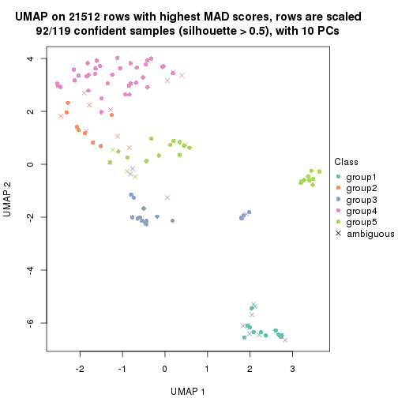</p>

</div>
<div id='tab-MAD-mclust-dimension-reduction-5'>
<pre><code class="r">dimension_reduction(res, k = 6, method = &quot;UMAP&quot;)
</code></pre>

<p></p>

</div>
</div>


Following heatmap shows how subgroups are split when increasing `k`:

```r
collect_classes(res)
```


Test correlation between subgroups and known annotations. If the known
annotation is numeric, one-way ANOVA test is applied, and if the known
annotation is discrete, chi-squared contingency table test is applied.

```r
test_to_known_factors(res)
```

```
#>              n disease.state(p) k
#> MAD:mclust 118         1.49e-11 2
#> MAD:mclust 113         9.63e-21 3
#> MAD:mclust 116         9.09e-21 4
#> MAD:mclust  92         1.92e-27 5
#> MAD:mclust  82         4.30e-31 6
```


If matrix rows can be associated to genes, consider to use `functional_enrichment(res,
...)` to perform function enrichment for the signature genes. See [this vignette](http://bioconductor.org/packages/devel/bioc/vignettes/cola/inst/doc/functional_enrichment.html) for more detailed explanations.


 

---------------------------------------------------


### MAD:NMF*


The object with results only for a single top-value method and a single partition method 
can be extracted as:

```r
res = res_list["MAD", "NMF"]
# you can also extract it by
# res = res_list["MAD:NMF"]
```

A summary of `res` and all the functions that can be applied to it:

```r
res
```

```
#> A 'ConsensusPartition' object with k = 2, 3, 4, 5, 6.
#>   On a matrix with 21512 rows and 119 columns.
#>   Top rows (1000, 2000, 3000, 4000, 5000) are extracted by 'MAD' method.
#>   Subgroups are detected by 'NMF' method.
#>   Performed in total 1250 partitions by row resampling.
#>   Best k for subgroups seems to be 2.
#> 
#> Following methods can be applied to this 'ConsensusPartition' object:
#>  [1] "cola_report"             "collect_classes"         "collect_plots"          
#>  [4] "collect_stats"           "colnames"                "compare_signatures"     
#>  [7] "consensus_heatmap"       "dimension_reduction"     "functional_enrichment"  
#> [10] "get_anno_col"            "get_anno"                "get_classes"            
#> [13] "get_consensus"           "get_matrix"              "get_membership"         
#> [16] "get_param"               "get_signatures"          "get_stats"              
#> [19] "is_best_k"               "is_stable_k"             "membership_heatmap"     
#> [22] "ncol"                    "nrow"                    "plot_ecdf"              
#> [25] "rownames"                "select_partition_number" "show"                   
#> [28] "suggest_best_k"          "test_to_known_factors"
```

`collect_plots()` function collects all the plots made from `res` for all `k` (number of partitions)
into one single page to provide an easy and fast comparison between different `k`.

```r
collect_plots(res)
```


The plots are:

- The first row: a plot of the ECDF (empirical cumulative distribution
  function) curves of the consensus matrix for each `k` and the heatmap of
  predicted classes for each `k`.
- The second row: heatmaps of the consensus matrix for each `k`.
- The third row: heatmaps of the membership matrix for each `k`.
- The fouth row: heatmaps of the signatures for each `k`.

All the plots in panels can be made by individual functions and they are
plotted later in this section.

`select_partition_number()` produces several plots showing different
statistics for choosing "optimized" `k`. There are following statistics:

- ECDF curves of the consensus matrix for each `k`;
- 1-PAC. [The PAC
  score](https://en.wikipedia.org/wiki/Consensus_clustering#Over-interpretation_potential_of_consensus_clustering)
  measures the proportion of the ambiguous subgrouping.
- Mean silhouette score.
- Concordance. The mean probability of fiting the consensus class ids in all
  partitions.
- Area increased. Denote $A_k$ as the area under the ECDF curve for current
  `k`, the area increased is defined as $A_k - A_{k-1}$.
- Rand index. The percent of pairs of samples that are both in a same cluster
  or both are not in a same cluster in the partition of k and k-1.
- Jaccard index. The ratio of pairs of samples are both in a same cluster in
  the partition of k and k-1 and the pairs of samples are both in a same
  cluster in the partition k or k-1.

The detailed explanations of these statistics can be found in [the _cola_
vignette](http://bioconductor.org/packages/devel/bioc/vignettes/cola/inst/doc/cola.html#toc_13).

Generally speaking, lower PAC score, higher mean silhouette score or higher
concordance corresponds to better partition. Rand index and Jaccard index
measure how similar the current partition is compared to partition with `k-1`.
If they are too similar, we won't accept `k` is better than `k-1`.

```r
select_partition_number(res)
```


The numeric values for all these statistics can be obtained by `get_stats()`.

```r
get_stats(res)
```

```
#>   k 1-PAC mean_silhouette concordance area_increased  Rand Jaccard
#> 2 2 0.930           0.932       0.972         0.5018 0.496   0.496
#> 3 3 0.573           0.680       0.847         0.3080 0.753   0.544
#> 4 4 0.601           0.538       0.746         0.1221 0.782   0.477
#> 5 5 0.619           0.526       0.750         0.0564 0.886   0.636
#> 6 6 0.643           0.587       0.751         0.0502 0.839   0.442
```

`suggest_best_k()` suggests the best $k$ based on these statistics. The rules are as follows:

- All $k$ with Jaccard index larger than 0.95 are removed because increasing
  $k$ does not provide enough extra information. If all $k$ are removed, it is
  marked as no subgroup is detected.
- For all $k$ with 1-PAC score larger than 0.9, the maximal $k$ is taken as
  the best $k$, and other $k$ are marked as optional $k$.
- If it does not fit the second rule. The $k$ with the maximal vote of the
  highest 1-PAC score, highest mean silhouette, and highest concordance is
  taken as the best $k$.

```r
suggest_best_k(res)
```

```
#> [1] 2
```


Following shows the table of the partitions (You need to click the **show/hide
code output** link to see it). The membership matrix (columns with name `p*`)
is inferred by
[`clue::cl_consensus()`](https://www.rdocumentation.org/link/cl_consensus?package=clue)
function with the `SE` method. Basically the value in the membership matrix
represents the probability to belong to a certain group. The finall class
label for an item is determined with the group with highest probability it
belongs to.

In `get_classes()` function, the entropy is calculated from the membership
matrix and the silhouette score is calculated from the consensus matrix.


<script>
$( function() {
	$( '#tabs-MAD-NMF-get-classes' ).tabs();
} );
</script>
<div id='tabs-MAD-NMF-get-classes'>
<ul>
<li><a href='#tab-MAD-NMF-get-classes-1'>k = 2</a></li>
<li><a href='#tab-MAD-NMF-get-classes-2'>k = 3</a></li>
<li><a href='#tab-MAD-NMF-get-classes-3'>k = 4</a></li>
<li><a href='#tab-MAD-NMF-get-classes-4'>k = 5</a></li>
<li><a href='#tab-MAD-NMF-get-classes-5'>k = 6</a></li>
</ul>

<div id='tab-MAD-NMF-get-classes-1'>
<p><a id='tab-MAD-NMF-get-classes-1-a' style='color:#0366d6' href='#'>show/hide code output</a></p>
<pre><code class="r">cbind(get_classes(res, k = 2), get_membership(res, k = 2))
</code></pre>

<pre><code>#&gt;           class entropy silhouette    p1    p2
#&gt; GSM120719     1  0.0000      0.953 1.000 0.000
#&gt; GSM120720     1  0.0000      0.953 1.000 0.000
#&gt; GSM120765     2  0.0000      0.987 0.000 1.000
#&gt; GSM120767     2  0.0000      0.987 0.000 1.000
#&gt; GSM120784     2  0.0000      0.987 0.000 1.000
#&gt; GSM121400     1  0.0000      0.953 1.000 0.000
#&gt; GSM121401     1  0.0000      0.953 1.000 0.000
#&gt; GSM121402     2  0.0000      0.987 0.000 1.000
#&gt; GSM121403     1  0.8267      0.657 0.740 0.260
#&gt; GSM121404     2  0.0000      0.987 0.000 1.000
#&gt; GSM121405     1  0.0000      0.953 1.000 0.000
#&gt; GSM121406     2  0.0000      0.987 0.000 1.000
#&gt; GSM121408     2  0.0000      0.987 0.000 1.000
#&gt; GSM121409     1  0.0000      0.953 1.000 0.000
#&gt; GSM121410     1  0.0000      0.953 1.000 0.000
#&gt; GSM121412     2  0.0000      0.987 0.000 1.000
#&gt; GSM121413     2  0.0000      0.987 0.000 1.000
#&gt; GSM121414     2  0.0000      0.987 0.000 1.000
#&gt; GSM121415     2  0.0000      0.987 0.000 1.000
#&gt; GSM121416     2  0.0000      0.987 0.000 1.000
#&gt; GSM120591     1  0.0000      0.953 1.000 0.000
#&gt; GSM120594     1  0.0000      0.953 1.000 0.000
#&gt; GSM120718     1  0.0000      0.953 1.000 0.000
#&gt; GSM121205     1  0.0000      0.953 1.000 0.000
#&gt; GSM121206     1  0.0000      0.953 1.000 0.000
#&gt; GSM121207     1  0.0000      0.953 1.000 0.000
#&gt; GSM121208     1  0.0000      0.953 1.000 0.000
#&gt; GSM121209     1  0.0000      0.953 1.000 0.000
#&gt; GSM121210     1  0.0000      0.953 1.000 0.000
#&gt; GSM121211     1  0.0000      0.953 1.000 0.000
#&gt; GSM121212     1  0.0000      0.953 1.000 0.000
#&gt; GSM121213     1  0.0000      0.953 1.000 0.000
#&gt; GSM121214     1  0.0000      0.953 1.000 0.000
#&gt; GSM121215     1  0.0000      0.953 1.000 0.000
#&gt; GSM121216     1  0.0000      0.953 1.000 0.000
#&gt; GSM121217     1  0.0000      0.953 1.000 0.000
#&gt; GSM121218     1  0.0000      0.953 1.000 0.000
#&gt; GSM121234     1  0.0000      0.953 1.000 0.000
#&gt; GSM121243     1  0.0000      0.953 1.000 0.000
#&gt; GSM121245     1  0.0000      0.953 1.000 0.000
#&gt; GSM121246     1  0.0000      0.953 1.000 0.000
#&gt; GSM121247     1  0.0000      0.953 1.000 0.000
#&gt; GSM121248     1  0.0000      0.953 1.000 0.000
#&gt; GSM120744     1  0.9754      0.359 0.592 0.408
#&gt; GSM120745     1  0.0000      0.953 1.000 0.000
#&gt; GSM120746     1  0.6887      0.768 0.816 0.184
#&gt; GSM120747     1  0.9775      0.347 0.588 0.412
#&gt; GSM120748     2  0.0000      0.987 0.000 1.000
#&gt; GSM120749     1  0.1184      0.941 0.984 0.016
#&gt; GSM120750     1  0.9754      0.359 0.592 0.408
#&gt; GSM120751     1  0.4298      0.876 0.912 0.088
#&gt; GSM120752     1  0.0000      0.953 1.000 0.000
#&gt; GSM121336     2  0.0000      0.987 0.000 1.000
#&gt; GSM121339     2  0.0000      0.987 0.000 1.000
#&gt; GSM121349     2  0.0000      0.987 0.000 1.000
#&gt; GSM121355     2  0.0000      0.987 0.000 1.000
#&gt; GSM120757     1  0.0376      0.950 0.996 0.004
#&gt; GSM120766     1  0.9460      0.466 0.636 0.364
#&gt; GSM120770     2  0.0000      0.987 0.000 1.000
#&gt; GSM120779     1  0.0000      0.953 1.000 0.000
#&gt; GSM120780     2  0.0000      0.987 0.000 1.000
#&gt; GSM121102     2  0.0000      0.987 0.000 1.000
#&gt; GSM121203     2  0.9000      0.507 0.316 0.684
#&gt; GSM121204     1  0.0000      0.953 1.000 0.000
#&gt; GSM121330     1  0.0000      0.953 1.000 0.000
#&gt; GSM121335     1  0.0000      0.953 1.000 0.000
#&gt; GSM121337     2  0.0000      0.987 0.000 1.000
#&gt; GSM121338     2  0.0000      0.987 0.000 1.000
#&gt; GSM121341     1  0.0000      0.953 1.000 0.000
#&gt; GSM121342     1  0.0000      0.953 1.000 0.000
#&gt; GSM121343     2  0.0000      0.987 0.000 1.000
#&gt; GSM121344     1  0.0000      0.953 1.000 0.000
#&gt; GSM121346     1  0.0000      0.953 1.000 0.000
#&gt; GSM121347     2  0.0938      0.976 0.012 0.988
#&gt; GSM121348     2  0.0000      0.987 0.000 1.000
#&gt; GSM121350     1  0.0000      0.953 1.000 0.000
#&gt; GSM121352     1  0.0000      0.953 1.000 0.000
#&gt; GSM121354     1  0.0000      0.953 1.000 0.000
#&gt; GSM120753     2  0.0000      0.987 0.000 1.000
#&gt; GSM120761     2  0.0000      0.987 0.000 1.000
#&gt; GSM120768     2  0.0000      0.987 0.000 1.000
#&gt; GSM120781     2  0.0000      0.987 0.000 1.000
#&gt; GSM120788     2  0.2948      0.936 0.052 0.948
#&gt; GSM120760     2  0.0000      0.987 0.000 1.000
#&gt; GSM120763     2  0.0000      0.987 0.000 1.000
#&gt; GSM120764     2  0.0000      0.987 0.000 1.000
#&gt; GSM120777     2  0.0000      0.987 0.000 1.000
#&gt; GSM120786     2  0.0000      0.987 0.000 1.000
#&gt; GSM121329     1  0.0000      0.953 1.000 0.000
#&gt; GSM121331     1  0.0000      0.953 1.000 0.000
#&gt; GSM121333     1  0.0000      0.953 1.000 0.000
#&gt; GSM121345     1  0.0000      0.953 1.000 0.000
#&gt; GSM121356     1  0.0000      0.953 1.000 0.000
#&gt; GSM120754     2  0.0000      0.987 0.000 1.000
#&gt; GSM120759     2  0.0000      0.987 0.000 1.000
#&gt; GSM120762     2  0.0000      0.987 0.000 1.000
#&gt; GSM120775     2  0.0000      0.987 0.000 1.000
#&gt; GSM120776     2  0.7056      0.747 0.192 0.808
#&gt; GSM120782     2  0.0000      0.987 0.000 1.000
#&gt; GSM120789     2  0.0000      0.987 0.000 1.000
#&gt; GSM120790     2  0.0000      0.987 0.000 1.000
#&gt; GSM120791     2  0.0000      0.987 0.000 1.000
#&gt; GSM120755     2  0.0000      0.987 0.000 1.000
#&gt; GSM120756     1  0.9970      0.161 0.532 0.468
#&gt; GSM120769     2  0.0000      0.987 0.000 1.000
#&gt; GSM120778     2  0.0000      0.987 0.000 1.000
#&gt; GSM120792     2  0.0000      0.987 0.000 1.000
#&gt; GSM121332     2  0.0000      0.987 0.000 1.000
#&gt; GSM121334     2  0.0000      0.987 0.000 1.000
#&gt; GSM121340     2  0.0000      0.987 0.000 1.000
#&gt; GSM121351     2  0.0000      0.987 0.000 1.000
#&gt; GSM121353     2  0.5946      0.823 0.144 0.856
#&gt; GSM120758     2  0.0000      0.987 0.000 1.000
#&gt; GSM120771     2  0.0000      0.987 0.000 1.000
#&gt; GSM120772     2  0.0000      0.987 0.000 1.000
#&gt; GSM120773     2  0.0000      0.987 0.000 1.000
#&gt; GSM120774     2  0.0000      0.987 0.000 1.000
#&gt; GSM120783     2  0.0000      0.987 0.000 1.000
#&gt; GSM120787     2  0.0000      0.987 0.000 1.000
</code></pre>

<script>
$('#tab-MAD-NMF-get-classes-1-a').parent().next().next().hide();
$('#tab-MAD-NMF-get-classes-1-a').click(function(){
  $('#tab-MAD-NMF-get-classes-1-a').parent().next().next().toggle();
  return(false);
});
</script>
</div>

<div id='tab-MAD-NMF-get-classes-2'>
<p><a id='tab-MAD-NMF-get-classes-2-a' style='color:#0366d6' href='#'>show/hide code output</a></p>
<pre><code class="r">cbind(get_classes(res, k = 3), get_membership(res, k = 3))
</code></pre>

<pre><code>#&gt;           class entropy silhouette    p1    p2    p3
#&gt; GSM120719     1  0.2625     0.7093 0.916 0.000 0.084
#&gt; GSM120720     3  0.4887     0.6424 0.228 0.000 0.772
#&gt; GSM120765     2  0.2796     0.8683 0.000 0.908 0.092
#&gt; GSM120767     2  0.2537     0.8738 0.000 0.920 0.080
#&gt; GSM120784     2  0.4062     0.8171 0.000 0.836 0.164
#&gt; GSM121400     3  0.0237     0.7713 0.000 0.004 0.996
#&gt; GSM121401     3  0.0424     0.7724 0.008 0.000 0.992
#&gt; GSM121402     2  0.2066     0.8792 0.000 0.940 0.060
#&gt; GSM121403     3  0.1411     0.7586 0.000 0.036 0.964
#&gt; GSM121404     2  0.6267     0.3137 0.000 0.548 0.452
#&gt; GSM121405     3  0.0592     0.7690 0.000 0.012 0.988
#&gt; GSM121406     2  0.3192     0.8575 0.000 0.888 0.112
#&gt; GSM121408     2  0.2711     0.8705 0.000 0.912 0.088
#&gt; GSM121409     3  0.0661     0.7724 0.008 0.004 0.988
#&gt; GSM121410     3  0.0237     0.7713 0.000 0.004 0.996
#&gt; GSM121412     2  0.5397     0.6731 0.000 0.720 0.280
#&gt; GSM121413     2  0.4178     0.8097 0.000 0.828 0.172
#&gt; GSM121414     2  0.4796     0.7562 0.000 0.780 0.220
#&gt; GSM121415     2  0.4346     0.7984 0.000 0.816 0.184
#&gt; GSM121416     2  0.2448     0.8747 0.000 0.924 0.076
#&gt; GSM120591     3  0.4062     0.7121 0.164 0.000 0.836
#&gt; GSM120594     3  0.4750     0.6581 0.216 0.000 0.784
#&gt; GSM120718     3  0.6244     0.1737 0.440 0.000 0.560
#&gt; GSM121205     1  0.4702     0.6436 0.788 0.000 0.212
#&gt; GSM121206     1  0.6280     0.1482 0.540 0.000 0.460
#&gt; GSM121207     1  0.2448     0.7096 0.924 0.000 0.076
#&gt; GSM121208     3  0.5591     0.5182 0.304 0.000 0.696
#&gt; GSM121209     3  0.6302     0.0299 0.480 0.000 0.520
#&gt; GSM121210     1  0.5098     0.6063 0.752 0.000 0.248
#&gt; GSM121211     1  0.6215     0.2528 0.572 0.000 0.428
#&gt; GSM121212     1  0.5138     0.6017 0.748 0.000 0.252
#&gt; GSM121213     1  0.5591     0.5239 0.696 0.000 0.304
#&gt; GSM121214     1  0.3816     0.6882 0.852 0.000 0.148
#&gt; GSM121215     1  0.6192     0.2747 0.580 0.000 0.420
#&gt; GSM121216     1  0.5254     0.5872 0.736 0.000 0.264
#&gt; GSM121217     1  0.5988     0.4042 0.632 0.000 0.368
#&gt; GSM121218     1  0.3879     0.6861 0.848 0.000 0.152
#&gt; GSM121234     3  0.6267     0.1336 0.452 0.000 0.548
#&gt; GSM121243     1  0.4555     0.6550 0.800 0.000 0.200
#&gt; GSM121245     1  0.3038     0.7044 0.896 0.000 0.104
#&gt; GSM121246     3  0.4346     0.6944 0.184 0.000 0.816
#&gt; GSM121247     1  0.1031     0.7123 0.976 0.000 0.024
#&gt; GSM121248     1  0.4346     0.6663 0.816 0.000 0.184
#&gt; GSM120744     3  0.3412     0.6904 0.000 0.124 0.876
#&gt; GSM120745     3  0.3686     0.7303 0.140 0.000 0.860
#&gt; GSM120746     3  0.1411     0.7597 0.000 0.036 0.964
#&gt; GSM120747     3  0.1529     0.7559 0.000 0.040 0.960
#&gt; GSM120748     3  0.4750     0.5970 0.000 0.216 0.784
#&gt; GSM120749     3  0.0237     0.7713 0.000 0.004 0.996
#&gt; GSM120750     3  0.2356     0.7337 0.000 0.072 0.928
#&gt; GSM120751     3  0.0892     0.7666 0.000 0.020 0.980
#&gt; GSM120752     3  0.2796     0.7577 0.092 0.000 0.908
#&gt; GSM121336     2  0.2356     0.8756 0.000 0.928 0.072
#&gt; GSM121339     3  0.6168     0.1193 0.000 0.412 0.588
#&gt; GSM121349     2  0.2066     0.8789 0.000 0.940 0.060
#&gt; GSM121355     2  0.3038     0.8624 0.000 0.896 0.104
#&gt; GSM120757     1  0.1399     0.7064 0.968 0.028 0.004
#&gt; GSM120766     1  0.9913     0.0795 0.388 0.336 0.276
#&gt; GSM120770     2  0.3816     0.8310 0.000 0.852 0.148
#&gt; GSM120779     1  0.1129     0.7088 0.976 0.020 0.004
#&gt; GSM120780     2  0.6204     0.3878 0.000 0.576 0.424
#&gt; GSM121102     2  0.6192     0.3989 0.000 0.580 0.420
#&gt; GSM121203     3  0.4504     0.6202 0.000 0.196 0.804
#&gt; GSM121204     1  0.0747     0.7123 0.984 0.000 0.016
#&gt; GSM121330     3  0.1860     0.7690 0.052 0.000 0.948
#&gt; GSM121335     3  0.4178     0.7053 0.172 0.000 0.828
#&gt; GSM121337     2  0.3500     0.8568 0.004 0.880 0.116
#&gt; GSM121338     3  0.5650     0.4089 0.000 0.312 0.688
#&gt; GSM121341     3  0.4291     0.6983 0.180 0.000 0.820
#&gt; GSM121342     3  0.5327     0.5760 0.272 0.000 0.728
#&gt; GSM121343     3  0.6215     0.0645 0.000 0.428 0.572
#&gt; GSM121344     3  0.3879     0.7206 0.152 0.000 0.848
#&gt; GSM121346     3  0.1753     0.7696 0.048 0.000 0.952
#&gt; GSM121347     2  0.2903     0.8753 0.048 0.924 0.028
#&gt; GSM121348     2  0.3752     0.8402 0.096 0.884 0.020
#&gt; GSM121350     3  0.1529     0.7709 0.040 0.000 0.960
#&gt; GSM121352     3  0.1860     0.7687 0.052 0.000 0.948
#&gt; GSM121354     3  0.2537     0.7595 0.080 0.000 0.920
#&gt; GSM120753     2  0.0424     0.8832 0.000 0.992 0.008
#&gt; GSM120761     2  0.0892     0.8769 0.020 0.980 0.000
#&gt; GSM120768     2  0.1289     0.8727 0.032 0.968 0.000
#&gt; GSM120781     2  0.0747     0.8837 0.000 0.984 0.016
#&gt; GSM120788     1  0.5016     0.5741 0.760 0.240 0.000
#&gt; GSM120760     2  0.2959     0.8275 0.100 0.900 0.000
#&gt; GSM120763     2  0.3038     0.8239 0.104 0.896 0.000
#&gt; GSM120764     2  0.6026     0.3869 0.376 0.624 0.000
#&gt; GSM120777     1  0.5650     0.4618 0.688 0.312 0.000
#&gt; GSM120786     2  0.5988     0.4062 0.368 0.632 0.000
#&gt; GSM121329     1  0.3482     0.6974 0.872 0.000 0.128
#&gt; GSM121331     1  0.0892     0.7076 0.980 0.020 0.000
#&gt; GSM121333     1  0.0592     0.7092 0.988 0.012 0.000
#&gt; GSM121345     1  0.1643     0.6976 0.956 0.044 0.000
#&gt; GSM121356     1  0.0983     0.7123 0.980 0.004 0.016
#&gt; GSM120754     2  0.2066     0.8570 0.060 0.940 0.000
#&gt; GSM120759     2  0.1753     0.8812 0.000 0.952 0.048
#&gt; GSM120762     2  0.0475     0.8821 0.004 0.992 0.004
#&gt; GSM120775     1  0.6252     0.1455 0.556 0.444 0.000
#&gt; GSM120776     1  0.5058     0.5716 0.756 0.244 0.000
#&gt; GSM120782     2  0.1163     0.8743 0.028 0.972 0.000
#&gt; GSM120789     2  0.0892     0.8837 0.000 0.980 0.020
#&gt; GSM120790     2  0.1015     0.8835 0.008 0.980 0.012
#&gt; GSM120791     2  0.2066     0.8571 0.060 0.940 0.000
#&gt; GSM120755     2  0.1529     0.8828 0.000 0.960 0.040
#&gt; GSM120756     1  0.4002     0.6370 0.840 0.160 0.000
#&gt; GSM120769     2  0.0424     0.8803 0.008 0.992 0.000
#&gt; GSM120778     2  0.1163     0.8743 0.028 0.972 0.000
#&gt; GSM120792     2  0.1163     0.8743 0.028 0.972 0.000
#&gt; GSM121332     2  0.1289     0.8830 0.000 0.968 0.032
#&gt; GSM121334     2  0.0424     0.8804 0.008 0.992 0.000
#&gt; GSM121340     1  0.6308    -0.0204 0.508 0.492 0.000
#&gt; GSM121351     2  0.1860     0.8805 0.000 0.948 0.052
#&gt; GSM121353     1  0.5882     0.3903 0.652 0.348 0.000
#&gt; GSM120758     2  0.0661     0.8828 0.004 0.988 0.008
#&gt; GSM120771     2  0.0747     0.8837 0.000 0.984 0.016
#&gt; GSM120772     2  0.0424     0.8804 0.008 0.992 0.000
#&gt; GSM120773     2  0.2796     0.8339 0.092 0.908 0.000
#&gt; GSM120774     2  0.1411     0.8709 0.036 0.964 0.000
#&gt; GSM120783     2  0.4974     0.6617 0.236 0.764 0.000
#&gt; GSM120787     2  0.1031     0.8757 0.024 0.976 0.000
</code></pre>

<script>
$('#tab-MAD-NMF-get-classes-2-a').parent().next().next().hide();
$('#tab-MAD-NMF-get-classes-2-a').click(function(){
  $('#tab-MAD-NMF-get-classes-2-a').parent().next().next().toggle();
  return(false);
});
</script>
</div>

<div id='tab-MAD-NMF-get-classes-3'>
<p><a id='tab-MAD-NMF-get-classes-3-a' style='color:#0366d6' href='#'>show/hide code output</a></p>
<pre><code class="r">cbind(get_classes(res, k = 4), get_membership(res, k = 4))
</code></pre>

<pre><code>#&gt;           class entropy silhouette    p1    p2    p3    p4
#&gt; GSM120719     4  0.4804     0.1293 0.384 0.000 0.000 0.616
#&gt; GSM120720     1  0.1209     0.6744 0.964 0.000 0.004 0.032
#&gt; GSM120765     2  0.3937     0.7385 0.000 0.800 0.188 0.012
#&gt; GSM120767     2  0.1488     0.8238 0.000 0.956 0.032 0.012
#&gt; GSM120784     2  0.4883     0.6294 0.000 0.696 0.288 0.016
#&gt; GSM121400     3  0.5630     0.3889 0.376 0.012 0.600 0.012
#&gt; GSM121401     1  0.4813     0.4174 0.716 0.004 0.268 0.012
#&gt; GSM121402     2  0.3498     0.7647 0.000 0.832 0.160 0.008
#&gt; GSM121403     3  0.6060     0.2826 0.428 0.024 0.536 0.012
#&gt; GSM121404     2  0.7924     0.1518 0.176 0.452 0.356 0.016
#&gt; GSM121405     1  0.5512     0.3425 0.680 0.020 0.284 0.016
#&gt; GSM121406     2  0.3790     0.7531 0.000 0.820 0.164 0.016
#&gt; GSM121408     2  0.1488     0.8238 0.000 0.956 0.032 0.012
#&gt; GSM121409     3  0.5909     0.3376 0.400 0.020 0.568 0.012
#&gt; GSM121410     1  0.5914    -0.1445 0.504 0.016 0.468 0.012
#&gt; GSM121412     2  0.5613     0.5616 0.016 0.648 0.320 0.016
#&gt; GSM121413     2  0.5075     0.5525 0.000 0.644 0.344 0.012
#&gt; GSM121414     2  0.5481     0.5970 0.016 0.672 0.296 0.016
#&gt; GSM121415     2  0.5496     0.5375 0.008 0.632 0.344 0.016
#&gt; GSM121416     2  0.4123     0.7159 0.000 0.772 0.220 0.008
#&gt; GSM120591     1  0.2197     0.6520 0.916 0.000 0.080 0.004
#&gt; GSM120594     1  0.1042     0.6746 0.972 0.000 0.008 0.020
#&gt; GSM120718     1  0.3024     0.6402 0.852 0.000 0.000 0.148
#&gt; GSM121205     1  0.5088     0.3179 0.572 0.000 0.004 0.424
#&gt; GSM121206     1  0.4040     0.5774 0.752 0.000 0.000 0.248
#&gt; GSM121207     4  0.5004     0.1117 0.392 0.000 0.004 0.604
#&gt; GSM121208     1  0.2142     0.6715 0.928 0.000 0.016 0.056
#&gt; GSM121209     1  0.3569     0.6148 0.804 0.000 0.000 0.196
#&gt; GSM121210     1  0.5290     0.1797 0.516 0.000 0.008 0.476
#&gt; GSM121211     1  0.4134     0.5672 0.740 0.000 0.000 0.260
#&gt; GSM121212     1  0.5088     0.3179 0.572 0.000 0.004 0.424
#&gt; GSM121213     1  0.4741     0.4860 0.668 0.000 0.004 0.328
#&gt; GSM121214     4  0.5155    -0.1020 0.468 0.000 0.004 0.528
#&gt; GSM121215     1  0.4428     0.5487 0.720 0.000 0.004 0.276
#&gt; GSM121216     1  0.4872     0.4446 0.640 0.000 0.004 0.356
#&gt; GSM121217     1  0.4560     0.5273 0.700 0.000 0.004 0.296
#&gt; GSM121218     4  0.5163    -0.1400 0.480 0.000 0.004 0.516
#&gt; GSM121234     1  0.3219     0.6326 0.836 0.000 0.000 0.164
#&gt; GSM121243     1  0.5158     0.2021 0.524 0.000 0.004 0.472
#&gt; GSM121245     4  0.4950     0.1432 0.376 0.000 0.004 0.620
#&gt; GSM121246     1  0.0779     0.6742 0.980 0.000 0.004 0.016
#&gt; GSM121247     4  0.3539     0.3952 0.176 0.000 0.004 0.820
#&gt; GSM121248     1  0.5163     0.1761 0.516 0.000 0.004 0.480
#&gt; GSM120744     3  0.1637     0.6927 0.000 0.000 0.940 0.060
#&gt; GSM120745     3  0.3597     0.6647 0.016 0.000 0.836 0.148
#&gt; GSM120746     3  0.2124     0.6914 0.068 0.000 0.924 0.008
#&gt; GSM120747     3  0.5188     0.5413 0.268 0.012 0.704 0.016
#&gt; GSM120748     3  0.3257     0.6705 0.108 0.012 0.872 0.008
#&gt; GSM120749     3  0.2805     0.6837 0.100 0.000 0.888 0.012
#&gt; GSM120750     3  0.1488     0.6975 0.012 0.000 0.956 0.032
#&gt; GSM120751     3  0.2111     0.6969 0.044 0.000 0.932 0.024
#&gt; GSM120752     3  0.3300     0.6638 0.008 0.000 0.848 0.144
#&gt; GSM121336     2  0.2021     0.8168 0.000 0.932 0.056 0.012
#&gt; GSM121339     2  0.8177     0.1509 0.276 0.444 0.264 0.016
#&gt; GSM121349     2  0.1677     0.8217 0.000 0.948 0.040 0.012
#&gt; GSM121355     2  0.2222     0.8137 0.000 0.924 0.060 0.016
#&gt; GSM120757     3  0.4877     0.3800 0.000 0.000 0.592 0.408
#&gt; GSM120766     3  0.4222     0.5566 0.000 0.000 0.728 0.272
#&gt; GSM120770     3  0.3198     0.6828 0.000 0.040 0.880 0.080
#&gt; GSM120779     3  0.4996     0.2333 0.000 0.000 0.516 0.484
#&gt; GSM120780     3  0.3024     0.6581 0.000 0.000 0.852 0.148
#&gt; GSM121102     3  0.2313     0.6865 0.044 0.032 0.924 0.000
#&gt; GSM121203     3  0.1661     0.6949 0.004 0.000 0.944 0.052
#&gt; GSM121204     4  0.4920     0.0455 0.004 0.000 0.368 0.628
#&gt; GSM121330     1  0.2737     0.6266 0.888 0.000 0.104 0.008
#&gt; GSM121335     1  0.0592     0.6700 0.984 0.000 0.016 0.000
#&gt; GSM121337     2  0.5207     0.6172 0.000 0.680 0.292 0.028
#&gt; GSM121338     3  0.7098     0.4111 0.320 0.100 0.564 0.016
#&gt; GSM121341     1  0.0469     0.6709 0.988 0.000 0.012 0.000
#&gt; GSM121342     1  0.1118     0.6735 0.964 0.000 0.000 0.036
#&gt; GSM121343     3  0.6005     0.5622 0.224 0.072 0.692 0.012
#&gt; GSM121344     1  0.1211     0.6637 0.960 0.000 0.040 0.000
#&gt; GSM121346     1  0.4482     0.4375 0.728 0.000 0.264 0.008
#&gt; GSM121347     3  0.7366     0.3866 0.000 0.224 0.524 0.252
#&gt; GSM121348     3  0.4957     0.5025 0.000 0.012 0.668 0.320
#&gt; GSM121350     1  0.4452     0.4405 0.732 0.000 0.260 0.008
#&gt; GSM121352     1  0.4011     0.5234 0.784 0.000 0.208 0.008
#&gt; GSM121354     1  0.2149     0.6413 0.912 0.000 0.088 0.000
#&gt; GSM120753     2  0.0469     0.8283 0.000 0.988 0.000 0.012
#&gt; GSM120761     2  0.1209     0.8255 0.000 0.964 0.004 0.032
#&gt; GSM120768     2  0.0921     0.8250 0.000 0.972 0.000 0.028
#&gt; GSM120781     2  0.0336     0.8286 0.000 0.992 0.000 0.008
#&gt; GSM120788     4  0.3708     0.4919 0.000 0.148 0.020 0.832
#&gt; GSM120760     2  0.3219     0.7679 0.000 0.868 0.020 0.112
#&gt; GSM120763     2  0.2401     0.7911 0.000 0.904 0.004 0.092
#&gt; GSM120764     4  0.5607    -0.1700 0.000 0.488 0.020 0.492
#&gt; GSM120777     4  0.4150     0.4644 0.000 0.120 0.056 0.824
#&gt; GSM120786     2  0.5503     0.1638 0.000 0.516 0.016 0.468
#&gt; GSM121329     4  0.4933     0.0073 0.432 0.000 0.000 0.568
#&gt; GSM121331     4  0.4955    -0.1489 0.000 0.000 0.444 0.556
#&gt; GSM121333     4  0.4907    -0.0857 0.000 0.000 0.420 0.580
#&gt; GSM121345     4  0.3441     0.3882 0.004 0.004 0.152 0.840
#&gt; GSM121356     3  0.4916     0.3577 0.000 0.000 0.576 0.424
#&gt; GSM120754     2  0.5845     0.5556 0.000 0.672 0.076 0.252
#&gt; GSM120759     2  0.1902     0.8193 0.000 0.932 0.064 0.004
#&gt; GSM120762     2  0.0592     0.8277 0.000 0.984 0.000 0.016
#&gt; GSM120775     4  0.4989    -0.0495 0.000 0.472 0.000 0.528
#&gt; GSM120776     4  0.4418     0.3476 0.000 0.032 0.184 0.784
#&gt; GSM120782     2  0.1722     0.8180 0.000 0.944 0.008 0.048
#&gt; GSM120789     2  0.0336     0.8286 0.000 0.992 0.000 0.008
#&gt; GSM120790     3  0.6147     0.5471 0.000 0.112 0.664 0.224
#&gt; GSM120791     2  0.1474     0.8158 0.000 0.948 0.000 0.052
#&gt; GSM120755     2  0.0188     0.8285 0.000 0.996 0.000 0.004
#&gt; GSM120756     4  0.3529     0.4848 0.012 0.152 0.000 0.836
#&gt; GSM120769     2  0.0707     0.8270 0.000 0.980 0.000 0.020
#&gt; GSM120778     2  0.0707     0.8270 0.000 0.980 0.000 0.020
#&gt; GSM120792     2  0.1022     0.8241 0.000 0.968 0.000 0.032
#&gt; GSM121332     2  0.0336     0.8283 0.000 0.992 0.000 0.008
#&gt; GSM121334     2  0.0707     0.8270 0.000 0.980 0.000 0.020
#&gt; GSM121340     2  0.4804     0.3678 0.000 0.616 0.000 0.384
#&gt; GSM121351     2  0.1854     0.8197 0.000 0.940 0.048 0.012
#&gt; GSM121353     2  0.5329     0.2212 0.012 0.568 0.000 0.420
#&gt; GSM120758     2  0.0469     0.8283 0.000 0.988 0.000 0.012
#&gt; GSM120771     2  0.0895     0.8294 0.000 0.976 0.020 0.004
#&gt; GSM120772     2  0.0707     0.8270 0.000 0.980 0.000 0.020
#&gt; GSM120773     2  0.3271     0.7631 0.000 0.856 0.012 0.132
#&gt; GSM120774     2  0.1022     0.8237 0.000 0.968 0.000 0.032
#&gt; GSM120783     2  0.3444     0.7122 0.000 0.816 0.000 0.184
#&gt; GSM120787     2  0.0707     0.8270 0.000 0.980 0.000 0.020
</code></pre>

<script>
$('#tab-MAD-NMF-get-classes-3-a').parent().next().next().hide();
$('#tab-MAD-NMF-get-classes-3-a').click(function(){
  $('#tab-MAD-NMF-get-classes-3-a').parent().next().next().toggle();
  return(false);
});
</script>
</div>

<div id='tab-MAD-NMF-get-classes-4'>
<p><a id='tab-MAD-NMF-get-classes-4-a' style='color:#0366d6' href='#'>show/hide code output</a></p>
<pre><code class="r">cbind(get_classes(res, k = 5), get_membership(res, k = 5))
</code></pre>

<pre><code>#&gt;           class entropy silhouette    p1    p2    p3    p4    p5
#&gt; GSM120719     4  0.6610    0.02238 0.364 0.016 0.124 0.492 0.004
#&gt; GSM120720     3  0.3696    0.65216 0.212 0.000 0.772 0.016 0.000
#&gt; GSM120765     2  0.3670    0.69546 0.000 0.796 0.020 0.004 0.180
#&gt; GSM120767     2  0.2238    0.76628 0.000 0.912 0.064 0.004 0.020
#&gt; GSM120784     2  0.5127    0.60265 0.000 0.692 0.092 0.004 0.212
#&gt; GSM121400     5  0.5320    0.43739 0.264 0.000 0.072 0.008 0.656
#&gt; GSM121401     1  0.5878    0.14634 0.504 0.000 0.416 0.012 0.068
#&gt; GSM121402     2  0.4375    0.37468 0.000 0.576 0.004 0.000 0.420
#&gt; GSM121403     5  0.5745    0.45915 0.256 0.024 0.060 0.008 0.652
#&gt; GSM121404     2  0.7505    0.02417 0.024 0.396 0.256 0.008 0.316
#&gt; GSM121405     1  0.6476    0.21742 0.500 0.000 0.348 0.012 0.140
#&gt; GSM121406     2  0.4135    0.51961 0.000 0.656 0.004 0.000 0.340
#&gt; GSM121408     2  0.2646    0.74336 0.000 0.868 0.004 0.004 0.124
#&gt; GSM121409     5  0.4873    0.40267 0.316 0.012 0.016 0.004 0.652
#&gt; GSM121410     5  0.5161    0.36251 0.336 0.012 0.020 0.008 0.624
#&gt; GSM121412     5  0.5062    0.01488 0.020 0.420 0.004 0.004 0.552
#&gt; GSM121413     5  0.4350    0.06244 0.000 0.408 0.004 0.000 0.588
#&gt; GSM121414     5  0.4443   -0.14437 0.000 0.472 0.004 0.000 0.524
#&gt; GSM121415     2  0.4504    0.34461 0.000 0.564 0.008 0.000 0.428
#&gt; GSM121416     2  0.4449    0.50261 0.000 0.636 0.004 0.008 0.352
#&gt; GSM120591     3  0.2266    0.79299 0.064 0.000 0.912 0.016 0.008
#&gt; GSM120594     3  0.3340    0.71706 0.156 0.000 0.824 0.016 0.004
#&gt; GSM120718     3  0.4958    0.30412 0.372 0.000 0.592 0.036 0.000
#&gt; GSM121205     1  0.3395    0.66941 0.764 0.000 0.000 0.236 0.000
#&gt; GSM121206     1  0.1544    0.74027 0.932 0.000 0.000 0.068 0.000
#&gt; GSM121207     4  0.4450   -0.29660 0.488 0.000 0.004 0.508 0.000
#&gt; GSM121208     1  0.1329    0.73525 0.956 0.000 0.004 0.008 0.032
#&gt; GSM121209     1  0.1197    0.74069 0.952 0.000 0.000 0.048 0.000
#&gt; GSM121210     1  0.4326    0.62500 0.708 0.000 0.000 0.264 0.028
#&gt; GSM121211     1  0.1908    0.73785 0.908 0.000 0.000 0.092 0.000
#&gt; GSM121212     1  0.3366    0.67042 0.768 0.000 0.000 0.232 0.000
#&gt; GSM121213     1  0.2536    0.72768 0.868 0.000 0.000 0.128 0.004
#&gt; GSM121214     1  0.4182    0.46768 0.600 0.000 0.000 0.400 0.000
#&gt; GSM121215     1  0.1965    0.73681 0.904 0.000 0.000 0.096 0.000
#&gt; GSM121216     1  0.2624    0.73191 0.872 0.000 0.000 0.116 0.012
#&gt; GSM121217     1  0.2424    0.72576 0.868 0.000 0.000 0.132 0.000
#&gt; GSM121218     1  0.3949    0.60546 0.696 0.000 0.000 0.300 0.004
#&gt; GSM121234     1  0.0794    0.73978 0.972 0.000 0.000 0.028 0.000
#&gt; GSM121243     1  0.3779    0.66347 0.752 0.000 0.000 0.236 0.012
#&gt; GSM121245     1  0.4549    0.32060 0.528 0.000 0.000 0.464 0.008
#&gt; GSM121246     1  0.1648    0.72636 0.940 0.000 0.020 0.000 0.040
#&gt; GSM121247     4  0.4503    0.26214 0.268 0.000 0.000 0.696 0.036
#&gt; GSM121248     1  0.3774    0.61368 0.704 0.000 0.000 0.296 0.000
#&gt; GSM120744     3  0.2313    0.81992 0.000 0.004 0.912 0.044 0.040
#&gt; GSM120745     3  0.2569    0.80986 0.004 0.000 0.896 0.068 0.032
#&gt; GSM120746     3  0.0960    0.83547 0.000 0.004 0.972 0.016 0.008
#&gt; GSM120747     3  0.0451    0.82742 0.004 0.008 0.988 0.000 0.000
#&gt; GSM120748     3  0.1280    0.83197 0.000 0.008 0.960 0.008 0.024
#&gt; GSM120749     3  0.1187    0.83524 0.004 0.004 0.964 0.024 0.004
#&gt; GSM120750     3  0.2313    0.82060 0.000 0.004 0.912 0.040 0.044
#&gt; GSM120751     3  0.1471    0.83322 0.000 0.004 0.952 0.024 0.020
#&gt; GSM120752     3  0.2694    0.80299 0.004 0.000 0.888 0.076 0.032
#&gt; GSM121336     2  0.2877    0.73116 0.000 0.848 0.004 0.004 0.144
#&gt; GSM121339     2  0.7637    0.29609 0.064 0.516 0.212 0.016 0.192
#&gt; GSM121349     2  0.2833    0.73426 0.000 0.852 0.004 0.004 0.140
#&gt; GSM121355     2  0.2833    0.73343 0.000 0.852 0.004 0.004 0.140
#&gt; GSM120757     4  0.6434    0.08676 0.000 0.000 0.176 0.432 0.392
#&gt; GSM120766     5  0.5885    0.13676 0.000 0.000 0.132 0.296 0.572
#&gt; GSM120770     5  0.5779    0.34139 0.000 0.016 0.248 0.100 0.636
#&gt; GSM120779     4  0.5867    0.12280 0.000 0.000 0.100 0.496 0.404
#&gt; GSM120780     5  0.5163    0.33034 0.000 0.000 0.152 0.156 0.692
#&gt; GSM121102     5  0.5662    0.15561 0.000 0.020 0.384 0.044 0.552
#&gt; GSM121203     3  0.5688    0.35381 0.000 0.000 0.572 0.100 0.328
#&gt; GSM121204     4  0.6023    0.28628 0.000 0.000 0.248 0.576 0.176
#&gt; GSM121330     1  0.4290    0.64120 0.780 0.000 0.156 0.012 0.052
#&gt; GSM121335     1  0.2914    0.70778 0.872 0.000 0.100 0.012 0.016
#&gt; GSM121337     5  0.4633    0.21581 0.004 0.348 0.000 0.016 0.632
#&gt; GSM121338     5  0.6913    0.45095 0.144 0.084 0.152 0.008 0.612
#&gt; GSM121341     1  0.2906    0.71159 0.880 0.000 0.080 0.012 0.028
#&gt; GSM121342     1  0.1522    0.72978 0.944 0.000 0.044 0.000 0.012
#&gt; GSM121343     5  0.3736    0.50728 0.080 0.080 0.004 0.004 0.832
#&gt; GSM121344     1  0.3054    0.70531 0.876 0.000 0.060 0.012 0.052
#&gt; GSM121346     1  0.5625    0.46049 0.632 0.000 0.272 0.012 0.084
#&gt; GSM121347     5  0.4108    0.45130 0.012 0.068 0.000 0.116 0.804
#&gt; GSM121348     5  0.4162    0.34008 0.004 0.004 0.020 0.220 0.752
#&gt; GSM121350     1  0.5887    0.47537 0.632 0.000 0.220 0.012 0.136
#&gt; GSM121352     1  0.5223    0.52525 0.680 0.000 0.240 0.012 0.068
#&gt; GSM121354     1  0.4330    0.64058 0.776 0.000 0.160 0.012 0.052
#&gt; GSM120753     2  0.0693    0.78029 0.000 0.980 0.000 0.008 0.012
#&gt; GSM120761     2  0.1630    0.77878 0.000 0.944 0.004 0.036 0.016
#&gt; GSM120768     2  0.1282    0.77035 0.000 0.952 0.000 0.044 0.004
#&gt; GSM120781     2  0.0968    0.78023 0.000 0.972 0.004 0.012 0.012
#&gt; GSM120788     4  0.3821    0.49638 0.020 0.144 0.012 0.816 0.008
#&gt; GSM120760     2  0.2338    0.74763 0.000 0.884 0.000 0.112 0.004
#&gt; GSM120763     2  0.2233    0.75570 0.000 0.892 0.000 0.104 0.004
#&gt; GSM120764     4  0.4700   -0.04350 0.000 0.472 0.004 0.516 0.008
#&gt; GSM120777     4  0.3649    0.49594 0.012 0.112 0.012 0.840 0.024
#&gt; GSM120786     2  0.4446    0.09164 0.000 0.520 0.004 0.476 0.000
#&gt; GSM121329     1  0.4321    0.46455 0.600 0.000 0.000 0.396 0.004
#&gt; GSM121331     5  0.5258   -0.10965 0.004 0.000 0.036 0.472 0.488
#&gt; GSM121333     4  0.5281    0.18567 0.004 0.000 0.044 0.564 0.388
#&gt; GSM121345     4  0.3521    0.42754 0.024 0.000 0.008 0.824 0.144
#&gt; GSM121356     5  0.5265    0.01073 0.004 0.000 0.040 0.412 0.544
#&gt; GSM120754     2  0.5533    0.50172 0.000 0.660 0.060 0.252 0.028
#&gt; GSM120759     2  0.4126    0.45912 0.000 0.620 0.000 0.000 0.380
#&gt; GSM120762     2  0.0740    0.78094 0.000 0.980 0.004 0.008 0.008
#&gt; GSM120775     4  0.5083    0.00702 0.000 0.476 0.020 0.496 0.008
#&gt; GSM120776     4  0.6423    0.18913 0.004 0.068 0.348 0.540 0.040
#&gt; GSM120782     2  0.6287    0.17644 0.000 0.500 0.368 0.124 0.008
#&gt; GSM120789     2  0.1410    0.77126 0.000 0.940 0.000 0.000 0.060
#&gt; GSM120790     5  0.3394    0.44198 0.000 0.028 0.012 0.116 0.844
#&gt; GSM120791     2  0.1478    0.76741 0.000 0.936 0.000 0.064 0.000
#&gt; GSM120755     2  0.1285    0.77609 0.000 0.956 0.004 0.004 0.036
#&gt; GSM120756     4  0.4873    0.47672 0.056 0.196 0.012 0.732 0.004
#&gt; GSM120769     2  0.0290    0.77982 0.000 0.992 0.000 0.008 0.000
#&gt; GSM120778     2  0.1124    0.77232 0.000 0.960 0.000 0.036 0.004
#&gt; GSM120792     2  0.1408    0.76783 0.000 0.948 0.000 0.044 0.008
#&gt; GSM121332     2  0.1908    0.76005 0.000 0.908 0.000 0.000 0.092
#&gt; GSM121334     2  0.0794    0.77819 0.000 0.972 0.000 0.000 0.028
#&gt; GSM121340     2  0.4347    0.37606 0.000 0.636 0.004 0.356 0.004
#&gt; GSM121351     2  0.4182    0.50730 0.000 0.644 0.004 0.000 0.352
#&gt; GSM121353     2  0.4673    0.40565 0.012 0.660 0.008 0.316 0.004
#&gt; GSM120758     2  0.0865    0.77826 0.000 0.972 0.004 0.000 0.024
#&gt; GSM120771     2  0.2280    0.75151 0.000 0.880 0.000 0.000 0.120
#&gt; GSM120772     2  0.1153    0.77931 0.000 0.964 0.004 0.024 0.008
#&gt; GSM120773     2  0.2956    0.70646 0.000 0.848 0.004 0.140 0.008
#&gt; GSM120774     2  0.1285    0.77326 0.000 0.956 0.004 0.036 0.004
#&gt; GSM120783     2  0.3001    0.69581 0.000 0.844 0.004 0.144 0.008
#&gt; GSM120787     2  0.1026    0.77713 0.000 0.968 0.004 0.024 0.004
</code></pre>

<script>
$('#tab-MAD-NMF-get-classes-4-a').parent().next().next().hide();
$('#tab-MAD-NMF-get-classes-4-a').click(function(){
  $('#tab-MAD-NMF-get-classes-4-a').parent().next().next().toggle();
  return(false);
});
</script>
</div>

<div id='tab-MAD-NMF-get-classes-5'>
<p><a id='tab-MAD-NMF-get-classes-5-a' style='color:#0366d6' href='#'>show/hide code output</a></p>
<pre><code class="r">cbind(get_classes(res, k = 6), get_membership(res, k = 6))
</code></pre>

<pre><code>#&gt;           class entropy silhouette    p1    p2    p3    p4    p5    p6
#&gt; GSM120719     1  0.5929     0.3560 0.564 0.000 0.044 0.092 0.004 0.296
#&gt; GSM120720     6  0.5541     0.5351 0.252 0.012 0.104 0.008 0.004 0.620
#&gt; GSM120765     2  0.2399     0.6773 0.000 0.904 0.024 0.004 0.044 0.024
#&gt; GSM120767     2  0.3283     0.6296 0.000 0.832 0.004 0.048 0.004 0.112
#&gt; GSM120784     2  0.3373     0.6459 0.000 0.844 0.024 0.004 0.052 0.076
#&gt; GSM121400     3  0.5967     0.4063 0.080 0.012 0.520 0.012 0.364 0.012
#&gt; GSM121401     3  0.3968     0.7162 0.100 0.004 0.772 0.000 0.000 0.124
#&gt; GSM121402     2  0.4830     0.5940 0.000 0.704 0.044 0.056 0.196 0.000
#&gt; GSM121403     3  0.6877     0.3672 0.076 0.076 0.496 0.024 0.320 0.008
#&gt; GSM121404     3  0.4644     0.5870 0.000 0.140 0.756 0.024 0.032 0.048
#&gt; GSM121405     3  0.3867     0.7373 0.124 0.004 0.788 0.004 0.000 0.080
#&gt; GSM121406     2  0.3200     0.6534 0.000 0.844 0.036 0.012 0.104 0.004
#&gt; GSM121408     2  0.1767     0.6878 0.000 0.932 0.012 0.020 0.036 0.000
#&gt; GSM121409     5  0.7674     0.0171 0.128 0.164 0.240 0.024 0.440 0.004
#&gt; GSM121410     3  0.7158     0.2965 0.148 0.064 0.400 0.024 0.364 0.000
#&gt; GSM121412     2  0.5683     0.4277 0.008 0.604 0.104 0.024 0.260 0.000
#&gt; GSM121413     2  0.4900     0.4630 0.000 0.632 0.056 0.016 0.296 0.000
#&gt; GSM121414     2  0.4671     0.5331 0.000 0.688 0.072 0.012 0.228 0.000
#&gt; GSM121415     2  0.5146     0.5624 0.000 0.696 0.148 0.024 0.124 0.008
#&gt; GSM121416     2  0.5744     0.5336 0.000 0.636 0.156 0.060 0.148 0.000
#&gt; GSM120591     6  0.3488     0.7042 0.052 0.020 0.064 0.008 0.008 0.848
#&gt; GSM120594     6  0.5109     0.5892 0.200 0.012 0.084 0.012 0.004 0.688
#&gt; GSM120718     6  0.5531     0.3315 0.360 0.000 0.088 0.012 0.004 0.536
#&gt; GSM121205     1  0.0508     0.8611 0.984 0.000 0.004 0.012 0.000 0.000
#&gt; GSM121206     1  0.1692     0.8507 0.932 0.000 0.048 0.012 0.008 0.000
#&gt; GSM121207     1  0.3776     0.7351 0.760 0.000 0.012 0.208 0.016 0.004
#&gt; GSM121208     1  0.2632     0.7550 0.832 0.000 0.164 0.000 0.004 0.000
#&gt; GSM121209     1  0.1584     0.8450 0.928 0.000 0.064 0.008 0.000 0.000
#&gt; GSM121210     1  0.1572     0.8528 0.936 0.000 0.000 0.028 0.036 0.000
#&gt; GSM121211     1  0.1285     0.8547 0.944 0.000 0.052 0.004 0.000 0.000
#&gt; GSM121212     1  0.2067     0.8534 0.912 0.000 0.016 0.064 0.004 0.004
#&gt; GSM121213     1  0.0935     0.8597 0.964 0.000 0.032 0.004 0.000 0.000
#&gt; GSM121214     1  0.2196     0.8297 0.884 0.000 0.004 0.108 0.000 0.004
#&gt; GSM121215     1  0.1462     0.8501 0.936 0.000 0.056 0.008 0.000 0.000
#&gt; GSM121216     1  0.2318     0.8505 0.904 0.000 0.048 0.028 0.020 0.000
#&gt; GSM121217     1  0.1124     0.8598 0.956 0.000 0.036 0.008 0.000 0.000
#&gt; GSM121218     1  0.2253     0.8459 0.896 0.000 0.012 0.084 0.004 0.004
#&gt; GSM121234     1  0.2262     0.8308 0.896 0.000 0.080 0.016 0.008 0.000
#&gt; GSM121243     1  0.1977     0.8468 0.920 0.000 0.008 0.032 0.040 0.000
#&gt; GSM121245     1  0.3155     0.7956 0.828 0.000 0.004 0.132 0.036 0.000
#&gt; GSM121246     1  0.2810     0.7574 0.832 0.000 0.156 0.008 0.004 0.000
#&gt; GSM121247     1  0.5719     0.4421 0.552 0.000 0.012 0.320 0.108 0.008
#&gt; GSM121248     1  0.1267     0.8537 0.940 0.000 0.000 0.060 0.000 0.000
#&gt; GSM120744     6  0.1168     0.7357 0.000 0.000 0.028 0.000 0.016 0.956
#&gt; GSM120745     6  0.1245     0.7352 0.000 0.000 0.032 0.000 0.016 0.952
#&gt; GSM120746     6  0.1010     0.7377 0.000 0.000 0.036 0.000 0.004 0.960
#&gt; GSM120747     6  0.1910     0.7145 0.000 0.000 0.108 0.000 0.000 0.892
#&gt; GSM120748     6  0.1707     0.7336 0.000 0.012 0.056 0.000 0.004 0.928
#&gt; GSM120749     6  0.1411     0.7341 0.000 0.000 0.060 0.000 0.004 0.936
#&gt; GSM120750     6  0.1418     0.7338 0.000 0.000 0.032 0.000 0.024 0.944
#&gt; GSM120751     6  0.0790     0.7376 0.000 0.000 0.032 0.000 0.000 0.968
#&gt; GSM120752     6  0.0914     0.7324 0.000 0.000 0.016 0.000 0.016 0.968
#&gt; GSM121336     2  0.1836     0.6801 0.000 0.928 0.008 0.004 0.048 0.012
#&gt; GSM121339     2  0.5394     0.5315 0.040 0.732 0.036 0.024 0.048 0.120
#&gt; GSM121349     2  0.1718     0.6815 0.000 0.932 0.016 0.000 0.044 0.008
#&gt; GSM121355     2  0.2158     0.6770 0.000 0.912 0.016 0.004 0.056 0.012
#&gt; GSM120757     5  0.5663     0.5870 0.012 0.000 0.012 0.144 0.616 0.216
#&gt; GSM120766     5  0.4131     0.6620 0.000 0.000 0.032 0.044 0.768 0.156
#&gt; GSM120770     5  0.6559     0.1766 0.000 0.184 0.032 0.004 0.424 0.356
#&gt; GSM120779     5  0.4816     0.6715 0.020 0.000 0.004 0.132 0.720 0.124
#&gt; GSM120780     5  0.4150     0.6446 0.000 0.004 0.084 0.004 0.760 0.148
#&gt; GSM121102     6  0.6239    -0.1457 0.000 0.164 0.024 0.000 0.400 0.412
#&gt; GSM121203     6  0.4561     0.1813 0.000 0.000 0.040 0.000 0.392 0.568
#&gt; GSM121204     6  0.6102     0.1223 0.036 0.000 0.008 0.100 0.332 0.524
#&gt; GSM121330     3  0.3660     0.7318 0.188 0.000 0.772 0.000 0.004 0.036
#&gt; GSM121335     3  0.4431     0.6633 0.248 0.000 0.688 0.000 0.004 0.060
#&gt; GSM121337     3  0.6432     0.3582 0.004 0.096 0.576 0.144 0.180 0.000
#&gt; GSM121338     3  0.4638     0.5875 0.000 0.064 0.744 0.008 0.152 0.032
#&gt; GSM121341     3  0.3853     0.7224 0.196 0.000 0.756 0.000 0.004 0.044
#&gt; GSM121342     3  0.4481     0.5444 0.336 0.000 0.628 0.004 0.004 0.028
#&gt; GSM121343     3  0.4491     0.4941 0.000 0.040 0.680 0.008 0.268 0.004
#&gt; GSM121344     3  0.3640     0.7273 0.204 0.000 0.764 0.000 0.004 0.028
#&gt; GSM121346     3  0.3265     0.7351 0.088 0.000 0.836 0.000 0.008 0.068
#&gt; GSM121347     5  0.6065     0.4349 0.000 0.040 0.228 0.148 0.580 0.004
#&gt; GSM121348     5  0.2421     0.6879 0.004 0.000 0.028 0.032 0.904 0.032
#&gt; GSM121350     3  0.3033     0.7400 0.136 0.000 0.836 0.004 0.004 0.020
#&gt; GSM121352     3  0.3308     0.7339 0.088 0.000 0.836 0.000 0.012 0.064
#&gt; GSM121354     3  0.3445     0.7391 0.156 0.000 0.796 0.000 0.000 0.048
#&gt; GSM120753     2  0.3629     0.5299 0.000 0.712 0.012 0.276 0.000 0.000
#&gt; GSM120761     2  0.3867     0.4352 0.000 0.660 0.012 0.328 0.000 0.000
#&gt; GSM120768     2  0.4203     0.2603 0.000 0.596 0.008 0.388 0.000 0.008
#&gt; GSM120781     2  0.3702     0.5341 0.000 0.720 0.012 0.264 0.004 0.000
#&gt; GSM120788     4  0.2407     0.5461 0.036 0.012 0.000 0.904 0.040 0.008
#&gt; GSM120760     2  0.4464     0.1875 0.004 0.560 0.004 0.416 0.016 0.000
#&gt; GSM120763     4  0.4326     0.0379 0.000 0.484 0.008 0.500 0.008 0.000
#&gt; GSM120764     4  0.3073     0.6467 0.004 0.140 0.004 0.832 0.020 0.000
#&gt; GSM120777     4  0.3409     0.4626 0.048 0.004 0.008 0.844 0.084 0.012
#&gt; GSM120786     4  0.3673     0.6344 0.004 0.196 0.008 0.772 0.020 0.000
#&gt; GSM121329     4  0.5761     0.0942 0.300 0.000 0.144 0.544 0.008 0.004
#&gt; GSM121331     5  0.4471     0.6880 0.036 0.000 0.004 0.144 0.756 0.060
#&gt; GSM121333     5  0.5556     0.5627 0.040 0.000 0.004 0.296 0.596 0.064
#&gt; GSM121345     4  0.5260     0.0736 0.056 0.000 0.012 0.640 0.268 0.024
#&gt; GSM121356     5  0.4084     0.6961 0.016 0.000 0.008 0.132 0.784 0.060
#&gt; GSM120754     4  0.5987     0.3893 0.000 0.360 0.000 0.504 0.048 0.088
#&gt; GSM120759     2  0.4565     0.5928 0.000 0.728 0.040 0.028 0.196 0.008
#&gt; GSM120762     2  0.2631     0.6634 0.000 0.860 0.008 0.124 0.004 0.004
#&gt; GSM120775     4  0.3630     0.6394 0.008 0.164 0.004 0.796 0.004 0.024
#&gt; GSM120776     6  0.5964     0.5237 0.048 0.028 0.020 0.120 0.100 0.684
#&gt; GSM120782     6  0.5570     0.3659 0.000 0.296 0.024 0.088 0.004 0.588
#&gt; GSM120789     2  0.3568     0.6429 0.000 0.788 0.032 0.172 0.008 0.000
#&gt; GSM120790     5  0.3875     0.5870 0.000 0.128 0.028 0.024 0.804 0.016
#&gt; GSM120791     4  0.4625     0.2538 0.000 0.424 0.032 0.540 0.004 0.000
#&gt; GSM120755     2  0.2320     0.6609 0.000 0.864 0.004 0.132 0.000 0.000
#&gt; GSM120756     4  0.2594     0.5506 0.068 0.012 0.008 0.892 0.016 0.004
#&gt; GSM120769     2  0.3023     0.5977 0.000 0.784 0.004 0.212 0.000 0.000
#&gt; GSM120778     2  0.3905     0.3733 0.000 0.636 0.000 0.356 0.004 0.004
#&gt; GSM120792     2  0.4008     0.4576 0.000 0.672 0.000 0.308 0.004 0.016
#&gt; GSM121332     2  0.2972     0.6815 0.000 0.852 0.016 0.108 0.024 0.000
#&gt; GSM121334     2  0.2529     0.6831 0.000 0.884 0.008 0.088 0.012 0.008
#&gt; GSM121340     4  0.4689     0.5508 0.024 0.296 0.012 0.656 0.008 0.004
#&gt; GSM121351     2  0.4405     0.5737 0.000 0.728 0.032 0.012 0.212 0.016
#&gt; GSM121353     4  0.4771     0.5356 0.032 0.304 0.008 0.644 0.004 0.008
#&gt; GSM120758     2  0.3200     0.6157 0.000 0.788 0.016 0.196 0.000 0.000
#&gt; GSM120771     2  0.2645     0.6898 0.000 0.880 0.008 0.056 0.056 0.000
#&gt; GSM120772     2  0.3565     0.4823 0.000 0.692 0.004 0.304 0.000 0.000
#&gt; GSM120773     4  0.4499     0.4738 0.000 0.344 0.012 0.624 0.012 0.008
#&gt; GSM120774     2  0.4164     0.4556 0.000 0.668 0.008 0.308 0.004 0.012
#&gt; GSM120783     4  0.3985     0.5564 0.004 0.292 0.012 0.688 0.000 0.004
#&gt; GSM120787     2  0.3381     0.6475 0.000 0.816 0.008 0.144 0.004 0.028
</code></pre>

<script>
$('#tab-MAD-NMF-get-classes-5-a').parent().next().next().hide();
$('#tab-MAD-NMF-get-classes-5-a').click(function(){
  $('#tab-MAD-NMF-get-classes-5-a').parent().next().next().toggle();
  return(false);
});
</script>
</div>
</div>

Heatmaps for the consensus matrix. It visualizes the probability of two
samples to be in a same group.


<script>
$( function() {
	$( '#tabs-MAD-NMF-consensus-heatmap' ).tabs();
} );
</script>
<div id='tabs-MAD-NMF-consensus-heatmap'>
<ul>
<li><a href='#tab-MAD-NMF-consensus-heatmap-1'>k = 2</a></li>
<li><a href='#tab-MAD-NMF-consensus-heatmap-2'>k = 3</a></li>
<li><a href='#tab-MAD-NMF-consensus-heatmap-3'>k = 4</a></li>
<li><a href='#tab-MAD-NMF-consensus-heatmap-4'>k = 5</a></li>
<li><a href='#tab-MAD-NMF-consensus-heatmap-5'>k = 6</a></li>
</ul>
<div id='tab-MAD-NMF-consensus-heatmap-1'>
<pre><code class="r">consensus_heatmap(res, k = 2)
</code></pre>

<p></p>

</div>
<div id='tab-MAD-NMF-consensus-heatmap-2'>
<pre><code class="r">consensus_heatmap(res, k = 3)
</code></pre>

<p></p>

</div>
<div id='tab-MAD-NMF-consensus-heatmap-3'>
<pre><code class="r">consensus_heatmap(res, k = 4)
</code></pre>

<p></p>

</div>
<div id='tab-MAD-NMF-consensus-heatmap-4'>
<pre><code class="r">consensus_heatmap(res, k = 5)
</code></pre>

<p></p>

</div>
<div id='tab-MAD-NMF-consensus-heatmap-5'>
<pre><code class="r">consensus_heatmap(res, k = 6)
</code></pre>

<p></p>

</div>
</div>

Heatmaps for the membership of samples in all partitions to see how consistent they are:


<script>
$( function() {
	$( '#tabs-MAD-NMF-membership-heatmap' ).tabs();
} );
</script>
<div id='tabs-MAD-NMF-membership-heatmap'>
<ul>
<li><a href='#tab-MAD-NMF-membership-heatmap-1'>k = 2</a></li>
<li><a href='#tab-MAD-NMF-membership-heatmap-2'>k = 3</a></li>
<li><a href='#tab-MAD-NMF-membership-heatmap-3'>k = 4</a></li>
<li><a href='#tab-MAD-NMF-membership-heatmap-4'>k = 5</a></li>
<li><a href='#tab-MAD-NMF-membership-heatmap-5'>k = 6</a></li>
</ul>
<div id='tab-MAD-NMF-membership-heatmap-1'>
<pre><code class="r">membership_heatmap(res, k = 2)
</code></pre>

<p></p>

</div>
<div id='tab-MAD-NMF-membership-heatmap-2'>
<pre><code class="r">membership_heatmap(res, k = 3)
</code></pre>

<p>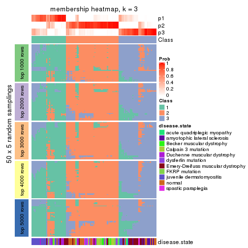</p>

</div>
<div id='tab-MAD-NMF-membership-heatmap-3'>
<pre><code class="r">membership_heatmap(res, k = 4)
</code></pre>

<p></p>

</div>
<div id='tab-MAD-NMF-membership-heatmap-4'>
<pre><code class="r">membership_heatmap(res, k = 5)
</code></pre>

<p></p>

</div>
<div id='tab-MAD-NMF-membership-heatmap-5'>
<pre><code class="r">membership_heatmap(res, k = 6)
</code></pre>

<p></p>

</div>
</div>

As soon as we have had the classes for columns, we can look for signatures
which are significantly different between classes which can be candidate marks
for certain classes. Following are the heatmaps for signatures.


Signature heatmaps where rows are scaled:


<script>
$( function() {
	$( '#tabs-MAD-NMF-get-signatures' ).tabs();
} );
</script>
<div id='tabs-MAD-NMF-get-signatures'>
<ul>
<li><a href='#tab-MAD-NMF-get-signatures-1'>k = 2</a></li>
<li><a href='#tab-MAD-NMF-get-signatures-2'>k = 3</a></li>
<li><a href='#tab-MAD-NMF-get-signatures-3'>k = 4</a></li>
<li><a href='#tab-MAD-NMF-get-signatures-4'>k = 5</a></li>
<li><a href='#tab-MAD-NMF-get-signatures-5'>k = 6</a></li>
</ul>
<div id='tab-MAD-NMF-get-signatures-1'>
<pre><code class="r">get_signatures(res, k = 2)
</code></pre>

<p></p>

</div>
<div id='tab-MAD-NMF-get-signatures-2'>
<pre><code class="r">get_signatures(res, k = 3)
</code></pre>

<p></p>

</div>
<div id='tab-MAD-NMF-get-signatures-3'>
<pre><code class="r">get_signatures(res, k = 4)
</code></pre>

<p></p>

</div>
<div id='tab-MAD-NMF-get-signatures-4'>
<pre><code class="r">get_signatures(res, k = 5)
</code></pre>

<p></p>

</div>
<div id='tab-MAD-NMF-get-signatures-5'>
<pre><code class="r">get_signatures(res, k = 6)
</code></pre>

<p></p>

</div>
</div>


Signature heatmaps where rows are not scaled:


<script>
$( function() {
	$( '#tabs-MAD-NMF-get-signatures-no-scale' ).tabs();
} );
</script>
<div id='tabs-MAD-NMF-get-signatures-no-scale'>
<ul>
<li><a href='#tab-MAD-NMF-get-signatures-no-scale-1'>k = 2</a></li>
<li><a href='#tab-MAD-NMF-get-signatures-no-scale-2'>k = 3</a></li>
<li><a href='#tab-MAD-NMF-get-signatures-no-scale-3'>k = 4</a></li>
<li><a href='#tab-MAD-NMF-get-signatures-no-scale-4'>k = 5</a></li>
<li><a href='#tab-MAD-NMF-get-signatures-no-scale-5'>k = 6</a></li>
</ul>
<div id='tab-MAD-NMF-get-signatures-no-scale-1'>
<pre><code class="r">get_signatures(res, k = 2, scale_rows = FALSE)
</code></pre>

<p></p>

</div>
<div id='tab-MAD-NMF-get-signatures-no-scale-2'>
<pre><code class="r">get_signatures(res, k = 3, scale_rows = FALSE)
</code></pre>

<p></p>

</div>
<div id='tab-MAD-NMF-get-signatures-no-scale-3'>
<pre><code class="r">get_signatures(res, k = 4, scale_rows = FALSE)
</code></pre>

<p></p>

</div>
<div id='tab-MAD-NMF-get-signatures-no-scale-4'>
<pre><code class="r">get_signatures(res, k = 5, scale_rows = FALSE)
</code></pre>

<p></p>

</div>
<div id='tab-MAD-NMF-get-signatures-no-scale-5'>
<pre><code class="r">get_signatures(res, k = 6, scale_rows = FALSE)
</code></pre>

<p></p>

</div>
</div>


Compare the overlap of signatures from different k:

```r
compare_signatures(res)
```


`get_signature()` returns a data frame invisibly. TO get the list of signatures, the function
call should be assigned to a variable explicitly. In following code, if `plot` argument is set
to `FALSE`, no heatmap is plotted while only the differential analysis is performed.

```r
# code only for demonstration
tb = get_signature(res, k = ..., plot = FALSE)
```

An example of the output of `tb` is:

```
#>   which_row         fdr    mean_1    mean_2 scaled_mean_1 scaled_mean_2 km
#> 1        38 0.042760348  8.373488  9.131774    -0.5533452     0.5164555  1
#> 2        40 0.018707592  7.106213  8.469186    -0.6173731     0.5762149  1
#> 3        55 0.019134737 10.221463 11.207825    -0.6159697     0.5749050  1
#> 4        59 0.006059896  5.921854  7.869574    -0.6899429     0.6439467  1
#> 5        60 0.018055526  8.928898 10.211722    -0.6204761     0.5791110  1
#> 6        98 0.009384629 15.714769 14.887706     0.6635654    -0.6193277  2
...
```

The columns in `tb` are:

1. `which_row`: row indices corresponding to the input matrix.
2. `fdr`: FDR for the differential test. 
3. `mean_x`: The mean value in group x.
4. `scaled_mean_x`: The mean value in group x after rows are scaled.
5. `km`: Row groups if k-means clustering is applied to rows.


UMAP plot which shows how samples are separated.


<script>
$( function() {
	$( '#tabs-MAD-NMF-dimension-reduction' ).tabs();
} );
</script>
<div id='tabs-MAD-NMF-dimension-reduction'>
<ul>
<li><a href='#tab-MAD-NMF-dimension-reduction-1'>k = 2</a></li>
<li><a href='#tab-MAD-NMF-dimension-reduction-2'>k = 3</a></li>
<li><a href='#tab-MAD-NMF-dimension-reduction-3'>k = 4</a></li>
<li><a href='#tab-MAD-NMF-dimension-reduction-4'>k = 5</a></li>
<li><a href='#tab-MAD-NMF-dimension-reduction-5'>k = 6</a></li>
</ul>
<div id='tab-MAD-NMF-dimension-reduction-1'>
<pre><code class="r">dimension_reduction(res, k = 2, method = &quot;UMAP&quot;)
</code></pre>

<p></p>

</div>
<div id='tab-MAD-NMF-dimension-reduction-2'>
<pre><code class="r">dimension_reduction(res, k = 3, method = &quot;UMAP&quot;)
</code></pre>

<p></p>

</div>
<div id='tab-MAD-NMF-dimension-reduction-3'>
<pre><code class="r">dimension_reduction(res, k = 4, method = &quot;UMAP&quot;)
</code></pre>

<p></p>

</div>
<div id='tab-MAD-NMF-dimension-reduction-4'>
<pre><code class="r">dimension_reduction(res, k = 5, method = &quot;UMAP&quot;)
</code></pre>

<p></p>

</div>
<div id='tab-MAD-NMF-dimension-reduction-5'>
<pre><code class="r">dimension_reduction(res, k = 6, method = &quot;UMAP&quot;)
</code></pre>

<p></p>

</div>
</div>


Following heatmap shows how subgroups are split when increasing `k`:

```r
collect_classes(res)
```


Test correlation between subgroups and known annotations. If the known
annotation is numeric, one-way ANOVA test is applied, and if the known
annotation is discrete, chi-squared contingency table test is applied.

```r
test_to_known_factors(res)
```

```
#>           n disease.state(p) k
#> MAD:NMF 114         2.75e-09 2
#> MAD:NMF  99         8.65e-13 3
#> MAD:NMF  77         2.66e-14 4
#> MAD:NMF  69         1.15e-15 5
#> MAD:NMF  88         5.75e-29 6
```


If matrix rows can be associated to genes, consider to use `functional_enrichment(res,
...)` to perform function enrichment for the signature genes. See [this vignette](http://bioconductor.org/packages/devel/bioc/vignettes/cola/inst/doc/functional_enrichment.html) for more detailed explanations.


 

---------------------------------------------------


### ATC:hclust


The object with results only for a single top-value method and a single partition method 
can be extracted as:

```r
res = res_list["ATC", "hclust"]
# you can also extract it by
# res = res_list["ATC:hclust"]
```

A summary of `res` and all the functions that can be applied to it:

```r
res
```

```
#> A 'ConsensusPartition' object with k = 2, 3, 4, 5, 6.
#>   On a matrix with 21512 rows and 119 columns.
#>   Top rows (1000, 2000, 3000, 4000, 5000) are extracted by 'ATC' method.
#>   Subgroups are detected by 'hclust' method.
#>   Performed in total 1250 partitions by row resampling.
#>   Best k for subgroups seems to be 2.
#> 
#> Following methods can be applied to this 'ConsensusPartition' object:
#>  [1] "cola_report"             "collect_classes"         "collect_plots"          
#>  [4] "collect_stats"           "colnames"                "compare_signatures"     
#>  [7] "consensus_heatmap"       "dimension_reduction"     "functional_enrichment"  
#> [10] "get_anno_col"            "get_anno"                "get_classes"            
#> [13] "get_consensus"           "get_matrix"              "get_membership"         
#> [16] "get_param"               "get_signatures"          "get_stats"              
#> [19] "is_best_k"               "is_stable_k"             "membership_heatmap"     
#> [22] "ncol"                    "nrow"                    "plot_ecdf"              
#> [25] "rownames"                "select_partition_number" "show"                   
#> [28] "suggest_best_k"          "test_to_known_factors"
```

`collect_plots()` function collects all the plots made from `res` for all `k` (number of partitions)
into one single page to provide an easy and fast comparison between different `k`.

```r
collect_plots(res)
```


The plots are:

- The first row: a plot of the ECDF (empirical cumulative distribution
  function) curves of the consensus matrix for each `k` and the heatmap of
  predicted classes for each `k`.
- The second row: heatmaps of the consensus matrix for each `k`.
- The third row: heatmaps of the membership matrix for each `k`.
- The fouth row: heatmaps of the signatures for each `k`.

All the plots in panels can be made by individual functions and they are
plotted later in this section.

`select_partition_number()` produces several plots showing different
statistics for choosing "optimized" `k`. There are following statistics:

- ECDF curves of the consensus matrix for each `k`;
- 1-PAC. [The PAC
  score](https://en.wikipedia.org/wiki/Consensus_clustering#Over-interpretation_potential_of_consensus_clustering)
  measures the proportion of the ambiguous subgrouping.
- Mean silhouette score.
- Concordance. The mean probability of fiting the consensus class ids in all
  partitions.
- Area increased. Denote $A_k$ as the area under the ECDF curve for current
  `k`, the area increased is defined as $A_k - A_{k-1}$.
- Rand index. The percent of pairs of samples that are both in a same cluster
  or both are not in a same cluster in the partition of k and k-1.
- Jaccard index. The ratio of pairs of samples are both in a same cluster in
  the partition of k and k-1 and the pairs of samples are both in a same
  cluster in the partition k or k-1.

The detailed explanations of these statistics can be found in [the _cola_
vignette](http://bioconductor.org/packages/devel/bioc/vignettes/cola/inst/doc/cola.html#toc_13).

Generally speaking, lower PAC score, higher mean silhouette score or higher
concordance corresponds to better partition. Rand index and Jaccard index
measure how similar the current partition is compared to partition with `k-1`.
If they are too similar, we won't accept `k` is better than `k-1`.

```r
select_partition_number(res)
```


The numeric values for all these statistics can be obtained by `get_stats()`.

```r
get_stats(res)
```

```
#>   k 1-PAC mean_silhouette concordance area_increased  Rand Jaccard
#> 2 2 0.513           0.799       0.906         0.4789 0.498   0.498
#> 3 3 0.645           0.678       0.860         0.3471 0.774   0.573
#> 4 4 0.602           0.599       0.779         0.1002 0.805   0.513
#> 5 5 0.590           0.641       0.733         0.0401 0.901   0.671
#> 6 6 0.676           0.643       0.789         0.0568 0.923   0.712
```

`suggest_best_k()` suggests the best $k$ based on these statistics. The rules are as follows:

- All $k$ with Jaccard index larger than 0.95 are removed because increasing
  $k$ does not provide enough extra information. If all $k$ are removed, it is
  marked as no subgroup is detected.
- For all $k$ with 1-PAC score larger than 0.9, the maximal $k$ is taken as
  the best $k$, and other $k$ are marked as optional $k$.
- If it does not fit the second rule. The $k$ with the maximal vote of the
  highest 1-PAC score, highest mean silhouette, and highest concordance is
  taken as the best $k$.

```r
suggest_best_k(res)
```

```
#> [1] 2
```


Following shows the table of the partitions (You need to click the **show/hide
code output** link to see it). The membership matrix (columns with name `p*`)
is inferred by
[`clue::cl_consensus()`](https://www.rdocumentation.org/link/cl_consensus?package=clue)
function with the `SE` method. Basically the value in the membership matrix
represents the probability to belong to a certain group. The finall class
label for an item is determined with the group with highest probability it
belongs to.

In `get_classes()` function, the entropy is calculated from the membership
matrix and the silhouette score is calculated from the consensus matrix.


<script>
$( function() {
	$( '#tabs-ATC-hclust-get-classes' ).tabs();
} );
</script>
<div id='tabs-ATC-hclust-get-classes'>
<ul>
<li><a href='#tab-ATC-hclust-get-classes-1'>k = 2</a></li>
<li><a href='#tab-ATC-hclust-get-classes-2'>k = 3</a></li>
<li><a href='#tab-ATC-hclust-get-classes-3'>k = 4</a></li>
<li><a href='#tab-ATC-hclust-get-classes-4'>k = 5</a></li>
<li><a href='#tab-ATC-hclust-get-classes-5'>k = 6</a></li>
</ul>

<div id='tab-ATC-hclust-get-classes-1'>
<p><a id='tab-ATC-hclust-get-classes-1-a' style='color:#0366d6' href='#'>show/hide code output</a></p>
<pre><code class="r">cbind(get_classes(res, k = 2), get_membership(res, k = 2))
</code></pre>

<pre><code>#&gt;           class entropy silhouette    p1    p2
#&gt; GSM120719     1  0.0000     0.9249 1.000 0.000
#&gt; GSM120720     1  0.0000     0.9249 1.000 0.000
#&gt; GSM120765     2  0.0000     0.8512 0.000 1.000
#&gt; GSM120767     2  0.0000     0.8512 0.000 1.000
#&gt; GSM120784     2  0.0000     0.8512 0.000 1.000
#&gt; GSM121400     2  0.9754     0.4683 0.408 0.592
#&gt; GSM121401     1  0.9866     0.0983 0.568 0.432
#&gt; GSM121402     2  0.0376     0.8506 0.004 0.996
#&gt; GSM121403     2  0.9552     0.5419 0.376 0.624
#&gt; GSM121404     2  0.7950     0.7120 0.240 0.760
#&gt; GSM121405     1  0.9866     0.0983 0.568 0.432
#&gt; GSM121406     2  0.0000     0.8512 0.000 1.000
#&gt; GSM121408     2  0.0000     0.8512 0.000 1.000
#&gt; GSM121409     2  0.9754     0.4683 0.408 0.592
#&gt; GSM121410     2  0.9552     0.5419 0.376 0.624
#&gt; GSM121412     2  0.0000     0.8512 0.000 1.000
#&gt; GSM121413     2  0.0000     0.8512 0.000 1.000
#&gt; GSM121414     2  0.0000     0.8512 0.000 1.000
#&gt; GSM121415     2  0.0000     0.8512 0.000 1.000
#&gt; GSM121416     2  0.2236     0.8418 0.036 0.964
#&gt; GSM120591     1  0.0000     0.9249 1.000 0.000
#&gt; GSM120594     1  0.0000     0.9249 1.000 0.000
#&gt; GSM120718     1  0.0000     0.9249 1.000 0.000
#&gt; GSM121205     1  0.0000     0.9249 1.000 0.000
#&gt; GSM121206     1  0.0000     0.9249 1.000 0.000
#&gt; GSM121207     1  0.0000     0.9249 1.000 0.000
#&gt; GSM121208     1  0.0000     0.9249 1.000 0.000
#&gt; GSM121209     1  0.0000     0.9249 1.000 0.000
#&gt; GSM121210     1  0.0000     0.9249 1.000 0.000
#&gt; GSM121211     1  0.0000     0.9249 1.000 0.000
#&gt; GSM121212     1  0.0000     0.9249 1.000 0.000
#&gt; GSM121213     1  0.0000     0.9249 1.000 0.000
#&gt; GSM121214     1  0.0000     0.9249 1.000 0.000
#&gt; GSM121215     1  0.0000     0.9249 1.000 0.000
#&gt; GSM121216     1  0.0000     0.9249 1.000 0.000
#&gt; GSM121217     1  0.0000     0.9249 1.000 0.000
#&gt; GSM121218     1  0.0000     0.9249 1.000 0.000
#&gt; GSM121234     1  0.0000     0.9249 1.000 0.000
#&gt; GSM121243     1  0.0000     0.9249 1.000 0.000
#&gt; GSM121245     1  0.0000     0.9249 1.000 0.000
#&gt; GSM121246     1  0.0000     0.9249 1.000 0.000
#&gt; GSM121247     1  0.0000     0.9249 1.000 0.000
#&gt; GSM121248     1  0.0000     0.9249 1.000 0.000
#&gt; GSM120744     1  0.6973     0.7415 0.812 0.188
#&gt; GSM120745     1  0.4690     0.8533 0.900 0.100
#&gt; GSM120746     1  0.4939     0.8457 0.892 0.108
#&gt; GSM120747     1  0.9580     0.2929 0.620 0.380
#&gt; GSM120748     1  0.9580     0.2929 0.620 0.380
#&gt; GSM120749     1  0.4939     0.8457 0.892 0.108
#&gt; GSM120750     1  0.4939     0.8457 0.892 0.108
#&gt; GSM120751     1  0.4939     0.8457 0.892 0.108
#&gt; GSM120752     1  0.4690     0.8533 0.900 0.100
#&gt; GSM121336     2  0.0000     0.8512 0.000 1.000
#&gt; GSM121339     2  0.9522     0.5485 0.372 0.628
#&gt; GSM121349     2  0.0000     0.8512 0.000 1.000
#&gt; GSM121355     2  0.0000     0.8512 0.000 1.000
#&gt; GSM120757     1  0.4022     0.8701 0.920 0.080
#&gt; GSM120766     1  0.7056     0.7353 0.808 0.192
#&gt; GSM120770     2  0.9393     0.5729 0.356 0.644
#&gt; GSM120779     1  0.0000     0.9249 1.000 0.000
#&gt; GSM120780     1  0.7056     0.7353 0.808 0.192
#&gt; GSM121102     2  0.9393     0.5717 0.356 0.644
#&gt; GSM121203     1  0.8016     0.6423 0.756 0.244
#&gt; GSM121204     1  0.0000     0.9249 1.000 0.000
#&gt; GSM121330     1  0.1633     0.9112 0.976 0.024
#&gt; GSM121335     1  0.0000     0.9249 1.000 0.000
#&gt; GSM121337     2  0.7528     0.7302 0.216 0.784
#&gt; GSM121338     2  0.8016     0.7064 0.244 0.756
#&gt; GSM121341     1  0.0000     0.9249 1.000 0.000
#&gt; GSM121342     1  0.0000     0.9249 1.000 0.000
#&gt; GSM121343     2  0.8016     0.7064 0.244 0.756
#&gt; GSM121344     1  0.0000     0.9249 1.000 0.000
#&gt; GSM121346     1  0.0376     0.9230 0.996 0.004
#&gt; GSM121347     2  0.8016     0.7064 0.244 0.756
#&gt; GSM121348     2  0.2423     0.8406 0.040 0.960
#&gt; GSM121350     1  0.0938     0.9185 0.988 0.012
#&gt; GSM121352     1  0.0000     0.9249 1.000 0.000
#&gt; GSM121354     1  0.0376     0.9230 0.996 0.004
#&gt; GSM120753     2  0.0000     0.8512 0.000 1.000
#&gt; GSM120761     2  0.0000     0.8512 0.000 1.000
#&gt; GSM120768     2  0.0000     0.8512 0.000 1.000
#&gt; GSM120781     2  0.0000     0.8512 0.000 1.000
#&gt; GSM120788     2  0.9580     0.5338 0.380 0.620
#&gt; GSM120760     2  0.0000     0.8512 0.000 1.000
#&gt; GSM120763     2  0.0000     0.8512 0.000 1.000
#&gt; GSM120764     2  0.9552     0.5419 0.376 0.624
#&gt; GSM120777     2  0.9552     0.5419 0.376 0.624
#&gt; GSM120786     2  0.4815     0.8113 0.104 0.896
#&gt; GSM121329     1  0.5059     0.8420 0.888 0.112
#&gt; GSM121331     1  0.0000     0.9249 1.000 0.000
#&gt; GSM121333     1  0.0000     0.9249 1.000 0.000
#&gt; GSM121345     1  0.0000     0.9249 1.000 0.000
#&gt; GSM121356     1  0.0000     0.9249 1.000 0.000
#&gt; GSM120754     2  0.9552     0.5419 0.376 0.624
#&gt; GSM120759     2  0.0000     0.8512 0.000 1.000
#&gt; GSM120762     2  0.0000     0.8512 0.000 1.000
#&gt; GSM120775     2  0.9552     0.5419 0.376 0.624
#&gt; GSM120776     2  0.9580     0.5338 0.380 0.620
#&gt; GSM120782     2  0.9552     0.5419 0.376 0.624
#&gt; GSM120789     2  0.0000     0.8512 0.000 1.000
#&gt; GSM120790     2  0.0000     0.8512 0.000 1.000
#&gt; GSM120791     2  0.1633     0.8455 0.024 0.976
#&gt; GSM120755     2  0.0000     0.8512 0.000 1.000
#&gt; GSM120756     2  0.9580     0.5338 0.380 0.620
#&gt; GSM120769     2  0.0000     0.8512 0.000 1.000
#&gt; GSM120778     2  0.0000     0.8512 0.000 1.000
#&gt; GSM120792     2  0.4815     0.8113 0.104 0.896
#&gt; GSM121332     2  0.0672     0.8495 0.008 0.992
#&gt; GSM121334     2  0.0000     0.8512 0.000 1.000
#&gt; GSM121340     2  0.9358     0.5785 0.352 0.648
#&gt; GSM121351     2  0.0000     0.8512 0.000 1.000
#&gt; GSM121353     2  0.3733     0.8280 0.072 0.928
#&gt; GSM120758     2  0.0000     0.8512 0.000 1.000
#&gt; GSM120771     2  0.0000     0.8512 0.000 1.000
#&gt; GSM120772     2  0.0376     0.8506 0.004 0.996
#&gt; GSM120773     2  0.5519     0.7979 0.128 0.872
#&gt; GSM120774     2  0.0376     0.8506 0.004 0.996
#&gt; GSM120783     2  0.5519     0.7979 0.128 0.872
#&gt; GSM120787     2  0.0000     0.8512 0.000 1.000
</code></pre>

<script>
$('#tab-ATC-hclust-get-classes-1-a').parent().next().next().hide();
$('#tab-ATC-hclust-get-classes-1-a').click(function(){
  $('#tab-ATC-hclust-get-classes-1-a').parent().next().next().toggle();
  return(false);
});
</script>
</div>

<div id='tab-ATC-hclust-get-classes-2'>
<p><a id='tab-ATC-hclust-get-classes-2-a' style='color:#0366d6' href='#'>show/hide code output</a></p>
<pre><code class="r">cbind(get_classes(res, k = 3), get_membership(res, k = 3))
</code></pre>

<pre><code>#&gt;           class entropy silhouette    p1    p2    p3
#&gt; GSM120719     1  0.0000     0.9149 1.000 0.000 0.000
#&gt; GSM120720     1  0.0000     0.9149 1.000 0.000 0.000
#&gt; GSM120765     2  0.2261     0.7518 0.000 0.932 0.068
#&gt; GSM120767     2  0.2959     0.7520 0.000 0.900 0.100
#&gt; GSM120784     2  0.2959     0.7520 0.000 0.900 0.100
#&gt; GSM121400     3  0.1289     0.7112 0.032 0.000 0.968
#&gt; GSM121401     3  0.4702     0.6048 0.212 0.000 0.788
#&gt; GSM121402     2  0.6225     0.5133 0.000 0.568 0.432
#&gt; GSM121403     3  0.0000     0.7201 0.000 0.000 1.000
#&gt; GSM121404     3  0.4121     0.5888 0.000 0.168 0.832
#&gt; GSM121405     3  0.4702     0.6048 0.212 0.000 0.788
#&gt; GSM121406     2  0.0000     0.7460 0.000 1.000 0.000
#&gt; GSM121408     2  0.4291     0.7373 0.000 0.820 0.180
#&gt; GSM121409     3  0.1289     0.7118 0.032 0.000 0.968
#&gt; GSM121410     3  0.0000     0.7201 0.000 0.000 1.000
#&gt; GSM121412     2  0.0000     0.7460 0.000 1.000 0.000
#&gt; GSM121413     2  0.0000     0.7460 0.000 1.000 0.000
#&gt; GSM121414     2  0.0000     0.7460 0.000 1.000 0.000
#&gt; GSM121415     2  0.6140     0.5538 0.000 0.596 0.404
#&gt; GSM121416     3  0.6095    -0.0260 0.000 0.392 0.608
#&gt; GSM120591     1  0.0000     0.9149 1.000 0.000 0.000
#&gt; GSM120594     1  0.0000     0.9149 1.000 0.000 0.000
#&gt; GSM120718     1  0.0000     0.9149 1.000 0.000 0.000
#&gt; GSM121205     1  0.0000     0.9149 1.000 0.000 0.000
#&gt; GSM121206     1  0.0000     0.9149 1.000 0.000 0.000
#&gt; GSM121207     1  0.0000     0.9149 1.000 0.000 0.000
#&gt; GSM121208     1  0.0000     0.9149 1.000 0.000 0.000
#&gt; GSM121209     1  0.0000     0.9149 1.000 0.000 0.000
#&gt; GSM121210     1  0.0000     0.9149 1.000 0.000 0.000
#&gt; GSM121211     1  0.0000     0.9149 1.000 0.000 0.000
#&gt; GSM121212     1  0.0000     0.9149 1.000 0.000 0.000
#&gt; GSM121213     1  0.0000     0.9149 1.000 0.000 0.000
#&gt; GSM121214     1  0.0000     0.9149 1.000 0.000 0.000
#&gt; GSM121215     1  0.0000     0.9149 1.000 0.000 0.000
#&gt; GSM121216     1  0.0000     0.9149 1.000 0.000 0.000
#&gt; GSM121217     1  0.0000     0.9149 1.000 0.000 0.000
#&gt; GSM121218     1  0.0000     0.9149 1.000 0.000 0.000
#&gt; GSM121234     1  0.0000     0.9149 1.000 0.000 0.000
#&gt; GSM121243     1  0.0000     0.9149 1.000 0.000 0.000
#&gt; GSM121245     1  0.0000     0.9149 1.000 0.000 0.000
#&gt; GSM121246     1  0.0000     0.9149 1.000 0.000 0.000
#&gt; GSM121247     1  0.0000     0.9149 1.000 0.000 0.000
#&gt; GSM121248     1  0.0000     0.9149 1.000 0.000 0.000
#&gt; GSM120744     3  0.6274     0.0387 0.456 0.000 0.544
#&gt; GSM120745     1  0.6274     0.2306 0.544 0.000 0.456
#&gt; GSM120746     1  0.6286     0.2064 0.536 0.000 0.464
#&gt; GSM120747     3  0.5216     0.5465 0.260 0.000 0.740
#&gt; GSM120748     3  0.5216     0.5465 0.260 0.000 0.740
#&gt; GSM120749     1  0.6286     0.2064 0.536 0.000 0.464
#&gt; GSM120750     1  0.6286     0.2064 0.536 0.000 0.464
#&gt; GSM120751     1  0.6286     0.2064 0.536 0.000 0.464
#&gt; GSM120752     1  0.6274     0.2306 0.544 0.000 0.456
#&gt; GSM121336     2  0.0000     0.7460 0.000 1.000 0.000
#&gt; GSM121339     3  0.0237     0.7190 0.000 0.004 0.996
#&gt; GSM121349     2  0.0000     0.7460 0.000 1.000 0.000
#&gt; GSM121355     2  0.0000     0.7460 0.000 1.000 0.000
#&gt; GSM120757     1  0.6079     0.3883 0.612 0.000 0.388
#&gt; GSM120766     3  0.6267     0.0552 0.452 0.000 0.548
#&gt; GSM120770     3  0.1289     0.7084 0.000 0.032 0.968
#&gt; GSM120779     1  0.0000     0.9149 1.000 0.000 0.000
#&gt; GSM120780     3  0.6267     0.0552 0.452 0.000 0.548
#&gt; GSM121102     3  0.1860     0.6999 0.000 0.052 0.948
#&gt; GSM121203     3  0.6126     0.2221 0.400 0.000 0.600
#&gt; GSM121204     1  0.0000     0.9149 1.000 0.000 0.000
#&gt; GSM121330     1  0.2537     0.8475 0.920 0.000 0.080
#&gt; GSM121335     1  0.0000     0.9149 1.000 0.000 0.000
#&gt; GSM121337     3  0.5098     0.4776 0.000 0.248 0.752
#&gt; GSM121338     3  0.3752     0.6159 0.000 0.144 0.856
#&gt; GSM121341     1  0.0000     0.9149 1.000 0.000 0.000
#&gt; GSM121342     1  0.0000     0.9149 1.000 0.000 0.000
#&gt; GSM121343     3  0.3752     0.6159 0.000 0.144 0.856
#&gt; GSM121344     1  0.0000     0.9149 1.000 0.000 0.000
#&gt; GSM121346     1  0.0237     0.9124 0.996 0.000 0.004
#&gt; GSM121347     3  0.3752     0.6159 0.000 0.144 0.856
#&gt; GSM121348     2  0.4504     0.6905 0.000 0.804 0.196
#&gt; GSM121350     1  0.1031     0.8969 0.976 0.000 0.024
#&gt; GSM121352     1  0.0000     0.9149 1.000 0.000 0.000
#&gt; GSM121354     1  0.0237     0.9124 0.996 0.000 0.004
#&gt; GSM120753     2  0.6045     0.6252 0.000 0.620 0.380
#&gt; GSM120761     2  0.5835     0.6662 0.000 0.660 0.340
#&gt; GSM120768     2  0.6062     0.6200 0.000 0.616 0.384
#&gt; GSM120781     2  0.0424     0.7471 0.000 0.992 0.008
#&gt; GSM120788     3  0.0237     0.7201 0.004 0.000 0.996
#&gt; GSM120760     2  0.6126     0.5943 0.000 0.600 0.400
#&gt; GSM120763     2  0.6126     0.5943 0.000 0.600 0.400
#&gt; GSM120764     3  0.0000     0.7201 0.000 0.000 1.000
#&gt; GSM120777     3  0.0000     0.7201 0.000 0.000 1.000
#&gt; GSM120786     3  0.5988     0.0996 0.000 0.368 0.632
#&gt; GSM121329     1  0.4887     0.6695 0.772 0.000 0.228
#&gt; GSM121331     1  0.0237     0.9126 0.996 0.000 0.004
#&gt; GSM121333     1  0.0000     0.9149 1.000 0.000 0.000
#&gt; GSM121345     1  0.0237     0.9126 0.996 0.000 0.004
#&gt; GSM121356     1  0.0237     0.9126 0.996 0.000 0.004
#&gt; GSM120754     3  0.0000     0.7201 0.000 0.000 1.000
#&gt; GSM120759     2  0.0000     0.7460 0.000 1.000 0.000
#&gt; GSM120762     2  0.0000     0.7460 0.000 1.000 0.000
#&gt; GSM120775     3  0.0000     0.7201 0.000 0.000 1.000
#&gt; GSM120776     3  0.0237     0.7201 0.004 0.000 0.996
#&gt; GSM120782     3  0.0000     0.7201 0.000 0.000 1.000
#&gt; GSM120789     2  0.5497     0.6980 0.000 0.708 0.292
#&gt; GSM120790     2  0.0000     0.7460 0.000 1.000 0.000
#&gt; GSM120791     3  0.6154    -0.0925 0.000 0.408 0.592
#&gt; GSM120755     2  0.5591     0.6934 0.000 0.696 0.304
#&gt; GSM120756     3  0.0237     0.7201 0.004 0.000 0.996
#&gt; GSM120769     2  0.0000     0.7460 0.000 1.000 0.000
#&gt; GSM120778     2  0.5706     0.6844 0.000 0.680 0.320
#&gt; GSM120792     3  0.5968     0.1158 0.000 0.364 0.636
#&gt; GSM121332     2  0.5905     0.6370 0.000 0.648 0.352
#&gt; GSM121334     2  0.5785     0.6736 0.000 0.668 0.332
#&gt; GSM121340     3  0.1529     0.7045 0.000 0.040 0.960
#&gt; GSM121351     2  0.0000     0.7460 0.000 1.000 0.000
#&gt; GSM121353     3  0.5733     0.2131 0.000 0.324 0.676
#&gt; GSM120758     2  0.6045     0.6252 0.000 0.620 0.380
#&gt; GSM120771     2  0.5591     0.6927 0.000 0.696 0.304
#&gt; GSM120772     2  0.6045     0.6263 0.000 0.620 0.380
#&gt; GSM120773     3  0.5733     0.2496 0.000 0.324 0.676
#&gt; GSM120774     2  0.6267     0.4879 0.000 0.548 0.452
#&gt; GSM120783     3  0.5733     0.2496 0.000 0.324 0.676
#&gt; GSM120787     2  0.6192     0.5583 0.000 0.580 0.420
</code></pre>

<script>
$('#tab-ATC-hclust-get-classes-2-a').parent().next().next().hide();
$('#tab-ATC-hclust-get-classes-2-a').click(function(){
  $('#tab-ATC-hclust-get-classes-2-a').parent().next().next().toggle();
  return(false);
});
</script>
</div>

<div id='tab-ATC-hclust-get-classes-3'>
<p><a id='tab-ATC-hclust-get-classes-3-a' style='color:#0366d6' href='#'>show/hide code output</a></p>
<pre><code class="r">cbind(get_classes(res, k = 4), get_membership(res, k = 4))
</code></pre>

<pre><code>#&gt;           class entropy silhouette    p1    p2    p3    p4
#&gt; GSM120719     1  0.2281    0.90934 0.904 0.000 0.096 0.000
#&gt; GSM120720     1  0.2281    0.90934 0.904 0.000 0.096 0.000
#&gt; GSM120765     2  0.4564    0.62022 0.000 0.672 0.000 0.328
#&gt; GSM120767     2  0.4746    0.55819 0.000 0.632 0.000 0.368
#&gt; GSM120784     2  0.4746    0.55819 0.000 0.632 0.000 0.368
#&gt; GSM121400     3  0.4776    0.23613 0.000 0.000 0.624 0.376
#&gt; GSM121401     3  0.5147    0.51451 0.060 0.000 0.740 0.200
#&gt; GSM121402     4  0.3925    0.48869 0.000 0.176 0.016 0.808
#&gt; GSM121403     3  0.4877    0.16341 0.000 0.000 0.592 0.408
#&gt; GSM121404     4  0.4883    0.40916 0.000 0.016 0.288 0.696
#&gt; GSM121405     3  0.5147    0.51451 0.060 0.000 0.740 0.200
#&gt; GSM121406     2  0.0188    0.80822 0.000 0.996 0.000 0.004
#&gt; GSM121408     2  0.5183    0.43147 0.000 0.584 0.008 0.408
#&gt; GSM121409     3  0.4761    0.23752 0.000 0.000 0.628 0.372
#&gt; GSM121410     3  0.4877    0.16341 0.000 0.000 0.592 0.408
#&gt; GSM121412     2  0.0188    0.80822 0.000 0.996 0.000 0.004
#&gt; GSM121413     2  0.0188    0.80822 0.000 0.996 0.000 0.004
#&gt; GSM121414     2  0.0188    0.80822 0.000 0.996 0.000 0.004
#&gt; GSM121415     4  0.4214    0.44481 0.000 0.204 0.016 0.780
#&gt; GSM121416     4  0.2256    0.58510 0.000 0.020 0.056 0.924
#&gt; GSM120591     1  0.2281    0.90934 0.904 0.000 0.096 0.000
#&gt; GSM120594     1  0.2281    0.90934 0.904 0.000 0.096 0.000
#&gt; GSM120718     1  0.2281    0.90934 0.904 0.000 0.096 0.000
#&gt; GSM121205     1  0.0000    0.92557 1.000 0.000 0.000 0.000
#&gt; GSM121206     1  0.0000    0.92557 1.000 0.000 0.000 0.000
#&gt; GSM121207     1  0.0000    0.92557 1.000 0.000 0.000 0.000
#&gt; GSM121208     1  0.0188    0.92566 0.996 0.000 0.004 0.000
#&gt; GSM121209     1  0.0000    0.92557 1.000 0.000 0.000 0.000
#&gt; GSM121210     1  0.0000    0.92557 1.000 0.000 0.000 0.000
#&gt; GSM121211     1  0.0000    0.92557 1.000 0.000 0.000 0.000
#&gt; GSM121212     1  0.0000    0.92557 1.000 0.000 0.000 0.000
#&gt; GSM121213     1  0.0000    0.92557 1.000 0.000 0.000 0.000
#&gt; GSM121214     1  0.0000    0.92557 1.000 0.000 0.000 0.000
#&gt; GSM121215     1  0.0000    0.92557 1.000 0.000 0.000 0.000
#&gt; GSM121216     1  0.1022    0.92232 0.968 0.000 0.032 0.000
#&gt; GSM121217     1  0.0000    0.92557 1.000 0.000 0.000 0.000
#&gt; GSM121218     1  0.0000    0.92557 1.000 0.000 0.000 0.000
#&gt; GSM121234     1  0.0000    0.92557 1.000 0.000 0.000 0.000
#&gt; GSM121243     1  0.0000    0.92557 1.000 0.000 0.000 0.000
#&gt; GSM121245     1  0.0000    0.92557 1.000 0.000 0.000 0.000
#&gt; GSM121246     1  0.0000    0.92557 1.000 0.000 0.000 0.000
#&gt; GSM121247     1  0.0000    0.92557 1.000 0.000 0.000 0.000
#&gt; GSM121248     1  0.0000    0.92557 1.000 0.000 0.000 0.000
#&gt; GSM120744     3  0.4262    0.63634 0.236 0.000 0.756 0.008
#&gt; GSM120745     3  0.4564    0.54024 0.328 0.000 0.672 0.000
#&gt; GSM120746     3  0.4500    0.55826 0.316 0.000 0.684 0.000
#&gt; GSM120747     3  0.5186    0.55640 0.084 0.000 0.752 0.164
#&gt; GSM120748     3  0.5186    0.55640 0.084 0.000 0.752 0.164
#&gt; GSM120749     3  0.4500    0.55826 0.316 0.000 0.684 0.000
#&gt; GSM120750     3  0.4500    0.55826 0.316 0.000 0.684 0.000
#&gt; GSM120751     3  0.4500    0.55826 0.316 0.000 0.684 0.000
#&gt; GSM120752     3  0.4564    0.54024 0.328 0.000 0.672 0.000
#&gt; GSM121336     2  0.0000    0.80678 0.000 1.000 0.000 0.000
#&gt; GSM121339     3  0.4977    0.06345 0.000 0.000 0.540 0.460
#&gt; GSM121349     2  0.0000    0.80678 0.000 1.000 0.000 0.000
#&gt; GSM121355     2  0.0000    0.80678 0.000 1.000 0.000 0.000
#&gt; GSM120757     3  0.4961    0.28581 0.448 0.000 0.552 0.000
#&gt; GSM120766     3  0.4228    0.63915 0.232 0.000 0.760 0.008
#&gt; GSM120770     3  0.4998   -0.00931 0.000 0.000 0.512 0.488
#&gt; GSM120779     1  0.0469    0.92489 0.988 0.000 0.012 0.000
#&gt; GSM120780     3  0.4228    0.63915 0.232 0.000 0.760 0.008
#&gt; GSM121102     3  0.5760    0.00458 0.000 0.028 0.524 0.448
#&gt; GSM121203     3  0.4761    0.62859 0.192 0.000 0.764 0.044
#&gt; GSM121204     1  0.0817    0.92443 0.976 0.000 0.024 0.000
#&gt; GSM121330     1  0.3610    0.80517 0.800 0.000 0.200 0.000
#&gt; GSM121335     1  0.2469    0.90410 0.892 0.000 0.108 0.000
#&gt; GSM121337     4  0.6217    0.42458 0.000 0.084 0.292 0.624
#&gt; GSM121338     4  0.4661    0.30361 0.000 0.000 0.348 0.652
#&gt; GSM121341     1  0.2469    0.90410 0.892 0.000 0.108 0.000
#&gt; GSM121342     1  0.2469    0.90410 0.892 0.000 0.108 0.000
#&gt; GSM121343     4  0.4661    0.30361 0.000 0.000 0.348 0.652
#&gt; GSM121344     1  0.2469    0.90410 0.892 0.000 0.108 0.000
#&gt; GSM121346     1  0.2530    0.90183 0.888 0.000 0.112 0.000
#&gt; GSM121347     4  0.4661    0.30361 0.000 0.000 0.348 0.652
#&gt; GSM121348     4  0.7497   -0.30344 0.000 0.396 0.180 0.424
#&gt; GSM121350     1  0.2921    0.88158 0.860 0.000 0.140 0.000
#&gt; GSM121352     1  0.2530    0.90231 0.888 0.000 0.112 0.000
#&gt; GSM121354     1  0.2530    0.90183 0.888 0.000 0.112 0.000
#&gt; GSM120753     4  0.4040    0.42779 0.000 0.248 0.000 0.752
#&gt; GSM120761     4  0.4356    0.35607 0.000 0.292 0.000 0.708
#&gt; GSM120768     4  0.4008    0.43363 0.000 0.244 0.000 0.756
#&gt; GSM120781     2  0.3123    0.77010 0.000 0.844 0.000 0.156
#&gt; GSM120788     4  0.4994    0.09775 0.000 0.000 0.480 0.520
#&gt; GSM120760     4  0.3726    0.46246 0.000 0.212 0.000 0.788
#&gt; GSM120763     4  0.3726    0.46246 0.000 0.212 0.000 0.788
#&gt; GSM120764     4  0.4992    0.10798 0.000 0.000 0.476 0.524
#&gt; GSM120777     4  0.4992    0.10798 0.000 0.000 0.476 0.524
#&gt; GSM120786     4  0.4114    0.59126 0.000 0.060 0.112 0.828
#&gt; GSM121329     1  0.5398    0.35824 0.580 0.000 0.404 0.016
#&gt; GSM121331     1  0.3266    0.84964 0.832 0.000 0.168 0.000
#&gt; GSM121333     1  0.2973    0.86593 0.856 0.000 0.144 0.000
#&gt; GSM121345     1  0.3266    0.84964 0.832 0.000 0.168 0.000
#&gt; GSM121356     1  0.3266    0.84964 0.832 0.000 0.168 0.000
#&gt; GSM120754     4  0.4994    0.10229 0.000 0.000 0.480 0.520
#&gt; GSM120759     2  0.0707    0.80697 0.000 0.980 0.000 0.020
#&gt; GSM120762     2  0.3486    0.75172 0.000 0.812 0.000 0.188
#&gt; GSM120775     4  0.4994    0.10229 0.000 0.000 0.480 0.520
#&gt; GSM120776     4  0.4996    0.09137 0.000 0.000 0.484 0.516
#&gt; GSM120782     4  0.4994    0.10229 0.000 0.000 0.480 0.520
#&gt; GSM120789     2  0.4948    0.23397 0.000 0.560 0.000 0.440
#&gt; GSM120790     2  0.6747    0.60347 0.000 0.596 0.140 0.264
#&gt; GSM120791     4  0.1406    0.57896 0.000 0.016 0.024 0.960
#&gt; GSM120755     4  0.4624    0.25227 0.000 0.340 0.000 0.660
#&gt; GSM120756     4  0.4994    0.09775 0.000 0.000 0.480 0.520
#&gt; GSM120769     2  0.2973    0.77482 0.000 0.856 0.000 0.144
#&gt; GSM120778     4  0.4679    0.23574 0.000 0.352 0.000 0.648
#&gt; GSM120792     4  0.4171    0.58928 0.000 0.060 0.116 0.824
#&gt; GSM121332     4  0.4883    0.33514 0.000 0.288 0.016 0.696
#&gt; GSM121334     4  0.4382    0.33806 0.000 0.296 0.000 0.704
#&gt; GSM121340     4  0.4898    0.19801 0.000 0.000 0.416 0.584
#&gt; GSM121351     2  0.0188    0.80772 0.000 0.996 0.000 0.004
#&gt; GSM121353     4  0.2704    0.56090 0.000 0.000 0.124 0.876
#&gt; GSM120758     4  0.4040    0.42779 0.000 0.248 0.000 0.752
#&gt; GSM120771     4  0.4564    0.27131 0.000 0.328 0.000 0.672
#&gt; GSM120772     4  0.4103    0.42066 0.000 0.256 0.000 0.744
#&gt; GSM120773     4  0.3803    0.56707 0.000 0.032 0.132 0.836
#&gt; GSM120774     4  0.3024    0.51422 0.000 0.148 0.000 0.852
#&gt; GSM120783     4  0.3803    0.56707 0.000 0.032 0.132 0.836
#&gt; GSM120787     4  0.3486    0.48329 0.000 0.188 0.000 0.812
</code></pre>

<script>
$('#tab-ATC-hclust-get-classes-3-a').parent().next().next().hide();
$('#tab-ATC-hclust-get-classes-3-a').click(function(){
  $('#tab-ATC-hclust-get-classes-3-a').parent().next().next().toggle();
  return(false);
});
</script>
</div>

<div id='tab-ATC-hclust-get-classes-4'>
<p><a id='tab-ATC-hclust-get-classes-4-a' style='color:#0366d6' href='#'>show/hide code output</a></p>
<pre><code class="r">cbind(get_classes(res, k = 5), get_membership(res, k = 5))
</code></pre>

<pre><code>#&gt;           class entropy silhouette    p1    p2    p3    p4    p5
#&gt; GSM120719     1  0.2516     0.8585 0.860 0.000 0.140 0.000 0.000
#&gt; GSM120720     1  0.2516     0.8585 0.860 0.000 0.140 0.000 0.000
#&gt; GSM120765     2  0.4030     0.4842 0.000 0.648 0.000 0.352 0.000
#&gt; GSM120767     2  0.4171     0.3901 0.000 0.604 0.000 0.396 0.000
#&gt; GSM120784     2  0.4171     0.3901 0.000 0.604 0.000 0.396 0.000
#&gt; GSM121400     5  0.4401     0.5801 0.000 0.000 0.104 0.132 0.764
#&gt; GSM121401     5  0.6127     0.1896 0.040 0.000 0.292 0.072 0.596
#&gt; GSM121402     4  0.4961     0.7494 0.000 0.140 0.004 0.724 0.132
#&gt; GSM121403     5  0.4010     0.6046 0.000 0.000 0.072 0.136 0.792
#&gt; GSM121404     5  0.4731     0.1645 0.000 0.000 0.016 0.456 0.528
#&gt; GSM121405     5  0.6127     0.1896 0.040 0.000 0.292 0.072 0.596
#&gt; GSM121406     2  0.0162     0.7918 0.000 0.996 0.000 0.004 0.000
#&gt; GSM121408     2  0.5204     0.2137 0.000 0.560 0.000 0.392 0.048
#&gt; GSM121409     5  0.4364     0.5765 0.000 0.000 0.112 0.120 0.768
#&gt; GSM121410     5  0.4010     0.6046 0.000 0.000 0.072 0.136 0.792
#&gt; GSM121412     2  0.0404     0.7918 0.000 0.988 0.000 0.012 0.000
#&gt; GSM121413     2  0.0162     0.7918 0.000 0.996 0.000 0.004 0.000
#&gt; GSM121414     2  0.0404     0.7918 0.000 0.988 0.000 0.012 0.000
#&gt; GSM121415     4  0.5009     0.7136 0.000 0.168 0.004 0.716 0.112
#&gt; GSM121416     4  0.3969     0.6015 0.000 0.000 0.004 0.692 0.304
#&gt; GSM120591     1  0.2516     0.8585 0.860 0.000 0.140 0.000 0.000
#&gt; GSM120594     1  0.2516     0.8585 0.860 0.000 0.140 0.000 0.000
#&gt; GSM120718     1  0.2516     0.8585 0.860 0.000 0.140 0.000 0.000
#&gt; GSM121205     1  0.0000     0.8839 1.000 0.000 0.000 0.000 0.000
#&gt; GSM121206     1  0.0000     0.8839 1.000 0.000 0.000 0.000 0.000
#&gt; GSM121207     1  0.0000     0.8839 1.000 0.000 0.000 0.000 0.000
#&gt; GSM121208     1  0.0609     0.8837 0.980 0.000 0.020 0.000 0.000
#&gt; GSM121209     1  0.0000     0.8839 1.000 0.000 0.000 0.000 0.000
#&gt; GSM121210     1  0.0000     0.8839 1.000 0.000 0.000 0.000 0.000
#&gt; GSM121211     1  0.0000     0.8839 1.000 0.000 0.000 0.000 0.000
#&gt; GSM121212     1  0.0000     0.8839 1.000 0.000 0.000 0.000 0.000
#&gt; GSM121213     1  0.0000     0.8839 1.000 0.000 0.000 0.000 0.000
#&gt; GSM121214     1  0.0000     0.8839 1.000 0.000 0.000 0.000 0.000
#&gt; GSM121215     1  0.0000     0.8839 1.000 0.000 0.000 0.000 0.000
#&gt; GSM121216     1  0.1043     0.8812 0.960 0.000 0.040 0.000 0.000
#&gt; GSM121217     1  0.0000     0.8839 1.000 0.000 0.000 0.000 0.000
#&gt; GSM121218     1  0.0000     0.8839 1.000 0.000 0.000 0.000 0.000
#&gt; GSM121234     1  0.0000     0.8839 1.000 0.000 0.000 0.000 0.000
#&gt; GSM121243     1  0.0162     0.8842 0.996 0.000 0.004 0.000 0.000
#&gt; GSM121245     1  0.0000     0.8839 1.000 0.000 0.000 0.000 0.000
#&gt; GSM121246     1  0.0162     0.8839 0.996 0.000 0.004 0.000 0.000
#&gt; GSM121247     1  0.0000     0.8839 1.000 0.000 0.000 0.000 0.000
#&gt; GSM121248     1  0.0000     0.8839 1.000 0.000 0.000 0.000 0.000
#&gt; GSM120744     3  0.6068     0.5908 0.120 0.000 0.452 0.000 0.428
#&gt; GSM120745     3  0.6586     0.6677 0.208 0.000 0.408 0.000 0.384
#&gt; GSM120746     3  0.6532     0.6771 0.196 0.000 0.420 0.000 0.384
#&gt; GSM120747     5  0.6145     0.0313 0.036 0.000 0.344 0.064 0.556
#&gt; GSM120748     5  0.6145     0.0313 0.036 0.000 0.344 0.064 0.556
#&gt; GSM120749     3  0.6532     0.6771 0.196 0.000 0.420 0.000 0.384
#&gt; GSM120750     3  0.6532     0.6771 0.196 0.000 0.420 0.000 0.384
#&gt; GSM120751     3  0.6532     0.6771 0.196 0.000 0.420 0.000 0.384
#&gt; GSM120752     3  0.6586     0.6677 0.208 0.000 0.408 0.000 0.384
#&gt; GSM121336     2  0.0000     0.7903 0.000 1.000 0.000 0.000 0.000
#&gt; GSM121339     5  0.3370     0.6361 0.000 0.000 0.028 0.148 0.824
#&gt; GSM121349     2  0.0000     0.7903 0.000 1.000 0.000 0.000 0.000
#&gt; GSM121355     2  0.0162     0.7908 0.000 0.996 0.000 0.004 0.000
#&gt; GSM120757     5  0.6955    -0.5611 0.324 0.000 0.320 0.004 0.352
#&gt; GSM120766     3  0.6036     0.5839 0.116 0.000 0.452 0.000 0.432
#&gt; GSM120770     5  0.3829     0.6261 0.000 0.000 0.028 0.196 0.776
#&gt; GSM120779     1  0.1831     0.8536 0.920 0.000 0.076 0.004 0.000
#&gt; GSM120780     3  0.6036     0.5839 0.116 0.000 0.452 0.000 0.432
#&gt; GSM121102     5  0.4196     0.6191 0.000 0.016 0.024 0.192 0.768
#&gt; GSM121203     5  0.6283    -0.5083 0.096 0.000 0.424 0.016 0.464
#&gt; GSM121204     1  0.2068     0.8542 0.904 0.000 0.092 0.004 0.000
#&gt; GSM121330     1  0.4298     0.7472 0.756 0.000 0.184 0.000 0.060
#&gt; GSM121335     1  0.2648     0.8525 0.848 0.000 0.152 0.000 0.000
#&gt; GSM121337     5  0.5539     0.1112 0.000 0.048 0.008 0.444 0.500
#&gt; GSM121338     5  0.4298     0.4273 0.000 0.000 0.008 0.352 0.640
#&gt; GSM121341     1  0.2648     0.8525 0.848 0.000 0.152 0.000 0.000
#&gt; GSM121342     1  0.2648     0.8525 0.848 0.000 0.152 0.000 0.000
#&gt; GSM121343     5  0.4298     0.4273 0.000 0.000 0.008 0.352 0.640
#&gt; GSM121344     1  0.2648     0.8525 0.848 0.000 0.152 0.000 0.000
#&gt; GSM121346     1  0.2806     0.8498 0.844 0.000 0.152 0.000 0.004
#&gt; GSM121347     5  0.4298     0.4273 0.000 0.000 0.008 0.352 0.640
#&gt; GSM121348     3  0.6933    -0.0815 0.000 0.052 0.524 0.296 0.128
#&gt; GSM121350     1  0.3171     0.8279 0.816 0.000 0.176 0.000 0.008
#&gt; GSM121352     1  0.2690     0.8504 0.844 0.000 0.156 0.000 0.000
#&gt; GSM121354     1  0.2806     0.8498 0.844 0.000 0.152 0.000 0.004
#&gt; GSM120753     4  0.5210     0.7573 0.000 0.200 0.000 0.680 0.120
#&gt; GSM120761     4  0.5423     0.7213 0.000 0.244 0.000 0.644 0.112
#&gt; GSM120768     4  0.5222     0.7602 0.000 0.196 0.000 0.680 0.124
#&gt; GSM120781     2  0.2813     0.7256 0.000 0.832 0.000 0.168 0.000
#&gt; GSM120788     5  0.2669     0.6270 0.000 0.000 0.020 0.104 0.876
#&gt; GSM120760     4  0.4996     0.7714 0.000 0.164 0.000 0.708 0.128
#&gt; GSM120763     4  0.4996     0.7714 0.000 0.164 0.000 0.708 0.128
#&gt; GSM120764     5  0.2727     0.6314 0.000 0.000 0.016 0.116 0.868
#&gt; GSM120777     5  0.2625     0.6280 0.000 0.000 0.016 0.108 0.876
#&gt; GSM120786     4  0.4703     0.5777 0.000 0.028 0.000 0.632 0.340
#&gt; GSM121329     1  0.6232     0.0845 0.492 0.000 0.356 0.000 0.152
#&gt; GSM121331     1  0.3766     0.7094 0.728 0.000 0.268 0.004 0.000
#&gt; GSM121333     1  0.3607     0.7309 0.752 0.000 0.244 0.004 0.000
#&gt; GSM121345     1  0.3766     0.7094 0.728 0.000 0.268 0.004 0.000
#&gt; GSM121356     1  0.3766     0.7094 0.728 0.000 0.268 0.004 0.000
#&gt; GSM120754     5  0.2825     0.6370 0.000 0.000 0.016 0.124 0.860
#&gt; GSM120759     2  0.0807     0.7898 0.000 0.976 0.012 0.012 0.000
#&gt; GSM120762     2  0.3109     0.6965 0.000 0.800 0.000 0.200 0.000
#&gt; GSM120775     5  0.2825     0.6370 0.000 0.000 0.016 0.124 0.860
#&gt; GSM120776     5  0.2722     0.6354 0.000 0.000 0.020 0.108 0.872
#&gt; GSM120782     5  0.2777     0.6378 0.000 0.000 0.016 0.120 0.864
#&gt; GSM120789     2  0.6099    -0.0460 0.000 0.516 0.012 0.380 0.092
#&gt; GSM120790     3  0.6365    -0.2997 0.000 0.252 0.520 0.228 0.000
#&gt; GSM120791     4  0.3838     0.6267 0.000 0.000 0.004 0.716 0.280
#&gt; GSM120755     4  0.5613     0.6320 0.000 0.308 0.000 0.592 0.100
#&gt; GSM120756     5  0.2669     0.6270 0.000 0.000 0.020 0.104 0.876
#&gt; GSM120769     2  0.2605     0.7363 0.000 0.852 0.000 0.148 0.000
#&gt; GSM120778     4  0.5714     0.6158 0.000 0.312 0.000 0.580 0.108
#&gt; GSM120792     4  0.4718     0.5678 0.000 0.028 0.000 0.628 0.344
#&gt; GSM121332     4  0.5699     0.6533 0.000 0.264 0.000 0.608 0.128
#&gt; GSM121334     4  0.5490     0.7130 0.000 0.248 0.000 0.636 0.116
#&gt; GSM121340     5  0.3586     0.5633 0.000 0.000 0.020 0.188 0.792
#&gt; GSM121351     2  0.0162     0.7916 0.000 0.996 0.000 0.004 0.000
#&gt; GSM121353     4  0.4644     0.3312 0.000 0.000 0.012 0.528 0.460
#&gt; GSM120758     4  0.5253     0.7586 0.000 0.200 0.000 0.676 0.124
#&gt; GSM120771     4  0.5487     0.6667 0.000 0.280 0.000 0.620 0.100
#&gt; GSM120772     4  0.5394     0.7536 0.000 0.208 0.000 0.660 0.132
#&gt; GSM120773     4  0.4114     0.4783 0.000 0.000 0.000 0.624 0.376
#&gt; GSM120774     4  0.4637     0.7680 0.000 0.100 0.000 0.740 0.160
#&gt; GSM120783     4  0.4114     0.4783 0.000 0.000 0.000 0.624 0.376
#&gt; GSM120787     4  0.4890     0.7733 0.000 0.140 0.000 0.720 0.140
</code></pre>

<script>
$('#tab-ATC-hclust-get-classes-4-a').parent().next().next().hide();
$('#tab-ATC-hclust-get-classes-4-a').click(function(){
  $('#tab-ATC-hclust-get-classes-4-a').parent().next().next().toggle();
  return(false);
});
</script>
</div>

<div id='tab-ATC-hclust-get-classes-5'>
<p><a id='tab-ATC-hclust-get-classes-5-a' style='color:#0366d6' href='#'>show/hide code output</a></p>
<pre><code class="r">cbind(get_classes(res, k = 6), get_membership(res, k = 6))
</code></pre>

<pre><code>#&gt;           class entropy silhouette    p1    p2    p3    p4    p5    p6
#&gt; GSM120719     1  0.3767     0.7711 0.708 0.000 0.000 0.004 0.012 0.276
#&gt; GSM120720     1  0.3767     0.7711 0.708 0.000 0.000 0.004 0.012 0.276
#&gt; GSM120765     2  0.3756     0.4853 0.000 0.644 0.000 0.352 0.004 0.000
#&gt; GSM120767     2  0.3890     0.3926 0.000 0.596 0.000 0.400 0.004 0.000
#&gt; GSM120784     2  0.3890     0.3926 0.000 0.596 0.000 0.400 0.004 0.000
#&gt; GSM121400     6  0.7007     0.4802 0.000 0.000 0.168 0.224 0.132 0.476
#&gt; GSM121401     6  0.5036     0.6127 0.000 0.000 0.096 0.144 0.052 0.708
#&gt; GSM121402     4  0.3144     0.6282 0.000 0.136 0.008 0.832 0.020 0.004
#&gt; GSM121403     6  0.7203     0.4471 0.000 0.000 0.180 0.224 0.152 0.444
#&gt; GSM121404     4  0.5889     0.3032 0.000 0.000 0.140 0.588 0.040 0.232
#&gt; GSM121405     6  0.5036     0.6127 0.000 0.000 0.096 0.144 0.052 0.708
#&gt; GSM121406     2  0.0146     0.7358 0.000 0.996 0.000 0.004 0.000 0.000
#&gt; GSM121408     2  0.4400     0.2437 0.000 0.552 0.004 0.428 0.012 0.004
#&gt; GSM121409     6  0.6977     0.4851 0.000 0.000 0.172 0.212 0.132 0.484
#&gt; GSM121410     6  0.7203     0.4471 0.000 0.000 0.180 0.224 0.152 0.444
#&gt; GSM121412     2  0.0363     0.7370 0.000 0.988 0.000 0.012 0.000 0.000
#&gt; GSM121413     2  0.0146     0.7358 0.000 0.996 0.000 0.004 0.000 0.000
#&gt; GSM121414     2  0.0363     0.7370 0.000 0.988 0.000 0.012 0.000 0.000
#&gt; GSM121415     4  0.3409     0.5961 0.000 0.164 0.008 0.804 0.020 0.004
#&gt; GSM121416     4  0.3301     0.5980 0.000 0.000 0.124 0.828 0.032 0.016
#&gt; GSM120591     1  0.3767     0.7711 0.708 0.000 0.000 0.004 0.012 0.276
#&gt; GSM120594     1  0.3767     0.7711 0.708 0.000 0.000 0.004 0.012 0.276
#&gt; GSM120718     1  0.3767     0.7711 0.708 0.000 0.000 0.004 0.012 0.276
#&gt; GSM121205     1  0.0000     0.8186 1.000 0.000 0.000 0.000 0.000 0.000
#&gt; GSM121206     1  0.0000     0.8186 1.000 0.000 0.000 0.000 0.000 0.000
#&gt; GSM121207     1  0.0000     0.8186 1.000 0.000 0.000 0.000 0.000 0.000
#&gt; GSM121208     1  0.1501     0.8156 0.924 0.000 0.000 0.000 0.000 0.076
#&gt; GSM121209     1  0.0000     0.8186 1.000 0.000 0.000 0.000 0.000 0.000
#&gt; GSM121210     1  0.0000     0.8186 1.000 0.000 0.000 0.000 0.000 0.000
#&gt; GSM121211     1  0.0000     0.8186 1.000 0.000 0.000 0.000 0.000 0.000
#&gt; GSM121212     1  0.0000     0.8186 1.000 0.000 0.000 0.000 0.000 0.000
#&gt; GSM121213     1  0.0000     0.8186 1.000 0.000 0.000 0.000 0.000 0.000
#&gt; GSM121214     1  0.0000     0.8186 1.000 0.000 0.000 0.000 0.000 0.000
#&gt; GSM121215     1  0.0146     0.8191 0.996 0.000 0.000 0.000 0.000 0.004
#&gt; GSM121216     1  0.1204     0.8177 0.944 0.000 0.000 0.000 0.000 0.056
#&gt; GSM121217     1  0.0000     0.8186 1.000 0.000 0.000 0.000 0.000 0.000
#&gt; GSM121218     1  0.0000     0.8186 1.000 0.000 0.000 0.000 0.000 0.000
#&gt; GSM121234     1  0.0146     0.8191 0.996 0.000 0.000 0.000 0.000 0.004
#&gt; GSM121243     1  0.0260     0.8197 0.992 0.000 0.000 0.000 0.000 0.008
#&gt; GSM121245     1  0.0000     0.8186 1.000 0.000 0.000 0.000 0.000 0.000
#&gt; GSM121246     1  0.0363     0.8200 0.988 0.000 0.000 0.000 0.000 0.012
#&gt; GSM121247     1  0.0000     0.8186 1.000 0.000 0.000 0.000 0.000 0.000
#&gt; GSM121248     1  0.0000     0.8186 1.000 0.000 0.000 0.000 0.000 0.000
#&gt; GSM120744     6  0.1772     0.6441 0.008 0.000 0.020 0.008 0.028 0.936
#&gt; GSM120745     6  0.1370     0.6220 0.036 0.000 0.004 0.000 0.012 0.948
#&gt; GSM120746     6  0.1010     0.6280 0.036 0.000 0.004 0.000 0.000 0.960
#&gt; GSM120747     6  0.4473     0.6298 0.000 0.000 0.072 0.128 0.044 0.756
#&gt; GSM120748     6  0.4473     0.6298 0.000 0.000 0.072 0.128 0.044 0.756
#&gt; GSM120749     6  0.1010     0.6280 0.036 0.000 0.004 0.000 0.000 0.960
#&gt; GSM120750     6  0.1010     0.6280 0.036 0.000 0.004 0.000 0.000 0.960
#&gt; GSM120751     6  0.1010     0.6280 0.036 0.000 0.004 0.000 0.000 0.960
#&gt; GSM120752     6  0.1370     0.6220 0.036 0.000 0.004 0.000 0.012 0.948
#&gt; GSM121336     2  0.0000     0.7330 0.000 1.000 0.000 0.000 0.000 0.000
#&gt; GSM121339     6  0.6747     0.3556 0.000 0.000 0.284 0.240 0.048 0.428
#&gt; GSM121349     2  0.0000     0.7330 0.000 1.000 0.000 0.000 0.000 0.000
#&gt; GSM121355     2  0.0146     0.7341 0.000 0.996 0.000 0.004 0.000 0.000
#&gt; GSM120757     6  0.3517     0.5175 0.132 0.000 0.008 0.008 0.036 0.816
#&gt; GSM120766     6  0.1856     0.6442 0.008 0.000 0.024 0.008 0.028 0.932
#&gt; GSM120770     6  0.7011     0.3018 0.000 0.000 0.176 0.324 0.092 0.408
#&gt; GSM120779     1  0.3407     0.7569 0.820 0.000 0.004 0.008 0.036 0.132
#&gt; GSM120780     6  0.1856     0.6442 0.008 0.000 0.024 0.008 0.028 0.932
#&gt; GSM121102     6  0.7427     0.3686 0.000 0.016 0.164 0.288 0.112 0.420
#&gt; GSM121203     6  0.2888     0.6467 0.008 0.000 0.028 0.044 0.040 0.880
#&gt; GSM121204     1  0.3812     0.7554 0.776 0.000 0.004 0.008 0.036 0.176
#&gt; GSM121330     1  0.3819     0.6679 0.624 0.000 0.000 0.000 0.004 0.372
#&gt; GSM121335     1  0.3351     0.7693 0.712 0.000 0.000 0.000 0.000 0.288
#&gt; GSM121337     4  0.6848     0.2722 0.000 0.040 0.100 0.540 0.072 0.248
#&gt; GSM121338     4  0.6868     0.0725 0.000 0.000 0.172 0.468 0.092 0.268
#&gt; GSM121341     1  0.3351     0.7693 0.712 0.000 0.000 0.000 0.000 0.288
#&gt; GSM121342     1  0.3351     0.7693 0.712 0.000 0.000 0.000 0.000 0.288
#&gt; GSM121343     4  0.6868     0.0725 0.000 0.000 0.172 0.468 0.092 0.268
#&gt; GSM121344     1  0.3351     0.7693 0.712 0.000 0.000 0.000 0.000 0.288
#&gt; GSM121346     1  0.3371     0.7664 0.708 0.000 0.000 0.000 0.000 0.292
#&gt; GSM121347     4  0.6868     0.0725 0.000 0.000 0.172 0.468 0.092 0.268
#&gt; GSM121348     5  0.2361     0.6957 0.000 0.000 0.032 0.064 0.896 0.008
#&gt; GSM121350     1  0.3601     0.7462 0.684 0.000 0.000 0.000 0.004 0.312
#&gt; GSM121352     1  0.3371     0.7670 0.708 0.000 0.000 0.000 0.000 0.292
#&gt; GSM121354     1  0.3371     0.7664 0.708 0.000 0.000 0.000 0.000 0.292
#&gt; GSM120753     4  0.3121     0.6219 0.000 0.192 0.008 0.796 0.004 0.000
#&gt; GSM120761     4  0.3076     0.5814 0.000 0.240 0.000 0.760 0.000 0.000
#&gt; GSM120768     4  0.3089     0.6242 0.000 0.188 0.008 0.800 0.004 0.000
#&gt; GSM120781     2  0.2527     0.7080 0.000 0.832 0.000 0.168 0.000 0.000
#&gt; GSM120788     3  0.1564     0.9236 0.000 0.000 0.936 0.040 0.000 0.024
#&gt; GSM120760     4  0.2896     0.6391 0.000 0.160 0.016 0.824 0.000 0.000
#&gt; GSM120763     4  0.3037     0.6392 0.000 0.160 0.016 0.820 0.004 0.000
#&gt; GSM120764     3  0.1616     0.9225 0.000 0.000 0.932 0.048 0.000 0.020
#&gt; GSM120777     3  0.1480     0.9229 0.000 0.000 0.940 0.040 0.000 0.020
#&gt; GSM120786     4  0.4191     0.5003 0.000 0.024 0.284 0.684 0.004 0.004
#&gt; GSM121329     6  0.4693    -0.0988 0.372 0.000 0.004 0.008 0.028 0.588
#&gt; GSM121331     1  0.4842     0.5907 0.572 0.000 0.004 0.008 0.036 0.380
#&gt; GSM121333     1  0.4769     0.6155 0.600 0.000 0.004 0.008 0.036 0.352
#&gt; GSM121345     1  0.4842     0.5907 0.572 0.000 0.004 0.008 0.036 0.380
#&gt; GSM121356     1  0.4842     0.5907 0.572 0.000 0.004 0.008 0.036 0.380
#&gt; GSM120754     3  0.2973     0.9158 0.000 0.000 0.868 0.056 0.036 0.040
#&gt; GSM120759     2  0.0820     0.7318 0.000 0.972 0.000 0.012 0.016 0.000
#&gt; GSM120762     2  0.2933     0.6882 0.000 0.796 0.000 0.200 0.004 0.000
#&gt; GSM120775     3  0.2973     0.9158 0.000 0.000 0.868 0.056 0.036 0.040
#&gt; GSM120776     3  0.2843     0.9134 0.000 0.000 0.876 0.048 0.032 0.044
#&gt; GSM120782     3  0.2901     0.9140 0.000 0.000 0.872 0.056 0.032 0.040
#&gt; GSM120789     2  0.4589     0.0879 0.000 0.504 0.000 0.460 0.036 0.000
#&gt; GSM120790     5  0.3168     0.7089 0.000 0.192 0.000 0.016 0.792 0.000
#&gt; GSM120791     4  0.3235     0.6181 0.000 0.000 0.136 0.824 0.032 0.008
#&gt; GSM120755     4  0.3547     0.5005 0.000 0.300 0.000 0.696 0.004 0.000
#&gt; GSM120756     3  0.1564     0.9236 0.000 0.000 0.936 0.040 0.000 0.024
#&gt; GSM120769     2  0.2340     0.7132 0.000 0.852 0.000 0.148 0.000 0.000
#&gt; GSM120778     4  0.3703     0.4743 0.000 0.304 0.004 0.688 0.004 0.000
#&gt; GSM120792     4  0.4317     0.4918 0.000 0.024 0.288 0.676 0.008 0.004
#&gt; GSM121332     4  0.4245     0.5287 0.000 0.256 0.024 0.704 0.012 0.004
#&gt; GSM121334     4  0.3354     0.5744 0.000 0.240 0.004 0.752 0.004 0.000
#&gt; GSM121340     3  0.2494     0.7711 0.000 0.000 0.864 0.120 0.016 0.000
#&gt; GSM121351     2  0.0146     0.7358 0.000 0.996 0.000 0.004 0.000 0.000
#&gt; GSM121353     4  0.4599     0.1506 0.000 0.000 0.428 0.540 0.024 0.008
#&gt; GSM120758     4  0.3219     0.6229 0.000 0.192 0.012 0.792 0.004 0.000
#&gt; GSM120771     4  0.3405     0.5369 0.000 0.272 0.000 0.724 0.004 0.000
#&gt; GSM120772     4  0.3534     0.6189 0.000 0.200 0.024 0.772 0.004 0.000
#&gt; GSM120773     4  0.3713     0.4940 0.000 0.000 0.284 0.704 0.008 0.004
#&gt; GSM120774     4  0.2890     0.6532 0.000 0.096 0.032 0.860 0.012 0.000
#&gt; GSM120783     4  0.3713     0.4940 0.000 0.000 0.284 0.704 0.008 0.004
#&gt; GSM120787     4  0.3233     0.6456 0.000 0.132 0.024 0.828 0.016 0.000
</code></pre>

<script>
$('#tab-ATC-hclust-get-classes-5-a').parent().next().next().hide();
$('#tab-ATC-hclust-get-classes-5-a').click(function(){
  $('#tab-ATC-hclust-get-classes-5-a').parent().next().next().toggle();
  return(false);
});
</script>
</div>
</div>

Heatmaps for the consensus matrix. It visualizes the probability of two
samples to be in a same group.


<script>
$( function() {
	$( '#tabs-ATC-hclust-consensus-heatmap' ).tabs();
} );
</script>
<div id='tabs-ATC-hclust-consensus-heatmap'>
<ul>
<li><a href='#tab-ATC-hclust-consensus-heatmap-1'>k = 2</a></li>
<li><a href='#tab-ATC-hclust-consensus-heatmap-2'>k = 3</a></li>
<li><a href='#tab-ATC-hclust-consensus-heatmap-3'>k = 4</a></li>
<li><a href='#tab-ATC-hclust-consensus-heatmap-4'>k = 5</a></li>
<li><a href='#tab-ATC-hclust-consensus-heatmap-5'>k = 6</a></li>
</ul>
<div id='tab-ATC-hclust-consensus-heatmap-1'>
<pre><code class="r">consensus_heatmap(res, k = 2)
</code></pre>

<p></p>

</div>
<div id='tab-ATC-hclust-consensus-heatmap-2'>
<pre><code class="r">consensus_heatmap(res, k = 3)
</code></pre>

<p></p>

</div>
<div id='tab-ATC-hclust-consensus-heatmap-3'>
<pre><code class="r">consensus_heatmap(res, k = 4)
</code></pre>

<p></p>

</div>
<div id='tab-ATC-hclust-consensus-heatmap-4'>
<pre><code class="r">consensus_heatmap(res, k = 5)
</code></pre>

<p></p>

</div>
<div id='tab-ATC-hclust-consensus-heatmap-5'>
<pre><code class="r">consensus_heatmap(res, k = 6)
</code></pre>

<p></p>

</div>
</div>

Heatmaps for the membership of samples in all partitions to see how consistent they are:


<script>
$( function() {
	$( '#tabs-ATC-hclust-membership-heatmap' ).tabs();
} );
</script>
<div id='tabs-ATC-hclust-membership-heatmap'>
<ul>
<li><a href='#tab-ATC-hclust-membership-heatmap-1'>k = 2</a></li>
<li><a href='#tab-ATC-hclust-membership-heatmap-2'>k = 3</a></li>
<li><a href='#tab-ATC-hclust-membership-heatmap-3'>k = 4</a></li>
<li><a href='#tab-ATC-hclust-membership-heatmap-4'>k = 5</a></li>
<li><a href='#tab-ATC-hclust-membership-heatmap-5'>k = 6</a></li>
</ul>
<div id='tab-ATC-hclust-membership-heatmap-1'>
<pre><code class="r">membership_heatmap(res, k = 2)
</code></pre>

<p></p>

</div>
<div id='tab-ATC-hclust-membership-heatmap-2'>
<pre><code class="r">membership_heatmap(res, k = 3)
</code></pre>

<p></p>

</div>
<div id='tab-ATC-hclust-membership-heatmap-3'>
<pre><code class="r">membership_heatmap(res, k = 4)
</code></pre>

<p></p>

</div>
<div id='tab-ATC-hclust-membership-heatmap-4'>
<pre><code class="r">membership_heatmap(res, k = 5)
</code></pre>

<p></p>

</div>
<div id='tab-ATC-hclust-membership-heatmap-5'>
<pre><code class="r">membership_heatmap(res, k = 6)
</code></pre>

<p></p>

</div>
</div>

As soon as we have had the classes for columns, we can look for signatures
which are significantly different between classes which can be candidate marks
for certain classes. Following are the heatmaps for signatures.


Signature heatmaps where rows are scaled:


<script>
$( function() {
	$( '#tabs-ATC-hclust-get-signatures' ).tabs();
} );
</script>
<div id='tabs-ATC-hclust-get-signatures'>
<ul>
<li><a href='#tab-ATC-hclust-get-signatures-1'>k = 2</a></li>
<li><a href='#tab-ATC-hclust-get-signatures-2'>k = 3</a></li>
<li><a href='#tab-ATC-hclust-get-signatures-3'>k = 4</a></li>
<li><a href='#tab-ATC-hclust-get-signatures-4'>k = 5</a></li>
<li><a href='#tab-ATC-hclust-get-signatures-5'>k = 6</a></li>
</ul>
<div id='tab-ATC-hclust-get-signatures-1'>
<pre><code class="r">get_signatures(res, k = 2)
</code></pre>

<p></p>

</div>
<div id='tab-ATC-hclust-get-signatures-2'>
<pre><code class="r">get_signatures(res, k = 3)
</code></pre>

<p></p>

</div>
<div id='tab-ATC-hclust-get-signatures-3'>
<pre><code class="r">get_signatures(res, k = 4)
</code></pre>

<p></p>

</div>
<div id='tab-ATC-hclust-get-signatures-4'>
<pre><code class="r">get_signatures(res, k = 5)
</code></pre>

<p></p>

</div>
<div id='tab-ATC-hclust-get-signatures-5'>
<pre><code class="r">get_signatures(res, k = 6)
</code></pre>

<p></p>

</div>
</div>


Signature heatmaps where rows are not scaled:


<script>
$( function() {
	$( '#tabs-ATC-hclust-get-signatures-no-scale' ).tabs();
} );
</script>
<div id='tabs-ATC-hclust-get-signatures-no-scale'>
<ul>
<li><a href='#tab-ATC-hclust-get-signatures-no-scale-1'>k = 2</a></li>
<li><a href='#tab-ATC-hclust-get-signatures-no-scale-2'>k = 3</a></li>
<li><a href='#tab-ATC-hclust-get-signatures-no-scale-3'>k = 4</a></li>
<li><a href='#tab-ATC-hclust-get-signatures-no-scale-4'>k = 5</a></li>
<li><a href='#tab-ATC-hclust-get-signatures-no-scale-5'>k = 6</a></li>
</ul>
<div id='tab-ATC-hclust-get-signatures-no-scale-1'>
<pre><code class="r">get_signatures(res, k = 2, scale_rows = FALSE)
</code></pre>

<p></p>

</div>
<div id='tab-ATC-hclust-get-signatures-no-scale-2'>
<pre><code class="r">get_signatures(res, k = 3, scale_rows = FALSE)
</code></pre>

<p></p>

</div>
<div id='tab-ATC-hclust-get-signatures-no-scale-3'>
<pre><code class="r">get_signatures(res, k = 4, scale_rows = FALSE)
</code></pre>

<p></p>

</div>
<div id='tab-ATC-hclust-get-signatures-no-scale-4'>
<pre><code class="r">get_signatures(res, k = 5, scale_rows = FALSE)
</code></pre>

<p></p>

</div>
<div id='tab-ATC-hclust-get-signatures-no-scale-5'>
<pre><code class="r">get_signatures(res, k = 6, scale_rows = FALSE)
</code></pre>

<p></p>

</div>
</div>


Compare the overlap of signatures from different k:

```r
compare_signatures(res)
```


`get_signature()` returns a data frame invisibly. TO get the list of signatures, the function
call should be assigned to a variable explicitly. In following code, if `plot` argument is set
to `FALSE`, no heatmap is plotted while only the differential analysis is performed.

```r
# code only for demonstration
tb = get_signature(res, k = ..., plot = FALSE)
```

An example of the output of `tb` is:

```
#>   which_row         fdr    mean_1    mean_2 scaled_mean_1 scaled_mean_2 km
#> 1        38 0.042760348  8.373488  9.131774    -0.5533452     0.5164555  1
#> 2        40 0.018707592  7.106213  8.469186    -0.6173731     0.5762149  1
#> 3        55 0.019134737 10.221463 11.207825    -0.6159697     0.5749050  1
#> 4        59 0.006059896  5.921854  7.869574    -0.6899429     0.6439467  1
#> 5        60 0.018055526  8.928898 10.211722    -0.6204761     0.5791110  1
#> 6        98 0.009384629 15.714769 14.887706     0.6635654    -0.6193277  2
...
```

The columns in `tb` are:

1. `which_row`: row indices corresponding to the input matrix.
2. `fdr`: FDR for the differential test. 
3. `mean_x`: The mean value in group x.
4. `scaled_mean_x`: The mean value in group x after rows are scaled.
5. `km`: Row groups if k-means clustering is applied to rows.


UMAP plot which shows how samples are separated.


<script>
$( function() {
	$( '#tabs-ATC-hclust-dimension-reduction' ).tabs();
} );
</script>
<div id='tabs-ATC-hclust-dimension-reduction'>
<ul>
<li><a href='#tab-ATC-hclust-dimension-reduction-1'>k = 2</a></li>
<li><a href='#tab-ATC-hclust-dimension-reduction-2'>k = 3</a></li>
<li><a href='#tab-ATC-hclust-dimension-reduction-3'>k = 4</a></li>
<li><a href='#tab-ATC-hclust-dimension-reduction-4'>k = 5</a></li>
<li><a href='#tab-ATC-hclust-dimension-reduction-5'>k = 6</a></li>
</ul>
<div id='tab-ATC-hclust-dimension-reduction-1'>
<pre><code class="r">dimension_reduction(res, k = 2, method = &quot;UMAP&quot;)
</code></pre>

<p></p>

</div>
<div id='tab-ATC-hclust-dimension-reduction-2'>
<pre><code class="r">dimension_reduction(res, k = 3, method = &quot;UMAP&quot;)
</code></pre>

<p></p>

</div>
<div id='tab-ATC-hclust-dimension-reduction-3'>
<pre><code class="r">dimension_reduction(res, k = 4, method = &quot;UMAP&quot;)
</code></pre>

<p></p>

</div>
<div id='tab-ATC-hclust-dimension-reduction-4'>
<pre><code class="r">dimension_reduction(res, k = 5, method = &quot;UMAP&quot;)
</code></pre>

<p></p>

</div>
<div id='tab-ATC-hclust-dimension-reduction-5'>
<pre><code class="r">dimension_reduction(res, k = 6, method = &quot;UMAP&quot;)
</code></pre>

<p></p>

</div>
</div>


Following heatmap shows how subgroups are split when increasing `k`:

```r
collect_classes(res)
```


Test correlation between subgroups and known annotations. If the known
annotation is numeric, one-way ANOVA test is applied, and if the known
annotation is discrete, chi-squared contingency table test is applied.

```r
test_to_known_factors(res)
```

```
#>              n disease.state(p) k
#> ATC:hclust 113         2.24e-12 2
#> ATC:hclust  99         1.15e-09 3
#> ATC:hclust  78         3.98e-17 4
#> ATC:hclust  97         1.02e-20 5
#> ATC:hclust  96         2.03e-18 6
```


If matrix rows can be associated to genes, consider to use `functional_enrichment(res,
...)` to perform function enrichment for the signature genes. See [this vignette](http://bioconductor.org/packages/devel/bioc/vignettes/cola/inst/doc/functional_enrichment.html) for more detailed explanations.


 

---------------------------------------------------


### ATC:kmeans**


The object with results only for a single top-value method and a single partition method 
can be extracted as:

```r
res = res_list["ATC", "kmeans"]
# you can also extract it by
# res = res_list["ATC:kmeans"]
```

A summary of `res` and all the functions that can be applied to it:

```r
res
```

```
#> A 'ConsensusPartition' object with k = 2, 3, 4, 5, 6.
#>   On a matrix with 21512 rows and 119 columns.
#>   Top rows (1000, 2000, 3000, 4000, 5000) are extracted by 'ATC' method.
#>   Subgroups are detected by 'kmeans' method.
#>   Performed in total 1250 partitions by row resampling.
#>   Best k for subgroups seems to be 2.
#> 
#> Following methods can be applied to this 'ConsensusPartition' object:
#>  [1] "cola_report"             "collect_classes"         "collect_plots"          
#>  [4] "collect_stats"           "colnames"                "compare_signatures"     
#>  [7] "consensus_heatmap"       "dimension_reduction"     "functional_enrichment"  
#> [10] "get_anno_col"            "get_anno"                "get_classes"            
#> [13] "get_consensus"           "get_matrix"              "get_membership"         
#> [16] "get_param"               "get_signatures"          "get_stats"              
#> [19] "is_best_k"               "is_stable_k"             "membership_heatmap"     
#> [22] "ncol"                    "nrow"                    "plot_ecdf"              
#> [25] "rownames"                "select_partition_number" "show"                   
#> [28] "suggest_best_k"          "test_to_known_factors"
```

`collect_plots()` function collects all the plots made from `res` for all `k` (number of partitions)
into one single page to provide an easy and fast comparison between different `k`.

```r
collect_plots(res)
```


The plots are:

- The first row: a plot of the ECDF (empirical cumulative distribution
  function) curves of the consensus matrix for each `k` and the heatmap of
  predicted classes for each `k`.
- The second row: heatmaps of the consensus matrix for each `k`.
- The third row: heatmaps of the membership matrix for each `k`.
- The fouth row: heatmaps of the signatures for each `k`.

All the plots in panels can be made by individual functions and they are
plotted later in this section.

`select_partition_number()` produces several plots showing different
statistics for choosing "optimized" `k`. There are following statistics:

- ECDF curves of the consensus matrix for each `k`;
- 1-PAC. [The PAC
  score](https://en.wikipedia.org/wiki/Consensus_clustering#Over-interpretation_potential_of_consensus_clustering)
  measures the proportion of the ambiguous subgrouping.
- Mean silhouette score.
- Concordance. The mean probability of fiting the consensus class ids in all
  partitions.
- Area increased. Denote $A_k$ as the area under the ECDF curve for current
  `k`, the area increased is defined as $A_k - A_{k-1}$.
- Rand index. The percent of pairs of samples that are both in a same cluster
  or both are not in a same cluster in the partition of k and k-1.
- Jaccard index. The ratio of pairs of samples are both in a same cluster in
  the partition of k and k-1 and the pairs of samples are both in a same
  cluster in the partition k or k-1.

The detailed explanations of these statistics can be found in [the _cola_
vignette](http://bioconductor.org/packages/devel/bioc/vignettes/cola/inst/doc/cola.html#toc_13).

Generally speaking, lower PAC score, higher mean silhouette score or higher
concordance corresponds to better partition. Rand index and Jaccard index
measure how similar the current partition is compared to partition with `k-1`.
If they are too similar, we won't accept `k` is better than `k-1`.

```r
select_partition_number(res)
```


The numeric values for all these statistics can be obtained by `get_stats()`.

```r
get_stats(res)
```

```
#>   k 1-PAC mean_silhouette concordance area_increased  Rand Jaccard
#> 2 2 1.000           0.992       0.997         0.5041 0.497   0.497
#> 3 3 0.795           0.886       0.940         0.2964 0.816   0.642
#> 4 4 0.807           0.884       0.916         0.1419 0.837   0.569
#> 5 5 0.718           0.660       0.772         0.0597 0.912   0.676
#> 6 6 0.698           0.430       0.680         0.0393 0.864   0.486
```

`suggest_best_k()` suggests the best $k$ based on these statistics. The rules are as follows:

- All $k$ with Jaccard index larger than 0.95 are removed because increasing
  $k$ does not provide enough extra information. If all $k$ are removed, it is
  marked as no subgroup is detected.
- For all $k$ with 1-PAC score larger than 0.9, the maximal $k$ is taken as
  the best $k$, and other $k$ are marked as optional $k$.
- If it does not fit the second rule. The $k$ with the maximal vote of the
  highest 1-PAC score, highest mean silhouette, and highest concordance is
  taken as the best $k$.

```r
suggest_best_k(res)
```

```
#> [1] 2
```


Following shows the table of the partitions (You need to click the **show/hide
code output** link to see it). The membership matrix (columns with name `p*`)
is inferred by
[`clue::cl_consensus()`](https://www.rdocumentation.org/link/cl_consensus?package=clue)
function with the `SE` method. Basically the value in the membership matrix
represents the probability to belong to a certain group. The finall class
label for an item is determined with the group with highest probability it
belongs to.

In `get_classes()` function, the entropy is calculated from the membership
matrix and the silhouette score is calculated from the consensus matrix.


<script>
$( function() {
	$( '#tabs-ATC-kmeans-get-classes' ).tabs();
} );
</script>
<div id='tabs-ATC-kmeans-get-classes'>
<ul>
<li><a href='#tab-ATC-kmeans-get-classes-1'>k = 2</a></li>
<li><a href='#tab-ATC-kmeans-get-classes-2'>k = 3</a></li>
<li><a href='#tab-ATC-kmeans-get-classes-3'>k = 4</a></li>
<li><a href='#tab-ATC-kmeans-get-classes-4'>k = 5</a></li>
<li><a href='#tab-ATC-kmeans-get-classes-5'>k = 6</a></li>
</ul>

<div id='tab-ATC-kmeans-get-classes-1'>
<p><a id='tab-ATC-kmeans-get-classes-1-a' style='color:#0366d6' href='#'>show/hide code output</a></p>
<pre><code class="r">cbind(get_classes(res, k = 2), get_membership(res, k = 2))
</code></pre>

<pre><code>#&gt;           class entropy silhouette    p1    p2
#&gt; GSM120719     1   0.000      0.994 1.000 0.000
#&gt; GSM120720     1   0.000      0.994 1.000 0.000
#&gt; GSM120765     2   0.000      1.000 0.000 1.000
#&gt; GSM120767     2   0.000      1.000 0.000 1.000
#&gt; GSM120784     2   0.000      1.000 0.000 1.000
#&gt; GSM121400     1   0.000      0.994 1.000 0.000
#&gt; GSM121401     1   0.000      0.994 1.000 0.000
#&gt; GSM121402     2   0.000      1.000 0.000 1.000
#&gt; GSM121403     2   0.000      1.000 0.000 1.000
#&gt; GSM121404     2   0.000      1.000 0.000 1.000
#&gt; GSM121405     1   0.000      0.994 1.000 0.000
#&gt; GSM121406     2   0.000      1.000 0.000 1.000
#&gt; GSM121408     2   0.000      1.000 0.000 1.000
#&gt; GSM121409     1   0.000      0.994 1.000 0.000
#&gt; GSM121410     1   0.000      0.994 1.000 0.000
#&gt; GSM121412     2   0.000      1.000 0.000 1.000
#&gt; GSM121413     2   0.000      1.000 0.000 1.000
#&gt; GSM121414     2   0.000      1.000 0.000 1.000
#&gt; GSM121415     2   0.000      1.000 0.000 1.000
#&gt; GSM121416     2   0.000      1.000 0.000 1.000
#&gt; GSM120591     1   0.000      0.994 1.000 0.000
#&gt; GSM120594     1   0.000      0.994 1.000 0.000
#&gt; GSM120718     1   0.000      0.994 1.000 0.000
#&gt; GSM121205     1   0.000      0.994 1.000 0.000
#&gt; GSM121206     1   0.000      0.994 1.000 0.000
#&gt; GSM121207     1   0.000      0.994 1.000 0.000
#&gt; GSM121208     1   0.000      0.994 1.000 0.000
#&gt; GSM121209     1   0.000      0.994 1.000 0.000
#&gt; GSM121210     1   0.000      0.994 1.000 0.000
#&gt; GSM121211     1   0.000      0.994 1.000 0.000
#&gt; GSM121212     1   0.000      0.994 1.000 0.000
#&gt; GSM121213     1   0.000      0.994 1.000 0.000
#&gt; GSM121214     1   0.000      0.994 1.000 0.000
#&gt; GSM121215     1   0.000      0.994 1.000 0.000
#&gt; GSM121216     1   0.000      0.994 1.000 0.000
#&gt; GSM121217     1   0.000      0.994 1.000 0.000
#&gt; GSM121218     1   0.000      0.994 1.000 0.000
#&gt; GSM121234     1   0.000      0.994 1.000 0.000
#&gt; GSM121243     1   0.000      0.994 1.000 0.000
#&gt; GSM121245     1   0.000      0.994 1.000 0.000
#&gt; GSM121246     1   0.000      0.994 1.000 0.000
#&gt; GSM121247     1   0.000      0.994 1.000 0.000
#&gt; GSM121248     1   0.000      0.994 1.000 0.000
#&gt; GSM120744     1   0.000      0.994 1.000 0.000
#&gt; GSM120745     1   0.000      0.994 1.000 0.000
#&gt; GSM120746     1   0.000      0.994 1.000 0.000
#&gt; GSM120747     1   0.000      0.994 1.000 0.000
#&gt; GSM120748     1   0.000      0.994 1.000 0.000
#&gt; GSM120749     1   0.000      0.994 1.000 0.000
#&gt; GSM120750     1   0.000      0.994 1.000 0.000
#&gt; GSM120751     1   0.000      0.994 1.000 0.000
#&gt; GSM120752     1   0.000      0.994 1.000 0.000
#&gt; GSM121336     2   0.000      1.000 0.000 1.000
#&gt; GSM121339     2   0.000      1.000 0.000 1.000
#&gt; GSM121349     2   0.000      1.000 0.000 1.000
#&gt; GSM121355     2   0.000      1.000 0.000 1.000
#&gt; GSM120757     1   0.000      0.994 1.000 0.000
#&gt; GSM120766     1   0.000      0.994 1.000 0.000
#&gt; GSM120770     2   0.000      1.000 0.000 1.000
#&gt; GSM120779     1   0.000      0.994 1.000 0.000
#&gt; GSM120780     1   0.000      0.994 1.000 0.000
#&gt; GSM121102     2   0.000      1.000 0.000 1.000
#&gt; GSM121203     1   0.000      0.994 1.000 0.000
#&gt; GSM121204     1   0.000      0.994 1.000 0.000
#&gt; GSM121330     1   0.000      0.994 1.000 0.000
#&gt; GSM121335     1   0.000      0.994 1.000 0.000
#&gt; GSM121337     2   0.000      1.000 0.000 1.000
#&gt; GSM121338     2   0.000      1.000 0.000 1.000
#&gt; GSM121341     1   0.000      0.994 1.000 0.000
#&gt; GSM121342     1   0.000      0.994 1.000 0.000
#&gt; GSM121343     2   0.000      1.000 0.000 1.000
#&gt; GSM121344     1   0.000      0.994 1.000 0.000
#&gt; GSM121346     1   0.000      0.994 1.000 0.000
#&gt; GSM121347     2   0.000      1.000 0.000 1.000
#&gt; GSM121348     2   0.000      1.000 0.000 1.000
#&gt; GSM121350     1   0.000      0.994 1.000 0.000
#&gt; GSM121352     1   0.000      0.994 1.000 0.000
#&gt; GSM121354     1   0.000      0.994 1.000 0.000
#&gt; GSM120753     2   0.000      1.000 0.000 1.000
#&gt; GSM120761     2   0.000      1.000 0.000 1.000
#&gt; GSM120768     2   0.000      1.000 0.000 1.000
#&gt; GSM120781     2   0.000      1.000 0.000 1.000
#&gt; GSM120788     1   0.961      0.377 0.616 0.384
#&gt; GSM120760     2   0.000      1.000 0.000 1.000
#&gt; GSM120763     2   0.000      1.000 0.000 1.000
#&gt; GSM120764     2   0.000      1.000 0.000 1.000
#&gt; GSM120777     2   0.000      1.000 0.000 1.000
#&gt; GSM120786     2   0.000      1.000 0.000 1.000
#&gt; GSM121329     1   0.000      0.994 1.000 0.000
#&gt; GSM121331     1   0.000      0.994 1.000 0.000
#&gt; GSM121333     1   0.000      0.994 1.000 0.000
#&gt; GSM121345     1   0.000      0.994 1.000 0.000
#&gt; GSM121356     1   0.000      0.994 1.000 0.000
#&gt; GSM120754     2   0.000      1.000 0.000 1.000
#&gt; GSM120759     2   0.000      1.000 0.000 1.000
#&gt; GSM120762     2   0.000      1.000 0.000 1.000
#&gt; GSM120775     2   0.000      1.000 0.000 1.000
#&gt; GSM120776     1   0.000      0.994 1.000 0.000
#&gt; GSM120782     2   0.000      1.000 0.000 1.000
#&gt; GSM120789     2   0.000      1.000 0.000 1.000
#&gt; GSM120790     2   0.000      1.000 0.000 1.000
#&gt; GSM120791     2   0.000      1.000 0.000 1.000
#&gt; GSM120755     2   0.000      1.000 0.000 1.000
#&gt; GSM120756     1   0.000      0.994 1.000 0.000
#&gt; GSM120769     2   0.000      1.000 0.000 1.000
#&gt; GSM120778     2   0.000      1.000 0.000 1.000
#&gt; GSM120792     2   0.000      1.000 0.000 1.000
#&gt; GSM121332     2   0.000      1.000 0.000 1.000
#&gt; GSM121334     2   0.000      1.000 0.000 1.000
#&gt; GSM121340     2   0.000      1.000 0.000 1.000
#&gt; GSM121351     2   0.000      1.000 0.000 1.000
#&gt; GSM121353     2   0.000      1.000 0.000 1.000
#&gt; GSM120758     2   0.000      1.000 0.000 1.000
#&gt; GSM120771     2   0.000      1.000 0.000 1.000
#&gt; GSM120772     2   0.000      1.000 0.000 1.000
#&gt; GSM120773     2   0.000      1.000 0.000 1.000
#&gt; GSM120774     2   0.000      1.000 0.000 1.000
#&gt; GSM120783     2   0.000      1.000 0.000 1.000
#&gt; GSM120787     2   0.000      1.000 0.000 1.000
</code></pre>

<script>
$('#tab-ATC-kmeans-get-classes-1-a').parent().next().next().hide();
$('#tab-ATC-kmeans-get-classes-1-a').click(function(){
  $('#tab-ATC-kmeans-get-classes-1-a').parent().next().next().toggle();
  return(false);
});
</script>
</div>

<div id='tab-ATC-kmeans-get-classes-2'>
<p><a id='tab-ATC-kmeans-get-classes-2-a' style='color:#0366d6' href='#'>show/hide code output</a></p>
<pre><code class="r">cbind(get_classes(res, k = 3), get_membership(res, k = 3))
</code></pre>

<pre><code>#&gt;           class entropy silhouette    p1    p2    p3
#&gt; GSM120719     1  0.3482     0.8650 0.872 0.000 0.128
#&gt; GSM120720     1  0.2165     0.9337 0.936 0.000 0.064
#&gt; GSM120765     2  0.0000     0.9384 0.000 1.000 0.000
#&gt; GSM120767     2  0.0000     0.9384 0.000 1.000 0.000
#&gt; GSM120784     2  0.0000     0.9384 0.000 1.000 0.000
#&gt; GSM121400     3  0.0592     0.8931 0.012 0.000 0.988
#&gt; GSM121401     3  0.0592     0.8931 0.012 0.000 0.988
#&gt; GSM121402     2  0.0000     0.9384 0.000 1.000 0.000
#&gt; GSM121403     3  0.6299    -0.1186 0.000 0.476 0.524
#&gt; GSM121404     2  0.5216     0.7464 0.000 0.740 0.260
#&gt; GSM121405     3  0.0592     0.8931 0.012 0.000 0.988
#&gt; GSM121406     2  0.0000     0.9384 0.000 1.000 0.000
#&gt; GSM121408     2  0.0000     0.9384 0.000 1.000 0.000
#&gt; GSM121409     3  0.0592     0.8931 0.012 0.000 0.988
#&gt; GSM121410     3  0.0592     0.8931 0.012 0.000 0.988
#&gt; GSM121412     2  0.0000     0.9384 0.000 1.000 0.000
#&gt; GSM121413     2  0.0000     0.9384 0.000 1.000 0.000
#&gt; GSM121414     2  0.0000     0.9384 0.000 1.000 0.000
#&gt; GSM121415     2  0.0000     0.9384 0.000 1.000 0.000
#&gt; GSM121416     2  0.3116     0.8919 0.000 0.892 0.108
#&gt; GSM120591     1  0.3340     0.8746 0.880 0.000 0.120
#&gt; GSM120594     1  0.2066     0.9369 0.940 0.000 0.060
#&gt; GSM120718     1  0.0000     0.9758 1.000 0.000 0.000
#&gt; GSM121205     1  0.0000     0.9758 1.000 0.000 0.000
#&gt; GSM121206     1  0.0000     0.9758 1.000 0.000 0.000
#&gt; GSM121207     1  0.0000     0.9758 1.000 0.000 0.000
#&gt; GSM121208     1  0.0000     0.9758 1.000 0.000 0.000
#&gt; GSM121209     1  0.0000     0.9758 1.000 0.000 0.000
#&gt; GSM121210     1  0.0000     0.9758 1.000 0.000 0.000
#&gt; GSM121211     1  0.0000     0.9758 1.000 0.000 0.000
#&gt; GSM121212     1  0.0000     0.9758 1.000 0.000 0.000
#&gt; GSM121213     1  0.0000     0.9758 1.000 0.000 0.000
#&gt; GSM121214     1  0.0000     0.9758 1.000 0.000 0.000
#&gt; GSM121215     1  0.0000     0.9758 1.000 0.000 0.000
#&gt; GSM121216     1  0.0000     0.9758 1.000 0.000 0.000
#&gt; GSM121217     1  0.0000     0.9758 1.000 0.000 0.000
#&gt; GSM121218     1  0.0000     0.9758 1.000 0.000 0.000
#&gt; GSM121234     1  0.0000     0.9758 1.000 0.000 0.000
#&gt; GSM121243     1  0.0000     0.9758 1.000 0.000 0.000
#&gt; GSM121245     1  0.0000     0.9758 1.000 0.000 0.000
#&gt; GSM121246     1  0.0000     0.9758 1.000 0.000 0.000
#&gt; GSM121247     1  0.0000     0.9758 1.000 0.000 0.000
#&gt; GSM121248     1  0.0000     0.9758 1.000 0.000 0.000
#&gt; GSM120744     3  0.0592     0.8931 0.012 0.000 0.988
#&gt; GSM120745     3  0.5291     0.6537 0.268 0.000 0.732
#&gt; GSM120746     3  0.2066     0.8789 0.060 0.000 0.940
#&gt; GSM120747     3  0.0592     0.8931 0.012 0.000 0.988
#&gt; GSM120748     3  0.0592     0.8931 0.012 0.000 0.988
#&gt; GSM120749     3  0.2796     0.8618 0.092 0.000 0.908
#&gt; GSM120750     3  0.1411     0.8877 0.036 0.000 0.964
#&gt; GSM120751     3  0.0592     0.8931 0.012 0.000 0.988
#&gt; GSM120752     3  0.3941     0.7986 0.156 0.000 0.844
#&gt; GSM121336     2  0.0000     0.9384 0.000 1.000 0.000
#&gt; GSM121339     2  0.4796     0.7987 0.000 0.780 0.220
#&gt; GSM121349     2  0.0000     0.9384 0.000 1.000 0.000
#&gt; GSM121355     2  0.0000     0.9384 0.000 1.000 0.000
#&gt; GSM120757     3  0.2959     0.8562 0.100 0.000 0.900
#&gt; GSM120766     3  0.0592     0.8931 0.012 0.000 0.988
#&gt; GSM120770     2  0.4002     0.8591 0.000 0.840 0.160
#&gt; GSM120779     1  0.0000     0.9758 1.000 0.000 0.000
#&gt; GSM120780     3  0.0592     0.8931 0.012 0.000 0.988
#&gt; GSM121102     2  0.4002     0.8591 0.000 0.840 0.160
#&gt; GSM121203     3  0.0592     0.8931 0.012 0.000 0.988
#&gt; GSM121204     1  0.2165     0.9337 0.936 0.000 0.064
#&gt; GSM121330     3  0.2625     0.8667 0.084 0.000 0.916
#&gt; GSM121335     1  0.0000     0.9758 1.000 0.000 0.000
#&gt; GSM121337     2  0.3816     0.8675 0.000 0.852 0.148
#&gt; GSM121338     2  0.5178     0.7521 0.000 0.744 0.256
#&gt; GSM121341     1  0.0000     0.9758 1.000 0.000 0.000
#&gt; GSM121342     1  0.2066     0.9370 0.940 0.000 0.060
#&gt; GSM121343     2  0.5016     0.7737 0.000 0.760 0.240
#&gt; GSM121344     1  0.2711     0.9115 0.912 0.000 0.088
#&gt; GSM121346     3  0.5291     0.6575 0.268 0.000 0.732
#&gt; GSM121347     3  0.0424     0.8821 0.000 0.008 0.992
#&gt; GSM121348     2  0.4002     0.8591 0.000 0.840 0.160
#&gt; GSM121350     3  0.3116     0.8491 0.108 0.000 0.892
#&gt; GSM121352     3  0.6204     0.3198 0.424 0.000 0.576
#&gt; GSM121354     1  0.2878     0.9032 0.904 0.000 0.096
#&gt; GSM120753     2  0.0000     0.9384 0.000 1.000 0.000
#&gt; GSM120761     2  0.0000     0.9384 0.000 1.000 0.000
#&gt; GSM120768     2  0.0592     0.9339 0.000 0.988 0.012
#&gt; GSM120781     2  0.0000     0.9384 0.000 1.000 0.000
#&gt; GSM120788     3  0.0000     0.8869 0.000 0.000 1.000
#&gt; GSM120760     2  0.0592     0.9339 0.000 0.988 0.012
#&gt; GSM120763     2  0.0592     0.9339 0.000 0.988 0.012
#&gt; GSM120764     2  0.5291     0.7443 0.000 0.732 0.268
#&gt; GSM120777     3  0.0000     0.8869 0.000 0.000 1.000
#&gt; GSM120786     2  0.1411     0.9273 0.000 0.964 0.036
#&gt; GSM121329     3  0.1163     0.8900 0.028 0.000 0.972
#&gt; GSM121331     3  0.2878     0.8591 0.096 0.000 0.904
#&gt; GSM121333     3  0.5591     0.5939 0.304 0.000 0.696
#&gt; GSM121345     3  0.2959     0.8562 0.100 0.000 0.900
#&gt; GSM121356     3  0.2261     0.8753 0.068 0.000 0.932
#&gt; GSM120754     2  0.4178     0.8541 0.000 0.828 0.172
#&gt; GSM120759     2  0.0000     0.9384 0.000 1.000 0.000
#&gt; GSM120762     2  0.0000     0.9384 0.000 1.000 0.000
#&gt; GSM120775     3  0.6215     0.0461 0.000 0.428 0.572
#&gt; GSM120776     3  0.0000     0.8869 0.000 0.000 1.000
#&gt; GSM120782     2  0.4346     0.8436 0.000 0.816 0.184
#&gt; GSM120789     2  0.0000     0.9384 0.000 1.000 0.000
#&gt; GSM120790     2  0.0000     0.9384 0.000 1.000 0.000
#&gt; GSM120791     2  0.2625     0.9070 0.000 0.916 0.084
#&gt; GSM120755     2  0.0000     0.9384 0.000 1.000 0.000
#&gt; GSM120756     3  0.0000     0.8869 0.000 0.000 1.000
#&gt; GSM120769     2  0.0000     0.9384 0.000 1.000 0.000
#&gt; GSM120778     2  0.0000     0.9384 0.000 1.000 0.000
#&gt; GSM120792     2  0.2066     0.9179 0.000 0.940 0.060
#&gt; GSM121332     2  0.0000     0.9384 0.000 1.000 0.000
#&gt; GSM121334     2  0.0000     0.9384 0.000 1.000 0.000
#&gt; GSM121340     2  0.4002     0.8636 0.000 0.840 0.160
#&gt; GSM121351     2  0.0000     0.9384 0.000 1.000 0.000
#&gt; GSM121353     2  0.4399     0.8397 0.000 0.812 0.188
#&gt; GSM120758     2  0.0000     0.9384 0.000 1.000 0.000
#&gt; GSM120771     2  0.0000     0.9384 0.000 1.000 0.000
#&gt; GSM120772     2  0.0000     0.9384 0.000 1.000 0.000
#&gt; GSM120773     2  0.4062     0.8607 0.000 0.836 0.164
#&gt; GSM120774     2  0.0000     0.9384 0.000 1.000 0.000
#&gt; GSM120783     2  0.4062     0.8607 0.000 0.836 0.164
#&gt; GSM120787     2  0.0000     0.9384 0.000 1.000 0.000
</code></pre>

<script>
$('#tab-ATC-kmeans-get-classes-2-a').parent().next().next().hide();
$('#tab-ATC-kmeans-get-classes-2-a').click(function(){
  $('#tab-ATC-kmeans-get-classes-2-a').parent().next().next().toggle();
  return(false);
});
</script>
</div>

<div id='tab-ATC-kmeans-get-classes-3'>
<p><a id='tab-ATC-kmeans-get-classes-3-a' style='color:#0366d6' href='#'>show/hide code output</a></p>
<pre><code class="r">cbind(get_classes(res, k = 4), get_membership(res, k = 4))
</code></pre>

<pre><code>#&gt;           class entropy silhouette    p1    p2    p3    p4
#&gt; GSM120719     1  0.6538      0.335 0.528 0.000 0.392 0.080
#&gt; GSM120720     1  0.5392      0.622 0.680 0.000 0.280 0.040
#&gt; GSM120765     2  0.0000      0.958 0.000 1.000 0.000 0.000
#&gt; GSM120767     2  0.1302      0.947 0.000 0.956 0.000 0.044
#&gt; GSM120784     2  0.0469      0.956 0.000 0.988 0.000 0.012
#&gt; GSM121400     3  0.0336      0.943 0.000 0.000 0.992 0.008
#&gt; GSM121401     3  0.0336      0.943 0.000 0.000 0.992 0.008
#&gt; GSM121402     2  0.3907      0.680 0.000 0.768 0.000 0.232
#&gt; GSM121403     4  0.5143      0.797 0.000 0.076 0.172 0.752
#&gt; GSM121404     4  0.4227      0.888 0.000 0.120 0.060 0.820
#&gt; GSM121405     3  0.0336      0.943 0.000 0.000 0.992 0.008
#&gt; GSM121406     2  0.0336      0.958 0.008 0.992 0.000 0.000
#&gt; GSM121408     2  0.1302      0.947 0.000 0.956 0.000 0.044
#&gt; GSM121409     3  0.0336      0.943 0.000 0.000 0.992 0.008
#&gt; GSM121410     3  0.0336      0.943 0.000 0.000 0.992 0.008
#&gt; GSM121412     2  0.0336      0.958 0.008 0.992 0.000 0.000
#&gt; GSM121413     2  0.0336      0.958 0.008 0.992 0.000 0.000
#&gt; GSM121414     2  0.0336      0.958 0.008 0.992 0.000 0.000
#&gt; GSM121415     2  0.0000      0.958 0.000 1.000 0.000 0.000
#&gt; GSM121416     4  0.3400      0.892 0.000 0.180 0.000 0.820
#&gt; GSM120591     1  0.6521      0.285 0.512 0.000 0.412 0.076
#&gt; GSM120594     1  0.5284      0.647 0.696 0.000 0.264 0.040
#&gt; GSM120718     1  0.1452      0.901 0.956 0.000 0.008 0.036
#&gt; GSM121205     1  0.0336      0.911 0.992 0.000 0.008 0.000
#&gt; GSM121206     1  0.0336      0.911 0.992 0.000 0.008 0.000
#&gt; GSM121207     1  0.0336      0.911 0.992 0.000 0.008 0.000
#&gt; GSM121208     1  0.0927      0.908 0.976 0.000 0.008 0.016
#&gt; GSM121209     1  0.0336      0.911 0.992 0.000 0.008 0.000
#&gt; GSM121210     1  0.0336      0.911 0.992 0.000 0.008 0.000
#&gt; GSM121211     1  0.0336      0.911 0.992 0.000 0.008 0.000
#&gt; GSM121212     1  0.0336      0.911 0.992 0.000 0.008 0.000
#&gt; GSM121213     1  0.0336      0.911 0.992 0.000 0.008 0.000
#&gt; GSM121214     1  0.0336      0.911 0.992 0.000 0.008 0.000
#&gt; GSM121215     1  0.0524      0.910 0.988 0.000 0.008 0.004
#&gt; GSM121216     1  0.1151      0.907 0.968 0.000 0.008 0.024
#&gt; GSM121217     1  0.0336      0.911 0.992 0.000 0.008 0.000
#&gt; GSM121218     1  0.0336      0.911 0.992 0.000 0.008 0.000
#&gt; GSM121234     1  0.1042      0.908 0.972 0.000 0.008 0.020
#&gt; GSM121243     1  0.0524      0.910 0.988 0.000 0.008 0.004
#&gt; GSM121245     1  0.0336      0.911 0.992 0.000 0.008 0.000
#&gt; GSM121246     1  0.1452      0.901 0.956 0.000 0.008 0.036
#&gt; GSM121247     1  0.0336      0.911 0.992 0.000 0.008 0.000
#&gt; GSM121248     1  0.0336      0.911 0.992 0.000 0.008 0.000
#&gt; GSM120744     3  0.0000      0.943 0.000 0.000 1.000 0.000
#&gt; GSM120745     3  0.1867      0.926 0.000 0.000 0.928 0.072
#&gt; GSM120746     3  0.0000      0.943 0.000 0.000 1.000 0.000
#&gt; GSM120747     3  0.0336      0.943 0.000 0.000 0.992 0.008
#&gt; GSM120748     3  0.0336      0.943 0.000 0.000 0.992 0.008
#&gt; GSM120749     3  0.0592      0.941 0.000 0.000 0.984 0.016
#&gt; GSM120750     3  0.0000      0.943 0.000 0.000 1.000 0.000
#&gt; GSM120751     3  0.0000      0.943 0.000 0.000 1.000 0.000
#&gt; GSM120752     3  0.1716      0.930 0.000 0.000 0.936 0.064
#&gt; GSM121336     2  0.0336      0.958 0.008 0.992 0.000 0.000
#&gt; GSM121339     4  0.4227      0.888 0.000 0.120 0.060 0.820
#&gt; GSM121349     2  0.0336      0.958 0.008 0.992 0.000 0.000
#&gt; GSM121355     2  0.0336      0.958 0.008 0.992 0.000 0.000
#&gt; GSM120757     3  0.1637      0.928 0.000 0.000 0.940 0.060
#&gt; GSM120766     3  0.1302      0.933 0.000 0.000 0.956 0.044
#&gt; GSM120770     4  0.3400      0.892 0.000 0.180 0.000 0.820
#&gt; GSM120779     1  0.2222      0.877 0.924 0.000 0.016 0.060
#&gt; GSM120780     3  0.0469      0.943 0.000 0.000 0.988 0.012
#&gt; GSM121102     4  0.3725      0.886 0.000 0.180 0.008 0.812
#&gt; GSM121203     3  0.0336      0.943 0.000 0.000 0.992 0.008
#&gt; GSM121204     1  0.6329      0.547 0.616 0.000 0.292 0.092
#&gt; GSM121330     3  0.1211      0.934 0.000 0.000 0.960 0.040
#&gt; GSM121335     1  0.2578      0.877 0.912 0.000 0.052 0.036
#&gt; GSM121337     4  0.3400      0.892 0.000 0.180 0.000 0.820
#&gt; GSM121338     4  0.4227      0.888 0.000 0.120 0.060 0.820
#&gt; GSM121341     1  0.2578      0.877 0.912 0.000 0.052 0.036
#&gt; GSM121342     1  0.5308      0.626 0.684 0.000 0.280 0.036
#&gt; GSM121343     4  0.4205      0.889 0.000 0.124 0.056 0.820
#&gt; GSM121344     3  0.4956      0.639 0.232 0.000 0.732 0.036
#&gt; GSM121346     3  0.1398      0.931 0.004 0.000 0.956 0.040
#&gt; GSM121347     4  0.2654      0.850 0.000 0.004 0.108 0.888
#&gt; GSM121348     4  0.2814      0.912 0.000 0.132 0.000 0.868
#&gt; GSM121350     3  0.1302      0.932 0.000 0.000 0.956 0.044
#&gt; GSM121352     3  0.1584      0.928 0.012 0.000 0.952 0.036
#&gt; GSM121354     3  0.4290      0.758 0.164 0.000 0.800 0.036
#&gt; GSM120753     2  0.1940      0.925 0.000 0.924 0.000 0.076
#&gt; GSM120761     2  0.2011      0.922 0.000 0.920 0.000 0.080
#&gt; GSM120768     4  0.2589      0.916 0.000 0.116 0.000 0.884
#&gt; GSM120781     2  0.0000      0.958 0.000 1.000 0.000 0.000
#&gt; GSM120788     4  0.2216      0.817 0.000 0.000 0.092 0.908
#&gt; GSM120760     4  0.2408      0.918 0.000 0.104 0.000 0.896
#&gt; GSM120763     4  0.2408      0.918 0.000 0.104 0.000 0.896
#&gt; GSM120764     4  0.2142      0.893 0.000 0.056 0.016 0.928
#&gt; GSM120777     4  0.1389      0.853 0.000 0.000 0.048 0.952
#&gt; GSM120786     4  0.2408      0.918 0.000 0.104 0.000 0.896
#&gt; GSM121329     3  0.1474      0.930 0.000 0.000 0.948 0.052
#&gt; GSM121331     3  0.1557      0.928 0.000 0.000 0.944 0.056
#&gt; GSM121333     3  0.2450      0.916 0.016 0.000 0.912 0.072
#&gt; GSM121345     3  0.1557      0.928 0.000 0.000 0.944 0.056
#&gt; GSM121356     3  0.1557      0.928 0.000 0.000 0.944 0.056
#&gt; GSM120754     4  0.2408      0.918 0.000 0.104 0.000 0.896
#&gt; GSM120759     2  0.0336      0.958 0.008 0.992 0.000 0.000
#&gt; GSM120762     2  0.0000      0.958 0.000 1.000 0.000 0.000
#&gt; GSM120775     4  0.1635      0.860 0.000 0.008 0.044 0.948
#&gt; GSM120776     3  0.4941      0.332 0.000 0.000 0.564 0.436
#&gt; GSM120782     4  0.2408      0.918 0.000 0.104 0.000 0.896
#&gt; GSM120789     2  0.1557      0.940 0.000 0.944 0.000 0.056
#&gt; GSM120790     2  0.0336      0.958 0.008 0.992 0.000 0.000
#&gt; GSM120791     4  0.2408      0.918 0.000 0.104 0.000 0.896
#&gt; GSM120755     2  0.1302      0.947 0.000 0.956 0.000 0.044
#&gt; GSM120756     4  0.4356      0.502 0.000 0.000 0.292 0.708
#&gt; GSM120769     2  0.0336      0.958 0.008 0.992 0.000 0.000
#&gt; GSM120778     2  0.1940      0.925 0.000 0.924 0.000 0.076
#&gt; GSM120792     4  0.2408      0.918 0.000 0.104 0.000 0.896
#&gt; GSM121332     2  0.1940      0.925 0.000 0.924 0.000 0.076
#&gt; GSM121334     2  0.1940      0.925 0.000 0.924 0.000 0.076
#&gt; GSM121340     4  0.2408      0.918 0.000 0.104 0.000 0.896
#&gt; GSM121351     2  0.0336      0.958 0.008 0.992 0.000 0.000
#&gt; GSM121353     4  0.2408      0.918 0.000 0.104 0.000 0.896
#&gt; GSM120758     4  0.3400      0.892 0.000 0.180 0.000 0.820
#&gt; GSM120771     2  0.1302      0.947 0.000 0.956 0.000 0.044
#&gt; GSM120772     4  0.3400      0.892 0.000 0.180 0.000 0.820
#&gt; GSM120773     4  0.2408      0.918 0.000 0.104 0.000 0.896
#&gt; GSM120774     4  0.3400      0.892 0.000 0.180 0.000 0.820
#&gt; GSM120783     4  0.2408      0.918 0.000 0.104 0.000 0.896
#&gt; GSM120787     4  0.4072      0.810 0.000 0.252 0.000 0.748
</code></pre>

<script>
$('#tab-ATC-kmeans-get-classes-3-a').parent().next().next().hide();
$('#tab-ATC-kmeans-get-classes-3-a').click(function(){
  $('#tab-ATC-kmeans-get-classes-3-a').parent().next().next().toggle();
  return(false);
});
</script>
</div>

<div id='tab-ATC-kmeans-get-classes-4'>
<p><a id='tab-ATC-kmeans-get-classes-4-a' style='color:#0366d6' href='#'>show/hide code output</a></p>
<pre><code class="r">cbind(get_classes(res, k = 5), get_membership(res, k = 5))
</code></pre>

<pre><code>#&gt;           class entropy silhouette    p1    p2    p3    p4    p5
#&gt; GSM120719     3  0.6593     0.1663 0.340 0.000 0.440 0.220 0.000
#&gt; GSM120720     3  0.6436     0.0470 0.396 0.000 0.428 0.176 0.000
#&gt; GSM120765     2  0.2654     0.8034 0.000 0.888 0.000 0.064 0.048
#&gt; GSM120767     2  0.5251     0.7617 0.000 0.680 0.000 0.136 0.184
#&gt; GSM120784     2  0.5127     0.7662 0.000 0.692 0.000 0.124 0.184
#&gt; GSM121400     3  0.4382     0.5990 0.000 0.000 0.688 0.024 0.288
#&gt; GSM121401     3  0.4206     0.6122 0.000 0.000 0.708 0.020 0.272
#&gt; GSM121402     2  0.6342     0.3985 0.000 0.464 0.000 0.164 0.372
#&gt; GSM121403     5  0.3018     0.5066 0.000 0.012 0.116 0.012 0.860
#&gt; GSM121404     5  0.1018     0.6290 0.000 0.016 0.016 0.000 0.968
#&gt; GSM121405     3  0.4400     0.5790 0.000 0.000 0.672 0.020 0.308
#&gt; GSM121406     2  0.0290     0.7936 0.000 0.992 0.000 0.008 0.000
#&gt; GSM121408     2  0.5329     0.7616 0.000 0.672 0.000 0.144 0.184
#&gt; GSM121409     3  0.4465     0.5778 0.000 0.000 0.672 0.024 0.304
#&gt; GSM121410     3  0.4484     0.5775 0.000 0.000 0.668 0.024 0.308
#&gt; GSM121412     2  0.0290     0.7936 0.000 0.992 0.000 0.008 0.000
#&gt; GSM121413     2  0.0290     0.7936 0.000 0.992 0.000 0.008 0.000
#&gt; GSM121414     2  0.0290     0.7936 0.000 0.992 0.000 0.008 0.000
#&gt; GSM121415     2  0.4417     0.7850 0.000 0.760 0.000 0.092 0.148
#&gt; GSM121416     5  0.4192     0.1387 0.000 0.032 0.000 0.232 0.736
#&gt; GSM120591     3  0.6420     0.2281 0.324 0.000 0.484 0.192 0.000
#&gt; GSM120594     3  0.6436     0.0470 0.396 0.000 0.428 0.176 0.000
#&gt; GSM120718     1  0.5653     0.5589 0.632 0.000 0.208 0.160 0.000
#&gt; GSM121205     1  0.0000     0.9091 1.000 0.000 0.000 0.000 0.000
#&gt; GSM121206     1  0.0000     0.9091 1.000 0.000 0.000 0.000 0.000
#&gt; GSM121207     1  0.0000     0.9091 1.000 0.000 0.000 0.000 0.000
#&gt; GSM121208     1  0.3169     0.8125 0.856 0.000 0.084 0.060 0.000
#&gt; GSM121209     1  0.0000     0.9091 1.000 0.000 0.000 0.000 0.000
#&gt; GSM121210     1  0.0000     0.9091 1.000 0.000 0.000 0.000 0.000
#&gt; GSM121211     1  0.0000     0.9091 1.000 0.000 0.000 0.000 0.000
#&gt; GSM121212     1  0.0000     0.9091 1.000 0.000 0.000 0.000 0.000
#&gt; GSM121213     1  0.0000     0.9091 1.000 0.000 0.000 0.000 0.000
#&gt; GSM121214     1  0.0000     0.9091 1.000 0.000 0.000 0.000 0.000
#&gt; GSM121215     1  0.0798     0.9013 0.976 0.000 0.000 0.016 0.008
#&gt; GSM121216     1  0.1764     0.8792 0.928 0.000 0.000 0.064 0.008
#&gt; GSM121217     1  0.0000     0.9091 1.000 0.000 0.000 0.000 0.000
#&gt; GSM121218     1  0.0000     0.9091 1.000 0.000 0.000 0.000 0.000
#&gt; GSM121234     1  0.1082     0.8974 0.964 0.000 0.000 0.028 0.008
#&gt; GSM121243     1  0.0798     0.9013 0.976 0.000 0.000 0.016 0.008
#&gt; GSM121245     1  0.0000     0.9091 1.000 0.000 0.000 0.000 0.000
#&gt; GSM121246     1  0.4743     0.7185 0.744 0.000 0.116 0.136 0.004
#&gt; GSM121247     1  0.0000     0.9091 1.000 0.000 0.000 0.000 0.000
#&gt; GSM121248     1  0.0000     0.9091 1.000 0.000 0.000 0.000 0.000
#&gt; GSM120744     3  0.2707     0.7005 0.000 0.000 0.860 0.008 0.132
#&gt; GSM120745     3  0.2732     0.7233 0.000 0.000 0.840 0.160 0.000
#&gt; GSM120746     3  0.1168     0.7373 0.000 0.000 0.960 0.008 0.032
#&gt; GSM120747     3  0.2798     0.6967 0.000 0.000 0.852 0.008 0.140
#&gt; GSM120748     3  0.3957     0.6043 0.000 0.000 0.712 0.008 0.280
#&gt; GSM120749     3  0.0451     0.7412 0.000 0.000 0.988 0.008 0.004
#&gt; GSM120750     3  0.1251     0.7366 0.000 0.000 0.956 0.008 0.036
#&gt; GSM120751     3  0.1251     0.7366 0.000 0.000 0.956 0.008 0.036
#&gt; GSM120752     3  0.2471     0.7321 0.000 0.000 0.864 0.136 0.000
#&gt; GSM121336     2  0.0000     0.7940 0.000 1.000 0.000 0.000 0.000
#&gt; GSM121339     5  0.0912     0.6295 0.000 0.016 0.012 0.000 0.972
#&gt; GSM121349     2  0.0000     0.7940 0.000 1.000 0.000 0.000 0.000
#&gt; GSM121355     2  0.0000     0.7940 0.000 1.000 0.000 0.000 0.000
#&gt; GSM120757     3  0.2424     0.7259 0.000 0.000 0.868 0.132 0.000
#&gt; GSM120766     3  0.4155     0.6816 0.000 0.000 0.780 0.076 0.144
#&gt; GSM120770     5  0.1818     0.5940 0.000 0.024 0.000 0.044 0.932
#&gt; GSM120779     1  0.5309     0.6269 0.676 0.000 0.164 0.160 0.000
#&gt; GSM120780     3  0.4206     0.5947 0.000 0.000 0.696 0.016 0.288
#&gt; GSM121102     5  0.1617     0.6276 0.000 0.020 0.012 0.020 0.948
#&gt; GSM121203     3  0.4130     0.5929 0.000 0.000 0.696 0.012 0.292
#&gt; GSM121204     3  0.6724     0.1021 0.356 0.000 0.392 0.252 0.000
#&gt; GSM121330     3  0.2727     0.7337 0.000 0.000 0.868 0.116 0.016
#&gt; GSM121335     1  0.5912     0.5014 0.604 0.000 0.248 0.144 0.004
#&gt; GSM121337     5  0.1981     0.5878 0.000 0.028 0.000 0.048 0.924
#&gt; GSM121338     5  0.1018     0.6290 0.000 0.016 0.016 0.000 0.968
#&gt; GSM121341     1  0.5912     0.5014 0.604 0.000 0.248 0.144 0.004
#&gt; GSM121342     3  0.6529     0.0736 0.392 0.000 0.436 0.168 0.004
#&gt; GSM121343     5  0.1018     0.6290 0.000 0.016 0.016 0.000 0.968
#&gt; GSM121344     3  0.4962     0.6398 0.108 0.000 0.720 0.168 0.004
#&gt; GSM121346     3  0.2953     0.7284 0.000 0.000 0.844 0.144 0.012
#&gt; GSM121347     5  0.2653     0.4531 0.000 0.000 0.024 0.096 0.880
#&gt; GSM121348     5  0.3016     0.5324 0.000 0.020 0.000 0.132 0.848
#&gt; GSM121350     3  0.2777     0.7330 0.000 0.000 0.864 0.120 0.016
#&gt; GSM121352     3  0.3124     0.7258 0.008 0.000 0.840 0.144 0.008
#&gt; GSM121354     3  0.4374     0.6854 0.072 0.000 0.776 0.144 0.008
#&gt; GSM120753     2  0.5590     0.7292 0.000 0.640 0.000 0.156 0.204
#&gt; GSM120761     2  0.5653     0.7183 0.000 0.632 0.000 0.160 0.208
#&gt; GSM120768     4  0.5049     0.1309 0.000 0.032 0.000 0.488 0.480
#&gt; GSM120781     2  0.2889     0.8026 0.000 0.872 0.000 0.084 0.044
#&gt; GSM120788     4  0.5606     0.5444 0.000 0.000 0.084 0.556 0.360
#&gt; GSM120760     4  0.4613     0.5655 0.000 0.020 0.000 0.620 0.360
#&gt; GSM120763     4  0.4898     0.4841 0.000 0.032 0.000 0.592 0.376
#&gt; GSM120764     4  0.4430     0.7383 0.000 0.004 0.000 0.540 0.456
#&gt; GSM120777     4  0.4367     0.6798 0.000 0.000 0.004 0.580 0.416
#&gt; GSM120786     4  0.4744     0.6971 0.000 0.020 0.000 0.572 0.408
#&gt; GSM121329     3  0.1608     0.7418 0.000 0.000 0.928 0.072 0.000
#&gt; GSM121331     3  0.2690     0.7205 0.000 0.000 0.844 0.156 0.000
#&gt; GSM121333     3  0.3750     0.7078 0.012 0.000 0.756 0.232 0.000
#&gt; GSM121345     3  0.2891     0.7191 0.000 0.000 0.824 0.176 0.000
#&gt; GSM121356     3  0.2605     0.7221 0.000 0.000 0.852 0.148 0.000
#&gt; GSM120754     4  0.4655     0.7376 0.000 0.012 0.000 0.512 0.476
#&gt; GSM120759     2  0.0290     0.7936 0.000 0.992 0.000 0.008 0.000
#&gt; GSM120762     2  0.2580     0.8032 0.000 0.892 0.000 0.064 0.044
#&gt; GSM120775     4  0.4440     0.7238 0.000 0.000 0.004 0.528 0.468
#&gt; GSM120776     4  0.6508     0.1978 0.000 0.000 0.264 0.488 0.248
#&gt; GSM120782     4  0.4655     0.7376 0.000 0.012 0.000 0.512 0.476
#&gt; GSM120789     2  0.5532     0.7447 0.000 0.648 0.000 0.156 0.196
#&gt; GSM120790     2  0.1121     0.7775 0.000 0.956 0.000 0.044 0.000
#&gt; GSM120791     4  0.4829     0.6980 0.000 0.020 0.000 0.496 0.484
#&gt; GSM120755     2  0.5251     0.7617 0.000 0.680 0.000 0.136 0.184
#&gt; GSM120756     4  0.6056     0.4541 0.000 0.000 0.152 0.552 0.296
#&gt; GSM120769     2  0.0000     0.7940 0.000 1.000 0.000 0.000 0.000
#&gt; GSM120778     2  0.5597     0.7285 0.000 0.640 0.000 0.160 0.200
#&gt; GSM120792     4  0.4829     0.6786 0.000 0.020 0.000 0.496 0.484
#&gt; GSM121332     2  0.5590     0.7360 0.000 0.640 0.000 0.156 0.204
#&gt; GSM121334     2  0.5567     0.7334 0.000 0.644 0.000 0.160 0.196
#&gt; GSM121340     4  0.4807     0.7452 0.000 0.020 0.000 0.532 0.448
#&gt; GSM121351     2  0.0290     0.7936 0.000 0.992 0.000 0.008 0.000
#&gt; GSM121353     4  0.4738     0.7419 0.000 0.016 0.000 0.520 0.464
#&gt; GSM120758     5  0.6119     0.2596 0.000 0.160 0.000 0.296 0.544
#&gt; GSM120771     2  0.5251     0.7617 0.000 0.680 0.000 0.136 0.184
#&gt; GSM120772     5  0.5601    -0.0725 0.000 0.072 0.000 0.448 0.480
#&gt; GSM120773     4  0.4735     0.7426 0.000 0.016 0.000 0.524 0.460
#&gt; GSM120774     5  0.6316     0.1591 0.000 0.164 0.000 0.356 0.480
#&gt; GSM120783     4  0.4815     0.7421 0.000 0.020 0.000 0.524 0.456
#&gt; GSM120787     5  0.6491     0.1860 0.000 0.200 0.000 0.336 0.464
</code></pre>

<script>
$('#tab-ATC-kmeans-get-classes-4-a').parent().next().next().hide();
$('#tab-ATC-kmeans-get-classes-4-a').click(function(){
  $('#tab-ATC-kmeans-get-classes-4-a').parent().next().next().toggle();
  return(false);
});
</script>
</div>

<div id='tab-ATC-kmeans-get-classes-5'>
<p><a id='tab-ATC-kmeans-get-classes-5-a' style='color:#0366d6' href='#'>show/hide code output</a></p>
<pre><code class="r">cbind(get_classes(res, k = 6), get_membership(res, k = 6))
</code></pre>

<pre><code>#&gt;           class entropy silhouette    p1    p2    p3    p4    p5    p6
#&gt; GSM120719     3  0.3973    0.59505 0.144 0.004 0.768 0.000 0.084 0.000
#&gt; GSM120720     3  0.3821    0.59185 0.156 0.004 0.776 0.000 0.064 0.000
#&gt; GSM120765     2  0.3133    0.71272 0.000 0.780 0.000 0.212 0.000 0.008
#&gt; GSM120767     2  0.4389    0.48589 0.000 0.536 0.000 0.444 0.008 0.012
#&gt; GSM120784     2  0.4375    0.50482 0.000 0.548 0.000 0.432 0.008 0.012
#&gt; GSM121400     6  0.2738    0.47428 0.000 0.000 0.176 0.000 0.004 0.820
#&gt; GSM121401     6  0.2902    0.45732 0.000 0.000 0.196 0.004 0.000 0.800
#&gt; GSM121402     4  0.5448   -0.09597 0.000 0.320 0.000 0.580 0.064 0.036
#&gt; GSM121403     6  0.5065    0.48695 0.000 0.004 0.004 0.148 0.180 0.664
#&gt; GSM121404     6  0.5711    0.43856 0.000 0.004 0.000 0.264 0.192 0.540
#&gt; GSM121405     6  0.2772    0.47562 0.000 0.000 0.180 0.000 0.004 0.816
#&gt; GSM121406     2  0.0363    0.77764 0.000 0.988 0.000 0.012 0.000 0.000
#&gt; GSM121408     2  0.4389    0.48782 0.000 0.536 0.000 0.444 0.008 0.012
#&gt; GSM121409     6  0.2848    0.47644 0.000 0.000 0.176 0.000 0.008 0.816
#&gt; GSM121410     6  0.2848    0.47644 0.000 0.000 0.176 0.000 0.008 0.816
#&gt; GSM121412     2  0.0363    0.77764 0.000 0.988 0.000 0.012 0.000 0.000
#&gt; GSM121413     2  0.0363    0.77764 0.000 0.988 0.000 0.012 0.000 0.000
#&gt; GSM121414     2  0.0363    0.77764 0.000 0.988 0.000 0.012 0.000 0.000
#&gt; GSM121415     2  0.4194    0.58404 0.000 0.628 0.000 0.352 0.008 0.012
#&gt; GSM121416     4  0.4868    0.18672 0.000 0.004 0.000 0.676 0.172 0.148
#&gt; GSM120591     3  0.3672    0.60484 0.140 0.004 0.792 0.000 0.064 0.000
#&gt; GSM120594     3  0.3821    0.59185 0.156 0.004 0.776 0.000 0.064 0.000
#&gt; GSM120718     3  0.4559    0.42513 0.272 0.004 0.664 0.000 0.060 0.000
#&gt; GSM121205     1  0.0260    0.90467 0.992 0.000 0.000 0.000 0.008 0.000
#&gt; GSM121206     1  0.0000    0.90540 1.000 0.000 0.000 0.000 0.000 0.000
#&gt; GSM121207     1  0.0260    0.90467 0.992 0.000 0.000 0.000 0.008 0.000
#&gt; GSM121208     1  0.3373    0.62935 0.744 0.000 0.248 0.000 0.008 0.000
#&gt; GSM121209     1  0.0000    0.90540 1.000 0.000 0.000 0.000 0.000 0.000
#&gt; GSM121210     1  0.0260    0.90467 0.992 0.000 0.000 0.000 0.008 0.000
#&gt; GSM121211     1  0.0000    0.90540 1.000 0.000 0.000 0.000 0.000 0.000
#&gt; GSM121212     1  0.0000    0.90540 1.000 0.000 0.000 0.000 0.000 0.000
#&gt; GSM121213     1  0.0000    0.90540 1.000 0.000 0.000 0.000 0.000 0.000
#&gt; GSM121214     1  0.0260    0.90467 0.992 0.000 0.000 0.000 0.008 0.000
#&gt; GSM121215     1  0.1555    0.88178 0.940 0.008 0.000 0.000 0.040 0.012
#&gt; GSM121216     1  0.3582    0.78624 0.820 0.008 0.116 0.000 0.044 0.012
#&gt; GSM121217     1  0.0000    0.90540 1.000 0.000 0.000 0.000 0.000 0.000
#&gt; GSM121218     1  0.0000    0.90540 1.000 0.000 0.000 0.000 0.000 0.000
#&gt; GSM121234     1  0.2403    0.86088 0.904 0.008 0.032 0.000 0.044 0.012
#&gt; GSM121243     1  0.1555    0.88178 0.940 0.008 0.000 0.000 0.040 0.012
#&gt; GSM121245     1  0.0260    0.90467 0.992 0.000 0.000 0.000 0.008 0.000
#&gt; GSM121246     1  0.4712    0.17759 0.512 0.000 0.452 0.000 0.024 0.012
#&gt; GSM121247     1  0.0260    0.90326 0.992 0.000 0.000 0.000 0.008 0.000
#&gt; GSM121248     1  0.0260    0.90467 0.992 0.000 0.000 0.000 0.008 0.000
#&gt; GSM120744     6  0.5065   -0.16276 0.000 0.000 0.396 0.000 0.080 0.524
#&gt; GSM120745     3  0.3254    0.62688 0.000 0.000 0.816 0.000 0.136 0.048
#&gt; GSM120746     3  0.5112    0.29845 0.000 0.000 0.476 0.000 0.080 0.444
#&gt; GSM120747     6  0.5020   -0.11828 0.000 0.000 0.372 0.000 0.080 0.548
#&gt; GSM120748     6  0.3168    0.44465 0.000 0.000 0.172 0.000 0.024 0.804
#&gt; GSM120749     3  0.5120    0.40316 0.000 0.000 0.532 0.000 0.088 0.380
#&gt; GSM120750     3  0.5112    0.29845 0.000 0.000 0.476 0.000 0.080 0.444
#&gt; GSM120751     3  0.5113    0.29503 0.000 0.000 0.472 0.000 0.080 0.448
#&gt; GSM120752     3  0.3845    0.61429 0.000 0.000 0.772 0.000 0.140 0.088
#&gt; GSM121336     2  0.0725    0.77700 0.000 0.976 0.000 0.012 0.000 0.012
#&gt; GSM121339     6  0.5742    0.43287 0.000 0.004 0.000 0.272 0.192 0.532
#&gt; GSM121349     2  0.0725    0.77700 0.000 0.976 0.000 0.012 0.000 0.012
#&gt; GSM121355     2  0.0725    0.77700 0.000 0.976 0.000 0.012 0.000 0.012
#&gt; GSM120757     3  0.5658    0.49417 0.000 0.000 0.508 0.000 0.316 0.176
#&gt; GSM120766     6  0.5863   -0.15287 0.000 0.000 0.284 0.000 0.236 0.480
#&gt; GSM120770     6  0.5934    0.34698 0.000 0.004 0.000 0.344 0.192 0.460
#&gt; GSM120779     1  0.6419   -0.23025 0.340 0.000 0.324 0.000 0.324 0.012
#&gt; GSM120780     6  0.2988    0.45524 0.000 0.000 0.152 0.000 0.024 0.824
#&gt; GSM121102     6  0.5729    0.42947 0.000 0.004 0.000 0.288 0.180 0.528
#&gt; GSM121203     6  0.2595    0.47094 0.000 0.000 0.160 0.000 0.004 0.836
#&gt; GSM121204     3  0.5551    0.55306 0.112 0.000 0.568 0.000 0.304 0.016
#&gt; GSM121330     3  0.3329    0.54600 0.000 0.000 0.768 0.004 0.008 0.220
#&gt; GSM121335     3  0.4145    0.28163 0.356 0.000 0.628 0.004 0.008 0.004
#&gt; GSM121337     6  0.5934    0.34320 0.000 0.004 0.000 0.344 0.192 0.460
#&gt; GSM121338     6  0.5711    0.43856 0.000 0.004 0.000 0.264 0.192 0.540
#&gt; GSM121341     3  0.4145    0.28163 0.356 0.000 0.628 0.004 0.008 0.004
#&gt; GSM121342     3  0.3339    0.55929 0.188 0.000 0.792 0.004 0.008 0.008
#&gt; GSM121343     6  0.5711    0.43856 0.000 0.004 0.000 0.264 0.192 0.540
#&gt; GSM121344     3  0.2113    0.62416 0.028 0.000 0.916 0.004 0.008 0.044
#&gt; GSM121346     3  0.2573    0.59513 0.000 0.000 0.856 0.004 0.008 0.132
#&gt; GSM121347     6  0.5549    0.40663 0.000 0.000 0.000 0.212 0.232 0.556
#&gt; GSM121348     6  0.6005    0.31225 0.000 0.004 0.000 0.260 0.260 0.476
#&gt; GSM121350     3  0.3301    0.54825 0.000 0.000 0.772 0.004 0.008 0.216
#&gt; GSM121352     3  0.2841    0.59881 0.012 0.000 0.852 0.004 0.008 0.124
#&gt; GSM121354     3  0.3019    0.60052 0.020 0.000 0.844 0.004 0.008 0.124
#&gt; GSM120753     4  0.3804   -0.26123 0.000 0.424 0.000 0.576 0.000 0.000
#&gt; GSM120761     4  0.3797   -0.25091 0.000 0.420 0.000 0.580 0.000 0.000
#&gt; GSM120768     4  0.0146    0.33548 0.000 0.004 0.000 0.996 0.000 0.000
#&gt; GSM120781     2  0.3652    0.67728 0.000 0.720 0.000 0.264 0.000 0.016
#&gt; GSM120788     5  0.4794    0.78972 0.000 0.000 0.004 0.344 0.596 0.056
#&gt; GSM120760     4  0.2738    0.11896 0.000 0.004 0.000 0.820 0.176 0.000
#&gt; GSM120763     4  0.1285    0.28973 0.000 0.004 0.000 0.944 0.052 0.000
#&gt; GSM120764     4  0.3982   -0.43291 0.000 0.000 0.000 0.536 0.460 0.004
#&gt; GSM120777     5  0.3930    0.65352 0.000 0.000 0.004 0.420 0.576 0.000
#&gt; GSM120786     4  0.3699   -0.22118 0.000 0.004 0.000 0.660 0.336 0.000
#&gt; GSM121329     3  0.5400    0.49425 0.000 0.000 0.572 0.000 0.164 0.264
#&gt; GSM121331     3  0.5609    0.49539 0.000 0.000 0.504 0.000 0.336 0.160
#&gt; GSM121333     3  0.4884    0.54970 0.004 0.000 0.592 0.000 0.340 0.064
#&gt; GSM121345     3  0.5314    0.52038 0.000 0.000 0.544 0.000 0.336 0.120
#&gt; GSM121356     3  0.5733    0.47909 0.000 0.000 0.488 0.000 0.328 0.184
#&gt; GSM120754     4  0.3966   -0.38454 0.000 0.000 0.000 0.552 0.444 0.004
#&gt; GSM120759     2  0.0363    0.77764 0.000 0.988 0.000 0.012 0.000 0.000
#&gt; GSM120762     2  0.3290    0.71293 0.000 0.776 0.000 0.208 0.000 0.016
#&gt; GSM120775     4  0.3982   -0.43291 0.000 0.000 0.000 0.536 0.460 0.004
#&gt; GSM120776     5  0.5341    0.65275 0.000 0.000 0.024 0.176 0.652 0.148
#&gt; GSM120782     4  0.3966   -0.38454 0.000 0.000 0.000 0.552 0.444 0.004
#&gt; GSM120789     4  0.4097   -0.42522 0.000 0.492 0.000 0.500 0.008 0.000
#&gt; GSM120790     2  0.1930    0.74280 0.000 0.924 0.000 0.012 0.036 0.028
#&gt; GSM120791     4  0.3360   -0.03632 0.000 0.004 0.000 0.732 0.264 0.000
#&gt; GSM120755     2  0.4411    0.42466 0.000 0.504 0.000 0.476 0.008 0.012
#&gt; GSM120756     5  0.5081    0.79641 0.000 0.000 0.012 0.312 0.604 0.072
#&gt; GSM120769     2  0.0725    0.77700 0.000 0.976 0.000 0.012 0.000 0.012
#&gt; GSM120778     4  0.3810   -0.27076 0.000 0.428 0.000 0.572 0.000 0.000
#&gt; GSM120792     4  0.3240    0.00564 0.000 0.004 0.000 0.752 0.244 0.000
#&gt; GSM121332     4  0.4291   -0.30778 0.000 0.436 0.000 0.548 0.008 0.008
#&gt; GSM121334     4  0.3828   -0.30110 0.000 0.440 0.000 0.560 0.000 0.000
#&gt; GSM121340     4  0.3955   -0.37998 0.000 0.000 0.000 0.560 0.436 0.004
#&gt; GSM121351     2  0.0363    0.77764 0.000 0.988 0.000 0.012 0.000 0.000
#&gt; GSM121353     4  0.3971   -0.39454 0.000 0.000 0.000 0.548 0.448 0.004
#&gt; GSM120758     4  0.3809    0.37575 0.000 0.116 0.000 0.800 0.064 0.020
#&gt; GSM120771     2  0.4325    0.42251 0.000 0.504 0.000 0.480 0.008 0.008
#&gt; GSM120772     4  0.0632    0.35113 0.000 0.024 0.000 0.976 0.000 0.000
#&gt; GSM120773     4  0.3944   -0.36490 0.000 0.000 0.000 0.568 0.428 0.004
#&gt; GSM120774     4  0.2234    0.39850 0.000 0.124 0.000 0.872 0.004 0.000
#&gt; GSM120783     4  0.3950   -0.37041 0.000 0.000 0.000 0.564 0.432 0.004
#&gt; GSM120787     4  0.2402    0.39378 0.000 0.140 0.000 0.856 0.004 0.000
</code></pre>

<script>
$('#tab-ATC-kmeans-get-classes-5-a').parent().next().next().hide();
$('#tab-ATC-kmeans-get-classes-5-a').click(function(){
  $('#tab-ATC-kmeans-get-classes-5-a').parent().next().next().toggle();
  return(false);
});
</script>
</div>
</div>

Heatmaps for the consensus matrix. It visualizes the probability of two
samples to be in a same group.


<script>
$( function() {
	$( '#tabs-ATC-kmeans-consensus-heatmap' ).tabs();
} );
</script>
<div id='tabs-ATC-kmeans-consensus-heatmap'>
<ul>
<li><a href='#tab-ATC-kmeans-consensus-heatmap-1'>k = 2</a></li>
<li><a href='#tab-ATC-kmeans-consensus-heatmap-2'>k = 3</a></li>
<li><a href='#tab-ATC-kmeans-consensus-heatmap-3'>k = 4</a></li>
<li><a href='#tab-ATC-kmeans-consensus-heatmap-4'>k = 5</a></li>
<li><a href='#tab-ATC-kmeans-consensus-heatmap-5'>k = 6</a></li>
</ul>
<div id='tab-ATC-kmeans-consensus-heatmap-1'>
<pre><code class="r">consensus_heatmap(res, k = 2)
</code></pre>

<p></p>

</div>
<div id='tab-ATC-kmeans-consensus-heatmap-2'>
<pre><code class="r">consensus_heatmap(res, k = 3)
</code></pre>

<p></p>

</div>
<div id='tab-ATC-kmeans-consensus-heatmap-3'>
<pre><code class="r">consensus_heatmap(res, k = 4)
</code></pre>

<p></p>

</div>
<div id='tab-ATC-kmeans-consensus-heatmap-4'>
<pre><code class="r">consensus_heatmap(res, k = 5)
</code></pre>

<p></p>

</div>
<div id='tab-ATC-kmeans-consensus-heatmap-5'>
<pre><code class="r">consensus_heatmap(res, k = 6)
</code></pre>

<p></p>

</div>
</div>

Heatmaps for the membership of samples in all partitions to see how consistent they are:


<script>
$( function() {
	$( '#tabs-ATC-kmeans-membership-heatmap' ).tabs();
} );
</script>
<div id='tabs-ATC-kmeans-membership-heatmap'>
<ul>
<li><a href='#tab-ATC-kmeans-membership-heatmap-1'>k = 2</a></li>
<li><a href='#tab-ATC-kmeans-membership-heatmap-2'>k = 3</a></li>
<li><a href='#tab-ATC-kmeans-membership-heatmap-3'>k = 4</a></li>
<li><a href='#tab-ATC-kmeans-membership-heatmap-4'>k = 5</a></li>
<li><a href='#tab-ATC-kmeans-membership-heatmap-5'>k = 6</a></li>
</ul>
<div id='tab-ATC-kmeans-membership-heatmap-1'>
<pre><code class="r">membership_heatmap(res, k = 2)
</code></pre>

<p></p>

</div>
<div id='tab-ATC-kmeans-membership-heatmap-2'>
<pre><code class="r">membership_heatmap(res, k = 3)
</code></pre>

<p></p>

</div>
<div id='tab-ATC-kmeans-membership-heatmap-3'>
<pre><code class="r">membership_heatmap(res, k = 4)
</code></pre>

<p></p>

</div>
<div id='tab-ATC-kmeans-membership-heatmap-4'>
<pre><code class="r">membership_heatmap(res, k = 5)
</code></pre>

<p></p>

</div>
<div id='tab-ATC-kmeans-membership-heatmap-5'>
<pre><code class="r">membership_heatmap(res, k = 6)
</code></pre>

<p></p>

</div>
</div>

As soon as we have had the classes for columns, we can look for signatures
which are significantly different between classes which can be candidate marks
for certain classes. Following are the heatmaps for signatures.


Signature heatmaps where rows are scaled:


<script>
$( function() {
	$( '#tabs-ATC-kmeans-get-signatures' ).tabs();
} );
</script>
<div id='tabs-ATC-kmeans-get-signatures'>
<ul>
<li><a href='#tab-ATC-kmeans-get-signatures-1'>k = 2</a></li>
<li><a href='#tab-ATC-kmeans-get-signatures-2'>k = 3</a></li>
<li><a href='#tab-ATC-kmeans-get-signatures-3'>k = 4</a></li>
<li><a href='#tab-ATC-kmeans-get-signatures-4'>k = 5</a></li>
<li><a href='#tab-ATC-kmeans-get-signatures-5'>k = 6</a></li>
</ul>
<div id='tab-ATC-kmeans-get-signatures-1'>
<pre><code class="r">get_signatures(res, k = 2)
</code></pre>

<p></p>

</div>
<div id='tab-ATC-kmeans-get-signatures-2'>
<pre><code class="r">get_signatures(res, k = 3)
</code></pre>

<p></p>

</div>
<div id='tab-ATC-kmeans-get-signatures-3'>
<pre><code class="r">get_signatures(res, k = 4)
</code></pre>

<p></p>

</div>
<div id='tab-ATC-kmeans-get-signatures-4'>
<pre><code class="r">get_signatures(res, k = 5)
</code></pre>

<p></p>

</div>
<div id='tab-ATC-kmeans-get-signatures-5'>
<pre><code class="r">get_signatures(res, k = 6)
</code></pre>

<p></p>

</div>
</div>


Signature heatmaps where rows are not scaled:


<script>
$( function() {
	$( '#tabs-ATC-kmeans-get-signatures-no-scale' ).tabs();
} );
</script>
<div id='tabs-ATC-kmeans-get-signatures-no-scale'>
<ul>
<li><a href='#tab-ATC-kmeans-get-signatures-no-scale-1'>k = 2</a></li>
<li><a href='#tab-ATC-kmeans-get-signatures-no-scale-2'>k = 3</a></li>
<li><a href='#tab-ATC-kmeans-get-signatures-no-scale-3'>k = 4</a></li>
<li><a href='#tab-ATC-kmeans-get-signatures-no-scale-4'>k = 5</a></li>
<li><a href='#tab-ATC-kmeans-get-signatures-no-scale-5'>k = 6</a></li>
</ul>
<div id='tab-ATC-kmeans-get-signatures-no-scale-1'>
<pre><code class="r">get_signatures(res, k = 2, scale_rows = FALSE)
</code></pre>

<p></p>

</div>
<div id='tab-ATC-kmeans-get-signatures-no-scale-2'>
<pre><code class="r">get_signatures(res, k = 3, scale_rows = FALSE)
</code></pre>

<p></p>

</div>
<div id='tab-ATC-kmeans-get-signatures-no-scale-3'>
<pre><code class="r">get_signatures(res, k = 4, scale_rows = FALSE)
</code></pre>

<p></p>

</div>
<div id='tab-ATC-kmeans-get-signatures-no-scale-4'>
<pre><code class="r">get_signatures(res, k = 5, scale_rows = FALSE)
</code></pre>

<p></p>

</div>
<div id='tab-ATC-kmeans-get-signatures-no-scale-5'>
<pre><code class="r">get_signatures(res, k = 6, scale_rows = FALSE)
</code></pre>

<p></p>

</div>
</div>


Compare the overlap of signatures from different k:

```r
compare_signatures(res)
```


`get_signature()` returns a data frame invisibly. TO get the list of signatures, the function
call should be assigned to a variable explicitly. In following code, if `plot` argument is set
to `FALSE`, no heatmap is plotted while only the differential analysis is performed.

```r
# code only for demonstration
tb = get_signature(res, k = ..., plot = FALSE)
```

An example of the output of `tb` is:

```
#>   which_row         fdr    mean_1    mean_2 scaled_mean_1 scaled_mean_2 km
#> 1        38 0.042760348  8.373488  9.131774    -0.5533452     0.5164555  1
#> 2        40 0.018707592  7.106213  8.469186    -0.6173731     0.5762149  1
#> 3        55 0.019134737 10.221463 11.207825    -0.6159697     0.5749050  1
#> 4        59 0.006059896  5.921854  7.869574    -0.6899429     0.6439467  1
#> 5        60 0.018055526  8.928898 10.211722    -0.6204761     0.5791110  1
#> 6        98 0.009384629 15.714769 14.887706     0.6635654    -0.6193277  2
...
```

The columns in `tb` are:

1. `which_row`: row indices corresponding to the input matrix.
2. `fdr`: FDR for the differential test. 
3. `mean_x`: The mean value in group x.
4. `scaled_mean_x`: The mean value in group x after rows are scaled.
5. `km`: Row groups if k-means clustering is applied to rows.


UMAP plot which shows how samples are separated.


<script>
$( function() {
	$( '#tabs-ATC-kmeans-dimension-reduction' ).tabs();
} );
</script>
<div id='tabs-ATC-kmeans-dimension-reduction'>
<ul>
<li><a href='#tab-ATC-kmeans-dimension-reduction-1'>k = 2</a></li>
<li><a href='#tab-ATC-kmeans-dimension-reduction-2'>k = 3</a></li>
<li><a href='#tab-ATC-kmeans-dimension-reduction-3'>k = 4</a></li>
<li><a href='#tab-ATC-kmeans-dimension-reduction-4'>k = 5</a></li>
<li><a href='#tab-ATC-kmeans-dimension-reduction-5'>k = 6</a></li>
</ul>
<div id='tab-ATC-kmeans-dimension-reduction-1'>
<pre><code class="r">dimension_reduction(res, k = 2, method = &quot;UMAP&quot;)
</code></pre>

<p></p>

</div>
<div id='tab-ATC-kmeans-dimension-reduction-2'>
<pre><code class="r">dimension_reduction(res, k = 3, method = &quot;UMAP&quot;)
</code></pre>

<p></p>

</div>
<div id='tab-ATC-kmeans-dimension-reduction-3'>
<pre><code class="r">dimension_reduction(res, k = 4, method = &quot;UMAP&quot;)
</code></pre>

<p></p>

</div>
<div id='tab-ATC-kmeans-dimension-reduction-4'>
<pre><code class="r">dimension_reduction(res, k = 5, method = &quot;UMAP&quot;)
</code></pre>

<p></p>

</div>
<div id='tab-ATC-kmeans-dimension-reduction-5'>
<pre><code class="r">dimension_reduction(res, k = 6, method = &quot;UMAP&quot;)
</code></pre>

<p></p>

</div>
</div>


Following heatmap shows how subgroups are split when increasing `k`:

```r
collect_classes(res)
```


Test correlation between subgroups and known annotations. If the known
annotation is numeric, one-way ANOVA test is applied, and if the known
annotation is discrete, chi-squared contingency table test is applied.

```r
test_to_known_factors(res)
```

```
#>              n disease.state(p) k
#> ATC:kmeans 118         7.87e-10 2
#> ATC:kmeans 116         1.04e-17 3
#> ATC:kmeans 116         3.14e-21 4
#> ATC:kmeans 102         1.72e-21 5
#> ATC:kmeans  55         5.76e-12 6
```


If matrix rows can be associated to genes, consider to use `functional_enrichment(res,
...)` to perform function enrichment for the signature genes. See [this vignette](http://bioconductor.org/packages/devel/bioc/vignettes/cola/inst/doc/functional_enrichment.html) for more detailed explanations.


 

---------------------------------------------------


### ATC:skmeans**


The object with results only for a single top-value method and a single partition method 
can be extracted as:

```r
res = res_list["ATC", "skmeans"]
# you can also extract it by
# res = res_list["ATC:skmeans"]
```

A summary of `res` and all the functions that can be applied to it:

```r
res
```

```
#> A 'ConsensusPartition' object with k = 2, 3, 4, 5, 6.
#>   On a matrix with 21512 rows and 119 columns.
#>   Top rows (1000, 2000, 3000, 4000, 5000) are extracted by 'ATC' method.
#>   Subgroups are detected by 'skmeans' method.
#>   Performed in total 1250 partitions by row resampling.
#>   Best k for subgroups seems to be 4.
#> 
#> Following methods can be applied to this 'ConsensusPartition' object:
#>  [1] "cola_report"             "collect_classes"         "collect_plots"          
#>  [4] "collect_stats"           "colnames"                "compare_signatures"     
#>  [7] "consensus_heatmap"       "dimension_reduction"     "functional_enrichment"  
#> [10] "get_anno_col"            "get_anno"                "get_classes"            
#> [13] "get_consensus"           "get_matrix"              "get_membership"         
#> [16] "get_param"               "get_signatures"          "get_stats"              
#> [19] "is_best_k"               "is_stable_k"             "membership_heatmap"     
#> [22] "ncol"                    "nrow"                    "plot_ecdf"              
#> [25] "rownames"                "select_partition_number" "show"                   
#> [28] "suggest_best_k"          "test_to_known_factors"
```

`collect_plots()` function collects all the plots made from `res` for all `k` (number of partitions)
into one single page to provide an easy and fast comparison between different `k`.

```r
collect_plots(res)
```


The plots are:

- The first row: a plot of the ECDF (empirical cumulative distribution
  function) curves of the consensus matrix for each `k` and the heatmap of
  predicted classes for each `k`.
- The second row: heatmaps of the consensus matrix for each `k`.
- The third row: heatmaps of the membership matrix for each `k`.
- The fouth row: heatmaps of the signatures for each `k`.

All the plots in panels can be made by individual functions and they are
plotted later in this section.

`select_partition_number()` produces several plots showing different
statistics for choosing "optimized" `k`. There are following statistics:

- ECDF curves of the consensus matrix for each `k`;
- 1-PAC. [The PAC
  score](https://en.wikipedia.org/wiki/Consensus_clustering#Over-interpretation_potential_of_consensus_clustering)
  measures the proportion of the ambiguous subgrouping.
- Mean silhouette score.
- Concordance. The mean probability of fiting the consensus class ids in all
  partitions.
- Area increased. Denote $A_k$ as the area under the ECDF curve for current
  `k`, the area increased is defined as $A_k - A_{k-1}$.
- Rand index. The percent of pairs of samples that are both in a same cluster
  or both are not in a same cluster in the partition of k and k-1.
- Jaccard index. The ratio of pairs of samples are both in a same cluster in
  the partition of k and k-1 and the pairs of samples are both in a same
  cluster in the partition k or k-1.

The detailed explanations of these statistics can be found in [the _cola_
vignette](http://bioconductor.org/packages/devel/bioc/vignettes/cola/inst/doc/cola.html#toc_13).

Generally speaking, lower PAC score, higher mean silhouette score or higher
concordance corresponds to better partition. Rand index and Jaccard index
measure how similar the current partition is compared to partition with `k-1`.
If they are too similar, we won't accept `k` is better than `k-1`.

```r
select_partition_number(res)
```


The numeric values for all these statistics can be obtained by `get_stats()`.

```r
get_stats(res)
```

```
#>   k 1-PAC mean_silhouette concordance area_increased  Rand Jaccard
#> 2 2 1.000           1.000       1.000         0.5044 0.496   0.496
#> 3 3 0.997           0.949       0.977         0.2100 0.902   0.802
#> 4 4 0.952           0.938       0.972         0.1378 0.905   0.764
#> 5 5 0.862           0.872       0.932         0.0415 0.964   0.886
#> 6 6 0.783           0.764       0.870         0.0421 1.000   1.000
```

`suggest_best_k()` suggests the best $k$ based on these statistics. The rules are as follows:

- All $k$ with Jaccard index larger than 0.95 are removed because increasing
  $k$ does not provide enough extra information. If all $k$ are removed, it is
  marked as no subgroup is detected.
- For all $k$ with 1-PAC score larger than 0.9, the maximal $k$ is taken as
  the best $k$, and other $k$ are marked as optional $k$.
- If it does not fit the second rule. The $k$ with the maximal vote of the
  highest 1-PAC score, highest mean silhouette, and highest concordance is
  taken as the best $k$.

```r
suggest_best_k(res)
```

```
#> [1] 4
#> attr(,"optional")
#> [1] 2 3
```

There is also optional best $k$ = 2 3 that is worth to check.

Following shows the table of the partitions (You need to click the **show/hide
code output** link to see it). The membership matrix (columns with name `p*`)
is inferred by
[`clue::cl_consensus()`](https://www.rdocumentation.org/link/cl_consensus?package=clue)
function with the `SE` method. Basically the value in the membership matrix
represents the probability to belong to a certain group. The finall class
label for an item is determined with the group with highest probability it
belongs to.

In `get_classes()` function, the entropy is calculated from the membership
matrix and the silhouette score is calculated from the consensus matrix.


<script>
$( function() {
	$( '#tabs-ATC-skmeans-get-classes' ).tabs();
} );
</script>
<div id='tabs-ATC-skmeans-get-classes'>
<ul>
<li><a href='#tab-ATC-skmeans-get-classes-1'>k = 2</a></li>
<li><a href='#tab-ATC-skmeans-get-classes-2'>k = 3</a></li>
<li><a href='#tab-ATC-skmeans-get-classes-3'>k = 4</a></li>
<li><a href='#tab-ATC-skmeans-get-classes-4'>k = 5</a></li>
<li><a href='#tab-ATC-skmeans-get-classes-5'>k = 6</a></li>
</ul>

<div id='tab-ATC-skmeans-get-classes-1'>
<p><a id='tab-ATC-skmeans-get-classes-1-a' style='color:#0366d6' href='#'>show/hide code output</a></p>
<pre><code class="r">cbind(get_classes(res, k = 2), get_membership(res, k = 2))
</code></pre>

<pre><code>#&gt;           class entropy silhouette    p1    p2
#&gt; GSM120719     1  0.0000      1.000 1.000 0.000
#&gt; GSM120720     1  0.0000      1.000 1.000 0.000
#&gt; GSM120765     2  0.0000      1.000 0.000 1.000
#&gt; GSM120767     2  0.0000      1.000 0.000 1.000
#&gt; GSM120784     2  0.0000      1.000 0.000 1.000
#&gt; GSM121400     1  0.0000      1.000 1.000 0.000
#&gt; GSM121401     1  0.0000      1.000 1.000 0.000
#&gt; GSM121402     2  0.0000      1.000 0.000 1.000
#&gt; GSM121403     2  0.0000      1.000 0.000 1.000
#&gt; GSM121404     2  0.0000      1.000 0.000 1.000
#&gt; GSM121405     1  0.0376      0.996 0.996 0.004
#&gt; GSM121406     2  0.0000      1.000 0.000 1.000
#&gt; GSM121408     2  0.0000      1.000 0.000 1.000
#&gt; GSM121409     1  0.0000      1.000 1.000 0.000
#&gt; GSM121410     1  0.0000      1.000 1.000 0.000
#&gt; GSM121412     2  0.0000      1.000 0.000 1.000
#&gt; GSM121413     2  0.0000      1.000 0.000 1.000
#&gt; GSM121414     2  0.0000      1.000 0.000 1.000
#&gt; GSM121415     2  0.0000      1.000 0.000 1.000
#&gt; GSM121416     2  0.0000      1.000 0.000 1.000
#&gt; GSM120591     1  0.0000      1.000 1.000 0.000
#&gt; GSM120594     1  0.0000      1.000 1.000 0.000
#&gt; GSM120718     1  0.0000      1.000 1.000 0.000
#&gt; GSM121205     1  0.0000      1.000 1.000 0.000
#&gt; GSM121206     1  0.0000      1.000 1.000 0.000
#&gt; GSM121207     1  0.0000      1.000 1.000 0.000
#&gt; GSM121208     1  0.0000      1.000 1.000 0.000
#&gt; GSM121209     1  0.0000      1.000 1.000 0.000
#&gt; GSM121210     1  0.0000      1.000 1.000 0.000
#&gt; GSM121211     1  0.0000      1.000 1.000 0.000
#&gt; GSM121212     1  0.0000      1.000 1.000 0.000
#&gt; GSM121213     1  0.0000      1.000 1.000 0.000
#&gt; GSM121214     1  0.0000      1.000 1.000 0.000
#&gt; GSM121215     1  0.0000      1.000 1.000 0.000
#&gt; GSM121216     1  0.0000      1.000 1.000 0.000
#&gt; GSM121217     1  0.0000      1.000 1.000 0.000
#&gt; GSM121218     1  0.0000      1.000 1.000 0.000
#&gt; GSM121234     1  0.0000      1.000 1.000 0.000
#&gt; GSM121243     1  0.0000      1.000 1.000 0.000
#&gt; GSM121245     1  0.0000      1.000 1.000 0.000
#&gt; GSM121246     1  0.0000      1.000 1.000 0.000
#&gt; GSM121247     1  0.0000      1.000 1.000 0.000
#&gt; GSM121248     1  0.0000      1.000 1.000 0.000
#&gt; GSM120744     1  0.0000      1.000 1.000 0.000
#&gt; GSM120745     1  0.0000      1.000 1.000 0.000
#&gt; GSM120746     1  0.0000      1.000 1.000 0.000
#&gt; GSM120747     1  0.0000      1.000 1.000 0.000
#&gt; GSM120748     1  0.0000      1.000 1.000 0.000
#&gt; GSM120749     1  0.0000      1.000 1.000 0.000
#&gt; GSM120750     1  0.0000      1.000 1.000 0.000
#&gt; GSM120751     1  0.0000      1.000 1.000 0.000
#&gt; GSM120752     1  0.0000      1.000 1.000 0.000
#&gt; GSM121336     2  0.0000      1.000 0.000 1.000
#&gt; GSM121339     2  0.0000      1.000 0.000 1.000
#&gt; GSM121349     2  0.0000      1.000 0.000 1.000
#&gt; GSM121355     2  0.0000      1.000 0.000 1.000
#&gt; GSM120757     1  0.0000      1.000 1.000 0.000
#&gt; GSM120766     1  0.0000      1.000 1.000 0.000
#&gt; GSM120770     2  0.0000      1.000 0.000 1.000
#&gt; GSM120779     1  0.0000      1.000 1.000 0.000
#&gt; GSM120780     1  0.0000      1.000 1.000 0.000
#&gt; GSM121102     2  0.0000      1.000 0.000 1.000
#&gt; GSM121203     1  0.0000      1.000 1.000 0.000
#&gt; GSM121204     1  0.0000      1.000 1.000 0.000
#&gt; GSM121330     1  0.0000      1.000 1.000 0.000
#&gt; GSM121335     1  0.0000      1.000 1.000 0.000
#&gt; GSM121337     2  0.0000      1.000 0.000 1.000
#&gt; GSM121338     2  0.0000      1.000 0.000 1.000
#&gt; GSM121341     1  0.0000      1.000 1.000 0.000
#&gt; GSM121342     1  0.0000      1.000 1.000 0.000
#&gt; GSM121343     2  0.0000      1.000 0.000 1.000
#&gt; GSM121344     1  0.0000      1.000 1.000 0.000
#&gt; GSM121346     1  0.0000      1.000 1.000 0.000
#&gt; GSM121347     2  0.0000      1.000 0.000 1.000
#&gt; GSM121348     2  0.0000      1.000 0.000 1.000
#&gt; GSM121350     1  0.0000      1.000 1.000 0.000
#&gt; GSM121352     1  0.0000      1.000 1.000 0.000
#&gt; GSM121354     1  0.0000      1.000 1.000 0.000
#&gt; GSM120753     2  0.0000      1.000 0.000 1.000
#&gt; GSM120761     2  0.0000      1.000 0.000 1.000
#&gt; GSM120768     2  0.0000      1.000 0.000 1.000
#&gt; GSM120781     2  0.0000      1.000 0.000 1.000
#&gt; GSM120788     2  0.0672      0.992 0.008 0.992
#&gt; GSM120760     2  0.0000      1.000 0.000 1.000
#&gt; GSM120763     2  0.0000      1.000 0.000 1.000
#&gt; GSM120764     2  0.0000      1.000 0.000 1.000
#&gt; GSM120777     2  0.0000      1.000 0.000 1.000
#&gt; GSM120786     2  0.0000      1.000 0.000 1.000
#&gt; GSM121329     1  0.0000      1.000 1.000 0.000
#&gt; GSM121331     1  0.0000      1.000 1.000 0.000
#&gt; GSM121333     1  0.0000      1.000 1.000 0.000
#&gt; GSM121345     1  0.0000      1.000 1.000 0.000
#&gt; GSM121356     1  0.0000      1.000 1.000 0.000
#&gt; GSM120754     2  0.0000      1.000 0.000 1.000
#&gt; GSM120759     2  0.0000      1.000 0.000 1.000
#&gt; GSM120762     2  0.0000      1.000 0.000 1.000
#&gt; GSM120775     2  0.0000      1.000 0.000 1.000
#&gt; GSM120776     1  0.0000      1.000 1.000 0.000
#&gt; GSM120782     2  0.0000      1.000 0.000 1.000
#&gt; GSM120789     2  0.0000      1.000 0.000 1.000
#&gt; GSM120790     2  0.0000      1.000 0.000 1.000
#&gt; GSM120791     2  0.0000      1.000 0.000 1.000
#&gt; GSM120755     2  0.0000      1.000 0.000 1.000
#&gt; GSM120756     1  0.0000      1.000 1.000 0.000
#&gt; GSM120769     2  0.0000      1.000 0.000 1.000
#&gt; GSM120778     2  0.0000      1.000 0.000 1.000
#&gt; GSM120792     2  0.0000      1.000 0.000 1.000
#&gt; GSM121332     2  0.0000      1.000 0.000 1.000
#&gt; GSM121334     2  0.0000      1.000 0.000 1.000
#&gt; GSM121340     2  0.0000      1.000 0.000 1.000
#&gt; GSM121351     2  0.0000      1.000 0.000 1.000
#&gt; GSM121353     2  0.0000      1.000 0.000 1.000
#&gt; GSM120758     2  0.0000      1.000 0.000 1.000
#&gt; GSM120771     2  0.0000      1.000 0.000 1.000
#&gt; GSM120772     2  0.0000      1.000 0.000 1.000
#&gt; GSM120773     2  0.0000      1.000 0.000 1.000
#&gt; GSM120774     2  0.0000      1.000 0.000 1.000
#&gt; GSM120783     2  0.0000      1.000 0.000 1.000
#&gt; GSM120787     2  0.0000      1.000 0.000 1.000
</code></pre>

<script>
$('#tab-ATC-skmeans-get-classes-1-a').parent().next().next().hide();
$('#tab-ATC-skmeans-get-classes-1-a').click(function(){
  $('#tab-ATC-skmeans-get-classes-1-a').parent().next().next().toggle();
  return(false);
});
</script>
</div>

<div id='tab-ATC-skmeans-get-classes-2'>
<p><a id='tab-ATC-skmeans-get-classes-2-a' style='color:#0366d6' href='#'>show/hide code output</a></p>
<pre><code class="r">cbind(get_classes(res, k = 3), get_membership(res, k = 3))
</code></pre>

<pre><code>#&gt;           class entropy silhouette    p1    p2    p3
#&gt; GSM120719     1  0.0000      0.957 1.000 0.000 0.000
#&gt; GSM120720     1  0.0000      0.957 1.000 0.000 0.000
#&gt; GSM120765     2  0.0000      0.988 0.000 1.000 0.000
#&gt; GSM120767     2  0.0000      0.988 0.000 1.000 0.000
#&gt; GSM120784     2  0.0000      0.988 0.000 1.000 0.000
#&gt; GSM121400     3  0.0747      0.993 0.016 0.000 0.984
#&gt; GSM121401     3  0.0747      0.993 0.016 0.000 0.984
#&gt; GSM121402     2  0.0000      0.988 0.000 1.000 0.000
#&gt; GSM121403     2  0.2537      0.907 0.000 0.920 0.080
#&gt; GSM121404     2  0.0000      0.988 0.000 1.000 0.000
#&gt; GSM121405     3  0.0747      0.993 0.016 0.000 0.984
#&gt; GSM121406     2  0.0000      0.988 0.000 1.000 0.000
#&gt; GSM121408     2  0.0000      0.988 0.000 1.000 0.000
#&gt; GSM121409     3  0.0747      0.993 0.016 0.000 0.984
#&gt; GSM121410     3  0.0747      0.993 0.016 0.000 0.984
#&gt; GSM121412     2  0.0000      0.988 0.000 1.000 0.000
#&gt; GSM121413     2  0.0000      0.988 0.000 1.000 0.000
#&gt; GSM121414     2  0.0000      0.988 0.000 1.000 0.000
#&gt; GSM121415     2  0.0000      0.988 0.000 1.000 0.000
#&gt; GSM121416     2  0.0000      0.988 0.000 1.000 0.000
#&gt; GSM120591     1  0.0000      0.957 1.000 0.000 0.000
#&gt; GSM120594     1  0.0000      0.957 1.000 0.000 0.000
#&gt; GSM120718     1  0.0000      0.957 1.000 0.000 0.000
#&gt; GSM121205     1  0.0000      0.957 1.000 0.000 0.000
#&gt; GSM121206     1  0.0000      0.957 1.000 0.000 0.000
#&gt; GSM121207     1  0.0000      0.957 1.000 0.000 0.000
#&gt; GSM121208     1  0.0000      0.957 1.000 0.000 0.000
#&gt; GSM121209     1  0.0000      0.957 1.000 0.000 0.000
#&gt; GSM121210     1  0.0000      0.957 1.000 0.000 0.000
#&gt; GSM121211     1  0.0000      0.957 1.000 0.000 0.000
#&gt; GSM121212     1  0.0000      0.957 1.000 0.000 0.000
#&gt; GSM121213     1  0.0000      0.957 1.000 0.000 0.000
#&gt; GSM121214     1  0.0000      0.957 1.000 0.000 0.000
#&gt; GSM121215     1  0.0000      0.957 1.000 0.000 0.000
#&gt; GSM121216     1  0.0000      0.957 1.000 0.000 0.000
#&gt; GSM121217     1  0.0000      0.957 1.000 0.000 0.000
#&gt; GSM121218     1  0.0000      0.957 1.000 0.000 0.000
#&gt; GSM121234     1  0.0000      0.957 1.000 0.000 0.000
#&gt; GSM121243     1  0.0000      0.957 1.000 0.000 0.000
#&gt; GSM121245     1  0.0000      0.957 1.000 0.000 0.000
#&gt; GSM121246     1  0.0000      0.957 1.000 0.000 0.000
#&gt; GSM121247     1  0.0000      0.957 1.000 0.000 0.000
#&gt; GSM121248     1  0.0000      0.957 1.000 0.000 0.000
#&gt; GSM120744     3  0.0592      0.994 0.012 0.000 0.988
#&gt; GSM120745     1  0.2796      0.879 0.908 0.000 0.092
#&gt; GSM120746     3  0.0592      0.994 0.012 0.000 0.988
#&gt; GSM120747     3  0.0592      0.994 0.012 0.000 0.988
#&gt; GSM120748     3  0.0592      0.994 0.012 0.000 0.988
#&gt; GSM120749     3  0.2356      0.930 0.072 0.000 0.928
#&gt; GSM120750     3  0.0592      0.994 0.012 0.000 0.988
#&gt; GSM120751     3  0.0592      0.994 0.012 0.000 0.988
#&gt; GSM120752     1  0.3879      0.814 0.848 0.000 0.152
#&gt; GSM121336     2  0.0000      0.988 0.000 1.000 0.000
#&gt; GSM121339     2  0.0000      0.988 0.000 1.000 0.000
#&gt; GSM121349     2  0.0000      0.988 0.000 1.000 0.000
#&gt; GSM121355     2  0.0000      0.988 0.000 1.000 0.000
#&gt; GSM120757     1  0.0237      0.955 0.996 0.000 0.004
#&gt; GSM120766     3  0.0592      0.994 0.012 0.000 0.988
#&gt; GSM120770     2  0.0000      0.988 0.000 1.000 0.000
#&gt; GSM120779     1  0.0237      0.955 0.996 0.000 0.004
#&gt; GSM120780     3  0.0592      0.994 0.012 0.000 0.988
#&gt; GSM121102     2  0.0000      0.988 0.000 1.000 0.000
#&gt; GSM121203     3  0.0592      0.994 0.012 0.000 0.988
#&gt; GSM121204     1  0.0237      0.955 0.996 0.000 0.004
#&gt; GSM121330     1  0.6180      0.329 0.584 0.000 0.416
#&gt; GSM121335     1  0.0000      0.957 1.000 0.000 0.000
#&gt; GSM121337     2  0.0000      0.988 0.000 1.000 0.000
#&gt; GSM121338     2  0.0000      0.988 0.000 1.000 0.000
#&gt; GSM121341     1  0.0000      0.957 1.000 0.000 0.000
#&gt; GSM121342     1  0.0000      0.957 1.000 0.000 0.000
#&gt; GSM121343     2  0.0000      0.988 0.000 1.000 0.000
#&gt; GSM121344     1  0.0000      0.957 1.000 0.000 0.000
#&gt; GSM121346     1  0.5621      0.576 0.692 0.000 0.308
#&gt; GSM121347     2  0.0000      0.988 0.000 1.000 0.000
#&gt; GSM121348     2  0.0000      0.988 0.000 1.000 0.000
#&gt; GSM121350     1  0.6274      0.210 0.544 0.000 0.456
#&gt; GSM121352     1  0.5591      0.583 0.696 0.000 0.304
#&gt; GSM121354     1  0.2066      0.909 0.940 0.000 0.060
#&gt; GSM120753     2  0.0000      0.988 0.000 1.000 0.000
#&gt; GSM120761     2  0.0000      0.988 0.000 1.000 0.000
#&gt; GSM120768     2  0.0237      0.986 0.000 0.996 0.004
#&gt; GSM120781     2  0.0000      0.988 0.000 1.000 0.000
#&gt; GSM120788     2  0.6753      0.350 0.388 0.596 0.016
#&gt; GSM120760     2  0.0424      0.985 0.000 0.992 0.008
#&gt; GSM120763     2  0.0424      0.985 0.000 0.992 0.008
#&gt; GSM120764     2  0.0592      0.983 0.000 0.988 0.012
#&gt; GSM120777     2  0.0592      0.983 0.000 0.988 0.012
#&gt; GSM120786     2  0.0592      0.983 0.000 0.988 0.012
#&gt; GSM121329     1  0.0000      0.957 1.000 0.000 0.000
#&gt; GSM121331     1  0.0237      0.955 0.996 0.000 0.004
#&gt; GSM121333     1  0.0237      0.955 0.996 0.000 0.004
#&gt; GSM121345     1  0.0237      0.955 0.996 0.000 0.004
#&gt; GSM121356     1  0.0237      0.955 0.996 0.000 0.004
#&gt; GSM120754     2  0.0592      0.983 0.000 0.988 0.012
#&gt; GSM120759     2  0.0000      0.988 0.000 1.000 0.000
#&gt; GSM120762     2  0.0000      0.988 0.000 1.000 0.000
#&gt; GSM120775     2  0.0592      0.983 0.000 0.988 0.012
#&gt; GSM120776     1  0.0747      0.946 0.984 0.000 0.016
#&gt; GSM120782     2  0.0592      0.983 0.000 0.988 0.012
#&gt; GSM120789     2  0.0000      0.988 0.000 1.000 0.000
#&gt; GSM120790     2  0.0000      0.988 0.000 1.000 0.000
#&gt; GSM120791     2  0.0424      0.985 0.000 0.992 0.008
#&gt; GSM120755     2  0.0000      0.988 0.000 1.000 0.000
#&gt; GSM120756     1  0.0747      0.946 0.984 0.000 0.016
#&gt; GSM120769     2  0.0000      0.988 0.000 1.000 0.000
#&gt; GSM120778     2  0.0000      0.988 0.000 1.000 0.000
#&gt; GSM120792     2  0.0424      0.985 0.000 0.992 0.008
#&gt; GSM121332     2  0.0000      0.988 0.000 1.000 0.000
#&gt; GSM121334     2  0.0000      0.988 0.000 1.000 0.000
#&gt; GSM121340     2  0.0592      0.983 0.000 0.988 0.012
#&gt; GSM121351     2  0.0000      0.988 0.000 1.000 0.000
#&gt; GSM121353     2  0.0592      0.983 0.000 0.988 0.012
#&gt; GSM120758     2  0.0000      0.988 0.000 1.000 0.000
#&gt; GSM120771     2  0.0000      0.988 0.000 1.000 0.000
#&gt; GSM120772     2  0.0000      0.988 0.000 1.000 0.000
#&gt; GSM120773     2  0.0592      0.983 0.000 0.988 0.012
#&gt; GSM120774     2  0.0000      0.988 0.000 1.000 0.000
#&gt; GSM120783     2  0.0592      0.983 0.000 0.988 0.012
#&gt; GSM120787     2  0.0000      0.988 0.000 1.000 0.000
</code></pre>

<script>
$('#tab-ATC-skmeans-get-classes-2-a').parent().next().next().hide();
$('#tab-ATC-skmeans-get-classes-2-a').click(function(){
  $('#tab-ATC-skmeans-get-classes-2-a').parent().next().next().toggle();
  return(false);
});
</script>
</div>

<div id='tab-ATC-skmeans-get-classes-3'>
<p><a id='tab-ATC-skmeans-get-classes-3-a' style='color:#0366d6' href='#'>show/hide code output</a></p>
<pre><code class="r">cbind(get_classes(res, k = 4), get_membership(res, k = 4))
</code></pre>

<pre><code>#&gt;           class entropy silhouette    p1    p2    p3    p4
#&gt; GSM120719     1  0.0000      0.977 1.000 0.000 0.000 0.000
#&gt; GSM120720     1  0.0000      0.977 1.000 0.000 0.000 0.000
#&gt; GSM120765     2  0.0000      0.970 0.000 1.000 0.000 0.000
#&gt; GSM120767     2  0.0000      0.970 0.000 1.000 0.000 0.000
#&gt; GSM120784     2  0.0000      0.970 0.000 1.000 0.000 0.000
#&gt; GSM121400     3  0.0657      0.979 0.004 0.000 0.984 0.012
#&gt; GSM121401     3  0.0657      0.979 0.004 0.000 0.984 0.012
#&gt; GSM121402     2  0.0000      0.970 0.000 1.000 0.000 0.000
#&gt; GSM121403     2  0.0469      0.959 0.000 0.988 0.000 0.012
#&gt; GSM121404     2  0.0188      0.966 0.000 0.996 0.000 0.004
#&gt; GSM121405     3  0.0657      0.979 0.004 0.000 0.984 0.012
#&gt; GSM121406     2  0.0000      0.970 0.000 1.000 0.000 0.000
#&gt; GSM121408     2  0.0000      0.970 0.000 1.000 0.000 0.000
#&gt; GSM121409     3  0.0657      0.979 0.004 0.000 0.984 0.012
#&gt; GSM121410     3  0.0657      0.979 0.004 0.000 0.984 0.012
#&gt; GSM121412     2  0.0000      0.970 0.000 1.000 0.000 0.000
#&gt; GSM121413     2  0.0000      0.970 0.000 1.000 0.000 0.000
#&gt; GSM121414     2  0.0000      0.970 0.000 1.000 0.000 0.000
#&gt; GSM121415     2  0.0000      0.970 0.000 1.000 0.000 0.000
#&gt; GSM121416     2  0.0000      0.970 0.000 1.000 0.000 0.000
#&gt; GSM120591     1  0.0000      0.977 1.000 0.000 0.000 0.000
#&gt; GSM120594     1  0.0000      0.977 1.000 0.000 0.000 0.000
#&gt; GSM120718     1  0.0000      0.977 1.000 0.000 0.000 0.000
#&gt; GSM121205     1  0.0000      0.977 1.000 0.000 0.000 0.000
#&gt; GSM121206     1  0.0000      0.977 1.000 0.000 0.000 0.000
#&gt; GSM121207     1  0.0000      0.977 1.000 0.000 0.000 0.000
#&gt; GSM121208     1  0.0000      0.977 1.000 0.000 0.000 0.000
#&gt; GSM121209     1  0.0000      0.977 1.000 0.000 0.000 0.000
#&gt; GSM121210     1  0.0000      0.977 1.000 0.000 0.000 0.000
#&gt; GSM121211     1  0.0000      0.977 1.000 0.000 0.000 0.000
#&gt; GSM121212     1  0.0000      0.977 1.000 0.000 0.000 0.000
#&gt; GSM121213     1  0.0000      0.977 1.000 0.000 0.000 0.000
#&gt; GSM121214     1  0.0000      0.977 1.000 0.000 0.000 0.000
#&gt; GSM121215     1  0.0000      0.977 1.000 0.000 0.000 0.000
#&gt; GSM121216     1  0.0000      0.977 1.000 0.000 0.000 0.000
#&gt; GSM121217     1  0.0000      0.977 1.000 0.000 0.000 0.000
#&gt; GSM121218     1  0.0000      0.977 1.000 0.000 0.000 0.000
#&gt; GSM121234     1  0.0000      0.977 1.000 0.000 0.000 0.000
#&gt; GSM121243     1  0.0000      0.977 1.000 0.000 0.000 0.000
#&gt; GSM121245     1  0.0000      0.977 1.000 0.000 0.000 0.000
#&gt; GSM121246     1  0.0000      0.977 1.000 0.000 0.000 0.000
#&gt; GSM121247     1  0.0000      0.977 1.000 0.000 0.000 0.000
#&gt; GSM121248     1  0.0000      0.977 1.000 0.000 0.000 0.000
#&gt; GSM120744     3  0.0000      0.981 0.000 0.000 1.000 0.000
#&gt; GSM120745     1  0.2814      0.862 0.868 0.000 0.132 0.000
#&gt; GSM120746     3  0.0000      0.981 0.000 0.000 1.000 0.000
#&gt; GSM120747     3  0.0000      0.981 0.000 0.000 1.000 0.000
#&gt; GSM120748     3  0.0000      0.981 0.000 0.000 1.000 0.000
#&gt; GSM120749     3  0.2647      0.819 0.120 0.000 0.880 0.000
#&gt; GSM120750     3  0.0000      0.981 0.000 0.000 1.000 0.000
#&gt; GSM120751     3  0.0000      0.981 0.000 0.000 1.000 0.000
#&gt; GSM120752     1  0.3726      0.758 0.788 0.000 0.212 0.000
#&gt; GSM121336     2  0.0000      0.970 0.000 1.000 0.000 0.000
#&gt; GSM121339     2  0.0000      0.970 0.000 1.000 0.000 0.000
#&gt; GSM121349     2  0.0000      0.970 0.000 1.000 0.000 0.000
#&gt; GSM121355     2  0.0000      0.970 0.000 1.000 0.000 0.000
#&gt; GSM120757     1  0.2611      0.895 0.896 0.000 0.096 0.008
#&gt; GSM120766     3  0.0336      0.977 0.000 0.000 0.992 0.008
#&gt; GSM120770     2  0.0000      0.970 0.000 1.000 0.000 0.000
#&gt; GSM120779     1  0.0672      0.969 0.984 0.000 0.008 0.008
#&gt; GSM120780     3  0.0000      0.981 0.000 0.000 1.000 0.000
#&gt; GSM121102     2  0.0000      0.970 0.000 1.000 0.000 0.000
#&gt; GSM121203     3  0.0336      0.980 0.000 0.000 0.992 0.008
#&gt; GSM121204     1  0.0188      0.975 0.996 0.000 0.004 0.000
#&gt; GSM121330     1  0.2593      0.887 0.892 0.000 0.104 0.004
#&gt; GSM121335     1  0.0000      0.977 1.000 0.000 0.000 0.000
#&gt; GSM121337     2  0.0000      0.970 0.000 1.000 0.000 0.000
#&gt; GSM121338     2  0.0188      0.966 0.000 0.996 0.000 0.004
#&gt; GSM121341     1  0.0000      0.977 1.000 0.000 0.000 0.000
#&gt; GSM121342     1  0.0000      0.977 1.000 0.000 0.000 0.000
#&gt; GSM121343     2  0.0188      0.966 0.000 0.996 0.000 0.004
#&gt; GSM121344     1  0.0000      0.977 1.000 0.000 0.000 0.000
#&gt; GSM121346     1  0.1792      0.925 0.932 0.000 0.068 0.000
#&gt; GSM121347     2  0.0188      0.966 0.000 0.996 0.000 0.004
#&gt; GSM121348     2  0.0000      0.970 0.000 1.000 0.000 0.000
#&gt; GSM121350     1  0.3982      0.735 0.776 0.000 0.220 0.004
#&gt; GSM121352     1  0.1716      0.929 0.936 0.000 0.064 0.000
#&gt; GSM121354     1  0.0188      0.975 0.996 0.000 0.004 0.000
#&gt; GSM120753     2  0.0000      0.970 0.000 1.000 0.000 0.000
#&gt; GSM120761     2  0.0000      0.970 0.000 1.000 0.000 0.000
#&gt; GSM120768     2  0.3172      0.786 0.000 0.840 0.000 0.160
#&gt; GSM120781     2  0.0000      0.970 0.000 1.000 0.000 0.000
#&gt; GSM120788     4  0.0524      0.916 0.000 0.004 0.008 0.988
#&gt; GSM120760     4  0.4730      0.452 0.000 0.364 0.000 0.636
#&gt; GSM120763     2  0.4888      0.256 0.000 0.588 0.000 0.412
#&gt; GSM120764     4  0.0707      0.928 0.000 0.020 0.000 0.980
#&gt; GSM120777     4  0.0469      0.923 0.000 0.012 0.000 0.988
#&gt; GSM120786     4  0.2647      0.847 0.000 0.120 0.000 0.880
#&gt; GSM121329     1  0.0000      0.977 1.000 0.000 0.000 0.000
#&gt; GSM121331     1  0.0672      0.969 0.984 0.000 0.008 0.008
#&gt; GSM121333     1  0.0672      0.969 0.984 0.000 0.008 0.008
#&gt; GSM121345     1  0.0672      0.969 0.984 0.000 0.008 0.008
#&gt; GSM121356     1  0.0672      0.969 0.984 0.000 0.008 0.008
#&gt; GSM120754     4  0.2149      0.883 0.000 0.088 0.000 0.912
#&gt; GSM120759     2  0.0000      0.970 0.000 1.000 0.000 0.000
#&gt; GSM120762     2  0.0000      0.970 0.000 1.000 0.000 0.000
#&gt; GSM120775     4  0.0707      0.928 0.000 0.020 0.000 0.980
#&gt; GSM120776     4  0.0524      0.911 0.004 0.000 0.008 0.988
#&gt; GSM120782     4  0.1118      0.921 0.000 0.036 0.000 0.964
#&gt; GSM120789     2  0.0000      0.970 0.000 1.000 0.000 0.000
#&gt; GSM120790     2  0.0000      0.970 0.000 1.000 0.000 0.000
#&gt; GSM120791     2  0.4624      0.457 0.000 0.660 0.000 0.340
#&gt; GSM120755     2  0.0000      0.970 0.000 1.000 0.000 0.000
#&gt; GSM120756     4  0.0524      0.911 0.008 0.000 0.004 0.988
#&gt; GSM120769     2  0.0000      0.970 0.000 1.000 0.000 0.000
#&gt; GSM120778     2  0.0000      0.970 0.000 1.000 0.000 0.000
#&gt; GSM120792     2  0.4500      0.513 0.000 0.684 0.000 0.316
#&gt; GSM121332     2  0.0000      0.970 0.000 1.000 0.000 0.000
#&gt; GSM121334     2  0.0000      0.970 0.000 1.000 0.000 0.000
#&gt; GSM121340     4  0.0707      0.928 0.000 0.020 0.000 0.980
#&gt; GSM121351     2  0.0000      0.970 0.000 1.000 0.000 0.000
#&gt; GSM121353     4  0.0707      0.928 0.000 0.020 0.000 0.980
#&gt; GSM120758     2  0.0000      0.970 0.000 1.000 0.000 0.000
#&gt; GSM120771     2  0.0000      0.970 0.000 1.000 0.000 0.000
#&gt; GSM120772     2  0.0000      0.970 0.000 1.000 0.000 0.000
#&gt; GSM120773     4  0.1940      0.894 0.000 0.076 0.000 0.924
#&gt; GSM120774     2  0.0000      0.970 0.000 1.000 0.000 0.000
#&gt; GSM120783     4  0.0707      0.928 0.000 0.020 0.000 0.980
#&gt; GSM120787     2  0.0000      0.970 0.000 1.000 0.000 0.000
</code></pre>

<script>
$('#tab-ATC-skmeans-get-classes-3-a').parent().next().next().hide();
$('#tab-ATC-skmeans-get-classes-3-a').click(function(){
  $('#tab-ATC-skmeans-get-classes-3-a').parent().next().next().toggle();
  return(false);
});
</script>
</div>

<div id='tab-ATC-skmeans-get-classes-4'>
<p><a id='tab-ATC-skmeans-get-classes-4-a' style='color:#0366d6' href='#'>show/hide code output</a></p>
<pre><code class="r">cbind(get_classes(res, k = 5), get_membership(res, k = 5))
</code></pre>

<pre><code>#&gt;           class entropy silhouette    p1    p2    p3    p4    p5
#&gt; GSM120719     1  0.0451     0.9447 0.988 0.000 0.008 0.000 0.004
#&gt; GSM120720     1  0.0451     0.9450 0.988 0.000 0.008 0.000 0.004
#&gt; GSM120765     2  0.0000     0.9535 0.000 1.000 0.000 0.000 0.000
#&gt; GSM120767     2  0.0566     0.9524 0.000 0.984 0.004 0.012 0.000
#&gt; GSM120784     2  0.0000     0.9535 0.000 1.000 0.000 0.000 0.000
#&gt; GSM121400     3  0.2690     0.8902 0.000 0.000 0.844 0.000 0.156
#&gt; GSM121401     3  0.3003     0.8708 0.000 0.000 0.812 0.000 0.188
#&gt; GSM121402     2  0.0324     0.9540 0.000 0.992 0.004 0.004 0.000
#&gt; GSM121403     3  0.3210     0.5855 0.000 0.212 0.788 0.000 0.000
#&gt; GSM121404     2  0.1341     0.9263 0.000 0.944 0.056 0.000 0.000
#&gt; GSM121405     3  0.2773     0.8888 0.000 0.000 0.836 0.000 0.164
#&gt; GSM121406     2  0.0290     0.9526 0.000 0.992 0.008 0.000 0.000
#&gt; GSM121408     2  0.0290     0.9534 0.000 0.992 0.000 0.008 0.000
#&gt; GSM121409     3  0.2648     0.8912 0.000 0.000 0.848 0.000 0.152
#&gt; GSM121410     3  0.2516     0.8870 0.000 0.000 0.860 0.000 0.140
#&gt; GSM121412     2  0.0290     0.9526 0.000 0.992 0.008 0.000 0.000
#&gt; GSM121413     2  0.0290     0.9526 0.000 0.992 0.008 0.000 0.000
#&gt; GSM121414     2  0.0290     0.9526 0.000 0.992 0.008 0.000 0.000
#&gt; GSM121415     2  0.0404     0.9514 0.000 0.988 0.012 0.000 0.000
#&gt; GSM121416     2  0.1195     0.9486 0.000 0.960 0.012 0.028 0.000
#&gt; GSM120591     1  0.0566     0.9442 0.984 0.000 0.012 0.000 0.004
#&gt; GSM120594     1  0.0566     0.9442 0.984 0.000 0.012 0.000 0.004
#&gt; GSM120718     1  0.0451     0.9450 0.988 0.000 0.008 0.000 0.004
#&gt; GSM121205     1  0.0000     0.9478 1.000 0.000 0.000 0.000 0.000
#&gt; GSM121206     1  0.0000     0.9478 1.000 0.000 0.000 0.000 0.000
#&gt; GSM121207     1  0.0000     0.9478 1.000 0.000 0.000 0.000 0.000
#&gt; GSM121208     1  0.0000     0.9478 1.000 0.000 0.000 0.000 0.000
#&gt; GSM121209     1  0.0000     0.9478 1.000 0.000 0.000 0.000 0.000
#&gt; GSM121210     1  0.0000     0.9478 1.000 0.000 0.000 0.000 0.000
#&gt; GSM121211     1  0.0000     0.9478 1.000 0.000 0.000 0.000 0.000
#&gt; GSM121212     1  0.0000     0.9478 1.000 0.000 0.000 0.000 0.000
#&gt; GSM121213     1  0.0000     0.9478 1.000 0.000 0.000 0.000 0.000
#&gt; GSM121214     1  0.0000     0.9478 1.000 0.000 0.000 0.000 0.000
#&gt; GSM121215     1  0.0000     0.9478 1.000 0.000 0.000 0.000 0.000
#&gt; GSM121216     1  0.0000     0.9478 1.000 0.000 0.000 0.000 0.000
#&gt; GSM121217     1  0.0000     0.9478 1.000 0.000 0.000 0.000 0.000
#&gt; GSM121218     1  0.0000     0.9478 1.000 0.000 0.000 0.000 0.000
#&gt; GSM121234     1  0.0000     0.9478 1.000 0.000 0.000 0.000 0.000
#&gt; GSM121243     1  0.0000     0.9478 1.000 0.000 0.000 0.000 0.000
#&gt; GSM121245     1  0.0000     0.9478 1.000 0.000 0.000 0.000 0.000
#&gt; GSM121246     1  0.0000     0.9478 1.000 0.000 0.000 0.000 0.000
#&gt; GSM121247     1  0.0000     0.9478 1.000 0.000 0.000 0.000 0.000
#&gt; GSM121248     1  0.0000     0.9478 1.000 0.000 0.000 0.000 0.000
#&gt; GSM120744     5  0.0290     0.8311 0.000 0.000 0.008 0.000 0.992
#&gt; GSM120745     5  0.4086     0.4944 0.284 0.000 0.012 0.000 0.704
#&gt; GSM120746     5  0.0000     0.8326 0.000 0.000 0.000 0.000 1.000
#&gt; GSM120747     5  0.0609     0.8263 0.000 0.000 0.020 0.000 0.980
#&gt; GSM120748     5  0.0880     0.8198 0.000 0.000 0.032 0.000 0.968
#&gt; GSM120749     5  0.0898     0.8222 0.020 0.000 0.008 0.000 0.972
#&gt; GSM120750     5  0.0000     0.8326 0.000 0.000 0.000 0.000 1.000
#&gt; GSM120751     5  0.0000     0.8326 0.000 0.000 0.000 0.000 1.000
#&gt; GSM120752     5  0.2921     0.7170 0.124 0.000 0.020 0.000 0.856
#&gt; GSM121336     2  0.0000     0.9535 0.000 1.000 0.000 0.000 0.000
#&gt; GSM121339     2  0.0290     0.9530 0.000 0.992 0.008 0.000 0.000
#&gt; GSM121349     2  0.0000     0.9535 0.000 1.000 0.000 0.000 0.000
#&gt; GSM121355     2  0.0000     0.9535 0.000 1.000 0.000 0.000 0.000
#&gt; GSM120757     5  0.4948     0.5641 0.224 0.000 0.072 0.004 0.700
#&gt; GSM120766     5  0.2536     0.7828 0.000 0.000 0.128 0.004 0.868
#&gt; GSM120770     2  0.0510     0.9501 0.000 0.984 0.016 0.000 0.000
#&gt; GSM120779     1  0.2632     0.8812 0.892 0.000 0.072 0.004 0.032
#&gt; GSM120780     5  0.2605     0.7626 0.000 0.000 0.148 0.000 0.852
#&gt; GSM121102     2  0.1121     0.9353 0.000 0.956 0.044 0.000 0.000
#&gt; GSM121203     5  0.3395     0.5949 0.000 0.000 0.236 0.000 0.764
#&gt; GSM121204     1  0.1399     0.9236 0.952 0.000 0.028 0.000 0.020
#&gt; GSM121330     1  0.4823     0.5917 0.672 0.000 0.276 0.000 0.052
#&gt; GSM121335     1  0.1701     0.9153 0.936 0.000 0.048 0.000 0.016
#&gt; GSM121337     2  0.0703     0.9469 0.000 0.976 0.024 0.000 0.000
#&gt; GSM121338     2  0.2074     0.8853 0.000 0.896 0.104 0.000 0.000
#&gt; GSM121341     1  0.1701     0.9153 0.936 0.000 0.048 0.000 0.016
#&gt; GSM121342     1  0.0162     0.9466 0.996 0.000 0.004 0.000 0.000
#&gt; GSM121343     2  0.1792     0.9033 0.000 0.916 0.084 0.000 0.000
#&gt; GSM121344     1  0.1484     0.9202 0.944 0.000 0.048 0.000 0.008
#&gt; GSM121346     1  0.3339     0.8292 0.836 0.000 0.124 0.000 0.040
#&gt; GSM121347     2  0.2685     0.8778 0.000 0.880 0.092 0.028 0.000
#&gt; GSM121348     2  0.0794     0.9450 0.000 0.972 0.028 0.000 0.000
#&gt; GSM121350     1  0.4885     0.5840 0.668 0.000 0.276 0.000 0.056
#&gt; GSM121352     1  0.3339     0.8286 0.836 0.000 0.124 0.000 0.040
#&gt; GSM121354     1  0.3012     0.8447 0.852 0.000 0.124 0.000 0.024
#&gt; GSM120753     2  0.1124     0.9434 0.000 0.960 0.004 0.036 0.000
#&gt; GSM120761     2  0.1205     0.9412 0.000 0.956 0.004 0.040 0.000
#&gt; GSM120768     2  0.2583     0.8526 0.000 0.864 0.004 0.132 0.000
#&gt; GSM120781     2  0.0566     0.9524 0.000 0.984 0.004 0.012 0.000
#&gt; GSM120788     4  0.1410     0.8051 0.000 0.000 0.060 0.940 0.000
#&gt; GSM120760     4  0.4452     0.0112 0.000 0.496 0.004 0.500 0.000
#&gt; GSM120763     2  0.3884     0.5986 0.000 0.708 0.004 0.288 0.000
#&gt; GSM120764     4  0.0865     0.8187 0.000 0.004 0.024 0.972 0.000
#&gt; GSM120777     4  0.1270     0.8090 0.000 0.000 0.052 0.948 0.000
#&gt; GSM120786     4  0.3010     0.7186 0.000 0.172 0.004 0.824 0.000
#&gt; GSM121329     1  0.0566     0.9446 0.984 0.000 0.012 0.000 0.004
#&gt; GSM121331     1  0.2940     0.8667 0.876 0.000 0.072 0.004 0.048
#&gt; GSM121333     1  0.3148     0.8548 0.864 0.000 0.072 0.004 0.060
#&gt; GSM121345     1  0.2792     0.8757 0.884 0.000 0.072 0.004 0.040
#&gt; GSM121356     1  0.3683     0.8141 0.828 0.000 0.072 0.004 0.096
#&gt; GSM120754     4  0.2719     0.7504 0.000 0.144 0.004 0.852 0.000
#&gt; GSM120759     2  0.0290     0.9526 0.000 0.992 0.008 0.000 0.000
#&gt; GSM120762     2  0.0566     0.9524 0.000 0.984 0.004 0.012 0.000
#&gt; GSM120775     4  0.1205     0.8158 0.000 0.004 0.040 0.956 0.000
#&gt; GSM120776     4  0.2017     0.7891 0.000 0.000 0.080 0.912 0.008
#&gt; GSM120782     4  0.2124     0.7894 0.000 0.096 0.004 0.900 0.000
#&gt; GSM120789     2  0.0162     0.9532 0.000 0.996 0.004 0.000 0.000
#&gt; GSM120790     2  0.0290     0.9526 0.000 0.992 0.008 0.000 0.000
#&gt; GSM120791     2  0.3835     0.6587 0.000 0.732 0.008 0.260 0.000
#&gt; GSM120755     2  0.0566     0.9524 0.000 0.984 0.004 0.012 0.000
#&gt; GSM120756     4  0.1410     0.8051 0.000 0.000 0.060 0.940 0.000
#&gt; GSM120769     2  0.0566     0.9524 0.000 0.984 0.004 0.012 0.000
#&gt; GSM120778     2  0.1430     0.9332 0.000 0.944 0.004 0.052 0.000
#&gt; GSM120792     2  0.3579     0.6956 0.000 0.756 0.004 0.240 0.000
#&gt; GSM121332     2  0.0566     0.9524 0.000 0.984 0.004 0.012 0.000
#&gt; GSM121334     2  0.1282     0.9384 0.000 0.952 0.004 0.044 0.000
#&gt; GSM121340     4  0.0404     0.8220 0.000 0.012 0.000 0.988 0.000
#&gt; GSM121351     2  0.0000     0.9535 0.000 1.000 0.000 0.000 0.000
#&gt; GSM121353     4  0.0880     0.8232 0.000 0.032 0.000 0.968 0.000
#&gt; GSM120758     2  0.0865     0.9485 0.000 0.972 0.004 0.024 0.000
#&gt; GSM120771     2  0.0671     0.9513 0.000 0.980 0.004 0.016 0.000
#&gt; GSM120772     2  0.1430     0.9333 0.000 0.944 0.004 0.052 0.000
#&gt; GSM120773     4  0.3123     0.7035 0.000 0.184 0.004 0.812 0.000
#&gt; GSM120774     2  0.1205     0.9413 0.000 0.956 0.004 0.040 0.000
#&gt; GSM120783     4  0.0955     0.8228 0.000 0.028 0.004 0.968 0.000
#&gt; GSM120787     2  0.1124     0.9431 0.000 0.960 0.004 0.036 0.000
</code></pre>

<script>
$('#tab-ATC-skmeans-get-classes-4-a').parent().next().next().hide();
$('#tab-ATC-skmeans-get-classes-4-a').click(function(){
  $('#tab-ATC-skmeans-get-classes-4-a').parent().next().next().toggle();
  return(false);
});
</script>
</div>

<div id='tab-ATC-skmeans-get-classes-5'>
<p><a id='tab-ATC-skmeans-get-classes-5-a' style='color:#0366d6' href='#'>show/hide code output</a></p>
<pre><code class="r">cbind(get_classes(res, k = 6), get_membership(res, k = 6))
</code></pre>

<pre><code>#&gt;           class entropy silhouette    p1    p2    p3    p4 p5    p6
#&gt; GSM120719     1  0.1219     0.8398 0.948 0.000 0.000 0.000 NA 0.004
#&gt; GSM120720     1  0.0713     0.8484 0.972 0.000 0.000 0.000 NA 0.000
#&gt; GSM120765     2  0.0520     0.8876 0.000 0.984 0.000 0.008 NA 0.000
#&gt; GSM120767     2  0.1700     0.8792 0.000 0.928 0.000 0.048 NA 0.000
#&gt; GSM120784     2  0.0520     0.8876 0.000 0.984 0.000 0.008 NA 0.000
#&gt; GSM121400     3  0.1124     0.9075 0.000 0.000 0.956 0.000 NA 0.036
#&gt; GSM121401     3  0.3235     0.8056 0.000 0.000 0.820 0.000 NA 0.052
#&gt; GSM121402     2  0.0820     0.8889 0.000 0.972 0.000 0.012 NA 0.000
#&gt; GSM121403     3  0.3062     0.7384 0.000 0.112 0.836 0.000 NA 0.000
#&gt; GSM121404     2  0.3130     0.7744 0.000 0.828 0.048 0.000 NA 0.000
#&gt; GSM121405     3  0.1168     0.9081 0.000 0.000 0.956 0.000 NA 0.028
#&gt; GSM121406     2  0.0363     0.8841 0.000 0.988 0.000 0.000 NA 0.000
#&gt; GSM121408     2  0.0972     0.8864 0.000 0.964 0.000 0.028 NA 0.000
#&gt; GSM121409     3  0.0713     0.9103 0.000 0.000 0.972 0.000 NA 0.028
#&gt; GSM121410     3  0.0632     0.9099 0.000 0.000 0.976 0.000 NA 0.024
#&gt; GSM121412     2  0.0508     0.8835 0.000 0.984 0.004 0.000 NA 0.000
#&gt; GSM121413     2  0.0508     0.8835 0.000 0.984 0.004 0.000 NA 0.000
#&gt; GSM121414     2  0.0508     0.8835 0.000 0.984 0.004 0.000 NA 0.000
#&gt; GSM121415     2  0.0363     0.8841 0.000 0.988 0.000 0.000 NA 0.000
#&gt; GSM121416     2  0.1934     0.8788 0.000 0.916 0.000 0.044 NA 0.000
#&gt; GSM120591     1  0.1333     0.8381 0.944 0.000 0.000 0.000 NA 0.008
#&gt; GSM120594     1  0.1082     0.8427 0.956 0.000 0.000 0.000 NA 0.004
#&gt; GSM120718     1  0.0713     0.8484 0.972 0.000 0.000 0.000 NA 0.000
#&gt; GSM121205     1  0.0000     0.8570 1.000 0.000 0.000 0.000 NA 0.000
#&gt; GSM121206     1  0.0000     0.8570 1.000 0.000 0.000 0.000 NA 0.000
#&gt; GSM121207     1  0.0000     0.8570 1.000 0.000 0.000 0.000 NA 0.000
#&gt; GSM121208     1  0.0000     0.8570 1.000 0.000 0.000 0.000 NA 0.000
#&gt; GSM121209     1  0.0000     0.8570 1.000 0.000 0.000 0.000 NA 0.000
#&gt; GSM121210     1  0.0000     0.8570 1.000 0.000 0.000 0.000 NA 0.000
#&gt; GSM121211     1  0.0000     0.8570 1.000 0.000 0.000 0.000 NA 0.000
#&gt; GSM121212     1  0.0000     0.8570 1.000 0.000 0.000 0.000 NA 0.000
#&gt; GSM121213     1  0.0000     0.8570 1.000 0.000 0.000 0.000 NA 0.000
#&gt; GSM121214     1  0.0000     0.8570 1.000 0.000 0.000 0.000 NA 0.000
#&gt; GSM121215     1  0.0000     0.8570 1.000 0.000 0.000 0.000 NA 0.000
#&gt; GSM121216     1  0.0000     0.8570 1.000 0.000 0.000 0.000 NA 0.000
#&gt; GSM121217     1  0.0000     0.8570 1.000 0.000 0.000 0.000 NA 0.000
#&gt; GSM121218     1  0.0000     0.8570 1.000 0.000 0.000 0.000 NA 0.000
#&gt; GSM121234     1  0.0000     0.8570 1.000 0.000 0.000 0.000 NA 0.000
#&gt; GSM121243     1  0.0000     0.8570 1.000 0.000 0.000 0.000 NA 0.000
#&gt; GSM121245     1  0.0000     0.8570 1.000 0.000 0.000 0.000 NA 0.000
#&gt; GSM121246     1  0.0000     0.8570 1.000 0.000 0.000 0.000 NA 0.000
#&gt; GSM121247     1  0.0000     0.8570 1.000 0.000 0.000 0.000 NA 0.000
#&gt; GSM121248     1  0.0000     0.8570 1.000 0.000 0.000 0.000 NA 0.000
#&gt; GSM120744     6  0.0146     0.8238 0.000 0.000 0.000 0.000 NA 0.996
#&gt; GSM120745     6  0.3454     0.5930 0.208 0.000 0.000 0.000 NA 0.768
#&gt; GSM120746     6  0.0000     0.8242 0.000 0.000 0.000 0.000 NA 1.000
#&gt; GSM120747     6  0.0692     0.8159 0.000 0.000 0.020 0.000 NA 0.976
#&gt; GSM120748     6  0.0858     0.8120 0.000 0.000 0.028 0.000 NA 0.968
#&gt; GSM120749     6  0.0146     0.8233 0.004 0.000 0.000 0.000 NA 0.996
#&gt; GSM120750     6  0.0000     0.8242 0.000 0.000 0.000 0.000 NA 1.000
#&gt; GSM120751     6  0.0000     0.8242 0.000 0.000 0.000 0.000 NA 1.000
#&gt; GSM120752     6  0.1983     0.7698 0.072 0.000 0.000 0.000 NA 0.908
#&gt; GSM121336     2  0.0000     0.8864 0.000 1.000 0.000 0.000 NA 0.000
#&gt; GSM121339     2  0.0603     0.8861 0.000 0.980 0.016 0.004 NA 0.000
#&gt; GSM121349     2  0.0000     0.8864 0.000 1.000 0.000 0.000 NA 0.000
#&gt; GSM121355     2  0.0000     0.8864 0.000 1.000 0.000 0.000 NA 0.000
#&gt; GSM120757     6  0.5694     0.4681 0.156 0.000 0.000 0.004 NA 0.512
#&gt; GSM120766     6  0.4405     0.6208 0.000 0.000 0.036 0.004 NA 0.644
#&gt; GSM120770     2  0.0603     0.8822 0.000 0.980 0.004 0.000 NA 0.000
#&gt; GSM120779     1  0.4500     0.4778 0.592 0.000 0.000 0.008 NA 0.024
#&gt; GSM120780     6  0.4475     0.6752 0.000 0.000 0.100 0.000 NA 0.700
#&gt; GSM121102     2  0.1649     0.8599 0.000 0.932 0.032 0.000 NA 0.000
#&gt; GSM121203     6  0.4229     0.5308 0.000 0.000 0.292 0.000 NA 0.668
#&gt; GSM121204     1  0.2070     0.8004 0.896 0.000 0.000 0.000 NA 0.012
#&gt; GSM121330     1  0.6216     0.4249 0.536 0.000 0.216 0.000 NA 0.036
#&gt; GSM121335     1  0.4043     0.6920 0.740 0.000 0.036 0.000 NA 0.012
#&gt; GSM121337     2  0.2170     0.8269 0.000 0.888 0.012 0.000 NA 0.000
#&gt; GSM121338     2  0.3845     0.7125 0.000 0.772 0.088 0.000 NA 0.000
#&gt; GSM121341     1  0.4043     0.6920 0.740 0.000 0.036 0.000 NA 0.012
#&gt; GSM121342     1  0.3136     0.7383 0.796 0.000 0.016 0.000 NA 0.000
#&gt; GSM121343     2  0.3834     0.7133 0.000 0.772 0.084 0.000 NA 0.000
#&gt; GSM121344     1  0.4257     0.6777 0.724 0.000 0.056 0.000 NA 0.008
#&gt; GSM121346     1  0.5619     0.5592 0.620 0.000 0.136 0.000 NA 0.032
#&gt; GSM121347     2  0.4652     0.6755 0.000 0.728 0.076 0.032 NA 0.000
#&gt; GSM121348     2  0.2311     0.8248 0.000 0.880 0.016 0.000 NA 0.000
#&gt; GSM121350     1  0.6256     0.4081 0.528 0.000 0.224 0.000 NA 0.036
#&gt; GSM121352     1  0.5480     0.5697 0.628 0.000 0.136 0.000 NA 0.024
#&gt; GSM121354     1  0.5370     0.5806 0.636 0.000 0.132 0.000 NA 0.020
#&gt; GSM120753     2  0.2706     0.8487 0.000 0.860 0.000 0.104 NA 0.000
#&gt; GSM120761     2  0.2752     0.8453 0.000 0.856 0.000 0.108 NA 0.000
#&gt; GSM120768     2  0.4002     0.6660 0.000 0.704 0.000 0.260 NA 0.000
#&gt; GSM120781     2  0.1970     0.8741 0.000 0.912 0.000 0.060 NA 0.000
#&gt; GSM120788     4  0.3043     0.6491 0.000 0.000 0.008 0.792 NA 0.000
#&gt; GSM120760     4  0.4593    -0.0808 0.000 0.472 0.000 0.492 NA 0.000
#&gt; GSM120763     2  0.4408     0.4689 0.000 0.608 0.000 0.356 NA 0.000
#&gt; GSM120764     4  0.1728     0.7050 0.000 0.008 0.004 0.924 NA 0.000
#&gt; GSM120777     4  0.2848     0.6597 0.000 0.000 0.008 0.816 NA 0.000
#&gt; GSM120786     4  0.3481     0.6462 0.000 0.192 0.000 0.776 NA 0.000
#&gt; GSM121329     1  0.1349     0.8373 0.940 0.000 0.004 0.000 NA 0.000
#&gt; GSM121331     1  0.4770     0.4296 0.560 0.000 0.000 0.012 NA 0.032
#&gt; GSM121333     1  0.4745     0.4477 0.572 0.000 0.000 0.012 NA 0.032
#&gt; GSM121345     1  0.4652     0.4360 0.560 0.000 0.000 0.012 NA 0.024
#&gt; GSM121356     1  0.5201     0.3719 0.532 0.000 0.000 0.012 NA 0.064
#&gt; GSM120754     4  0.3551     0.6488 0.000 0.192 0.000 0.772 NA 0.000
#&gt; GSM120759     2  0.0508     0.8835 0.000 0.984 0.004 0.000 NA 0.000
#&gt; GSM120762     2  0.1845     0.8773 0.000 0.920 0.000 0.052 NA 0.000
#&gt; GSM120775     4  0.2466     0.6958 0.000 0.008 0.008 0.872 NA 0.000
#&gt; GSM120776     4  0.4413     0.5189 0.004 0.000 0.008 0.620 NA 0.016
#&gt; GSM120782     4  0.3558     0.6557 0.000 0.184 0.004 0.780 NA 0.000
#&gt; GSM120789     2  0.0622     0.8868 0.000 0.980 0.000 0.008 NA 0.000
#&gt; GSM120790     2  0.0508     0.8835 0.000 0.984 0.004 0.000 NA 0.000
#&gt; GSM120791     2  0.4466     0.5112 0.000 0.620 0.000 0.336 NA 0.000
#&gt; GSM120755     2  0.2088     0.8707 0.000 0.904 0.000 0.068 NA 0.000
#&gt; GSM120756     4  0.3161     0.6387 0.000 0.000 0.008 0.776 NA 0.000
#&gt; GSM120769     2  0.1780     0.8781 0.000 0.924 0.000 0.048 NA 0.000
#&gt; GSM120778     2  0.2972     0.8304 0.000 0.836 0.000 0.128 NA 0.000
#&gt; GSM120792     2  0.4269     0.5604 0.000 0.648 0.000 0.316 NA 0.000
#&gt; GSM121332     2  0.1334     0.8851 0.000 0.948 0.000 0.032 NA 0.000
#&gt; GSM121334     2  0.3014     0.8268 0.000 0.832 0.000 0.132 NA 0.000
#&gt; GSM121340     4  0.1977     0.7212 0.000 0.032 0.008 0.920 NA 0.000
#&gt; GSM121351     2  0.0146     0.8869 0.000 0.996 0.000 0.004 NA 0.000
#&gt; GSM121353     4  0.2279     0.7239 0.000 0.048 0.004 0.900 NA 0.000
#&gt; GSM120758     2  0.2436     0.8598 0.000 0.880 0.000 0.088 NA 0.000
#&gt; GSM120771     2  0.2058     0.8736 0.000 0.908 0.000 0.056 NA 0.000
#&gt; GSM120772     2  0.3094     0.8199 0.000 0.824 0.000 0.140 NA 0.000
#&gt; GSM120773     4  0.3678     0.6204 0.000 0.220 0.004 0.752 NA 0.000
#&gt; GSM120774     2  0.2752     0.8520 0.000 0.864 0.004 0.096 NA 0.000
#&gt; GSM120783     4  0.1410     0.7145 0.000 0.044 0.004 0.944 NA 0.000
#&gt; GSM120787     2  0.3029     0.8348 0.000 0.840 0.004 0.120 NA 0.000
</code></pre>

<script>
$('#tab-ATC-skmeans-get-classes-5-a').parent().next().next().hide();
$('#tab-ATC-skmeans-get-classes-5-a').click(function(){
  $('#tab-ATC-skmeans-get-classes-5-a').parent().next().next().toggle();
  return(false);
});
</script>
</div>
</div>

Heatmaps for the consensus matrix. It visualizes the probability of two
samples to be in a same group.


<script>
$( function() {
	$( '#tabs-ATC-skmeans-consensus-heatmap' ).tabs();
} );
</script>
<div id='tabs-ATC-skmeans-consensus-heatmap'>
<ul>
<li><a href='#tab-ATC-skmeans-consensus-heatmap-1'>k = 2</a></li>
<li><a href='#tab-ATC-skmeans-consensus-heatmap-2'>k = 3</a></li>
<li><a href='#tab-ATC-skmeans-consensus-heatmap-3'>k = 4</a></li>
<li><a href='#tab-ATC-skmeans-consensus-heatmap-4'>k = 5</a></li>
<li><a href='#tab-ATC-skmeans-consensus-heatmap-5'>k = 6</a></li>
</ul>
<div id='tab-ATC-skmeans-consensus-heatmap-1'>
<pre><code class="r">consensus_heatmap(res, k = 2)
</code></pre>

<p></p>

</div>
<div id='tab-ATC-skmeans-consensus-heatmap-2'>
<pre><code class="r">consensus_heatmap(res, k = 3)
</code></pre>

<p></p>

</div>
<div id='tab-ATC-skmeans-consensus-heatmap-3'>
<pre><code class="r">consensus_heatmap(res, k = 4)
</code></pre>

<p></p>

</div>
<div id='tab-ATC-skmeans-consensus-heatmap-4'>
<pre><code class="r">consensus_heatmap(res, k = 5)
</code></pre>

<p></p>

</div>
<div id='tab-ATC-skmeans-consensus-heatmap-5'>
<pre><code class="r">consensus_heatmap(res, k = 6)
</code></pre>

<p></p>

</div>
</div>

Heatmaps for the membership of samples in all partitions to see how consistent they are:


<script>
$( function() {
	$( '#tabs-ATC-skmeans-membership-heatmap' ).tabs();
} );
</script>
<div id='tabs-ATC-skmeans-membership-heatmap'>
<ul>
<li><a href='#tab-ATC-skmeans-membership-heatmap-1'>k = 2</a></li>
<li><a href='#tab-ATC-skmeans-membership-heatmap-2'>k = 3</a></li>
<li><a href='#tab-ATC-skmeans-membership-heatmap-3'>k = 4</a></li>
<li><a href='#tab-ATC-skmeans-membership-heatmap-4'>k = 5</a></li>
<li><a href='#tab-ATC-skmeans-membership-heatmap-5'>k = 6</a></li>
</ul>
<div id='tab-ATC-skmeans-membership-heatmap-1'>
<pre><code class="r">membership_heatmap(res, k = 2)
</code></pre>

<p></p>

</div>
<div id='tab-ATC-skmeans-membership-heatmap-2'>
<pre><code class="r">membership_heatmap(res, k = 3)
</code></pre>

<p></p>

</div>
<div id='tab-ATC-skmeans-membership-heatmap-3'>
<pre><code class="r">membership_heatmap(res, k = 4)
</code></pre>

<p></p>

</div>
<div id='tab-ATC-skmeans-membership-heatmap-4'>
<pre><code class="r">membership_heatmap(res, k = 5)
</code></pre>

<p></p>

</div>
<div id='tab-ATC-skmeans-membership-heatmap-5'>
<pre><code class="r">membership_heatmap(res, k = 6)
</code></pre>

<p></p>

</div>
</div>

As soon as we have had the classes for columns, we can look for signatures
which are significantly different between classes which can be candidate marks
for certain classes. Following are the heatmaps for signatures.


Signature heatmaps where rows are scaled:


<script>
$( function() {
	$( '#tabs-ATC-skmeans-get-signatures' ).tabs();
} );
</script>
<div id='tabs-ATC-skmeans-get-signatures'>
<ul>
<li><a href='#tab-ATC-skmeans-get-signatures-1'>k = 2</a></li>
<li><a href='#tab-ATC-skmeans-get-signatures-2'>k = 3</a></li>
<li><a href='#tab-ATC-skmeans-get-signatures-3'>k = 4</a></li>
<li><a href='#tab-ATC-skmeans-get-signatures-4'>k = 5</a></li>
<li><a href='#tab-ATC-skmeans-get-signatures-5'>k = 6</a></li>
</ul>
<div id='tab-ATC-skmeans-get-signatures-1'>
<pre><code class="r">get_signatures(res, k = 2)
</code></pre>

<p></p>

</div>
<div id='tab-ATC-skmeans-get-signatures-2'>
<pre><code class="r">get_signatures(res, k = 3)
</code></pre>

<p></p>

</div>
<div id='tab-ATC-skmeans-get-signatures-3'>
<pre><code class="r">get_signatures(res, k = 4)
</code></pre>

<p></p>

</div>
<div id='tab-ATC-skmeans-get-signatures-4'>
<pre><code class="r">get_signatures(res, k = 5)
</code></pre>

<p></p>

</div>
<div id='tab-ATC-skmeans-get-signatures-5'>
<pre><code class="r">get_signatures(res, k = 6)
</code></pre>

<p></p>

</div>
</div>


Signature heatmaps where rows are not scaled:


<script>
$( function() {
	$( '#tabs-ATC-skmeans-get-signatures-no-scale' ).tabs();
} );
</script>
<div id='tabs-ATC-skmeans-get-signatures-no-scale'>
<ul>
<li><a href='#tab-ATC-skmeans-get-signatures-no-scale-1'>k = 2</a></li>
<li><a href='#tab-ATC-skmeans-get-signatures-no-scale-2'>k = 3</a></li>
<li><a href='#tab-ATC-skmeans-get-signatures-no-scale-3'>k = 4</a></li>
<li><a href='#tab-ATC-skmeans-get-signatures-no-scale-4'>k = 5</a></li>
<li><a href='#tab-ATC-skmeans-get-signatures-no-scale-5'>k = 6</a></li>
</ul>
<div id='tab-ATC-skmeans-get-signatures-no-scale-1'>
<pre><code class="r">get_signatures(res, k = 2, scale_rows = FALSE)
</code></pre>

<p></p>

</div>
<div id='tab-ATC-skmeans-get-signatures-no-scale-2'>
<pre><code class="r">get_signatures(res, k = 3, scale_rows = FALSE)
</code></pre>

<p></p>

</div>
<div id='tab-ATC-skmeans-get-signatures-no-scale-3'>
<pre><code class="r">get_signatures(res, k = 4, scale_rows = FALSE)
</code></pre>

<p></p>

</div>
<div id='tab-ATC-skmeans-get-signatures-no-scale-4'>
<pre><code class="r">get_signatures(res, k = 5, scale_rows = FALSE)
</code></pre>

<p></p>

</div>
<div id='tab-ATC-skmeans-get-signatures-no-scale-5'>
<pre><code class="r">get_signatures(res, k = 6, scale_rows = FALSE)
</code></pre>

<p></p>

</div>
</div>


Compare the overlap of signatures from different k:

```r
compare_signatures(res)
```


`get_signature()` returns a data frame invisibly. TO get the list of signatures, the function
call should be assigned to a variable explicitly. In following code, if `plot` argument is set
to `FALSE`, no heatmap is plotted while only the differential analysis is performed.

```r
# code only for demonstration
tb = get_signature(res, k = ..., plot = FALSE)
```

An example of the output of `tb` is:

```
#>   which_row         fdr    mean_1    mean_2 scaled_mean_1 scaled_mean_2 km
#> 1        38 0.042760348  8.373488  9.131774    -0.5533452     0.5164555  1
#> 2        40 0.018707592  7.106213  8.469186    -0.6173731     0.5762149  1
#> 3        55 0.019134737 10.221463 11.207825    -0.6159697     0.5749050  1
#> 4        59 0.006059896  5.921854  7.869574    -0.6899429     0.6439467  1
#> 5        60 0.018055526  8.928898 10.211722    -0.6204761     0.5791110  1
#> 6        98 0.009384629 15.714769 14.887706     0.6635654    -0.6193277  2
...
```

The columns in `tb` are:

1. `which_row`: row indices corresponding to the input matrix.
2. `fdr`: FDR for the differential test. 
3. `mean_x`: The mean value in group x.
4. `scaled_mean_x`: The mean value in group x after rows are scaled.
5. `km`: Row groups if k-means clustering is applied to rows.


UMAP plot which shows how samples are separated.


<script>
$( function() {
	$( '#tabs-ATC-skmeans-dimension-reduction' ).tabs();
} );
</script>
<div id='tabs-ATC-skmeans-dimension-reduction'>
<ul>
<li><a href='#tab-ATC-skmeans-dimension-reduction-1'>k = 2</a></li>
<li><a href='#tab-ATC-skmeans-dimension-reduction-2'>k = 3</a></li>
<li><a href='#tab-ATC-skmeans-dimension-reduction-3'>k = 4</a></li>
<li><a href='#tab-ATC-skmeans-dimension-reduction-4'>k = 5</a></li>
<li><a href='#tab-ATC-skmeans-dimension-reduction-5'>k = 6</a></li>
</ul>
<div id='tab-ATC-skmeans-dimension-reduction-1'>
<pre><code class="r">dimension_reduction(res, k = 2, method = &quot;UMAP&quot;)
</code></pre>

<p></p>

</div>
<div id='tab-ATC-skmeans-dimension-reduction-2'>
<pre><code class="r">dimension_reduction(res, k = 3, method = &quot;UMAP&quot;)
</code></pre>

<p></p>

</div>
<div id='tab-ATC-skmeans-dimension-reduction-3'>
<pre><code class="r">dimension_reduction(res, k = 4, method = &quot;UMAP&quot;)
</code></pre>

<p></p>

</div>
<div id='tab-ATC-skmeans-dimension-reduction-4'>
<pre><code class="r">dimension_reduction(res, k = 5, method = &quot;UMAP&quot;)
</code></pre>

<p></p>

</div>
<div id='tab-ATC-skmeans-dimension-reduction-5'>
<pre><code class="r">dimension_reduction(res, k = 6, method = &quot;UMAP&quot;)
</code></pre>

<p></p>

</div>
</div>


Following heatmap shows how subgroups are split when increasing `k`:

```r
collect_classes(res)
```


Test correlation between subgroups and known annotations. If the known
annotation is numeric, one-way ANOVA test is applied, and if the known
annotation is discrete, chi-squared contingency table test is applied.

```r
test_to_known_factors(res)
```

```
#>               n disease.state(p) k
#> ATC:skmeans 119         5.01e-10 2
#> ATC:skmeans 116         1.48e-14 3
#> ATC:skmeans 116         6.80e-17 4
#> ATC:skmeans 117         3.50e-24 5
#> ATC:skmeans 109         9.40e-26 6
```


If matrix rows can be associated to genes, consider to use `functional_enrichment(res,
...)` to perform function enrichment for the signature genes. See [this vignette](http://bioconductor.org/packages/devel/bioc/vignettes/cola/inst/doc/functional_enrichment.html) for more detailed explanations.


 

---------------------------------------------------


### ATC:pam**


The object with results only for a single top-value method and a single partition method 
can be extracted as:

```r
res = res_list["ATC", "pam"]
# you can also extract it by
# res = res_list["ATC:pam"]
```

A summary of `res` and all the functions that can be applied to it:

```r
res
```

```
#> A 'ConsensusPartition' object with k = 2, 3, 4, 5, 6.
#>   On a matrix with 21512 rows and 119 columns.
#>   Top rows (1000, 2000, 3000, 4000, 5000) are extracted by 'ATC' method.
#>   Subgroups are detected by 'pam' method.
#>   Performed in total 1250 partitions by row resampling.
#>   Best k for subgroups seems to be 3.
#> 
#> Following methods can be applied to this 'ConsensusPartition' object:
#>  [1] "cola_report"             "collect_classes"         "collect_plots"          
#>  [4] "collect_stats"           "colnames"                "compare_signatures"     
#>  [7] "consensus_heatmap"       "dimension_reduction"     "functional_enrichment"  
#> [10] "get_anno_col"            "get_anno"                "get_classes"            
#> [13] "get_consensus"           "get_matrix"              "get_membership"         
#> [16] "get_param"               "get_signatures"          "get_stats"              
#> [19] "is_best_k"               "is_stable_k"             "membership_heatmap"     
#> [22] "ncol"                    "nrow"                    "plot_ecdf"              
#> [25] "rownames"                "select_partition_number" "show"                   
#> [28] "suggest_best_k"          "test_to_known_factors"
```

`collect_plots()` function collects all the plots made from `res` for all `k` (number of partitions)
into one single page to provide an easy and fast comparison between different `k`.

```r
collect_plots(res)
```


The plots are:

- The first row: a plot of the ECDF (empirical cumulative distribution
  function) curves of the consensus matrix for each `k` and the heatmap of
  predicted classes for each `k`.
- The second row: heatmaps of the consensus matrix for each `k`.
- The third row: heatmaps of the membership matrix for each `k`.
- The fouth row: heatmaps of the signatures for each `k`.

All the plots in panels can be made by individual functions and they are
plotted later in this section.

`select_partition_number()` produces several plots showing different
statistics for choosing "optimized" `k`. There are following statistics:

- ECDF curves of the consensus matrix for each `k`;
- 1-PAC. [The PAC
  score](https://en.wikipedia.org/wiki/Consensus_clustering#Over-interpretation_potential_of_consensus_clustering)
  measures the proportion of the ambiguous subgrouping.
- Mean silhouette score.
- Concordance. The mean probability of fiting the consensus class ids in all
  partitions.
- Area increased. Denote $A_k$ as the area under the ECDF curve for current
  `k`, the area increased is defined as $A_k - A_{k-1}$.
- Rand index. The percent of pairs of samples that are both in a same cluster
  or both are not in a same cluster in the partition of k and k-1.
- Jaccard index. The ratio of pairs of samples are both in a same cluster in
  the partition of k and k-1 and the pairs of samples are both in a same
  cluster in the partition k or k-1.

The detailed explanations of these statistics can be found in [the _cola_
vignette](http://bioconductor.org/packages/devel/bioc/vignettes/cola/inst/doc/cola.html#toc_13).

Generally speaking, lower PAC score, higher mean silhouette score or higher
concordance corresponds to better partition. Rand index and Jaccard index
measure how similar the current partition is compared to partition with `k-1`.
If they are too similar, we won't accept `k` is better than `k-1`.

```r
select_partition_number(res)
```


The numeric values for all these statistics can be obtained by `get_stats()`.

```r
get_stats(res)
```

```
#>   k 1-PAC mean_silhouette concordance area_increased  Rand Jaccard
#> 2 2 0.791           0.812       0.928         0.4862 0.497   0.497
#> 3 3 0.955           0.941       0.974         0.3215 0.824   0.659
#> 4 4 0.677           0.767       0.879         0.1570 0.807   0.520
#> 5 5 0.747           0.738       0.845         0.0678 0.921   0.700
#> 6 6 0.816           0.771       0.881         0.0454 0.948   0.747
```

`suggest_best_k()` suggests the best $k$ based on these statistics. The rules are as follows:

- All $k$ with Jaccard index larger than 0.95 are removed because increasing
  $k$ does not provide enough extra information. If all $k$ are removed, it is
  marked as no subgroup is detected.
- For all $k$ with 1-PAC score larger than 0.9, the maximal $k$ is taken as
  the best $k$, and other $k$ are marked as optional $k$.
- If it does not fit the second rule. The $k$ with the maximal vote of the
  highest 1-PAC score, highest mean silhouette, and highest concordance is
  taken as the best $k$.

```r
suggest_best_k(res)
```

```
#> [1] 3
```


Following shows the table of the partitions (You need to click the **show/hide
code output** link to see it). The membership matrix (columns with name `p*`)
is inferred by
[`clue::cl_consensus()`](https://www.rdocumentation.org/link/cl_consensus?package=clue)
function with the `SE` method. Basically the value in the membership matrix
represents the probability to belong to a certain group. The finall class
label for an item is determined with the group with highest probability it
belongs to.

In `get_classes()` function, the entropy is calculated from the membership
matrix and the silhouette score is calculated from the consensus matrix.


<script>
$( function() {
	$( '#tabs-ATC-pam-get-classes' ).tabs();
} );
</script>
<div id='tabs-ATC-pam-get-classes'>
<ul>
<li><a href='#tab-ATC-pam-get-classes-1'>k = 2</a></li>
<li><a href='#tab-ATC-pam-get-classes-2'>k = 3</a></li>
<li><a href='#tab-ATC-pam-get-classes-3'>k = 4</a></li>
<li><a href='#tab-ATC-pam-get-classes-4'>k = 5</a></li>
<li><a href='#tab-ATC-pam-get-classes-5'>k = 6</a></li>
</ul>

<div id='tab-ATC-pam-get-classes-1'>
<p><a id='tab-ATC-pam-get-classes-1-a' style='color:#0366d6' href='#'>show/hide code output</a></p>
<pre><code class="r">cbind(get_classes(res, k = 2), get_membership(res, k = 2))
</code></pre>

<pre><code>#&gt;           class entropy silhouette    p1    p2
#&gt; GSM120719     1  0.0000     0.8681 1.000 0.000
#&gt; GSM120720     1  0.0000     0.8681 1.000 0.000
#&gt; GSM120765     2  0.0000     0.9621 0.000 1.000
#&gt; GSM120767     2  0.0000     0.9621 0.000 1.000
#&gt; GSM120784     2  0.0000     0.9621 0.000 1.000
#&gt; GSM121400     1  0.9993     0.2332 0.516 0.484
#&gt; GSM121401     1  0.9993     0.2332 0.516 0.484
#&gt; GSM121402     2  0.0000     0.9621 0.000 1.000
#&gt; GSM121403     2  0.0000     0.9621 0.000 1.000
#&gt; GSM121404     2  0.0000     0.9621 0.000 1.000
#&gt; GSM121405     2  0.9998    -0.1803 0.492 0.508
#&gt; GSM121406     2  0.0000     0.9621 0.000 1.000
#&gt; GSM121408     2  0.0000     0.9621 0.000 1.000
#&gt; GSM121409     1  0.9996     0.2208 0.512 0.488
#&gt; GSM121410     1  0.9993     0.2332 0.516 0.484
#&gt; GSM121412     2  0.0000     0.9621 0.000 1.000
#&gt; GSM121413     2  0.0000     0.9621 0.000 1.000
#&gt; GSM121414     2  0.0000     0.9621 0.000 1.000
#&gt; GSM121415     2  0.0000     0.9621 0.000 1.000
#&gt; GSM121416     2  0.0000     0.9621 0.000 1.000
#&gt; GSM120591     1  0.0000     0.8681 1.000 0.000
#&gt; GSM120594     1  0.0000     0.8681 1.000 0.000
#&gt; GSM120718     1  0.0000     0.8681 1.000 0.000
#&gt; GSM121205     1  0.0000     0.8681 1.000 0.000
#&gt; GSM121206     1  0.0000     0.8681 1.000 0.000
#&gt; GSM121207     1  0.0000     0.8681 1.000 0.000
#&gt; GSM121208     1  0.0000     0.8681 1.000 0.000
#&gt; GSM121209     1  0.0000     0.8681 1.000 0.000
#&gt; GSM121210     1  0.0000     0.8681 1.000 0.000
#&gt; GSM121211     1  0.0000     0.8681 1.000 0.000
#&gt; GSM121212     1  0.0000     0.8681 1.000 0.000
#&gt; GSM121213     1  0.0000     0.8681 1.000 0.000
#&gt; GSM121214     1  0.0000     0.8681 1.000 0.000
#&gt; GSM121215     1  0.0000     0.8681 1.000 0.000
#&gt; GSM121216     1  0.0000     0.8681 1.000 0.000
#&gt; GSM121217     1  0.0000     0.8681 1.000 0.000
#&gt; GSM121218     1  0.0000     0.8681 1.000 0.000
#&gt; GSM121234     1  0.0000     0.8681 1.000 0.000
#&gt; GSM121243     1  0.0000     0.8681 1.000 0.000
#&gt; GSM121245     1  0.0000     0.8681 1.000 0.000
#&gt; GSM121246     1  0.0000     0.8681 1.000 0.000
#&gt; GSM121247     1  0.0000     0.8681 1.000 0.000
#&gt; GSM121248     1  0.0000     0.8681 1.000 0.000
#&gt; GSM120744     1  0.9993     0.2332 0.516 0.484
#&gt; GSM120745     1  0.0000     0.8681 1.000 0.000
#&gt; GSM120746     1  0.2423     0.8419 0.960 0.040
#&gt; GSM120747     1  0.9993     0.2332 0.516 0.484
#&gt; GSM120748     2  0.9775     0.1257 0.412 0.588
#&gt; GSM120749     1  0.0000     0.8681 1.000 0.000
#&gt; GSM120750     1  0.9977     0.2632 0.528 0.472
#&gt; GSM120751     1  0.9993     0.2332 0.516 0.484
#&gt; GSM120752     1  0.0000     0.8681 1.000 0.000
#&gt; GSM121336     2  0.0000     0.9621 0.000 1.000
#&gt; GSM121339     2  0.0000     0.9621 0.000 1.000
#&gt; GSM121349     2  0.0000     0.9621 0.000 1.000
#&gt; GSM121355     2  0.0000     0.9621 0.000 1.000
#&gt; GSM120757     1  0.0000     0.8681 1.000 0.000
#&gt; GSM120766     1  0.9993     0.2332 0.516 0.484
#&gt; GSM120770     2  0.0000     0.9621 0.000 1.000
#&gt; GSM120779     1  0.0000     0.8681 1.000 0.000
#&gt; GSM120780     1  0.9993     0.2332 0.516 0.484
#&gt; GSM121102     2  0.0000     0.9621 0.000 1.000
#&gt; GSM121203     2  0.9983    -0.1231 0.476 0.524
#&gt; GSM121204     1  0.0000     0.8681 1.000 0.000
#&gt; GSM121330     1  0.9710     0.4170 0.600 0.400
#&gt; GSM121335     1  0.0000     0.8681 1.000 0.000
#&gt; GSM121337     2  0.0000     0.9621 0.000 1.000
#&gt; GSM121338     2  0.0000     0.9621 0.000 1.000
#&gt; GSM121341     1  0.0000     0.8681 1.000 0.000
#&gt; GSM121342     1  0.0000     0.8681 1.000 0.000
#&gt; GSM121343     2  0.0000     0.9621 0.000 1.000
#&gt; GSM121344     1  0.0000     0.8681 1.000 0.000
#&gt; GSM121346     1  0.0000     0.8681 1.000 0.000
#&gt; GSM121347     2  0.0000     0.9621 0.000 1.000
#&gt; GSM121348     2  0.0000     0.9621 0.000 1.000
#&gt; GSM121350     1  0.0376     0.8657 0.996 0.004
#&gt; GSM121352     1  0.0000     0.8681 1.000 0.000
#&gt; GSM121354     1  0.0000     0.8681 1.000 0.000
#&gt; GSM120753     2  0.0000     0.9621 0.000 1.000
#&gt; GSM120761     2  0.0000     0.9621 0.000 1.000
#&gt; GSM120768     2  0.0000     0.9621 0.000 1.000
#&gt; GSM120781     2  0.0000     0.9621 0.000 1.000
#&gt; GSM120788     2  0.4161     0.8618 0.084 0.916
#&gt; GSM120760     2  0.0000     0.9621 0.000 1.000
#&gt; GSM120763     2  0.0000     0.9621 0.000 1.000
#&gt; GSM120764     2  0.0000     0.9621 0.000 1.000
#&gt; GSM120777     2  0.0000     0.9621 0.000 1.000
#&gt; GSM120786     2  0.0000     0.9621 0.000 1.000
#&gt; GSM121329     1  0.8661     0.5963 0.712 0.288
#&gt; GSM121331     1  0.6973     0.7149 0.812 0.188
#&gt; GSM121333     1  0.0000     0.8681 1.000 0.000
#&gt; GSM121345     1  0.0000     0.8681 1.000 0.000
#&gt; GSM121356     1  0.9850     0.3621 0.572 0.428
#&gt; GSM120754     2  0.0000     0.9621 0.000 1.000
#&gt; GSM120759     2  0.0000     0.9621 0.000 1.000
#&gt; GSM120762     2  0.0000     0.9621 0.000 1.000
#&gt; GSM120775     2  0.0000     0.9621 0.000 1.000
#&gt; GSM120776     2  0.9896     0.0184 0.440 0.560
#&gt; GSM120782     2  0.0000     0.9621 0.000 1.000
#&gt; GSM120789     2  0.0000     0.9621 0.000 1.000
#&gt; GSM120790     2  0.0000     0.9621 0.000 1.000
#&gt; GSM120791     2  0.0000     0.9621 0.000 1.000
#&gt; GSM120755     2  0.0000     0.9621 0.000 1.000
#&gt; GSM120756     1  0.9996     0.2207 0.512 0.488
#&gt; GSM120769     2  0.0000     0.9621 0.000 1.000
#&gt; GSM120778     2  0.0000     0.9621 0.000 1.000
#&gt; GSM120792     2  0.0000     0.9621 0.000 1.000
#&gt; GSM121332     2  0.0000     0.9621 0.000 1.000
#&gt; GSM121334     2  0.0000     0.9621 0.000 1.000
#&gt; GSM121340     2  0.0000     0.9621 0.000 1.000
#&gt; GSM121351     2  0.0000     0.9621 0.000 1.000
#&gt; GSM121353     2  0.0000     0.9621 0.000 1.000
#&gt; GSM120758     2  0.0000     0.9621 0.000 1.000
#&gt; GSM120771     2  0.0000     0.9621 0.000 1.000
#&gt; GSM120772     2  0.0000     0.9621 0.000 1.000
#&gt; GSM120773     2  0.0000     0.9621 0.000 1.000
#&gt; GSM120774     2  0.0000     0.9621 0.000 1.000
#&gt; GSM120783     2  0.0000     0.9621 0.000 1.000
#&gt; GSM120787     2  0.0000     0.9621 0.000 1.000
</code></pre>

<script>
$('#tab-ATC-pam-get-classes-1-a').parent().next().next().hide();
$('#tab-ATC-pam-get-classes-1-a').click(function(){
  $('#tab-ATC-pam-get-classes-1-a').parent().next().next().toggle();
  return(false);
});
</script>
</div>

<div id='tab-ATC-pam-get-classes-2'>
<p><a id='tab-ATC-pam-get-classes-2-a' style='color:#0366d6' href='#'>show/hide code output</a></p>
<pre><code class="r">cbind(get_classes(res, k = 3), get_membership(res, k = 3))
</code></pre>

<pre><code>#&gt;           class entropy silhouette    p1    p2    p3
#&gt; GSM120719     3  0.6140      0.304 0.404 0.000 0.596
#&gt; GSM120720     1  0.3686      0.844 0.860 0.000 0.140
#&gt; GSM120765     2  0.0000      0.980 0.000 1.000 0.000
#&gt; GSM120767     2  0.0000      0.980 0.000 1.000 0.000
#&gt; GSM120784     2  0.0000      0.980 0.000 1.000 0.000
#&gt; GSM121400     3  0.0424      0.954 0.000 0.008 0.992
#&gt; GSM121401     3  0.0424      0.954 0.000 0.008 0.992
#&gt; GSM121402     2  0.0000      0.980 0.000 1.000 0.000
#&gt; GSM121403     2  0.2711      0.907 0.000 0.912 0.088
#&gt; GSM121404     2  0.4178      0.808 0.000 0.828 0.172
#&gt; GSM121405     3  0.0424      0.954 0.000 0.008 0.992
#&gt; GSM121406     2  0.0000      0.980 0.000 1.000 0.000
#&gt; GSM121408     2  0.0000      0.980 0.000 1.000 0.000
#&gt; GSM121409     3  0.0424      0.954 0.000 0.008 0.992
#&gt; GSM121410     3  0.0424      0.954 0.000 0.008 0.992
#&gt; GSM121412     2  0.0000      0.980 0.000 1.000 0.000
#&gt; GSM121413     2  0.0000      0.980 0.000 1.000 0.000
#&gt; GSM121414     2  0.0000      0.980 0.000 1.000 0.000
#&gt; GSM121415     2  0.0000      0.980 0.000 1.000 0.000
#&gt; GSM121416     2  0.0000      0.980 0.000 1.000 0.000
#&gt; GSM120591     3  0.2066      0.909 0.060 0.000 0.940
#&gt; GSM120594     1  0.4750      0.742 0.784 0.000 0.216
#&gt; GSM120718     1  0.0892      0.958 0.980 0.000 0.020
#&gt; GSM121205     1  0.0000      0.973 1.000 0.000 0.000
#&gt; GSM121206     1  0.0000      0.973 1.000 0.000 0.000
#&gt; GSM121207     1  0.0000      0.973 1.000 0.000 0.000
#&gt; GSM121208     1  0.0000      0.973 1.000 0.000 0.000
#&gt; GSM121209     1  0.0000      0.973 1.000 0.000 0.000
#&gt; GSM121210     1  0.0000      0.973 1.000 0.000 0.000
#&gt; GSM121211     1  0.0000      0.973 1.000 0.000 0.000
#&gt; GSM121212     1  0.0000      0.973 1.000 0.000 0.000
#&gt; GSM121213     1  0.0000      0.973 1.000 0.000 0.000
#&gt; GSM121214     1  0.0000      0.973 1.000 0.000 0.000
#&gt; GSM121215     1  0.0000      0.973 1.000 0.000 0.000
#&gt; GSM121216     1  0.0000      0.973 1.000 0.000 0.000
#&gt; GSM121217     1  0.0000      0.973 1.000 0.000 0.000
#&gt; GSM121218     1  0.0000      0.973 1.000 0.000 0.000
#&gt; GSM121234     1  0.0000      0.973 1.000 0.000 0.000
#&gt; GSM121243     1  0.0000      0.973 1.000 0.000 0.000
#&gt; GSM121245     1  0.0000      0.973 1.000 0.000 0.000
#&gt; GSM121246     1  0.0000      0.973 1.000 0.000 0.000
#&gt; GSM121247     1  0.0000      0.973 1.000 0.000 0.000
#&gt; GSM121248     1  0.0000      0.973 1.000 0.000 0.000
#&gt; GSM120744     3  0.0000      0.957 0.000 0.000 1.000
#&gt; GSM120745     3  0.0000      0.957 0.000 0.000 1.000
#&gt; GSM120746     3  0.0000      0.957 0.000 0.000 1.000
#&gt; GSM120747     3  0.0000      0.957 0.000 0.000 1.000
#&gt; GSM120748     3  0.0000      0.957 0.000 0.000 1.000
#&gt; GSM120749     3  0.0000      0.957 0.000 0.000 1.000
#&gt; GSM120750     3  0.0000      0.957 0.000 0.000 1.000
#&gt; GSM120751     3  0.0000      0.957 0.000 0.000 1.000
#&gt; GSM120752     3  0.0000      0.957 0.000 0.000 1.000
#&gt; GSM121336     2  0.0000      0.980 0.000 1.000 0.000
#&gt; GSM121339     2  0.4002      0.824 0.000 0.840 0.160
#&gt; GSM121349     2  0.0000      0.980 0.000 1.000 0.000
#&gt; GSM121355     2  0.0000      0.980 0.000 1.000 0.000
#&gt; GSM120757     3  0.0000      0.957 0.000 0.000 1.000
#&gt; GSM120766     3  0.0000      0.957 0.000 0.000 1.000
#&gt; GSM120770     2  0.0424      0.975 0.000 0.992 0.008
#&gt; GSM120779     1  0.2878      0.891 0.904 0.000 0.096
#&gt; GSM120780     3  0.0424      0.954 0.000 0.008 0.992
#&gt; GSM121102     2  0.1529      0.951 0.000 0.960 0.040
#&gt; GSM121203     3  0.0424      0.954 0.000 0.008 0.992
#&gt; GSM121204     3  0.6235      0.207 0.436 0.000 0.564
#&gt; GSM121330     3  0.0000      0.957 0.000 0.000 1.000
#&gt; GSM121335     1  0.0000      0.973 1.000 0.000 0.000
#&gt; GSM121337     2  0.0000      0.980 0.000 1.000 0.000
#&gt; GSM121338     2  0.2625      0.912 0.000 0.916 0.084
#&gt; GSM121341     1  0.0000      0.973 1.000 0.000 0.000
#&gt; GSM121342     1  0.0000      0.973 1.000 0.000 0.000
#&gt; GSM121343     2  0.1529      0.951 0.000 0.960 0.040
#&gt; GSM121344     1  0.2165      0.922 0.936 0.000 0.064
#&gt; GSM121346     3  0.0592      0.951 0.012 0.000 0.988
#&gt; GSM121347     2  0.6079      0.400 0.000 0.612 0.388
#&gt; GSM121348     2  0.0000      0.980 0.000 1.000 0.000
#&gt; GSM121350     3  0.0000      0.957 0.000 0.000 1.000
#&gt; GSM121352     3  0.3116      0.863 0.108 0.000 0.892
#&gt; GSM121354     1  0.4555      0.757 0.800 0.000 0.200
#&gt; GSM120753     2  0.0000      0.980 0.000 1.000 0.000
#&gt; GSM120761     2  0.0000      0.980 0.000 1.000 0.000
#&gt; GSM120768     2  0.0000      0.980 0.000 1.000 0.000
#&gt; GSM120781     2  0.0000      0.980 0.000 1.000 0.000
#&gt; GSM120788     3  0.3038      0.845 0.000 0.104 0.896
#&gt; GSM120760     2  0.0000      0.980 0.000 1.000 0.000
#&gt; GSM120763     2  0.0000      0.980 0.000 1.000 0.000
#&gt; GSM120764     2  0.0000      0.980 0.000 1.000 0.000
#&gt; GSM120777     2  0.2796      0.901 0.000 0.908 0.092
#&gt; GSM120786     2  0.0000      0.980 0.000 1.000 0.000
#&gt; GSM121329     3  0.0000      0.957 0.000 0.000 1.000
#&gt; GSM121331     3  0.0000      0.957 0.000 0.000 1.000
#&gt; GSM121333     3  0.2066      0.909 0.060 0.000 0.940
#&gt; GSM121345     3  0.0592      0.950 0.012 0.000 0.988
#&gt; GSM121356     3  0.0000      0.957 0.000 0.000 1.000
#&gt; GSM120754     2  0.0000      0.980 0.000 1.000 0.000
#&gt; GSM120759     2  0.0000      0.980 0.000 1.000 0.000
#&gt; GSM120762     2  0.0000      0.980 0.000 1.000 0.000
#&gt; GSM120775     2  0.1860      0.940 0.000 0.948 0.052
#&gt; GSM120776     3  0.0000      0.957 0.000 0.000 1.000
#&gt; GSM120782     2  0.0237      0.977 0.000 0.996 0.004
#&gt; GSM120789     2  0.0000      0.980 0.000 1.000 0.000
#&gt; GSM120790     2  0.0000      0.980 0.000 1.000 0.000
#&gt; GSM120791     2  0.0000      0.980 0.000 1.000 0.000
#&gt; GSM120755     2  0.0000      0.980 0.000 1.000 0.000
#&gt; GSM120756     3  0.0000      0.957 0.000 0.000 1.000
#&gt; GSM120769     2  0.0000      0.980 0.000 1.000 0.000
#&gt; GSM120778     2  0.0000      0.980 0.000 1.000 0.000
#&gt; GSM120792     2  0.0000      0.980 0.000 1.000 0.000
#&gt; GSM121332     2  0.0000      0.980 0.000 1.000 0.000
#&gt; GSM121334     2  0.0000      0.980 0.000 1.000 0.000
#&gt; GSM121340     2  0.0000      0.980 0.000 1.000 0.000
#&gt; GSM121351     2  0.0000      0.980 0.000 1.000 0.000
#&gt; GSM121353     2  0.0000      0.980 0.000 1.000 0.000
#&gt; GSM120758     2  0.0000      0.980 0.000 1.000 0.000
#&gt; GSM120771     2  0.0000      0.980 0.000 1.000 0.000
#&gt; GSM120772     2  0.0000      0.980 0.000 1.000 0.000
#&gt; GSM120773     2  0.0000      0.980 0.000 1.000 0.000
#&gt; GSM120774     2  0.0000      0.980 0.000 1.000 0.000
#&gt; GSM120783     2  0.0000      0.980 0.000 1.000 0.000
#&gt; GSM120787     2  0.0000      0.980 0.000 1.000 0.000
</code></pre>

<script>
$('#tab-ATC-pam-get-classes-2-a').parent().next().next().hide();
$('#tab-ATC-pam-get-classes-2-a').click(function(){
  $('#tab-ATC-pam-get-classes-2-a').parent().next().next().toggle();
  return(false);
});
</script>
</div>

<div id='tab-ATC-pam-get-classes-3'>
<p><a id='tab-ATC-pam-get-classes-3-a' style='color:#0366d6' href='#'>show/hide code output</a></p>
<pre><code class="r">cbind(get_classes(res, k = 4), get_membership(res, k = 4))
</code></pre>

<pre><code>#&gt;           class entropy silhouette    p1    p2    p3    p4
#&gt; GSM120719     3  0.2345    0.86896 0.100 0.000 0.900 0.000
#&gt; GSM120720     3  0.4804    0.40720 0.384 0.000 0.616 0.000
#&gt; GSM120765     2  0.2704    0.83499 0.000 0.876 0.000 0.124
#&gt; GSM120767     2  0.2973    0.83089 0.000 0.856 0.000 0.144
#&gt; GSM120784     2  0.4103    0.73327 0.000 0.744 0.000 0.256
#&gt; GSM121400     4  0.4040    0.65037 0.000 0.000 0.248 0.752
#&gt; GSM121401     4  0.4713    0.49050 0.000 0.000 0.360 0.640
#&gt; GSM121402     4  0.3688    0.65755 0.000 0.208 0.000 0.792
#&gt; GSM121403     4  0.2466    0.73760 0.000 0.004 0.096 0.900
#&gt; GSM121404     4  0.2345    0.73643 0.000 0.000 0.100 0.900
#&gt; GSM121405     4  0.4040    0.65037 0.000 0.000 0.248 0.752
#&gt; GSM121406     2  0.0469    0.81792 0.000 0.988 0.000 0.012
#&gt; GSM121408     2  0.2814    0.83394 0.000 0.868 0.000 0.132
#&gt; GSM121409     4  0.4040    0.65037 0.000 0.000 0.248 0.752
#&gt; GSM121410     4  0.4040    0.65037 0.000 0.000 0.248 0.752
#&gt; GSM121412     2  0.4072    0.69771 0.000 0.748 0.000 0.252
#&gt; GSM121413     2  0.0469    0.81803 0.000 0.988 0.000 0.012
#&gt; GSM121414     2  0.4222    0.64836 0.000 0.728 0.000 0.272
#&gt; GSM121415     4  0.3486    0.68171 0.000 0.188 0.000 0.812
#&gt; GSM121416     4  0.2868    0.70805 0.000 0.136 0.000 0.864
#&gt; GSM120591     3  0.2281    0.87238 0.096 0.000 0.904 0.000
#&gt; GSM120594     3  0.3649    0.74454 0.204 0.000 0.796 0.000
#&gt; GSM120718     1  0.1716    0.90240 0.936 0.000 0.064 0.000
#&gt; GSM121205     1  0.0000    0.96098 1.000 0.000 0.000 0.000
#&gt; GSM121206     1  0.0000    0.96098 1.000 0.000 0.000 0.000
#&gt; GSM121207     1  0.0000    0.96098 1.000 0.000 0.000 0.000
#&gt; GSM121208     1  0.0000    0.96098 1.000 0.000 0.000 0.000
#&gt; GSM121209     1  0.0000    0.96098 1.000 0.000 0.000 0.000
#&gt; GSM121210     1  0.0000    0.96098 1.000 0.000 0.000 0.000
#&gt; GSM121211     1  0.0000    0.96098 1.000 0.000 0.000 0.000
#&gt; GSM121212     1  0.0000    0.96098 1.000 0.000 0.000 0.000
#&gt; GSM121213     1  0.0000    0.96098 1.000 0.000 0.000 0.000
#&gt; GSM121214     1  0.0000    0.96098 1.000 0.000 0.000 0.000
#&gt; GSM121215     1  0.0000    0.96098 1.000 0.000 0.000 0.000
#&gt; GSM121216     1  0.0000    0.96098 1.000 0.000 0.000 0.000
#&gt; GSM121217     1  0.0000    0.96098 1.000 0.000 0.000 0.000
#&gt; GSM121218     1  0.0000    0.96098 1.000 0.000 0.000 0.000
#&gt; GSM121234     1  0.0000    0.96098 1.000 0.000 0.000 0.000
#&gt; GSM121243     1  0.0000    0.96098 1.000 0.000 0.000 0.000
#&gt; GSM121245     1  0.0000    0.96098 1.000 0.000 0.000 0.000
#&gt; GSM121246     1  0.0000    0.96098 1.000 0.000 0.000 0.000
#&gt; GSM121247     1  0.0000    0.96098 1.000 0.000 0.000 0.000
#&gt; GSM121248     1  0.0000    0.96098 1.000 0.000 0.000 0.000
#&gt; GSM120744     3  0.0000    0.92622 0.000 0.000 1.000 0.000
#&gt; GSM120745     3  0.0000    0.92622 0.000 0.000 1.000 0.000
#&gt; GSM120746     3  0.0000    0.92622 0.000 0.000 1.000 0.000
#&gt; GSM120747     3  0.0592    0.92113 0.000 0.000 0.984 0.016
#&gt; GSM120748     3  0.0592    0.92113 0.000 0.000 0.984 0.016
#&gt; GSM120749     3  0.0000    0.92622 0.000 0.000 1.000 0.000
#&gt; GSM120750     3  0.0000    0.92622 0.000 0.000 1.000 0.000
#&gt; GSM120751     3  0.0000    0.92622 0.000 0.000 1.000 0.000
#&gt; GSM120752     3  0.0000    0.92622 0.000 0.000 1.000 0.000
#&gt; GSM121336     2  0.0000    0.82209 0.000 1.000 0.000 0.000
#&gt; GSM121339     4  0.2675    0.73863 0.000 0.008 0.100 0.892
#&gt; GSM121349     2  0.0000    0.82209 0.000 1.000 0.000 0.000
#&gt; GSM121355     2  0.0000    0.82209 0.000 1.000 0.000 0.000
#&gt; GSM120757     3  0.0000    0.92622 0.000 0.000 1.000 0.000
#&gt; GSM120766     3  0.0000    0.92622 0.000 0.000 1.000 0.000
#&gt; GSM120770     4  0.2635    0.73326 0.000 0.076 0.020 0.904
#&gt; GSM120779     1  0.4898    0.23344 0.584 0.000 0.416 0.000
#&gt; GSM120780     4  0.4356    0.60612 0.000 0.000 0.292 0.708
#&gt; GSM121102     4  0.2611    0.73844 0.000 0.008 0.096 0.896
#&gt; GSM121203     4  0.4040    0.65037 0.000 0.000 0.248 0.752
#&gt; GSM121204     3  0.2704    0.84631 0.124 0.000 0.876 0.000
#&gt; GSM121330     3  0.0707    0.91938 0.000 0.000 0.980 0.020
#&gt; GSM121335     1  0.0000    0.96098 1.000 0.000 0.000 0.000
#&gt; GSM121337     4  0.0921    0.73637 0.000 0.028 0.000 0.972
#&gt; GSM121338     4  0.2345    0.73643 0.000 0.000 0.100 0.900
#&gt; GSM121341     1  0.0000    0.96098 1.000 0.000 0.000 0.000
#&gt; GSM121342     1  0.0000    0.96098 1.000 0.000 0.000 0.000
#&gt; GSM121343     4  0.2546    0.73835 0.000 0.008 0.092 0.900
#&gt; GSM121344     1  0.3356    0.76604 0.824 0.000 0.176 0.000
#&gt; GSM121346     3  0.1042    0.91732 0.008 0.000 0.972 0.020
#&gt; GSM121347     4  0.2760    0.72606 0.000 0.000 0.128 0.872
#&gt; GSM121348     4  0.1211    0.73702 0.000 0.040 0.000 0.960
#&gt; GSM121350     3  0.0707    0.91938 0.000 0.000 0.980 0.020
#&gt; GSM121352     3  0.4855    0.61448 0.268 0.000 0.712 0.020
#&gt; GSM121354     1  0.4690    0.60391 0.724 0.000 0.260 0.016
#&gt; GSM120753     2  0.3024    0.82953 0.000 0.852 0.000 0.148
#&gt; GSM120761     2  0.3266    0.81675 0.000 0.832 0.000 0.168
#&gt; GSM120768     4  0.4746    0.35951 0.000 0.368 0.000 0.632
#&gt; GSM120781     2  0.1716    0.83419 0.000 0.936 0.000 0.064
#&gt; GSM120788     4  0.4677    0.49303 0.000 0.004 0.316 0.680
#&gt; GSM120760     4  0.4985   -0.00199 0.000 0.468 0.000 0.532
#&gt; GSM120763     2  0.4304    0.69591 0.000 0.716 0.000 0.284
#&gt; GSM120764     4  0.3444    0.64963 0.000 0.184 0.000 0.816
#&gt; GSM120777     4  0.3862    0.67209 0.000 0.024 0.152 0.824
#&gt; GSM120786     4  0.4564    0.44033 0.000 0.328 0.000 0.672
#&gt; GSM121329     3  0.0707    0.91938 0.000 0.000 0.980 0.020
#&gt; GSM121331     3  0.1716    0.89187 0.000 0.000 0.936 0.064
#&gt; GSM121333     3  0.2345    0.86896 0.100 0.000 0.900 0.000
#&gt; GSM121345     3  0.0188    0.92511 0.000 0.000 0.996 0.004
#&gt; GSM121356     3  0.0000    0.92622 0.000 0.000 1.000 0.000
#&gt; GSM120754     4  0.1474    0.73272 0.000 0.052 0.000 0.948
#&gt; GSM120759     2  0.0000    0.82209 0.000 1.000 0.000 0.000
#&gt; GSM120762     2  0.0921    0.82862 0.000 0.972 0.000 0.028
#&gt; GSM120775     4  0.1302    0.73417 0.000 0.044 0.000 0.956
#&gt; GSM120776     3  0.2345    0.86443 0.000 0.000 0.900 0.100
#&gt; GSM120782     4  0.2909    0.72051 0.000 0.092 0.020 0.888
#&gt; GSM120789     4  0.4866    0.33887 0.000 0.404 0.000 0.596
#&gt; GSM120790     2  0.4477    0.48494 0.000 0.688 0.000 0.312
#&gt; GSM120791     4  0.2149    0.72483 0.000 0.088 0.000 0.912
#&gt; GSM120755     2  0.3024    0.82953 0.000 0.852 0.000 0.148
#&gt; GSM120756     3  0.2345    0.86443 0.000 0.000 0.900 0.100
#&gt; GSM120769     2  0.0000    0.82209 0.000 1.000 0.000 0.000
#&gt; GSM120778     2  0.3024    0.82953 0.000 0.852 0.000 0.148
#&gt; GSM120792     4  0.4605    0.43245 0.000 0.336 0.000 0.664
#&gt; GSM121332     2  0.4804    0.45950 0.000 0.616 0.000 0.384
#&gt; GSM121334     2  0.3024    0.82953 0.000 0.852 0.000 0.148
#&gt; GSM121340     4  0.3311    0.65973 0.000 0.172 0.000 0.828
#&gt; GSM121351     2  0.0000    0.82209 0.000 1.000 0.000 0.000
#&gt; GSM121353     4  0.1022    0.73931 0.000 0.032 0.000 0.968
#&gt; GSM120758     4  0.4898    0.29886 0.000 0.416 0.000 0.584
#&gt; GSM120771     2  0.3024    0.82953 0.000 0.852 0.000 0.148
#&gt; GSM120772     4  0.4967    0.19848 0.000 0.452 0.000 0.548
#&gt; GSM120773     4  0.1716    0.73063 0.000 0.064 0.000 0.936
#&gt; GSM120774     4  0.4585    0.44063 0.000 0.332 0.000 0.668
#&gt; GSM120783     4  0.4304    0.52015 0.000 0.284 0.000 0.716
#&gt; GSM120787     2  0.5000    0.06360 0.000 0.500 0.000 0.500
</code></pre>

<script>
$('#tab-ATC-pam-get-classes-3-a').parent().next().next().hide();
$('#tab-ATC-pam-get-classes-3-a').click(function(){
  $('#tab-ATC-pam-get-classes-3-a').parent().next().next().toggle();
  return(false);
});
</script>
</div>

<div id='tab-ATC-pam-get-classes-4'>
<p><a id='tab-ATC-pam-get-classes-4-a' style='color:#0366d6' href='#'>show/hide code output</a></p>
<pre><code class="r">cbind(get_classes(res, k = 5), get_membership(res, k = 5))
</code></pre>

<pre><code>#&gt;           class entropy silhouette    p1    p2    p3    p4    p5
#&gt; GSM120719     3  0.0290     0.9158 0.008 0.000 0.992 0.000 0.000
#&gt; GSM120720     3  0.5666     0.5079 0.244 0.000 0.620 0.136 0.000
#&gt; GSM120765     2  0.3639     0.8091 0.000 0.792 0.000 0.184 0.024
#&gt; GSM120767     2  0.3845     0.8015 0.000 0.768 0.000 0.208 0.024
#&gt; GSM120784     2  0.4302     0.7900 0.000 0.744 0.000 0.208 0.048
#&gt; GSM121400     5  0.3409     0.6699 0.000 0.000 0.032 0.144 0.824
#&gt; GSM121401     5  0.5720     0.4605 0.000 0.000 0.168 0.208 0.624
#&gt; GSM121402     5  0.4370     0.5997 0.000 0.056 0.000 0.200 0.744
#&gt; GSM121403     5  0.0162     0.7854 0.000 0.000 0.004 0.000 0.996
#&gt; GSM121404     5  0.0290     0.7848 0.000 0.000 0.008 0.000 0.992
#&gt; GSM121405     5  0.1012     0.7738 0.000 0.000 0.012 0.020 0.968
#&gt; GSM121406     2  0.0162     0.7943 0.000 0.996 0.000 0.000 0.004
#&gt; GSM121408     2  0.3779     0.8049 0.000 0.776 0.000 0.200 0.024
#&gt; GSM121409     5  0.0807     0.7778 0.000 0.000 0.012 0.012 0.976
#&gt; GSM121410     5  0.0807     0.7778 0.000 0.000 0.012 0.012 0.976
#&gt; GSM121412     2  0.4036     0.7918 0.000 0.788 0.000 0.144 0.068
#&gt; GSM121413     2  0.0162     0.7943 0.000 0.996 0.000 0.000 0.004
#&gt; GSM121414     2  0.5245     0.5163 0.000 0.640 0.000 0.080 0.280
#&gt; GSM121415     5  0.3601     0.6930 0.000 0.052 0.000 0.128 0.820
#&gt; GSM121416     5  0.3628     0.6205 0.000 0.012 0.000 0.216 0.772
#&gt; GSM120591     3  0.0290     0.9158 0.008 0.000 0.992 0.000 0.000
#&gt; GSM120594     3  0.0703     0.9048 0.024 0.000 0.976 0.000 0.000
#&gt; GSM120718     1  0.3242     0.7714 0.816 0.000 0.172 0.012 0.000
#&gt; GSM121205     1  0.0000     0.9024 1.000 0.000 0.000 0.000 0.000
#&gt; GSM121206     1  0.0000     0.9024 1.000 0.000 0.000 0.000 0.000
#&gt; GSM121207     1  0.0000     0.9024 1.000 0.000 0.000 0.000 0.000
#&gt; GSM121208     1  0.2127     0.8643 0.892 0.000 0.000 0.108 0.000
#&gt; GSM121209     1  0.0000     0.9024 1.000 0.000 0.000 0.000 0.000
#&gt; GSM121210     1  0.0000     0.9024 1.000 0.000 0.000 0.000 0.000
#&gt; GSM121211     1  0.0000     0.9024 1.000 0.000 0.000 0.000 0.000
#&gt; GSM121212     1  0.0000     0.9024 1.000 0.000 0.000 0.000 0.000
#&gt; GSM121213     1  0.0000     0.9024 1.000 0.000 0.000 0.000 0.000
#&gt; GSM121214     1  0.0000     0.9024 1.000 0.000 0.000 0.000 0.000
#&gt; GSM121215     1  0.0000     0.9024 1.000 0.000 0.000 0.000 0.000
#&gt; GSM121216     1  0.2966     0.8293 0.816 0.000 0.000 0.184 0.000
#&gt; GSM121217     1  0.0000     0.9024 1.000 0.000 0.000 0.000 0.000
#&gt; GSM121218     1  0.0000     0.9024 1.000 0.000 0.000 0.000 0.000
#&gt; GSM121234     1  0.0794     0.8941 0.972 0.000 0.000 0.028 0.000
#&gt; GSM121243     1  0.0000     0.9024 1.000 0.000 0.000 0.000 0.000
#&gt; GSM121245     1  0.0000     0.9024 1.000 0.000 0.000 0.000 0.000
#&gt; GSM121246     1  0.2966     0.8293 0.816 0.000 0.000 0.184 0.000
#&gt; GSM121247     1  0.0000     0.9024 1.000 0.000 0.000 0.000 0.000
#&gt; GSM121248     1  0.0000     0.9024 1.000 0.000 0.000 0.000 0.000
#&gt; GSM120744     3  0.0000     0.9185 0.000 0.000 1.000 0.000 0.000
#&gt; GSM120745     3  0.0000     0.9185 0.000 0.000 1.000 0.000 0.000
#&gt; GSM120746     3  0.0000     0.9185 0.000 0.000 1.000 0.000 0.000
#&gt; GSM120747     3  0.0609     0.9088 0.000 0.000 0.980 0.000 0.020
#&gt; GSM120748     3  0.0609     0.9088 0.000 0.000 0.980 0.000 0.020
#&gt; GSM120749     3  0.0000     0.9185 0.000 0.000 1.000 0.000 0.000
#&gt; GSM120750     3  0.0000     0.9185 0.000 0.000 1.000 0.000 0.000
#&gt; GSM120751     3  0.0000     0.9185 0.000 0.000 1.000 0.000 0.000
#&gt; GSM120752     3  0.0000     0.9185 0.000 0.000 1.000 0.000 0.000
#&gt; GSM121336     2  0.0000     0.7967 0.000 1.000 0.000 0.000 0.000
#&gt; GSM121339     5  0.0451     0.7855 0.000 0.000 0.008 0.004 0.988
#&gt; GSM121349     2  0.0000     0.7967 0.000 1.000 0.000 0.000 0.000
#&gt; GSM121355     2  0.0000     0.7967 0.000 1.000 0.000 0.000 0.000
#&gt; GSM120757     3  0.0000     0.9185 0.000 0.000 1.000 0.000 0.000
#&gt; GSM120766     3  0.0000     0.9185 0.000 0.000 1.000 0.000 0.000
#&gt; GSM120770     5  0.0693     0.7801 0.000 0.008 0.000 0.012 0.980
#&gt; GSM120779     1  0.4300     0.0355 0.524 0.000 0.476 0.000 0.000
#&gt; GSM120780     5  0.2377     0.7027 0.000 0.000 0.128 0.000 0.872
#&gt; GSM121102     5  0.0451     0.7847 0.000 0.000 0.008 0.004 0.988
#&gt; GSM121203     5  0.1270     0.7630 0.000 0.000 0.052 0.000 0.948
#&gt; GSM121204     3  0.0404     0.9136 0.012 0.000 0.988 0.000 0.000
#&gt; GSM121330     3  0.3789     0.7714 0.000 0.000 0.768 0.212 0.020
#&gt; GSM121335     1  0.3210     0.8135 0.788 0.000 0.000 0.212 0.000
#&gt; GSM121337     5  0.0693     0.7801 0.000 0.008 0.000 0.012 0.980
#&gt; GSM121338     5  0.0290     0.7848 0.000 0.000 0.008 0.000 0.992
#&gt; GSM121341     1  0.3210     0.8135 0.788 0.000 0.000 0.212 0.000
#&gt; GSM121342     1  0.3210     0.8135 0.788 0.000 0.000 0.212 0.000
#&gt; GSM121343     5  0.0000     0.7850 0.000 0.000 0.000 0.000 1.000
#&gt; GSM121344     1  0.5956     0.5751 0.592 0.000 0.196 0.212 0.000
#&gt; GSM121346     3  0.4173     0.7622 0.012 0.000 0.756 0.212 0.020
#&gt; GSM121347     5  0.0404     0.7834 0.000 0.000 0.012 0.000 0.988
#&gt; GSM121348     5  0.0798     0.7807 0.000 0.016 0.000 0.008 0.976
#&gt; GSM121350     3  0.3789     0.7714 0.000 0.000 0.768 0.212 0.020
#&gt; GSM121352     3  0.7003     0.1967 0.308 0.000 0.460 0.212 0.020
#&gt; GSM121354     1  0.6465     0.5348 0.568 0.000 0.204 0.212 0.016
#&gt; GSM120753     2  0.3940     0.7939 0.000 0.756 0.000 0.220 0.024
#&gt; GSM120761     2  0.3940     0.7939 0.000 0.756 0.000 0.220 0.024
#&gt; GSM120768     5  0.6208     0.0666 0.000 0.144 0.000 0.376 0.480
#&gt; GSM120781     2  0.2674     0.8144 0.000 0.868 0.000 0.120 0.012
#&gt; GSM120788     4  0.5263     0.5150 0.000 0.000 0.056 0.576 0.368
#&gt; GSM120760     4  0.4350     0.6550 0.000 0.152 0.000 0.764 0.084
#&gt; GSM120763     4  0.4104     0.5445 0.000 0.220 0.000 0.748 0.032
#&gt; GSM120764     4  0.3848     0.7300 0.000 0.040 0.000 0.788 0.172
#&gt; GSM120777     4  0.4725     0.6495 0.000 0.004 0.036 0.680 0.280
#&gt; GSM120786     4  0.4221     0.7032 0.000 0.112 0.000 0.780 0.108
#&gt; GSM121329     3  0.3194     0.8187 0.000 0.000 0.832 0.148 0.020
#&gt; GSM121331     3  0.0290     0.9145 0.000 0.000 0.992 0.008 0.000
#&gt; GSM121333     3  0.0290     0.9158 0.008 0.000 0.992 0.000 0.000
#&gt; GSM121345     3  0.0000     0.9185 0.000 0.000 1.000 0.000 0.000
#&gt; GSM121356     3  0.0000     0.9185 0.000 0.000 1.000 0.000 0.000
#&gt; GSM120754     4  0.3421     0.7208 0.000 0.008 0.000 0.788 0.204
#&gt; GSM120759     2  0.0703     0.8040 0.000 0.976 0.000 0.024 0.000
#&gt; GSM120762     2  0.1628     0.8090 0.000 0.936 0.000 0.056 0.008
#&gt; GSM120775     4  0.3861     0.6687 0.000 0.004 0.000 0.712 0.284
#&gt; GSM120776     4  0.4249     0.2109 0.000 0.000 0.432 0.568 0.000
#&gt; GSM120782     4  0.3831     0.7283 0.000 0.024 0.004 0.784 0.188
#&gt; GSM120789     5  0.5125     0.5719 0.000 0.148 0.000 0.156 0.696
#&gt; GSM120790     2  0.4696     0.0767 0.000 0.556 0.000 0.016 0.428
#&gt; GSM120791     5  0.4134     0.5928 0.000 0.032 0.000 0.224 0.744
#&gt; GSM120755     2  0.3909     0.7973 0.000 0.760 0.000 0.216 0.024
#&gt; GSM120756     4  0.4249     0.2109 0.000 0.000 0.432 0.568 0.000
#&gt; GSM120769     2  0.0162     0.7979 0.000 0.996 0.000 0.000 0.004
#&gt; GSM120778     2  0.3940     0.7939 0.000 0.756 0.000 0.220 0.024
#&gt; GSM120792     4  0.4411     0.6924 0.000 0.120 0.000 0.764 0.116
#&gt; GSM121332     5  0.6127     0.1021 0.000 0.384 0.000 0.132 0.484
#&gt; GSM121334     2  0.3909     0.7973 0.000 0.760 0.000 0.216 0.024
#&gt; GSM121340     4  0.4525     0.7161 0.000 0.056 0.000 0.724 0.220
#&gt; GSM121351     2  0.0000     0.7967 0.000 1.000 0.000 0.000 0.000
#&gt; GSM121353     4  0.4666     0.4986 0.000 0.016 0.000 0.572 0.412
#&gt; GSM120758     5  0.5504     0.4695 0.000 0.132 0.000 0.224 0.644
#&gt; GSM120771     2  0.3909     0.7973 0.000 0.760 0.000 0.216 0.024
#&gt; GSM120772     5  0.5886     0.4019 0.000 0.176 0.000 0.224 0.600
#&gt; GSM120773     4  0.3696     0.7204 0.000 0.016 0.000 0.772 0.212
#&gt; GSM120774     4  0.6069     0.1013 0.000 0.120 0.000 0.448 0.432
#&gt; GSM120783     4  0.4390     0.7274 0.000 0.084 0.000 0.760 0.156
#&gt; GSM120787     4  0.6472     0.3114 0.000 0.284 0.000 0.492 0.224
</code></pre>

<script>
$('#tab-ATC-pam-get-classes-4-a').parent().next().next().hide();
$('#tab-ATC-pam-get-classes-4-a').click(function(){
  $('#tab-ATC-pam-get-classes-4-a').parent().next().next().toggle();
  return(false);
});
</script>
</div>

<div id='tab-ATC-pam-get-classes-5'>
<p><a id='tab-ATC-pam-get-classes-5-a' style='color:#0366d6' href='#'>show/hide code output</a></p>
<pre><code class="r">cbind(get_classes(res, k = 6), get_membership(res, k = 6))
</code></pre>

<pre><code>#&gt;           class entropy silhouette    p1    p2    p3    p4    p5    p6
#&gt; GSM120719     6  0.0000     0.9682 0.000 0.000 0.000 0.000 0.000 1.000
#&gt; GSM120720     6  0.4242     0.1145 0.016 0.000 0.448 0.000 0.000 0.536
#&gt; GSM120765     2  0.4121     0.7704 0.000 0.720 0.000 0.220 0.060 0.000
#&gt; GSM120767     2  0.4294     0.7611 0.000 0.692 0.000 0.248 0.060 0.000
#&gt; GSM120784     2  0.4348     0.7612 0.000 0.688 0.000 0.248 0.064 0.000
#&gt; GSM121400     3  0.3862     0.2200 0.000 0.000 0.608 0.000 0.388 0.004
#&gt; GSM121401     3  0.0291     0.8635 0.000 0.000 0.992 0.000 0.004 0.004
#&gt; GSM121402     5  0.3445     0.6371 0.000 0.012 0.000 0.244 0.744 0.000
#&gt; GSM121403     5  0.1267     0.8034 0.000 0.000 0.060 0.000 0.940 0.000
#&gt; GSM121404     5  0.1267     0.8034 0.000 0.000 0.060 0.000 0.940 0.000
#&gt; GSM121405     5  0.2300     0.7474 0.000 0.000 0.144 0.000 0.856 0.000
#&gt; GSM121406     2  0.0146     0.7573 0.000 0.996 0.004 0.000 0.000 0.000
#&gt; GSM121408     2  0.4247     0.7647 0.000 0.700 0.000 0.240 0.060 0.000
#&gt; GSM121409     5  0.1411     0.8028 0.000 0.000 0.060 0.000 0.936 0.004
#&gt; GSM121410     5  0.1267     0.8034 0.000 0.000 0.060 0.000 0.940 0.000
#&gt; GSM121412     2  0.3245     0.7722 0.000 0.800 0.000 0.172 0.028 0.000
#&gt; GSM121413     2  0.0146     0.7573 0.000 0.996 0.004 0.000 0.000 0.000
#&gt; GSM121414     2  0.4832     0.5323 0.000 0.648 0.000 0.108 0.244 0.000
#&gt; GSM121415     5  0.3819     0.7069 0.000 0.064 0.000 0.172 0.764 0.000
#&gt; GSM121416     5  0.3314     0.6287 0.000 0.004 0.000 0.256 0.740 0.000
#&gt; GSM120591     6  0.0000     0.9682 0.000 0.000 0.000 0.000 0.000 1.000
#&gt; GSM120594     6  0.0146     0.9647 0.000 0.000 0.004 0.000 0.000 0.996
#&gt; GSM120718     1  0.3883     0.4974 0.656 0.000 0.012 0.000 0.000 0.332
#&gt; GSM121205     1  0.0000     0.9510 1.000 0.000 0.000 0.000 0.000 0.000
#&gt; GSM121206     1  0.0000     0.9510 1.000 0.000 0.000 0.000 0.000 0.000
#&gt; GSM121207     1  0.0000     0.9510 1.000 0.000 0.000 0.000 0.000 0.000
#&gt; GSM121208     3  0.3860     0.1863 0.472 0.000 0.528 0.000 0.000 0.000
#&gt; GSM121209     1  0.0000     0.9510 1.000 0.000 0.000 0.000 0.000 0.000
#&gt; GSM121210     1  0.0000     0.9510 1.000 0.000 0.000 0.000 0.000 0.000
#&gt; GSM121211     1  0.0000     0.9510 1.000 0.000 0.000 0.000 0.000 0.000
#&gt; GSM121212     1  0.0000     0.9510 1.000 0.000 0.000 0.000 0.000 0.000
#&gt; GSM121213     1  0.0000     0.9510 1.000 0.000 0.000 0.000 0.000 0.000
#&gt; GSM121214     1  0.0000     0.9510 1.000 0.000 0.000 0.000 0.000 0.000
#&gt; GSM121215     1  0.0000     0.9510 1.000 0.000 0.000 0.000 0.000 0.000
#&gt; GSM121216     3  0.2527     0.7898 0.168 0.000 0.832 0.000 0.000 0.000
#&gt; GSM121217     1  0.0000     0.9510 1.000 0.000 0.000 0.000 0.000 0.000
#&gt; GSM121218     1  0.0000     0.9510 1.000 0.000 0.000 0.000 0.000 0.000
#&gt; GSM121234     1  0.2664     0.7271 0.816 0.000 0.184 0.000 0.000 0.000
#&gt; GSM121243     1  0.0000     0.9510 1.000 0.000 0.000 0.000 0.000 0.000
#&gt; GSM121245     1  0.0000     0.9510 1.000 0.000 0.000 0.000 0.000 0.000
#&gt; GSM121246     3  0.2527     0.7898 0.168 0.000 0.832 0.000 0.000 0.000
#&gt; GSM121247     1  0.0000     0.9510 1.000 0.000 0.000 0.000 0.000 0.000
#&gt; GSM121248     1  0.0000     0.9510 1.000 0.000 0.000 0.000 0.000 0.000
#&gt; GSM120744     6  0.0000     0.9682 0.000 0.000 0.000 0.000 0.000 1.000
#&gt; GSM120745     6  0.0000     0.9682 0.000 0.000 0.000 0.000 0.000 1.000
#&gt; GSM120746     6  0.0000     0.9682 0.000 0.000 0.000 0.000 0.000 1.000
#&gt; GSM120747     6  0.0937     0.9312 0.000 0.000 0.040 0.000 0.000 0.960
#&gt; GSM120748     6  0.1204     0.9145 0.000 0.000 0.056 0.000 0.000 0.944
#&gt; GSM120749     6  0.0000     0.9682 0.000 0.000 0.000 0.000 0.000 1.000
#&gt; GSM120750     6  0.0000     0.9682 0.000 0.000 0.000 0.000 0.000 1.000
#&gt; GSM120751     6  0.0000     0.9682 0.000 0.000 0.000 0.000 0.000 1.000
#&gt; GSM120752     6  0.0000     0.9682 0.000 0.000 0.000 0.000 0.000 1.000
#&gt; GSM121336     2  0.0146     0.7573 0.000 0.996 0.004 0.000 0.000 0.000
#&gt; GSM121339     5  0.1007     0.8044 0.000 0.000 0.044 0.000 0.956 0.000
#&gt; GSM121349     2  0.0146     0.7573 0.000 0.996 0.004 0.000 0.000 0.000
#&gt; GSM121355     2  0.0146     0.7573 0.000 0.996 0.004 0.000 0.000 0.000
#&gt; GSM120757     6  0.0000     0.9682 0.000 0.000 0.000 0.000 0.000 1.000
#&gt; GSM120766     6  0.0000     0.9682 0.000 0.000 0.000 0.000 0.000 1.000
#&gt; GSM120770     5  0.0000     0.7947 0.000 0.000 0.000 0.000 1.000 0.000
#&gt; GSM120779     1  0.2854     0.7223 0.792 0.000 0.000 0.000 0.000 0.208
#&gt; GSM120780     5  0.3138     0.7418 0.000 0.000 0.060 0.000 0.832 0.108
#&gt; GSM121102     5  0.1141     0.8046 0.000 0.000 0.052 0.000 0.948 0.000
#&gt; GSM121203     5  0.1807     0.7966 0.000 0.000 0.060 0.000 0.920 0.020
#&gt; GSM121204     6  0.0000     0.9682 0.000 0.000 0.000 0.000 0.000 1.000
#&gt; GSM121330     3  0.0146     0.8655 0.000 0.000 0.996 0.000 0.000 0.004
#&gt; GSM121335     3  0.1327     0.8637 0.064 0.000 0.936 0.000 0.000 0.000
#&gt; GSM121337     5  0.0000     0.7947 0.000 0.000 0.000 0.000 1.000 0.000
#&gt; GSM121338     5  0.1267     0.8034 0.000 0.000 0.060 0.000 0.940 0.000
#&gt; GSM121341     3  0.1327     0.8637 0.064 0.000 0.936 0.000 0.000 0.000
#&gt; GSM121342     3  0.1327     0.8637 0.064 0.000 0.936 0.000 0.000 0.000
#&gt; GSM121343     5  0.1267     0.8034 0.000 0.000 0.060 0.000 0.940 0.000
#&gt; GSM121344     3  0.1528     0.8638 0.048 0.000 0.936 0.000 0.000 0.016
#&gt; GSM121346     3  0.0146     0.8655 0.000 0.000 0.996 0.000 0.000 0.004
#&gt; GSM121347     5  0.1267     0.8034 0.000 0.000 0.060 0.000 0.940 0.000
#&gt; GSM121348     5  0.0713     0.7953 0.000 0.028 0.000 0.000 0.972 0.000
#&gt; GSM121350     3  0.0146     0.8655 0.000 0.000 0.996 0.000 0.000 0.004
#&gt; GSM121352     3  0.0146     0.8655 0.000 0.000 0.996 0.000 0.000 0.004
#&gt; GSM121354     3  0.0547     0.8685 0.020 0.000 0.980 0.000 0.000 0.000
#&gt; GSM120753     2  0.4443     0.7405 0.000 0.664 0.000 0.276 0.060 0.000
#&gt; GSM120761     2  0.4443     0.7405 0.000 0.664 0.000 0.276 0.060 0.000
#&gt; GSM120768     5  0.4513     0.2407 0.000 0.032 0.000 0.440 0.528 0.000
#&gt; GSM120781     2  0.3435     0.7793 0.000 0.804 0.000 0.136 0.060 0.000
#&gt; GSM120788     4  0.3518     0.6068 0.000 0.000 0.000 0.732 0.256 0.012
#&gt; GSM120760     4  0.1984     0.7353 0.000 0.032 0.000 0.912 0.056 0.000
#&gt; GSM120763     4  0.2571     0.6977 0.000 0.064 0.000 0.876 0.060 0.000
#&gt; GSM120764     4  0.0260     0.7883 0.000 0.000 0.000 0.992 0.008 0.000
#&gt; GSM120777     4  0.2260     0.7404 0.000 0.000 0.000 0.860 0.140 0.000
#&gt; GSM120786     4  0.0993     0.7685 0.000 0.024 0.000 0.964 0.012 0.000
#&gt; GSM121329     3  0.2664     0.7101 0.000 0.000 0.816 0.000 0.000 0.184
#&gt; GSM121331     6  0.0000     0.9682 0.000 0.000 0.000 0.000 0.000 1.000
#&gt; GSM121333     6  0.0000     0.9682 0.000 0.000 0.000 0.000 0.000 1.000
#&gt; GSM121345     6  0.0000     0.9682 0.000 0.000 0.000 0.000 0.000 1.000
#&gt; GSM121356     6  0.0000     0.9682 0.000 0.000 0.000 0.000 0.000 1.000
#&gt; GSM120754     4  0.0260     0.7883 0.000 0.000 0.000 0.992 0.008 0.000
#&gt; GSM120759     2  0.0806     0.7659 0.000 0.972 0.000 0.020 0.008 0.000
#&gt; GSM120762     2  0.2325     0.7737 0.000 0.892 0.000 0.048 0.060 0.000
#&gt; GSM120775     4  0.1863     0.7682 0.000 0.000 0.000 0.896 0.104 0.000
#&gt; GSM120776     4  0.3288     0.5373 0.000 0.000 0.000 0.724 0.000 0.276
#&gt; GSM120782     4  0.0363     0.7898 0.000 0.000 0.000 0.988 0.012 0.000
#&gt; GSM120789     5  0.4475     0.6586 0.000 0.100 0.000 0.200 0.700 0.000
#&gt; GSM120790     2  0.4276     0.0808 0.000 0.564 0.000 0.020 0.416 0.000
#&gt; GSM120791     5  0.3383     0.6164 0.000 0.004 0.000 0.268 0.728 0.000
#&gt; GSM120755     2  0.4402     0.7481 0.000 0.672 0.000 0.268 0.060 0.000
#&gt; GSM120756     4  0.3288     0.5373 0.000 0.000 0.000 0.724 0.000 0.276
#&gt; GSM120769     2  0.0405     0.7596 0.000 0.988 0.004 0.000 0.008 0.000
#&gt; GSM120778     2  0.4443     0.7405 0.000 0.664 0.000 0.276 0.060 0.000
#&gt; GSM120792     4  0.2046     0.7318 0.000 0.032 0.000 0.908 0.060 0.000
#&gt; GSM121332     5  0.5547     0.1785 0.000 0.312 0.000 0.160 0.528 0.000
#&gt; GSM121334     2  0.4360     0.7540 0.000 0.680 0.000 0.260 0.060 0.000
#&gt; GSM121340     4  0.1327     0.7886 0.000 0.000 0.000 0.936 0.064 0.000
#&gt; GSM121351     2  0.0146     0.7573 0.000 0.996 0.004 0.000 0.000 0.000
#&gt; GSM121353     4  0.3198     0.6087 0.000 0.000 0.000 0.740 0.260 0.000
#&gt; GSM120758     5  0.4087     0.5738 0.000 0.036 0.000 0.276 0.688 0.000
#&gt; GSM120771     2  0.4423     0.7446 0.000 0.668 0.000 0.272 0.060 0.000
#&gt; GSM120772     5  0.4738     0.5178 0.000 0.084 0.000 0.276 0.640 0.000
#&gt; GSM120773     4  0.0713     0.7928 0.000 0.000 0.000 0.972 0.028 0.000
#&gt; GSM120774     4  0.4523    -0.0606 0.000 0.032 0.000 0.516 0.452 0.000
#&gt; GSM120783     4  0.0937     0.7926 0.000 0.000 0.000 0.960 0.040 0.000
#&gt; GSM120787     4  0.5486     0.2774 0.000 0.188 0.000 0.564 0.248 0.000
</code></pre>

<script>
$('#tab-ATC-pam-get-classes-5-a').parent().next().next().hide();
$('#tab-ATC-pam-get-classes-5-a').click(function(){
  $('#tab-ATC-pam-get-classes-5-a').parent().next().next().toggle();
  return(false);
});
</script>
</div>
</div>

Heatmaps for the consensus matrix. It visualizes the probability of two
samples to be in a same group.


<script>
$( function() {
	$( '#tabs-ATC-pam-consensus-heatmap' ).tabs();
} );
</script>
<div id='tabs-ATC-pam-consensus-heatmap'>
<ul>
<li><a href='#tab-ATC-pam-consensus-heatmap-1'>k = 2</a></li>
<li><a href='#tab-ATC-pam-consensus-heatmap-2'>k = 3</a></li>
<li><a href='#tab-ATC-pam-consensus-heatmap-3'>k = 4</a></li>
<li><a href='#tab-ATC-pam-consensus-heatmap-4'>k = 5</a></li>
<li><a href='#tab-ATC-pam-consensus-heatmap-5'>k = 6</a></li>
</ul>
<div id='tab-ATC-pam-consensus-heatmap-1'>
<pre><code class="r">consensus_heatmap(res, k = 2)
</code></pre>

<p></p>

</div>
<div id='tab-ATC-pam-consensus-heatmap-2'>
<pre><code class="r">consensus_heatmap(res, k = 3)
</code></pre>

<p></p>

</div>
<div id='tab-ATC-pam-consensus-heatmap-3'>
<pre><code class="r">consensus_heatmap(res, k = 4)
</code></pre>

<p></p>

</div>
<div id='tab-ATC-pam-consensus-heatmap-4'>
<pre><code class="r">consensus_heatmap(res, k = 5)
</code></pre>

<p></p>

</div>
<div id='tab-ATC-pam-consensus-heatmap-5'>
<pre><code class="r">consensus_heatmap(res, k = 6)
</code></pre>

<p></p>

</div>
</div>

Heatmaps for the membership of samples in all partitions to see how consistent they are:


<script>
$( function() {
	$( '#tabs-ATC-pam-membership-heatmap' ).tabs();
} );
</script>
<div id='tabs-ATC-pam-membership-heatmap'>
<ul>
<li><a href='#tab-ATC-pam-membership-heatmap-1'>k = 2</a></li>
<li><a href='#tab-ATC-pam-membership-heatmap-2'>k = 3</a></li>
<li><a href='#tab-ATC-pam-membership-heatmap-3'>k = 4</a></li>
<li><a href='#tab-ATC-pam-membership-heatmap-4'>k = 5</a></li>
<li><a href='#tab-ATC-pam-membership-heatmap-5'>k = 6</a></li>
</ul>
<div id='tab-ATC-pam-membership-heatmap-1'>
<pre><code class="r">membership_heatmap(res, k = 2)
</code></pre>

<p></p>

</div>
<div id='tab-ATC-pam-membership-heatmap-2'>
<pre><code class="r">membership_heatmap(res, k = 3)
</code></pre>

<p></p>

</div>
<div id='tab-ATC-pam-membership-heatmap-3'>
<pre><code class="r">membership_heatmap(res, k = 4)
</code></pre>

<p></p>

</div>
<div id='tab-ATC-pam-membership-heatmap-4'>
<pre><code class="r">membership_heatmap(res, k = 5)
</code></pre>

<p></p>

</div>
<div id='tab-ATC-pam-membership-heatmap-5'>
<pre><code class="r">membership_heatmap(res, k = 6)
</code></pre>

<p></p>

</div>
</div>

As soon as we have had the classes for columns, we can look for signatures
which are significantly different between classes which can be candidate marks
for certain classes. Following are the heatmaps for signatures.


Signature heatmaps where rows are scaled:


<script>
$( function() {
	$( '#tabs-ATC-pam-get-signatures' ).tabs();
} );
</script>
<div id='tabs-ATC-pam-get-signatures'>
<ul>
<li><a href='#tab-ATC-pam-get-signatures-1'>k = 2</a></li>
<li><a href='#tab-ATC-pam-get-signatures-2'>k = 3</a></li>
<li><a href='#tab-ATC-pam-get-signatures-3'>k = 4</a></li>
<li><a href='#tab-ATC-pam-get-signatures-4'>k = 5</a></li>
<li><a href='#tab-ATC-pam-get-signatures-5'>k = 6</a></li>
</ul>
<div id='tab-ATC-pam-get-signatures-1'>
<pre><code class="r">get_signatures(res, k = 2)
</code></pre>

<p></p>

</div>
<div id='tab-ATC-pam-get-signatures-2'>
<pre><code class="r">get_signatures(res, k = 3)
</code></pre>

<p></p>

</div>
<div id='tab-ATC-pam-get-signatures-3'>
<pre><code class="r">get_signatures(res, k = 4)
</code></pre>

<p></p>

</div>
<div id='tab-ATC-pam-get-signatures-4'>
<pre><code class="r">get_signatures(res, k = 5)
</code></pre>

<p></p>

</div>
<div id='tab-ATC-pam-get-signatures-5'>
<pre><code class="r">get_signatures(res, k = 6)
</code></pre>

<p></p>

</div>
</div>


Signature heatmaps where rows are not scaled:


<script>
$( function() {
	$( '#tabs-ATC-pam-get-signatures-no-scale' ).tabs();
} );
</script>
<div id='tabs-ATC-pam-get-signatures-no-scale'>
<ul>
<li><a href='#tab-ATC-pam-get-signatures-no-scale-1'>k = 2</a></li>
<li><a href='#tab-ATC-pam-get-signatures-no-scale-2'>k = 3</a></li>
<li><a href='#tab-ATC-pam-get-signatures-no-scale-3'>k = 4</a></li>
<li><a href='#tab-ATC-pam-get-signatures-no-scale-4'>k = 5</a></li>
<li><a href='#tab-ATC-pam-get-signatures-no-scale-5'>k = 6</a></li>
</ul>
<div id='tab-ATC-pam-get-signatures-no-scale-1'>
<pre><code class="r">get_signatures(res, k = 2, scale_rows = FALSE)
</code></pre>

<p></p>

</div>
<div id='tab-ATC-pam-get-signatures-no-scale-2'>
<pre><code class="r">get_signatures(res, k = 3, scale_rows = FALSE)
</code></pre>

<p></p>

</div>
<div id='tab-ATC-pam-get-signatures-no-scale-3'>
<pre><code class="r">get_signatures(res, k = 4, scale_rows = FALSE)
</code></pre>

<p></p>

</div>
<div id='tab-ATC-pam-get-signatures-no-scale-4'>
<pre><code class="r">get_signatures(res, k = 5, scale_rows = FALSE)
</code></pre>

<p></p>

</div>
<div id='tab-ATC-pam-get-signatures-no-scale-5'>
<pre><code class="r">get_signatures(res, k = 6, scale_rows = FALSE)
</code></pre>

<p></p>

</div>
</div>


Compare the overlap of signatures from different k:

```r
compare_signatures(res)
```


`get_signature()` returns a data frame invisibly. TO get the list of signatures, the function
call should be assigned to a variable explicitly. In following code, if `plot` argument is set
to `FALSE`, no heatmap is plotted while only the differential analysis is performed.

```r
# code only for demonstration
tb = get_signature(res, k = ..., plot = FALSE)
```

An example of the output of `tb` is:

```
#>   which_row         fdr    mean_1    mean_2 scaled_mean_1 scaled_mean_2 km
#> 1        38 0.042760348  8.373488  9.131774    -0.5533452     0.5164555  1
#> 2        40 0.018707592  7.106213  8.469186    -0.6173731     0.5762149  1
#> 3        55 0.019134737 10.221463 11.207825    -0.6159697     0.5749050  1
#> 4        59 0.006059896  5.921854  7.869574    -0.6899429     0.6439467  1
#> 5        60 0.018055526  8.928898 10.211722    -0.6204761     0.5791110  1
#> 6        98 0.009384629 15.714769 14.887706     0.6635654    -0.6193277  2
...
```

The columns in `tb` are:

1. `which_row`: row indices corresponding to the input matrix.
2. `fdr`: FDR for the differential test. 
3. `mean_x`: The mean value in group x.
4. `scaled_mean_x`: The mean value in group x after rows are scaled.
5. `km`: Row groups if k-means clustering is applied to rows.


UMAP plot which shows how samples are separated.


<script>
$( function() {
	$( '#tabs-ATC-pam-dimension-reduction' ).tabs();
} );
</script>
<div id='tabs-ATC-pam-dimension-reduction'>
<ul>
<li><a href='#tab-ATC-pam-dimension-reduction-1'>k = 2</a></li>
<li><a href='#tab-ATC-pam-dimension-reduction-2'>k = 3</a></li>
<li><a href='#tab-ATC-pam-dimension-reduction-3'>k = 4</a></li>
<li><a href='#tab-ATC-pam-dimension-reduction-4'>k = 5</a></li>
<li><a href='#tab-ATC-pam-dimension-reduction-5'>k = 6</a></li>
</ul>
<div id='tab-ATC-pam-dimension-reduction-1'>
<pre><code class="r">dimension_reduction(res, k = 2, method = &quot;UMAP&quot;)
</code></pre>

<p></p>

</div>
<div id='tab-ATC-pam-dimension-reduction-2'>
<pre><code class="r">dimension_reduction(res, k = 3, method = &quot;UMAP&quot;)
</code></pre>

<p></p>

</div>
<div id='tab-ATC-pam-dimension-reduction-3'>
<pre><code class="r">dimension_reduction(res, k = 4, method = &quot;UMAP&quot;)
</code></pre>

<p></p>

</div>
<div id='tab-ATC-pam-dimension-reduction-4'>
<pre><code class="r">dimension_reduction(res, k = 5, method = &quot;UMAP&quot;)
</code></pre>

<p></p>

</div>
<div id='tab-ATC-pam-dimension-reduction-5'>
<pre><code class="r">dimension_reduction(res, k = 6, method = &quot;UMAP&quot;)
</code></pre>

<p></p>

</div>
</div>


Following heatmap shows how subgroups are split when increasing `k`:

```r
collect_classes(res)
```


Test correlation between subgroups and known annotations. If the known
annotation is numeric, one-way ANOVA test is applied, and if the known
annotation is discrete, chi-squared contingency table test is applied.

```r
test_to_known_factors(res)
```

```
#>           n disease.state(p) k
#> ATC:pam 102         8.89e-11 2
#> ATC:pam 116         1.04e-17 3
#> ATC:pam 104         2.33e-18 4
#> ATC:pam 106         1.98e-23 5
#> ATC:pam 110         1.58e-27 6
```


If matrix rows can be associated to genes, consider to use `functional_enrichment(res,
...)` to perform function enrichment for the signature genes. See [this vignette](http://bioconductor.org/packages/devel/bioc/vignettes/cola/inst/doc/functional_enrichment.html) for more detailed explanations.


 

---------------------------------------------------


### ATC:mclust


The object with results only for a single top-value method and a single partition method 
can be extracted as:

```r
res = res_list["ATC", "mclust"]
# you can also extract it by
# res = res_list["ATC:mclust"]
```

A summary of `res` and all the functions that can be applied to it:

```r
res
```

```
#> A 'ConsensusPartition' object with k = 2, 3, 4, 5, 6.
#>   On a matrix with 21512 rows and 119 columns.
#>   Top rows (1000, 2000, 3000, 4000, 5000) are extracted by 'ATC' method.
#>   Subgroups are detected by 'mclust' method.
#>   Performed in total 1250 partitions by row resampling.
#>   Best k for subgroups seems to be 2.
#> 
#> Following methods can be applied to this 'ConsensusPartition' object:
#>  [1] "cola_report"             "collect_classes"         "collect_plots"          
#>  [4] "collect_stats"           "colnames"                "compare_signatures"     
#>  [7] "consensus_heatmap"       "dimension_reduction"     "functional_enrichment"  
#> [10] "get_anno_col"            "get_anno"                "get_classes"            
#> [13] "get_consensus"           "get_matrix"              "get_membership"         
#> [16] "get_param"               "get_signatures"          "get_stats"              
#> [19] "is_best_k"               "is_stable_k"             "membership_heatmap"     
#> [22] "ncol"                    "nrow"                    "plot_ecdf"              
#> [25] "rownames"                "select_partition_number" "show"                   
#> [28] "suggest_best_k"          "test_to_known_factors"
```

`collect_plots()` function collects all the plots made from `res` for all `k` (number of partitions)
into one single page to provide an easy and fast comparison between different `k`.

```r
collect_plots(res)
```


The plots are:

- The first row: a plot of the ECDF (empirical cumulative distribution
  function) curves of the consensus matrix for each `k` and the heatmap of
  predicted classes for each `k`.
- The second row: heatmaps of the consensus matrix for each `k`.
- The third row: heatmaps of the membership matrix for each `k`.
- The fouth row: heatmaps of the signatures for each `k`.

All the plots in panels can be made by individual functions and they are
plotted later in this section.

`select_partition_number()` produces several plots showing different
statistics for choosing "optimized" `k`. There are following statistics:

- ECDF curves of the consensus matrix for each `k`;
- 1-PAC. [The PAC
  score](https://en.wikipedia.org/wiki/Consensus_clustering#Over-interpretation_potential_of_consensus_clustering)
  measures the proportion of the ambiguous subgrouping.
- Mean silhouette score.
- Concordance. The mean probability of fiting the consensus class ids in all
  partitions.
- Area increased. Denote $A_k$ as the area under the ECDF curve for current
  `k`, the area increased is defined as $A_k - A_{k-1}$.
- Rand index. The percent of pairs of samples that are both in a same cluster
  or both are not in a same cluster in the partition of k and k-1.
- Jaccard index. The ratio of pairs of samples are both in a same cluster in
  the partition of k and k-1 and the pairs of samples are both in a same
  cluster in the partition k or k-1.

The detailed explanations of these statistics can be found in [the _cola_
vignette](http://bioconductor.org/packages/devel/bioc/vignettes/cola/inst/doc/cola.html#toc_13).

Generally speaking, lower PAC score, higher mean silhouette score or higher
concordance corresponds to better partition. Rand index and Jaccard index
measure how similar the current partition is compared to partition with `k-1`.
If they are too similar, we won't accept `k` is better than `k-1`.

```r
select_partition_number(res)
```


The numeric values for all these statistics can be obtained by `get_stats()`.

```r
get_stats(res)
```

```
#>   k 1-PAC mean_silhouette concordance area_increased  Rand Jaccard
#> 2 2 0.647           0.847       0.925         0.4745 0.499   0.499
#> 3 3 0.730           0.834       0.896         0.3498 0.773   0.577
#> 4 4 0.604           0.549       0.718         0.1291 0.885   0.688
#> 5 5 0.691           0.751       0.851         0.0799 0.806   0.415
#> 6 6 0.791           0.734       0.852         0.0518 0.939   0.713
```

`suggest_best_k()` suggests the best $k$ based on these statistics. The rules are as follows:

- All $k$ with Jaccard index larger than 0.95 are removed because increasing
  $k$ does not provide enough extra information. If all $k$ are removed, it is
  marked as no subgroup is detected.
- For all $k$ with 1-PAC score larger than 0.9, the maximal $k$ is taken as
  the best $k$, and other $k$ are marked as optional $k$.
- If it does not fit the second rule. The $k$ with the maximal vote of the
  highest 1-PAC score, highest mean silhouette, and highest concordance is
  taken as the best $k$.

```r
suggest_best_k(res)
```

```
#> [1] 2
```


Following shows the table of the partitions (You need to click the **show/hide
code output** link to see it). The membership matrix (columns with name `p*`)
is inferred by
[`clue::cl_consensus()`](https://www.rdocumentation.org/link/cl_consensus?package=clue)
function with the `SE` method. Basically the value in the membership matrix
represents the probability to belong to a certain group. The finall class
label for an item is determined with the group with highest probability it
belongs to.

In `get_classes()` function, the entropy is calculated from the membership
matrix and the silhouette score is calculated from the consensus matrix.


<script>
$( function() {
	$( '#tabs-ATC-mclust-get-classes' ).tabs();
} );
</script>
<div id='tabs-ATC-mclust-get-classes'>
<ul>
<li><a href='#tab-ATC-mclust-get-classes-1'>k = 2</a></li>
<li><a href='#tab-ATC-mclust-get-classes-2'>k = 3</a></li>
<li><a href='#tab-ATC-mclust-get-classes-3'>k = 4</a></li>
<li><a href='#tab-ATC-mclust-get-classes-4'>k = 5</a></li>
<li><a href='#tab-ATC-mclust-get-classes-5'>k = 6</a></li>
</ul>

<div id='tab-ATC-mclust-get-classes-1'>
<p><a id='tab-ATC-mclust-get-classes-1-a' style='color:#0366d6' href='#'>show/hide code output</a></p>
<pre><code class="r">cbind(get_classes(res, k = 2), get_membership(res, k = 2))
</code></pre>

<pre><code>#&gt;           class entropy silhouette    p1    p2
#&gt; GSM120719     1  0.5842      0.788 0.860 0.140
#&gt; GSM120720     1  0.2043      0.837 0.968 0.032
#&gt; GSM120765     2  0.0000      0.977 0.000 1.000
#&gt; GSM120767     2  0.0000      0.977 0.000 1.000
#&gt; GSM120784     2  0.0000      0.977 0.000 1.000
#&gt; GSM121400     1  0.6531      0.768 0.832 0.168
#&gt; GSM121401     1  0.2043      0.837 0.968 0.032
#&gt; GSM121402     2  0.0000      0.977 0.000 1.000
#&gt; GSM121403     2  0.8016      0.608 0.244 0.756
#&gt; GSM121404     2  0.0376      0.974 0.004 0.996
#&gt; GSM121405     1  0.5294      0.798 0.880 0.120
#&gt; GSM121406     2  0.0000      0.977 0.000 1.000
#&gt; GSM121408     2  0.0000      0.977 0.000 1.000
#&gt; GSM121409     1  0.8861      0.631 0.696 0.304
#&gt; GSM121410     1  0.6247      0.776 0.844 0.156
#&gt; GSM121412     2  0.0000      0.977 0.000 1.000
#&gt; GSM121413     2  0.0000      0.977 0.000 1.000
#&gt; GSM121414     2  0.0000      0.977 0.000 1.000
#&gt; GSM121415     2  0.0000      0.977 0.000 1.000
#&gt; GSM121416     2  0.0000      0.977 0.000 1.000
#&gt; GSM120591     1  0.7950      0.712 0.760 0.240
#&gt; GSM120594     1  0.2236      0.835 0.964 0.036
#&gt; GSM120718     1  0.2043      0.837 0.968 0.032
#&gt; GSM121205     1  0.0000      0.844 1.000 0.000
#&gt; GSM121206     1  0.0000      0.844 1.000 0.000
#&gt; GSM121207     1  0.0000      0.844 1.000 0.000
#&gt; GSM121208     1  0.0000      0.844 1.000 0.000
#&gt; GSM121209     1  0.0000      0.844 1.000 0.000
#&gt; GSM121210     1  0.0000      0.844 1.000 0.000
#&gt; GSM121211     1  0.0000      0.844 1.000 0.000
#&gt; GSM121212     1  0.0000      0.844 1.000 0.000
#&gt; GSM121213     1  0.0000      0.844 1.000 0.000
#&gt; GSM121214     1  0.0000      0.844 1.000 0.000
#&gt; GSM121215     1  0.0000      0.844 1.000 0.000
#&gt; GSM121216     1  0.0000      0.844 1.000 0.000
#&gt; GSM121217     1  0.0000      0.844 1.000 0.000
#&gt; GSM121218     1  0.0000      0.844 1.000 0.000
#&gt; GSM121234     1  0.0000      0.844 1.000 0.000
#&gt; GSM121243     1  0.0000      0.844 1.000 0.000
#&gt; GSM121245     1  0.0000      0.844 1.000 0.000
#&gt; GSM121246     1  0.0000      0.844 1.000 0.000
#&gt; GSM121247     1  0.1414      0.840 0.980 0.020
#&gt; GSM121248     1  0.0000      0.844 1.000 0.000
#&gt; GSM120744     1  0.9850      0.484 0.572 0.428
#&gt; GSM120745     1  0.9850      0.484 0.572 0.428
#&gt; GSM120746     1  0.9850      0.484 0.572 0.428
#&gt; GSM120747     1  0.9850      0.484 0.572 0.428
#&gt; GSM120748     1  0.9850      0.484 0.572 0.428
#&gt; GSM120749     1  0.9850      0.484 0.572 0.428
#&gt; GSM120750     1  0.9850      0.484 0.572 0.428
#&gt; GSM120751     1  0.9850      0.484 0.572 0.428
#&gt; GSM120752     1  0.9850      0.484 0.572 0.428
#&gt; GSM121336     2  0.0000      0.977 0.000 1.000
#&gt; GSM121339     2  0.6048      0.780 0.148 0.852
#&gt; GSM121349     2  0.0000      0.977 0.000 1.000
#&gt; GSM121355     2  0.0000      0.977 0.000 1.000
#&gt; GSM120757     1  0.9850      0.484 0.572 0.428
#&gt; GSM120766     1  0.9850      0.484 0.572 0.428
#&gt; GSM120770     2  0.0000      0.977 0.000 1.000
#&gt; GSM120779     1  0.9988      0.349 0.520 0.480
#&gt; GSM120780     1  0.9850      0.484 0.572 0.428
#&gt; GSM121102     2  0.0376      0.974 0.004 0.996
#&gt; GSM121203     1  0.9850      0.484 0.572 0.428
#&gt; GSM121204     1  0.9427      0.581 0.640 0.360
#&gt; GSM121330     1  0.0000      0.844 1.000 0.000
#&gt; GSM121335     1  0.0000      0.844 1.000 0.000
#&gt; GSM121337     2  0.0000      0.977 0.000 1.000
#&gt; GSM121338     2  0.0376      0.974 0.004 0.996
#&gt; GSM121341     1  0.0000      0.844 1.000 0.000
#&gt; GSM121342     1  0.0000      0.844 1.000 0.000
#&gt; GSM121343     2  0.0376      0.974 0.004 0.996
#&gt; GSM121344     1  0.0000      0.844 1.000 0.000
#&gt; GSM121346     1  0.0000      0.844 1.000 0.000
#&gt; GSM121347     2  0.0376      0.974 0.004 0.996
#&gt; GSM121348     2  0.0376      0.974 0.004 0.996
#&gt; GSM121350     1  0.0000      0.844 1.000 0.000
#&gt; GSM121352     1  0.0000      0.844 1.000 0.000
#&gt; GSM121354     1  0.0000      0.844 1.000 0.000
#&gt; GSM120753     2  0.0000      0.977 0.000 1.000
#&gt; GSM120761     2  0.0000      0.977 0.000 1.000
#&gt; GSM120768     2  0.0000      0.977 0.000 1.000
#&gt; GSM120781     2  0.0000      0.977 0.000 1.000
#&gt; GSM120788     2  0.0000      0.977 0.000 1.000
#&gt; GSM120760     2  0.0000      0.977 0.000 1.000
#&gt; GSM120763     2  0.0000      0.977 0.000 1.000
#&gt; GSM120764     2  0.0000      0.977 0.000 1.000
#&gt; GSM120777     2  0.0000      0.977 0.000 1.000
#&gt; GSM120786     2  0.0000      0.977 0.000 1.000
#&gt; GSM121329     1  0.5294      0.798 0.880 0.120
#&gt; GSM121331     2  0.2948      0.917 0.052 0.948
#&gt; GSM121333     2  0.9933     -0.142 0.452 0.548
#&gt; GSM121345     2  0.0672      0.970 0.008 0.992
#&gt; GSM121356     2  0.7602      0.632 0.220 0.780
#&gt; GSM120754     2  0.0000      0.977 0.000 1.000
#&gt; GSM120759     2  0.0000      0.977 0.000 1.000
#&gt; GSM120762     2  0.0000      0.977 0.000 1.000
#&gt; GSM120775     2  0.0000      0.977 0.000 1.000
#&gt; GSM120776     2  0.0000      0.977 0.000 1.000
#&gt; GSM120782     2  0.0000      0.977 0.000 1.000
#&gt; GSM120789     2  0.0000      0.977 0.000 1.000
#&gt; GSM120790     2  0.0000      0.977 0.000 1.000
#&gt; GSM120791     2  0.0000      0.977 0.000 1.000
#&gt; GSM120755     2  0.0000      0.977 0.000 1.000
#&gt; GSM120756     2  0.0000      0.977 0.000 1.000
#&gt; GSM120769     2  0.0000      0.977 0.000 1.000
#&gt; GSM120778     2  0.0000      0.977 0.000 1.000
#&gt; GSM120792     2  0.0000      0.977 0.000 1.000
#&gt; GSM121332     2  0.0000      0.977 0.000 1.000
#&gt; GSM121334     2  0.0000      0.977 0.000 1.000
#&gt; GSM121340     2  0.0000      0.977 0.000 1.000
#&gt; GSM121351     2  0.0000      0.977 0.000 1.000
#&gt; GSM121353     2  0.0000      0.977 0.000 1.000
#&gt; GSM120758     2  0.0000      0.977 0.000 1.000
#&gt; GSM120771     2  0.0000      0.977 0.000 1.000
#&gt; GSM120772     2  0.0000      0.977 0.000 1.000
#&gt; GSM120773     2  0.0000      0.977 0.000 1.000
#&gt; GSM120774     2  0.0000      0.977 0.000 1.000
#&gt; GSM120783     2  0.0000      0.977 0.000 1.000
#&gt; GSM120787     2  0.0000      0.977 0.000 1.000
</code></pre>

<script>
$('#tab-ATC-mclust-get-classes-1-a').parent().next().next().hide();
$('#tab-ATC-mclust-get-classes-1-a').click(function(){
  $('#tab-ATC-mclust-get-classes-1-a').parent().next().next().toggle();
  return(false);
});
</script>
</div>

<div id='tab-ATC-mclust-get-classes-2'>
<p><a id='tab-ATC-mclust-get-classes-2-a' style='color:#0366d6' href='#'>show/hide code output</a></p>
<pre><code class="r">cbind(get_classes(res, k = 3), get_membership(res, k = 3))
</code></pre>

<pre><code>#&gt;           class entropy silhouette    p1    p2    p3
#&gt; GSM120719     3  0.4821      0.828 0.064 0.088 0.848
#&gt; GSM120720     1  0.7874      0.475 0.568 0.064 0.368
#&gt; GSM120765     2  0.1964      0.943 0.000 0.944 0.056
#&gt; GSM120767     2  0.2066      0.943 0.000 0.940 0.060
#&gt; GSM120784     2  0.2066      0.943 0.000 0.940 0.060
#&gt; GSM121400     3  0.7190      0.305 0.356 0.036 0.608
#&gt; GSM121401     3  0.7032      0.261 0.368 0.028 0.604
#&gt; GSM121402     2  0.2165      0.942 0.000 0.936 0.064
#&gt; GSM121403     3  0.5428      0.766 0.120 0.064 0.816
#&gt; GSM121404     3  0.3091      0.839 0.016 0.072 0.912
#&gt; GSM121405     3  0.6994      0.288 0.360 0.028 0.612
#&gt; GSM121406     2  0.2356      0.940 0.000 0.928 0.072
#&gt; GSM121408     2  0.2261      0.941 0.000 0.932 0.068
#&gt; GSM121409     3  0.4369      0.794 0.096 0.040 0.864
#&gt; GSM121410     3  0.6912      0.337 0.344 0.028 0.628
#&gt; GSM121412     2  0.2356      0.940 0.000 0.928 0.072
#&gt; GSM121413     2  0.2356      0.940 0.000 0.928 0.072
#&gt; GSM121414     2  0.2356      0.940 0.000 0.928 0.072
#&gt; GSM121415     2  0.2066      0.943 0.000 0.940 0.060
#&gt; GSM121416     2  0.2625      0.939 0.000 0.916 0.084
#&gt; GSM120591     3  0.3713      0.845 0.032 0.076 0.892
#&gt; GSM120594     3  0.7945      0.172 0.388 0.064 0.548
#&gt; GSM120718     1  0.7748      0.542 0.596 0.064 0.340
#&gt; GSM121205     1  0.0000      0.830 1.000 0.000 0.000
#&gt; GSM121206     1  0.0000      0.830 1.000 0.000 0.000
#&gt; GSM121207     1  0.0424      0.830 0.992 0.000 0.008
#&gt; GSM121208     1  0.4702      0.777 0.788 0.000 0.212
#&gt; GSM121209     1  0.0237      0.830 0.996 0.000 0.004
#&gt; GSM121210     1  0.0000      0.830 1.000 0.000 0.000
#&gt; GSM121211     1  0.0000      0.830 1.000 0.000 0.000
#&gt; GSM121212     1  0.0592      0.829 0.988 0.000 0.012
#&gt; GSM121213     1  0.0000      0.830 1.000 0.000 0.000
#&gt; GSM121214     1  0.0000      0.830 1.000 0.000 0.000
#&gt; GSM121215     1  0.0000      0.830 1.000 0.000 0.000
#&gt; GSM121216     1  0.4504      0.782 0.804 0.000 0.196
#&gt; GSM121217     1  0.0237      0.830 0.996 0.000 0.004
#&gt; GSM121218     1  0.0000      0.830 1.000 0.000 0.000
#&gt; GSM121234     1  0.0237      0.830 0.996 0.000 0.004
#&gt; GSM121243     1  0.0237      0.830 0.996 0.000 0.004
#&gt; GSM121245     1  0.0000      0.830 1.000 0.000 0.000
#&gt; GSM121246     1  0.5254      0.750 0.736 0.000 0.264
#&gt; GSM121247     1  0.6082      0.658 0.692 0.012 0.296
#&gt; GSM121248     1  0.0000      0.830 1.000 0.000 0.000
#&gt; GSM120744     3  0.1919      0.861 0.024 0.020 0.956
#&gt; GSM120745     3  0.1919      0.861 0.024 0.020 0.956
#&gt; GSM120746     3  0.1919      0.861 0.024 0.020 0.956
#&gt; GSM120747     3  0.1781      0.860 0.020 0.020 0.960
#&gt; GSM120748     3  0.1781      0.860 0.020 0.020 0.960
#&gt; GSM120749     3  0.1919      0.861 0.024 0.020 0.956
#&gt; GSM120750     3  0.1919      0.861 0.024 0.020 0.956
#&gt; GSM120751     3  0.1919      0.861 0.024 0.020 0.956
#&gt; GSM120752     3  0.1919      0.861 0.024 0.020 0.956
#&gt; GSM121336     2  0.2356      0.940 0.000 0.928 0.072
#&gt; GSM121339     3  0.3690      0.801 0.016 0.100 0.884
#&gt; GSM121349     2  0.2356      0.940 0.000 0.928 0.072
#&gt; GSM121355     2  0.2356      0.940 0.000 0.928 0.072
#&gt; GSM120757     3  0.1919      0.861 0.024 0.020 0.956
#&gt; GSM120766     3  0.1919      0.861 0.024 0.020 0.956
#&gt; GSM120770     2  0.5327      0.710 0.000 0.728 0.272
#&gt; GSM120779     3  0.3670      0.846 0.020 0.092 0.888
#&gt; GSM120780     3  0.1919      0.861 0.024 0.020 0.956
#&gt; GSM121102     3  0.4931      0.693 0.004 0.212 0.784
#&gt; GSM121203     3  0.1950      0.855 0.008 0.040 0.952
#&gt; GSM121204     3  0.3590      0.847 0.028 0.076 0.896
#&gt; GSM121330     1  0.5690      0.738 0.708 0.004 0.288
#&gt; GSM121335     1  0.5363      0.746 0.724 0.000 0.276
#&gt; GSM121337     2  0.5058      0.750 0.000 0.756 0.244
#&gt; GSM121338     3  0.2998      0.833 0.016 0.068 0.916
#&gt; GSM121341     1  0.5291      0.749 0.732 0.000 0.268
#&gt; GSM121342     1  0.5291      0.747 0.732 0.000 0.268
#&gt; GSM121343     3  0.4749      0.739 0.012 0.172 0.816
#&gt; GSM121344     1  0.5363      0.742 0.724 0.000 0.276
#&gt; GSM121346     1  0.5497      0.739 0.708 0.000 0.292
#&gt; GSM121347     3  0.3941      0.749 0.000 0.156 0.844
#&gt; GSM121348     2  0.4346      0.823 0.000 0.816 0.184
#&gt; GSM121350     1  0.5529      0.734 0.704 0.000 0.296
#&gt; GSM121352     1  0.5497      0.739 0.708 0.000 0.292
#&gt; GSM121354     1  0.5497      0.739 0.708 0.000 0.292
#&gt; GSM120753     2  0.0747      0.941 0.000 0.984 0.016
#&gt; GSM120761     2  0.0747      0.941 0.000 0.984 0.016
#&gt; GSM120768     2  0.0747      0.941 0.000 0.984 0.016
#&gt; GSM120781     2  0.2066      0.943 0.000 0.940 0.060
#&gt; GSM120788     2  0.2066      0.913 0.000 0.940 0.060
#&gt; GSM120760     2  0.0747      0.941 0.000 0.984 0.016
#&gt; GSM120763     2  0.0747      0.941 0.000 0.984 0.016
#&gt; GSM120764     2  0.2066      0.913 0.000 0.940 0.060
#&gt; GSM120777     2  0.2066      0.913 0.000 0.940 0.060
#&gt; GSM120786     2  0.0747      0.941 0.000 0.984 0.016
#&gt; GSM121329     3  0.4443      0.838 0.052 0.084 0.864
#&gt; GSM121331     3  0.3532      0.842 0.008 0.108 0.884
#&gt; GSM121333     3  0.3587      0.846 0.020 0.088 0.892
#&gt; GSM121345     3  0.3349      0.840 0.004 0.108 0.888
#&gt; GSM121356     3  0.3528      0.845 0.016 0.092 0.892
#&gt; GSM120754     2  0.0747      0.941 0.000 0.984 0.016
#&gt; GSM120759     2  0.2165      0.942 0.000 0.936 0.064
#&gt; GSM120762     2  0.2165      0.942 0.000 0.936 0.064
#&gt; GSM120775     2  0.1860      0.919 0.000 0.948 0.052
#&gt; GSM120776     2  0.4931      0.686 0.000 0.768 0.232
#&gt; GSM120782     2  0.0892      0.940 0.000 0.980 0.020
#&gt; GSM120789     2  0.2165      0.942 0.000 0.936 0.064
#&gt; GSM120790     2  0.2261      0.943 0.000 0.932 0.068
#&gt; GSM120791     2  0.0747      0.941 0.000 0.984 0.016
#&gt; GSM120755     2  0.1753      0.945 0.000 0.952 0.048
#&gt; GSM120756     2  0.2066      0.913 0.000 0.940 0.060
#&gt; GSM120769     2  0.2165      0.942 0.000 0.936 0.064
#&gt; GSM120778     2  0.0237      0.942 0.000 0.996 0.004
#&gt; GSM120792     2  0.0592      0.941 0.000 0.988 0.012
#&gt; GSM121332     2  0.2165      0.942 0.000 0.936 0.064
#&gt; GSM121334     2  0.0747      0.941 0.000 0.984 0.016
#&gt; GSM121340     2  0.0747      0.941 0.000 0.984 0.016
#&gt; GSM121351     2  0.2261      0.941 0.000 0.932 0.068
#&gt; GSM121353     2  0.0592      0.941 0.000 0.988 0.012
#&gt; GSM120758     2  0.1643      0.945 0.000 0.956 0.044
#&gt; GSM120771     2  0.1031      0.943 0.000 0.976 0.024
#&gt; GSM120772     2  0.0747      0.941 0.000 0.984 0.016
#&gt; GSM120773     2  0.0747      0.941 0.000 0.984 0.016
#&gt; GSM120774     2  0.1753      0.945 0.000 0.952 0.048
#&gt; GSM120783     2  0.0747      0.941 0.000 0.984 0.016
#&gt; GSM120787     2  0.1163      0.945 0.000 0.972 0.028
</code></pre>

<script>
$('#tab-ATC-mclust-get-classes-2-a').parent().next().next().hide();
$('#tab-ATC-mclust-get-classes-2-a').click(function(){
  $('#tab-ATC-mclust-get-classes-2-a').parent().next().next().toggle();
  return(false);
});
</script>
</div>

<div id='tab-ATC-mclust-get-classes-3'>
<p><a id='tab-ATC-mclust-get-classes-3-a' style='color:#0366d6' href='#'>show/hide code output</a></p>
<pre><code class="r">cbind(get_classes(res, k = 4), get_membership(res, k = 4))
</code></pre>

<pre><code>#&gt;           class entropy silhouette    p1    p2    p3    p4
#&gt; GSM120719     3  0.2956     0.5003 0.048 0.012 0.904 0.036
#&gt; GSM120720     3  0.5689    -0.0884 0.412 0.004 0.564 0.020
#&gt; GSM120765     2  0.2814     0.7333 0.000 0.868 0.000 0.132
#&gt; GSM120767     2  0.1637     0.7319 0.000 0.940 0.000 0.060
#&gt; GSM120784     2  0.4008     0.6727 0.000 0.756 0.000 0.244
#&gt; GSM121400     4  0.7589    -0.0222 0.164 0.008 0.340 0.488
#&gt; GSM121401     4  0.7593    -0.0339 0.228 0.000 0.300 0.472
#&gt; GSM121402     2  0.0336     0.7226 0.000 0.992 0.000 0.008
#&gt; GSM121403     4  0.8343     0.1076 0.088 0.104 0.304 0.504
#&gt; GSM121404     4  0.7345     0.1405 0.000 0.184 0.308 0.508
#&gt; GSM121405     4  0.8142     0.0714 0.120 0.060 0.308 0.512
#&gt; GSM121406     2  0.0188     0.7183 0.000 0.996 0.000 0.004
#&gt; GSM121408     2  0.0188     0.7183 0.000 0.996 0.000 0.004
#&gt; GSM121409     4  0.8082     0.0990 0.068 0.100 0.320 0.512
#&gt; GSM121410     4  0.8104     0.0545 0.116 0.056 0.328 0.500
#&gt; GSM121412     2  0.0188     0.7183 0.000 0.996 0.000 0.004
#&gt; GSM121413     2  0.0188     0.7183 0.000 0.996 0.000 0.004
#&gt; GSM121414     2  0.0188     0.7183 0.000 0.996 0.000 0.004
#&gt; GSM121415     2  0.0707     0.7221 0.000 0.980 0.000 0.020
#&gt; GSM121416     2  0.5996     0.5528 0.000 0.512 0.040 0.448
#&gt; GSM120591     3  0.3187     0.5074 0.052 0.024 0.896 0.028
#&gt; GSM120594     3  0.5112     0.3660 0.252 0.004 0.716 0.028
#&gt; GSM120718     3  0.5643    -0.1687 0.440 0.004 0.540 0.016
#&gt; GSM121205     1  0.0000     0.8640 1.000 0.000 0.000 0.000
#&gt; GSM121206     1  0.0000     0.8640 1.000 0.000 0.000 0.000
#&gt; GSM121207     1  0.0804     0.8633 0.980 0.000 0.012 0.008
#&gt; GSM121208     1  0.4281     0.8053 0.792 0.000 0.180 0.028
#&gt; GSM121209     1  0.0188     0.8640 0.996 0.000 0.004 0.000
#&gt; GSM121210     1  0.0336     0.8643 0.992 0.000 0.008 0.000
#&gt; GSM121211     1  0.0000     0.8640 1.000 0.000 0.000 0.000
#&gt; GSM121212     1  0.0707     0.8630 0.980 0.000 0.020 0.000
#&gt; GSM121213     1  0.0000     0.8640 1.000 0.000 0.000 0.000
#&gt; GSM121214     1  0.0000     0.8640 1.000 0.000 0.000 0.000
#&gt; GSM121215     1  0.0000     0.8640 1.000 0.000 0.000 0.000
#&gt; GSM121216     1  0.3108     0.8221 0.872 0.000 0.112 0.016
#&gt; GSM121217     1  0.0000     0.8640 1.000 0.000 0.000 0.000
#&gt; GSM121218     1  0.0000     0.8640 1.000 0.000 0.000 0.000
#&gt; GSM121234     1  0.0000     0.8640 1.000 0.000 0.000 0.000
#&gt; GSM121243     1  0.0336     0.8643 0.992 0.000 0.000 0.008
#&gt; GSM121245     1  0.0188     0.8643 0.996 0.000 0.004 0.000
#&gt; GSM121246     1  0.4524     0.7906 0.768 0.000 0.204 0.028
#&gt; GSM121247     1  0.5580     0.2918 0.572 0.004 0.408 0.016
#&gt; GSM121248     1  0.0000     0.8640 1.000 0.000 0.000 0.000
#&gt; GSM120744     3  0.5400     0.5459 0.020 0.000 0.608 0.372
#&gt; GSM120745     3  0.5386     0.5444 0.020 0.000 0.612 0.368
#&gt; GSM120746     3  0.5400     0.5459 0.020 0.000 0.608 0.372
#&gt; GSM120747     3  0.5400     0.5459 0.020 0.000 0.608 0.372
#&gt; GSM120748     3  0.5400     0.5459 0.020 0.000 0.608 0.372
#&gt; GSM120749     3  0.5400     0.5459 0.020 0.000 0.608 0.372
#&gt; GSM120750     3  0.5400     0.5459 0.020 0.000 0.608 0.372
#&gt; GSM120751     3  0.5400     0.5459 0.020 0.000 0.608 0.372
#&gt; GSM120752     3  0.5400     0.5459 0.020 0.000 0.608 0.372
#&gt; GSM121336     2  0.0188     0.7183 0.000 0.996 0.000 0.004
#&gt; GSM121339     4  0.7344     0.1273 0.000 0.180 0.316 0.504
#&gt; GSM121349     2  0.0188     0.7183 0.000 0.996 0.000 0.004
#&gt; GSM121355     2  0.0188     0.7183 0.000 0.996 0.000 0.004
#&gt; GSM120757     3  0.5598     0.5411 0.020 0.008 0.628 0.344
#&gt; GSM120766     3  0.5400     0.5459 0.020 0.000 0.608 0.372
#&gt; GSM120770     4  0.7439     0.1998 0.000 0.272 0.220 0.508
#&gt; GSM120779     3  0.1396     0.5121 0.004 0.032 0.960 0.004
#&gt; GSM120780     3  0.5400     0.5459 0.020 0.000 0.608 0.372
#&gt; GSM121102     4  0.7203     0.1500 0.000 0.176 0.288 0.536
#&gt; GSM121203     3  0.6154     0.4812 0.020 0.024 0.576 0.380
#&gt; GSM121204     3  0.1443     0.5136 0.008 0.028 0.960 0.004
#&gt; GSM121330     1  0.6373     0.6912 0.652 0.000 0.200 0.148
#&gt; GSM121335     1  0.5111     0.7828 0.740 0.000 0.204 0.056
#&gt; GSM121337     2  0.6753     0.0516 0.000 0.608 0.164 0.228
#&gt; GSM121338     4  0.7340     0.1191 0.000 0.176 0.324 0.500
#&gt; GSM121341     1  0.4793     0.7882 0.756 0.000 0.204 0.040
#&gt; GSM121342     1  0.4524     0.7906 0.768 0.000 0.204 0.028
#&gt; GSM121343     4  0.7299     0.1363 0.000 0.176 0.312 0.512
#&gt; GSM121344     1  0.4745     0.7853 0.756 0.000 0.208 0.036
#&gt; GSM121346     1  0.5361     0.7720 0.724 0.000 0.208 0.068
#&gt; GSM121347     4  0.7664     0.1617 0.000 0.248 0.292 0.460
#&gt; GSM121348     2  0.5815     0.5122 0.000 0.708 0.152 0.140
#&gt; GSM121350     1  0.5522     0.7642 0.716 0.000 0.204 0.080
#&gt; GSM121352     1  0.5361     0.7720 0.724 0.000 0.208 0.068
#&gt; GSM121354     1  0.5361     0.7720 0.724 0.000 0.208 0.068
#&gt; GSM120753     2  0.4898     0.6806 0.000 0.584 0.000 0.416
#&gt; GSM120761     2  0.4961     0.6671 0.000 0.552 0.000 0.448
#&gt; GSM120768     2  0.4955     0.6690 0.000 0.556 0.000 0.444
#&gt; GSM120781     2  0.2530     0.7349 0.000 0.888 0.000 0.112
#&gt; GSM120788     4  0.7597    -0.1990 0.000 0.224 0.308 0.468
#&gt; GSM120760     2  0.4961     0.6671 0.000 0.552 0.000 0.448
#&gt; GSM120763     2  0.4961     0.6671 0.000 0.552 0.000 0.448
#&gt; GSM120764     2  0.5132     0.6649 0.000 0.548 0.004 0.448
#&gt; GSM120777     4  0.7551    -0.4246 0.000 0.356 0.196 0.448
#&gt; GSM120786     2  0.4961     0.6671 0.000 0.552 0.000 0.448
#&gt; GSM121329     3  0.3082     0.4979 0.056 0.008 0.896 0.040
#&gt; GSM121331     3  0.2750     0.4684 0.004 0.032 0.908 0.056
#&gt; GSM121333     3  0.1396     0.5121 0.004 0.032 0.960 0.004
#&gt; GSM121345     3  0.3858     0.3982 0.004 0.036 0.844 0.116
#&gt; GSM121356     3  0.1674     0.5143 0.004 0.032 0.952 0.012
#&gt; GSM120754     2  0.4961     0.6671 0.000 0.552 0.000 0.448
#&gt; GSM120759     2  0.0188     0.7212 0.000 0.996 0.000 0.004
#&gt; GSM120762     2  0.0817     0.7251 0.000 0.976 0.000 0.024
#&gt; GSM120775     4  0.7216    -0.5169 0.000 0.412 0.140 0.448
#&gt; GSM120776     3  0.7528    -0.1477 0.004 0.188 0.504 0.304
#&gt; GSM120782     2  0.4961     0.6671 0.000 0.552 0.000 0.448
#&gt; GSM120789     2  0.0000     0.7195 0.000 1.000 0.000 0.000
#&gt; GSM120790     2  0.2011     0.7262 0.000 0.920 0.000 0.080
#&gt; GSM120791     2  0.4961     0.6671 0.000 0.552 0.000 0.448
#&gt; GSM120755     2  0.3219     0.7310 0.000 0.836 0.000 0.164
#&gt; GSM120756     4  0.7670    -0.2121 0.000 0.232 0.320 0.448
#&gt; GSM120769     2  0.0592     0.7227 0.000 0.984 0.000 0.016
#&gt; GSM120778     2  0.4164     0.7165 0.000 0.736 0.000 0.264
#&gt; GSM120792     2  0.4877     0.6807 0.000 0.592 0.000 0.408
#&gt; GSM121332     2  0.0000     0.7195 0.000 1.000 0.000 0.000
#&gt; GSM121334     2  0.4955     0.6693 0.000 0.556 0.000 0.444
#&gt; GSM121340     4  0.7854    -0.2806 0.000 0.304 0.296 0.400
#&gt; GSM121351     2  0.0188     0.7183 0.000 0.996 0.000 0.004
#&gt; GSM121353     2  0.7098     0.3087 0.000 0.536 0.312 0.152
#&gt; GSM120758     2  0.4925     0.6763 0.000 0.572 0.000 0.428
#&gt; GSM120771     2  0.4907     0.6791 0.000 0.580 0.000 0.420
#&gt; GSM120772     2  0.4961     0.6671 0.000 0.552 0.000 0.448
#&gt; GSM120773     2  0.4961     0.6671 0.000 0.552 0.000 0.448
#&gt; GSM120774     2  0.2081     0.7350 0.000 0.916 0.000 0.084
#&gt; GSM120783     2  0.4955     0.6690 0.000 0.556 0.000 0.444
#&gt; GSM120787     2  0.3837     0.7250 0.000 0.776 0.000 0.224
</code></pre>

<script>
$('#tab-ATC-mclust-get-classes-3-a').parent().next().next().hide();
$('#tab-ATC-mclust-get-classes-3-a').click(function(){
  $('#tab-ATC-mclust-get-classes-3-a').parent().next().next().toggle();
  return(false);
});
</script>
</div>

<div id='tab-ATC-mclust-get-classes-4'>
<p><a id='tab-ATC-mclust-get-classes-4-a' style='color:#0366d6' href='#'>show/hide code output</a></p>
<pre><code class="r">cbind(get_classes(res, k = 5), get_membership(res, k = 5))
</code></pre>

<pre><code>#&gt;           class entropy silhouette    p1    p2    p3    p4    p5
#&gt; GSM120719     3  0.6062    -0.0053 0.000 0.004 0.540 0.120 0.336
#&gt; GSM120720     3  0.6491     0.6757 0.140 0.036 0.624 0.008 0.192
#&gt; GSM120765     2  0.4268     0.4085 0.000 0.556 0.000 0.444 0.000
#&gt; GSM120767     2  0.3424     0.7690 0.000 0.760 0.000 0.240 0.000
#&gt; GSM120784     4  0.4276     0.1985 0.000 0.380 0.004 0.616 0.000
#&gt; GSM121400     3  0.2677     0.7201 0.000 0.016 0.872 0.000 0.112
#&gt; GSM121401     3  0.2673     0.7332 0.016 0.016 0.892 0.000 0.076
#&gt; GSM121402     2  0.3561     0.7605 0.000 0.740 0.000 0.260 0.000
#&gt; GSM121403     3  0.1671     0.7193 0.000 0.000 0.924 0.000 0.076
#&gt; GSM121404     5  0.6600     0.5784 0.000 0.004 0.236 0.264 0.496
#&gt; GSM121405     3  0.1671     0.7193 0.000 0.000 0.924 0.000 0.076
#&gt; GSM121406     2  0.1792     0.8650 0.000 0.916 0.000 0.084 0.000
#&gt; GSM121408     2  0.1792     0.8650 0.000 0.916 0.000 0.084 0.000
#&gt; GSM121409     3  0.1732     0.7169 0.000 0.000 0.920 0.000 0.080
#&gt; GSM121410     3  0.1671     0.7193 0.000 0.000 0.924 0.000 0.076
#&gt; GSM121412     2  0.1851     0.8648 0.000 0.912 0.000 0.088 0.000
#&gt; GSM121413     2  0.1792     0.8650 0.000 0.916 0.000 0.084 0.000
#&gt; GSM121414     2  0.1851     0.8648 0.000 0.912 0.000 0.088 0.000
#&gt; GSM121415     2  0.3796     0.6994 0.000 0.700 0.000 0.300 0.000
#&gt; GSM121416     4  0.2472     0.8320 0.000 0.052 0.020 0.908 0.020
#&gt; GSM120591     5  0.6094     0.5323 0.000 0.004 0.312 0.132 0.552
#&gt; GSM120594     3  0.6293     0.5753 0.092 0.024 0.612 0.012 0.260
#&gt; GSM120718     3  0.6448     0.6940 0.168 0.036 0.632 0.008 0.156
#&gt; GSM121205     1  0.0000     0.9507 1.000 0.000 0.000 0.000 0.000
#&gt; GSM121206     1  0.0000     0.9507 1.000 0.000 0.000 0.000 0.000
#&gt; GSM121207     1  0.0000     0.9507 1.000 0.000 0.000 0.000 0.000
#&gt; GSM121208     1  0.5708    -0.0748 0.516 0.072 0.408 0.000 0.004
#&gt; GSM121209     1  0.0000     0.9507 1.000 0.000 0.000 0.000 0.000
#&gt; GSM121210     1  0.0000     0.9507 1.000 0.000 0.000 0.000 0.000
#&gt; GSM121211     1  0.0000     0.9507 1.000 0.000 0.000 0.000 0.000
#&gt; GSM121212     1  0.0000     0.9507 1.000 0.000 0.000 0.000 0.000
#&gt; GSM121213     1  0.0000     0.9507 1.000 0.000 0.000 0.000 0.000
#&gt; GSM121214     1  0.0000     0.9507 1.000 0.000 0.000 0.000 0.000
#&gt; GSM121215     1  0.0000     0.9507 1.000 0.000 0.000 0.000 0.000
#&gt; GSM121216     1  0.2576     0.8388 0.900 0.008 0.036 0.000 0.056
#&gt; GSM121217     1  0.0000     0.9507 1.000 0.000 0.000 0.000 0.000
#&gt; GSM121218     1  0.0000     0.9507 1.000 0.000 0.000 0.000 0.000
#&gt; GSM121234     1  0.0000     0.9507 1.000 0.000 0.000 0.000 0.000
#&gt; GSM121243     1  0.0162     0.9465 0.996 0.000 0.000 0.000 0.004
#&gt; GSM121245     1  0.0000     0.9507 1.000 0.000 0.000 0.000 0.000
#&gt; GSM121246     3  0.5293     0.7101 0.212 0.080 0.692 0.000 0.016
#&gt; GSM121247     1  0.3457     0.7698 0.848 0.008 0.064 0.000 0.080
#&gt; GSM121248     1  0.0000     0.9507 1.000 0.000 0.000 0.000 0.000
#&gt; GSM120744     5  0.0000     0.7698 0.000 0.000 0.000 0.000 1.000
#&gt; GSM120745     5  0.0404     0.7693 0.000 0.000 0.012 0.000 0.988
#&gt; GSM120746     5  0.0000     0.7698 0.000 0.000 0.000 0.000 1.000
#&gt; GSM120747     5  0.0000     0.7698 0.000 0.000 0.000 0.000 1.000
#&gt; GSM120748     5  0.0000     0.7698 0.000 0.000 0.000 0.000 1.000
#&gt; GSM120749     5  0.0000     0.7698 0.000 0.000 0.000 0.000 1.000
#&gt; GSM120750     5  0.0000     0.7698 0.000 0.000 0.000 0.000 1.000
#&gt; GSM120751     5  0.0000     0.7698 0.000 0.000 0.000 0.000 1.000
#&gt; GSM120752     5  0.0000     0.7698 0.000 0.000 0.000 0.000 1.000
#&gt; GSM121336     2  0.1792     0.8650 0.000 0.916 0.000 0.084 0.000
#&gt; GSM121339     3  0.6366     0.0555 0.000 0.020 0.556 0.124 0.300
#&gt; GSM121349     2  0.1792     0.8650 0.000 0.916 0.000 0.084 0.000
#&gt; GSM121355     2  0.1792     0.8650 0.000 0.916 0.000 0.084 0.000
#&gt; GSM120757     5  0.1830     0.7745 0.000 0.000 0.008 0.068 0.924
#&gt; GSM120766     5  0.0404     0.7721 0.000 0.000 0.000 0.012 0.988
#&gt; GSM120770     4  0.4415     0.6177 0.000 0.008 0.064 0.768 0.160
#&gt; GSM120779     5  0.4295     0.7599 0.000 0.004 0.084 0.132 0.780
#&gt; GSM120780     5  0.0000     0.7698 0.000 0.000 0.000 0.000 1.000
#&gt; GSM121102     5  0.6568     0.5822 0.000 0.004 0.220 0.276 0.500
#&gt; GSM121203     5  0.3578     0.7657 0.000 0.000 0.048 0.132 0.820
#&gt; GSM121204     5  0.4403     0.7566 0.000 0.004 0.092 0.132 0.772
#&gt; GSM121330     3  0.4083     0.7484 0.132 0.080 0.788 0.000 0.000
#&gt; GSM121335     3  0.4334     0.7402 0.156 0.080 0.764 0.000 0.000
#&gt; GSM121337     2  0.6872     0.5353 0.000 0.588 0.184 0.152 0.076
#&gt; GSM121338     5  0.6604     0.4990 0.000 0.004 0.332 0.196 0.468
#&gt; GSM121341     3  0.4334     0.7402 0.156 0.080 0.764 0.000 0.000
#&gt; GSM121342     3  0.4522     0.7304 0.176 0.080 0.744 0.000 0.000
#&gt; GSM121343     5  0.6573     0.5830 0.000 0.004 0.224 0.272 0.500
#&gt; GSM121344     3  0.4254     0.7437 0.148 0.080 0.772 0.000 0.000
#&gt; GSM121346     3  0.4212     0.7453 0.144 0.080 0.776 0.000 0.000
#&gt; GSM121347     5  0.6463     0.5664 0.000 0.000 0.212 0.300 0.488
#&gt; GSM121348     4  0.5979     0.2456 0.000 0.328 0.024 0.576 0.072
#&gt; GSM121350     3  0.4127     0.7478 0.136 0.080 0.784 0.000 0.000
#&gt; GSM121352     3  0.4254     0.7437 0.148 0.080 0.772 0.000 0.000
#&gt; GSM121354     3  0.4254     0.7437 0.148 0.080 0.772 0.000 0.000
#&gt; GSM120753     4  0.0290     0.8888 0.000 0.008 0.000 0.992 0.000
#&gt; GSM120761     4  0.0000     0.8926 0.000 0.000 0.000 1.000 0.000
#&gt; GSM120768     4  0.0162     0.8911 0.000 0.004 0.000 0.996 0.000
#&gt; GSM120781     2  0.3752     0.7187 0.000 0.708 0.000 0.292 0.000
#&gt; GSM120788     4  0.0324     0.8883 0.000 0.004 0.004 0.992 0.000
#&gt; GSM120760     4  0.0000     0.8926 0.000 0.000 0.000 1.000 0.000
#&gt; GSM120763     4  0.0000     0.8926 0.000 0.000 0.000 1.000 0.000
#&gt; GSM120764     4  0.0000     0.8926 0.000 0.000 0.000 1.000 0.000
#&gt; GSM120777     4  0.0000     0.8926 0.000 0.000 0.000 1.000 0.000
#&gt; GSM120786     4  0.0000     0.8926 0.000 0.000 0.000 1.000 0.000
#&gt; GSM121329     3  0.4291     0.4366 0.000 0.004 0.704 0.016 0.276
#&gt; GSM121331     5  0.5620     0.6448 0.000 0.004 0.092 0.296 0.608
#&gt; GSM121333     5  0.4295     0.7599 0.000 0.004 0.084 0.132 0.780
#&gt; GSM121345     5  0.4957     0.7299 0.000 0.004 0.096 0.184 0.716
#&gt; GSM121356     5  0.4295     0.7599 0.000 0.004 0.084 0.132 0.780
#&gt; GSM120754     4  0.0000     0.8926 0.000 0.000 0.000 1.000 0.000
#&gt; GSM120759     2  0.1851     0.8648 0.000 0.912 0.000 0.088 0.000
#&gt; GSM120762     2  0.2230     0.8558 0.000 0.884 0.000 0.116 0.000
#&gt; GSM120775     4  0.0000     0.8926 0.000 0.000 0.000 1.000 0.000
#&gt; GSM120776     4  0.4054     0.6583 0.000 0.004 0.080 0.800 0.116
#&gt; GSM120782     4  0.0000     0.8926 0.000 0.000 0.000 1.000 0.000
#&gt; GSM120789     2  0.1792     0.8650 0.000 0.916 0.000 0.084 0.000
#&gt; GSM120790     2  0.3932     0.6281 0.000 0.672 0.000 0.328 0.000
#&gt; GSM120791     4  0.0000     0.8926 0.000 0.000 0.000 1.000 0.000
#&gt; GSM120755     4  0.4302    -0.1926 0.000 0.480 0.000 0.520 0.000
#&gt; GSM120756     4  0.0162     0.8901 0.000 0.004 0.000 0.996 0.000
#&gt; GSM120769     2  0.2377     0.8510 0.000 0.872 0.000 0.128 0.000
#&gt; GSM120778     4  0.3816     0.4265 0.000 0.304 0.000 0.696 0.000
#&gt; GSM120792     4  0.0609     0.8781 0.000 0.020 0.000 0.980 0.000
#&gt; GSM121332     2  0.1965     0.8624 0.000 0.904 0.000 0.096 0.000
#&gt; GSM121334     4  0.0162     0.8910 0.000 0.004 0.000 0.996 0.000
#&gt; GSM121340     4  0.3143     0.6457 0.000 0.204 0.000 0.796 0.000
#&gt; GSM121351     2  0.1792     0.8650 0.000 0.916 0.000 0.084 0.000
#&gt; GSM121353     2  0.3730     0.7214 0.000 0.712 0.000 0.288 0.000
#&gt; GSM120758     4  0.0510     0.8831 0.000 0.016 0.000 0.984 0.000
#&gt; GSM120771     4  0.0162     0.8909 0.000 0.004 0.000 0.996 0.000
#&gt; GSM120772     4  0.0000     0.8926 0.000 0.000 0.000 1.000 0.000
#&gt; GSM120773     4  0.0000     0.8926 0.000 0.000 0.000 1.000 0.000
#&gt; GSM120774     2  0.3242     0.8029 0.000 0.784 0.000 0.216 0.000
#&gt; GSM120783     4  0.0000     0.8926 0.000 0.000 0.000 1.000 0.000
#&gt; GSM120787     2  0.4249     0.4622 0.000 0.568 0.000 0.432 0.000
</code></pre>

<script>
$('#tab-ATC-mclust-get-classes-4-a').parent().next().next().hide();
$('#tab-ATC-mclust-get-classes-4-a').click(function(){
  $('#tab-ATC-mclust-get-classes-4-a').parent().next().next().toggle();
  return(false);
});
</script>
</div>

<div id='tab-ATC-mclust-get-classes-5'>
<p><a id='tab-ATC-mclust-get-classes-5-a' style='color:#0366d6' href='#'>show/hide code output</a></p>
<pre><code class="r">cbind(get_classes(res, k = 6), get_membership(res, k = 6))
</code></pre>

<pre><code>#&gt;           class entropy silhouette    p1    p2    p3    p4    p5    p6
#&gt; GSM120719     5  0.3888    0.45401 0.000 0.000 0.208 0.016 0.752 0.024
#&gt; GSM120720     3  0.5642    0.51339 0.084 0.000 0.568 0.008 0.320 0.020
#&gt; GSM120765     2  0.3925    0.57555 0.000 0.656 0.008 0.332 0.004 0.000
#&gt; GSM120767     2  0.2218    0.83767 0.000 0.884 0.000 0.104 0.012 0.000
#&gt; GSM120784     4  0.5281   -0.14909 0.000 0.448 0.004 0.464 0.084 0.000
#&gt; GSM121400     3  0.5184    0.44575 0.000 0.000 0.584 0.000 0.296 0.120
#&gt; GSM121401     3  0.4633    0.51005 0.016 0.004 0.636 0.000 0.320 0.024
#&gt; GSM121402     2  0.2593    0.81928 0.000 0.844 0.008 0.148 0.000 0.000
#&gt; GSM121403     3  0.4456    0.29979 0.000 0.000 0.524 0.000 0.448 0.028
#&gt; GSM121404     5  0.4484    0.51157 0.000 0.000 0.012 0.028 0.640 0.320
#&gt; GSM121405     3  0.4386    0.44644 0.000 0.004 0.600 0.000 0.372 0.024
#&gt; GSM121406     2  0.0551    0.86129 0.000 0.984 0.004 0.004 0.008 0.000
#&gt; GSM121408     2  0.0806    0.86109 0.000 0.972 0.000 0.008 0.020 0.000
#&gt; GSM121409     3  0.4385    0.31345 0.000 0.000 0.532 0.000 0.444 0.024
#&gt; GSM121410     3  0.4513    0.44806 0.000 0.004 0.596 0.000 0.368 0.032
#&gt; GSM121412     2  0.1785    0.85636 0.000 0.928 0.008 0.048 0.016 0.000
#&gt; GSM121413     2  0.1268    0.86087 0.000 0.952 0.004 0.036 0.008 0.000
#&gt; GSM121414     2  0.1829    0.85235 0.000 0.920 0.012 0.064 0.004 0.000
#&gt; GSM121415     2  0.2643    0.82772 0.000 0.856 0.008 0.128 0.008 0.000
#&gt; GSM121416     4  0.5487    0.39874 0.000 0.036 0.000 0.624 0.244 0.096
#&gt; GSM120591     5  0.4142    0.59182 0.004 0.000 0.096 0.012 0.776 0.112
#&gt; GSM120594     3  0.5403    0.42086 0.048 0.000 0.556 0.008 0.364 0.024
#&gt; GSM120718     3  0.5769    0.53480 0.132 0.000 0.552 0.008 0.300 0.008
#&gt; GSM121205     1  0.0000    0.93516 1.000 0.000 0.000 0.000 0.000 0.000
#&gt; GSM121206     1  0.0000    0.93516 1.000 0.000 0.000 0.000 0.000 0.000
#&gt; GSM121207     1  0.0000    0.93516 1.000 0.000 0.000 0.000 0.000 0.000
#&gt; GSM121208     1  0.3995    0.00641 0.516 0.000 0.480 0.000 0.000 0.004
#&gt; GSM121209     1  0.0000    0.93516 1.000 0.000 0.000 0.000 0.000 0.000
#&gt; GSM121210     1  0.0000    0.93516 1.000 0.000 0.000 0.000 0.000 0.000
#&gt; GSM121211     1  0.0000    0.93516 1.000 0.000 0.000 0.000 0.000 0.000
#&gt; GSM121212     1  0.0146    0.93178 0.996 0.000 0.004 0.000 0.000 0.000
#&gt; GSM121213     1  0.0000    0.93516 1.000 0.000 0.000 0.000 0.000 0.000
#&gt; GSM121214     1  0.0000    0.93516 1.000 0.000 0.000 0.000 0.000 0.000
#&gt; GSM121215     1  0.0000    0.93516 1.000 0.000 0.000 0.000 0.000 0.000
#&gt; GSM121216     1  0.3648    0.65737 0.776 0.000 0.024 0.000 0.188 0.012
#&gt; GSM121217     1  0.0000    0.93516 1.000 0.000 0.000 0.000 0.000 0.000
#&gt; GSM121218     1  0.0000    0.93516 1.000 0.000 0.000 0.000 0.000 0.000
#&gt; GSM121234     1  0.0000    0.93516 1.000 0.000 0.000 0.000 0.000 0.000
#&gt; GSM121243     1  0.0000    0.93516 1.000 0.000 0.000 0.000 0.000 0.000
#&gt; GSM121245     1  0.0000    0.93516 1.000 0.000 0.000 0.000 0.000 0.000
#&gt; GSM121246     3  0.2378    0.71748 0.152 0.000 0.848 0.000 0.000 0.000
#&gt; GSM121247     1  0.4579    0.56049 0.708 0.000 0.060 0.000 0.212 0.020
#&gt; GSM121248     1  0.0000    0.93516 1.000 0.000 0.000 0.000 0.000 0.000
#&gt; GSM120744     6  0.0000    0.96263 0.000 0.000 0.000 0.000 0.000 1.000
#&gt; GSM120745     6  0.0146    0.95946 0.000 0.000 0.000 0.000 0.004 0.996
#&gt; GSM120746     6  0.0000    0.96263 0.000 0.000 0.000 0.000 0.000 1.000
#&gt; GSM120747     6  0.0146    0.95937 0.000 0.000 0.000 0.000 0.004 0.996
#&gt; GSM120748     6  0.0000    0.96263 0.000 0.000 0.000 0.000 0.000 1.000
#&gt; GSM120749     6  0.0000    0.96263 0.000 0.000 0.000 0.000 0.000 1.000
#&gt; GSM120750     6  0.0000    0.96263 0.000 0.000 0.000 0.000 0.000 1.000
#&gt; GSM120751     6  0.0000    0.96263 0.000 0.000 0.000 0.000 0.000 1.000
#&gt; GSM120752     6  0.0000    0.96263 0.000 0.000 0.000 0.000 0.000 1.000
#&gt; GSM121336     2  0.0551    0.86129 0.000 0.984 0.004 0.004 0.008 0.000
#&gt; GSM121339     5  0.6248    0.44879 0.000 0.168 0.152 0.012 0.604 0.064
#&gt; GSM121349     2  0.0551    0.86129 0.000 0.984 0.004 0.004 0.008 0.000
#&gt; GSM121355     2  0.0520    0.86244 0.000 0.984 0.000 0.008 0.008 0.000
#&gt; GSM120757     6  0.0622    0.94268 0.000 0.000 0.000 0.012 0.008 0.980
#&gt; GSM120766     6  0.0665    0.94619 0.000 0.000 0.008 0.008 0.004 0.980
#&gt; GSM120770     5  0.6882    0.31772 0.000 0.016 0.024 0.344 0.376 0.240
#&gt; GSM120779     5  0.4286    0.46342 0.000 0.000 0.012 0.012 0.624 0.352
#&gt; GSM120780     6  0.0000    0.96263 0.000 0.000 0.000 0.000 0.000 1.000
#&gt; GSM121102     5  0.5542    0.56776 0.000 0.040 0.020 0.048 0.632 0.260
#&gt; GSM121203     6  0.3290    0.45928 0.000 0.000 0.004 0.000 0.252 0.744
#&gt; GSM121204     5  0.3740    0.58647 0.000 0.000 0.008 0.012 0.728 0.252
#&gt; GSM121330     3  0.2121    0.73790 0.096 0.000 0.892 0.000 0.012 0.000
#&gt; GSM121335     3  0.1814    0.73774 0.100 0.000 0.900 0.000 0.000 0.000
#&gt; GSM121337     5  0.4597    0.10666 0.000 0.484 0.004 0.004 0.488 0.020
#&gt; GSM121338     5  0.5112    0.58674 0.000 0.056 0.012 0.024 0.668 0.240
#&gt; GSM121341     3  0.2135    0.73109 0.128 0.000 0.872 0.000 0.000 0.000
#&gt; GSM121342     3  0.2135    0.73064 0.128 0.000 0.872 0.000 0.000 0.000
#&gt; GSM121343     5  0.4884    0.58376 0.000 0.052 0.000 0.032 0.672 0.244
#&gt; GSM121344     3  0.1765    0.73846 0.096 0.000 0.904 0.000 0.000 0.000
#&gt; GSM121346     3  0.1765    0.73846 0.096 0.000 0.904 0.000 0.000 0.000
#&gt; GSM121347     5  0.6368    0.59194 0.000 0.104 0.024 0.080 0.608 0.184
#&gt; GSM121348     2  0.6491    0.20666 0.000 0.460 0.024 0.368 0.124 0.024
#&gt; GSM121350     3  0.1765    0.73846 0.096 0.000 0.904 0.000 0.000 0.000
#&gt; GSM121352     3  0.1765    0.73846 0.096 0.000 0.904 0.000 0.000 0.000
#&gt; GSM121354     3  0.1765    0.73846 0.096 0.000 0.904 0.000 0.000 0.000
#&gt; GSM120753     4  0.0865    0.87682 0.000 0.036 0.000 0.964 0.000 0.000
#&gt; GSM120761     4  0.0146    0.88812 0.000 0.000 0.000 0.996 0.004 0.000
#&gt; GSM120768     4  0.0865    0.87585 0.000 0.036 0.000 0.964 0.000 0.000
#&gt; GSM120781     2  0.2896    0.78749 0.000 0.824 0.000 0.160 0.016 0.000
#&gt; GSM120788     4  0.1890    0.83637 0.000 0.000 0.024 0.916 0.060 0.000
#&gt; GSM120760     4  0.0000    0.88908 0.000 0.000 0.000 1.000 0.000 0.000
#&gt; GSM120763     4  0.0632    0.88081 0.000 0.024 0.000 0.976 0.000 0.000
#&gt; GSM120764     4  0.0000    0.88908 0.000 0.000 0.000 1.000 0.000 0.000
#&gt; GSM120777     4  0.0000    0.88908 0.000 0.000 0.000 1.000 0.000 0.000
#&gt; GSM120786     4  0.0000    0.88908 0.000 0.000 0.000 1.000 0.000 0.000
#&gt; GSM121329     5  0.3582    0.45074 0.000 0.000 0.192 0.008 0.776 0.024
#&gt; GSM121331     5  0.4010    0.62369 0.000 0.000 0.020 0.040 0.764 0.176
#&gt; GSM121333     5  0.4202    0.49754 0.000 0.000 0.012 0.012 0.648 0.328
#&gt; GSM121345     5  0.3564    0.63204 0.000 0.000 0.040 0.016 0.808 0.136
#&gt; GSM121356     5  0.3836    0.57540 0.000 0.000 0.012 0.012 0.724 0.252
#&gt; GSM120754     4  0.0000    0.88908 0.000 0.000 0.000 1.000 0.000 0.000
#&gt; GSM120759     2  0.1901    0.84960 0.000 0.912 0.008 0.076 0.004 0.000
#&gt; GSM120762     2  0.1321    0.86301 0.000 0.952 0.004 0.024 0.020 0.000
#&gt; GSM120775     4  0.0000    0.88908 0.000 0.000 0.000 1.000 0.000 0.000
#&gt; GSM120776     4  0.4665    0.24906 0.000 0.000 0.024 0.588 0.372 0.016
#&gt; GSM120782     4  0.0000    0.88908 0.000 0.000 0.000 1.000 0.000 0.000
#&gt; GSM120789     2  0.0405    0.86296 0.000 0.988 0.000 0.008 0.004 0.000
#&gt; GSM120790     2  0.3452    0.69712 0.000 0.736 0.004 0.256 0.004 0.000
#&gt; GSM120791     4  0.0000    0.88908 0.000 0.000 0.000 1.000 0.000 0.000
#&gt; GSM120755     2  0.4064    0.44350 0.000 0.624 0.000 0.360 0.016 0.000
#&gt; GSM120756     4  0.1411    0.84380 0.000 0.000 0.004 0.936 0.060 0.000
#&gt; GSM120769     2  0.1760    0.85902 0.000 0.928 0.004 0.048 0.020 0.000
#&gt; GSM120778     4  0.4039    0.22530 0.000 0.424 0.000 0.568 0.008 0.000
#&gt; GSM120792     4  0.1267    0.85679 0.000 0.060 0.000 0.940 0.000 0.000
#&gt; GSM121332     2  0.0806    0.86109 0.000 0.972 0.000 0.008 0.020 0.000
#&gt; GSM121334     4  0.1387    0.85616 0.000 0.068 0.000 0.932 0.000 0.000
#&gt; GSM121340     4  0.3468    0.57749 0.000 0.284 0.000 0.712 0.004 0.000
#&gt; GSM121351     2  0.0951    0.86180 0.000 0.968 0.004 0.008 0.020 0.000
#&gt; GSM121353     2  0.1895    0.85365 0.000 0.912 0.000 0.072 0.016 0.000
#&gt; GSM120758     4  0.0405    0.88455 0.000 0.008 0.000 0.988 0.004 0.000
#&gt; GSM120771     4  0.0146    0.88812 0.000 0.000 0.000 0.996 0.004 0.000
#&gt; GSM120772     4  0.0000    0.88908 0.000 0.000 0.000 1.000 0.000 0.000
#&gt; GSM120773     4  0.0000    0.88908 0.000 0.000 0.000 1.000 0.000 0.000
#&gt; GSM120774     2  0.1500    0.86170 0.000 0.936 0.000 0.052 0.012 0.000
#&gt; GSM120783     4  0.0363    0.88620 0.000 0.012 0.000 0.988 0.000 0.000
#&gt; GSM120787     2  0.3468    0.65285 0.000 0.712 0.004 0.284 0.000 0.000
</code></pre>

<script>
$('#tab-ATC-mclust-get-classes-5-a').parent().next().next().hide();
$('#tab-ATC-mclust-get-classes-5-a').click(function(){
  $('#tab-ATC-mclust-get-classes-5-a').parent().next().next().toggle();
  return(false);
});
</script>
</div>
</div>

Heatmaps for the consensus matrix. It visualizes the probability of two
samples to be in a same group.


<script>
$( function() {
	$( '#tabs-ATC-mclust-consensus-heatmap' ).tabs();
} );
</script>
<div id='tabs-ATC-mclust-consensus-heatmap'>
<ul>
<li><a href='#tab-ATC-mclust-consensus-heatmap-1'>k = 2</a></li>
<li><a href='#tab-ATC-mclust-consensus-heatmap-2'>k = 3</a></li>
<li><a href='#tab-ATC-mclust-consensus-heatmap-3'>k = 4</a></li>
<li><a href='#tab-ATC-mclust-consensus-heatmap-4'>k = 5</a></li>
<li><a href='#tab-ATC-mclust-consensus-heatmap-5'>k = 6</a></li>
</ul>
<div id='tab-ATC-mclust-consensus-heatmap-1'>
<pre><code class="r">consensus_heatmap(res, k = 2)
</code></pre>

<p></p>

</div>
<div id='tab-ATC-mclust-consensus-heatmap-2'>
<pre><code class="r">consensus_heatmap(res, k = 3)
</code></pre>

<p></p>

</div>
<div id='tab-ATC-mclust-consensus-heatmap-3'>
<pre><code class="r">consensus_heatmap(res, k = 4)
</code></pre>

<p></p>

</div>
<div id='tab-ATC-mclust-consensus-heatmap-4'>
<pre><code class="r">consensus_heatmap(res, k = 5)
</code></pre>

<p></p>

</div>
<div id='tab-ATC-mclust-consensus-heatmap-5'>
<pre><code class="r">consensus_heatmap(res, k = 6)
</code></pre>

<p></p>

</div>
</div>

Heatmaps for the membership of samples in all partitions to see how consistent they are:


<script>
$( function() {
	$( '#tabs-ATC-mclust-membership-heatmap' ).tabs();
} );
</script>
<div id='tabs-ATC-mclust-membership-heatmap'>
<ul>
<li><a href='#tab-ATC-mclust-membership-heatmap-1'>k = 2</a></li>
<li><a href='#tab-ATC-mclust-membership-heatmap-2'>k = 3</a></li>
<li><a href='#tab-ATC-mclust-membership-heatmap-3'>k = 4</a></li>
<li><a href='#tab-ATC-mclust-membership-heatmap-4'>k = 5</a></li>
<li><a href='#tab-ATC-mclust-membership-heatmap-5'>k = 6</a></li>
</ul>
<div id='tab-ATC-mclust-membership-heatmap-1'>
<pre><code class="r">membership_heatmap(res, k = 2)
</code></pre>

<p></p>

</div>
<div id='tab-ATC-mclust-membership-heatmap-2'>
<pre><code class="r">membership_heatmap(res, k = 3)
</code></pre>

<p></p>

</div>
<div id='tab-ATC-mclust-membership-heatmap-3'>
<pre><code class="r">membership_heatmap(res, k = 4)
</code></pre>

<p></p>

</div>
<div id='tab-ATC-mclust-membership-heatmap-4'>
<pre><code class="r">membership_heatmap(res, k = 5)
</code></pre>

<p></p>

</div>
<div id='tab-ATC-mclust-membership-heatmap-5'>
<pre><code class="r">membership_heatmap(res, k = 6)
</code></pre>

<p></p>

</div>
</div>

As soon as we have had the classes for columns, we can look for signatures
which are significantly different between classes which can be candidate marks
for certain classes. Following are the heatmaps for signatures.


Signature heatmaps where rows are scaled:


<script>
$( function() {
	$( '#tabs-ATC-mclust-get-signatures' ).tabs();
} );
</script>
<div id='tabs-ATC-mclust-get-signatures'>
<ul>
<li><a href='#tab-ATC-mclust-get-signatures-1'>k = 2</a></li>
<li><a href='#tab-ATC-mclust-get-signatures-2'>k = 3</a></li>
<li><a href='#tab-ATC-mclust-get-signatures-3'>k = 4</a></li>
<li><a href='#tab-ATC-mclust-get-signatures-4'>k = 5</a></li>
<li><a href='#tab-ATC-mclust-get-signatures-5'>k = 6</a></li>
</ul>
<div id='tab-ATC-mclust-get-signatures-1'>
<pre><code class="r">get_signatures(res, k = 2)
</code></pre>

<p></p>

</div>
<div id='tab-ATC-mclust-get-signatures-2'>
<pre><code class="r">get_signatures(res, k = 3)
</code></pre>

<p></p>

</div>
<div id='tab-ATC-mclust-get-signatures-3'>
<pre><code class="r">get_signatures(res, k = 4)
</code></pre>

<p></p>

</div>
<div id='tab-ATC-mclust-get-signatures-4'>
<pre><code class="r">get_signatures(res, k = 5)
</code></pre>

<p>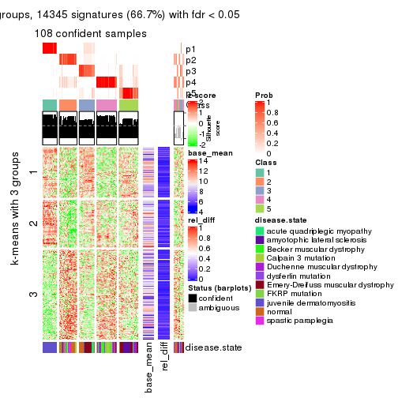</p>

</div>
<div id='tab-ATC-mclust-get-signatures-5'>
<pre><code class="r">get_signatures(res, k = 6)
</code></pre>

<p></p>

</div>
</div>


Signature heatmaps where rows are not scaled:


<script>
$( function() {
	$( '#tabs-ATC-mclust-get-signatures-no-scale' ).tabs();
} );
</script>
<div id='tabs-ATC-mclust-get-signatures-no-scale'>
<ul>
<li><a href='#tab-ATC-mclust-get-signatures-no-scale-1'>k = 2</a></li>
<li><a href='#tab-ATC-mclust-get-signatures-no-scale-2'>k = 3</a></li>
<li><a href='#tab-ATC-mclust-get-signatures-no-scale-3'>k = 4</a></li>
<li><a href='#tab-ATC-mclust-get-signatures-no-scale-4'>k = 5</a></li>
<li><a href='#tab-ATC-mclust-get-signatures-no-scale-5'>k = 6</a></li>
</ul>
<div id='tab-ATC-mclust-get-signatures-no-scale-1'>
<pre><code class="r">get_signatures(res, k = 2, scale_rows = FALSE)
</code></pre>

<p></p>

</div>
<div id='tab-ATC-mclust-get-signatures-no-scale-2'>
<pre><code class="r">get_signatures(res, k = 3, scale_rows = FALSE)
</code></pre>

<p></p>

</div>
<div id='tab-ATC-mclust-get-signatures-no-scale-3'>
<pre><code class="r">get_signatures(res, k = 4, scale_rows = FALSE)
</code></pre>

<p></p>

</div>
<div id='tab-ATC-mclust-get-signatures-no-scale-4'>
<pre><code class="r">get_signatures(res, k = 5, scale_rows = FALSE)
</code></pre>

<p></p>

</div>
<div id='tab-ATC-mclust-get-signatures-no-scale-5'>
<pre><code class="r">get_signatures(res, k = 6, scale_rows = FALSE)
</code></pre>

<p></p>

</div>
</div>


Compare the overlap of signatures from different k:

```r
compare_signatures(res)
```


`get_signature()` returns a data frame invisibly. TO get the list of signatures, the function
call should be assigned to a variable explicitly. In following code, if `plot` argument is set
to `FALSE`, no heatmap is plotted while only the differential analysis is performed.

```r
# code only for demonstration
tb = get_signature(res, k = ..., plot = FALSE)
```

An example of the output of `tb` is:

```
#>   which_row         fdr    mean_1    mean_2 scaled_mean_1 scaled_mean_2 km
#> 1        38 0.042760348  8.373488  9.131774    -0.5533452     0.5164555  1
#> 2        40 0.018707592  7.106213  8.469186    -0.6173731     0.5762149  1
#> 3        55 0.019134737 10.221463 11.207825    -0.6159697     0.5749050  1
#> 4        59 0.006059896  5.921854  7.869574    -0.6899429     0.6439467  1
#> 5        60 0.018055526  8.928898 10.211722    -0.6204761     0.5791110  1
#> 6        98 0.009384629 15.714769 14.887706     0.6635654    -0.6193277  2
...
```

The columns in `tb` are:

1. `which_row`: row indices corresponding to the input matrix.
2. `fdr`: FDR for the differential test. 
3. `mean_x`: The mean value in group x.
4. `scaled_mean_x`: The mean value in group x after rows are scaled.
5. `km`: Row groups if k-means clustering is applied to rows.


UMAP plot which shows how samples are separated.


<script>
$( function() {
	$( '#tabs-ATC-mclust-dimension-reduction' ).tabs();
} );
</script>
<div id='tabs-ATC-mclust-dimension-reduction'>
<ul>
<li><a href='#tab-ATC-mclust-dimension-reduction-1'>k = 2</a></li>
<li><a href='#tab-ATC-mclust-dimension-reduction-2'>k = 3</a></li>
<li><a href='#tab-ATC-mclust-dimension-reduction-3'>k = 4</a></li>
<li><a href='#tab-ATC-mclust-dimension-reduction-4'>k = 5</a></li>
<li><a href='#tab-ATC-mclust-dimension-reduction-5'>k = 6</a></li>
</ul>
<div id='tab-ATC-mclust-dimension-reduction-1'>
<pre><code class="r">dimension_reduction(res, k = 2, method = &quot;UMAP&quot;)
</code></pre>

<p></p>

</div>
<div id='tab-ATC-mclust-dimension-reduction-2'>
<pre><code class="r">dimension_reduction(res, k = 3, method = &quot;UMAP&quot;)
</code></pre>

<p></p>

</div>
<div id='tab-ATC-mclust-dimension-reduction-3'>
<pre><code class="r">dimension_reduction(res, k = 4, method = &quot;UMAP&quot;)
</code></pre>

<p></p>

</div>
<div id='tab-ATC-mclust-dimension-reduction-4'>
<pre><code class="r">dimension_reduction(res, k = 5, method = &quot;UMAP&quot;)
</code></pre>

<p></p>

</div>
<div id='tab-ATC-mclust-dimension-reduction-5'>
<pre><code class="r">dimension_reduction(res, k = 6, method = &quot;UMAP&quot;)
</code></pre>

<p></p>

</div>
</div>


Following heatmap shows how subgroups are split when increasing `k`:

```r
collect_classes(res)
```


Test correlation between subgroups and known annotations. If the known
annotation is numeric, one-way ANOVA test is applied, and if the known
annotation is discrete, chi-squared contingency table test is applied.

```r
test_to_known_factors(res)
```

```
#>              n disease.state(p) k
#> ATC:mclust 104         2.27e-10 2
#> ATC:mclust 113         5.88e-20 3
#> ATC:mclust  90         6.90e-19 4
#> ATC:mclust 108         2.60e-28 5
#> ATC:mclust  98         5.69e-32 6
```


If matrix rows can be associated to genes, consider to use `functional_enrichment(res,
...)` to perform function enrichment for the signature genes. See [this vignette](http://bioconductor.org/packages/devel/bioc/vignettes/cola/inst/doc/functional_enrichment.html) for more detailed explanations.


 

---------------------------------------------------


### ATC:NMF**


The object with results only for a single top-value method and a single partition method 
can be extracted as:

```r
res = res_list["ATC", "NMF"]
# you can also extract it by
# res = res_list["ATC:NMF"]
```

A summary of `res` and all the functions that can be applied to it:

```r
res
```

```
#> A 'ConsensusPartition' object with k = 2, 3, 4, 5, 6.
#>   On a matrix with 21512 rows and 119 columns.
#>   Top rows (1000, 2000, 3000, 4000, 5000) are extracted by 'ATC' method.
#>   Subgroups are detected by 'NMF' method.
#>   Performed in total 1250 partitions by row resampling.
#>   Best k for subgroups seems to be 2.
#> 
#> Following methods can be applied to this 'ConsensusPartition' object:
#>  [1] "cola_report"             "collect_classes"         "collect_plots"          
#>  [4] "collect_stats"           "colnames"                "compare_signatures"     
#>  [7] "consensus_heatmap"       "dimension_reduction"     "functional_enrichment"  
#> [10] "get_anno_col"            "get_anno"                "get_classes"            
#> [13] "get_consensus"           "get_matrix"              "get_membership"         
#> [16] "get_param"               "get_signatures"          "get_stats"              
#> [19] "is_best_k"               "is_stable_k"             "membership_heatmap"     
#> [22] "ncol"                    "nrow"                    "plot_ecdf"              
#> [25] "rownames"                "select_partition_number" "show"                   
#> [28] "suggest_best_k"          "test_to_known_factors"
```

`collect_plots()` function collects all the plots made from `res` for all `k` (number of partitions)
into one single page to provide an easy and fast comparison between different `k`.

```r
collect_plots(res)
```


The plots are:

- The first row: a plot of the ECDF (empirical cumulative distribution
  function) curves of the consensus matrix for each `k` and the heatmap of
  predicted classes for each `k`.
- The second row: heatmaps of the consensus matrix for each `k`.
- The third row: heatmaps of the membership matrix for each `k`.
- The fouth row: heatmaps of the signatures for each `k`.

All the plots in panels can be made by individual functions and they are
plotted later in this section.

`select_partition_number()` produces several plots showing different
statistics for choosing "optimized" `k`. There are following statistics:

- ECDF curves of the consensus matrix for each `k`;
- 1-PAC. [The PAC
  score](https://en.wikipedia.org/wiki/Consensus_clustering#Over-interpretation_potential_of_consensus_clustering)
  measures the proportion of the ambiguous subgrouping.
- Mean silhouette score.
- Concordance. The mean probability of fiting the consensus class ids in all
  partitions.
- Area increased. Denote $A_k$ as the area under the ECDF curve for current
  `k`, the area increased is defined as $A_k - A_{k-1}$.
- Rand index. The percent of pairs of samples that are both in a same cluster
  or both are not in a same cluster in the partition of k and k-1.
- Jaccard index. The ratio of pairs of samples are both in a same cluster in
  the partition of k and k-1 and the pairs of samples are both in a same
  cluster in the partition k or k-1.

The detailed explanations of these statistics can be found in [the _cola_
vignette](http://bioconductor.org/packages/devel/bioc/vignettes/cola/inst/doc/cola.html#toc_13).

Generally speaking, lower PAC score, higher mean silhouette score or higher
concordance corresponds to better partition. Rand index and Jaccard index
measure how similar the current partition is compared to partition with `k-1`.
If they are too similar, we won't accept `k` is better than `k-1`.

```r
select_partition_number(res)
```


The numeric values for all these statistics can be obtained by `get_stats()`.

```r
get_stats(res)
```

```
#>   k 1-PAC mean_silhouette concordance area_increased  Rand Jaccard
#> 2 2 0.983           0.971       0.987         0.5039 0.497   0.497
#> 3 3 0.659           0.635       0.784         0.2882 0.819   0.647
#> 4 4 0.745           0.777       0.881         0.1246 0.835   0.579
#> 5 5 0.673           0.560       0.750         0.0622 0.951   0.827
#> 6 6 0.670           0.491       0.737         0.0356 0.860   0.513
```

`suggest_best_k()` suggests the best $k$ based on these statistics. The rules are as follows:

- All $k$ with Jaccard index larger than 0.95 are removed because increasing
  $k$ does not provide enough extra information. If all $k$ are removed, it is
  marked as no subgroup is detected.
- For all $k$ with 1-PAC score larger than 0.9, the maximal $k$ is taken as
  the best $k$, and other $k$ are marked as optional $k$.
- If it does not fit the second rule. The $k$ with the maximal vote of the
  highest 1-PAC score, highest mean silhouette, and highest concordance is
  taken as the best $k$.

```r
suggest_best_k(res)
```

```
#> [1] 2
```


Following shows the table of the partitions (You need to click the **show/hide
code output** link to see it). The membership matrix (columns with name `p*`)
is inferred by
[`clue::cl_consensus()`](https://www.rdocumentation.org/link/cl_consensus?package=clue)
function with the `SE` method. Basically the value in the membership matrix
represents the probability to belong to a certain group. The finall class
label for an item is determined with the group with highest probability it
belongs to.

In `get_classes()` function, the entropy is calculated from the membership
matrix and the silhouette score is calculated from the consensus matrix.


<script>
$( function() {
	$( '#tabs-ATC-NMF-get-classes' ).tabs();
} );
</script>
<div id='tabs-ATC-NMF-get-classes'>
<ul>
<li><a href='#tab-ATC-NMF-get-classes-1'>k = 2</a></li>
<li><a href='#tab-ATC-NMF-get-classes-2'>k = 3</a></li>
<li><a href='#tab-ATC-NMF-get-classes-3'>k = 4</a></li>
<li><a href='#tab-ATC-NMF-get-classes-4'>k = 5</a></li>
<li><a href='#tab-ATC-NMF-get-classes-5'>k = 6</a></li>
</ul>

<div id='tab-ATC-NMF-get-classes-1'>
<p><a id='tab-ATC-NMF-get-classes-1-a' style='color:#0366d6' href='#'>show/hide code output</a></p>
<pre><code class="r">cbind(get_classes(res, k = 2), get_membership(res, k = 2))
</code></pre>

<pre><code>#&gt;           class entropy silhouette    p1    p2
#&gt; GSM120719     1  0.0000      0.976 1.000 0.000
#&gt; GSM120720     1  0.0000      0.976 1.000 0.000
#&gt; GSM120765     2  0.0000      0.998 0.000 1.000
#&gt; GSM120767     2  0.0000      0.998 0.000 1.000
#&gt; GSM120784     2  0.0000      0.998 0.000 1.000
#&gt; GSM121400     1  0.0000      0.976 1.000 0.000
#&gt; GSM121401     1  0.0000      0.976 1.000 0.000
#&gt; GSM121402     2  0.0000      0.998 0.000 1.000
#&gt; GSM121403     2  0.0000      0.998 0.000 1.000
#&gt; GSM121404     2  0.0000      0.998 0.000 1.000
#&gt; GSM121405     1  0.9358      0.490 0.648 0.352
#&gt; GSM121406     2  0.0000      0.998 0.000 1.000
#&gt; GSM121408     2  0.0000      0.998 0.000 1.000
#&gt; GSM121409     1  0.7219      0.762 0.800 0.200
#&gt; GSM121410     1  0.5842      0.839 0.860 0.140
#&gt; GSM121412     2  0.0000      0.998 0.000 1.000
#&gt; GSM121413     2  0.0000      0.998 0.000 1.000
#&gt; GSM121414     2  0.0000      0.998 0.000 1.000
#&gt; GSM121415     2  0.0000      0.998 0.000 1.000
#&gt; GSM121416     2  0.0000      0.998 0.000 1.000
#&gt; GSM120591     1  0.0000      0.976 1.000 0.000
#&gt; GSM120594     1  0.0000      0.976 1.000 0.000
#&gt; GSM120718     1  0.0000      0.976 1.000 0.000
#&gt; GSM121205     1  0.0000      0.976 1.000 0.000
#&gt; GSM121206     1  0.0000      0.976 1.000 0.000
#&gt; GSM121207     1  0.0000      0.976 1.000 0.000
#&gt; GSM121208     1  0.0000      0.976 1.000 0.000
#&gt; GSM121209     1  0.0000      0.976 1.000 0.000
#&gt; GSM121210     1  0.0000      0.976 1.000 0.000
#&gt; GSM121211     1  0.0000      0.976 1.000 0.000
#&gt; GSM121212     1  0.0000      0.976 1.000 0.000
#&gt; GSM121213     1  0.0000      0.976 1.000 0.000
#&gt; GSM121214     1  0.0000      0.976 1.000 0.000
#&gt; GSM121215     1  0.0000      0.976 1.000 0.000
#&gt; GSM121216     1  0.0000      0.976 1.000 0.000
#&gt; GSM121217     1  0.0000      0.976 1.000 0.000
#&gt; GSM121218     1  0.0000      0.976 1.000 0.000
#&gt; GSM121234     1  0.0000      0.976 1.000 0.000
#&gt; GSM121243     1  0.0000      0.976 1.000 0.000
#&gt; GSM121245     1  0.0000      0.976 1.000 0.000
#&gt; GSM121246     1  0.0000      0.976 1.000 0.000
#&gt; GSM121247     1  0.0000      0.976 1.000 0.000
#&gt; GSM121248     1  0.0000      0.976 1.000 0.000
#&gt; GSM120744     1  0.0000      0.976 1.000 0.000
#&gt; GSM120745     1  0.0000      0.976 1.000 0.000
#&gt; GSM120746     1  0.0000      0.976 1.000 0.000
#&gt; GSM120747     1  0.0000      0.976 1.000 0.000
#&gt; GSM120748     1  0.7815      0.714 0.768 0.232
#&gt; GSM120749     1  0.0000      0.976 1.000 0.000
#&gt; GSM120750     1  0.0000      0.976 1.000 0.000
#&gt; GSM120751     1  0.0000      0.976 1.000 0.000
#&gt; GSM120752     1  0.0000      0.976 1.000 0.000
#&gt; GSM121336     2  0.0000      0.998 0.000 1.000
#&gt; GSM121339     2  0.0000      0.998 0.000 1.000
#&gt; GSM121349     2  0.0000      0.998 0.000 1.000
#&gt; GSM121355     2  0.0000      0.998 0.000 1.000
#&gt; GSM120757     1  0.0000      0.976 1.000 0.000
#&gt; GSM120766     1  0.0000      0.976 1.000 0.000
#&gt; GSM120770     2  0.0000      0.998 0.000 1.000
#&gt; GSM120779     1  0.0000      0.976 1.000 0.000
#&gt; GSM120780     1  0.0672      0.970 0.992 0.008
#&gt; GSM121102     2  0.0000      0.998 0.000 1.000
#&gt; GSM121203     1  0.4815      0.880 0.896 0.104
#&gt; GSM121204     1  0.0000      0.976 1.000 0.000
#&gt; GSM121330     1  0.0000      0.976 1.000 0.000
#&gt; GSM121335     1  0.0000      0.976 1.000 0.000
#&gt; GSM121337     2  0.0000      0.998 0.000 1.000
#&gt; GSM121338     2  0.0000      0.998 0.000 1.000
#&gt; GSM121341     1  0.0000      0.976 1.000 0.000
#&gt; GSM121342     1  0.0000      0.976 1.000 0.000
#&gt; GSM121343     2  0.0000      0.998 0.000 1.000
#&gt; GSM121344     1  0.0000      0.976 1.000 0.000
#&gt; GSM121346     1  0.0000      0.976 1.000 0.000
#&gt; GSM121347     2  0.0000      0.998 0.000 1.000
#&gt; GSM121348     2  0.0000      0.998 0.000 1.000
#&gt; GSM121350     1  0.0000      0.976 1.000 0.000
#&gt; GSM121352     1  0.0000      0.976 1.000 0.000
#&gt; GSM121354     1  0.0000      0.976 1.000 0.000
#&gt; GSM120753     2  0.0000      0.998 0.000 1.000
#&gt; GSM120761     2  0.0000      0.998 0.000 1.000
#&gt; GSM120768     2  0.0000      0.998 0.000 1.000
#&gt; GSM120781     2  0.0000      0.998 0.000 1.000
#&gt; GSM120788     1  0.9460      0.461 0.636 0.364
#&gt; GSM120760     2  0.0000      0.998 0.000 1.000
#&gt; GSM120763     2  0.0000      0.998 0.000 1.000
#&gt; GSM120764     2  0.0000      0.998 0.000 1.000
#&gt; GSM120777     2  0.5059      0.868 0.112 0.888
#&gt; GSM120786     2  0.0000      0.998 0.000 1.000
#&gt; GSM121329     1  0.0000      0.976 1.000 0.000
#&gt; GSM121331     1  0.0000      0.976 1.000 0.000
#&gt; GSM121333     1  0.0000      0.976 1.000 0.000
#&gt; GSM121345     1  0.0000      0.976 1.000 0.000
#&gt; GSM121356     1  0.0000      0.976 1.000 0.000
#&gt; GSM120754     2  0.0000      0.998 0.000 1.000
#&gt; GSM120759     2  0.0000      0.998 0.000 1.000
#&gt; GSM120762     2  0.0000      0.998 0.000 1.000
#&gt; GSM120775     2  0.0000      0.998 0.000 1.000
#&gt; GSM120776     1  0.2778      0.935 0.952 0.048
#&gt; GSM120782     2  0.0000      0.998 0.000 1.000
#&gt; GSM120789     2  0.0000      0.998 0.000 1.000
#&gt; GSM120790     2  0.0000      0.998 0.000 1.000
#&gt; GSM120791     2  0.0000      0.998 0.000 1.000
#&gt; GSM120755     2  0.0000      0.998 0.000 1.000
#&gt; GSM120756     1  0.0000      0.976 1.000 0.000
#&gt; GSM120769     2  0.0000      0.998 0.000 1.000
#&gt; GSM120778     2  0.0000      0.998 0.000 1.000
#&gt; GSM120792     2  0.0000      0.998 0.000 1.000
#&gt; GSM121332     2  0.0000      0.998 0.000 1.000
#&gt; GSM121334     2  0.0000      0.998 0.000 1.000
#&gt; GSM121340     2  0.0000      0.998 0.000 1.000
#&gt; GSM121351     2  0.0000      0.998 0.000 1.000
#&gt; GSM121353     2  0.0000      0.998 0.000 1.000
#&gt; GSM120758     2  0.0000      0.998 0.000 1.000
#&gt; GSM120771     2  0.0000      0.998 0.000 1.000
#&gt; GSM120772     2  0.0000      0.998 0.000 1.000
#&gt; GSM120773     2  0.0000      0.998 0.000 1.000
#&gt; GSM120774     2  0.0000      0.998 0.000 1.000
#&gt; GSM120783     2  0.0000      0.998 0.000 1.000
#&gt; GSM120787     2  0.0000      0.998 0.000 1.000
</code></pre>

<script>
$('#tab-ATC-NMF-get-classes-1-a').parent().next().next().hide();
$('#tab-ATC-NMF-get-classes-1-a').click(function(){
  $('#tab-ATC-NMF-get-classes-1-a').parent().next().next().toggle();
  return(false);
});
</script>
</div>

<div id='tab-ATC-NMF-get-classes-2'>
<p><a id='tab-ATC-NMF-get-classes-2-a' style='color:#0366d6' href='#'>show/hide code output</a></p>
<pre><code class="r">cbind(get_classes(res, k = 3), get_membership(res, k = 3))
</code></pre>

<pre><code>#&gt;           class entropy silhouette    p1    p2    p3
#&gt; GSM120719     1  0.6154      0.497 0.592 0.000 0.408
#&gt; GSM120720     1  0.3038      0.582 0.896 0.000 0.104
#&gt; GSM120765     2  0.0000      0.878 0.000 1.000 0.000
#&gt; GSM120767     2  0.0000      0.878 0.000 1.000 0.000
#&gt; GSM120784     2  0.0424      0.875 0.000 0.992 0.008
#&gt; GSM121400     3  0.7878      0.655 0.392 0.060 0.548
#&gt; GSM121401     3  0.7223      0.661 0.424 0.028 0.548
#&gt; GSM121402     2  0.0000      0.878 0.000 1.000 0.000
#&gt; GSM121403     3  0.6274      0.152 0.000 0.456 0.544
#&gt; GSM121404     3  0.6274      0.152 0.000 0.456 0.544
#&gt; GSM121405     3  0.8571      0.628 0.340 0.112 0.548
#&gt; GSM121406     2  0.0237      0.877 0.000 0.996 0.004
#&gt; GSM121408     2  0.0000      0.878 0.000 1.000 0.000
#&gt; GSM121409     3  0.8962      0.588 0.304 0.156 0.540
#&gt; GSM121410     3  0.8395      0.640 0.356 0.096 0.548
#&gt; GSM121412     2  0.1163      0.863 0.000 0.972 0.028
#&gt; GSM121413     2  0.0237      0.877 0.000 0.996 0.004
#&gt; GSM121414     2  0.0592      0.873 0.000 0.988 0.012
#&gt; GSM121415     2  0.0424      0.875 0.000 0.992 0.008
#&gt; GSM121416     2  0.0592      0.873 0.000 0.988 0.012
#&gt; GSM120591     1  0.1289      0.692 0.968 0.000 0.032
#&gt; GSM120594     1  0.1643      0.670 0.956 0.000 0.044
#&gt; GSM120718     1  0.1411      0.679 0.964 0.000 0.036
#&gt; GSM121205     1  0.0000      0.698 1.000 0.000 0.000
#&gt; GSM121206     1  0.0892      0.691 0.980 0.000 0.020
#&gt; GSM121207     1  0.2796      0.669 0.908 0.000 0.092
#&gt; GSM121208     1  0.4702      0.354 0.788 0.000 0.212
#&gt; GSM121209     1  0.1529      0.675 0.960 0.000 0.040
#&gt; GSM121210     1  0.1860      0.686 0.948 0.000 0.052
#&gt; GSM121211     1  0.1163      0.686 0.972 0.000 0.028
#&gt; GSM121212     1  0.0747      0.693 0.984 0.000 0.016
#&gt; GSM121213     1  0.0747      0.693 0.984 0.000 0.016
#&gt; GSM121214     1  0.0000      0.698 1.000 0.000 0.000
#&gt; GSM121215     1  0.0000      0.698 1.000 0.000 0.000
#&gt; GSM121216     1  0.0424      0.697 0.992 0.000 0.008
#&gt; GSM121217     1  0.1289      0.683 0.968 0.000 0.032
#&gt; GSM121218     1  0.0000      0.698 1.000 0.000 0.000
#&gt; GSM121234     1  0.1411      0.679 0.964 0.000 0.036
#&gt; GSM121243     1  0.1964      0.685 0.944 0.000 0.056
#&gt; GSM121245     1  0.0237      0.698 0.996 0.000 0.004
#&gt; GSM121246     1  0.5291      0.167 0.732 0.000 0.268
#&gt; GSM121247     1  0.5948      0.524 0.640 0.000 0.360
#&gt; GSM121248     1  0.0000      0.698 1.000 0.000 0.000
#&gt; GSM120744     3  0.6267      0.658 0.452 0.000 0.548
#&gt; GSM120745     1  0.5138      0.225 0.748 0.000 0.252
#&gt; GSM120746     3  0.6267      0.658 0.452 0.000 0.548
#&gt; GSM120747     3  0.7013      0.661 0.432 0.020 0.548
#&gt; GSM120748     3  0.8295      0.644 0.364 0.088 0.548
#&gt; GSM120749     3  0.6286      0.643 0.464 0.000 0.536
#&gt; GSM120750     3  0.6267      0.658 0.452 0.000 0.548
#&gt; GSM120751     3  0.6274      0.654 0.456 0.000 0.544
#&gt; GSM120752     1  0.5760     -0.082 0.672 0.000 0.328
#&gt; GSM121336     2  0.0000      0.878 0.000 1.000 0.000
#&gt; GSM121339     2  0.6204      0.178 0.000 0.576 0.424
#&gt; GSM121349     2  0.0000      0.878 0.000 1.000 0.000
#&gt; GSM121355     2  0.0237      0.877 0.000 0.996 0.004
#&gt; GSM120757     1  0.4178      0.638 0.828 0.000 0.172
#&gt; GSM120766     1  0.5216      0.314 0.740 0.000 0.260
#&gt; GSM120770     2  0.0892      0.868 0.000 0.980 0.020
#&gt; GSM120779     1  0.6079      0.509 0.612 0.000 0.388
#&gt; GSM120780     3  0.7660      0.659 0.404 0.048 0.548
#&gt; GSM121102     2  0.5706      0.445 0.000 0.680 0.320
#&gt; GSM121203     3  0.8530      0.631 0.344 0.108 0.548
#&gt; GSM121204     1  0.5397      0.567 0.720 0.000 0.280
#&gt; GSM121330     3  0.6267      0.658 0.452 0.000 0.548
#&gt; GSM121335     3  0.6302      0.617 0.480 0.000 0.520
#&gt; GSM121337     2  0.0424      0.875 0.000 0.992 0.008
#&gt; GSM121338     3  0.6286      0.128 0.000 0.464 0.536
#&gt; GSM121341     3  0.6302      0.617 0.480 0.000 0.520
#&gt; GSM121342     1  0.6252     -0.473 0.556 0.000 0.444
#&gt; GSM121343     2  0.6192      0.198 0.000 0.580 0.420
#&gt; GSM121344     3  0.6274      0.654 0.456 0.000 0.544
#&gt; GSM121346     3  0.6267      0.658 0.452 0.000 0.548
#&gt; GSM121347     2  0.0424      0.875 0.000 0.992 0.008
#&gt; GSM121348     2  0.1753      0.871 0.000 0.952 0.048
#&gt; GSM121350     3  0.6267      0.658 0.452 0.000 0.548
#&gt; GSM121352     3  0.6267      0.658 0.452 0.000 0.548
#&gt; GSM121354     3  0.6274      0.654 0.456 0.000 0.544
#&gt; GSM120753     2  0.1411      0.874 0.000 0.964 0.036
#&gt; GSM120761     2  0.2261      0.864 0.000 0.932 0.068
#&gt; GSM120768     2  0.2959      0.849 0.000 0.900 0.100
#&gt; GSM120781     2  0.0592      0.878 0.000 0.988 0.012
#&gt; GSM120788     3  0.8691     -0.385 0.444 0.104 0.452
#&gt; GSM120760     2  0.5988      0.644 0.000 0.632 0.368
#&gt; GSM120763     2  0.5591      0.703 0.000 0.696 0.304
#&gt; GSM120764     3  0.8582     -0.454 0.096 0.452 0.452
#&gt; GSM120777     3  0.9247     -0.327 0.392 0.156 0.452
#&gt; GSM120786     2  0.6215      0.580 0.000 0.572 0.428
#&gt; GSM121329     1  0.1031      0.689 0.976 0.000 0.024
#&gt; GSM121331     1  0.6260      0.467 0.552 0.000 0.448
#&gt; GSM121333     1  0.6215      0.483 0.572 0.000 0.428
#&gt; GSM121345     1  0.6267      0.463 0.548 0.000 0.452
#&gt; GSM121356     1  0.6180      0.492 0.584 0.000 0.416
#&gt; GSM120754     2  0.5733      0.685 0.000 0.676 0.324
#&gt; GSM120759     2  0.0000      0.878 0.000 1.000 0.000
#&gt; GSM120762     2  0.0424      0.878 0.000 0.992 0.008
#&gt; GSM120775     2  0.8844      0.385 0.116 0.444 0.440
#&gt; GSM120776     1  0.7274      0.436 0.520 0.028 0.452
#&gt; GSM120782     2  0.4002      0.813 0.000 0.840 0.160
#&gt; GSM120789     2  0.0000      0.878 0.000 1.000 0.000
#&gt; GSM120790     2  0.0892      0.877 0.000 0.980 0.020
#&gt; GSM120791     2  0.4399      0.794 0.000 0.812 0.188
#&gt; GSM120755     2  0.0000      0.878 0.000 1.000 0.000
#&gt; GSM120756     1  0.6647      0.456 0.540 0.008 0.452
#&gt; GSM120769     2  0.0424      0.878 0.000 0.992 0.008
#&gt; GSM120778     2  0.2165      0.865 0.000 0.936 0.064
#&gt; GSM120792     2  0.2448      0.861 0.000 0.924 0.076
#&gt; GSM121332     2  0.0592      0.878 0.000 0.988 0.012
#&gt; GSM121334     2  0.2261      0.864 0.000 0.932 0.068
#&gt; GSM121340     2  0.7164      0.523 0.024 0.524 0.452
#&gt; GSM121351     2  0.0000      0.878 0.000 1.000 0.000
#&gt; GSM121353     2  0.6651      0.652 0.020 0.640 0.340
#&gt; GSM120758     2  0.0237      0.878 0.000 0.996 0.004
#&gt; GSM120771     2  0.1031      0.877 0.000 0.976 0.024
#&gt; GSM120772     2  0.1964      0.868 0.000 0.944 0.056
#&gt; GSM120773     2  0.5948      0.652 0.000 0.640 0.360
#&gt; GSM120774     2  0.2066      0.867 0.000 0.940 0.060
#&gt; GSM120783     2  0.6587      0.576 0.008 0.568 0.424
#&gt; GSM120787     2  0.2261      0.864 0.000 0.932 0.068
</code></pre>

<script>
$('#tab-ATC-NMF-get-classes-2-a').parent().next().next().hide();
$('#tab-ATC-NMF-get-classes-2-a').click(function(){
  $('#tab-ATC-NMF-get-classes-2-a').parent().next().next().toggle();
  return(false);
});
</script>
</div>

<div id='tab-ATC-NMF-get-classes-3'>
<p><a id='tab-ATC-NMF-get-classes-3-a' style='color:#0366d6' href='#'>show/hide code output</a></p>
<pre><code class="r">cbind(get_classes(res, k = 4), get_membership(res, k = 4))
</code></pre>

<pre><code>#&gt;           class entropy silhouette    p1    p2    p3    p4
#&gt; GSM120719     1  0.2149     0.8995 0.912 0.000 0.000 0.088
#&gt; GSM120720     1  0.1356     0.9380 0.960 0.000 0.032 0.008
#&gt; GSM120765     2  0.0592     0.8902 0.000 0.984 0.016 0.000
#&gt; GSM120767     2  0.0376     0.8912 0.000 0.992 0.004 0.004
#&gt; GSM120784     2  0.1557     0.8742 0.000 0.944 0.056 0.000
#&gt; GSM121400     3  0.1404     0.8093 0.012 0.012 0.964 0.012
#&gt; GSM121401     3  0.2853     0.7966 0.076 0.016 0.900 0.008
#&gt; GSM121402     2  0.1256     0.8843 0.000 0.964 0.028 0.008
#&gt; GSM121403     3  0.4044     0.7356 0.004 0.152 0.820 0.024
#&gt; GSM121404     3  0.2021     0.8053 0.012 0.056 0.932 0.000
#&gt; GSM121405     3  0.2877     0.8012 0.060 0.028 0.904 0.008
#&gt; GSM121406     2  0.1635     0.8775 0.000 0.948 0.044 0.008
#&gt; GSM121408     2  0.0336     0.8909 0.000 0.992 0.008 0.000
#&gt; GSM121409     3  0.4211     0.7782 0.064 0.092 0.836 0.008
#&gt; GSM121410     3  0.3349     0.7944 0.052 0.064 0.880 0.004
#&gt; GSM121412     2  0.2198     0.8593 0.000 0.920 0.072 0.008
#&gt; GSM121413     2  0.1635     0.8775 0.000 0.948 0.044 0.008
#&gt; GSM121414     2  0.2124     0.8617 0.000 0.924 0.068 0.008
#&gt; GSM121415     2  0.1824     0.8702 0.000 0.936 0.060 0.004
#&gt; GSM121416     2  0.5466     0.1678 0.000 0.548 0.436 0.016
#&gt; GSM120591     1  0.1798     0.9390 0.944 0.000 0.016 0.040
#&gt; GSM120594     1  0.1388     0.9411 0.960 0.000 0.028 0.012
#&gt; GSM120718     1  0.0657     0.9488 0.984 0.000 0.012 0.004
#&gt; GSM121205     1  0.0592     0.9489 0.984 0.000 0.000 0.016
#&gt; GSM121206     1  0.0188     0.9498 0.996 0.000 0.004 0.000
#&gt; GSM121207     1  0.1211     0.9373 0.960 0.000 0.000 0.040
#&gt; GSM121208     1  0.1807     0.9261 0.940 0.000 0.052 0.008
#&gt; GSM121209     1  0.0779     0.9462 0.980 0.000 0.016 0.004
#&gt; GSM121210     1  0.1022     0.9423 0.968 0.000 0.000 0.032
#&gt; GSM121211     1  0.0188     0.9498 0.996 0.000 0.004 0.000
#&gt; GSM121212     1  0.0469     0.9495 0.988 0.000 0.000 0.012
#&gt; GSM121213     1  0.0188     0.9501 0.996 0.000 0.000 0.004
#&gt; GSM121214     1  0.0592     0.9489 0.984 0.000 0.000 0.016
#&gt; GSM121215     1  0.0336     0.9499 0.992 0.000 0.000 0.008
#&gt; GSM121216     1  0.0336     0.9499 0.992 0.000 0.000 0.008
#&gt; GSM121217     1  0.0336     0.9489 0.992 0.000 0.008 0.000
#&gt; GSM121218     1  0.0469     0.9495 0.988 0.000 0.000 0.012
#&gt; GSM121234     1  0.0779     0.9459 0.980 0.000 0.016 0.004
#&gt; GSM121243     1  0.0707     0.9473 0.980 0.000 0.000 0.020
#&gt; GSM121245     1  0.1022     0.9423 0.968 0.000 0.000 0.032
#&gt; GSM121246     1  0.2021     0.9218 0.932 0.000 0.056 0.012
#&gt; GSM121247     1  0.2216     0.8917 0.908 0.000 0.000 0.092
#&gt; GSM121248     1  0.0592     0.9489 0.984 0.000 0.000 0.016
#&gt; GSM120744     3  0.3450     0.7685 0.008 0.000 0.836 0.156
#&gt; GSM120745     3  0.5903     0.5479 0.052 0.000 0.616 0.332
#&gt; GSM120746     3  0.3051     0.8015 0.028 0.000 0.884 0.088
#&gt; GSM120747     3  0.2467     0.8092 0.024 0.004 0.920 0.052
#&gt; GSM120748     3  0.2124     0.8045 0.008 0.000 0.924 0.068
#&gt; GSM120749     3  0.3215     0.8002 0.032 0.000 0.876 0.092
#&gt; GSM120750     3  0.3271     0.7846 0.012 0.000 0.856 0.132
#&gt; GSM120751     3  0.3658     0.7790 0.020 0.000 0.836 0.144
#&gt; GSM120752     3  0.5364     0.5812 0.028 0.000 0.652 0.320
#&gt; GSM121336     2  0.0524     0.8907 0.000 0.988 0.008 0.004
#&gt; GSM121339     2  0.4795     0.6715 0.024 0.768 0.196 0.012
#&gt; GSM121349     2  0.0657     0.8903 0.000 0.984 0.012 0.004
#&gt; GSM121355     2  0.0592     0.8902 0.000 0.984 0.016 0.000
#&gt; GSM120757     4  0.4464     0.5489 0.024 0.000 0.208 0.768
#&gt; GSM120766     4  0.5396    -0.1092 0.012 0.000 0.464 0.524
#&gt; GSM120770     3  0.6449     0.5612 0.000 0.220 0.640 0.140
#&gt; GSM120779     4  0.3367     0.7032 0.108 0.000 0.028 0.864
#&gt; GSM120780     3  0.3123     0.7699 0.000 0.000 0.844 0.156
#&gt; GSM121102     3  0.4205     0.7605 0.000 0.124 0.820 0.056
#&gt; GSM121203     3  0.2589     0.7898 0.000 0.000 0.884 0.116
#&gt; GSM121204     4  0.3215     0.7195 0.092 0.000 0.032 0.876
#&gt; GSM121330     3  0.4516     0.6520 0.252 0.000 0.736 0.012
#&gt; GSM121335     1  0.3764     0.8061 0.816 0.000 0.172 0.012
#&gt; GSM121337     2  0.1807     0.8729 0.000 0.940 0.052 0.008
#&gt; GSM121338     3  0.2197     0.7936 0.000 0.080 0.916 0.004
#&gt; GSM121341     1  0.3529     0.8303 0.836 0.000 0.152 0.012
#&gt; GSM121342     1  0.2867     0.8804 0.884 0.000 0.104 0.012
#&gt; GSM121343     3  0.2796     0.7876 0.000 0.092 0.892 0.016
#&gt; GSM121344     1  0.4059     0.7669 0.788 0.000 0.200 0.012
#&gt; GSM121346     3  0.3545     0.7425 0.164 0.000 0.828 0.008
#&gt; GSM121347     3  0.7049     0.4574 0.000 0.236 0.572 0.192
#&gt; GSM121348     2  0.4261     0.7759 0.000 0.820 0.068 0.112
#&gt; GSM121350     3  0.2888     0.7735 0.124 0.000 0.872 0.004
#&gt; GSM121352     3  0.4453     0.6607 0.244 0.000 0.744 0.012
#&gt; GSM121354     3  0.5279     0.3275 0.400 0.000 0.588 0.012
#&gt; GSM120753     2  0.0707     0.8879 0.000 0.980 0.000 0.020
#&gt; GSM120761     2  0.1474     0.8747 0.000 0.948 0.000 0.052
#&gt; GSM120768     2  0.2281     0.8426 0.000 0.904 0.000 0.096
#&gt; GSM120781     2  0.0336     0.8903 0.000 0.992 0.000 0.008
#&gt; GSM120788     4  0.2773     0.7440 0.072 0.028 0.000 0.900
#&gt; GSM120760     2  0.4222     0.5970 0.000 0.728 0.000 0.272
#&gt; GSM120763     2  0.2868     0.8030 0.000 0.864 0.000 0.136
#&gt; GSM120764     4  0.2814     0.7077 0.000 0.132 0.000 0.868
#&gt; GSM120777     4  0.3009     0.7406 0.056 0.052 0.000 0.892
#&gt; GSM120786     4  0.4967     0.2032 0.000 0.452 0.000 0.548
#&gt; GSM121329     1  0.1209     0.9439 0.964 0.000 0.004 0.032
#&gt; GSM121331     4  0.2816     0.7331 0.064 0.000 0.036 0.900
#&gt; GSM121333     4  0.2224     0.7250 0.040 0.000 0.032 0.928
#&gt; GSM121345     4  0.2611     0.7353 0.096 0.000 0.008 0.896
#&gt; GSM121356     4  0.2489     0.7024 0.020 0.000 0.068 0.912
#&gt; GSM120754     4  0.4967     0.1812 0.000 0.452 0.000 0.548
#&gt; GSM120759     2  0.1677     0.8782 0.000 0.948 0.040 0.012
#&gt; GSM120762     2  0.0336     0.8903 0.000 0.992 0.000 0.008
#&gt; GSM120775     4  0.5320     0.2965 0.012 0.416 0.000 0.572
#&gt; GSM120776     4  0.2380     0.7428 0.064 0.008 0.008 0.920
#&gt; GSM120782     2  0.3311     0.7593 0.000 0.828 0.000 0.172
#&gt; GSM120789     2  0.0779     0.8894 0.000 0.980 0.016 0.004
#&gt; GSM120790     2  0.1624     0.8835 0.000 0.952 0.028 0.020
#&gt; GSM120791     2  0.4955     0.1570 0.000 0.556 0.000 0.444
#&gt; GSM120755     2  0.0188     0.8908 0.000 0.996 0.000 0.004
#&gt; GSM120756     4  0.3324     0.7142 0.136 0.012 0.000 0.852
#&gt; GSM120769     2  0.0336     0.8904 0.000 0.992 0.000 0.008
#&gt; GSM120778     2  0.1389     0.8763 0.000 0.952 0.000 0.048
#&gt; GSM120792     2  0.1792     0.8645 0.000 0.932 0.000 0.068
#&gt; GSM121332     2  0.0336     0.8904 0.000 0.992 0.000 0.008
#&gt; GSM121334     2  0.1557     0.8722 0.000 0.944 0.000 0.056
#&gt; GSM121340     2  0.5290     0.2508 0.012 0.584 0.000 0.404
#&gt; GSM121351     2  0.0524     0.8910 0.000 0.988 0.008 0.004
#&gt; GSM121353     2  0.2255     0.8596 0.012 0.920 0.000 0.068
#&gt; GSM120758     2  0.0524     0.8915 0.000 0.988 0.008 0.004
#&gt; GSM120771     2  0.0524     0.8917 0.000 0.988 0.008 0.004
#&gt; GSM120772     2  0.1867     0.8623 0.000 0.928 0.000 0.072
#&gt; GSM120773     2  0.4977     0.0785 0.000 0.540 0.000 0.460
#&gt; GSM120774     2  0.0921     0.8847 0.000 0.972 0.000 0.028
#&gt; GSM120783     4  0.4888     0.3122 0.000 0.412 0.000 0.588
#&gt; GSM120787     2  0.1022     0.8835 0.000 0.968 0.000 0.032
</code></pre>

<script>
$('#tab-ATC-NMF-get-classes-3-a').parent().next().next().hide();
$('#tab-ATC-NMF-get-classes-3-a').click(function(){
  $('#tab-ATC-NMF-get-classes-3-a').parent().next().next().toggle();
  return(false);
});
</script>
</div>

<div id='tab-ATC-NMF-get-classes-4'>
<p><a id='tab-ATC-NMF-get-classes-4-a' style='color:#0366d6' href='#'>show/hide code output</a></p>
<pre><code class="r">cbind(get_classes(res, k = 5), get_membership(res, k = 5))
</code></pre>

<pre><code>#&gt;           class entropy silhouette    p1    p2    p3    p4    p5
#&gt; GSM120719     1  0.2349    0.88648 0.900 0.000 0.004 0.084 0.012
#&gt; GSM120720     1  0.3768    0.80552 0.808 0.000 0.156 0.020 0.016
#&gt; GSM120765     2  0.1410    0.64272 0.000 0.940 0.000 0.000 0.060
#&gt; GSM120767     2  0.3632    0.62789 0.000 0.800 0.004 0.176 0.020
#&gt; GSM120784     2  0.1924    0.64812 0.000 0.924 0.004 0.008 0.064
#&gt; GSM121400     5  0.4892   -0.19545 0.004 0.016 0.484 0.000 0.496
#&gt; GSM121401     3  0.3051    0.79429 0.028 0.000 0.852 0.000 0.120
#&gt; GSM121402     2  0.3074    0.52468 0.000 0.804 0.000 0.000 0.196
#&gt; GSM121403     5  0.5792    0.43496 0.004 0.376 0.084 0.000 0.536
#&gt; GSM121404     3  0.2550    0.80563 0.004 0.020 0.892 0.000 0.084
#&gt; GSM121405     3  0.3451    0.78121 0.024 0.012 0.836 0.000 0.128
#&gt; GSM121406     2  0.3424    0.45929 0.000 0.760 0.000 0.000 0.240
#&gt; GSM121408     2  0.1205    0.65059 0.000 0.956 0.000 0.004 0.040
#&gt; GSM121409     5  0.6676    0.48643 0.016 0.332 0.160 0.000 0.492
#&gt; GSM121410     5  0.6529    0.48346 0.008 0.272 0.196 0.000 0.524
#&gt; GSM121412     2  0.4114    0.18013 0.000 0.624 0.000 0.000 0.376
#&gt; GSM121413     2  0.3913    0.31784 0.000 0.676 0.000 0.000 0.324
#&gt; GSM121414     2  0.4201    0.08432 0.000 0.592 0.000 0.000 0.408
#&gt; GSM121415     2  0.3171    0.53948 0.000 0.816 0.008 0.000 0.176
#&gt; GSM121416     2  0.6118    0.47053 0.000 0.652 0.196 0.096 0.056
#&gt; GSM120591     1  0.6650    0.38801 0.528 0.000 0.316 0.124 0.032
#&gt; GSM120594     1  0.5094    0.63517 0.676 0.000 0.264 0.044 0.016
#&gt; GSM120718     1  0.3023    0.86814 0.872 0.000 0.088 0.028 0.012
#&gt; GSM121205     1  0.0510    0.92035 0.984 0.000 0.000 0.016 0.000
#&gt; GSM121206     1  0.0162    0.92044 0.996 0.000 0.000 0.000 0.004
#&gt; GSM121207     1  0.1043    0.91579 0.960 0.000 0.000 0.040 0.000
#&gt; GSM121208     1  0.0162    0.92044 0.996 0.000 0.000 0.000 0.004
#&gt; GSM121209     1  0.0162    0.92044 0.996 0.000 0.000 0.000 0.004
#&gt; GSM121210     1  0.0880    0.91785 0.968 0.000 0.000 0.032 0.000
#&gt; GSM121211     1  0.0162    0.92044 0.996 0.000 0.000 0.000 0.004
#&gt; GSM121212     1  0.0566    0.92119 0.984 0.000 0.000 0.012 0.004
#&gt; GSM121213     1  0.0000    0.92051 1.000 0.000 0.000 0.000 0.000
#&gt; GSM121214     1  0.0880    0.91826 0.968 0.000 0.000 0.032 0.000
#&gt; GSM121215     1  0.0404    0.92034 0.988 0.000 0.000 0.012 0.000
#&gt; GSM121216     1  0.0404    0.92034 0.988 0.000 0.000 0.012 0.000
#&gt; GSM121217     1  0.0162    0.92044 0.996 0.000 0.000 0.000 0.004
#&gt; GSM121218     1  0.0510    0.92035 0.984 0.000 0.000 0.016 0.000
#&gt; GSM121234     1  0.0162    0.92044 0.996 0.000 0.000 0.000 0.004
#&gt; GSM121243     1  0.0510    0.92035 0.984 0.000 0.000 0.016 0.000
#&gt; GSM121245     1  0.1043    0.91579 0.960 0.000 0.000 0.040 0.000
#&gt; GSM121246     1  0.0771    0.91395 0.976 0.000 0.020 0.000 0.004
#&gt; GSM121247     1  0.1830    0.89462 0.924 0.000 0.000 0.068 0.008
#&gt; GSM121248     1  0.0963    0.91717 0.964 0.000 0.000 0.036 0.000
#&gt; GSM120744     3  0.1956    0.80090 0.000 0.000 0.916 0.008 0.076
#&gt; GSM120745     3  0.3517    0.73893 0.000 0.000 0.832 0.068 0.100
#&gt; GSM120746     3  0.1041    0.82092 0.000 0.000 0.964 0.004 0.032
#&gt; GSM120747     3  0.0671    0.82135 0.000 0.000 0.980 0.004 0.016
#&gt; GSM120748     3  0.0955    0.82141 0.000 0.000 0.968 0.004 0.028
#&gt; GSM120749     3  0.1205    0.82000 0.000 0.000 0.956 0.004 0.040
#&gt; GSM120750     3  0.1282    0.81802 0.000 0.000 0.952 0.004 0.044
#&gt; GSM120751     3  0.1597    0.81437 0.000 0.000 0.940 0.012 0.048
#&gt; GSM120752     3  0.3705    0.71956 0.000 0.000 0.816 0.064 0.120
#&gt; GSM121336     2  0.2074    0.61490 0.000 0.896 0.000 0.000 0.104
#&gt; GSM121339     2  0.4819    0.31712 0.004 0.624 0.352 0.008 0.012
#&gt; GSM121349     2  0.2127    0.61133 0.000 0.892 0.000 0.000 0.108
#&gt; GSM121355     2  0.1792    0.62816 0.000 0.916 0.000 0.000 0.084
#&gt; GSM120757     4  0.6062    0.26778 0.000 0.000 0.120 0.464 0.416
#&gt; GSM120766     5  0.5691   -0.23989 0.000 0.000 0.088 0.376 0.536
#&gt; GSM120770     2  0.6247   -0.30398 0.000 0.432 0.144 0.000 0.424
#&gt; GSM120779     4  0.5437    0.37378 0.048 0.000 0.008 0.564 0.380
#&gt; GSM120780     5  0.4890    0.00179 0.000 0.000 0.332 0.040 0.628
#&gt; GSM121102     5  0.6309    0.48248 0.000 0.340 0.168 0.000 0.492
#&gt; GSM121203     3  0.3861    0.66997 0.000 0.000 0.712 0.004 0.284
#&gt; GSM121204     4  0.5956    0.37769 0.040 0.000 0.044 0.560 0.356
#&gt; GSM121330     3  0.4022    0.76450 0.100 0.004 0.804 0.000 0.092
#&gt; GSM121335     1  0.4166    0.49128 0.648 0.000 0.348 0.000 0.004
#&gt; GSM121337     2  0.3796    0.35744 0.000 0.700 0.000 0.000 0.300
#&gt; GSM121338     3  0.6579   -0.15758 0.000 0.220 0.448 0.000 0.332
#&gt; GSM121341     1  0.3838    0.63207 0.716 0.000 0.280 0.000 0.004
#&gt; GSM121342     1  0.1082    0.91075 0.964 0.000 0.028 0.000 0.008
#&gt; GSM121343     5  0.6519    0.48230 0.000 0.340 0.204 0.000 0.456
#&gt; GSM121344     1  0.2674    0.82458 0.856 0.000 0.140 0.000 0.004
#&gt; GSM121346     3  0.3281    0.79331 0.060 0.000 0.848 0.000 0.092
#&gt; GSM121347     5  0.5287    0.47295 0.000 0.292 0.032 0.028 0.648
#&gt; GSM121348     5  0.4465    0.44864 0.000 0.212 0.000 0.056 0.732
#&gt; GSM121350     3  0.3844    0.74938 0.044 0.000 0.792 0.000 0.164
#&gt; GSM121352     3  0.3267    0.77141 0.112 0.000 0.844 0.000 0.044
#&gt; GSM121354     3  0.3656    0.68104 0.196 0.000 0.784 0.000 0.020
#&gt; GSM120753     2  0.2891    0.63694 0.000 0.824 0.000 0.176 0.000
#&gt; GSM120761     2  0.2077    0.66566 0.000 0.908 0.000 0.084 0.008
#&gt; GSM120768     2  0.4182    0.48011 0.000 0.644 0.000 0.352 0.004
#&gt; GSM120781     2  0.2848    0.64415 0.000 0.840 0.000 0.156 0.004
#&gt; GSM120788     4  0.3123    0.50190 0.004 0.000 0.000 0.812 0.184
#&gt; GSM120760     2  0.5486    0.34889 0.000 0.572 0.000 0.352 0.076
#&gt; GSM120763     2  0.3999    0.49368 0.000 0.656 0.000 0.344 0.000
#&gt; GSM120764     4  0.2448    0.50012 0.000 0.088 0.000 0.892 0.020
#&gt; GSM120777     4  0.3088    0.50280 0.004 0.004 0.000 0.828 0.164
#&gt; GSM120786     4  0.5768   -0.02776 0.000 0.428 0.000 0.484 0.088
#&gt; GSM121329     1  0.1492    0.91491 0.948 0.000 0.008 0.040 0.004
#&gt; GSM121331     5  0.5159   -0.35500 0.024 0.000 0.008 0.472 0.496
#&gt; GSM121333     4  0.5046    0.34336 0.020 0.000 0.008 0.540 0.432
#&gt; GSM121345     4  0.4585    0.40666 0.020 0.000 0.000 0.628 0.352
#&gt; GSM121356     5  0.4989   -0.33494 0.008 0.000 0.016 0.456 0.520
#&gt; GSM120754     4  0.5741    0.16295 0.000 0.360 0.000 0.544 0.096
#&gt; GSM120759     2  0.3895    0.32735 0.000 0.680 0.000 0.000 0.320
#&gt; GSM120762     2  0.3053    0.63926 0.000 0.828 0.000 0.164 0.008
#&gt; GSM120775     4  0.4824   -0.20887 0.000 0.468 0.000 0.512 0.020
#&gt; GSM120776     4  0.4699    0.49949 0.004 0.016 0.052 0.756 0.172
#&gt; GSM120782     2  0.5311    0.35731 0.000 0.560 0.012 0.396 0.032
#&gt; GSM120789     2  0.2069    0.63833 0.000 0.912 0.000 0.012 0.076
#&gt; GSM120790     2  0.4538   -0.04557 0.000 0.540 0.000 0.008 0.452
#&gt; GSM120791     2  0.5283    0.21872 0.000 0.508 0.000 0.444 0.048
#&gt; GSM120755     2  0.2890    0.64255 0.000 0.836 0.000 0.160 0.004
#&gt; GSM120756     4  0.1808    0.49680 0.008 0.044 0.000 0.936 0.012
#&gt; GSM120769     2  0.1121    0.66914 0.000 0.956 0.000 0.044 0.000
#&gt; GSM120778     2  0.3990    0.52968 0.000 0.688 0.000 0.308 0.004
#&gt; GSM120792     2  0.4047    0.51835 0.000 0.676 0.000 0.320 0.004
#&gt; GSM121332     2  0.0693    0.66068 0.000 0.980 0.000 0.008 0.012
#&gt; GSM121334     2  0.2773    0.64257 0.000 0.836 0.000 0.164 0.000
#&gt; GSM121340     2  0.4897    0.26003 0.000 0.516 0.000 0.460 0.024
#&gt; GSM121351     2  0.2690    0.56924 0.000 0.844 0.000 0.000 0.156
#&gt; GSM121353     2  0.4567    0.46169 0.004 0.628 0.000 0.356 0.012
#&gt; GSM120758     2  0.2124    0.66170 0.000 0.900 0.000 0.096 0.004
#&gt; GSM120771     2  0.2020    0.62472 0.000 0.900 0.000 0.000 0.100
#&gt; GSM120772     2  0.4101    0.50368 0.000 0.664 0.000 0.332 0.004
#&gt; GSM120773     2  0.4291    0.29378 0.000 0.536 0.000 0.464 0.000
#&gt; GSM120774     2  0.3461    0.60395 0.000 0.772 0.000 0.224 0.004
#&gt; GSM120783     4  0.4978   -0.22891 0.000 0.476 0.000 0.496 0.028
#&gt; GSM120787     2  0.3550    0.59505 0.000 0.760 0.000 0.236 0.004
</code></pre>

<script>
$('#tab-ATC-NMF-get-classes-4-a').parent().next().next().hide();
$('#tab-ATC-NMF-get-classes-4-a').click(function(){
  $('#tab-ATC-NMF-get-classes-4-a').parent().next().next().toggle();
  return(false);
});
</script>
</div>

<div id='tab-ATC-NMF-get-classes-5'>
<p><a id='tab-ATC-NMF-get-classes-5-a' style='color:#0366d6' href='#'>show/hide code output</a></p>
<pre><code class="r">cbind(get_classes(res, k = 6), get_membership(res, k = 6))
</code></pre>

<pre><code>#&gt;           class entropy silhouette    p1    p2    p3    p4    p5    p6
#&gt; GSM120719     1  0.4625     0.6777 0.724 0.000 0.004 0.048 0.032 0.192
#&gt; GSM120720     1  0.4821     0.4114 0.600 0.000 0.060 0.000 0.004 0.336
#&gt; GSM120765     4  0.4423     0.2492 0.000 0.420 0.000 0.552 0.000 0.028
#&gt; GSM120767     4  0.5421     0.4437 0.000 0.204 0.000 0.580 0.000 0.216
#&gt; GSM120784     4  0.5737     0.0568 0.000 0.392 0.000 0.440 0.000 0.168
#&gt; GSM121400     2  0.5159    -0.2834 0.000 0.532 0.392 0.000 0.008 0.068
#&gt; GSM121401     3  0.1480     0.5538 0.000 0.020 0.940 0.000 0.000 0.040
#&gt; GSM121402     2  0.3986     0.0538 0.000 0.532 0.000 0.464 0.000 0.004
#&gt; GSM121403     2  0.2460     0.5502 0.000 0.896 0.064 0.020 0.004 0.016
#&gt; GSM121404     3  0.2016     0.5432 0.000 0.016 0.920 0.024 0.000 0.040
#&gt; GSM121405     3  0.2201     0.5377 0.000 0.028 0.896 0.000 0.000 0.076
#&gt; GSM121406     2  0.4457     0.1490 0.000 0.544 0.016 0.432 0.000 0.008
#&gt; GSM121408     4  0.4269     0.2867 0.000 0.412 0.000 0.568 0.000 0.020
#&gt; GSM121409     2  0.4378     0.5025 0.056 0.788 0.044 0.020 0.000 0.092
#&gt; GSM121410     2  0.3669     0.4705 0.020 0.832 0.072 0.004 0.008 0.064
#&gt; GSM121412     2  0.3952     0.4418 0.000 0.672 0.020 0.308 0.000 0.000
#&gt; GSM121413     2  0.3615     0.4629 0.000 0.700 0.008 0.292 0.000 0.000
#&gt; GSM121414     2  0.3934     0.4843 0.000 0.708 0.032 0.260 0.000 0.000
#&gt; GSM121415     4  0.6060     0.1932 0.000 0.320 0.152 0.504 0.000 0.024
#&gt; GSM121416     3  0.5624    -0.0205 0.000 0.052 0.476 0.428 0.000 0.044
#&gt; GSM120591     6  0.4141     0.4320 0.144 0.008 0.040 0.016 0.008 0.784
#&gt; GSM120594     6  0.4941     0.3380 0.284 0.004 0.064 0.004 0.004 0.640
#&gt; GSM120718     1  0.3794     0.7455 0.788 0.004 0.060 0.000 0.004 0.144
#&gt; GSM121205     1  0.0000     0.9015 1.000 0.000 0.000 0.000 0.000 0.000
#&gt; GSM121206     1  0.0291     0.9017 0.992 0.000 0.004 0.000 0.004 0.000
#&gt; GSM121207     1  0.1364     0.8894 0.944 0.004 0.000 0.000 0.048 0.004
#&gt; GSM121208     1  0.1458     0.8963 0.948 0.000 0.016 0.000 0.020 0.016
#&gt; GSM121209     1  0.0508     0.9020 0.984 0.000 0.012 0.000 0.000 0.004
#&gt; GSM121210     1  0.0547     0.9000 0.980 0.000 0.000 0.000 0.020 0.000
#&gt; GSM121211     1  0.0405     0.9015 0.988 0.000 0.008 0.000 0.000 0.004
#&gt; GSM121212     1  0.1483     0.8953 0.944 0.000 0.008 0.000 0.036 0.012
#&gt; GSM121213     1  0.0436     0.9020 0.988 0.000 0.004 0.000 0.004 0.004
#&gt; GSM121214     1  0.0922     0.8993 0.968 0.000 0.004 0.000 0.024 0.004
#&gt; GSM121215     1  0.0146     0.9014 0.996 0.000 0.000 0.000 0.004 0.000
#&gt; GSM121216     1  0.0291     0.9017 0.992 0.000 0.000 0.000 0.004 0.004
#&gt; GSM121217     1  0.0363     0.9016 0.988 0.000 0.012 0.000 0.000 0.000
#&gt; GSM121218     1  0.0436     0.9020 0.988 0.000 0.004 0.000 0.004 0.004
#&gt; GSM121234     1  0.0291     0.9014 0.992 0.000 0.004 0.000 0.004 0.000
#&gt; GSM121243     1  0.0146     0.9014 0.996 0.000 0.000 0.000 0.004 0.000
#&gt; GSM121245     1  0.1010     0.8956 0.960 0.000 0.000 0.000 0.036 0.004
#&gt; GSM121246     1  0.0405     0.9015 0.988 0.000 0.008 0.000 0.004 0.000
#&gt; GSM121247     1  0.2500     0.8403 0.868 0.004 0.000 0.000 0.116 0.012
#&gt; GSM121248     1  0.0777     0.8985 0.972 0.000 0.000 0.000 0.024 0.004
#&gt; GSM120744     6  0.4952     0.3335 0.000 0.016 0.360 0.000 0.044 0.580
#&gt; GSM120745     6  0.5360     0.3869 0.004 0.016 0.316 0.000 0.076 0.588
#&gt; GSM120746     3  0.4225    -0.1557 0.000 0.008 0.508 0.000 0.004 0.480
#&gt; GSM120747     3  0.3984     0.0608 0.000 0.008 0.596 0.000 0.000 0.396
#&gt; GSM120748     3  0.4051    -0.0256 0.000 0.008 0.560 0.000 0.000 0.432
#&gt; GSM120749     3  0.4304    -0.0865 0.000 0.008 0.536 0.000 0.008 0.448
#&gt; GSM120750     6  0.4720     0.1157 0.000 0.012 0.468 0.000 0.024 0.496
#&gt; GSM120751     6  0.4695     0.2692 0.000 0.008 0.404 0.000 0.032 0.556
#&gt; GSM120752     6  0.5267     0.4105 0.000 0.016 0.272 0.000 0.096 0.616
#&gt; GSM121336     4  0.3966     0.2098 0.000 0.444 0.000 0.552 0.000 0.004
#&gt; GSM121339     6  0.6317     0.2297 0.008 0.124 0.064 0.232 0.000 0.572
#&gt; GSM121349     4  0.3966     0.2217 0.000 0.444 0.000 0.552 0.000 0.004
#&gt; GSM121355     4  0.4045     0.2587 0.000 0.428 0.000 0.564 0.000 0.008
#&gt; GSM120757     5  0.5674     0.4682 0.004 0.084 0.056 0.000 0.632 0.224
#&gt; GSM120766     5  0.5608     0.5233 0.000 0.252 0.044 0.000 0.612 0.092
#&gt; GSM120770     2  0.6331     0.4135 0.000 0.616 0.048 0.092 0.052 0.192
#&gt; GSM120779     5  0.2607     0.6517 0.028 0.028 0.000 0.000 0.888 0.056
#&gt; GSM120780     3  0.7268    -0.0206 0.000 0.316 0.320 0.000 0.272 0.092
#&gt; GSM121102     2  0.4212     0.5298 0.000 0.788 0.048 0.044 0.008 0.112
#&gt; GSM121203     3  0.6037     0.1138 0.000 0.108 0.524 0.000 0.044 0.324
#&gt; GSM121204     5  0.5023     0.2524 0.032 0.016 0.004 0.000 0.528 0.420
#&gt; GSM121330     3  0.1226     0.5494 0.040 0.004 0.952 0.000 0.000 0.004
#&gt; GSM121335     1  0.3937     0.3718 0.572 0.000 0.424 0.000 0.000 0.004
#&gt; GSM121337     2  0.5204     0.2479 0.000 0.528 0.072 0.392 0.000 0.008
#&gt; GSM121338     3  0.4056     0.4302 0.000 0.264 0.704 0.024 0.000 0.008
#&gt; GSM121341     1  0.4067     0.3211 0.548 0.000 0.444 0.000 0.000 0.008
#&gt; GSM121342     1  0.1863     0.8745 0.920 0.000 0.060 0.000 0.004 0.016
#&gt; GSM121343     3  0.4979     0.3611 0.000 0.316 0.612 0.056 0.000 0.016
#&gt; GSM121344     1  0.2445     0.8303 0.868 0.000 0.120 0.000 0.004 0.008
#&gt; GSM121346     3  0.1078     0.5581 0.012 0.008 0.964 0.000 0.000 0.016
#&gt; GSM121347     3  0.7092     0.1619 0.000 0.336 0.444 0.088 0.108 0.024
#&gt; GSM121348     2  0.4427     0.0655 0.000 0.676 0.016 0.016 0.284 0.008
#&gt; GSM121350     3  0.1218     0.5606 0.004 0.028 0.956 0.000 0.000 0.012
#&gt; GSM121352     3  0.1074     0.5538 0.028 0.000 0.960 0.000 0.000 0.012
#&gt; GSM121354     3  0.2100     0.4875 0.112 0.000 0.884 0.000 0.000 0.004
#&gt; GSM120753     4  0.2653     0.6266 0.000 0.144 0.000 0.844 0.000 0.012
#&gt; GSM120761     4  0.3626     0.5322 0.000 0.288 0.000 0.704 0.004 0.004
#&gt; GSM120768     4  0.1442     0.6083 0.000 0.012 0.000 0.944 0.004 0.040
#&gt; GSM120781     4  0.2932     0.6185 0.000 0.164 0.000 0.820 0.000 0.016
#&gt; GSM120788     5  0.4454     0.5927 0.000 0.016 0.004 0.220 0.716 0.044
#&gt; GSM120760     4  0.4414     0.5268 0.000 0.028 0.000 0.736 0.184 0.052
#&gt; GSM120763     4  0.1340     0.6175 0.000 0.008 0.000 0.948 0.040 0.004
#&gt; GSM120764     5  0.5293     0.4446 0.000 0.024 0.000 0.400 0.524 0.052
#&gt; GSM120777     5  0.4406     0.5924 0.000 0.012 0.000 0.220 0.712 0.056
#&gt; GSM120786     4  0.4235     0.3850 0.000 0.012 0.000 0.684 0.280 0.024
#&gt; GSM121329     1  0.4785     0.7813 0.780 0.020 0.048 0.028 0.080 0.044
#&gt; GSM121331     5  0.3348     0.6292 0.000 0.216 0.000 0.000 0.768 0.016
#&gt; GSM121333     5  0.1895     0.6641 0.000 0.072 0.000 0.000 0.912 0.016
#&gt; GSM121345     5  0.1465     0.6603 0.004 0.004 0.000 0.020 0.948 0.024
#&gt; GSM121356     5  0.3073     0.6358 0.000 0.204 0.000 0.000 0.788 0.008
#&gt; GSM120754     4  0.6306    -0.0689 0.000 0.016 0.000 0.424 0.340 0.220
#&gt; GSM120759     2  0.3955     0.4308 0.000 0.668 0.012 0.316 0.004 0.000
#&gt; GSM120762     4  0.4570     0.5330 0.000 0.252 0.000 0.668 0.000 0.080
#&gt; GSM120775     4  0.3764     0.5036 0.000 0.008 0.000 0.796 0.088 0.108
#&gt; GSM120776     6  0.5282     0.0817 0.012 0.008 0.000 0.096 0.244 0.640
#&gt; GSM120782     6  0.4364     0.1699 0.000 0.024 0.000 0.364 0.004 0.608
#&gt; GSM120789     4  0.4732     0.4653 0.000 0.304 0.028 0.640 0.000 0.028
#&gt; GSM120790     2  0.2563     0.5450 0.000 0.880 0.000 0.084 0.028 0.008
#&gt; GSM120791     4  0.4152     0.5390 0.000 0.024 0.044 0.808 0.060 0.064
#&gt; GSM120755     4  0.3572     0.5927 0.000 0.204 0.000 0.764 0.000 0.032
#&gt; GSM120756     5  0.5772     0.4736 0.004 0.020 0.016 0.356 0.544 0.060
#&gt; GSM120769     4  0.3758     0.4775 0.000 0.324 0.000 0.668 0.000 0.008
#&gt; GSM120778     4  0.1074     0.6300 0.000 0.028 0.000 0.960 0.000 0.012
#&gt; GSM120792     4  0.1003     0.6270 0.000 0.016 0.000 0.964 0.000 0.020
#&gt; GSM121332     4  0.3833     0.4542 0.000 0.344 0.000 0.648 0.000 0.008
#&gt; GSM121334     4  0.3717     0.5448 0.000 0.276 0.000 0.708 0.000 0.016
#&gt; GSM121340     4  0.3459     0.5301 0.000 0.012 0.004 0.832 0.072 0.080
#&gt; GSM121351     2  0.4141     0.1531 0.000 0.556 0.000 0.432 0.000 0.012
#&gt; GSM121353     4  0.1982     0.5973 0.000 0.020 0.004 0.924 0.012 0.040
#&gt; GSM120758     4  0.3298     0.5771 0.000 0.236 0.000 0.756 0.000 0.008
#&gt; GSM120771     2  0.4535    -0.0705 0.000 0.488 0.000 0.480 0.000 0.032
#&gt; GSM120772     4  0.1930     0.6330 0.000 0.048 0.000 0.916 0.000 0.036
#&gt; GSM120773     4  0.2247     0.5853 0.000 0.012 0.000 0.904 0.060 0.024
#&gt; GSM120774     4  0.2266     0.6333 0.000 0.108 0.000 0.880 0.000 0.012
#&gt; GSM120783     4  0.3647     0.5321 0.000 0.016 0.012 0.828 0.080 0.064
#&gt; GSM120787     4  0.2191     0.6332 0.000 0.120 0.000 0.876 0.000 0.004
</code></pre>

<script>
$('#tab-ATC-NMF-get-classes-5-a').parent().next().next().hide();
$('#tab-ATC-NMF-get-classes-5-a').click(function(){
  $('#tab-ATC-NMF-get-classes-5-a').parent().next().next().toggle();
  return(false);
});
</script>
</div>
</div>

Heatmaps for the consensus matrix. It visualizes the probability of two
samples to be in a same group.


<script>
$( function() {
	$( '#tabs-ATC-NMF-consensus-heatmap' ).tabs();
} );
</script>
<div id='tabs-ATC-NMF-consensus-heatmap'>
<ul>
<li><a href='#tab-ATC-NMF-consensus-heatmap-1'>k = 2</a></li>
<li><a href='#tab-ATC-NMF-consensus-heatmap-2'>k = 3</a></li>
<li><a href='#tab-ATC-NMF-consensus-heatmap-3'>k = 4</a></li>
<li><a href='#tab-ATC-NMF-consensus-heatmap-4'>k = 5</a></li>
<li><a href='#tab-ATC-NMF-consensus-heatmap-5'>k = 6</a></li>
</ul>
<div id='tab-ATC-NMF-consensus-heatmap-1'>
<pre><code class="r">consensus_heatmap(res, k = 2)
</code></pre>

<p></p>

</div>
<div id='tab-ATC-NMF-consensus-heatmap-2'>
<pre><code class="r">consensus_heatmap(res, k = 3)
</code></pre>

<p></p>

</div>
<div id='tab-ATC-NMF-consensus-heatmap-3'>
<pre><code class="r">consensus_heatmap(res, k = 4)
</code></pre>

<p></p>

</div>
<div id='tab-ATC-NMF-consensus-heatmap-4'>
<pre><code class="r">consensus_heatmap(res, k = 5)
</code></pre>

<p></p>

</div>
<div id='tab-ATC-NMF-consensus-heatmap-5'>
<pre><code class="r">consensus_heatmap(res, k = 6)
</code></pre>

<p></p>

</div>
</div>

Heatmaps for the membership of samples in all partitions to see how consistent they are:


<script>
$( function() {
	$( '#tabs-ATC-NMF-membership-heatmap' ).tabs();
} );
</script>
<div id='tabs-ATC-NMF-membership-heatmap'>
<ul>
<li><a href='#tab-ATC-NMF-membership-heatmap-1'>k = 2</a></li>
<li><a href='#tab-ATC-NMF-membership-heatmap-2'>k = 3</a></li>
<li><a href='#tab-ATC-NMF-membership-heatmap-3'>k = 4</a></li>
<li><a href='#tab-ATC-NMF-membership-heatmap-4'>k = 5</a></li>
<li><a href='#tab-ATC-NMF-membership-heatmap-5'>k = 6</a></li>
</ul>
<div id='tab-ATC-NMF-membership-heatmap-1'>
<pre><code class="r">membership_heatmap(res, k = 2)
</code></pre>

<p></p>

</div>
<div id='tab-ATC-NMF-membership-heatmap-2'>
<pre><code class="r">membership_heatmap(res, k = 3)
</code></pre>

<p></p>

</div>
<div id='tab-ATC-NMF-membership-heatmap-3'>
<pre><code class="r">membership_heatmap(res, k = 4)
</code></pre>

<p></p>

</div>
<div id='tab-ATC-NMF-membership-heatmap-4'>
<pre><code class="r">membership_heatmap(res, k = 5)
</code></pre>

<p></p>

</div>
<div id='tab-ATC-NMF-membership-heatmap-5'>
<pre><code class="r">membership_heatmap(res, k = 6)
</code></pre>

<p>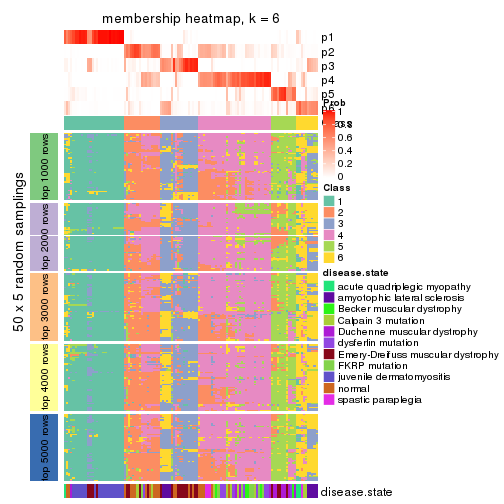</p>

</div>
</div>

As soon as we have had the classes for columns, we can look for signatures
which are significantly different between classes which can be candidate marks
for certain classes. Following are the heatmaps for signatures.


Signature heatmaps where rows are scaled:


<script>
$( function() {
	$( '#tabs-ATC-NMF-get-signatures' ).tabs();
} );
</script>
<div id='tabs-ATC-NMF-get-signatures'>
<ul>
<li><a href='#tab-ATC-NMF-get-signatures-1'>k = 2</a></li>
<li><a href='#tab-ATC-NMF-get-signatures-2'>k = 3</a></li>
<li><a href='#tab-ATC-NMF-get-signatures-3'>k = 4</a></li>
<li><a href='#tab-ATC-NMF-get-signatures-4'>k = 5</a></li>
<li><a href='#tab-ATC-NMF-get-signatures-5'>k = 6</a></li>
</ul>
<div id='tab-ATC-NMF-get-signatures-1'>
<pre><code class="r">get_signatures(res, k = 2)
</code></pre>

<p></p>

</div>
<div id='tab-ATC-NMF-get-signatures-2'>
<pre><code class="r">get_signatures(res, k = 3)
</code></pre>

<p></p>

</div>
<div id='tab-ATC-NMF-get-signatures-3'>
<pre><code class="r">get_signatures(res, k = 4)
</code></pre>

<p></p>

</div>
<div id='tab-ATC-NMF-get-signatures-4'>
<pre><code class="r">get_signatures(res, k = 5)
</code></pre>

<p></p>

</div>
<div id='tab-ATC-NMF-get-signatures-5'>
<pre><code class="r">get_signatures(res, k = 6)
</code></pre>

<p></p>

</div>
</div>


Signature heatmaps where rows are not scaled:


<script>
$( function() {
	$( '#tabs-ATC-NMF-get-signatures-no-scale' ).tabs();
} );
</script>
<div id='tabs-ATC-NMF-get-signatures-no-scale'>
<ul>
<li><a href='#tab-ATC-NMF-get-signatures-no-scale-1'>k = 2</a></li>
<li><a href='#tab-ATC-NMF-get-signatures-no-scale-2'>k = 3</a></li>
<li><a href='#tab-ATC-NMF-get-signatures-no-scale-3'>k = 4</a></li>
<li><a href='#tab-ATC-NMF-get-signatures-no-scale-4'>k = 5</a></li>
<li><a href='#tab-ATC-NMF-get-signatures-no-scale-5'>k = 6</a></li>
</ul>
<div id='tab-ATC-NMF-get-signatures-no-scale-1'>
<pre><code class="r">get_signatures(res, k = 2, scale_rows = FALSE)
</code></pre>

<p></p>

</div>
<div id='tab-ATC-NMF-get-signatures-no-scale-2'>
<pre><code class="r">get_signatures(res, k = 3, scale_rows = FALSE)
</code></pre>

<p></p>

</div>
<div id='tab-ATC-NMF-get-signatures-no-scale-3'>
<pre><code class="r">get_signatures(res, k = 4, scale_rows = FALSE)
</code></pre>

<p></p>

</div>
<div id='tab-ATC-NMF-get-signatures-no-scale-4'>
<pre><code class="r">get_signatures(res, k = 5, scale_rows = FALSE)
</code></pre>

<p></p>

</div>
<div id='tab-ATC-NMF-get-signatures-no-scale-5'>
<pre><code class="r">get_signatures(res, k = 6, scale_rows = FALSE)
</code></pre>

<p></p>

</div>
</div>


Compare the overlap of signatures from different k:

```r
compare_signatures(res)
```


`get_signature()` returns a data frame invisibly. TO get the list of signatures, the function
call should be assigned to a variable explicitly. In following code, if `plot` argument is set
to `FALSE`, no heatmap is plotted while only the differential analysis is performed.

```r
# code only for demonstration
tb = get_signature(res, k = ..., plot = FALSE)
```

An example of the output of `tb` is:

```
#>   which_row         fdr    mean_1    mean_2 scaled_mean_1 scaled_mean_2 km
#> 1        38 0.042760348  8.373488  9.131774    -0.5533452     0.5164555  1
#> 2        40 0.018707592  7.106213  8.469186    -0.6173731     0.5762149  1
#> 3        55 0.019134737 10.221463 11.207825    -0.6159697     0.5749050  1
#> 4        59 0.006059896  5.921854  7.869574    -0.6899429     0.6439467  1
#> 5        60 0.018055526  8.928898 10.211722    -0.6204761     0.5791110  1
#> 6        98 0.009384629 15.714769 14.887706     0.6635654    -0.6193277  2
...
```

The columns in `tb` are:

1. `which_row`: row indices corresponding to the input matrix.
2. `fdr`: FDR for the differential test. 
3. `mean_x`: The mean value in group x.
4. `scaled_mean_x`: The mean value in group x after rows are scaled.
5. `km`: Row groups if k-means clustering is applied to rows.


UMAP plot which shows how samples are separated.


<script>
$( function() {
	$( '#tabs-ATC-NMF-dimension-reduction' ).tabs();
} );
</script>
<div id='tabs-ATC-NMF-dimension-reduction'>
<ul>
<li><a href='#tab-ATC-NMF-dimension-reduction-1'>k = 2</a></li>
<li><a href='#tab-ATC-NMF-dimension-reduction-2'>k = 3</a></li>
<li><a href='#tab-ATC-NMF-dimension-reduction-3'>k = 4</a></li>
<li><a href='#tab-ATC-NMF-dimension-reduction-4'>k = 5</a></li>
<li><a href='#tab-ATC-NMF-dimension-reduction-5'>k = 6</a></li>
</ul>
<div id='tab-ATC-NMF-dimension-reduction-1'>
<pre><code class="r">dimension_reduction(res, k = 2, method = &quot;UMAP&quot;)
</code></pre>

<p>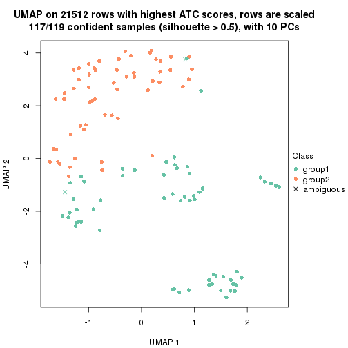</p>

</div>
<div id='tab-ATC-NMF-dimension-reduction-2'>
<pre><code class="r">dimension_reduction(res, k = 3, method = &quot;UMAP&quot;)
</code></pre>

<p></p>

</div>
<div id='tab-ATC-NMF-dimension-reduction-3'>
<pre><code class="r">dimension_reduction(res, k = 4, method = &quot;UMAP&quot;)
</code></pre>

<p></p>

</div>
<div id='tab-ATC-NMF-dimension-reduction-4'>
<pre><code class="r">dimension_reduction(res, k = 5, method = &quot;UMAP&quot;)
</code></pre>

<p></p>

</div>
<div id='tab-ATC-NMF-dimension-reduction-5'>
<pre><code class="r">dimension_reduction(res, k = 6, method = &quot;UMAP&quot;)
</code></pre>

<p></p>

</div>
</div>


Following heatmap shows how subgroups are split when increasing `k`:

```r
collect_classes(res)
```


Test correlation between subgroups and known annotations. If the known
annotation is numeric, one-way ANOVA test is applied, and if the known
annotation is discrete, chi-squared contingency table test is applied.

```r
test_to_known_factors(res)
```

```
#>           n disease.state(p) k
#> ATC:NMF 117         5.52e-10 2
#> ATC:NMF  96         9.72e-18 3
#> ATC:NMF 108         5.11e-22 4
#> ATC:NMF  75         5.24e-18 5
#> ATC:NMF  65         6.63e-13 6
```


If matrix rows can be associated to genes, consider to use `functional_enrichment(res,
...)` to perform function enrichment for the signature genes. See [this vignette](http://bioconductor.org/packages/devel/bioc/vignettes/cola/inst/doc/functional_enrichment.html) for more detailed explanations.


 

## Session info


```r
sessionInfo()
```

```
#> R version 3.6.0 (2019-04-26)
#> Platform: x86_64-pc-linux-gnu (64-bit)
#> Running under: CentOS Linux 7 (Core)
#> 
#> Matrix products: default
#> BLAS:   /usr/lib64/libblas.so.3.4.2
#> LAPACK: /usr/lib64/liblapack.so.3.4.2
#> 
#> locale:
#>  [1] LC_CTYPE=en_GB.UTF-8       LC_NUMERIC=C               LC_TIME=en_GB.UTF-8       
#>  [4] LC_COLLATE=en_GB.UTF-8     LC_MONETARY=en_GB.UTF-8    LC_MESSAGES=en_GB.UTF-8   
#>  [7] LC_PAPER=en_GB.UTF-8       LC_NAME=C                  LC_ADDRESS=C              
#> [10] LC_TELEPHONE=C             LC_MEASUREMENT=en_GB.UTF-8 LC_IDENTIFICATION=C       
#> 
#> attached base packages:
#> [1] grid      stats     graphics  grDevices utils     datasets  methods   base     
#> 
#> other attached packages:
#> [1] genefilter_1.66.0    ComplexHeatmap_2.3.1 markdown_1.1         knitr_1.26          
#> [5] GetoptLong_0.1.7     cola_1.3.2          
#> 
#> loaded via a namespace (and not attached):
#>  [1] circlize_0.4.8       shape_1.4.4          xfun_0.11            slam_0.1-46         
#>  [5] lattice_0.20-38      splines_3.6.0        colorspace_1.4-1     vctrs_0.2.0         
#>  [9] stats4_3.6.0         blob_1.2.0           XML_3.98-1.20        survival_2.44-1.1   
#> [13] rlang_0.4.2          pillar_1.4.2         DBI_1.0.0            BiocGenerics_0.30.0 
#> [17] bit64_0.9-7          RColorBrewer_1.1-2   matrixStats_0.55.0   stringr_1.4.0       
#> [21] GlobalOptions_0.1.1  evaluate_0.14        memoise_1.1.0        Biobase_2.44.0      
#> [25] IRanges_2.18.3       parallel_3.6.0       AnnotationDbi_1.46.1 highr_0.8           
#> [29] Rcpp_1.0.3           xtable_1.8-4         backports_1.1.5      S4Vectors_0.22.1    
#> [33] annotate_1.62.0      skmeans_0.2-11       bit_1.1-14           microbenchmark_1.4-7
#> [37] brew_1.0-6           impute_1.58.0        rjson_0.2.20         png_0.1-7           
#> [41] digest_0.6.23        stringi_1.4.3        polyclip_1.10-0      clue_0.3-57         
#> [45] tools_3.6.0          bitops_1.0-6         magrittr_1.5         eulerr_6.0.0        
#> [49] RCurl_1.95-4.12      RSQLite_2.1.4        tibble_2.1.3         cluster_2.1.0       
#> [53] crayon_1.3.4         pkgconfig_2.0.3      zeallot_0.1.0        Matrix_1.2-17       
#> [57] xml2_1.2.2           httr_1.4.1           R6_2.4.1             mclust_5.4.5        
#> [61] compiler_3.6.0
```


